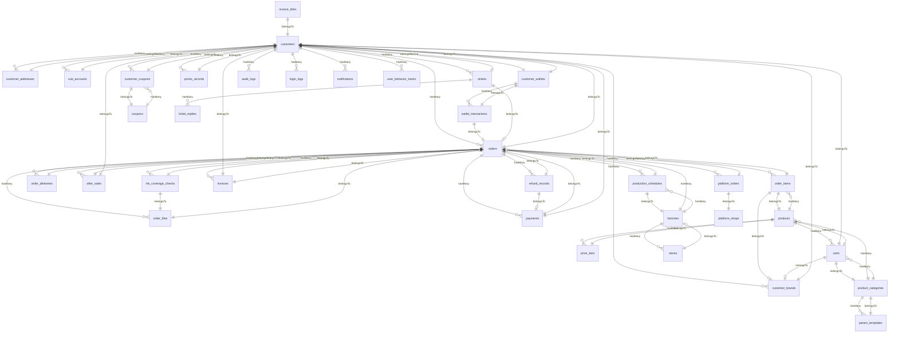

# 怡安印刷商城 — 数据库设计

> **所属文档**：系统设计方案 v2.9.0  
> **原章节**：第5章  
> **内容**：数据库拆分策略、全部表结构Migration、Eloquent模型关系、索引策略、数据归档  
> **读者**：DBA、后端开发工程师

---

# 5. 数据库架构设计

> **设计依据**：《怡安印刷商城-开发需求文档》v3.0  
> **技术栈**：PHP 8.5 + Laravel 13 + MySQL 8.0 + Redis 7.x  
> **核心原则**：基于 Laravel Eloquent ORM 与 Migration 重新设计，严禁套用 Java 式 DDL；单一数据库实例通过 Schema 分区与读写分离扩展，而非分库分表。

---

## 5.1 数据库拆分策略

### 5.1.1 整体架构：模块化单体 + 单一数据库实例

本系统采用**模块化单体架构**（Modular Monolith），数据库层对应采用**单一 MySQL 实例 + 逻辑 Schema 分区**策略。所有领域模块共享同一物理数据库，通过表前缀/Schema 命名空间实现逻辑隔离，既保证事务一致性，又为未来可能的水平拆分预留扩展点。

```
┌─────────────────────────────────────────────────────────────────┐
│                     Laravel Application                          │
│  ┌─────────┐ ┌─────────┐ ┌─────────┐ ┌─────────┐               │
│  │ User    │ │ Order   │ │ Product │ │ Pay     │  ...          │
│  │ Domain  │ │ Domain  │ │ Domain  │ │ Domain  │               │
│  └────┬────┘ └────┬────┘ └────┬────┘ └────┬────┘               │
│       │           │           │           │                     │
│       └───────────┴───────────┴───────────┘                     │
│                           │                                      │
│              ┌────────────┴────────────┐                        │
│              │   Eloquent ORM Layer    │                        │
│              │  (Models + Relations)   │                        │
│              └────────────┬────────────┘                        │
└───────────────────────────┼─────────────────────────────────────┘
                            │
┌───────────────────────────▼─────────────────────────────────────┐
│                     MySQL 8.0 单一实例                            │
│  ┌─────────────┐ ┌─────────────┐ ┌─────────────┐               │
│  │  yian_user  │ │ yian_order  │ │ yian_product│  (逻辑Schema)  │
│  │  用户/会员   │ │ 订单/物流    │ │ 商品/参数    │               │
│  └─────────────┘ └─────────────┘ └─────────────┘               │
│  ┌─────────────┐ ┌─────────────┐ ┌─────────────┐               │
│  │  yian_pay   │ │yian_platform│ │ yian_admin  │               │
│  │ 支付/退款    │ │ 电商代发     │ │ 审计/日志    │               │
│  └─────────────┘ └─────────────┘ └─────────────┘               │
└─────────────────────────────────────────────────────────────────┘
                            │
              ┌─────────────┴─────────────┐
              ▼                           ▼
        ┌──────────┐              ┌──────────┐
        │ 主库(写)  │  <--同步-->  │ 从库(读)  │
        │ Master   │              │ Replica  │
        └──────────┘              └──────────┘
```

### 5.1.2 Schema 分区规划

| Schema | 负责领域 | 核心表 |
|--------|---------|--------|
| `yian_user` | 客户、子账号、地址、品牌、认证 | `customers`, `sub_accounts`, `customer_addresses`, `customer_brands` |
| `yian_product` | 商品、分类、参数、价格 | `products`, `product_categories`, `param_templates`, `price_tiers` |
| `yian_order` | 订单、明细、物流、文件 | `orders`, `order_items`, `order_deliveries`, `order_files` |
| `yian_pay` | 支付、退款、钱包、积分 | `payments`, `refund_records`, `customer_wallets`, `wallet_transactions`, `points_records` |
| `yian_aftersale` | 售后、工单 | `after_sales`, `tickets` |
| `yian_platform` | 电商代发、门店、工厂 | `platform_orders`, `stores`, `factories` |
| `yian_marketing` | 优惠券、购物车 | `coupons`, `customer_coupons`, `carts` |
| `yian_content` | 新闻、Banner、FAQ、知识库 | `news`, `banners`, `help_faqs`, `knowledge_articles` |
| `yian_invoice` | 发票、发票抬头 | `invoices`, `invoice_titles` |
| `yian_audit` | 审计日志、登录日志、数据变更 | `audit_logs`, `login_logs`, `data_change_logs` |
| `yian_notify` | 通知、消息模板 | `notifications` |
| `yian_track` | 埋点、生产排期、墨量检测 | `user_behavior_tracks`, `production_schedules`, `ink_coverage_checks` |

> **实现方式**：Laravel 默认单库模式，通过表前缀 `yian_{domain}_` 实现逻辑隔离；Migration 文件按 `database/migrations/{domain}/` 子目录组织，通过 `artisan migrate --path` 分批执行。

### 5.1.3 读写分离配置（Laravel 原生）

Laravel 13 原生支持读写分离，无需额外中间件。在 `config/database.php` 中配置：

```php
<?php

return [
    'connections' => [
        'mysql' => [
            'driver' => 'mysql',
            'url' => env('DB_URL'),
            'host' => env('DB_HOST', '127.0.0.1'),
            'port' => env('DB_PORT', '3306'),
            'database' => env('DB_DATABASE', 'yian'),
            'username' => env('DB_USERNAME', 'root'),
            'password' => env('DB_PASSWORD', ''),
            'unix_socket' => env('DB_SOCKET', ''),
            'charset' => 'utf8mb4',
            'collation' => 'utf8mb4_unicode_ci',
            'prefix' => '',
            'prefix_indexes' => true,
            'strict' => true,
            'engine' => null,
            'options' => extension_loaded('pdo_mysql') ? array_filter([
                PDO::MYSQL_ATTR_SSL_CA => env('MYSQL_ATTR_SSL_CA'),
            ]) : [],

            // 读写分离配置
            'read' => [
                'host' => [
                    env('DB_READ_HOST_1', '127.0.0.1'),
                    env('DB_READ_HOST_2', '127.0.0.1'),
                ],
                'port' => env('DB_READ_PORT', 3306),
                'database' => env('DB_DATABASE', 'yian'),
                'username' => env('DB_READ_USERNAME', 'root'),
                'password' => env('DB_READ_PASSWORD', ''),
                'sticky' => true, // 写后读粘性，避免主从延迟导致数据不一致
            ],

            'write' => [
                'host' => [env('DB_WRITE_HOST', '127.0.0.1')],
                'port' => env('DB_WRITE_PORT', 3306),
                'database' => env('DB_DATABASE', 'yian'),
                'username' => env('DB_WRITE_USERNAME', 'root'),
                'password' => env('DB_WRITE_PASSWORD', ''),
            ],
        ],
    ],
];
```

**关键参数说明**：

| 参数 | 说明 |
|------|------|
| `read.host` | 只读从库地址数组，支持多从库负载均衡 |
| `write.host` | 写入主库地址 |
| `sticky` | **写后读粘性**：同一请求内发生写操作后，后续读操作自动路由到主库，避免主从同步延迟导致读取旧数据 |
| `options` | PDO 扩展选项，生产环境需配置 SSL |

**在 Eloquent 中显式控制读写**：

```php
<?php

use Illuminate\Support\Facades\DB;

// 强制使用写连接（主库）
$order = DB::connection('mysql::write')->table('orders')->find(1);

// 强制使用读连接（从库）
$orders = DB::connection('mysql::read')->table('orders')->paginate(20);

// Eloquent 自动路由：查询走从库，写入/事务走主库
$orders = Order::where('customer_id', 1001)->get(); // 读 -> 从库
$order->update(['status' => OrderStatus::AUDITED]); // 写 -> 主库
```

### 5.1.4 水平扩展：按时间维度拆表（订单历史表）

订单表为数据量最大、增长最快的核心表。当单表数据量超过 5000 万行时，采用**按时间维度拆分为独立表**（如 `orders_2024`、`orders_2025` 等），由应用层根据 `created_at` 路由到对应表，而非 MySQL 分区或分库分表。

> **不采用 MySQL RANGE 分区的原因**：MySQL 要求唯一索引必须包含分区键。`order_no` 为业务唯一键，若强制分区需改为 `UNIQUE(order_no, created_at)`，将改变业务唯一性语义，故放弃分区方案。

```php
<?php

use Illuminate\Database\Migrations\Migration;
use Illuminate\Database\Schema\Blueprint;
use Illuminate\Support\Facades\Schema;

```php
// 完整定义见第5章 5.2.2 订单表 Migration
```

**拆表与归档策略**：
- 按年份创建独立表（`orders_2024`、`orders_2025` 等），应用层根据 `created_at` 路由写入目标表
- 超过 2 年的已完成订单自动迁移至 `orders_archive_{year}` 归档表
- 归档操作通过 Laravel Schedule 每日凌晨执行，使用 `INSERT INTO ... SELECT` + `DELETE` 批量处理
- 归档表使用 MyISAM 引擎（只读查询，节省空间），原表保持 InnoDB

---

## 5.2 核心表设计

> 以下每表均包含：Laravel Migration 代码、Eloquent Model 定义（含 `$casts` 与关系方法）、索引策略说明。  
> 字段命名严格遵循 PRD v3.0（驼峰/下划线混合字段按 PRD 原始命名保留）。  
> 所有金额字段使用 `DECIMAL` 类型，严禁使用 `FLOAT`/`DOUBLE`。  
> 敏感字段（手机号、地址）使用 Laravel Encrypter 加密存储。

---

### 5.2.1 客户表 (customers)

#### Migration

```php
<?php

use Illuminate\Database\Migrations\Migration;
use Illuminate\Database\Schema\Blueprint;
use Illuminate\Support\Facades\Schema;

return new class extends Migration
{
    public function up(): void
    {
        Schema::create('customers', function (Blueprint $table) {
            $table->id()->comment('客户主键');
            $table->string('customer_code', 32)->unique()->comment('客户编码 CUS+年月日+序号');
            $table->string('name', 128)->nullable()->comment('企业名称（加密存储）');
            $table->string('customer_name', 128)->nullable()->comment('客户显示名称');
            $table->string('link_person', 64)->nullable()->comment('联系人（加密存储）');
            $table->string('mobile_phone', 64)->nullable()->comment('手机号（加密存储）');

            // 认证与VIP
            $table->tinyInteger('auth_status')->default(0)->comment('认证状态(kM): 0未提交 1待审核 2通过 3不通过 4驳回 20代认证通过');
            $table->boolean('auth_enabled')->default(true)->comment('认证是否启用');
            $table->tinyInteger('auth_picture_type')->default(1)->comment('认证图片类型: 1营业执照 2经营许可证');
            $table->tinyInteger('vip_level')->default(0)->comment('VIP等级 0~8');
            $table->integer('grow_value')->default(0)->comment('成长值');
            $table->timestamp('pay_vip_end_time')->nullable()->comment('VIP到期时间');
            $table->timestamp('signed_time')->nullable()->comment('签约时间');
            $table->timestamp('lv_coupon_latest_time')->nullable()->comment('最近领券时间');

            // 客户画像
            $table->tinyInteger('customer_type')->default(3)->comment('客户类型: 3普通 4电商 5合伙人 6海外 7跨境 8内部');
            $table->tinyInteger('user_role_type')->default(0)->comment('用户角色类型');
            $table->unsignedBigInteger('sign')->default(0)->comment('位掩码: 新人礼包/签协议/重点客户等15个位');
            $table->tinyInteger('status')->default(1)->comment('账号状态: 1正常 0禁用');
            $table->tinyInteger('shop_status')->default(1)->comment('店铺状态: 1营业 0停业');

            // 分组与归属
            $table->string('customer_group', 64)->nullable()->comment('客户分组');
            $table->foreignId('group_customer_id')->nullable()->constrained('customers')->comment('所属集团客户ID');
            $table->tinyInteger('factory_code')->nullable()->comment('归属工厂代码(dM): 0永城 1成都 6天水 7天津');

            // 业务标志
            $table->boolean('is_cloud_warehouse')->default(false)->comment('是否云仓客户');
            $table->boolean('is_agent_delivery')->default(false)->comment('是否代送货');
            $table->boolean('is_pay_at_once')->default(false)->comment('是否立即支付');
            $table->boolean('is_force_full_deposit')->default(false)->comment('是否强制全款');
            $table->boolean('is_apply_invoice')->default(false)->comment('是否可申请发票');
            $table->boolean('is_custom_packaging')->default(false)->comment('是否定制包装');

            // 定制包装
            $table->string('packaging_file_path', 500)->nullable()->comment('定制包装设计稿路径');

            // 地址信息
            $table->string('detail_address', 256)->nullable()->comment('详细地址');
            $table->string('province_name', 32)->nullable()->comment('省份');
            $table->string('city_name', 32)->nullable()->comment('城市');
            $table->string('county_name', 32)->nullable()->comment('区县');
            $table->timestamp('addr_irreg_opt_time')->nullable()->comment('地址不规范操作时间');

            // 财务
            $table->decimal('credit', 15, 2)->default(0)->comment('信用额度/账期额度');
            $table->integer('order_notify_sum')->default(0)->comment('订单通知数量');
            $table->boolean('allow_multiple_invoice_title')->default(false)->comment('是否允许多个发票抬头');

            // 社交账号
            $table->json('qq_accounts')->nullable()->comment('绑定QQ账号列表');
            $table->string('sub_mobile_phone', 64)->nullable()->comment('子手机号（预留）');
            $table->boolean('is_yunying')->default(false)->comment('运营组标识');
            $table->string('picture', 500)->nullable()->comment('头像URL');
            $table->json('pictures')->nullable()->comment('多张图片URL数组');

            // 扩展JSON字段
            $table->json('ext_attrs')->nullable()->comment('扩展属性');

            $table->timestamps();

            // 索引策略
            $table->index('mobile_phone', 'idx_mobile_phone');
            $table->index('auth_status', 'idx_auth_status');
            $table->index('vip_level', 'idx_vip_level');
            $table->index('customer_type', 'idx_customer_type');
            $table->index('factory_code', 'idx_factory_code');
            $table->index('status', 'idx_status');
            $table->index(['sign', 'status'], 'idx_sign_status');
        });
    }

    public function down(): void
    {
        Schema::dropIfExists('customers');
    }
};
```

#### Eloquent Model

```php
<?php

namespace App\Models;

use App\Enums\AuthStatus;
use App\Enums\CustomerType;
use Illuminate\Database\Eloquent\Factories\HasFactory;
use Illuminate\Database\Eloquent\Model;
use Illuminate\Database\Eloquent\Relations\HasMany;
use Illuminate\Database\Eloquent\Relations\HasOne;
use Illuminate\Database\Eloquent\Relations\BelongsTo;
use Illuminate\Database\Eloquent\SoftDeletes;

class Customer extends Model
{
    use HasFactory, SoftDeletes;

    protected $table = 'customers';

    protected $fillable = [
        'customer_code', 'name', 'customer_name', 'link_person', 'mobile_phone',
        'auth_status', 'auth_enabled', 'auth_picture_type', 'vip_level', 'grow_value',
        'pay_vip_end_time', 'signed_time', 'lv_coupon_latest_time',
        'customer_type', 'user_role_type', 'sign', 'status', 'shop_status',
        'customer_group', 'group_customer_id', 'factory_code',
        'is_cloud_warehouse', 'is_agent_delivery', 'is_pay_at_once',
        'is_force_full_deposit', 'is_apply_invoice', 'is_custom_packaging',
        'packaging_file_path', 'detail_address', 'province_name', 'city_name', 'county_name',
        'addr_irreg_opt_time', 'credit', 'order_notify_sum', 'allow_multiple_invoice_title',
        'qq_accounts', 'sub_mobile_phone', 'is_yunying', 'picture', 'pictures', 'ext_attrs',
    ];

    protected $casts = [
        'auth_status' => AuthStatus::class,
        'customer_type' => CustomerType::class,
        'auth_enabled' => 'boolean',
        'is_cloud_warehouse' => 'boolean',
        'is_agent_delivery' => 'boolean',
        'is_pay_at_once' => 'boolean',
        'is_force_full_deposit' => 'boolean',
        'is_apply_invoice' => 'boolean',
        'is_custom_packaging' => 'boolean',
        'is_yunying' => 'boolean',
        'allow_multiple_invoice_title' => 'boolean',
        'sign' => 'integer',
        'vip_level' => 'integer',
        'grow_value' => 'integer',
        'credit' => MoneyCast::class,
        'pay_vip_end_time' => 'datetime',
        'signed_time' => 'datetime',
        'lv_coupon_latest_time' => 'datetime',
        'addr_irreg_opt_time' => 'datetime',
        'qq_accounts' => 'array',
        'pictures' => 'array',
        'ext_attrs' => 'array',
    ];

    // auth_status 变更时联动维护 is_apply_invoice
    protected static function booted(): void
    {
        static::saving(function (Customer $customer) {
            if ($customer->isDirty('auth_status')) {
                $newStatus = $customer->auth_status;
                if (in_array($newStatus?->value, [2, 20], true)) {
                    // APPROVED(2) 或 PROXY_APPROVED(20)
                    $customer->is_apply_invoice = true;
                } elseif (in_array($newStatus?->value, [0, 3, 4], true)) {
                    // NOT_SUBMITTED(0) / REJECTED(3) / DISMISSED(4)
                    $customer->is_apply_invoice = false;
                }
            }
        });
    }

    // -- 关系定义 --

    public function addresses(): HasMany
    {
        return $this->hasMany(CustomerAddress::class, 'customer_id');
    }

    public function subAccounts(): HasMany
    {
        return $this->hasMany(SubAccount::class, 'parent_id');
    }

    public function brands(): HasMany
    {
        return $this->hasMany(CustomerBrand::class, 'customer_id');
    }

    public function wallet(): HasOne
    {
        return $this->hasOne(CustomerWallet::class, 'customer_id');
    }

    public function orders(): HasMany
    {
        return $this->hasMany(Order::class, 'customer_id');
    }

    public function groupCustomer(): BelongsTo
    {
        return $this->belongsTo(self::class, 'group_customer_id');
    }

    // -- 位掩码操作 --

    public function hasSignFlag(int $flag): bool
    {
        return ($this->sign & $flag) !== 0;
    }

    public function addSignFlag(int $flag): void
    {
        $this->update(['sign' => $this->sign | $flag]);
    }

    public function removeSignFlag(int $flag): void
    {
        $this->update(['sign' => $this->sign & ~$flag]);
    }

    // -- 加密访问器 --

    protected function name(): Attribute
    {
        return Attribute::make(
            get: fn (?string $value) => $value ? decrypt($value) : null,
            set: fn (?string $value) => $value ? encrypt($value) : null,
        );
    }

    protected function linkPerson(): Attribute
    {
        return Attribute::make(
            get: fn (?string $value) => $value ? decrypt($value) : null,
            set: fn (?string $value) => $value ? encrypt($value) : null,
        );
    }

    protected function mobilePhone(): Attribute
    {
        return Attribute::make(
            get: fn (?string $value) => $value ? decrypt($value) : null,
            set: fn (?string $value) => $value ? encrypt($value) : null,
        );
    }
}
```

#### 索引策略说明

| 索引名 | 字段 | 类型 | 用途 |
|--------|------|------|------|
| `PRIMARY` | `id` | 主键 | 客户唯一标识 |
| `idx_customer_code` | `customer_code` | UNIQUE | 客户编码唯一 |
| `idx_mobile_phone` | `mobile_phone` | 普通 | 手机号查询（登录、找回密码） |
| `idx_auth_status` | `auth_status` | 普通 | 按认证状态筛选 |
| `idx_vip_level` | `vip_level` | 普通 | VIP等级统计、批量发券 |
| `idx_customer_type` | `customer_type` | 普通 | 客户类型分组查询 |
| `idx_factory_code` | `factory_code` | 普通 | 按归属工厂筛选 |
| `idx_status` | `status` | 普通 | 账号状态筛选 |
| `idx_sign_status` | `sign`, `status` | 复合 | 位掩码标签+状态联合查询 |

> **特殊字段说明**：
> - `sign`：位掩码字段，15个业务标签位（已领取新人礼包、已签协议、线下重点客户等），通过模型方法 `hasSignFlag()`/`addSignFlag()` 操作，避免数据库函数索引开销。
> - `name`/`link_person`/`mobile_phone`：使用 Laravel `encrypt()`/`decrypt()` 加密存储，通过 Eloquent Accessor/Mutator 自动加解密，业务代码无感知。
> - `group_customer_id`：自引用外键，支持集团客户层级关系。

---

### 5.2.2 订单表 (orders) -- 双状态系统核心设计

#### Migration

```php
<?php

use Illuminate\Database\Migrations\Migration;
use Illuminate\Database\Schema\Blueprint;
use Illuminate\Support\Facades\Schema;

return new class extends Migration
{
    public function up(): void
    {
        Schema::create('orders', function (Blueprint $table) {
            $table->id()->comment('订单主键');
            $table->string('order_no', 32)->unique()->comment('订单编号，对应PRD orderSN');
            $table->foreignId('customer_id')->constrained('customers')->comment('客户ID');

            // 双状态系统（核心设计）
            $table->tinyInteger('status')->default(1)->comment('内部生产状态(FM): 0已取消 1已登记 3已审核 11已下单 ... 69已完成');
            $table->tinyInteger('out_status_name')->default(1)->comment('客户展示状态(nM): 0已取消 1待付款 3生产中 4已发货 ... 9已完成');
            $table->tinyInteger('original_status')->nullable()->comment('退款/售后前的原始状态');
            $table->tinyInteger('audit_status')->default(1)->comment('审核状态(kM): 0不审核 1待审核 2审核通过 3审核不通过 4需补充材料');

            // 订单属性
            $table->tinyInteger('order_type')->default(1)->comment('订单类型: 1普通 2样品(已废弃，使用sample_orders独立表) 3云仓 4账期');
            $table->string('name', 256)->nullable()->comment('订单名称');
            $table->string('outer_name', 256)->nullable()->comment('外部订单名称/客户自定义名称');
            $table->string('cp_summary', 512)->nullable()->comment('产品规格摘要');
            $table->string('remark', 500)->nullable()->comment('订单备注');
            $table->foreignId('cd_category_id')->nullable()->constrained('product_categories')->comment('品类ID');
            $table->string('parent_category', 64)->nullable()->comment('父品类');
            $table->string('category', 64)->nullable()->comment('品类');

            // 金额体系
            $table->decimal('product_sum', 12, 2)->default(0)->comment('商品金额');
            $table->decimal('express_sum', 12, 2)->default(0)->comment('运费');
            $table->decimal('packaging_sum', 12, 2)->default(0)->comment('包装费');
            $table->decimal('discount_sum', 12, 2)->default(0)->comment('优惠金额');
            $table->decimal('deposit_sum', 12, 2)->default(0)->comment('定金金额');
            $table->decimal('received_sum', 12, 2)->default(0)->comment('已收金额');
            $table->decimal('sum', 12, 2)->default(0)->comment('订单总金额');
            $table->decimal('total_original_price', 12, 2)->default(0)->comment('原价总额');
            $table->decimal('total_price', 12, 2)->default(0)->comment('实付总额');
            $table->decimal('arrears_sum', 12, 2)->default(0)->comment('欠款金额');

            // 业务标记
            $table->unsignedBigInteger('order_sign')->default(0)->comment('位掩码(LM): 新单/补单/大订单/不售后/一键翻单等26个位');
            $table->integer('modify_status')->default(0)->comment('修改状态(IM位掩码): 0默认 2文件待定稿 8产品待修改 ... 128已确认');
            $table->integer('modify_count')->default(0)->comment('修改申请次数（上限3次）');
            $table->integer('payment_sign')->default(0)->comment('支付标记位掩码');
            $table->boolean('is_agent')->default(false)->comment('是否代理订单');
            $table->string('express_tag', 32)->nullable()->comment('快递标签/优先级标记');

            // 来源与配送
            $table->tinyInteger('source')->default(0)->comment('订单来源(WM): 0官网 1小程序 2报价网站');
            $table->string('origin', 32)->nullable()->comment('来源标识');
            $table->integer('create_source')->default(0)->comment('创建来源(lM位掩码): 1在线设计 2自定义材料 ...');
            $table->tinyInteger('delivery_type')->default(1)->comment('配送方式(iM): 0专线 1快递 2云仓 3自提');
            $table->tinyInteger('order_delivery_type')->default(1)->comment('订单配送方式（冗余字段）');
            $table->string('order_delivery_type_name', 32)->nullable()->comment('配送方式名称');
            $table->tinyInteger('factory_code')->nullable()->comment('生产工厂代码(dM)');
            $table->string('company_code', 32)->nullable()->comment('公司代码');
            $table->string('payment_code', 32)->nullable()->comment('支付码');

            // 物流信息
            $table->string('express_company', 64)->nullable()->comment('快递公司');
            $table->string('express_number', 64)->nullable()->comment('快递单号');
            $table->tinyInteger('express_status_name')->nullable()->comment('物流状态: 0待揽收 1已揽收 2运输中 3派送中 4已签收 5异常 6已退回');

            // 收货信息
            $table->string('contact_person', 64)->nullable()->comment('联系人');
            $table->string('contact_phone', 64)->nullable()->comment('联系电话');
            $table->string('detail_address', 256)->nullable()->comment('详细地址');
            $table->string('province_name', 32)->nullable()->comment('省份');
            $table->string('city_name', 32)->nullable()->comment('城市');
            $table->string('county_name', 32)->nullable()->comment('区县');

            // 生产信息
            $table->timestamp('make_time')->nullable()->comment('生产开始时间');
            $table->timestamp('delivery_time')->nullable()->comment('预计配送时间');
            $table->timestamp('deadline_time')->nullable()->comment('截稿时间');
            $table->timestamp('out_time')->nullable()->comment('出库时间');

            // 商品统计
            $table->integer('product_total_count')->default(0)->comment('商品总数量');
            $table->decimal('weight', 10, 2)->default(0)->comment('订单总重量(g)');

            // 关联信息
            $table->string('taobao_sn', 64)->nullable()->comment('淘宝订单号');
            $table->string('taobao_seller_nick', 64)->nullable()->comment('淘宝卖家昵称');
            $table->tinyInteger('press_type')->nullable()->comment('印刷类型');
            $table->string('press_type_name', 32)->nullable()->comment('印刷类型名称');
            $table->tinyInteger('subcontract_type')->nullable()->comment('分包类型');
            $table->boolean('is_bat_pay')->default(false)->comment('是否批量支付');

            // 时间轴
            $table->timestamp('paid_at')->nullable()->comment('支付时间');
            $table->timestamp('produced_at')->nullable()->comment('生产完成时间');
            $table->timestamp('shipped_at')->nullable()->comment('发货时间');
            $table->timestamp('completed_at')->nullable()->comment('完成时间');

            // 定金阶段（FR-ORDER-035~038）：使用 un_paid_deposit 字段统一判断定金阶段
            $table->decimal('deposit_amount', 12, 2)->default(0)->comment('定金金额');
            $table->decimal('balance_amount', 12, 2)->default(0)->comment('尾款金额');

            // 修改流程（FR-ORDER-040~043）
            $table->text('modify_content')->nullable()->comment('修改内容');
            $table->timestamp('modify_applied_at')->nullable()->comment('修改申请时间');
            $table->timestamp('modify_confirmed_at')->nullable()->comment('修改确认时间');

            // 退款流程（FR-ORDER-031~033）
            $table->tinyInteger('refund_status')->default(0)->comment('退款状态: 0无/1申请中/2审核中/3已退款/4已拒绝');
            $table->decimal('refund_amount', 12, 2)->default(0)->comment('退款金额');
            $table->string('refund_reason', 255)->nullable()->comment('退款原因');
            $table->tinyInteger('original_status_before_refund')->nullable()->comment('退款前原始主状态');

            // 取消与收货（FR-ORDER-014/021/029）
            $table->timestamp('cancelled_at')->nullable()->comment('订单取消时间');
            $table->boolean('is_auto_confirmed')->default(false)->comment('是否自动确认收货');

            $table->timestamps();
            $table->softDeletes();

            // 索引策略
            $table->index('customer_id', 'idx_customer_id');
            $table->index('status', 'idx_status');
            $table->index('out_status_name', 'idx_out_status');
            $table->index('created_at', 'idx_created_at');
            $table->index('order_type', 'idx_order_type');
            $table->index('factory_code', 'idx_factory_code');
            $table->index('express_number', 'idx_express_number');

            // 关键复合索引
            $table->index(['customer_id', 'status', 'created_at'], 'idx_customer_status_created');
            $table->index(['status', 'created_at'], 'idx_status_created');
            $table->index(['factory_code', 'status', 'created_at'], 'idx_factory_status_created');
            $table->index(['order_sign', 'status'], 'idx_order_sign_status');
        });
    }

    public function down(): void
    {
        Schema::dropIfExists('orders');
    }
};
```

#### 客户展示状态枚举 (OrderOutStatus)

```php
<?php

namespace App\Enums;

enum OrderOutStatus: int
{
    case CANCELLED = 0;          // 已取消
    case PENDING_PAYMENT = 1;    // 待付款
    case IN_PRODUCTION = 3;      // 生产中
    case SHIPPED = 4;            // 已发货
    case PENDING_MODIFY = 5;     // 待修改
    case PENDING_PRODUCTION = 6; // 待生产
    case PENDING_SHIP = 7;       // 待发货
    case IN_DELIVERY = 8;        // 配送中
    case COMPLETED = 9;          // 已完成
}
```

> 注：nM 枚举值跳过了 `2`（不存在"待审核"状态），与 PRD v3.0 值域 `0/1/3/4/5/6/7/8/9` 严格对齐。

#### AuditStatus（订单审核状态枚举）[补全]

```php
<?php

declare(strict_types=1);

namespace App\Enums;

enum AuditStatus: int
{
    case PENDING  = 0;  // 待审核
    case PASSED   = 1;  // 审核通过
    case REJECTED = 2;  // 审核驳回

    public function label(): string
    {
        return match ($this) {
            self::PENDING  => '待审核',
            self::PASSED   => '审核通过',
            self::REJECTED => '审核驳回',
        };
    }
}
```

#### Eloquent Model
#### 索引策略说明

| 索引名 | 字段 | 类型 | 用途 |
|--------|------|------|------|
| `PRIMARY` | `id` | 主键 | 订单唯一标识 |
| `idx_order_no` | `order_no` | UNIQUE | 订单号唯一查询 |
| `idx_customer_status_created` | `customer_id`, `status`, `created_at` | 复合 | **客户订单列表查询（覆盖95%场景）** |
| `idx_status_created` | `status`, `created_at` | 复合 | **后台订单管理查询** |
| `idx_factory_status_created` | `factory_code`, `status`, `created_at` | 复合 | **生产排期查询** |
| `idx_order_sign_status` | `order_sign`, `status` | 复合 | 位掩码筛选+状态 |
| `idx_customer_id` | `customer_id` | 普通 | 外键索引 |
| `idx_status` | `status` | 普通 | FM状态筛选 |
| `idx_out_status` | `out_status_name` | 普通 | nM状态筛选 |
| `idx_express_number` | `express_number` | 普通 | 快递单号查询 |

> **关键设计说明**：
> - `status` 与 `out_status_name` 双状态系统：`status` 存储内部生产流程状态（FM 枚举），`out_status_name` 存储客户展示状态（nM 枚举）。两者严禁混用，由 OrderObserver 在状态变更时自动同步映射。
> - `order_sign` 位掩码：26 个业务标志位（新单/补单/大订单/不售后/一键翻单/多地发货等），用单个 `BIGINT` 存储。位运算查询时利用 `idx_order_sign_status` 复合索引加速。
> - `modify_status` 位掩码：支持组合状态，如 `43 = 32+8+2+1 = 已暂停`。
> - `create_source` 位掩码：支持多个来源同时标记（如在线设计+自定义材料=3）。
> - `deleted_at`：软删除，用于订单"取消"后的历史保留，而非物理删除。

---

### 5.2.3 订单明细表 (order_items)

#### Migration

```php
<?php

use Illuminate\Database\Migrations\Migration;
use Illuminate\Database\Schema\Blueprint;
use Illuminate\Support\Facades\Schema;

return new class extends Migration
{
    public function up(): void
    {
        Schema::create('order_items', function (Blueprint $table) {
            $table->id()->comment('订单明细主键');
            $table->foreignId('order_id')->constrained('orders')->comment('订单ID');
            $table->foreignId('product_id')->constrained('products')->comment('商品ID');
            $table->string('product_name', 128)->nullable()->comment('商品名称（快照）');
            $table->integer('quantity')->default(1)->comment('数量');
            $table->decimal('unit_price', 12, 2)->default(0)->comment('单价');
            $table->decimal('subtotal', 12, 2)->default(0)->comment('小计');
            $table->string('cp_summary', 500)->nullable()->comment('参数摘要');
            $table->json('param_snapshot')->nullable()->comment('参数选择快照（下单时锁定）');
            $table->json('file_ids')->nullable()->comment('关联文件ID列表');
            $table->foreignId('brand_id')->nullable()->constrained('customer_brands')->comment('关联品牌ID');
            $table->string('remark', 255)->nullable()->comment('备注');
            $table->timestamps();

            $table->index('order_id', 'idx_order_id');
            $table->index('product_id', 'idx_product_id');
            $table->index(['order_id', 'product_id'], 'idx_order_product');
        });
    }

    public function down(): void
    {
        Schema::dropIfExists('order_items');
    }
};
```

#### Eloquent Model

```php
<?php

namespace App\Models;

use Illuminate\Database\Eloquent\Factories\HasFactory;
use Illuminate\Database\Eloquent\Model;
use Illuminate\Database\Eloquent\Relations\BelongsTo;

class OrderItem extends Model
{
    use HasFactory;

    protected $table = 'order_items';

    protected $fillable = [
        'order_id', 'product_id', 'product_name', 'quantity', 'unit_price',
        'subtotal', 'cp_summary', 'param_snapshot', 'file_ids', 'brand_id', 'remark',
    ];

    protected $casts = [
        'quantity' => 'integer',
        'unit_price' => MoneyCast::class,
        'subtotal' => MoneyCast::class,
        'param_snapshot' => 'array',
        'file_ids' => 'array',
    ];

    public function order(): BelongsTo
    {
        return $this->belongsTo(Order::class, 'order_id');
    }

    public function product(): BelongsTo
    {
        return $this->belongsTo(Product::class, 'product_id');
    }

    public function brand(): BelongsTo
    {
        return $this->belongsTo(CustomerBrand::class, 'brand_id');
    }
}
```

---

### 5.2.4 支付流水表 (payments)

#### Migration

```php
<?php

use Illuminate\Database\Migrations\Migration;
use Illuminate\Database\Schema\Blueprint;
use Illuminate\Support\Facades\Schema;

return new class extends Migration
{
    public function up(): void
    {
        Schema::create('payments', function (Blueprint $table) {
            $table->id()->comment('支付流水主键');
            $table->foreignId('customer_id')->nullable()->constrained('customers')->comment('客户ID');
            $table->foreignId('order_id')->nullable()->constrained('orders')->comment('订单ID');
            $table->tinyInteger('pay_type')->comment('支付类型(PX): 1扫码 3余额 8转账');
            $table->tinyInteger('business_type')->default(1)->comment('业务类型(NX): 1订单支付 2订单支付退款 3订单变更补款 4订单变更退款 5钱包充值 6钱包提现 7现金红包充值 8现金红包退款');
            $table->decimal('amount', 12, 2)->default(0)->comment('支付金额');
            $table->tinyInteger('status')->default(0)->comment('状态: 0待支付 1支付中 2成功 3失败 4关闭');
            $table->string('transaction_no', 128)->nullable()->comment('第三方支付流水号，对应PRD transactionId');
            $table->boolean('batch_pay')->default(false)->comment('是否批量支付');
            $table->string('batch_transaction_no', 64)->nullable()->index()->comment('批量支付批次号，多笔订单共用');
            $table->timestamp('paid_at')->nullable()->comment('支付完成时间');
            $table->timestamps();

            // 索引策略
            $table->index(['order_id', 'business_type'], 'idx_order_business');
            $table->index('transaction_no', 'idx_transaction_no');
            $table->index('status', 'idx_status');
            $table->index('customer_id', 'idx_customer_id');
            $table->index('created_at', 'idx_created_at');
        });
    }

    public function down(): void
    {
        Schema::dropIfExists('payments');
    }
};
```

#### Eloquent Model

```php
<?php

namespace App\Models;

use App\Enums\PayType;
use App\Enums\BusinessType;
use App\Enums\PaymentStatus;
use Illuminate\Database\Eloquent\Factories\HasFactory;
use Illuminate\Database\Eloquent\Model;
use Illuminate\Database\Eloquent\Relations\BelongsTo;
use Illuminate\Database\Eloquent\Relations\HasMany;

class Payment extends Model
{
    use HasFactory;

    protected $table = 'payments';

    protected $fillable = [
        'customer_id', 'order_id', 'pay_type', 'business_type', 'amount',
        'status', 'transaction_no', 'batch_pay', 'batch_transaction_no', 'paid_at',
    ];

    protected $casts = [
        'pay_type' => PayType::class,
        'business_type' => BusinessType::class,
        'status' => PaymentStatus::class,
        'amount' => MoneyCast::class,
        'batch_pay' => 'boolean',
        'paid_at' => 'datetime',
    ];

    public function customer(): BelongsTo
    {
        return $this->belongsTo(Customer::class, 'customer_id');
    }

    public function order(): BelongsTo
    {
        return $this->belongsTo(Order::class, 'order_id');
    }

    public function refundRecords(): HasMany
    {
        return $this->hasMany(RefundRecord::class, 'payment_id');
    }
}
```

#### 5.2.4-A 线下退款工单表 (offline_refund_tickets)

对公转账退款不支持自动原路退回，需通过线下退款工单由财务人工处理。

##### Migration

```php
<?php

use Illuminate\Database\Migrations\Migration;
use Illuminate\Database\Schema\Blueprint;
use Illuminate\Support\Facades\Schema;

return new class extends Migration
{
    public function up(): void
    {
        Schema::create('offline_refund_tickets', function (Blueprint $table) {
            $table->id();
            $table->string('ticket_no', 32)->unique()->comment('工单编号');
            $table->foreignId('payment_id')->constrained('payments')->comment('关联支付流水');
            $table->foreignId('order_id')->constrained('orders')->comment('关联订单');
            $table->decimal('refund_amount', 12, 2)->comment('退款金额');
            $table->string('customer_bank_account', 50)->nullable()->comment('客户原付款银行账号');
            $table->string('customer_bank_name', 50)->nullable()->comment('客户原付款银行名称');
            $table->string('status', 20)->default('pending_review')->comment('状态: pending_review待审核/rejected已拒绝/transferred已转账/confirmed已确认');
            $table->foreignId('operator_id')->nullable()->constrained('users')->comment('审核操作人');
            $table->json('transfer_proof')->nullable()->comment('转账凭证图片/流水号');
            $table->timestamp('transferred_at')->nullable()->comment('转账时间');
            $table->timestamps();

            $table->index('status', 'idx_status');
            $table->index('payment_id', 'idx_payment_id');
        });
    }

    public function down(): void
    {
        Schema::dropIfExists('offline_refund_tickets');
    }
};
```

#### 5.2.4-B 群组支付表 (group_payments)

> **依据**：PRD FR-PAY-009/010 分享群组支付功能。支持将一笔订单金额按人均摊或自定义比例分摊给多个支付人。

##### Migration

```php
<?php

use Illuminate\Database\Migrations\Migration;
use Illuminate\Database\Schema\Blueprint;
use Illuminate\Support\Facades\Schema;

return new class extends Migration
{
    public function up(): void
    {
        Schema::create('group_payments', function (Blueprint $table) {
            $table->id();
            $table->foreignId('order_id')->constrained('orders')->comment('关联主订单');
            $table->foreignId('creator_user_id')->constrained('customers')->comment('发起者客户ID');
            $table->decimal('total_amount', 12, 2)->comment('订单总金额');
            $table->string('share_link_token', 64)->unique()->comment('分享链接Token');
            $table->timestamp('share_link_expired_at')->comment('链接有效期');
            $table->string('status', 20)->default('pending')->comment('状态: pending待支付/partial_paid部分支付/paid已付清/expired已过期/cancelled已取消');
            $table->string('share_password', 16)->nullable()->comment('分享链接密码（可选）');
            $table->timestamps();

            $table->index('order_id', 'idx_order_id');
            $table->index('share_link_token', 'idx_share_token');
            $table->index('status', 'idx_status');
        });
    }

    public function down(): void
    {
        Schema::dropIfExists('group_payments');
    }
};
```

##### Eloquent Model

```php
<?php

namespace App\Models;

use Illuminate\Database\Eloquent\Model;
use Illuminate\Database\Eloquent\Relations\BelongsTo;
use Illuminate\Database\Eloquent\Relations\HasMany;

class GroupPayment extends Model
{
    protected $fillable = [
        'order_id', 'creator_user_id', 'total_amount', 'share_link_token',
        'share_link_expired_at', 'status', 'share_password',
    ];

    protected $casts = [
        'total_amount' => 'decimal:2',
        'share_link_expired_at' => 'datetime',
    ];

    public function order(): BelongsTo
    {
        return $this->belongsTo(Order::class);
    }

    public function creator(): BelongsTo
    {
        return $this->belongsTo(Customer::class, 'creator_user_id');
    }

    public function members(): HasMany
    {
        return $this->hasMany(GroupPaymentMember::class);
    }
}
```

#### 5.2.4-C 群组成员支付记录表 (group_payment_members)

##### Migration

```php
<?php

use Illuminate\Database\Migrations\Migration;
use Illuminate\Database\Schema\Blueprint;
use Illuminate\Support\Facades\Schema;

return new class extends Migration
{
    public function up(): void
    {
        Schema::create('group_payment_members', function (Blueprint $table) {
            $table->id();
            $table->foreignId('group_payment_id')->constrained('group_payments')->comment('关联群组支付');
            $table->foreignId('user_id')->nullable()->constrained('customers')->comment('参与用户（NULL表示匿名/未注册）');
            $table->decimal('share_amount', 12, 2)->comment('分摊金额');
            $table->decimal('paid_amount', 12, 2)->default(0)->comment('已支付金额（支持超额支付）');
            $table->foreignId('payment_id')->nullable()->constrained('payments')->comment('关联payments表支付流水');
            $table->string('status', 20)->default('pending')->comment('状态: pending待支付/paid已支付/refunded已退款');
            $table->string('guest_phone', 20)->nullable()->comment('匿名用户手机号');
            $table->timestamps();

            $table->index('group_payment_id', 'idx_group_payment_id');
            $table->index('user_id', 'idx_user_id');
            $table->index('status', 'idx_status');
        });
    }

    public function down(): void
    {
        Schema::dropIfExists('group_payment_members');
    }
};
```

##### Eloquent Model

```php
<?php

namespace App\Models;

use Illuminate\Database\Eloquent\Model;
use Illuminate\Database\Eloquent\Relations\BelongsTo;

class GroupPaymentMember extends Model
{
    protected $fillable = [
        'group_payment_id', 'user_id', 'share_amount', 'paid_amount',
        'payment_id', 'status', 'guest_phone',
    ];

    protected $casts = [
        'share_amount' => 'decimal:2',
        'paid_amount' => 'decimal:2',
    ];

    public function groupPayment(): BelongsTo
    {
        return $this->belongsTo(GroupPayment::class);
    }

    public function user(): BelongsTo
    {
        return $this->belongsTo(Customer::class, 'user_id');
    }

    public function payment(): BelongsTo
    {
        return $this->belongsTo(Payment::class);
    }
}
```

#### 索引策略说明

| 索引名 | 字段 | 类型 | 用途 |
|--------|------|------|------|
| `PRIMARY` | `id` | 主键 | 流水唯一标识 |
| `idx_order_business` | `order_id`, `business_type` | 复合 | 订单支付/退款分类查询 |
| `idx_transaction_no` | `transaction_no` | UNIQUE | 第三方流水号幂等校验 |
| `idx_status` | `status` | 普通 | 支付状态筛选 |
| `idx_customer_id` | `customer_id` | 普通 | 客户流水查询 |
| `idx_created_at` | `created_at` | 普通 | 时间范围对账 |

> **特殊字段说明**：
> - `pay_type`（PX 枚举）：`1=Barcode`（扫码支付）、`3=Wallet`（余额支付）、`8=Offline`（对公转账）。v3.0 已修正原 PRD 颠倒错误。
> - `business_type`（NX 枚举）：区分订单支付、退款、变更补款、钱包充值等 8 种业务场景。
> - `transaction_no`：第三方支付平台返回的流水号，加唯一索引保证幂等性。

---

### 5.2.5 售后表 (after_sales) -- 三套状态码隔离设计

#### Migration

```php
<?php

use Illuminate\Database\Migrations\Migration;
use Illuminate\Database\Schema\Blueprint;
use Illuminate\Support\Facades\Schema;

return new class extends Migration
{
    public function up(): void
    {
        Schema::create('after_sales', function (Blueprint $table) {
            $table->id()->comment('售后单主键');
            $table->string('after_sale_sn', 32)->unique()->comment('售后单号（对外展示）');
            $table->foreignId('order_id')->constrained('orders')->comment('订单ID');
            $table->string('order_sn', 32)->comment('订单编号（冗余，便于售后列表展示）');
            $table->foreignId('customer_id')->constrained('customers')->comment('客户ID');

            // 售后类型与原因
            $table->tinyInteger('type')->default(0)->comment('售后类型: 0退货退款 1补印 2优惠货款 3其他');
            $table->tinyInteger('reason')->default(0)->comment('售后原因: 0下错单 1印刷问题 2裁切问题 ... 10少货');
            $table->string('reason_desc', 512)->nullable()->comment('原因详细描述');

            // EM 售后单据状态（独立状态空间，严禁与 FM/nM 混用）
            $table->string('status', 16)->default('submitted')->comment('售后状态(EM): submitted/processing/completed/suspended/revoked/cancelled');

            // AF 售后流程子状态（独立状态空间，非 FM 子集）
            $table->tinyInteger('process_flow_status')->nullable()->comment('售后流程状态(AF): 100待退货 101已退货');

            // 金额与退款（统一为bigInteger分，与6.40节保持一致）
            $table->bigInteger('refund_amount')->default(0)->comment('退款金额（单位：分）');
            $table->tinyInteger('refund_method')->default(0)->comment('退款方式: 0无 1原路退回 2余额 3银行转账 4现金红包');

            // 凭证图片（最多9张）
            $table->json('evidence_urls')->nullable()->comment('凭证图片URL数组');

            // 退货物流信息
            $table->string('return_express_company', 64)->nullable()->comment('退货快递公司');
            $table->string('return_express_number', 64)->nullable()->comment('退货快递单号');
            $table->timestamp('return_submit_time')->nullable()->comment('退货物流提交时间');

            // 运营审核字段（补充文件已定义，主SDD缺失）
            $table->foreignId('auditor_id')->nullable()->comment('审核人ID（管理员）');
            $table->timestamp('audited_at')->nullable()->comment('审核时间');
            $table->string('audit_remark', 512)->nullable()->comment('审核备注');
            $table->string('reject_reason', 512)->nullable()->comment('驳回原因');

            // 仓库验收字段（补充文件已定义，主SDD缺失）
            $table->foreignId('warehouse_checker_id')->nullable()->comment('仓库验收人ID');
            $table->timestamp('warehouse_received_at')->nullable()->comment('仓库验收时间');
            $table->string('warehouse_remark', 512)->nullable()->comment('仓库验收备注');

            // 时间戳与关闭控制字段（补充文件已定义，主SDD缺失）
            $table->timestamp('completed_at')->nullable()->comment('售后完成时间');
            $table->timestamp('closed_at')->nullable()->comment('售后关闭时间');
            $table->string('close_reason', 128)->nullable()->comment('关闭原因：auto_return_timeout/auto_confirm_timeout/customer_cancel/admin_cancel');
            $table->timestamps();

            // 索引策略（7个索引，与补充文件保持一致）
            $table->index('after_sale_sn', 'idx_after_sale_sn');
            $table->index('order_id', 'idx_order_id');
            $table->index('customer_id', 'idx_customer_id');
            $table->index('status', 'idx_status');
            $table->index(['type', 'status'], 'idx_type_status');
            $table->index('created_at', 'idx_created_at');
            $table->index(['status', 'closed_at'], 'idx_status_closed');
        });
    }

    public function down(): void
    {
        Schema::dropIfExists('after_sales');
    }
};
```

#### Eloquent Model

```php
<?php

declare(strict_types=1);

namespace App\Domains\AfterSale\Models;

use App\Domains\Common\Castables\MoneyCast;
use App\Enums\AfterSaleFlowStatus;
use App\Enums\AfterSaleReason;
use App\Enums\AfterSaleStatus;
use App\Enums\AfterSaleType;
use App\Enums\RefundMethod;
use App\Exceptions\InvalidStateTransitionException;
use App\Models\Customer;
use App\Models\Order;
use Illuminate\Database\Eloquent\Factories\HasFactory;
use Illuminate\Database\Eloquent\Model;
use Illuminate\Database\Eloquent\Relations\BelongsTo;
use Illuminate\Database\Eloquent\Relations\HasMany;
use Illuminate\Support\Str;

class AfterSale extends Model
{
    use HasFactory;

    protected $table = 'after_sales';

    protected $fillable = [
        'after_sale_sn', 'order_id', 'order_sn', 'customer_id',
        'type', 'reason', 'reason_desc',
        'status', 'process_flow_status', 'refund_amount', 'refund_method',
        'evidence_urls', 'return_express_company', 'return_express_number', 'return_submit_time',
        'auditor_id', 'audited_at', 'audit_remark', 'reject_reason',
        'warehouse_checker_id', 'warehouse_received_at', 'warehouse_remark',
        'completed_at', 'closed_at', 'close_reason',
    ];

    protected $casts = [
        'status'                => AfterSaleStatus::class,
        'type'                  => AfterSaleType::class,
        'reason'                => AfterSaleReason::class,
        'process_flow_status'   => AfterSaleFlowStatus::class,
        'refund_method'         => RefundMethod::class,
        'refund_amount'         => MoneyCast::class,
        'evidence_urls'         => 'array',
        'return_submit_time'    => 'datetime',
        'audited_at'            => 'datetime',
        'warehouse_received_at' => 'datetime',
        'completed_at'          => 'datetime',
        'closed_at'             => 'datetime',
    ];

    protected static function boot(): void
    {
        parent::boot();

        static::creating(function (self $model) {
            if (empty($model->after_sale_sn)) {
                $model->after_sale_sn = 'AS' . now()->format('YmdHis') . strtoupper(Str::random(6));
            }
        });
    }

    public function order(): BelongsTo
    {
        return $this->belongsTo(Order::class, 'order_id');
    }

    public function customer(): BelongsTo
    {
        return $this->belongsTo(Customer::class, 'customer_id');
    }

    public function items(): HasMany
    {
        return $this->hasMany(AfterSaleItem::class, 'after_sale_id');
    }

    public function messages(): HasMany
    {
        return $this->hasMany(AfterSaleMessage::class, 'after_sale_id');
    }

    public function logs(): HasMany
    {
        return $this->hasMany(AfterSaleLog::class, 'after_sale_id');
    }

    public function ratings(): HasMany
    {
        return $this->hasMany(AfterSaleRating::class, 'after_sale_id');
    }

    public function transitionTo(AfterSaleStatus $target, string $remark = ''): void
    {
        $current = $this->status;

        if (! $current->canTransitionTo($target)) {
            throw new InvalidStateTransitionException(
                "售后单 {$this->after_sale_sn} 不允许从 {$current->label()} 流转到 {$target->label()}"
            );
        }

        $previous = $current;
        $this->update([
            'status' => $target,
            'completed_at' => $target === AfterSaleStatus::COMPLETED ? now() : $this->completed_at,
            'closed_at' => $target->isTerminal() && $this->closed_at === null ? now() : $this->closed_at,
        ]);

        event(new \App\Domains\AfterSale\Events\AfterSaleStatusChanged($this, $previous, $target, $remark));
    }

    public function transitionFlowTo(AfterSaleFlowStatus $target): void
    {
        $current = $this->process_flow_status;

        if ($current !== null && ! $current->canTransitionTo($target)) {
            throw new InvalidStateTransitionException(
                "售后单 {$this->after_sale_sn} 流程状态不允许从 {$current->label()} 流转到 {$target->label()}"
            );
        }

        $this->update(['process_flow_status' => $target]);
    }

    public function scopeOfCustomer($query, int $customerId)
    {
        return $query->where('customer_id', $customerId);
    }

    public function scopePending($query)
    {
        return $query->whereIn('status', [
            AfterSaleStatus::SUBMITTED->value,
            AfterSaleStatus::PROCESSING->value,
            AfterSaleStatus::SUSPENDED->value,
        ]);
    }

    public function scopeTerminal($query)
    {
        return $query->whereIn('status', [
            AfterSaleStatus::COMPLETED->value,
            AfterSaleStatus::CANCELLED->value,
        ]);
    }

    public function scopeOverdueReturn($query, int $days = 15)
    {
        return $query->where('type', AfterSaleType::RETURN_REFUND->value)
            ->where('status', AfterSaleStatus::PROCESSING->value)
            ->where('process_flow_status', AfterSaleFlowStatus::PENDING_RETURN->value)
            ->whereNull('return_submit_time')
            ->where('audited_at', '<', now()->subDays($days));
    }

    public function customerStatus(): string
    {
        if ($this->status === AfterSaleStatus::CANCELLED && $this->close_reason === 'admin_reject') {
            return 'rejected';
        }

        return $this->status->toCustomerStatus($this->process_flow_status, $this->type);
    }

    public function isClosed(): bool
    {
        return $this->status->isTerminal();
    }

    public function canBeRevokedByCustomer(): bool
    {
        return in_array($this->status, [
            AfterSaleStatus::SUBMITTED,
            AfterSaleStatus::SUSPENDED,
        ], true);
    }
}
```

#### 索引策略说明

| 索引名 | 字段 | 类型 | 用途 |
|--------|------|------|------|
| `PRIMARY` | `id` | 主键 | 售后单唯一标识 |
| `idx_order_id` | `order_id` | 普通 | 订单售后查询 |
| `idx_customer_id` | `customer_id` | 普通 | 客户售后列表 |
| `idx_status` | `status` | 普通 | EM状态筛选 |
| `idx_type_status` | `type`, `status` | 复合 | 售后类型+状态联合查询 |

> **关键设计说明**：
> - **三套状态码严格隔离**：
>   - `status` -> **EM 枚举**（售后单据自身生命周期：已提交/处理中/已完成/已挂起/已撤销/已取消）
>   - `process_flow_status` -> **AF 枚举**（售后内部流程子状态：待退货/已退货）
>   - 客户侧展示状态 -> 由前端根据 `EM + AF + 售后类型` 组合映射得出，**不存储于数据库**
> - `after_sales.status` 与 `orders.status` 使用完全不同的状态空间，严禁在代码或 SQL 中将两者混为一谈。

#### after_sale_ratings 表 Migration

```php
<?php

use Illuminate\Database\Migrations\Migration;
use Illuminate\Database\Schema\Blueprint;
use Illuminate\Support\Facades\Schema;

return new class extends Migration
{
    public function up(): void
    {
        Schema::create('after_sale_ratings', function (Blueprint $table) {
            $table->id()->comment('评价主键');
            $table->foreignId('after_sale_id')->constrained('after_sales')->comment('售后单ID');
            $table->foreignId('customer_id')->constrained('customers')->comment('客户ID');
            $table->foreignId('order_id')->constrained('orders')->comment('订单ID（冗余，便于统计）');

            // 满意度评价
            $table->tinyInteger('satisfaction')->comment('满意度星级：1-5星');
            $table->text('comment')->nullable()->comment('评价文字内容');
            $table->json('tags')->nullable()->comment('评价标签数组（如：处理快、态度好、问题解决）');

            // 匿名与展示控制
            $table->boolean('is_anonymous')->default(false)->comment('是否匿名评价');
            $table->boolean('is_displayed')->default(true)->comment('是否前台展示');

            $table->timestamps();

            // 索引
            $table->unique('after_sale_id', 'uniq_after_sale_id'); // 每个售后单限评一次
            $table->index('customer_id', 'idx_customer_id');
            $table->index('order_id', 'idx_order_id');
            $table->index('satisfaction', 'idx_satisfaction');
            $table->index('created_at', 'idx_created_at');
        });
    }

    public function down(): void
    {
        Schema::dropIfExists('after_sale_ratings');
    }
};
```

---

### 5.2.6 客户地址表 (customer_addresses) -- 加密存储

#### Migration

```php
<?php

use Illuminate\Database\Migrations\Migration;
use Illuminate\Database\Schema\Blueprint;
use Illuminate\Support\Facades\Schema;

return new class extends Migration
{
    public function up(): void
    {
        Schema::create('customer_addresses', function (Blueprint $table) {
            $table->id()->comment('地址主键');
            $table->foreignId('customer_id')->constrained('customers')->comment('客户ID');
            $table->string('customer_name', 128)->nullable()->comment('客户名称（加密）');
            $table->string('link_person', 64)->nullable()->comment('联系人（加密）');
            $table->string('mobile_phone', 64)->nullable()->comment('手机号（加密）');

            // 地址字段（PRD v3.0 命名：provinceName/cityName/countyName/detailAddress）
            $table->string('province_name', 32)->nullable()->comment('省份（加密存储）');
            $table->string('city_name', 32)->nullable()->comment('城市（加密存储）');
            $table->string('county_name', 32)->nullable()->comment('区县（加密存储）');
            $table->string('detail_address', 256)->nullable()->comment('详细地址（加密存储）');

            // 地址补充字段
            $table->string('zip_code', 16)->nullable()->comment('邮编（加密存储）');
            $table->string('tel_phone', 64)->nullable()->comment('固定电话（加密存储）');
            $table->string('address_tag', 32)->nullable()->comment('地址标签：公司/家/学校等');

            // 地址类型
            $table->tinyInteger('type')->default(0)->comment('地址类型: 0=收货地址 1=发票地址 2=退货地址');
            $table->boolean('is_default')->default(false)->comment('是否默认（按type独立）');

            $table->timestamps();

            $table->index('customer_id', 'idx_customer_id');
            $table->index(['customer_id', 'type'], 'idx_customer_type');
            $table->index(['customer_id', 'is_default'], 'idx_customer_default');
        });
    }

    public function down(): void
    {
        Schema::dropIfExists('customer_addresses');
    }
};
```

#### Eloquent Model

```php
<?php

namespace App\Models;

use App\Enums\AddressType;
use Illuminate\Database\Eloquent\Factories\HasFactory;
use Illuminate\Database\Eloquent\Model;
use Illuminate\Database\Eloquent\Relations\BelongsTo;

class CustomerAddress extends Model
{
    use HasFactory;

    protected $table = 'customer_addresses';

    protected $fillable = [
        'customer_id', 'customer_name', 'link_person', 'mobile_phone',
        'province_name', 'city_name', 'county_name', 'detail_address',
        'type', 'is_default',
    ];

    protected $casts = [
        'type' => AddressType::class,
        'is_default' => 'boolean',
    ];

    public function customer(): BelongsTo
    {
        return $this->belongsTo(Customer::class, 'customer_id');
    }

    // 加密访问器
    protected function linkPerson(): Attribute
    {
        return Attribute::make(
            get: fn (?string $value) => $value ? decrypt($value) : null,
            set: fn (?string $value) => $value ? encrypt($value) : null,
        );
    }

    protected function mobilePhone(): Attribute
    {
        return Attribute::make(
            get: fn (?string $value) => $value ? decrypt($value) : null,
            set: fn (?string $value) => $value ? encrypt($value) : null,
        );
    }

    protected function detailAddress(): Attribute
    {
        return Attribute::make(
            get: fn (?string $value) => $value ? decrypt($value) : null,
            set: fn (?string $value) => $value ? encrypt($value) : null,
        );
    }

    protected function provinceName(): Attribute
    {
        return Attribute::make(
            get: fn (?string $value) => $value ? decrypt($value) : null,
            set: fn (?string $value) => $value ? encrypt($value) : null,
        );
    }

    protected function cityName(): Attribute
    {
        return Attribute::make(
            get: fn (?string $value) => $value ? decrypt($value) : null,
            set: fn (?string $value) => $value ? encrypt($value) : null,
        );
    }

    protected function countyName(): Attribute
    {
        return Attribute::make(
            get: fn (?string $value) => $value ? decrypt($value) : null,
            set: fn (?string $value) => $value ? encrypt($value) : null,
        );
    }
}
```

> **字段名对齐 PRD v3.0**：`provinceName` -> `province_name`，`cityName` -> `city_name`，`countyName` -> `county_name`，`detailAddress` -> `detail_address`。  
> **加密字段**：`link_person`、`mobile_phone`、`province_name`、`city_name`、`county_name`、`detail_address` 共 6 个敏感字段通过 Eloquent Accessor/Mutator 自动加解密。

---

### 5.2.7 品牌/商标表 (customer_brands)

#### Migration

```php
<?php

use Illuminate\Database\Migrations\Migration;
use Illuminate\Database\Schema\Blueprint;
use Illuminate\Support\Facades\Schema;

return new class extends Migration
{
    public function up(): void
    {
        Schema::create('customer_brands', function (Blueprint $table) {
            $table->id()->comment('品牌主键');
            $table->foreignId('customer_id')->constrained('customers')->comment('客户ID');

            // 品牌信息
            $table->string('name', 128)->nullable()->comment('品牌名称');
            $table->tinyInteger('type')->nullable()->comment('品牌资质类型(gM): 0=商标注册证 1=营业执照 2=合同/授权证明 3=印刷委托书');
            $table->string('type_name', 32)->nullable()->comment('资质类型名称');

            // 品牌审核状态字段名为 status（非 verifyStatus）
            $table->tinyInteger('status')->default(0)->comment('品牌审核状态(vM): 0=待审核 1=已审核 2=已驳回');
            $table->string('status_name', 32)->nullable()->comment('状态名称');

            // 商标信息
            $table->string('trademark_reg_no', 64)->nullable()->comment('商标注册号');
            $table->tinyInteger('trademark_type')->default(1)->comment('商标类型: 1=文字 2=图形 3=组合');

            // 审核信息
            $table->string('entruster', 128)->nullable()->comment('委托人/商标持有人');
            $table->string('verify_person', 64)->nullable()->comment('审核人');
            $table->string('verify_reason', 256)->nullable()->comment('审核不通过原因（对应review_remark）');
            $table->timestamp('verify_time')->nullable()->comment('审核时间');

            // 有效期
            $table->date('end_valid_date')->nullable()->comment('证书到期日');
            $table->tinyInteger('valid_type')->default(1)->comment('有效期类型: 1=有效期 2=已过期');

            // 来源与附件
            $table->string('origin', 32)->nullable()->comment('来源: 官网/后台');
            $table->string('picture', 256)->nullable()->comment('资质图片URL');
            $table->json('pictures')->nullable()->comment('多图URL数组');
            $table->json('thumb_pictures')->nullable()->comment('缩略图URL数组');

            $table->foreignId('creator')->nullable()->constrained('users')->comment('创建人');
            $table->timestamp('creation_time')->useCurrent()->comment('创建时间');

            $table->timestamps();

            $table->index('customer_id', 'idx_customer_id');
            $table->index('status', 'idx_status');
            $table->index(['customer_id', 'status'], 'idx_customer_status');
        });
    }

    public function down(): void
    {
        Schema::dropIfExists('customer_brands');
    }
};
```

#### Eloquent Model

```php
<?php

namespace App\Models;

use App\Enums\BrandAuditStatus;
use App\Enums\BrandQualificationType;
use App\Enums\BrandValidType;
use Illuminate\Database\Eloquent\Factories\HasFactory;
use Illuminate\Database\Eloquent\Model;
use Illuminate\Database\Eloquent\Relations\BelongsTo;

class CustomerBrand extends Model
{
    use HasFactory;

    protected $table = 'customer_brands';

    protected $fillable = [
        'customer_id', 'name', 'type', 'type_name', 'status', 'status_name',
        'trademark_reg_no', 'trademark_type', 'entruster', 'verify_person',
        'verify_reason', 'verify_time', 'end_valid_date', 'valid_type',
        'origin', 'picture', 'pictures', 'thumb_pictures', 'creator', 'creation_time',
    ];

    protected $casts = [
        'status' => BrandAuditStatus::class,
        'type' => BrandQualificationType::class,
        'valid_type' => BrandValidType::class,
        'trademark_type' => 'integer',
        'end_valid_date' => 'date',
        'verify_time' => 'datetime',
        'creation_time' => 'datetime',
        'pictures' => 'array',
        'thumb_pictures' => 'array',
    ];

    public function customer(): BelongsTo
    {
        return $this->belongsTo(Customer::class, 'customer_id');
    }

    public function creatorUser(): BelongsTo
    {
        return $this->belongsTo(Customer::class, 'creator');
    }
}
```

> **重要区分**：`customer_brands.status`（品牌审核状态，vM 枚举）与 `customers.auth_status`（企业认证状态，kM 枚举）是完全独立的两个字段，编码含义完全不同，严禁混用。

---

### 5.2.8 发票记录表 (invoices) -- invoiceCategory + invoiceBusinessType 拆分

#### Migration

```php
<?php

use Illuminate\Database\Migrations\Migration;
use Illuminate\Database\Schema\Blueprint;
use Illuminate\Support\Facades\Schema;

return new class extends Migration
{
    public function up(): void
    {
        Schema::create('invoices', function (Blueprint $table) {
            $table->id()->comment('发票主键');
            $table->foreignId('customer_id')->constrained('customers')->comment('客户ID');
            $table->foreignId('order_id')->nullable()->constrained('orders')->comment('关联订单ID');

            // PRD v2.7 已将 invoiceType 拆分为 invoice_category + invoice_business_type
            $table->tinyInteger('title_type')->nullable()->comment('抬头类型: 1=企业 2=个人');
            $table->tinyInteger('invoice_category')->nullable()->comment('发票税务分类: 1=增值税普通发票 2=增值税专用发票');
            $table->tinyInteger('invoice_business_type')->default(0)->comment('发票业务类型: 0=未指定 1=正常发票 2=负数发票 3=全部红冲');

            // 抬头信息
            $table->string('company_name', 128)->nullable()->comment('企业名称');
            $table->string('tax_number', 32)->nullable()->comment('纳税人识别号');
            $table->string('register_address', 256)->nullable()->comment('注册地址（专票必填）');
            $table->string('register_phone', 32)->nullable()->comment('注册电话（专票必填）');
            $table->string('bank_name', 128)->nullable()->comment('开户银行（专票必填）');
            $table->string('bank_account', 64)->nullable()->comment('银行账号（专票必填）');

            // 金额与状态
            $table->decimal('amount', 12, 2)->nullable()->comment('开票金额');
            $table->tinyInteger('status')->default(1)->comment('发票状态: 0=已取消 1=已申请 2=已审核 3=已驳回 4=已开票 5=已打印快递单 6=已作废');

            $table->boolean('is_default')->default(false)->comment('是否默认抬头');

            // FIX-P0: 发票邮寄跟踪字段（FR-INV-014）
            $table->string('express_company', 64)->nullable()->comment('快递公司');
            $table->string('express_number', 64)->nullable()->comment('快递单号');
            $table->tinyInteger('express_status')->default(0)->comment('物流状态: 0未邮寄 1已揽收 2运输中 3已签收');
            $table->timestamp('mailed_at')->nullable()->comment('发票邮寄时间');
            $table->string('receiver_name', 64)->nullable()->comment('收件人姓名');
            $table->string('receiver_phone', 32)->nullable()->comment('收件人电话');

            // 邮寄地址关联（FR-INV-009）
            $table->foreignId('address_id')->nullable()->constrained('customer_addresses')->onDelete('set null')->comment('关联客户地址簿（type=1发票地址）');
            $table->index('address_id', 'idx_address_id');

            $table->timestamps();

            $table->index('customer_id', 'idx_customer_id');
            $table->index('order_id', 'idx_order_id');
            $table->index('status', 'idx_status');
            $table->index(['customer_id', 'status'], 'idx_customer_status');
        });
    }

    public function down(): void
    {
        Schema::dropIfExists('invoices');
    }
};
```

```php
<?php

// database/migrations/xxxx_xx_xx_create_invoice_red_records.php
use Illuminate\Database\Migrations\Migration;
use Illuminate\Database\Schema\Blueprint;
use Illuminate\Support\Facades\Schema;

return new class extends Migration {
    public function up(): void
    {
        Schema::create('invoice_red_records', function (Blueprint $table) {
            $table->id();
            $table->foreignId('original_invoice_id')->constrained('invoices')->onDelete('cascade')->comment('原发票ID');
            $table->foreignId('red_invoice_id')->nullable()->constrained('invoices')->onDelete('set null')->comment('红冲后负数发票ID');
            $table->tinyInteger('red_type')->comment('红冲类型: 1=部分红冲 2=全部红冲');
            $table->decimal('red_amount', 12, 2)->default(0)->comment('红冲金额');
            $table->string('reason', 255)->comment('红冲原因');
            $table->foreignId('operator_id')->nullable()->comment('操作人');
            $table->timestamps();

            $table->index('original_invoice_id');
            $table->index('red_invoice_id');
        });
    }

    public function down(): void
    {
        Schema::dropIfExists('invoice_red_records');
    }
};
```

> **字段拆分说明**：PRD v2.7 起废弃单字段 `invoiceType`，改为 `invoice_category`（税务分类：普票/专票）+ `invoice_business_type`（业务类型：正常/负数/红冲）双字段，禁止在代码中使用旧字段名。


---

### 5.2.9 发票抬头表 (invoice_titles)

#### Migration

```php
<?php

use Illuminate\Database\Migrations\Migration;
use Illuminate\Database\Schema\Blueprint;
use Illuminate\Support\Facades\Schema;

return new class extends Migration
{
    public function up(): void
    {
        Schema::create('invoice_titles', function (Blueprint $table) {
            $table->id()->comment('抬头主键');
            $table->foreignId('customer_id')->constrained('customers')->comment('客户ID');

            $table->tinyInteger('title_type')->default(1)->comment('抬头类型: 1=企业 2=个人（对应header_type）');
            $table->string('company_name', 128)->nullable()->comment('企业名称');
            $table->string('tax_number', 32)->nullable()->comment('纳税人识别号（对应tax_id）');
            $table->string('register_address', 256)->nullable()->comment('注册地址');
            $table->string('register_phone', 32)->nullable()->comment('注册电话');
            $table->string('bank_name', 128)->nullable()->comment('开户银行');
            $table->string('bank_account', 64)->nullable()->comment('银行账号');
            $table->string('email', 128)->nullable()->comment('电子发票接收邮箱');
            $table->boolean('is_default')->default(false)->comment('是否默认抬头');
            $table->tinyInteger('status')->default(1)->comment('状态: 1=启用 0=删除');

            $table->timestamps();

            $table->index('customer_id', 'idx_customer_id');
            $table->index(['customer_id', 'title_type'], 'idx_customer_title_type');
            $table->index('status', 'idx_status');
        });
    }

    public function down(): void
    {
        Schema::dropIfExists('invoice_titles');
    }
};
```

#### Eloquent Model

```php
<?php

namespace App\Models;

use Illuminate\Database\Eloquent\Factories\HasFactory;
use Illuminate\Database\Eloquent\Model;
use Illuminate\Database\Eloquent\Relations\BelongsTo;

class InvoiceTitle extends Model
{
    use HasFactory;

    protected $table = 'invoice_titles';

    protected $fillable = [
        'customer_id', 'title_type', 'company_name', 'tax_number',
        'register_address', 'register_phone', 'bank_name', 'bank_account',
        'email', 'is_default', 'status',
    ];

    protected $casts = [
        'title_type' => 'integer',
        'is_default' => 'boolean',
        'status' => 'integer',
    ];

    public function customer(): BelongsTo
    {
        return $this->belongsTo(Customer::class, 'customer_id');
    }
}
```

---

### 5.2.10 子账号表 (sub_accounts) -- sub_permission 位掩码

#### Migration

```php
<?php

use Illuminate\Database\Migrations\Migration;
use Illuminate\Database\Schema\Blueprint;
use Illuminate\Support\Facades\Schema;

return new class extends Migration
{
    public function up(): void
    {
        Schema::create('sub_accounts', function (Blueprint $table) {
            $table->id()->comment('子账号主键');
            $table->foreignId('parent_id')->constrained('customers')->comment('主账号ID（对应customer_id）');
            $table->string('username', 64)->comment('子账号用户名');
            $table->string('password_hash', 255)->nullable()->comment('密码哈希(bcrypt)');
            $table->string('link_person', 64)->nullable()->comment('联系人（对应real_name）');
            $table->string('mobile_phone', 64)->nullable()->comment('手机号（对应phone）');
            $table->string('email', 128)->nullable()->comment('邮箱');
            $table->string('role', 32)->nullable()->comment('角色标识');
            $table->integer('sub_permission')->default(0)->comment('权限位掩码(SM): 0=总账号 1=客服 2=设计 4=下单 8=售后 16=财务');
            $table->json('permissions_json')->nullable()->comment('权限JSON数组');
            $table->tinyInteger('status')->default(1)->comment('1=启用 0=禁用');
            $table->timestamps();
            $table->softDeletes()->comment('软删除时间');

            $table->index('parent_id', 'idx_parent_id');
            $table->index('status', 'idx_status');
            $table->index(['parent_id', 'status'], 'idx_parent_status');
            $table->index('deleted_at', 'idx_deleted_at');
        });
    }

    public function down(): void
    {
        Schema::dropIfExists('sub_accounts');
    }
};
```

#### SubAccountStatus（子账号状态枚举）[补全]

```php
<?php

declare(strict_types=1);

namespace App\Enums;

enum SubAccountStatus: int
{
    case INACTIVE = 0;  // 禁用
    case ACTIVE   = 1;  // 启用
    case FROZEN   = 2;  // 冻结

    public function label(): string
    {
        return match ($this) {
            self::INACTIVE => '禁用',
            self::ACTIVE   => '启用',
            self::FROZEN   => '冻结',
        };
    }
}
```

#### Eloquent Model

```php
<?php

namespace App\Models;

use App\Enums\SubAccountStatus;
use Illuminate\Database\Eloquent\Factories\HasFactory;
use Illuminate\Database\Eloquent\Model;
use Illuminate\Database\Eloquent\Relations\BelongsTo;
use Illuminate\Database\Eloquent\SoftDeletes;

class SubAccount extends Model
{
    use HasFactory, SoftDeletes;

    protected $table = 'sub_accounts';

    protected $fillable = [
        'parent_id', 'username', 'password_hash', 'link_person',
        'mobile_phone', 'email', 'role', 'sub_permission',
        'permissions_json', 'status',
    ];

    protected $casts = [
        'status' => SubAccountStatus::class,
        'sub_permission' => 'integer',
        'permissions_json' => 'array',
    ];

    protected $hidden = ['password_hash'];

    public function parent(): BelongsTo
    {
        return $this->belongsTo(Customer::class, 'parent_id');
    }

    // 位掩码权限判断
    public function hasPermission(int $flag): bool
    {
        // sub_permission = 0 为总账号，拥有全部权限
        if ($this->sub_permission === 0) {
            return true;
        }
        return ($this->sub_permission & $flag) !== 0;
    }

    public function isAdmin(): bool
    {
        return $this->sub_permission === 0;
    }
}
```

> **位掩码权限定义**：
> | 位值 | 权限名称 | 说明 |
> |:----:|---------|------|
> | `0` | 总账号 | 拥有全部权限 |
> | `1` | 客服 | 查看订单、处理售后 |
> | `2` | 设计 | 上传/修改文件 |
> | `4` | 下单 | 创建新订单、管理购物车 |
> | `8` | 售后 | 发起售后申请 |
> | `16` | 财务 | 查看账单、发票管理 |
> 
> 示例：`sub_permission = 5`（1+4）= 客服 + 下单权限。

---

### 5.2.11 客户钱包表 (customer_wallets)

#### Migration

```php
<?php

use Illuminate\Database\Migrations\Migration;
use Illuminate\Database\Schema\Blueprint;
use Illuminate\Support\Facades\Schema;

return new class extends Migration
{
    public function up(): void
    {
        Schema::create('customer_wallets', function (Blueprint $table) {
            $table->id()->comment('钱包主键');
            $table->foreignId('customer_id')->unique()->constrained('customers')->comment('客户ID');
            $table->decimal('balance', 15, 2)->default(0)->comment('余额');
            $table->decimal('frozen_amount', 15, 2)->default(0)->comment('冻结金额');
            $table->decimal('total_recharge', 15, 2)->default(0)->comment('累计充值');
            $table->decimal('total_consume', 15, 2)->default(0)->comment('累计消费');
            $table->tinyInteger('status')->default(1)->comment('1=正常 0=冻结');
            $table->unsignedBigInteger('version')->default(0)->comment('乐观锁版本号');
            $table->timestamps();

            $table->index('customer_id', 'idx_customer_id');
            $table->index('status', 'idx_status');
        });
    }

    public function down(): void
    {
        Schema::dropIfExists('customer_wallets');
    }
};
```

#### Eloquent Model

```php
<?php

namespace App\Models;

use Illuminate\Database\Eloquent\Factories\HasFactory;
use Illuminate\Database\Eloquent\Model;
use Illuminate\Database\Eloquent\Relations\BelongsTo;
use Illuminate\Database\Eloquent\Relations\HasMany;

class CustomerWallet extends Model
{
    use HasFactory;

    protected $table = 'customer_wallets';

    protected $fillable = [
        'customer_id', 'balance', 'frozen_amount', 'total_recharge',
        'total_consume', 'status', 'version',
    ];

    protected $casts = [
        'balance' => MoneyCast::class,
        'frozen_amount' => MoneyCast::class,
        'total_recharge' => MoneyCast::class,
        'total_consume' => MoneyCast::class,
        'status' => 'integer',
        'version' => 'integer',
    ];

    public function customer(): BelongsTo
    {
        return $this->belongsTo(Customer::class, 'customer_id');
    }

    public function transactions(): HasMany
    {
        return $this->hasMany(WalletTransaction::class, 'wallet_id');
    }

    // 可用余额 = 余额 - 冻结金额
    public function availableBalance(): string
    {
        return bcsub($this->balance, $this->frozen_amount, 2);
    }
}
```

> **乐观锁**：`version` 字段用于并发扣减余额时防止超扣。`lockForUpdate()` 为悲观锁（数据库行锁），与乐观锁是互斥的并发控制策略，不应混用。正确实现如下：
>
> ```php
> $affected = CustomerWallet::where('id', $id)
>     ->where('version', $currentVersion)
>     ->update([
>         'balance' => DB::raw("balance - {$amount}"),
>         'version' => DB::raw('version + 1'),
>     ]);
>
> if ($affected === 0) {
>     throw new ConcurrentUpdateException('余额扣减失败，请重试');
> }
> ```

---

### 5.2.12 钱包交易流水表 (wallet_transactions)

#### Migration

```php
<?php

use Illuminate\Database\Migrations\Migration;
use Illuminate\Database\Schema\Blueprint;
use Illuminate\Support\Facades\Schema;

return new class extends Migration
{
    public function up(): void
    {
        Schema::create('wallet_transactions', function (Blueprint $table) {
            $table->id()->comment('流水主键');
            $table->foreignId('wallet_id')->constrained('customer_wallets')->comment('钱包ID');
            $table->string('transaction_no', 32)->comment('交易流水号');
            $table->tinyInteger('transaction_type')->comment('交易类型: 1=充值 2=消费 3=退款 4=提现 5=冻结 6=解冻');
            $table->decimal('amount', 15, 2)->comment('变动金额(正为收入,负为支出)');
            $table->decimal('balance_after', 15, 2)->comment('变动后余额');
            $table->string('biz_no', 64)->comment('业务单号');
            $table->tinyInteger('biz_type')->comment('业务类型枚举');
            $table->foreignId('order_id')->nullable()->constrained('orders')->comment('关联订单ID');
            $table->foreignId('payment_id')->nullable()->constrained('payments')->comment('关联支付ID');
            $table->string('remark', 255)->nullable()->comment('备注');
            $table->timestamps();

            $table->unique(['biz_no', 'biz_type', 'transaction_type'], 'uk_biz_no_type');
            $table->index('wallet_id', 'idx_wallet_id');
            $table->index('order_id', 'idx_order_id');
            $table->index('created_at', 'idx_created_at');
            $table->index('transaction_no', 'idx_transaction_no');
        });
    }

    public function down(): void
    {
        Schema::dropIfExists('wallet_transactions');
    }
};
```

#### Eloquent Model

```php
<?php

namespace App\Models;

use App\Enums\WalletTransactionType;
use Illuminate\Database\Eloquent\Factories\HasFactory;
use Illuminate\Database\Eloquent\Model;
use Illuminate\Database\Eloquent\Relations\BelongsTo;

class WalletTransaction extends Model
{
    use HasFactory;

    protected $table = 'wallet_transactions';

    protected $fillable = [
        'wallet_id', 'transaction_no', 'transaction_type', 'amount',
        'balance_after', 'biz_no', 'biz_type', 'order_id', 'payment_id', 'remark',
    ];

    protected $casts = [
        'transaction_type' => WalletTransactionType::class,
        'amount' => MoneyCast::class,
        'balance_after' => MoneyCast::class,
        'biz_type' => 'integer',
    ];

    public function wallet(): BelongsTo
    {
        return $this->belongsTo(CustomerWallet::class, 'wallet_id');
    }

    public function order(): BelongsTo
    {
        return $this->belongsTo(Order::class, 'order_id');
    }

    public function payment(): BelongsTo
    {
        return $this->belongsTo(Payment::class, 'payment_id');
    }
}
```

---

### 5.2.13 积分记录表 (points_records)

#### Migration

```php
<?php

use Illuminate\Database\Migrations\Migration;
use Illuminate\Database\Schema\Blueprint;
use Illuminate\Support\Facades\Schema;

return new class extends Migration
{
    public function up(): void
    {
        Schema::create('points_records', function (Blueprint $table) {
            $table->id()->comment('积分记录主键');
            $table->foreignId('customer_id')->constrained('customers')->comment('客户ID');
            $table->tinyInteger('point_type')->comment('积分类型: 1=订单奖励 2=签到 3=活动 4=消费抵扣 5=兑换商品 6=过期扣除');
            $table->integer('points')->comment('积分变动(正为获取,负为消耗)');
            $table->integer('balance_after')->comment('变动后积分余额');
            $table->unsignedBigInteger('source_id')->nullable()->comment('来源ID(订单ID/活动ID等)');
            $table->string('source_type', 32)->nullable()->comment('来源类型:order/activity/signin');
            $table->timestamp('expire_at')->nullable()->comment('过期时间');
            $table->string('description', 255)->nullable()->comment('描述');
            $table->timestamps();

            $table->index('customer_id', 'idx_customer_id');
            $table->index('point_type', 'idx_point_type');
            $table->index('expire_at', 'idx_expire_at');
            $table->index('created_at', 'idx_created_at');
        });
    }

    public function down(): void
    {
        Schema::dropIfExists('points_records');
    }
};
```

#### Eloquent Model

```php
<?php

namespace App\Models;

use App\Enums\PointType;
use Illuminate\Database\Eloquent\Factories\HasFactory;
use Illuminate\Database\Eloquent\Model;
use Illuminate\Database\Eloquent\Relations\BelongsTo;

class PointsRecord extends Model
{
    use HasFactory;

    protected $table = 'points_records';

    protected $fillable = [
        'customer_id', 'point_type', 'points', 'balance_after',
        'source_id', 'source_type', 'expire_at', 'description',
    ];

    protected $casts = [
        'point_type' => PointType::class,
        'points' => 'integer',
        'balance_after' => 'integer',
        'expire_at' => 'datetime',
    ];

    public function customer(): BelongsTo
    {
        return $this->belongsTo(Customer::class, 'customer_id');
    }
}
```

---

### 5.2.14 优惠券表 (coupons)

> **说明**：以下为数据库概览，字段设计与业务逻辑详细定义参见 **6.43 优惠券与促销子系统设计**。

#### Migration

```php
<?php

use Illuminate\Database\Migrations\Migration;
use Illuminate\Database\Schema\Blueprint;
use Illuminate\Support\Facades\Schema;

return new class extends Migration
{
    public function up(): void
    {
        Schema::create('coupons', function (Blueprint $table) {
            $table->id()->comment('优惠券主键');
            $table->string('coupon_code', 32)->unique()->comment('优惠券码');
            $table->string('coupon_name', 128)->comment('优惠券名称');
            $table->tinyInteger('coupon_type')->comment('优惠券类型: 1=满减 2=折扣 3=免邮 4=直减');
            $table->decimal('discount_value', 10, 2)->comment('优惠值');
            $table->decimal('min_order_amount', 10, 2)->default(0)->comment('最低订单金额');
            $table->decimal('max_discount', 10, 2)->nullable()->comment('最大优惠金额');
            $table->tinyInteger('scope_type')->default(1)->comment('适用范围: 1=全平台 2=品类 3=商品');
            $table->json('scope_ids')->nullable()->comment('适用范围ID列表');
            $table->integer('total_quantity')->default(0)->comment('总发放量(0=不限)');
            $table->integer('used_quantity')->default(0)->comment('已使用量');
            $table->integer('per_customer_limit')->default(1)->comment('每人限领');
            $table->timestamp('valid_from')->comment('生效时间');
            $table->timestamp('valid_to')->comment('失效时间');
            $table->tinyInteger('status')->default(1)->comment('1=启用 0=禁用');
            $table->unsignedBigInteger('version')->default(0)->comment('乐观锁版本号（高并发领券）');
            $table->timestamps();

            $table->index('coupon_code', 'idx_coupon_code');
            $table->index(['valid_from', 'valid_to'], 'idx_valid_time');
            $table->index('status', 'idx_status');
            $table->index('created_at', 'idx_created_at');
        });
    }

    public function down(): void
    {
        Schema::dropIfExists('coupons');
    }
};
```

#### Eloquent Model

```php
<?php

namespace App\Models;

use App\Enums\CouponType;
use App\Enums\CouponScopeType;
use Illuminate\Database\Eloquent\Factories\HasFactory;
use Illuminate\Database\Eloquent\Model;
use Illuminate\Database\Eloquent\Relations\HasMany;

class Coupon extends Model
{
    use HasFactory;

    protected $table = 'coupons';

    protected $fillable = [
        'coupon_code', 'coupon_name', 'coupon_type', 'discount_value',
        'min_order_amount', 'max_discount', 'scope_type', 'scope_ids',
        'total_quantity', 'used_quantity', 'per_customer_limit',
        'valid_from', 'valid_to', 'status', 'version',
    ];

    protected $casts = [
        'coupon_type' => CouponType::class,
        'scope_type' => CouponScopeType::class,
        'discount_value' => MoneyCast::class,
        'min_order_amount' => MoneyCast::class,
        'max_discount' => MoneyCast::class,
        'total_quantity' => 'integer',
        'used_quantity' => 'integer',
        'per_customer_limit' => 'integer',
        'version' => 'integer',
        'valid_from' => 'datetime',
        'valid_to' => 'datetime',
        'scope_ids' => 'array',
    ];

    public function customerCoupons(): HasMany
    {
        return $this->hasMany(CustomerCoupon::class, 'coupon_id');
    }
}
```

---

### 5.2.15 客户优惠券领取记录表 (customer_coupons)

#### Migration

```php
<?php

use Illuminate\Database\Migrations\Migration;
use Illuminate\Database\Schema\Blueprint;
use Illuminate\Support\Facades\Schema;

return new class extends Migration
{
    public function up(): void
    {
        Schema::create('customer_coupons', function (Blueprint $table) {
            $table->id()->comment('主键');
            $table->foreignId('customer_id')->constrained('customers')->comment('客户ID');
            $table->foreignId('coupon_id')->constrained('coupons')->comment('优惠券ID');
            $table->tinyInteger('status')->default(1)->comment('1=未使用 2=已使用 3=已过期 4=已作废');
            $table->foreignId('used_order_id')->nullable()->constrained('orders')->comment('使用订单ID');
            $table->timestamp('used_at')->nullable()->comment('使用时间');
            $table->timestamp('received_at')->useCurrent()->comment('领取时间');
            $table->timestamp('expired_at')->comment('过期时间');
            $table->timestamps();

            $table->unique(['customer_id', 'coupon_id'], 'uk_customer_coupon');
            $table->index('status', 'idx_status');
            $table->index('expired_at', 'idx_expired_at');
            $table->index('customer_id', 'idx_customer_id');
        });
    }

    public function down(): void
    {
        Schema::dropIfExists('customer_coupons');
    }
};
```

#### Eloquent Model

```php
<?php

namespace App\Models;

use App\Enums\CustomerCouponStatus;
use Illuminate\Database\Eloquent\Factories\HasFactory;
use Illuminate\Database\Eloquent\Model;
use Illuminate\Database\Eloquent\Relations\BelongsTo;

class CustomerCoupon extends Model
{
    use HasFactory;

    protected $table = 'customer_coupons';

    protected $fillable = [
        'customer_id', 'coupon_id', 'status', 'used_order_id', 'used_at', 'expired_at',
    ];

    protected $casts = [
        'status' => CustomerCouponStatus::class,
        'used_at' => 'datetime',
        'expired_at' => 'datetime',
        'received_at' => 'datetime',
    ];

    public function customer(): BelongsTo
    {
        return $this->belongsTo(Customer::class, 'customer_id');
    }

    public function coupon(): BelongsTo
    {
        return $this->belongsTo(Coupon::class, 'coupon_id');
    }

    public function usedOrder(): BelongsTo
    {
        return $this->belongsTo(Order::class, 'used_order_id');
    }
}
```

> **高并发防超发**：`coupons.version` 乐观锁 + `customer_coupons` 唯一索引 `uk_customer_coupon` 双重兜底，配合 Redis 分布式锁实现领券接口的并发安全。

---

### 5.2.16 工单表 (tickets)

#### Migration

```php
<?php

use Illuminate\Database\Migrations\Migration;
use Illuminate\Database\Schema\Blueprint;
use Illuminate\Support\Facades\Schema;

return new class extends Migration
{
    public function up(): void
    {
        Schema::create('tickets', function (Blueprint $table) {
            $table->id()->comment('工单主键');
            $table->string('ticket_no', 32)->unique()->comment('工单编号');
            $table->foreignId('customer_id')->constrained('customers')->comment('客户ID');
            $table->foreignId('order_id')->nullable()->constrained('orders')->comment('关联订单ID');
            $table->tinyInteger('ticket_category')->comment('工单大类: 1=投诉 2=咨询 3=售后 4=建议');
            $table->tinyInteger('complaint_type')->nullable()->comment('投诉子分类: 1=服务质量 2=产品质量 3=物流问题 4=价格争议 5=其他');
            $table->tinyInteger('priority')->default(3)->comment('1=紧急 2=高 3=中 4=低');
            $table->tinyInteger('status')->default(0)->comment('工单状态(tM): 0=待分配 1=处理中 2=待复核 3=已解决 4=已关闭 5=已撤诉');
            $table->string('subject', 255)->comment('主题');
            $table->text('content')->nullable()->comment('内容');
            $table->json('attachments')->nullable()->comment('附件列表');
            $table->foreignId('assigned_to')->nullable()->constrained('users')->comment('处理人ID');
            $table->timestamp('assigned_at')->nullable()->comment('分配时间');
            $table->timestamp('resolved_at')->nullable()->comment('解决时间');
            $table->timestamp('closed_at')->nullable()->comment('关闭时间');
            $table->timestamp('sla_deadline')->nullable()->comment('SLA截止时间');
            $table->tinyInteger('satisfaction')->nullable()->comment('满意度:1~5');
            $table->tinyInteger('source')->default(1)->comment('1=PC 2=APP 3=电话 4=邮件');
            $table->timestamps();

            $table->index('customer_id', 'idx_customer_id');
            $table->index('status', 'idx_status');
            $table->index('assigned_to', 'idx_assigned_to');
            $table->index('order_id', 'idx_order_id');
            $table->index('sla_deadline', 'idx_sla_deadline');
            $table->index(['ticket_category', 'status'], 'idx_category_status');
        });
    }

    public function down(): void
    {
        Schema::dropIfExists('tickets');
    }
};
```

```php
<?php

declare(strict_types=1);

namespace App\Enums;

enum TicketCategory: int
{
    case ORDER     = 1;  // 订单问题
    case PAYMENT   = 2;  // 支付问题
    case PRODUCT   = 3;  // 商品问题
    case LOGISTICS = 4;  // 物流问题
    case ACCOUNT   = 5;  // 账号问题
    case OTHER     = 6;  // 其他

    public function label(): string
    {
        return match ($this) {
            self::ORDER     => '订单问题',
            self::PAYMENT   => '支付问题',
            self::PRODUCT   => '商品问题',
            self::LOGISTICS => '物流问题',
            self::ACCOUNT   => '账号问题',
            self::OTHER     => '其他',
        };
    }
}
```

#### Eloquent Model

```php
<?php

namespace App\Models;

use App\Enums\TicketStatus;
use App\Enums\TicketCategory;
use App\Enums\TicketPriority;
use Illuminate\Database\Eloquent\Factories\HasFactory;
use Illuminate\Database\Eloquent\Model;
use Illuminate\Database\Eloquent\Relations\BelongsTo;
use Illuminate\Database\Eloquent\Relations\HasMany;

class Ticket extends Model
{
    use HasFactory;

    protected $table = 'tickets';

    protected $fillable = [
        'ticket_no', 'customer_id', 'order_id', 'ticket_category',
        'complaint_type', 'priority', 'status', 'subject', 'content',
        'attachments', 'assigned_to', 'assigned_at', 'resolved_at',
        'closed_at', 'sla_deadline', 'satisfaction', 'source',
    ];

    protected $casts = [
        'status' => TicketStatus::class,
        'ticket_category' => TicketCategory::class,
        'priority' => TicketPriority::class,
        'satisfaction' => 'integer',
        'source' => 'integer',
        'attachments' => 'array',
        'assigned_at' => 'datetime',
        'resolved_at' => 'datetime',
        'closed_at' => 'datetime',
        'sla_deadline' => 'datetime',
    ];

    public function customer(): BelongsTo
    {
        return $this->belongsTo(Customer::class, 'customer_id');
    }

    public function order(): BelongsTo
    {
        return $this->belongsTo(Order::class, 'order_id');
    }

    public function replies(): HasMany
    {
        return $this->hasMany(TicketReply::class, 'ticket_id');
    }

    public function assignee(): BelongsTo
    {
        return $this->belongsTo(AdminUser::class, 'assigned_to');
    }
}
```

---

### 5.2.17 门店表 (stores)

#### Migration

```php
<?php

use Illuminate\Database\Migrations\Migration;
use Illuminate\Database\Schema\Blueprint;
use Illuminate\Support\Facades\Schema;

return new class extends Migration
{
    public function up(): void
    {
        Schema::create('stores', function (Blueprint $table) {
            $table->id()->comment('门店主键');
            $table->string('store_code', 32)->unique()->comment('门店编码');
            $table->string('store_name', 128)->comment('门店名称');
            $table->tinyInteger('store_type')->default(1)->comment('1=直营 2=加盟 3=合作');
            $table->string('province', 32)->nullable()->comment('省份');
            $table->string('city', 32)->nullable()->comment('城市');
            $table->string('district', 32)->nullable()->comment('区县');
            $table->string('address', 255)->nullable()->comment('详细地址');
            $table->decimal('longitude', 10, 7)->nullable()->comment('经度');
            $table->decimal('latitude', 10, 7)->nullable()->comment('纬度');
            $table->string('contact_phone', 20)->nullable()->comment('联系电话');
            $table->foreignId('manager_id')->nullable()->constrained('users')->comment('负责人ID');
            $table->string('manager_name', 64)->nullable()->comment('负责人姓名');
            $table->string('coverage_area', 255)->nullable()->comment('服务覆盖区域描述');
            $table->string('business_hours', 64)->nullable()->comment('营业时间');
            $table->integer('capacity_daily')->default(0)->comment('日产能(单)');
            $table->integer('current_load')->default(0)->comment('当前负载');
            $table->tinyInteger('status')->default(1)->comment('1=营业 2=休息 0=关闭');
            $table->boolean('support_pickup')->default(true)->comment('是否支持自提');
            $table->boolean('support_delivery')->default(false)->comment('是否支持配送');
            $table->integer('delivery_range')->default(0)->comment('配送范围(米)');
            $table->foreignId('factory_id')->nullable()->constrained('factories')->comment('关联工厂ID');
            $table->timestamps();

            $table->index('store_code', 'idx_store_code');
            $table->index('city', 'idx_city');
            $table->index('status', 'idx_status');
            $table->index(['longitude', 'latitude'], 'idx_location');
            $table->index('factory_id', 'idx_factory_id');
        });
    }

    public function down(): void
    {
        Schema::dropIfExists('stores');
    }
};
```

#### Eloquent Model

```php
<?php

namespace App\Models;

use Illuminate\Database\Eloquent\Factories\HasFactory;
use Illuminate\Database\Eloquent\Model;
use Illuminate\Database\Eloquent\Relations\BelongsTo;

class Store extends Model
{
    use HasFactory;

    protected $table = 'stores';

    protected $fillable = [
        'store_code', 'store_name', 'store_type', 'province', 'city', 'district',
        'address', 'longitude', 'latitude', 'contact_phone', 'manager_id',
        'manager_name', 'coverage_area', 'business_hours', 'capacity_daily',
        'current_load', 'status', 'support_pickup', 'support_delivery',
        'delivery_range', 'factory_id',
    ];

    protected $casts = [
        'store_type' => 'integer',
        'status' => 'integer',
        'capacity_daily' => 'integer',
        'current_load' => 'integer',
        'delivery_range' => 'integer',
        'longitude' => 'decimal:7',
        'latitude' => 'decimal:7',
        'support_pickup' => 'boolean',
        'support_delivery' => 'boolean',
    ];

    public function factory(): BelongsTo
    {
        return $this->belongsTo(Factory::class, 'factory_id');
    }

    public function manager(): BelongsTo
    {
        return $this->belongsTo(StoreManager::class, 'manager_id');
    }
}
```

---

### 5.2.18 平台代发订单表 (platform_orders)

#### Migration

```php
<?php

use Illuminate\Database\Migrations\Migration;
use Illuminate\Database\Schema\Blueprint;
use Illuminate\Support\Facades\Schema;

return new class extends Migration
{
    public function up(): void
    {
        Schema::create('platform_orders', function (Blueprint $table) {
            $table->id()->comment('平台订单主键');
            $table->foreignId('platform_shop_id')->constrained('platform_shops')->comment('店铺ID');
            $table->string('platform_order_id', 64)->comment('平台订单号');
            $table->foreignId('print_order_id')->nullable()->constrained('orders')->comment('关联印刷订单ID');
            $table->string('tracking_no', 64)->nullable()->comment('运单号');
            $table->tinyInteger('status')->default(0)->comment('平台代发订单状态: 0=待匹配 1=待生产 2=生产中 3=待发货 4=已回传 5=发货异常');
            $table->decimal('platform_amount', 12, 2)->default(0)->comment('平台订单金额');
            $table->string('received_address', 500)->nullable()->comment('收货地址');
            $table->string('receiver_name', 64)->nullable()->comment('收件人');
            $table->string('receiver_phone', 20)->nullable()->comment('收件人电话');
            $table->timestamp('sync_time')->nullable()->comment('同步时间');
            $table->timestamps();

            $table->index('platform_shop_id', 'idx_platform_shop_id');
            $table->index('platform_order_id', 'idx_platform_order_id');
            $table->index('print_order_id', 'idx_print_order_id');
            $table->index('status', 'idx_status');
            $table->index('sync_time', 'idx_sync_time');
        });
    }

    public function down(): void
    {
        Schema::dropIfExists('platform_orders');
    }
};
```

#### Eloquent Model

```php
<?php

namespace App\Models;

use App\Enums\PlatformOrderStatus;
use Illuminate\Database\Eloquent\Factories\HasFactory;
use Illuminate\Database\Eloquent\Model;
use Illuminate\Database\Eloquent\Relations\BelongsTo;

class PlatformOrder extends Model
{
    use HasFactory;

    protected $table = 'platform_orders';

    protected $fillable = [
        'platform_shop_id', 'platform_order_id', 'print_order_id', 'tracking_no',
        'status', 'platform_amount', 'received_address', 'receiver_name',
        'receiver_phone', 'sync_time',
    ];

    protected $casts = [
        'status' => PlatformOrderStatus::class,
        'platform_amount' => MoneyCast::class,
        'sync_time' => 'datetime',
    ];

    public function platformShop(): BelongsTo
    {
        return $this->belongsTo(PlatformShop::class, 'platform_shop_id');
    }

    public function printOrder(): BelongsTo
    {
        return $this->belongsTo(Order::class, 'print_order_id');
    }
}
```

---

### 5.2.19 商品表 (products)

#### Migration

```php
<?php

use Illuminate\Database\Migrations\Migration;
use Illuminate\Database\Schema\Blueprint;
use Illuminate\Support\Facades\Schema;

return new class extends Migration
{
    public function up(): void
    {
        Schema::create('products', function (Blueprint $table) {
            $table->id()->comment('商品主键');
            $table->foreignId('category_id')->constrained('product_categories')->comment('品类ID');
            $table->string('name', 128)->comment('商品名称');
            $table->decimal('base_price', 12, 2)->default(0)->comment('基础价格');
            $table->tinyInteger('status')->default(1)->comment('1=上架 0=下架');
            $table->text('description')->nullable()->comment('商品描述');
            $table->string('thumbnail', 500)->nullable()->comment('缩略图URL');
            $table->boolean('is_sample')->default(false)->comment('是否样品商品');
            $table->timestamps();

            $table->index('category_id', 'idx_category_id');
            $table->index('status', 'idx_status');
            $table->index(['category_id', 'status'], 'idx_category_status');
        });
    }

    public function down(): void
    {
        Schema::dropIfExists('products');
    }
};
```


### 5.2.20 商品分类表 (product_categories)

#### Migration

```php
<?php

use Illuminate\Database\Migrations\Migration;
use Illuminate\Database\Schema\Blueprint;
use Illuminate\Support\Facades\Schema;

return new class extends Migration
{
    public function up(): void
    {
        Schema::create('product_categories', function (Blueprint $table) {
            $table->id()->comment('分类主键');
            $table->string('cd_category_id', 32)->unique()->comment('品类编码');
            $table->string('category_name', 128)->comment('品类名称');
            $table->foreignId('parent_id')->default(0)->comment('父分类ID');
            $table->integer('level')->default(1)->comment('层级');
            $table->integer('sort_order')->default(0)->comment('排序');
            $table->string('icon', 256)->nullable()->comment('图标URL');
            $table->boolean('is_show')->default(true)->comment('是否展示');
            $table->integer('heat_value')->default(0)->comment('热度值');
            $table->decimal('score', 3, 1)->default(5.0)->comment('评分');
            $table->json('labels')->nullable()->comment('标签');
            $table->timestamps();

            $table->index('parent_id', 'idx_parent_id');
            $table->index('cd_category_id', 'idx_cd_category_id');
            $table->index('is_show', 'idx_is_show');
            $table->index(['level', 'is_show'], 'idx_level_show');
        });
    }

    public function down(): void
    {
        Schema::dropIfExists('product_categories');
    }
};
```


### 5.2.21 参数模板表 (param_templates)

#### Migration

```php
<?php

use Illuminate\Database\Migrations\Migration;
use Illuminate\Database\Schema\Blueprint;
use Illuminate\Support\Facades\Schema;

return new class extends Migration
{
    public function up(): void
    {
        Schema::create('param_templates', function (Blueprint $table) {
            $table->id()->comment('参数模板主键');
            $table->foreignId('category_id')->constrained('product_categories')->comment('品类ID');
            $table->string('param_type', 32)->nullable()->comment('参数类型');
            $table->string('param_name', 64)->nullable()->comment('参数名称');
            $table->json('options')->nullable()->comment('选项配置');
            $table->json('rules')->nullable()->comment('联动规则');
            $table->integer('version')->default(1)->comment('版本号（历史订单引用下单时版本）');
            $table->integer('sort_order')->default(0)->comment('排序');
            $table->tinyInteger('status')->default(1)->comment('1=启用 0=禁用');
            $table->timestamps();

            $table->index('category_id', 'idx_category_id');
            $table->index(['category_id', 'version'], 'idx_category_version');
            $table->index('status', 'idx_status');
        });
    }

    public function down(): void
    {
        Schema::dropIfExists('param_templates');
    }
};
```

```php
<?php

// database/migrations/xxxx_xx_xx_create_param_template_versions.php
use Illuminate\Database\Migrations\Migration;
use Illuminate\Database\Schema\Blueprint;
use Illuminate\Support\Facades\Schema;

return new class extends Migration {
    public function up(): void
    {
        Schema::create('param_template_versions', function (Blueprint $table) {
            $table->id();
            $table->foreignId('template_id')->constrained('param_templates')->onDelete('cascade')->comment('关联参数模板');
            $table->integer('version')->comment('版本号');
            $table->json('snapshot')->comment('模板快照（完整options/rules等JSON）');
            $table->foreignId('created_by')->nullable()->comment('创建人');
            $table->timestamp('created_at')->nullable();
            $table->index('template_id');
            $table->unique(['template_id', 'version'], 'idx_template_version');
        });
    }

    public function down(): void
    {
        Schema::dropIfExists('param_template_versions');
    }
};
```

#### Eloquent Model

```php
<?php

namespace App\Models;

use Illuminate\Database\Eloquent\Factories\HasFactory;
use Illuminate\Database\Eloquent\Model;
use Illuminate\Database\Eloquent\Relations\BelongsTo;

class ParamTemplate extends Model
{
    use HasFactory;

    protected $table = 'param_templates';

    protected $fillable = [
        'category_id', 'param_type', 'param_name', 'options',
        'rules', 'version', 'sort_order', 'status',
    ];

    protected $casts = [
        'version' => 'integer',
        'sort_order' => 'integer',
        'status' => 'integer',
        'options' => 'array',
        'rules' => 'array',
    ];

    public function category(): BelongsTo
    {
        return $this->belongsTo(ProductCategory::class, 'category_id');
    }
}
```

> **版本化设计**：`version` 字段用于历史订单参数快照。订单创建时记录当前模板版本，后续模板变更不影响历史订单的计价回溯。

---

### 5.2.22 价格阶梯表 (price_tiers)

#### Migration

```php
<?php

use Illuminate\Database\Migrations\Migration;
use Illuminate\Database\Schema\Blueprint;
use Illuminate\Support\Facades\Schema;

return new class extends Migration
{
    public function up(): void
    {
        Schema::create('price_tiers', function (Blueprint $table) {
            $table->id()->comment('价格阶梯主键');
            $table->foreignId('product_id')->constrained('products')->comment('商品ID');
            $table->integer('min_qty')->default(1)->comment('最小数量');
            $table->integer('max_qty')->default(0)->comment('最大数量(0=不限)');
            $table->decimal('unit_price', 12, 4)->default(0)->comment('单价');
            $table->tinyInteger('status')->default(1)->comment('1=启用 0=禁用');
            $table->timestamps();

            $table->index('product_id', 'idx_product_id');
            $table->index(['min_qty', 'max_qty'], 'idx_qty_range');
            $table->index('status', 'idx_status');
        });
    }

    public function down(): void
    {
        Schema::dropIfExists('price_tiers');
    }
};
```

#### Eloquent Model

```php
<?php

namespace App\Models;

use Illuminate\Database\Eloquent\Factories\HasFactory;
use Illuminate\Database\Eloquent\Model;
use Illuminate\Database\Eloquent\Relations\BelongsTo;

class PriceTier extends Model
{
    use HasFactory;

    protected $table = 'price_tiers';

    protected $fillable = [
        'product_id', 'min_qty', 'max_qty', 'unit_price', 'status',
    ];

    protected $casts = [
        'min_qty' => 'integer',
        'max_qty' => 'integer',
        'unit_price' => 'decimal:4',
        'status' => 'integer',
    ];

    public function product(): BelongsTo
    {
        return $this->belongsTo(Product::class, 'product_id');
    }
}
```

---

### 5.2.23 购物车表 (carts + cart_items)

> **FIX-P0-1**: 统一采用设计B（`carts` + `cart_items` 双表）作为唯一标准，废弃原单表设计。

#### Migration

```php
<?php

// database/migrations/2024_01_01_000023_create_carts_table.php
use Illuminate\Database\Migrations\Migration;
use Illuminate\Database\Schema\Blueprint;
use Illuminate\Support\Facades\Schema;

return new class extends Migration {
    public function up(): void
    {
        // carts 表：仅保存购物车"头"信息（客户维度、过期策略）
        Schema::create('carts', function (Blueprint $table) {
            $table->id()->comment('购物车主键');
            $table->unsignedBigInteger('customer_id')->nullable()->comment('客户ID（登录后）');
            $table->string('session_id', 64)->nullable()->comment('匿名会话ID（未登录）');
            $table->tinyInteger('status')->default(1)->comment('1=正常 0=废弃');
            $table->timestamp('expire_at')->nullable()->comment('购物车整体过期时间（默认30天）');
            $table->timestamps();

            $table->index(['customer_id', 'status'], 'idx_cart_customer_status');
            $table->index(['session_id', 'status'], 'idx_cart_session_status');
        });

        // cart_items 表：保存购物车"行"信息（商品维度）
        Schema::create('cart_items', function (Blueprint $table) {
            $table->id()->comment('购物车项主键');
            $table->unsignedBigInteger('cart_id')->comment('购物车ID');
            $table->unsignedBigInteger('product_id')->comment('商品ID');
            $table->unsignedBigInteger('category_id')->comment('品类ID（冗余，用于统计）');
            $table->string('cp_summary', 512)->comment('参数摘要（业务级规格唯一标识）');
            $table->json('param_snapshot')->nullable()->comment('参数选择快照（完整JSON）');
            $table->integer('quantity')->default(1)->comment('数量');
            $table->integer('unit_price')->default(0)->comment('单价（单位：分）');
            $table->integer('total_price')->default(0)->comment('小计 = 单价 × 数量（单位：分）');
            $table->json('file_ids')->nullable()->comment('关联设计文件ID列表');
            $table->unsignedBigInteger('brand_id')->nullable()->comment('品牌ID');
            $table->string('remark', 255)->nullable()->comment('备注/失效原因');
            $table->tinyInteger('is_selected')->default(1)->comment('是否选中 1=选中 0=未选中');
            $table->tinyInteger('is_urgent')->default(0)->comment('是否加急 1=加急');
            $table->integer('urgent_fee')->default(0)->comment('加急费（单位：分）');
            $table->tinyInteger('status')->default(1)->comment('1=有效 0=失效（商品下架/参数变更/价格变动）');
            $table->timestamp('expire_at')->nullable()->comment('单项过期时间（默认30天）');
            $table->timestamps();

            // 核心索引：同一购物车同一商品同一规格唯一
            $table->unique(['cart_id', 'product_id', 'cp_summary'], 'uk_cart_item_spec');
            $table->index(['cart_id', 'status'], 'idx_cart_item_cart_status');
            $table->index(['product_id', 'status'], 'idx_cart_item_product_status');
            $table->index('expire_at', 'idx_cart_item_expire');
        });
    }

    public function down(): void
    {
        Schema::dropIfExists('cart_items');
        Schema::dropIfExists('carts');
    }
};
```

#### Eloquent Model

```php
<?php

declare(strict_types=1);

namespace App\Models;

use Illuminate\Database\Eloquent\Factories\HasFactory;
use Illuminate\Database\Eloquent\Model;
use Illuminate\Database\Eloquent\Relations\HasMany;

class Cart extends Model
{
    use HasFactory;

    protected $fillable = [
        'customer_id', 'session_id', 'status', 'expire_at',
    ];

    protected $casts = [
        'expire_at' => 'datetime',
    ];

    public function items(): HasMany
    {
        return $this->hasMany(CartItem::class);
    }

    public function validItems(): HasMany
    {
        return $this->hasMany(CartItem::class)->where('status', 1);
    }

    public function selectedItems(): HasMany
    {
        return $this->hasMany(CartItem::class)
            ->where('is_selected', 1)
            ->where('status', 1);
    }

    public function scopeByCustomer($query, int $customerId)
    {
        return $query->where('customer_id', $customerId);
    }

    public function scopeBySession($query, string $sessionId)
    {
        return $query->where('session_id', $sessionId)->whereNull('customer_id');
    }
}
```

```php
<?php

declare(strict_types=1);

namespace App\Models;

use Illuminate\Database\Eloquent\Factories\HasFactory;
use Illuminate\Database\Eloquent\Model;
use Illuminate\Database\Eloquent\Relations\BelongsTo;

class CartItem extends Model
{
    use HasFactory;

    protected $fillable = [
        'cart_id', 'product_id', 'category_id', 'cp_summary',
        'param_snapshot', 'quantity', 'unit_price', 'total_price',
        'file_ids', 'brand_id', 'remark', 'is_selected', 'is_urgent',
        'urgent_fee', 'status', 'expire_at',
    ];

    protected $casts = [
        'param_snapshot' => 'array',
        'file_ids' => 'array',
        'is_selected' => 'boolean',
        'is_urgent' => 'boolean',
        'urgent_fee' => 'integer',
        'expire_at' => 'datetime',
    ];

    public function cart(): BelongsTo
    {
        return $this->belongsTo(Cart::class);
    }

    public function product(): BelongsTo
    {
        return $this->belongsTo(Product::class);
    }

    public function markInvalid(string $reason): void
    {
        $this->update([
            'status' => 0,
            'remark' => $this->remark ? "{$this->remark} | {$reason}" : $reason,
        ]);
    }
}
```

---

### 5.2.24 审计日志表 (audit_logs)

#### Migration

```php
<?php

use Illuminate\Database\Migrations\Migration;
use Illuminate\Database\Schema\Blueprint;
use Illuminate\Support\Facades\Schema;

return new class extends Migration
{
    public function up(): void
    {
        Schema::create('audit_logs', function (Blueprint $table) {
            $table->id()->comment('审计日志主键');
            $table->string('log_id', 64)->unique()->comment('日志唯一ID');
            $table->unsignedBigInteger('operator_id')->comment('操作人ID');
            $table->tinyInteger('operator_type')->default(1)->comment('操作人类型: 1客户 2子账号 3管理员');
            $table->string('operation_type', 32)->nullable()->comment('操作类型: LOGIN/ORDER/PAY/REFUND/PRICE/PERMISSION/DATA_CHANGE');
            $table->string('target_type', 32)->nullable()->comment('目标类型: Customer/Order/Product/Payment');
            $table->string('target_id', 64)->nullable()->comment('目标ID');
            $table->json('old_value')->nullable()->comment('变更前数据快照');
            $table->json('new_value')->nullable()->comment('变更后数据快照');
            $table->tinyInteger('result')->default(1)->comment('结果: 1成功 0失败');
            $table->string('ip', 64)->nullable()->comment('IP地址');
            $table->string('device', 256)->nullable()->comment('设备信息');
            $table->timestamp('operation_time')->useCurrent()->comment('操作时间');

            $table->index('operator_id', 'idx_operator_id');
            $table->index('operation_type', 'idx_operation_type');
            $table->index(['target_type', 'target_id'], 'idx_target');
            $table->index('operation_time', 'idx_operation_time');
            $table->index('log_id', 'idx_log_id');
        });
    }

    public function down(): void
    {
        Schema::dropIfExists('audit_logs');
    }
};
```

#### Eloquent Model

```php
<?php

namespace App\Models;

use Illuminate\Database\Eloquent\Factories\HasFactory;
use Illuminate\Database\Eloquent\Model;

class AuditLog extends Model
{
    use HasFactory;

    protected $table = 'audit_logs';

    public $timestamps = false;

    protected $fillable = [
        'log_id', 'operator_id', 'operator_type', 'operation_type',
        'target_type', 'target_id', 'old_value', 'new_value',
        'result', 'ip', 'device', 'operation_time',
    ];

    protected $casts = [
        'operator_type' => 'integer',
        'result' => 'integer',
        'old_value' => 'array',
        'new_value' => 'array',
        'operation_time' => 'datetime',
    ];
}
```

> **性能优化**：审计日志写入频繁，通过 Eloquent Observer + Laravel Queue 异步写入，避免阻塞主业务请求。

---

### 5.2.25 登录日志表 (login_logs)

#### Migration

```php
<?php

use Illuminate\Database\Migrations\Migration;
use Illuminate\Database\Schema\Blueprint;
use Illuminate\Support\Facades\Schema;

return new class extends Migration
{
    public function up(): void
    {
        Schema::create('login_logs', function (Blueprint $table) {
            $table->id()->comment('登录日志主键');
            $table->foreignId('customer_id')->nullable()->constrained('customers')->comment('客户ID');
            $table->tinyInteger('login_type')->comment('登录类型: 1=账号密码 2=手机验证码 3=微信 4=QQ');
            $table->tinyInteger('user_type')->default(1)->comment('用户类型: 1=客户主账号 2=子账号 3=管理员');
            $table->string('login_account', 128)->nullable()->comment('登录账号');
            $table->string('ip_address', 64)->nullable()->comment('IP地址');
            $table->string('user_agent', 500)->nullable()->comment('UA信息');
            $table->string('os', 32)->nullable()->comment('操作系统');
            $table->string('browser', 64)->nullable()->comment('浏览器');
            $table->string('device_info', 255)->nullable()->comment('设备信息');
            $table->string('geo_location', 128)->nullable()->comment('地理位置');
            $table->tinyInteger('login_status')->default(1)->comment('1=成功 0=失败');
            $table->string('fail_reason', 255)->nullable()->comment('失败原因');
            $table->string('session_token', 255)->nullable()->comment('会话Token');
            $table->timestamp('created_at')->useCurrent()->comment('登录时间');

            $table->index('customer_id', 'idx_customer_id');
            $table->index('ip_address', 'idx_ip_address');
            $table->index('created_at', 'idx_created_at');
            $table->index('login_status', 'idx_login_status');
            $table->index('session_token', 'idx_session_token');
        });
    }

    public function down(): void
    {
        Schema::dropIfExists('login_logs');
    }
};
```

#### Eloquent Model

```php
<?php

namespace App\Models;

use Illuminate\Database\Eloquent\Factories\HasFactory;
use Illuminate\Database\Eloquent\Model;
use Illuminate\Database\Eloquent\Relations\BelongsTo;

class LoginLog extends Model
{
    use HasFactory;

    protected $table = 'login_logs';

    public $timestamps = false;

    protected $fillable = [
        'customer_id', 'login_type', 'user_type', 'login_account',
        'ip_address', 'user_agent', 'os', 'browser', 'device_info',
        'geo_location', 'login_status', 'fail_reason', 'session_token',
    ];

    protected $casts = [
        'login_type' => 'integer',
        'user_type' => 'integer',
        'login_status' => 'integer',
        'created_at' => 'datetime',
    ];

    public function customer(): BelongsTo
    {
        return $this->belongsTo(Customer::class, 'customer_id');
    }
}
```

---

### 5.2.26 数据变更追踪表 (data_change_logs)

#### Migration

```php
<?php

use Illuminate\Database\Migrations\Migration;
use Illuminate\Database\Schema\Blueprint;
use Illuminate\Support\Facades\Schema;

return new class extends Migration
{
    public function up(): void
    {
        Schema::create('data_change_logs', function (Blueprint $table) {
            $table->id()->comment('变更日志主键');
            $table->string('table_name', 64)->comment('表名');
            $table->unsignedBigInteger('record_id')->comment('记录ID');
            $table->tinyInteger('action_type')->comment('操作类型: 1=INSERT 2=UPDATE 3=DELETE');
            $table->string('field_name', 64)->nullable()->comment('字段名');
            $table->text('old_value')->nullable()->comment('旧值');
            $table->text('new_value')->nullable()->comment('新值');
            $table->unsignedBigInteger('operator_id')->nullable()->comment('操作人ID');
            $table->string('operator_name', 64)->nullable()->comment('操作人名称');
            $table->tinyInteger('operator_type')->default(1)->comment('1=用户 2=系统');
            $table->string('request_id', 64)->nullable()->comment('请求追踪ID');
            $table->string('ip_address', 64)->nullable()->comment('IP地址');
            $table->timestamp('created_at')->useCurrent()->comment('变更时间');

            $table->index(['table_name', 'record_id'], 'idx_table_record');
            $table->index('operator_id', 'idx_operator_id');
            $table->index('created_at', 'idx_created_at');
            $table->index('request_id', 'idx_request_id');
        });
    }

    public function down(): void
    {
        Schema::dropIfExists('data_change_logs');
    }
};
```

#### Eloquent Model

```php
<?php

namespace App\Models;

use App\Enums\DataChangeActionType;
use Illuminate\Database\Eloquent\Factories\HasFactory;
use Illuminate\Database\Eloquent\Model;

class DataChangeLog extends Model
{
    use HasFactory;

    protected $table = 'data_change_logs';

    public $timestamps = false;

    protected $fillable = [
        'table_name', 'record_id', 'action_type', 'field_name',
        'old_value', 'new_value', 'operator_id', 'operator_name',
        'operator_type', 'request_id', 'ip_address',
    ];

    protected $casts = [
        'action_type' => DataChangeActionType::class,
        'operator_type' => 'integer',
        'created_at' => 'datetime',
    ];
}
```

> **实现方式**：通过 Eloquent Observer（creating/updating/deleting 事件）自动记录数据变更，无需业务代码侵入。

---

### 5.2.27 通知记录表 (notifications)

#### Migration

```php
<?php

use Illuminate\Database\Migrations\Migration;
use Illuminate\Database\Schema\Blueprint;
use Illuminate\Support\Facades\Schema;

return new class extends Migration
{
    public function up(): void
    {
        Schema::create('notifications', function (Blueprint $table) {
            $table->id()->comment('通知主键');
            $table->foreignId('customer_id')->nullable()->constrained('customers')->comment('客户ID(系统通知可为NULL)');
            $table->foreignId('template_id')->nullable()->constrained('notification_templates')->comment('模板ID');
            $table->tinyInteger('channel_type')->comment('通知渠道(ncM): 1=站内信 2=短信 3=邮件 4=微信');
            $table->string('scene_type', 64)->comment('场景类型');
            $table->string('title', 255)->nullable()->comment('标题');
            $table->text('content')->nullable()->comment('内容');
            $table->json('variables')->nullable()->comment('渲染变量');
            $table->tinyInteger('status')->default(0)->comment('0=待发送 1=已发送 2=发送失败 3=已读');
            $table->timestamp('read_at')->nullable()->comment('阅读时间');
            $table->timestamp('sent_at')->nullable()->comment('发送时间');
            $table->integer('retry_count')->default(0)->comment('重试次数');
            $table->string('error_msg', 500)->nullable()->comment('错误信息');
            $table->string('dedup_key', 64)->nullable()->comment('去重键');
            $table->timestamps();

            $table->index('customer_id', 'idx_customer_id');
            $table->index('status', 'idx_status');
            $table->index('dedup_key', 'idx_dedup_key');
            $table->index('biz_id', 'idx_biz_id');
            $table->index('created_at', 'idx_created_at');
            $table->index(['customer_id', 'status'], 'idx_customer_status');
        });
    }

    public function down(): void
    {
        Schema::dropIfExists('notifications');
    }
};
```

#### Eloquent Model

```php
<?php

namespace App\Models;

use App\Enums\NotificationChannel;
use App\Enums\NotificationStatus;
use Illuminate\Database\Eloquent\Factories\HasFactory;
use Illuminate\Database\Eloquent\Model;
use Illuminate\Database\Eloquent\Relations\BelongsTo;

class Notification extends Model
{
    use HasFactory;

    protected $table = 'notifications';

    protected $fillable = [
        'customer_id', 'template_id', 'channel_type', 'scene_type',
        'title', 'content', 'variables', 'status', 'read_at',
        'sent_at', 'retry_count', 'error_msg', 'dedup_key',
    ];

    protected $casts = [
        'channel_type' => NotificationChannel::class,
        'status' => NotificationStatus::class,
        'variables' => 'array',
        'retry_count' => 'integer',
        'read_at' => 'datetime',
        'sent_at' => 'datetime',
    ];

    public function customer(): BelongsTo
    {
        return $this->belongsTo(Customer::class, 'customer_id');
    }
}
```

---

### 5.2.28 新闻公告表 (news)

#### Migration

```php
<?php

use Illuminate\Database\Migrations\Migration;
use Illuminate\Database\Schema\Blueprint;
use Illuminate\Support\Facades\Schema;

return new class extends Migration
{
    public function up(): void
    {
        Schema::create('news', function (Blueprint $table) {
            $table->id()->comment('新闻主键');
            $table->tinyInteger('news_type')->comment('1=平台公告 2=行业动态 3=优惠活动 4=系统更新');
            $table->string('title', 255)->comment('标题');
            $table->string('summary', 500)->nullable()->comment('摘要');
            $table->text('content')->nullable()->comment('正文内容');
            $table->string('cover_image', 500)->nullable()->comment('封面图URL');
            $table->string('author', 64)->nullable()->comment('作者');
            $table->boolean('is_top')->default(false)->comment('是否置顶');
            $table->integer('view_count')->default(0)->comment('浏览次数');
            $table->tinyInteger('publish_status')->default(0)->comment('0=草稿 1=已发布 2=已下架');
            $table->timestamp('published_at')->nullable()->comment('发布时间');
            $table->timestamps();

            $table->index('news_type', 'idx_news_type');
            $table->index('publish_status', 'idx_publish_status');
            $table->index('published_at', 'idx_published_at');
            $table->index(['news_type', 'publish_status'], 'idx_type_status');
        });
    }

    public function down(): void
    {
        Schema::dropIfExists('news');
    }
};
```

#### NewsType / NewsPublishStatus（资讯类型与发布状态枚举）[补全]

```php
<?php

declare(strict_types=1);

namespace App\Enums;

enum NewsType: int
{
    case ANNOUNCEMENT = 1;  // 公告
    case ACTIVITY     = 2;  // 活动
    case POLICY       = 3;  // 政策
    case HELP         = 4;  // 帮助

    public function label(): string
    {
        return match ($this) {
            self::ANNOUNCEMENT => '公告',
            self::ACTIVITY     => '活动',
            self::POLICY       => '政策',
            self::HELP         => '帮助',
        };
    }
}
```

```php
<?php

declare(strict_types=1);

namespace App\Enums;

enum NewsPublishStatus: int
{
    case DRAFT     = 0;  // 草稿
    case PUBLISHED = 1;  // 已发布
    case OFFLINE   = 2;  // 已下线

    public function label(): string
    {
        return match ($this) {
            self::DRAFT     => '草稿',
            self::PUBLISHED => '已发布',
            self::OFFLINE   => '已下线',
        };
    }
}
```

#### Eloquent Model

```php
<?php

namespace App\Models;

use App\Enums\NewsType;
use App\Enums\NewsPublishStatus;
use Illuminate\Database\Eloquent\Factories\HasFactory;
use Illuminate\Database\Eloquent\Model;

class News extends Model
{
    use HasFactory;

    protected $table = 'news';

    protected $fillable = [
        'news_type', 'title', 'summary', 'content', 'cover_image',
        'author', 'is_top', 'view_count', 'publish_status', 'published_at',
    ];

    protected $casts = [
        'news_type' => NewsType::class,
        'publish_status' => NewsPublishStatus::class,
        'is_top' => 'boolean',
        'view_count' => 'integer',
        'published_at' => 'datetime',
    ];
}
```

---

### 5.2.29 Banner配置表 (banners)

#### Migration

```php
<?php

use Illuminate\Database\Migrations\Migration;
use Illuminate\Database\Schema\Blueprint;
use Illuminate\Support\Facades\Schema;

return new class extends Migration
{
    public function up(): void
    {
        Schema::create('banners', function (Blueprint $table) {
            $table->id()->comment('Banner主键');
            $table->tinyInteger('banner_type')->comment('1=PC轮播 2=APP轮播 3=顶部公告 4=弹窗');
            $table->string('title', 255)->nullable()->comment('标题');
            $table->string('image_url', 500)->comment('图片URL');
            $table->string('mobile_image_url', 500)->nullable()->comment('移动端图片URL');
            $table->string('link_url', 500)->nullable()->comment('跳转链接');
            $table->tinyInteger('link_type')->default(1)->comment('1=外部链接 2=内部路由 3=商品详情 4=活动页');
            $table->unsignedBigInteger('target_id')->nullable()->comment('目标ID(商品ID/活动ID)');
            $table->integer('sort_order')->default(0)->comment('排序');
            $table->timestamp('start_time')->comment('生效时间');
            $table->timestamp('end_time')->comment('失效时间');
            $table->boolean('is_top')->default(false)->comment('是否置顶(公告用)');
            $table->integer('view_count')->default(0)->comment('浏览次数');
            $table->integer('click_count')->default(0)->comment('点击次数');
            $table->tinyInteger('status')->default(1)->comment('1=启用 0=禁用');
            $table->foreignId('created_by')->nullable()->constrained('users')->comment('创建人ID');
            $table->timestamps();

            $table->index('banner_type', 'idx_banner_type');
            $table->index('status', 'idx_status');
            $table->index(['start_time', 'end_time'], 'idx_time_range');
            $table->index('sort_order', 'idx_sort_order');
        });
    }

    public function down(): void
    {
        Schema::dropIfExists('banners');
    }
};
```

#### BannerType / BannerLinkType（Banner类型与链接类型枚举）[补全]

```php
<?php

declare(strict_types=1);

namespace App\Enums;

enum BannerType: int
{
    case PC_CAROUSEL  = 1;  // PC轮播
    case APP_CAROUSEL = 2;  // APP轮播
    case NOTICE       = 3;  // 公告

    public function label(): string
    {
        return match ($this) {
            self::PC_CAROUSEL  => 'PC轮播',
            self::APP_CAROUSEL => 'APP轮播',
            self::NOTICE       => '公告',
        };
    }
}
```

```php
<?php

declare(strict_types=1);

namespace App\Enums;

enum BannerLinkType: int
{
    case URL      = 1;  // 外部链接
    case PRODUCT  = 2;  // 商品详情
    case PAGE     = 3;  // 自定义页面
    case CATEGORY = 4;  // 分类页面

    public function label(): string
    {
        return match ($this) {
            self::URL      => '外部链接',
            self::PRODUCT  => '商品详情',
            self::PAGE     => '自定义页面',
            self::CATEGORY => '分类页面',
        };
    }
}
```


### 5.2.30 工厂信息表 (factories)

#### Migration

```php
<?php

use Illuminate\Database\Migrations\Migration;
use Illuminate\Database\Schema\Blueprint;
use Illuminate\Support\Facades\Schema;

return new class extends Migration
{
    public function up(): void
    {
        Schema::create('factories', function (Blueprint $table) {
            $table->id()->comment('工厂主键');
            $table->string('code', 32)->unique()->comment('工厂编码');
            $table->string('name', 128)->comment('工厂名称');
            $table->tinyInteger('type')->default(1)->comment('工厂类型: 1自营 2合作 3外协');
            $table->boolean('is_default')->default(false)->comment('是否默认工厂');

            // 地址信息
            $table->string('province_names', 256)->nullable()->comment('服务省份列表(逗号分隔)');
            $table->string('city_names', 256)->nullable()->comment('服务城市列表(逗号分隔)');
            $table->string('detail_address', 256)->nullable()->comment('详细地址');
            $table->string('remark', 255)->nullable()->comment('备注');

            // 位置信息
            $table->decimal('longitude', 10, 7)->nullable()->comment('经度');
            $table->decimal('latitude', 10, 7)->nullable()->comment('纬度');

            // 产能
            $table->integer('daily_capacity')->default(0)->comment('日产能');
            $table->integer('current_load')->default(0)->comment('当前负载');

            // 工艺
            $table->json('category_ids')->nullable()->comment('支持的品类ID列表');

            // 状态
            $table->tinyInteger('status')->default(1)->comment('1启用 0停用');

            $table->timestamps();

            $table->index('code', 'idx_code');
            $table->index('status', 'idx_status');
            $table->index('type', 'idx_type');
        });
    }

    public function down(): void
    {
        Schema::dropIfExists('factories');
    }
};
```

#### Eloquent Model

```php
<?php

namespace App\Models;

use Illuminate\Database\Eloquent\Factories\HasFactory;
use Illuminate\Database\Eloquent\Model;
use Illuminate\Database\Eloquent\Relations\HasMany;

class Factory extends Model
{
    use HasFactory;

    protected $table = 'factories';

    protected $fillable = [
        'code', 'name', 'type', 'is_default', 'province_names', 'city_names',
        'detail_address', 'remark', 'longitude', 'latitude',
        'daily_capacity', 'current_load', 'category_ids', 'status',
    ];

    protected $casts = [
        'type' => 'integer',
        'status' => 'integer',
        'daily_capacity' => 'integer',
        'current_load' => 'integer',
        'longitude' => 'decimal:7',
        'latitude' => 'decimal:7',
        'is_default' => 'boolean',
        'category_ids' => 'array',
    ];

    public function stores(): HasMany
    {
        return $this->hasMany(Store::class, 'factory_id');
    }

    public function orders(): HasMany
    {
        return $this->hasMany(Order::class, 'factory_code', 'code');
    }
}
```

---

### 5.2.31 订单物流信息表 (order_deliveries)

#### Migration

```php
<?php

use Illuminate\Database\Migrations\Migration;
use Illuminate\Database\Schema\Blueprint;
use Illuminate\Support\Facades\Schema;

return new class extends Migration
{
    public function up(): void
    {
        Schema::create('order_deliveries', function (Blueprint $table) {
            $table->id()->comment('物流主键');
            $table->foreignId('order_id')->constrained('orders')->comment('订单ID');
            $table->string('express_company', 64)->nullable()->comment('快递公司');
            $table->string('tracking_no', 64)->nullable()->comment('快递单号/物流单号');
            $table->tinyInteger('delivery_type')->default(1)->comment('配送方式: 0专线 1快递 2云仓 3门店自提');
            $table->tinyInteger('status')->default(0)->comment('物流状态: 0待揽收 1已揽收 2运输中 3派送中 4已签收 5异常 6已退回');
            $table->tinyInteger('factory_code')->nullable()->comment('发货工厂代码(dM)');
            $table->timestamp('delivery_time')->nullable()->comment('预计配送时间');
            $table->timestamp('signed_at')->nullable()->comment('签收时间');
            $table->string('sign_image', 500)->nullable()->comment('电子签名图片URL');
            $table->tinyInteger('sign_type')->default(0)->comment('签收方式: 0本人签收 1代收 2电子签名');
            $table->string('signer_name', 50)->nullable()->comment('签收人姓名');
            $table->timestamps();

            $table->index('order_id', 'idx_order_id');
            $table->index('tracking_no', 'idx_tracking_no');
            $table->index('status', 'idx_status');
            $table->index('factory_code', 'idx_factory_code');
            $table->index('delivery_type', 'idx_delivery_type');
            $table->index(['order_id', 'delivery_type'], 'idx_order_delivery_type');
        });
    }

    public function down(): void
    {
        Schema::dropIfExists('order_deliveries');
    }
};
```

#### Eloquent Model

```php
<?php

namespace App\Models;

use App\Enums\DeliveryStatus;
use Illuminate\Database\Eloquent\Factories\HasFactory;
use Illuminate\Database\Eloquent\Model;
use Illuminate\Database\Eloquent\Relations\BelongsTo;

class OrderDelivery extends Model
{
    use HasFactory;

    protected $table = 'order_deliveries';

    protected $fillable = [
        'order_id', 'express_company', 'tracking_no', 'status',
        'factory_code', 'delivery_time', 'signed_at',
        'sign_image', 'sign_type', 'signer_name',
    ];

    protected $casts = [
        'status' => DeliveryStatus::class,
        'factory_code' => 'integer',
        'delivery_time' => 'datetime',
        'signed_at' => 'datetime',
    ];

    public function order(): BelongsTo
    {
        return $this->belongsTo(Order::class, 'order_id');
    }
}
```

---

### 5.2.31-A 物流轨迹表 (express_tracks)

> **说明**：本表在 6.41.3 节有完整复现，此处补充以确保第5章数据库架构完整。

#### Migration

```php
<?php

use Illuminate\Database\Migrations\Migration;
use Illuminate\Database\Schema\Blueprint;
use Illuminate\Support\Facades\Schema;

return new class extends Migration
{
    public function up(): void
    {
        Schema::create('express_tracks', function (Blueprint $table) {
            $table->id()->comment('轨迹主键');
            $table->foreignId('order_delivery_id')->constrained('order_deliveries')->comment('物流单ID');
            $table->string('tracking_no', 50)->comment('快递单号');
            $table->tinyInteger('source')->default(1)->comment('来源: 1快递鸟 2快递100 3自有专线');
            $table->string('status', 20)->nullable()->comment('轨迹状态');
            $table->text('context')->nullable()->comment('轨迹详情JSON');
            $table->timestamp('tracked_at')->nullable()->comment('轨迹发生时间');
            $table->timestamp('cached_until')->nullable()->comment('缓存过期时间');
            $table->timestamps();

            $table->index(['tracking_no', 'source']);
            $table->index('order_delivery_id');
            $table->index('cached_until');
        });
    }

    public function down(): void
    {
        Schema::dropIfExists('express_tracks');
    }
};
```

#### Eloquent Model

```php
<?php

namespace App\Models;

use Illuminate\Database\Eloquent\Factories\HasFactory;
use Illuminate\Database\Eloquent\Model;
use Illuminate\Database\Eloquent\Relations\BelongsTo;

class ExpressTrack extends Model
{
    use HasFactory;

    protected $table = 'express_tracks';

    protected $fillable = [
        'order_delivery_id', 'tracking_no', 'source',
        'status', 'context', 'tracked_at', 'cached_until',
    ];

    protected $casts = [
        'source' => 'integer',
        'context' => 'array',
        'tracked_at' => 'datetime',
        'cached_until' => 'datetime',
    ];

    public function orderDelivery(): BelongsTo
    {
        return $this->belongsTo(OrderDelivery::class, 'order_delivery_id');
    }

    public function scopeValid($query)
    {
        return $query->where('cached_until', '>', now());
    }
}
```

---

### 5.2.32 订单文件表 (order_files)

#### Migration

```php
<?php

use Illuminate\Database\Migrations\Migration;
use Illuminate\Database\Schema\Blueprint;
use Illuminate\Support\Facades\Schema;

return new class extends Migration
{
    public function up(): void
    {
        Schema::create('order_files', function (Blueprint $table) {
            $table->id()->comment('文件主键');
            $table->foreignId('order_id')->constrained('orders')->comment('订单ID');
            $table->string('file_url', 500)->comment('文件URL');
            $table->string('thumb_url', 500)->nullable()->comment('缩略图URL');
            $table->integer('page_count')->default(0)->comment('页数');
            $table->decimal('ink_coverage', 5, 2)->nullable()->comment('油墨覆盖率(%)');
            $table->foreignId('brand_id')->nullable()->constrained('customer_brands')->comment('关联品牌ID');
            $table->string('file_name', 255)->nullable()->comment('文件名');
            $table->unsignedBigInteger('file_size')->nullable()->comment('文件大小(字节)');
            $table->string('file_type', 32)->nullable()->comment('文件类型');
            $table->string('archive_path', 500)->nullable()->comment('归档路径');
            $table->tinyInteger('archive_status')->default(0)->comment('归档状态: 0=未归档 1=已归档');
            $table->integer('version')->default(1)->comment('文件版本号，翻单修改时递增');
            $table->tinyInteger('status')->default(1)->comment('1=有效 0=删除');
            $table->timestamps();

            $table->index('order_id', 'idx_order_id');
            $table->index('brand_id', 'idx_brand_id');
            $table->index('status', 'idx_status');
        });
    }

    public function down(): void
    {
        Schema::dropIfExists('order_files');
    }
};
```

#### Eloquent Model

```php
<?php

namespace App\Models;

use Illuminate\Database\Eloquent\Factories\HasFactory;
use Illuminate\Database\Eloquent\Model;
use Illuminate\Database\Eloquent\Relations\BelongsTo;

class OrderFile extends Model
{
    use HasFactory;

    protected $table = 'order_files';

    protected $fillable = [
        'order_id', 'file_url', 'thumb_url', 'page_count', 'ink_coverage',
        'brand_id', 'file_name', 'file_size', 'file_type',
        'archive_path', 'archive_status', 'status',
    ];

    protected $casts = [
        'page_count' => 'integer',
        'ink_coverage' => 'float',
        'file_size' => 'integer',
        'archive_status' => 'integer',
        'status' => 'integer',
    ];

    public function order(): BelongsTo
    {
        return $this->belongsTo(Order::class, 'order_id');
    }

    public function brand(): BelongsTo
    {
        return $this->belongsTo(CustomerBrand::class, 'brand_id');
    }
}
```

---

### 5.2.33 退款记录表 (refund_records)

#### Migration

```php
<?php

use Illuminate\Database\Migrations\Migration;
use Illuminate\Database\Schema\Blueprint;
use Illuminate\Support\Facades\Schema;

return new class extends Migration
{
    public function up(): void
    {
        Schema::create('refund_records', function (Blueprint $table) {
            $table->id()->comment('退款主键');
            $table->foreignId('order_id')->constrained('orders')->comment('订单ID');
            $table->foreignId('payment_id')->nullable()->constrained('payments')->comment('关联支付ID');
            $table->string('refund_no', 32)->unique()->comment('退款单号');
            $table->decimal('refund_amount', 15, 2)->default(0)->comment('退款金额');
            $table->string('reason', 255)->nullable()->comment('退款原因');
            $table->tinyInteger('status')->default(0)->comment('0=待处理 1=处理中 2=已退款 3=已驳回');
            $table->tinyInteger('refund_channel')->default(0)->comment('退款渠道: 0=无 1=原路退回 2=账户余额 3=银行转账 4=现金红包');
            $table->timestamp('refund_time')->nullable()->comment('退款时间');
            $table->foreignId('operator_id')->nullable()->constrained('users')->comment('操作人ID');
            $table->string('remark', 255)->nullable()->comment('备注');
            $table->timestamps();

            $table->index('order_id', 'idx_order_id');
            $table->index('refund_no', 'idx_refund_no');
            $table->index('status', 'idx_status');
            $table->index('payment_id', 'idx_payment_id');
            $table->index('created_at', 'idx_created_at');
        });
    }

    public function down(): void
    {
        Schema::dropIfExists('refund_records');
    }
};
```

#### Eloquent Model

```php
<?php

namespace App\Models;

use App\Domains\Payment\Enums\RefundStatus;
use App\Enums\RefundChannel;
use Illuminate\Database\Eloquent\Factories\HasFactory;
use Illuminate\Database\Eloquent\Model;
use Illuminate\Database\Eloquent\Relations\BelongsTo;

class RefundRecord extends Model
{
    use HasFactory;

    protected $table = 'refund_records';

    protected $fillable = [
        'order_id', 'payment_id', 'refund_no', 'refund_amount',
        'reason', 'status', 'refund_channel', 'refund_time',
        'operator_id', 'remark',
    ];

    protected $casts = [
        'status' => RefundStatus::class,
        'refund_channel' => RefundChannel::class,
        'refund_amount' => MoneyCast::class,
        'refund_time' => 'datetime',
    ];

    public function order(): BelongsTo
    {
        return $this->belongsTo(Order::class, 'order_id');
    }

    public function payment(): BelongsTo
    {
        return $this->belongsTo(Payment::class, 'payment_id');
    }
}
```

---

### 5.2.34 帮助中心FAQ表 (help_faqs)

#### Migration

```php
<?php

use Illuminate\Database\Migrations\Migration;
use Illuminate\Database\Schema\Blueprint;
use Illuminate\Support\Facades\Schema;

return new class extends Migration
{
    public function up(): void
    {
        Schema::create('help_faqs', function (Blueprint $table) {
            $table->id()->comment('FAQ主键');
            $table->foreignId('category_id')->comment('分类ID');
            $table->string('question', 500)->comment('问题');
            $table->text('answer')->comment('答案');
            $table->string('keywords', 255)->nullable()->comment('关键词');
            $table->integer('view_count')->default(0)->comment('浏览次数');
            $table->integer('helpful_count')->default(0)->comment('有帮助数');
            $table->integer('not_helpful_count')->default(0)->comment('无帮助数');
            $table->integer('sort_order')->default(0)->comment('排序');
            $table->tinyInteger('status')->default(1)->comment('1=显示 0=隐藏');
            $table->timestamps();

            $table->index('category_id', 'idx_category_id');
            $table->index('status', 'idx_status');
            $table->fullText('question', 'idx_question');
        });
    }

    public function down(): void
    {
        Schema::dropIfExists('help_faqs');
    }
};
```

#### Eloquent Model

```php
<?php

namespace App\Models;

use App\Enums\HelpFaqStatus;
use Illuminate\Database\Eloquent\Factories\HasFactory;
use Illuminate\Database\Eloquent\Model;

class HelpFaq extends Model
{
    use HasFactory;

    protected $table = 'help_faqs';

    protected $fillable = [
        'category_id', 'question', 'answer', 'keywords',
        'view_count', 'helpful_count', 'not_helpful_count',
        'sort_order', 'status',
    ];

    protected $casts = [
        'view_count' => 'integer',
        'helpful_count' => 'integer',
        'not_helpful_count' => 'integer',
        'sort_order' => 'integer',
        'status' => HelpFaqStatus::class,
    ];
}
```

---

### 5.2.35 知识库文章表 (knowledge_articles)

#### Migration

```php
<?php

use Illuminate\Database\Migrations\Migration;
use Illuminate\Database\Schema\Blueprint;
use Illuminate\Support\Facades\Schema;

return new class extends Migration
{
    public function up(): void
    {
        Schema::create('knowledge_articles', function (Blueprint $table) {
            $table->id()->comment('文章主键');
            $table->foreignId('category_id')->comment('分类ID');
            $table->string('title', 255)->comment('标题');
            $table->text('content')->comment('正文');
            $table->string('summary', 500)->nullable()->comment('摘要');
            $table->string('author', 64)->nullable()->comment('作者');
            $table->json('tags')->nullable()->comment('标签');
            $table->string('cover_image', 500)->nullable()->comment('封面图');
            $table->integer('view_count')->default(0)->comment('浏览次数');
            $table->integer('like_count')->default(0)->comment('点赞数');
            $table->tinyInteger('publish_status')->default(1)->comment('1=已发布 0=草稿');
            $table->timestamp('published_at')->nullable()->comment('发布时间');
            $table->timestamps();

            $table->index('category_id', 'idx_category_id');
            $table->index('publish_status', 'idx_publish_status');
            $table->fullText(['title', 'content'], 'idx_title_content');
        });
    }

    public function down(): void
    {
        Schema::dropIfExists('knowledge_articles');
    }
};
```

#### Eloquent Model

```php
<?php

namespace App\Models;

use App\Enums\KnowledgeArticleStatus;
use Illuminate\Database\Eloquent\Factories\HasFactory;
use Illuminate\Database\Eloquent\Model;

class KnowledgeArticle extends Model
{
    use HasFactory;

    protected $table = 'knowledge_articles';

    protected $fillable = [
        'category_id', 'title', 'content', 'summary', 'author',
        'tags', 'cover_image', 'view_count', 'like_count',
        'publish_status', 'published_at',
    ];

    protected $casts = [
        'view_count' => 'integer',
        'like_count' => 'integer',
        'publish_status' => KnowledgeArticleStatus::class,
        'published_at' => 'datetime',
        'tags' => 'array',
    ];
}
```

---

### 5.2.36 用户行为埋点表 (user_behavior_tracks)

#### Migration

```php
<?php

use Illuminate\Database\Migrations\Migration;
use Illuminate\Database\Schema\Blueprint;
use Illuminate\Support\Facades\Schema;

return new class extends Migration
{
    public function up(): void
    {
        Schema::create('user_behavior_tracks', function (Blueprint $table) {
            $table->id()->comment('埋点主键');
            $table->foreignId('customer_id')->nullable()->constrained('customers')->comment('客户ID');
            $table->string('session_id', 64)->nullable()->comment('会话ID');
            $table->string('event_type', 64)->comment('事件类型:page_click/scroll/form_submit');
            $table->string('page_path', 255)->nullable()->comment('页面路径');
            $table->string('element_id', 128)->nullable()->comment('元素ID');
            $table->string('element_text', 255)->nullable()->comment('元素文本');
            $table->string('referrer', 500)->nullable()->comment('来源页面');
            $table->string('device_type', 32)->nullable()->comment('设备类型:pc/mobile/tablet');
            $table->string('browser', 64)->nullable()->comment('浏览器');
            $table->string('os', 32)->nullable()->comment('操作系统');
            $table->json('event_data')->nullable()->comment('事件附加数据');
            $table->timestamp('created_at')->useCurrent()->comment('记录时间');

            $table->index('customer_id', 'idx_customer_id');
            $table->index('event_type', 'idx_event_type');
            $table->index('created_at', 'idx_created_at');
            $table->index('session_id', 'idx_session_id');
            $table->index(['event_type', 'created_at'], 'idx_event_created');
        });
    }

    public function down(): void
    {
        Schema::dropIfExists('user_behavior_tracks');
    }
};
```

#### Eloquent Model

```php
<?php

namespace App\Models;

use Illuminate\Database\Eloquent\Factories\HasFactory;
use Illuminate\Database\Eloquent\Model;
use Illuminate\Database\Eloquent\Relations\BelongsTo;

class UserBehaviorTrack extends Model
{
    use HasFactory;

    protected $table = 'user_behavior_tracks';

    public $timestamps = false;

    protected $fillable = [
        'customer_id', 'session_id', 'event_type', 'page_path',
        'element_id', 'element_text', 'referrer', 'device_type',
        'browser', 'os', 'event_data',
    ];

    protected $casts = [
        'event_data' => 'array',
        'created_at' => 'datetime',
    ];

    public function customer(): BelongsTo
    {
        return $this->belongsTo(Customer::class, 'customer_id');
    }
}
```

> **写入策略**：埋点数据量极大，通过 Laravel Queue 异步批量写入，或对接 Kafka/Redis Stream 进行流式处理后再入库。

---

### 5.2.37 生产排期表 (production_schedules)

#### Migration

```php
<?php

use Illuminate\Database\Migrations\Migration;
use Illuminate\Database\Schema\Blueprint;
use Illuminate\Support\Facades\Schema;

return new class extends Migration
{
    public function up(): void
    {
        Schema::create('production_schedules', function (Blueprint $table) {
            $table->id()->comment('排期主键');
            $table->foreignId('order_id')->constrained('orders')->comment('订单ID');
            $table->foreignId('factory_id')->constrained('factories')->comment('工厂ID');
            $table->date('schedule_date')->comment('排期日期');
            $table->time('start_time')->nullable()->comment('开始时间');
            $table->time('end_time')->nullable()->comment('结束时间');
            $table->string('process_name', 64)->nullable()->comment('工序名称');
            $table->unsignedBigInteger('equipment_id')->nullable()->comment('设备ID');
            $table->foreignId('operator_id')->nullable()->constrained('users')->comment('操作员ID');
            $table->tinyInteger('status')->default(0)->comment('0=待排 1=已排 2=生产中 3=已完成 4=延期');
            $table->tinyInteger('priority')->default(3)->comment('1=最高 5=最低');
            $table->decimal('estimated_hours', 6, 2)->nullable()->comment('预计工时');
            $table->decimal('actual_hours', 6, 2)->nullable()->comment('实际工时');
            $table->integer('progress')->default(0)->comment('进度百分比');
            $table->string('delay_reason', 255)->nullable()->comment('延期原因');
            $table->timestamps();

            $table->index('order_id', 'idx_order_id');
            $table->index('factory_id', 'idx_factory_id');
            $table->index('schedule_date', 'idx_schedule_date');
            $table->index('status', 'idx_status');
            $table->index(['factory_id', 'schedule_date'], 'idx_factory_date');
        });
    }

    public function down(): void
    {
        Schema::dropIfExists('production_schedules');
    }
};
```

#### Eloquent Model

```php
<?php

namespace App\Models;

use App\Enums\ProductionScheduleStatus;
use Illuminate\Database\Eloquent\Factories\HasFactory;
use Illuminate\Database\Eloquent\Model;
use Illuminate\Database\Eloquent\Relations\BelongsTo;

class ProductionSchedule extends Model
{
    use HasFactory;

    protected $table = 'production_schedules';

    protected $fillable = [
        'order_id', 'factory_id', 'schedule_date', 'start_time',
        'end_time', 'process_name', 'equipment_id', 'operator_id',
        'status', 'priority', 'estimated_hours', 'actual_hours',
        'progress', 'delay_reason',
    ];

    protected $casts = [
        'status' => ProductionScheduleStatus::class,
        'priority' => 'integer',
        'progress' => 'integer',
        'estimated_hours' => 'float',
        'actual_hours' => 'float',
        'schedule_date' => 'date',
        'start_time' => 'datetime',
        'end_time' => 'datetime',
    ];

    public function order(): BelongsTo
    {
        return $this->belongsTo(Order::class, 'order_id');
    }

    public function factory(): BelongsTo
    {
        return $this->belongsTo(Factory::class, 'factory_id');
    }
}
```

---

### 5.2.38 墨量检测记录表 (ink_coverage_checks)

#### Migration

```php
<?php

use Illuminate\Database\Migrations\Migration;
use Illuminate\Database\Schema\Blueprint;
use Illuminate\Support\Facades\Schema;

return new class extends Migration
{
    public function up(): void
    {
        Schema::create('ink_coverage_checks', function (Blueprint $table) {
            $table->id()->comment('检测主键');
            $table->foreignId('order_id')->constrained('orders')->comment('订单ID');
            $table->foreignId('file_id')->constrained('order_files')->comment('文件ID');
            $table->tinyInteger('check_type')->comment('检测类型: 1=预检 2=印刷前检测 3=印刷后抽检');
            $table->string('ink_type', 32)->nullable()->comment('油墨类型:CMYK/专色');
            $table->decimal('coverage_c', 5, 2)->nullable()->comment('C色覆盖率(%)');
            $table->decimal('coverage_m', 5, 2)->nullable()->comment('M色覆盖率(%)');
            $table->decimal('coverage_y', 5, 2)->nullable()->comment('Y色覆盖率(%)');
            $table->decimal('coverage_k', 5, 2)->nullable()->comment('K色覆盖率(%)');
            $table->decimal('total_coverage', 5, 2)->nullable()->comment('总覆盖率(%)');
            $table->tinyInteger('check_result')->nullable()->comment('1=合格 0=不合格');
            $table->json('check_report')->nullable()->comment('检测报告详情');
            $table->foreignId('checked_by')->nullable()->constrained('users')->comment('检测人ID');
            $table->timestamp('checked_at')->nullable()->comment('检测时间');
            $table->timestamps();

            $table->index('order_id', 'idx_order_id');
            $table->index('file_id', 'idx_file_id');
            $table->index('check_type', 'idx_check_type');
            $table->index('checked_at', 'idx_checked_at');
        });
    }

    public function down(): void
    {
        Schema::dropIfExists('ink_coverage_checks');
    }
};
```

#### Eloquent Model

```php
<?php

namespace App\Models;

use App\Enums\InkCoverageCheckType;
use Illuminate\Database\Eloquent\Factories\HasFactory;
use Illuminate\Database\Eloquent\Model;
use Illuminate\Database\Eloquent\Relations\BelongsTo;

class InkCoverageCheck extends Model
{
    use HasFactory;

    protected $table = 'ink_coverage_checks';

    protected $fillable = [
        'order_id', 'file_id', 'check_type', 'ink_type',
        'coverage_c', 'coverage_m', 'coverage_y', 'coverage_k',
        'total_coverage', 'check_result', 'check_report',
        'checked_by', 'checked_at',
    ];

    protected $casts = [
        'check_type' => InkCoverageCheckType::class,
        'coverage_c' => 'float',
        'coverage_m' => 'float',
        'coverage_y' => 'float',
        'coverage_k' => 'float',
        'total_coverage' => 'float',
        'check_result' => 'integer',
        'check_report' => 'array',
        'checked_at' => 'datetime',
    ];

    public function order(): BelongsTo
    {
        return $this->belongsTo(Order::class, 'order_id');
    }

    public function file(): BelongsTo
    {
        return $this->belongsTo(OrderFile::class, 'file_id');
    }
}
```

---

## 5.3 Eloquent 模型关系图

以下为核心表之间的 Eloquent ORM 关系图，标注了关系类型（`hasMany` / `belongsTo` / `hasOne` / `belongsToMany`）：



---

## 5.4 索引策略总结

### 5.4.1 索引设计原则

| 原则 | 说明 |
|------|------|
| **主键优先** | 每表必须有自增主键 `id`，所有外键必须加索引 |
| **覆盖索引** | 高频查询字段建立复合索引，减少回表 |
| **位掩码索引** | 位掩码字段与状态字段建立复合索引，避免全表扫描 |
| **唯一索引** | 业务唯一键（订单号、流水号、优惠券码）必须加 UNIQUE 索引 |
| **时间索引** | 所有 `created_at` 字段建立索引，支持时间范围查询 |
| **全文索引** | FAQ、知识库等搜索场景使用 MySQL 8.0 `FULLTEXT` 索引 |
| **JSON索引** | 对高频查询的 JSON 字段建立虚拟列索引（MySQL 8.0） |

### 5.4.2 关键复合索引清单

| 表名 | 复合索引 | 覆盖场景 |
|------|---------|---------|
| `orders` | `(customer_id, status, created_at)` | 客户订单列表（95%查询） |
| `orders` | `(status, created_at)` | 后台订单管理 |
| `orders` | `(factory_code, status, created_at)` | 生产排期查询 |
| `orders` | `(order_sign, status)` | 位掩码筛选+状态 |
| `payments` | `(order_id, business_type)` | 订单支付/退款分类 |
| `customer_coupons` | `(customer_id, coupon_id)` | 唯一索引，防超发 |
| `wallet_transactions` | `(biz_no, biz_type, transaction_type)` | 唯一索引，幂等校验 |
| `data_change_logs` | `(table_name, record_id)` | 数据变更追溯 |
| `audit_logs` | `(target_type, target_id)` | 审计目标查询 |

### 5.4.3 索引维护规范

```php
<?php

// Migration 中索引命名规范
$table->index('column', 'idx_{table}_{column}');           // 单列索引
$table->index(['a', 'b'], 'idx_{table}_a_b');             // 复合索引
$table->unique('column', 'uk_{table}_{column}');          // 唯一索引
$table->fullText('column', 'ft_{table}_{column}');        // 全文索引

// 查询时强制使用索引（极少数优化场景）
Order::from('orders USE INDEX (idx_customer_status_created)')
    ->where('customer_id', $customerId)
    ->get();
```

---

## 5.5 数据归档与清理策略

### 5.5.1 归档范围与周期

| 数据类型 | 归档周期 | 归档方式 | 保留时长 |
|---------|---------|---------|---------|
| 已完成订单 | 2年后 | 迁移至 `orders_archive_YYYY` | 永久 |
| 支付流水 | 3年后 | 迁移至 `payments_archive_YYYY` | 永久 |
| 审计日志 | 1年后 | 迁移至 `audit_logs_archive_YYYY` | 5年 |
| 登录日志 | 6个月后 | 迁移至 `login_logs_archive_YYYY` | 2年 |
| 埋点数据 | 3个月后 | 压缩归档至对象存储 | 1年 |
| 数据变更日志 | 1年后 | 迁移至 `data_change_logs_archive_YYYY` | 3年 |

### 5.5.2 归档实现（Laravel Schedule）

```php
<?php

namespace App\Console\Commands;

use Illuminate\Console\Command;
use Illuminate\Support\Facades\DB;

class ArchiveOldOrders extends Command
{
    protected $signature = 'archive:orders {--year=}';
    protected $description = '归档已完成超过2年的订单';

    public function handle(): void
    {
        $year = $this->option('year') ?? now()->subYears(2)->year;
        $archiveTable = "orders_archive_{$year}";

        // 1. 创建归档表（如果不存在）
        DB::statement("CREATE TABLE IF NOT EXISTS {$archiveTable} LIKE orders");

        // 2. 迁移数据
        $count = DB::transaction(function () use ($year, $archiveTable) {
            $ids = DB::table('orders')
                ->whereYear('created_at', $year)
                ->where('status', OrderStatus::COMPLETED->value)
                ->pluck('id');

            if ($ids->isEmpty()) {
                return 0;
            }

            // INSERT INTO archive SELECT * FROM orders WHERE ...
            DB::statement("
                INSERT INTO {$archiveTable}
                SELECT * FROM orders
                WHERE id IN (" . $ids->implode(',') . ")
            ");

            // 删除原表数据
            DB::table('orders')->whereIn('id', $ids)->delete();

            return $ids->count();
        });

        $this->info("已归档 {$count} 条订单数据到 {$archiveTable}");
    }
}
```

Schedule 配置（`routes/console.php`）：

```php
<?php

use Illuminate\Support\Facades\Schedule;

// 每日凌晨 2 点执行归档
Schedule::command('archive:orders')->dailyAt('02:00');
Schedule::command('archive:payments')->dailyAt('02:30');
Schedule::command('archive:audit-logs')->dailyAt('03:00');
Schedule::command('archive:login-logs')->dailyAt('03:30');
```

### 5.5.3 超时订单自动取消

```php
<?php

namespace App\Console\Commands;

use App\Models\Order;
use App\Enums\OrderStatus;
use Illuminate\Console\Command;

class CancelOverdueOrders extends Command
{
    protected $signature = 'order:cancel-overdue';
    protected $description = '取消超过24小时未支付的订单';

    public function handle(): int
    {
        $deadline = now()->subHours(config('order.cancel_timeout_hours', 24));
        
        $orders = Order::where('status', OrderStatus::REGISTERED->value)
            ->where('is_paid', false)
            ->where('created_at', '<', $deadline)
            ->whereNull('cancelled_at')
            ->get();

        $count = 0;
        foreach ($orders as $order) {
            $order->status = OrderStatus::CANCELLED;
            $order->cancelled_at = now();
            $order->cancel_reason = 2; // 超时未支付
            $order->save();
            
            $order->statusHistories()->create([
                'from_status' => OrderStatus::REGISTERED->value,
                'to_status' => OrderStatus::CANCELLED->value,
                'operator_id' => 0,
                'remark' => '超时未支付，系统自动取消',
            ]);
            
            $count++;
        }

        $this->info("已自动取消 {$count} 个超时订单。");
        return self::SUCCESS;
    }
}
```

### 5.5.4 清理过期购物车

```php
<?php

namespace App\Console\Commands;

use Illuminate\Console\Command;
use App\Models\Cart;
use App\Models\CartItem;

class ClearExpiredCarts extends Command
{
    protected $signature = 'cart:clear-expired';
    protected $description = '清理过期的购物车项及空购物车';

    public function handle(): int
    {
        // 删除已过期的购物车项
        $itemCount = CartItem::where('expire_at', '<', now())->delete();
        
        // 删除已无子项的购物车头
        $cartCount = Cart::doesntHave('items')->delete();
        
        $this->info("已清理 {$itemCount} 条过期购物车项，{$cartCount} 个空购物车。");
        
        return self::SUCCESS;
    }
}
```

### 5.5.5 敏感数据清理

- 客户注销账号后，`customers` 记录保留但敏感字段（姓名、手机号、地址）置空并加密标记
- 登录日志中的 `session_token` 在过期后自动清除
- 支付密码错误记录（`wrong_count`）每日凌晨重置

---

## 5.6 自检清单

- [x] 所有表字段名与 PRD v3.0 一致（`customer_addresses` 的 `provinceName` 等已映射为 `province_name`）
- [x] 未出现 Java 式 DDL（`CREATE TABLE` 语句），全部使用 Laravel Migration 语法
- [x] 每表包含 Migration 代码示例
- [x] 每表展示了 Eloquent 模型关系和 `$casts` 配置
- [x] 索引策略用 Migration 的 `index()`/`unique()` 方法展示
- [x] 展示了 Eloquent 模型关系 Mermaid ER 图
- [x] 读写分离配置使用 Laravel 原生支持
- [x] 敏感字段使用 Laravel Encrypter 加密存储（Accessor/Mutator）
- [x] 位掩码字段（`sign`, `order_sign`, `sub_permission`, `modify_status`）均给出操作示例
- [x] 双状态系统（`status` + `out_status_name`）设计说明完整
- [x] 售后三套状态码隔离设计说明完整（EM / AF / 前端映射）
- [x] 金额字段统一使用 `DECIMAL`，严禁 `FLOAT`/`DOUBLE`
- [x] 软删除（`SoftDeletes` Trait）在需要保留历史记录的表中使用

---

> **文档结束**

---

### 5.2-A 补充核心表设计

以下数据表为第5.2节的补充，共同覆盖PRD v3.0全部47张核心表。

---

#### 5.2.A1 参数选项表 (product_param_options)

存储参数模板下的可选值列表，支持价格增量（price_delta）与排序。

##### Migration

```php
<?php

use Illuminate\Database\Migrations\Migration;
use Illuminate\Database\Schema\Blueprint;
use Illuminate\Support\Facades\Schema;

return new class extends Migration
{
    public function up(): void
    {
        Schema::create('product_param_options', function (Blueprint $table) {
            $table->id()->comment('选项主键');
            $table->foreignId('param_id')->constrained('param_templates')->comment('参数模板ID');
            $table->string('value', 64)->comment('选项值（存储值）');
            $table->string('label', 128)->comment('选项显示名');
            $table->decimal('price_delta', 10, 4)->default(0)->comment('价格增量');
            $table->integer('sort_order')->default(0)->comment('排序');
            $table->tinyInteger('status')->default(1)->comment('1=启用 0=禁用');
            $table->timestamps();

            $table->index('param_id', 'idx_param_id');
            $table->index('status', 'idx_status');
            $table->index('sort_order', 'idx_sort_order');
        });
    }

    public function down(): void
    {
        Schema::dropIfExists('product_param_options');
    }
};
```

##### Eloquent Model

```php
<?php

namespace App\Models;

use Illuminate\Database\Eloquent\Relations\BelongsTo;

class ProductParamOption extends BaseModel
{
    protected $table = 'product_param_options';

    protected $fillable = [
        'param_id', 'value', 'label', 'price_delta', 'sort_order', 'status',
    ];

    protected $casts = [
        'param_id' => 'integer',
        'price_delta' => 'decimal:4',
        'sort_order' => 'integer',
        'status' => 'integer',
    ];

    public function paramTemplate(): BelongsTo
    {
        return $this->belongsTo(ParamTemplate::class, 'param_id');
    }
}
```

##### 索引策略

| 索引名 | 字段 | 类型 | 说明 |
|--------|------|------|------|
| idx_param_id | param_id | 普通索引 | 按参数模板查询选项列表 |
| idx_status | status | 普通索引 | 筛选启用/禁用选项 |
| idx_sort_order | sort_order | 普通索引 | 选项排序 |

---

#### 5.2.A2 联动规则表 (product_param_rules)

定义参数间的联动规则（如：选择"铜版纸"时禁用"烫金"选项）。采用 condition_param + condition_value / action_param + action_value 的离散化设计，便于后台可视化配置。

##### Migration

```php
<?php

use Illuminate\Database\Migrations\Migration;
use Illuminate\Database\Schema\Blueprint;
use Illuminate\Support\Facades\Schema;

return new class extends Migration
{
    public function up(): void
    {
        Schema::create('product_param_rules', function (Blueprint $table) {
            $table->id()->comment('规则主键');
            $table->foreignId('param_id')->constrained('param_templates')->comment('所属参数模板ID');
            $table->string('condition_param', 64)->comment('触发条件参数标识');
            $table->string('condition_value', 128)->comment('触发条件参数值');
            $table->string('action_param', 64)->comment('动作目标参数标识');
            $table->string('action_value', 128)->nullable()->comment('动作目标参数值（为空则作用于整个参数）');
            $table->integer('priority')->default(0)->comment('优先级，数字越大越优先');
            $table->tinyInteger('status')->default(1)->comment('1=启用 0=禁用');
            $table->timestamps();

            $table->index('param_id', 'idx_param_id');
            $table->index(['condition_param', 'condition_value'], 'idx_condition');
            $table->index(['action_param', 'action_value'], 'idx_action');
            $table->index('priority', 'idx_priority');
            $table->index('status', 'idx_status');
        });
    }

    public function down(): void
    {
        Schema::dropIfExists('product_param_rules');
    }
};
```

##### Eloquent Model

```php
<?php

namespace App\Models;

use Illuminate\Database\Eloquent\Relations\BelongsTo;

class ProductParamRule extends BaseModel
{
    protected $table = 'product_param_rules';

    protected $fillable = [
        'param_id', 'condition_param', 'condition_value',
        'action_param', 'action_value', 'priority', 'status',
    ];

    protected $casts = [
        'param_id' => 'integer',
        'priority' => 'integer',
        'status' => 'integer',
    ];

    public function paramTemplate(): BelongsTo
    {
        return $this->belongsTo(ParamTemplate::class, 'param_id');
    }
}
```

##### 索引策略

| 索引名 | 字段 | 类型 | 说明 |
|--------|------|------|------|
| idx_param_id | param_id | 普通索引 | 按参数模板查询规则 |
| idx_condition | condition_param + condition_value | 复合索引 | 前端按当前选中值反向查找联动规则 |
| idx_action | action_param + action_value | 复合索引 | 按目标参数筛选规则 |
| idx_priority | priority | 普通索引 | 规则优先级排序 |
| idx_status | status | 普通索引 | 筛选启用规则 |

---

#### 5.2.A3 设计规范表 (product_design_specs)

按品类维护印刷设计规范（出血、格式、分辨率、色彩模式等），用于前端文件上传时的自动校验提示。

##### Migration

```php
<?php

use Illuminate\Database\Migrations\Migration;
use Illuminate\Database\Schema\Blueprint;
use Illuminate\Support\Facades\Schema;

return new class extends Migration
{
    public function up(): void
    {
        Schema::create('product_design_specs', function (Blueprint $table) {
            $table->id()->comment('规范主键');
            $table->foreignId('category_id')->constrained('product_categories')->comment('品类ID');
            $table->string('design_size', 64)->nullable()->comment('设计尺寸（如 210×285mm）');
            $table->string('finished_size', 64)->nullable()->comment('成品尺寸');
            $table->string('bleed', 32)->nullable()->comment('出血边距（如 3mm）');
            $table->string('format', 32)->nullable()->comment('文件格式（如 PDF/AI/CDR）');
            $table->string('resolution', 32)->nullable()->comment('分辨率（如 300dpi）');
            $table->string('color_mode', 32)->nullable()->comment('色彩模式（如 CMYK/RGB）');
            $table->timestamps();

            $table->index('category_id', 'idx_category_id');
        });
    }

    public function down(): void
    {
        Schema::dropIfExists('product_design_specs');
    }
};
```

##### Eloquent Model

```php
<?php

namespace App\Models;

use Illuminate\Database\Eloquent\Relations\BelongsTo;

class ProductDesignSpec extends BaseModel
{
    protected $table = 'product_design_specs';

    protected $fillable = [
        'category_id', 'design_size', 'finished_size', 'bleed',
        'format', 'resolution', 'color_mode',
    ];

    protected $casts = [
        'category_id' => 'integer',
    ];

    public function category(): BelongsTo
    {
        return $this->belongsTo(ProductCategory::class, 'category_id');
    }
}
```

##### 索引策略

| 索引名 | 字段 | 类型 | 说明 |
|--------|------|------|------|
| idx_category_id | category_id | 普通索引 | 按品类查询设计规范（1:1关系，索引保证唯一性查询效率） |

---

#### 5.2.A4 订单类型映射表 (order_type_maps)

定义订单类型字典：普通订单、样品订单、云仓订单、账期订单。用于 orders 表 type 字段的枚举映射与后台下拉配置。

##### Migration

```php
<?php

use Illuminate\Database\Migrations\Migration;
use Illuminate\Database\Schema\Blueprint;
use Illuminate\Support\Facades\Schema;

return new class extends Migration
{
    public function up(): void
    {
        Schema::create('order_type_maps', function (Blueprint $table) {
            $table->id()->comment('映射主键');
            $table->tinyInteger('type_code')->unique()->comment('类型编码：1=普通/2=样品/3=云仓/4=账期');
            $table->string('type_name', 32)->comment('类型名称');
            $table->string('description', 128)->nullable()->comment('描述');
            $table->tinyInteger('status')->default(1)->comment('1=启用 0=禁用');
            $table->timestamps();

            $table->index('type_code', 'idx_type_code');
            $table->index('status', 'idx_status');
        });
    }

    public function down(): void
    {
        Schema::dropIfExists('order_type_maps');
    }
};
```

##### Eloquent Model

```php
<?php

namespace App\Models;

class OrderTypeMap extends BaseModel
{
    protected $table = 'order_type_maps';

    protected $fillable = [
        'type_code', 'type_name', 'description', 'status',
    ];

    protected $casts = [
        'type_code' => 'integer',
        'status' => 'integer',
    ];
}
```

##### 索引策略

| 索引名 | 字段 | 类型 | 说明 |
|--------|------|------|------|
| idx_type_code | type_code | 唯一索引 | 防止重复类型编码 |
| idx_status | status | 普通索引 | 筛选启用状态 |

> **初始化数据**：建议在 Seeder 中预置 4 条记录（普通/样品/云仓/账期），避免硬编码。

---

#### 5.2.A5 订单支付记录表 (order_payments)

记录订单维度的支付流水，支持分批支付（batch_pay）与业务类型（business_type）扩展。

##### Migration

```php
<?php

use Illuminate\Database\Migrations\Migration;
use Illuminate\Database\Schema\Blueprint;
use Illuminate\Support\Facades\Schema;

return new class extends Migration
{
    public function up(): void
    {
        Schema::create('order_payments', function (Blueprint $table) {
            $table->id()->comment('支付记录主键');
            $table->foreignId('order_id')->constrained('orders')->comment('订单ID');
            $table->tinyInteger('pay_type')->default(1)->comment('PX: 1=扫码/3=余额/8=转账');
            $table->decimal('amount', 15, 2)->default(0)->comment('支付金额');
            $table->tinyInteger('status')->default(0)->comment('0=待支付/1=支付中/2=成功/3=失败/4=关闭');
            $table->string('transaction_id', 128)->nullable()->comment('第三方流水号');
            $table->timestamp('pay_time')->nullable()->comment('支付时间');
            $table->tinyInteger('batch_pay')->default(0)->comment('0=单笔/1=分批支付');
            $table->tinyInteger('business_type')->default(1)->comment('NX: 1=订单/2=充值/3=退款');
            $table->timestamps();

            $table->index('order_id', 'idx_order_id');
            $table->index('transaction_id', 'idx_transaction_id');
            $table->index('status', 'idx_status');
            $table->index('pay_time', 'idx_pay_time');
            $table->index('business_type', 'idx_business_type');
        });
    }

    public function down(): void
    {
        Schema::dropIfExists('order_payments');
    }
};
```

##### Eloquent Model

```php
<?php

namespace App\Models;

use Illuminate\Database\Eloquent\Relations\BelongsTo;

class OrderPayment extends BaseModel
{
    protected $table = 'order_payments';

    protected $fillable = [
        'order_id', 'pay_type', 'amount', 'status',
        'transaction_id', 'pay_time', 'batch_pay', 'business_type',
    ];

    protected $casts = [
        'order_id' => 'integer',
        'pay_type' => 'integer',
        'amount' => MoneyCast::class,
        'status' => 'integer',
        'pay_time' => 'datetime',
        'batch_pay' => 'integer',
        'business_type' => 'integer',
    ];

    public function order(): BelongsTo
    {
        return $this->belongsTo(Order::class, 'order_id');
    }
}
```

##### 索引策略

| 索引名 | 字段 | 类型 | 说明 |
|--------|------|------|------|
| idx_order_id | order_id | 普通索引 | 按订单查询支付记录 |
| idx_transaction_id | transaction_id | 普通索引 | 第三方流水号对账查询 |
| idx_status | status | 普通索引 | 按支付状态筛选 |
| idx_pay_time | pay_time | 普通索引 | 按时间区间对账/统计 |
| idx_business_type | business_type | 普通索引 | 按业务类型统计 |

---

#### 5.2.A6 云仓库存表 (cloud_warehouse_inventory)

管理云仓（一件代发）商品的实时库存、锁定库存与安全库存。

##### Migration

```php
<?php

use Illuminate\Database\Migrations\Migration;
use Illuminate\Database\Schema\Blueprint;
use Illuminate\Support\Facades\Schema;

return new class extends Migration
{
    public function up(): void
    {
        Schema::create('cloud_warehouse_inventory', function (Blueprint $table) {
            $table->id()->comment('库存主键');
            $table->string('sku_id', 64)->comment('SKU编码');
            $table->foreignId('product_id')->constrained('products')->comment('商品ID');
            $table->integer('stock_qty')->default(0)->comment('库存数量');
            $table->integer('locked_qty')->default(0)->comment('锁定数量（下单未支付）');
            $table->integer('safety_stock')->default(0)->comment('安全库存阈值');
            $table->unsignedBigInteger('warehouse_id')->nullable()->comment('仓库ID');
            $table->tinyInteger('status')->default(1)->comment('1=正常/0=停用');
            $table->timestamps();

            $table->unique(['sku_id', 'warehouse_id'], 'uk_sku_warehouse');
            $table->index('product_id', 'idx_product_id');
            $table->index('status', 'idx_status');
            $table->index('stock_qty', 'idx_stock_qty');
            $table->index('safety_stock', 'idx_safety_stock');
        });
    }

    public function down(): void
    {
        Schema::dropIfExists('cloud_warehouse_inventory');
    }
};
```

##### Eloquent Model

```php
<?php

namespace App\Models;

use Illuminate\Database\Eloquent\Relations\BelongsTo;

class CloudWarehouseInventory extends BaseModel
{
    protected $table = 'cloud_warehouse_inventory';

    protected $fillable = [
        'sku_id', 'product_id', 'stock_qty', 'locked_qty',
        'safety_stock', 'warehouse_id', 'status',
    ];

    protected $casts = [
        'product_id' => 'integer',
        'stock_qty' => 'integer',
        'locked_qty' => 'integer',
        'safety_stock' => 'integer',
        'warehouse_id' => 'integer',
        'status' => 'integer',
    ];

    public function product(): BelongsTo
    {
        return $this->belongsTo(Product::class, 'product_id');
    }
}
```

##### 索引策略

| 索引名 | 字段 | 类型 | 说明 |
|--------|------|------|------|
| uk_sku_warehouse | sku_id + warehouse_id | 唯一索引 | 同一仓库同一SKU仅一条库存记录 |
| idx_product_id | product_id | 普通索引 | 按商品查询库存 |
| idx_status | status | 普通索引 | 筛选正常/停用状态 |
| idx_stock_qty | stock_qty | 普通索引 | 库存盘点与预警查询 |
| idx_safety_stock | safety_stock | 普通索引 | 安全库存预警扫描 |

> **库存校验公式**：可用库存 = `stock_qty - locked_qty`，下单时校验可用库存 ≥ 购买数量。

---

#### 5.2.A7 产品收藏表 (favorites)

存储客户对印品/商品的收藏记录，以 cp_summary 为核心收藏维度（区别于 favorite_orders 的整单收藏）。

##### Migration

```php
<?php

use Illuminate\Database\Migrations\Migration;
use Illuminate\Database\Schema\Blueprint;
use Illuminate\Support\Facades\Schema;

return new class extends Migration
{
    public function up(): void
    {
        Schema::create('favorites', function (Blueprint $table) {
            $table->id()->comment('收藏主键');
            $table->foreignId('customer_id')->constrained('customers')->comment('客户ID');
            $table->json('cp_summary')->comment('参数摘要（印品配置快照）');
            $table->string('remark', 255)->nullable()->comment('收藏备注');
            $table->tinyInteger('status')->default(1)->comment('1=有效/0=取消收藏');
            $table->foreignId('folder_id')->nullable()->comment('收藏夹分组ID');
            $table->index('folder_id', 'idx_folder_id');
            $table->timestamps();

            $table->index('customer_id', 'idx_customer_id');
            $table->index('status', 'idx_status');
            $table->index('created_at', 'idx_created_at');
        });
    }

    public function down(): void
    {
        Schema::dropIfExists('favorites');
    }
};
```

##### Eloquent Model

```php
<?php

namespace App\Models;

use Illuminate\Database\Eloquent\Relations\BelongsTo;

class FavoriteCpSummary extends BaseModel
{
    protected $table = 'favorites';

    protected $fillable = [
        'customer_id', 'cp_summary', 'remark', 'status',
    ];

    protected $casts = [
        'customer_id' => 'integer',
        'cp_summary' => 'array',
        'status' => 'integer',
    ];

    public function customer(): BelongsTo
    {
        return $this->belongsTo(Customer::class, 'customer_id');
    }
}
```

##### 索引策略

| 索引名 | 字段 | 类型 | 说明 |
|--------|------|------|------|
| idx_customer_id | customer_id | 普通索引 | 按客户查询收藏列表 |
| idx_status | status | 普通索引 | 筛选有效收藏 |
| idx_created_at | created_at | 普通索引 | 收藏列表时间排序 |

---

#### 5.2.A8 售后明细表 (after_sale_items)

售后单的子项明细，记录每个商品/批次的售后数量、原因及退款金额。

##### Migration

```php
<?php

use Illuminate\Database\Migrations\Migration;
use Illuminate\Database\Schema\Blueprint;
use Illuminate\Support\Facades\Schema;

return new class extends Migration
{
    public function up(): void
    {
        Schema::create('after_sale_items', function (Blueprint $table) {
            $table->id()->comment('明细主键');
            $table->foreignId('after_sale_id')->constrained('after_sales')->comment('售后单ID');
            $table->foreignId('product_id')->nullable()->constrained('products')->comment('商品ID');
            $table->integer('quantity')->default(0)->comment('售后数量');
            $table->tinyInteger('reason')->default(0)->comment('售后原因枚举');
            $table->decimal('refund_amount', 15, 2)->default(0)->comment('退款金额');
            $table->timestamps();

            $table->index('after_sale_id', 'idx_after_sale_id');
            $table->index('product_id', 'idx_product_id');
        });
    }

    public function down(): void
    {
        Schema::dropIfExists('after_sale_items');
    }
};
```

##### Eloquent Model

```php
<?php

namespace App\Models;

use Illuminate\Database\Eloquent\Relations\BelongsTo;

class AfterSaleItem extends BaseModel
{
    protected $table = 'after_sale_items';

    protected $fillable = [
        'after_sale_id', 'product_id', 'quantity', 'reason', 'refund_amount',
    ];

    protected $casts = [
        'after_sale_id' => 'integer',
        'product_id' => 'integer',
        'quantity' => 'integer',
        'reason' => 'integer',
        'refund_amount' => MoneyCast::class,
    ];

    public function afterSale(): BelongsTo
    {
        return $this->belongsTo(AfterSale::class, 'after_sale_id');
    }

    public function product(): BelongsTo
    {
        return $this->belongsTo(Product::class, 'product_id');
    }
}
```

##### 索引策略

| 索引名 | 字段 | 类型 | 说明 |
|--------|------|------|------|
| idx_after_sale_id | after_sale_id | 普通索引 | 按售后单查询明细列表 |
| idx_product_id | product_id | 普通索引 | 按商品统计售后频次 |

---

#### 5.2.A9 电商平台店铺表 (platform_shops)

记录客户授权的各电商平台店铺信息（淘宝/拼多多/阿里/抖音/京东）。

##### Migration

```php
<?php

use Illuminate\Database\Migrations\Migration;
use Illuminate\Database\Schema\Blueprint;
use Illuminate\Support\Facades\Schema;

return new class extends Migration
{
    public function up(): void
    {
        Schema::create('platform_shops', function (Blueprint $table) {
            $table->id()->comment('店铺主键');
            $table->foreignId('customer_id')->constrained('customers')->comment('客户ID');
            $table->tinyInteger('platform')->comment('平台类型: 1=淘宝/2=拼多多/3=阿里/4=抖音/5=京东');
            $table->string('shop_name', 128)->comment('店铺名称');
            $table->tinyInteger('shop_auth_status')->default(0)->comment('0=未授权/1=授权中/2=授权成功/3=授权失效');
            $table->string('auth_token', 512)->nullable()->comment('授权Token');
            $table->timestamp('expire_time')->nullable()->comment('授权过期时间');
            $table->timestamps();

            $table->index('customer_id', 'idx_customer_id');
            $table->index('platform', 'idx_platform');
            $table->index('shop_auth_status', 'idx_shop_auth_status');
        });
    }

    public function down(): void
    {
        Schema::dropIfExists('platform_shops');
    }
};
```

##### Eloquent Model

```php
<?php

namespace App\Models;

use Illuminate\Database\Eloquent\Relations\BelongsTo;
use Illuminate\Database\Eloquent\Relations\HasMany;

class PlatformShop extends BaseModel
{
    protected $table = 'platform_shops';

    protected $fillable = [
        'customer_id', 'platform', 'shop_name', 'shop_auth_status',
        'auth_token', 'expire_time',
    ];

    protected $casts = [
        'customer_id' => 'integer',
        'platform' => 'integer',
        'shop_auth_status' => 'integer',
        'expire_time' => 'datetime',
    ];

    public function customer(): BelongsTo
    {
        return $this->belongsTo(Customer::class, 'customer_id');
    }

    public function platformOrders(): HasMany
    {
        return $this->hasMany(PlatformOrder::class, 'platform_shop_id');
    }
}
```

##### 索引策略

| 索引名 | 字段 | 类型 | 说明 |
|--------|------|------|------|
| idx_customer_id | customer_id | 普通索引 | 按客户查询店铺列表 |
| idx_platform | platform | 普通索引 | 按平台类型统计 |
| idx_shop_auth_status | shop_auth_status | 普通索引 | 筛选授权成功/失效店铺 |

---

#### 5.2.A10 平台代发订单表 (platform_orders)

记录电商平台同步过来的代发订单，与内部印刷订单（orders）建立关联。

##### Migration

```php
<?php

use Illuminate\Database\Migrations\Migration;
use Illuminate\Database\Schema\Blueprint;
use Illuminate\Support\Facades\Schema;

return new class extends Migration
{
    public function up(): void
    {
        Schema::create('platform_orders', function (Blueprint $table) {
            $table->id()->comment('平台订单主键');
            $table->foreignId('platform_shop_id')->constrained('platform_shops')->comment('店铺ID');
            $table->string('platform_order_id', 64)->comment('平台订单号');
            $table->foreignId('print_order_id')->nullable()->constrained('orders')->comment('关联印刷订单ID');
            $table->string('tracking_no', 64)->nullable()->comment('运单号');
            $table->tinyInteger('status')->default(0)->comment('0=待匹配/1=待生产/2=生产中/3=待发货/4=已回传/5=发货异常');
            $table->timestamp('sync_time')->nullable()->comment('同步时间');
            $table->timestamps();

            $table->index('platform_shop_id', 'idx_platform_shop_id');
            $table->index('platform_order_id', 'idx_platform_order_id');
            $table->index('print_order_id', 'idx_print_order_id');
            $table->index('status', 'idx_status');
            $table->index('sync_time', 'idx_sync_time');
        });
    }

    public function down(): void
    {
        Schema::dropIfExists('platform_orders');
    }
};
```

##### Eloquent Model

```php
<?php

namespace App\Models;

use Illuminate\Database\Eloquent\Relations\BelongsTo;

class PlatformOrder extends BaseModel
{
    protected $table = 'platform_orders';

    protected $fillable = [
        'platform_shop_id', 'platform_order_id', 'print_order_id',
        'tracking_no', 'status', 'sync_time',
    ];

    protected $casts = [
        'platform_shop_id' => 'integer',
        'print_order_id' => 'integer',
        'status' => 'integer',
        'sync_time' => 'datetime',
    ];

    public function platformShop(): BelongsTo
    {
        return $this->belongsTo(PlatformShop::class, 'platform_shop_id');
    }

    public function printOrder(): BelongsTo
    {
        return $this->belongsTo(Order::class, 'print_order_id');
    }
}
```

##### 索引策略

| 索引名 | 字段 | 类型 | 说明 |
|--------|------|------|------|
| idx_platform_shop_id | platform_shop_id | 普通索引 | 按店铺查询平台订单 |
| idx_platform_order_id | platform_order_id | 普通索引 | 平台订单号反查 |
| idx_print_order_id | print_order_id | 普通索引 | 印刷订单关联查询 |
| idx_status | status | 普通索引 | 按状态筛选待处理订单 |
| idx_sync_time | sync_time | 普通索引 | 同步时间区间查询 |

---

#### 5.2.A11 用户偏好表 (customer_preferences)

记录客户在前端的个性化设置，采用扁平化字段设计（区别于通用KV模型），便于直接映射到 API 响应。

##### Migration

```php
<?php

use Illuminate\Database\Migrations\Migration;
use Illuminate\Database\Schema\Blueprint;
use Illuminate\Support\Facades\Schema;

return new class extends Migration
{
    public function up(): void
    {
        Schema::create('customer_preferences', function (Blueprint $table) {
            $table->id()->comment('偏好主键');
            $table->foreignId('customer_id')->constrained('customers')->comment('客户ID');
            $table->tinyInteger('product_layout_type')->default(1)->comment('产品布局: 1=列表/2=网格');
            $table->tinyInteger('category_grid_type')->default(1)->comment('分类展示: 1=大图/2=小图/3=文字');
            $table->tinyInteger('user_center_menu_fold')->default(0)->comment('0=展开/1=折叠');
            $table->tinyInteger('pay_now')->default(1)->comment('0=先下单后付/1=立即支付');
            $table->timestamps();

            $table->unique('customer_id', 'uk_customer_id');
            $table->index('product_layout_type', 'idx_product_layout_type');
        });
    }

    public function down(): void
    {
        Schema::dropIfExists('customer_preferences');
    }
};
```

##### Eloquent Model

```php
<?php

namespace App\Models;

use Illuminate\Database\Eloquent\Relations\BelongsTo;

class CustomerPreference extends BaseModel
{
    protected $table = 'customer_preferences';

    protected $fillable = [
        'customer_id', 'product_layout_type', 'category_grid_type',
        'user_center_menu_fold', 'pay_now',
    ];

    protected $casts = [
        'customer_id' => 'integer',
        'product_layout_type' => 'integer',
        'category_grid_type' => 'integer',
        'user_center_menu_fold' => 'integer',
        'pay_now' => 'integer',
    ];

    public function customer(): BelongsTo
    {
        return $this->belongsTo(Customer::class, 'customer_id');
    }
}
```

##### 索引策略

| 索引名 | 字段 | 类型 | 说明 |
|--------|------|------|------|
| uk_customer_id | customer_id | 唯一索引 | 一个客户仅一条偏好记录 |
| idx_product_layout_type | product_layout_type | 普通索引 | 布局类型统计（运营分析） |

---

#### 5.2.A12 通知角标表 (notification_badges)

维护每位客户各类通知的未读数与最后阅读时间，用于 APP/小程序角标刷新。

##### Migration

```php
<?php

use Illuminate\Database\Migrations\Migration;
use Illuminate\Database\Schema\Blueprint;
use Illuminate\Support\Facades\Schema;

return new class extends Migration
{
    public function up(): void
    {
        Schema::create('notification_badges', function (Blueprint $table) {
            $table->id()->comment('角标主键');
            $table->foreignId('customer_id')->constrained('customers')->comment('客户ID');
            $table->string('notification_type', 32)->comment('通知类型: order/aftersale/system/message');
            $table->integer('unread_count')->default(0)->comment('未读数');
            $table->timestamp('last_read_time')->nullable()->comment('最后阅读时间');
            $table->timestamps();

            $table->unique(['customer_id', 'notification_type'], 'uk_customer_notification_type');
            $table->index('unread_count', 'idx_unread_count');
        });
    }

    public function down(): void
    {
        Schema::dropIfExists('notification_badges');
    }
};
```

##### Eloquent Model

```php
<?php

namespace App\Models;

use Illuminate\Database\Eloquent\Relations\BelongsTo;

class NotificationBadge extends BaseModel
{
    protected $table = 'notification_badges';

    protected $fillable = [
        'customer_id', 'notification_type', 'unread_count', 'last_read_time',
    ];

    protected $casts = [
        'customer_id' => 'integer',
        'unread_count' => 'integer',
        'last_read_time' => 'datetime',
    ];

    public function customer(): BelongsTo
    {
        return $this->belongsTo(Customer::class, 'customer_id');
    }
}
```

##### 索引策略

| 索引名 | 字段 | 类型 | 说明 |
|--------|------|------|------|
| uk_customer_notification_type | customer_id + notification_type | 唯一索引 | 同一客户同一类型仅一条角标记录 |
| idx_unread_count | unread_count | 普通索引 | 快速筛选有未读通知的客户 |

---

#### 5.2.A13 审计归档索引表 (audit_archives)

记录审计日志冷热分离后的归档索引，支持按归档日期与格式快速定位冷数据文件。

##### Migration

```php
<?php

use Illuminate\Database\Migrations\Migration;
use Illuminate\Database\Schema\Blueprint;
use Illuminate\Support\Facades\Schema;

return new class extends Migration
{
    public function up(): void
    {
        Schema::create('audit_archives', function (Blueprint $table) {
            $table->id()->comment('归档主键');
            $table->date('archive_date')->comment('归档日期');
            $table->string('storage_path', 500)->comment('归档文件存储路径');
            $table->string('format', 16)->comment('文件格式: parquet/sqlite/csv');
            $table->unsignedBigInteger('record_count')->default(0)->comment('归档记录数');
            $table->date('expire_date')->comment('归档过期日期（冷存储保留3年）');
            $table->tinyInteger('status')->default(0)->comment('0=归档中/1=已完成/2=失败/3=已删除');
            $table->timestamps();

            $table->index('archive_date', 'idx_archive_date');
            $table->index('format', 'idx_format');
            $table->index('expire_date', 'idx_expire_date');
            $table->index('status', 'idx_status');
        });
    }

    public function down(): void
    {
        Schema::dropIfExists('audit_archives');
    }
};
```

##### Eloquent Model

```php
<?php

namespace App\Models;

class AuditArchive extends BaseModel
{
    protected $table = 'audit_archives';

    protected $fillable = [
        'archive_date', 'storage_path', 'format',
        'record_count', 'expire_date', 'status',
    ];

    protected $casts = [
        'archive_date' => 'date',
        'record_count' => 'integer',
        'expire_date' => 'date',
        'status' => 'integer',
    ];
}
```

##### 索引策略

| 索引名 | 字段 | 类型 | 说明 |
|--------|------|------|------|
| idx_archive_date | archive_date | 普通索引 | 按归档日期查询 |
| idx_format | format | 普通索引 | 按文件格式筛选 |
| idx_expire_date | expire_date | 普通索引 | 过期清理任务扫描 |
| idx_status | status | 普通索引 | 筛选已完成/失败归档 |

> **生命周期策略**：热数据保留90天，归档后冷存储保留3年，`expire_date` 到期后自动清理物理文件并标记 status=3。

---

#### 5.2.A14 异常行为告警表 (anomaly_alerts)

记录风控系统检测到的异常行为告警（异地登录、频繁失败、批量删除、大额退款等）。

##### Migration

```php
<?php

use Illuminate\Database\Migrations\Migration;
use Illuminate\Database\Schema\Blueprint;
use Illuminate\Support\Facades\Schema;

return new class extends Migration
{
    public function up(): void
    {
        Schema::create('anomaly_alerts', function (Blueprint $table) {
            $table->id()->comment('告警主键');
            $table->tinyInteger('alert_type')->comment('aM: 1=登录异常/2=支付异常/3=订单异常/4=访问异常/5=权限变更/6=高频操作');
            $table->unsignedBigInteger('rule_id')->comment('触发规则ID');
            $table->foreignId('user_id')->nullable()->constrained('customers')->comment('关联客户ID');
            $table->string('trigger_event', 128)->comment('触发事件标识');
            $table->timestamp('trigger_time')->comment('触发时间');
            $table->tinyInteger('severity')->comment('AM: 1=提示/2=警告/3=严重/4=紧急');
            $table->tinyInteger('status')->default(0)->comment('0=未处理/1=处理中/2=已处理/3=已忽略');
            $table->json('notify_channels')->nullable()->comment('通知渠道: [sms,email,station]');
            $table->timestamp('resolved_time')->nullable()->comment('处理完成时间');
            $table->timestamps();

            $table->index('alert_type', 'idx_alert_type');
            $table->index('rule_id', 'idx_rule_id');
            $table->index('user_id', 'idx_user_id');
            $table->index('severity', 'idx_severity');
            $table->index('status', 'idx_status');
            $table->index('trigger_time', 'idx_trigger_time');
            $table->index('resolved_time', 'idx_resolved_time');
        });
    }

    public function down(): void
    {
        Schema::dropIfExists('anomaly_alerts');
    }
};
```

##### Eloquent Model

```php
<?php

namespace App\Models;

use Illuminate\Database\Eloquent\Relations\BelongsTo;

class AnomalyAlert extends BaseModel
{
    protected $table = 'anomaly_alerts';

    protected $fillable = [
        'alert_type', 'rule_id', 'user_id', 'trigger_event',
        'trigger_time', 'severity', 'status', 'notify_channels', 'resolved_time',
    ];

    protected $casts = [
        'alert_type' => 'integer',
        'rule_id' => 'integer',
        'user_id' => 'integer',
        'severity' => 'integer',
        'status' => 'integer',
        'trigger_time' => 'datetime',
        'resolved_time' => 'datetime',
        'notify_channels' => 'array',
    ];

    public function customer(): BelongsTo
    {
        return $this->belongsTo(Customer::class, 'user_id');
    }
}
```

##### 索引策略

| 索引名 | 字段 | 类型 | 说明 |
|--------|------|------|------|
| idx_alert_type | alert_type | 普通索引 | 按告警类型统计 |
| idx_rule_id | rule_id | 普通索引 | 按规则追溯同类告警 |
| idx_user_id | user_id | 普通索引 | 按客户查询其告警历史 |
| idx_severity | severity | 普通索引 | 按严重级别筛选（优先处理紧急） |
| idx_status | status | 普通索引 | 按处理状态筛选待办 |
| idx_trigger_time | trigger_time | 普通索引 | 时间区间查询 |
| idx_resolved_time | resolved_time | 普通索引 | 处理时效统计 |

---

#### 5.2.A15 埋点事件表 (tracker_events)

前端/小程序用户行为埋点数据，支持大容量写入与后续漏斗分析。

##### Migration

```php
<?php

use Illuminate\Database\Migrations\Migration;
use Illuminate\Database\Schema\Blueprint;
use Illuminate\Support\Facades\Schema;

return new class extends Migration
{
    public function up(): void
    {
        Schema::create('tracker_events', function (Blueprint $table) {
            $table->id()->comment('事件主键');
            $table->string('app_id', 32)->default('yian')->comment('应用标识: yian/pc/admin');
            $table->string('event_type', 32)->comment('事件类型: pv/click/custom');
            $table->string('event_id', 64)->nullable()->comment('事件唯一ID（用于去重）');
            $table->string('session_id', 64)->nullable()->comment('会话ID');
            $table->string('page_url', 500)->nullable()->comment('页面URL');
            $table->timestamp('client_time')->nullable()->comment('客户端发生时间');
            $table->json('props')->nullable()->comment('自定义属性（JSON）');
            $table->json('context')->nullable()->comment('上下文信息（JSON: device/os/referrer）');
            $table->timestamps();

            $table->index('app_id', 'idx_app_id');
            $table->index('event_type', 'idx_event_type');
            $table->index('event_id', 'idx_event_id');
            $table->index('session_id', 'idx_session_id');
            $table->index('client_time', 'idx_client_time');
            $table->index('created_at', 'idx_created_at');
        });
    }

    public function down(): void
    {
        Schema::dropIfExists('tracker_events');
    }
};
```

##### Eloquent Model

```php
<?php

namespace App\Models;

class TrackerEvent extends BaseModel
{
    protected $table = 'tracker_events';

    protected $fillable = [
        'app_id', 'event_type', 'event_id', 'session_id',
        'page_url', 'client_time', 'props', 'context',
    ];

    protected $casts = [
        'client_time' => 'datetime',
        'props' => 'array',
        'context' => 'array',
    ];
}
```

##### 索引策略

| 索引名 | 字段 | 类型 | 说明 |
|--------|------|------|------|
| idx_app_id | app_id | 普通索引 | 按应用筛选 |
| idx_event_type | event_type | 普通索引 | 按事件类型统计 |
| idx_event_id | event_id | 普通索引 | 事件去重查询 |
| idx_session_id | session_id | 普通索引 | 同一会话行为链路分析 |
| idx_client_time | client_time | 普通索引 | 客户端时间区间查询 |
| idx_created_at | created_at | 普通索引 | 服务端入库时间区间查询 |

> **存储建议**：该表数据量大，建议按月份分表或归档至 ClickHouse/Elasticsearch，保留热库最近90天数据。

---

### 5.2-A 补充表汇总

| 序号 | 表名 | 关联主体 | 核心用途 |
|------|------|----------|----------|
| A1 | product_param_options | param_templates | 参数模板选项与价格增量 |
| A2 | product_param_rules | param_templates | 参数联动规则引擎配置 |
| A3 | product_design_specs | product_categories | 品类设计规范校验 |
| A4 | order_type_maps | — | 订单类型字典映射 |
| A5 | order_payments | orders | 订单支付流水（含分批/业务类型） |
| A6 | cloud_warehouse_inventory | products | 云仓库存与安全库存 |
| A7 | favorites | customers | 印品参数摘要收藏 |
| A8 | after_sale_items | after_sales | 售后单商品明细 |
| A9 | platform_shops | customers | 电商平台店铺授权 |
| A10 | platform_orders | platform_shops, orders | 平台代发订单同步 |
| A11 | customer_preferences | customers | 用户前端个性化设置 |
| A12 | notification_badges | customers | 通知未读角标 |
| A13 | audit_archives | — | 审计冷数据归档索引 |
| A14 | anomaly_alerts | customers | 异常行为风控告警 |
| A15 | tracker_events | — | 用户行为埋点数据 |

以上15张补充表与第5.2节已定义的38张核心表共同构成 **53张业务数据表**，完整覆盖PRD v3.0全部功能模块。

### 5.2-A2 补充缺失核心表（5张）

以下5张表为PRD v3.0要求但此前遗漏的Migration与Model定义。

---

#### 5.2.A2-1 计价日志表 (calculate_logs)

记录每次计价请求的输入参数、公式与结果，便于审计与问题追溯。

##### Migration

```php
<?php

use Illuminate\Database\Migrations\Migration;
use Illuminate\Database\Schema\Blueprint;
use Illuminate\Support\Facades\Schema;

return new class extends Migration
{
    public function up(): void
    {
        Schema::create('calculate_logs', function (Blueprint $table) {
            $table->id()->comment('日志主键');
            $table->foreignId('order_id')->nullable()->constrained('orders')->comment('关联订单ID');
            $table->json('params')->comment('计价输入参数（JSON）');
            $table->text('formula')->nullable()->comment('计价公式文本');
            $table->decimal('result', 15, 4)->comment('计价结果');
            $table->timestamp('calculated_at')->useCurrent()->comment('计价时间');

            $table->index('order_id', 'idx_order_id');
            $table->index('calculated_at', 'idx_calculated_at');
        });
    }

    public function down(): void
    {
        Schema::dropIfExists('calculate_logs');
    }
};
```

##### Eloquent Model

```php
<?php

namespace App\Models;

use Illuminate\Database\Eloquent\Factories\HasFactory;
use Illuminate\Database\Eloquent\Model;
use Illuminate\Database\Eloquent\Relations\BelongsTo;

class CalculateLog extends Model
{
    use HasFactory;

    protected $table = 'calculate_logs';

    protected $fillable = [
        'order_id', 'params', 'formula', 'result', 'calculated_at',
    ];

    protected $casts = [
        'params' => 'array',
        'result' => 'decimal:4',
        'calculated_at' => 'datetime',
    ];

    public $timestamps = false;

    public function order(): BelongsTo
    {
        return $this->belongsTo(Order::class, 'order_id');
    }
}
```

---

#### 5.2.A2-2 客户支付密码表 (customer_pay_passwords)

独立存储客户支付密码，与登录密码分离，支持错误次数锁定。

##### Migration

```php
<?php

use Illuminate\Database\Migrations\Migration;
use Illuminate\Database\Schema\Blueprint;
use Illuminate\Support\Facades\Schema;

return new class extends Migration
{
    public function up(): void
    {
        Schema::create('customer_pay_passwords', function (Blueprint $table) {
            $table->id()->comment('主键');
            $table->foreignId('customer_id')->constrained('customers')->comment('客户ID');
            $table->string('pay_password', 256)->comment('支付密码哈希');
            $table->string('salt', 32)->comment('密码盐值');
            $table->tinyInteger('status')->default(1)->comment('1=启用 0=禁用');
            $table->tinyInteger('fail_count')->default(0)->comment('连续错误次数');
            $table->timestamp('locked_until')->nullable()->comment('锁定截止时间');
            $table->timestamps();

            $table->unique('customer_id', 'uk_customer_id');
            $table->index('status', 'idx_status');
        });
    }

    public function down(): void
    {
        Schema::dropIfExists('customer_pay_passwords');
    }
};
```

##### Eloquent Model

```php
<?php

namespace App\Models;

use Illuminate\Database\Eloquent\Factories\HasFactory;
use Illuminate\Database\Eloquent\Model;
use Illuminate\Database\Eloquent\Relations\BelongsTo;

class CustomerPayPassword extends Model
{
    use HasFactory;

    protected $table = 'customer_pay_passwords';

    protected $fillable = [
        'customer_id', 'pay_password', 'salt', 'status', 'fail_count', 'locked_until',
    ];

    protected $casts = [
        'status' => 'integer',
        'fail_count' => 'integer',
        'locked_until' => 'datetime',
    ];

    public function customer(): BelongsTo
    {
        return $this->belongsTo(Customer::class, 'customer_id');
    }
}
```

---

#### 5.2.A2-3 常用订单表 (favorite_orders)

客户收藏的常用订单，支持一键翻单。

##### Migration

```php
<?php

use Illuminate\Database\Migrations\Migration;
use Illuminate\Database\Schema\Blueprint;
use Illuminate\Support\Facades\Schema;

return new class extends Migration
{
    public function up(): void
    {
        Schema::create('favorite_orders', function (Blueprint $table) {
            $table->id()->comment('收藏主键');
            $table->foreignId('customer_id')->constrained('customers')->comment('客户ID');
            $table->foreignId('order_id')->constrained('orders')->comment('订单ID');
            $table->string('remark', 255)->nullable()->comment('备注');
            $table->boolean('lose_efficacy')->default(false)->comment('是否失效');
            $table->timestamps();

            $table->unique(['customer_id', 'order_id'], 'uk_customer_order');
            $table->index('lose_efficacy', 'idx_lose_efficacy');
        });
    }

    public function down(): void
    {
        Schema::dropIfExists('favorite_orders');
    }
};
```

##### Eloquent Model

```php
<?php

namespace App\Models;

use Illuminate\Database\Eloquent\Factories\HasFactory;
use Illuminate\Database\Eloquent\Model;
use Illuminate\Database\Eloquent\Relations\BelongsTo;

class FavoriteOrder extends Model
{
    use HasFactory;

    protected $table = 'favorite_orders';

    protected $fillable = [
        'customer_id', 'order_id', 'remark', 'lose_efficacy',
    ];

    protected $casts = [
        'lose_efficacy' => 'boolean',
    ];

    public function customer(): BelongsTo
    {
        return $this->belongsTo(Customer::class, 'customer_id');
    }

    public function order(): BelongsTo
    {
        return $this->belongsTo(Order::class, 'order_id');
    }
}
```

---

#### 5.2.A2-4 订单多地址配送表 (order_multi_deliveries)

支持一个订单拆分到多个地址配送。

##### Migration

```php
<?php

use Illuminate\Database\Migrations\Migration;
use Illuminate\Database\Schema\Blueprint;
use Illuminate\Support\Facades\Schema;

return new class extends Migration
{
    public function up(): void
    {
        Schema::create('order_multi_deliveries', function (Blueprint $table) {
            $table->id()->comment('配送主键');
            $table->foreignId('order_id')->constrained('orders')->comment('订单ID');
            $table->foreignId('address_id')->constrained('customer_addresses')->comment('地址ID');
            $table->string('express_company', 64)->nullable()->comment('快递公司');
            $table->string('tracking_no', 64)->nullable()->comment('快递单号');
            $table->decimal('fee', 12, 2)->default(0)->comment('配送费');
            $table->tinyInteger('status')->default(0)->comment('物流状态: 0待揽收 1已揽收 2运输中 3派送中 4已签收 5异常 6已退回');
            $table->tinyInteger('ship_status')->default(0)->comment('发货状态: 0待发货 1已发货 2已揽收');
            $table->string('sign_image', 500)->nullable()->comment('电子签名图片URL');
            $table->tinyInteger('sign_type')->default(0)->comment('签收方式: 0本人签收 1代收 2电子签名');
            $table->string('signer_name', 50)->nullable()->comment('签收人姓名');
            $table->timestamp('signed_at')->nullable()->comment('签收时间');
            $table->timestamps();

            $table->index('order_id', 'idx_order_id');
            $table->index('tracking_no', 'idx_tracking_no');
            $table->index('status', 'idx_status');
        });
    }

    public function down(): void
    {
        Schema::dropIfExists('order_multi_deliveries');
    }
};
```

##### Eloquent Model

```php
<?php

namespace App\Models;

use Illuminate\Database\Eloquent\Factories\HasFactory;
use Illuminate\Database\Eloquent\Model;
use Illuminate\Database\Eloquent\Relations\BelongsTo;

class OrderMultiDelivery extends Model
{
    use HasFactory;

    protected $table = 'order_multi_deliveries';

    protected $fillable = [
        'order_id', 'address_id', 'express_company', 'tracking_no', 'fee', 'status',
        'ship_status', 'sign_image', 'sign_type', 'signer_name', 'signed_at',
    ];

    protected $casts = [
        'fee' => MoneyCast::class,
        'status' => 'integer',
    ];

    public function order(): BelongsTo
    {
        return $this->belongsTo(Order::class, 'order_id');
    }

    public function address(): BelongsTo
    {
        return $this->belongsTo(CustomerAddress::class, 'address_id');
    }
}
```

---

#### 5.2.A2-5 权限模板表 (permissions)

RBAC权限模板，与PermissionResourceType枚举联动。

##### Migration

```php
<?php

use Illuminate\Database\Migrations\Migration;
use Illuminate\Database\Schema\Blueprint;
use Illuminate\Support\Facades\Schema;

return new class extends Migration
{
    public function up(): void
    {
        Schema::create('permissions', function (Blueprint $table) {
            $table->id()->comment('权限主键');
            $table->string('permission_code', 128)->unique()->comment('权限编码');
            $table->string('permission_name', 128)->comment('权限名称');
            $table->string('module', 64)->comment('所属模块');
            $table->integer('sort_order')->default(0)->comment('排序');
            $table->timestamps();

            $table->index('module', 'idx_module');
            $table->index('sort_order', 'idx_sort_order');
        });
    }

    public function down(): void
    {
        Schema::dropIfExists('permissions');
    }
};
```

##### Eloquent Model

```php
<?php

namespace App\Models;

use Illuminate\Database\Eloquent\Factories\HasFactory;
use Illuminate\Database\Eloquent\Model;

class Permission extends Model
{
    use HasFactory;

    protected $table = 'permissions';

    protected $fillable = [
        'permission_code', 'permission_name', 'module', 'sort_order',
    ];

    protected $casts = [
        'sort_order' => 'integer',
    ];
}
```

---

### 5.2-A3 补充后表汇总

补充以上5张表后，第5.2节核心表设计共覆盖 **58张业务数据表**，完整覆盖PRD v3.0全部功能模块。

