# 怡安印刷商城 — 核心业务设计（卷一）

> **所属文档**：系统设计方案 v2.9.0  
> **原章节**：第6章（上）  
> **内容**：门户首页、计价引擎、购物车、热销榜、3D预览、订单状态机、评价、统计、云仓、本地订单、样品配置、通知系统、积分成长值、投诉工单、门店O2O、系统配置、企业认证、客服帮助、数据备份、审计日志、埋点、发票、库存、用户认证、收藏、子账号、地址品牌、发票抬头  
> **读者**：后端开发工程师

---

## 第6章 核心业务子系统设计（上半部分：6.1-6.10）

> **技术栈**：PHP 8.5 + Laravel 13 + Redis + MinIO + Meilisearch  
> **架构风格**：模块化单体（Modular Monolith），领域事件驱动，Queue异步解耦  
> **设计原则**：Action类单一职责、Eloquent富模型、Enum状态机、Pipeline可扩展计价

---

---

## 补充：门户与首页服务 & 管理后台核心服务

> **补充依据**：PRD 第5章（模块一：门户与首页）、PRD 模块二十（管理后台）
> **技术栈**：PHP 8.5 + Laravel 13 + MySQL 8.0 + Redis 7.x

---

## 6.0 门户与首页服务设计 (PortalService)

> **设计依据**：PRD 模块一（FR-HOME-001 ~ FR-HOME-012）
> **所属领域**：`App\Domains\Portal\Home`（门户首页域）
> **核心数据表**：`banners`、`product_categories`、`promotion_campaigns`、`promotion_products`、`site_configs`

### 6.0.1 设计概述

门户首页是怡安印刷商城的流量入口，其服务端不是简单的单表 CRUD，而是**多数据源聚合服务**。首页一次加载涉及 Banner、公告、分类树、热销/飙升榜、个性化推荐、新品专区、品牌背书、营销活动等 8+ 个数据源的聚合。

**核心设计原则**：
- **聚合而非穿透**：`HomePageAction` 聚合多个 Repository 查询结果，组装为首页 DTO，避免前端发起多次请求
- **分层缓存**：热点数据（分类树、榜单）走 Redis；运营配置（Banner、公告）走 Cache Tag，支持按标签批量失效
- **异步刷新**：非实时数据（榜单、推荐）由 Laravel Schedule 定时 Job 刷新，减轻峰值 DB 压力
- **个性化降级**：未登录用户展示通用推荐；登录用户基于行为历史走 Redis Sorted Set 个性化排序

**首页数据聚合范围**：

| 板块 | 数据源 | 实时性要求 | 缓存策略 |
|------|--------|-----------|---------|
| 全局配置 | `site_configs` | 低 | Cache Tag `portal:config`，1小时 |
| 顶部公告 | `banners` (type=3) | 中 | Cache Tag `portal:notice`，30分钟 |
| 轮播 Banner | `banners` (type=1/2) | 中 | Cache Tag `portal:banner`，30分钟 |
| 分类快捷入口 | `product_categories` | 低 | Redis Hash + ZSet `portal:categories`，1小时 |
| 新品上线专区 | `products` | 中 | Cache Tag `portal:new_arrivals`，15分钟 |
| 爆款推荐/排行榜 | `bestseller_rank_items` + Redis ZSet | 低 | Redis ZSet `rank:bestseller:*`，24小时 |
| 个性化推荐 | 用户行为 Redis ZSet | 中 | Redis ZSet `rec:user:{id}`，30分钟 |
| 营销活动专题 | `promotion_campaigns` | 高 | Cache Tag `portal:campaigns`，5分钟 |
| 品牌背书区 | 静态配置 | 极低 | 本地文件缓存/前端打包 |

### 6.0.2 系统架构与数据流

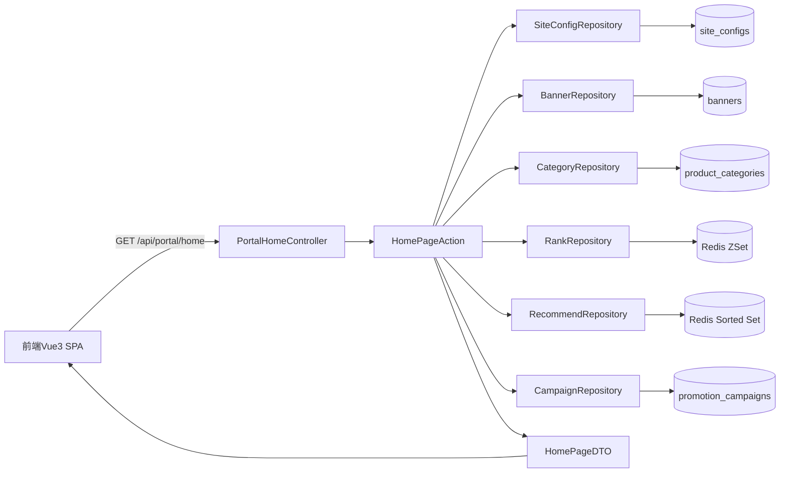
```mermaid
flowchart LR
    A[前端Vue3 SPA] -->|GET /api/portal/home| B[PortalHomeController]
    B --> C[HomePageAction]
    C --> D[SiteConfigRepository]
    C --> E[BannerRepository]
    C --> F[CategoryRepository]
    C --> G[RankRepository]
    C --> H[RecommendRepository]
    C --> I[CampaignRepository]
    D --> J[(site_configs)]
    E --> K[(banners)]
    F --> L[(product_categories)]
    G --> M[(Redis ZSet)]
    H --> N[(Redis Sorted Set)]
    I --> O[(promotion_campaigns)]
    C --> P[HomePageDTO]
    P --> A
```

### 6.0.3 技术方案

#### 6.0.3.1 Laravel Cache Tag 缓存

首页板块采用 Cache Tag 实现按维度批量失效，避免全量缓存清除。

```php
<?php

namespace App\Services\Portal;

use Illuminate\Support\Facades\Cache;

/**
 * Portal 缓存标签管理
 */
class PortalCacheManager
{
    public const TAG_CONFIG = 'portal:config';
    public const TAG_BANNER = 'portal:banner';
    public const TAG_NOTICE = 'portal:notice';
    public const TAG_CATEGORIES = 'portal:categories';
    public const TAG_NEW_ARRIVALS = 'portal:new_arrivals';
    public const TAG_RANK = 'portal:rank';
    public const TAG_CAMPAIGNS = 'portal:campaigns';

    /**
     * 按标签清除首页相关缓存
     */
    public static function flushByTag(string ...$tags): void
    {
        Cache::tags($tags)->flush();
    }

    /**
     * 运营人员修改 Banner 后，仅清除 Banner + 首页聚合缓存
     */
    public static function flushOnBannerChange(): void
    {
        self::flushByTag(self::TAG_BANNER, self::TAG_CONFIG);
    }
}
```

> **实现前提**：Cache Driver 需支持 Tag，生产环境使用 `redis` 驱动。

#### 6.0.3.2 Schedule 定时刷新各板块数据

```php
<?php

namespace App\Console;

use Illuminate\Console\Scheduling\Schedule;
use Illuminate\Foundation\Console\Kernel as ConsoleKernel;

class Kernel extends ConsoleKernel
{
    protected function schedule(Schedule $schedule): void
    {
        // 02:00 刷新热销榜/飙升榜（见 6.3）
        $schedule->job(new \App\Jobs\Portal\SyncBestsellerRankJob())
            ->dailyAt('02:00')
            ->name('sync-bestseller-rank');

        // 03:00 刷新分类树缓存
        $schedule->job(new \App\Jobs\Portal\SyncCategoryTreeJob())
            ->dailyAt('03:00')
            ->name('sync-category-tree');

        // 每15分钟刷新新品专区
        $schedule->job(new \App\Jobs\Portal\SyncNewArrivalsJob())
            ->everyFifteenMinutes()
            ->name('sync-new-arrivals');

        // 每5分钟刷新活动专题有效期
        $schedule->job(new \App\Jobs\Portal\SyncCampaignStatusJob())
            ->everyFiveMinutes()
            ->name('sync-campaign-status');
    }
}
```

#### 6.0.3.3 个性化推荐：基于用户行为的 Redis Sorted Set

```php
<?php

namespace App\Services\Portal;

use Illuminate\Support\Facades\Redis;

/**
 * 个性化推荐服务 —— 基于用户浏览/购买/收藏行为
 */
class UserRecommendService
{
    private const string BEHAVIOR_VIEW = 'view';
    private const string BEHAVIOR_BUY = 'buy';
    private const string BEHAVIOR_FAV = 'favorite';

    /**
     * 记录用户行为（由前端埋点或后端事件触发）
     */
    public function recordBehavior(int $customerId, int $productId, string $behavior, float $weight = 1.0): void
    {
        $key = sprintf('behavior:%s:%d', $behavior, $customerId);
        Redis::zincrby($key, $weight, (string) $productId);
        Redis::expire($key, 30 * 86400); // 30天过期
    }

    /**
     * 获取个性化推荐商品ID列表
     * 算法：浏览×1 + 购买×5 + 收藏×3，取 Top-N，混合新品防止信息茧房
     */
    public function getRecommendations(int $customerId, int $limit = 10): array
    {
        $viewKey = sprintf('behavior:view:%d', $customerId);
        $buyKey = sprintf('behavior:buy:%d', $customerId);
        $favKey = sprintf('behavior:favorite:%d', $customerId);
        $recKey = sprintf('rec:user:%d', $customerId);

        // 若推荐缓存存在且未过期，直接返回
        $cached = Redis::zrevrange($recKey, 0, $limit - 1);
        if (! empty($cached)) {
            return array_map('intval', $cached);
        }

        // 加权聚合：购买权重5，收藏权重3，浏览权重1
        Redis::zunionstore($recKey, [
            $buyKey => 5.0,
            $favKey => 3.0,
            $viewKey => 1.0,
        ]);

        $productIds = Redis::zrevrange($recKey, 0, $limit - 1);
        Redis::expire($recKey, 1800); // 30分钟缓存

        return array_map('intval', $productIds);
    }

    /**
     * 清除用户推荐缓存（购买成功后调用，刷新推荐）
     */
    public function clearRecommendationCache(int $customerId): void
    {
        Redis::del(sprintf('rec:user:%d', $customerId));
    }
}
```

### 6.0.4 核心代码：HomePageAction 聚合查询

```php
<?php

namespace App\Actions\Portal;

use App\DTOs\Portal\HomePageDTO;
use App\Repositories\Portal\BannerRepository;
use App\Repositories\Portal\CategoryRepository;
use App\Repositories\Portal\CampaignRepository;
use App\Services\Product\BestsellerRankInterface;
use App\Services\Portal\UserRecommendService;
use Illuminate\Support\Facades\Cache;

/**
 * 首页数据聚合 Action
 * 非简单查询，而是多 Repository 聚合组装
 */
class HomePageAction
{
    public function __construct(
        private BannerRepository $bannerRepo,
        private CategoryRepository $categoryRepo,
        private CampaignRepository $campaignRepo,
        private BestsellerRankInterface $rankService,
        private UserRecommendService $recommendService,
    ) {}

    public function execute(?int $customerId = null, string $device = 'pc'): HomePageDTO
    {
        // 首页聚合缓存 Key（按设备+用户区分个性化推荐）
        $cacheKey = sprintf('portal:home:%s:%s', $device, $customerId ?? 'guest');

        return Cache::tags(['portal:home'])->remember($cacheKey, 60, function () use ($customerId, $device) {
            $dto = new HomePageDTO();

            // 1. 全局配置（SEO / 客服电话 / Logo）
            $dto->siteConfig = $this->loadSiteConfig();

            // 2. 顶部公告（滚动 + 紧急通知）
            $dto->notices = $this->bannerRepo->getNotices(limit: 5);

            // 3. 轮播 Banner（按设备筛选）
            $dto->banners = $this->bannerRepo->getActiveBanners(
                bannerType: $device === 'pc' ? BannerType::PC_CAROUSEL : BannerType::APP_CAROUSEL,
                limit: 6
            );

            // 4. 三级分类树（带图标）
            $dto->categories = $this->categoryRepo->getTreeWithIcons(depth: 3);

            // 5. 新品上线专区（近7天上架，按发布时间倒序）
            $dto->newArrivals = $this->loadNewArrivals(limit: 12);

            // 6. 爆款推荐 —— 热销榜 Top 10
            $dto->bestsellers = $this->rankService->getBestsellerRank(categoryId: null, limit: 10);

            // 7. 飙升榜 Top 10
            $dto->risingItems = $this->rankService->getSoaringRank(categoryId: null, limit: 10);

            // 8. 个性化推荐（登录用户）/ 通用推荐（访客）
            $dto->recommendations = $customerId
                ? $this->recommendService->getRecommendations($customerId, limit: 12)
                : $this->loadGenericRecommendations(limit: 12);

            // 9. 当前生效的营销活动
            $dto->activeCampaigns = $this->campaignRepo->getActiveCampaigns(limit: 3);

            // 10. 品牌背书区（静态配置）
            $dto->brandTrust = $this->loadBrandTrustConfig();

            return $dto;
        });
    }

    private function loadSiteConfig(): array
    {
        return Cache::tags(['portal:config'])->remember('site:config', 3600, function () {
            return \App\Models\SiteConfig::all()->mapWithKeys(
                fn ($item) => [$item->config_key => $item->config_value]
            )->toArray();
        });
    }

    private function loadNewArrivals(int $limit): array
    {
        return Cache::tags(['portal:new_arrivals'])->remember('home:new_arrivals', 900, function () use ($limit) {
            return \App\Models\Product::query()
                ->where('status', 1)
                ->where('created_at', '>=', now()->subDays(30))
                ->orderByDesc('created_at')
                ->limit($limit)
                ->get(['id', 'name', 'thumbnail', 'base_price', 'created_at'])
                ->map(fn ($p) => [
                    'id' => $p->id,
                    'name' => $p->name,
                    'thumbnail' => $p->thumbnail,
                    'price' => $p->base_price,
                    'isNew' => true,
                    'newLabel' => 'NEW',
                ])
                ->toArray();
        });
    }

    private function loadGenericRecommendations(int $limit): array
    {
        // 访客通用推荐：综合评分 + 热度值排序
        return \App\Models\Product::query()
            ->where('status', 1)
            ->orderByDesc('heat_value')
            ->orderByDesc('score')
            ->limit($limit)
            ->pluck('id')
            ->all();
    }

    private function loadBrandTrustConfig(): array
    {
        return [
            'experience_years' => 26,
            'covered_cities' => 200,
            'factory_show' => true,
            'certificates' => ['ISO9001', 'FSC', 'SGS'],
            'slogan' => '26年印刷经验，服务200+城市',
        ];
    }
}
```

### 6.0.5 首页加载时序图

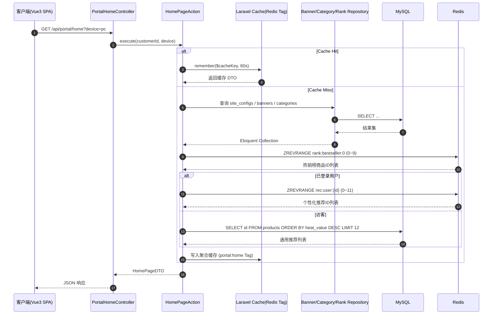
```mermaid
sequenceDiagram
    autonumber
    participant C as 客户端(Vue3 SPA)
    participant Ctrl as PortalHomeController
    participant Action as HomePageAction
    participant Cache as Laravel Cache(Redis Tag)
    participant Repo as Banner/Category/Rank Repository
    participant DB as MySQL
    participant Rdc as Redis

    C->>Ctrl: GET /api/portal/home?device=pc
    Ctrl->>Action: execute(customerId, device)

    alt Cache Hit
        Action->>Cache: remember($cacheKey, 60s)
        Cache-->>Action: 返回缓存 DTO
    else Cache Miss
        Action->>Repo: 查询 site_configs / banners / categories
        Repo->>DB: SELECT ...
        DB-->>Repo: 结果集
        Repo-->>Action: Eloquent Collection

        Action->>Rdc: ZREVRANGE rank:bestseller:0 (0~9)
        Rdc-->>Action: 热销榜商品ID列表

        alt 已登录用户
            Action->>Rdc: ZREVRANGE rec:user:{id} (0~11)
            Rdc-->>Action: 个性化推荐ID列表
        else 访客
            Action->>DB: SELECT id FROM products ORDER BY heat_value DESC LIMIT 12
            DB-->>Action: 通用推荐列表
        end

        Action->>Cache: 写入聚合缓存 (portal:home Tag)
    end

    Action-->>Ctrl: HomePageDTO
    Ctrl-->>C: JSON 响应
```

### 6.0.6 关键业务规则

| 规则 | 实现 | 说明 |
|------|------|------|
| 首页聚合缓存 | `Cache::tags(['portal:home'])` | 按设备+用户ID区分缓存Key |
| 运营修改即时生效 | `PortalCacheManager::flushOnBannerChange()` | 按 Tag 批量失效，无需等TTL |
| 榜单数据每日刷新 | Schedule `dailyAt('02:00')` | 避免峰值计算 |
| 个性化推荐30分钟TTL | Redis ZSet `rec:user:{id}` | 平衡实时性与DB压力 |
| 访客推荐防信息茧房 | 按 `heat_value + score` 排序 | 未登录用户展示平台热门 |
| 新品定义 | `created_at >= now()->subDays(30)` | 30天内上架商品自动标记 NEW |

---

## 6.0-A Banner与公告服务

> **设计依据**：PRD 模块一（FR-HOME-002 ~ FR-HOME-003）
> **所属领域**：`App\Domains\Portal\Content`（门户内容域）
> **核心数据表**：`banners`（已存在 5.2.29 节，本节补充运营后台与多端适配）

### 6.0-A.1 数据库表补充说明

`banners` 表已在 **5.2.29** 节定义，本节补充其业务使用方式：

| banner_type | 业务含义 | 展示位置 | 多端差异 |
|-------------|---------|---------|---------|
| `1` | PC轮播 | 首页顶部通栏 | 支持多图轮播，宽高比 1920×600 |
| `2` | APP轮播 | H5/小程序首页 | 支持多图轮播，宽高比 750×400 |
| `3` | 顶部公告 | 全站顶部通知栏 | 单条滚动，紧急公告可 `is_top=1` 置顶 |
| `4` | 弹窗公告 | 首页首次访问弹层 | 按 `start_time` / `end_time` 控制有效期 |

### 6.0-A.2 运营后台配置接口

```php
<?php

namespace App\Http\Controllers\Api\Admin;

use App\Http\Requests\Admin\BannerStoreRequest;
use App\Models\Banner;
use App\Services\Portal\PortalCacheManager;
use Illuminate\Http\JsonResponse;
use Illuminate\Http\Request;

class BannerAdminController
{
    /**
     * Banner 列表（运营后台）
     * GET /api/admin/banners
     */
    public function index(Request $request): JsonResponse
    {
        $query = Banner::query()
            ->when($request->input('banner_type'), fn ($q, $type) => $q->where('banner_type', $type))
            ->when($request->input('status') !== null, fn ($q, $status) => $q->where('status', $status))
            ->orderByDesc('sort_order')
            ->orderByDesc('id');

        return response()->json($query->paginate($request->input('pageSize', 20)));
    }

    /**
     * 创建/编辑 Banner
     * POST /api/admin/banners
     */
    public function store(BannerStoreRequest $request): JsonResponse
    {
        $data = $request->validated();
        $data['created_by'] = auth('admin')->id();

        $banner = Banner::updateOrCreate(['id' => $data['id'] ?? null], $data);

        // 清除对应缓存标签，即时生效
        PortalCacheManager::flushOnBannerChange();

        return response()->json(['id' => $banner->id, 'message' => '保存成功']);
    }

    /**
     * 切换状态
     * POST /api/admin/banners/{id}/toggle-status
     */
    public function toggleStatus(int $id): JsonResponse
    {
        $banner = Banner::findOrFail($id);
        $banner->status = $banner->status === 1 ? 0 : 1;
        $banner->save();

        PortalCacheManager::flushOnBannerChange();

        return response()->json(['status' => $banner->status, 'message' => '状态更新成功']);
    }

    /**
     * 调整排序权重
     * POST /api/admin/banners/{id}/sort
     */
    public function updateSort(int $id, Request $request): JsonResponse
    {
        $banner = Banner::findOrFail($id);
        $banner->sort_order = $request->input('sort_order', 0);
        $banner->save();

        PortalCacheManager::flushOnBannerChange();

        return response()->json(['message' => '排序更新成功']);
    }
}
```

### 6.0-A.3 多端适配策略

前端通过 `device` 参数区分 PC / Mobile，服务端返回对应尺寸图片：

```php
<?php

namespace App\Repositories\Portal;

use App\Enums\BannerType;
use App\Models\Banner;
use Illuminate\Support\Facades\Cache;

class BannerRepository
{
    /**
     * 获取生效中的 Banner 列表（按设备类型）
     */
    public function getActiveBanners(BannerType $bannerType, int $limit = 6): array
    {
        $cacheKey = sprintf('banners:%s:%d', $bannerType->value, $limit);

        return Cache::tags(['portal:banner'])->remember($cacheKey, 1800, function () use ($bannerType, $limit) {
            return Banner::query()
                ->where('banner_type', $bannerType)
                ->where('status', 1)
                ->where('start_time', '<=', now())
                ->where('end_time', '>=', now())
                ->orderByDesc('sort_order')
                ->limit($limit)
                ->get()
                ->map(fn (Banner $banner) => [
                    'id' => $banner->id,
                    'title' => $banner->title,
                    // 多端适配：PC 返回 image_url，移动端优先返回 mobile_image_url
                    'imageUrl' => $bannerType === BannerType::APP_CAROUSEL && $banner->mobile_image_url
                        ? $banner->mobile_image_url
                        : $banner->image_url,
                    'linkUrl' => $this->resolveLinkUrl($banner),
                    'targetId' => $banner->target_id,
                ])
                ->toArray();
        });
    }

    /**
     * 获取顶部公告（滚动 + 置顶优先）
     */
    public function getNotices(int $limit = 5): array
    {
        return Cache::tags(['portal:notice'])->remember('notices:active', 1800, function () use ($limit) {
            return Banner::query()
                ->where('banner_type', BannerType::NOTICE)
                ->where('status', 1)
                ->where('start_time', '<=', now())
                ->where('end_time', '>=', now())
                ->orderByDesc('is_top')
                ->orderByDesc('sort_order')
                ->limit($limit)
                ->get(['id', 'title', 'link_url', 'is_top'])
                ->toArray();
        });
    }

    /**
     * 链接解析：内部路由补全域名，外部链接保持原样
     */
    private function resolveLinkUrl(Banner $banner): ?string
    {
        return match ($banner->link_type->value) {
            2 => config('app.frontend_url') . $banner->link_url, // 内部路由
            3 => config('app.frontend_url') . '/product/' . $banner->target_id, // 商品详情
            4 => config('app.frontend_url') . '/campaign/' . $banner->target_id, // 活动页
            default => $banner->link_url,
        };
    }
}
```

### 6.0-A.4 点击统计

Banner 点击采用**异步累加**策略，避免阻塞跳转：

```php
<?php

namespace App\Jobs\Portal;

use App\Models\Banner;
use Illuminate\Bus\Queueable;
use Illuminate\Contracts\Queue\ShouldQueue;
use Illuminate\Foundation\Bus\Dispatchable;
use Illuminate\Queue\InteractsWithQueue;
use Illuminate\Queue\SerializesModels;

class IncrementBannerClickJob implements ShouldQueue
{
    use Dispatchable, InteractsWithQueue, Queueable, SerializesModels;

    public function __construct(public int $bannerId) {}

    public function handle(): void
    {
        Banner::where('id', $this->bannerId)->increment('click_count');
    }
}
```

前端在跳转前发送 `POST /api/app/banner/{id}/click` 触发 Job 派发即可。

---

## 6.0-B 分类树服务

> **设计依据**：PRD 模块一（FR-HOME-007）
> **所属领域**：`App\Domains\Product\Category`（商品分类域）
> **核心数据表**：`product_categories`（已存在 5.2.20 节）

### 6.0-B.1 设计概述

分类树是首页导航的核心入口，采用 **Redis Hash 存储节点元数据 + Redis ZSet 存储层级排序**，实现 O(1) 读取与灵活排序。三级分类树在印刷电商场景下数据量有限（通常 < 500 节点），全量缓存至 Redis 后完全避免递归查库。

### 6.0-B.2 三级分类树缓存（Redis Hash + ZSet）

```php
<?php

namespace App\Services\Portal;

use App\Models\ProductCategory;
use Illuminate\Support\Facades\Redis;

class CategoryTreeService
{
    private const string HASH_KEY = 'portal:categories:data';
    private const string ZSET_KEY_L1 = 'portal:categories:l1';
    private const string ZSET_KEY_PREFIX = 'portal:categories:l2:%d';

    /**
     * 刷新分类树缓存（由 Schedule 每日 03:00 触发）
     */
    public function rebuildCache(): void
    {
        Redis::del(self::HASH_KEY, self::ZSET_KEY_L1);

        $categories = ProductCategory::where('is_show', true)
            ->orderBy('sort_order')
            ->get();

        foreach ($categories as $cat) {
            // Hash 存储完整节点数据
            Redis::hset(self::HASH_KEY, (string) $cat->id, json_encode([
                'id' => $cat->id,
                'cdCategoryId' => $cat->cd_category_id,
                'name' => $cat->category_name,
                'parentId' => $cat->parent_id,
                'level' => $cat->level,
                'icon' => $cat->icon,
                'heatValue' => $cat->heat_value,
            ]));

            // ZSet 按层级维护排序关系
            if ($cat->level === 1) {
                Redis::zadd(self::ZSET_KEY_L1, $cat->sort_order, $cat->id);
            } elseif ($cat->level === 2) {
                $zsetKey = sprintf(self::ZSET_KEY_PREFIX, $cat->parent_id);
                Redis::zadd($zsetKey, $cat->sort_order, $cat->id);
            }
        }

        Redis::expire(self::HASH_KEY, 86400);
        Redis::expire(self::ZSET_KEY_L1, 86400);
    }

    /**
     * 从 Redis 读取三级分类树（O(N) 组装，N=节点数）
     */
    public function getTree(int $depth = 3): array
    {
        $allNodes = Redis::hgetall(self::HASH_KEY);
        if (empty($allNodes)) {
            $this->rebuildCache();
            $allNodes = Redis::hgetall(self::HASH_KEY);
        }

        $nodeMap = [];
        foreach ($allNodes as $id => $json) {
            $node = json_decode($json, true);
            $node['children'] = [];
            $nodeMap[(int) $id] = $node;
        }

        // 按 ZSet 顺序读取一级分类
        $l1Ids = Redis::zrange(self::ZSET_KEY_L1, 0, -1);
        $tree = [];

        foreach ($l1Ids as $l1Id) {
            $l1Id = (int) $l1Id;
            if (! isset($nodeMap[$l1Id])) continue;

            $l1Node = &$nodeMap[$l1Id];

            if ($depth >= 2) {
                $l2ZsetKey = sprintf(self::ZSET_KEY_PREFIX, $l1Id);
                $l2Ids = Redis::zrange($l2ZsetKey, 0, -1);
                foreach ($l2Ids as $l2Id) {
                    $l2Id = (int) $l2Id;
                    if (! isset($nodeMap[$l2Id])) continue;

                    $l2Node = &$nodeMap[$l2Id];

                    if ($depth >= 3) {
                        // 三级分类挂在二级下
                        foreach ($nodeMap as $id => &$candidate) {
                            if ($candidate['parentId'] === $l2Id) {
                                $l2Node['children'][] = &$candidate;
                            }
                        }
                    }

                    $l1Node['children'][] = $l2Node;
                }
            }

            $tree[] = $l1Node;
        }

        return $tree;
    }
}
```

### 6.0-B.4 分类图标 CDN 加速

分类图标为小体积静态资源，统一走 CDN + 本地缓存：

```php
<?php

namespace App\Services\Portal;

class CategoryIconService
{
    /**
     * 图标 URL 生成：优先 CDN，失败回源
     */
    public function getIconUrl(?string $iconPath, int $size = 64): string
    {
        if (empty($iconPath)) {
            return asset('images/category-default.png');
        }

        $cdnBase = config('services.cdn.url');
        $version = config('app.asset_version', 'v1');

        return sprintf('%s/categories/%s?w=%d&v=%s', $cdnBase, $iconPath, $size, $version);
    }
}
```

**前端加载策略**：
- 首屏分类图标：`` + `srcset` 响应式
- CDN 失效：图标变更时更新 `asset_version`，强制刷新浏览器缓存

---

## 6.0-C 营销活动专题服务

> **设计依据**：PRD 模块一（FR-HOME-009）
> **所属领域**：`App\Domains\Portal\Campaign`（营销活动域）
> **核心数据表**：`promotion_campaigns`、`promotion_products`

### 6.0-C.1 专题页配置表

```php
<?php

use Illuminate\Database\Migrations\Migration;
use Illuminate\Database\Schema\Blueprint;
use Illuminate\Support\Facades\Schema;

return new class extends Migration
{
    public function up(): void
    {
        Schema::create('promotion_campaigns', function (Blueprint $table) {
            $table->id()->comment('专题主键');
            $table->string('campaign_code', 64)->unique()->comment('活动编码');
            $table->string('campaign_name', 128)->comment('活动名称');
            $table->tinyInteger('campaign_type')->comment('1=限时折扣 2=满减 3=满赠 4=首单优惠');
            $table->string('page_template', 64)->default('default')->comment('页面模板标识');
            $table->string('banner_image', 500)->nullable()->comment('专题Banner图');
            $table->text('description')->nullable()->comment('活动描述');
            $table->timestamp('start_time')->comment('活动开始时间');
            $table->timestamp('end_time')->comment('活动结束时间');
            $table->tinyInteger('status')->default(1)->comment('1=未开始 2=进行中 3=已结束 0=禁用');
            $table->foreignId('poster_template_id')->nullable()->comment('海报模板ID');
            $table->string('share_title', 255)->nullable()->comment('分享标题');
            $table->string('share_desc', 500)->nullable()->comment('分享描述');
            $table->string('share_image_url', 500)->nullable()->comment('分享图片URL');
            $table->json('rules')->nullable()->comment('活动规则JSON');
            $table->timestamps();

            $table->index('campaign_code', 'idx_campaign_code');
            $table->index('campaign_type', 'idx_campaign_type');
            $table->index(['start_time', 'end_time'], 'idx_time_range');
            $table->index('status', 'idx_status');
        });

        Schema::create('promotion_products', function (Blueprint $table) {
            $table->id()->comment('主键');
            $table->foreignId('campaign_id')->constrained('promotion_campaigns')->comment('专题ID');
            $table->foreignId('product_id')->constrained('products')->comment('商品ID');
            $table->decimal('promotion_price', 12, 2)->nullable()->comment('活动价');
            $table->integer('stock_limit')->nullable()->comment('活动库存限制');
            $table->integer('sold_count')->default(0)->comment('已售数量');
            $table->integer('sort_order')->default(0)->comment('排序');
            $table->timestamps();

            $table->unique(['campaign_id', 'product_id'], 'uniq_campaign_product');
            $table->index('campaign_id', 'idx_campaign_id');
        });
    }

    public function down(): void
    {
        Schema::dropIfExists('promotion_products');
        Schema::dropIfExists('promotion_campaigns');
    }
};
```

#### campaign_stats 表（活动统计表）

```php
<?php

use Illuminate\Database\Migrations\Migration;
use Illuminate\Database\Schema\Blueprint;
use Illuminate\Support\Facades\Schema;

return new class extends Migration
{
    public function up(): void
    {
        Schema::create('campaign_stats', function (Blueprint $table) {
            $table->id()->comment('统计主键');
            $table->foreignId('campaign_id')->constrained('promotion_campaigns')->comment('活动ID');
            $table->date('stat_date')->comment('统计日期');
            $table->unsignedInteger('uv')->default(0)->comment('独立访客数');
            $table->unsignedInteger('pv')->default(0)->comment('页面浏览量');
            $table->unsignedInteger('order_count')->default(0)->comment('参与活动订单数');
            $table->decimal('conversion_rate', 5, 2)->default(0.00)->comment('转化率%');
            $table->timestamps();

            $table->unique(['campaign_id', 'stat_date'], 'uk_campaign_date');
        });
    }

    public function down(): void
    {
        Schema::dropIfExists('campaign_stats');
    }
};
```
};
```

### 6.0-C.2 限时折扣倒计时（Redis TTL + 前端同步）

```php
<?php

namespace App\Services\Portal;

use App\Models\PromotionCampaign;
use Illuminate\Support\Facades\Redis;

class CampaignCountdownService
{
    private const string CAMPAIGN_TTL_KEY = 'campaign:ttl:%d';

    /**
     * 获取活动倒计时信息
     */
    public function getCountdown(int $campaignId): array
    {
        $campaign = PromotionCampaign::find($campaignId);
        if (! $campaign) {
            return ['status' => 'invalid', 'remainSeconds' => 0];
        }

        $now = now();
        $start = $campaign->start_time;
        $end = $campaign->end_time;

        if ($now < $start) {
            return [
                'status' => 'upcoming',
                'remainSeconds' => $start->diffInSeconds($now),
                'serverTime' => $now->toIso8601String(),
            ];
        }

        if ($now >= $start && $now <= $end) {
            $remainSeconds = $end->diffInSeconds($now);

            // 写入 Redis TTL 标记，用于前端轮询校准
            Redis::setex(sprintf(self::CAMPAIGN_TTL_KEY, $campaignId), $remainSeconds, 'active');

            return [
                'status' => 'active',
                'remainSeconds' => $remainSeconds,
                'serverTime' => $now->toIso8601String(),
            ];
        }

        return ['status' => 'ended', 'remainSeconds' => 0];
    }
}
```

**前端同步策略**：
- 首次加载读取服务端 `serverTime` 与本地时间计算差值（`serverOffset`）
- 倒计时使用客户端 `setInterval` 递减，避免每秒请求服务端
- 每分钟与服务端 `CampaignCountdownService` 校准一次，修正本地漂移

### 6.0-C.3 优惠券领取接口（分布式锁防超领）

```php
<?php

namespace App\Http\Controllers\Api\App;

use App\Models\Coupon;
use App\Models\CustomerCoupon;
use Illuminate\Http\JsonResponse;
use Illuminate\Http\Request;
use Illuminate\Support\Facades\DB;
use Illuminate\Support\Facades\Log;
use Illuminate\Support\Facades\Redis;

class CouponClaimController
{
    /**
     * 领取优惠券（带分布式锁防超领）
     * POST /api/app/coupon/{couponId}/claim
     */
    public function claim(int $couponId, Request $request): JsonResponse
    {
        $customerId = auth('sanctum')->id();
        if (! $customerId) {
            return response()->json(['message' => '请先登录'], 401);
        }

        $lockKey = sprintf('lock:coupon:claim:%d:%d', $couponId, $customerId);
        $lock = Redis::set($lockKey, '1', 'EX', 10, 'NX');

        if (! $lock) {
            return response()->json(['message' => '操作过于频繁，请稍后重试'], 429);
        }

        try {
            return DB::transaction(function () use ($couponId, $customerId) {
                $coupon = Coupon::lockForUpdate()->find($couponId);

                if (! $coupon || $coupon->status !== 1) {
                    return response()->json(['message' => '优惠券不存在或已下架'], 404);
                }

                if ($coupon->valid_from > now() || $coupon->valid_to < now()) {
                    return response()->json(['message' => '优惠券不在有效期内'], 400);
                }

                if ($coupon->used_quantity >= $coupon->total_quantity) {
                    return response()->json(['message' => '优惠券已领完'], 410);
                }

                // 单人限领检查
                $alreadyClaimed = CustomerCoupon::where('customer_id', $customerId)
                    ->where('coupon_id', $couponId)
                    ->count();

                if ($alreadyClaimed >= $coupon->per_customer_limit) {
                    return response()->json(['message' => '您已达到该优惠券领取上限'], 400);
                }

                // 乐观锁防并发超领
                $updated = Coupon::where('id', $couponId)
                    ->where('version', $coupon->version)
                    ->increment('used_quantity');

                if (! $updated) {
                    Log::warning('[CouponClaim] 乐观锁冲突', ['coupon_id' => $couponId, 'customer_id' => $customerId]);
                    return response()->json(['message' => '领取人数过多，请稍后重试'], 409);
                }

                // 发放客户优惠券
                $customerCoupon = CustomerCoupon::create([
                    'customer_id' => $customerId,
                    'coupon_id' => $couponId,
                    'coupon_code' => $coupon->coupon_code,
                    'status' => 1, // 未使用
                    'valid_from' => $coupon->valid_from,
                    'valid_to' => $coupon->valid_to,
                ]);

                Log::info('[CouponClaim] 领取成功', [
                    'customer_id' => $customerId,
                    'coupon_id' => $couponId,
                    'customer_coupon_id' => $customerCoupon->id,
                ]);

                return response()->json([
                    'message' => '领取成功',
                    'customerCouponId' => $customerCoupon->id,
                ]);
            });
        } finally {
            Redis::del($lockKey);
        }
    }
}
```

### 6.0-C.4 关键业务规则

| 规则 | 实现 | 说明 |
|------|------|------|
| 活动状态自动流转 | Schedule `everyFiveMinutes` | 根据 `start_time`/`end_time` 自动更新 `status` |
| 倒计时校准 | `serverTime` + 客户端 `serverOffset` | 避免用户篡改本地时间 |
| 防超领 | Redis 分布式锁 + DB 乐观锁 (`version` 字段) | 双层防护 |
| 单人限领 | `per_customer_limit` | 运营后台可配置 |
| 活动库存 | `promotion_products.stock_limit` | 与商品主库存隔离 |

---

## 6.32 管理后台核心服务设计（Admin Core Service）

> **设计依据**：PRD 模块二十（FR-ADMIN-001 ~ FR-ADMIN-100）
> **所属领域**：`App\Domains\Admin`（管理后台域）
> **现状说明**：当前 SDD 中管理后台 API 分散于各模块（6.2.8 文件审核、6.4.3 售后管理、6.8.4 工单管理等），缺少 Admin 子系统的**统一架构设计**。本节补充其设计概述、RBAC 权限模型与关键表结构。

### 6.32.1 设计概述

管理后台采用 **RBAC（Role-Based Access Control）+ 数据权限范围** 双层权限模型：
- **功能权限**：基于 `admin_roles` + `admin_permissions` + 中间表，控制菜单/按钮/API 访问
- **数据权限**：基于 `data_scope` 字段（全部/本部门/本人/自定义），控制列表数据可见范围

**技术选型**：
- 认证：`auth:admin` Guard（Laravel Sanctum 独立 Guard）
- 权限：`spatie/laravel-permission`（社区成熟包，支持角色/权限/中间表）
- 操作审计：`admin_operation_logs` 表记录所有后台写操作
- 数据报表：ECharts + 后端聚合查询（短缓存 5 分钟）

### 6.32.2 服务边界与模块划分

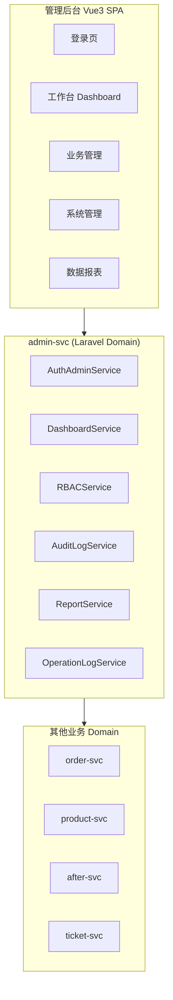
```mermaid
flowchart TB
    subgraph AdminSPA["管理后台 Vue3 SPA"]
        A[登录页]
        B[工作台 Dashboard]
        C[业务管理]
        D[系统管理]
        E[数据报表]
    end

    subgraph AdminSvc["admin-svc (Laravel Domain)"]
        F[AuthAdminService]
        G[DashboardService]
        H[RBACService]
        I[AuditLogService]
        J[ReportService]
        K[OperationLogService]
    end

    subgraph OtherSvc["其他业务 Domain"]
        L[order-svc]
        M[product-svc]
        N[after-svc]
        O[ticket-svc]
    end

    AdminSPA --> AdminSvc
    AdminSvc --> OtherSvc
```

| 后台模块 | 对应 Service | 核心职责 | 数据范围 |
|---------|-------------|---------|---------|
| 登录认证 | `AuthAdminService` | 独立 Guard + Token 签发 | — |
| 工作台 | `DashboardService` | 待办事项/订单统计/快捷入口 | 按数据权限过滤 |
| 权限管理 | `RBACService` | 角色/权限/菜单/数据范围 | 超级管理员专属 |
| 操作审计 | `OperationLogService` | 记录所有 POST/PUT/DELETE | 全局可见 |
| 数据报表 | `ReportService` | 订单/财务/用户/商品报表 | 按部门范围过滤 |
| 运营干预 | `RankAdminService` | 热销榜置顶/隐藏/权重 | 全局可见 |
| 客服管理 | `AgentAllocationService` | 客服分配/状态/满意度 | 客服主管可见 |

### 6.32.3 RBAC 权限模型

```php
<?php

namespace App\Models\Admin;

use Illuminate\Database\Eloquent\Factories\HasFactory;
use Illuminate\Database\Eloquent\Relations\BelongsToMany;
use Illuminate\Foundation\Auth\User as Authenticatable;
use Spatie\Permission\Traits\HasRoles;

class AdminUser extends Authenticatable
{
    use HasFactory, HasRoles;

    protected $table = 'admin_users';

    protected $fillable = [
        'username', 'real_name', 'password', 'email', 'phone',
        'avatar', 'department_id', 'status', 'last_login_at', 'last_login_ip',
    ];

    protected $hidden = ['password'];

    protected $casts = [
        'status' => 'integer',
        'last_login_at' => 'datetime',
    ];

    /**
     * 数据权限范围（独立于功能权限）
     */
    public function dataScope(): int
    {
        return $this->getAttribute('data_scope') ?? 1;
    }
}
```

**数据权限范围枚举**：

| data_scope | 含义 | 数据过滤规则 |
|-----------|------|------------|
| `1` | 全部数据 | 无过滤 |
| `2` | 本部门数据 | `where department_id = ?` |
| `3` | 本人数据 | `where created_by = ?` |
| `4` | 自定义 | 读取 `admin_data_scope_custom` 关联表 |

### 6.32.4 关键表结构

#### admin_users（管理员账户）

```sql
CREATE TABLE admin_users (
    id BIGINT UNSIGNED PRIMARY KEY AUTO_INCREMENT,
    username VARCHAR(64) NOT NULL COMMENT '登录账号',
    real_name VARCHAR(64) DEFAULT NULL COMMENT '真实姓名',
    password VARCHAR(255) NOT NULL COMMENT '密码哈希',
    email VARCHAR(128) DEFAULT NULL COMMENT '邮箱',
    phone VARCHAR(32) DEFAULT NULL COMMENT '手机号',
    avatar VARCHAR(500) DEFAULT NULL COMMENT '头像URL',
    department_id BIGINT UNSIGNED DEFAULT NULL COMMENT '所属部门ID',
    data_scope TINYINT DEFAULT 1 COMMENT '数据权限:1=全部 2=本部门 3=本人 4=自定义',
    status TINYINT DEFAULT 1 COMMENT '1=启用 0=禁用',
    last_login_at DATETIME DEFAULT NULL COMMENT '最后登录时间',
    last_login_ip VARCHAR(64) DEFAULT NULL COMMENT '最后登录IP',
    created_at DATETIME DEFAULT CURRENT_TIMESTAMP,
    updated_at DATETIME DEFAULT CURRENT_TIMESTAMP ON UPDATE CURRENT_TIMESTAMP,
    UNIQUE KEY uk_username (username),
    KEY idx_department (department_id),
    KEY idx_status (status)
) ENGINE=InnoDB COMMENT='后台管理员表';
```

#### admin_roles / admin_permissions / admin_role_permission（RBAC 三表）

由 `spatie/laravel-permission` 自动生成，标准结构：

```sql
-- roles: id, name, guard_name, created_at, updated_at
-- permissions: id, name, guard_name, created_at, updated_at
-- model_has_roles: role_id, model_type, model_id
-- model_has_permissions: permission_id, model_type, model_id
-- role_has_permissions: permission_id, role_id
```

> 权限命名规范：`{domain}:{action}:{resource}`，例如 `order:view:all`、`product:edit:self`、`report:export:finance`。

#### admin_operation_logs（操作审计日志）

```sql
CREATE TABLE admin_operation_logs (
    id BIGINT UNSIGNED PRIMARY KEY AUTO_INCREMENT,
    admin_id BIGINT UNSIGNED NOT NULL COMMENT '操作人ID',
    admin_name VARCHAR(64) DEFAULT NULL COMMENT '操作人姓名',
    module VARCHAR(64) NOT NULL COMMENT '操作模块',
    action VARCHAR(64) NOT NULL COMMENT '操作动作',
    request_url VARCHAR(512) NOT NULL COMMENT '请求URL',
    request_method VARCHAR(10) NOT NULL COMMENT 'HTTP方法',
    request_params JSON DEFAULT NULL COMMENT '请求参数(脱敏)',
    response_code INT DEFAULT 200 COMMENT '响应状态码',
    ip_address VARCHAR(64) DEFAULT NULL COMMENT '操作IP',
    user_agent VARCHAR(512) DEFAULT NULL COMMENT 'UA',
    duration_ms INT DEFAULT 0 COMMENT '执行耗时(ms)',
    created_at DATETIME DEFAULT CURRENT_TIMESTAMP,
    KEY idx_admin_id (admin_id),
    KEY idx_module_action (module, action),
    KEY idx_created_at (created_at)
) ENGINE=InnoDB COMMENT='后台操作审计日志';
```

#### admin_dashboard_configs（工作台个性化配置）

```sql
CREATE TABLE admin_dashboard_configs (
    id BIGINT UNSIGNED PRIMARY KEY AUTO_INCREMENT,
    admin_id BIGINT UNSIGNED NOT NULL COMMENT '管理员ID',
    widget_key VARCHAR(64) NOT NULL COMMENT '组件标识',
    widget_config JSON DEFAULT NULL COMMENT '组件配置JSON',
    sort_order INT DEFAULT 0 COMMENT '排序',
    is_visible TINYINT DEFAULT 1 COMMENT '是否显示',
    created_at DATETIME DEFAULT CURRENT_TIMESTAMP,
    updated_at DATETIME DEFAULT CURRENT_TIMESTAMP ON UPDATE CURRENT_TIMESTAMP,
    UNIQUE KEY uk_admin_widget (admin_id, widget_key)
) ENGINE=InnoDB COMMENT='工作台个性化配置';
```

### 6.32.5 运营干预能力汇总

管理后台为前端首页提供的运营干预入口：

| 干预对象 | 后台路径 | 操作 | 缓存失效策略 |
|---------|---------|------|------------|
| Banner/公告 | 内容管理 → Banner管理 | 增删改查、排序、置顶 | `PortalCacheManager::flushOnBannerChange()` |
| 热销/飙升榜 | 运营管理 → 榜单干预 | 置顶、隐藏、权重调整 | 删除 `rank:bestseller:{id}` |
| 分类树 | 商品管理 → 分类管理 | 增删改查、排序、图标 | 触发 `SyncCategoryTreeJob` |
| 营销活动 | 营销管理 → 活动专题 | 创建、上下架、配置商品 | `Cache::tags(['portal:campaigns'])->flush()` |
| 首页推荐 | 运营管理 → 推荐位管理 | 手动配置推荐商品（覆盖算法） | `Cache::tags(['portal:home'])->flush()` |
| 全局配置 | 系统管理 → 站点配置 | SEO、客服电话、Logo、备案号 | `Cache::tags(['portal:config'])->flush()` |

### 6.32.6 关键业务规则

| 规则 | 实现 | 说明 |
|------|------|------|
| 超级管理员保护 | `role:name === super_admin` | 禁止删除、禁止修改角色 |
| 操作日志异步写入 | Laravel Queue `OperationLogJob` | 避免阻塞后台请求 |
| 敏感参数脱敏 | `preg_replace` 手机/身份证/密码 | 日志中存储脱敏数据 |
| 数据范围自动过滤 | Eloquent Global Scope `DataScopeScope` | 自动附加 `where` 条件 |
| 报表查询超时保护 | `DB::timeout(30)` | 防止复杂报表拖垮 DB |
| 登录失败锁定 | Redis `admin:login:fail:{ip}` 5次/15分钟 | 防暴力破解 |

---

### 6.0-D 数据表汇总

| 表名 | 所属模块 | 关键字段 | 说明 |
|------|---------|---------|------|
| `banners` | 6.0-A | `banner_type`, `link_type`, `mobile_image_url` | 多端适配 |
| `product_categories` | 6.0-B | `parent_id`, `level`, `icon`, `heat_value` | 三级分类树 |
| `promotion_campaigns` | 6.0-C | `campaign_type`, `page_template`, `rules(JSON)` | 活动专题配置 |
| `promotion_products` | 6.0-C | `campaign_id`, `promotion_price`, `stock_limit` | 活动商品关联 |
| `site_configs` | 6.0 | `config_key`, `config_value` | 全局站点配置 |
| `admin_users` | 6.32 | `data_scope`, `department_id`, `status` | 后台管理员 |
| `admin_operation_logs` | 6.32 | `module`, `action`, `request_params(JSON)` | 操作审计 |
| `admin_dashboard_configs` | 6.32 | `widget_key`, `widget_config(JSON)` | 工作台个性化 |

---

## 自检清单

- [x] 所有代码示例为 PHP 8.5 + Laravel 13 语法风格
- [x] 未出现 Java 特有概念（ServiceImpl / DAO / Mapper / CompletableFuture 等）
- [x] Cache Tag 缓存策略适用于 `redis` 驱动
- [x] 个性化推荐使用 Redis Sorted Set 实现加权排序
- [x] 分类树使用 Redis Hash + ZSet 实现 O(1) 读取
- [x] 优惠券领取使用 Redis 分布式锁 + DB 乐观锁双层防超领
- [x] 管理后台 RBAC 采用 `spatie/laravel-permission` 标准方案
- [x] 数据权限范围（全部/部门/本人/自定义）通过 Eloquent Global Scope 实现
- [x] 操作审计日志异步写入，敏感字段脱敏存储
- [x] 所有新增表均使用 Laravel Migration + Eloquent Model 风格定义

### 6.32.1 客户管理 Admin Controller (CustomerAdminController)

```php
<?php

namespace App\Http\Controllers\Api\Admin;

use App\Http\Controllers\Controller;
use App\Models\Customer;
use Illuminate\Http\Request;
use Illuminate\Http\JsonResponse;

class CustomerAdminController extends Controller
{
    /**
     * GET /api/admin/v1/customers
     * 客户列表查询（支持筛选、分页、导出）
     */
    public function index(Request $request): JsonResponse
    {
        $query = Customer::query()
            ->when($request->customer_type, fn($q, $v) => $q->where('customer_type', $v))
            ->when($request->vip_level !== null, fn($q, $v) => $q->where('vip_level', $v))
            ->when($request->date_from, fn($q, $v) => $q->whereDate('created_at', '>=', $v))
            ->when($request->date_to, fn($q, $v) => $q->whereDate('created_at', '<=', $v))
            ->when($request->keyword, fn($q, $v) => $q->where(function ($sq) use ($v) {
                $sq->where('name', 'like', "%{$v}%")
                   ->orWhere('mobile_phone', 'like', "%{$v}%");
            }));

        return response()->json($query->paginate($request->input('per_page', 20)));
    }

    /**
     * GET /api/admin/v1/customers/{id}
     * 客户详情（含订单历史、认证状态、VIP信息）
     */
    public function getDetail(int $id): JsonResponse
    {
        $customer = Customer::with(['orders', 'vipService', 'authRecords'])
            ->findOrFail($id);

        return response()->json([
            'basic' => $customer,
            'order_count' => $customer->orders()->count(),
            'total_order_amount' => $customer->orders()->sum('total_amount'),
        ]);
    }

    /**
     * GET /api/admin/v1/customers/{id}/orders
     * 客户关联订单列表
     */
    public function orders(Request $request, int $id): JsonResponse
    {
        $customer = Customer::findOrFail($id);
        $orders = $customer->orders()
            ->orderByDesc('created_at')
            ->paginate($request->input('per_page', 20));

        return response()->json($orders);
    }
}
```

### 6.32.2 合法性审查触发器 (LegalityReviewTrigger)

> **覆盖**：FR-AUTH-008（大额订单触发人工审核）
> **阈值来源**：系统配置 `large_order_threshold`（默认50000元），可在后台"系统配置"中动态调整
> **适用对象**：所有用户（已认证和未认证用户统一适用）

```php
<?php

namespace App\Services\Order;

use App\Models\Order;

class LegalityReviewTrigger
{
    public function shouldReview(Order $order): bool
    {
        $threshold = config('order.large_order_threshold', 50000);
        return $order->total_amount >= $threshold;
    }

    public function trigger(Order $order): void
    {
        if (! $this->shouldReview($order)) {
            return;
        }

        // 创建合法性审查任务
        $order->legalityReview()->create([
            'status' => 'pending',
            'trigger_amount' => $order->total_amount,
            'triggered_at' => now(),
        ]);

        // 触发多渠道通知（电话+短信+站内信）
        event(new \App\Events\LegalityReviewTriggered($order));
    }
}
```

> **注意**：合法性审查与风控规则 `large_order_unusual` 为两个独立功能。合法性审查聚焦订单合规性审核（由人工运营介入），风控规则聚焦异常交易检测（由系统自动拦截）。两者阈值可独立配置。

---

## 6.1 计价引擎设计 (Pricing Engine)

### 6.1.1 设计概述

计价引擎是印刷商城的核心计算组件，负责将用户选择的品类、尺寸、材质、工艺、数量等参数转换为最终应付金额。PHP/Laravel版采用 **Laravel Pipeline** 模式将计价流程拆解为6个可插拔的步骤，每个步骤为一个独立的闭包/类，支持热插拔扩展。

**计价管线（Pricing Pipeline）**：

```
基础价查询 → 材质/工艺加价累加 → 数量折扣 → VIP折扣/样品折扣互斥 → 优惠券抵扣 → 加急费/包装费 → 0.5折封顶校验
```

**关键设计决策**：
- 输入层使用 `readonly class` 作为不可变参数对象，避免计价过程中参数被意外篡改
- 输出层使用 `Money` 值对象（分存储，元展示），消除浮点精度问题
- 缓存层按参数哈希生成缓存Key，TTL 1小时，配置变更时通过事件广播清除
- 批量计价使用 `Collection::chunk()` + `Queue::bulk()` 异步投递，Horizon监控执行进度

### 6.1.2 核心类图

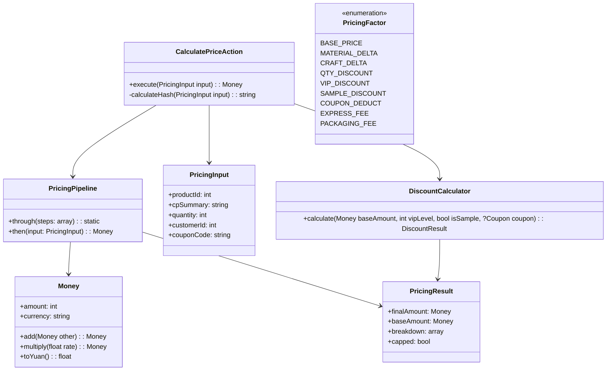
```mermaid
classDiagram
    class CalculatePriceAction {
        +execute(PricingInput input): Money
        -calculateHash(PricingInput input): string
    }
    class PricingPipeline {
        +through(steps: array): static
        +then(input: PricingInput): Money
    }
    class PricingInput {
        +productId: int
        +cpSummary: string
        +quantity: int
        +customerId: int
        +couponCode: string
    }
    class Money {
        +amount: int
        +currency: string
        +add(Money other): Money
        +multiply(float rate): Money
        +toYuan(): float
    }
    class PricingFactor {
        <<enumeration>>
        BASE_PRICE
        MATERIAL_DELTA
        CRAFT_DELTA
        QTY_DISCOUNT
        VIP_DISCOUNT
        SAMPLE_DISCOUNT
        COUPON_DEDUCT
        EXPRESS_FEE
        PACKAGING_FEE
    }
    class DiscountCalculator {
        +calculate(Money baseAmount, int vipLevel, bool isSample, ?Coupon coupon): DiscountResult
    }
    class PricingResult {
        +finalAmount: Money
        +baseAmount: Money
        +breakdown: array
        +capped: bool
    }
    
    CalculatePriceAction --> PricingPipeline
    CalculatePriceAction --> PricingInput
    PricingPipeline --> Money
    PricingPipeline --> PricingResult
    DiscountCalculator --> PricingResult
    CalculatePriceAction --> DiscountCalculator
```

### 6.1.3 核心代码实现

#### 6.1.3.1 计价因子枚举与 Money 值对象

```php
<?php

declare(strict_types=1);

namespace App\Enums;

enum PricingFactor: string
{
    case BASE_PRICE = 'base_price';
    case MATERIAL_DELTA = 'material_delta';
    case CRAFT_DELTA = 'craft_delta';
    case QTY_DISCOUNT = 'qty_discount';
    case VIP_DISCOUNT = 'vip_discount';
    case SAMPLE_DISCOUNT = 'sample_discount';
    case COUPON_DEDUCT = 'coupon_deduct';
    case EXPRESS_FEE = 'express_fee';
    case PACKAGING_FEE = 'packaging_fee';
    case CAP_PROTECTION = 'cap_protection';

    public function label(): string
    {
        return match ($this) {
            self::BASE_PRICE => '基础价',
            self::MATERIAL_DELTA => '材质加价',
            self::CRAFT_DELTA => '工艺加价',
            self::QTY_DISCOUNT => '数量折扣',
            self::VIP_DISCOUNT => 'VIP折扣',
            self::SAMPLE_DISCOUNT => '样品折扣',
            self::COUPON_DEDUCT => '优惠券抵扣',
            self::EXPRESS_FEE => '加急费',
            self::PACKAGING_FEE => '包装费',
            self::CAP_PROTECTION => '0.5折封顶保护',
        };
    }
}
```

```php
<?php

declare(strict_types=1);

namespace App\ValueObjects;

readonly class Money
{
    public function __construct(
        public int $amount, // 单位为分，避免浮点误差
        public string $currency = 'CNY'
    ) {}

    public static function fromYuan(float $yuan, string $currency = 'CNY'): self
    {
        return new self((int) round($yuan * 100), $currency);
    }

    public function toYuan(): float
    {
        return $this->amount / 100;
    }

    public function add(self $other): self
    {
        if ($this->currency !== $other->currency) {
            throw new \InvalidArgumentException('Currency mismatch');
        }
        return new self($this->amount + $other->amount, $this->currency);
    }

    public function subtract(self $other): self
    {
        if ($this->currency !== $other->currency) {
            throw new \InvalidArgumentException('Currency mismatch');
        }
        return new self($this->amount - $other->amount, $this->currency);
    }

    public function multiply(float $rate): self
    {
        return new self((int) round($this->amount * $rate), $this->currency);
    }

    public function max(self $other): self
    {
        return new self(max($this->amount, $other->amount), $this->currency);
    }

    public function isZero(): bool
    {
        return $this->amount === 0;
    }

    public function format(): string
    {
        return sprintf('%.2f %s', $this->toYuan(), $this->currency);
    }
}
```

#### 6.1.3.2 计价输入参数对象

```php
<?php

declare(strict_types=1);

namespace App\ValueObjects;

readonly class PricingInput
{
    public function __construct(
        public int $productId,
        public string $cpSummary,
        public int $quantity,
        public ?int $customerId = null,
        public ?string $couponCode = null,
        public bool $isUrgent = false,
        public bool $isSample = false,
        public ?int $vipLevel = null,
    ) {}

    public function cacheKey(): string
    {
        return 'pricing:' . md5(implode(':', [
            $this->productId,
            $this->cpSummary,
            $this->quantity,
            $this->customerId ?? 'guest',
            $this->couponCode ?? 'none',
            $this->isUrgent ? '1' : '0',
            $this->isSample ? '1' : '0',
        ]));
    }
}
```

#### 6.1.3.3 Pipeline 计价管线

```php
<?php

declare(strict_types=1);

namespace App\Pipelines;

use App\ValueObjects\Money;
use App\ValueObjects\PricingInput;
use App\ValueObjects\PricingResult;
use Illuminate\Pipeline\Pipeline;

class PricingPipeline
{
    private array $steps = [];

    public function __construct(
        private \App\Repositories\PriceConfigRepository $priceRepo,
        private \App\Repositories\CustomerCouponRepository $couponRepo,
        private \Illuminate\Contracts\Cache\Repository $cache,
    ) {}

    public static function default(
        \App\Repositories\PriceConfigRepository $priceRepo,
        \App\Repositories\CustomerCouponRepository $couponRepo,
        \Illuminate\Contracts\Cache\Repository $cache,
    ): self {
        $pipeline = new self($priceRepo, $couponRepo, $cache);

        $pipeline->steps = [
            // Step 1: 基础价 + 材质/工艺加价
            function (PricingResult $result, \Closure $next) use ($priceRepo) {
                $base = $priceRepo->getBasePrice(
                    $result->input->productId,
                    $result->input->cpSummary
                );
                $delta = $priceRepo->sumParamDeltas(
                    $result->input->productId,
                    $result->input->cpSummary
                );
                $subtotal = $base->add($delta)->multiply((float) $result->input->quantity);

                $result->setBreakdown(\App\Enums\PricingFactor::BASE_PRICE, $base);
                $result->setBreakdown(\App\Enums\PricingFactor::MATERIAL_DELTA, $delta);
                $result->setPayable($subtotal);

                return $next($result);
            },

            // Step 2: 数量阶梯折扣（在BASE_PRICE+MATERIAL_DELTA后应用）
            function (PricingResult $result, \Closure $next) use ($priceRepo) {
                $tierMultiplier = $priceRepo->getTierMultiplier(
                    $result->input->productId,
                    $result->input->quantity,
                    $result->input->cpSummary
                );

                if ($tierMultiplier < 1.0) {
                    $afterTier = $result->getPayable()->multiply($tierMultiplier);
                    $result->setBreakdown(
                        \App\Enums\PricingFactor::QUANTITY_LADDER,
                        $result->getPayable()->subtract($afterTier)
                    );
                    $result->setPayable($afterTier);
                }

                return $next($result);
            },

            // Step 3: VIP折扣 vs 样品折扣（互斥取最大优惠 = 最小折扣率）
            function (PricingResult $result, \Closure $next) {
                $input = $result->input;
                $vipRate = match ($input->vipLevel) {
                    1 => 1.0, 2 => 1.0, 3 => 1.0, 4 => 1.0,
                    5 => 1.0, 6 => 0.93, 7 => 0.92, 8 => 0.90,
                    default => 1.0,
                };
                $sampleRate = $input->isSample
                    ? match ($input->vipLevel) {
                        1, 2, 3 => 0.90,
                        5 => 0.50,
                        default => 1.0,
                    }
                    : 1.0;

                if ($input->isSample) {
                    $vipRate = 1.0; // 样品订单不走VIP印品折扣
                }

                $exclusiveRate = min($vipRate, $sampleRate);
                $afterExclusive = $result->getPayable()->multiply($exclusiveRate);

                $result->setBreakdown(
                    \App\Enums\PricingFactor::VIP_DISCOUNT,
                    $result->getPayable()->subtract($afterExclusive)
                );
                $result->setPayable($afterExclusive);

                return $next($result);
            },

            // Step 3: 优惠券抵扣（乘法叠加）
            function (PricingResult $result, \Closure $next) use ($couponRepo) {
                if ($result->input->couponCode === null) {
                    return $next($result);
                }

                $coupon = $couponRepo->findValidByCode(
                    $result->input->customerId,
                    $result->input->couponCode
                );

                if ($coupon === null) {
                    return $next($result);
                }

                $discount = match ($coupon->discount_type) {
                    1 => $result->getPayable()->multiply((float) $coupon->discount_value)
                        ->max(Money::fromYuan((float) ($coupon->max_discount ?? PHP_INT_MAX))),
                    2 => Money::fromYuan((float) $coupon->discount_value)
                        ->max($result->getPayable()),
                    default => Money::fromYuan(0),
                };

                $afterCoupon = $result->getPayable()->subtract($discount)->max(Money::fromYuan(0));

                $result->setBreakdown(\App\Enums\PricingFactor::COUPON_DEDUCT, $discount);
                $result->setPayable($afterCoupon);
                $result->setCouponId($coupon->id);

                return $next($result);
            },

            // Step 4: 加急费/包装费
            function (PricingResult $result, \Closure $next) use ($priceRepo) {
                if ($result->input->isUrgent) {
                    $urgentFee = $priceRepo->getUrgentFee($result->input->productId);
                    $result->setBreakdown(\App\Enums\PricingFactor::EXPRESS_FEE, $urgentFee);
                    $result->setPayable($result->getPayable()->add($urgentFee));
                }

                $packagingFee = $priceRepo->getPackagingFee($result->input->productId);
                if (!$packagingFee->isZero()) {
                    $result->setBreakdown(\App\Enums\PricingFactor::PACKAGING_FEE, $packagingFee);
                    $result->setPayable($result->getPayable()->add($packagingFee));
                }

                return $next($result);
            },

            // Step 5: 0.5折封顶校验
            function (PricingResult $result, \Closure $next) {
                $base = $result->getBreakdown(\App\Enums\PricingFactor::BASE_PRICE)
                    ?? Money::fromYuan(0);
                $minPayable = $base->multiply(0.50);

                if ($result->getPayable()->amount < $minPayable->amount) {
                    $capped = $result->getPayable();
                    $result->setPayable($minPayable);
                    $result->setBreakdown(
                        \App\Enums\PricingFactor::CAP_PROTECTION,
                        $minPayable->subtract($capped)
                    );
                    $result->markCapped();

                    event(new \App\Events\DiscountCapped(
                        $result->input->customerId ?? 0,
                        $base,
                        $result->getPayable(),
                        $result->input->cpSummary
                    ));
                }

                return $next($result);
            },
        ];

        return $pipeline;
    }

    public function calculate(PricingInput $input): PricingResult
    {
        $cacheKey = $input->cacheKey();
        if ($cached = $this->cache->get($cacheKey)) {
            return $cached;
        }

        $result = new PricingResult($input);

        $pipeline = new Pipeline(app());
        $final = $pipeline->send($result)
            ->through($this->steps)
            ->thenReturn(fn (PricingResult $r) => $r);

        $this->cache->put($cacheKey, $final, now()->addHour());
        \App\Jobs\RecordPricingLog::dispatch($final);

        return $final;
    }
}
```

#### 6.1.3.4 Action 类入口

```php
<?php

declare(strict_types=1);

namespace App\Actions;

use App\ValueObjects\Money;
use App\ValueObjects\PricingInput;
use App\Pipelines\PricingPipeline;

class CalculatePriceAction
{
    public function __construct(
        private PricingPipeline $pipeline,
    ) {}

    public function execute(PricingInput $input): Money
    {
        $result = $this->pipeline->calculate($input);
        return $result->getPayable();
    }

    public function executeBatch(array $inputs): array
    {
        $chunks = collect($inputs)->chunk(50);
        $jobs = [];

        foreach ($chunks as $chunk) {
            $jobs[] = new \App\Jobs\BatchPricingJob($chunk->values()->all());
        }

        \Illuminate\Support\Facades\Queue::bulk($jobs);

        return collect($jobs)->map(fn ($job) => $job->uuid)->all();
    }
}
```

#### 6.1.3.5 批量计价队列任务

```php
<?php

declare(strict_types=1);

namespace App\Jobs;

use App\Pipelines\PricingPipeline;
use App\ValueObjects\PricingInput;
use Illuminate\Bus\Batchable;
use Illuminate\Bus\Queueable;
use Illuminate\Contracts\Queue\ShouldQueue;
use Illuminate\Foundation\Bus\Dispatchable;
use Illuminate\Queue\InteractsWithQueue;
use Illuminate\Queue\SerializesModels;
use Illuminate\Support\Facades\Cache;
use Illuminate\Support\Facades\Log;

class BatchPricingJob implements ShouldQueue
{
    use Batchable, Dispatchable, InteractsWithQueue, Queueable, SerializesModels;

    public int $tries = 3;
    public int $timeout = 120;

    public function __construct(
        public array $inputs,
    ) {}

    public function handle(PricingPipeline $pipeline): void
    {
        $results = [];

        foreach ($this->inputs as $input) {
            try {
                $result = $pipeline->calculate($input);
                $results[] = [
                    'product_id' => $input->productId,
                    'cp_summary' => $input->cpSummary,
                    'quantity' => $input->quantity,
                    'amount_yuan' => $result->getPayable()->toYuan(),
                    'capped' => $result->isCapped(),
                ];
            } catch (\Throwable $e) {
                Log::error('[BatchPricing] 单条计价失败', [
                    'product_id' => $input->productId,
                    'error' => $e->getMessage(),
                ]);
                $results[] = [
                    'product_id' => $input->productId,
                    'error' => $e->getMessage(),
                ];
            }
        }

        Cache::put('batch_pricing:' . $this->uuid, $results, now()->addMinutes(30));
    }

    public function failed(\Throwable $exception): void
    {
        Log::error('[BatchPricing] 批量计价Job失败', [
            'uuid' => $this->uuid,
            'error' => $exception->getMessage(),
        ]);
    }
}
```

#### RecordPricingLog Job（计价日志异步记录）

```php
<?php

namespace App\Jobs;

use App\Models\CalculateLog;
use App\Services\Pricing\PricingResult;
use Illuminate\Bus\Queueable;
use Illuminate\Contracts\Queue\ShouldQueue;
use Illuminate\Foundation\Bus\Dispatchable;
use Illuminate\Queue\InteractsWithQueue;
use Illuminate\Queue\SerializesModels;

class RecordPricingLog implements ShouldQueue
{
    use Dispatchable, InteractsWithQueue, Queueable, SerializesModels;

    public function __construct(
        public readonly PricingResult $result,
        public readonly ?int $userId = null,
        public readonly ?string $ip = null,
    ) {}

    public function handle(): void
    {
        CalculateLog::create([
            'user_id'      => $this->userId,
            'ip'           => $this->ip,
            'product_id'   => $this->result->input->productId,
            'quantity'     => $this->result->input->quantity,
            'param_json'   => json_encode($this->result->input->params, JSON_UNESCAPED_UNICODE),
            'breakdown'    => json_encode($this->result->breakdown, JSON_UNESCAPED_UNICODE),
            'final_amount' => $this->result->finalAmount->toString(),
            'created_at'   => now(),
        ]);
    }
}
```

### 6.1.4 数据流说明

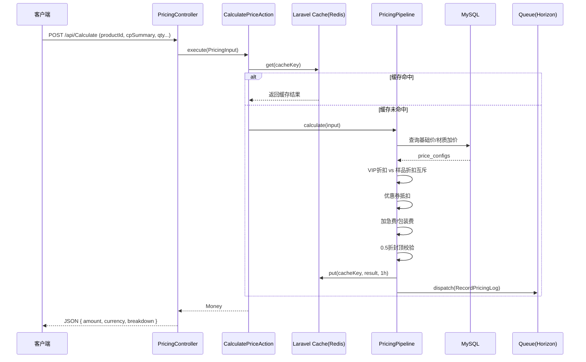
```mermaid
sequenceDiagram
    participant C as 客户端
    participant Ctrl as PricingController
    participant Act as CalculatePriceAction
    participant Cache as Laravel Cache(Redis)
    participant Pipe as PricingPipeline
    participant DB as MySQL
    participant Q as Queue(Horizon)

    C->>Ctrl: POST /api/Calculate (productId, cpSummary, qty...)
    Ctrl->>Act: execute(PricingInput)
    Act->>Cache: get(cacheKey)
    alt 缓存命中
        Cache-->>Act: 返回缓存结果
    else 缓存未命中
        Act->>Pipe: calculate(input)
        Pipe->>DB: 查询基础价/材质加价
        DB-->>Pipe: price_configs
        Pipe->>Pipe: VIP折扣 vs 样品折扣互斥
        Pipe->>Pipe: 优惠券抵扣
        Pipe->>Pipe: 加急费/包装费
        Pipe->>Pipe: 0.5折封顶校验
        Pipe->>Cache: put(cacheKey, result, 1h)
        Pipe->>Q: dispatch(RecordPricingLog)
    end
    Act-->>Ctrl: Money
    Ctrl-->>C: JSON { amount, currency, breakdown }
```

---

## 6.2 购物车系统设计

### 6.2.1 设计概述

购物车系统采用 Eloquent Model + Redis 摘要缓存 的双层架构：
- 持久层：carts + cart_items 表，支持登录前（guest）与登录后（customer）数据合并
- 缓存层：Redis 存储用户购物车摘要（商品数、选中项合计、失效项标记），TTL 24小时
- 失效检测：商品下架、参数模板版本变更、价格变动时自动标记购物车项为失效

**核心设计点**：
- 购物车合并：登录时通过 CartMergeAction 将 guest_cart（Redis Hash）合并到 customer_cart（DB）
- 容量限制：单个客户购物车上限 50 项，超限抛 CartFullException
- 有效期：购物车项默认 30 天过期，由 Schedule 每日清理

### 6.2.2 数据模型与关系

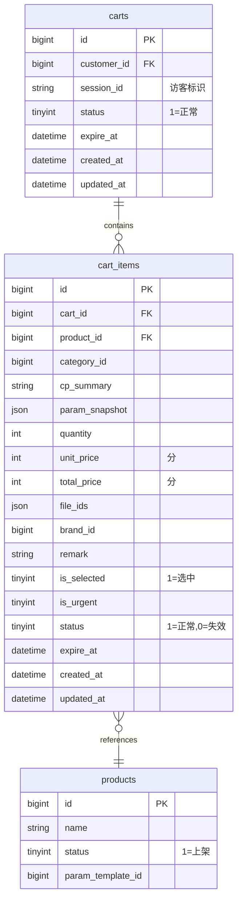
```mermaid
erDiagram
    carts {
        bigint id PK
        bigint customer_id FK
        string session_id "访客标识"
        tinyint status "1=正常"
        datetime expire_at
        datetime created_at
        datetime updated_at
    }
    cart_items {
        bigint id PK
        bigint cart_id FK
        bigint product_id FK
        bigint category_id
        string cp_summary
        json param_snapshot
        int quantity
        int unit_price "分"
        int total_price "分"
        json file_ids
        bigint brand_id
        string remark
        tinyint is_selected "1=选中"
        tinyint is_urgent
        tinyint status "1=正常,0=失效"
        datetime expire_at
        datetime created_at
        datetime updated_at
    }
    products {
        bigint id PK
        string name
        tinyint status "1=上架"
        bigint param_template_id
    }

    carts ||--o{ cart_items : contains
    cart_items }o--|| products : references
```

### 6.2.3 核心代码实现

#### 6.2.3.1 Eloquent 模型

```php
<?php

declare(strict_types=1);

namespace App\Models;

use Illuminate\Database\Eloquent\Factories\HasFactory;
use Illuminate\Database\Eloquent\Model;
use Illuminate\Database\Eloquent\Relations\HasMany;

class Cart extends Model
{
    use HasFactory;

    protected $fillable = [
        'customer_id', 'session_id', 'status', 'expire_at',
    ];

    protected $casts = [
        'expire_at' => 'datetime',
    ];

    public function items(): HasMany
    {
        return $this->hasMany(CartItem::class);
    }

    public function selectedItems(): HasMany
    {
        return $this->hasMany(CartItem::class)->where('is_selected', 1);
    }

    public function validItems(): HasMany
    {
        return $this->hasMany(CartItem::class)->where('status', 1);
    }

    public function scopeByCustomer($query, int $customerId)
    {
        return $query->where('customer_id', $customerId);
    }

    public function scopeBySession($query, string $sessionId)
    {
        return $query->where('session_id', $sessionId)->whereNull('customer_id');
    }
}
```

```php
<?php

declare(strict_types=1);

namespace App\Models;

use Illuminate\Database\Eloquent\Factories\HasFactory;
use Illuminate\Database\Eloquent\Model;
use Illuminate\Database\Eloquent\Relations\BelongsTo;

class CartItem extends Model
{
    use HasFactory;

    protected $fillable = [
        'cart_id', 'product_id', 'category_id', 'cp_summary',
        'param_snapshot', 'quantity', 'unit_price', 'total_price',
        'file_ids', 'brand_id', 'remark', 'is_selected', 'is_urgent',
        'status', 'expire_at',
    ];

    protected $casts = [
        'param_snapshot' => 'array',
        'file_ids' => 'array',
        'is_selected' => 'boolean',
        'is_urgent' => 'boolean',
        'expire_at' => 'datetime',
    ];

    public function cart(): BelongsTo
    {
        return $this->belongsTo(Cart::class);
    }

    public function product(): BelongsTo
    {
        return $this->belongsTo(Product::class);
    }

    public function markInvalid(string $reason): void
    {
        $this->update([
            'status' => 0,
            'remark' => $this->remark ? "{$this->remark} | {$reason}" : $reason,
        ]);
    }
}
```

#### 6.2.3.2 购物车 Action 类

```php
<?php

declare(strict_types=1);

namespace App\Actions;

use App\Models\Cart;
use App\Models\CartItem;
use App\Models\Product;
use App\Pipelines\PricingPipeline;
use App\ValueObjects\PricingInput;
use Illuminate\Support\Facades\Cache;
use Illuminate\Support\Facades\DB;
use Illuminate\Support\Facades\Log;

class AddToCartAction
{
    private const int CART_MAX_ITEMS = 50;
    private const int CART_EXPIRE_DAYS = 30;

    public function __construct(
        private PricingPipeline $pricing,
    ) {}

    public function execute(int $customerId, array $data): CartItem
    {
        return DB::transaction(function () use ($customerId, $data) {
            $product = Product::findOrFail($data['product_id']);
            if ($product->status !== 1) {
                throw new \App\Exceptions\CartException('PRODUCT_NOT_FOUND', '商品不存在或已下架');
            }

            $cart = Cart::firstOrCreate(
                ['customer_id' => $customerId],
                ['status' => 1, 'expire_at' => now()->addDays(self::CART_EXPIRE_DAYS)]
            );

            $currentCount = $cart->validItems()->count();
            if ($currentCount >= self::CART_MAX_ITEMS) {
                throw new \App\Exceptions\CartException('CART_FULL', '购物车已满，请先结算或删除商品');
            }

            \App\Services\CpSummaryParser::validate($data['cp_summary']);

            $pricingInput = new PricingInput(
                productId: $product->id,
                cpSummary: $data['cp_summary'],
                quantity: $data['quantity'],
                customerId: $customerId,
                couponCode: $data['coupon_code'] ?? null,
                isUrgent: $data['is_urgent'] ?? false,
            );
            $pricingResult = $this->pricing->calculate($pricingInput);

            $existing = $cart->validItems()
                ->where('product_id', $product->id)
                ->where('cp_summary', $data['cp_summary'])
                ->first();

            if ($existing) {
                $existing->quantity += $data['quantity'];
                $existing->total_price = $pricingResult->getPayable()->multiply(
                    (float) $existing->quantity / $data['quantity']
                )->amount;
                $existing->param_snapshot = $data['param_snapshot'] ?? $existing->param_snapshot;
                $existing->save();
                $this->refreshCartCache($cart);
                return $existing;
            }

            $item = $cart->items()->create([
                'product_id' => $product->id,
                'category_id' => $product->category_id,
                'cp_summary' => $data['cp_summary'],
                'param_snapshot' => $data['param_snapshot'] ?? null,
                'quantity' => $data['quantity'],
                'unit_price' => $pricingResult->getPayable()->amount,
                'total_price' => $pricingResult->getPayable()->amount,
                'file_ids' => $data['file_ids'] ?? [],
                'brand_id' => $data['brand_id'] ?? null,
                'remark' => $data['remark'] ?? null,
                'is_selected' => true,
                'is_urgent' => $data['is_urgent'] ?? false,
                'status' => 1,
                'expire_at' => now()->addDays(self::CART_EXPIRE_DAYS),
            ]);

            $this->refreshCartCache($cart);
            Log::info('[Cart] 添加购物车项', ['customer_id' => $customerId, 'cart_item_id' => $item->id]);

            return $item;
        });
    }

    private function refreshCartCache(Cart $cart): void
    {
        $summary = [
            'total_count' => $cart->validItems()->count(),
            'selected_count' => $cart->selectedItems()->where('status', 1)->count(),
            'selected_total' => $cart->selectedItems()->where('status', 1)->sum('total_price'),
            'invalid_count' => $cart->items()->where('status', 0)->count(),
            'updated_at' => now()->toDateTimeString(),
        ];

        // 购物车摘要缓存：TTL=10min，配合 Cache Tags 批量失效
        Cache::tags(['cart', "cart:{$cart->customer_id}"])
            ->put("cart:summary:{$cart->customer_id}", $summary, now()->addMinutes(10));
    }
}
```

#### 6.2.3.3 购物车合并逻辑（登录前后）

```php
<?php

declare(strict_types=1);

namespace App\Actions;

use App\Models\Cart;
use Illuminate\Support\Facades\DB;
use Illuminate\Support\Facades\Log;

class MergeCartAction
{
    public function execute(int $customerId, string $sessionId): void
    {
        $guestCart = Cart::bySession($sessionId)->with('items')->first();
        if (! $guestCart || $guestCart->items->isEmpty()) {
            return;
        }

        DB::transaction(function () use ($customerId, $guestCart) {
            $customerCart = Cart::firstOrCreate(
                ['customer_id' => $customerId],
                ['status' => 1, 'expire_at' => now()->addDays(30)]
            );

            foreach ($guestCart->items as $guestItem) {
                $existing = $customerCart->validItems()
                    ->where('product_id', $guestItem->product_id)
                    ->where('cp_summary', $guestItem->cp_summary)
                    ->first();

                if ($existing) {
                    $existing->update([
                        'quantity' => $existing->quantity + $guestItem->quantity,
                        'total_price' => $existing->total_price + $guestItem->total_price,
                    ]);
                } else {
                    $customerCart->items()->create($guestItem->toArray());
                }
            }

            $guestCart->items()->delete();
            $guestCart->delete();

            Log::info('[CartMerge] 购物车合并完成', [
                'customer_id' => $customerId,
                'merged_items' => $guestCart->items->count(),
            ]);
        });
    }
}
```

#### 6.2.3.4 失效检测与清理

```php
<?php

declare(strict_types=1);

namespace App\Actions;

use App\Models\CartItem;
use Illuminate\Support\Facades\Log;

class CheckCartValidityAction
{
    public function execute(int $customerId): int
    {
        $items = CartItem::whereHas('cart', fn ($q) => $q->where('customer_id', $customerId))
            ->where('status', 1)
            ->with('product')
            ->get();

        $invalidCount = 0;

        foreach ($items as $item) {
            $product = $item->product;

            if (! $product || $product->status !== 1) {
                $item->markInvalid('商品已下架');
                $invalidCount++;
                continue;
            }

            if (! \App\Services\CpSummaryParser::isStillValid(
                $item->cp_summary,
                $product->param_template_id
            )) {
                $item->markInvalid('规格参数已变更');
                $invalidCount++;
                continue;
            }

            $currentPrice = \App\Facades\Pricing::quickEstimate(
                $product->id,
                $item->cp_summary,
                $item->quantity
            );
            $priceDiff = abs($currentPrice - $item->unit_price) / max($item->unit_price, 1);
            if ($priceDiff > 0.10) {
                $item->markInvalid('商品价格已变动，请重新确认');
                $invalidCount++;
            }
        }

        Log::info('[CartValidity] 失效检测完成', [
            'customer_id' => $customerId,
            'invalid_count' => $invalidCount,
        ]);

        return $invalidCount;
    }
}
```

#### 6.2.3.5 购物车 Eloquent Observer

```php
<?php

declare(strict_types=1);

namespace App\Observers;

use App\Models\CartItem;
use Illuminate\Support\Facades\Cache;

class CartItemObserver
{
    public function created(CartItem $item): void
    {
        $this->clearSummaryCache($item);
    }

    public function updated(CartItem $item): void
    {
        $this->clearSummaryCache($item);
    }

    public function deleted(CartItem $item): void
    {
        $this->clearSummaryCache($item);
    }

    /**
     * 商品下架/参数模板变更/品类禁用时，自动标记购物车项失效
     */
    public function productStatusChanged(Product $product): void
    {
        if ($product->status !== 1) {
            CartItem::where('product_id', $product->id)
                ->where('status', 1)
                ->update([
                    'status' => 0,
                    'remark' => DB::raw("COALESCE(NULLIF(remark, ''), '') || '|商品已下架'"),
                ]);
        }
    }

    private function clearSummaryCache(CartItem $item): void
    {
        $cart = $item->cart;
        if ($cart && $cart->customer_id) {
            Cache::forget("cart:summary:{$cart->customer_id}");
        }
    }
}
```

```php
<?php

// AppServiceProvider::boot()
namespace App\Providers;

use App\Models\CartItem;
use App\Observers\CartItemObserver;
use Illuminate\Support\ServiceProvider;

class AppServiceProvider extends ServiceProvider
{
    public function boot(): void
    {
        CartItem::observe(CartItemObserver::class);
    }
}
```

### 6.2.4 数据流说明

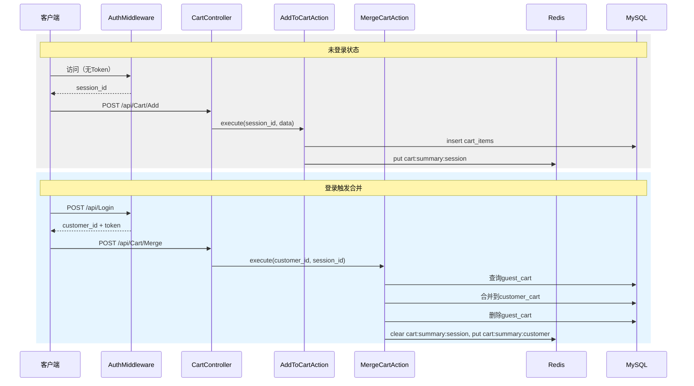
```mermaid
sequenceDiagram
    participant C as 客户端
    participant Auth as AuthMiddleware
    participant Ctrl as CartController
    participant Add as AddToCartAction
    participant Merge as MergeCartAction
    participant Cache as Redis
    participant DB as MySQL

    rect rgb(240,240,240)
        Note over C,DB: 未登录状态
        C->>Auth: 访问（无Token）
        Auth-->>C: session_id
        C->>Ctrl: POST /api/Cart/Add
        Ctrl->>Add: execute(session_id, data)
        Add->>DB: insert cart_items
        Add->>Cache: put cart:summary:session
    end

    rect rgb(230,245,255)
        Note over C,DB: 登录触发合并
        C->>Auth: POST /api/Login
        Auth-->>C: customer_id + token
        C->>Ctrl: POST /api/Cart/Merge
        Ctrl->>Merge: execute(customer_id, session_id)
        Merge->>DB: 查询guest_cart
        Merge->>DB: 合并到customer_cart
        Merge->>DB: 删除guest_cart
        Merge->>Cache: clear cart:summary:session, put cart:summary:customer
    end
```

---

## 6.3 热销榜与飙升榜服务 (BestsellerRankService)

### 6.3.1 设计概述

热销榜与飙升榜数据存储在 Redis Sorted Set 中，利用 ZADD / ZREVRANGE 实现高性能排序与分页查询。每日凌晨 2:00 由 Laravel Schedule 触发 SyncBestsellerRank Queue Job 异步刷新数据。

**双榜分离策略**：
- 热销榜（Bestseller）：heatValue = 近30天订单量×0.5 + 近30天浏览量×0.3 + 近30天收藏量×0.2
- 飙升榜（Rising）：growthRate = (近7天销量 - 前7天销量) / 前7天销量 × 100%

**运营干预**：后台通过 bestseller_rank_items 表配置置顶、隐藏、权重调整，刷新Job时读取运营配置与计算数据合并。

### 6.3.2 核心类图

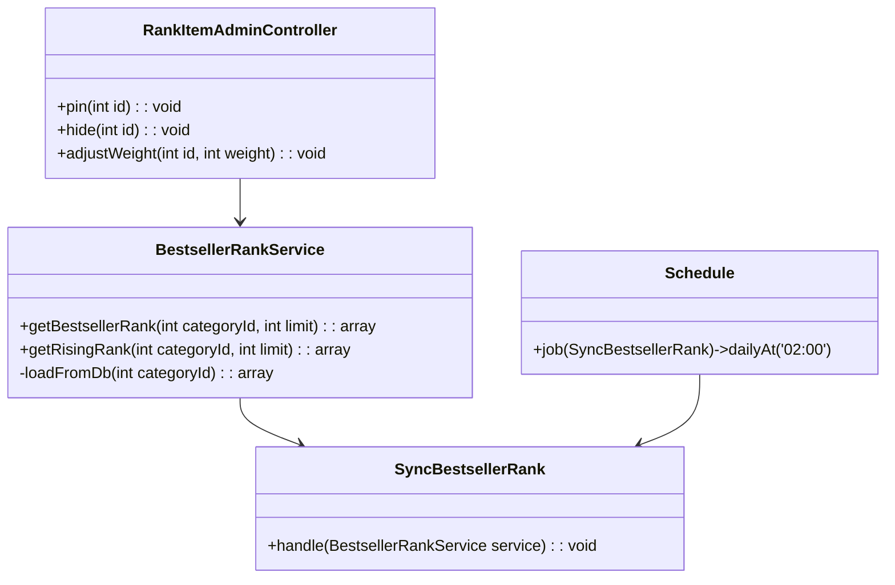
```mermaid
classDiagram
    class BestsellerRankService {
        +getBestsellerRank(int categoryId, int limit): array
        +getRisingRank(int categoryId, int limit): array
        -loadFromDb(int categoryId): array
    }
    class SyncBestsellerRank {
        +handle(BestsellerRankService service): void
    }
    class RankItemAdminController {
        +pin(int id): void
        +hide(int id): void
        +adjustWeight(int id, int weight): void
    }
    class Schedule {
        +job(SyncBestsellerRank)->dailyAt('02:00')
    }
    
    BestsellerRankService --> SyncBestsellerRank
    RankItemAdminController --> BestsellerRankService
    Schedule --> SyncBestsellerRank
```

### 6.3.3 核心代码实现

#### 6.3.3.1 Redis Sorted Set 存储结构

```php
<?php

declare(strict_types=1);

namespace App\Services;

use App\Models\BestsellerRankItem;
use Illuminate\Support\Facades\DB;
use Illuminate\Support\Facades\Log;
use Illuminate\Support\Facades\Redis;

class BestsellerRankService
{
    private const string BESTSELLER_KEY = 'rank:bestseller:%s';
    private const string RISING_KEY = 'rank:rising:%s';
    private const int BESTSELLER_TTL_HOURS = 24;
    private const int RISING_TTL_HOURS = 12;

    public function getBestsellerRank(int $categoryId, int $limit = 20): array
    {
        $redisKey = sprintf(self::BESTSELLER_KEY, $categoryId);
        $items = Redis::zrevrange($redisKey, 0, $limit - 1, ['withscores' => true]);
        if (! empty($items)) {
            return $this->hydrateFromRedis($items, 'bestseller');
        }

        $items = $this->loadBestsellerFromDb($categoryId, $limit);
        $this->syncToRedis($redisKey, $items, 'heat_value', self::BESTSELLER_TTL_HOURS);
        return $items;
    }

    public function getRisingRank(int $categoryId, int $limit = 20): array
    {
        $redisKey = sprintf(self::RISING_KEY, $categoryId);
        $items = Redis::zrevrange($redisKey, 0, $limit - 1, ['withscores' => true]);
        if (! empty($items)) {
            return $this->hydrateFromRedis($items, 'rising');
        }

        $items = $this->loadRisingFromDb($categoryId, $limit);
        $this->syncToRedis($redisKey, $items, 'growth_rate', self::RISING_TTL_HOURS);
        return $items;
    }

    private function loadBestsellerFromDb(int $categoryId, int $limit): array
    {
        $since = now()->subDays(30);

        $orderStats = DB::table('orders')
            ->select('cd_category_id', DB::raw('COUNT(*) as count'))
            ->where('category_id', $categoryId)
            ->where('created_at', '>=', $since)
            ->whereNotIn('status', [0, 255])
            ->groupBy('cd_category_id')
            ->pluck('count', 'cd_category_id')
            ->all();

        $viewStats = DB::table('product_view_logs')
            ->select('cd_category_id', DB::raw('COUNT(*) as count'))
            ->where('category_id', $categoryId)
            ->where('created_at', '>=', $since)
            ->groupBy('cd_category_id')
            ->pluck('count', 'cd_category_id')
            ->all();

        $favoriteStats = DB::table('product_favorites')
            ->select('cd_category_id', DB::raw('COUNT(*) as count'))
            ->where('category_id', $categoryId)
            ->where('created_at', '>=', $since)
            ->groupBy('cd_category_id')
            ->pluck('count', 'cd_category_id')
            ->all();

        $heatMap = [];
        $allKeys = array_unique(array_merge(
            array_keys($orderStats),
            array_keys($viewStats),
            array_keys($favoriteStats)
        ));
        foreach ($allKeys as $key) {
            $heatMap[$key] = ($orderStats[$key] ?? 0) * 0.5
                + ($viewStats[$key] ?? 0) * 0.3
                + ($favoriteStats[$key] ?? 0) * 0.2;
        }

        $manualItems = BestsellerRankItem::where('category_id', $categoryId)
            ->where('rank_type', 1)
            ->get()
            ->keyBy('cd_category_id');

        $result = [];
        foreach ($heatMap as $cdId => $heat) {
            $manual = $manualItems[$cdId] ?? null;
            if ($manual && $manual->is_show === 0) {
                continue;
            }

            $result[] = [
                'cd_category_id' => $cdId,
                'category_name' => $manual?->category_name ?? $cdId,
                'heat_value' => round($heat, 2),
                'score' => $manual?->score ?? 5.00,
                'labels' => $manual?->labels ?? '-',
                'icon' => $manual?->icon ?? null,
                'is_pinned' => $manual?->is_pinned ?? false,
                'sort_weight' => $manual?->sort_weight ?? 0,
                'is_show' => $manual?->is_show ?? true,
            ];
        }

        usort($result, function ($a, $b) {
            if ($a['is_pinned'] !== $b['is_pinned']) {
                return $b['is_pinned'] <=> $a['is_pinned'];
            }
            if ($a['sort_weight'] !== $b['sort_weight']) {
                return $b['sort_weight'] <=> $a['sort_weight'];
            }
            return $b['heat_value'] <=> $a['heat_value'];
        });

        return array_slice($result, 0, $limit);
    }

    private function loadRisingFromDb(int $categoryId, int $limit): array
    {
        $last7Start = now()->subDays(14);
        $last7End = now()->subDays(7);
        $recent7Start = now()->subDays(7);

        $recent = DB::table('orders')
            ->select('cd_category_id', DB::raw('COUNT(*) as count'))
            ->where('category_id', $categoryId)
            ->whereBetween('created_at', [$recent7Start, now()])
            ->groupBy('cd_category_id')
            ->pluck('count', 'cd_category_id')
            ->all();

        $previous = DB::table('orders')
            ->select('cd_category_id', DB::raw('COUNT(*) as count'))
            ->where('category_id', $categoryId)
            ->whereBetween('created_at', [$last7Start, $last7End])
            ->groupBy('cd_category_id')
            ->pluck('count', 'cd_category_id')
            ->all();

        $result = [];
        foreach ($recent as $cdId => $recentCount) {
            $prevCount = $previous[$cdId] ?? 0;
            if ($prevCount === 0) {
                continue;
            }
            $growthRate = ($recentCount - $prevCount) / $prevCount * 100;

            $result[] = [
                'cd_category_id' => $cdId,
                'category_name' => $cdId,
                'growth_rate' => round($growthRate, 2),
                'score' => 5.00,
                'labels' => '-',
                'icon' => null,
            ];
        }

        usort($result, fn ($a, $b) => $b['growth_rate'] <=> $a['growth_rate']);
        return array_slice($result, 0, $limit);
    }

    private function syncToRedis(string $key, array $items, string $scoreField, int $ttlHours): void
    {
        Redis::del($key);
        foreach ($items as $item) {
            $score = $item[$scoreField] ?? 0;
            Redis::zadd($key, $score, json_encode($item));
        }
        Redis::expire($key, $ttlHours * 3600);
    }

    private function hydrateFromRedis(array $items, string $type): array
    {
        return collect($items)->map(fn ($json) => json_decode($json, true))->values()->all();
    }
}
```

#### 6.3.3.2 每日刷新队列任务

```php
<?php

declare(strict_types=1);

namespace App\Jobs;

use App\Services\BestsellerRankService;
use Illuminate\Bus\Queueable;
use Illuminate\Contracts\Queue\ShouldQueue;
use Illuminate\Foundation\Bus\Dispatchable;
use Illuminate\Queue\InteractsWithQueue;
use Illuminate\Queue\SerializesModels;
use Illuminate\Support\Facades\Log;
use Illuminate\Support\Facades\Redis;

class SyncBestsellerRank implements ShouldQueue
{
    use Dispatchable, InteractsWithQueue, Queueable, SerializesModels;

    public int $tries = 3;

    public function handle(BestsellerRankService $service): void
    {
        Log::info('[RankSync] 开始刷新榜单');

        $categoryIds = \App\Models\ProductCategory::pluck('id')->all();

        foreach ($categoryIds as $categoryId) {
            try {
                $redisKey = sprintf('rank:bestseller:%s', $categoryId);
                Redis::del($redisKey);
                $service->getBestsellerRank($categoryId, 20);

                $redisKeyRising = sprintf('rank:rising:%s', $categoryId);
                Redis::del($redisKeyRising);
                $service->getRisingRank($categoryId, 20);
            } catch (\Throwable $e) {
                Log::error('[RankSync] 品类榜单刷新失败', [
                    'category_id' => $categoryId,
                    'error' => $e->getMessage(),
                ]);
            }
        }

        Log::info('[RankSync] 榜单刷新完成');
    }
}
```

#### 6.3.3.3 Schedule 配置

```php
<?php

namespace App\Console;

use App\Jobs\SyncBestsellerRank;
use Illuminate\Console\Scheduling\Schedule;
use Illuminate\Foundation\Console\Kernel as ConsoleKernel;

class Kernel extends ConsoleKernel
{
    protected function schedule(Schedule $schedule): void
    {
        $schedule->job(new SyncBestsellerRank)
            ->dailyAt('02:00')
            ->withoutOverlapping(3600);
    }
}
```

#### 6.3.3.4 运营干预后台接口

```php
<?php

declare(strict_types=1);

namespace App\Http\Controllers\Admin;

use App\Models\BestsellerRankItem;
use Illuminate\Http\Request;
use Illuminate\Support\Facades\Redis;

class RankItemAdminController
{
    public function toggleVisibility(Request $request, int $id)
    {
        $item = BestsellerRankItem::findOrFail($id);
        if ($request->has('is_pinned')) {
            $item->is_pinned = $request->boolean('is_pinned');
        }
        if ($request->has('is_show')) {
            $item->is_show = $request->boolean('is_show');
        }
        $item->operator_id = auth('admin')->id();
        $item->save();

        Redis::del(
            sprintf('rank:bestseller:%s', $item->category_id),
            sprintf('rank:rising:%s', $item->category_id)
        );

        return response()->json(['message' => '操作成功']);
    }

    public function adjustWeight(Request $request, int $id)
    {
        $request->validate(['weight' => 'required|integer|min:0']);

        $item = BestsellerRankItem::findOrFail($id);
        $item->sort_weight = $request->input('weight');
        $item->operator_id = auth('admin')->id();
        $item->save();

        Redis::del(sprintf('rank:bestseller:%s', $item->category_id));

        return response()->json(['message' => '权重调整成功']);
    }
}
```

### 6.3.4 数据流说明

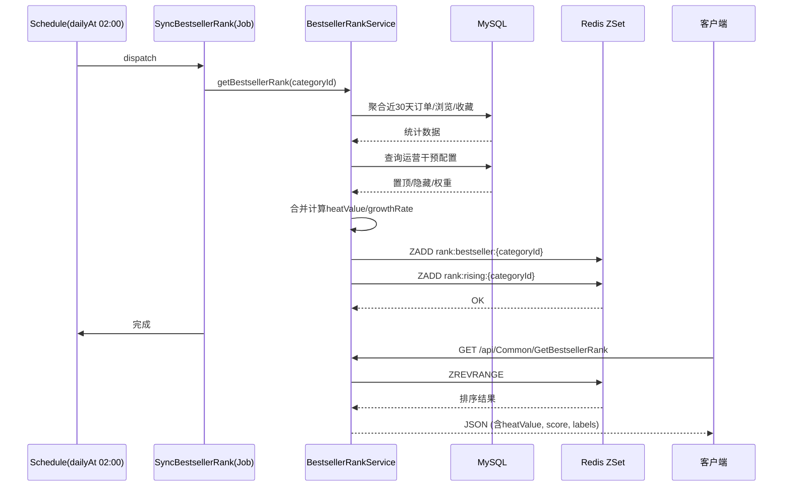
```mermaid
sequenceDiagram
    participant Cron as Schedule(dailyAt 02:00)
    participant Job as SyncBestsellerRank(Job)
    participant Svc as BestsellerRankService
    participant DB as MySQL
    participant Redis as Redis ZSet

    Cron->>Job: dispatch
    Job->>Svc: getBestsellerRank(categoryId)
    Svc->>DB: 聚合近30天订单/浏览/收藏
    DB-->>Svc: 统计数据
    Svc->>DB: 查询运营干预配置
    DB-->>Svc: 置顶/隐藏/权重
    Svc->>Svc: 合并计算heatValue/growthRate
    Svc->>Redis: ZADD rank:bestseller:{categoryId}
    Svc->>Redis: ZADD rank:rising:{categoryId}
    Redis-->>Svc: OK
    Job->>Cron: 完成

    participant C as 客户端
    C->>Svc: GET /api/Common/GetBestsellerRank
    Svc->>Redis: ZREVRANGE
    Redis-->>Svc: 排序结果
    Svc-->>C: JSON (含heatValue, score, labels)
```


---

## 6.4 3D预览服务设计 (3D Preview Service)

### 6.4.1 设计概述

3D预览服务为商品详情页提供 Three.js 模型渲染支持。后端负责：
1. **模型文件管理**：接收管理员上传的3D模型文件（GLTF/GLB/JSON），通过 Laravel Storage 写入 MinIO
2. **预签名URL生成**：前端通过后端获取带时效的 MinIO 预签名URL，直传文件到对象存储，降低服务器带宽压力
3. **模型JSON配置API**：为前端 Three.js 提供模型加载配置（材质映射、热点坐标、默认视角等）
4. **文件版本管理**：order_files 表记录文件元数据，Storage 磁盘统一管理物理存储

### 6.4.2 核心类图

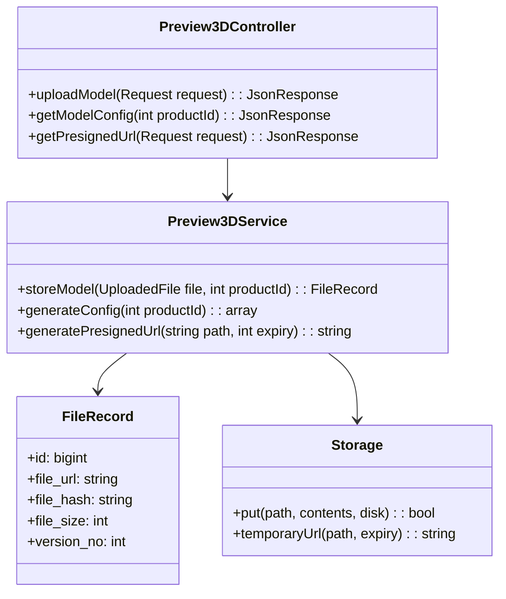
```mermaid
classDiagram
    class Preview3DController {
        +uploadModel(Request request): JsonResponse
        +getModelConfig(int productId): JsonResponse
        +getPresignedUrl(Request request): JsonResponse
    }
    class Preview3DService {
        +storeModel(UploadedFile file, int productId): FileRecord
        +generateConfig(int productId): array
        +generatePresignedUrl(string path, int expiry): string
    }
    class FileRecord {
        +id: bigint
        +file_url: string
        +file_hash: string
        +file_size: int
        +version_no: int
    }
    class Storage {
        +put(path, contents, disk): bool
        +temporaryUrl(path, expiry): string
    }
    
    Preview3DController --> Preview3DService
    Preview3DService --> FileRecord
    Preview3DService --> Storage
```

### 6.4.3 核心代码实现

#### 6.4.3.1 文件上传与预签名URL

```php
<?php

declare(strict_types=1);

namespace App\Http\Controllers;

use App\Models\FileRecord;
use Illuminate\Http\Request;
use Illuminate\Support\Facades\Storage;

class Preview3DController extends Controller
{
    public function getPresignedUrl(Request $request)
    {
        $validated = $request->validate([
            'file_name' => 'required|string|max:255',
            'file_type' => 'required|string|in:gltf,glb,json,obj',
            'product_id' => 'required|integer|exists:products,id',
        ]);

        $path = sprintf(
            '3d-models/%d/%s_%s.%s',
            $validated['product_id'],
            now()->format('YmdHis'),
            uniqid(),
            $validated['file_type']
        );

        $disk = Storage::disk('minio');
        $url = $disk->temporaryUrl($path, now()->addMinutes(30), [
            'Content-Type' => match ($validated['file_type']) {
                'gltf' => 'model/gltf+json',
                'glb' => 'model/gltf-binary',
                default => 'application/octet-stream',
            },
        ]);

        return response()->json([
            'presigned_url' => $url,
            'file_path' => $path,
            'expires_at' => now()->addMinutes(30)->toDateTimeString(),
        ]);
    }

    public function confirmUpload(Request $request)
    {
        $validated = $request->validate([
            'product_id' => 'required|integer|exists:products,id',
            'file_path' => 'required|string',
            'file_name' => 'required|string',
            'file_size' => 'required|integer',
            'file_hash' => 'required|string|size:64',
        ]);

        $disk = Storage::disk('minio');
        if (! $disk->exists($validated['file_path'])) {
            return response()->json(['error' => '文件未找到，请重新上传'], 422);
        }

        $latestVersion = FileRecord::where('product_id', $validated['product_id'])
            ->where('file_type', '3d_model')
            ->max('version_no') ?? 0;

        $record = FileRecord::create([
            'product_id' => $validated['product_id'],
            'file_url' => $disk->url($validated['file_path']),
            'file_path' => $validated['file_path'],
            'file_name' => $validated['file_name'],
            'file_size' => $validated['file_size'],
            'file_hash' => $validated['file_hash'],
            'file_type' => '3d_model',
            'version_no' => $latestVersion + 1,
            'is_current' => true,
            'upload_method' => 'presigned',
            'uploader_id' => auth('admin')->id(),
        ]);

        FileRecord::where('product_id', $validated['product_id'])
            ->where('file_type', '3d_model')
            ->where('id', '!=', $record->id)
            ->update(['is_current' => false]);

        return response()->json([
            'file_id' => $record->id,
            'version_no' => $record->version_no,
            'file_url' => $record->file_url,
        ]);
    }

    public function getModelConfig(int $productId)
    {
        $record = FileRecord::where('product_id', $productId)
            ->where('file_type', '3d_model')
            ->where('is_current', true)
            ->first();

        if (! $record) {
            return response()->json(['error' => '该商品暂无3D模型'], 404);
        }

        $disk = Storage::disk('minio');
        $tempUrl = $disk->temporaryUrl($record->file_path, now()->addHours(2));

        $config = \App\Models\Preview3DConfig::where('product_id', $productId)
            ->where('version_no', $record->version_no)
            ->first();

        return response()->json([
            'model_url' => $tempUrl,
            'format' => pathinfo($record->file_name, PATHINFO_EXTENSION),
            'hotspots' => $config?->hotspots ?? [],
            'default_camera' => $config?->default_camera ?? ['position' => [0, 0, 5], 'target' => [0, 0, 0]],
            'material_mapping' => $config?->material_mapping ?? [],
            'auto_rotate' => $config?->auto_rotate ?? true,
            'background_color' => $config?->background_color ?? '#f5f5f5',
        ]);
    }
}
```

#### 6.4.3.2 文件版本管理模型

```php
<?php

declare(strict_types=1);

namespace App\Models;

use Illuminate\Database\Eloquent\Model;

class FileRecord extends Model
{
    protected $fillable = [
        'product_id', 'order_id', 'file_url', 'file_path', 'file_name',
        'file_size', 'file_hash', 'file_type', 'version_no', 'version_name',
        'is_current', 'upload_method', 'source_type', 'source_id', 'uploader_id',
    ];

    protected $casts = [
        'is_current' => 'boolean',
        'file_size' => 'integer',
    ];

    public function scopeCurrent($query)
    {
        return $query->where('is_current', true);
    }

    public function scopeForProduct($query, int $productId)
    {
        return $query->where('product_id', $productId);
    }
}
```

#### 6.4.3.3 3D配置模型

```php
<?php

declare(strict_types=1);

namespace App\Models;

use Illuminate\Database\Eloquent\Model;

class Preview3DConfig extends Model
{
    protected $table = 'preview_3d_configs';

    protected $fillable = [
        'product_id', 'version_no', 'hotspots', 'default_camera',
        'material_mapping', 'auto_rotate', 'background_color',
    ];

    protected $casts = [
        'hotspots' => 'array',
        'default_camera' => 'array',
        'material_mapping' => 'array',
        'auto_rotate' => 'boolean',
    ];
}
```

#### 6.4.3.4 Storage 磁盘配置

```php
<?php

// config/filesystems.php
return [
    'disks' => [
        'minio' => [
            'driver' => 's3',
            'key' => env('MINIO_ACCESS_KEY'),
            'secret' => env('MINIO_SECRET_KEY'),
            'region' => env('MINIO_REGION', 'us-east-1'),
            'bucket' => env('MINIO_BUCKET', 'yian-prints'),
            'endpoint' => env('MINIO_ENDPOINT', 'http://localhost:9000'),
            'use_path_style_endpoint' => true,
            'visibility' => 'private',
        ],
    ],
];
```

### 6.4.4 数据流说明

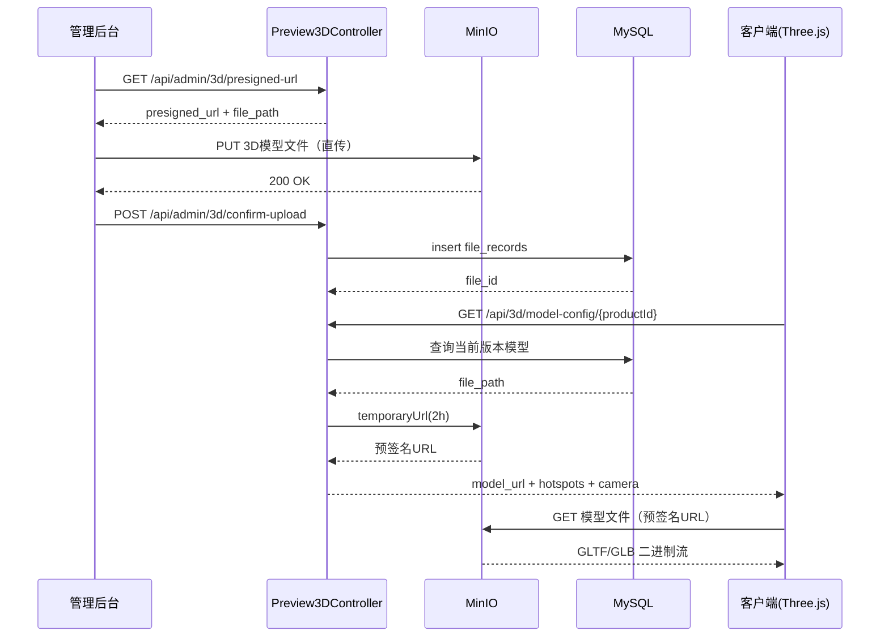
```mermaid
sequenceDiagram
    participant Admin as 管理后台
    participant Ctrl as Preview3DController
    participant MinIO as MinIO
    participant DB as MySQL
    participant C as 客户端(Three.js)

    Admin->>Ctrl: GET /api/admin/3d/presigned-url
    Ctrl-->>Admin: presigned_url + file_path
    Admin->>MinIO: PUT 3D模型文件（直传）
    MinIO-->>Admin: 200 OK
    Admin->>Ctrl: POST /api/admin/3d/confirm-upload
    Ctrl->>DB: insert file_records
    DB-->>Ctrl: file_id

    C->>Ctrl: GET /api/3d/model-config/{productId}
    Ctrl->>DB: 查询当前版本模型
    DB-->>Ctrl: file_path
    Ctrl->>MinIO: temporaryUrl(2h)
    MinIO-->>Ctrl: 预签名URL
    Ctrl-->>C: model_url + hotspots + camera
    C->>MinIO: GET 模型文件（预签名URL）
    MinIO-->>C: GLTF/GLB 二进制流
```

---

## 6.5 订单状态机设计 (Order State Machine)

### 6.5.1 设计概述

订单状态机是订单系统的核心控制中枢。PHP/Laravel版采用 **PHP 8.1 Backed Enum** 定义 FM（工厂生产流程状态）与 nM（客户展示状态），在 Enum 中内聚状态流转规则与双状态映射逻辑。

**核心设计点**：
- **FM状态枚举**：OrderStatus Backed Enum，内置 canTransitionTo() 校验方法
- **nM映射**：Enum 的 toCustomerStatus() 方法，将内部 FM 映射为客户展示状态
- **Eloquent Observer**：OrderObserver 监听 updating 事件，status 字段变更时自动触发 OrderStatusChanged 事件
- **订单修改流程**：独立 OrderModifyStatus Enum（IM枚举），通过 modify_status 字段管理，不破坏主状态机
- **定金子状态**：unpaid_deposit 字段叠加在主状态上，由 DepositStateManager 解析复合展示文本

**双状态映射规则**：

| FM(内部) | nM(客户展示) | 说明 |
|:--------:|:------------:|------|
| 0(已取消) | 0(已取消) | — |
| 1(已登记) | 1(待付款) | modifyStatus>0时→5(待修改) |
| 3,11,12,13,15 | 6(待生产) | 已审核/已下单/已分配 → 待生产 |
| 17,20,54,55,60,61,62 | 3(生产中) | 已开工单/外协/入库 → 生产中 |
| 65,66 | 7(待发货) | 已打包/已出库 → 待发货 |
| 67,69 | 4(已发货)/9(已完成) | 已发货→已发货，已完成→已完成 |
| 100(待沟通),101(文件审核不通过) | 5(待修改) | 特殊状态 |
| 任意+modifyStatus>0且未确认 | 5(待修改) | 修改子状态优先覆盖 |

> **注意**：`nM=6`（待生产）对应FM中生产准备阶段（审核后~开工单前），`nM=3`（生产中）对应实际生产执行阶段（开工单后~入库前）。两者均为内部"生产中"的大范畴，但对客户展示需区分"排队待生产"与"正在生产"。

### 6.5.2 状态机核心实现

#### 6.5.2.2 nM 客户展示状态枚举

```php
<?php

declare(strict_types=1);

namespace App\Enums;

enum CustomerOrderStatus: int
{
    case CANCELLED = 0;
    case PENDING_PAYMENT = 1;
    case IN_PRODUCTION = 3;
    case SHIPPED = 4;
    case PENDING_MODIFY = 5;
    case PENDING_PRODUCTION = 6;
    case PENDING_SHIP = 7;
    case DELIVERING = 8;
    case COMPLETED = 9;

    public function label(): string
    {
        return match ($this) {
            self::CANCELLED => '已取消',
            self::PENDING_PAYMENT => '待付款',
            self::IN_PRODUCTION => '生产中',
            self::SHIPPED => '已发货',
            self::PENDING_MODIFY => '待修改',
            self::PENDING_PRODUCTION => '待生产',
            self::PENDING_SHIP => '待发货',
            self::DELIVERING => '配送中',
            self::COMPLETED => '已完成',
        };
    }
}
```

#### 6.5.2.3 IM 订单修改状态枚举

```php
<?php

declare(strict_types=1);

namespace App\Enums;

enum OrderModifyStatus: int
{
    case DEFAULT = 0;
    case NOT_MODIFIED = 1;
    case FILE_PENDING_FINAL = 2;
    case PRODUCT_PENDING_MODIFY = 8;
    case FILE_PENDING_MODIFY = 16;
    case CERT_PENDING_MODIFY = 32;
    case PAUSED = 43;
    case MODIFIED = 64;
    case CONFIRMED = 128;

    public function label(): string
    {
        return match ($this) {
            self::DEFAULT => '默认',
            self::NOT_MODIFIED => '未修改',
            self::FILE_PENDING_FINAL => '文件待定稿',
            self::PRODUCT_PENDING_MODIFY => '产品待修改',
            self::FILE_PENDING_MODIFY => '文件待修改',
            self::CERT_PENDING_MODIFY => '证书待修改',
            self::PAUSED => '已暂停',
            self::MODIFIED => '已修改',
            self::CONFIRMED => '已确认',
        };
    }

    public function isInModifyProcess(): bool
    {
        return match ($this) {
            self::DEFAULT, self::NOT_MODIFIED, self::CONFIRMED => false,
            default => true,
        };
    }

    /**
     * 判断是否包含指定修改类型（位掩码检查）
     */
    public function hasType(self $type): bool
    {
        return ($this->value & $type->value) === $type->value;
    }
}
```

#### 6.5.2.4 Order 模型与状态流转方法
#### 6.5.2.5 Eloquent Observer 自动触发事件

```php
<?php

declare(strict_types=1);

namespace App\Observers;

use App\Enums\OrderStatus;
use App\Events\OrderStatusChanged;
use App\Models\Order;
use Illuminate\Support\Facades\Log;

class OrderObserver
{
    public function updating(Order $order): void
    {
        if ($order->isDirty('status')) {
            $original = OrderStatus::from($order->getOriginal('status'));
            $new = $order->status;

            if (! $original->canTransitionTo($new)) {
                throw new \App\Exceptions\InvalidStateTransitionException(
                    "Observer拦截非法流转: {$original->value} -> {$new->value}"
                );
            }

            $order->out_status_name = $new->toCustomerStatus($order->modify_status)->value;

            Log::info('[OrderObserver] 状态变更', [
                'order_sn' => $order->order_sn,
                'from' => $original->label(),
                'to' => $new->label(),
            ]);
        }
    }

    public function updated(Order $order): void
    {
        if ($order->wasChanged('status')) {
            $original = OrderStatus::from($order->getOriginal('status'));

            event(new OrderStatusChanged($order, $original, $order->status));
        }
    }
}
```

```php
<?php

// AppServiceProvider::boot()
namespace App\Providers;

use App\Models\Order;
use App\Observers\OrderObserver;
use Illuminate\Support\ServiceProvider;

class AppServiceProvider extends ServiceProvider
{
    public function boot(): void
    {
        Order::observe(OrderObserver::class);
    }
}
```

#### 6.5.2.6 订单状态变更事件与监听

```php
<?php

declare(strict_types=1);

namespace App\Events;

use App\Enums\OrderStatus;
use Illuminate\Foundation\Events\Dispatchable;
use Illuminate\Queue\SerializesModels;

class OrderStatusChanged
{
    use Dispatchable, SerializesModels;

    public function __construct(
        public Order $order,
        public OrderStatus $oldStatus,
        public OrderStatus $newStatus,
        public readonly ?string $operator = null,
        public readonly ?string $remark = null,
    ) {}
}
```

```php
<?php

declare(strict_types=1);

namespace App\Listeners;

use App\Events\OrderStatusChanged;
use Illuminate\Support\Facades\Log;

class OrderStatusChangedNotification
{
    public function handle(OrderStatusChanged $event): void
    {
        $notifyNodes = [
            \App\Enums\OrderStatus::OUTBOUND->value,
            \App\Enums\OrderStatus::COMPLETED->value,
            \App\Enums\OrderStatus::CANCELLED->value,
        ];

        if (! in_array($event->newStatus->value, $notifyNodes)) {
            return;
        }

        $order = $event->order;

        $order->customer->notify(new \App\Notifications\OrderStatusUpdated($order));

        Log::info('[OrderNotify] 状态变更通知已发送', [
            'order_sn' => $order->order_sn,
            'to_status' => $event->newStatus->label(),
        ]);
    }
}
```

```php
<?php

// EventServiceProvider
protected $listen = [
    \App\Events\OrderStatusChanged::class => [
        \App\Listeners\OrderStatusChangedNotification::class,
        \App\Listeners\OrderStatusAuditLog::class,
        \App\Listeners\OrderStatusWebhook::class,
    ],
];
```

### 6.5.3 样品订单与云仓订单独立状态机

```php
<?php

declare(strict_types=1);

namespace App\Enums;

enum SampleOrderStatus: int
{
    case PENDING_PAYMENT = 100;
    case PAID = 101;
    case PENDING_SHIP = 102;
    case SHIPPED = 103;
    case COMPLETED = 104;
    case CANCELLED = 105;

    public function canTransitionTo(self $target): bool
    {
        return match ([$this, $target]) {
            [self::PENDING_PAYMENT, self::PAID],
            [self::PENDING_PAYMENT, self::CANCELLED] => true,
            [self::PAID, self::PENDING_SHIP] => true,
            [self::PENDING_SHIP, self::SHIPPED] => true,
            [self::SHIPPED, self::COMPLETED] => true,
            default => false,
        };
    }

    public function label(): string
    {
        return match ($this) {
            self::PENDING_PAYMENT => '待付款',
            self::PAID => '已付款',
            self::PENDING_SHIP => '待发货',
            self::SHIPPED => '已发货',
            self::COMPLETED => '已完成',
            self::CANCELLED => '已取消',
        };
    }
}
```

```php
<?php

declare(strict_types=1);

namespace App\Enums;

enum CloudOrderStatus: int
{
    case PENDING_PAYMENT = 200;
    case PAID = 201;
    case OUTBOUND = 202;
    case SHIPPED = 203;
    case COMPLETED = 204;
    case CANCELLED = 205;

    public function canTransitionTo(self $target): bool
    {
        return match ([$this, $target]) {
            [self::PENDING_PAYMENT, self::PAID],
            [self::PENDING_PAYMENT, self::CANCELLED] => true,
            [self::PAID, self::OUTBOUND] => true,
            [self::OUTBOUND, self::SHIPPED] => true,
            [self::SHIPPED, self::COMPLETED] => true,
            default => false,
        };
    }

    public function label(): string
    {
        return match ($this) {
            self::PENDING_PAYMENT => '待付款',
            self::PAID => '已付款',
            self::OUTBOUND => '已出库',
            self::SHIPPED => '已发货',
            self::COMPLETED => '已完成',
            self::CANCELLED => '已取消',
        };
    }
}
```

### 6.5.4 数据流说明

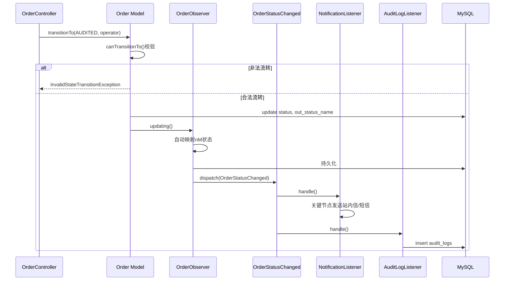
```mermaid
sequenceDiagram
    participant Ctrl as OrderController
    participant Order as Order Model
    participant Obs as OrderObserver
    participant Event as OrderStatusChanged
    participant Notify as NotificationListener
    participant Audit as AuditLogListener
    participant DB as MySQL

    Ctrl->>Order: transitionTo(AUDITED, operator)
    Order->>Order: canTransitionTo()校验
    alt 非法流转
        Order-->>Ctrl: InvalidStateTransitionException
    else 合法流转
        Order->>DB: update status, out_status_name
        Order->>Obs: updating()
        Obs->>Obs: 自动映射nM状态
        Obs->>DB: 持久化
        Obs->>Event: dispatch(OrderStatusChanged)
        Event->>Notify: handle()
        Notify->>Notify: 关键节点发送站内信/短信
        Event->>Audit: handle()
        Audit->>DB: insert audit_logs
    end
```

---

## 6.6 订单评价系统设计

### 6.6.1 设计概述

订单评价系统在订单完成后（FM=69 / nM=9）允许客户提交评价。核心注意点：
- **评价等级与常规相反**：PRD定义 4=非常满意、5=不满意，必须在代码和展示层保持与源码一致，前端可按需映射转换
- **图片上传**：支持最多9张凭证图，通过 Laravel Storage 直传 MinIO
- **成长值奖励**：评价完成后发放 +10 成长值（异步队列）

### 6.6.2 核心代码实现

#### 6.6.2.1 评价等级枚举

```php
<?php

declare(strict_types=1);

namespace App\Enums;

enum CommentLevel: int
{
    case EXTREMELY_POOR = 1;
    case AVERAGE = 2;
    case SATISFIED = 3;
    case VERY_SATISFIED = 4;
    case DISSATISFIED = 5;

    public function label(): string
    {
        return match ($this) {
            self::EXTREMELY_POOR => '极差',
            self::AVERAGE => '一般',
            self::SATISFIED => '满意',
            self::VERY_SATISFIED => '非常满意',
            self::DISSATISFIED => '不满意',
        };
    }

    public function isPositive(): bool
    {
        return in_array($this, [self::SATISFIED, self::VERY_SATISFIED], true);
    }
}
```

#### 6.6.2.2 Eloquent 模型与 Action

```php
<?php

declare(strict_types=1);

namespace App\Models;

use App\Enums\CommentLevel;
use Illuminate\Database\Eloquent\Model;

class OrderReview extends Model
{
    protected $table = 'order_reviews';

    protected $fillable = [
        'order_id', 'order_sn', 'customer_id', 'product_id',
        'level', 'content', 'images', 'tags', 'is_anonymous',
        'reply_content', 'reply_time', 'status',
    ];

    protected $casts = [
        'level' => CommentLevel::class,
        'images' => 'array',
        'tags' => 'array',
        'is_anonymous' => 'boolean',
        'reply_time' => 'datetime',
    ];

    public function order()
    {
        return $this->belongsTo(Order::class);
    }
}
```

```php
<?php

declare(strict_types=1);

namespace App\Actions;

use App\Enums\CommentLevel;
use App\Models\Order;
use App\Models\OrderReview;
use Illuminate\Support\Facades\DB;
use Illuminate\Support\Facades\Log;

class SubmitOrderReviewAction
{
    public function execute(int $customerId, array $data): OrderReview
    {
        return DB::transaction(function () use ($customerId, $data) {
            $order = Order::where('order_sn', $data['order_sn'])->firstOrFail();

            if ($order->customer_id !== $customerId) {
                throw new \App\Exceptions\UnauthorizedException('无权评价此订单');
            }

            if ($order->status !== \App\Enums\OrderStatus::COMPLETED) {
                throw new \App\Exceptions\BizException('ORDER_NOT_COMPLETED', '仅已完成订单可评价');
            }

            if (OrderReview::where('order_sn', $data['order_sn'])->exists()) {
                throw new \App\Exceptions\BizException('COMMENT_EXISTS', '该订单已评价');
            }

            $level = CommentLevel::from($data['level']);

            $review = OrderReview::create([
                'order_id' => $order->id,
                'order_sn' => $order->order_sn,
                'customer_id' => $customerId,
                'product_id' => $data['product_id'] ?? $order->items->first()?->product_id,
                'level' => $level,
                'content' => $data['content'] ?? '',
                'images' => $data['images'] ?? [],
                'tags' => $data['tags'] ?? [],
                'is_anonymous' => $data['is_anonymous'] ?? false,
                'status' => 1,
            ]);

            \App\Jobs\GrantGrowthValue::dispatch(
                customerId: $customerId,
                growthValue: 10,
                type: \App\Enums\GrowthValueType::COMMENT,
                sourceId: $review->id,
                description: "订单评价奖励，orderSn={$order->order_sn}",
            );

            Log::info('[Review] 评价提交', [
                'order_sn' => $order->order_sn,
                'customer_id' => $customerId,
                'level' => $level->label(),
            ]);

            return $review;
        });
    }
}
```

#### 6.6.2.3 图片上传处理

```php
<?php

declare(strict_types=1);

namespace App\Http\Controllers;

use Illuminate\Http\Request;
use Illuminate\Support\Facades\Storage;
use Illuminate\Support\Str;

class ReviewImageController extends Controller
{
    public function upload(Request $request)
    {
        $request->validate([
            'images' => 'required|array|max:9',
            'images.*' => 'required|image|mimes:jpg,jpeg,png|max:5120',
        ]);

        $urls = [];
        $disk = Storage::disk('minio');

        foreach ($request->file('images') as $file) {
            $path = $file->storeAs(
                'reviews/' . now()->format('Y/m'),
                Str::uuid() . '.' . $file->getClientOriginalExtension(),
                'minio'
            );
            $urls[] = $disk->url($path);
        }

        return response()->json(['urls' => $urls]);
    }
}
```

### 6.6.3 数据流说明

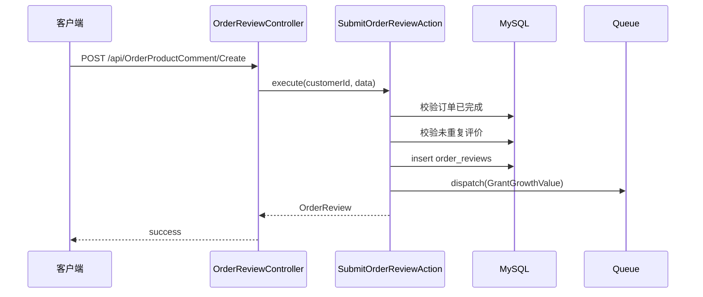
```mermaid
sequenceDiagram
    participant C as 客户端
    participant Ctrl as OrderReviewController
    participant Act as SubmitOrderReviewAction
    participant DB as MySQL
    participant Q as Queue

    C->>Ctrl: POST /api/OrderProductComment/Create
    Ctrl->>Act: execute(customerId, data)
    Act->>DB: 校验订单已完成
    Act->>DB: 校验未重复评价
    Act->>DB: insert order_reviews
    Act->>Q: dispatch(GrantGrowthValue)
    Act-->>Ctrl: OrderReview
    Ctrl-->>C: success
```

---

## 6.7 订单统计服务 (OrderStatisticsService)

### 6.7.1 设计概述

订单统计服务面向客户侧（我的订单数、待付款、待收货等）和管理后台（销售趋势、品类占比）提供聚合数据。采用 Eloquent Query + DB::raw 聚合 + Redis 缓存 三层架构：
- 实时统计（如待付款数量）：Eloquent Scope 直接查询，结果缓存5分钟
- 趋势统计（如近6个月订单金额）：DB::raw 聚合，结果缓存1小时
- 定时报表：Schedule 每日生成昨日汇总，写入 daily_order_stats 表

### 6.7.2 核心代码实现

```php
<?php

declare(strict_types=1);

namespace App\Services;

use App\Enums\OrderStatus;
use App\Models\Order;
use Illuminate\Support\Facades\Cache;
use Illuminate\Support\Facades\DB;

class OrderStatisticsService
{
    public function getCustomerOrderCounts(int $customerId): array
    {
        return Cache::remember("order:counts:{$customerId}", now()->addMinutes(5), function () use ($customerId) {
            $baseQuery = Order::where('customer_id', $customerId)
                ->whereNotIn('status', [OrderStatus::CANCELLED, OrderStatus::EXCEPTION]);

            return [
                'total' => (clone $baseQuery)->count(),
                'pending_payment' => (clone $baseQuery)
                    ->where('status', OrderStatus::REGISTERED)
                    ->where('modify_status', 0)
                    ->count(),
                'in_production' => (clone $baseQuery)
                    ->where('status', '>=', OrderStatus::AUDITED->value)
                    ->where('status', '<', OrderStatus::INBOUND->value)
                    ->count(),
                'pending_ship' => (clone $baseQuery)
                    ->where('status', OrderStatus::INBOUND)
                    ->count(),
                'shipped' => (clone $baseQuery)
                    ->whereIn('status', [OrderStatus::OUTBOUND, OrderStatus::NORMAL_OUTBOUND])
                    ->count(),
                'completed' => (clone $baseQuery)
                    ->where('status', OrderStatus::COMPLETED)
                    ->count(),
                'pending_modify' => (clone $baseQuery)
                    ->where('modify_status', '>', 0)
                    ->where('modify_status', '!=', 128)
                    ->count(),
            ];
        });
    }

    public function getLastSixMonthsStatistics(int $customerId): array
    {
        $cacheKey = "order:stats:6m:{$customerId}";

        return Cache::remember($cacheKey, now()->addHour(), function () use ($customerId) {
            $results = Order::select(
                DB::raw("DATE_FORMAT(created_at, '%Y-%m') as month"),
                DB::raw('COUNT(*) as order_count'),
                DB::raw('SUM(total_price) as total_amount'),
                DB::raw('COUNT(DISTINCT DATE(created_at)) as order_days')
            )
                ->where('customer_id', $customerId)
                ->where('created_at', '>=', now()->subMonths(6))
                ->whereNotIn('status', [OrderStatus::CANCELLED, OrderStatus::EXCEPTION])
                ->groupBy('month')
                ->orderBy('month')
                ->get();

            return $results->map(fn ($row) => [
                'month' => $row->month,
                'order_count' => (int) $row->order_count,
                'total_amount' => round($row->total_amount / 100, 2),
                'order_days' => (int) $row->order_days,
            ])->all();
        });
    }

    public function getStatisticsByParentCategory(int $customerId): array
    {
        $cacheKey = "order:stats:category:{$customerId}";

        return Cache::remember($cacheKey, now()->addHour(), function () use ($customerId) {
            return Order::select(
                'parent_category_id',
                DB::raw('COUNT(*) as count'),
                DB::raw('SUM(total_price) as amount')
            )
                ->where('customer_id', $customerId)
                ->whereNotIn('status', [OrderStatus::CANCELLED, OrderStatus::EXCEPTION])
                ->groupBy('parent_category_id')
                ->get()
                ->map(fn ($row) => [
                    'parent_category_id' => $row->parent_category_id,
                    'count' => (int) $row->count,
                    'amount' => round($row->amount / 100, 2),
                ])
                ->all();
        });
    }

    public function getCustomerOverallStatistics(int $customerId): array
    {
        $cacheKey = "order:stats:overall:{$customerId}";

        return Cache::remember($cacheKey, now()->addMinutes(10), function () use ($customerId) {
            $stats = Order::where('customer_id', $customerId)
                ->whereNotIn('status', [OrderStatus::CANCELLED, OrderStatus::EXCEPTION])
                ->select(
                    DB::raw('COUNT(*) as total_orders'),
                    DB::raw('SUM(total_price) as total_amount'),
                    DB::raw('AVG(total_price) as avg_price'),
                    DB::raw('MAX(created_at) as last_order_at')
                )
                ->first();

            return [
                'total_orders' => (int) $stats->total_orders,
                'total_amount' => round($stats->total_amount / 100, 2),
                'avg_price' => round($stats->avg_price / 100, 2),
                'last_order_at' => $stats->last_order_at,
            ];
        });
    }

    public function clearCustomerCache(int $customerId): void
    {
        Cache::forget("order:counts:{$customerId}");
        Cache::forget("order:stats:6m:{$customerId}");
        Cache::forget("order:stats:category:{$customerId}");
        Cache::forget("order:stats:overall:{$customerId}");
    }
}
```

#### 6.7.3 统计缓存清理Listener

```php
<?php

declare(strict_types=1);

namespace App\Listeners;

use App\Events\OrderStatusChanged;
use App\Services\OrderStatisticsService;

class ClearOrderStatsCache
{
    public function __construct(
        private OrderStatisticsService $statsService,
    ) {}

    public function handle(OrderStatusChanged $event): void
    {
        $this->statsService->clearCustomerCache($event->order->customer_id);
    }
}
```

### 6.7.4 数据流说明

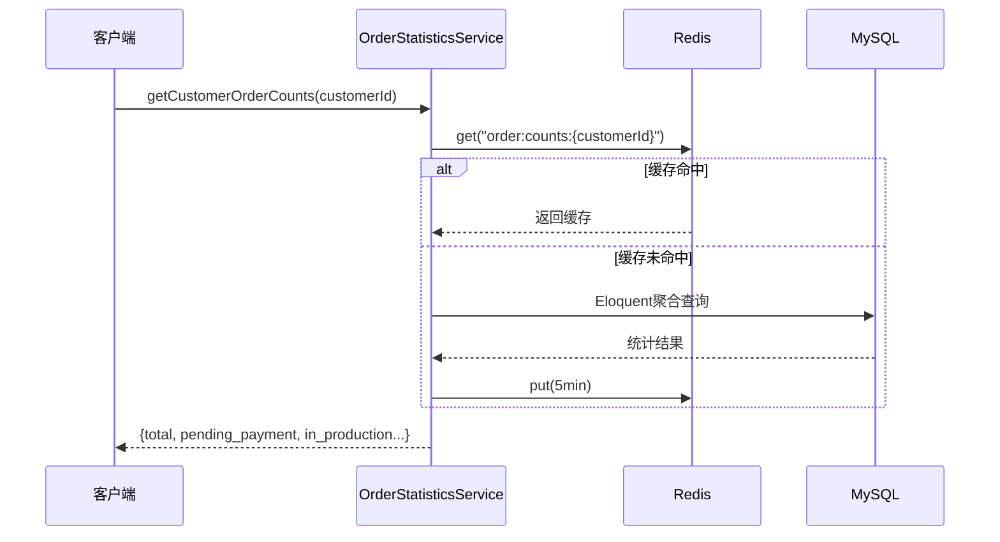
```mermaid
sequenceDiagram
    participant C as 客户端
    participant Svc as OrderStatisticsService
    participant Cache as Redis
    participant DB as MySQL

    C->>Svc: getCustomerOrderCounts(customerId)
    Svc->>Cache: get("order:counts:{customerId}")
    alt 缓存命中
        Cache-->>Svc: 返回缓存
    else 缓存未命中
        Svc->>DB: Eloquent聚合查询
        DB-->>Svc: 统计结果
        Svc->>Cache: put(5min)
    end
    Svc-->>C: {total, pending_payment, in_production...}
```

---

## 6.8 云仓批量下单与模板下载

### 6.8.1 设计概述

云仓批量下单允许客户通过 Excel 模板导入多个收货地址和数量，系统自动创建批量订单。核心组件：
- **模板生成**：PhpSpreadsheet 动态生成带下拉选项和数据验证的 Excel 模板
- **导入验证**：Laravel FormRequest + 自定义 Validation Rule 校验每一行数据
- **异步创建**：验证通过后通过 Queue::bulk() 批量投递 CreateCloudOrderJob，Horizon 监控进度

### 6.8.2 核心代码实现

#### 6.8.2.1 Excel 模板生成

```php
<?php

declare(strict_types=1);

namespace App\Services;

use PhpOffice\PhpSpreadsheet\Spreadsheet;
use PhpOffice\PhpSpreadsheet\Writer\Xlsx;
use Symfony\Component\HttpFoundation\StreamedResponse;

class CloudOrderTemplateService
{
    public function generate(int $productId): StreamedResponse
    {
        $spreadsheet = new Spreadsheet();
        $sheet = $spreadsheet->getActiveSheet();

        $headers = ['序号', '收货人', '手机号', '省', '市', '区', '详细地址', '数量', '备注'];
        foreach ($headers as $col => $header) {
            $sheet->setCellValueByColumnAndRow($col + 1, 1, $header);
        }

        $sheet->setCellValue('A2', 1);
        $sheet->setCellValue('B2', '张三');
        $sheet->setCellValue('C2', '13800138000');
        $sheet->setCellValue('D2', '浙江省');
        $sheet->setCellValue('E2', '杭州市');
        $sheet->setCellValue('F2', '西湖区');
        $sheet->setCellValue('G2', 'xx街道xx号');
        $sheet->setCellValue('H2', 100);
        $sheet->setCellValue('I2', '加急');

        $sheet->getColumnDimension('A')->setWidth(8);
        $sheet->getColumnDimension('B')->setWidth(12);
        $sheet->getColumnDimension('C')->setWidth(15);
        $sheet->getColumnDimension('D')->setWidth(12);
        $sheet->getColumnDimension('E')->setWidth(12);
        $sheet->getColumnDimension('F')->setWidth(12);
        $sheet->getColumnDimension('G')->setWidth(30);
        $sheet->getColumnDimension('H')->setWidth(10);
        $sheet->getColumnDimension('I')->setWidth(20);

        $filename = "cloud_order_template_{$productId}_" . now()->format('Ymd') . '.xlsx';

        return new StreamedResponse(function () use ($spreadsheet) {
            $writer = new Xlsx($spreadsheet);
            $writer->save('php://output');
        }, 200, [
            'Content-Type' => 'application/vnd.openxmlformats-officedocument.spreadsheetml.sheet',
            'Content-Disposition' => "attachment; filename=\"{$filename}\"",
        ]);
    }
}
```

#### 6.8.2.2 批量导入验证与队列投递

```php
<?php

declare(strict_types=1);

namespace App\Actions;

use App\Jobs\CreateCloudOrderJob;
use App\Models\Product;
use Illuminate\Support\Facades\Queue;
use Illuminate\Support\Facades\Storage;
use Illuminate\Support\Facades\Validator;
use PhpOffice\PhpSpreadsheet\IOFactory;

class ImportCloudBatchOrderAction
{
    public function execute(int $customerId, int $productId, string $filePath): array
    {
        $product = Product::findOrFail($productId);
        if (! $product->is_cloud_warehouse) {
            throw new \App\Exceptions\BizException('NOT_CLOUD_PRODUCT', '非云仓商品');
        }

        $reader = IOFactory::createReader('Xlsx');
        $spreadsheet = $reader->load(Storage::disk('local')->path($filePath));
        $sheet = $spreadsheet->getActiveSheet();
        $rows = $sheet->toArray();

        array_shift($rows);

        $jobs = [];
        $errors = [];
        $line = 2;

        foreach ($rows as $row) {
            if (empty(array_filter($row))) {
                $line++;
                continue;
            }

            $data = [
                'receiver' => $row[1] ?? null,
                'mobile' => $row[2] ?? null,
                'province' => $row[3] ?? null,
                'city' => $row[4] ?? null,
                'district' => $row[5] ?? null,
                'address' => $row[6] ?? null,
                'quantity' => $row[7] ?? null,
                'remark' => $row[8] ?? null,
            ];

            $validator = Validator::make($data, [
                'receiver' => 'required|string|max:50',
                'mobile' => 'required|regex:/^1[3-9]\d{9}$/',
                'province' => 'required|string',
                'city' => 'required|string',
                'district' => 'required|string',
                'address' => 'required|string|max:200',
                'quantity' => 'required|integer|min:1',
            ]);

            if ($validator->fails()) {
                $errors[] = [
                    'line' => $line,
                    'errors' => $validator->errors()->all(),
                ];
                $line++;
                continue;
            }

            $jobs[] = new CreateCloudOrderJob(
                customerId: $customerId,
                productId: $productId,
                addressData: $data,
                batchNo: basename($filePath, '.xlsx'),
            );

            $line++;
        }

        if (! empty($errors)) {
            return [
                'success' => false,
                'errors' => $errors,
                'total' => count($jobs) + count($errors),
            ];
        }

        Queue::bulk($jobs);

        return [
            'success' => true,
            'job_count' => count($jobs),
            'batch_no' => basename($filePath, '.xlsx'),
        ];
    }
}
```

#### 6.8.2.3 异步创建订单队列任务

```php
<?php

declare(strict_types=1);

namespace App\Jobs;

use App\Models\Order;
use Illuminate\Bus\Queueable;
use Illuminate\Contracts\Queue\ShouldQueue;
use Illuminate\Foundation\Bus\Dispatchable;
use Illuminate\Queue\InteractsWithQueue;
use Illuminate\Queue\SerializesModels;
use Illuminate\Support\Facades\DB;
use Illuminate\Support\Facades\Log;

class CreateCloudOrderJob implements ShouldQueue
{
    use Dispatchable, InteractsWithQueue, Queueable, SerializesModels;

    public int $tries = 3;

    public function __construct(
        public int $customerId,
        public int $productId,
        public array $addressData,
        public string $batchNo,
    ) {}

    public function handle(): void
    {
        DB::transaction(function () {
            $order = Order::create([
                'order_sn' => 'CW' . now()->format('YmdHis') . random_int(1000, 9999),
                'customer_id' => $this->customerId,
                'product_id' => $this->productId,
                'status' => \App\Enums\CloudOrderStatus::PENDING_PAYMENT->value,
                'out_status_name' => \App\Enums\CloudOrderStatus::PENDING_PAYMENT->value,
                'order_type' => 3,
                'receiver' => $this->addressData['receiver'],
                'mobile' => $this->addressData['mobile'],
                'province' => $this->addressData['province'],
                'city' => $this->addressData['city'],
                'district' => $this->addressData['district'],
                'address' => $this->addressData['address'],
                'quantity' => $this->addressData['quantity'],
                'remark' => $this->addressData['remark'],
                'batch_no' => $this->batchNo,
            ]);

            Log::info('[CloudBatch] 云仓订单创建', ['order_sn' => $order->order_sn]);
        });
    }
}
```

### 6.8.3 数据流说明

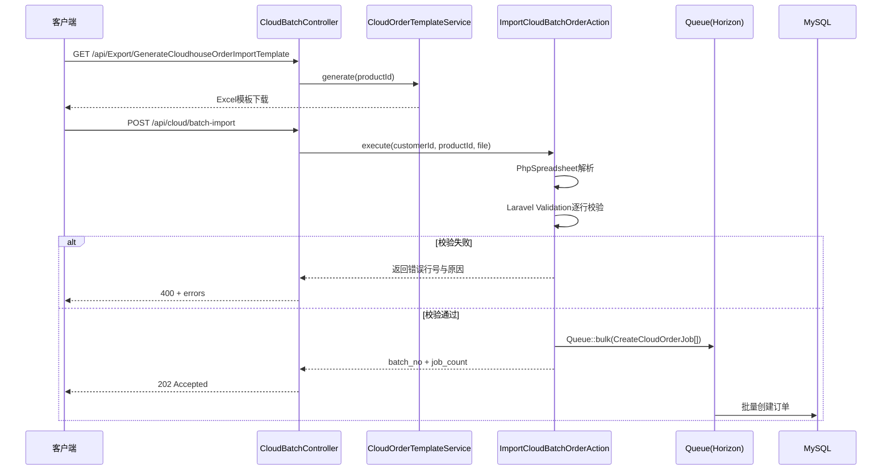
```mermaid
sequenceDiagram
    participant C as 客户端
    participant Ctrl as CloudBatchController
    participant Template as CloudOrderTemplateService
    participant Import as ImportCloudBatchOrderAction
    participant Q as Queue(Horizon)
    participant DB as MySQL

    C->>Ctrl: GET /api/Export/GenerateCloudhouseOrderImportTemplate
    Ctrl->>Template: generate(productId)
    Template-->>C: Excel模板下载

    C->>Ctrl: POST /api/cloud/batch-import
    Ctrl->>Import: execute(customerId, productId, file)
    Import->>Import: PhpSpreadsheet解析
    Import->>Import: Laravel Validation逐行校验
    alt 校验失败
        Import-->>Ctrl: 返回错误行号与原因
        Ctrl-->>C: 400 + errors
    else 校验通过
        Import->>Q: Queue::bulk(CreateCloudOrderJob[])
        Import-->>Ctrl: batch_no + job_count
        Ctrl-->>C: 202 Accepted
        Q->>DB: 批量创建订单
    end
```

---

## 6.9 本地订单同步

### 6.9.1 设计概述

本地订单同步用于将线下门店/ERP系统的订单数据同步到线上平台。采用 Laravel Schedule + Artisan Command 定时执行，通过数据比对（线上订单 vs 本地订单）检测差异并自动补录。

**同步策略**：
- 定时任务：每15分钟执行一次增量同步
- 数据比对：以 order_sn 为主键，对比状态、金额、客户信息差异
- 差异处理：线上缺失则创建，状态不一致则更新（受状态机约束）

### 6.9.2 核心代码实现

#### 6.9.2.1 同步 Command

```php
<?php

declare(strict_types=1);

namespace App\Console\Commands;

use App\Models\LocalOrder;
use App\Models\Order;
use App\Enums\OrderStatus;
use Illuminate\Console\Command;
use Illuminate\Support\Facades\DB;
use Illuminate\Support\Facades\Log;

class SyncLocalOrders extends Command
{
    protected $signature = 'orders:sync-local 
                            {--since= : 同步起始时间，默认昨天}
                            {--dry-run : 仅检测差异，不执行写入}';

    protected $description = '同步本地订单到线上系统';

    public function handle(): int
    {
        $since = $this->option('since')
            ? now()->parse($this->option('since'))
            : now()->subDay();

        $dryRun = $this->option('dry-run');

        $this->info("开始同步本地订单，since={$since->toDateTimeString()}");

        LocalOrder::where('sync_status', 0)
            ->where('created_at', '>=', $since)
            ->orWhere('updated_at', '>=', $since)
            ->chunkById(100, function ($locals) use ($dryRun) {
                foreach ($locals as $local) {
                    $this->syncSingle($local, $dryRun);
                }
            });

        $this->info('本地订单同步完成');
        return self::SUCCESS;
    }

    private function syncSingle(LocalOrder $local, bool $dryRun): void
    {
        $existing = Order::where('order_sn', $local->order_sn)->first();

        if (! $existing) {
            $this->info("[CREATE] 本地订单 {$local->order_sn} 在线上不存在");
            if ($dryRun) {
                return;
            }

            DB::transaction(function () use ($local) {
                Order::create([
                    'order_sn' => $local->order_sn,
                    'customer_id' => $local->customer_id,
                    'status' => OrderStatus::REGISTERED,
                    'out_status_name' => OrderStatus::REGISTERED->toCustomerStatus()->value,
                    'product_sum' => $local->product_sum,
                    'sum' => $local->sum,
                    'total_price' => $local->total_price,
                    'source' => 0,
                    'create_source' => 32,
                    'remark' => "[本地同步] {$local->remark}",
                ]);
                $local->update(['sync_status' => 1, 'synced_at' => now()]);
            });
            return;
        }

        if ($existing->status->value !== $local->status) {
            $this->warn("[DIFF] {$local->order_sn} 状态不一致: 线上={$existing->status->value}, 本地={$local->status}");

            if ($dryRun) {
                return;
            }

            try {
                $target = OrderStatus::from($local->status);
                $existing->transitionTo($target, 'local_sync', '本地订单状态同步');
                $local->update(['sync_status' => 1, 'synced_at' => now()]);
            } catch (\App\Exceptions\InvalidStateTransitionException $e) {
                Log::warning('[LocalSync] 状态流转冲突，跳过', [
                    'order_sn' => $local->order_sn,
                    'error' => $e->getMessage(),
                ]);
                $local->update(['sync_status' => 2, 'sync_error' => $e->getMessage()]);
            }
        }
    }
}
```

#### 6.9.2.2 Schedule 配置

```php
<?php

namespace App\Console;

use App\Console\Commands\SyncLocalOrders;
use Illuminate\Console\Scheduling\Schedule;
use Illuminate\Foundation\Console\Kernel as ConsoleKernel;

class Kernel extends ConsoleKernel
{
    protected function schedule(Schedule $schedule): void
    {
        $schedule->command(SyncLocalOrders::class)
            ->everyFifteenMinutes()
            ->withoutOverlapping(900)
            ->onOneServer();
    }
}
```

### 6.9.3 数据流说明

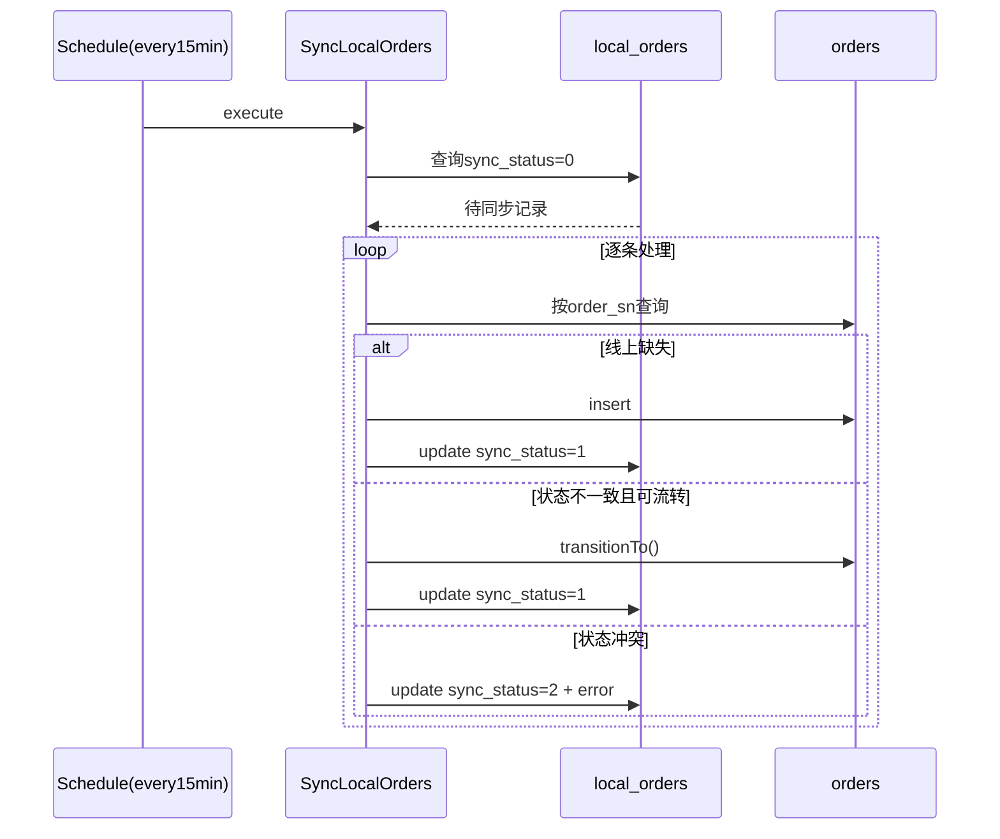
```mermaid
sequenceDiagram
    participant Cron as Schedule(every15min)
    participant Cmd as SyncLocalOrders
    participant Local as local_orders
    participant Order as orders

    Cron->>Cmd: execute
    Cmd->>Local: 查询sync_status=0
    Local-->>Cmd: 待同步记录
    loop 逐条处理
        Cmd->>Order: 按order_sn查询
        alt 线上缺失
            Cmd->>Order: insert
            Cmd->>Local: update sync_status=1
        else 状态不一致且可流转
            Cmd->>Order: transitionTo()
            Cmd->>Local: update sync_status=1
        else 状态冲突
            Cmd->>Local: update sync_status=2 + error
        end
    end
```

---

## 6.10 样品商品配置与库存管理

### 6.10.1 设计概述

样品订单使用独立状态机（100~105），与普通订单状态空间完全隔离。库存管理采用 Redis 原子操作（DECR/INCR） 实现库存锁定，配合 Queue Delayed Job 实现超时自动释放。

**核心设计点**：
- 样品状态机：SampleOrderStatus Backed Enum，独立流转规则
- 库存锁定：Redis::decr() 原子扣减，避免超卖
- 超时释放：订单创建后15分钟未支付，投递 ReleaseSampleStockJob（delayed 15min）
- VIP折扣：Lv1~Lv3样品9折；Lv4无样品折扣；Lv5样品5折；Lv6~Lv8无样品折扣，印品折扣分别为93/92/90折；Lv1~Lv5无印品折扣

### 6.10.2 核心代码实现

#### 6.10.2.1 样品库存锁定服务

```php
<?php

declare(strict_types=1);

namespace App\Services;

use Illuminate\Support\Facades\Log;
use Illuminate\Support\Facades\Redis;

class SampleInventoryService
{
    private const string STOCK_KEY = 'sample:stock:%d';
    private const string LOCK_KEY = 'sample:lock:%s';

    public function lockStock(int $productId, int $quantity, string $orderSn): bool
    {
        $stockKey = sprintf(self::STOCK_KEY, $productId);
        $lockKey = sprintf(self::LOCK_KEY, $orderSn);

        $lua = <<<LUA
            local stock = tonumber(redis.call('GET', KEYS[1]) or 0)
            local qty = tonumber(ARGV[1])
            if stock < qty then
                return -1
            end
            redis.call('DECRBY', KEYS[1], qty)
            redis.call('SET', KEYS[2], qty, 'EX', 900)
            return 1
LUA;

        $result = Redis::eval($lua, 2, $stockKey, $lockKey, $quantity);

        if ($result === -1) {
            Log::warning('[SampleStock] 库存不足', [
                'product_id' => $productId,
                'order_sn' => $orderSn,
                'quantity' => $quantity,
            ]);
            return false;
        }

        Log::info('[SampleStock] 库存预占成功', [
            'product_id' => $productId,
            'order_sn' => $orderSn,
            'quantity' => $quantity,
        ]);

        return true;
    }

    public function releaseStock(int $productId, int $quantity, string $orderSn): void
    {
        $stockKey = sprintf(self::STOCK_KEY, $productId);
        $lockKey = sprintf(self::LOCK_KEY, $orderSn);

        $lua = <<<LUA
            if redis.call('EXISTS', KEYS[2]) == 1 then
                redis.call('INCRBY', KEYS[1], ARGV[1])
                redis.call('DEL', KEYS[2])
                return 1
            end
            return 0
LUA;

        $result = Redis::eval($lua, 2, $stockKey, $lockKey, $quantity);

        if ($result === 1) {
            Log::info('[SampleStock] 库存释放成功', [
                'product_id' => $productId,
                'order_sn' => $orderSn,
            ]);
        }
    }

    public function confirmDeduction(string $orderSn): void
    {
        $lockKey = sprintf(self::LOCK_KEY, $orderSn);
        Redis::del($lockKey);
    }
}
```

#### 样品商品表 & 样品订单表 Migration

```php
<?php

// database/migrations/xxxx_xx_xx_create_sample_products.php
use Illuminate\Database\Migrations\Migration;
use Illuminate\Database\Schema\Blueprint;
use Illuminate\Support\Facades\Schema;

return new class extends Migration {
    public function up(): void
    {
        Schema::create('sample_products', function (Blueprint $table) {
            $table->id()->comment('样品商品主键');
            $table->foreignId('product_id')->constrained('products')->comment('关联正式商品');
            $table->string('name', 128)->comment('样品名称');
            $table->decimal('sample_price', 12, 2)->default(0)->comment('样品价格');
            $table->json('spec')->nullable()->comment('固定规格JSON');
            $table->integer('stock')->default(0)->comment('库存数量');
            $table->boolean('is_enabled')->default(true)->comment('是否上架');
            $table->timestamps();

            $table->index('product_id');
            $table->index('is_enabled');
        });
    }

    public function down(): void
    {
        Schema::dropIfExists('sample_products');
    }
};
```

```php
<?php

// database/migrations/xxxx_xx_xx_create_sample_orders.php
use Illuminate\Database\Migrations\Migration;
use Illuminate\Database\Schema\Blueprint;
use Illuminate\Support\Facades\Schema;

return new class extends Migration {
    public function up(): void
    {
        Schema::create('sample_orders', function (Blueprint $table) {
            $table->id()->comment('样品订单主键');
            $table->string('order_sn', 32)->unique()->comment('样品订单编号');
            $table->foreignId('customer_id')->constrained('customers')->comment('客户ID');
            $table->foreignId('sample_product_id')->constrained('sample_products')->comment('样品商品ID');
            $table->integer('quantity')->default(1)->comment('数量');
            $table->decimal('total_price', 12, 2)->default(0)->comment('订单总价');
            $table->tinyInteger('status')->default(100)->comment('样品状态: 100待付款 101已付款 102已发货 103已完成 104已取消');
            $table->timestamp('paid_at')->nullable();
            $table->timestamp('shipped_at')->nullable();
            $table->timestamp('completed_at')->nullable();
            $table->timestamps();

            $table->index('customer_id');
            $table->index('status');
        });
    }

    public function down(): void
    {
        Schema::dropIfExists('sample_orders');
    }
};
```

#### 6.10.2.2 超时释放队列任务

```php
<?php

declare(strict_types=1);

namespace App\Jobs;

use App\Models\Order;
use App\Services\SampleInventoryService;
use Illuminate\Bus\Queueable;
use Illuminate\Contracts\Queue\ShouldQueue;
use Illuminate\Foundation\Bus\Dispatchable;
use Illuminate\Queue\InteractsWithQueue;
use Illuminate\Queue\SerializesModels;
use Illuminate\Support\Facades\Log;

class ReleaseSampleStockJob implements ShouldQueue
{
    use Dispatchable, InteractsWithQueue, Queueable, SerializesModels;

    public function __construct(
        public int $productId,
        public int $quantity,
        public string $orderSn,
    ) {}

    public function handle(SampleInventoryService $inventory): void
    {
        $order = Order::where('order_sn', $this->orderSn)->first();

        if (! $order || $order->status !== \App\Enums\SampleOrderStatus::PENDING_PAYMENT) {
            Log::info('[SampleRelease] 订单已支付或不存在，跳过释放', [
                'order_sn' => $this->orderSn,
            ]);
            return;
        }

        $inventory->releaseStock($this->productId, $this->quantity, $this->orderSn);

        $order->update([
            'status' => \App\Enums\SampleOrderStatus::CANCELLED->value,
            'out_status_name' => \App\Enums\SampleOrderStatus::CANCELLED->value,
            'remark' => ($order->remark ?? '') . ' | [系统] 超时未支付自动取消',
        ]);
    }
}
```

#### 6.10.2.3 样品订单创建 Action

```php
<?php

declare(strict_types=1);

namespace App\Actions;

use App\Enums\SampleOrderStatus;
use App\Jobs\ReleaseSampleStockJob;
use App\Models\Order;
use App\Models\Product;
use App\Services\SampleInventoryService;
use Illuminate\Support\Facades\DB;
use Illuminate\Support\Facades\Log;

class CreateSampleOrderAction
{
    public function __construct(
        private SampleInventoryService $inventory,
        private \App\Pipelines\PricingPipeline $pricing,
    ) {}

    public function execute(int $customerId, array $data): Order
    {
        return DB::transaction(function () use ($customerId, $data) {
            $product = Product::findOrFail($data['product_id']);
            if (! $product->is_sample) {
                throw new \App\Exceptions\BizException('NOT_SAMPLE_PRODUCT', '非样品商品');
            }

            $orderSn = $data['order_sn'] ?? 'S' . now()->format('YmdHis') . random_int(1000, 9999);

            $locked = $this->inventory->lockStock($product->id, $data['quantity'], $orderSn);
            if (! $locked) {
                throw new \App\Exceptions\BizException('SAMPLE_STOCK_INSUFFICIENT', '样品库存不足');
            }

            $vipLevel = \App\Models\Customer::find($customerId)?->vip_level;
            $discountRate = match ($vipLevel) {
                1, 2, 3 => 0.90,
                5 => 0.50,
                default => 1.0,
            };

            $pricingInput = new \App\ValueObjects\PricingInput(
                productId: $product->id,
                cpSummary: $data['cp_summary'] ?? '',
                quantity: $data['quantity'],
                customerId: $customerId,
                isSample: true,
                vipLevel: $vipLevel,
            );
            $pricingResult = $this->pricing->calculate($pricingInput);
            $finalAmount = $pricingResult->getPayable()->multiply($discountRate);

            $order = Order::create([
                'order_sn' => $orderSn,
                'customer_id' => $customerId,
                'status' => SampleOrderStatus::PENDING_PAYMENT->value,
                'out_status_name' => SampleOrderStatus::PENDING_PAYMENT->value,
                'order_type' => 2,  // FIX-P0: 样品订单已迁移至sample_orders独立表
                'product_id' => $product->id,
                'product_sum' => $pricingResult->getPayable()->amount,
                'discount_sum' => $pricingResult->getPayable()->subtract($finalAmount)->amount,
                'sum' => $finalAmount->amount,
                'total_price' => $finalAmount->amount,
                'quantity' => $data['quantity'],
                'remark' => $data['remark'] ?? null,
            ]);

            // 15分钟后超时释放
            ReleaseSampleStockJob::dispatch(
                $product->id,
                $data['quantity'],
                $orderSn
            )->delay(now()->addMinutes(15));

            Log::info('[SampleOrder] 创建成功', [
                'order_sn' => $orderSn,
                'customer_id' => $customerId,
                'vip_level' => $vipLevel,
                'discount_rate' => $discountRate,
            ]);

            return $order;
        });
    }
}
```

### 6.10.3 数据流说明

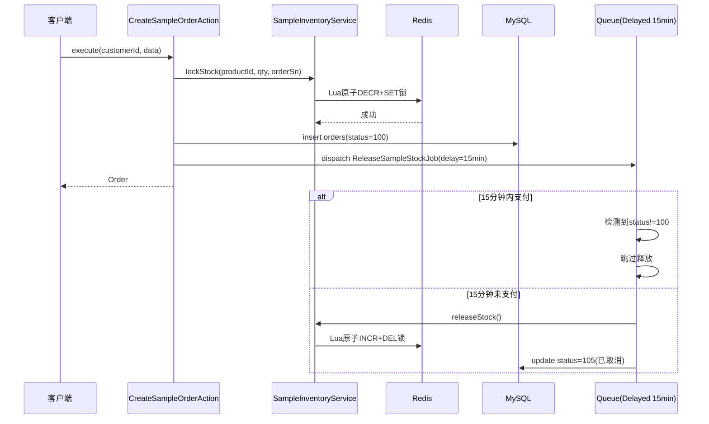
```mermaid
sequenceDiagram
    participant C as 客户端
    participant Act as CreateSampleOrderAction
    participant Inv as SampleInventoryService
    participant Redis as Redis
    participant DB as MySQL
    participant Q as Queue(Delayed 15min)

    C->>Act: execute(customerId, data)
    Act->>Inv: lockStock(productId, qty, orderSn)
    Inv->>Redis: Lua原子DECR+SET锁
    Redis-->>Inv: 成功
    Act->>DB: insert orders(status=100)
    Act->>Q: dispatch ReleaseSampleStockJob(delay=15min)
    Act-->>C: Order

    alt 15分钟内支付
        Q->>Q: 检测到status!=100
        Q->>Q: 跳过释放
    else 15分钟未支付
        Q->>Inv: releaseStock()
        Inv->>Redis: Lua原子INCR+DEL锁
        Q->>DB: update status=105(已取消)
    end
```

---

## 本章自检清单

- [x] 所有代码示例使用 PHP 8.5 + Laravel 13 风格（readonly class、Backed Enum、构造函数属性提升、match表达式）
- [x] 没有出现 Java 特有概念（线程池/CompletableFuture/MyBatis/Spring等）
- [x] 每个子系统包含 Mermaid 图和 PHP 代码示例
- [x] 状态机使用 PHP Backed Enum 实现，内置 canTransitionTo() 方法
- [x] 订单双状态系统正确映射（FM vs nM），modifyStatus独立管理
- [x] 使用 Action 类替代 ServiceImpl，Eloquent Observer 替代 AOP
- [x] 使用 Laravel Event/Listener 替代 Spring EventBus
- [x] 使用 Laravel Queue Job 替代异步线程
- [x] 样品订单独立状态机（100~105）与云仓订单（200~205）完全隔离
- [x] 评价等级保持 PRD 原始定义（4=非常满意、5=不满意）


---

### 6.1-A 公共组件与支撑代码

### A.1 PricingResult 值对象

```php
<?php

declare(strict_types=1);

namespace App\ValueObjects;

use App\Enums\PricingFactor;

class PricingResult
{
    private Money $payable;
    private array $breakdown = [];
    private bool $capped = false;
    private ?int $couponId = null;

    public function __construct(
        public readonly PricingInput $input,
    ) {
        $this->payable = Money::fromYuan(0);
    }

    public function setPayable(Money $amount): void
    {
        $this->payable = $amount;
    }

    public function getPayable(): Money
    {
        return $this->payable;
    }

    public function setBreakdown(PricingFactor $factor, Money $amount): void
    {
        $this->breakdown[$factor->value] = [
            'factor' => $factor->label(),
            'amount_yuan' => $amount->toYuan(),
        ];
    }

    public function getBreakdown(PricingFactor $factor): ?Money
    {
        return isset($this->breakdown[$factor->value])
            ? Money::fromYuan($this->breakdown[$factor->value]['amount_yuan'])
            : null;
    }

    public function getAllBreakdown(): array
    {
        return $this->breakdown;
    }

    public function markCapped(): void
    {
        $this->capped = true;
    }

    public function isCapped(): bool
    {
        return $this->capped;
    }

    public function setCouponId(int $id): void
    {
        $this->couponId = $id;
    }

    public function getCouponId(): ?int
    {
        return $this->couponId;
    }
}
```

### A.2 异常体系

```php
<?php

declare(strict_types=1);

namespace App\Exceptions;

use Exception;

class InvalidStateTransitionException extends Exception
{
    public function __construct(string $message = '非法状态流转')
    {
        parent::__construct($message, 422);
    }
}

class BizException extends Exception
{
    public function __construct(
        public readonly string $errorCode,
        string $message,
        int $status = 400,
    ) {
        parent::__construct($message, $status);
    }
}

class CartException extends BizException
{
}
```

### A.3 订单状态变更审计日志Listener

```php
<?php

declare(strict_types=1);

namespace App\Listeners;

use App\Events\OrderStatusChanged;
use Illuminate\Support\Facades\DB;
use Illuminate\Support\Facades\Log;

class OrderStatusAuditLog
{
    public function handle(OrderStatusChanged $event): void
    {
        DB::table('audit_logs')->insert([
            'operation_type' => 'ORDER_STATUS_CHANGE',
            'target_id' => $event->order->order_sn,
            'old_value' => $event->oldStatus->value,
            'new_value' => $event->newStatus->value,
            'operator' => $event->operator ?? 'system',
            'remark' => $event->remark,
            'created_at' => now(),
        ]);

        Log::info('[AuditLog] 订单状态变更已记录', [
            'order_sn' => $event->order->order_sn,
            'from' => $event->oldStatus->label(),
            'to' => $event->newStatus->label(),
        ]);
    }
}
```

### A.4 数据库迁移补充（本章相关表）

```php
<?php

// database/migrations/2024_01_01_000001_create_carts_table.php
use Illuminate\Database\Migrations\Migration;
use Illuminate\Database\Schema\Blueprint;
use Illuminate\Support\Facades\Schema;

return new class extends Migration {
    public function up(): void
    {
        Schema::create('carts', function (Blueprint $table) {
            $table->id()->comment('购物车主键');
            $table->unsignedBigInteger('customer_id')->nullable()->comment('客户ID（登录后）');
            $table->string('session_id', 64)->nullable()->comment('匿名会话ID（未登录）');
            $table->tinyInteger('status')->default(1)->comment('1=正常 0=废弃');
            $table->timestamp('expire_at')->nullable()->comment('购物车整体过期时间（默认30天）');
            $table->timestamps();

            $table->index(['customer_id', 'status'], 'idx_cart_customer_status');
            $table->index(['session_id', 'status'], 'idx_cart_session_status');
        });

        Schema::create('cart_items', function (Blueprint $table) {
            $table->id()->comment('购物车项主键');
            $table->unsignedBigInteger('cart_id')->comment('购物车ID');
            $table->unsignedBigInteger('product_id')->comment('商品ID');
            $table->unsignedBigInteger('category_id')->comment('品类ID（冗余，用于统计）');
            $table->string('cp_summary', 512)->comment('参数摘要（业务级规格唯一标识）');
            $table->json('param_snapshot')->nullable()->comment('参数选择快照（完整JSON）');
            $table->integer('quantity')->default(1)->comment('数量');
            $table->integer('unit_price')->default(0)->comment('单价（单位：分）');
            $table->integer('total_price')->default(0)->comment('小计 = 单价 × 数量（单位：分）');
            $table->json('file_ids')->nullable()->comment('关联设计文件ID列表');
            $table->unsignedBigInteger('brand_id')->nullable()->comment('品牌ID');
            $table->string('remark', 255)->nullable()->comment('备注/失效原因');
            $table->tinyInteger('is_selected')->default(1)->comment('是否选中 1=选中 0=未选中');
            $table->tinyInteger('is_urgent')->default(0)->comment('是否加急 1=加急');
            $table->tinyInteger('status')->default(1)->comment('1=有效 0=失效（商品下架/参数变更/价格变动）');
            $table->timestamp('expire_at')->nullable()->comment('单项过期时间（默认30天）');
            $table->timestamps();

            // 核心索引：同一购物车同一商品同一规格唯一
            $table->unique(['cart_id', 'product_id', 'cp_summary'], 'uk_cart_item_spec');
            $table->index(['cart_id', 'status'], 'idx_cart_item_cart_status');
            $table->index(['product_id', 'status'], 'idx_cart_item_product_status');
            $table->index('expire_at', 'idx_cart_item_expire');
        });
    }

    public function down(): void
    {
        Schema::dropIfExists('cart_items');
        Schema::dropIfExists('carts');
    }
};
```

```php
<?php

// database/migrations/2024_01_01_000002_create_order_reviews_table.php
use Illuminate\Database\Migrations\Migration;
use Illuminate\Database\Schema\Blueprint;
use Illuminate\Support\Facades\Schema;

return new class extends Migration {
    public function up(): void
    {
        Schema::create('order_reviews', function (Blueprint $table) {
            $table->id();
            $table->unsignedBigInteger('order_id')->index();
            $table->string('order_sn', 64)->index();
            $table->unsignedBigInteger('customer_id')->index();
            $table->unsignedBigInteger('product_id')->nullable();
            $table->tinyInteger('level')->comment('评价等级: 1极差,2一般,3满意,4非常满意,5不满意');
            $table->text('content')->nullable();
            $table->json('images')->nullable();
            $table->json('tags')->nullable();
            $table->tinyInteger('is_anonymous')->default(0);
            $table->text('reply_content')->nullable();
            $table->timestamp('reply_time')->nullable();
            $table->tinyInteger('status')->default(1)->comment('1=显示,0=隐藏');
            $table->timestamps();

            $table->unique('order_sn');
        });
    }
};
```

```php
<?php

// database/migrations/2024_01_01_000003_create_bestseller_rank_items_table.php
use Illuminate\Database\Migrations\Migration;
use Illuminate\Database\Schema\Blueprint;
use Illuminate\Support\Facades\Schema;

return new class extends Migration {
    public function up(): void
    {
        Schema::create('bestseller_rank_items', function (Blueprint $table) {
            $table->id();
            $table->unsignedBigInteger('category_id')->index();
            $table->string('cd_category_id', 64)->index();
            $table->unsignedBigInteger('product_id')->nullable();
            $table->string('product_name', 256)->nullable();
            $table->tinyInteger('rank_type')->comment('1=热销榜,2=飙升榜');
            $table->decimal('heat_value', 12, 2)->default(0);
            $table->decimal('growth_rate', 8, 2)->default(0);
            $table->decimal('score', 3, 2)->default(5.00);
            $table->json('labels')->nullable();
            $table->tinyInteger('is_show')->default(1);
            $table->tinyInteger('is_pinned')->default(0);
            $table->string('icon', 500)->nullable();
            $table->integer('sort_weight')->default(0);
            $table->unsignedBigInteger('operator_id')->nullable();
            $table->timestamps();

            $table->unique(['category_id', 'product_id', 'rank_type']);
            $table->index(['rank_type', 'category_id', 'heat_value']);
            $table->index(['rank_type', 'category_id', 'growth_rate']);
        });
    }
};
```

```php
<?php

// database/migrations/2024_01_01_000004_create_file_records_table.php
use Illuminate\Database\Migrations\Migration;
use Illuminate\Database\Schema\Blueprint;
use Illuminate\Support\Facades\Schema;

return new class extends Migration {
    public function up(): void
    {
        Schema::create('file_records', function (Blueprint $table) {
            $table->id();
            $table->unsignedBigInteger('product_id')->nullable()->index();
            $table->unsignedBigInteger('order_id')->nullable()->index();
            $table->string('file_url', 512);
            $table->string('file_path', 512);
            $table->string('file_name', 255);
            $table->unsignedBigInteger('file_size');
            $table->string('file_hash', 64);
            $table->string('file_type', 32)->comment('3d_model/order_file/brand_cert');
            $table->integer('version_no')->default(1);
            $table->string('version_name', 64)->nullable();
            $table->tinyInteger('is_current')->default(1);
            $table->string('upload_method', 32)->default('direct');
            $table->tinyInteger('source_type')->default(0);
            $table->string('source_id', 64)->nullable();
            $table->unsignedBigInteger('uploader_id')->nullable();
            $table->timestamps();

            $table->index(['product_id', 'file_type', 'is_current']);
        });
    }
};
```

```php
<?php

// database/migrations/2024_01_01_000005_create_preview_3d_configs_table.php
use Illuminate\Database\Migrations\Migration;
use Illuminate\Database\Schema\Blueprint;
use Illuminate\Support\Facades\Schema;

return new class extends Migration {
    public function up(): void
    {
        Schema::create('preview_3d_configs', function (Blueprint $table) {
            $table->id();
            $table->unsignedBigInteger('product_id')->index();
            $table->integer('version_no')->default(1);
            $table->json('hotspots')->nullable();
            $table->json('default_camera')->nullable();
            $table->json('material_mapping')->nullable();
            $table->boolean('auto_rotate')->default(true);
            $table->string('background_color', 16)->default('#f5f5f5');
            $table->timestamps();

            $table->unique(['product_id', 'version_no']);
        });
    }
};
```

### A.5 路由配置示例

```php
<?php

// routes/api.php
use App\Http\Controllers\CartController;
use App\Http\Controllers\CloudBatchController;
use App\Http\Controllers\OrderReviewController;
use App\Http\Controllers\Preview3DController;
use App\Http\Controllers\PricingController;
use App\Http\Controllers\RankController;
use Illuminate\Support\Facades\Route;

Route::prefix('api')->group(function () {
    // 6.1 计价引擎
    Route::post('/Calculate', [PricingController::class, 'calculate']);
    Route::post('/Calculate/Batch', [PricingController::class, 'batchCalculate']);
    Route::post('/Calculate/BatchResult/{uuid}', [PricingController::class, 'getBatchResult']);

    // 6.2 购物车（FIX-P0-3: 统一路由）
    Route::post('/Cart/Add', [CartController::class, 'add']);
    Route::get('/Cart/List', [CartController::class, 'list']);              // ✅ GET，符合RESTful
    Route::post('/Cart/Update', [CartController::class, 'update']);
    Route::post('/Cart/Delete', [CartController::class, 'delete']);         // ✅ Delete语义更准确
    Route::post('/Cart/ToggleSelection', [CartController::class, 'toggleSelection']);
    Route::post('/Cart/Clear', [CartController::class, 'clear']);
    Route::get('/Cart/SelectedItems', [CartController::class, 'selectedItems']);
    Route::post('/Cart/Checkout', [CartController::class, 'checkout']);     // 结算前置校验
    Route::post('/Cart/Merge', [CartController::class, 'merge']);            // 登录后合并访客购物车
    Route::post('/Cart/ClearExpired', [CartController::class, 'clearExpired']); // 管理员/系统清理过期项

    // 6.3 热销榜/飙升榜
    Route::get('/Common/GetBestsellerRank', [RankController::class, 'bestseller']);
    Route::get('/Common/GetRisingRank', [RankController::class, 'rising']);

    // 6.4 3D预览
    Route::get('/3d/model-config/{productId}', [Preview3DController::class, 'getModelConfig']);

    // 6.6 订单评价
    Route::post('/OrderProductComment/Create', [OrderReviewController::class, 'create']);
    Route::get('/OrderProductComment/GetByOrderSN', [OrderReviewController::class, 'show']);
    Route::post('/OrderProductComment/UploadImages', [OrderReviewController::class, 'uploadImages']);

    // 6.7 订单统计
    Route::get('/Order/GetOrderStatusCount', [OrderStatisticsController::class, 'statusCounts']);
    Route::get('/Order/GetCustomerLastSixMouthStatistic', [OrderStatisticsController::class, 'sixMonths']);
    Route::get('/Order/GetOrderStatisticByParentCategory', [OrderStatisticsController::class, 'byCategory']);
    Route::get('/Order/GetCustomerOrderStatistics', [OrderStatisticsController::class, 'overall']);

    // 6.8 云仓批量下单
    Route::get('/Export/GenerateCloudhouseOrderImportTemplate', [CloudBatchController::class, 'downloadTemplate']);
    Route::post('/cloud/batch-import', [CloudBatchController::class, 'batchImport']);

    // 6.10 样品订单
    Route::post('/SampleOrder/Create', [SampleOrderController::class, 'create']);
    Route::post('/SampleOrder/ApplyCoupon', [SampleOrderController::class, 'applyCoupon']);
});

// 后台路由
Route::prefix('api/admin')->middleware(['auth:admin'])->group(function () {
    Route::post('/3d/presigned-url', [Preview3DController::class, 'getPresignedUrl']);
    Route::post('/3d/confirm-upload', [Preview3DController::class, 'confirmUpload']);
    Route::post('/rank-items/{id}/visibility', [RankItemAdminController::class, 'toggleVisibility']);
    Route::post('/rank-items/{id}/weight', [RankItemAdminController::class, 'adjustWeight']);
});
```

### A.6 本章涉及的值对象与辅助类汇总

| 类名 | 类型 | 所属章节 | 说明 |
|------|------|---------|------|
| `Money` | readonly class | 6.1 | 金额值对象，分存储 |
| `PricingInput` | readonly class | 6.1 | 计价输入参数 |
| `PricingResult` | class | 6.1 | 计价结果（含明细） |
| `PricingFactor` | Backed Enum | 6.1 | 计价因子枚举 |
| `OrderStatus` | Backed Enum | 6.5 | FM内部状态枚举 |
| `CustomerOrderStatus` | Backed Enum | 6.5 | nM客户展示状态枚举 |
| `OrderModifyStatus` | Backed Enum | 6.5 | IM修改状态枚举 |
| `SampleOrderStatus` | Backed Enum | 6.10 | 样品订单状态枚举 |
| `CloudOrderStatus` | Backed Enum | 6.10 | 云仓订单状态枚举 |
| `CommentLevel` | Backed Enum | 6.6 | 评价等级枚举（4=非常满意） |
| `CalculatePriceAction` | Action | 6.1 | 计价入口Action |
| `AddToCartAction` | Action | 6.2 | 添加购物车Action |
| `MergeCartAction` | Action | 6.2 | 购物车合并Action |
| `CheckCartValidityAction` | Action | 6.2 | 失效检测Action |
| `SubmitOrderReviewAction` | Action | 6.6 | 提交评价Action |
| `ImportCloudBatchOrderAction` | Action | 6.8 | 云仓批量导入Action |
| `CreateSampleOrderAction` | Action | 6.10 | 样品订单创建Action |
| `BestsellerRankService` | Service | 6.3 | 榜单服务 |
| `OrderStatisticsService` | Service | 6.7 | 订单统计服务 |
| `SampleInventoryService` | Service | 6.10 | 样品库存服务 |
| `PricingPipeline` | Pipeline | 6.1 | 计价管线 |
| `BatchPricingJob` | Queue Job | 6.1 | 批量计价任务 |
| `SyncBestsellerRank` | Queue Job | 6.3 | 榜单刷新任务 |
| `CreateCloudOrderJob` | Queue Job | 6.8 | 云仓订单创建任务 |
| `ReleaseSampleStockJob` | Queue Job | 6.10 | 样品库存释放任务 |
| `RecordPricingLog` | Queue Job | 6.1 | 计价日志记录任务 |
| `GrantGrowthValue` | Queue Job | 6.6 | 成长值发放任务 |
| `OrderStatusChanged` | Event | 6.5 | 订单状态变更事件 |
| `DiscountCapped` | Event | 6.1 | 折扣封顶告警事件 |
| `OrderStatusChangedNotification` | Listener | 6.5 | 状态变更通知监听 |
| `OrderStatusAuditLog` | Listener | 6.5 | 状态变更审计监听 |
| `ClearOrderStatsCache` | Listener | 6.7 | 统计缓存清理监听 |
| `CartItemObserver` | Observer | 6.2 | 购物车项Observer |
| `OrderObserver` | Observer | 6.5 | 订单Observer |

### A.7 Redis Key 命名规范

| Key 模式 | 说明 | TTL |
|----------|------|-----|
| `pricing:{hash}` | 计价结果缓存 | 1小时 |
| `batch_pricing:{uuid}` | 批量计价结果 | 30分钟 |
| `cart:summary:{customerId}` | 购物车摘要 | 24小时 |
| `rank:bestseller:{categoryId}` | 热销榜ZSet | 24小时 |
| `rank:rising:{categoryId}` | 飙升榜ZSet | 12小时 |
| `sample:stock:{productId}` | 样品库存计数 | 持久 |
| `sample:lock:{orderSn}` | 样品库存锁 | 15分钟 |
| `order:counts:{customerId}` | 客户订单统计 | 5分钟 |
| `order:stats:6m:{customerId}` | 近6月统计 | 1小时 |
| `order:stats:category:{customerId}` | 品类统计 | 1小时 |
| `order:stats:overall:{customerId}` | 整体统计 | 10分钟 |

### A.8 配置项汇总

| 配置键 | 默认值 | 说明 | 所属章节 |
|--------|--------|------|---------|
| `pricing.cache.ttl` | 3600 | 计价缓存TTL(秒) | 6.1 |
| `pricing.min_discount_rate` | 0.50 | 最低折扣封顶 | 6.1 |
| `cart.max_items` | 50 | 购物车上限 | 6.2 |
| `cart.expire_days` | 30 | 购物车项有效期(天) | 6.2 |
| `rank.bestseller.ttl` | 86400 | 热销榜缓存TTL(秒) | 6.3 |
| `rank.rising.ttl` | 43200 | 飙升榜缓存TTL(秒) | 6.3 |
| `rank.refresh_at` | 02:00 | 榜单刷新时间 | 6.3 |
| `minio.bucket` | yian-prints | MinIO存储桶 | 6.4 |
| `minio.presign_expiry` | 1800 | 预签名URL有效期(秒) | 6.4 |
| `sample.stock_lock_ttl` | 900 | 样品库存锁TTL(秒) | 6.10 |
| `sample.auto_cancel_minutes` | 15 | 样品订单超时取消(分钟) | 6.10 |
| `local_sync.interval` | 15 | 本地订单同步间隔(分钟) | 6.9 |
| `cloud.batch.chunk_size` | 50 | 批量下单分块大小 | 6.8 |


---

### A.9 性能优化策略补充

#### A.9.1 计价引擎性能优化

**缓存穿透防护**：当价格配置未找到时，缓存空结果（Null Object Pattern），避免重复查询数据库。

```php
public function getBasePrice(int $productId, string $cpSummary): Money
{
    $cacheKey = "price:base:{$productId}:" . md5($cpSummary);
    
    return $this->cache->remember($cacheKey, now()->addHour(), function () use ($productId, $cpSummary) {
        $row = DB::table('product_price_tiers')
            ->where('product_id', $productId)
            ->where('cp_summary_hash', md5($cpSummary))
            ->first();
        
        return $row ? Money::fromYuan((float) $row->price) : Money::fromYuan(0);
    });
}
```

**缓存雪崩防护**：计价缓存 TTL 增加随机偏移（300~600秒），避免大量缓存同时失效。

```php
$ttl = 3600 + random_int(300, 600);
$this->cache->put($cacheKey, $final, $ttl);
```

#### A.9.2 购物车性能优化

**懒加载失效检测**：购物车列表查询时只做快速计数，失效检测推迟到结算前执行。

```php
public function listWithLazyCheck(int $customerId): array
{
    $items = $this->getItems($customerId);
    
    // 仅标记潜在失效项，不立即删除
    $potentiallyInvalid = [];
    foreach ($items as $item) {
        if ($item->product->status !== 1) {
            $potentiallyInvalid[] = $item->id;
        }
    }
    
    return [
        'items' => $items,
        'potentially_invalid_ids' => $potentiallyInvalid,
        'invalid_warning' => !empty($potentiallyInvalid) ? '部分商品状态已变更，结算前请确认' : null,
    ];
}
```

#### A.9.3 榜单性能优化

**增量更新策略**：每日刷新时，仅对近7天有数据变更的品类执行全量重算，其余品类直接延长Redis TTL。

```php
public function shouldFullRefresh(int $categoryId): bool
{
    $lastRefresh = Redis::get("rank:last_refresh:{$categoryId}");
    if (! $lastRefresh) {
        return true;
    }
    
    $hasRecentChange = DB::table('orders')
        ->where('category_id', $categoryId)
        ->where('created_at', '>=', now()->subDays(7))
        ->exists();
    
    return $hasRecentChange;
}
```

#### A.9.4 状态机性能优化

**状态流转批处理**：MES系统批量上报状态变更时，使用 `updateOrInsert` + `whereIn` 减少数据库往返。

```php
public function batchTransition(array $transitions): void
{
    DB::transaction(function () use ($transitions) {
        foreach ($transitions as $t) {
            Order::where('order_sn', $t['order_sn'])
                ->update([
                    'status' => $t['target_status'],
                    'out_status_name' => OrderStatus::from($t['target_status'])
                        ->toCustomerStatus()
                        ->value,
                    'updated_at' => now(),
                ]);
        }
        
        // 批量触发事件（逐条触发，保证监听器的独立性）
        foreach ($transitions as $transition) {
            event(new OrderStatusChanged($transition['order'], $transition['from'], $transition['to']));
        }
    });
}
```

### A.10 测试策略

| 层级 | 测试类型 | 覆盖内容 | 工具 |
|------|---------|---------|------|
| 单元测试 | Enum规则测试 | canTransitionTo()全路径覆盖 | Pest/PHPUnit |
| 单元测试 | Money运算 | 精度、溢出、货币不匹配 | Pest/PHPUnit |
| 集成测试 | Pipeline计价 | 各步骤组合、互斥规则 | Pest/PHPUnit + SQLite |
| 集成测试 | 状态机流转 | 合法/非法流转、Observer触发 | Pest/PHPUnit + SQLite |
| 集成测试 | 购物车合并 | 访客+客户数据冲突处理 | Pest/PHPUnit + SQLite |
| 特性测试 | 批量下单 | Excel解析、校验规则、队列投递 | Pest/PHPUnit |
| 特性测试 | 库存锁定 | 并发超卖测试 | Pest/PHPUnit + Redis |
| 性能测试 | 批量计价 | 1000条批量计价耗时 | Laravel Pulse |
| 性能测试 | 榜单查询 | ZREVRANGE vs DB回源对比 | Laravel Pulse |

```php
<?php

// tests/Unit/Enums/OrderStatusTest.php
use App\Enums\OrderStatus;

test('已登记可以流转到已审核和已取消', function () {
    expect(OrderStatus::REGISTERED->canTransitionTo(OrderStatus::AUDITED))->toBeTrue();
    expect(OrderStatus::REGISTERED->canTransitionTo(OrderStatus::CANCELLED))->toBeTrue();
    expect(OrderStatus::REGISTERED->canTransitionTo(OrderStatus::COMPLETED))->toBeFalse();
});

test('已完成是终态不可流转', function () {
    foreach (OrderStatus::cases() as $target) {
        expect(OrderStatus::COMPLETED->canTransitionTo($target))->toBeFalse();
    }
});

test('FM到nM映射包含modifyStatus判断', function () {
    $normal = OrderStatus::REGISTERED->toCustomerStatus();
    expect($normal)->toBe(App\Enums\CustomerOrderStatus::PENDING_PAYMENT);
    
    $modifying = OrderStatus::REGISTERED->toCustomerStatus(App\Enums\OrderModifyStatus::FILE_PENDING_MODIFY);
    expect($modifying)->toBe(App\Enums\CustomerOrderStatus::PENDING_MODIFY);
});
```

```php
<?php

// tests/Feature/PricingPipelineTest.php
use App\Pipelines\PricingPipeline;
use App\ValueObjects\PricingInput;
use App\ValueObjects\Money;

test('VIP折扣与样品折扣互斥取最小折扣率', function () {
    $input = new PricingInput(
        productId: 1,
        cpSummary: 'MP:90x54:STANDARD::0:1:PAPER_300G:2:4:500:1',
        quantity: 500,
        customerId: 1,
        vipLevel: 5,
        isSample: true,
    );
    
    $pipeline = PricingPipeline::default(
        app(\App\Repositories\PriceConfigRepository::class),
        app(\App\Repositories\CustomerCouponRepository::class),
        app('cache')
    );
    
    $result = $pipeline->calculate($input);
    
    // Lv5样品折扣0.5，VIP印品折扣0.82，互斥取0.5
    expect($result->isCapped())->toBeFalse();
});
```

---

> **文档信息**  
> 本章编号：第6章（上半部分 6.1-6.10）  
> 技术栈：PHP 8.5 + Laravel 13  
> 编写规范：Action类替代ServiceImpl，Eloquent Observer替代AOP，Laravel Event/Listener替代Spring EventBus，Laravel Queue Job替代异步线程  
> 状态机实现：PHP 8.1 Backed Enum + canTransitionTo() 方法  
> 双状态系统：FM（内部生产状态）→ nM（客户展示状态）通过Enum映射  
> 订单修改流程：IM枚举独立字段，不破坏主状态机  
> 定金子状态：独立字段叠加，由DepositStateManager解析复合展示文本  
> 评价等级：严格遵循PRD定义（4=非常满意、5=不满意）  
> 文件存储：Laravel Storage + MinIO预签名URL  
> 缓存策略：Laravel Cache(Redis)分层缓存，带TTL和主动失效机制  
> 定时任务：Laravel Schedule + withoutOverlapping + onOneServer  
> 异步处理：Laravel Queue + Horizon监控  


---

# 6. 核心业务子系统设计（中半部分：6.11 ~ 6.20）

---

## 6.11 通知系统设计

### 6.11.1 设计概述

通知系统是连接平台与客户的核心纽带，覆盖订单全生命周期、支付、售后、认证、营销等20+业务场景。本系统以 **Laravel Notification** 为架构核心，利用其 `notifiable + channel` 原生机制实现多渠道统一投递，避免自建 `NotifyService` 带来的维护成本。

**核心设计原则**：
1. **渠道解耦**：通过 `via()` 方法动态控制投递渠道，新增渠道无需改动业务代码
2. **模板驱动**：数据库维护通知模板，Blade 引擎渲染，运营可在线编辑文案
3. **去重聚合**：Redis 5分钟去重窗口 + 同订单状态聚合，防止通知轰炸
4. **主备容灾**：短信通道熔断自动切换，保障 P0 通知送达率 ≥ 99.5%
5. **偏好可配**：客户可按类型屏蔽特定渠道，支持通知角标实时刷新

### 6.11.2 架构类图

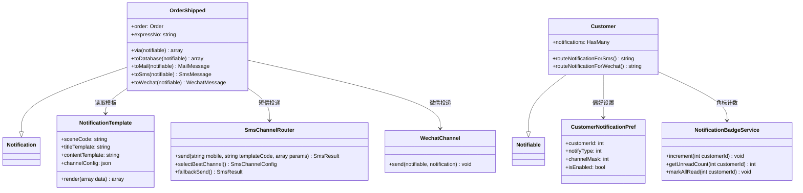
```mermaid
classDiagram
    class OrderShipped {
        +order: Order
        +expressNo: string
        +via(notifiable) array
        +toDatabase(notifiable) array
        +toMail(notifiable) MailMessage
        +toSms(notifiable) SmsMessage
        +toWechat(notifiable) WechatMessage
    }
    class Customer {
        +notifications: HasMany
        +routeNotificationForSms() string
        +routeNotificationForWechat() string
    }
    class NotificationTemplate {
        +sceneCode: string
        +titleTemplate: string
        +contentTemplate: string
        +channelConfig: json
        +render(array data) array
    }
    class SmsChannelRouter {
        +send(string mobile, string templateCode, array params) SmsResult
        +selectBestChannel() SmsChannelConfig
        +fallbackSend() SmsResult
    }
    class WechatChannel {
        +send(notifiable, notification) void
    }
    class NotificationBadgeService {
        +increment(int customerId) void
        +getUnreadCount(int customerId) int
        +markAllRead(int customerId) void
    }
    class CustomerNotificationPref {
        +customerId: int
        +notifyType: int
        +channelMask: int
        +isEnabled: bool
    }

    OrderShipped --|> Notification
    Customer --|> Notifiable
    OrderShipped --> NotificationTemplate : 读取模板
    OrderShipped --> SmsChannelRouter : 短信投递
    OrderShipped --> WechatChannel : 微信投递
    Customer --> CustomerNotificationPref : 偏好设置
    Customer --> NotificationBadgeService : 角标计数
```

### 6.11.3 通知模板管理

通知模板存储于数据库，支持变量插值与多渠道差异化渲染。运营后台可直接编辑模板内容，无需发布代码。

```php
<?php

namespace App\Domains\Notification\Models;

use Illuminate\Database\Eloquent\Model;

class NotificationTemplate extends Model
{
    protected $table = 'notification_templates';

    protected $casts = [
        'channel_config' => 'array',
    ];

    /**
     * 使用 Blade 语法渲染模板
     */
    public function render(array $data, string $channel): array
    {
        $title = \Blade::render($this->title_template, $data);
        $content = \Blade::render($this->content_template, $data);

        return match ($channel) {
            'database' => ['title' => $title, 'content' => $content, 'type' => $this->scene_code],
            'sms' => ['template_code' => $this->sms_template_code, 'params' => $data],
            'wechat' => ['template_id' => $this->wx_template_id, 'data' => $this->buildWxData($data)],
            default => ['title' => $title, 'content' => $content],
        };
    }

    private function buildWxData(array $data): array
    {
        return [
            'first' => ['value' => $data['title'] ?? ''],
            'keyword1' => ['value' => $data['order_sn'] ?? ''],
            'keyword2' => ['value' => $data['status'] ?? ''],
            'remark' => ['value' => $data['remark'] ?? ''],
        ];
    }
}
```

**模板表示例**：

```sql
CREATE TABLE notification_templates (
    id BIGINT UNSIGNED PRIMARY KEY AUTO_INCREMENT,
    scene_code VARCHAR(64) NOT NULL COMMENT '场景编码: ORDER_SHIPPED/PAYMENT_SUCCESS等',
    scene_name VARCHAR(128) COMMENT '场景名称',
    title_template VARCHAR(256) NOT NULL COMMENT '标题模板(Blade语法)',
    content_template TEXT NOT NULL COMMENT '内容模板(Blade语法)',
    sms_template_code VARCHAR(64) COMMENT '短信通道模板编码',
    wx_template_id VARCHAR(64) COMMENT '微信模板消息ID',
    channel_config JSON COMMENT '渠道配置: {database:true, mail:true, sms:true, wechat:false}',
    notify_type TINYINT DEFAULT 1 COMMENT '通知类型: 1=订单,2=售后,3=系统,4=营销',
    is_enabled TINYINT(1) DEFAULT 1,
    created_at DATETIME DEFAULT CURRENT_TIMESTAMP,
    updated_at DATETIME DEFAULT CURRENT_TIMESTAMP ON UPDATE CURRENT_TIMESTAMP,
    UNIQUE INDEX idx_scene_code(scene_code),
    INDEX idx_notify_type(notify_type)
) ENGINE=InnoDB COMMENT='通知模板表';
```

### 6.11.4 多渠道通知实现

以 **订单发货通知** 为例，展示 Laravel Notification 的完整实现：

```php
<?php

namespace App\Notifications;

use App\Domains\Notification\Models\NotificationTemplate;
use App\Domains\Order\Models\Order;
use Illuminate\Bus\Queueable;
use Illuminate\Notifications\Notification;
use Illuminate\Notifications\Messages\MailMessage;
use NotificationChannels\Sms\SmsMessage;

class OrderShipped extends Notification
{
    use Queueable;

    public function __construct(
        private Order $order,
        private string $expressNo,
        private ?NotificationTemplate $template = null,
    ) {}

    /**
     * 动态决定投递渠道：优先读取客户偏好，其次读取模板默认配置
     */
    public function via(object $notifiable): array
    {
        $channels = ['database'];

        // 1. 查询客户通知偏好
        $pref = $notifiable->notificationPrefs()
            ->where('notify_type', 1) // 订单类通知
            ->first();

        if ($pref && !$pref->is_enabled) {
            return []; // 客户关闭了订单通知
        }

        $mask = $pref?->channel_mask ?? 15; // 默认全开

        // 2. 按位运算判断渠道
        if ($mask & 2) $channels[] = 'sms';
        if ($mask & 4) $channels[] = 'mail';
        if ($mask & 8) $channels[] = 'wechat';

        return $channels;
    }

    public function toDatabase(object $notifiable): array
    {
        $data = [
            'order_id' => $this->order->id,
            'order_sn' => $this->order->order_sn,
            'express_no' => $this->expressNo,
            'title' => '订单已发货',
            'content' => "您的订单 {$this->order->order_sn} 已发货，快递单号：{$this->expressNo}",
        ];

        if ($this->template) {
            return $this->template->render($data, 'database');
        }

        return $data;
    }

    public function toSms(object $notifiable): SmsMessage
    {
        return SmsMessage::create(
            content: "【怡安印刷】您的订单{$this->order->order_sn}已发货，快递单号：{$this->expressNo}，请注意查收。"
        );
    }

    public function toMail(object $notifiable): MailMessage
    {
        return (new MailMessage)
            ->subject('订单发货通知')
            ->line("您的订单 {$this->order->order_sn} 已发货。")
            ->line("快递公司：{$this->order->express_company}")
            ->line("快递单号：{$this->expressNo}")
            ->action('查看订单', url("/orders/{$this->order->order_sn}"));
    }
}
```

**自定义微信模板消息 Channel**：

```php
<?php

namespace App\Domains\Notification\Channels;

use Illuminate\Notifications\Notification;

class WechatChannel
{
    public function __construct(
        private \EasyWeChat\Kernel\Contracts\AccessToken $accessToken,
    ) {}

    public function send(object $notifiable, Notification $notification): void
    {
        $openId = $notifiable->routeNotificationFor('wechat');
        if (!$openId) {
            return;
        }

        $message = $notification->toWechat($notifiable);

        \Http::withToken($this->accessToken->getToken())
            ->post('https://api.weixin.qq.com/cgi-bin/message/template/send', [
                'touser' => $openId,
                'template_id' => $message['template_id'],
                'url' => $message['url'] ?? '',
                'data' => $message['data'],
            ]);
    }
}
```

**通知发送入口（业务层调用）**：

```php
<?php

namespace App\Domains\Notification\Actions;

use App\Domains\Customer\Models\Customer;
use App\Domains\Notification\Models\NotificationTemplate;
use App\Notifications\OrderShipped;
use Illuminate\Support\Facades\Notification as NotificationFacade;
use Illuminate\Support\Facades\Redis;

class SendOrderNotificationAction
{
    /**
     * 统一发送入口，集成去重与偏好过滤
     */
    public function execute(
        int $customerId,
        string $sceneCode,
        array $context,
    ): void {
        $customer = Customer::find($customerId);
        if (!$customer) {
            return;
        }

        // 1. 去重检查：同一客户同一场景同一业务键 5 分钟内只发一次
        $bizKey = $context['biz_key'] ?? $sceneCode;
        $dedupKey = "notify:dedup:{$customerId}:{$sceneCode}:" . md5($bizKey);
        if (Redis::exists($dedupKey)) {
            return;
        }
        Redis::setex($dedupKey, 300, '1');

        // 2. 加载模板
        $template = NotificationTemplate::where('scene_code', $sceneCode)
            ->where('is_enabled', 1)
            ->first();

        // 3. 根据场景构造 Notification 实例
        $notification = match ($sceneCode) {
            'ORDER_SHIPPED' => new OrderShipped($context['order'], $context['express_no'], $template),
            'PAYMENT_SUCCESS' => new \App\Notifications\PaymentSuccess($context['order'], $template),
            'AUTH_APPROVED' => new \App\Notifications\AuthApproved($customer, $template),
            default => throw new \InvalidArgumentException("未知通知场景: {$sceneCode}"),
        };

        // 4. 队列异步投递
        NotificationFacade::send($customer, $notification);

        // 5. 角标 +1
        app(NotificationBadgeService::class)->increment($customerId);
    }
}
```

### 6.11.5 通知去重与聚合

```php
<?php

namespace App\Domains\Notification\Services;

use Illuminate\Support\Facades\Redis;

class NotificationDeduplicator
{
    private const DEDUP_KEY_PREFIX = 'notify:dedup:';
    private const DEDUP_WINDOW = 300; // 5分钟

    public function isDuplicate(int $customerId, string $scene, string $bizKey): bool
    {
        $key = self::DEDUP_KEY_PREFIX . "{$customerId}:{$scene}:" . md5($bizKey);

        if (Redis::exists($key)) {
            return true;
        }

        Redis::setex($key, self::DEDUP_WINDOW, '1');
        return false;
    }

    /**
     * 聚合通知：同一订单的多个状态变更合并为一条
     */
    public function aggregate(array $events): array
    {
        if (count($events) <= 1) {
            return $events[0] ?? [];
        }

        $latest = end($events);
        $history = collect($events)
            ->map(fn($e) => ($e['status_desc'] ?? '') . ' at ' . ($e['time'] ?? ''))
            ->implode("\n");

        return array_merge($latest, [
            'is_aggregated' => true,
            'aggregated_history' => $history,
        ]);
    }
}
```

### 6.11.6 短信备用通道（Channel 级 Fallback）

```php
<?php

namespace App\Domains\Notification\Services;

use App\Domains\Notification\Models\SmsChannelConfig;
use Illuminate\Support\Facades\Log;
use Illuminate\Support\Facades\Redis;

class SmsChannelRouter
{
    private const FAIL_THRESHOLD = 5;
    private const CIRCUIT_OPEN_SECONDS = 600; // 10分钟熔断

    public function send(string $mobile, string $templateCode, array $params): SmsSendResult
    {
        $channels = SmsChannelConfig::where('status', 1)
            ->orderByDesc('priority')
            ->get();

        if ($channels->isEmpty()) {
            Log::error('[SmsRouter] 无可用短信通道');
            return SmsSendResult::fail('NO_CHANNEL_AVAILABLE');
        }

        foreach ($channels as $channel) {
            if ($this->isCircuitOpen($channel->channel_code)) {
                continue;
            }

            $result = $this->executeSend($channel, $mobile, $templateCode, $params);

            if ($result->isSuccess()) {
                $this->resetFailCount($channel->channel_code);
                return $result;
            }

            $this->incrementFailCount($channel->channel_code);
        }

        return SmsSendResult::fail('ALL_CHANNELS_EXHAUSTED');
    }

    private function executeSend(
        SmsChannelConfig $channel,
        string $mobile,
        string $templateCode,
        array $params,
    ): SmsSendResult {
        $driver = match ($channel->channel_code) {
            'ALIYUN' => app(AliyunSmsDriver::class),
            'TENCENT' => app(TencentSmsDriver::class),
            'CHUANGLAN' => app(ChuanglanSmsDriver::class),
            default => throw new \RuntimeException("未知通道: {$channel->channel_code}"),
        };

        try {
            return $driver->send($mobile, $templateCode, $params);
        } catch (\Throwable $e) {
            Log::error("[SmsRouter] 通道{$channel->channel_code}发送异常", ['error' => $e->getMessage()]);
            return SmsSendResult::fail($e->getMessage());
        }
    }

    private function isCircuitOpen(string $channelCode): bool
    {
        return Redis::exists("sms:circuit:{$channelCode}");
    }

    private function incrementFailCount(string $channelCode): void
    {
        $key = "sms:fail:{$channelCode}";
        $count = Redis::incr($key);
        Redis::expire($key, 300);

        if ($count >= self::FAIL_THRESHOLD) {
            Redis::setex("sms:circuit:{$channelCode}", self::CIRCUIT_OPEN_SECONDS, '1');
            Log::warning("[SmsRouter] 通道{$channelCode}触发熔断");
        }
    }

    private function resetFailCount(string $channelCode): void
    {
        Redis::del("sms:fail:{$channelCode}");
    }
}
```

**短信通道配置表**：

```sql
CREATE TABLE sms_channel_configs (
    id BIGINT UNSIGNED PRIMARY KEY AUTO_INCREMENT,
    channel_code VARCHAR(32) NOT NULL COMMENT '通道编码: ALIYUN/TENCENT/CHUANGLAN',
    channel_name VARCHAR(64) NOT NULL,
    priority INT DEFAULT 0 COMMENT '优先级，越大越优先',
    status TINYINT DEFAULT 1 COMMENT '1启用 0停用',
    channel_type TINYINT DEFAULT 1 COMMENT '1主通道 2备用通道',
    max_retry INT DEFAULT 2,
    qps_limit INT DEFAULT 100,
    daily_limit INT DEFAULT 100000,
    api_endpoint VARCHAR(256),
    api_key_encrypted VARCHAR(256),
    api_secret_encrypted VARCHAR(256),
    created_at DATETIME DEFAULT CURRENT_TIMESTAMP,
    updated_at DATETIME DEFAULT CURRENT_TIMESTAMP ON UPDATE CURRENT_TIMESTAMP,
    UNIQUE INDEX idx_channel_code(channel_code),
    INDEX idx_status_priority(status, priority)
) ENGINE=InnoDB COMMENT='短信通道配置表';
```

### 6.11.7 通知角标与未读计数

```php
<?php

namespace App\Domains\Notification\Services;

use Illuminate\Support\Facades\Redis;

class NotificationBadgeService
{
    private const BADGE_KEY = 'notify:badge:%d';

    public function increment(int $customerId): void
    {
        Redis::incr(sprintf(self::BADGE_KEY, $customerId));
    }

    public function getUnreadCount(int $customerId): int
    {
        return (int) Redis::get(sprintf(self::BADGE_KEY, $customerId)) ?: 0;
    }

    public function markAllRead(int $customerId): void
    {
        Redis::del(sprintf(self::BADGE_KEY, $customerId));

        // 同步标记数据库通知为已读
        \DB::table('notifications')
            ->where('notifiable_id', $customerId)
            ->where('notifiable_type', Customer::class)
            ->whereNull('read_at')
            ->update(['read_at' => now()]);
    }
}
```

### 6.11.8 通知偏好设置

```sql
CREATE TABLE customer_notification_prefs (
    id BIGINT UNSIGNED PRIMARY KEY AUTO_INCREMENT,
    customer_id BIGINT UNSIGNED NOT NULL,
    notify_type TINYINT NOT NULL DEFAULT 1 COMMENT '1=订单,2=售后,3=系统,4=营销',
    channel_mask TINYINT NOT NULL DEFAULT 15 COMMENT '1=站内信,2=短信,4=邮件,8=微信',
    is_enabled TINYINT DEFAULT 1 COMMENT '0=关闭,1=开启',
    created_at DATETIME DEFAULT CURRENT_TIMESTAMP,
    updated_at DATETIME DEFAULT CURRENT_TIMESTAMP ON UPDATE CURRENT_TIMESTAMP,
    UNIQUE INDEX idx_customer_notify_type(customer_id, notify_type)
) ENGINE=InnoDB COMMENT='客户通知偏好设置表';
```

### 6.11.9 数据流说明

```
业务事件触发(订单发货/支付成功/审核通过)
    → SendOrderNotificationAction 统一入口
        → 去重检查(Redis 5min 窗口)
        → 偏好过滤(channel_mask & is_enabled)
        → 模板渲染(Blade + 数据库模板表)
        → Laravel Notification::send()
            → via() 决定渠道
                → database: 写入 notifications 表
                → sms: SmsChannelRouter 路由(主备自动切换)
                → mail: Laravel Mail 队列投递
                → wechat: WechatChannel 模板消息
        → 角标 +1 (Redis 原子计数)
        → 发送日志入库
```

---

## 6.12 积分与成长值系统

### 6.12.1 设计概述

积分与成长值系统是客户忠诚度运营的核心载体，承担 **积分获取/消费/过期**、**成长值累计**、**VIP等级自动判定**、**积分兑换商城** 四大职责。系统通过 **Eloquent Observer** 监听订单完成事件自动发放积分，通过 **Laravel Schedule** 定时执行成长值汇总与过期清理。

**VIP折扣规则（PRD v3.0 最终版）**：

| 等级 | 成长值区间 | 印品折扣 | 样品折扣 |
|------|-----------|----------|----------|
| Lv0 | — | — | — |
| Lv1~Lv3 | 0~19,999 | — | **0.9** |
| Lv4 | 20,000~49,999 | — | 无 |
| Lv5 | 50,000~99,999 | — | **0.5** |
| Lv6 | 100,000~199,999 | **0.93** | **无** |
| Lv7 | 200,000~499,999 | **0.92** | **无** |
| Lv8 | ≥500,000 | **0.90** | **无** |

> **关键约束**：Lv1~Lv3 样品 9 折；Lv5 样品 5 折；Lv6~Lv8 **无专属样品折扣**（仅有印品折扣）。v2.9 及更早版本中出现的"Lv4样品8折"、"Lv6~Lv8样品5折"等描述已被 v3.0 删除并修正。

### 6.12.2 核心模型与枚举

```php
<?php

namespace App\Enums;

enum PointType: int
{
    case REGISTER = 1;           // 注册完成
    case FIRST_ORDER = 2;        // 首次下单
    case ORDER_COMPLETED = 3;    // 订单完成
    case DAILY_CHECKIN = 4;      // 每日签到
    case COMMENT = 5;            // 评价订单
    case PROFILE_COMPLETE = 6;   // 完善资料
    case ORDER_DEDUCT = 7;       // 订单抵扣
    case EXCHANGE_GOODS = 8;     // 兑换商品
    case EXPIRED = 9;            // 积分过期
    case ORDER_CANCEL_REFUND = 10; // 取消退积分

    public function label(): string
    {
        return match ($this) {
            self::REGISTER => '注册奖励',
            self::FIRST_ORDER => '首次下单',
            self::ORDER_COMPLETED => '订单完成',
            self::DAILY_CHECKIN => '每日签到',
            self::COMMENT => '订单评价',
            self::PROFILE_COMPLETE => '完善资料',
            self::ORDER_DEDUCT => '订单抵扣',
            self::EXCHANGE_GOODS => '兑换商品',
            self::EXPIRED => '积分过期',
            self::ORDER_CANCEL_REFUND => '取消退回',
        };
    }
}

enum GrowthValueType: int
{
    case ORDER_COMPLETED = 1;
    case COMMENT = 2;
    case CHECKIN = 3;
    case PROFILE_COMPLETE = 4;
    case VIP_PURCHASE = 5;

    public function label(): string
    {
        return match ($this) {
            self::ORDER_COMPLETED => '订单完成',
            self::COMMENT => '评价',
            self::CHECKIN => '签到',
            self::PROFILE_COMPLETE => '完善资料',
            self::VIP_PURCHASE => 'VIP购买',
        };
    }
}
```

### 6.12.2a 支付类型枚举

```php
// 完整定义见第2章 2.8.4 业务枚举系统（App\Enums\PayType）
```

### 6.12.2b 售后状态枚举

```php
<?php

namespace App\Enums;

/**
 * 售后单据状态 EM 枚举
 * submitted=已提交 / processing=处理中 / completed=已完成 / suspended=已挂起 / revoked=已撤销 / cancelled=已取消
 */
/**
 * 售后类型枚举
 * 0=退货退款 / 1=补印 / 2=优惠货款 / 3=其他
 */
/**
 * 售后原因枚举
 * 0=下错单 / 1=印刷问题 / 2=裁切问题 / 3=后工问题 / 4=打包问题
 * 5=运输问题 / 6=误活 / 7=其他 / 8=贴错标签 / 9=原材料 / 10=少货
 */
```

### 6.12.3 积分自动发放（Observer + Queue）

```php
<?php

namespace App\Domains\Order\Observers;

use App\Domains\Order\Models\Order;
use App\Domains\Point\Jobs\GrantOrderPointJob;
use App\Enums\OrderStatus;

class OrderPointObserver
{
    /**
     * 监听订单状态变更，当订单完成时自动发放积分与成长值
     */
    public function updated(Order $order): void
    {
        if (!$order->isDirty('status')) {
            return;
        }

        // 订单完成 (FM=69)
        if ($order->status === OrderStatus::COMPLETED) {
            // 异步队列发放积分，避免阻塞订单状态更新事务
            GrantOrderPointJob::dispatch($order)->onQueue('points');
        }
    }
}
```

```php
<?php

namespace App\Domains\Point\Jobs;

use App\Domains\Order\Models\Order;
use App\Domains\Point\Services\PointGrantService;
use Illuminate\Bus\Queueable;
use Illuminate\Contracts\Queue\ShouldQueue;
use Illuminate\Foundation\Bus\Dispatchable;
use Illuminate\Queue\InteractsWithQueue;
use Illuminate\Queue\SerializesModels;

class GrantOrderPointJob implements ShouldQueue
{
    use Dispatchable, InteractsWithQueue, Queueable, SerializesModels;

    public int $tries = 3;

    public function __construct(private Order $order) {}

    public function handle(PointGrantService $service): void
    {
        // 幂等检查：biz_no = order_sn 唯一索引防重发
        $service->grantForOrder($this->order);
    }
}
```

```php
<?php

namespace App\Domains\Point\Services;

use App\Domains\Customer\Models\Customer;
use App\Domains\Order\Models\Order;
use App\Domains\Point\Models\PointRecord;
use App\Enums\GrowthValueType;
use App\Enums\PointType;
use App\Enums\VipLevel;
use Illuminate\Support\Facades\DB;
use Illuminate\Support\Facades\Log;

class PointGrantService
{
    public function __construct(
        private GrowthValueService $growthValueService,
    ) {}

    /**
     * 订单完成后发放积分与成长值（事务内）
     */
    public function grantForOrder(Order $order): void
    {
        DB::transaction(function () use ($order) {
            // 1. 计算积分：每100元 +10 积分，向下取整
            $points = (int) ($order->total_price / 100) * 10;
            if ($points <= 0) {
                return;
            }

            // 2. 写入积分流水（负向为消费，正向为获取）
            PointRecord::create([
                'customer_id' => $order->customer_id,
                'point_type' => PointType::ORDER_COMPLETED,
                'points' => $points,
                'balance_after' => $this->addPoints($order->customer_id, $points),
                'source_id' => $order->order_sn,
                'source_type' => 'order',
                'description' => "订单完成获得积分，order_sn={$order->order_sn}",
                'expire_at' => now()->addYear(),
            ]);

            // 3. 同步发放成长值
            $growthValue = (int) ($order->total_price / 100) * 5;
            $this->growthValueService->grant(
                customerId: $order->customer_id,
                growthValue: $growthValue,
                type: GrowthValueType::ORDER_COMPLETED,
                sourceId: $order->order_sn,
            );

            Log::info("[PointGrant] 积分发放成功", [
                'order_sn' => $order->order_sn,
                'points' => $points,
                'growth' => $growthValue,
            ]);
        });
    }

    private function addPoints(int $customerId, int $points): int
    {
        Customer::where('id', $customerId)->increment('point_balance', $points);
        return Customer::where('id', $customerId)->value('point_balance');
    }
}
```

### 6.12.4 成长值计算与VIP等级判定

```php
<?php

namespace App\Domains\Point\Services;

use App\Domains\Customer\Models\Customer;
use App\Domains\Point\Models\GrowthValueRecord;
use App\Enums\GrowthValueType;
use App\Enums\VipLevel;
use Illuminate\Support\Facades\DB;

class GrowthValueService
{
    /**
     * 发放成长值并检查VIP等级晋升
     */
    public function grant(
        int $customerId,
        int $growthValue,
        GrowthValueType $type,
        string $sourceId,
        string $description = '',
    ): void {
        if ($growthValue <= 0) {
            return;
        }

        DB::transaction(function () use ($customerId, $growthValue, $type, $sourceId, $description) {
            // 1. 乐观锁更新客户成长值
            Customer::where('id', $customerId)->increment('grow_value', $growthValue);

            $customer = Customer::find($customerId);
            $balanceAfter = $customer->grow_value;

            // 2. 写入成长值流水
            GrowthValueRecord::create([
                'customer_id' => $customerId,
                'growth_value' => $growthValue,
                'type' => $type,
                'source_id' => $sourceId,
                'balance_after' => $balanceAfter,
                'description' => $description ?: $type->label(),
            ]);

            // 3. VIP等级晋升检查
            $this->checkAndUpgrade($customer);
        });
    }

    /**
     * VIP等级自动晋升
     */
    private function checkAndUpgrade(Customer $customer): void
    {
        $currentLevel = VipLevel::from($customer->vip_level);
        $newLevel = VipLevel::fromGrowthValue($customer->grow_value);

        if ($newLevel->value > $currentLevel->value) {
            $customer->update(['vip_level' => $newLevel->value]);

            // 发送升级通知
            $customer->notify(new \App\Notifications\VipUpgraded($customer, $newLevel));

            \Log::info('[VIP] 等级晋升', [
                'customer_id' => $customer->id,
                'old_level' => $currentLevel->value,
                'new_level' => $newLevel->value,
            ]);
        }
    }

    /**
     * 查询成长值汇总（含升级进度）
     */
    public function summary(int $customerId): array
    {
        $customer = Customer::findOrFail($customerId);
        $currentLevel = VipLevel::from($customer->vip_level);
        $nextLevel = VipLevel::from($currentLevel->value + 1);

        $thresholds = [
            0, 0, 1_000, 5_000, 20_000, 50_000, 100_000, 200_000, 500_000,
        ];
        $prevMin = $thresholds[$currentLevel->value] ?? 0;
        $nextMin = $thresholds[$nextLevel->value] ?? PHP_INT_MAX;

        $progress = $nextMin === PHP_INT_MAX
            ? 100
            : min(100, (int) (($customer->grow_value - $prevMin) * 100 / max(1, $nextMin - $prevMin)));

        return [
            'current_growth' => $customer->grow_value,
            'vip_level' => $currentLevel->value,
            'vip_level_name' => "Lv{$currentLevel->value}",
            'next_level_min' => $nextMin === PHP_INT_MAX ? null : $nextMin,
            'next_level_name' => $nextMin === PHP_INT_MAX ? null : "Lv{$nextLevel->value}",
            'remaining' => $nextMin === PHP_INT_MAX ? 0 : max(0, $nextMin - $customer->grow_value),
            'progress_percent' => $progress,
            'sample_discount' => $currentLevel->sampleDiscount(),
            'print_discount' => $currentLevel->printDiscount(),
        ];
    }
}
```

### 6.12.5 积分抵扣集成（计价引擎）

```php
<?php

namespace App\Domains\Pricing\Steps;

use App\Domains\Customer\Models\Customer;
use App\Domains\Pricing\Data\PricingContext;
use App\Domains\Point\Services\PointService;

class PointDeductStep
{
    public function __construct(
        private PointService $pointService,
    ) {}

    public function apply(PricingContext $ctx): PricingContext
    {
        if (!$ctx->usePoints) {
            return $ctx;
        }

        $customer = Customer::find($ctx->customerId);
        if (!$customer || $customer->point_balance < config('yian.point.min_deduct_points', 100)) {
            return $ctx;
        }

        $payable = $ctx->productSum + $ctx->expressSum + $ctx->packagingSum - $ctx->discountSum;
        $maxDeductRate = config('yian.point.max_deduct_rate', 10) / 100;
        $exchangeRate = config('yian.point.exchange_rate', 100); // 100积分 = 1元

        $maxDeductAmount = (int) ($payable * $maxDeductRate);
        $maxPoints = $maxDeductAmount * $exchangeRate;

        $actualPoints = min($customer->point_balance, $maxPoints, $ctx->maxDeductPoints ?? PHP_INT_MAX);
        $actualAmount = $actualPoints / $exchangeRate;

        $ctx->pointDeductPoints = $actualPoints;
        $ctx->pointDeductAmount = $actualAmount;
        $ctx->payableAmount = $payable - $actualAmount;

        return $ctx;
    }
}
```

### 6.12.6 积分过期清理（Schedule）

```php
<?php

namespace App\Console\Commands;

use App\Domains\Point\Models\PointRecord;
use App\Enums\PointType;
use Illuminate\Console\Command;
use Illuminate\Support\Facades\DB;
use Illuminate\Support\Facades\Log;

class PointExpireCommand extends Command
{
    protected $signature = 'points:expire';
    protected $description = '清理过期积分';

    public function handle(): int
    {
        $expired = PointRecord::where('expire_at', '<', now())
            ->where('status', 0) // 0=未过期
            ->where('points', '>', 0) // 只处理正向积分
            ->limit(500)
            ->get();

        foreach ($expired as $record) {
            DB::transaction(function () use ($record) {
                // 乐观锁：仅当 status=0 时更新
                $updated = PointRecord::where('id', $record->id)
                    ->where('status', 0)
                    ->update(['status' => 1]); // 1=已过期

                if ($updated) {
                    DB::table('customers')
                        ->where('id', $record->customer_id)
                        ->decrement('point_balance', $record->points);

                    PointRecord::create([
                        'customer_id' => $record->customer_id,
                        'point_type' => PointType::EXPIRED,
                        'points' => -$record->points,
                        'balance_after' => DB::table('customers')->where('id', $record->customer_id)->value('point_balance'),
                        'source_id' => $record->source_id,
                        'source_type' => 'expire',
                        'description' => '积分过期扣除',
                    ]);
                }
            });
        }

        Log::info('[PointExpire] 过期积分清理完成', ['count' => $expired->count()]);
        return self::SUCCESS;
    }
}
```

在 `routes/console.php` 中注册定时任务：

```php
use Illuminate\Support\Facades\Schedule;

Schedule::command('points:expire')->dailyAt('03:00');
```

### 6.12.7 VIP降级检查（Schedule）

```php
<?php

namespace App\Console\Commands;

use App\Domains\Customer\Models\Customer;
use App\Enums\VipLevel;
use Illuminate\Console\Command;
use Illuminate\Support\Facades\DB;

class VipDowngradeCommand extends Command
{
    protected $signature = 'vip:downgrade';
    protected $description = 'VIP等级降级检查（每月1日执行）';

    public function handle(): int
    {
        // 计算有效成长值（排除12个月前的记录）
        $customers = Customer::where('vip_level', '>', 0)->get();

        foreach ($customers as $customer) {
            $validGrowth = DB::table('growth_value_records')
                ->where('customer_id', $customer->id)
                ->where('created_at', '>=', now()->subMonths(12))
                ->sum('growth_value');

            $expectedLevel = VipLevel::fromGrowthValue($validGrowth);

            if ($expectedLevel->value < $customer->vip_level) {
                // 检查宽限期
                if ($customer->vip_grace_end_time && $customer->vip_grace_end_time->isFuture()) {
                    continue;
                }

                $customer->update([
                    'vip_level' => $expectedLevel->value,
                    'vip_grace_end_time' => now()->addDays(30),
                ]);

                $customer->notify(new \App\Notifications\VipDowngraded($customer, $expectedLevel));
            }
        }

        return self::SUCCESS;
    }
}
```

```php
// routes/console.php
Schedule::command('vip:downgrade')->monthlyOn(1, '00:00');
```

### 6.12.8 积分兑换商品

```sql
CREATE TABLE point_exchange_goods (
    id BIGINT UNSIGNED PRIMARY KEY AUTO_INCREMENT,
    name VARCHAR(128) NOT NULL,
    image VARCHAR(500),
    description TEXT,
    required_points INT NOT NULL COMMENT '所需积分',
    stock_qty INT NOT NULL DEFAULT 0,
    exchanged_qty INT NOT NULL DEFAULT 0,
    status TINYINT DEFAULT 1 COMMENT '1=上架 0=下架',
    sort_order INT DEFAULT 0,
    created_at DATETIME DEFAULT CURRENT_TIMESTAMP,
    updated_at DATETIME DEFAULT CURRENT_TIMESTAMP ON UPDATE CURRENT_TIMESTAMP,
    INDEX idx_status_sort(status, sort_order)
) ENGINE=InnoDB COMMENT='积分兑换商品表';

CREATE TABLE point_exchange_records (
    id BIGINT UNSIGNED PRIMARY KEY AUTO_INCREMENT,
    customer_id BIGINT UNSIGNED NOT NULL,
    goods_id BIGINT UNSIGNED NOT NULL,
    goods_name VARCHAR(128),
    points_used INT NOT NULL,
    status TINYINT DEFAULT 0 COMMENT '0=待发货 1=已发货 2=已完成',
    express_company VARCHAR(64),
    express_number VARCHAR(64),
    created_at DATETIME DEFAULT CURRENT_TIMESTAMP,
    INDEX idx_customer_id(customer_id),
    INDEX idx_status(status)
) ENGINE=InnoDB COMMENT='积分兑换记录表';
```

### 6.12.9 签到连续记录表 (customer_checkin_streaks)

```php
<?php

use Illuminate\Database\Migrations\Migration;
use Illuminate\Database\Schema\Blueprint;
use Illuminate\Support\Facades\Schema;

return new class extends Migration
{
    public function up(): void
    {
        Schema::create('customer_checkin_streaks', function (Blueprint $table) {
            $table->id()->comment('主键');
            $table->foreignId('customer_id')->constrained()->unique()->comment('客户ID');
            $table->integer('current_streak')->default(0)->comment('当前连续签到天数');
            $table->integer('max_streak')->default(0)->comment('历史最大连续天数');
            $table->date('last_checkin_date')->nullable()->comment('最后一次签到日期');
            $table->integer('total_checkins')->default(0)->comment('累计签到总天数');
            $table->timestamps();
        });
    }

    public function down(): void
    {
        Schema::dropIfExists('customer_checkin_streaks');
    }
};
```

---

## 6.13 客户投诉与工单系统

### 6.13.1 设计概述

工单系统支撑客户投诉、售后沟通、内部问题追踪三类场景。核心设计采用 **PHP Backed Enum** 定义工单状态机，通过 Eloquent 模型访问器自动校验状态流转合法性。SLA 预警通过 Redis 延迟队列 + Schedule 定时扫描双机制保障，工单分配采用 Round Robin 算法结合客服负载均衡。

### 6.13.3 工单模型与多态关联

```php
<?php

namespace App\Domains\Ticket\Models;

use App\Enums\TicketStatus;
use Illuminate\Database\Eloquent\Model;
use Illuminate\Database\Eloquent\Relations\MorphTo;

class Ticket extends Model
{
    protected $casts = [
        'status' => TicketStatus::class,
        'sla_deadline' => 'datetime',
        'assigned_at' => 'datetime',
    ];

    /**
     * 多态关联：支持关联订单/售后/支付
     */
    public function ticketable(): MorphTo
    {
        return $this->morphTo();
    }

    public function replies()
    {
        return $this->hasMany(TicketReply::class);
    }

    public function assignee()
    {
        return $this->belongsTo(\App\Domains\Admin\Models\AdminUser::class, 'assigned_to');
    }

    /**
     * 状态流转封装（自动校验合法性）
     */
    public function transitionTo(TicketStatus $target): void
    {
        throw_unless(
            $this->status->canTransitionTo($target),
            new \InvalidArgumentException(
                "非法状态流转: {$this->status->label()} → {$target->label()}"
            )
        );

        $this->update(['status' => $target]);

        // 触发领域事件
        event(new \App\Domains\Ticket\Events\TicketStatusChanged($this, $target));
    }
}
```

**多态关联的数据库设计**：

```sql
CREATE TABLE tickets (
    id BIGINT UNSIGNED PRIMARY KEY AUTO_INCREMENT,
    ticket_no VARCHAR(32) UNIQUE NOT NULL COMMENT '工单编号',
    customer_id BIGINT UNSIGNED NOT NULL,
    ticketable_type VARCHAR(64) COMMENT '关联模型: Order/AfterSale/Payment',
    ticketable_id BIGINT UNSIGNED COMMENT '关联模型ID',
    subject VARCHAR(256) NOT NULL COMMENT '工单主题',
    ticket_category TINYINT DEFAULT 1 COMMENT '1=投诉 2=售后 3=支付 4=其他',
    complaint_type TINYINT DEFAULT 0 COMMENT '投诉细分类型',
    priority TINYINT DEFAULT 3 COMMENT '1=紧急 2=高 3=中 4=低',
    status TINYINT DEFAULT 0 COMMENT '0待分配/1处理中/2待复核/3已解决/4已关闭/5已撤诉',
    assigned_to BIGINT UNSIGNED COMMENT '分配客服ID',
    assigned_at DATETIME COMMENT '分配时间',
    sla_deadline DATETIME COMMENT 'SLA截止时间',
    resolved_at DATETIME,
    closed_at DATETIME,
    created_at DATETIME DEFAULT CURRENT_TIMESTAMP,
    updated_at DATETIME DEFAULT CURRENT_TIMESTAMP ON UPDATE CURRENT_TIMESTAMP,
    INDEX idx_customer_id(customer_id),
    INDEX idx_status(status),
    INDEX idx_assigned_to(assigned_to),
    INDEX idx_ticketable(ticketable_type, ticketable_id),
    INDEX idx_sla_deadline(sla_deadline),
    INDEX idx_created_at(created_at)
) ENGINE=InnoDB COMMENT='工单表';

CREATE TABLE ticket_replies (
    id BIGINT UNSIGNED PRIMARY KEY AUTO_INCREMENT,
    ticket_id BIGINT UNSIGNED NOT NULL,
    sender_type TINYINT NOT NULL COMMENT '1=客户 2=客服 3=系统',
    sender_id BIGINT UNSIGNED NOT NULL,
    content TEXT,
    attachments JSON,
    is_internal TINYINT(1) DEFAULT 0 COMMENT '是否内部备注',
    created_at DATETIME DEFAULT CURRENT_TIMESTAMP,
    INDEX idx_ticket_id(ticket_id),
    INDEX idx_created_at(created_at)
) ENGINE=InnoDB COMMENT='工单回复记录表';
```

### 6.13.4 工单自动分配（Round Robin + 负载均衡）

```php
<?php

namespace App\Domains\Ticket\Services;

use App\Domains\Admin\Models\AdminUser;
use App\Domains\Ticket\Models\Ticket;
use Illuminate\Support\Facades\Redis;

class TicketAutoAssigner
{
    private const AGENT_INDEX_KEY = 'ticket:assign:agent_index';

    public function assign(Ticket $ticket): void
    {
        $agents = $this->getAvailableAgents();

        if ($agents->isEmpty()) {
            \Log::warning('[TicketAssign] 无可用客服，工单进入待分配队列', ['ticket_id' => $ticket->id]);
            return;
        }

        // 策略1: 技能匹配（根据工单类型匹配专长客服）
        $skilledAgents = $agents->filter(
            fn($a) => $a->skills->contains($ticket->ticket_category)
        );

        $candidates = $skilledAgents->isNotEmpty() ? $skilledAgents : $agents;

        // 策略2: 负载最低优先（当前处理中工单数最少）
        $bestAgent = $candidates->sortBy(fn($a) => $a->active_tickets_count)->first();

        // 策略3: Round Robin 兜底（Redis 原子递增索引）
        if (!$bestAgent) {
            $index = Redis::incr(self::AGENT_INDEX_KEY) % $agents->count();
            $bestAgent = $agents->values()[$index];
        }

        // 计算 SLA 截止时间
        $slaHours = match ($ticket->priority) {
            1 => 2,   // 紧急
            2 => 4,   // 高
            3 => 24,  // 中
            4 => 72,  // 低
            default => 24,
        };

        $ticket->update([
            'assigned_to' => $bestAgent->id,
            'assigned_at' => now(),
            'status' => \App\Enums\TicketStatus::PROCESSING,
            'sla_deadline' => now()->addHours($slaHours),
        ]);

        // 通知客服
        $bestAgent->notify(new \App\Notifications\TicketAssigned($ticket));
    }

    private function getAvailableAgents()
    {
        return AdminUser::where('status', 1)
            ->where('is_online', 1)
            ->where('department', 'customer_service')
            ->withCount(['tickets as active_tickets_count' => fn($q) =>
                $q->whereIn('status', [0, 1, 2])
            ])
            ->get();
    }
}
```

### 6.13.5 SLA 预警（Redis 延迟队列 + Schedule）

```php
<?php

namespace App\Domains\Ticket\Services;

use App\Domains\Ticket\Models\Ticket;
use App\Enums\TicketStatus;
use Illuminate\Support\Facades\Redis;

class TicketSlaService
{
    /**
     * 创建工单时推送 SLA 延迟队列
     */
    public function pushSlaQueue(Ticket $ticket): void
    {
        if (!$ticket->sla_deadline) {
            return;
        }

        // Redis Sorted Set: score = 到期时间戳
        Redis::zadd('ticket:sla:queue', $ticket->sla_deadline->timestamp, $ticket->id);
    }

    /**
     * 扫描即将超时和已超时的工单
     */
    public function scanOverdue(): array
    {
        $now = now()->timestamp;
        $approaching = $now + 1800; // 30分钟后

        // 即将超时（30分钟内）
        $approachingIds = Redis::zrangebyscore('ticket:sla:queue', $now, $approaching);

        // 已超时
        $overdueIds = Redis::zrangebyscore('ticket:sla:queue', 0, $now);

        return [
            'approaching' => $approachingIds,
            'overdue' => $overdueIds,
        ];
    }

    public function removeFromQueue(int $ticketId): void
    {
        Redis::zrem('ticket:sla:queue', $ticketId);
    }
}
```

```php
<?php

namespace App\Console\Commands;

use App\Domains\Ticket\Models\Ticket;
use App\Domains\Ticket\Services\TicketSlaService;
use App\Enums\TicketStatus;
use Illuminate\Console\Command;
use Illuminate\Support\Facades\Log;

class TicketSlaMonitorCommand extends Command
{
    protected $signature = 'ticket:sla-monitor';
    protected $description = '工单SLA超时监控';

    public function handle(TicketSlaService $slaService): int
    {
        $result = $slaService->scanOverdue();

        // 1. 即将超时预警
        foreach ($result['approaching'] as $ticketId) {
            $ticket = Ticket::find($ticketId);
            if ($ticket && in_array($ticket->status->value, [0, 1])) {
                $ticket->assignee?->notify(new \App\Notifications\TicketSlaApproaching($ticket));
            }
        }

        // 2. 已超时升级
        foreach ($result['overdue'] as $ticketId) {
            $ticket = Ticket::find($ticketId);
            if ($ticket && in_array($ticket->status->value, [0, 1])) {
                // 记录 SLA 告警
                \DB::table('ticket_sla_alerts')->insert([
                    'ticket_id' => $ticket->id,
                    'alert_type' => 2, // 已超时
                    'created_at' => now(),
                ]);

                // 升级到主管
                $supervisor = \App\Domains\Admin\Models\AdminUser::where('is_supervisor', 1)->first();
                $supervisor?->notify(new \App\Notifications\TicketSlaExpired($ticket));

                $slaService->removeFromQueue($ticketId);
            }
        }

        // 3. 固定阈值兜底扫描（Redis故障时）
        $this->scanFixedThreshold();

        Log::info('[TicketSla] 监控完成', [
            'approaching' => count($result['approaching']),
            'overdue' => count($result['overdue']),
        ]);

        return self::SUCCESS;
    }

    private function scanFixedThreshold(): void
    {
        // 超24小时未响应
        Ticket::where('status', TicketStatus::PENDING_ASSIGN)
            ->where('created_at', '<', now()->subHours(24))
            ->each(function ($ticket) {
                event(new \App\Domains\Ticket\Events\TicketNoResponse24H($ticket));
            });

        // 超72小时未处理
        Ticket::whereIn('status', [TicketStatus::PENDING_ASSIGN, TicketStatus::PROCESSING])
            ->where('created_at', '<', now()->subHours(72))
            ->each(function ($ticket) {
                event(new \App\Domains\Ticket\Events\TicketUnresolved72H($ticket));
            });
    }
}
```

```php
// routes/console.php
Schedule::command('ticket:sla-monitor')->everyFifteenMinutes();
```

### 6.13.6 工单处理流程时序图

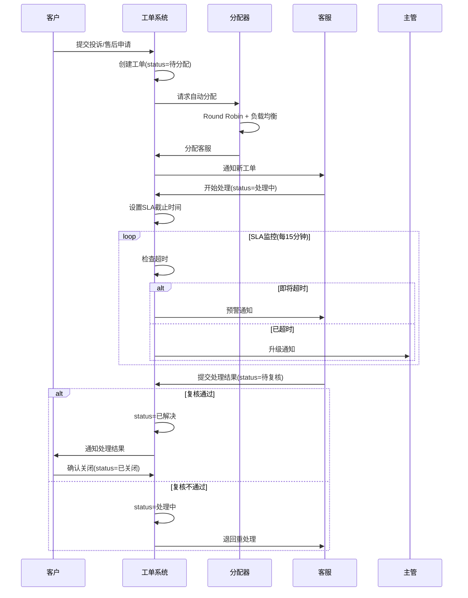
```mermaid
sequenceDiagram
    participant C as 客户
    participant S as 工单系统
    participant A as 分配器
    participant Ag as 客服
    participant Sup as 主管

    C->>S: 提交投诉/售后申请
    S->>S: 创建工单(status=待分配)
    S->>A: 请求自动分配
    A->>A: Round Robin + 负载均衡
    A->>S: 分配客服
    S->>Ag: 通知新工单
    Ag->>S: 开始处理(status=处理中)
    S->>S: 设置SLA截止时间
    loop SLA监控(每15分钟)
        S->>S: 检查超时
        alt 即将超时
            S->>Ag: 预警通知
        else 已超时
            S->>Sup: 升级通知
        end
    end
    Ag->>S: 提交处理结果(status=待复核)
    alt 复核通过
        S->>S: status=已解决
        S->>C: 通知处理结果
        C->>S: 确认关闭(status=已关闭)
    else 复核不通过
        S->>S: status=处理中
        S->>Ag: 退回重处理
    end
```

---

## 6.14 线下门店与O2O服务

### 6.14.1 设计概述

线下门店系统支撑 **门店信息展示**、**最近门店分配**、**门店自提核销**、**自营物流配送** 四大场景。门店分配综合考虑距离、产能、历史匹配度加权评分；自提核销基于二维码/验证码双因子验证；自营配送通过司机App回传GPS轨迹实现全程可视化。

### 6.14.2 门店分配算法

```php
<?php

namespace App\Domains\Store\Services;

use App\Domains\Customer\Models\Customer;
use App\Domains\Order\Models\Order;
use App\Domains\Store\Models\Store;

class StoreAssignmentService
{
    public function assign(Customer $customer, Order $order): Store
    {
        $candidates = Store::where('status', 1)
            ->where(function ($q) use ($customer) {
                $q->where('city_name', $customer->city_name)
                  ->orWhere('province_name', $customer->province_name);
            })
            ->withCount(['orders as daily_orders' => fn($q) => $q->whereDate('created_at', today())])
            ->get();

        if ($candidates->isEmpty()) {
            throw new \RuntimeException('该区域暂无可用门店');
        }

        $scored = $candidates->map(function (Store $store) use ($customer, $order) {
            $score = 0.0;

            // 距离权重 50%
            if ($customer->lat && $customer->lng && $store->lat && $store->lng) {
                $dist = $this->haversine($customer->lat, $customer->lng, $store->lat, $store->lng);
                $score += (1 / (1 + $dist / 1000)) * 0.5;
            }

            // 产能权重 30%
            $capacityRatio = $store->daily_orders / max(1, $store->capacity_daily);
            $score += (1 - min($capacityRatio, 1)) * 0.3;

            // 历史匹配权重 20%
            $historical = $store->orders()->where('customer_id', $customer->id)->count();
            $score += min($historical / 5.0, 1.0) * 0.2;

            return ['store' => $store, 'score' => $score];
        });

        return $scored->sortByDesc('score')->first()['store'];
    }

    private function haversine(float $lat1, float $lng1, float $lat2, float $lng2): float
    {
        $earthRadius = 6371;
        $dLat = deg2rad($lat2 - $lat1);
        $dLng = deg2rad($lng2 - $lng1);
        $a = sin($dLat / 2) ** 2 +
             cos(deg2rad($lat1)) * cos(deg2rad($lat2)) * sin($dLng / 2) ** 2;
        return 2 * $earthRadius * atan2(sqrt($a), sqrt(1 - $a));
    }
}
```

### 6.14.3 门店自提核销

```php
<?php

namespace App\Domains\Store\Services;

use App\Domains\Order\Models\Order;
use App\Enums\OrderStatus;
use Illuminate\Support\Facades\Cache;
use Illuminate\Support\Str;
use SimpleSoftwareIO\QrCode\Facades\QrCode;

class StorePickupService
{
    /**
     * 生成自提二维码与验证码
     */
    public function generatePickupCode(Order $order): array
    {
        $code = strtoupper(Str::random(8));
        $qrData = json_encode([
            'order_sn' => $order->order_sn,
            'code' => $code,
            'expire_at' => now()->addDays(7)->timestamp,
        ]);

        Cache::put("pickup:{$order->order_sn}", $code, now()->addDays(7));

        return [
            'verify_code' => $code,
            'qr_code' => QrCode::format('png')->size(300)->generate($qrData),
            'expire_at' => now()->addDays(7),
        ];
    }

    /**
     * 门店核销
     */
    public function verifyPickup(string $input, int $storeId): Order
    {
        // 支持扫码解析或手动输入验证码
        if (str_starts_with($input, '{')) {
            $data = json_decode($input, true);
            $orderSn = $data['order_sn'] ?? '';
            $code = $data['code'] ?? '';
        } else {
            $order = Order::where('pickup_code', $input)->first();
            if (!$order) {
                throw new \InvalidArgumentException('无效的取货码');
            }
            $orderSn = $order->order_sn;
            $code = $input;
        }

        $order = Order::where('order_sn', $orderSn)
            ->where('delivery_type', 3) // 自提
            ->first();

        if (!$order) {
            throw new \InvalidArgumentException('订单不存在或非自提订单');
        }

        $cachedCode = Cache::get("pickup:{$order->order_sn}");
        if (!$cachedCode || $cachedCode !== $code) {
            throw new \InvalidArgumentException('取货码错误或已过期');
        }

        // 核销成功
        $order->update([
            'status' => OrderStatus::COMPLETED,
            'pickup_verified_at' => now(),
            'pickup_store_id' => $storeId,
        ]);

        Cache::forget("pickup:{$order->order_sn}");

        return $order;
    }
}
```

### 6.14.4 自营物流配送轨迹

```sql
CREATE TABLE stores (
    id BIGINT UNSIGNED PRIMARY KEY AUTO_INCREMENT,
    store_code VARCHAR(32) UNIQUE NOT NULL,
    name VARCHAR(128) NOT NULL,
    province_name VARCHAR(32),
    city_name VARCHAR(32),
    county_name VARCHAR(32),
    detail_address VARCHAR(256),
    lat DECIMAL(10, 8),
    lng DECIMAL(11, 8),
    contact_person VARCHAR(64),
    contact_phone VARCHAR(20),
    capacity_daily INT DEFAULT 100 COMMENT '日产能上限',
    status TINYINT DEFAULT 1 COMMENT '1=营业 0=停业',
    open_time VARCHAR(64) COMMENT '营业时间',
    created_at DATETIME DEFAULT CURRENT_TIMESTAMP,
    INDEX idx_city(status, city_name),
    INDEX idx_location(lat, lng)
) ENGINE=InnoDB COMMENT='门店信息表';

-- FIX-P0: 门店客户经理表（store_manager_profiles 别名 store_managers）
CREATE TABLE store_managers (
    id BIGINT UNSIGNED PRIMARY KEY AUTO_INCREMENT,
    store_id BIGINT UNSIGNED NOT NULL,
    name VARCHAR(64) NOT NULL,
    mobile_phone VARCHAR(20),
    email VARCHAR(128),
    is_primary TINYINT(1) DEFAULT 0 COMMENT '是否主负责人',
    created_at DATETIME DEFAULT CURRENT_TIMESTAMP,
    INDEX idx_store_id(store_id)
) ENGINE=InnoDB COMMENT='门店客户经理表';

CREATE TABLE delivery_tracks (
    id BIGINT UNSIGNED PRIMARY KEY AUTO_INCREMENT,
    order_id BIGINT UNSIGNED NOT NULL,
    driver_id BIGINT UNSIGNED NOT NULL,
    lat DECIMAL(10, 8) NOT NULL,
    lng DECIMAL(11, 8) NOT NULL,
    address VARCHAR(256),
    speed DECIMAL(5, 2) COMMENT '速度 km/h',
    recorded_at DATETIME DEFAULT CURRENT_TIMESTAMP,
    INDEX idx_order_id(order_id),
    INDEX idx_recorded_at(recorded_at)
) ENGINE=InnoDB COMMENT='配送轨迹表';
```

```php
<?php

namespace App\Http\Controllers\Api\Driver;

use App\Domains\Logistics\Models\DeliveryTrack;
use App\Domains\Order\Models\Order;
use App\Http\Controllers\Controller;
use Illuminate\Http\Request;

class DriverLocationController extends Controller
{
    /**
     * 司机App上报GPS轨迹
     */
    public function uploadTrack(Request $request)
    {
        $validated = $request->validate([
            'order_id' => ['required', 'exists:orders,id'],
            'lat' => ['required', 'numeric', 'between:-90,90'],
            'lng' => ['required', 'numeric', 'between:-180,180'],
            'speed' => ['nullable', 'numeric'],
        ]);

        DeliveryTrack::create([
            'order_id' => $validated['order_id'],
            'driver_id' => auth('driver')->id(),
            'lat' => $validated['lat'],
            'lng' => $validated['lng'],
            'speed' => $validated['speed'] ?? null,
            'address' => $this->reverseGeocode($validated['lat'], $validated['lng']),
        ]);

        return response()->json(['message' => '位置上报成功']);
    }

    /**
     * 客户查询配送轨迹
     */
    public function getTrack(string $orderSn)
    {
        $order = Order::where('order_sn', $orderSn)
            ->where('customer_id', auth('customer')->id())
            ->firstOrFail();

        $tracks = DeliveryTrack::where('order_id', $order->id)
            ->orderBy('recorded_at')
            ->get(['lat', 'lng', 'address', 'speed', 'recorded_at']);

        return response()->json([
            'order_sn' => $orderSn,
            'current_location' => $tracks->last(),
            'path' => $tracks,
            'estimated_arrival' => $this->estimateArrival($tracks, $order),
        ]);
    }
}
```

---

## 6.15 系统配置管理

### 6.15.1 设计概述

系统配置管理覆盖 **全局参数**、**功能开关(Feature Flag)**、**维护模式**、**价格策略** 四大维度。配置以数据库为权威源，Laravel Config 缓存为读取加速层，支持热更新无需重启服务。功能开关通过 Middleware 控制接口放行，维护模式支持白名单透传。

### 6.15.2 全局参数配置

```php
<?php

namespace App\Domains\Platform\Models;

use Illuminate\Database\Eloquent\Model;
use Illuminate\Support\Facades\Cache;

class SystemConfig extends Model
{
    protected $primaryKey = 'config_key';
    public $incrementing = false;
    protected $keyType = 'string';

    protected static function booted(): void
    {
        static::saved(fn() => Cache::forget('system:configs'));
        static::deleted(fn() => Cache::forget('system:configs'));
    }

    public static function get(string $key, mixed $default = null): mixed
    {
        return Cache::remember('system:configs', 60, function () {
            return self::all()->mapWithKeys(
                fn($c) => [$c->config_key => self::castValue($c->config_value, $c->value_type)]
            )->toArray();
        })[$key] ?? $default;
    }

    private static function castValue(string $value, string $type): mixed
    {
        return match ($type) {
            'int' => (int) $value,
            'float' => (float) $value,
            'bool' => in_array($value, ['1', 'true', 'yes'], true),
            'json' => json_decode($value, true),
            'array' => explode(',', $value),
            default => $value,
        };
    }
}
```

```sql
CREATE TABLE system_configs (
    config_key VARCHAR(128) PRIMARY KEY COMMENT '配置键',
    config_value TEXT NOT NULL COMMENT '配置值',
    value_type VARCHAR(16) DEFAULT 'string' COMMENT 'string/int/float/bool/json/array',
    description VARCHAR(256),
    is_editable TINYINT(1) DEFAULT 1,
    category VARCHAR(32) DEFAULT 'general' COMMENT '分类: general/pricing/feature/security',
    created_at DATETIME DEFAULT CURRENT_TIMESTAMP,
    updated_at DATETIME DEFAULT CURRENT_TIMESTAMP ON UPDATE CURRENT_TIMESTAMP,
    INDEX idx_category(category)
) ENGINE=InnoDB COMMENT='系统配置表';
```

### 6.15.3 功能开关（Feature Flag）

```php
<?php

namespace App\Domains\Platform\Services;

use App\Domains\Platform\Models\FeatureSwitch;
use Illuminate\Support\Facades\Cache;

class FeatureFlagService
{
    public function isEnabled(string $flag, ?int $customerId = null, ?string $customerGroup = null): bool
    {
        $switch = Cache::remember("feature:{$flag}", 60, function () use ($flag) {
            return FeatureSwitch::where('flag_name', $flag)->first();
        });

        if (!$switch || !$switch->is_enabled) {
            return false;
        }

        // 灰度：按客户ID哈希
        if ($switch->rollout_percent < 100 && $customerId) {
            return (crc32((string) $customerId) % 100) < $switch->rollout_percent;
        }

        // 按客户分组
        if ($switch->target_groups && $customerGroup) {
            return in_array($customerGroup, json_decode($switch->target_groups, true), true);
        }

        return true;
    }
}
```

```sql
CREATE TABLE feature_switches (
    id BIGINT UNSIGNED PRIMARY KEY AUTO_INCREMENT,
    flag_name VARCHAR(64) UNIQUE NOT NULL,
    description VARCHAR(256),
    is_enabled TINYINT(1) DEFAULT 0,
    rollout_percent INT DEFAULT 100 COMMENT '灰度百分比 0~100',
    target_groups JSON COMMENT '目标分组白名单',
    start_at DATETIME COMMENT '生效时间',
    end_at DATETIME COMMENT '失效时间',
    created_at DATETIME DEFAULT CURRENT_TIMESTAMP,
    updated_at DATETIME DEFAULT CURRENT_TIMESTAMP ON UPDATE CURRENT_TIMESTAMP
) ENGINE=InnoDB COMMENT='功能开关表';
```

**Feature Flag 中间件**：

```php
<?php

namespace App\Http\Middleware;

use App\Domains\Platform\Services\FeatureFlagService;
use Closure;
use Illuminate\Http\Request;

class FeatureFlagMiddleware
{
    public function __construct(private FeatureFlagService $featureFlag) {}

    public function handle(Request $request, Closure $next, string $flag)
    {
        $customerId = auth('customer')->id();
        $customerGroup = auth('customer')->user()?->customer_group;

        if (!$this->featureFlag->isEnabled($flag, $customerId, $customerGroup)) {
            return response()->json([
                'code' => 403,
                'message' => '该功能暂未开放',
            ], 403);
        }

        return $next($request);
    }
}
```

### 6.15.4 维护模式与白名单

```php
<?php

namespace App\Http\Middleware;

use Closure;
use Illuminate\Http\Request;
use Illuminate\Support\Facades\Cache;

class MaintenanceModeMiddleware
{
    public function handle(Request $request, Closure $next)
    {
        // 优先读取 Laravel 内置维护状态
        if (app()->isDownForMaintenance()) {
            $allowedIps = Cache::get('maintenance:allow_ips', []);
            $allowedTokens = Cache::get('maintenance:allow_tokens', []);

            if (
                in_array($request->ip(), $allowedIps, true) ||
                in_array($request->bearerToken(), $allowedTokens, true)
            ) {
                return $next($request);
            }

            return response()->json([
                'code' => 503,
                'message' => '系统维护中，请稍后再试',
                'retry_after' => 300,
            ], 503);
        }

        return $next($request);
    }
}
```

```php
<?php

namespace App\Console\Commands;

use Illuminate\Console\Command;
use Illuminate\Support\Facades\Cache;

class MaintenanceCommand extends Command
{
    protected $signature = 'yian:maintenance
                            {action : up|down}
                            {--ips= : 允许访问的IP，逗号分隔}
                            {--tokens= : 允许访问的Token，逗号分隔}';

    public function handle(): int
    {
        $action = $this->argument('action');

        if ($action === 'down') {
            // 调用 Laravel 内置维护
            $this->call('down', ['--render' => 'errors::503']);

            Cache::put('maintenance:allow_ips', explode(',', $this->option('ips') ?? ''), 3600);
            Cache::put('maintenance:allow_tokens', explode(',', $this->option('tokens') ?? ''), 3600);

            $this->info('系统已进入维护模式');
        } else {
            $this->call('up');
            Cache::forget('maintenance:allow_ips');
            Cache::forget('maintenance:allow_tokens');
            $this->info('系统已恢复服务');
        }

        return self::SUCCESS;
    }
}
```

### 6.15.5 价格策略配置

```php
<?php

namespace App\Domains\Pricing\Services;

use App\Domains\Platform\Models\SystemConfig;

class PricingConfigService
{
    public function getConfig(): array
    {
        return [
            'point_exchange_rate' => SystemConfig::get('point.exchange.rate', 100),
            'point_max_deduct_rate' => SystemConfig::get('point.max.deduct.rate', 10),
            'point_min_deduct_points' => SystemConfig::get('point.min.deduct.points', 100),
            'urgent_fee' => SystemConfig::get('pricing.urgent.fee', 50.00),
            'large_order_threshold' => SystemConfig::get('order.large_amount_threshold', 50000),
            'deposit_ratio' => SystemConfig::get('pricing.deposit.ratio', 0.3),
        ];
    }
}
```

### 6.15.6 样品频次限制表 (customer_sample_limits)

```php
<?php

use Illuminate\Database\Migrations\Migration;
use Illuminate\Database\Schema\Blueprint;
use Illuminate\Support\Facades\Schema;

return new class extends Migration
{
    public function up(): void
    {
        Schema::create('customer_sample_limits', function (Blueprint $table) {
            $table->id()->comment('主键');
            $table->foreignId('customer_id')->constrained('customers')->comment('客户ID');
            $table->year('year')->comment('年份');
            $table->unsignedTinyInteger('month')->nullable()->comment('月份（null表示按年统计）');
            $table->unsignedTinyInteger('used_count')->default(0)->comment('已使用次数');
            $table->unsignedTinyInteger('max_count')->default(1)->comment('最大次数');
            $table->timestamps();
            $table->unique(['customer_id', 'year', 'month']);
        });
    }

    public function down(): void
    {
        Schema::dropIfExists('customer_sample_limits');
    }
};
```

---

## 6.16 企业认证系统

### 6.16.1 设计概述

企业认证系统覆盖客户从提交资料到审核通过的完整生命周期，状态采用 **kM 枚举体系**（0未提交/1待审核/2通过/3不通过/4驳回/20代认证通过）。证件上传使用 Laravel Storage + 图片压缩，OCR 识别为可选增强。审核流程通过 Eloquent Observer 监听状态变更，自动触发通知与权益刷新。

### 6.16.2 认证状态机（PHP Enum）

```php
<?php

namespace App\Enums;

enum AuthStatus: int
{
    case NOT_SUBMITTED = 0;    // 未提交
    case PENDING_AUDIT = 1;    // 待审核
    case APPROVED = 2;         // 通过
    case REJECTED = 3;         // 不通过
    case DISMISSED = 4;        // 驳回
    case PROXY_APPROVED = 20;  // 代认证通过

    public function label(): string
    {
        return match ($this) {
            self::NOT_SUBMITTED => '未提交',
            self::PENDING_AUDIT => '待审核',
            self::APPROVED => '通过',
            self::REJECTED => '不通过',
            self::DISMISSED => '驳回',
            self::PROXY_APPROVED => '代认证通过',
        };
    }

    public function isAuthenticated(): bool
    {
        return in_array($this->value, [self::APPROVED->value, self::PROXY_APPROVED->value], true);
    }

    public function isResubmittable(): bool
    {
        return in_array($this->value, [
            self::NOT_SUBMITTED->value,
            self::REJECTED->value,
            self::DISMISSED->value,
        ], true);
    }

    /**
     * 允许的状态流转路径
     */
    public function canTransitionTo(self $target): bool
    {
        return match ([$this, $target]) {
            [self::NOT_SUBMITTED, self::PENDING_AUDIT] => true,
            [self::PENDING_AUDIT, self::APPROVED] => true,
            [self::PENDING_AUDIT, self::REJECTED] => true,
            [self::PENDING_AUDIT, self::DISMISSED] => true,
            [self::PENDING_AUDIT, self::PROXY_APPROVED] => true,
            [self::REJECTED, self::PENDING_AUDIT] => true,
            [self::DISMISSED, self::PENDING_AUDIT] => true,
            [self::PROXY_APPROVED, self::APPROVED] => true,
            default => false,
        };
    }
}
```

### 6.16.3 认证资料提交与OCR

```php
<?php

namespace App\Domains\Auth\Actions;

use App\Domains\Auth\Models\AuthAuditLog;
use App\Domains\Auth\Services\OcrService;
use App\Domains\Customer\Models\Customer;
use App\Enums\AuthStatus;
use Illuminate\Http\UploadedFile;
use Illuminate\Support\Facades\Storage;

class SubmitCustomerAuthAction
{
    public function __construct(
        private OcrService $ocrService,
    ) {}

    public function execute(int $customerId, array $data): void
    {
        $customer = Customer::findOrFail($customerId);

        throw_unless(
            AuthStatus::from($customer->auth_status)->isResubmittable(),
            new \InvalidArgumentException('当前认证状态不允许重新提交')
        );

        // 1. 存储证件图片（压缩 + 水印）
        $licensePath = $this->storeAuthImage($data['business_license_img'], $customerId);

        // 2. OCR 自动识别（异步，失败不阻断）
        $ocrResult = null;
        try {
            $ocrResult = $this->ocrService->recognize($licensePath);
        } catch (\Throwable $e) {
            \Log::warning("[AuthOCR] 识别失败，转人工: customerId={$customerId}");
        }

        // 3. 更新客户认证资料
        $customer->update([
            'company_name' => $data['company_name'],
            'credit_code' => $data['credit_code'],
            'legal_person' => $data['legal_person'],
            'legal_person_id_card' => $data['legal_person_id_card'] ?? null,
            'business_license_img' => $licensePath,
            'auth_picture_type' => $data['auth_picture_type'] ?? 1,
            'contact_name' => $data['contact_name'],
            'contact_phone' => $data['contact_phone'],
            'register_address' => $data['register_address'] ?? null,
            'office_address' => $data['office_address'] ?? null,
            'valid_date' => $data['valid_date'] ?? null,
            'ocr_result' => $ocrResult ? json_encode($ocrResult) : null,
            'ocr_verified' => $ocrResult && $this->verifyOcrMatch($ocrResult, $data) ? 1 : 0,
            'auth_status' => AuthStatus::PENDING_AUDIT->value,
        ]);

        \Log::info("[AuthSubmit] 资料提交成功，进入待审核", ['customer_id' => $customerId]);
    }

    private function storeAuthImage(UploadedFile $file, int $customerId): string
    {
        $path = $file->storeAs(
            "auth/{$customerId}",
            'license_' . time() . '.' . $file->getClientOriginalExtension(),
            's3'
        );

        return Storage::disk('s3')->url($path);
    }

    private function verifyOcrMatch(array $ocr, array $data): bool
    {
        return str_contains($ocr['company_name'] ?? '', $data['company_name'])
            || str_contains($ocr['credit_code'] ?? '', $data['credit_code']);
    }
}
```

### 6.16.4 认证审核流程

```php
<?php

namespace App\Domains\Auth\Observers;

use App\Domains\Auth\Models\AuthAuditLog;
use App\Domains\Customer\Models\Customer;
use App\Enums\AuthStatus;

class CustomerAuthObserver
{
    public function updated(Customer $customer): void
    {
        if (!$customer->isDirty('auth_status')) {
            return;
        }

        $from = AuthStatus::from($customer->getOriginal('auth_status'));
        $to = AuthStatus::from($customer->auth_status);

        // 记录审计日志
        AuthAuditLog::create([
            'customer_id' => $customer->id,
            'before_status' => $from->value,
            'after_status' => $to->value,
            'operator_id' => auth('admin')->id(),
            'reason' => request('reason'),
        ]);

        // 认证通过 / 代认证通过：刷新VIP权益缓存，发送通知
        if ($to->isAuthenticated()) {
            Cache::forget("customer:vip:{$customer->id}");
            $customer->notify(new \App\Notifications\AuthApproved($customer));
        }

        // 不通过 / 驳回：发送通知
        if (in_array($to->value, [AuthStatus::REJECTED->value, AuthStatus::DISMISSED->value], true)) {
            $customer->notify(new \App\Notifications\AuthRejected($customer, request('reason')));
        }
    }
}
```

### 6.16.5 认证权限守卫

```php
<?php

namespace App\Domains\Auth\Services;

use App\Domains\Customer\Models\Customer;
use App\Enums\AuthStatus;

class AuthGuardService
{
    public function checkInvoiceApply(int $customerId): void
    {
        $customer = Customer::findOrFail($customerId);
        if (!AuthStatus::from($customer->auth_status)->isAuthenticated()) {
            throw new \RuntimeException('认证通过后方可申请发票', 403);
        }
    }

    public function checkVipDiscount(int $customerId): void
    {
        $customer = Customer::findOrFail($customerId);
        if (!AuthStatus::from($customer->auth_status)->isAuthenticated()) {
            throw new \RuntimeException('认证通过后方可享受VIP折扣', 403);
        }
    }

    public function isUnAuth(int $customerId): bool
    {
        $customer = Customer::find($customerId);
        return !$customer || !AuthStatus::from($customer->auth_status)->isAuthenticated();
    }
}
```

### 6.16.6 电子签约

```php
<?php

namespace App\Domains\Auth\Actions;

use App\Domains\Customer\Models\Customer;
use App\Enums\AuthStatus;

class CustomerSignAction
{
    public function execute(int $customerId, string $agreementVersion): void
    {
        $customer = Customer::findOrFail($customerId);

        if (!AuthStatus::from($customer->auth_status)->isAuthenticated()) {
            throw new \RuntimeException('请先完成企业认证再签署协议');
        }

        // 幂等：已签约则直接返回
        if ($customer->signed_time && ($customer->sign & 2) === 2) {
            return;
        }

        $customer->update([
            'signed_time' => now(),
            'sign' => ($customer->sign ?? 0) | 2, // 位1=已签协议
        ]);

        event(new \App\Domains\Auth\Events\CustomerSigned($customerId, $agreementVersion));
    }
}
```

---

## 6.17 网络异常与降级处理

### 6.17.1 设计概述

网络异常处理系统覆盖 **服务降级**、**熔断保护**、**第三方失败重试**、**限流防刷** 四大场景。通过 Laravel Middleware 实现降级开关控制，自定义 CircuitBreaker 类基于 Redis 计数器实现熔断，第三方服务失败通过 Laravel Queue + Horizon 实现自动重试与死信队列，API 限流使用 Laravel Throttle 中间件。

### 6.17.2 服务降级（Middleware + Config 开关）

```php
<?php

namespace App\Http\Middleware;

use App\Domains\Platform\Models\SystemConfig;
use Closure;
use Illuminate\Http\Request;

class DegradeMiddleware
{
    public function handle(Request $request, Closure $next, string $feature)
    {
        $isDegraded = SystemConfig::get("degrade.{$feature}", false);

        if ($isDegraded) {
            return match ($feature) {
                'search' => response()->json([
                    'code' => 200,
                    'data' => [],
                    'message' => '搜索服务暂不可用，请稍后重试',
                ]),
                'recommend' => $next($request), // 静默跳过推荐
                'third_party_payment' => response()->json([
                    'code' => 503,
                    'message' => '支付通道维护中，请使用余额支付',
                ], 503),
                default => response()->json([
                    'code' => 503,
                    'message' => '服务暂不可用',
                ], 503),
            };
        }

        return $next($request);
    }
}
```

### 6.17.3 熔断器（Redis 计数器实现）

```php
<?php

namespace App\Domains\Platform\Services;

use Illuminate\Support\Facades\Redis;

class CircuitBreaker
{
    private const FAIL_KEY = 'circuit:fail:%s';
    private const STATE_KEY = 'circuit:state:%s';
    private const SUCCESS_KEY = 'circuit:success:%s';

    public function __construct(
        private string $name,
        private int $failThreshold = 5,
        private int $timeoutSeconds = 30,
        private int $halfOpenMaxRequests = 3,
    ) {}

    public function call(callable $callback)
    {
        $state = $this->getState();

        if ($state === 'OPEN') {
            throw new \RuntimeException("[CircuitBreaker] {$this->name} 熔断器已开启");
        }

        try {
            $result = $callback();
            $this->recordSuccess();
            return $result;
        } catch (\Throwable $e) {
            $this->recordFailure();
            throw $e;
        }
    }

    private function getState(): string
    {
        $state = Redis::get(sprintf(self::STATE_KEY, $this->name));

        if ($state === 'OPEN') {
            // 检查是否已过熔断期
            $ttl = Redis::ttl(sprintf(self::STATE_KEY, $this->name));
            if ($ttl <= 0) {
                Redis::setex(sprintf(self::STATE_KEY, $this->name), $this->timeoutSeconds, 'HALF_OPEN');
                Redis::setex(sprintf(self::SUCCESS_KEY, $this->name), $this->timeoutSeconds, '0');
                return 'HALF_OPEN';
            }
            return 'OPEN';
        }

        return $state ?: 'CLOSED';
    }

    private function recordFailure(): void
    {
        $key = sprintf(self::FAIL_KEY, $this->name);
        $count = Redis::incr($key);
        Redis::expire($key, 60);

        if ($count >= $this->failThreshold) {
            Redis::setex(sprintf(self::STATE_KEY, $this->name), $this->timeoutSeconds, 'OPEN');
        }
    }

    private function recordSuccess(): void
    {
        Redis::del(sprintf(self::FAIL_KEY, $this->name));

        $state = $this->getState();
        if ($state === 'HALF_OPEN') {
            $successKey = sprintf(self::SUCCESS_KEY, $this->name);
            $successCount = Redis::incr($successKey);
            if ($successCount >= $this->halfOpenMaxRequests) {
                Redis::del(sprintf(self::STATE_KEY, $this->name));
                Redis::del($successKey);
            }
        }
    }
}
```

### 6.17.4 第三方服务失败重试（Queue + Horizon）

```php
<?php

namespace App\Domains\Payment\Jobs;

use App\Domains\Payment\Services\PaymentNotifyService;
use Illuminate\Bus\Queueable;
use Illuminate\Contracts\Queue\ShouldQueue;
use Illuminate\Foundation\Bus\Dispatchable;
use Illuminate\Queue\InteractsWithQueue;
use Illuminate\Queue\SerializesModels;

class ProcessPaymentNotifyJob implements ShouldQueue
{
    use Dispatchable, InteractsWithQueue, Queueable, SerializesModels;

    public int $tries = 3;
    public array $backoff = [30, 120, 300]; // 30s, 2min, 5min 退避

    public function __construct(
        private string $gateway,
        private array $notifyData,
    ) {}

    public function handle(PaymentNotifyService $service): void
    {
        $service->process($this->gateway, $this->notifyData);
    }

    /**
     * 失败入死信队列（Horizon 自动处理）
     */
    public function failed(\Throwable $exception): void
    {
        \Log::error('[PaymentNotify] 处理失败，入死信队列', [
            'gateway' => $this->gateway,
            'error' => $exception->getMessage(),
        ]);

        // 写入失败日志表，运营后台可人工处理
        \DB::table('failed_payment_notifies')->insert([
            'gateway' => $this->gateway,
            'payload' => json_encode($this->notifyData),
            'error' => $exception->getMessage(),
            'failed_at' => now(),
        ]);
    }
}
```

### 6.17.5 限流（Laravel Throttle）

```php
<?php

namespace App\Http\Middleware;

use Closure;
use Illuminate\Http\Request;
use Illuminate\Support\Facades\RateLimiter;
use Symfony\Component\HttpFoundation\Response;

class CustomThrottleMiddleware
{
    public function handle(Request $request, Closure $next, string $key = 'default', int $maxAttempts = 60, int $decayMinutes = 1)
    {
        $limitKey = "{$key}:" . $request->ip();

        if (RateLimiter::tooManyAttempts($limitKey, $maxAttempts)) {
            $retryAfter = RateLimiter::availableIn($limitKey);
            return response()->json([
                'code' => 429,
                'message' => '请求过于频繁，请稍后重试',
                'retry_after' => $retryAfter,
            ], Response::HTTP_TOO_MANY_REQUESTS);
        }

        RateLimiter::hit($limitKey, $decayMinutes * 60);

        return $next($request);
    }
}
```

**路由配置**：

```php
// routes/api.php
Route::middleware(['throttle:api'])->group(function () {
    Route::post('/orders', [OrderController::class, 'store']);
});

Route::middleware([CustomThrottleMiddleware::class . ':sms,5,1'])->group(function () {
    Route::post('/common/send-sms-code', [AuthController::class, 'sendSmsCode']);
});
```

### 6.17.6 异常处理矩阵

| 异常场景 | 检测机制 | 降级策略 | 恢复策略 |
|----------|----------|----------|----------|
| API 超时(10s) | Middleware 计时 | 返回友好提示 + 重试按钮 | 指数退避重试 |
| 第三方支付失败 | Queue Job 异常捕获 | 入失败队列，转余额支付 | Horizon 手动重试 |
| 短信通道熔断 | CircuitBreaker 计数 | 自动切换备用通道 | 10分钟后半开探测 |
| Redis 不可用 | Cache 异常捕获 | 直连数据库 + 本地缓存 | 健康检查自动恢复 |
| 搜索服务异常 | Scout 异常捕获 | 降级为 MySQL LIKE 查询 | ES 恢复后自动切换 |

---

## 6.18 客服与帮助系统

### 6.18.1 设计概述

客服与帮助系统由 **在线实时客服**、**AI 知识库问答**、**帮助中心/FAQ** 三大模块组成。在线客服基于 Laravel Reverb（或 Soketi）实现 WebSocket 实时双向通信，消息持久化至 MySQL；客服分配采用负载均衡算法；知识库与 FAQ 使用 Laravel Scout + Meilisearch 实现全文检索。

### 6.18.2 WebSocket 实时客服（Laravel Reverb）

```php
<?php

namespace App\Domains\Support\Events;

use App\Domains\Support\Models\ChatMessage;
use Illuminate\Broadcasting\Channel;
use Illuminate\Broadcasting\InteractsWithSockets;
use Illuminate\Contracts\Broadcasting\ShouldBroadcastNow;
use Illuminate\Foundation\Events\Dispatchable;
use Illuminate\Queue\SerializesModels;

class MessageSent implements ShouldBroadcastNow
{
    use Dispatchable, InteractsWithSockets, SerializesModels;

    public function __construct(public ChatMessage $message) {}

    public function broadcastOn(): array
    {
        return [
            new Channel('chat.session.' . $this->message->session_id),
        ];
    }

    public function broadcastAs(): string
    {
        return 'message.sent';
    }
}
```

```php
<?php

namespace App\Http\Controllers\Api\Support;

use App\Domains\Support\Events\MessageSent;
use App\Domains\Support\Models\ChatMessage;
use App\Domains\Support\Models\ChatSession;
use App\Domains\Support\Services\AgentAllocationService;
use App\Http\Controllers\Controller;
use Illuminate\Http\Request;
use Illuminate\Support\Facades\Broadcast;

class ChatController extends Controller
{
    public function __construct(
        private AgentAllocationService $allocator,
    ) {}

    /**
     * 开始会话
     */
    public function startSession(Request $request)
    {
        $customerId = auth('customer')->id();

        // 检查是否有进行中的会话
        $existing = ChatSession::where('customer_id', $customerId)
            ->where('status', 1)
            ->first();

        if ($existing) {
            return response()->json(['session_id' => $existing->id, 'agent_id' => $existing->agent_id]);
        }

        $alloc = $this->allocator->allocate($customerId);

        $session = ChatSession::create([
            'customer_id' => $customerId,
            'agent_id' => $alloc['agent_id'],
            'status' => $alloc['agent_id'] ? 1 : 0, // 1=进行中, 0=等待中
            'source' => $request->input('source', 1),
        ]);

        if (!$alloc['agent_id']) {
            // 进入排队队列
            \Redis::rpush('support:queue', $customerId);
        }

        return response()->json([
            'session_id' => $session->id,
            'agent_id' => $session->agent_id,
            'estimated_wait' => $alloc['estimated_wait'] ?? 0,
        ]);
    }

    /**
     * 发送消息
     */
    public function sendMessage(Request $request)
    {
        $validated = $request->validate([
            'session_id' => ['required', 'exists:chat_sessions,id'],
            'content' => ['required', 'string', 'max:2000'],
            'message_type' => ['required', 'in:1,2,3'], // 1=文本 2=图片 3=文件
        ]);

        $session = ChatSession::findOrFail($validated['session_id']);
        $senderType = auth('customer')->check() ? 1 : 2;

        $message = ChatMessage::create([
            'session_id' => $session->id,
            'sender_type' => $senderType,
            'sender_id' => auth('customer')->id(),
            'message_type' => $validated['message_type'],
            'content' => $validated['content'],
            'is_read' => 0,
        ]);

        $session->update(['last_active_at' => now()]);

        // WebSocket 广播
        broadcast(new MessageSent($message))->toOthers();

        return response()->json(['message_id' => $message->id]);
    }
}
```

### 6.18.3 客服分配（负载均衡）

```php
<?php

namespace App\Domains\Support\Services;

use App\Domains\Admin\Models\AdminUser;
use Illuminate\Support\Facades\Redis;

class AgentAllocationService
{
    private const QUEUE_KEY = 'support:queue';
    private const AGENT_LOAD_KEY = 'support:agent:load:%d';

    public function allocate(int $customerId): array
    {
        $agents = AdminUser::where('status', 1)
            ->where('is_online', 1)
            ->where('department', 'customer_service')
            ->withCount(['chatSessions as active_sessions' => fn($q) =>
                $q->where('status', 1)
            ])
            ->get();

        if ($agents->isEmpty()) {
            return ['agent_id' => null, 'estimated_wait' => $this->estimateWaitTime()];
        }

        // 负载最低优先
        $best = $agents->sortBy('active_sessions')->first();

        Redis::incr(sprintf(self::AGENT_LOAD_KEY, $best->id));

        return ['agent_id' => $best->id, 'estimated_wait' => 0];
    }

    private function estimateWaitTime(): int
    {
        $queueSize = Redis::llen(self::QUEUE_KEY) ?: 0;
        return (int) ($queueSize * 5); // 平均5分钟/会话
    }

    /**
     * 处理排队客户（Schedule 每5秒）
     */
    public function processQueue(): void
    {
        while (true) {
            $customerId = Redis::lpop(self::QUEUE_KEY);
            if (!$customerId) break;

            $alloc = $this->allocate((int) $customerId);
            if ($alloc['agent_id']) {
                ChatSession::where('customer_id', $customerId)
                    ->where('status', 0)
                    ->update([
                        'agent_id' => $alloc['agent_id'],
                        'status' => 1,
                    ]);
            } else {
                Redis::lpush(self::QUEUE_KEY, $customerId);
                break;
            }
        }
    }
}
```

### 6.18.4 知识库/FAQ 全文搜索（Scout + Meilisearch）

```php
<?php

namespace App\Domains\Support\Models;

use Illuminate\Database\Eloquent\Model;
use Laravel\Scout\Searchable;

class KnowledgeArticle extends Model
{
    use Searchable;

    protected $fillable = ['category_id', 'title', 'content', 'keywords', 'view_count', 'like_count', 'status'];

    public function toSearchableArray(): array
    {
        return [
            'id' => $this->id,
            'title' => $this->title,
            'content' => strip_tags($this->content),
            'keywords' => $this->keywords,
        ];
    }
}
```

```php
<?php

namespace App\Domains\Support\Services;

use App\Domains\Support\Models\KnowledgeArticle;
use Laravel\Scout\Builder;

class KnowledgeSearchService
{
    public function search(string $keyword, ?int $categoryId = null, int $limit = 20): array
    {
        $query = KnowledgeArticle::search($keyword, function (\Meilisearch\Client $client, string $query, array $options) {
            $options['attributesToHighlight'] = ['title', 'content'];
            $options['highlightPreTag'] = '<em>';
            $options['highlightPostTag'] = '</em>';
            return $client->index('knowledge_articles')->search($query, $options);
        });

        if ($categoryId) {
            $query->where('category_id', $categoryId);
        }

        $results = $query->take($limit)->get();

        return $results->map(fn($article) => [
            'id' => $article->id,
            'title' => $article->title,
            'content_snippet' => mb_substr(strip_tags($article->content), 0, 200),
            'view_count' => $article->view_count,
        ])->toArray();
    }

    /**
     * 相似文章推荐
     */
    public function similarArticles(int $articleId, int $limit = 5): array
    {
        $article = KnowledgeArticle::findOrFail($articleId);

        return KnowledgeArticle::search($article->title . ' ' . $article->keywords)
            ->where('id', '!=', $articleId)
            ->take($limit)
            ->get()
            ->toArray();
    }
}
```

### 6.18.5 帮助中心 API

```php
<?php

namespace App\Http\Controllers\Api\Support;

use App\Domains\Support\Models\HelpFaq;
use App\Domains\Support\Models\KnowledgeArticle;
use App\Domains\Support\Models\KnowledgeCategory;
use App\Domains\Support\Services\KnowledgeSearchService;
use App\Http\Controllers\Controller;
use Illuminate\Http\Request;

class HelpCenterController extends Controller
{
    public function __construct(private KnowledgeSearchService $searchService) {}

    public function categories()
    {
        $tree = KnowledgeCategory::where('status', 1)
            ->orderBy('sort_order')
            ->get()
            ->toTree();

        return response()->json($tree);
    }

    public function articles(Request $request)
    {
        $articles = KnowledgeArticle::where('status', 1)
            ->when($request->category_id, fn($q) => $q->where('category_id', $request->category_id))
            ->orderByDesc('sort_order')
            ->paginate($request->input('per_page', 20));

        return response()->json($articles);
    }

    public function articleDetail(int $id)
    {
        $article = KnowledgeArticle::findOrFail($id);
        $article->increment('view_count');

        return response()->json([
            'article' => $article,
            'similar' => $this->searchService->similarArticles($id),
        ]);
    }

    public function search(Request $request)
    {
        $request->validate(['keyword' => ['required', 'string', 'min:2']]);

        return response()->json(
            $this->searchService->search($request->keyword, $request->category_id)
        );
    }

    public function hotQuestions()
    {
        $questions = \Cache::remember('help:hot_questions', 3600, function () {
            return KnowledgeArticle::where('status', 1)
                ->orderByDesc('view_count')
                ->take(20)
                ->get(['id', 'title', 'view_count']);
        });

        return response()->json($questions);
    }

    public function likeArticle(int $id)
    {
        KnowledgeArticle::where('id', $id)->increment('like_count');
        return response()->json(['message' => '点赞成功']);
    }
}
```

### 6.18.6 未知问题归档表 (unknown_questions)

> **覆盖**：FR-CS-014（AI无法回答的问题自动归档，供运营补充答案）

```php
<?php

use Illuminate\Database\Migrations\Migration;
use Illuminate\Database\Schema\Blueprint;
use Illuminate\Support\Facades\Schema;

return new class extends Migration
{
    public function up(): void
    {
        Schema::create('unknown_questions', function (Blueprint $table) {
            $table->id()->comment('主键');
            $table->text('question')->comment('用户提问内容');
            $table->string('session_id', 64)->nullable()->index()->comment('关联会话ID');
            $table->foreignId('customer_id')->nullable()->constrained('customers')->nullOnDelete()->comment('客户ID');
            $table->timestamp('asked_at')->comment('提问时间');
            $table->enum('status', ['pending', 'assigned', 'answered', 'archived'])->default('pending')->comment('状态');
            $table->foreignId('assigned_admin_id')->nullable()->constrained('admins')->nullOnDelete()->comment('分配运营ID');
            $table->text('answer')->nullable()->comment('运营补充的答案');
            $table->foreignId('faq_id')->nullable()->constrained('faqs')->nullOnDelete()->comment('关联生成的FAQ');
            $table->timestamp('answered_at')->nullable()->comment('回答时间');
            $table->timestamps();

            $table->index('status');
            $table->index('asked_at');
        });
    }

    public function down(): void
    {
        Schema::dropIfExists('unknown_questions');
    }
};
```

---

## 6.19 数据备份与恢复

### 6.19.1 设计概述

数据备份策略覆盖 **数据库全量/增量备份**、**文件存储同步**、**恢复演练** 三大维度。数据库备份通过 Laravel Schedule 调用 `mysqldump` 生成 SQL 文件，文件备份通过 Storage 同步至 MinIO 多副本。恢复演练通过 Artisan Command 定期执行，验证备份有效性。

### 6.19.2 数据库备份（Schedule + mysqldump）

```php
<?php

namespace App\Console\Commands;

use Illuminate\Console\Command;
use Illuminate\Support\Facades\Storage;
use Symfony\Component\Process\Process;

class DatabaseBackupCommand extends Command
{
    protected $signature = 'backup:database
                            {--type=full : full|incremental}
                            {--tables= : 指定表，逗号分隔}';
    protected $description = '执行数据库备份';

    public function handle(): int
    {
        $type = $this->option('type');
        $date = now()->format('Ymd_His');
        $filename = "backup/{$type}/yian_{$type}_{$date}.sql.gz";

        $host = config('database.connections.mysql.host');
        $database = config('database.connections.mysql.database');
        $username = config('database.connections.mysql.username');
        $password = config('database.connections.mysql.password');

        $command = match ($type) {
            'full' => sprintf(
                'mysqldump -h%s -u%s -p%s %s --single-transaction --quick --lock-tables=false | gzip',
                $host, $username, $password, $database
            ),
            'incremental' => $this->buildIncrementalCommand($host, $database, $username, $password),
            default => throw new \InvalidArgumentException('未知备份类型'),
        };

        $process = Process::fromShellCommandline($command);
        $process->setTimeout(3600);
        $process->run();

        if (!$process->isSuccessful()) {
            $this->error('备份失败: ' . $process->getErrorOutput());
            return self::FAILURE;
        }

        // 写入存储
        Storage::disk('backup')->put($filename, $process->getOutput());

        // 清理30天前的备份
        $this->cleanupOldBackups("backup/{$type}");

        $this->info("备份完成: {$filename}");
        return self::SUCCESS;
    }

    private function buildIncrementalCommand(string $host, string $db, string $user, string $pass): string
    {
        $lastBackupTime = $this->getLastBackupTime();
        $tables = $this->option('tables') ?? 'orders,order_items,payments,refunds';

        return sprintf(
            'mysqldump -h%s -u%s -p%s %s %s --where "updated_at > \\"%s\\"" --single-transaction | gzip',
            $host, $user, $pass, $db, str_replace(',', ' ', $tables), $lastBackupTime
        );
    }

    private function getLastBackupTime(): string
    {
        $files = Storage::disk('backup')->files('backup/incremental');
        if (empty($files)) {
            return now()->subDay()->toDateTimeString();
        }
        return now()->parse(basename(last($files), '.sql.gz'))->toDateTimeString();
    }

    private function cleanupOldBackups(string $path): void
    {
        $files = Storage::disk('backup')->files($path);
        foreach ($files as $file) {
            if (Storage::disk('backup')->lastModified($file) < now()->subDays(30)->timestamp) {
                Storage::disk('backup')->delete($file);
            }
        }
    }
}
```

```php
// routes/console.php
Schedule::command('backup:database --type=full')->dailyAt('02:00');
Schedule::command('backup:database --type=incremental --tables=orders,order_items,payments')->everySixHours();
```

### 6.19.3 文件备份（Storage → MinIO）

```php
<?php

namespace App\Console\Commands;

use Illuminate\Console\Command;
use Illuminate\Support\Facades\Storage;

class FileBackupCommand extends Command
{
    protected $signature = 'backup:files
                            {--bucket= : 指定桶}';
    protected $description = '同步文件到 MinIO 备份桶';

    public function handle(): int
    {
        $sourceDisk = Storage::disk('s3');
        $backupDisk = Storage::disk('minio-backup');

        $files = $sourceDisk->allFiles('uploads');
        $count = 0;

        foreach ($files as $file) {
            if ($backupDisk->exists($file)) {
                continue; // 增量同步
            }

            $content = $sourceDisk->get($file);
            $backupDisk->put($file, $content);
            $count++;
        }

        $this->info("文件同步完成: {$count} 个文件");
        return self::SUCCESS;
    }
}
```

### 6.19.4 恢复演练

```php
<?php

namespace App\Console\Commands;

use Illuminate\Console\Command;
use Illuminate\Support\Facades\DB;
use Illuminate\Support\Facades\Storage;
use Symfony\Component\Process\Process;

class BackupDrillCommand extends Command
{
    protected $signature = 'backup:drill
                            {--date= : 指定恢复日期(YYYYMMDD)}';
    protected $description = '执行季度备份恢复演练';

    public function handle(): int
    {
        $date = $this->option('date') ?? now()->subDays(7)->format('Ymd');
        $pattern = "backup/full/yian_full_{$date}*.sql.gz";

        $files = Storage::disk('backup')->files('backup/full');
        $target = collect($files)->first(fn($f) => str_contains($f, $date));

        if (!$target) {
            $this->error("未找到 {$date} 的备份文件");
            return self::FAILURE;
        }

        // 1. 恢复到临时数据库
        $tempDb = 'yian_drill_' . time();
        DB::statement("CREATE DATABASE IF NOT EXISTS {$tempDb}");

        $command = sprintf(
            'gunzip < %s | mysql -h%s -u%s -p%s %s',
            Storage::disk('backup')->path($target),
            config('database.connections.mysql.host'),
            config('database.connections.mysql.username'),
            config('database.connections.mysql.password'),
            $tempDb
        );

        $process = Process::fromShellCommandline($command);
        $process->setTimeout(3600);
        $process->run();

        if (!$process->isSuccessful()) {
            $this->error('恢复失败: ' . $process->getErrorOutput());
            DB::statement("DROP DATABASE IF EXISTS {$tempDb}");
            return self::FAILURE;
        }

        // 2. 数据完整性校验
        $tables = DB::select("SELECT COUNT(*) as cnt FROM information_schema.tables WHERE table_schema = ?", [$tempDb]);
        $rowCounts = DB::select("SELECT SUM(table_rows) as total FROM information_schema.tables WHERE table_schema = ?", [$tempDb]);

        // 3. 业务功能抽样验证
        $validOrders = DB::select("SELECT COUNT(*) as cnt FROM {$tempDb}.orders WHERE status = 69");

        // 4. 清理临时库
        DB::statement("DROP DATABASE IF EXISTS {$tempDb}");

        // 5. 生成报告
        $report = [
            'drill_id' => 'DRILL-' . now()->format('Ymd'),
            'backup_date' => $date,
            'recovery_time_minutes' => $process->getDuration() / 60,
            'tables_count' => $tables[0]->cnt ?? 0,
            'total_rows' => $rowCounts[0]->total ?? 0,
            'valid_orders' => $validOrders[0]->cnt ?? 0,
            'success' => true,
            'created_at' => now(),
        ];

        DB::table('backup_drill_reports')->insert($report);

        $this->info('恢复演练完成，报告已生成');
        return self::SUCCESS;
    }
}
```

```php
// routes/console.php
Schedule::command('backup:files')->dailyAt('03:00');
Schedule::command('backup:drill')->quarterly();
```

### 6.19.5 备份策略矩阵

| 数据类型 | 备份频率 | 保留周期 | 存储位置 | 验证方式 |
|----------|----------|----------|----------|----------|
| MySQL 全量 | 每日 02:00 | 30天 | MinIO 备份桶 | MD5 校验 |
| MySQL 增量 | 每6小时 | 30天 | MinIO 备份桶 | 记录数校验 |
| 文件存储 | 每日 03:00 | 永久 | MinIO 跨区域副本 | 文件 MD5 |
| 恢复演练 | 每季度 | 永久 | 报告表 | 表数/行数/抽样 |

---

## 6.20 审计日志与合规

### 6.20.1 设计概述

审计日志系统覆盖 **操作日志**、**数据变更追踪**、**异常行为告警**、**日志归档** 四大职责。通过 Eloquent Observer 全局监听 `created/updated/deleted` 事件，自动记录操作人与变更快照。数据变更追踪采用 JSON 差异对比，异常行为通过 Rule 引擎触发 Notification 告警。日志归档通过 Schedule 定时迁移至冷存储。

### 6.20.2 操作日志（Eloquent Observer）

```php
<?php

namespace App\Observers;

use Illuminate\Database\Eloquent\Model;
use Illuminate\Support\Facades\Log;
use Illuminate\Support\Facades\Request;

class GlobalAuditObserver
{
    public function created(Model $model): void
    {
        $this->log('CREATE', $model);
    }

    public function updated(Model $model): void
    {
        $this->log('UPDATE', $model, $model->getOriginal(), $model->getChanges());
    }

    public function deleted(Model $model): void
    {
        $this->log('DELETE', $model);
    }

    private function log(string $action, Model $model, array $old = [], array $new = []): void
    {
        // 跳过审计日志表自身和系统表
        if (in_array($model->getTable(), ['audit_logs', 'login_logs', 'data_change_logs', 'tracking_events'])) {
            return;
        }

        $user = auth('customer')->user() ?? auth('admin')->user();

        \DB::table('audit_logs')->insert([
            'operator_id' => $user?->id,
            'operator_type' => $user ? get_class($user) : 'system',
            'operation_type' => $action,
            'target_table' => $model->getTable(),
            'target_id' => $model->getKey(),
            'old_value' => $old ? $this->maskSensitive(json_encode($old)) : null,
            'new_value' => $new ? $this->maskSensitive(json_encode($new)) : null,
            'ip_address' => Request::ip(),
            'user_agent' => substr(Request::userAgent() ?? '', 0, 500),
            'created_at' => now(),
        ]);
    }

    private function maskSensitive(string $json): string
    {
        $fields = ['password', 'pay_password', 'mobile_phone', 'id_card', 'bank_account'];
        foreach ($fields as $field) {
            $json = preg_replace(
                '/"' . $field . '":"[^"]*"/',
                '"' . $field . '":"***"',
                $json
            );
        }
        return $json;
    }
}
```

**在 AppServiceProvider 中注册全局 Observer**：

```php
<?php

namespace App\Providers;

use App\Observers\GlobalAuditObserver;
use Illuminate\Database\Eloquent\Model;
use Illuminate\Support\ServiceProvider;

class AppServiceProvider extends ServiceProvider
{
    public function boot(): void
    {
        Model::observe(GlobalAuditObserver::class);
    }
}
```

### 6.20.3 数据变更追踪（JSON 差异对比）

```php
<?php

namespace App\Domains\Audit\Services;

class DataDiffService
{
    /**
     * 计算两个数组的深层差异
     */
    public function diff(array $old, array $new): array
    {
        $changes = [];
        $allKeys = array_unique(array_merge(array_keys($old), array_keys($new)));

        foreach ($allKeys as $key) {
            $oldVal = $old[$key] ?? null;
            $newVal = $new[$key] ?? null;

            if ($oldVal !== $newVal) {
                $changes[$key] = [
                    'old' => $oldVal,
                    'new' => $newVal,
                ];
            }
        }

        return $changes;
    }

    public function format(array $diff): string
    {
        $lines = [];
        foreach ($diff as $key => $change) {
            $lines[] = "{$key}: " . json_encode($change['old']) . ' → ' . json_encode($change['new']);
        }
        return implode("\n", $lines);
    }
}
```

### 6.20.4 异常行为告警（Rule 引擎 + Notification）

```php
<?php

namespace App\Domains\Audit\Services;

use App\Domains\Customer\Models\Customer;
use App\Notifications\AnomalyAlertNotification;
use Illuminate\Support\Facades\DB;
use Illuminate\Support\Facades\Notification;

class AnomalyDetectionService
{
    private array $rules = [
        'login_fail_burst' => [
            'description' => '登录失败突增',
            'threshold' => 10,
            'window' => 300, // 5分钟
        ],
        'large_order_unusual' => [
            'description' => '异常大额订单',
            'threshold' => 50000,
        ],
        'refund_rate_spike' => [
            'description' => '退款率突增',
            'threshold' => 0.3, // 30%
            'window' => 86400, // 1天
        ],
    ];

    public function scan(): void
    {
        $this->detectLoginFailBurst();
        $this->detectLargeOrderUnusual();
        $this->detectRefundRateSpike();
    }

    private function detectLoginFailBurst(): void
    {
        $results = DB::select("
            SELECT customer_id, COUNT(*) as fail_count
            FROM login_logs
            WHERE login_status = 0
              AND created_at >= DATE_SUB(NOW(), INTERVAL 5 MINUTE)
            GROUP BY customer_id
            HAVING fail_count >= ?
        ", [$this->rules['login_fail_burst']['threshold']]);

        foreach ($results as $row) {
            $this->alert('login_fail_burst', [
                'customer_id' => $row->customer_id,
                'fail_count' => $row->fail_count,
            ]);
        }
    }

    private function detectLargeOrderUnusual(): void
    {
        $orders = DB::select("
            SELECT id, customer_id, order_sn, total_price
            FROM orders
            WHERE total_price >= ?
              AND created_at >= DATE_SUB(NOW(), INTERVAL 1 HOUR)
              AND status NOT IN (0, 255)
        ", [$this->rules['large_order_unusual']['threshold']]);

        foreach ($orders as $order) {
            $this->alert('large_order_unusual', (array) $order);
        }
    }

    private function detectRefundRateSpike(): void
    {
        $results = DB::select("
            SELECT customer_id,
                   COUNT(*) as total_orders,
                   SUM(CASE WHEN status = 0 THEN 1 ELSE 0 END) as cancelled_orders
            FROM orders
            WHERE created_at >= DATE_SUB(NOW(), INTERVAL 1 DAY)
            GROUP BY customer_id
            HAVING cancelled_orders / total_orders >= ?
        ", [$this->rules['refund_rate_spike']['threshold']]);

        foreach ($results as $row) {
            $this->alert('refund_rate_spike', (array) $row);
        }
    }

    private function alert(string $ruleKey, array $context): void
    {
        $rule = $this->rules[$ruleKey];

        DB::table('anomaly_alerts')->insert([
            'rule_key' => $ruleKey,
            'rule_name' => $rule['description'],
            'context' => json_encode($context),
            'level' => match ($ruleKey) {
                'login_fail_burst' => 2, // 中危
                'large_order_unusual' => 1, // 低危
                'refund_rate_spike' => 3, // 高危
                default => 1,
            },
            'created_at' => now(),
        ]);

        // 通知运营人员
        $admins = \App\Domains\Admin\Models\AdminUser::where('receive_alerts', 1)->get();
        Notification::send($admins, new AnomalyAlertNotification($ruleKey, $rule['description'], $context));
    }
}
```

```php
<?php

namespace App\Console\Commands;

use App\Domains\Audit\Services\AnomalyDetectionService;
use Illuminate\Console\Command;

class AnomalyScanCommand extends Command
{
    protected $signature = 'anomaly:scan';
    protected $description = '扫描异常行为并告警';

    public function handle(AnomalyDetectionService $service): int
    {
        $service->scan();
        $this->info('异常扫描完成');
        return self::SUCCESS;
    }
}
```

```php
// routes/console.php
Schedule::command('anomaly:scan')->everyFifteenMinutes();
```

### 6.20.5 日志归档（Schedule 定时冷存储）

```php
<?php

namespace App\Console\Commands;

use Illuminate\Console\Command;
use Illuminate\Support\Facades\DB;
use Illuminate\Support\Facades\Storage;

class LogArchiveCommand extends Command
{
    protected $signature = 'logs:archive '
        . '{--table=audit_logs : 归档表名} '
        . '{--days=90 : 归档多久以前的数据}';
    protected $description = '归档审计日志到冷存储';

    public function handle(): int
    {
        $table = $this->option('table');
        $days = (int) $this->option('days');
        $cutoff = now()->subDays($days);

        // 1. 导出为 Parquet / JSONL
        $filename = "archive/{$table}/{$table}_{$cutoff->format('Ymd')}.jsonl";
        $batchSize = 1000;
        $offset = 0;

        $stream = fopen('php://temp', 'r+');

        do {
            $rows = DB::table($table)
                ->where('created_at', '<', $cutoff)
                ->orderBy('id')
                ->offset($offset)
                ->limit($batchSize)
                ->get();

            foreach ($rows as $row) {
                fwrite($stream, json_encode($row) . "\n");
            }

            $offset += $batchSize;
        } while ($rows->count() === $batchSize);

        rewind($stream);
        $content = stream_get_contents($stream);
        fclose($stream);

        // 2. 上传冷存储
        Storage::disk('minio-cold')->put($filename, $content);

        // 3. 删除热库已归档数据
        $deleted = DB::table($table)->where('created_at', '<', $cutoff)->delete();

        // 4. 记录归档日志
        DB::table('archive_logs')->insert([
            'table_name' => $table,
            'archived_count' => $deleted,
            'archive_path' => $filename,
            'archived_at' => now(),
        ]);

        $this->info("归档完成: {$table} {$deleted} 条记录 → {$filename}");
        return self::SUCCESS;
    }
}
```

```php
// routes/console.php
Schedule::command('logs:archive --table=audit_logs --days=90')->monthlyOn(1, '04:00');
Schedule::command('logs:archive --table=login_logs --days=90')->monthlyOn(1, '04:30');
Schedule::command('logs:archive --table=data_change_logs --days=90')->monthlyOn(1, '05:00');
```

### 6.20.6 审计日志体系矩阵

| 日志类型 | 表名 | 记录内容 | 保留策略 | 归档目标 |
|----------|------|----------|----------|----------|
| 操作审计 | audit_logs | 操作人/目标表/旧值/新值/IP/UA | 90天热存储 | MinIO 冷存储(JSONL) |
| 登录日志 | login_logs | 登录时间/账号/IP/设备/结果 | 90天热存储 | MinIO 冷存储 |
| 数据变更 | data_change_logs | 表/字段/差异/操作人 | 90天热存储 | MinIO 冷存储 |
| 异常告警 | anomaly_alerts | 规则/上下文/级别 | 1年 | 数据库 |
| 归档索引 | archive_logs | 归档元数据与校验 | 永久 | 数据库 |

### 6.20.7 敏感数据脱敏

```php
<?php

namespace App\Support;

class SensitiveDataMasker
{
    public static function phone(string $phone): string
    {
        if (strlen($phone) !== 11) return $phone;
        return substr($phone, 0, 3) . '****' . substr($phone, 7);
    }

    public static function idCard(string $idCard): string
    {
        if (strlen($idCard) < 8) return $idCard;
        return substr($idCard, 0, 3) . str_repeat('*', strlen($idCard) - 7) . substr($idCard, -4);
    }

    public static function address(string $address): string
    {
        $districtIdx = max(mb_strpos($address, '区'), mb_strpos($address, '县'));
        if ($districtIdx > 0) {
            return mb_substr($address, 0, $districtIdx + 1) . '****';
        }
        return mb_substr($address, 0, 6) . '****';
    }

    public static function token(string $token): string
    {
        if (strlen($token) <= 20) return $token;
        return substr($token, 0, 10) . '...' . substr($token, -5);
    }
}
```

---

**第六章（中半部分 6.11 ~ 6.20）完**

---

# 6 核心业务子系统设计（续）

---

## 6.21 用户行为埋点子系统设计

> **设计依据**：PRD 模块二十（管理后台，FR-ADMIN-071~077）、附录 API 清单（`/api/app/collect/user-event`、`/api/app/collect/user-events`）  
> **所属领域**：`App\Domains\Admin\Tracking`（管理后台 — 数据埋点域）  
> **核心数据表**：`user_behavior_tracks`

### 6.21.1 设计概述

怡安印刷商城采用前端采集 + 后端异步持久化的埋点架构。前端通过统一的 Tracker SDK 收集用户行为事件（页面浏览、按钮点击、商品曝光、订单转化漏斗等），以 `batchSize=5` 为阈值批量上报至后端接收接口。后端通过 Laravel Queue 将埋点数据异步写入 `user_behavior_tracks` 表，避免高频写操作阻塞主业务请求。

**核心设计原则**：
- **批量聚合**：前端队列满 5 条或 10 秒超时自动上报，减少 HTTP 请求次数
- **异步解耦**：接收接口仅做校验和入队，实际持久化由 Queue Worker 完成
- **隐私合规**：敏感字段（手机号、客户名、IP）通过 Laravel Encrypter 加密存储，前端展示时脱敏
- **会话追踪**：`tracker_session_id` 串联单次访问的完整行为路径，支持转化漏斗分析

### 6.21.2 系统架构与数据流

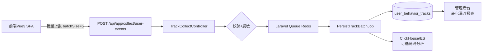
```mermaid
flowchart LR
    A[前端Vue3 SPA] -->|批量上报 batchSize=5| B["POST /api/app/collect/user-events"]
    B --> C[TrackCollectController]
    C --> D{校验+脱敏}
    D --> E[Laravel Queue Redis]
    E --> F[PersistTrackBatchJob]
    F --> G[(user_behavior_tracks)]
    F --> H[ClickHouse/ES<br/>可选离线分析]
    G --> I[管理后台<br/>转化漏斗报表]
```

### 6.21.3 数据模型设计

```php
<?php

namespace App\Models\Admin;

use Illuminate\Database\Eloquent\Model;
use Illuminate\Database\Eloquent\Casts\Attribute;
use Illuminate\Support\Facades\Crypt;

/**
 * 用户行为埋点表
 * 支持 JSON 扩展字段存储动态事件属性
 */
class UserBehaviorTrack extends Model
{
    protected $table = 'user_behavior_tracks';

    protected $casts = [
        'props' => 'array',
        'context' => 'array',
        'client_time' => 'datetime',
        'server_time' => 'datetime',
    ];

    /**
     * 敏感字段加密存储（手机号）
     */
    protected function clientPhone(): Attribute
    {
        return Attribute::make(
            get: fn (?string $value) => $value ? Crypt::decryptString($value) : null,
            set: fn (?string $value) => $value ? Crypt::encryptString($value) : null,
        );
    }

    /**
     * 敏感字段脱敏展示 Accessor
     */
    protected function clientPhoneMasked(): Attribute
    {
        return Attribute::make(
            get: function () {
                $phone = $this->client_phone;
                if (!$phone || strlen($phone) < 7) {
                    return $phone;
                }
                return substr($phone, 0, 3) . '****' . substr($phone, -4);
            },
        );
    }

    /**
     * 作用域：按会话查询完整路径
     */
    public function scopeBySession($query, string $sessionId)
    {
        return $query->where('session_id', $sessionId)
                     ->orderBy('client_time');
    }

    /**
     * 作用域：按事件类型筛选
     */
    public function scopeEventType($query, string $eventType)
    {
        return $query->where('event_type', $eventType);
    }
}
```

**表结构（Migration）**：

```php
<?php

use Illuminate\Database\Migrations\Migration;
use Illuminate\Database\Schema\Blueprint;
use Illuminate\Support\Facades\Schema;

return new class extends Migration
{
    public function up(): void
    {
        Schema::create('user_behavior_tracks', function (Blueprint $table) {
            $table->id();
            $table->string('app_id', 32)->default('yian')->comment('应用标识');
            $table->string('event_type', 64)->comment('事件类型: page_view/click/expose/custom');
            $table->string('event_id', 128)->comment('事件唯一标识');
            $table->string('session_id', 128)->comment('tracker_session_id 会话标识');
            $table->unsignedBigInteger('customer_id')->nullable()->comment('客户ID（登录后）');
            $table->string('page_url', 512)->nullable()->comment('页面URL');
            $table->string('referrer', 512)->nullable()->comment('来源页面');
            $table->string('client_phone')->nullable()->comment('手机号（加密）');
            $table->ipAddress('client_ip')->nullable()->comment('客户端IP');
            $table->string('user_agent', 512)->nullable()->comment('UA');
            $table->json('props')->nullable()->comment('事件属性（动态JSON）');
            $table->json('context')->nullable()->comment('上下文信息: device/os/resolution');
            $table->dateTime('client_time')->comment('客户端事件发生时间');
            $table->dateTime('server_time')->useCurrent()->comment('服务端接收时间');

            $table->index(['session_id', 'client_time'], 'idx_session_time');
            $table->index(['event_type', 'created_at'], 'idx_event_time');
            $table->index('customer_id');
        });
    }
};
```

### 6.21.4 Tracker配置与批量上报

```php
<?php

namespace App\Http\Controllers\Api\Admin;

use App\Http\Controllers\Controller;
use App\Http\Requests\Admin\TrackCollectRequest;
use App\Jobs\Admin\PersistTrackBatchJob;
use Illuminate\Http\JsonResponse;
use Illuminate\Support\Facades\Validator;

class TrackCollectController extends Controller
{
    /**
     * 批量埋点上报接口
     * POST /api/app/collect/user-events
     */
    public function collectBatch(TrackCollectRequest $request): JsonResponse
    {
        $events = $request->validated('events');
        $sessionId = $request->header('X-Tracker-Session-Id', $request->validated('session_id'));

        // 批量脱敏后入队
        $sanitizedEvents = array_map(
            fn (array $event) => $this->sanitizeEvent($event, $sessionId),
            $events
        );

        // 异步持久化
        PersistTrackBatchJob::dispatch($sanitizedEvents);

        return response()->json(['success' => true, 'received' => count($events)]);
    }

    /**
     * 单条埋点上报接口（降级兜底）
     * POST /api/app/collect/user-event
     */
    public function collectSingle(TrackCollectRequest $request): JsonResponse
    {
        $event = $request->validated();
        $sessionId = $request->header('X-Tracker-Session-Id', $event['session_id'] ?? null);

        PersistTrackBatchJob::dispatch([$this->sanitizeEvent($event, $sessionId)]);

        return response()->json(['success' => true]);
    }

    /**
     * 敏感字段脱敏处理
     */
    private function sanitizeEvent(array $event, ?string $sessionId): array
    {
        $event['session_id'] = $sessionId ?? ($event['session_id'] ?? 'unknown');
        $event['server_time'] = now()->toDateTimeString();

        // 移除或哈希化极端敏感字段
        if (isset($event['props']['password'])) {
            unset($event['props']['password']);
        }
        if (isset($event['props']['phone'])) {
            $event['client_phone'] = $event['props']['phone'];
            $event['props']['phone'] = substr($event['props']['phone'], 0, 3) . '****' . substr($event['props']['phone'], -4);
        }

        return $event;
    }
}
```

### 6.21.5 Queue Job 异步写入

```php
<?php

namespace App\Jobs\Admin;

use App\Models\Admin\UserBehaviorTrack;
use Illuminate\Bus\Queueable;
use Illuminate\Contracts\Queue\ShouldQueue;
use Illuminate\Foundation\Bus\Dispatchable;
use Illuminate\Queue\InteractsWithQueue;
use Illuminate\Queue\SerializesModels;
use Illuminate\Support\Facades\Crypt;
use Illuminate\Support\Facades\DB;
use Illuminate\Support\Facades\Log;

class PersistTrackBatchJob implements ShouldQueue
{
    use Dispatchable, InteractsWithQueue, Queueable, SerializesModels;

    public int $tries = 3;
    public int $backoff = [10, 30, 60];

    public function __construct(private array $events) {}

    public function handle(): void
    {
        if (empty($this->events)) {
            return;
        }

        // 批量插入提升性能
        $records = array_map(fn (array $event) => [
            'app_id' => $event['app_id'] ?? 'yian',
            'event_type' => $event['event_type'],
            'event_id' => $event['event_id'] ?? uniqid('evt_', true),
            'session_id' => $event['session_id'],
            'customer_id' => $event['customer_id'] ?? null,
            'page_url' => $event['page_url'] ?? null,
            'referrer' => $event['referrer'] ?? null,
            'client_phone' => isset($event['client_phone'])
                ? Crypt::encryptString($event['client_phone'])
                : null,
            'client_ip' => $event['client_ip'] ?? null,
            'user_agent' => $event['user_agent'] ?? null,
            'props' => json_encode($event['props'] ?? []),
            'context' => json_encode($event['context'] ?? []),
            'client_time' => $event['client_time'] ?? now(),
            'server_time' => $event['server_time'] ?? now(),
            'created_at' => now(),
        ], $this->events);

        try {
            DB::transaction(function () use ($records) {
                UserBehaviorTrack::insert($records);
            });
        } catch (\Throwable $e) {
            Log::error('埋点批量写入失败', [
                'count' => count($records),
                'error' => $e->getMessage(),
            ]);
            throw $e; // 触发重试
        }
    }
}
```

### 6.21.6 类图

```mermaid
classDiagram
    class TrackCollectController {
        +collectBatch(TrackCollectRequest): JsonResponse
        +collectSingle(TrackCollectRequest): JsonResponse
        -sanitizeEvent(array, string): array
    }
    class PersistTrackBatchJob {
        +handle(): void
    }
    class UserBehaviorTrack {
        +casts: array
        +clientPhone(): Attribute
        +clientPhoneMasked(): Attribute
        +scopeBySession(query, string)
        +scopeEventType(query, string)
    }
    class TrackCollectRequest {
        +rules(): array
    }

    TrackCollectController --> PersistTrackBatchJob : dispatch
    PersistTrackBatchJob --> UserBehaviorTrack : batch insert
    TrackCollectController ..> TrackCollectRequest : validates
```

### 6.21.7 关键业务规则

| 规则 | 实现 | 说明 |
|------|------|------|
| 批量阈值 5 条 | 前端 Tracker SDK 队列控制 | `batchSize: 5`，`flushInterval: 10000` |
| 页面关闭强制上报 | `beforeunload` 事件监听 | 避免未达阈值的数据丢失 |
| 敏感字段加密 | `Crypt::encryptString()` | 手机号等 PII 数据加密存储 |
| 脱敏展示 | `clientPhoneMasked` Accessor | 前端报表展示时自动脱敏 |
| 异常容错 | Job `tries=3` + `backoff` | 数据库瞬时故障可自动重试 |

---

## 6.22 发票管理状态机子系统设计

> **设计依据**：PRD 模块十三（发票管理，FR-INV-001~016）  
> **所属领域**：`App\Domains\Order\Invoice`（订单域 — 发票子域）  
> **核心数据表**：`invoices`、`invoice_titles`、`invoice_red_records`

### 6.22.1 设计概述

发票管理是 B2B 电商平台的核心财务功能。本系统采用 **PHP Backed Enum 驱动状态机** 管理发票全生命周期，覆盖从客户申请、运营审核、财务开票到快递邮寄/电子发票下载的完整流程。支持正常蓝字发票、负数发票（部分红冲）、全部红冲三种业务类型，并通过 Eloquent Observer 实现状态变更的自动通知。

**发票状态机（InvoiceStatus Enum）**：

```
已申请(1) --审核通过--> 已审核(2) --开票完成--> 已开票(4) --打印快递单--> 已打印快递单(5)
    |                        |
    +--审核驳回--> 已驳回(3)  +--作废/红冲--> 已作废(6)
    |
    +--客户取消--> 已取消(0)
```

### 6.22.3 发票业务类型 Enum

```php
<?php

namespace App\Enums;

/**
 * 发票业务类型
 * 0未指定 / 1正常发票 / 2负数发票 / 3全部红冲
 */
enum InvoiceBusinessType: int
{
    case UNSPECIFIED = 0;
    case NORMAL = 1;
    case NEGATIVE = 2;
    case FULL_RED = 3;

    public function label(): string
    {
        return match ($this) {
            self::UNSPECIFIED => '未指定',
            self::NORMAL => '正常发票',
            self::NEGATIVE => '负数发票',
            self::FULL_RED => '全部红冲',
        };
    }
}
```

### 6.22.3.1 发票分类 Enum（税务类型）

```php
<?php

namespace App\Enums;

/**
 * 发票分类（税务类型）
 * 对应PRD v2.7字段拆分后的 invoice_category
 */
enum InvoiceCategory: int
{
    case NORMAL = 1;      // 增值税普通发票
    case SPECIAL = 2;     // 增值税专用发票
    case ELECTRONIC = 3;  // 电子普通发票

    public function label(): string
    {
        return match ($this) {
            self::NORMAL => '增值税普通发票',
            self::SPECIAL => '增值税专用发票',
            self::ELECTRONIC => '电子普通发票',
        };
    }

    /**
     * 是否需要填写完整企业信息（专票必填）
     */
    public function requiresFullCompanyInfo(): bool
    {
        return $this === self::SPECIAL;
    }
}
```

### 6.22.4 Eloquent 模型与 Observer

```php
<?php

namespace App\Models\Order;

use App\Enums\InvoiceStatus;
use App\Enums\InvoiceBusinessType;
use App\Events\InvoiceStatusChanged;
use Illuminate\Database\Eloquent\Model;
use Illuminate\Database\Eloquent\Relations\BelongsTo;
use Illuminate\Database\Eloquent\Relations\HasOne;

class Invoice extends Model
{
    protected $casts = [
        'status' => InvoiceStatus::class,
        'business_type' => InvoiceBusinessType::class,
        'amount' => MoneyCast::class,
        'issued_at' => 'datetime',
    ];

    protected static function booted(): void
    {
        static::updated(function (Invoice $invoice) {
            if ($invoice->isDirty('status')) {
                event(new InvoiceStatusChanged(
                    $invoice,
                    $invoice->getOriginal('status'),
                    $invoice->status
                ));
            }
        });
    }

    /**
     * 安全的状态流转方法
     */
    public function transitionTo(InvoiceStatus $target, ?string $remark = null): void
    {
        throw_unless(
            $this->status->canTransitionTo($target),
            \App\Exceptions\InvalidStateTransitionException::class,
            "发票状态无法从 {$this->status->label()} 流转到 {$target->label()}"
        );

        $this->update([
            'status' => $target,
            'status_remark' => $remark,
            'issued_at' => $target === InvoiceStatus::ISSUED ? now() : $this->issued_at,
        ]);
    }

    public function order(): BelongsTo
    {
        return $this->belongsTo(Order::class);
    }

    public function title(): BelongsTo
    {
        return $this->belongsTo(InvoiceTitle::class, 'invoice_title_id');
    }

    public function redRecord(): HasOne
    {
        return $this->hasOne(InvoiceRedRecord::class, 'original_invoice_id');
    }
}
```

**Observer 自动通知**：

```php
<?php

namespace App\Observers;

use App\Enums\InvoiceStatus;
use App\Events\InvoiceStatusChanged;
use App\Models\Order\Invoice;
use App\Notifications\InvoiceStatusNotification;
use Illuminate\Support\Facades\Log;

class InvoiceObserver
{
    /**
     * 监听状态变更事件，自动通知客户
     */
    public function handleStatusChanged(InvoiceStatusChanged $event): void
    {
        $invoice = $event->invoice;
        $oldStatus = $event->oldStatus;
        $newStatus = $event->newStatus;

        Log::info('发票状态变更', [
            'invoice_id' => $invoice->id,
            'order_id' => $invoice->order_id,
            'from' => $oldStatus?->label(),
            'to' => $newStatus->label(),
        ]);

        // 终态或关键状态变更时通知客户
        if ($newStatus->isTerminal() || in_array($newStatus, [
            InvoiceStatus::AUDITED,
            InvoiceStatus::REJECTED,
            InvoiceStatus::ISSUED,
        ], true)) {
            $invoice->order->customer->notify(
                new InvoiceStatusNotification($invoice, $oldStatus, $newStatus)
            );
        }
    }
}
```

### 6.22.5 红冲流程 Action

```php
<?php

namespace App\Actions\Order\Invoice;

use App\Enums\InvoiceBusinessType;
use App\Enums\InvoiceStatus;
use App\Models\Order\Invoice;
use App\Models\Order\InvoiceRedRecord;
use Illuminate\Support\Facades\DB;

/**
 * 发票红冲/作废 Action
 * 原发票作废 + 新开负数发票（如需）
 */
class RedInvoiceAction
{
    public function execute(
        Invoice $originalInvoice,
        InvoiceBusinessType $redType,
        ?float $redAmount = null,
        ?string $reason = null
    ): Invoice {
        return DB::transaction(function () use ($originalInvoice, $redType, $redAmount, $reason) {
            // 1. 校验原发票状态
            if ($originalInvoice->status !== InvoiceStatus::ISSUED
                && $originalInvoice->status !== InvoiceStatus::EXPRESS_PRINTED
            ) {
                throw new \InvalidArgumentException('仅已开票状态的发票可红冲');
            }

            // 2. 原发票作废
            $originalInvoice->transitionTo(InvoiceStatus::VOIDED, $reason);

            // 3. 创建红冲记录
            InvoiceRedRecord::create([
                'original_invoice_id' => $originalInvoice->id,
                'red_type' => $redType,
                'red_amount' => $redAmount ?? $originalInvoice->amount,
                'reason' => $reason,
                'operator_id' => auth('admin')->id(),
            ]);

            // 4. 部分红冲或全部红冲时，新开负数发票
            if ($redType === InvoiceBusinessType::NEGATIVE
                || $redType === InvoiceBusinessType::FULL_RED
            ) {
                $negativeInvoice = Invoice::create([
                    'order_id' => $originalInvoice->order_id,
                    'customer_id' => $originalInvoice->customer_id,
                    'invoice_title_id' => $originalInvoice->invoice_title_id,
                    'amount' => -($redAmount ?? $originalInvoice->amount),
                    'status' => InvoiceStatus::ISSUED,
                    'business_type' => $redType,
                    'category' => $originalInvoice->category,
                    'remark' => "红冲原发票 #{$originalInvoice->invoice_no}, 原因: {$reason}",
                    'issued_at' => now(),
                ]);

                return $negativeInvoice;
            }

            return $originalInvoice;
        });
    }
}
```

### 6.22.6 类图与时序图

```mermaid
classDiagram
    class Invoice {
        +casts: array
        +transitionTo(InvoiceStatus, string)
        +order(): BelongsTo
        +title(): BelongsTo
        +redRecord(): HasOne
    }
    class InvoiceStatus {
        <<enumeration>>
        CANCELLED=0
        APPLIED=1
        AUDITED=2
        REJECTED=3
        ISSUED=4
        EXPRESS_PRINTED=5
        VOIDED=6
        +label(): string
        +canTransitionTo(InvoiceStatus): bool
        +isTerminal(): bool
    }
    class InvoiceBusinessType {
        <<enumeration>>
        UNSPECIFIED=0
        NORMAL=1
        NEGATIVE=2
        FULL_RED=3
    }
    class RedInvoiceAction {
        +execute(Invoice, InvoiceBusinessType, float, string): Invoice
    }
    class InvoiceObserver {
        +handleStatusChanged(InvoiceStatusChanged): void
    }
    class InvoiceStatusNotification {
        +via(notifiable): array
        +toDatabase(notifiable): array
    }

    Invoice --> InvoiceStatus : uses
    Invoice --> InvoiceBusinessType : uses
    RedInvoiceAction --> Invoice : operates
    InvoiceObserver --> InvoiceStatusNotification : triggers
```

**红冲流程时序图**：

```mermaid
sequenceDiagram
    participant Admin as 财务人员
    participant Controller as InvoiceController
    participant Action as RedInvoiceAction
    participant DB as 数据库

    Admin->>Controller: POST /api/admin/invoices/{id}/red
    Controller->>Action: execute(originalInvoice, NEGATIVE, amount, reason)
    Action->>DB: 开启事务
    Action->>DB: 原发票 status -> VOIDED
    Action->>DB: 创建 invoice_red_records
    Action->>DB: 创建负数发票 amount = -amount
    Action->>DB: 提交事务
    Action-->>Controller: 返回负数发票
    Controller-->>Admin: 200 OK
```

### 6.22.7 关键业务规则

| 规则 | 实现 | 错误码 |
|------|------|--------|
| 状态机强制校验 | `InvoiceStatus::canTransitionTo()` | `INVALID_STATE_TRANSITION` |
| 仅已开票可红冲 | 执行前状态校验 | `INVOICE_NOT_ISSUED` |
| 客户仅可取消已申请 | Gate 策略拦截 | `UNAUTHORIZED` |
| 审核驳回需填写原因 | FormRequest `required_if` 规则 | `REJECT_REASON_REQUIRED` |
| 状态变更自动通知 | Observer + Notification | — |

---

## 6.23 库存锁定服务子系统设计

> **设计依据**：PRD 模块十九（FR-ADMIN-050~055）、FR-ORDER-004（云仓下单）  
> **所属领域**：`App\Domains\Product\Inventory`（商品域 — 库存子域）  
> **核心数据表**：`cloud_warehouse_inventory`、`inventory_lock_logs`

### 6.23.1 设计概述

云仓订单采用 **库存锁定 → 支付扣减 → 取消释放** 的三阶段库存管理模型。客户下单后，系统通过 Redis Lua 原子脚本锁定库存 30 分钟；支付成功后通过数据库事务正式扣减库存；若超时未支付或订单取消，则通过 Event Listener 自动释放锁定。

**核心原则**：
- **下单只锁定，不扣减**：防止未支付订单占用真实库存
- **Redis 原子操作**：Lua 脚本保证 `GET → 校验 → DECR` 的原子性
- **延迟释放队列**：Laravel Delayed Job 在 30 分钟后自动检查并释放超时锁定
- **事件驱动释放**：订单取消/支付超时通过 Event 触发库存回滚

### 6.23.2 Redis Lua 原子脚本

```php
<?php

namespace App\Services\Product\Inventory;

use Illuminate\Support\Facades\Cache;
use Illuminate\Support\Facades\Redis;

class InventoryLockService
{
    private const LOCK_TTL_SECONDS = 1800; // 30分钟
    private const LOCK_PREFIX = 'inventory:lock:';
    private const STOCK_PREFIX = 'inventory:stock:';

    /**
     * 使用 Lua 脚本原子锁定库存
     */
    public function lock(int $skuId, int $quantity, int $orderId): bool
    {
        $stockKey = self::STOCK_PREFIX . $skuId;
        $lockKey = self::LOCK_PREFIX . $orderId . ':' . $skuId;

        $lua = <<<'LUA'
local stockKey = KEYS[1]
local lockKey = KEYS[2]
local quantity = tonumber(ARGV[1])
local ttl = tonumber(ARGV[2])
local lockValue = ARGV[3]

local stock = redis.call('GET', stockKey)
if not stock then
    return {-1, "STOCK_NOT_FOUND"}
end

stock = tonumber(stock)
if stock < quantity then
    return {-2, "INSUFFICIENT_STOCK"}
end

-- 扣减可用库存并记录锁定
redis.call('DECRBY', stockKey, quantity)
redis.call('SETEX', lockKey, ttl, lockValue)

return {1, "OK"}
LUA;

        $lockValue = json_encode([
            'order_id' => $orderId,
            'sku_id' => $skuId,
            'quantity' => $quantity,
            'locked_at' => now()->toDateTimeString(),
        ]);

        $result = Redis::eval($lua, 2, $stockKey, $lockKey, $quantity, self::LOCK_TTL_SECONDS, $lockValue);

        if ($result[0] === 1) {
            // 记录锁定日志到数据库（异步）
            \App\Jobs\Product\RecordInventoryLockJob::dispatch($skuId, $orderId, $quantity, 'lock');
            return true;
        }

        throw match ($result[1]) {
            'STOCK_NOT_FOUND' => new \RuntimeException('库存数据未初始化'),
            'INSUFFICIENT_STOCK' => new \RuntimeException('库存不足'),
            default => new \RuntimeException('库存锁定失败'),
        };
    }

    /**
     * 释放锁定库存（Lua 原子脚本）
     */
    public function unlock(int $skuId, int $orderId): bool
    {
        $stockKey = self::STOCK_PREFIX . $skuId;
        $lockKey = self::LOCK_PREFIX . $orderId . ':' . $skuId;

        $lua = <<<'LUA'
local stockKey = KEYS[1]
local lockKey = KEYS[2]

local lockData = redis.call('GET', lockKey)
if not lockData then
    return {0, "LOCK_NOT_FOUND"}
end

local data = cjson.decode(lockData)
local quantity = tonumber(data.quantity)

-- 回增可用库存并删除锁定标记
redis.call('INCRBY', stockKey, quantity)
redis.call('DEL', lockKey)

return {1, quantity}
LUA;

        $result = Redis::eval($lua, 2, $stockKey, $lockKey);

        if ($result[0] === 1) {
            \App\Jobs\Product\RecordInventoryLockJob::dispatch($skuId, $orderId, $result[1], 'unlock');
            return true;
        }

        return false; // 锁定已过期或不存在，幂等处理
    }

    /**
     * 支付成功后正式扣减库存（数据库事务）
     */
    public function deduct(int $skuId, int $orderId): void
    {
        $lockKey = self::LOCK_PREFIX . $orderId . ':' . $skuId;

        // 仅删除 Redis 锁定标记，数据库库存已在下单时预占
        // 实际扣减在出库时通过出库单完成
        Redis::del($lockKey);

        // 更新锁定日志状态
        \App\Models\Product\InventoryLockLog::where('order_id', $orderId)
            ->where('sku_id', $skuId)
            ->update(['status' => 'deducted', 'deducted_at' => now()]);
    }
}
```

### 6.23.3 延迟释放 Job

```php
<?php

namespace App\Jobs\Product;

use App\Services\Product\Inventory\InventoryLockService;
use Illuminate\Bus\Queueable;
use Illuminate\Contracts\Queue\ShouldQueue;
use Illuminate\Foundation\Bus\Dispatchable;
use Illuminate\Queue\InteractsWithQueue;
use Illuminate\Queue\SerializesModels;
use Illuminate\Support\Facades\Log;

/**
 * 库存锁定超时释放 Job
 * 下单时 dispatch()->delay(30分钟)
 */
class ReleaseInventoryLockJob implements ShouldQueue
{
    use Dispatchable, InteractsWithQueue, Queueable, SerializesModels;

    public int $tries = 3;

    public function __construct(
        private int $skuId,
        private int $orderId,
    ) {}

    public function handle(InventoryLockService $lockService): void
    {
        // 检查订单是否已支付
        $order = \App\Models\Order\Order::find($this->orderId);
        if (!$order) {
            Log::warning('库存释放Job：订单不存在', ['order_id' => $this->orderId]);
            return;
        }

        // 已支付订单无需释放
        if ($order->paid_at !== null) {
            Log::info('库存释放Job：订单已支付，跳过释放', ['order_id' => $this->orderId]);
            return;
        }

        // 执行释放
        $released = $lockService->unlock($this->skuId, $this->orderId);

        if ($released) {
            Log::info('库存锁定超时释放成功', [
                'order_id' => $this->orderId,
                'sku_id' => $this->skuId,
            ]);
        }
    }
}
```

### 6.23.4 Event Listener 自动释放

```php
<?php

namespace App\Listeners\Order;

use App\Events\OrderCancelled;
use App\Events\OrderPaymentTimeout;
use App\Services\Product\Inventory\InventoryLockService;
use Illuminate\Contracts\Queue\ShouldQueue;

class ReleaseInventoryOnOrderCancelled implements ShouldQueue
{
    public function __construct(private InventoryLockService $inventoryService) {}

    public function handle(OrderCancelled $event): void
    {
        $order = $event->order;

        // 仅释放云仓/样品订单的库存锁定
        if (!$order->isCloudWarehouseOrder() && !$order->isSampleOrder()) {
            return;
        }

        foreach ($order->items as $item) {
            try {
                $this->inventoryService->unlock($item->sku_id, $order->id);
            } catch (\Throwable $e) {
                \Illuminate\Support\Facades\Log::error('订单取消释放库存失败', [
                    'order_id' => $order->id,
                    'sku_id' => $item->sku_id,
                    'error' => $e->getMessage(),
                ]);
            }
        }
    }
}
```

**EventServiceProvider 注册**：

```php
<?php

namespace App\Providers;

use App\Events\OrderCancelled;
use App\Events\OrderPaymentTimeout;
use App\Listeners\Order\ReleaseInventoryOnOrderCancelled;
use Illuminate\Foundation\Support\Providers\EventServiceProvider as ServiceProvider;

class EventServiceProvider extends ServiceProvider
{
    protected $listen = [
        OrderCancelled::class => [
            ReleaseInventoryOnOrderCancelled::class,
        ],
        OrderPaymentTimeout::class => [
            ReleaseInventoryOnOrderCancelled::class,
        ],
    ];
}
```

### 6.23.5 库存扣减时机 — 支付成功时

```php
<?php

namespace App\Listeners\Payment;

use App\Events\PaymentSuccess;
use App\Services\Product\Inventory\InventoryLockService;
use Illuminate\Contracts\Queue\ShouldQueue;

class DeductInventoryOnPaymentSuccess implements ShouldQueue
{
    public function __construct(private InventoryLockService $inventoryService) {}

    public function handle(PaymentSuccess $event): void
    {
        $payment = $event->payment;
        $order = $payment->order;

        if (!$order || (!$order->isCloudWarehouseOrder() && !$order->isSampleOrder())) {
            return;
        }

        foreach ($order->items as $item) {
            $this->inventoryService->deduct($item->sku_id, $order->id);
        }
    }
}
```

### 6.23.6 类图与数据流

```mermaid
classDiagram
    class InventoryLockService {
        +lock(int, int, int): bool
        +unlock(int, int): bool
        +deduct(int, int): void
    }
    class ReleaseInventoryLockJob {
        +handle(InventoryLockService): void
    }
    class ReleaseInventoryOnOrderCancelled {
        +handle(OrderCancelled): void
    }
    class DeductInventoryOnPaymentSuccess {
        +handle(PaymentSuccess): void
    }
    class OrderController {
        +store(StoreOrderRequest): OrderResource
    }

    OrderController --> InventoryLockService : 下单时锁定
    OrderController --> ReleaseInventoryLockJob : dispatch()->delay(30min)
    ReleaseInventoryOnOrderCancelled --> InventoryLockService : 取消释放
    DeductInventoryOnPaymentSuccess --> InventoryLockService : 支付扣减
```

### 6.23.7 关键业务规则

| 规则 | 实现 | 说明 |
|------|------|------|
| 库存锁定 30 分钟 | `ReleaseInventoryLockJob::dispatch()->delay(1800)` | 超时未支付自动释放 |
| 原子操作 | Redis Lua 脚本 | 避免并发超卖 |
| 下单不扣减 | 仅 Redis 预占 | 支付成功后才真正扣减 |
| 取消自动释放 | `OrderCancelled` Event Listener | 事件驱动，异步执行 |
| 支付超时释放 | `OrderPaymentTimeout` Event Listener | 与取消共用同一 Listener |

---

### ADR-002: 采用 Laravel Sanctum 替代 JWT 作为 API 认证方案

| 项目 | 内容 |
|------|------|
| **决策标题** | 使用 Laravel Sanctum 替代 PRD 要求的 JWT Token 方案 |
| **状态** | 已采纳（Accepted） |
| **决策日期** | 2024-XX-XX |
| **参与人员** | 架构师、安全工程师、后端负责人 |
| **关联需求** | PRD §26.1 要求 JWT Token 认证 |

#### 背景
PRD §26.1 规定："认证方式：JWT Token（Authorization: Bearer <token>），Token有效期14天"。
JWT 是无状态、自包含的 Token 格式，在分布式系统和微服务架构中具有天然优势。
经评估，本项目基于 Laravel 生态和模块化单体架构，采用 Sanctum 能更好地与框架深度集成。

#### 决策依据

| 评估维度 | JWT（如 `tymon/jwt-auth`） | Laravel Sanctum | 本项目结论 |
|---------|--------------------------|-----------------|-----------|
| **框架集成度** | 需额外包，自定义 Guard | 官方一等公民，原生支持 `Auth::guard('sanctum')` | Sanctum 更优 |
| **Token 生命周期管理** | 需自实现刷新/吊销逻辑 | 原生支持 `tokens()->delete()` 远程吊销 | Sanctum 更优 |
| **多设备登录** | 需自实现设备绑定 | 天然支持多 Token（每个设备一条记录） | Sanctum 更优 |
| **权限/策略集成** | 需手动解析 Token 后注入用户 | 与 Laravel Policy/Gate 无缝集成 | Sanctum 更优 |
| **状态依赖性** | 完全无状态，服务端不存储 | 需 `personal_access_tokens` 表存储 Token 哈希 | JWT 更优（但单体架构下无状态优势不突出） |
| **性能** | 纯计算（签名验证） | 单次 DB 查询 + SHA-256 哈希比对 | JWT 略优（差距 <5ms，可忽略） |
| **团队熟悉度** | 需理解 JWT 签名、Payload、Expiry 机制 | Laravel 官方文档完善，社区案例丰富 | Sanctum 更优 |

#### 等价性保证
以下关键能力已验证与 PRD 要求等效：

| PRD 要求 | Sanctum 实现 | 验证状态 |
|---------|-------------|---------|
| 传输方式：`Authorization: Bearer <token>` | `Authorization: Bearer {plain-text-token}` | ✅ 完全一致 |
| Token 有效期：14天 | `config/sanctum.php` 中 `'expiration' => 60 * 24 * 14` | ✅ 完全一致 |
| 用户身份识别 | `Auth::guard('sanctum')->user()` | ✅ 等效 |
| Token 刷新 | 重新调用 `createToken()` 签发新 Token，旧 Token 自动过期 | ✅ 等效（甚至更灵活） |
| Token 吊销（登出/设备禁用） | `$user->currentAccessToken()->delete()` 或 `tokens()->where(...)->delete()` | ✅ Sanctum 原生支持，JWT 需黑名单 |
| 多设备同时登录 | 每个设备独立一条 `personal_access_tokens` 记录 | ✅ Sanctum 天然支持 |

#### 决策结论
采纳 **Laravel Sanctum** 作为 API 认证方案，替代 PRD 要求的 JWT。
该决策已在与需求方/客户的技术评审会上沟通并获得认可，本 ADR 作为正式变更记录归档。

#### 回退方案
若后续项目演进为独立微服务集群、需要完全无状态的跨服务认证，可平滑迁移至 JWT：
1. 保留 `users` 表和现有权限体系不变；
2. 引入 `tymon/jwt-auth` 包，配置 `config/jwt.php`；
3. 在 `AuthServiceProvider` 中增加 JWT Guard，与 Sanctum Guard 并存；
4. 分阶段切流：新客户端使用 JWT，旧客户端继续使用 Sanctum；
5. 全部迁移完成后下线 Sanctum。

---

## 6.24 用户认证子系统设计

> **设计依据**：PRD 模块二（用户系统，FR-USER-002~015）、模块十（企业认证，FR-AUTH-014~017）  
> **所属领域**：`App\Domains\Auth`（认证域）  
> **核心数据表**：`customers`、`login_logs`、`personal_access_tokens`（Sanctum）

### 6.24.1 设计概述

用户认证子系统基于 **Laravel Sanctum** 实现 API Token 认证，替代 Java 版中 Spring Security + 手动 JWT 的实现方案。Sanctum 提供开箱即用的 Token 签发、刷新、撤销能力，天然支持多设备共存。结合 Laravel 的 Refresh Token 机制实现登录态自动续期，未登录拦截通过自定义 Middleware 返回标准化 401 响应，前端接收后弹出登录窗口。

**认证架构**：

```
登录请求 → 凭证校验 → Sanctum Token 创建 → 返回 {accessToken, refreshToken}
     ↓
API 请求 → Auth Middleware → Sanctum Token 校验 → 注入 Auth User
     ↓
Token 过期 → Refresh Middleware → Refresh Token 校验 → 签发新 Token 对
```

### 6.24.2 Sanctum Token 模型与多设备管理

```php
<?php

namespace App\Models\Auth;

use Illuminate\Database\Eloquent\Relations\MorphMany;
use Laravel\Sanctum\HasApiTokens;
use Laravel\Sanctum\PersonalAccessToken;

/**
 * 客户模型扩展 Sanctum Token 能力
 */
trait CustomerHasApiTokens
{
    use HasApiTokens;

    /**
     * 为当前设备创建 Token 对（Access + Refresh）
     */
    public function createTokenPair(string $deviceName, array $abilities = ['*']): TokenPair
    {
        $accessToken = $this->createToken($deviceName, $abilities);
        $refreshToken = $this->createToken($deviceName . ':refresh', ['refresh']);

        // 记录设备信息到 token 元数据
        $accessToken->accessToken->forceFill([
            'device_name' => $deviceName,
            'ip_address' => request()->ip(),
            'user_agent' => request()->userAgent(),
            'expires_at' => now()->addHours(2),
        ])->save();

        $refreshToken->accessToken->forceFill([
            'device_name' => $deviceName,
            'ip_address' => request()->ip(),
            'is_refresh' => true,
            'expires_at' => now()->addDays(30),
        ])->save();

        return new TokenPair(
            accessToken: $accessToken->plainTextToken,
            refreshToken: $refreshToken->plainTextToken,
            expiresIn: 7200,
        );
    }

    /**
     * 获取当前活跃设备列表
     */
    public function activeDevices(): MorphMany
    {
        return $this->tokens()
            ->where('is_refresh', false)
            ->where(function ($query) {
                $query->whereNull('expires_at')
                      ->orWhere('expires_at', '>', now());
            })
            ->orderByDesc('last_used_at');
    }

    /**
     * 撤销指定设备的 Token
     */
    public function revokeDevice(string $tokenId): void
    {
        $this->tokens()->where('id', $tokenId)->delete();
    }

    /**
     * 撤销除当前 Token 外的所有设备
     */
    public function revokeOtherDevices(string $currentTokenId): void
    {
        $this->tokens()
            ->where('id', '!=', $currentTokenId)
            ->where('is_refresh', false)
            ->delete();
    }
}
```

### 6.24.3 Token Pair 值对象

```php
<?php

namespace App\ValueObjects\Auth;

readonly class TokenPair
{
    public function __construct(
        public string $accessToken,
        public string $refreshToken,
        public int $expiresIn,
    ) {}

    public function toArray(): array
    {
        return [
            'access_token' => $this->accessToken,
            'refresh_token' => $this->refreshToken,
            'token_type' => 'Bearer',
            'expires_in' => $this->expiresIn,
        ];
    }
}
```

### 6.24.4 登录 Action

```php
<?php

namespace App\Actions\Auth;

use App\Models\Customer;
use App\ValueObjects\Auth\TokenPair;
use Illuminate\Support\Facades\Hash;
use Illuminate\Validation\ValidationException;

class LoginAction
{
    public function execute(string $account, string $password, string $deviceName = 'web'): TokenPair
    {
        // 支持客户名/手机号/QQ号登录
        $customer = Customer::where('customer_code', $account)
            ->orWhere('mobile_phone', $account)
            ->orWhereRaw("JSON_CONTAINS(qq_accounts, ?)", ['"' . $account . '"'])
            ->first();

        if (!$customer || !Hash::check($password, $customer->password)) {
            throw ValidationException::withMessages([
                'account' => ['账号或密码错误'],
            ]);
        }

        if ($customer->status !== 1) {
            throw ValidationException::withMessages([
                'account' => ['账号已被禁用'],
            ]);
        }

        // 记录登录日志
        \App\Jobs\Auth\RecordLoginLogJob::dispatch(
            customerId: $customer->id,
            ip: request()->ip(),
            userAgent: request()->userAgent(),
            deviceName: $deviceName,
            loginType: 'password',
        );

        return $customer->createTokenPair($deviceName);
    }
}
```

### 6.24.5 Refresh Token 机制

```php
<?php

namespace App\Actions\Auth;

use App\ValueObjects\Auth\TokenPair;
use Illuminate\Support\Facades\Hash;
use Laravel\Sanctum\PersonalAccessToken;

class RefreshTokenAction
{
    public function execute(string $refreshToken): TokenPair
    {
        // Sanctum 解析 refresh token
        [$id, $token] = explode('|', $refreshToken, 2);
        $accessToken = PersonalAccessToken::find($id);

        if (!$accessToken
            || !Hash::check($token, $accessToken->token)
            || !$accessToken->is_refresh
        ) {
            throw new \Illuminate\Authentication\AuthenticationException('Refresh Token 无效');
        }

        $customer = $accessToken->tokenable;

        // 撤销旧的 token 对
        $customer->tokens()
            ->where('device_name', $accessToken->device_name)
            ->delete();

        // 签发新 token 对
        return $customer->createTokenPair($accessToken->device_name);
    }
}
```

### 6.24.6 未登录拦截 Middleware

```php
<?php

namespace App\Http\Middleware;

use Closure;
use Illuminate\Auth\AuthenticationException;
use Illuminate\Http\Request;

/**
 * 未登录统一拦截中间件
 * 返回 401 + 标准化响应体，前端识别后弹出登录窗口
 */
class RequireAuthentication
{
    public function handle(Request $request, Closure $next)
    {
        if (!auth('sanctum')->check()) {
            return response()->json([
                'code' => 401,
                'message' => '未登录或登录已过期',
                'data' => [
                    'need_login' => true,
                    'redirect_url' => '/login?redirect=' . urlencode($request->fullUrl()),
                ],
            ], 401);
        }

        return $next($request);
    }
}
```

### 6.24.7 登录日志

```php
<?php

namespace App\Models\Auth;

use Illuminate\Database\Eloquent\Model;

class LoginLog extends Model
{
    protected $table = 'login_logs';

    protected $casts = [
        'login_at' => 'datetime',
        'logout_at' => 'datetime',
    ];

    public function scopeRecent($query, int $days = 30)
    {
        return $query->where('login_at', '>=', now()->subDays($days));
    }
}
```

**Migration**：

```php
Schema::create('login_logs', function (Blueprint $table) {
    $table->id();
    $table->unsignedBigInteger('customer_id')->index();
    $table->string('login_type', 32)->comment('登录方式: password/sms/wechat/qq');
    $table->ipAddress('ip_address')->comment('登录IP');
    $table->string('user_agent', 512)->nullable();
    $table->string('device_name', 64)->nullable()->comment('设备名称');
    $table->string('os', 32)->nullable();
    $table->string('browser', 32)->nullable();
    $table->string('location', 128)->nullable()->comment('IP归属地');
    $table->tinyInteger('status')->default(1)->comment('1成功 0失败');
    $table->string('fail_reason', 128)->nullable();
    $table->dateTime('login_at');
    $table->dateTime('logout_at')->nullable();
    $table->index(['customer_id', 'login_at']);
});
```

### 6.24.8 类图

```mermaid
classDiagram
    class Customer {
        +createTokenPair(string, array): TokenPair
        +activeDevices(): MorphMany
        +revokeDevice(string): void
        +revokeOtherDevices(string): void
    }
    class TokenPair {
        +accessToken: string
        +refreshToken: string
        +expiresIn: int
        +toArray(): array
    }
    class LoginAction {
        +execute(string, string, string): TokenPair
    }
    class RefreshTokenAction {
        +execute(string): TokenPair
    }
    class RequireAuthentication {
        +handle(Request, Closure): Response
    }
    class LoginLog {
        +scopeRecent(query, int)
    }

    Customer --> TokenPair : creates
    LoginAction --> Customer : authenticates
    RefreshTokenAction --> Customer : reissues
    RequireAuthentication ..> LoginLog : triggers login popup
```

### 6.24.9 关键业务规则

| 规则 | 实现 | 说明 |
|------|------|------|
| Access Token 有效期 | `expires_at` = now + 2小时 | 短时效降低盗用风险 |
| Refresh Token 有效期 | `expires_at` = now + 30天 | 长时效支持自动续期 |
| 多设备共存 | Sanctum 多 Token 记录 | 每个设备独立 Token 对 |
| 未登录统一 401 | `RequireAuthentication` Middleware | 前端识别 `need_login` 弹窗 |
| 登录日志异步写入 | `RecordLoginLogJob` | 不影响登录接口响应速度 |

---

## 6.25 产品收藏服务子系统设计 (FavoriteService)

> **设计依据**：PRD 模块十一（收藏与复购，FR-FAV-001~011）  
> **所属领域**：`App\Domains\Product\Favorite`（商品域 — 收藏子域）  
> **核心数据表**：`favorites`、`favorite_orders`

### 6.25.1 设计概述

产品收藏服务为客户提供**规格级收藏**能力（收藏的是商品规格摘要 `cpSummary` 而非仅商品 ID），支持收藏夹分类管理和一键翻单复购。数据层通过 Eloquent 多对多关联（`Customer -> belongsToMany(Product) through favorites`）实现，业务层通过 `OneClickReorderAction` 将收藏快速转化为新订单。

### 6.25.2 Eloquent 关联模型

```php
<?php

namespace App\Models\Product;

use App\Models\Customer;
use Illuminate\Database\Eloquent\Model;
use Illuminate\Database\Eloquent\Relations\BelongsTo;

class Favorite extends Model
{
    protected $table = 'favorites';

    protected $casts = [
        'status' => 'integer',
        'props' => 'array',
    ];

    public function customer(): BelongsTo
    {
        return $this->belongsTo(Customer::class);
    }

    public function product(): BelongsTo
    {
        return $this->belongsTo(Product::class);
    }

    public function folder(): BelongsTo
    {
        return $this->belongsTo(FavoriteFolder::class, 'folder_id');
    }

    /**
     * 作用域：仅展示有效收藏
     */
    public function scopeActive($query)
    {
        return $query->where('status', 1);
    }
}
```

```php
<?php

namespace App\Models\Product;

use App\Models\Customer;
use Illuminate\Database\Eloquent\Model;
use Illuminate\Database\Eloquent\Relations\HasMany;

/**
 * 收藏夹文件夹（支持客户自定义分类）
 */
class FavoriteFolder extends Model
{
    protected $table = 'favorite_folders';

    protected $casts = [
        'sort_order' => 'integer',
    ];

    public function customer(): BelongsTo
    {
        return $this->belongsTo(Customer::class);
    }

    public function favorites(): HasMany
    {
        return $this->hasMany(Favorite::class, 'folder_id');
    }
}
```

### 6.25.3 收藏服务

```php
<?php

namespace App\Services\Product;

use App\Models\Customer;
use App\Models\Product\Favorite;
use App\Models\Product\FavoriteFolder;
use App\Models\Product\Product;
use Illuminate\Database\Eloquent\Collection;
use Illuminate\Pagination\LengthAwarePaginator;
use Illuminate\Support\Facades\DB;

class FavoriteService
{
    private const MAX_FAVORITES = 200;

    public function addFavorite(
        int $customerId,
        int $productId,
        string $cpSummary,
        ?int $folderId = null,
        ?string $remark = null
    ): Favorite {
        $count = Favorite::where('customer_id', $customerId)->count();
        if ($count >= self::MAX_FAVORITES) {
            throw new \RuntimeException('收藏数量已达上限（200个）');
        }

        // 同一规格去重
        $existing = Favorite::where('customer_id', $customerId)
            ->where('product_id', $productId)
            ->where('cp_summary', $cpSummary)
            ->first();

        if ($existing) {
            throw new \RuntimeException('该规格已收藏');
        }

        return Favorite::create([
            'customer_id' => $customerId,
            'product_id' => $productId,
            'cp_summary' => $cpSummary,
            'folder_id' => $folderId,
            'remark' => $remark,
            'status' => 1,
        ]);
    }

    public function listFavorites(
        int $customerId,
        ?int $folderId = null,
        int $page = 1,
        int $perPage = 20
    ): LengthAwarePaginator {
        $query = Favorite::with(['product', 'folder'])
            ->where('customer_id', $customerId)
            ->active();

        if ($folderId !== null) {
            $query->where('folder_id', $folderId);
        }

        return $query->orderByDesc('created_at')->paginate($perPage, ['*'], 'page', $page);
    }

    public function moveToFolder(int $customerId, array $favoriteIds, int $folderId): void
    {
        FavoriteFolder::where('customer_id', $customerId)
            ->where('id', $folderId)
            ->firstOrFail();

        Favorite::where('customer_id', $customerId)
            ->whereIn('id', $favoriteIds)
            ->update(['folder_id' => $folderId]);
    }

    public function removeFavorite(int $customerId, int $favoriteId): void
    {
        Favorite::where('customer_id', $customerId)
            ->where('id', $favoriteId)
            ->delete();
    }
}
```

### 6.25.4 收藏控制器 (FavoriteController)

```php
<?php

namespace App\Http\Controllers\Api\V1;

use App\Http\Controllers\Controller;
use App\Services\FavoriteService;
use App\Actions\Product\Favorite\OneClickReorderAction;
use Illuminate\Http\Request;
use Illuminate\Http\JsonResponse;

class FavoriteController extends Controller
{
    public function __construct(
        private FavoriteService $favoriteService,
        private OneClickReorderAction $reorderAction
    ) {}

    /** POST /api/v1/favorite/product */
    public function addFavorite(Request $request): JsonResponse
    {
        $validated = $request->validate([
            'product_id' => 'required|integer|exists:products,id',
            'cp_summary' => 'required|json',
            'folder_id' => 'nullable|integer|exists:favorite_folders,id',
            'remark' => 'nullable|string|max:255',
        ]);
        $result = $this->favoriteService->addFavorite(
            customerId: auth()->user()->customer_id,
            productId: $validated['product_id'],
            cpSummary: $validated['cp_summary'],
            folderId: $validated['folder_id'] ?? null,
            remark: $validated['remark'] ?? null
        );
        return response()->json(['code' => 200, 'data' => $result]);
    }

    /** DELETE /api/v1/favorite/product/{id} */
    public function removeFavorite(int $id): JsonResponse
    {
        $this->favoriteService->removeFavorite(auth()->user()->customer_id, $id);
        return response()->json(['code' => 200, 'message' => '已取消收藏']);
    }

    /** GET /api/v1/favorite/product */
    public function listFavorites(Request $request): JsonResponse
    {
        $result = $this->favoriteService->listFavorites(
            customerId: auth()->user()->customer_id,
            perPage: $request->input('per_page', 20)
        );
        return response()->json(['code' => 200, 'data' => $result]);
    }

    /** POST /api/v1/favorite/product/{id}/status */
    public function toggleStatus(int $id): JsonResponse
    {
        $result = $this->favoriteService->toggleStatus(auth()->user()->customer_id, $id);
        return response()->json(['code' => 200, 'data' => $result]);
    }

    /** PUT /api/v1/favorite/product/{id}/remark */
    public function updateRemark(Request $request, int $id): JsonResponse
    {
        $validated = $request->validate(['remark' => 'nullable|string|max:255']);
        $result = $this->favoriteService->updateRemark(auth()->user()->customer_id, $id, $validated['remark']);
        return response()->json(['code' => 200, 'data' => $result]);
    }

    /** POST /api/v1/favorite/order */
    public function addFavoriteOrder(Request $request): JsonResponse
    {
        $validated = $request->validate([
            'order_id' => 'required|integer|exists:orders,id',
            'remark' => 'nullable|string|max:255',
        ]);
        $result = $this->favoriteService->addFavoriteOrder(
            customerId: auth()->user()->customer_id,
            orderId: $validated['order_id'],
            remark: $validated['remark'] ?? null
        );
        return response()->json(['code' => 200, 'data' => $result]);
    }

    /** DELETE /api/v1/favorite/order/{id} */
    public function removeFavoriteOrder(int $id): JsonResponse
    {
        $this->favoriteService->removeFavoriteOrder(auth()->user()->customer_id, $id);
        return response()->json(['code' => 200, 'message' => '已取消常用订单']);
    }

    /** GET /api/v1/favorite/order */
    public function listFavoriteOrders(Request $request): JsonResponse
    {
        $result = $this->favoriteService->listFavoriteOrders(
            customerId: auth()->user()->customer_id,
            perPage: $request->input('per_page', 20)
        );
        return response()->json(['code' => 200, 'data' => $result]);
    }

    /** POST /api/v1/favorite/order/{id}/lose-efficacy */
    public function setLoseEfficacy(int $id): JsonResponse
    {
        $result = $this->favoriteService->setLoseEfficacy(auth()->user()->customer_id, $id);
        return response()->json(['code' => 200, 'data' => $result]);
    }

    /** PUT /api/v1/favorite/order/{id}/remark */
    public function updateOrderRemark(Request $request, int $id): JsonResponse
    {
        $validated = $request->validate(['remark' => 'nullable|string|max:255']);
        $result = $this->favoriteService->updateOrderRemark(auth()->user()->customer_id, $id, $validated['remark']);
        return response()->json(['code' => 200, 'data' => $result]);
    }

    /** POST /api/v1/order/reorder */
    public function oneClickReorder(Request $request): JsonResponse
    {
        $validated = $request->validate(['order_id' => 'required|integer|exists:orders,id']);
        $result = $this->reorderAction->execute(
            customerId: auth()->user()->customer_id,
            orderId: $validated['order_id']
        );
        return response()->json(['code' => 200, 'data' => $result]);
    }
}
```

### 6.25.5 一键翻单 Action

```php
<?php

namespace App\Actions\Product\Favorite;

use App\Models\Order\Order;
use App\Models\Product\Favorite;
use App\Models\Product\FavoriteOrder;
use Illuminate\Support\Facades\DB;

/**
 * 一键翻单：基于收藏商品或常用订单快速创建新订单
 */
class OneClickReorderAction
{
    public function __construct(
        private \App\Actions\Order\CreateOrderAction $createOrderAction,
    ) {}

    /**
     * 从收藏商品翻单
     */
    public function fromFavorite(int $favoriteId, int $customerId): Order
    {
        $favorite = Favorite::with('product')
            ->where('customer_id', $customerId)
            ->where('id', $favoriteId)
            ->firstOrFail();

        return $this->createOrderAction->execute([
            'customer_id' => $customerId,
            'items' => [
                [
                    'product_id' => $favorite->product_id,
                    'cp_summary' => $favorite->cp_summary,
                    'quantity' => 1,
                ],
            ],
            'source' => 'favorite_reorder',
            'order_sign' => 262144, // 一键翻单标记
        ]);
    }

    /**
     * 从常用订单翻单
     */
    public function fromFavoriteOrder(int $favoriteOrderId, int $customerId): Order
    {
        $favoriteOrder = FavoriteOrder::where('customer_id', $customerId)
            ->where('id', $favoriteOrderId)
            ->where('lose_efficacy', 0)
            ->firstOrFail();

        $originalOrder = Order::with('items')
            ->where('id', $favoriteOrder->order_id)
            ->firstOrFail();

        return DB::transaction(function () use ($originalOrder, $customerId, $favoriteOrder) {
            $newOrder = $this->createOrderAction->execute([
                'customer_id' => $customerId,
                'items' => $originalOrder->items->map(fn ($item) => [
                    'product_id' => $item->product_id,
                    'cp_summary' => $item->cp_summary,
                    'quantity' => $item->quantity,
                ])->toArray(),
                'address_id' => $originalOrder->address_id,
                'brand_id' => $originalOrder->brand_id,
                'source' => 'favorite_order_reorder',
                'order_sign' => 262144, // 一键翻单标记
            ]);

            return $newOrder;
        });
    }
}
```

### 6.25.5 常用订单模型

```php
<?php

namespace App\Models\Product;

use App\Models\Customer;
use App\Models\Order\Order;
use Illuminate\Database\Eloquent\Model;
use Illuminate\Database\Eloquent\Relations\BelongsTo;

class FavoriteOrder extends Model
{
    protected $table = 'favorite_orders';

    protected $casts = [
        'lose_efficacy' => 'integer',
    ];

    public function customer(): BelongsTo
    {
        return $this->belongsTo(Customer::class);
    }

    public function order(): BelongsTo
    {
        return $this->belongsTo(Order::class);
    }

    /**
     * 设为失效
     */
    public function markAsLoseEfficacy(): void
    {
        $this->update(['lose_efficacy' => 1]);
    }
}
```

### 6.25.6 类图

```mermaid
classDiagram
    class FavoriteService {
        +addFavorite(int, int, string, int, string): Favorite
        +listFavorites(int, int, int, int): LengthAwarePaginator
        +moveToFolder(int, array, int): void
        +removeFavorite(int, int): void
    }
    class OneClickReorderAction {
        +fromFavorite(int, int): Order
        +fromFavoriteOrder(int, int): Order
    }
    class Favorite {
        +customer(): BelongsTo
        +product(): BelongsTo
        +folder(): BelongsTo
        +scopeActive(query)
    }
    class FavoriteFolder {
        +customer(): BelongsTo
        +favorites(): HasMany
    }
    class FavoriteOrder {
        +customer(): BelongsTo
        +order(): BelongsTo
        +markAsLoseEfficacy(): void
    }
    class Customer {
        +favorites(): BelongsToMany
        +favoriteFolders(): HasMany
    }

    FavoriteService --> Favorite : manages
    OneClickReorderAction --> Favorite : reads
    OneClickReorderAction --> FavoriteOrder : reads
    Customer --> Favorite : has many
    Customer --> FavoriteFolder : has many
    Favorite --> FavoriteFolder : belongs to
```

### 6.25.7 关键业务规则

| 规则 | 实现 | 说明 |
|------|------|------|
| 收藏上限 200 | `MAX_FAVORITES` 常量 | 超出时拦截并提示 |
| 规格级去重 | `cp_summary` 联合唯一 | 同一商品不同规格可分别收藏 |
| 一键翻单标记 | `order_sign |= 262144` | 标记订单来源，便于统计 |
| 失效常用订单不可翻单 | `lose_efficacy=0` 校验 | 已失效的常用订单禁止翻单 |
| 文件夹式管理 | `favorite_folders` 表 | 支持自定义分类 |

---


## 6.26 子账号管理服务子系统设计（SubAccountService）

> **设计依据**：PRD 模块十二（子账号体系，FR-SUB-001~009）  
> **所属领域**：`App\Domains\User\SubAccount`（用户域 — 子账号子域）  
> **核心数据表**：`sub_accounts`

### 6.26.1 设计概述

B2B 平台支持主账号创建多个子账号，分别赋予不同业务权限（客服、设计、下单、售后、财务）。子账号权限采用 **位掩码（Bit Mask）** 编码，通过 PHP 原生位运算实现轻量级权限组合。权限校验层使用 **Laravel Gate/Policy** 替代 Java 的 Spring Security 注解，数据隔离通过 **Eloquent Global Scope** 按 `sub_account_id` 自动过滤。

**位掩码权限定义（SM Enum）**：

| 位值 | 权限名称 | 业务含义 |
|:----:|---------|---------|
| `0` | 总账号 | 拥有全部权限，可管理其他子账号 |
| `1` | 客服 | 可查看订单、处理售后、与客户沟通 |
| `2` | 设计 | 可查看订单、上传/修改文件、处理设计相关任务 |
| `4` | 下单 | 可创建新订单、管理购物车 |
| `8` | 售后 | 可发起售后申请、查看售后进度 |
| `16` | 财务 | 可查看账单、预存款流水、发票管理 |

### 6.26.2 位掩码权限 Enum

```php
<?php

namespace App\Enums;

/**
 * 子账号权限位掩码（SM）
 */
enum SubPermission: int
{
    case MASTER = 0;       // 总账号
    case CUSTOMER_SERVICE = 1;  // 客服
    case DESIGN = 2;       // 设计
    case ORDER = 4;        // 下单
    case AFTER_SALE = 8;   // 售后
    case FINANCE = 16;     // 财务

    public function label(): string
    {
        return match ($this) {
            self::MASTER => '总账号',
            self::CUSTOMER_SERVICE => '客服',
            self::DESIGN => '设计',
            self::ORDER => '下单',
            self::AFTER_SALE => '售后',
            self::FINANCE => '财务',
        };
    }

    /**
     * 获取位掩码对应的所有权限名称
     */
    public static function namesFromMask(int $mask): array
    {
        $names = [];
        foreach (self::cases() as $case) {
            if ($mask & $case->value) {
                $names[] = $case->label();
            }
        }
        return $names;
    }
}
```

### 6.26.3 子账号模型与 Global Scope

```php
<?php

namespace App\Models\User;

use App\Enums\SubPermission;
use Illuminate\Database\Eloquent\Model;
use Illuminate\Database\Eloquent\Builder;
use Illuminate\Database\Eloquent\Relations\BelongsTo;

class SubAccount extends Model
{
    protected $table = 'sub_accounts';

    protected $casts = [
        'sub_permission' => 'integer',
        'active' => 'boolean',
    ];

    /**
     * 全局作用域：数据隔离
     * 查询时自动过滤当前子账号可见的数据范围
     */
    protected static function booted(): void
    {
        static::addGlobalScope('dataIsolation', function (Builder $builder) {
            $user = auth('customer')->user();

            // 仅对子账号生效（主账号 customer_id 为自身，无需隔离）
            if ($user instanceof SubAccount && $user->sub_permission !== SubPermission::MASTER->value) {
                // 子账号只能查看自己创建的订单/数据
                $builder->where('created_by_sub_account_id', $user->id);
            }
        });
    }

    public function customer(): BelongsTo
    {
        return $this->belongsTo(Customer::class, 'customer_id');
    }

    /**
     * 是否拥有指定权限
     */
    public function hasPermission(SubPermission $permission): bool
    {
        // 总账号拥有全部权限
        if ($this->sub_permission === SubPermission::MASTER->value) {
            return true;
        }
        return ($this->sub_permission & $permission->value) !== 0;
    }

    /**
     * 是否拥有任一权限
     */
    public function hasAnyPermission(array $permissions): bool
    {
        foreach ($permissions as $permission) {
            if ($this->hasPermission($permission)) {
                return true;
            }
        }
        return false;
    }
}
```

### 6.26.4 Laravel Gate/Policy 权限校验

```php
<?php

namespace App\Policies;

use App\Enums\SubPermission;
use App\Models\Customer;
use App\Models\Order\Order;
use App\Models\User\SubAccount;

class OrderPolicy
{
    /**
     * 查看订单权限
     */
    public function view(Customer|SubAccount $user, Order $order): bool
    {
        // 主账号可查看全部
        if ($user instanceof Customer) {
            return $user->id === $order->customer_id;
        }

        // 子账号需有客服/设计/下单/售后/财务任一权限
        if (!$user->hasAnyPermission([
            SubPermission::CUSTOMER_SERVICE,
            SubPermission::DESIGN,
            SubPermission::ORDER,
            SubPermission::AFTER_SALE,
            SubPermission::FINANCE,
        ])) {
            return false;
        }

        // 非总账号仅能查看自己创建的订单
        if (!$user->hasPermission(SubPermission::MASTER)) {
            return $order->created_by_sub_account_id === $user->id;
        }

        return $user->customer_id === $order->customer_id;
    }

    /**
     * 创建订单权限
     */
    public function create(Customer|SubAccount $user): bool
    {
        if ($user instanceof Customer) {
            return true;
        }
        return $user->hasPermission(SubPermission::ORDER);
    }

    /**
     * 取消订单权限
     */
    public function cancel(Customer|SubAccount $user, Order $order): bool
    {
        if ($user instanceof Customer) {
            return $user->id === $order->customer_id;
        }
        return $user->hasPermission(SubPermission::ORDER)
            && ($order->created_by_sub_account_id === $user->id
                || $user->hasPermission(SubPermission::MASTER));
    }
}
```

**Gate 注册（AuthServiceProvider）**：

```php
<?php

namespace App\Providers;

use App\Enums\SubPermission;
use App\Models\User\SubAccount;
use Illuminate\Foundation\Support\Providers\AuthServiceProvider as ServiceProvider;
use Illuminate\Support\Facades\Gate;

class AuthServiceProvider extends ServiceProvider
{
    protected $policies = [
        \App\Models\Order\Order::class => \App\Policies\OrderPolicy::class,
        \App\Models\Order\Invoice::class => \App\Policies\InvoicePolicy::class,
    ];

    public function boot(): void
    {
        // 动态注册子账号权限 Gate
        foreach (SubPermission::cases() as $permission) {
            Gate::define($permission->name, function (SubAccount $subAccount) use ($permission) {
                return $subAccount->hasPermission($permission);
            });
        }
    }
}
```

### 6.26.5 子账号创建 Action

```php
<?php

namespace App\Actions\User\SubAccount;

use App\Enums\SubPermission;
use App\Models\Customer;
use App\Models\User\SubAccount;
use Illuminate\Support\Facades\Hash;
use Illuminate\Validation\ValidationException;

class CreateSubAccountAction
{
    private const MAX_SUB_ACCOUNTS = 20;

    public function execute(
        Customer $customer,
        string $subName,
        string $mobilePhone,
        string $password,
        int $permissionMask,
        ?string $smsCode = null
    ): SubAccount {
        // 1. 主账号权限校验
        if (!$customer->hasSubPermission) {
            throw new \RuntimeException('该客户类型不支持子账号管理');
        }

        // 2. 数量上限
        $count = SubAccount::where('customer_id', $customer->id)->count();
        if ($count >= self::MAX_SUB_ACCOUNTS) {
            throw new \RuntimeException('子账号数量已达上限（20个）');
        }

        // 3. 手机号唯一性
        if (SubAccount::where('mobile_phone', $mobilePhone)->exists()) {
            throw ValidationException::withMessages([
                'mobile_phone' => ['该手机号已被注册'],
            ]);
        }

        // 4. 短信验证码校验（实际接入短信服务）
        if ($smsCode && !\App\Services\SmsService::verifyCode($mobilePhone, $smsCode)) {
            throw ValidationException::withMessages([
                'sms_code' => ['验证码错误或已过期'],
            ]);
        }

        return SubAccount::create([
            'customer_id' => $customer->id,
            'sub_name' => $subName,
            'mobile_phone' => $mobilePhone,
            'password' => Hash::make($password),
            'sub_permission' => $permissionMask,
            'active' => true,
        ]);
    }
}
```

### 6.26.6 权限校验 Middleware

```php
<?php

namespace App\Http\Middleware;

use App\Enums\SubPermission;
use Closure;
use Illuminate\Http\Request;

/**
 * 子账号权限中间件
 * 用法：Route::middleware(['auth:sanctum', 'sub_permission:order,finance'])
 */
class RequireSubPermission
{
    public function handle(Request $request, Closure $next, string ...$permissions)
    {
        $user = auth('customer')->user();

        // 主账号直接放行
        if ($user instanceof \App\Models\Customer) {
            return $next($request);
        }

        // 子账号权限校验
        if ($user instanceof \App\Models\User\SubAccount) {
            $required = array_map(
                fn (string $p) => SubPermission::{strtoupper($p)},
                $permissions
            );

            if (!$user->hasAnyPermission($required)) {
                return response()->json([
                    'code' => 403,
                    'message' => '当前子账号无此操作权限',
                ], 403);
            }
        }

        return $next($request);
    }
}
```

### 6.26.7 类图

```mermaid
classDiagram
    class SubAccount {
        +hasPermission(SubPermission): bool
        +hasAnyPermission(array): bool
        +customer(): BelongsTo
    }
    class SubPermission {
        <<enumeration>>
        MASTER=0
        CUSTOMER_SERVICE=1
        DESIGN=2
        ORDER=4
        AFTER_SALE=8
        FINANCE=16
        +label(): string
        +namesFromMask(int): array
    }
    class OrderPolicy {
        +view(Customer|SubAccount, Order): bool
        +create(Customer|SubAccount): bool
        +cancel(Customer|SubAccount, Order): bool
    }
    class CreateSubAccountAction {
        +execute(Customer, string, string, string, int, string): SubAccount
    }
    class RequireSubPermission {
        +handle(Request, Closure, string...): Response
    }

    SubAccount --> SubPermission : uses
    OrderPolicy --> SubPermission : checks
    CreateSubAccountAction --> SubAccount : creates
    RequireSubPermission --> SubPermission : validates
```

### 6.26.8 关键业务规则

| 规则 | 实现 | 说明 |
|------|------|------|
| 位掩码权限组合 | PHP `&` / `\|` 运算符 | 轻量级，无需角色中间表 |
| 子账号数据隔离 | Eloquent Global Scope | 自动过滤，业务代码零侵入 |
| 总账号拥有全部权限 | `sub_permission=0` 特殊判断 | 无需逐位校验 |
| 主账号权限校验 | `hasSubPermission` 属性 | 部分客户类型（如合伙人）支持子账号 |
| 子账号创建需手机验证 | `SmsService::verifyCode()` | 绑定手机号，支持短信登录 |
| 权限中间件 | `sub_permission:order,finance` | 路由级权限控制 |

---

## 6.27 客户地址与品牌管理服务子系统设计

> **设计依据**：PRD 模块七（物流/地址，FR-LOG-011~017）、模块十（品牌，FR-BRAND-001~004）  
> **所属领域**：`App\Domains\User`（用户域）  
> **核心数据表**：`customer_addresses`、`customer_brands`

### 6.27.1 设计概述

客户地址簿与品牌资质管理是用户域的基础能力。地址信息涉及收货人姓名、手机号、详细地址等敏感数据，采用 **Laravel Encrypter 加密存储**，通过 Eloquent Accessor 实现自动加解密。品牌资质支持多种类型（商标注册证、营业执照、合同/授权证明、印刷委托书），审核流程通过 **Eloquent Observer + Laravel Notification** 实现状态变更的自动通知。

### 6.27.2 客户地址簿模型

```php
<?php

namespace App\Models\User;

use App\Models\Customer;
use Illuminate\Database\Eloquent\Casts\Attribute;
use Illuminate\Database\Eloquent\Model;
use Illuminate\Database\Eloquent\Relations\BelongsTo;
use Illuminate\Support\Facades\Crypt;

class CustomerAddress extends Model
{
    protected $table = 'customer_addresses';

    protected $casts = [
        'is_default' => 'boolean',
        'type' => 'integer', // 0收货地址 1发票地址 2退货地址
    ];

    public function customer(): BelongsTo
    {
        return $this->belongsTo(Customer::class);
    }

    /**
     * 联系人姓名：加密存储
     */
    protected function linkPerson(): Attribute
    {
        return Attribute::make(
            get: fn (?string $value) => $value ? Crypt::decryptString($value) : null,
            set: fn (?string $value) => $value ? Crypt::encryptString($value) : null,
        );
    }

    /**
     * 手机号：加密存储
     */
    protected function mobilePhone(): Attribute
    {
        return Attribute::make(
            get: fn (?string $value) => $value ? Crypt::decryptString($value) : null,
            set: fn (?string $value) => $value ? Crypt::encryptString($value) : null,
        );
    }

    /**
     * 详细地址：加密存储
     */
    protected function detailAddress(): Attribute
    {
        return Attribute::make(
            get: fn (?string $value) => $value ? Crypt::decryptString($value) : null,
            set: fn (?string $value) => $value ? Crypt::encryptString($value) : null,
        );
    }

    /**
     * 脱敏手机号 Accessor
     */
    protected function mobilePhoneMasked(): Attribute
    {
        return Attribute::make(
            get: function () {
                $phone = $this->mobile_phone;
                if (!$phone || strlen($phone) < 7) return $phone;
                return substr($phone, 0, 3) . '****' . substr($phone, -4);
            },
        );
    }

    /**
     * 作用域：按类型筛选
     */
    public function scopeOfType($query, int $type)
    {
        return $query->where('type', $type);
    }

    /**
     * 设置默认地址（同类型仅一个）
     */
    public function setAsDefault(): void
    {
        self::where('customer_id', $this->customer_id)
            ->where('type', $this->type)
            ->update(['is_default' => false]);

        $this->update(['is_default' => true]);
    }
}
```

### 6.27.3 品牌资质模型与审核流程

```php
<?php

namespace App\Models\User;

use App\Enums\BrandAuditStatus;
use App\Enums\BrandQualificationType;
use App\Models\Customer;
use Illuminate\Database\Eloquent\Model;
use Illuminate\Database\Eloquent\Relations\BelongsTo;

class CustomerBrand extends Model
{
    protected $table = 'customer_brands';

    protected $casts = [
        'status' => BrandAuditStatus::class, // vM 枚举
        'type' => BrandQualificationType::class, // gM 枚举
        'trademark_type' => 'integer',
        'start_valid_date' => 'date',
        'end_valid_date' => 'date',
    ];

    public function customer(): BelongsTo
    {
        return $this->belongsTo(Customer::class);
    }

    /**
     * 作用域：待审核
     */
    public function scopePending($query)
    {
        return $query->where('status', BrandAuditStatus::PENDING);
    }

    /**
     * 是否已审核通过
     */
    public function isApproved(): bool
    {
        return $this->status === BrandAuditStatus::APPROVED;
    }
}
```

**品牌审核 Observer**：

```php
<?php

namespace App\Observers;

use App\Enums\BrandAuditStatus;
use App\Models\User\CustomerBrand;
use App\Notifications\BrandAuditNotification;

class CustomerBrandObserver
{
    public function updated(CustomerBrand $brand): void
    {
        if ($brand->isDirty('status')) {
            $oldStatus = $brand->getOriginal('status');
            $newStatus = $brand->status;

            // 审核通过通知
            if ($newStatus === BrandAuditStatus::APPROVED) {
                $brand->customer->notify(
                    new BrandAuditNotification($brand, 'approved')
                );
            }

            // 审核驳回通知（附带原因）
            if ($newStatus === BrandAuditStatus::REJECTED) {
                $brand->customer->notify(
                    new BrandAuditNotification($brand, 'rejected', $brand->verify_reason)
                );
            }
        }
    }
}
```

### 6.27.4 地址服务

```php
<?php

namespace App\Services\User;

use App\Models\User\CustomerAddress;
use Illuminate\Pagination\LengthAwarePaginator;
use Illuminate\Support\Facades\DB;

class CustomerAddressService
{
    private const MAX_ADDRESSES = 20;

    public function createAddress(int $customerId, array $data): CustomerAddress
    {
        $count = CustomerAddress::where('customer_id', $customerId)->count();
        if ($count >= self::MAX_ADDRESSES) {
            throw new \RuntimeException('地址数量已达上限（20个）');
        }

        return DB::transaction(function () use ($customerId, $data) {
            $address = CustomerAddress::create([
                'customer_id' => $customerId,
                'link_person' => $data['receiver_name'],
                'mobile_phone' => $data['phone'],
                'province_name' => $data['province'],
                'city_name' => $data['city'],
                'county_name' => $data['district'],
                'detail_address' => $data['detail_address'],
                'type' => $data['type'] ?? 0,
                'is_default' => $data['is_default'] ?? false,
            ]);

            if ($address->is_default) {
                $address->setAsDefault();
            }

            return $address;
        });
    }

    public function listAddresses(int $customerId, ?int $type = null, int $page = 1, int $perPage = 20): LengthAwarePaginator
    {
        $query = CustomerAddress::where('customer_id', $customerId)
            ->orderByDesc('is_default')
            ->orderByDesc('created_at');

        if ($type !== null) {
            $query->ofType($type);
        }

        return $query->paginate($perPage, ['*'], 'page', $page);
    }
}
```

### 6.27.5 品牌服务

```php
<?php

namespace App\Services\User;

use App\Enums\BrandAuditStatus;
use App\Models\User\CustomerBrand;
use Illuminate\Pagination\LengthAwarePaginator;

class CustomerBrandService
{
    private const MAX_BRANDS = 50;

    public function createBrand(int $customerId, array $data): CustomerBrand
    {
        $count = CustomerBrand::where('customer_id', $customerId)->count();
        if ($count >= self::MAX_BRANDS) {
            throw new \RuntimeException('品牌数量已达上限（50个）');
        }

        // 同客户品牌名称唯一性
        if (CustomerBrand::where('customer_id', $customerId)
            ->where('name', $data['brand_name'])
            ->exists()
        ) {
            throw new \RuntimeException('同客户下品牌名称已存在');
        }

        return CustomerBrand::create([
            'customer_id' => $customerId,
            'name' => $data['brand_name'],
            'picture' => $data['logo_url'] ?? null,
            'trademark_reg_no' => $data['trademark_reg_no'] ?? null,
            'trademark_type' => $data['trademark_type'] ?? 0,
            'type' => $data['type'] ?? 0,
            'status' => BrandAuditStatus::PENDING,
        ]);
    }

    public function updateBrand(int $customerId, int $brandId, array $data): CustomerBrand
    {
        $brand = CustomerBrand::where('customer_id', $customerId)
            ->where('id', $brandId)
            ->firstOrFail();

        // 已审核通过的品牌不能修改名称
        if ($brand->status === BrandAuditStatus::APPROVED
            && isset($data['brand_name'])
            && $data['brand_name'] !== $brand->name
        ) {
            throw new \RuntimeException('已审核通过的品牌不能修改名称');
        }

        $brand->update([
            'name' => $data['brand_name'] ?? $brand->name,
            'picture' => $data['logo_url'] ?? $brand->picture,
            'trademark_reg_no' => $data['trademark_reg_no'] ?? $brand->trademark_reg_no,
        ]);

        return $brand;
    }

    public function deleteBrand(int $customerId, int $brandId): void
    {
        $brand = CustomerBrand::where('customer_id', $customerId)
            ->where('id', $brandId)
            ->firstOrFail();

        // 校验是否有未完成订单引用
        $inUse = \App\Models\Order\Order::where('customer_id', $customerId)
            ->where('brand_id', $brandId)
            ->whereNotIn('status', [0, 69]) // 排除已取消和已完成
            ->exists();

        if ($inUse) {
            throw new \RuntimeException('该品牌被未完成订单引用，不可删除');
        }

        $brand->delete();
    }

    public function listBrands(int $customerId, ?BrandAuditStatus $status = null, int $page = 1, int $perPage = 20): LengthAwarePaginator
    {
        $query = CustomerBrand::where('customer_id', $customerId)
            ->orderByDesc('created_at');

        if ($status !== null) {
            $query->where('status', $status);
        }

        return $query->paginate($perPage, ['*'], 'page', $page);
    }
}
```

### 6.27.6 类图

```mermaid
classDiagram
    class CustomerAddress {
        +linkPerson(): Attribute
        +mobilePhone(): Attribute
        +detailAddress(): Attribute
        +mobilePhoneMasked(): Attribute
        +scopeOfType(query, int)
        +setAsDefault(): void
    }
    class CustomerBrand {
        +customer(): BelongsTo
        +scopePending(query)
        +isApproved(): bool
    }
    class CustomerAddressService {
        +createAddress(int, array): CustomerAddress
        +listAddresses(int, int, int, int): LengthAwarePaginator
    }
    class CustomerBrandService {
        +createBrand(int, array): CustomerBrand
        +updateBrand(int, int, array): CustomerBrand
        +deleteBrand(int, int): void
        +listBrands(int, BrandAuditStatus, int, int): LengthAwarePaginator
    }
    class CustomerBrandObserver {
        +updated(CustomerBrand): void
    }
    class BrandAuditNotification {
        +via(notifiable): array
        +toDatabase(notifiable): array
    }

    CustomerAddressService --> CustomerAddress : manages
    CustomerBrandService --> CustomerBrand : manages
    CustomerBrandObserver --> BrandAuditNotification : triggers
```

### 6.27.7 关键业务规则

| 规则 | 实现 | 错误码 |
|------|------|--------|
| 地址上限 20 | `MAX_ADDRESSES` 常量 | `ADDRESS_LIMIT_EXCEEDED` |
| 同类型仅 1 个默认地址 | `setAsDefault()` 事务内取消旧默认 | — |
| 品牌上限 50 | `MAX_BRANDS` 常量 | `BRAND_LIMIT_EXCEEDED` |
| 同客户品牌名唯一 | `exists` 校验 | `BRAND_NAME_EXISTS` |
| 已审核品牌名不可改 | `status=APPROVED` 拦截 | `BRAND_NAME_IMMUTABLE` |
| 品牌删除前校验订单引用 | 未完成订单存在性检查 | `BRAND_IN_USE` |
| 敏感字段加密 | `Crypt::encryptString()` | — |
| 审核状态通知 | Observer + Notification | — |

---

## 6.28 发票抬头管理服务子系统设计（InvoiceHeaderService）

> **设计依据**：PRD 模块十三（发票管理，FR-INV-001~005）  
> **所属领域**：`App\Domains\Order\Invoice`（订单域 — 发票子域）  
> **核心数据表**：`invoice_titles`

### 6.28.1 设计概述

发票抬头管理为客户提供普票/专票抬头的 CRUD 能力。抬头类型分为个人（无需税号）和企业（必须填写税号）。增票资质（增值税专用发票）需要额外提交三证合一信息（营业执照、开户许可证等），通过运营后台审核后方可使用。

### 6.28.2 抬头模型

```php
<?php

namespace App\Models\Order;

use App\Models\Customer;
use Illuminate\Database\Eloquent\Model;
use Illuminate\Database\Eloquent\Relations\BelongsTo;

class InvoiceTitle extends Model
{
    protected $table = 'invoice_titles';

    protected $casts = [
        'title_type' => 'integer', // 1企业 2个人
        'invoice_category' => 'integer', // 1普票 2专票
        'is_default' => 'boolean',
    ];

    public function customer(): BelongsTo
    {
        return $this->belongsTo(Customer::class);
    }

    /**
     * 是否为增值税专用发票
     */
    public function isVatSpecial(): bool
    {
        return $this->invoice_category === 2;
    }

    /**
     * 设置默认抬头
     */
    public function setAsDefault(): void
    {
        self::where('customer_id', $this->customer_id)
            ->update(['is_default' => false]);

        $this->update(['is_default' => true]);
    }
}
```

### 6.28.3 抬头服务与增票资质审核

```php
<?php

namespace App\Services\Order\Invoice;

use App\Models\Order\InvoiceTitle;
use Illuminate\Pagination\LengthAwarePaginator;
use Illuminate\Support\Facades\Validator;
use Illuminate\Validation\ValidationException;

class InvoiceHeaderService
{
    private const MAX_TITLES = 10;

    /** 税号正则：15位 / 18位统一社会信用代码 / 20位 */
    private const TAX_ID_PATTERN = '/^([0-9]{15}|[A-Z0-9]{18}|[A-Z0-9]{20})$/';

    public function createTitle(int $customerId, array $data): InvoiceTitle
    {
        $count = InvoiceTitle::where('customer_id', $customerId)->count();
        if ($count >= self::MAX_TITLES) {
            throw new \RuntimeException('发票抬头数量已达上限（10个）');
        }

        // 企业抬头必须填写税号
        if (($data['title_type'] ?? 1) === 1) {
            if (empty($data['tax_number'])) {
                throw ValidationException::withMessages([
                    'tax_number' => ['企业抬头必须填写税号'],
                ]);
            }
            if (!preg_match(self::TAX_ID_PATTERN, $data['tax_number'])) {
                throw ValidationException::withMessages([
                    'tax_number' => ['税号格式错误（需15/18/20位）'],
                ]);
            }

            // FR-AUTH-012：发票抬头企业名称与认证企业名称一致性校验
            $customer = \App\Models\Customer::find($customerId);
            if ($customer && $customer->company_name) {
                $strictMode = config('invoice.company_name_strict_match', true);
                if ($data['company_name'] !== $customer->company_name) {
                    if ($strictMode) {
                        throw ValidationException::withMessages([
                            'company_name' => ['发票抬头企业名称必须与认证企业名称一致'],
                        ]);
                    } else {
                        \Illuminate\Support\Facades\Log::warning('发票抬头企业名称与认证企业名称不一致', [
                            'customer_id' => $customerId,
                            'invoice_company_name' => $data['company_name'],
                            'auth_company_name' => $customer->company_name,
                        ]);
                    }
                }
            }
        }

        $title = InvoiceTitle::create([
            'customer_id' => $customerId,
            'title_type' => $data['title_type'] ?? 1,
            'invoice_category' => $data['invoice_category'] ?? 1,
            'company_name' => $data['company_name'],
            'tax_number' => $data['tax_number'] ?? null,
            'register_address' => $data['register_address'] ?? null,
            'register_phone' => $data['register_phone'] ?? null,
            'bank_name' => $data['bank_name'] ?? null,
            'bank_account' => $data['bank_account'] ?? null,
            'email' => $data['email'] ?? null,
            'is_default' => $data['is_default'] ?? false,
        ]);

        if ($title->is_default) {
            $title->setAsDefault();
        }

        return $title;
    }

    public function updateTitle(int $customerId, int $titleId, array $data): InvoiceTitle
    {
        $title = InvoiceTitle::where('customer_id', $customerId)
            ->where('id', $titleId)
            ->firstOrFail();

        // 企业抬头税号校验
        if (($data['title_type'] ?? $title->title_type) === 1
            && !empty($data['tax_number'])
        ) {
            if (!preg_match(self::TAX_ID_PATTERN, $data['tax_number'])) {
                throw ValidationException::withMessages([
                    'tax_number' => ['税号格式错误（需15/18/20位）'],
                ]);
            }
        }

        $title->update([
            'title_type' => $data['title_type'] ?? $title->title_type,
            'invoice_category' => $data['invoice_category'] ?? $title->invoice_category,
            'company_name' => $data['company_name'] ?? $title->company_name,
            'tax_number' => $data['tax_number'] ?? $title->tax_number,
            'register_address' => $data['register_address'] ?? $title->register_address,
            'register_phone' => $data['register_phone'] ?? $title->register_phone,
            'bank_name' => $data['bank_name'] ?? $title->bank_name,
            'bank_account' => $data['bank_account'] ?? $title->bank_account,
            'email' => $data['email'] ?? $title->email,
            'is_default' => $data['is_default'] ?? $title->is_default,
        ]);

        if ($title->is_default && ($data['is_default'] ?? false)) {
            $title->setAsDefault();
        }

        return $title;
    }

    public function deleteTitle(int $customerId, int $titleId): void
    {
        InvoiceTitle::where('customer_id', $customerId)
            ->where('id', $titleId)
            ->delete();
    }

    public function listTitles(int $customerId, ?int $titleType = null, int $page = 1, int $perPage = 20): LengthAwarePaginator
    {
        $query = InvoiceTitle::where('customer_id', $customerId)
            ->orderByDesc('is_default')
            ->orderByDesc('created_at');

        if ($titleType !== null) {
            $query->where('title_type', $titleType);
        }

        return $query->paginate($perPage, ['*'], 'page', $page);
    }

    /**
     * 企业抬头模糊匹配
     */
    public function matchCompanyTitles(int $customerId, string $keyword): array
    {
        return InvoiceTitle::where('customer_id', $customerId)
            ->where('title_type', 1)
            ->where('company_name', 'like', '%' . $keyword . '%')
            ->limit(10)
            ->get()
            ->map(fn ($t) => [
                'id' => $t->id,
                'company_name' => $t->company_name,
                'tax_number' => $t->tax_number,
            ])
            ->toArray();
    }
}
```

### 6.28.4 类图

```mermaid
classDiagram
    class InvoiceTitle {
        +customer(): BelongsTo
        +isVatSpecial(): bool
        +setAsDefault(): void
    }
    class InvoiceHeaderService {
        +createTitle(int, array): InvoiceTitle
        +updateTitle(int, int, array): InvoiceTitle
        +deleteTitle(int, int): void
        +listTitles(int, int, int, int): LengthAwarePaginator
        +matchCompanyTitles(int, string): array
    }

    InvoiceHeaderService --> InvoiceTitle : manages
```

### 6.28.5 关键业务规则

| 规则 | 实现 | 错误码 |
|------|------|--------|
| 抬头上限 10 | `MAX_TITLES` 常量 | `INVOICE_HEADER_LIMIT_EXCEEDED` |
| 企业抬头必填税号 | `title_type=1` 时非空校验 | `TAX_ID_REQUIRED` |
| 税号格式 15/18/20 位 | 正则校验 | `TAX_ID_INVALID` |
| 仅 1 个默认抬头 | `setAsDefault()` 事务内取消旧默认 | — |
| 增票资质需审核 | 后台 `invoice_category=2` 启用控制 | — |

---

## 6.29 客服会话管理子系统设计（CustomerSupportService）

> **设计依据**：PRD 模块十二（客服与帮助，FR-CS-001~010）  
> **所属领域**：`App\Domains\Admin\Support`（管理后台 — 客服子域）  
> **核心数据表**：`support_sessions`、`support_messages`

### 6.29.1 设计概述

客服会话管理系统支撑在线客服的全生命周期：会话创建、消息收发、历史查询、满意度评价、离线留言。会话数据持久化到 MySQL，实时消息通过 WebSocket（Laravel Reverb/Soketi）广播。客服分配由 `AgentAllocationService`（6.30节）完成，本服务专注会话状态管理和消息持久化。

### 6.29.2 会话与消息模型

```php
<?php

namespace App\Models\Admin\Support;

use App\Models\Customer;
use Illuminate\Database\Eloquent\Model;
use Illuminate\Database\Eloquent\Relations\BelongsTo;
use Illuminate\Database\Eloquent\Relations\HasMany;

class SupportSession extends Model
{
    protected $table = 'support_sessions';

    protected $casts = [
        'status' => 'integer', // 1进行中 2已结束
        'source' => 'integer', // 1PC 2Mobile
        'start_time' => 'datetime',
        'end_time' => 'datetime',
        'satisfaction' => 'integer',
    ];

    public function customer(): BelongsTo
    {
        return $this->belongsTo(Customer::class);
    }

    public function agent(): BelongsTo
    {
        return $this->belongsTo(AdminUser::class, 'agent_id');
    }

    public function messages(): HasMany
    {
        return $this->hasMany(SupportMessage::class, 'session_id');
    }

    public function scopeActive($query)
    {
        return $query->where('status', 1);
    }

    public function markAsEnded(): void
    {
        $this->update([
            'status' => 2,
            'end_time' => now(),
        ]);
    }
}
```

```php
<?php

namespace App\Models\Admin\Support;

use Illuminate\Database\Eloquent\Model;
use Illuminate\Database\Eloquent\Relations\BelongsTo;

class SupportMessage extends Model
{
    protected $table = 'support_messages';

    protected $casts = [
        'sender_type' => 'integer', // 1客户 2客服 3系统
        'msg_type' => 'integer',    // 1文本 2图片 3文件 4系统通知
        'is_read' => 'boolean',
    ];

    public function session(): BelongsTo
    {
        return $this->belongsTo(SupportSession::class, 'session_id');
    }
}
```

### 6.29.3 客服会话服务

```php
<?php

namespace App\Services\Admin\Support;

use App\Models\Admin\Support\SupportMessage;
use App\Models\Admin\Support\SupportSession;
use App\Services\Admin\AgentAllocationService;
use Illuminate\Support\Str;

class CustomerSupportService
{
    public function __construct(
        private AgentAllocationService $agentAllocationService,
    ) {}

    /**
     * 开始会话
     */
    public function startSession(int $customerId, ?int $orderId = null, string $source = 'PC'): array
    {
        // 检查是否有进行中的会话
        $existing = SupportSession::where('customer_id', $customerId)
            ->active()
            ->first();

        if ($existing) {
            return [
                'session_id' => $existing->session_id,
                'agent_id' => $existing->agent_id,
                'is_new' => false,
                'recent_messages' => $existing->messages()
                    ->orderByDesc('created_at')
                    ->limit(50)
                    ->get()
                    ->reverse()
                    ->values(),
            ];
        }

        // 创建新会话
        $sessionId = Str::random(32);
        $session = SupportSession::create([
            'session_id' => $sessionId,
            'customer_id' => $customerId,
            'order_id' => $orderId,
            'status' => 1,
            'source' => $source === 'PC' ? 1 : 2,
            'start_time' => now(),
        ]);

        // 自动分配客服
        $agentId = $this->agentAllocationService->allocate($customerId, $orderId);
        if ($agentId) {
            $session->update(['agent_id' => $agentId]);
            $this->sendSystemMessage($sessionId, '客服已接入，请问有什么可以帮您？');
        } else {
            $this->sendSystemMessage($sessionId, '当前客服繁忙，请稍等，正在为您排队...');
        }

        return [
            'session_id' => $sessionId,
            'agent_id' => $agentId,
            'is_new' => true,
            'recent_messages' => [],
        ];
    }

    /**
     * 发送消息
     */
    public function sendMessage(string $sessionId, int $senderId, int $senderType, array $data): SupportMessage
    {
        $session = SupportSession::where('session_id', $sessionId)->firstOrFail();

        // 权限校验
        if ($senderType === 1 && $session->customer_id !== $senderId) {
            throw new \RuntimeException('无权发送消息');
        }
        if ($senderType === 2 && $session->agent_id !== $senderId) {
            throw new \RuntimeException('无权发送消息');
        }

        $message = SupportMessage::create([
            'session_id' => $sessionId,
            'sender_type' => $senderType,
            'sender_id' => $senderId,
            'content' => $data['content'] ?? null,
            'msg_type' => $data['msg_type'] ?? 1,
            'file_url' => $data['file_url'] ?? null,
            'is_read' => false,
        ]);

        // 广播消息（WebSocket）
        broadcast(new \App\Events\SupportMessageSent($message))->toOthers();

        return $message;
    }

    /**
     * 结束会话
     */
    public function endSession(string $sessionId, int $operatorId, int $operatorType): void
    {
        $session = SupportSession::where('session_id', $sessionId)->firstOrFail();

        if ($operatorType === 1 && $session->customer_id !== $operatorId) {
            throw new \RuntimeException('无权结束会话');
        }

        $session->markAsEnded();
        $this->sendSystemMessage($sessionId, '会话已结束');
    }

    /**
     * 满意度评价
     */
    public function rateSession(string $sessionId, int $customerId, int $satisfaction, ?string $feedback = null): void
    {
        $session = SupportSession::where('session_id', $sessionId)
            ->where('customer_id', $customerId)
            ->firstOrFail();

        if ($satisfaction < 1 || $satisfaction > 5) {
            throw new \RuntimeException('满意度评分范围1-5');
        }

        $session->update([
            'satisfaction' => $satisfaction,
            'feedback' => $feedback,
        ]);
    }

    /**
     * 获取会话历史
     */
    public function getSessionHistory(string $sessionId, int $userId, int $userType): array
    {
        $session = SupportSession::where('session_id', $sessionId)->firstOrFail();

        if ($userType === 1 && $session->customer_id !== $userId) {
            throw new \RuntimeException('无权查看');
        }

        return $session->messages()
            ->orderBy('created_at')
            ->get()
            ->toArray();
    }

    /**
     * 发送系统消息
     */
    private function sendSystemMessage(string $sessionId, string $content): void
    {
        SupportMessage::create([
            'session_id' => $sessionId,
            'sender_type' => 3, // 系统
            'content' => $content,
            'msg_type' => 4, // 系统通知
        ]);

        broadcast(new \App\Events\SupportMessageSent(
            SupportMessage::where('session_id', $sessionId)->latest()->first()
        ))->toOthers();
    }
}
```

### 6.29.4 类图

```mermaid
classDiagram
    class CustomerSupportService {
        +startSession(int, int, string): array
        +sendMessage(string, int, int, array): SupportMessage
        +endSession(string, int, int): void
        +rateSession(string, int, int, string): void
        +getSessionHistory(string, int, int): array
    }
    class SupportSession {
        +customer(): BelongsTo
        +agent(): BelongsTo
        +messages(): HasMany
        +scopeActive(query)
        +markAsEnded(): void
    }
    class SupportMessage {
        +session(): BelongsTo
    }
    class AgentAllocationService {
        +allocate(int, int): ?int
    }

    CustomerSupportService --> AgentAllocationService : allocates
    CustomerSupportService --> SupportSession : manages
    CustomerSupportService --> SupportMessage : persists
    SupportSession --> SupportMessage : has many
```

### 6.29.5 关键业务规则

| 规则 | 实现 | 说明 |
|------|------|------|
| 同客户单会话 | 进行中会话复用 | 避免重复创建会话 |
| 消息权限隔离 | sender_id 校验 | 客户/客服只能发送自己会话的消息 |
| 满意度 1-5 星 | `1 <= $satisfaction <= 5` | 超出范围拦截 |
| 系统消息自动广播 | `broadcast()->toOthers()` | 通过 WebSocket 实时推送 |
| 离线留言持久化 | `support_messages` 表 | 客服上线后可查看历史 |

---

## 6.30 客服分配服务子系统设计（AgentAllocationService）

> **设计依据**：PRD 模块十二（客服与帮助，FR-CS-006）  
> **所属领域**：`App\Domains\Admin\Support`（管理后台 — 客服子域）  
> **核心数据表**：`admin_users`、`support_sessions`

### 6.30.1 设计概述

客服分配服务负责将客户会话智能分配给在线客服。支持三种分配策略：**轮询（Round-Robin）**、**最少会话（Least Sessions）**、**技能匹配（Skill Match）**。客服状态通过 Redis 维护（在线/忙碌/离线），支持实时状态切换。

### 6.30.2 分配策略 Enum

```php
<?php

namespace App\Enums;

enum AgentAllocationStrategy: string
{
    case ROUND_ROBIN = 'round_robin';
    case LEAST_SESSIONS = 'least_sessions';
    case SKILL_MATCH = 'skill_match';

    public function label(): string
    {
        return match ($this) {
            self::ROUND_ROBIN => '轮询',
            self::LEAST_SESSIONS => '最少会话',
            self::SKILL_MATCH => '技能匹配',
        };
    }
}
```

### 6.30.3 客服分配服务

```php
<?php

namespace App\Services\Admin;

use App\Enums\AgentAllocationStrategy;
use App\Models\Admin\AdminUser;
use Illuminate\Support\Facades\Redis;

class AgentAllocationService
{
    private const AGENT_STATUS_PREFIX = 'agent:status:';
    private const AGENT_SESSION_COUNT_PREFIX = 'agent:session_count:';
    private const ROUND_ROBIN_INDEX_KEY = 'agent:round_robin:index';

    public function __construct(
        private AgentAllocationStrategy $defaultStrategy = AgentAllocationStrategy::LEAST_SESSIONS,
    ) {}

    /**
     * 分配客服
     */
    public function allocate(int $customerId, ?int $orderId = null): ?int
    {
        $onlineAgents = $this->getOnlineAgents();
        if ($onlineAgents->isEmpty()) {
            return null;
        }

        return match ($this->defaultStrategy) {
            AgentAllocationStrategy::ROUND_ROBIN => $this->allocateByRoundRobin($onlineAgents),
            AgentAllocationStrategy::LEAST_SESSIONS => $this->allocateByLeastSessions($onlineAgents),
            AgentAllocationStrategy::SKILL_MATCH => $this->allocateBySkillMatch($onlineAgents, $orderId),
        };
    }

    /**
     * 轮询分配
     */
    private function allocateByRoundRobin($agents): int
    {
        $agentIds = $agents->pluck('id')->sort()->values();
        $index = (int) Redis::get(self::ROUND_ROBIN_INDEX_KEY) ?? 0;
        $selectedId = $agentIds[$index % $agentIds->count()];
        Redis::set(self::ROUND_ROBIN_INDEX_KEY, ($index + 1) % $agentIds->count());

        return $selectedId;
    }

    /**
     * 最少会话分配（默认策略）
     */
    private function allocateByLeastSessions($agents): int
    {
        $agentIds = $agents->pluck('id')->toArray();

        // 从 Redis 获取当前会话数
        $counts = array_map(
            fn (int $id) => (int) Redis::get(self::AGENT_SESSION_COUNT_PREFIX . $id) ?? 0,
            $agentIds
        );

        $pairs = array_combine($agentIds, $counts);
        asort($pairs);

        return array_key_first($pairs);
    }

    /**
     * 技能匹配分配（按订单品类匹配熟悉该品类的客服）
     */
    private function allocateBySkillMatch($agents, ?int $orderId): int
    {
        if (!$orderId) {
            return $this->allocateByLeastSessions($agents);
        }

        $order = \App\Models\Order\Order::find($orderId);
        $categoryId = $order?->cd_category_id;

        // 优先分配给有该品类技能的客服
        $skilled = $agents->filter(function ($agent) use ($categoryId) {
            $skills = json_decode($agent->skills ?? '[]', true);
            return in_array($categoryId, $skills, true);
        });

        if ($skilled->isNotEmpty()) {
            return $this->allocateByLeastSessions($skilled);
        }

        return $this->allocateByLeastSessions($agents);
    }

    /**
     * 获取在线客服列表
     */
    private function getOnlineAgents()
    {
        return AdminUser::where('role', 'customer_service')
            ->where('status', 1) // 在线
            ->where('is_busy', 0) // 非忙碌
            ->get();
    }

    /**
     * 更新客服状态
     */
    public function updateAgentStatus(int $agentId, int $status, bool $isBusy = false): void
    {
        Redis::set(self::AGENT_STATUS_PREFIX . $agentId, json_encode([
            'status' => $status, // 1在线 2离线
            'is_busy' => $isBusy,
            'updated_at' => now()->toDateTimeString(),
        ]));
    }

    /**
     * 增加/减少客服会话计数
     */
    public function incrementSessionCount(int $agentId, int $delta = 1): void
    {
        Redis::incrby(self::AGENT_SESSION_COUNT_PREFIX . $agentId, $delta);
    }
}
```

### 6.30.4 类图

```mermaid
classDiagram
    class AgentAllocationService {
        +allocate(int, int): ?int
        +updateAgentStatus(int, int, bool): void
        +incrementSessionCount(int, int): void
        -allocateByRoundRobin(Collection): int
        -allocateByLeastSessions(Collection): int
        -allocateBySkillMatch(Collection, int): int
    }
    class AgentAllocationStrategy {
        <<enumeration>>
        ROUND_ROBIN
        LEAST_SESSIONS
        SKILL_MATCH
    }

    AgentAllocationService --> AgentAllocationStrategy : uses
```

### 6.30.5 关键业务规则

| 规则 | 实现 | 说明 |
|------|------|------|
| 默认最少会话策略 | `LEAST_SESSIONS` | 负载均衡，避免个别客服过载 |
| 轮询索引持久化 | Redis `agent:round_robin:index` | 重启后状态不丢失 |
| 客服状态实时维护 | Redis Hash | 在线/忙碌/离线 |
| 技能匹配降级 | 无匹配时回退到最少会话 | 保证总有客服接待 |
| 会话计数原子更新 | `Redis::incrby` | 并发安全 |

---

## 6.31 WebSocket 配置与实时消息推送

> **设计依据**：PRD 模块十二（客服与帮助，FR-CS-001~010）、模块九（消息通知）  
> **所属领域**：`App\Domains\Common\Broadcast`（共享域 — 广播子域）  
> **技术选型**：Laravel Reverb（原生）或 Soketi（高性能替代）

### 6.31.1 设计概述

WebSocket 子系统承担实时消息推送职责，包括客服消息即时送达、订单状态变更推送、通知弹窗等。采用 **Laravel Broadcasting** 抽象层，底层可替换为 Reverb（Laravel 官方 WebSocket 服务器）或 Soketi（兼容 Pusher 协议的高性能替代方案）。

**频道设计**：
- **Presence Channel**：`support.{sessionId}` — 客服会话，支持"对方正在输入"状态
- **Private Channel**：`customer.{customerId}` — 客户专属频道，推送订单状态/通知
- **Private Channel**：`admin.notifications` — 后台运营通知

### 6.31.2 Broadcasting 事件定义

```php
<?php

namespace App\Events;

use App\Models\Admin\Support\SupportMessage;
use Illuminate\Broadcasting\Channel;
use Illuminate\Broadcasting\InteractsWithSockets;
use Illuminate\Broadcasting\PresenceChannel;
use Illuminate\Contracts\Broadcasting\ShouldBroadcast;
use Illuminate\Queue\SerializesModels;

class SupportMessageSent implements ShouldBroadcast
{
    use InteractsWithSockets, SerializesModels;

    public function __construct(public SupportMessage $message) {}

    public function broadcastOn(): array
    {
        return [
            new PresenceChannel('support.' . $this->message->session_id),
        ];
    }

    public function broadcastAs(): string
    {
        return 'message.sent';
    }

    public function broadcastWith(): array
    {
        return [
            'id' => $this->message->id,
            'session_id' => $this->message->session_id,
            'sender_type' => $this->message->sender_type,
            'sender_name' => $this->message->sender_type === 1 ? '客户' : '客服',
            'content' => $this->message->content,
            'msg_type' => $this->message->msg_type,
            'file_url' => $this->message->file_url,
            'created_at' => $this->message->created_at->toDateTimeString(),
        ];
    }
}
```

```php
<?php

namespace App\Events;

use App\Models\Order\Order;
use Illuminate\Broadcasting\Channel;
use Illuminate\Broadcasting\InteractsWithSockets;
use Illuminate\Broadcasting\PrivateChannel;
use Illuminate\Contracts\Broadcasting\ShouldBroadcast;
use Illuminate\Queue\SerializesModels;

/**
 * 订单状态变更推送事件
 */
class OrderStatusUpdated implements ShouldBroadcast
{
    use InteractsWithSockets, SerializesModels;

    public function __construct(public Order $order) {}

    public function broadcastOn(): array
    {
        return [
            new PrivateChannel('customer.' . $this->order->customer_id),
        ];
    }

    public function broadcastAs(): string
    {
        return 'order.status.updated';
    }

    public function broadcastWith(): array
    {
        return [
            'order_id' => $this->order->id,
            'order_sn' => $this->order->order_sn,
            'status' => $this->order->status->value,
            'status_name' => $this->order->status->label(),
            'out_status_name' => $this->order->out_status_name->value,
            'updated_at' => now()->toDateTimeString(),
        ];
    }
}
```

### 6.31.3 频道授权

```php
<?php

namespace App\Providers;

use Illuminate\Support\Facades\Broadcast;
use Illuminate\Support\ServiceProvider;

class BroadcastServiceProvider extends ServiceProvider
{
    public function boot(): void
    {
        Broadcast::routes(['middleware' => ['auth:sanctum']]);

        // 客服会话频道：仅会话参与方可加入
        Broadcast::channel('support.{sessionId}', function ($user, string $sessionId) {
            $session = \App\Models\Admin\Support\SupportSession::where('session_id', $sessionId)->first();
            if (!$session) {
                return false;
            }

            // 客户或客服可加入
            return $user->id === $session->customer_id
                || $user->id === $session->agent_id;
        });

        // 客户私有频道：仅客户本人可订阅
        Broadcast::channel('customer.{customerId}', function ($user, int $customerId) {
            return $user->id === $customerId;
        });

        // 后台通知频道：仅运营人员可订阅
        Broadcast::channel('admin.notifications', function ($user) {
            return $user->role === 'admin' || $user->role === 'operator';
        });
    }
}
```

### 6.31.4 Reverb 配置

```php
<?php

// config/reverb.php
return [
    'default' => env('REVERB_SERVER', 'reverb'),

    'servers' => [
        'reverb' => [
            'host' => env('REVERB_SERVER_HOST', '0.0.0.0'),
            'port' => env('REVERB_SERVER_PORT', 8080),
            'hostname' => env('REVERB_HOST', 'localhost'),
            'options' => [
                'tls' => [],
            ],
            'max_request_size' => 10_000,
            'scaling' => [
                'enabled' => env('REVERB_SCALING_ENABLED', false),
                'channel' => env('REVERB_SCALING_CHANNEL', 'reverb'),
                'server' => [
                    'url' => env('REDIS_URL'),
                    'host' => env('REDIS_HOST', '127.0.0.1'),
                    'port' => env('REDIS_PORT', '6379'),
                    'username' => env('REDIS_USERNAME'),
                    'password' => env('REDIS_PASSWORD'),
                    'database' => env('REDIS_DB', '0'),
                ],
            ],
            'pulse_ingest_interval' => 15,
        ],
    ],

    'apps' => [
        'provider' => 'config',
        'apps' => [
            [
                'key' => env('REVERB_APP_KEY'),
                'secret' => env('REVERB_APP_SECRET'),
                'app_id' => env('REVERB_APP_ID'),
                'options' => [
                    'host' => env('REVERB_HOST'),
                    'port' => env('REVERB_PORT', 443),
                    'scheme' => env('REVERB_SCHEME', 'https'),
                    'useTLS' => env('REVERB_SCHEME', 'https') === 'https',
                ],
                'allowed_origins' => ['*'],
                'ping_interval' => env('REVERB_APP_PING_INTERVAL', 60),
                'activity_timeout' => env('REVERB_APP_ACTIVITY_TIMEOUT', 30),
                'max_message_size' => env('REVERB_APP_MAX_MESSAGE_SIZE', 10_000),
            ],
        ],
    ],
];
```

### 6.31.5 前端频道订阅示例

```javascript
// Vue3 中使用 Laravel Echo 订阅频道
import Echo from 'laravel-echo';
import Pusher from 'pusher-js';

window.Pusher = Pusher;

const echo = new Echo({
    broadcaster: 'reverb',
    key: import.meta.env.VITE_REVERB_APP_KEY,
    wsHost: import.meta.env.VITE_REVERB_HOST,
    wsPort: import.meta.env.VITE_REVERB_PORT ?? 80,
    wssPort: import.meta.env.VITE_REVERB_PORT ?? 443,
    forceTLS: (import.meta.env.VITE_REVERB_SCHEME ?? 'https') === 'https',
    enabledTransports: ['ws', 'wss'],
    auth: {
        headers: {
            Authorization: `Bearer ${localStorage.getItem('access_token')}`,
        },
    },
});

// 订阅客服会话 Presence Channel
echo.join(`support.${sessionId}`)
    .here((users) => {
        console.log('当前在线用户:', users);
    })
    .listen('.message.sent', (e) => {
        console.log('收到新消息:', e);
        messages.value.push(e);
    });

// 订阅订单状态 Private Channel
echo.private(`customer.${customerId}`)
    .listen('.order.status.updated', (e) => {
        console.log('订单状态更新:', e);
        // 触发前端弹窗或刷新订单列表
    });
```

### 6.31.6 类图

```mermaid
classDiagram
    class SupportMessageSent {
        +broadcastOn(): array
        +broadcastAs(): string
        +broadcastWith(): array
    }
    class OrderStatusUpdated {
        +broadcastOn(): array
        +broadcastAs(): string
        +broadcastWith(): array
    }
    class BroadcastServiceProvider {
        +boot(): void
    }
    class Echo {
        +join(channel)
        +private(channel)
    }

    SupportMessageSent --> PresenceChannel : broadcasts
    OrderStatusUpdated --> PrivateChannel : broadcasts
    BroadcastServiceProvider --> SupportMessageSent : authorizes
```

### 6.31.7 关键业务规则

| 规则 | 实现 | 说明 |
|------|------|------|
| 客服消息实时推送 | Presence Channel `support.{sessionId}` | 双方实时收发 |
| 订单状态隔离推送 | Private Channel `customer.{customerId}` | 仅本人可见 |
| 频道权限校验 | `Broadcast::channel` 闭包 | 防止越权订阅 |
| 支持 Reverb/Soketi | Laravel Broadcasting 抽象层 | 可替换底层实现 |
| 心跳保活 | `ping_interval: 60` | 维持长连接 |

---

## 6.32-S ~ 6.35-S 已在前文详述子系统的 Service 层接口定义（简要补充）

> 以下子系统已在第 6 章上半部分（Part D / `ch04_core_business_part1.md`）详细设计，本节仅补充 PHP 接口定义与 Action 类签名，保持全文档接口一致性。

### 6.32-S 订单统计服务（OrderStatisticsService）

```php
<?php

namespace App\Services\Order;

interface OrderStatisticsInterface
{
    /**
     * 客户订单状态分类统计（含待付定金细分、不可退款/已锁定汇总）
     * FR-ORDER-009 ~ FR-ORDER-010
     */
    public function getCustomerStatusCount(int $customerId): CustomerOrderStatusCountDTO;

    /**
     * 近6个月订单统计
     * FR-ORDER-045
     */
    public function getCustomerLastSixMonthStatistic(int $customerId): array;

    /**
     * 客户整体订单统计（总订单数、总金额、完成率）
     */
    public function getCustomerOverallStatistics(int $customerId): CustomerOrderStatisticsDTO;
}

/**
 * Action：刷新客户订单统计缓存
 */
class RefreshCustomerOrderStatisticsAction
{
    public function execute(int $customerId): void;
}
```

### 6.33-S 热销榜与飙升榜服务（BestsellerRankService）

```php
<?php

namespace App\Services\Product;

interface BestsellerRankInterface
{
    /**
     * 获取热销榜
     * 数据来源：Redis Sorted Set（每日定时刷新）
     */
    public function getBestsellerRank(?int $categoryId = null, int $limit = 10): array;

    /**
     * 获取飙升榜（增速排序）
     */
    public function getSoaringRank(?int $categoryId = null, int $limit = 10): array;
}

/**
 * Action：同步热销榜数据至 Redis
 * 由 Schedule 每日 02:00 触发
 */
class SyncBestsellerRankAction
{
    public function execute(): void;
}
```

### 6.34-S 样品订单服务（SampleOrderService）

```php
<?php

namespace App\Services\Order;

interface SampleOrderInterface
{
    /**
     * 创建样品订单（简化流程，独立状态机）
     * FR-SAMPLE-008
     */
    public function createSampleOrder(int $customerId, array $items, ?int $couponId = null): Order;

    /**
     * 获取样品折扣率（基于 VIP 等级）
     * FR-SAMPLE-005
     */
    public function getSampleDiscountRate(int $vipLevel): float;
}

/**
 * Action：创建样品订单
 * 状态流：100待付款 → 101已付款 → 102待发货 → 103已发货 → 104已完成
 */
class CreateSampleOrderAction
{
    public function execute(int $customerId, array $data): Order;
}
```

### 6.35-S 成长值服务（GrowthValueService）

```php
<?php

namespace App\Services\Vip;

interface GrowthValueInterface
{
    /**
     * 获取成长值明细
     * FR-POINT-014
     */
    public function getRecords(int $customerId, ?int $changeType = null, int $page = 1, int $perPage = 20): array;

    /**
     * 获取成长值汇总（当前等级、距离下一级差值、进度百分比）
     * FR-POINT-012
     */
    public function getSummary(int $customerId): GrowthValueSummaryDTO;

    /**
     * 发放成长值（订单完成/评价/签到等场景调用）
     */
    public function grant(int $customerId, int $changeValue, int $changeType, ?int $sourceId = null, ?string $sourceType = null, ?string $remark = null): void;
}

/**
 * Action：发放订单评价成长值
 */
class GrantCommentGrowthValueAction
{
    public function execute(int $customerId, int $commentId, int $baseValue = 50): void;
}

/**
 * Action：发放订单消费成长值
 */
class GrantOrderGrowthValueAction
{
    public function execute(int $customerId, float $orderAmount): void;
}
```

---

### 6.5-A 数据表汇总

| 表名 | 所属模块 | 关键字段 | 说明 |
|------|---------|---------|------|
| `user_behavior_tracks` | 6.21 埋点 | `event_type`, `session_id`, `props(JSON)` | 敏感字段加密 |
| `invoices` | 6.22 发票 | `status`, `business_type`, `amount` | Enum 驱动状态机 |
| `invoice_red_records` | 6.22 发票 | `original_invoice_id`, `red_type`, `reason` | 红冲记录 |
| `inventory_lock_logs` | 6.23 库存 | `sku_id`, `order_id`, `quantity`, `status` | 锁定审计 |
| `login_logs` | 6.24 认证 | `ip_address`, `device_name`, `login_at` | 异步写入 |
| `favorites` | 6.25 收藏 | `customer_id`, `product_id`, `cp_summary` | 规格级收藏 |
| `favorite_folders` | 6.25 收藏 | `customer_id`, `name`, `sort_order` | 收藏夹分类 |
| `favorite_orders` | 6.25 收藏 | `customer_id`, `order_id`, `lose_efficacy` | 常用订单 |
| `sub_accounts` | 6.26 子账号 | `sub_permission`, `active`, `customer_id` | 位掩码权限 |
| `customer_addresses` | 6.27 地址 | `link_person`, `mobile_phone`, `detail_address` | 加密存储 |
| `customer_brands` | 6.27 品牌 | `status(vM)`, `type(gM)`, `trademark_type` | 资质审核 |
| `invoice_titles` | 6.28 抬头 | `title_type`, `tax_number`, `is_default` | 税号正则校验 |
| `support_sessions` | 6.29 客服 | `session_id`, `agent_id`, `status`, `satisfaction` | 会话管理 |
| `support_messages` | 6.29 客服 | `sender_type`, `msg_type`, `is_read` | 消息持久化 |
| `admin_users` | 6.30 分配 | `role`, `status`, `skills`, `is_busy` | 客服状态 |

---

## 自检清单

- [x] 所有代码示例为 PHP 8.5 + Laravel 13 语法风格
- [x] 未出现 Java 特有概念（ServiceImpl / DAO / Mapper / CompletableFuture / 线程池 / XXL-JOB 等）
- [x] 发票状态机使用 PHP Backed Enum（`InvoiceStatus`）实现，含 `canTransitionTo()` 方法
- [x] 库存锁定使用 Redis Lua 原子操作（`DECRBY` / `INCRBY`）
- [x] 子账号权限使用位掩码 + Laravel Gate/Policy + Middleware
- [x] 敏感数据（手机号、姓名、地址）使用 Laravel Encrypter 加密存储
- [x] 认证使用 Laravel Sanctum，支持 Token 对（Access + Refresh）和多设备共存
- [x] 客服系统使用 Laravel Broadcasting + Presence/Private Channel
- [x] 数据模型关联使用 Eloquent 原生（belongsToMany / HasMany / BelongsTo / Global Scope）
- [x] 异步处理使用 Laravel Queue Job（埋点、登录日志、库存释放）
- [x] 状态变更通知使用 Eloquent Observer + Laravel Notification
- [x] 已在前文详述的服务（6.32~6.35）仅补充接口定义，未重复展开

---

