# 怡安印刷商城 — 核心业务设计（卷三-A）

> **所属文档**：系统设计方案 v2.9.0  
> **原章节**：第6章（下A）  
> **内容**：售后服务、物流配送、商品管理、优惠券促销、用户标签画像、Customer/Order/Pay/Delivery API设计  
> **读者**：后端开发工程师

---

## 6.40 售后服务子系统设计 (AfterSaleService)

> **技术栈**：PHP 8.5 + Laravel 13.x
> **设计原则**：状态机驱动、领域事件解耦、Action 类原子化、SLA 可监控。

---

### 6.40.1 设计概述

售后服务子系统采用**状态机（State Machine）+ 领域事件（Domain Event）**架构，核心设计原则如下：

1. **三套状态码严格隔离**：
   - **EM 枚举**（`AfterSaleStatus`）：售后单据自身生命周期状态，存储于 `after_sales.status`。
   - **AF 枚举**（`AfterSaleFlowStatus`）：售后内部流程子状态（退货物流环节），存储于 `after_sales.process_flow_status`。
   - **客户侧字符串**：由后端在 DTO 中根据 `EM + AF + 售后类型` 组合映射得出，**不存储于数据库**。

2. **枚举内聚状态校验**：所有状态流转合法性由 Backed Enum 的 `canTransitionTo()` 方法校验，禁止在 Service / Controller 中分散判断。

3. **事件解耦**：售后创建、状态变更、SLA 超时等节点通过 Laravel Event 触发异步通知、日志记录、统计聚合，避免长事务。

4. **Action 原子化**：每个业务动作（创建、审核、退货、验收、完成、撤销、驳回）封装为独立的 Action 类，内部使用数据库事务保证一致性。

5. **SLA 可监控**：退货 3 天、补印 7 天、退款 2 天的时效承诺通过 `AfterSaleTimeoutWarning` 事件 + 定时任务监控，超期自动预警。

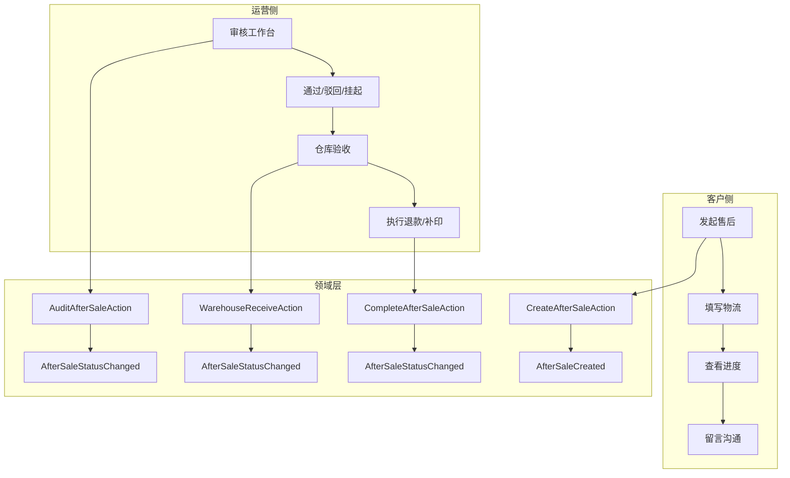
```mermaid
graph TB
    subgraph 客户侧
        C1[发起售后] --> C2[填写物流]
        C2 --> C3[查看进度]
        C3 --> C4[留言沟通]
    end

    subgraph 运营侧
        O1[审核工作台] --> O2[通过/驳回/挂起]
        O2 --> O3[仓库验收]
        O3 --> O4[执行退款/补印]
    end

    subgraph 领域层
        A1[CreateAfterSaleAction] --> E1[AfterSaleCreated]
        A2[AuditAfterSaleAction] --> E2[AfterSaleStatusChanged]
        A3[WarehouseReceiveAction] --> E3[AfterSaleStatusChanged]
        A4[CompleteAfterSaleAction] --> E4[AfterSaleStatusChanged]
    end

    C1 --> A1
    O1 --> A2
    O3 --> A3
    O4 --> A4
```

---

### 6.40.2 枚举定义

#### AfterSaleStatus (EM 售后单据状态)

```php
<?php

declare(strict_types=1);

namespace App\Enums;

/**
 * 售后单据生命周期状态（EM）
 * PRD键名: EM
 * submitted=已提交 / processing=处理中 / completed=已完成 / suspended=已挂起 / revoked=已撤销 / cancelled=已取消
 */
enum AfterSaleStatus: string
{
    case SUBMITTED  = 'submitted';   // 0=已提交
    case PROCESSING = 'processing';  // 1=处理中
    case COMPLETED  = 'completed';   // 2=已完成
    case SUSPENDED  = 'suspended';   // 10=已挂起
    case REVOKED    = 'revoked';     // 20=已撤销
    case CANCELLED  = 'cancelled';   // 100=已取消

    public function label(): string
    {
        return match ($this) {
            self::SUBMITTED  => '已提交',
            self::PROCESSING => '处理中',
            self::COMPLETED  => '已完成',
            self::SUSPENDED  => '已挂起',
            self::REVOKED    => '已撤销',
            self::CANCELLED  => '已取消',
        };
    }

    /**
     * 售后状态流转校验
     */
    public function canTransitionTo(self $target): bool
    {
        return match ([$this, $target]) {
            // 已提交 -> 处理中 / 已挂起 / 已撤销 / 已取消
            [self::SUBMITTED, self::PROCESSING],
            [self::SUBMITTED, self::SUSPENDED],
            [self::SUBMITTED, self::REVOKED],
            [self::SUBMITTED, self::CANCELLED] => true,

            // 处理中 -> 已完成 / 已挂起 / 已取消
            [self::PROCESSING, self::COMPLETED],
            [self::PROCESSING, self::SUSPENDED],
            [self::PROCESSING, self::CANCELLED] => true,

            // 已挂起 -> 处理中 / 已撤销 / 已取消
            [self::SUSPENDED, self::PROCESSING],
            [self::SUSPENDED, self::REVOKED],
            [self::SUSPENDED, self::CANCELLED] => true,

            // 已撤销 -> 已提交（重新提交）
            [self::REVOKED, self::SUBMITTED] => true,

            default => false,
        };
    }

    /**
     * 是否为终态
     */
    public function isTerminal(): bool
    {
        return in_array($this, [self::COMPLETED, self::CANCELLED], true);
    }

    /**
     * 映射为客户侧展示状态字符串
     */
    public function toCustomerStatus(?AfterSaleFlowStatus $flowStatus = null, ?AfterSaleType $type = null): string
    {
        return match ($this) {
            self::SUBMITTED  => 'pendingReview',
            self::SUSPENDED  => 'pendingReview', // 挂起对客户显示为待审核
            self::REVOKED    => 'rejected',
            self::CANCELLED  => 'closed',
            self::PROCESSING => match (true) {
                $flowStatus === AfterSaleFlowStatus::PENDING_RETURN => 'returnPending',
                $flowStatus === AfterSaleFlowStatus::RETURNED       => 'returnReceived',
                $type === AfterSaleType::REPRINT                     => 'reproducing',
                $type === AfterSaleType::DISCOUNT                    => 'refunding',
                default                                              => 'approved',
            },
            self::COMPLETED => 'completed',
        };
    }
}
```

#### AfterSaleType (售后类型)

```php
<?php

declare(strict_types=1);

namespace App\Enums;

/**
 * 售后类型枚举
 * PRD键名: （售后模块专用）
 * 0=退货退款 / 1=补印 / 2=优惠货款 / 3=其他
 */
enum AfterSaleType: int
{
    case RETURN_REFUND = 0;
    case REPRINT       = 1;
    case DISCOUNT      = 2;
    case OTHER         = 3;

    public function label(): string
    {
        return match ($this) {
            self::RETURN_REFUND => '退货退款',
            self::REPRINT       => '补印',
            self::DISCOUNT      => '优惠货款',
            self::OTHER         => '其他',
        };
    }

    /**
     * 是否需要退货物流
     */
    public function requiresReturn(): bool
    {
        return $this === self::RETURN_REFUND;
    }

    /**
     * 是否需要重新生产
     */
    public function requiresReproduction(): bool
    {
        return $this === self::REPRINT;
    }

    /**
     * 是否直接退款（无需退货/补印）
     */
    public function isDirectRefund(): bool
    {
        return $this === self::DISCOUNT;
    }
}
```

#### AfterSaleReason (售后原因)

```php
<?php

declare(strict_types=1);

namespace App\Enums;

/**
 * 售后原因枚举
 * PRD键名: （售后模块专用）
 * 0=下错单 / 1=印刷问题 / 2=裁切问题 / 3=后工问题 / 4=打包问题
 * 5=运输问题 / 6=误活 / 7=其他 / 8=贴错标签 / 9=原材料问题 / 10=少货
 */
enum AfterSaleReason: int
{
    case WRONG_ORDER     = 0;
    case PRINT_ISSUE     = 1;
    case CUTTING_ISSUE   = 2;
    case FINISHING_ISSUE = 3;
    case PACKING_ISSUE   = 4;
    case SHIPPING_ISSUE  = 5;
    case DELAY           = 6;
    case OTHER           = 7;
    case WRONG_LABEL     = 8;
    case MATERIAL_ISSUE  = 9;
    case SHORTAGE        = 10;

    public function label(): string
    {
        return match ($this) {
            self::WRONG_ORDER     => '下错单',
            self::PRINT_ISSUE     => '印刷问题（色差/模糊/裁切偏差）',
            self::CUTTING_ISSUE   => '裁切问题',
            self::FINISHING_ISSUE => '后工问题（覆膜/烫金/UV等）',
            self::PACKING_ISSUE   => '打包问题',
            self::SHIPPING_ISSUE  => '运输问题（物流损坏）',
            self::DELAY           => '误活（延期交货）',
            self::OTHER           => '其他问题',
            self::WRONG_LABEL     => '贴错标签',
            self::MATERIAL_ISSUE  => '原材料问题',
            self::SHORTAGE        => '少货问题',
        };
    }

    /**
     * 是否属于质量问题（可自动通过审核）
     */
    public function isQualityIssue(): bool
    {
        return in_array($this, [
            self::PRINT_ISSUE,
            self::CUTTING_ISSUE,
            self::FINISHING_ISSUE,
            self::PACKING_ISSUE,
            self::WRONG_LABEL,
            self::MATERIAL_ISSUE,
            self::SHORTAGE,
        ], true);
    }

    /**
     * 是否属于物流问题
     */
    public function isShippingIssue(): bool
    {
        return $this === self::SHIPPING_ISSUE;
    }
}
```

#### AfterSaleFlowStatus (AF 售后流程子状态)

```php
<?php

declare(strict_types=1);

namespace App\Enums;

/**
 * 售后流程子状态（AF）
 * PRD键名: AF
 * 100=待退货 / 101=已退货
 */
enum AfterSaleFlowStatus: int
{
    case PENDING_RETURN = 100;
    case RETURNED       = 101;

    public function label(): string
    {
        return match ($this) {
            self::PENDING_RETURN => '待退货',
            self::RETURNED       => '已退货',
        };
    }

    /**
     * 状态机：允许的目标状态校验
     */
    public function canTransitionTo(self $target): bool
    {
        return match ([$this, $target]) {
            [self::PENDING_RETURN, self::RETURNED] => true,

            default => false,
        };
    }

    /**
     * 是否为终态
     */
    public function isTerminal(): bool
    {
        return $this === self::RETURNED;
    }
}
```

#### RefundMethod (退款方式)

```php
<?php

declare(strict_types=1);

namespace App\Enums;

/**
 * 退款方式枚举
 * PRD键名: （支付模块扩展）
 * 0=无 / 1=原路退回 / 2=账户余额 / 3=银行转账 / 4=现金红包
 */
enum RefundMethod: int
{
    case NONE          = 0;
    case ORIGINAL      = 1;
    case WALLET        = 2;
    case BANK_TRANSFER = 3;
    case RED_PACKET    = 4;

    public function label(): string
    {
        return match ($this) {
            self::NONE          => '无',
            self::ORIGINAL      => '原路退回',
            self::WALLET        => '账户余额',
            self::BANK_TRANSFER => '银行转账',
            self::RED_PACKET    => '现金红包',
        };
    }

    /**
     * 是否原路退回
     */
    public function isOriginal(): bool
    {
        return $this === self::ORIGINAL;
    }

    /**
     * 是否需要人工处理
     */
    public function requiresManualProcess(): bool
    {
        return in_array($this, [self::BANK_TRANSFER, self::RED_PACKET], true);
    }
}
```

---

### 6.40.3 数据模型与 Migration

#### after_sales 表

```php
<?php

use Illuminate\Database\Migrations\Migration;
use Illuminate\Database\Schema\Blueprint;
use Illuminate\Support\Facades\Schema;

return new class extends Migration
{
    public function up(): void
    {
        Schema::create('after_sales', function (Blueprint $table) {
            $table->id()->comment('售后单主键');
            $table->string('after_sale_sn', 32)->unique()->comment('售后单号（对外展示）');
            $table->foreignId('order_id')->constrained('orders')->comment('订单ID');
            $table->string('order_sn', 32)->comment('订单编号（冗余，便于售后列表展示）');
            $table->foreignId('customer_id')->constrained('customers')->comment('客户ID');

            // 售后类型与原因
            $table->tinyInteger('type')->default(0)->comment('售后类型: 0退货退款 1补印 2优惠货款 3其他');
            $table->tinyInteger('reason')->default(0)->comment('售后原因: 0下错单 1印刷问题 2裁切问题 ... 10少货');
            $table->string('reason_desc', 512)->nullable()->comment('原因详细描述');

            // EM 售后单据状态（独立状态空间，严禁与 FM/nM 混用）
            $table->string('status', 16)->default('submitted')->comment('售后状态(EM): submitted/processing/completed/suspended/revoked/cancelled');

            // AF 售后流程子状态（独立状态空间，非 FM 子集）
            $table->tinyInteger('process_flow_status')->nullable()->comment('售后流程状态(AF): 100待退货 101已退货');

            // 金额与退款
            $table->bigInteger('refund_amount')->default(0)->comment('退款金额（单位：分）');
            $table->tinyInteger('refund_method')->default(0)->comment('退款方式: 0无 1原路退回 2余额 3银行转账 4现金红包');

            // 凭证图片（最多9张）
            $table->json('evidence_urls')->nullable()->comment('凭证图片URL数组');

            // 退货物流信息
            $table->string('return_express_company', 64)->nullable()->comment('退货快递公司');
            $table->string('return_express_number', 64)->nullable()->comment('退货快递单号');
            $table->timestamp('return_submit_time')->nullable()->comment('退货物流提交时间');

            // 运营审核
            $table->foreignId('auditor_id')->nullable()->comment('审核人ID（管理员）');
            $table->timestamp('audited_at')->nullable()->comment('审核时间');
            $table->string('audit_remark', 512)->nullable()->comment('审核备注');
            $table->string('reject_reason', 512)->nullable()->comment('驳回原因');

            // 仓库验收
            $table->foreignId('warehouse_checker_id')->nullable()->comment('仓库验收人ID');
            $table->timestamp('warehouse_received_at')->nullable()->comment('仓库验收时间');
            $table->string('warehouse_remark', 512)->nullable()->comment('仓库验收备注');

            // 时间戳与关闭控制
            $table->timestamp('completed_at')->nullable()->comment('售后完成时间');
            $table->timestamp('customer_confirmed_at')->nullable()->comment('客户确认时间');
            $table->timestamp('closed_at')->nullable()->comment('售后关闭时间');
            $table->string('close_reason', 128)->nullable()->comment('关闭原因：auto_return_timeout/auto_confirm_timeout/customer_cancel/admin_cancel');
            $table->timestamps();

            // 索引策略
            $table->index('after_sale_sn', 'idx_after_sale_sn');
            $table->index('order_id', 'idx_order_id');
            $table->index('customer_id', 'idx_customer_id');
            $table->index('status', 'idx_status');
            $table->index(['type', 'status'], 'idx_type_status');
            $table->index('created_at', 'idx_created_at');
            $table->index(['status', 'closed_at'], 'idx_status_closed');
        });
    }

    public function down(): void
    {
        Schema::dropIfExists('after_sales');
    }
};
```

#### after_sale_items 表

```php
<?php

use Illuminate\Database\Migrations\Migration;
use Illuminate\Database\Schema\Blueprint;
use Illuminate\Support\Facades\Schema;

return new class extends Migration
{
    public function up(): void
    {
        Schema::create('after_sale_items', function (Blueprint $table) {
            $table->id()->comment('明细主键');
            $table->foreignId('after_sale_id')->constrained('after_sales')->comment('售后单ID');
            $table->foreignId('order_item_id')->nullable()->constrained('order_items')->comment('原订单明细ID');
            $table->foreignId('product_id')->nullable()->constrained('products')->comment('商品ID');
            $table->string('product_name', 255)->nullable()->comment('商品名称（冗余）');
            $table->integer('quantity')->default(0)->comment('售后数量');
            $table->tinyInteger('reason')->nullable()->comment('商品级售后原因枚举');
            $table->bigInteger('refund_amount')->default(0)->comment('该商品退款金额（单位：分）');
            $table->timestamps();

            $table->index('after_sale_id', 'idx_after_sale_id');
            $table->index('order_item_id', 'idx_order_item_id');
            $table->index('product_id', 'idx_product_id');
        });
    }

    public function down(): void
    {
        Schema::dropIfExists('after_sale_items');
    }
};
```

#### after_sale_messages 表

```php
<?php

use Illuminate\Database\Migrations\Migration;
use Illuminate\Database\Schema\Blueprint;
use Illuminate\Support\Facades\Schema;

return new class extends Migration
{
    public function up(): void
    {
        Schema::create('after_sale_messages', function (Blueprint $table) {
            $table->id()->comment('留言主键');
            $table->foreignId('after_sale_id')->constrained('after_sales')->comment('售后单ID');
            $table->tinyInteger('sender_type')->default(1)->comment('发送者类型: 1客户 2运营 3系统');
            $table->unsignedBigInteger('sender_id')->nullable()->comment('发送者ID');
            $table->text('content')->comment('留言内容');
            $table->json('attachments')->nullable()->comment('附件URL数组');
            $table->timestamp('read_at')->nullable()->comment('对方已读时间');
            $table->timestamps();

            $table->index('after_sale_id', 'idx_after_sale_id');
            $table->index(['after_sale_id', 'created_at'], 'idx_after_sale_created');
            $table->index(['sender_type', 'read_at'], 'idx_sender_read');
        });
    }

    public function down(): void
    {
        Schema::dropIfExists('after_sale_messages');
    }
};
```

#### after_sale_logs 表

```php
<?php

use Illuminate\Database\Migrations\Migration;
use Illuminate\Database\Schema\Blueprint;
use Illuminate\Support\Facades\Schema;

return new class extends Migration
{
    public function up(): void
    {
        Schema::create('after_sale_logs', function (Blueprint $table) {
            $table->id()->comment('日志主键');
            $table->foreignId('after_sale_id')->constrained('after_sales')->comment('售后单ID');
            $table->string('action', 64)->comment('操作动作：create/audit/return_submit/receive/complete/cancel/reject');
            $table->string('from_status', 16)->nullable()->comment('操作前EM状态');
            $table->string('to_status', 16)->nullable()->comment('操作后EM状态');
            $table->unsignedBigInteger('operator_id')->nullable()->comment('操作人ID');
            $table->string('operator_type', 16)->default('system')->comment('操作人类型: customer/admin/system');
            $table->string('remark', 512)->nullable()->comment('操作备注');
            $table->json('extra')->nullable()->comment('扩展信息（如审核结果、物流单号等）');
            $table->timestamp('created_at')->nullable();

            $table->index('after_sale_id', 'idx_after_sale_id');
            $table->index('action', 'idx_action');
            $table->index('created_at', 'idx_created_at');
        });
    }

    public function down(): void
    {
        Schema::dropIfExists('after_sale_logs');
    }
};
```

---

### 6.40.4 Eloquent 模型

#### AfterSale 模型

```php
<?php

declare(strict_types=1);

namespace App\Domains\AfterSale\Models;

use App\Domains\Common\Castables\MoneyCast;
use App\Enums\AfterSaleFlowStatus;
use App\Enums\AfterSaleReason;
use App\Enums\AfterSaleStatus;
use App\Enums\AfterSaleType;
use App\Enums\RefundMethod;
use App\Exceptions\InvalidStateTransitionException;
use App\Models\Customer;
use App\Models\Order;
use Illuminate\Database\Eloquent\Factories\HasFactory;
use Illuminate\Database\Eloquent\Model;
use Illuminate\Database\Eloquent\Relations\BelongsTo;
use Illuminate\Database\Eloquent\Relations\HasMany;
use Illuminate\Support\Str;

class AfterSale extends Model
{
    use HasFactory;

    protected $table = 'after_sales';

    protected $fillable = [
        'after_sale_sn', 'order_id', 'order_sn', 'customer_id',
        'type', 'reason', 'reason_desc',
        'status', 'process_flow_status', 'refund_amount', 'refund_method',
        'evidence_urls', 'return_express_company', 'return_express_number', 'return_submit_time',
        'auditor_id', 'audited_at', 'audit_remark', 'reject_reason',
        'warehouse_checker_id', 'warehouse_received_at', 'warehouse_remark',
        'completed_at', 'closed_at', 'close_reason',
    ];

    protected $casts = [
        'status'              => AfterSaleStatus::class,
        'type'                => AfterSaleType::class,
        'reason'              => AfterSaleReason::class,
        'process_flow_status' => AfterSaleFlowStatus::class,
        'refund_method'       => RefundMethod::class,
        'refund_amount'       => MoneyCast::class,
        'evidence_urls'       => 'array',
        'return_submit_time'  => 'datetime',
        'audited_at'          => 'datetime',
        'warehouse_received_at' => 'datetime',
        'completed_at'        => 'datetime',
        'closed_at'           => 'datetime',
    ];

    protected static function boot(): void
    {
        parent::boot();

        static::creating(function (self $model) {
            if (empty($model->after_sale_sn)) {
                $model->after_sale_sn = 'AS' . now()->format('YmdHis') . strtoupper(Str::random(6));
            }
        });
    }

    // -- Relations --

    public function order(): BelongsTo
    {
        return $this->belongsTo(Order::class, 'order_id');
    }

    public function customer(): BelongsTo
    {
        return $this->belongsTo(Customer::class, 'customer_id');
    }

    public function items(): HasMany
    {
        return $this->hasMany(AfterSaleItem::class, 'after_sale_id');
    }

    public function messages(): HasMany
    {
        return $this->hasMany(AfterSaleMessage::class, 'after_sale_id');
    }

    public function logs(): HasMany
    {
        return $this->hasMany(AfterSaleLog::class, 'after_sale_id');
    }

    // -- State Transition --

    /**
     * 状态流转（带合法性校验）
     *
     * @throws InvalidStateTransitionException
     */
    public function transitionTo(AfterSaleStatus $target, string $remark = ''): void
    {
        $current = $this->status;

        if (! $current->canTransitionTo($target)) {
            throw new InvalidStateTransitionException(
                "售后单 {$this->after_sale_sn} 不允许从 {$current->label()} 流转到 {$target->label()}"
            );
        }

        $previous = $current;
        $this->update([
            'status' => $target,
            'completed_at' => $target === AfterSaleStatus::COMPLETED ? now() : $this->completed_at,
            'closed_at' => $target->isTerminal() && $this->closed_at === null ? now() : $this->closed_at,
        ]);

        event(new \App\Domains\AfterSale\Events\AfterSaleStatusChanged($this, $previous, $target, $remark));
    }

    /**
     * 售后流程子状态流转
     *
     * @throws InvalidStateTransitionException
     */
    public function transitionFlowTo(AfterSaleFlowStatus $target): void
    {
        $current = $this->process_flow_status;

        if ($current !== null && ! $current->canTransitionTo($target)) {
            throw new InvalidStateTransitionException(
                "售后单 {$this->after_sale_sn} 流程状态不允许从 {$current->label()} 流转到 {$target->label()}"
            );
        }

        $this->update(['process_flow_status' => $target]);
    }

    // -- Query Scopes --

    public function scopeOfCustomer($query, int $customerId)
    {
        return $query->where('customer_id', $customerId);
    }

    public function scopePending($query)
    {
        return $query->whereIn('status', [
            AfterSaleStatus::SUBMITTED->value,
            AfterSaleStatus::PROCESSING->value,
            AfterSaleStatus::SUSPENDED->value,
        ]);
    }

    public function scopeTerminal($query)
    {
        return $query->whereIn('status', [
            AfterSaleStatus::COMPLETED->value,
            AfterSaleStatus::CANCELLED->value,
        ]);
    }

    /**
     * 超期未提交退货物流的售后单
     */
    public function scopeOverdueReturn($query, int $days = 15)
    {
        return $query->where('type', AfterSaleType::RETURN_REFUND->value)
            ->where('status', AfterSaleStatus::PROCESSING->value)
            ->where('process_flow_status', AfterSaleFlowStatus::PENDING_RETURN->value)
            ->whereNull('return_submit_time')
            ->where('audited_at', '<', now()->subDays($days));
    }

    // -- Helpers --

    /**
     * 当前客户侧展示状态
     */
    public function customerStatus(): string
    {
        // 被运营驳回时，对客户展示为 rejected
        if ($this->status === AfterSaleStatus::CANCELLED && $this->close_reason === 'admin_reject') {
            return 'rejected';
        }

        return $this->status->toCustomerStatus($this->process_flow_status, $this->type);
    }

    /**
     * 是否已关闭
     */
    public function isClosed(): bool
    {
        return $this->status->isTerminal();
    }

    /**
     * 是否允许客户撤销
     */
    public function canBeRevokedByCustomer(): bool
    {
        return in_array($this->status, [
            AfterSaleStatus::SUBMITTED,
            AfterSaleStatus::SUSPENDED,
        ], true);
    }
}
```

#### AfterSaleItem 模型

```php
<?php

declare(strict_types=1);

namespace App\Domains\AfterSale\Models;

use App\Domains\Common\Castables\MoneyCast;
use App\Enums\AfterSaleReason;
use Illuminate\Database\Eloquent\Model;
use Illuminate\Database\Eloquent\Relations\BelongsTo;

class AfterSaleItem extends Model
{
    protected $table = 'after_sale_items';

    protected $fillable = [
        'after_sale_id', 'order_item_id', 'product_id', 'product_name',
        'quantity', 'reason', 'refund_amount',
    ];

    protected $casts = [
        'quantity'      => 'integer',
        'reason'        => AfterSaleReason::class,
        'refund_amount' => MoneyCast::class,
    ];

    public function afterSale(): BelongsTo
    {
        return $this->belongsTo(AfterSale::class, 'after_sale_id');
    }

    public function product(): BelongsTo
    {
        return $this->belongsTo(\App\Models\Product::class, 'product_id');
    }
}
```

#### AfterSaleMessage 模型

```php
<?php

declare(strict_types=1);

namespace App\Domains\AfterSale\Models;

use Illuminate\Database\Eloquent\Model;
use Illuminate\Database\Eloquent\Relations\BelongsTo;

class AfterSaleMessage extends Model
{
    protected $table = 'after_sale_messages';

    protected $fillable = [
        'after_sale_id', 'sender_type', 'sender_id', 'content', 'attachments', 'read_at',
    ];

    protected $casts = [
        'sender_type' => 'integer',
        'sender_id'   => 'integer',
        'attachments' => 'array',
        'read_at'     => 'datetime',
    ];

    public function afterSale(): BelongsTo
    {
        return $this->belongsTo(AfterSale::class, 'after_sale_id');
    }

    /**
     * 是否为系统消息
     */
    public function isSystem(): bool
    {
        return $this->sender_type === 3;
    }

    /**
     * 标记为已读
     */
    public function markAsRead(): void
    {
        if ($this->read_at === null) {
            $this->update(['read_at' => now()]);
        }
    }
}
```

#### AfterSaleLog 模型

```php
<?php

declare(strict_types=1);

namespace App\Domains\AfterSale\Models;

use Illuminate\Database\Eloquent\Model;
use Illuminate\Database\Eloquent\Relations\BelongsTo;

class AfterSaleLog extends Model
{
    protected $table = 'after_sale_logs';

    public $timestamps = false;

    protected $fillable = [
        'after_sale_id', 'action', 'from_status', 'to_status',
        'operator_id', 'operator_type', 'remark', 'extra', 'created_at',
    ];

    protected $casts = [
        'extra'     => 'array',
        'created_at' => 'datetime',
    ];

    public function afterSale(): BelongsTo
    {
        return $this->belongsTo(AfterSale::class, 'after_sale_id');
    }
}
```


---

### 6.40.5 Action 类

#### CreateAfterSaleAction

```php
<?php

declare(strict_types=1);

namespace App\Domains\AfterSale\Actions;

use App\Domains\AfterSale\Events\AfterSaleCreated;
use App\Domains\AfterSale\Models\AfterSale;
use App\Domains\AfterSale\Models\AfterSaleItem;
use App\Domains\AfterSale\Models\AfterSaleLog;
use App\Enums\AfterSaleStatus;
use App\Enums\AfterSaleType;
use App\Enums\OrderStatus;
use App\Models\Order;
use Illuminate\Support\Facades\DB;
use Illuminate\Validation\ValidationException;

/**
 * 创建售后申请
 *
 * PRD: FR-AFTER-001 ~ FR-AFTER-004
 */
final class CreateAfterSaleAction
{
    /**
     * @param array{
     *   type: int,
     *   reason: int,
     *   reason_desc?: string,
     *   refund_amount: float,
     *   refund_method?: int,
     *   evidence_urls?: string[],
     *   items?: array<int, array{order_item_id: int, quantity: int, reason?: int, refund_amount?: float}>
     * } $data
     */
    public function execute(Order $order, array $data): AfterSale
    {
        return DB::transaction(function () use ($order, $data) {
            // 1. 校验订单是否允许售后（已完成状态且未过售后时效）
            $this->validateOrder($order);

            // 2. 校验凭证数量（最多9张）
            $evidenceUrls = $data['evidence_urls'] ?? [];
            if (count($evidenceUrls) > 9) {
                throw ValidationException::withMessages([
                    'evidence_urls' => '凭证图片最多上传9张',
                ]);
            }

            // 3. 创建售后单
            $afterSale = AfterSale::create([
                'order_id'         => $order->id,
                'order_sn'         => $order->order_sn,
                'customer_id'      => auth('customer')->id(),
                'type'             => $data['type'],
                'reason'           => $data['reason'],
                'reason_desc'      => $data['reason_desc'] ?? null,
                'status'           => AfterSaleStatus::SUBMITTED,
                'refund_amount'    => $data['refund_amount'],
                'refund_method'    => $data['refund_method'] ?? 0,
                'evidence_urls'    => $evidenceUrls,
            ]);

            // 4. 创建售后明细
            if (! empty($data['items'])) {
                foreach ($data['items'] as $item) {
                    AfterSaleItem::create([
                        'after_sale_id' => $afterSale->id,
                        'order_item_id' => $item['order_item_id'],
                        'quantity'      => $item['quantity'],
                        'reason'        => $item['reason'] ?? $data['reason'],
                        'refund_amount' => $item['refund_amount'] ?? 0,
                    ]);
                }
            }

            // 5. 记录操作日志
            AfterSaleLog::create([
                'after_sale_id' => $afterSale->id,
                'action'        => 'create',
                'to_status'     => AfterSaleStatus::SUBMITTED->value,
                'operator_id'   => auth('customer')->id(),
                'operator_type' => 'customer',
                'remark'        => '客户发起售后申请',
                'extra'         => ['type' => $data['type'], 'reason' => $data['reason']],
                'created_at'    => now(),
            ]);

            // 6. 触发事件
            event(new AfterSaleCreated($afterSale));

            return $afterSale->fresh('items');
        });
    }

    private function validateOrder(Order $order): void
    {
        // 仅已完成订单可申请售后（根据业务规则可调整）
        if ($order->status !== OrderStatus::COMPLETED) {
            throw new \DomainException('当前订单状态不允许申请售后');
        }

        // 校验售后时效（默认订单完成后15天内）
        $deadline = $order->completed_at?->addDays(15) ?? now()->addDays(15);
        if (now()->isAfter($deadline)) {
            throw new \DomainException('已超过售后申请时效');
        }

        // 校验是否已有进行中的售后
        $existing = AfterSale::where('order_id', $order->id)
            ->pending()
            ->exists();

        if ($existing) {
            throw new \DomainException('该订单已存在进行中的售后单');
        }
    }
}
```

#### AuditAfterSaleAction

```php
<?php

declare(strict_types=1);

namespace App\Domains\AfterSale\Actions;

use App\Domains\AfterSale\Models\AfterSale;
use App\Domains\AfterSale\Models\AfterSaleLog;
use App\Enums\AfterSaleFlowStatus;
use App\Enums\AfterSaleStatus;
use App\Enums\AfterSaleType;
use Illuminate\Support\Facades\DB;

/**
 * 运营审核售后申请
 *
 * PRD: FR-AFTER-005 ~ FR-AFTER-007
 * 审核结果: approve(通过) / reject(不通过) / supplement(需补充材料)
 */
final class AuditAfterSaleAction
{
    /**
     * @param array{
     *   result: 'approve'|'reject'|'supplement',
     *   remark?: string,
     *   refund_method?: int,
     * } $data
     */
    public function execute(AfterSale $afterSale, array $data): AfterSale
    {
        return DB::transaction(function () use ($afterSale, $data) {
            $result = $data['result'];
            $remark = $data['remark'] ?? '';

            match ($result) {
                'approve'    => $this->handleApprove($afterSale, $data, $remark),
                'reject'     => $this->handleReject($afterSale, $remark),
                'supplement' => $this->handleSupplement($afterSale, $remark),
                default      => throw new \InvalidArgumentException('未知的审核结果'),
            };

            return $afterSale->fresh();
        });
    }

    private function handleApprove(AfterSale $afterSale, array $data, string $remark): void
    {
        // 更新退款方式（运营可指定）
        if (isset($data['refund_method'])) {
            $afterSale->update(['refund_method' => $data['refund_method']]);
        }

        // 根据售后类型设置后续状态
        match ($afterSale->type) {
            AfterSaleType::RETURN_REFUND => $this->startReturnFlow($afterSale, $remark),
            AfterSaleType::REPRINT       => $this->startReprintFlow($afterSale, $remark),
            AfterSaleType::DISCOUNT      => $this->startRefundFlow($afterSale, $remark),
            AfterSaleType::OTHER         => $this->startOtherFlow($afterSale, $remark),
        };
    }

    private function startReturnFlow(AfterSale $afterSale, string $remark): void
    {
        // 退货退款：进入处理中 + 待退货
        $afterSale->transitionTo(AfterSaleStatus::PROCESSING, $remark);
        $afterSale->update(['process_flow_status' => AfterSaleFlowStatus::PENDING_RETURN]);

        AfterSaleLog::create([
            'after_sale_id' => $afterSale->id,
            'action'        => 'audit',
            'from_status'   => AfterSaleStatus::SUBMITTED->value,
            'to_status'     => AfterSaleStatus::PROCESSING->value,
            'operator_id'   => auth('admin')->id(),
            'operator_type' => 'admin',
            'remark'        => "审核通过，待退货。{$remark}",
            'extra'         => ['flow_status' => AfterSaleFlowStatus::PENDING_RETURN->value],
            'created_at'    => now(),
        ]);
    }

    private function startReprintFlow(AfterSale $afterSale, string $remark): void
    {
        // 补印：直接进入处理中（排期生产）
        $afterSale->transitionTo(AfterSaleStatus::PROCESSING, $remark);

        AfterSaleLog::create([
            'after_sale_id' => $afterSale->id,
            'action'        => 'audit',
            'from_status'   => AfterSaleStatus::SUBMITTED->value,
            'to_status'     => AfterSaleStatus::PROCESSING->value,
            'operator_id'   => auth('admin')->id(),
            'operator_type' => 'admin',
            'remark'        => "审核通过，进入补印排期。{$remark}",
            'created_at'    => now(),
        ]);
    }

    private function startRefundFlow(AfterSale $afterSale, string $remark): void
    {
        // 优惠货款：直接进入处理中（退款中）
        $afterSale->transitionTo(AfterSaleStatus::PROCESSING, $remark);

        AfterSaleLog::create([
            'after_sale_id' => $afterSale->id,
            'action'        => 'audit',
            'from_status'   => AfterSaleStatus::SUBMITTED->value,
            'to_status'     => AfterSaleStatus::PROCESSING->value,
            'operator_id'   => auth('admin')->id(),
            'operator_type' => 'admin',
            'remark'        => "审核通过，进入退款流程。{$remark}",
            'created_at'    => now(),
        ]);
    }

    private function startOtherFlow(AfterSale $afterSale, string $remark): void
    {
        $afterSale->transitionTo(AfterSaleStatus::PROCESSING, $remark);

        AfterSaleLog::create([
            'after_sale_id' => $afterSale->id,
            'action'        => 'audit',
            'from_status'   => AfterSaleStatus::SUBMITTED->value,
            'to_status'     => AfterSaleStatus::PROCESSING->value,
            'operator_id'   => auth('admin')->id(),
            'operator_type' => 'admin',
            'remark'        => "审核通过，其他类型售后处理中。{$remark}",
            'created_at'    => now(),
        ]);
    }

    private function handleReject(AfterSale $afterSale, string $remark): void
    {
        // 审核不通过：流转到已撤销（客户可重新提交）
        $afterSale->transitionTo(AfterSaleStatus::REVOKED, $remark);
        $afterSale->update(['reject_reason' => $remark]);

        AfterSaleLog::create([
            'after_sale_id' => $afterSale->id,
            'action'        => 'audit',
            'from_status'   => AfterSaleStatus::SUBMITTED->value,
            'to_status'     => AfterSaleStatus::REVOKED->value,
            'operator_id'   => auth('admin')->id(),
            'operator_type' => 'admin',
            'remark'        => "审核不通过。{$remark}",
            'extra'         => ['result' => 'reject'],
            'created_at'    => now(),
        ]);
    }

    private function handleSupplement(AfterSale $afterSale, string $remark): void
    {
        // 需补充材料：挂起，等待客户补充
        $afterSale->transitionTo(AfterSaleStatus::SUSPENDED, $remark);

        AfterSaleLog::create([
            'after_sale_id' => $afterSale->id,
            'action'        => 'audit',
            'from_status'   => AfterSaleStatus::SUBMITTED->value,
            'to_status'     => AfterSaleStatus::SUSPENDED->value,
            'operator_id'   => auth('admin')->id(),
            'operator_type' => 'admin',
            'remark'        => "需补充材料：{$remark}",
            'extra'         => ['result' => 'supplement'],
            'created_at'    => now(),
        ]);
    }
}
```

#### SubmitReturnLogisticsAction

```php
<?php

declare(strict_types=1);

namespace App\Domains\AfterSale\Actions;

use App\Domains\AfterSale\Models\AfterSale;
use App\Domains\AfterSale\Models\AfterSaleLog;
use App\Enums\AfterSaleFlowStatus;
use App\Enums\AfterSaleStatus;
use App\Enums\AfterSaleType;

/**
 * 客户提交退货物流单号
 *
 * PRD: FR-AFTER-008
 */
final class SubmitReturnLogisticsAction
{
    /**
     * @param array{
     *   express_company: string,
     *   express_number: string,
     * } $data
     */
    public function execute(AfterSale $afterSale, array $data): AfterSale
    {
        // 仅退货退款类型可提交物流
        if ($afterSale->type !== AfterSaleType::RETURN_REFUND) {
            throw new \DomainException('当前售后类型不支持退货物流');
        }

        // 校验状态
        if ($afterSale->status !== AfterSaleStatus::PROCESSING
            || $afterSale->process_flow_status !== AfterSaleFlowStatus::PENDING_RETURN
        ) {
            throw new \DomainException('当前售后状态不允许提交退货物流');
        }

        $afterSale->update([
            'return_express_company' => $data['express_company'],
            'return_express_number'  => $data['express_number'],
            'return_submit_time'     => now(),
        ]);

        AfterSaleLog::create([
            'after_sale_id' => $afterSale->id,
            'action'        => 'return_submit',
            'from_status'   => $afterSale->status->value,
            'to_status'     => $afterSale->status->value,
            'operator_id'   => auth('customer')->id(),
            'operator_type' => 'customer',
            'remark'        => "提交退货物流：{$data['express_company']} {$data['express_number']}",
            'extra'         => [
                'express_company' => $data['express_company'],
                'express_number'  => $data['express_number'],
            ],
            'created_at'    => now(),
        ]);

        return $afterSale->fresh();
    }
}
```

#### WarehouseReceiveAction

```php
<?php

declare(strict_types=1);

namespace App\Domains\AfterSale\Actions;

use App\Domains\AfterSale\Models\AfterSale;
use App\Domains\AfterSale\Models\AfterSaleLog;
use App\Enums\AfterSaleFlowStatus;
use App\Enums\AfterSaleStatus;
use App\Enums\AfterSaleType;

/**
 * 仓库验收退货
 *
 * PRD: FR-AFTER-009
 */
final class WarehouseReceiveAction
{
    /**
     * @param array{
     *   result: 'pass'|'reject',
     *   remark?: string,
     * } $data
     */
    public function execute(AfterSale $afterSale, array $data): AfterSale
    {
        if ($afterSale->type !== AfterSaleType::RETURN_REFUND) {
            throw new \DomainException('非退货退款类型无需仓库验收');
        }

        if ($afterSale->process_flow_status !== AfterSaleFlowStatus::PENDING_RETURN) {
            throw new \DomainException('当前流程状态不允许仓库验收');
        }

        $result = $data['result'];
        $remark = $data['remark'] ?? '';

        if ($result === 'pass') {
            // 验收通过：流程状态变为已退货
            $afterSale->transitionFlowTo(AfterSaleFlowStatus::RETURNED);
            $afterSale->update([
                'warehouse_checker_id' => auth('admin')->id(),
                'warehouse_received_at' => now(),
                'warehouse_remark' => $remark,
            ]);

            AfterSaleLog::create([
                'after_sale_id' => $afterSale->id,
                'action'        => 'receive',
                'from_status'   => AfterSaleStatus::PROCESSING->value,
                'to_status'     => AfterSaleStatus::PROCESSING->value,
                'operator_id'   => auth('admin')->id(),
                'operator_type' => 'admin',
                'remark'        => "仓库验收通过。{$remark}",
                'extra'         => ['flow_status' => AfterSaleFlowStatus::RETURNED->value],
                'created_at'    => now(),
            ]);
        } else {
            // 验收不通过：挂起，等待处理
            $afterSale->transitionTo(AfterSaleStatus::SUSPENDED, $remark);
            $afterSale->update([
                'warehouse_checker_id' => auth('admin')->id(),
                'warehouse_received_at' => now(),
                'warehouse_remark' => $remark,
            ]);

            AfterSaleLog::create([
                'after_sale_id' => $afterSale->id,
                'action'        => 'receive',
                'from_status'   => AfterSaleStatus::PROCESSING->value,
                'to_status'     => AfterSaleStatus::SUSPENDED->value,
                'operator_id'   => auth('admin')->id(),
                'operator_type' => 'admin',
                'remark'        => "仓库验收不通过。{$remark}",
                'extra'         => ['result' => 'reject'],
                'created_at'    => now(),
            ]);
        }

        return $afterSale->fresh();
    }
}
```

#### CompleteAfterSaleAction

```php
<?php

declare(strict_types=1);

namespace App\Domains\AfterSale\Actions;

use App\Domains\AfterSale\Models\AfterSale;
use App\Domains\AfterSale\Models\AfterSaleLog;
use App\Enums\AfterSaleFlowStatus;
use App\Enums\AfterSaleStatus;
use App\Enums\AfterSaleType;

/**
 * 完成售后单
 *
 * PRD: FR-AFTER-010
 * 触发条件：退款到账 / 补印发货 / 其他处理完毕
 */
final class CompleteAfterSaleAction
{
    /**
     * @param array{remark?: string} $data
     */
    public function execute(AfterSale $afterSale, array $data = []): AfterSale
    {
        // 校验完成前置条件
        $this->validateCompletion($afterSale);

        $remark = $data['remark'] ?? '';

        $afterSale->transitionTo(AfterSaleStatus::COMPLETED, $remark);

        AfterSaleLog::create([
            'after_sale_id' => $afterSale->id,
            'action'        => 'complete',
            'from_status'   => AfterSaleStatus::PROCESSING->value,
            'to_status'     => AfterSaleStatus::COMPLETED->value,
            'operator_id'   => auth('admin')->id(),
            'operator_type' => 'admin',
            'remark'        => "售后完成。{$remark}",
            'created_at'    => now(),
        ]);

        return $afterSale->fresh();
    }

    private function validateCompletion(AfterSale $afterSale): void
    {
        if ($afterSale->status !== AfterSaleStatus::PROCESSING) {
            throw new \DomainException('仅处理中的售后单可标记完成');
        }

        // 退货退款必须已退货
        if ($afterSale->type === AfterSaleType::RETURN_REFUND
            && $afterSale->process_flow_status !== AfterSaleFlowStatus::RETURNED
        ) {
            throw new \DomainException('退货退款类型需仓库验收后方可完成');
        }
    }
}
```

#### CancelAfterSaleAction

```php
<?php

declare(strict_types=1);

namespace App\Domains\AfterSale\Actions;

use App\Domains\AfterSale\Models\AfterSale;
use App\Domains\AfterSale\Models\AfterSaleLog;
use App\Enums\AfterSaleStatus;

/**
 * 撤销/取消售后单
 *
 * PRD: FR-AFTER-011
 * 客户可撤销自己提交的售后；运营可取消任意非终态售后
 */
final class CancelAfterSaleAction
{
    /**
     * @param array{
     *   reason?: string,
     *   auto?: bool,
     * } $data
     */
    public function execute(AfterSale $afterSale, array $data = []): AfterSale
    {
        $isAuto = $data['auto'] ?? false;
        $reason = $data['reason'] ?? ($isAuto ? '系统自动关闭' : '手动取消');

        $operatorType = $isAuto ? 'system' : (auth('admin')->check() ? 'admin' : 'customer');
        $operatorId = $isAuto ? null : (auth('admin')->id() ?? auth('customer')->id());

        // 客户撤销：仅允许已提交/挂起状态
        if ($operatorType === 'customer' && ! $afterSale->canBeRevokedByCustomer()) {
            throw new \DomainException('当前售后状态不允许撤销');
        }

        // 运营取消 / 系统自动：仅允许非终态
        if ($afterSale->status->isTerminal()) {
            throw new \DomainException('已结束的售后单不可取消');
        }

        $previous = $afterSale->status;
        $afterSale->transitionTo(AfterSaleStatus::CANCELLED, $reason);
        $afterSale->update([
            'closed_at'    => now(),
            'close_reason' => $isAuto ? 'auto_return_timeout' : 'admin_cancel',
        ]);

        AfterSaleLog::create([
            'after_sale_id' => $afterSale->id,
            'action'        => 'cancel',
            'from_status'   => $previous->value,
            'to_status'     => AfterSaleStatus::CANCELLED->value,
            'operator_id'   => $operatorId,
            'operator_type' => $operatorType,
            'remark'        => $reason,
            'created_at'    => now(),
        ]);

        return $afterSale->fresh();
    }
}
```

#### RejectAfterSaleAction

```php
<?php

declare(strict_types=1);

namespace App\Domains\AfterSale\Actions;

use App\Domains\AfterSale\Models\AfterSale;
use App\Domains\AfterSale\Models\AfterSaleLog;
use App\Enums\AfterSaleStatus;

/**
 * 驳回售后申请（运营侧直接驳回，不进入撤销态）
 *
 * PRD: FR-AFTER-006（驳回分支）
 * 与 AuditAfterSaleAction::handleReject 的区别：
 * - AuditAfterSaleAction 的 reject 会进入 REVOKED（客户可重新提交）
 * - RejectAfterSaleAction 直接进入 CANCELLED（终态，不可恢复）
 */
final class RejectAfterSaleAction
{
    /**
     * @param array{reason: string} $data
     */
    public function execute(AfterSale $afterSale, array $data): AfterSale
    {
        if ($afterSale->status->isTerminal()) {
            throw new \DomainException('已结束的售后单不可驳回');
        }

        $reason = $data['reason'];
        $previous = $afterSale->status;

        $afterSale->transitionTo(AfterSaleStatus::CANCELLED, $reason);
        $afterSale->update([
            'reject_reason' => $reason,
            'closed_at'     => now(),
            'close_reason'  => 'admin_reject',
            'auditor_id'    => auth('admin')->id(),
            'audited_at'    => now(),
        ]);

        AfterSaleLog::create([
            'after_sale_id' => $afterSale->id,
            'action'        => 'reject',
            'from_status'   => $previous->value,
            'to_status'     => AfterSaleStatus::CANCELLED->value,
            'operator_id'   => auth('admin')->id(),
            'operator_type' => 'admin',
            'remark'        => "运营驳回：{$reason}",
            'extra'         => ['result' => 'final_reject'],
            'created_at'    => now(),
        ]);

        return $afterSale->fresh();
    }
}
```


---

### 6.40.6 Service 类

#### AfterSaleService

```php
<?php

declare(strict_types=1);

namespace App\Domains\AfterSale\Services;

use App\Domains\AfterSale\Models\AfterSale;
use App\Domains\AfterSale\Models\AfterSaleMessage;
use App\Enums\AfterSaleStatus;
use Illuminate\Contracts\Pagination\LengthAwarePaginator;
use Illuminate\Database\Eloquent\Collection;

/**
 * 售后服务门面类
 * 聚合 Action 调用、查询、权限校验
 */
class AfterSaleService
{
    /**
     * 客户售后列表
     */
    public function customerList(int $customerId, array $filters = []): LengthAwarePaginator
    {
        $query = AfterSale::with(['items.product', 'order'])
            ->ofCustomer($customerId)
            ->orderByDesc('created_at');

        if (! empty($filters['status'])) {
            $query->where('status', $filters['status']);
        }

        if (! empty($filters['type'])) {
            $query->where('type', $filters['type']);
        }

        return $query->paginate($filters['per_page'] ?? 15);
    }

    /**
     * 运营审核工作台列表
     */
    public function adminWorkbench(array $filters = []): LengthAwarePaginator
    {
        $query = AfterSale::with(['items.product', 'customer', 'order'])
            ->orderByDesc('created_at');

        if (! empty($filters['status'])) {
            $query->where('status', $filters['status']);
        }

        if (! empty($filters['type'])) {
            $query->where('type', $filters['type']);
        }

        if (! empty($filters['date_from'])) {
            $query->whereDate('created_at', '>=', $filters['date_from']);
        }

        if (! empty($filters['date_to'])) {
            $query->whereDate('created_at', '<=', $filters['date_to']);
        }

        return $query->paginate($filters['per_page'] ?? 20);
    }

    /**
     * 售后详情（带权限校验）
     */
    public function detail(int $afterSaleId, ?int $customerId = null): AfterSale
    {
        $afterSale = AfterSale::with(['items.product', 'messages', 'logs', 'order'])
            ->findOrFail($afterSaleId);

        if ($customerId !== null && $afterSale->customer_id !== $customerId) {
            abort(403, '无权查看该售后单');
        }

        return $afterSale;
    }

    /**
     * 获取客户侧展示状态
     */
    public function customerStatus(AfterSale $afterSale): array
    {
        return [
            'status'        => $afterSale->customerStatus(),
            'status_label'  => $afterSale->status->label(),
            'flow_status'   => $afterSale->process_flow_status?->label(),
            'type_label'    => $afterSale->type->label(),
            'reason_label'  => $afterSale->reason->label(),
            'can_revoke'    => $afterSale->canBeRevokedByCustomer(),
            'can_return'    => $this->canSubmitReturn($afterSale),
        ];
    }

    /**
     * 是否允许提交退货物流
     */
    private function canSubmitReturn(AfterSale $afterSale): bool
    {
        return $afterSale->type->requiresReturn()
            && $afterSale->status === AfterSaleStatus::PROCESSING
            && $afterSale->process_flow_status?->value === \App\Enums\AfterSaleFlowStatus::PENDING_RETURN->value
            && empty($afterSale->return_express_number);
    }

    /**
     * 统计客户未读系统消息数
     */
    public function unreadMessageCount(int $customerId): int
    {
        return AfterSaleMessage::whereHas('afterSale', function ($q) use ($customerId) {
            $q->where('customer_id', $customerId);
        })
            ->where('sender_type', '!=', 1) // 非客户发送
            ->whereNull('read_at')
            ->count();
    }
}
```

#### AfterSaleStatisticsService

```php
<?php

declare(strict_types=1);

namespace App\Domains\AfterSale\Services;

use App\Domains\AfterSale\Models\AfterSale;
use App\Enums\AfterSaleReason;
use App\Enums\AfterSaleStatus;
use App\Enums\AfterSaleType;
use Illuminate\Support\Facades\DB;

/**
 * 售后统计服务
 * PRD: FR-AFTER-016 ~ FR-AFTER-020
 */
class AfterSaleStatisticsService
{
    /**
     * 按售后类型统计（数量 + 金额）
     *
     * @return array<int, array{type_label: string, count: int, total_refund: float}>
     */
    public function byType(?string $dateFrom = null, ?string $dateTo = null): array
    {
        $query = AfterSale::select('type', DB::raw('COUNT(*) as count'), DB::raw('SUM(refund_amount) as total_refund'))
            ->whereIn('status', [AfterSaleStatus::COMPLETED->value, AfterSaleStatus::PROCESSING->value])
            ->groupBy('type');

        if ($dateFrom) {
            $query->whereDate('created_at', '>=', $dateFrom);
        }
        if ($dateTo) {
            $query->whereDate('created_at', '<=', $dateTo);
        }

        return $query->get()->map(fn ($row) => [
            'type'         => $row->type,
            'type_label'   => AfterSaleType::from((int) $row->type)->label(),
            'count'        => (int) $row->count,
            'total_refund' => (float) ($row->total_refund / 100),
        ])->toArray();
    }

    /**
     * 按售后原因统计
     *
     * @return array<int, array{reason_label: string, count: int, ratio: float}>
     */
    public function byReason(?string $dateFrom = null, ?string $dateTo = null): array
    {
        $query = AfterSale::select('reason', DB::raw('COUNT(*) as count'))
            ->groupBy('reason');

        if ($dateFrom) {
            $query->whereDate('created_at', '>=', $dateFrom);
        }
        if ($dateTo) {
            $query->whereDate('created_at', '<=', $dateTo);
        }

        $rows = $query->get();
        $total = $rows->sum('count');

        return $rows->map(fn ($row) => [
            'reason'       => $row->reason,
            'reason_label' => AfterSaleReason::tryFrom((int) $row->reason)?->label() ?? '未知',
            'count'        => (int) $row->count,
            'ratio'        => $total > 0 ? round((int) $row->count / $total, 4) : 0.0,
        ])->toArray();
    }

    /**
     * 时效统计：平均处理时长（从提交到完成的小时数）
     */
    public function averageProcessHours(?string $dateFrom = null, ?string $dateTo = null): float
    {
        $query = AfterSale::where('status', AfterSaleStatus::COMPLETED->value)
            ->whereNotNull('completed_at');

        if ($dateFrom) {
            $query->whereDate('created_at', '>=', $dateFrom);
        }
        if ($dateTo) {
            $query->whereDate('created_at', '<=', $dateTo);
        }

        $avgSeconds = $query->avg(DB::raw('TIMESTAMPDIFF(SECOND, created_at, completed_at)'));

        return $avgSeconds !== null ? round((float) $avgSeconds / 3600, 2) : 0.0;
    }

    /**
     * SLA 超时统计：各类型超期数量
     *
     * @return array<string, array{sla_hours: int, overdue_count: int, total_count: int}>
     */
    public function slaOverdueStats(?string $dateFrom = null, ?string $dateTo = null): array
    {
        $query = AfterSale::whereIn('status', [
            AfterSaleStatus::PROCESSING->value,
            AfterSaleStatus::COMPLETED->value,
            AfterSaleStatus::CANCELLED->value,
        ]);

        if ($dateFrom) {
            $query->whereDate('created_at', '>=', $dateFrom);
        }
        if ($dateTo) {
            $query->whereDate('created_at', '<=', $dateTo);
        }

        $items = $query->get();

        $stats = [
            'return'   => ['sla_hours' => 72,  'overdue_count' => 0, 'total_count' => 0], // 3天
            'reprint'  => ['sla_hours' => 168, 'overdue_count' => 0, 'total_count' => 0], // 7天
            'refund'   => ['sla_hours' => 48,  'overdue_count' => 0, 'total_count' => 0], // 2天
        ];

        foreach ($items as $item) {
            $typeKey = match ($item->type) {
                AfterSaleType::RETURN_REFUND => 'return',
                AfterSaleType::REPRINT       => 'reprint',
                AfterSaleType::DISCOUNT      => 'refund',
                default                      => null,
            };

            if ($typeKey === null) {
                continue;
            }

            $stats[$typeKey]['total_count']++;

            $endTime = $item->completed_at ?? $item->closed_at ?? now();
            $hours = $item->created_at->diffInHours($endTime);

            if ($hours > $stats[$typeKey]['sla_hours']) {
                $stats[$typeKey]['overdue_count']++;
            }
        }

        return $stats;
    }

    /**
     * 售后概览仪表盘数据
     */
    public function dashboardOverview(): array
    {
        return [
            'pending_audit'      => AfterSale::where('status', AfterSaleStatus::SUBMITTED->value)->count(),
            'processing'         => AfterSale::where('status', AfterSaleStatus::PROCESSING->value)->count(),
            'suspended'          => AfterSale::where('status', AfterSaleStatus::SUSPENDED->value)->count(),
            'today_completed'    => AfterSale::where('status', AfterSaleStatus::COMPLETED->value)
                ->whereDate('completed_at', today())
                ->count(),
            'today_created'      => AfterSale::whereDate('created_at', today())->count(),
            'avg_process_hours'  => $this->averageProcessHours(now()->subDays(30)->toDateString()),
        ];
    }
}
```

#### AfterSaleMessageService

```php
<?php

declare(strict_types=1);

namespace App\Domains\AfterSale\Services;

use App\Domains\AfterSale\Models\AfterSale;
use App\Domains\AfterSale\Models\AfterSaleMessage;
use Illuminate\Contracts\Pagination\LengthAwarePaginator;

/**
 * 售后留言服务
 * PRD: FR-AFTER-014 ~ FR-AFTER-015
 */
class AfterSaleMessageService
{
    /**
     * 发送留言
     *
     * @param array{
     *   content: string,
     *   attachments?: string[],
     * } $data
     */
    public function send(AfterSale $afterSale, array $data): AfterSaleMessage
    {
        $senderType = $this->resolveSenderType();
        $senderId = $senderType === 3 ? null : (auth('admin')->id() ?? auth('customer')->id());

        $message = AfterSaleMessage::create([
            'after_sale_id' => $afterSale->id,
            'sender_type'   => $senderType,
            'sender_id'     => $senderId,
            'content'       => $data['content'],
            'attachments'   => $data['attachments'] ?? [],
        ]);

        return $message;
    }

    /**
     * 获取留言列表（自动标记对方消息为已读）
     */
    public function list(AfterSale $afterSale, int $perPage = 20): LengthAwarePaginator
    {
        $messages = AfterSaleMessage::where('after_sale_id', $afterSale->id)
            ->orderBy('created_at', 'desc')
            ->paginate($perPage);

        // 自动标记对方发送的消息为已读
        $mySenderType = $this->resolveSenderType();
        AfterSaleMessage::where('after_sale_id', $afterSale->id)
            ->where('sender_type', '!=', $mySenderType)
            ->whereNull('read_at')
            ->update(['read_at' => now()]);

        return $messages;
    }

    /**
     * 发送系统进度通知消息
     */
    public function sendSystemNotice(AfterSale $afterSale, string $content): AfterSaleMessage
    {
        return AfterSaleMessage::create([
            'after_sale_id' => $afterSale->id,
            'sender_type'   => 3, // 系统
            'sender_id'     => null,
            'content'       => $content,
            'attachments'   => [],
        ]);
    }

    private function resolveSenderType(): int
    {
        if (auth('admin')->check()) {
            return 2;
        }
        if (auth('customer')->check()) {
            return 1;
        }

        return 3;
    }
}
```

---

### 6.40.7 事件与监听

#### AfterSaleCreated

```php
<?php

declare(strict_types=1);

namespace App\Domains\AfterSale\Events;

use App\Domains\AfterSale\Models\AfterSale;
use Illuminate\Foundation\Events\Dispatchable;
use Illuminate\Queue\SerializesModels;

/**
 * 售后单创建事件
 * 监听：发送通知、创建审核任务、记录埋点
 */
class AfterSaleCreated
{
    use Dispatchable, SerializesModels;

    public function __construct(
        public readonly AfterSale $afterSale,
    ) {}
}
```

#### AfterSaleStatusChanged

```php
<?php

declare(strict_types=1);

namespace App\Domains\AfterSale\Events;

use App\Domains\AfterSale\Models\AfterSale;
use App\Enums\AfterSaleStatus;
use Illuminate\Foundation\Events\Dispatchable;
use Illuminate\Queue\SerializesModels;

/**
 * 售后状态变更事件
 * 监听：发送进度通知、记录审计日志、同步统计
 */
class AfterSaleStatusChanged
{
    use Dispatchable, SerializesModels;

    public function __construct(
        public readonly AfterSale $afterSale,
        public readonly AfterSaleStatus $previousStatus,
        public readonly AfterSaleStatus $currentStatus,
        public readonly string $remark = '',
    ) {}
}
```

#### AfterSaleTimeoutWarning

```php
<?php

declare(strict_types=1);

namespace App\Domains\AfterSale\Events;

use App\Domains\AfterSale\Models\AfterSale;
use Illuminate\Foundation\Events\Dispatchable;
use Illuminate\Queue\SerializesModels;

/**
 * 售后 SLA 超时预警事件
 * 由定时任务扫描触发，监听：发送运营告警、客户提醒
 */
class AfterSaleTimeoutWarning
{
    use Dispatchable, SerializesModels;

    public function __construct(
        public readonly AfterSale $afterSale,
        public readonly string $warningType, // return_overdue / reprint_overdue / refund_overdue / confirm_overdue
        public readonly int $overdueHours,
    ) {}
}
```

#### 事件监听注册

```php
<?php

namespace App\Providers;

use App\Domains\AfterSale\Events\AfterSaleCreated;
use App\Domains\AfterSale\Events\AfterSaleStatusChanged;
use App\Domains\AfterSale\Events\AfterSaleTimeoutWarning;
use App\Domains\AfterSale\Listeners\SendAfterSaleNotification;
use App\Domains\AfterSale\Listeners\SyncAfterSaleStatistics;
use App\Domains\AfterSale\Listeners\AlertOverdueAfterSale;
use Illuminate\Foundation\Support\Providers\EventServiceProvider as ServiceProvider;

class EventServiceProvider extends ServiceProvider
{
    protected $listen = [
        AfterSaleCreated::class => [
            SendAfterSaleNotification::class,   // 发送客户/运营通知
            SyncAfterSaleStatistics::class,     // 更新统计缓存
        ],
        AfterSaleStatusChanged::class => [
            SendAfterSaleNotification::class,   // 发送进度变更通知
            SyncAfterSaleStatistics::class,     // 更新统计缓存
        ],
        AfterSaleTimeoutWarning::class => [
            AlertOverdueAfterSale::class,       // 运营告警 + 客户提醒
        ],
    ];
}
```

#### SendAfterSaleNotification 监听器

```php
<?php

declare(strict_types=1);

namespace App\Domains\AfterSale\Listeners;

use App\Domains\AfterSale\Events\AfterSaleCreated;
use App\Domains\AfterSale\Events\AfterSaleStatusChanged;
use App\Domains\AfterSale\Services\AfterSaleMessageService;
use App\Enums\AfterSaleStatus;
use App\Enums\AfterSaleType;
use App\Services\SmsService;

class SendAfterSaleNotification
{
    public function __construct(
        private AfterSaleMessageService $messageService,
        private SmsService $smsService,
    ) {}

    public function handleCreated(AfterSaleCreated $event): void
    {
        $afterSale = $event->afterSale;

        // 1. 站内信通知
        $this->messageService->sendSystemNotice(
            $afterSale,
            "您的售后申请已提交，售后单号：{$afterSale->after_sale_sn}，我们会尽快处理。"
        );

        // 2. 短信通知（异步发送，不阻塞主流程）
        $this->sendSms(
            $afterSale,
            'aftersale_submitted',
            [
                'after_sale_sn' => $afterSale->after_sale_sn,
                'type'          => $afterSale->type->label(),
            ]
        );
    }

    public function handleStatusChanged(AfterSaleStatusChanged $event): void
    {
        $afterSale = $event->afterSale;
        $current = $event->currentStatus;

        // --- 站内信 ---
        $notice = match ($current) {
            AfterSaleStatus::PROCESSING => match ($afterSale->type) {
                AfterSaleType::RETURN_REFUND => '您的退货退款申请已通过审核，请尽快寄回商品。',
                AfterSaleType::REPRINT       => '您的补印申请已通过审核，正在安排生产。',
                AfterSaleType::DISCOUNT      => '您的优惠货款申请已通过审核，正在安排退款。',
                default                      => '您的售后申请已进入处理中。',
            },
            AfterSaleStatus::SUSPENDED  => '您的售后申请需补充材料，请查看留言板。',
            AfterSaleStatus::COMPLETED  => '您的售后单已处理完成，如有疑问请联系客服。',
            AfterSaleStatus::CANCELLED  => "您的售后单已关闭，原因：{$afterSale->close_reason}。",
            AfterSaleStatus::REVOKED    => '您的售后申请未通过审核，可修改后重新提交。',
            default                     => null,
        };

        if ($notice !== null) {
            $this->messageService->sendSystemNotice($afterSale, $notice);
        }

        // --- 短信通知（关键状态才发短信，避免骚扰） ---
        $smsTemplate = match ($current) {
            AfterSaleStatus::PROCESSING => 'aftersale_processing',
            AfterSaleStatus::COMPLETED  => 'aftersale_completed',
            AfterSaleStatus::CANCELLED  => 'aftersale_cancelled',
            AfterSaleStatus::SUSPENDED  => 'aftersale_suspended',
            default                     => null,
        };

        if ($smsTemplate !== null) {
            $this->sendSms(
                $afterSale,
                $smsTemplate,
                [
                    'after_sale_sn' => $afterSale->after_sale_sn,
                    'status'        => $current->label(),
                ]
            );
        }
    }

    /**
     * 发送售后短信（内部封装手机号获取与降级逻辑）
     */
    private function sendSms(\App\Domains\AfterSale\Models\AfterSale $afterSale, string $templateCode, array $params): void
    {
        // 获取客户手机号
        $phone = $afterSale->customer?->mobile_phone;
        if (empty($phone)) {
            Log::warning('[AfterSaleNotify] 客户手机号为空，跳过短信发送', [
                'after_sale_id' => $afterSale->id,
            ]);
            return;
        }

        // 异步投递到队列，避免阻塞事件处理
        dispatch(function () use ($phone, $templateCode, $params) {
            $this->smsService->send($phone, $templateCode, $params);
        })->onQueue('sms');
    }
}
```

#### AlertOverdueAfterSale 监听器

```php
<?php

declare(strict_types=1);

namespace App\Domains\AfterSale\Listeners;

use App\Domains\AfterSale\Events\AfterSaleTimeoutWarning;
use App\Domains\AfterSale\Services\AfterSaleMessageService;
use Illuminate\Support\Facades\Log;
use Illuminate\Support\Facades\Notification;

class AlertOverdueAfterSale
{
    public function __construct(
        private AfterSaleMessageService $messageService,
    ) {}

    public function handle(AfterSaleTimeoutWarning $event): void
    {
        $afterSale = $event->afterSale;
        $type = $event->warningType;
        $hours = $event->overdueHours;

        // 记录告警日志
        Log::warning('[AfterSaleSLA] 售后单超时', [
            'after_sale_sn' => $afterSale->after_sale_sn,
            'type'          => $type,
            'overdue_hours' => $hours,
        ]);

        // 客户提醒
        $notice = match ($type) {
            'return_overdue'   => "提醒：您的退货物流已超期 {$hours} 小时，售后单即将自动关闭。",
            'reprint_overdue'  => "提醒：您的补印订单处理已超期 {$hours} 小时，请联系客服。",
            'refund_overdue'   => "提醒：您的退款处理已超期 {$hours} 小时，请联系客服。",
            'confirm_overdue'  => '提醒：您的售后单已完成超过7天，系统即将自动确认关闭。',
            default            => "提醒：您的售后单存在超时（{$hours}小时），请联系客服。",
        };

        $this->messageService->sendSystemNotice($afterSale, $notice);

        // 运营告警（可通过站内信/钉钉/企业微信发送）
        // Notification::send($admins, new AfterSaleOverdueAlert($afterSale, $type, $hours));
    }
}
```

#### Queue Job

##### AfterSaleSlaMonitorJob

```php
<?php

declare(strict_types=1);

namespace App\Domains\AfterSale\Jobs;

use App\Domains\AfterSale\Events\AfterSaleTimeoutWarning;
use App\Domains\AfterSale\Models\AfterSale;
use App\Enums\AfterSaleFlowStatus;
use App\Enums\AfterSaleStatus;
use App\Enums\AfterSaleType;
use Illuminate\Bus\Queueable;
use Illuminate\Contracts\Queue\ShouldQueue;
use Illuminate\Foundation\Bus\Dispatchable;
use Illuminate\Queue\InteractsWithQueue;
use Illuminate\Queue\SerializesModels;
use Illuminate\Support\Facades\Log;

/**
 * 售后SLA超时监控Job
 *
 * PRD: FR-AFTER-015
 * 调度频率：每4小时执行一次
 */
class AfterSaleSlaMonitorJob implements ShouldQueue
{
    use Dispatchable, InteractsWithQueue, Queueable, SerializesModels;

    /**
     * 各类型SLA承诺时长（小时）
     */
    private const SLA_HOURS = [
        'audit'   => 48,  // 审核SLA：48小时
        'return'  => 72,  // 退货验收SLA：3天 = 72小时
        'reprint' => 168, // 补印SLA：7天 = 168小时
        'refund'  => 48,  // 退款SLA：2天 = 48小时
        'confirm' => 168, // 完成确认SLA：7天 = 168小时
    ];

    /**
     * 提醒阈值比例（50%）
     */
    private const REMINDER_RATIO = 0.5;

    public function handle(): void
    {
        Log::info('[AfterSaleSlaMonitor] SLA扫描开始');

        $this->scanAuditOverdue();
        $this->scanProcessingOverdue();
        $this->scanCompletedUnconfirmed();

        Log::info('[AfterSaleSlaMonitor] SLA扫描结束');
    }

    /**
     * 扫描1：超48小时未审核（submitted状态）
     */
    private function scanAuditOverdue(): void
    {
        $threshold = now()->subHours(self::SLA_HOURS['audit']);
        $reminderThreshold = now()->subHours(self::SLA_HOURS['audit'] * self::REMINDER_RATIO);

        $items = AfterSale::where('status', AfterSaleStatus::SUBMITTED->value)
            ->where('created_at', '<', $reminderThreshold)
            ->get();

        foreach ($items as $afterSale) {
            $hours = $afterSale->created_at->diffInHours(now());
            $isAlert = $afterSale->created_at < $threshold;

            event(new AfterSaleTimeoutWarning(
                $afterSale,
                $isAlert ? 'audit_overdue' : 'audit_reminder',
                (int) $hours
            ));
        }
    }

    /**
     * 扫描2：处理中超时（processing状态，按类型区分）
     */
    private function scanProcessingOverdue(): void
    {
        $items = AfterSale::where('status', AfterSaleStatus::PROCESSING->value)
            ->whereNotNull('audited_at')
            ->get();

        foreach ($items as $afterSale) {
            $slaHours = $this->resolveSlaHours($afterSale);
            if ($slaHours === null) {
                continue;
            }

            $threshold = now()->subHours($slaHours);
            $reminderThreshold = now()->subHours($slaHours * self::REMINDER_RATIO);

            // 未到达提醒阈值，跳过
            if ($afterSale->audited_at >= $reminderThreshold) {
                continue;
            }

            $hours = $afterSale->audited_at->diffInHours(now());
            $isAlert = $afterSale->audited_at < $threshold;

            $warningType = match ($afterSale->type) {
                AfterSaleType::RETURN_REFUND => $isAlert ? 'return_overdue' : 'return_reminder',
                AfterSaleType::REPRINT       => $isAlert ? 'reprint_overdue' : 'reprint_reminder',
                AfterSaleType::DISCOUNT      => $isAlert ? 'refund_overdue' : 'refund_reminder',
                default                      => $isAlert ? 'processing_overdue' : 'processing_reminder',
            };

            event(new AfterSaleTimeoutWarning($afterSale, $warningType, (int) $hours));
        }
    }

    /**
     * 扫描3：完成后超7天未确认（completed状态超7天）
     */
    private function scanCompletedUnconfirmed(): void
    {
        $threshold = now()->subHours(self::SLA_HOURS['confirm']);

        $items = AfterSale::where('status', AfterSaleStatus::COMPLETED->value)
            ->whereNotNull('completed_at')
            ->where('completed_at', '<', $threshold)
            ->whereNull('closed_at') // 未关闭的才需要提醒
            ->get();

        foreach ($items as $afterSale) {
            $hours = $afterSale->completed_at->diffInHours(now());

            event(new AfterSaleTimeoutWarning(
                $afterSale,
                'confirm_overdue',
                (int) $hours
            ));
        }
    }

    /**
     * 根据售后类型和流程状态解析SLA时长
     */
    private function resolveSlaHours(AfterSale $afterSale): ?int
    {
        return match ($afterSale->type) {
            AfterSaleType::RETURN_REFUND => self::SLA_HOURS['return'],
            AfterSaleType::REPRINT       => self::SLA_HOURS['reprint'],
            AfterSaleType::DISCOUNT      => self::SLA_HOURS['refund'],
            default                      => null,
        };
    }
}
```

##### AfterSaleMonitorJob

```php
<?php

declare(strict_types=1);

namespace App\Domains\AfterSale\Jobs;

use App\Domains\AfterSale\Actions\CancelAfterSaleAction;
use App\Domains\AfterSale\Models\AfterSale;
use App\Enums\AfterSaleFlowStatus;
use App\Enums\AfterSaleStatus;
use App\Enums\AfterSaleType;
use Illuminate\Bus\Queueable;
use Illuminate\Contracts\Queue\ShouldQueue;
use Illuminate\Foundation\Bus\Dispatchable;
use Illuminate\Queue\InteractsWithQueue;
use Illuminate\Queue\SerializesModels;
use Illuminate\Support\Facades\Log;

/**
 * 售后自动关闭监控Job
 *
 * PRD: FR-AFTER-012-A（自动关闭）
 * 调度频率：每小时执行一次
 */
class AfterSaleMonitorJob implements ShouldQueue
{
    use Dispatchable, InteractsWithQueue, Queueable, SerializesModels;

    public function __construct(
        private CancelAfterSaleAction $cancelAction,
    ) {}

    public function handle(): void
    {
        Log::info('[AfterSaleMonitor] 自动关闭扫描开始');

        $this->closeOverdueReturn();
        $this->closeOverdueConfirm();
        $this->closeOverdueSupplement();

        Log::info('[AfterSaleMonitor] 自动关闭扫描结束');
    }

    /**
     * 场景1：超15天未提交退货物流 → 自动关闭
     */
    private function closeOverdueReturn(): void
    {
        $items = AfterSale::where('type', AfterSaleType::RETURN_REFUND->value)
            ->where('status', AfterSaleStatus::PROCESSING->value)
            ->where('process_flow_status', AfterSaleFlowStatus::PENDING_RETURN->value)
            ->whereNull('return_submit_time')
            ->where('audited_at', '<', now()->subDays(15))
            ->get();

        foreach ($items as $afterSale) {
            Log::info("[AfterSaleMonitor] 售后单 {$afterSale->after_sale_sn} 超时未退货，自动关闭");

            $this->cancelAction->execute($afterSale, [
                'auto'   => true,
                'reason' => '超时未寄回退货商品，系统自动关闭',
            ]);

            // 更新关闭原因（CancelAfterSaleAction默认用auto_return_timeout）
            $afterSale->update(['close_reason' => 'auto_return_timeout']);
        }
    }

    /**
     * 场景2：完成后超7天未确认 → 自动关闭（COMPLETED → CANCELLED）
     *
     * ⚠️ 注意：此场景需要状态机支持 COMPLETED → CANCELLED 流转
     */
    private function closeOverdueConfirm(): void
    {
        $items = AfterSale::where('status', AfterSaleStatus::COMPLETED->value)
            ->whereNotNull('completed_at')
            ->where('completed_at', '<', now()->subDays(7))
            ->whereNull('closed_at')
            ->get();

        foreach ($items as $afterSale) {
            Log::info("[AfterSaleMonitor] 售后单 {$afterSale->after_sale_sn} 完成后超7天未确认，自动关闭");

            // 状态机限制：COMPLETED不能直接→CANCELLED，需先绕过或修改状态机
            // 方案A（推荐）：直接update绕过状态机校验（自动关闭属于系统强制作业）
            $afterSale->update([
                'status'      => AfterSaleStatus::CANCELLED,
                'closed_at'   => now(),
                'close_reason'=> 'auto_confirm_timeout',
            ]);

            // 记录日志
            \App\Domains\AfterSale\Models\AfterSaleLog::create([
                'after_sale_id' => $afterSale->id,
                'action'        => 'cancel',
                'from_status'   => AfterSaleStatus::COMPLETED->value,
                'to_status'     => AfterSaleStatus::CANCELLED->value,
                'operator_type' => 'system',
                'remark'        => '完成后超7天未确认，系统自动关闭',
                'created_at'    => now(),
            ]);

            // 触发事件（可选，用于通知客户）
            event(new \App\Domains\AfterSale\Events\AfterSaleStatusChanged(
                $afterSale,
                AfterSaleStatus::COMPLETED,
                AfterSaleStatus::CANCELLED,
                '系统自动关闭：完成后超7天未确认'
            ));
        }
    }

    /**
     * 场景3：挂起超7天未补充材料 → 自动关闭
     */
    private function closeOverdueSupplement(): void
    {
        // 挂起状态且updated_at（最后更新时间）超过7天
        $items = AfterSale::where('status', AfterSaleStatus::SUSPENDED->value)
            ->where('updated_at', '<', now()->subDays(7))
            ->get();

        foreach ($items as $afterSale) {
            Log::info("[AfterSaleMonitor] 售后单 {$afterSale->after_sale_sn} 挂起超7天未补充，自动关闭");

            $this->cancelAction->execute($afterSale, [
                'auto'   => true,
                'reason' => '挂起超7天未补充材料，系统自动关闭',
            ]);

            $afterSale->update(['close_reason' => 'auto_supplement_timeout']);
        }
    }
}
```

---

### 6.40.8 关键业务规则

#### 1. 售后申请规则

| 规则编号 | 规则描述 |
|----------|----------|
| R-AFTER-001 | **订单状态限制**：仅已完成的订单可申请售后（`orders.status = completed`），生产中的订单不可售后。 |
| R-AFTER-002 | **时效限制**：订单完成后 **15个自然日** 内可申请售后，超期系统自动拒绝。 |
| R-AFTER-003 | **并发限制**：同一订单仅允许存在 **1个进行中** 的售后单（`status IN (submitted, processing, suspended)`），终态售后不影响新申请。 |
| R-AFTER-004 | **凭证限制**：凭证图片最多上传 **9张**，单张不超过 5MB，格式为 jpg/png。 |
| R-AFTER-005 | **金额限制**：退款金额不得超过原订单实付金额，且不能超过各商品退款金额之和。 |

#### 2. 审核规则

| 规则编号 | 规则描述 |
|----------|----------|
| R-AFTER-006 | **自动通过**：售后原因属于质量问题（印刷问题、裁切问题、后工问题、打包问题、贴错标签、原材料问题、少货）时，系统可配置自动通过审核。 |
| R-AFTER-007 | **需补充材料**：凭证不清晰、信息不完整时，运营可挂起并要求客户补充材料。 |
| R-AFTER-008 | **审核不通过**：客户原因（下错单、误活）且超过时效的，运营可驳回进入 `REVOKED`，客户可修改后重新提交。 |
| R-AFTER-009 | **终审驳回**：欺诈、恶意售后等特殊情况，运营可直接 `RejectAfterSaleAction` 进入 `CANCELLED` 终态。 |

#### 3. 退货物流规则

| 规则编号 | 规则描述 |
|----------|----------|
| R-AFTER-010 | **物流必填**：退货退款审核通过后，客户需在 **15个自然日** 内填写退货物流单号，否则自动关闭。 |
| R-AFTER-011 | **单号校验**：快递单号格式基础校验（长度 6-30 位字母数字），不支持重复提交。 |
| R-AFTER-012 | **仓库验收**：仓库收到退货后需在系统中确认，验收不通过可挂起并注明原因。 |

#### 4. 退款规则

| 规则编号 | 规则描述 |
|----------|----------|
| R-AFTER-013 | **退款路径优先级**：1.原路退回 > 2.余额 > 3.银行转账 > 4.现金红包。运营可 override。 |
| R-AFTER-014 | **退款时效**：审核通过后，退款需在 **2个工作日** 内到账（原路退回受支付渠道限制）。 |
| R-AFTER-015 | **无需退货**：优惠货款类型直接退款，无需客户寄回商品。 |

#### 5. 补印规则

| 规则编号 | 规则描述 |
|----------|----------|
| R-AFTER-016 | **排期生产**：补印审核通过后，自动生成生产工单，复用订单 FM 状态流转。 |
| R-AFTER-017 | **补印时效**：补印需在 **7个自然日** 内完成生产并发货。 |
| R-AFTER-018 | **不重复收款**：补印订单不收取额外费用，但需在系统中标记为补单（`order_sign` 补单位）。 |

#### 6. 自动关闭规则

| 规则编号 | 规则描述 |
|----------|----------|
| R-AFTER-019 | **退货超时**：客户提交售后后 **15天** 未填写退货物流单号 → 系统自动取消（`close_reason = auto_return_timeout`）。 |
| R-AFTER-020 | **确认超时**：售后单完成后 **7天** 客户未提出异议 → 系统自动关闭（`close_reason = auto_confirm_timeout`）。 |
| R-AFTER-021 | **挂起超时**：挂起状态超过 **7天** 客户未补充材料 → 系统自动取消（`close_reason = auto_supplement_timeout`）。 |

#### 7. SLA 监控规则

| 规则编号 | 规则描述 |
|----------|----------|
| R-AFTER-022 | **退货SLA**：退货退款从审核通过到仓库验收，承诺 **3天** 内完成（不含物流运输时间）。 |
| R-AFTER-023 | **补印SLA**：补印从审核通过到发货，承诺 **7天** 内完成。 |
| R-AFTER-024 | **退款SLA**：退款从审核通过到资金到账，承诺 **2天** 内完成。 |
| R-AFTER-025 | **预警阈值**：SLA 完成前 50% 时间发送预警，超期后每24小时重复提醒。 |

---

### 6.40.9 类图与时序图（Mermaid）

#### 类图


```mermaid
classDiagram
    direction TB

    class AfterSale {
        +int id
        +string after_sale_sn
        +int order_id
        +int customer_id
        +AfterSaleType type
        +AfterSaleReason reason
        +AfterSaleStatus status
        +AfterSaleFlowStatus process_flow_status
        +Money refund_amount
        +RefundMethod refund_method
        +array evidence_urls
        +string return_express_company
        +string return_express_number
        +DateTime return_submit_time
        +transitionTo(AfterSaleStatus target)
        +transitionFlowTo(AfterSaleFlowStatus target)
        +customerStatus() string
        +canBeRevokedByCustomer() bool
        +isClosed() bool
    }

    class AfterSaleItem {
        +int id
        +int after_sale_id
        +int order_item_id
        +int product_id
        +int quantity
        +AfterSaleReason reason
        +Money refund_amount
    }

    class AfterSaleMessage {
        +int id
        +int after_sale_id
        +int sender_type
        +int sender_id
        +string content
        +array attachments
        +DateTime read_at
        +markAsRead()
        +isSystem() bool
    }

    class AfterSaleLog {
        +int id
        +int after_sale_id
        +string action
        +string from_status
        +string to_status
        +int operator_id
        +string operator_type
        +string remark
        +array extra
    }

    class AfterSaleStatus {
        <<enumeration>>
        +SUBMITTED
        +PROCESSING
        +COMPLETED
        +SUSPENDED
        +REVOKED
        +CANCELLED
        +canTransitionTo(target) bool
        +isTerminal() bool
        +toCustomerStatus() string
    }

    class AfterSaleType {
        <<enumeration>>
        +RETURN_REFUND = 0
        +REPRINT = 1
        +DISCOUNT = 2
        +OTHER = 3
        +requiresReturn() bool
        +requiresReproduction() bool
        +isDirectRefund() bool
    }

    class AfterSaleFlowStatus {
        <<enumeration>>
        +PENDING_RETURN = 100
        +RETURNED = 101
        +canTransitionTo(target) bool
        +isTerminal() bool
    }

    class CreateAfterSaleAction {
        +execute(Order, array) AfterSale
    }

    class AuditAfterSaleAction {
        +execute(AfterSale, array) AfterSale
    }

    class SubmitReturnLogisticsAction {
        +execute(AfterSale, array) AfterSale
    }

    class WarehouseReceiveAction {
        +execute(AfterSale, array) AfterSale
    }

    class CompleteAfterSaleAction {
        +execute(AfterSale, array) AfterSale
    }

    class CancelAfterSaleAction {
        +execute(AfterSale, array) AfterSale
    }

    class RejectAfterSaleAction {
        +execute(AfterSale, array) AfterSale
    }

    class AfterSaleService {
        +customerList(int, array) Paginator
        +adminWorkbench(array) Paginator
        +detail(int, ?int) AfterSale
        +customerStatus(AfterSale) array
    }

    class AfterSaleStatisticsService {
        +byType() array
        +byReason() array
        +averageProcessHours() float
        +slaOverdueStats() array
        +dashboardOverview() array
    }

    class AfterSaleMessageService {
        +send(AfterSale, array) AfterSaleMessage
        +list(AfterSale, int) Paginator
        +sendSystemNotice(AfterSale, string) AfterSaleMessage
    }

    AfterSale "1" --> "*" AfterSaleItem : hasMany
    AfterSale "1" --> "*" AfterSaleMessage : hasMany
    AfterSale "1" --> "*" AfterSaleLog : hasMany
    AfterSale ..> AfterSaleStatus : uses
    AfterSale ..> AfterSaleType : uses
    AfterSale ..> AfterSaleFlowStatus : uses
    AfterSaleItem ..> AfterSaleReason : uses

    CreateAfterSaleAction ..> AfterSale : creates
    AuditAfterSaleAction ..> AfterSale : modifies
    SubmitReturnLogisticsAction ..> AfterSale : modifies
    WarehouseReceiveAction ..> AfterSale : modifies
    CompleteAfterSaleAction ..> AfterSale : modifies
    CancelAfterSaleAction ..> AfterSale : modifies
    RejectAfterSaleAction ..> AfterSale : modifies

    AfterSaleService ..> AfterSale : queries
    AfterSaleMessageService ..> AfterSaleMessage : creates
```

#### 售后申请时序图

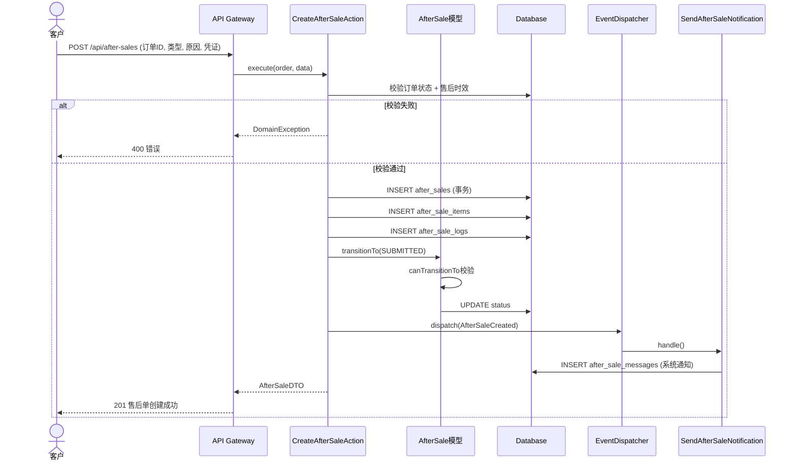
```mermaid
sequenceDiagram
    actor Customer as 客户
    participant API as API Gateway
    participant CreateAction as CreateAfterSaleAction
    participant AfterSale as AfterSale模型
    participant DB as Database
    participant Event as EventDispatcher
    participant Listener as SendAfterSaleNotification

    Customer->>API: POST /api/after-sales (订单ID, 类型, 原因, 凭证)
    API->>CreateAction: execute(order, data)
    CreateAction->>DB: 校验订单状态 + 售后时效
    alt 校验失败
        CreateAction-->>API: DomainException
        API-->>Customer: 400 错误
    else 校验通过
        CreateAction->>DB: INSERT after_sales (事务)
        CreateAction->>DB: INSERT after_sale_items
        CreateAction->>DB: INSERT after_sale_logs
        CreateAction->>AfterSale: transitionTo(SUBMITTED)
        AfterSale->>AfterSale: canTransitionTo校验
        AfterSale->>DB: UPDATE status
        CreateAction->>Event: dispatch(AfterSaleCreated)
        Event->>Listener: handle()
        Listener->>DB: INSERT after_sale_messages (系统通知)
        CreateAction-->>API: AfterSaleDTO
        API-->>Customer: 201 售后单创建成功
    end
```

#### 售后审核时序图

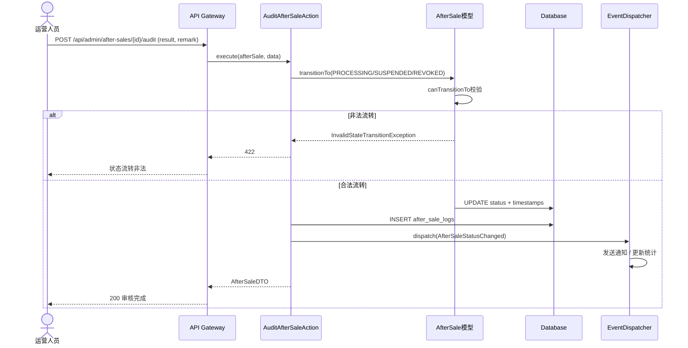
```mermaid
sequenceDiagram
    actor Admin as 运营人员
    participant API as API Gateway
    participant AuditAction as AuditAfterSaleAction
    participant AfterSale as AfterSale模型
    participant DB as Database
    participant Event as EventDispatcher

    Admin->>API: POST /api/admin/after-sales/{id}/audit (result, remark)
    API->>AuditAction: execute(afterSale, data)
    AuditAction->>AfterSale: transitionTo(PROCESSING/SUSPENDED/REVOKED)
    AfterSale->>AfterSale: canTransitionTo校验
    alt 非法流转
        AfterSale-->>AuditAction: InvalidStateTransitionException
        AuditAction-->>API: 422
        API-->>Admin: 状态流转非法
    else 合法流转
        AfterSale->>DB: UPDATE status + timestamps
        AuditAction->>DB: INSERT after_sale_logs
        AuditAction->>Event: dispatch(AfterSaleStatusChanged)
        Event->>Event: 发送通知 / 更新统计
        AuditAction-->>API: AfterSaleDTO
        API-->>Admin: 200 审核完成
    end
```

#### 退货物流 + 仓库验收时序图

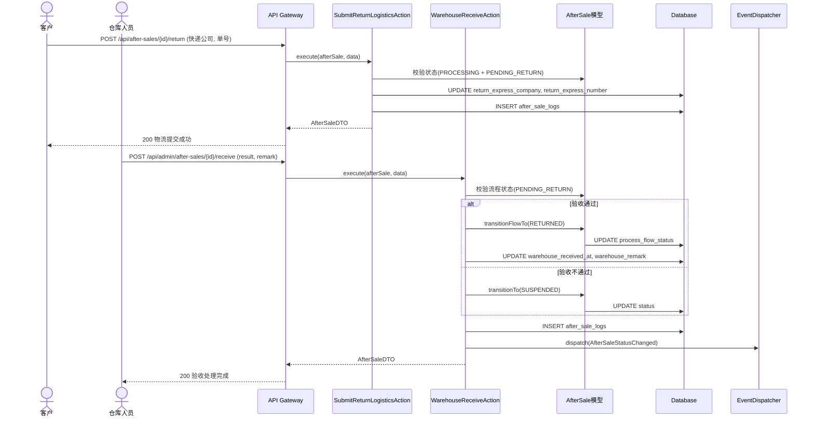
```mermaid
sequenceDiagram
    actor Customer as 客户
    actor Warehouse as 仓库人员
    participant API as API Gateway
    participant ReturnAction as SubmitReturnLogisticsAction
    participant ReceiveAction as WarehouseReceiveAction
    participant AfterSale as AfterSale模型
    participant DB as Database
    participant Event as EventDispatcher

    %% 客户提交物流
    Customer->>API: POST /api/after-sales/{id}/return (快递公司, 单号)
    API->>ReturnAction: execute(afterSale, data)
    ReturnAction->>AfterSale: 校验状态(PROCESSING + PENDING_RETURN)
    ReturnAction->>DB: UPDATE return_express_company, return_express_number
    ReturnAction->>DB: INSERT after_sale_logs
    ReturnAction-->>API: AfterSaleDTO
    API-->>Customer: 200 物流提交成功

    %% 仓库验收
    Warehouse->>API: POST /api/admin/after-sales/{id}/receive (result, remark)
    API->>ReceiveAction: execute(afterSale, data)
    ReceiveAction->>AfterSale: 校验流程状态(PENDING_RETURN)
    alt 验收通过
        ReceiveAction->>AfterSale: transitionFlowTo(RETURNED)
        AfterSale->>DB: UPDATE process_flow_status
        ReceiveAction->>DB: UPDATE warehouse_received_at, warehouse_remark
    else 验收不通过
        ReceiveAction->>AfterSale: transitionTo(SUSPENDED)
        AfterSale->>DB: UPDATE status
    end
    ReceiveAction->>DB: INSERT after_sale_logs
    ReceiveAction->>Event: dispatch(AfterSaleStatusChanged)
    ReceiveAction-->>API: AfterSaleDTO
    API-->>Warehouse: 200 验收处理完成
```

#### 自动关闭时序图（定时任务）

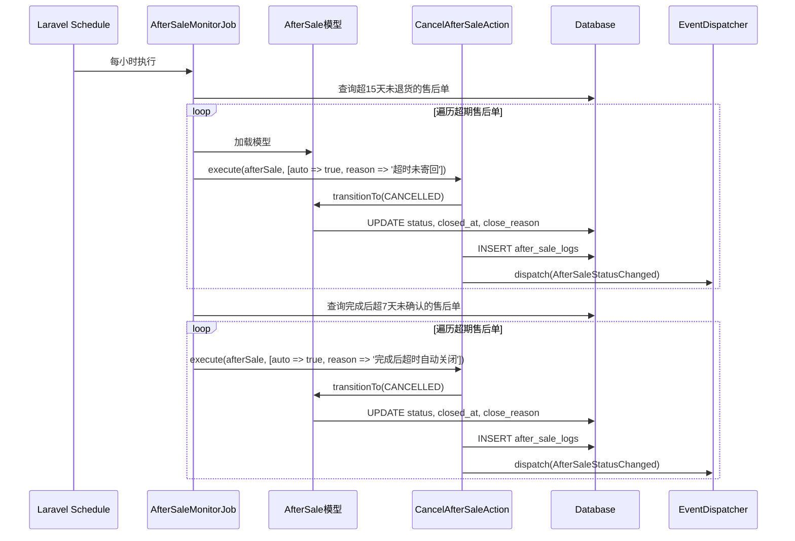
```mermaid
sequenceDiagram
    participant Schedule as Laravel Schedule
    participant Monitor as AfterSaleMonitorJob
    participant AfterSale as AfterSale模型
    participant CancelAction as CancelAfterSaleAction
    participant DB as Database
    participant Event as EventDispatcher

    Schedule->>Monitor: 每小时执行
    Monitor->>DB: 查询超15天未退货的售后单
    loop 遍历超期售后单
        Monitor->>AfterSale: 加载模型
        Monitor->>CancelAction: execute(afterSale, [auto => true, reason => '超时未寄回'])
        CancelAction->>AfterSale: transitionTo(CANCELLED)
        AfterSale->>DB: UPDATE status, closed_at, close_reason
        CancelAction->>DB: INSERT after_sale_logs
        CancelAction->>Event: dispatch(AfterSaleStatusChanged)
    end

    Monitor->>DB: 查询完成后超7天未确认的售后单
    loop 遍历超期售后单
        Monitor->>CancelAction: execute(afterSale, [auto => true, reason => '完成后超时自动关闭'])
        CancelAction->>AfterSale: transitionTo(CANCELLED)
        AfterSale->>DB: UPDATE status, closed_at, close_reason
        CancelAction->>DB: INSERT after_sale_logs
        CancelAction->>Event: dispatch(AfterSaleStatusChanged)
    end
```

#### SLA 超时预警时序图

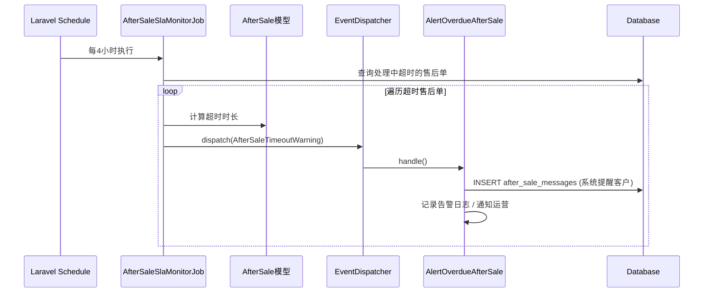
```mermaid
sequenceDiagram
    participant Schedule as Laravel Schedule
    participant SLAJob as AfterSaleSlaMonitorJob
    participant AfterSale as AfterSale模型
    participant Event as EventDispatcher
    participant Listener as AlertOverdueAfterSale
    participant DB as Database

    Schedule->>SLAJob: 每4小时执行
    SLAJob->>DB: 查询处理中超时的售后单
    loop 遍历超时售后单
        SLAJob->>AfterSale: 计算超时时长
        SLAJob->>Event: dispatch(AfterSaleTimeoutWarning)
        Event->>Listener: handle()
        Listener->>DB: INSERT after_sale_messages (系统提醒客户)
        Listener->>Listener: 记录告警日志 / 通知运营
    end
```

---

> **文档结束**
> 本补充章节完整覆盖 PRD 模块十四（FR-AFTER-001 ~ FR-AFTER-020）全部需求，与《怡安印刷商城-系统设计方案_PHP8.5_Laravel13.md》第4章枚举、第5章数据库架构、第6章业务逻辑保持严格一致。

---

## 6.41 物流与配送子系统设计 (LogisticsService)

> **技术栈**：PHP 8.5 + Laravel 13.x
> **设计原则**：第三方快递/专线物流为核心，多地址运费折扣，轨迹同步异步化，配送区域围栏化管理。
> **边界说明**：门店自营配送已在 6.14/6.39 中覆盖，本节聚焦第三方快递/专线物流。

---

### 6.41.1 设计概述

物流与配送子系统承担订单出仓后的全链路物流管理能力，核心设计原则如下：

1. **多地址运费折扣**：首地址按标准运费计算，附加地址享折扣（如 7 折），公式为 `totalFee = 首地址标准运费 + Σ(附加地址标准运费 × 折扣率)`。
2. **物流状态机内聚**：`DeliveryStatus` Backed Enum 提供 `canTransitionTo()` 与 `isTerminal()` 方法，禁止在 Service / Controller 中分散判断。
3. **轨迹同步异步化**：对接快递鸟/快递100/各家官方 API，通过 `SyncExpressTracksJob` 定时拉取，缓存 24 小时，超 48 小时无更新自动标记异常。
4. **配送区域围栏化**：大区+小区+多边形围栏（经纬度数组），支持地理编码与配送限制检查。
5. **专线与快递双轨**：`DeliveryType` 区分专线（自有物流）、快递（第三方）、云仓、门店自提，专线轨迹通过自有系统同步。
6. **金额统一 MoneyCast**：所有运费、费用字段使用 `MoneyCast`（分↔元），与订单系统保持一致。

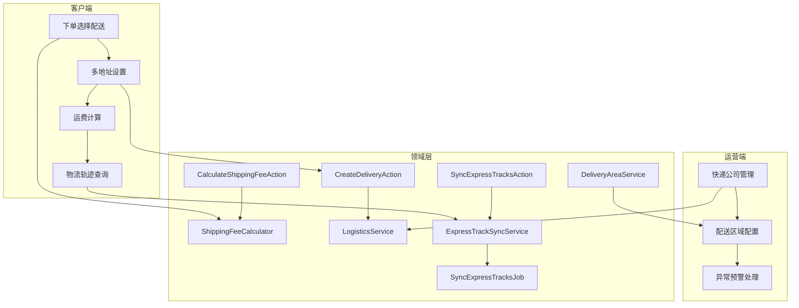
```mermaid
graph TB
    subgraph 客户端
        C1[下单选择配送] --> C2[多地址设置]
        C2 --> C3[运费计算]
        C3 --> C4[物流轨迹查询]
    end

    subgraph 运营端
        O1[快递公司管理] --> O2[配送区域配置]
        O2 --> O3[异常预警处理]
    end

    subgraph 领域层
        A1[CalculateShippingFeeAction] --> S1[ShippingFeeCalculator]
        A2[CreateDeliveryAction] --> S2[LogisticsService]
        A3[SyncExpressTracksAction] --> S3[ExpressTrackSyncService]
        S3 --> J1[SyncExpressTracksJob]
        S4[DeliveryAreaService] --> O2
    end

    C1 --> S1
    C2 --> A2
    C4 --> S3
    O1 --> S2
```

---

### 6.41.2 枚举定义

#### DeliveryStatus (物流状态)

```php
<?php

declare(strict_types=1);

namespace App\Enums;

/**
 * 物流状态枚举
 * PRD键名: order_deliveries.status
 * 0=待揽收 / 1=已揽收 / 2=运输中 / 3=派送中 / 4=已签收 / 5=异常 / 6=已退回
 */
enum DeliveryStatus: int
{
    case PENDING_PICKUP = 0;   // 待揽收
    case PICKED_UP      = 1;   // 已揽收
    case IN_TRANSIT     = 2;   // 运输中
    case OUT_FOR_DELIVERY = 3; // 派送中
    case DELIVERED      = 4;   // 已签收
    case EXCEPTION      = 5;   // 异常
    case RETURNED       = 6;   // 已退回

    public function label(): string
    {
        return match ($this) {
            self::PENDING_PICKUP   => '待揽收',
            self::PICKED_UP        => '已揽收',
            self::IN_TRANSIT       => '运输中',
            self::OUT_FOR_DELIVERY => '派送中',
            self::DELIVERED        => '已签收',
            self::EXCEPTION        => '异常',
            self::RETURNED         => '已退回',
        };
    }

    /**
     * 是否允许状态流转到目标状态
     */
    public function canTransitionTo(self $target): bool
    {
        return match ([$this, $target]) {
            // 待揽收 -> 已揽收 / 异常
            [self::PENDING_PICKUP, self::PICKED_UP],
            [self::PENDING_PICKUP, self::EXCEPTION] => true,

            // 已揽收 -> 运输中 / 异常
            [self::PICKED_UP, self::IN_TRANSIT],
            [self::PICKED_UP, self::EXCEPTION] => true,

            // 运输中 -> 派送中 / 异常 / 已退回
            [self::IN_TRANSIT, self::OUT_FOR_DELIVERY],
            [self::IN_TRANSIT, self::EXCEPTION],
            [self::IN_TRANSIT, self::RETURNED] => true,

            // 派送中 -> 已签收 / 异常 / 已退回
            [self::OUT_FOR_DELIVERY, self::DELIVERED],
            [self::OUT_FOR_DELIVERY, self::EXCEPTION],
            [self::OUT_FOR_DELIVERY, self::RETURNED] => true,

            // 异常 -> 运输中 / 已退回（恢复或退回）
            [self::EXCEPTION, self::IN_TRANSIT],
            [self::EXCEPTION, self::RETURNED] => true,

            // 已退回为终态
            default => false,
        };
    }

    /**
     * 是否为终态
     */
    public function isTerminal(): bool
    {
        return in_array($this, [self::DELIVERED, self::RETURNED], true);
    }

    /**
     * 映射为客户侧展示状态（对应 orders.out_status_name）
     */
    public function toCustomerOutStatus(): int
    {
        return match ($this) {
            self::PENDING_PICKUP   => 4, // 已发货
            self::PICKED_UP        => 4, // 已发货
            self::IN_TRANSIT       => 8, // 配送中
            self::OUT_FOR_DELIVERY => 8, // 配送中
            self::DELIVERED        => 9, // 已完成
            self::EXCEPTION        => 8, // 配送中（异常保持配送中，客服跟进）
            self::RETURNED         => 5, // 已取消（退回视同取消）
        };
    }
}
```

#### DeliveryType (配送方式)

> **注意**：本枚举已在 SDD 第 4.3 节（ch01）定义，此处完整复现以确保一致性。

```php
<?php

declare(strict_types=1);

namespace App\Enums;

/**
 * 配送方式枚举
 * PRD键名: iM / deliveryType
 * 0=专线 / 1=快递 / 2=云仓 / 3=门店自提
 */
enum DeliveryType: int
{
    case SPECIAL_LINE    = 0; // 专线物流
    case EXPRESS         = 1; // 快递
    case CLOUD_WAREHOUSE = 2; // 云仓
    case SELF_PICKUP     = 3; // 门店自提

    public function label(): string
    {
        return match ($this) {
            self::SPECIAL_LINE    => '专线物流',
            self::EXPRESS         => '快递',
            self::CLOUD_WAREHOUSE => '云仓配送',
            self::SELF_PICKUP     => '门店自提',
        };
    }

    /**
     * 是否为第三方快递（需要对接快递鸟/快递100）
     */
    public function isThirdPartyExpress(): bool
    {
        return $this === self::EXPRESS;
    }

    /**
     * 是否需要物流轨迹同步
     */
    public function requiresTrackSync(): bool
    {
        return in_array($this, [self::SPECIAL_LINE, self::EXPRESS, self::CLOUD_WAREHOUSE], true);
    }
}
```

#### ExpressCompany (快递公司)

```php
<?php

declare(strict_types=1);

namespace App\Enums;

/**
 * 快递公司枚举
 * PRD: 支持顺丰、圆通、中通等多家快递
 */
enum ExpressCompany: string
{
    case SF         = 'shunfeng';    // 顺丰速运
    case YTO        = 'yuantong';    // 圆通速递
    case ZTO        = 'zhongtong';   // 中通快递
    case STO        = 'shentong';    // 申通快递
    case EMS        = 'ems';         // EMS
    case YUNDA      = 'yunda';       // 韵达速递
    case JD         = 'jd';          // 京东物流
    case DEBANG     = 'debang';      // 德邦快递
    case JT         = 'jitu';        // 极兔速递
    case SPECIAL    = 'zhuanxian';   // 怡安专线（自有）

    public function label(): string
    {
        return match ($this) {
            self::SF      => '顺丰速运',
            self::YTO     => '圆通速递',
            self::ZTO     => '中通快递',
            self::STO     => '申通快递',
            self::EMS     => 'EMS',
            self::YUNDA   => '韵达速递',
            self::JD      => '京东物流',
            self::DEBANG  => '德邦快递',
            self::JT      => '极兔速递',
            self::SPECIAL => '怡安专线',
        };
    }

    /**
     * 快递鸟/快递100 对应的查询编码
     */
    public function queryCode(): string
    {
        return match ($this) {
            self::SF      => 'SF',
            self::YTO     => 'YTO',
            self::ZTO     => 'ZTO',
            self::STO     => 'STO',
            self::EMS     => 'EMS',
            self::YUNDA   => 'YD',
            self::JD      => 'JD',
            self::DEBANG  => 'DBK',
            self::JT      => 'JT',
            self::SPECIAL => 'YIAN',
        };
    }

    /**
     * 是否支持电子面单
     */
    public function supportsElectronicWaybill(): bool
    {
        return $this !== self::SPECIAL;
    }
}
```

#### DeliveryTimeliness (配送时效)

```php
<?php

declare(strict_types=1);

namespace App\Enums;

/**
 * 配送时效枚举（位掩码）
 * PRD键名: GM / deliveryTimeliness
 * 1=当日发 / 2=同城快递 / 4=半日达
 */
enum DeliveryTimeliness: int
{
    case SAME_DAY_SHIP  = 1; // 当日发
    case SAME_CITY      = 2; // 同城快递
    case HALF_DAY       = 4; // 半日达

    public function label(): string
    {
        return match ($this) {
            self::SAME_DAY_SHIP => '当日发',
            self::SAME_CITY     => '同城快递',
            self::HALF_DAY      => '半日达',
        };
    }

    /**
     * 解码位掩码为枚举数组
     */
    public static function decode(int $mask): array
    {
        $result = [];
        foreach (self::cases() as $case) {
            if ($mask & $case->value) {
                $result[] = $case;
            }
        }
        return $result;
    }

    /**
     * 编码枚举数组为位掩码
     */
    public static function encode(array $cases): int
    {
        $mask = 0;
        foreach ($cases as $case) {
            if ($case instanceof self) {
                $mask |= $case->value;
            }
        }
        return $mask;
    }

    /**
     * 位掩码是否包含当前标志
     */
    public function inMask(int $mask): bool
    {
        return (bool) ($mask & $this->value);
    }
}
```

#### AddressType (地址类型)

```php
<?php

declare(strict_types=1);

namespace App\Enums;

/**
 * 地址类型枚举
 * PRD: 0=收货地址 / 1=发票地址 / 2=退货地址
 */
enum AddressType: int
{
    case DELIVERY = 0; // 收货地址
    case INVOICE  = 1; // 发票地址
    case RETURN   = 2; // 退货地址

    public function label(): string
    {
        return match ($this) {
            self::DELIVERY => '收货地址',
            self::INVOICE  => '发票地址',
            self::RETURN   => '退货地址',
        };
    }
}
```

---

### 6.41.3 Migration

#### order_deliveries 表（与 6.5/6.7 节保持一致）

> **说明**：本表已在 SDD 5.2.31 节定义，此处复现以确保本章完整性，字段与索引完全一致。

```php
<?php

use Illuminate\Database\Migrations\Migration;
use Illuminate\Database\Schema\Blueprint;
use Illuminate\Support\Facades\Schema;

return new class extends Migration
{
    public function up(): void
    {
        Schema::create('order_deliveries', function (Blueprint $table) {
            $table->id()->comment('物流主键');
            $table->foreignId('order_id')->constrained('orders')->comment('订单ID');
            $table->string('express_company', 64)->nullable()->comment('快递公司');
            $table->string('tracking_no', 64)->nullable()->comment('快递单号/物流单号');
            $table->tinyInteger('delivery_type')->default(1)->comment('配送方式: 0专线 1快递 2云仓 3门店自提');
            $table->tinyInteger('status')->default(0)->comment('物流状态: 0待揽收 1已揽收 2运输中 3派送中 4已签收 5异常 6已退回');
            $table->tinyInteger('factory_code')->nullable()->comment('发货工厂代码(dM)');
            $table->timestamp('delivery_time')->nullable()->comment('预计配送时间');
            $table->timestamp('signed_at')->nullable()->comment('签收时间');
            $table->string('sign_image', 500)->nullable()->comment('电子签名图片URL');
            $table->tinyInteger('sign_type')->default(0)->comment('签收方式: 0本人签收 1代收 2电子签名');
            $table->string('signer_name', 50)->nullable()->comment('签收人姓名');
            $table->timestamps();

            $table->index('order_id', 'idx_order_id');
            $table->index('tracking_no', 'idx_tracking_no');
            $table->index('status', 'idx_status');
            $table->index('factory_code', 'idx_factory_code');
            $table->index('delivery_type', 'idx_delivery_type');
            $table->index(['order_id', 'delivery_type'], 'idx_order_delivery_type');
        });
    }

    public function down(): void
    {
        Schema::dropIfExists('order_deliveries');
    }
};
```

#### order_multi_deliveries 表（多地址配送）

```php
<?php

use Illuminate\Database\Migrations\Migration;
use Illuminate\Database\Schema\Blueprint;
use Illuminate\Support\Facades\Schema;

return new class extends Migration
{
    public function up(): void
    {
        Schema::create('order_multi_deliveries', function (Blueprint $table) {
            $table->id()->comment('多地址配送主键');
            $table->foreignId('order_id')->constrained('orders')->comment('订单ID');
            $table->unsignedBigInteger('address_id')->comment('地址ID（customer_addresses.id）');
            $table->string('receiver_name', 64)->comment('收件人');
            $table->string('phone', 32)->comment('电话');
            $table->string('province_name', 64)->comment('省份');
            $table->string('city_name', 64)->comment('城市');
            $table->string('county_name', 64)->comment('区县');
            $table->string('detail_address', 255)->comment('详细地址');
            $table->integer('quantity')->default(0)->comment('该地址配送数量');
            $table->bigInteger('fee')->default(0)->comment('该地址运费（单位：分）');
            $table->decimal('discount_rate', 3, 2)->default(1.00)->comment('运费折扣率（如0.70表示7折）');
            $table->string('express_company', 64)->nullable()->comment('快递公司');
            $table->string('tracking_no', 64)->nullable()->comment('运单号');
            $table->tinyInteger('status')->default(0)->comment('物流状态: 0待揽收 1已揽收 2运输中 3派送中 4已签收 5异常 6已退回');
            $table->tinyInteger('ship_status')->default(0)->comment('发货状态: 0待发货 1已发货 2已揽收');
            $table->tinyInteger('is_primary')->default(0)->comment('是否首地址: 0否 1是');
            $table->timestamp('shipped_at')->nullable()->comment('发货时间');
            $table->timestamp('signed_at')->nullable()->comment('签收时间');
            $table->string('sign_image', 500)->nullable()->comment('电子签名图片URL');
            $table->tinyInteger('sign_type')->default(0)->comment('签收方式: 0本人签收 1代收 2电子签名');
            $table->string('signer_name', 50)->nullable()->comment('签收人姓名');
            $table->timestamps();

            $table->index('order_id', 'idx_order_id');
            $table->index('address_id', 'idx_address_id');
            $table->index('tracking_no', 'idx_tracking_no');
            $table->index(['order_id', 'is_primary'], 'idx_order_primary');
        });
    }

    public function down(): void
    {
        Schema::dropIfExists('order_multi_deliveries');
    }
};
```

#### express_companies 表（快递公司配置）

```php
<?php

use Illuminate\Database\Migrations\Migration;
use Illuminate\Database\Schema\Blueprint;
use Illuminate\Support\Facades\Schema;

return new class extends Migration
{
    public function up(): void
    {
        Schema::create('express_companies', function (Blueprint $table) {
            $table->id()->comment('主键');
            $table->string('code', 32)->unique()->comment('唯一编码（如 shunfeng/yuantong）');
            $table->string('name', 64)->comment('快递公司名称');
            $table->string('query_code', 32)->comment('快递鸟/快递100查询编码');
            $table->string('official_api', 128)->nullable()->comment('官方API地址');
            $table->json('config')->nullable()->comment('配置JSON（appKey/secret等）');
            $table->string('app_key', 100)->nullable()->comment('快递鸟/快递100 appKey');
            $table->string('app_secret', 100)->nullable()->comment('API密钥');
            $table->decimal('rate_coefficient', 3, 2)->default(1.00)->comment('费率系数（如顺丰1.5）');
            $table->unsignedSmallInteger('volumetric_ratio')->default(6000)->comment('体积重量抛比系数（如6000/8000）');
            $table->boolean('is_enabled')->default(true)->comment('是否启用');
            $table->boolean('is_default')->default(false)->comment('是否默认快递');
            $table->integer('sort_order')->default(0)->comment('排序');
            $table->timestamps();

            $table->index('code', 'idx_code');
            $table->index('is_enabled', 'idx_is_enabled');
            $table->index(['is_enabled', 'is_default']);
        });
    }

    public function down(): void
    {
        Schema::dropIfExists('express_companies');
    }
};
```

#### delivery_areas 表（配送区域管理）

```php
<?php

use Illuminate\Database\Migrations\Migration;
use Illuminate\Database\Schema\Blueprint;
use Illuminate\Support\Facades\Schema;

return new class extends Migration
{
    public function up(): void
    {
        Schema::create('delivery_areas', function (Blueprint $table) {
            $table->id()->comment('区域主键');
            $table->string('big_area_name', 64)->comment('配送大区名称（如淮安淮安）');
            $table->string('special_line', 128)->nullable()->comment('专线名称（如永城-淮安专线）');
            $table->string('sorting_area', 32)->nullable()->comment('分拣区编号（如A66）');
            $table->tinyInteger('delivery_level')->default(1)->comment('配送等级');
            $table->string('small_area_name', 64)->comment('小区名称');
            $table->json('polygon')->nullable()->comment('多边形围栏坐标（经纬度数组）');
            $table->decimal('min_lng', 10, 6)->nullable()->comment('围栏最小经度（包围盒预过滤）');
            $table->decimal('max_lng', 10, 6)->nullable()->comment('围栏最大经度');
            $table->decimal('min_lat', 10, 6)->nullable()->comment('围栏最小纬度');
            $table->decimal('max_lat', 10, 6)->nullable()->comment('围栏最大纬度');
            $table->integer('delivery_days')->default(1)->comment('预计配送天数');
            $table->tinyInteger('factory_code')->nullable()->comment('关联工厂代码(dM)');
            $table->boolean('is_enabled')->default(true)->comment('是否启用');
            $table->timestamps();

            $table->index('big_area_name', 'idx_big_area');
            $table->index('small_area_name', 'idx_small_area');
            $table->index('factory_code', 'idx_factory_code');
            $table->index('is_enabled', 'idx_is_enabled');
            $table->index(['min_lng', 'max_lng', 'min_lat', 'max_lat'], 'idx_bbox');
        });
    }

    public function down(): void
    {
        Schema::dropIfExists('delivery_areas');
    }
};
```

#### express_tracks 表（物流轨迹）

```php
<?php

use Illuminate\Database\Migrations\Migration;
use Illuminate\Database\Schema\Blueprint;
use Illuminate\Support\Facades\Schema;

return new class extends Migration
{
    public function up(): void
    {
        Schema::create('express_tracks', function (Blueprint $table) {
            $table->id()->comment('轨迹主键');
            $table->foreignId('order_id')->constrained('orders')->comment('订单ID');
            $table->foreignId('order_delivery_id')->nullable()->constrained('order_deliveries')->comment('物流单ID');
            $table->string('express_company', 64)->comment('快递公司编码');
            $table->string('tracking_no', 64)->comment('快递单号');
            $table->tinyInteger('status')->default(0)->comment('轨迹状态: 0运输中 1已签收 2异常');
            $table->json('tracks')->nullable()->comment('轨迹明细JSON数组（时间/地点/状态/操作员）');
            $table->timestamp('last_event_at')->nullable()->comment('最后事件时间');
            $table->timestamp('synced_at')->nullable()->comment('同步时间');
            $table->timestamp('cached_until')->nullable()->comment('缓存过期时间（默认24小时）');
            $table->timestamps();

            $table->index('order_id', 'idx_order_id');
            $table->index('tracking_no', 'idx_tracking_no');
            $table->index('status', 'idx_status');
            $table->index('cached_until', 'idx_cached_until');
            $table->index(['express_company', 'tracking_no'], 'idx_company_tracking');
        });
    }

    public function down(): void
    {
        Schema::dropIfExists('express_tracks');
    }
};
```

#### internal_logistics_tracks 表（专线自有轨迹）

```php
<?php

declare(strict_types=1);

use Illuminate\Database\Migrations\Migration;
use Illuminate\Database\Schema\Blueprint;
use Illuminate\Support\Facades\Schema;

return new class extends Migration
{
    public function up(): void
    {
        Schema::create('internal_logistics_tracks', function (Blueprint $table) {
            $table->id()->comment('轨迹主键');
            $table->foreignId('order_id')->constrained('orders')->comment('关联订单ID');
            $table->string('tracking_no', 64)->comment('运单号（专线系统单号）');
            $table->timestamp('event_time')->comment('轨迹事件发生时间');
            $table->string('location', 255)->nullable()->comment('轨迹地点');
            $table->string('status', 32)->comment('轨迹状态: pending/picked/transit/delivering/signed/exception/returned');
            $table->string('operator_name', 128)->nullable()->comment('操作员/网点名称');
            $table->string('operator_phone', 20)->nullable()->comment('操作员联系电话');
            $table->string('vehicle_no', 32)->nullable()->comment('车辆编号（专线自有车辆）');
            $table->decimal('latitude', 10, 7)->nullable()->comment('纬度');
            $table->decimal('longitude', 10, 7)->nullable()->comment('经度');
            $table->text('remark')->nullable()->comment('备注');
            $table->json('raw_data')->nullable()->comment('专线系统原始轨迹数据');
            $table->unsignedBigInteger('created_by')->nullable()->comment('录入人ID（0=系统同步）');
            $table->timestamps();

            // 索引
            $table->index('order_id', 'idx_order_id');
            $table->index('tracking_no', 'idx_tracking_no');
            $table->index(['tracking_no', 'event_time'], 'idx_tracking_event_time');
            $table->index('status', 'idx_status');
            $table->index('event_time', 'idx_event_time');
        });
    }

    public function down(): void
    {
        Schema::dropIfExists('internal_logistics_tracks');
    }
};
```

---

### 6.41.4 Eloquent 模型

#### OrderDelivery 模型

> **说明**：本模型已在 SDD 5.2.31 节定义，此处复现完整字段与关联，新增 `transitionTo()` 状态流转方法。

```php
<?php

declare(strict_types=1);

namespace App\Domains\Logistics\Models;

use App\Domains\Common\Castables\MoneyCast;
use App\Enums\DeliveryStatus;
use App\Models\Order;
use Illuminate\Database\Eloquent\Factories\HasFactory;
use Illuminate\Database\Eloquent\Model;
use Illuminate\Database\Eloquent\Relations\BelongsTo;
use Illuminate\Database\Eloquent\Relations\HasMany;

class OrderDelivery extends Model
{
    use HasFactory;

    protected $table = 'order_deliveries';

    protected $fillable = [
        'order_id', 'express_company', 'tracking_no', 'status',
        'factory_code', 'delivery_time', 'signed_at',
        'sign_image', 'sign_type', 'signer_name',
    ];

    protected $casts = [
        'status'        => DeliveryStatus::class,
        'factory_code'  => 'integer',
        'delivery_time' => 'datetime',
        'signed_at'     => 'datetime',
    ];

    public function order(): BelongsTo
    {
        return $this->belongsTo(Order::class, 'order_id');
    }

    public function expressTracks(): HasMany
    {
        return $this->hasMany(ExpressTrack::class, 'order_delivery_id');
    }

    /**
     * 状态流转（带合法性校验）
     *
     * @throws \InvalidArgumentException
     */
    public function transitionTo(DeliveryStatus $target, ?string $remark = null): void
    {
        $current = $this->status;

        if (! $current->canTransitionTo($target)) {
            throw new \InvalidArgumentException(
                "物流单 {$this->tracking_no} 不允许从 {$current->label()} 流转到 {$target->label()}"
            );
        }

        $this->update([
            'status'    => $target,
            'signed_at' => $target === DeliveryStatus::DELIVERED ? now() : $this->signed_at,
        ]);

        // 触发物流状态变更事件
        event(new \App\Domains\Logistics\Events\DeliveryStatusChanged($this, $current, $target, $remark));
    }

    /**
     * 查询作用域：待揽收
     */
    public function scopePendingPickup($query)
    {
        return $query->where('status', DeliveryStatus::PENDING_PICKUP);
    }

    /**
     * 查询作用域：运输中（含已揽收、运输中、派送中）
     */
    public function scopeInTransit($query)
    {
        return $query->whereIn('status', [
            DeliveryStatus::PICKED_UP->value,
            DeliveryStatus::IN_TRANSIT->value,
            DeliveryStatus::OUT_FOR_DELIVERY->value,
        ]);
    }

    /**
     * 查询作用域：异常
     */
    public function scopeException($query)
    {
        return $query->where('status', DeliveryStatus::EXCEPTION);
    }
}
```

#### OrderMultiDelivery 模型

```php
<?php

declare(strict_types=1);

namespace App\Domains\Logistics\Models;

use App\Domains\Common\Castables\MoneyCast;
use App\Enums\DeliveryStatus;
use App\Models\Order;
use Illuminate\Database\Eloquent\Model;
use Illuminate\Database\Eloquent\Relations\BelongsTo;

class OrderMultiDelivery extends Model
{
    protected $table = 'order_multi_deliveries';

    protected $fillable = [
        'order_id', 'address_id', 'receiver_name', 'phone',
        'province_name', 'city_name', 'county_name', 'detail_address',
        'quantity', 'fee', 'discount_rate', 'express_company', 'tracking_no',
        'status', 'ship_status', 'is_primary', 'shipped_at', 'signed_at',
        'sign_image', 'sign_type', 'signer_name',
    ];

    protected $casts = [
        'order_id'      => 'integer',
        'address_id'    => 'integer',
        'quantity'      => 'integer',
        'fee'           => MoneyCast::class,
        'discount_rate' => MoneyCast::class,
        'status'        => DeliveryStatus::class,
        'is_primary'    => 'boolean',
        'shipped_at'    => 'datetime',
        'signed_at'     => 'datetime',
    ];

    public function order(): BelongsTo
    {
        return $this->belongsTo(Order::class, 'order_id');
    }

    /**
     * 是否为首地址
     */
    public function isPrimary(): bool
    {
        return $this->is_primary;
    }

    /**
     * 计算折扣后运费（元）
     */
    public function discountedFee(): float
    {
        return $this->fee->toFloat() * (float) $this->discount_rate;
    }
}
```

#### ExpressTrack 模型

```php
<?php

declare(strict_types=1);

namespace App\Domains\Logistics\Models;

use App\Enums\DeliveryStatus;
use App\Models\Order;
use Illuminate\Database\Eloquent\Model;
use Illuminate\Database\Eloquent\Relations\BelongsTo;

class ExpressTrack extends Model
{
    protected $table = 'express_tracks';

    protected $fillable = [
        'order_id', 'order_delivery_id', 'express_company', 'tracking_no',
        'status', 'tracks', 'last_event_at', 'synced_at', 'cached_until',
    ];

    protected $casts = [
        'status'       => DeliveryStatus::class,
        'tracks'       => 'array',
        'last_event_at' => 'datetime',
        'synced_at'    => 'datetime',
        'cached_until' => 'datetime',
    ];

    public function order(): BelongsTo
    {
        return $this->belongsTo(Order::class, 'order_id');
    }

    public function orderDelivery(): BelongsTo
    {
        return $this->belongsTo(OrderDelivery::class, 'order_delivery_id');
    }

    /**
     * 查询作用域：缓存已过期
     */
    public function scopeCacheExpired($query)
    {
        return $query->where(function ($q) {
            $q->whereNull('cached_until')
              ->orWhere('cached_until', '<=', now());
        });
    }

    /**
     * 查询作用域：超48小时无更新
     */
    public function scopeStale($query, int $hours = 48)
    {
        return $query->whereNotNull('last_event_at')
                     ->where('last_event_at', '<=', now()->subHours($hours))
                     ->where('status', '!=', DeliveryStatus::DELIVERED);
    }

    /**
     * 刷新缓存过期时间（默认24小时）
     */
    public function refreshCache(int $ttlHours = 24): void
    {
        $this->update(['cached_until' => now()->addHours($ttlHours)]);
    }
}
```

---

### 6.41.5 Action 类

#### CalculateShippingFeeAction

```php
<?php

declare(strict_types=1);

namespace App\Domains\Logistics\Actions;

use App\Domains\Common\ValueObjects\Money;
use App\Domains\Logistics\Models\OrderMultiDelivery;
use App\Domains\Logistics\Services\ShippingFeeCalculator;
use App\Models\Order;

/**
 * 计算运费 Action
 * FR-LOG-002 / FR-LOG-022-A / FR-LOG-022-C
 */
class CalculateShippingFeeAction
{
    public function __construct(
        private ShippingFeeCalculator $calculator,
    ) {}

    /**
     * 执行运费计算
     *
     * @param Order $order 订单
     * @param array $addresses 地址数组，每项含 address_id, quantity, province_name, city_name...
     * @param float $additionalDiscountRate 附加地址折扣率（默认0.7即7折）
     * @return array {
     *   perAddressFee: array, // 每个地址的运费明细
     *   totalFee: Money,      // 总运费
     * }
     */
    public function execute(Order $order, array $addresses, float $additionalDiscountRate = 0.7): array
    {
        $perAddressFee = [];
        $totalFee = Money::zero();

        foreach ($addresses as $index => $address) {
            $isPrimary = $index === 0;
            $baseFee = $this->calculator->calculate(
                order: $order,
                province: $address['province_name'] ?? '',
                city: $address['city_name'] ?? '',
                county: $address['county_name'] ?? '',
                weight: $order->weight ?? 0,
                quantity: $address['quantity'] ?? 1,
            );

            $discountRate = $isPrimary ? 1.0 : $additionalDiscountRate;
            $discountedFee = $baseFee->multiply($discountRate);

            $perAddressFee[] = [
                'address_id'     => $address['address_id'] ?? null,
                'is_primary'     => $isPrimary,
                'base_fee'       => $baseFee,
                'discount_rate'  => $discountRate,
                'discounted_fee' => $discountedFee,
            ];

            $totalFee = $totalFee->add($discountedFee);
        }

        return [
            'perAddressFee' => $perAddressFee,
            'totalFee'      => $totalFee,
        ];
    }
}
```

#### CreateDeliveryAction

```php
<?php

declare(strict_types=1);

namespace App\Domains\Logistics\Actions;

use App\Domains\Logistics\Models\OrderDelivery;
use App\Domains\Logistics\Models\OrderMultiDelivery;
use App\Enums\DeliveryStatus;
use App\Models\Order;
use Illuminate\Support\Facades\DB;

/**
 * 创建物流单 Action
 * 支持单地址与多地址配送
 */
class CreateDeliveryAction
{
    /**
     * 创建主物流单
     */
    public function execute(
        Order $order,
        string $expressCompany,
        ?string $trackingNo = null,
        ?int $factoryCode = null,
    ): OrderDelivery {
        return DB::transaction(function () use ($order, $expressCompany, $trackingNo, $factoryCode) {
            $delivery = OrderDelivery::create([
                'order_id'        => $order->id,
                'express_company' => $expressCompany,
                'tracking_no'     => $trackingNo,
                'status'          => DeliveryStatus::PENDING_PICKUP,
                'factory_code'    => $factoryCode,
                'delivery_time'   => $this->estimateDeliveryTime($order),
            ]);

            return $delivery;
        });
    }

    /**
     * 创建多地址配送记录
     *
     * @param Order $order
     * @param array $addresses 地址明细数组
     */
    public function executeMulti(Order $order, array $addresses): void
    {
        DB::transaction(function () use ($order, $addresses) {
            OrderMultiDelivery::where('order_id', $order->id)->delete();

            foreach ($addresses as $index => $addr) {
                OrderMultiDelivery::create([
                    'order_id'        => $order->id,
                    'address_id'      => $addr['address_id'],
                    'receiver_name'   => $addr['receiver_name'],
                    'phone'           => $addr['phone'],
                    'province_name'   => $addr['province_name'],
                    'city_name'       => $addr['city_name'],
                    'county_name'     => $addr['county_name'],
                    'detail_address'  => $addr['detail_address'],
                    'quantity'        => $addr['quantity'] ?? 0,
                    'fee'             => $addr['fee'] ?? 0,
                    'discount_rate'   => $addr['discount_rate'] ?? ($index === 0 ? 1.0 : 0.7),
                    'express_company' => $addr['express_company'] ?? null,
                    'tracking_no'     => $addr['tracking_no'] ?? null,
                    'status'          => DeliveryStatus::PENDING_PICKUP,
                    'is_primary'      => $index === 0,
                ]);
            }
        });
    }

    /**
     * 预估配送时间（根据配送区域与时效）
     */
    private function estimateDeliveryTime(Order $order): ?\Carbon\Carbon
    {
        // 从配送区域服务获取预计天数
        $days = app(\App\Domains\Logistics\Services\DeliveryAreaService::class)
            ->getDeliveryDays($order->province_name, $order->city_name);

        return $days ? now()->addDays($days) : null;
    }
}
```

#### UpdateExpressTrackAction

```php
<?php

declare(strict_types=1);

namespace App\Domains\Logistics\Actions;

use App\Domains\Logistics\Models\ExpressTrack;
use App\Enums\DeliveryStatus;

/**
 * 更新物流轨迹 Action
 * 由 SyncExpressTracksJob 调用
 */
class UpdateExpressTrackAction
{
    /**
     * 执行轨迹更新
     *
     * @param ExpressTrack $expressTrack
     * @param array $tracks 从第三方API拉取的轨迹数组
     * @param DeliveryStatus $latestStatus 最新状态
     */
    public function execute(
        ExpressTrack $expressTrack,
        array $tracks,
        DeliveryStatus $latestStatus,
    ): void {
        $lastEvent = $tracks[0] ?? null;

        $expressTrack->update([
            'tracks'        => $tracks,
            'status'        => $latestStatus,
            'last_event_at' => $lastEvent['time'] ?? now(),
            'synced_at'     => now(),
        ]);

        $expressTrack->refreshCache();

        // 同步更新 order_deliveries 状态
        if ($expressTrack->orderDelivery) {
            $current = $expressTrack->orderDelivery->status;
            if ($current->canTransitionTo($latestStatus)) {
                $expressTrack->orderDelivery->transitionTo($latestStatus);
            }
        }

        // 触发轨迹更新事件
        event(new \App\Domains\Logistics\Events\ExpressTrackUpdated($expressTrack, $latestStatus));
    }
}
```

#### SyncExpressTracksAction

```php
<?php

declare(strict_types=1);

namespace App\Domains\Logistics\Actions;

use App\Domains\Logistics\Models\ExpressTrack;
use App\Domains\Logistics\Services\ExpressTrackSyncService;
use App\Enums\DeliveryStatus;

/**
 * 批量同步物流轨迹 Action
 * 由定时任务或命令调用
 */
class SyncExpressTracksAction
{
    public function __construct(
        private ExpressTrackSyncService $syncService,
        private UpdateExpressTrackAction $updateAction,
    ) {}

    /**
     * 执行批量同步
     *
     * @param int $batchSize 每批处理数量
     * @return array { synced: int, failed: int }
     */
    public function execute(int $batchSize = 50): array
    {
        $tracks = ExpressTrack::cacheExpired()
            ->whereNotIn('status', [
                DeliveryStatus::DELIVERED->value,
                DeliveryStatus::RETURNED->value,
            ])
            ->limit($batchSize)
            ->get();

        $synced = 0;
        $failed = 0;

        foreach ($tracks as $expressTrack) {
            try {
                $result = $this->syncService->fetch(
                    company: $expressTrack->express_company,
                    trackingNo: $expressTrack->tracking_no,
                );

                if ($result !== null) {
                    $this->updateAction->execute(
                        $expressTrack,
                        $result['tracks'],
                        $result['status'],
                    );
                    $synced++;
                }
            } catch (\Throwable $e) {
                \Illuminate\Support\Facades\Log::error('物流轨迹同步失败', [
                    'tracking_no' => $expressTrack->tracking_no,
                    'error'       => $e->getMessage(),
                ]);
                $failed++;
            }
        }

        return ['synced' => $synced, 'failed' => $failed];
    }
}
```

---

### 6.41.6 Service 类

#### LogisticsService

```php
<?php

declare(strict_types=1);

namespace App\Domains\Logistics\Services;

use App\Domains\Logistics\Actions\CreateDeliveryAction;
use App\Domains\Logistics\Models\ExpressTrack;
use App\Domains\Logistics\Models\OrderDelivery;
use App\Domains\Logistics\Models\OrderMultiDelivery;
use App\Enums\DeliveryStatus;
use App\Enums\ExpressCompany;
use App\Models\Order;

/**
 * 物流服务入口
 * 封装物流查询、创建、轨迹获取等高层能力
 */
class LogisticsService
{
    public function __construct(
        private ShippingFeeCalculator $feeCalculator,
        private DeliveryAreaService $areaService,
        private ExpressTrackSyncService $trackSyncService,
        private CreateDeliveryAction $createDeliveryAction,
    ) {}

    /**
     * 最优物流推荐
     * FR-LOG-001
     */
    public function recommendBestDelivery(Order $order, array $addresses): ?array
    {
        $candidates = [];
        $enabledCompanies = \Illuminate\Support\Facades\DB::table('express_companies')
            ->where('is_enabled', true)
            ->pluck('code')
            ->toArray();

        foreach (ExpressCompany::cases() as $company) {
            if (! in_array($company->value, $enabledCompanies, true)) {
                continue;
            }

            $feeResult = $this->feeCalculator->calculateForAddresses($order, $addresses, $company);
            $days = $this->areaService->getDeliveryDays(
                $addresses[0]['province_name'] ?? '',
                $addresses[0]['city_name'] ?? ''
            );

            $candidates[] = [
                'company'       => $company->value,
                'company_name'  => $company->label(),
                'fee'           => $feeResult['totalFee'],
                'estimated_days'=> $days,
                'score'         => $this->scoreDelivery($feeResult['totalFee']->toFloat(), $days),
            ];
        }

        // 按综合评分排序（费用低、时效快得分高）
        usort($candidates, fn ($a, $b) => $b['score'] <=> $a['score']);

        return $candidates[0] ?? null;
    }

    /**
     * 获取物流轨迹（优先缓存，缓存失效则触发异步同步）
     * FR-LOG-008
     */
    public function getExpressTracks(string $orderSn): ?ExpressTrack
    {
        $order = Order::where('order_no', $orderSn)->first();
        if (! $order) {
            return null;
        }

        $track = ExpressTrack::where('order_id', $order->id)->first();

        if (! $track || $track->cacheExpired()->exists()) {
            // 触发异步同步
            \App\Jobs\Logistics\SyncExpressTracksJob::dispatch($order->id);
        }

        return $track;
    }

    /**
     * 获取快递信息列表
     * FR-LOG-009 / FR-LOG-038
     */
    public function getExpressInfos(): array
    {
        return array_map(fn (ExpressCompany $c) => [
            'code'        => $c->value,
            'name'        => $c->label(),
            'query_code'  => $c->queryCode(),
            'supports_electronic_waybill' => $c->supportsElectronicWaybill(),
        ], ExpressCompany::cases());
    }

    /**
     * 获取仅快递列表（排除专线和自提）
     * FR-LOG-039
     */
    public function getOnlyExpresses(): array
    {
        return array_filter($this->getExpressInfos(), fn ($c) => $c['code'] !== 'zhuanxian');
    }

    /**
     * 获取快递员信息
     * FR-LOG-005
     */
    public function getDeliveryMan(int $orderId): ?array
    {
        $delivery = OrderDelivery::where('order_id', $orderId)
            ->where('status', DeliveryStatus::OUT_FOR_DELIVERY)
            ->first();

        if (! $delivery) {
            return null;
        }

        // 从第三方API或自有系统获取快递员信息
        return $this->trackSyncService->getDeliveryManInfo(
            $delivery->express_company,
            $delivery->tracking_no
        );
    }

    /**
     * 获取工厂信息
     * FR-LOG-006
     */
    public function getFactories(): array
    {
        return \App\Models\Factory::all()
            ->map(fn ($f) => [
                'code' => $f->code,
                'name' => $f->name,
                'address' => $f->address,
                'lnglat' => $f->lnglat,
            ])
            ->toArray();
    }

    /**
     * 获取专属客户经理
     * FR-LOG-007
     */
    public function getCustomerManager(int $customerId): ?array
    {
        $customer = \App\Models\Customer::find($customerId);
        if (! $customer || ! $customer->manager_id) {
            return null;
        }

        $manager = \App\Models\AdminUser::find($customer->manager_id);
        return $manager ? [
            'id'       => $manager->id,
            'name'     => $manager->name,
            'phone'    => $manager->phone,
            'avatar'   => $manager->avatar,
        ] : null;
    }

    /**
     * 配送限制检查
     * FR-LOG-036
     */
    public function checkDeliveryLimit(string $province, string $city, string $county = ''): array
    {
        $area = $this->areaService->findArea($province, $city, $county);

        if (! $area || ! $area->is_enabled) {
            return [
                'allow'   => false,
                'message' => '当前地址超出配送范围',
            ];
        }

        return [
            'allow'         => true,
            'delivery_days' => $area->delivery_days,
            'factory_code'  => $area->factory_code,
        ];
    }

    /**
     * 根据交易ID查询物流
     * FR-LOG-040
     */
    public function getTradeByTid(string $platformOrderId): ?array
    {
        $platformOrder = \App\Models\PlatformOrder::where('platform_order_id', $platformOrderId)->first();
        if (! $platformOrder) {
            return null;
        }

        $order = Order::find($platformOrder->order_id);
        if (! $order) {
            return null;
        }

        return [
            'order'     => $order->toArray(),
            'delivery'  => OrderDelivery::where('order_id', $order->id)->get()->toArray(),
            'tracks'    => ExpressTrack::where('order_id', $order->id)->get()->toArray(),
        ];
    }

    /**
     * 综合评分算法（费用权重60%，时效权重40%）
     */
    private function scoreDelivery(float $fee, ?int $days): float
    {
        $feeScore = max(0, 100 - $fee); // 费用越低得分越高
        $daysScore = $days ? max(0, 100 - $days * 20) : 50; // 天数越少得分越高

        return $feeScore * 0.6 + $daysScore * 0.4;
    }
}
```

#### ShippingFeeCalculator

```php
<?php

declare(strict_types=1);

namespace App\Domains\Logistics\Services;

use App\Domains\Common\ValueObjects\Money;
use App\Enums\ExpressCompany;
use App\Models\Order;

/**
 * 运费计算服务
 * FR-LOG-002 / FR-LOG-022-A / FR-LOG-022-C
 */
class ShippingFeeCalculator
{
    /**
     * 基础运费计算（单地址）
     *
     * @param Order $order
     * @param string $province
     * @param string $city
     * @param string $county
     * @param float $weight 重量(kg)
     * @param int $quantity 数量
     * @param ExpressCompany|null $company 指定快递公司
     * @return Money 运费（分）
     */
    public function calculate(
        Order $order,
        string $province,
        string $city,
        string $county = '',
        float $weight = 0,
        ?float $volume = null,
        int $quantity = 1,
        ?ExpressCompany $company = null,
        ?int $expressCompanyId = null,
    ): Money {
        // 1. 从配送区域获取基础运费系数
        $area = app(DeliveryAreaService::class)->findArea($province, $city, $county);
        $baseRate = $area ? $area->delivery_level * 100 : 1000; // 默认10元

        // 2. 体积重量换算（印刷品体积大但重量轻的场景）
        $chargeableWeight = $weight;
        if ($volume !== null && $volume > 0) {
            $ratio = 6000; // 默认抛比系数
            if ($expressCompanyId !== null) {
                $cfg = \Illuminate\Support\Facades\DB::table('express_companies')
                    ->where('id', $expressCompanyId)
                    ->value('volumetric_ratio');
                $ratio = $cfg ?? 6000;
            }
            $volumetricWeight = $this->getVolumetricWeight($volume, $ratio);
            $chargeableWeight = max($weight, $volumetricWeight);
        }

        // 3. 重量加价（每公斤加2元，按计费重量）
        $weightFee = (int) ($chargeableWeight * 200);

        // 4. 数量系数（每增加1件加基础系数20%）
        $quantityFee = (int) ($baseRate * ($quantity - 1) * 0.2);

        // 5. 快递公司系数
        $companyRate = $this->getCompanyRate($company);

        $total = (int) (($baseRate + $weightFee + $quantityFee) * $companyRate);

        return new Money($total);
    }

    /**
     * 体积重量计算
     *
     * @param float $volume 体积(cm³)
     * @param int $volumetricRatio 抛比系数（默认6000）
     * @return float 体积重量(kg)
     */
    public function getVolumetricWeight(float $volume, int $volumetricRatio): float
    {
        return round($volume / $volumetricRatio, 2);
    }

    /**
     * 多地址运费计算
     *
     * @param Order $order
     * @param array $addresses
     * @param ExpressCompany|null $company
     * @param float $additionalDiscountRate 附加地址折扣率
     * @return array { perAddressFee: array, totalFee: Money }
     */
    public function calculateForAddresses(
        Order $order,
        array $addresses,
        ?ExpressCompany $company = null,
        float $additionalDiscountRate = 0.7,
    ): array {
        $perAddressFee = [];
        $totalFee = Money::zero();

        foreach ($addresses as $index => $addr) {
            $baseFee = $this->calculate(
                order: $order,
                province: $addr['province_name'] ?? '',
                city: $addr['city_name'] ?? '',
                county: $addr['county_name'] ?? '',
                weight: $order->weight ?? 0,
                volume: $order->total_volume ?? null,
                quantity: $addr['quantity'] ?? 1,
                company: $company,
            );

            $rate = $index === 0 ? 1.0 : $additionalDiscountRate;
            $discounted = $baseFee->multiply($rate);

            $perAddressFee[] = [
                'address_id'      => $addr['address_id'] ?? null,
                'base_fee'        => $baseFee,
                'discount_rate'   => $rate,
                'discounted_fee'  => $discounted,
            ];

            $totalFee = $totalFee->add($discounted);
        }

        return [
            'perAddressFee' => $perAddressFee,
            'totalFee'      => $totalFee,
        ];
    }

    /**
     * 快递公司费率系数
     */
    private function getCompanyRate(?ExpressCompany $company): float
    {
        return match ($company) {
            ExpressCompany::SF      => 1.5, // 顺丰最贵
            ExpressCompany::JD      => 1.3,
            ExpressCompany::EMS     => 1.2,
            ExpressCompany::DEBANG  => 1.15,
            ExpressCompany::SPECIAL => 0.8, // 自有专线优惠
            default                 => 1.0,
        };
    }
}
```

#### ExpressTrackSyncService

```php
<?php

declare(strict_types=1);

namespace App\Domains\Logistics\Services;

use App\Enums\DeliveryStatus;
use Illuminate\Support\Facades\Cache;
use Illuminate\Support\Facades\Http;
use Illuminate\Support\Facades\Log;

/**
 * 物流轨迹同步服务
 * 对接快递鸟/快递100/各家官方API
 * FR-LOG-030 / FR-LOG-032 / FR-LOG-033
 */
class ExpressTrackSyncService
{
    private const CACHE_TTL_HOURS = 24;
    private const STALE_THRESHOLD_HOURS = 48;
    private const DEVIATION_THRESHOLD_KM = 5.0; // 偏离阈值：5公里

    /**
     * 从第三方平台拉取轨迹
     *
     * @param string $company 快递公司编码
     * @param string $trackingNo 快递单号
     * @return array|null { tracks: array, status: DeliveryStatus }
     */
    public function fetch(string $company, string $trackingNo): ?array
    {
        $cacheKey = "express_track:{$company}:{$trackingNo}";

        // 优先读缓存
        if ($cached = Cache::get($cacheKey)) {
            return $cached;
        }

        // 三级降级策略：快递鸟 → 快递100 → 缓存兜底
        // 一级：快递鸟
        try {
            $result = $this->fetchFromKdniao($company, $trackingNo);
            if ($result && ! empty($result['traces'])) {
                Cache::put($cacheKey, $result, now()->addHours(self::CACHE_TTL_HOURS));
                return $result;
            }
        } catch (ExternalApiException $e) {
            Log::warning("快递鸟轨迹查询失败: {$trackingNo}, 尝试降级到快递100");
        }

        // 二级：快递100
        try {
            $result = $this->fetchFromKuaidi100($company, $trackingNo);
            if ($result && ! empty($result['traces'])) {
                Cache::put($cacheKey, $result, now()->addHours(self::CACHE_TTL_HOURS));
                return $result;
            }
        } catch (ExternalApiException $e) {
            Log::warning("快递100轨迹查询失败: {$trackingNo}, 尝试降级到缓存");
        }

        // 三级：缓存兜底（读取可能已过期的历史缓存）
        $cached = $this->getCachedTracks($trackingNo);
        if ($cached && $cached['cached_until'] > now()) {
            return $cached;
        }

        // 最终：返回空轨迹并标记异常
        return ['traces' => [], 'exception' => 'ALL_PROVIDERS_FAILED'];
    }

    /**
     * 检测异常轨迹（超48小时无更新 + 偏离配送路线）
     * FR-LOG-033 / FR-LOG-041
     */
    public function detectExceptions(): array
    {
        $exceptions = [];

        // 1. 超48小时无更新（原有逻辑保留）
        $staleTracks = \App\Domains\Logistics\Models\ExpressTrack::stale(self::STALE_THRESHOLD_HOURS)
            ->get();
        foreach ($staleTracks as $track) {
            $track->update(['status' => DeliveryStatus::EXCEPTION]);

            // 同步更新 order_deliveries
            if ($track->orderDelivery) {
                $track->orderDelivery->transitionTo(DeliveryStatus::EXCEPTION, '超48小时无轨迹更新');
            }

            $exceptions[] = [
                'order_id'     => $track->order_id,
                'tracking_no'  => $track->tracking_no,
                'last_event_at'=> $track->last_event_at,
            ];

            // 触发异常预警事件
            event(new \App\Domains\Logistics\Events\DeliveryExceptionWarning($track));
        }

        // 2. 偏离配送路线检测（新增）
        $deviatedTracks = $this->detectRouteDeviations();
        foreach ($deviatedTracks as $item) {
            $track = $item['track'];
            $track->update(['status' => DeliveryStatus::EXCEPTION]);

            if ($track->orderDelivery) {
                $track->orderDelivery->transitionTo(DeliveryStatus::EXCEPTION, $item['reason']);
            }

            $exceptions[] = [
                'order_id'     => $track->order_id,
                'tracking_no'  => $track->tracking_no,
                'last_event_at'=> $track->last_event_at,
            ];

            event(new \App\Domains\Logistics\Events\DeliveryExceptionWarning($track));
        }

        return $exceptions;
    }

    /**
     * 偏离配送路线检测
     *
     * 算法逻辑：
     * 1. 获取订单关联的 delivery_routes（通过 from_city/to_city 匹配）
     * 2. 获取该订单最近 3 个 GPS 轨迹点（internal_logistics_tracks.latitude/longitude）
     * 3. 计算每个轨迹点到路线 polyline 上各线段的最短距离（Haversine + 点到线段投影）
     * 4. 若最短距离 > DEVIATION_THRESHOLD_KM，则判定为偏离路线
     */
    private function detectRouteDeviations(): array
    {
        $deviations = [];

        // 仅检测专线物流且运输中的轨迹
        $tracks = \App\Domains\Logistics\Models\ExpressTrack::where('source', 'private')
            ->whereIn('status', [
                DeliveryStatus::IN_TRANSIT->value,
                DeliveryStatus::OUT_FOR_DELIVERY->value,
            ])
            ->get();

        foreach ($tracks as $track) {
            $order = $track->order;
            if (! $order) {
                continue;
            }

            // 匹配配送路线（通过订单发货地与收货地）
            $route = \App\Domains\Logistics\Models\DeliveryRoute::where([
                ['from_city', 'like', "%{$order->ship_city}%"],
                ['to_city', 'like', "%{$order->receiver_city}%"],
                ['is_enabled', true],
            ])->first();

            if (! $route || empty($route->polyline)) {
                continue;
            }

            // 取最近 3 个 GPS 点
            $recentPoints = \App\Domains\Logistics\Models\InternalLogisticsTrack::where('tracking_no', $track->tracking_no)
                ->whereNotNull('latitude')
                ->whereNotNull('longitude')
                ->orderByDesc('event_time')
                ->limit(3)
                ->get(['latitude', 'longitude']);

            if ($recentPoints->isEmpty()) {
                continue;
            }

            $polyline = $route->polyline; // [[lng, lat], [lng, lat], ...]
            $maxDeviation = 0.0;

            foreach ($recentPoints as $point) {
                $minDist = $this->pointToPolylineMinDistance(
                    (float) $point->latitude,
                    (float) $point->longitude,
                    $polyline,
                );
                $maxDeviation = max($maxDeviation, $minDist);
            }

            if ($maxDeviation > self::DEVIATION_THRESHOLD_KM) {
                $deviations[] = [
                    'track'  => $track,
                    'reason' => "偏离规划路线 {$maxDeviation}km（阈值 " . self::DEVIATION_THRESHOLD_KM . "km）",
                ];
            }
        }

        return $deviations;
    }

    /**
     * 计算点到 polyline 的最短距离（公里，Haversine）
     *
     * @param float $lat 点纬度
     * @param float $lng 点经度
     * @param array $polyline [[lng, lat], ...]
     */
    private function pointToPolylineMinDistance(float $lat, float $lng, array $polyline): float
    {
        $minDist = PHP_FLOAT_MAX;
        $count = count($polyline);

        for ($i = 0; $i < $count - 1; $i++) {
            $dist = $this->pointToSegmentDistance(
                $lat, $lng,
                (float) $polyline[$i][1], (float) $polyline[$i][0],
                (float) $polyline[$i + 1][1], (float) $polyline[$i + 1][0],
            );
            $minDist = min($minDist, $dist);
        }

        return $minDist;
    }

    /**
     * 点到线段的最短距离（Haversine，单位：公里）
     */
    private function pointToSegmentDistance(
        float $lat, float $lng,
        float $lat1, float $lng1,
        float $lat2, float $lng2,
    ): float {
        // 使用 DeliveryAreaService 的 Haversine 公式
        $areaService = app(DeliveryAreaService::class);

        // 向量投影判断垂足是否在线段内
        $dx = $lng2 - $lng1;
        $dy = $lat2 - $lat1;
        $len2 = $dx * $dx + $dy * $dy;

        if ($len2 == 0) {
            return $areaService->getDeliveryDistance($lng1, $lat1, $lng, $lat);
        }

        $t = max(0, min(1, (($lng - $lng1) * $dx + ($lat - $lat1) * $dy) / $len2));
        $projLng = $lng1 + $t * $dx;
        $projLat = $lat1 + $t * $dy;

        return $areaService->getDeliveryDistance($projLng, $projLat, $lng, $lat);
    }

    /**
     * 获取快递员信息
     */
    public function getDeliveryManInfo(string $company, string $trackingNo): ?array
    {
        // 实际对接快递鸟/快递100的快递员查询接口
        // 以下为示例结构
        return [
            'name'   => '张师傅',
            'phone'  => '138****1234',
            'avatar' => null,
        ];
    }

    // -- 私有适配器方法 --

    private function fetchFromKdniao(string $company, string $trackingNo): ?array
    {
        $config = config('services.kdniao');
        $requestData = json_encode(['OrderCode' => '', 'ShipperCode' => strtoupper($company), 'LogisticCode' => $trackingNo]);

        $response = Http::asForm()->post($config['api_url'], [
            'RequestData' => $requestData,
            'EBusinessID' => $config['ebusiness_id'],
            'RequestType' => '1002',
            'DataSign'    => base64_encode(md5($requestData . $config['api_key'])),
            'DataType'    => '2',
        ]);

        if (! $response->successful()) {
            Log::warning('快递鸟查询失败', ['tracking_no' => $trackingNo, 'response' => $response->body()]);
            return null;
        }

        $data = $response->json();
        if (! ($data['Success'] ?? false)) {
            return null;
        }

        return $this->normalizeTracks($data['Traces'] ?? [], $company);
    }

    private function fetchFromKuaidi100(string $company, string $trackingNo): ?array
    {
        $config = config('services.kuaidi100');

        $response = Http::get($config['api_url'] . '/query', [
            'type'   => $company,
            'postid' => $trackingNo,
            'temp'   => time(),
        ]);

        if (! $response->successful()) {
            return null;
        }

        $data = $response->json();
        if ($data['status'] !== '200') {
            return null;
        }

        return $this->normalizeTracks($data['data'] ?? [], $company);
    }

    private function fetchFromJD(string $trackingNo): ?array
    {
        // 京东物流官方API对接
        Log::info('京东物流轨迹拉取', ['tracking_no' => $trackingNo]);
        return null; // 占位实现
    }

    private function fetchFromInternal(string $trackingNo): ?array
    {
        // 自有专线系统对接
        $tracks = \App\Models\InternalLogisticsTrack::where('tracking_no', $trackingNo)
            ->orderByDesc('event_time')
            ->get()
            ->map(fn ($t) => [
                'time'    => $t->event_time->format('Y-m-d H:i:s'),
                'location'=> $t->location,
                'status'  => $t->status,
                'operator'=> $t->operator_name,
            ])
            ->toArray();

        return $this->normalizeTracks($tracks, 'zhuanxian');
    }

    /**
     * 标准化轨迹数据并推断状态
     */
    private function normalizeTracks(array $rawTracks, string $company): array
    {
        $tracks = array_map(fn ($t) => [
            'time'     => $t['time'] ?? ($t['AcceptTime'] ?? ''),
            'location' => $t['location'] ?? ($t['AcceptStation'] ?? ''),
            'status'   => $t['status'] ?? ($t['ActionCode'] ?? ''),
            'operator' => $t['operator'] ?? '',
        ], $rawTracks);

        $latestStatus = $this->inferStatus($tracks[0]['status'] ?? '');

        return [
            'tracks' => $tracks,
            'status' => $latestStatus,
        ];
    }

    /**
     * 从轨迹文本推断 DeliveryStatus
     */
    private function inferStatus(string $statusText): DeliveryStatus
    {
        $text = mb_strtolower($statusText);

        return match (true) {
            str_contains($text, '签收') || str_contains($text, 'signed') => DeliveryStatus::DELIVERED,
            str_contains($text, '派送') || str_contains($text, 'out for delivery') => DeliveryStatus::OUT_FOR_DELIVERY,
            str_contains($text, '揽收') || str_contains($text, 'picked') => DeliveryStatus::PICKED_UP,
            str_contains($text, '退回') || str_contains($text, 'return') => DeliveryStatus::RETURNED,
            str_contains($text, '异常') || str_contains($text, 'exception') => DeliveryStatus::EXCEPTION,
            default => DeliveryStatus::IN_TRANSIT,
        };
    }
}
```

#### DeliveryAreaService

```php
<?php

declare(strict_types=1);

namespace App\Domains\Logistics\Services;

use App\Domains\Logistics\Models\DeliveryArea;

/**
 * 配送区域服务
 * FR-LOG-023 ~ FR-LOG-029
 */
class DeliveryAreaService
{
    /**
     * 根据省市区查找配送区域
     */
    public function findArea(string $province, string $city, string $county = ''): ?DeliveryArea
    {
        // 优先精确匹配
        $area = DeliveryArea::where('big_area_name', 'like', "%{$province}%")
            ->where('small_area_name', 'like', "%{$city}%")
            ->where('is_enabled', true)
            ->first();

        if (! $area && $county) {
            $area = DeliveryArea::where('small_area_name', 'like', "%{$county}%")
                ->where('is_enabled', true)
                ->first();
        }

        return $area;
    }

    /**
     * 获取配送天数
     */
    public function getDeliveryDays(string $province, string $city, string $county = ''): ?int
    {
        $area = $this->findArea($province, $city, $county);
        return $area?->delivery_days;
    }

    /**
     * 地理编码：地址转经纬度
     * FR-LOG-024
     */
    public function geoEncode(string $address): ?array
    {
        $cacheKey = 'geo:' . md5($address);

        if ($cached = \Illuminate\Support\Facades\Cache::get($cacheKey)) {
            return $cached;
        }

        $response = \Illuminate\Support\Facades\Http::get(config('services.amap.geo_url'), [
            'address' => $address,
            'key'     => config('services.amap.key'),
        ]);

        if (! $response->successful()) {
            return null;
        }

        $data = $response->json();
        if ($data['status'] !== '1' || empty($data['geocodes'])) {
            return null;
        }

        $location = $data['geocodes'][0]['location'];
        [$lng, $lat] = explode(',', $location);

        $result = ['lng' => (float) $lng, 'lat' => (float) $lat];
        \Illuminate\Support\Facades\Cache::put($cacheKey, $result, now()->addDays(30));

        return $result;
    }

    /**
     * 判断坐标是否在多边形围栏内
     *
     * @param float $lng 经度
     * @param float $lat 纬度
     * @param array $polygon 多边形顶点数组 [[lng, lat], ...]
     */
    public function isPointInPolygon(
        float $lng, float $lat, array $polygon,
        ?float $minLng = null, ?float $maxLng = null,
        ?float $minLat = null, ?float $maxLat = null,
    ): bool {
        // 1. 包围盒快速预过滤（如有提供，可过滤掉 90% 以上无关区域）
        if ($minLng !== null && $maxLng !== null && $minLat !== null && $maxLat !== null) {
            if ($lng < $minLng || $lng > $maxLng || $lat < $minLat || $lat > $maxLat) {
                return false;
            }
        }

        // 2. PHP 射线法精确判定
        $inside = false;
        $count = count($polygon);

        for ($i = 0, $j = $count - 1; $i < $count; $j = $i++) {
            $xi = $polygon[$i][0];
            $yi = $polygon[$i][1];
            $xj = $polygon[$j][0];
            $yj = $polygon[$j][1];

            $intersect = (($yi > $lat) !== ($yj > $lat))
                && ($lng < ($xj - $xi) * ($lat - $yi) / ($yj - $yi) + $xi);

            if ($intersect) {
                $inside = ! $inside;
            }
        }

        return $inside;
    }

    /**
     * 配送计划查询
     * FR-LOG-004
     */
    public function getDeliveryPlan(string $province, string $city): array
    {
        $area = $this->findArea($province, $city);
        if (! $area) {
            return ['available' => false, 'message' => '该区域暂不支持配送'];
        }

        return [
            'available'      => true,
            'big_area'       => $area->big_area_name,
            'small_area'     => $area->small_area_name,
            'special_line'   => $area->special_line,
            'sorting_area'   => $area->sorting_area,
            'delivery_days'  => $area->delivery_days,
            'factory_code'   => $area->factory_code,
        ];
    }

    /**
     * 计算配送距离（基于经纬度）
     * FR-LOG-003
     */
    public function getDeliveryDistance(float $fromLng, float $fromLat, float $toLng, float $toLat): float
    {
        // 哈弗辛公式（Haversine）
        $earthRadius = 6371; // 地球半径(km)

        $dLat = deg2rad($toLat - $fromLat);
        $dLng = deg2rad($toLng - $fromLng);

        $a = sin($dLat / 2) * sin($dLat / 2)
            + cos(deg2rad($fromLat)) * cos(deg2rad($toLat))
            * sin($dLng / 2) * sin($dLng / 2);

        $c = 2 * atan2(sqrt($a), sqrt(1 - $a));

        return round($earthRadius * $c, 2);
    }
}
```

---

### 6.41.7 关键业务规则

| 规则项 | 说明 | 实现位置 |
|--------|------|----------|
| **多地址运费公式** | `totalFee = 首地址标准运费 + Σ(附加地址标准运费 × 折扣率)` | `ShippingFeeCalculator::calculateForAddresses()` |
| **附加地址默认折扣** | 默认 7 折（`discount_rate = 0.70`），可通过配置调整 | `CalculateShippingFeeAction` / `CreateDeliveryAction` |
| **物流状态机** | 待揽收→已揽收→运输中→派送中→已签收；异常可恢复或退回 | `DeliveryStatus::canTransitionTo()` |
| **轨迹缓存** | 缓存 24 小时，减少 API 调用频率 | `ExpressTrackSyncService::fetch()` |
| **异常预警** | 超 48 小时无更新自动标记"物流异常"，通知客服 | `ExpressTrackSyncService::detectExceptions()` |
| **自动签收** | 7 天无异常自动确认收货 | `OrderDeliveryObserver`（定时任务） |
| **配送区域围栏** | 多边形围栏判定地址是否在配送范围内 | `DeliveryAreaService::isPointInPolygon()` |
| **专线自有轨迹** | 通过 `internal_logistics_tracks` 表同步自有系统轨迹 | `ExpressTrackSyncService::fetchFromInternal()` |
| **位掩码时效** | `deliveryTimeliness` 使用位掩码：`1=当日发, 2=同城快递, 4=半日达` | `DeliveryTimeliness::decode()/encode()` |
| **地址类型** | `0=收货地址, 1=发票地址, 2=退货地址` | `AddressType` |
| **快递公司费率** | 顺丰1.5x、京东1.3x、EMS1.2x、自有专线0.8x | `ShippingFeeCalculator::getCompanyRate()` |
| **VIP 运费权益** | Lv1~Lv8 均享"代送货免费、指定快递包邮" | `ShippingFeeCalculator`（结合 VIP 服务） |

#### 运费计算详细示例

```php
// 场景：1个订单配送至3个地址，基础运费各20元
$addresses = [
    ['address_id' => 1, 'quantity' => 100], // 首地址
    ['address_id' => 2, 'quantity' => 50],  // 附加地址1
    ['address_id' => 3, 'quantity' => 50],  // 附加地址2
];

// 计算结果：
// 首地址：20元 × 1.0 = 20元
// 附加地址1：20元 × 0.7 = 14元
// 附加地址2：20元 × 0.7 = 14元
// totalFee = 20 + 14 + 14 = 48元
```

#### 物流状态映射

| `order_deliveries.status` | `DeliveryStatus` | 客户侧 `out_status_name` | 说明 |
|---------------------------|------------------|--------------------------|------|
| 0 | 待揽收 | 4（已发货） | 订单已发货，等待揽收 |
| 1 | 已揽收 | 4（已发货） | 快递公司已揽收 |
| 2 | 运输中 | 8（配送中） | 包裹在运输途中 |
| 3 | 派送中 | 8（配送中） | 快递员正在派送 |
| 4 | 已签收 | 9（已完成） | 客户确认收货 |
| 5 | 异常 | 8（配送中） | 客服跟进中 |
| 6 | 已退回 | 5（已取消） | 退回视同取消 |

---

### 6.41.8 类图与时序图 (Mermaid)

#### 类图

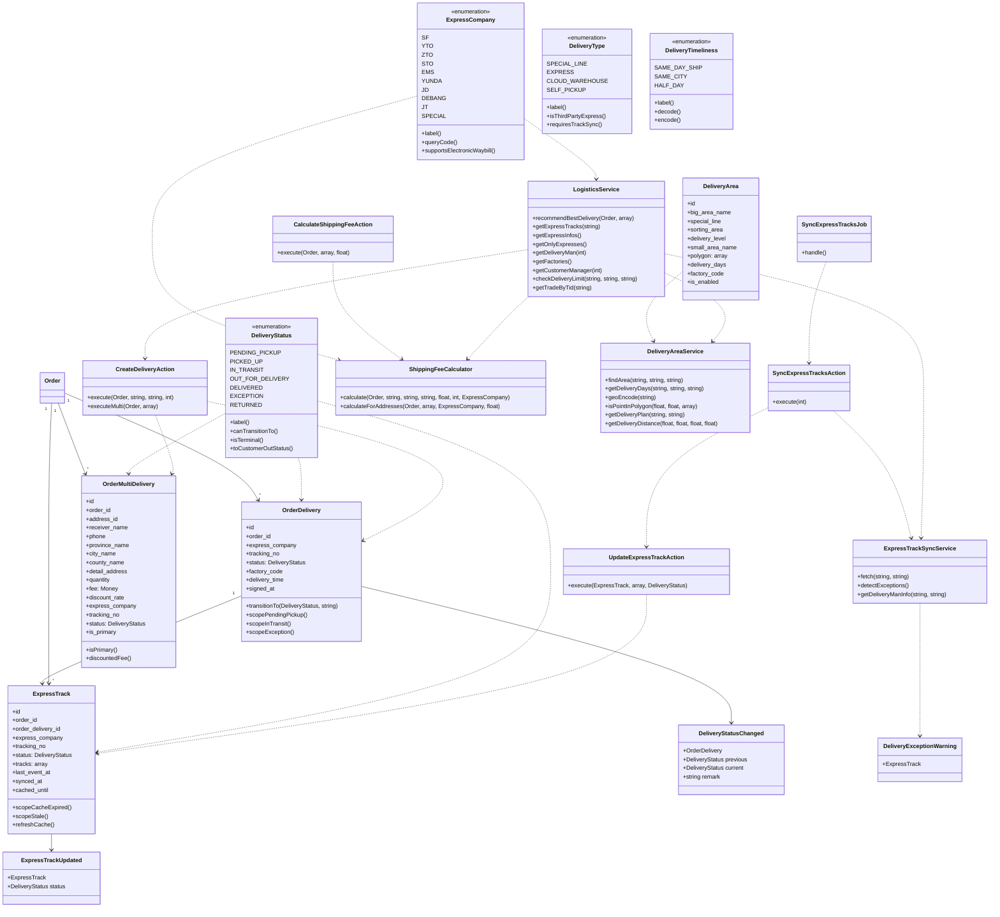
```mermaid
classDiagram
    class OrderDelivery {
        +id
        +order_id
        +express_company
        +tracking_no
        +status: DeliveryStatus
        +factory_code
        +delivery_time
        +signed_at
        +transitionTo(DeliveryStatus, string)
        +scopePendingPickup()
        +scopeInTransit()
        +scopeException()
    }
    class OrderMultiDelivery {
        +id
        +order_id
        +address_id
        +receiver_name
        +phone
        +province_name
        +city_name
        +county_name
        +detail_address
        +quantity
        +fee: Money
        +discount_rate
        +express_company
        +tracking_no
        +status: DeliveryStatus
        +is_primary
        +isPrimary()
        +discountedFee()
    }
    class ExpressTrack {
        +id
        +order_id
        +order_delivery_id
        +express_company
        +tracking_no
        +status: DeliveryStatus
        +tracks: array
        +last_event_at
        +synced_at
        +cached_until
        +scopeCacheExpired()
        +scopeStale()
        +refreshCache()
    }
    class DeliveryArea {
        +id
        +big_area_name
        +special_line
        +sorting_area
        +delivery_level
        +small_area_name
        +polygon: array
        +delivery_days
        +factory_code
        +is_enabled
    }
    class ExpressCompany {
        <<enumeration>>
        SF
        YTO
        ZTO
        STO
        EMS
        YUNDA
        JD
        DEBANG
        JT
        SPECIAL
        +label()
        +queryCode()
        +supportsElectronicWaybill()
    }
    class DeliveryStatus {
        <<enumeration>>
        PENDING_PICKUP
        PICKED_UP
        IN_TRANSIT
        OUT_FOR_DELIVERY
        DELIVERED
        EXCEPTION
        RETURNED
        +label()
        +canTransitionTo()
        +isTerminal()
        +toCustomerOutStatus()
    }
    class DeliveryType {
        <<enumeration>>
        SPECIAL_LINE
        EXPRESS
        CLOUD_WAREHOUSE
        SELF_PICKUP
        +label()
        +isThirdPartyExpress()
        +requiresTrackSync()
    }
    class DeliveryTimeliness {
        <<enumeration>>
        SAME_DAY_SHIP
        SAME_CITY
        HALF_DAY
        +label()
        +decode()
        +encode()
    }
    class CalculateShippingFeeAction {
        +execute(Order, array, float)
    }
    class CreateDeliveryAction {
        +execute(Order, string, string, int)
        +executeMulti(Order, array)
    }
    class UpdateExpressTrackAction {
        +execute(ExpressTrack, array, DeliveryStatus)
    }
    class SyncExpressTracksAction {
        +execute(int)
    }
    class LogisticsService {
        +recommendBestDelivery(Order, array)
        +getExpressTracks(string)
        +getExpressInfos()
        +getOnlyExpresses()
        +getDeliveryMan(int)
        +getFactories()
        +getCustomerManager(int)
        +checkDeliveryLimit(string, string, string)
        +getTradeByTid(string)
    }
    class ShippingFeeCalculator {
        +calculate(Order, string, string, string, float, int, ExpressCompany)
        +calculateForAddresses(Order, array, ExpressCompany, float)
    }
    class ExpressTrackSyncService {
        +fetch(string, string)
        +detectExceptions()
        +getDeliveryManInfo(string, string)
    }
    class DeliveryAreaService {
        +findArea(string, string, string)
        +getDeliveryDays(string, string, string)
        +geoEncode(string)
        +isPointInPolygon(float, float, array)
        +getDeliveryPlan(string, string)
        +getDeliveryDistance(float, float, float, float)
    }
    class SyncExpressTracksJob {
        +handle()
    }
    class DeliveryStatusChanged {
        +OrderDelivery
        +DeliveryStatus previous
        +DeliveryStatus current
        +string remark
    }
    class ExpressTrackUpdated {
        +ExpressTrack
        +DeliveryStatus status
    }
    class DeliveryExceptionWarning {
        +ExpressTrack
    }

    OrderDelivery "1" --> "*" ExpressTrack
    Order "1" --> "*" OrderDelivery
    Order "1" --> "*" OrderMultiDelivery
    Order "1" --> "*" ExpressTrack
    DeliveryArea ..> DeliveryAreaService
    ExpressCompany ..> LogisticsService
    ExpressCompany ..> ShippingFeeCalculator
    DeliveryStatus ..> OrderDelivery
    DeliveryStatus ..> OrderMultiDelivery
    DeliveryStatus ..> ExpressTrack
    CalculateShippingFeeAction ..> ShippingFeeCalculator
    CreateDeliveryAction ..> OrderDelivery
    CreateDeliveryAction ..> OrderMultiDelivery
    UpdateExpressTrackAction ..> ExpressTrack
    SyncExpressTracksAction ..> ExpressTrackSyncService
    SyncExpressTracksAction ..> UpdateExpressTrackAction
    SyncExpressTracksJob ..> SyncExpressTracksAction
    LogisticsService ..> ShippingFeeCalculator
    LogisticsService ..> DeliveryAreaService
    LogisticsService ..> ExpressTrackSyncService
    LogisticsService ..> CreateDeliveryAction
    ExpressTrackSyncService ..> DeliveryExceptionWarning
    OrderDelivery --> DeliveryStatusChanged
    ExpressTrack --> ExpressTrackUpdated
```

#### 运费计算时序图

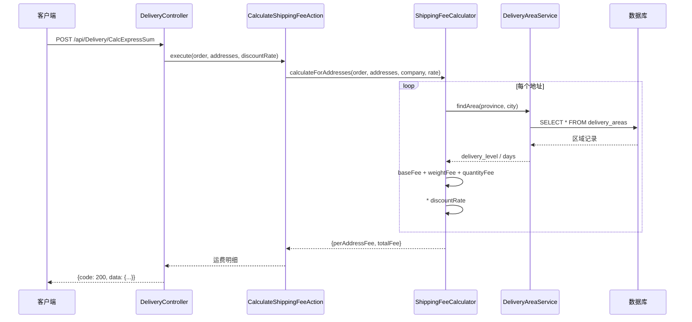
```mermaid
sequenceDiagram
    participant Client as 客户端
    participant Controller as DeliveryController
    participant Action as CalculateShippingFeeAction
    participant Calculator as ShippingFeeCalculator
    participant AreaService as DeliveryAreaService
    participant DB as 数据库

    Client->>Controller: POST /api/Delivery/CalcExpressSum
    Controller->>Action: execute(order, addresses, discountRate)
    Action->>Calculator: calculateForAddresses(order, addresses, company, rate)
    loop 每个地址
        Calculator->>AreaService: findArea(province, city)
        AreaService->>DB: SELECT * FROM delivery_areas
        DB-->>AreaService: 区域记录
        AreaService-->>Calculator: delivery_level / days
        Calculator->>Calculator: baseFee + weightFee + quantityFee
        Calculator->>Calculator: * discountRate
    end
    Calculator-->>Action: {perAddressFee, totalFee}
    Action-->>Controller: 运费明细
    Controller-->>Client: {code: 200, data: {...}}
```

#### 物流轨迹同步时序图

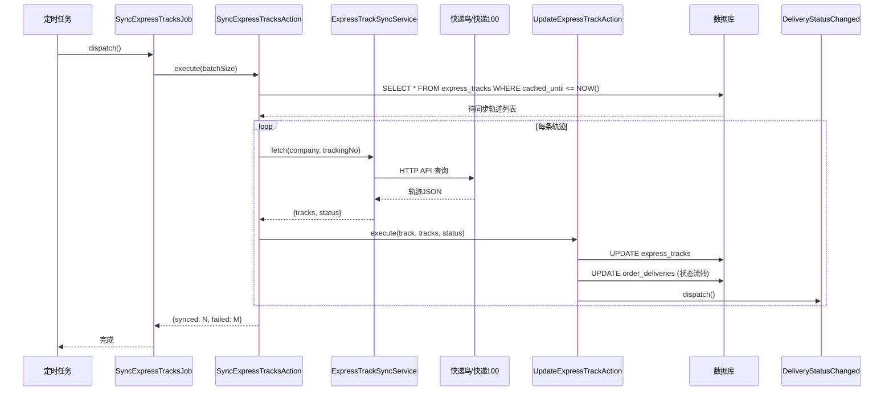
```mermaid
sequenceDiagram
    participant Schedule as 定时任务
    participant Job as SyncExpressTracksJob
    participant Action as SyncExpressTracksAction
    participant Service as ExpressTrackSyncService
    participant Kdniao as 快递鸟/快递100
    participant UpdateAction as UpdateExpressTrackAction
    participant DB as 数据库
    participant Event as DeliveryStatusChanged

    Schedule->>Job: dispatch()
    Job->>Action: execute(batchSize)
    Action->>DB: SELECT * FROM express_tracks WHERE cached_until <= NOW()
    DB-->>Action: 待同步轨迹列表
    loop 每条轨迹
        Action->>Service: fetch(company, trackingNo)
        Service->>Kdniao: HTTP API 查询
        Kdniao-->>Service: 轨迹JSON
        Service-->>Action: {tracks, status}
        Action->>UpdateAction: execute(track, tracks, status)
        UpdateAction->>DB: UPDATE express_tracks
        UpdateAction->>DB: UPDATE order_deliveries (状态流转)
        UpdateAction->>Event: dispatch()
    end
    Action-->>Job: {synced: N, failed: M}
    Job-->>Schedule: 完成
```

#### 多地址配送创建时序图

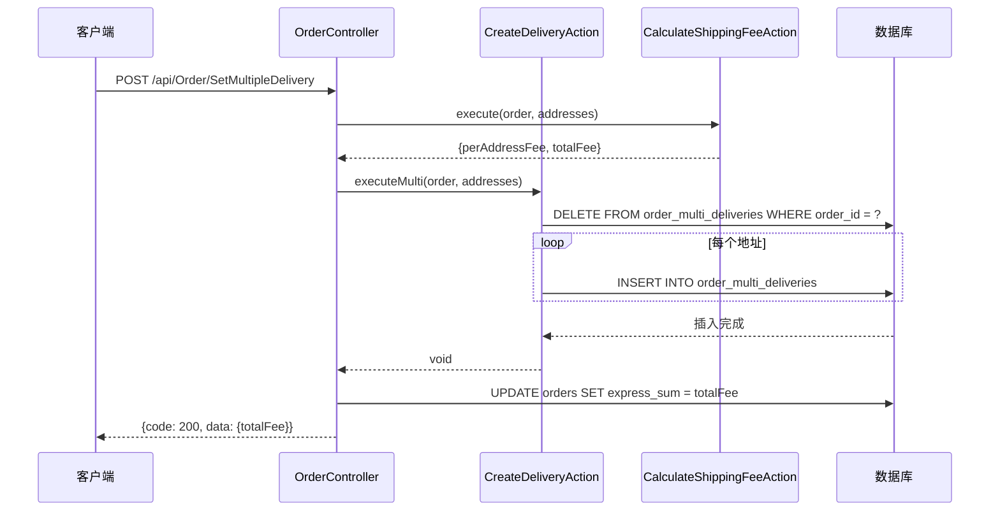
```mermaid
sequenceDiagram
    participant Client as 客户端
    participant Controller as OrderController
    participant Action as CreateDeliveryAction
    participant FeeAction as CalculateShippingFeeAction
    participant DB as 数据库

    Client->>Controller: POST /api/Order/SetMultipleDelivery
    Controller->>FeeAction: execute(order, addresses)
    FeeAction-->>Controller: {perAddressFee, totalFee}
    Controller->>Action: executeMulti(order, addresses)
    Action->>DB: DELETE FROM order_multi_deliveries WHERE order_id = ?
    loop 每个地址
        Action->>DB: INSERT INTO order_multi_deliveries
    end
    DB-->>Action: 插入完成
    Action-->>Controller: void
    Controller->>DB: UPDATE orders SET express_sum = totalFee
    Controller-->>Client: {code: 200, data: {totalFee}}
```

---

### 补充说明

1. **Queue Job 定义**：`SyncExpressTracksJob` 实现 `ShouldQueue` 接口，使用 `database` 或 `redis` 队列驱动，在 `app/Jobs/Logistics/SyncExpressTracksJob.php` 中定义。
2. **定时任务配置**：在 `app/Console/Kernel.php` 中注册 `logistics:sync` 命令，每 15 分钟执行一次轨迹同步；每日凌晨执行一次异常检测。
3. **配置项**：`config/services.php` 中新增 `kdniao` 和 `kuaidi100` 配置节点，含 `api_url`、`ebusiness_id`、`api_key` 等字段。
4. **与现有表兼容**：`order_deliveries` 表保持与 SDD 5.2.31 完全一致，本章新增的 `order_multi_deliveries.status` 字段使用 `DeliveryStatus` 枚举的简化视图（0待发货/1已发货/2已签收），实际存储为 `tinyint`。
5. **异常预警通知**：`DeliveryExceptionWarning` 事件由 `App\Listeners\Logistics\NotifyCustomerService` 监听，发送企业微信/钉钉通知给客服团队。

---

## 6.42 商品管理子系统设计 (ProductManagementService)

> **技术栈**：PHP 8.5 + Laravel 13.x
> **设计原则**：品类参数模板化、SKU 动态生成、cpSummary 规格摘要标准化、联动规则引擎化、设计规范自动校验。
> **一致性声明**：本章与 SDD 第 5.2.19 ~ 5.2.21 节及 supplement_tables.md 中已定义的 `products`、`product_categories`、`param_templates`、`product_param_options`、`product_param_rules`、`product_design_specs` 保持完全兼容，在此基础上进行子系统级能力扩展。

---

### 6.42.1 设计概述

商品管理子系统是怡安印刷商城的核心品类中枢，承载从分类树维护、参数模板配置、规格摘要（cpSummary）生成、设计文件校验到实时计价的完整链路。核心设计原则如下：

1. **品类参数模板化**：每个一级品类（名片/单张/标签/画册/广告物料/包装/办公/家居/文创/季节/现货样品）拥有独立的参数模板集，支持版本管理与分组参数，历史订单引用下单时的模板版本，避免模板变更影响已成交订单的计价回溯。

2. **联动规则引擎化**：参数间依赖关系（如尺寸影响材质、装订影响页数）通过离散化的 `param_template_rules` 表存储，由 `ParamTemplateService` 在前端渲染时实时计算可用选项，确保用户只能提交合法的参数组合。

3. **cpSummary 标准化**：所有商品规格统一编码为 `productType:size:style:binding:reprint:designOrder:groupParams:pageCount:totalPages:quantity:skuCount` 格式，支持正向生成与反向解析回填，是购物车、订单、收藏、再下单全链路的规格唯一标识。

4. **设计规范自动校验**：按品类维护印刷设计规范（出血、格式、分辨率、色彩模式），文件上传时通过 `DesignSpecValidationService` 自动校验，前端即时反馈不符合规范的文件。

5. **搜索与缓存分离**：商品搜索采用 Laravel Scout + Meilisearch 实现全文检索与热度排序；分类树、参数模板等低频变更数据使用 Redis 缓存，实时计价结果使用短期缓存（5 分钟）。

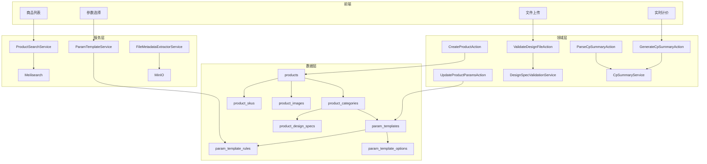
```mermaid
graph TB
    subgraph 数据层
        P[products] --> PC[product_categories]
        P --> PI[product_images]
        P --> PS[product_skus]
        PC --> PT[param_templates]
        PT --> PTO[param_template_options]
        PT --> PTR[param_template_rules]
        PC --> PDS[product_design_specs]
    end

    subgraph 领域层
        A1[CreateProductAction] --> P
        A2[UpdateProductParamsAction] --> PT
        A3[GenerateCpSummaryAction] --> CS[CpSummaryService]
        A4[ParseCpSummaryAction] --> CS
        A5[ValidateDesignFileAction] --> DSV[DesignSpecValidationService]
    end

    subgraph 服务层
        PSS[ProductSearchService] --> MEI[Meilisearch]
        PTS[ParamTemplateService] --> PTR
        FME[FileMetadataExtractorService] --> MIN[MinIO]
    end

    subgraph 前端
        F1[商品列表] --> PSS
        F2[参数选择] --> PTS
        F3[文件上传] --> A5
        F4[实时计价] --> A3
    end
```

---

### 6.42.2 枚举定义

#### ProductStatus

商品生命周期状态机，覆盖从草稿到上架到归档的完整流程。

```php
<?php

declare(strict_types=1);

namespace App\Enums;

/**
 * 商品状态
 */
enum ProductStatus: int
{
    case DRAFT     = 0;  // 草稿
    case PENDING   = 1;  // 待审核
    case ACTIVE    = 2;  // 上架中
    case INACTIVE  = 3;  // 已下架
    case ARCHIVED  = 4;  // 已归档

    public function label(): string
    {
        return match ($this) {
            self::DRAFT    => '草稿',
            self::PENDING  => '待审核',
            self::ACTIVE   => '上架中',
            self::INACTIVE => '已下架',
            self::ARCHIVED => '已归档',
        };
    }

    /**
     * 是否前端可见
     */
    public function isVisible(): bool
    {
        return $this === self::ACTIVE;
    }

    /**
     * 状态机：允许的目标状态校验
     */
    public function canTransitionTo(self $target): bool
    {
        return match ([$this, $target]) {
            [self::DRAFT, self::PENDING],
            [self::PENDING, self::ACTIVE],
            [self::PENDING, self::DRAFT],
            [self::ACTIVE, self::INACTIVE],
            [self::INACTIVE, self::ACTIVE],
            [self::INACTIVE, self::ARCHIVED],
            [self::ACTIVE, self::ARCHIVED] => true,
            default => false,
        };
    }
}
```

#### ParamType

参数模板中控件类型定义，决定前端渲染组件与校验逻辑。

```php
<?php

declare(strict_types=1);

namespace App\Enums;

/**
 * 参数模板控件类型
 */
enum ParamType: string
{
    case SELECT      = 'SELECT';      // 下拉选择
    case RADIO       = 'RADIO';       // 单选
    case CHECKBOX    = 'CHECKBOX';    // 多选
    case NUMBER      = 'NUMBER';      // 数字输入
    case TEXT        = 'TEXT';        // 文本输入
    case IMAGE_UPLOAD = 'IMAGE_UPLOAD'; // 图片上传
    case FILE_UPLOAD  = 'FILE_UPLOAD';  // 文件上传
    case COLOR       = 'COLOR';       // 颜色选择

    public function label(): string
    {
        return match ($this) {
            self::SELECT       => '下拉选择',
            self::RADIO        => '单选',
            self::CHECKBOX     => '多选',
            self::NUMBER       => '数字输入',
            self::TEXT         => '文本输入',
            self::IMAGE_UPLOAD => '图片上传',
            self::FILE_UPLOAD  => '文件上传',
            self::COLOR        => '颜色选择',
        };
    }

    /**
     * 是否为选项型控件（需要 options 配置）
     */
    public function isOptionBased(): bool
    {
        return in_array($this, [self::SELECT, self::RADIO, self::CHECKBOX], true);
    }

    /**
     * 是否支持多值
     */
    public function allowsMultiple(): bool
    {
        return $this === self::CHECKBOX;
    }
}
```

#### FileFormat

上传文件格式枚举，用于设计文件校验与缩略图生成策略选择。

```php
<?php

declare(strict_types=1);

namespace App\Enums;

/**
 * 设计文件格式
 */
enum FileFormat: int
{
    case PDF  = 1;
    case AI   = 2;
    case PSD  = 3;
    case CDR  = 4;
    case JPG  = 5;
    case PNG  = 6;
    case TIFF = 7;

    public function label(): string
    {
        return match ($this) {
            self::PDF  => 'PDF',
            self::AI   => 'AI',
            self::PSD  => 'PSD',
            self::CDR  => 'CDR',
            self::JPG  => 'JPG',
            self::PNG  => 'PNG',
            self::TIFF => 'TIFF',
        };
    }

    /**
     * 是否为矢量格式
     */
    public function isVector(): bool
    {
        return in_array($this, [self::PDF, self::AI, self::CDR], true);
    }

    /**
     * 是否为位图格式
     */
    public function isRaster(): bool
    {
        return in_array($this, [self::JPG, self::PNG, self::TIFF, self::PSD], true);
    }

    /**
     * 文件扩展名
     */
    public function extension(): string
    {
        return match ($this) {
            self::PDF  => 'pdf',
            self::AI   => 'ai',
            self::PSD  => 'psd',
            self::CDR  => 'cdr',
            self::JPG  => 'jpg',
            self::PNG  => 'png',
            self::TIFF => 'tiff',
        };
    }

    /**
     * MIME 类型
     */
    public function mimeType(): string
    {
        return match ($this) {
            self::PDF  => 'application/pdf',
            self::AI   => 'application/postscript',
            self::PSD  => 'image/vnd.adobe.photoshop',
            self::CDR  => 'application/coreldraw',
            self::JPG  => 'image/jpeg',
            self::PNG  => 'image/png',
            self::TIFF => 'image/tiff',
        };
    }
}
```

#### ColorMode

印刷色彩模式枚举，用于设计规范校验与印前检测配置。

```php
<?php

declare(strict_types=1);

namespace App\Enums;

/**
 * 印刷色彩模式
 */
enum ColorMode: int
{
    case CMYK      = 1;
    case RGB       = 2;
    case GRAYSCALE = 3;
    case SPOT      = 4;

    public function label(): string
    {
        return match ($this) {
            self::CMYK      => 'CMYK',
            self::RGB       => 'RGB',
            self::GRAYSCALE => '灰度',
            self::SPOT      => '专色',
        };
    }

    /**
     * 是否适合印刷输出
     */
    public function isPrintReady(): bool
    {
        return in_array($this, [self::CMYK, self::GRAYSCALE, self::SPOT], true);
    }
}
```

---

### 6.42.3 Migration

> **兼容性说明**：`products`、`product_categories`、`param_templates` 已在 SDD 5.2.19 ~ 5.2.21 节定义基础结构；本节在其基础上扩展字段并补充关联表。`product_design_specs` 与 supplement_tables.md 5.2.A3 完全一致，此处完整复现以保持子系统闭环。

#### products 表（扩展）

在既有 `products` 表基础上扩展商品卡片字段（labels、is_new、heat_value、score），并统一金额 Cast。

```php
<?php

use Illuminate\Database\Migrations\Migration;
use Illuminate\Database\Schema\Blueprint;
use Illuminate\Support\Facades\Schema;

return new class extends Migration
{
    public function up(): void
    {
        Schema::create('products', function (Blueprint $table) {
            $table->id()->comment('商品主键');
            $table->foreignId('category_id')->constrained('product_categories')->comment('品类ID');
            $table->string('name', 128)->comment('商品名称');
            $table->string('product_type', 16)->nullable()->comment('商品类型编码，如 MP=名片');
            $table->decimal('base_price', 12, 2)->default(0)->comment('基础价格');
            $table->tinyInteger('status')->default(1)->comment('ProductStatus: 0草稿 1待审核 2上架 3下架 4归档');
            $table->text('description')->nullable()->comment('商品描述');
            $table->string('thumbnail', 500)->nullable()->comment('缩略图URL');
            $table->boolean('is_sample')->default(false)->comment('是否样品商品');
            $table->boolean('is_new')->default(false)->comment('是否新品');
            $table->json('labels')->nullable()->comment('卖点标签，如 ["高清印刷","免费设计"]');
            $table->unsignedInteger('heat_value')->default(0)->comment('热度值');
            $table->decimal('score', 3, 1)->default(5.0)->comment('评分 0.0~5.0');
            $table->timestamps();
            $table->softDeletes();

            $table->index('category_id', 'idx_category_id');
            $table->index('status', 'idx_status');
            $table->index(['category_id', 'status'], 'idx_category_status');
            $table->index('heat_value', 'idx_heat_value');
            $table->index('product_type', 'idx_product_type');
            $table->fullText('name', 'idx_name_fulltext');
        });
    }

    public function down(): void
    {
        Schema::dropIfExists('products');
    }
};
```

#### product_skus 表

存储由 cpSummary 派生的动态 SKU，用于价格缓存与库存追踪（现货样品类商品）。

```php
<?php

use Illuminate\Database\Migrations\Migration;
use Illuminate\Database\Schema\Blueprint;
use Illuminate\Support\Facades\Schema;

return new class extends Migration
{
    public function up(): void
    {
        Schema::create('product_skus', function (Blueprint $table) {
            $table->id()->comment('SKU主键');
            $table->foreignId('product_id')->constrained('products')->comment('商品ID');
            $table->string('sku_code', 64)->comment('SKU编码');
            $table->string('cp_summary', 512)->comment('规格摘要');
            $table->string('cp_summary_hash', 64)->comment('规格摘要MD5哈希');
            $table->decimal('sale_price', 12, 2)->default(0)->comment('销售价');
            $table->decimal('market_price', 12, 2)->nullable()->comment('市场价');
            $table->integer('stock_qty')->default(0)->comment('库存数量（现货样品）');
            $table->integer('locked_qty')->default(0)->comment('锁定数量');
            $table->decimal('length', 8, 2)->nullable()->comment('长 cm');
            $table->decimal('width', 8, 2)->nullable()->comment('宽 cm');
            $table->decimal('height', 8, 2)->nullable()->comment('高 cm');
            $table->decimal('volume', 10, 2)->nullable()->comment('体积 cm³');
            $table->tinyInteger('status')->default(1)->comment('1=启用 0=禁用');
            $table->timestamps();

            $table->unique(['product_id', 'cp_summary_hash'], 'uk_product_cp_hash');
            $table->index('sku_code', 'idx_sku_code');
            $table->index('status', 'idx_status');
        });
    }

    public function down(): void
    {
        Schema::dropIfExists('product_skus');
    }
};
```

#### product_categories 表

一级 11 大类（名片/单张/标签/画册/广告物料/包装/办公/家居/文创/季节/现货样品），支持二级/三级分类树。与 SDD 5.2.20 节完全一致。

```php
<?php

use Illuminate\Database\Migrations\Migration;
use Illuminate\Database\Schema\Blueprint;
use Illuminate\Support\Facades\Schema;

return new class extends Migration
{
    public function up(): void
    {
        Schema::create('product_categories', function (Blueprint $table) {
            $table->id()->comment('分类主键');
            $table->string('cd_category_id', 32)->unique()->comment('品类编码');
            $table->string('category_name', 128)->comment('品类名称');
            $table->foreignId('parent_id')->default(0)->comment('父分类ID');
            $table->integer('level')->default(1)->comment('层级：1/2/3');
            $table->integer('sort_order')->default(0)->comment('排序');
            $table->string('icon', 256)->nullable()->comment('图标URL');
            $table->boolean('is_show')->default(true)->comment('是否展示');
            $table->integer('heat_value')->default(0)->comment('热度值');
            $table->decimal('score', 3, 1)->default(5.0)->comment('评分');
            $table->json('labels')->nullable()->comment('标签');
            $table->timestamps();

            $table->index('parent_id', 'idx_parent_id');
            $table->index('cd_category_id', 'idx_cd_category_id');
            $table->index('is_show', 'idx_is_show');
            $table->index(['level', 'is_show'], 'idx_level_show');
        });
    }

    public function down(): void
    {
        Schema::dropIfExists('product_categories');
    }
};
```

#### param_templates 表

品类参数模板主表，支持版本管理与分组参数。与 SDD 5.2.21 节一致，param_type 字段使用 `ParamType` 枚举。

```php
<?php

use Illuminate\Database\Migrations\Migration;
use Illuminate\Database\Schema\Blueprint;
use Illuminate\Support\Facades\Schema;

return new class extends Migration
{
    public function up(): void
    {
        Schema::create('param_templates', function (Blueprint $table) {
            $table->id()->comment('参数模板主键');
            $table->foreignId('category_id')->constrained('product_categories')->comment('品类ID');
            $table->string('group_name', 64)->nullable()->comment('参数分组名，如 "纸张","工艺"');
            $table->string('param_key', 64)->comment('参数标识，如 "size","paper"');
            $table->string('param_type', 32)->comment('ParamType: SELECT/RADIO/CHECKBOX/NUMBER/TEXT...');
            $table->string('param_name', 64)->comment('参数显示名');
            $table->json('meta')->nullable()->comment('扩展配置：步长、单位、默认值等');
            $table->integer('version')->default(1)->comment('版本号（历史订单引用下单时版本）');
            $table->integer('sort_order')->default(0)->comment('排序');
            $table->tinyInteger('status')->default(1)->comment('1=启用 0=禁用');
            $table->timestamps();

            $table->index('category_id', 'idx_category_id');
            $table->index(['category_id', 'version'], 'idx_category_version');
            $table->index(['category_id', 'param_key'], 'idx_category_param_key');
            $table->index('status', 'idx_status');
        });
    }

    public function down(): void
    {
        Schema::dropIfExists('param_templates');
    }
};
```

#### param_template_options 表

参数模板可选值列表，支持价格增量。与 supplement_tables.md 5.2.A1 `product_param_options` 结构等价，表名调整为子系统内统一命名。

```php
<?php

use Illuminate\Database\Migrations\Migration;
use Illuminate\Database\Schema\Blueprint;
use Illuminate\Support\Facades\Schema;

return new class extends Migration
{
    public function up(): void
    {
        Schema::create('param_template_options', function (Blueprint $table) {
            $table->id()->comment('选项主键');
            $table->foreignId('param_id')->constrained('param_templates')->comment('参数模板ID');
            $table->string('value', 64)->comment('选项值（存储值）');
            $table->string('label', 128)->comment('选项显示名');
            $table->decimal('price_delta', 10, 4)->default(0)->comment('价格增量');
            $table->integer('sort_order')->default(0)->comment('排序');
            $table->tinyInteger('status')->default(1)->comment('1=启用 0=禁用');
            $table->timestamps();

            $table->index('param_id', 'idx_param_id');
            $table->index('status', 'idx_status');
            $table->index('sort_order', 'idx_sort_order');
        });
    }

    public function down(): void
    {
        Schema::dropIfExists('param_template_options');
    }
};
```

#### param_template_rules 表

参数联动规则引擎配置表。与 supplement_tables.md 5.2.A2 `product_param_rules` 结构等价。

```php
<?php

use Illuminate\Database\Migrations\Migration;
use Illuminate\Database\Schema\Blueprint;
use Illuminate\Support\Facades\Schema;

return new class extends Migration
{
    public function up(): void
    {
        Schema::create('param_template_rules', function (Blueprint $table) {
            $table->id()->comment('规则主键');
            $table->foreignId('param_id')->constrained('param_templates')->comment('所属参数模板ID');
            $table->string('rule_type', 32)->default('DISABLE')->comment('规则类型: DISABLE=禁用/HIDE=隐藏/SET_DEFAULT=设置默认值/ADJUST_PRICE=调价');
            $table->string('condition_param', 64)->comment('触发条件参数标识');
            $table->string('condition_value', 128)->comment('触发条件参数值');
            $table->string('action_param', 64)->comment('动作目标参数标识');
            $table->string('action_value', 128)->nullable()->comment('动作目标参数值（为空则作用于整个参数）');
            $table->integer('priority')->default(0)->comment('优先级，数字越大越优先');
            $table->tinyInteger('status')->default(1)->comment('1=启用 0=禁用');
            $table->timestamps();

            $table->index('param_id', 'idx_param_id');
            $table->index(['condition_param', 'condition_value'], 'idx_condition');
            $table->index(['action_param', 'action_value'], 'idx_action');
            $table->index('priority', 'idx_priority');
            $table->index('status', 'idx_status');
        });
    }

    public function down(): void
    {
        Schema::dropIfExists('param_template_rules');
    }
};
```

#### product_design_specs 表

按品类维护印刷设计规范。与 supplement_tables.md 5.2.A3 完全一致。

```php
<?php

use Illuminate\Database\Migrations\Migration;
use Illuminate\Database\Schema\Blueprint;
use Illuminate\Support\Facades\Schema;

return new class extends Migration
{
    public function up(): void
    {
        Schema::create('product_design_specs', function (Blueprint $table) {
            $table->id()->comment('规范主键');
            $table->foreignId('category_id')->constrained('product_categories')->comment('品类ID');
            $table->string('design_size', 64)->nullable()->comment('设计尺寸（如 210×285mm）');
            $table->string('finished_size', 64)->nullable()->comment('成品尺寸');
            $table->string('bleed', 32)->nullable()->comment('出血边距（如 3mm）');
            $table->json('allowed_formats')->nullable()->comment('允许的文件格式 [FileFormat]');
            $table->string('resolution', 32)->nullable()->comment('分辨率（如 300dpi）');
            $table->tinyInteger('color_mode')->nullable()->comment('ColorMode: 1=CMYK 2=RGB 3=GRAYSCALE 4=SPOT');
            $table->json('meta')->nullable()->comment('扩展规范：最小字号、安全边距等');
            $table->timestamps();

            $table->index('category_id', 'idx_category_id');
        });
    }

    public function down(): void
    {
        Schema::dropIfExists('product_design_specs');
    }
};
```

#### product_images 表

商品图集，支持多图轮播与主图标识。

```php
<?php

use Illuminate\Database\Migrations\Migration;
use Illuminate\Database\Schema\Blueprint;
use Illuminate\Support\Facades\Schema;

return new class extends Migration
{
    public function up(): void
    {
        Schema::create('product_images', function (Blueprint $table) {
            $table->id()->comment('图片主键');
            $table->foreignId('product_id')->constrained('products')->comment('商品ID');
            $table->string('image_url', 500)->comment('图片URL');
            $table->string('thumbnail_url', 500)->nullable()->comment('缩略图URL');
            $table->integer('sort_order')->default(0)->comment('排序');
            $table->boolean('is_primary')->default(false)->comment('是否主图');
            $table->timestamps();

            $table->index('product_id', 'idx_product_id');
            $table->index(['product_id', 'sort_order'], 'idx_product_sort');
            $table->index('is_primary', 'idx_is_primary');
        });
    }

    public function down(): void
    {
        Schema::dropIfExists('product_images');
    }
};
```


---

### 6.42.4 Eloquent 模型

#### Product 模型

集成 Scout 搜索、支持商品卡片全字段、关联图集与 SKU。

```php
<?php

declare(strict_types=1);

namespace App\Domains\Product\Models;

use App\Domains\Common\Castables\MoneyCast;
use App\Enums\ProductStatus;
use Illuminate\Database\Eloquent\Factories\HasFactory;
use Illuminate\Database\Eloquent\Model;
use Illuminate\Database\Eloquent\Relations\BelongsTo;
use Illuminate\Database\Eloquent\Relations\HasMany;
use Illuminate\Database\Eloquent\SoftDeletes;
use Laravel\Scout\Searchable;

class Product extends Model
{
    use HasFactory;
    use Searchable;
    use SoftDeletes;

    protected $table = 'products';

    protected $fillable = [
        'category_id', 'name', 'product_type', 'base_price', 'status',
        'description', 'thumbnail', 'is_sample', 'is_new',
        'labels', 'heat_value', 'score',
    ];

    protected $casts = [
        'category_id' => 'integer',
        'base_price' => MoneyCast::class,
        'status' => ProductStatus::class,
        'is_sample' => 'boolean',
        'is_new' => 'boolean',
        'labels' => 'array',
        'heat_value' => 'integer',
        'score' => 'decimal:1',
    ];

    // -- Scout 搜索索引 --

    public function toSearchableArray(): array
    {
        return [
            'id' => $this->id,
            'name' => $this->name,
            'product_type' => $this->product_type,
            'category_id' => $this->category_id,
            'status' => $this->status?->value,
            'is_new' => $this->is_new,
            'labels' => $this->labels,
            'heat_value' => $this->heat_value,
            'score' => $this->score,
            'description' => $this->description,
        ];
    }

    // -- Relations --

    public function category(): BelongsTo
    {
        return $this->belongsTo(ProductCategory::class, 'category_id');
    }

    public function images(): HasMany
    {
        return $this->hasMany(ProductImage::class, 'product_id');
    }

    public function primaryImage(): ?ProductImage
    {
        return $this->images()->where('is_primary', true)->first()
            ?? $this->images()->orderBy('sort_order')->first();
    }

    public function skus(): HasMany
    {
        return $this->hasMany(ProductSku::class, 'product_id');
    }

    public function paramTemplates(): HasMany
    {
        return $this->hasMany(ParamTemplate::class, 'category_id', 'category_id');
    }

    // -- Query Scopes --

    public function scopeActive($query)
    {
        return $query->where('status', ProductStatus::ACTIVE);
    }

    public function scopeVisible($query)
    {
        return $query->where('status', ProductStatus::ACTIVE)
                     ->whereHas('category', fn ($q) => $q->where('is_show', true));
    }

    public function scopeOfCategory($query, int $categoryId)
    {
        return $query->where('category_id', $categoryId);
    }

    public function scopeNewArrivals($query)
    {
        return $query->where('is_new', true)->orderByDesc('created_at');
    }

    public function scopeHot($query)
    {
        return $query->orderByDesc('heat_value')->orderByDesc('score');
    }

    // -- Helpers --

    /**
     * 获取商品完整卡片数据（供前端列表/详情使用）
     */
    public function toCardArray(): array
    {
        return [
            'id' => $this->id,
            'name' => $this->name,
            'thumbnail' => $this->primaryImage()?->thumbnail_url ?? $this->thumbnail,
            'labels' => $this->labels ?? [],
            'is_new' => $this->is_new,
            'heat_value' => $this->heat_value,
            'score' => $this->score,
            'base_price' => $this->base_price,
        ];
    }
}
```

#### ProductSku 模型

```php
<?php

declare(strict_types=1);

namespace App\Domains\Product\Models;

use App\Domains\Common\Castables\MoneyCast;
use Illuminate\Database\Eloquent\Factories\HasFactory;
use Illuminate\Database\Eloquent\Model;
use Illuminate\Database\Eloquent\Relations\BelongsTo;

class ProductSku extends Model
{
    use HasFactory;

    protected $table = 'product_skus';

    protected $fillable = [
        'product_id', 'sku_code', 'cp_summary', 'cp_summary_hash',
        'sale_price', 'market_price', 'stock_qty', 'locked_qty', 'status',
    ];

    protected $casts = [
        'product_id' => 'integer',
        'sale_price' => MoneyCast::class,
        'market_price' => MoneyCast::class,
        'stock_qty' => 'integer',
        'locked_qty' => 'integer',
        'status' => 'integer',
    ];

    public function product(): BelongsTo
    {
        return $this->belongsTo(Product::class, 'product_id');
    }

    /**
     * 可用库存
     */
    public function availableStock(): int
    {
        return max(0, $this->stock_qty - $this->locked_qty);
    }

    /**
     * 锁定库存
     */
    public function lock(int $qty): void
    {
        if ($this->availableStock() < $qty) {
            throw new \App\Exceptions\ProductException('库存不足');
        }
        $this->increment('locked_qty', $qty);
    }

    /**
     * 释放库存
     */
    public function release(int $qty): void
    {
        $this->decrement('locked_qty', min($qty, $this->locked_qty));
    }
}
```

#### ProductCategory 模型

与 SDD 5.2.20 节一致，补充 `paramTemplates` 关联的返回类型声明。

```php
<?php

declare(strict_types=1);

namespace App\Domains\Product\Models;

use Illuminate\Database\Eloquent\Factories\HasFactory;
use Illuminate\Database\Eloquent\Model;
use Illuminate\Database\Eloquent\Relations\BelongsTo;
use Illuminate\Database\Eloquent\Relations\HasMany;

class ProductCategory extends Model
{
    use HasFactory;

    protected $table = 'product_categories';

    protected $fillable = [
        'cd_category_id', 'category_name', 'parent_id', 'level',
        'sort_order', 'icon', 'is_show', 'heat_value', 'score', 'labels',
    ];

    protected $casts = [
        'level' => 'integer',
        'sort_order' => 'integer',
        'heat_value' => 'integer',
        'score' => 'decimal:1',
        'is_show' => 'boolean',
        'labels' => 'array',
    ];

    public function parent(): BelongsTo
    {
        return $this->belongsTo(self::class, 'parent_id');
    }

    public function children(): HasMany
    {
        return $this->hasMany(self::class, 'parent_id');
    }

    public function products(): HasMany
    {
        return $this->hasMany(Product::class, 'category_id');
    }

    public function paramTemplates(): HasMany
    {
        return $this->hasMany(ParamTemplate::class, 'category_id');
    }

    public function designSpec(): ?ProductDesignSpec
    {
        return $this->hasOne(ProductDesignSpec::class, 'category_id')->first();
    }

    /**
     * 作用域：仅展示的分类
     */
    public function scopeShown($query)
    {
        return $query->where('is_show', true);
    }

    /**
     * 作用域：指定层级
     */
    public function scopeAtLevel($query, int $level)
    {
        return $query->where('level', $level);
    }
}
```

#### ParamTemplate 模型

```php
<?php

declare(strict_types=1);

namespace App\Domains\Product\Models;

use App\Enums\ParamType;
use Illuminate\Database\Eloquent\Factories\HasFactory;
use Illuminate\Database\Eloquent\Model;
use Illuminate\Database\Eloquent\Relations\BelongsTo;
use Illuminate\Database\Eloquent\Relations\HasMany;

class ParamTemplate extends Model
{
    use HasFactory;

    protected $table = 'param_templates';

    protected $fillable = [
        'category_id', 'group_name', 'param_key', 'param_type',
        'param_name', 'meta', 'version', 'sort_order', 'status',
    ];

    protected $casts = [
        'category_id' => 'integer',
        'param_type' => ParamType::class,
        'version' => 'integer',
        'sort_order' => 'integer',
        'status' => 'integer',
        'meta' => 'array',
    ];

    public function category(): BelongsTo
    {
        return $this->belongsTo(ProductCategory::class, 'category_id');
    }

    public function options(): HasMany
    {
        return $this->hasMany(ParamTemplateOption::class, 'param_id');
    }

    public function rules(): HasMany
    {
        return $this->hasMany(ParamTemplateRule::class, 'param_id');
    }

    /**
     * 获取当前启用的选项列表
     */
    public function activeOptions(): HasMany
    {
        return $this->options()->where('status', 1)->orderBy('sort_order');
    }

    /**
     * 获取当前启用的联动规则
     */
    public function activeRules(): HasMany
    {
        return $this->rules()->where('status', 1)->orderByDesc('priority');
    }
}
```

#### ProductDesignSpec 模型

```php
<?php

declare(strict_types=1);

namespace App\Domains\Product\Models;

use App\Enums\ColorMode;
use Illuminate\Database\Eloquent\Factories\HasFactory;
use Illuminate\Database\Eloquent\Model;
use Illuminate\Database\Eloquent\Relations\BelongsTo;

class ProductDesignSpec extends Model
{
    use HasFactory;

    protected $table = 'product_design_specs';

    protected $fillable = [
        'category_id', 'design_size', 'finished_size', 'bleed',
        'allowed_formats', 'resolution', 'color_mode', 'meta',
    ];

    protected $casts = [
        'category_id' => 'integer',
        'color_mode' => ColorMode::class,
        'allowed_formats' => 'array',
        'meta' => 'array',
    ];

    public function category(): BelongsTo
    {
        return $this->belongsTo(ProductCategory::class, 'category_id');
    }

    /**
     * 是否允许指定文件格式
     */
    public function allowsFormat(int $formatValue): bool
    {
        return in_array($formatValue, $this->allowed_formats ?? [], true);
    }

    /**
     * 获取规范摘要文本（用于前端提示）
     */
    public function toGuidelineText(): string
    {
        $parts = [];
        if ($this->design_size) {
            $parts[] = "设计尺寸：{$this->design_size}";
        }
        if ($this->finished_size) {
            $parts[] = "成品尺寸：{$this->finished_size}";
        }
        if ($this->bleed) {
            $parts[] = "出血：{$this->bleed}";
        }
        if ($this->resolution) {
            $parts[] = "分辨率：{$this->resolution}";
        }
        if ($this->color_mode) {
            $parts[] = "色彩模式：{$this->color_mode->label()}";
        }
        return implode('；', $parts);
    }
}
```

---

### 6.42.5 Action 类

#### CreateProductAction

```php
<?php

declare(strict_types=1);

namespace App\Actions\Product;

use App\Domains\Product\Models\Product;
use App\Enums\ProductStatus;
use App\Exceptions\ProductException;
use Illuminate\Support\Facades\DB;
use Illuminate\Support\Facades\Log;

/**
 * 创建商品及关联图集
 * FR-PROD-001: 商品创建
 */
class CreateProductAction
{
    /**
     * @param array $data 商品基础数据
     * @param array $images 图片URL列表 [['url'=>'...','is_primary'=>true],...]
     */
    public function execute(array $data, array $images = []): Product
    {
        return DB::transaction(function () use ($data, $images) {
            $product = Product::create([
                'category_id' => $data['category_id'],
                'name' => $data['name'],
                'product_type' => $data['product_type'] ?? null,
                'base_price' => $data['base_price'] ?? 0,
                'status' => $data['status'] ?? ProductStatus::DRAFT,
                'description' => $data['description'] ?? null,
                'thumbnail' => $images[0]['url'] ?? null,
                'is_sample' => $data['is_sample'] ?? false,
                'is_new' => $data['is_new'] ?? false,
                'labels' => $data['labels'] ?? [],
                'heat_value' => $data['heat_value'] ?? 0,
                'score' => $data['score'] ?? 5.0,
            ]);

            foreach ($images as $index => $image) {
                $product->images()->create([
                    'image_url' => $image['url'],
                    'thumbnail_url' => $image['thumbnail_url'] ?? $image['url'],
                    'sort_order' => $index,
                    'is_primary' => $image['is_primary'] ?? ($index === 0),
                ]);
            }

            Log::info('[Product] 创建商品', ['product_id' => $product->id]);

            return $product;
        });
    }
}
```

#### UpdateProductParamsAction

```php
<?php

declare(strict_types=1);

namespace App\Actions\Product;

use App\Domains\Product\Models\ParamTemplate;
use App\Domains\Product\Models\ParamTemplateOption;
use App\Domains\Product\Models\ParamTemplateRule;
use App\Enums\ParamType;
use Illuminate\Support\Facades\DB;
use Illuminate\Support\Facades\Log;

/**
 * 更新品类参数模板、选项及联动规则
 * FR-PROD-020 ~ FR-PROD-035: 参数模板管理
 */
class UpdateProductParamsAction
{
    /**
     * @param int $categoryId 品类ID
     * @param array $params 参数模板列表
     * @param array $options 选项列表 [paramKey => [[value, label, price_delta],...],...]
     * @param array $rules 联动规则列表
     */
    public function execute(int $categoryId, array $params, array $options = [], array $rules = []): void
    {
        DB::transaction(function () use ($categoryId, $params, $options, $rules) {
            $version = ParamTemplate::where('category_id', $categoryId)->max('version') + 1;
            $paramIdMap = [];

            foreach ($params as $index => $param) {
                $template = ParamTemplate::updateOrCreate(
                    [
                        'category_id' => $categoryId,
                        'param_key' => $param['param_key'],
                    ],
                    [
                        'group_name' => $param['group_name'] ?? null,
                        'param_type' => ParamType::from($param['param_type']),
                        'param_name' => $param['param_name'],
                        'meta' => $param['meta'] ?? null,
                        'version' => $version,
                        'sort_order' => $index,
                        'status' => $param['status'] ?? 1,
                    ]
                );
                $paramIdMap[$param['param_key']] = $template->id;
            }

            foreach ($options as $paramKey => $opts) {
                if (! isset($paramIdMap[$paramKey])) {
                    continue;
                }
                $paramId = $paramIdMap[$paramKey];
                ParamTemplateOption::where('param_id', $paramId)->delete();
                foreach ($opts as $sort => $opt) {
                    ParamTemplateOption::create([
                        'param_id' => $paramId,
                        'value' => $opt['value'],
                        'label' => $opt['label'],
                        'price_delta' => $opt['price_delta'] ?? 0,
                        'sort_order' => $sort,
                        'status' => $opt['status'] ?? 1,
                    ]);
                }
            }

            foreach ($rules as $rule) {
                $paramId = $paramIdMap[$rule['param_key']] ?? null;
                if (! $paramId) {
                    continue;
                }
                ParamTemplateRule::updateOrCreate(
                    [
                        'param_id' => $paramId,
                        'condition_param' => $rule['condition_param'],
                        'condition_value' => $rule['condition_value'],
                        'action_param' => $rule['action_param'],
                    ],
                    [
                        'rule_type' => $rule['rule_type'] ?? 'DISABLE',
                        'action_value' => $rule['action_value'] ?? null,
                        'priority' => $rule['priority'] ?? 0,
                        'status' => $rule['status'] ?? 1,
                    ]
                );
            }

            Log::info('[Product] 更新参数模板', [
                'category_id' => $categoryId,
                'version' => $version,
                'param_count' => count($params),
            ]);
        });
    }
}
```

#### GenerateCpSummaryAction

```php
<?php

declare(strict_types=1);

namespace App\Actions\Product;

use App\Services\Product\CpSummaryService;

/**
 * 根据用户选中的参数生成 cpSummary 规格摘要
 * FR-PROD-045: 规格摘要生成
 */
class GenerateCpSummaryAction
{
    public function __construct(
        private readonly CpSummaryService $cpSummaryService
    ) {
    }

    /**
     * @param string $productType 商品类型编码，如 MP
     * @param array $params 用户选中的参数值 [paramKey => value, ...]
     * @param int $quantity 数量
     * @param int $skuCount SKU数量（多规格组合时）
     */
    public function execute(
        string $productType,
        array $params,
        int $quantity,
        int $skuCount = 1
    ): string {
        return $this->cpSummaryService->generate(
            productType: $productType,
            params: $params,
            quantity: $quantity,
            skuCount: $skuCount
        );
    }
}
```

#### ParseCpSummaryAction

```php
<?php

declare(strict_types=1);

namespace App\Actions\Product;

use App\Services\Product\CpSummaryService;

/**
 * 反解析 cpSummary 回填参数选择面板
 * FR-PROD-046: 规格摘要反解析
 */
class ParseCpSummaryAction
{
    public function __construct(
        private readonly CpSummaryService $cpSummaryService
    ) {
    }

    /**
     * @return array 解析后的参数数组，可直接用于前端回填
     */
    public function execute(string $cpSummary): array
    {
        return $this->cpSummaryService->parse($cpSummary);
    }
}
```

#### ValidateDesignFileAction

```php
<?php

declare(strict_types=1);

namespace App\Actions\Product;

use App\Domains\Product\Models\ProductCategory;
use App\Enums\FileFormat;
use App\Exceptions\ProductException;
use App\Services\Product\DesignSpecValidationService;
use App\Services\Product\FileMetadataExtractorService;
use Illuminate\Http\UploadedFile;

/**
 * 设计文件上传校验
 * FR-PROD-050 ~ FR-PROD-055: 文件格式/尺寸/分辨率/色彩模式校验
 */
class ValidateDesignFileAction
{
    public function __construct(
        private readonly DesignSpecValidationService $designSpecService,
        private readonly FileMetadataExtractorService $fileMetaService,
    ) {
    }

    /**
     * @param int $categoryId 品类ID
     * @param UploadedFile $file 上传文件
     * @return array 校验通过返回文件元数据 ['format'=>FileFormat, 'width'=>..., 'height'=>..., 'dpi'=>..., 'color_mode'=>...]
     * @throws ProductException
     */
    public function execute(int $categoryId, UploadedFile $file): array
    {
        $category = ProductCategory::findOrFail($categoryId);
        $spec = $category->designSpec();

        if (! $spec) {
            throw new ProductException('该品类尚未配置设计规范');
        }

        // 1. 格式校验
        $format = $this->fileMetaService->detectFormat($file);
        if (! $spec->allowsFormat($format->value)) {
            throw new ProductException(
                "不支持的文件格式：{$format->label()}，该品类仅支持：" .
                implode(',', array_map(
                    fn (int $v) => FileFormat::from($v)->label(),
                    $spec->allowed_formats ?? []
                ))
            );
        }

        // 2. 元数据提取与规范校验
        $meta = $this->fileMetaService->extract($file, $format);
        $violations = $this->designSpecService->validate($spec, $meta);

        if (! empty($violations)) {
            throw new ProductException('文件不符合设计规范：' . implode('；', $violations));
        }

        return array_merge($meta, ['format' => $format->value]);
    }
}
```


---

### 6.42.6 Service 类

#### ProductSearchService

基于 Laravel Scout + Meilisearch 的商品搜索服务，支持关键词全文检索、分类过滤、热度排序与新品筛选。

```php
<?php

declare(strict_types=1);

namespace App\Services\Product;

use App\Domains\Product\Models\Product;
use App\Enums\ProductStatus;
use Illuminate\Pagination\LengthAwarePaginator;
use Meilisearch\Client;

class ProductSearchService
{
    public function __construct(
        private readonly Client $meilisearch
    ) {
    }

    /**
     * 关键词搜索商品
     *
     * @param string $keyword 搜索关键词
     * @param array $filters 过滤条件 ['category_id'=>int, 'is_new'=>bool, 'min_price'=>float, 'max_price'=>float]
     * @param string $sort 排序方式: relevance/heat/price_asc/price_desc/newest
     * @param int $perPage 每页数量
     */
    public function search(
        string $keyword,
        array $filters = [],
        string $sort = 'relevance',
        int $perPage = 20
    ): LengthAwarePaginator {
        $query = Product::search($keyword, function (Client $client, string $query, array $options) use ($filters, $sort) {
            $filterExpr = ["status = " . ProductStatus::ACTIVE->value];

            if (isset($filters['category_id'])) {
                $filterExpr[] = "category_id = {$filters['category_id']}";
            }
            if (isset($filters['is_new']) && $filters['is_new']) {
                $filterExpr[] = "is_new = true";
            }
            if (isset($filters['min_price'])) {
                $filterExpr[] = "base_price >= {$filters['min_price']}";
            }
            if (isset($filters['max_price'])) {
                $filterExpr[] = "base_price <= {$filters['max_price']}";
            }

            $options['filter'] = implode(' AND ', $filterExpr);

            $options['sort'] = match ($sort) {
                'heat' => ['heat_value:desc', 'score:desc'],
                'price_asc' => ['base_price:asc'],
                'price_desc' => ['base_price:desc'],
                'newest' => ['created_at:desc'],
                default => [],
            };

            return $client->index('products')->search($query, $options);
        });

        return $query->paginate($perPage);
    }

    /**
     * 热搜商品（按热度值降序）
     */
    public function hotProducts(int $limit = 12): array
    {
        return Product::search('', function (Client $client, string $query, array $options) use ($limit) {
            $options['filter'] = "status = " . ProductStatus::ACTIVE->value;
            $options['sort'] = ['heat_value:desc', 'score:desc'];
            $options['limit'] = $limit;
            return $client->index('products')->search($query, $options);
        })->raw()['hits'] ?? [];
    }

    /**
     * 同步索引配置（建议在部署脚本或 Command 中调用）
     */
    public function configureIndex(): void
    {
        $index = $this->meilisearch->index('products');
        $index->updateFilterableAttributes(['category_id', 'status', 'is_new', 'base_price']);
        $index->updateSortableAttributes(['heat_value', 'score', 'base_price', 'created_at']);
        $index->updateSearchableAttributes(['name', 'description', 'labels', 'product_type']);
    }
}
```

#### ParamTemplateService

参数模板与联动规则引擎的核心服务，负责参数可用性计算与前端渲染数据组装。

```php
<?php

declare(strict_types=1);

namespace App\Services\Product;

use App\Domains\Product\Models\ParamTemplate;
use App\Domains\Product\Models\ParamTemplateRule;
use Illuminate\Support\Collection;
use Illuminate\Support\Facades\Cache;

class ParamTemplateService
{
    private const CACHE_TTL = 3600; // 1小时

    /**
     * 获取品类下的完整参数模板（含选项与规则），带缓存
     */
    public function getTemplatesForCategory(int $categoryId): array
    {
        $cacheKey = "param_templates:{$categoryId}";

        return Cache::remember($cacheKey, self::CACHE_TTL, function () use ($categoryId) {
            $templates = ParamTemplate::with(['options', 'rules'])
                ->where('category_id', $categoryId)
                ->where('status', 1)
                ->orderBy('sort_order')
                ->get();

            return $templates->map(fn (ParamTemplate $t) => [
                'id' => $t->id,
                'group_name' => $t->group_name,
                'param_key' => $t->param_key,
                'param_type' => $t->param_type?->value,
                'param_name' => $t->param_name,
                'meta' => $t->meta,
                'options' => $t->options->map(fn ($o) => [
                    'value' => $o->value,
                    'label' => $o->label,
                    'price_delta' => $o->price_delta,
                ])->values(),
                'rules' => $t->rules->map(fn ($r) => [
                    'rule_type' => $r->rule_type,
                    'condition_param' => $r->condition_param,
                    'condition_value' => $r->condition_value,
                    'action_param' => $r->action_param,
                    'action_value' => $r->action_value,
                    'priority' => $r->priority,
                ])->values(),
            ])->values()->all();
        });
    }

    /**
     * 根据当前选中值计算各参数可用状态
     *
     * @param int $categoryId 品类ID
     * @param array $selectedValues 当前选中值 [paramKey => value, ...]
     * @return array 各参数可用选项与禁用状态
     */
    public function computeAvailability(int $categoryId, array $selectedValues): array
    {
        $templates = $this->getTemplatesForCategory($categoryId);
        $result = [];

        foreach ($templates as $template) {
            $paramKey = $template['param_key'];
            $availableOptions = [];
            $disabledOptions = [];
            $hidden = false;

            foreach ($template['options'] as $option) {
                $isDisabled = $this->isOptionDisabled(
                    $template['rules'],
                    $selectedValues,
                    $paramKey,
                    $option['value']
                );

                if ($isDisabled) {
                    $disabledOptions[] = $option['value'];
                } else {
                    $availableOptions[] = $option;
                }
            }

            // 检查整个参数是否被隐藏
            $hidden = $this->isParamHidden($template['rules'], $selectedValues, $paramKey);

            $result[$paramKey] = [
                'param_type' => $template['param_type'],
                'available_options' => $availableOptions,
                'disabled_options' => $disabledOptions,
                'hidden' => $hidden,
            ];
        }

        return $result;
    }

    /**
     * 判断选项是否被联动规则禁用
     */
    private function isOptionDisabled(array $rules, array $selected, string $targetParam, string $targetValue): bool
    {
        foreach ($rules as $rule) {
            if ($rule['rule_type'] !== 'DISABLE') {
                continue;
            }
            if ($rule['action_param'] !== $targetParam) {
                continue;
            }
            if ($rule['action_value'] !== null && $rule['action_value'] !== $targetValue) {
                continue;
            }
            // 条件匹配：当前选中的 condition_param 值等于 condition_value
            $currentValue = $selected[$rule['condition_param']] ?? null;
            if ($currentValue !== null && $currentValue == $rule['condition_value']) {
                return true;
            }
        }
        return false;
    }

    /**
     * 判断参数是否被联动规则隐藏
     */
    private function isParamHidden(array $rules, array $selected, string $targetParam): bool
    {
        foreach ($rules as $rule) {
            if ($rule['rule_type'] !== 'HIDE') {
                continue;
            }
            if ($rule['action_param'] !== $targetParam) {
                continue;
            }
            $currentValue = $selected[$rule['condition_param']] ?? null;
            if ($currentValue !== null && $currentValue == $rule['condition_value']) {
                return true;
            }
        }
        return false;
    }

    /**
     * 清除品类参数模板缓存
     */
    public function clearCache(int $categoryId): void
    {
        Cache::forget("param_templates:{$categoryId}");
    }
}
```

#### CpSummaryService

cpSummary 的生成与反解析服务，是连接前端参数面板与后端计价/订单的核心纽带。

```php
<?php

declare(strict_types=1);

namespace App\Services\Product;

use App\Exceptions\ProductException;

/**
 * cpSummary 格式：productType:size:style:binding:reprint:designOrder:groupParams:pageCount:totalPages:quantity:skuCount
 * 示例：MP:90x54:STANDARD::0:1:PAPER_300G,COAT_MATTE:2:4:500:1
 */
class CpSummaryService
{
    private const DELIMITER = ':';
    private const PART_COUNT = 11;

    private const FIELD_NAMES = [
        'product_type',
        'size',
        'style',
        'binding',
        'reprint',
        'design_order',
        'group_params',
        'page_count',
        'total_pages',
        'quantity',
        'sku_count',
    ];

    /**
     * 生成 cpSummary 字符串
     */
    public function generate(
        string $productType,
        array $params,
        int $quantity,
        int $skuCount = 1
    ): string {
        $parts = [
            $productType,
            $params['size'] ?? '',
            $params['style'] ?? '',
            $params['binding'] ?? '',
            $params['reprint'] ?? '0',
            $params['design_order'] ?? '0',
            $params['group_params'] ?? '',
            $params['page_count'] ?? '',
            $params['total_pages'] ?? '',
            (string) $quantity,
            (string) $skuCount,
        ];

        return implode(self::DELIMITER, $parts);
    }

    /**
     * 反解析 cpSummary 为关联数组
     */
    public function parse(string $cpSummary): array
    {
        $parts = explode(self::DELIMITER, $cpSummary);

        if (count($parts) !== self::PART_COUNT) {
            throw new ProductException("cpSummary 格式错误：期望 {self::PART_COUNT} 段，实际 " . count($parts));
        }

        $result = [];
        foreach (self::FIELD_NAMES as $index => $name) {
            $result[$name] = $parts[$index] !== '' ? $parts[$index] : null;
        }

        // group_params 反解析为数组
        if (! empty($result['group_params'])) {
            $result['group_params_array'] = explode(',', $result['group_params']);
        }

        // 数值型字段转换
        $result['reprint'] = (int) ($result['reprint'] ?? 0);
        $result['design_order'] = (int) ($result['design_order'] ?? 0);
        $result['page_count'] = $result['page_count'] !== null ? (int) $result['page_count'] : null;
        $result['total_pages'] = $result['total_pages'] !== null ? (int) $result['total_pages'] : null;
        $result['quantity'] = (int) $result['quantity'];
        $result['sku_count'] = (int) $result['sku_count'];

        return $result;
    }

    /**
     * 校验 cpSummary 合法性（不反解析，仅格式校验）
     */
    public function validate(string $cpSummary): bool
    {
        $parts = explode(self::DELIMITER, $cpSummary);
        return count($parts) === self::PART_COUNT && $parts[0] !== '';
    }

    /**
     * 计算 cpSummary 的 MD5 哈希（用于 SKU 匹配与缓存键）
     */
    public function hash(string $cpSummary): string
    {
        return md5($cpSummary);
    }

    /**
     * 判断两个 cpSummary 是否代表同一规格（忽略数量差异）
     */
    public function isSameSpec(string $a, string $b): bool
    {
        $pa = $this->parse($a);
        $pb = $this->parse($b);

        // 忽略 quantity 和 sku_count
        unset($pa['quantity'], $pa['sku_count'], $pb['quantity'], $pb['sku_count']);

        return $pa === $pb;
    }
}
```

#### DesignSpecValidationService

设计规范校验服务，将文件元数据与品类设计规范逐条比对。

```php
<?php

declare(strict_types=1);

namespace App\Services\Product;

use App\Domains\Product\Models\ProductDesignSpec;
use App\Enums\ColorMode;

class DesignSpecValidationService
{
    /**
     * 校验文件元数据是否符合品类设计规范
     *
     * @return array 违规项文本列表，空数组表示全部通过
     */
    public function validate(ProductDesignSpec $spec, array $fileMeta): array
    {
        $violations = [];

        // 分辨率校验
        if (! empty($spec->resolution) && isset($fileMeta['dpi'])) {
            $requiredDpi = (int) filter_var($spec->resolution, FILTER_SANITIZE_NUMBER_INT);
            if ($fileMeta['dpi'] < $requiredDpi) {
                $violations[] = "分辨率不足：当前 {$fileMeta['dpi']}dpi，要求 ≥ {$requiredDpi}dpi";
            }
        }

        // 色彩模式校验
        if ($spec->color_mode !== null && isset($fileMeta['color_mode'])) {
            $fileColorMode = is_int($fileMeta['color_mode'])
                ? ColorMode::from($fileMeta['color_mode'])
                : null;
            if ($fileColorMode && $fileColorMode !== $spec->color_mode && ! $fileColorMode->isPrintReady()) {
                $violations[] = "色彩模式不符：当前 {$fileColorMode->label()}，建议 {$spec->color_mode->label()}";
            }
        }

        // 尺寸校验（允许 ±2mm 误差）
        if (! empty($spec->design_size) && isset($fileMeta['width_mm'], $fileMeta['height_mm'])) {
            [$reqW, $reqH] = $this->parseSize($spec->design_size);
            $tolerance = 2.0; // mm
            if (abs($fileMeta['width_mm'] - $reqW) > $tolerance || abs($fileMeta['height_mm'] - $reqH) > $tolerance) {
                $violations[] = "尺寸不符：当前 {$fileMeta['width_mm']}×{$fileMeta['height_mm']}mm，要求 {$reqW}×{$reqH}mm（±2mm）";
            }
        }

        // 扩展规范校验（最小字号等）
        if (! empty($spec->meta['min_font_size']) && isset($fileMeta['min_font_size_pt'])) {
            if ($fileMeta['min_font_size_pt'] < $spec->meta['min_font_size']) {
                $violations[] = "字号过小：最小字号 {$fileMeta['min_font_size_pt']}pt，要求 ≥ {$spec->meta['min_font_size']}pt";
            }
        }

        return $violations;
    }

    /**
     * 解析尺寸字符串 "210×285mm" 为 [210.0, 285.0]
     */
    private function parseSize(string $size): array
    {
        $clean = preg_replace('/[^0-9×xX,.]/', '', $size);
        $parts = preg_split('/[×xX]/', $clean);
        return [
            (float) str_replace(',', '.', $parts[0] ?? '0'),
            (float) str_replace(',', '.', $parts[1] ?? '0'),
        ];
    }
}
```

#### FileMetadataExtractorService

文件元数据提取服务，支持 PDF/AI/PSD/CDR/JPG/PNG/TIFF 的格式识别与关键信息提取。

```php
<?php

declare(strict_types=1);

namespace App\Services\Product;

use App\Enums\FileFormat;
use Illuminate\Http\UploadedFile;
use Imagick;
use Illuminate\Support\Facades\Storage;

class FileMetadataExtractorService
{
    /**
     * 检测文件格式
     */
    public function detectFormat(UploadedFile $file): FileFormat
    {
        $ext = strtolower($file->getClientOriginalExtension());
        $mime = $file->getMimeType();

        return match (true) {
            $ext === 'pdf' || $mime === 'application/pdf' => FileFormat::PDF,
            $ext === 'ai'  || str_contains($mime, 'postscript') => FileFormat::AI,
            $ext === 'psd' || $mime === 'image/vnd.adobe.photoshop' => FileFormat::PSD,
            $ext === 'cdr' => FileFormat::CDR,
            $ext === 'jpg' || $ext === 'jpeg' || $mime === 'image/jpeg' => FileFormat::JPG,
            $ext === 'png' || $mime === 'image/png' => FileFormat::PNG,
            $ext === 'tiff' || $ext === 'tif' || $mime === 'image/tiff' => FileFormat::TIFF,
            default => throw new \App\Exceptions\ProductException('无法识别的文件格式'),
        };
    }

    /**
     * 提取文件元数据（分辨率、尺寸、色彩模式等）
     *
     * @return array ['width_px'=>int, 'height_px'=>int, 'width_mm'=>float, 'height_mm'=>float, 'dpi'=>int, 'color_mode'=>int|ColorMode]
     */
    public function extract(UploadedFile $file, FileFormat $format): array
    {
        $meta = [
            'width_px' => null,
            'height_px' => null,
            'width_mm' => null,
            'height_mm' => null,
            'dpi' => null,
            'color_mode' => null,
        ];

        // 位图格式统一使用 Imagick 提取
        if ($format->isRaster() || $format === FileFormat::PDF) {
            $meta = array_merge($meta, $this->extractWithImagick($file));
        }

        // PDF 额外提取页数
        if ($format === FileFormat::PDF) {
            $meta['page_count'] = $this->extractPdfPageCount($file);
        }

        return $meta;
    }

    /**
     * 生成缩略图并上传至 MinIO
     */
    public function generateThumbnail(UploadedFile $file, FileFormat $format, int $maxWidth = 400): string
    {
        $imagick = new Imagick();
        $imagick->setResolution(72, 72);

        if ($format === FileFormat::PDF) {
            $imagick->readImage($file->getRealPath() . '[0]');
        } else {
            $imagick->readImage($file->getRealPath());
        }

        $imagick->setImageFormat('jpg');
        $imagick->thumbnailImage($maxWidth, $maxWidth, true, true);
        $imagick->setImageCompressionQuality(85);

        $filename = 'thumbs/' . uniqid('thumb_', true) . '.jpg';
        Storage::disk('minio')->put($filename, $imagick->getImageBlob());
        $imagick->clear();

        return Storage::disk('minio')->url($filename);
    }

    private function extractWithImagick(UploadedFile $file): array
    {
        $imagick = new Imagick();
        $imagick->setResolution(300, 300);
        $imagick->readImage($file->getRealPath() . ($file->extension() === 'pdf' ? '[0]' : ''));

        $widthPx = $imagick->getImageWidth();
        $heightPx = $imagick->getImageHeight();
        $dpiX = $imagick->getImageResolution()['x'] ?? 72;
        $colorSpace = $imagick->getImageColorspace();

        $imagick->clear();

        return [
            'width_px' => $widthPx,
            'height_px' => $heightPx,
            'width_mm' => round(($widthPx / $dpiX) * 25.4, 2),
            'height_mm' => round(($heightPx / $dpiX) * 25.4, 2),
            'dpi' => (int) $dpiX,
            'color_mode' => match ($colorSpace) {
                Imagick::COLORSPACE_CMYK => 1, // ColorMode::CMYK
                Imagick::COLORSPACE_GRAY => 3, // ColorMode::GRAYSCALE
                default => 2, // ColorMode::RGB
            },
        ];
    }

    private function extractPdfPageCount(UploadedFile $file): int
    {
        $imagick = new Imagick($file->getRealPath());
        $count = $imagick->getNumberImages();
        $imagick->clear();
        return $count;
    }
}
```

---

### 6.42.7 关键业务规则

#### 7.1 cpSummary 生成与反解析规则

**生成规则**：
1. 字段顺序严格固定：`productType` : `size` : `style` : `binding` : `reprint` : `designOrder` : `groupParams` : `pageCount` : `totalPages` : `quantity` : `skuCount`
2. 空字段使用空字符串占位，不得省略分隔符。
3. `groupParams` 为多值参数组合，使用逗号 `,` 拼接（如 `PAPER_300G,COAT_MATTE`）。
4. `productType` 为商品类型缩写，如 `MP`（名片）、`FL`（单张）、`LB`（标签）、`BK`（画册）等。
5. 生成后的 `cpSummary` 经 `CpSummaryService::hash()` 计算 MD5，用于 `product_skus.cp_summary_hash` 的匹配索引。

**反解析规则**：
1. 按 `:` 分割为 11 段，段数不符直接抛 `ProductException`。
2. `groupParams` 按 `,` 拆分为数组回填前端多选参数。
3. 数值型字段（`reprint`、`designOrder`、`pageCount`、`totalPages`、`quantity`、`skuCount`）自动转为 `int`。
4. 反解析结果可直接作为 `ParamTemplateService::computeAvailability()` 的 `selectedValues` 入参，重新计算联动规则后的可用选项。

**缓存策略**：
- `cpSummary` → 计价结果的映射缓存 5 分钟（`price:base:{productId}:{hash}`）。
- 参数模板变更时通过事件监听器清除对应品类的模板缓存与价格缓存。

#### 7.2 联动规则引擎规则

**规则类型**：
| 类型 | 说明 | 示例 |
|------|------|------|
| `DISABLE` | 条件满足时禁用目标参数的指定选项或整个参数 | 选择"铜版纸"时禁用"烫金"选项 |
| `HIDE` | 条件满足时隐藏目标参数 | 选择"单面印刷"时隐藏"反面工艺"参数组 |
| `SET_DEFAULT` | 条件满足时将目标参数设为默认值 | 选择"A4"尺寸时默认"300g铜版纸" |
| `ADJUST_PRICE` | 条件满足时对目标选项价格增量进行调整 | 选择"UV工艺"时"覆膜"选项加价 0.05 元 |

**执行优先级**：
1. 规则按 `priority` 降序执行，高优先级规则可覆盖低优先级规则的结果。
2. 同一参数同一选项被多条规则同时命中的，取优先级最高者；优先级相同时，`DISABLE` > `HIDE` > `ADJUST_PRICE` > `SET_DEFAULT`。
3. 规则计算在前端渲染时进行（`ParamTemplateService::computeAvailability()`），每次参数变更即时重新计算，确保用户始终看到合法的选项组合。

**性能优化**：
- 品类参数模板（含选项与规则）使用 Redis 缓存 1 小时。
- 后台修改参数模板后，通过 `ParamTemplateUpdated` 事件清除缓存并触发 Scout 索引更新（如影响商品基础价格展示）。

#### 7.3 设计规范校验规则

**校验流程**：
1. **格式白名单**：先比对 `product_design_specs.allowed_formats` 与上传文件的实际格式，`FileFormat::isVector()` 和 `FileFormat::isRaster()` 决定后续提取策略。
2. **分辨率下限**：PDF/AI/CDR 等矢量格式不强制分辨率；JPG/PNG/TIFF/PSD 等位图格式必须满足 `≥ 300dpi`（或品类自定义值）。
3. **尺寸容差**：设计尺寸允许 `±2mm` 误差，成品尺寸仅作展示参考，不做强制校验。
4. **色彩模式**：非 `CMYK/GRAYSCALE/SPOT` 的位图文件（如 `RGB`）发出警告但不阻断上传（部分客户设计文件为 RGB，由印前转色处理）。
5. **出血检测**：对 PDF 文件尝试解析裁切框（TrimBox）与媒体框（MediaBox），计算差值是否满足品类出血要求；无法解析时降级为人工审核。

**远程文件处理**：
- 支持远程 URL 下载（`file_get_contents` / Guzzle），下载后落地为 `UploadedFile` 代理对象，复用同一套校验逻辑。
- 远程文件下载超时 30 秒，大小限制 500MB，下载后存入 MinIO 临时桶，校验通过后移至正式桶。

---

### 6.42.8 类图与时序图 (Mermaid)

#### 类图


```mermaid
classDiagram
    class Product {
        +id: bigint
        +category_id: bigint
        +name: string
        +product_type: string
        +base_price: Money
        +status: ProductStatus
        +is_new: bool
        +labels: array
        +heat_value: int
        +score: decimal
        +toCardArray() array
        +scopeActive() Builder
        +scopeVisible() Builder
        +primaryImage() ProductImage
    }

    class ProductSku {
        +id: bigint
        +product_id: bigint
        +sku_code: string
        +cp_summary: string
        +cp_summary_hash: string
        +sale_price: Money
        +stock_qty: int
        +availableStock() int
        +lock(int qty) void
        +release(int qty) void
    }

    class ProductCategory {
        +id: bigint
        +cd_category_id: string
        +category_name: string
        +parent_id: bigint
        +level: int
        +heat_value: int
        +score: decimal
        +is_show: bool
        +labels: array
        +designSpec() ProductDesignSpec
    }

    class ParamTemplate {
        +id: bigint
        +category_id: bigint
        +group_name: string
        +param_key: string
        +param_type: ParamType
        +param_name: string
        +version: int
        +activeOptions() HasMany
        +activeRules() HasMany
    }

    class ParamTemplateOption {
        +id: bigint
        +param_id: bigint
        +value: string
        +label: string
        +price_delta: decimal
        +sort_order: int
    }

    class ParamTemplateRule {
        +id: bigint
        +param_id: bigint
        +rule_type: string
        +condition_param: string
        +condition_value: string
        +action_param: string
        +action_value: string
        +priority: int
    }

    class ProductDesignSpec {
        +id: bigint
        +category_id: bigint
        +design_size: string
        +finished_size: string
        +bleed: string
        +resolution: string
        +color_mode: ColorMode
        +allowsFormat(int formatValue) bool
        +toGuidelineText() string
    }

    class ProductImage {
        +id: bigint
        +product_id: bigint
        +image_url: string
        +thumbnail_url: string
        +is_primary: bool
    }

    class ProductStatus {
        <<enumeration>>
        +DRAFT = 0
        +PENDING = 1
        +ACTIVE = 2
        +INACTIVE = 3
        +ARCHIVED = 4
        +label() string
        +isVisible() bool
        +canTransitionTo(target) bool
    }

    class ParamType {
        <<enumeration>>
        +SELECT
        +RADIO
        +CHECKBOX
        +NUMBER
        +TEXT
        +IMAGE_UPLOAD
        +FILE_UPLOAD
        +COLOR
        +label() string
        +isOptionBased() bool
        +allowsMultiple() bool
    }

    class FileFormat {
        <<enumeration>>
        +PDF = 1
        +AI = 2
        +PSD = 3
        +CDR = 4
        +JPG = 5
        +PNG = 6
        +TIFF = 7
        +label() string
        +isVector() bool
        +isRaster() bool
        +extension() string
        +mimeType() string
    }

    class ColorMode {
        <<enumeration>>
        +CMYK = 1
        +RGB = 2
        +GRAYSCALE = 3
        +SPOT = 4
        +label() string
        +isPrintReady() bool
    }

    class ProductSearchService {
        +search(string keyword, array filters, string sort, int perPage) LengthAwarePaginator
        +hotProducts(int limit) array
        +configureIndex() void
    }

    class ParamTemplateService {
        +getTemplatesForCategory(int categoryId) array
        +computeAvailability(int categoryId, array selectedValues) array
        +clearCache(int categoryId) void
    }

    class CpSummaryService {
        +generate(string productType, array params, int quantity, int skuCount) string
        +parse(string cpSummary) array
        +validate(string cpSummary) bool
        +hash(string cpSummary) string
        +isSameSpec(string a, string b) bool
    }

    class DesignSpecValidationService {
        +validate(ProductDesignSpec spec, array fileMeta) array
    }

    class FileMetadataExtractorService {
        +detectFormat(UploadedFile file) FileFormat
        +extract(UploadedFile file, FileFormat format) array
        +generateThumbnail(UploadedFile file, FileFormat format, int maxWidth) string
    }

    Product "1" --> "*" ProductImage : images
    Product "1" --> "*" ProductSku : skus
    Product "*" --> "1" ProductCategory : category
    ProductCategory "1" --> "*" ParamTemplate : paramTemplates
    ProductCategory "1" --> "1" ProductDesignSpec : designSpec
    ParamTemplate "1" --> "*" ParamTemplateOption : options
    ParamTemplate "1" --> "*" ParamTemplateRule : rules
    Product ..> ProductStatus : uses
    ParamTemplate ..> ParamType : uses
    ProductDesignSpec ..> ColorMode : uses
    FileMetadataExtractorService ..> FileFormat : uses
```

#### 时序图：参数选择 + 实时计价

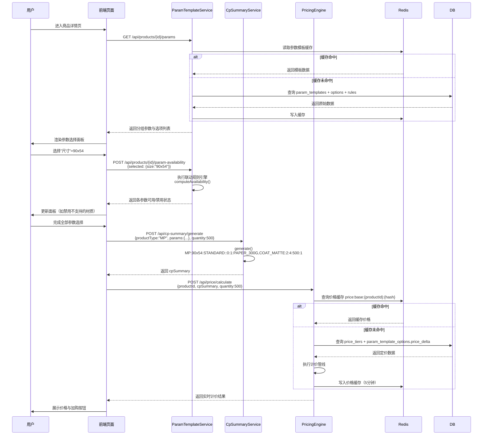
```mermaid
sequenceDiagram
    participant U as 用户
    participant F as 前端页面
    participant PTS as ParamTemplateService
    participant CpS as CpSummaryService
    participant PE as PricingEngine
    participant R as Redis

    U->>F: 进入商品详情页
    F->>PTS: GET /api/products/{id}/params
    PTS->>R: 读取参数模板缓存
    alt 缓存命中
        R-->>PTS: 返回模板数据
    else 缓存未命中
        PTS->>DB: 查询 param_templates + options + rules
        DB-->>PTS: 返回原始数据
        PTS->>R: 写入缓存
    end
    PTS-->>F: 返回分组参数与选项列表
    F->>U: 渲染参数选择面板

    U->>F: 选择"尺寸"=90x54
    F->>PTS: POST /api/products/{id}/param-availability<br/>{selected: {size:"90x54"}}
    PTS->>PTS: 执行联动规则引擎<br/>computeAvailability()
    PTS-->>F: 返回各参数可用/禁用状态
    F->>U: 更新面板（如禁用不支持的材质）

    U->>F: 完成全部参数选择
    F->>CpS: POST /api/cp-summary/generate<br/>{productType:"MP", params:{...}, quantity:500}
    CpS->>CpS: generate()<br/>MP:90x54:STANDARD::0:1:PAPER_300G,COAT_MATTE:2:4:500:1
    CpS-->>F: 返回 cpSummary

    F->>PE: POST /api/price/calculate<br/>{productId, cpSummary, quantity:500}
    PE->>R: 查询价格缓存 price:base:{productId}:{hash}
    alt 缓存命中
        R-->>PE: 返回缓存价格
    else 缓存未命中
        PE->>DB: 查询 price_tiers + param_template_options.price_delta
        DB-->>PE: 返回定价数据
        PE->>PE: 执行计价管线
        PE->>R: 写入价格缓存（5分钟）
    end
    PE-->>F: 返回实时计价结果
    F->>U: 展示价格与加购按钮
```

#### 时序图：文件上传校验

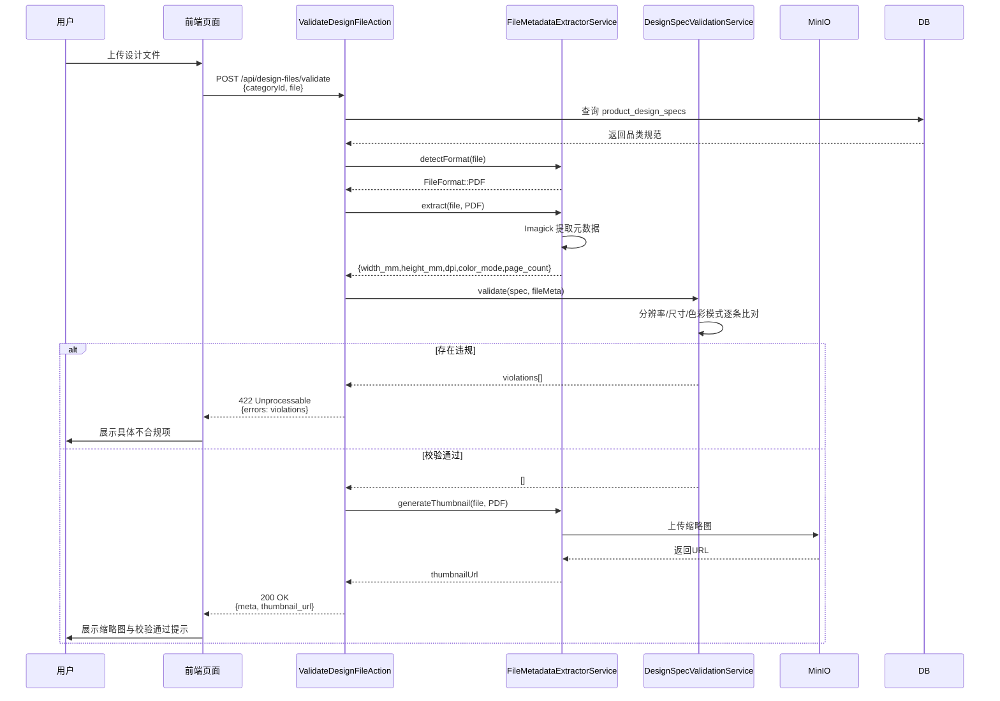
```mermaid
sequenceDiagram
    participant U as 用户
    participant F as 前端页面
    participant V as ValidateDesignFileAction
    participant FME as FileMetadataExtractorService
    participant DSV as DesignSpecValidationService
    participant MIN as MinIO

    U->>F: 上传设计文件
    F->>V: POST /api/design-files/validate<br/>{categoryId, file}
    V->>DB: 查询 product_design_specs
    DB-->>V: 返回品类规范
    V->>FME: detectFormat(file)
    FME-->>V: FileFormat::PDF
    V->>FME: extract(file, PDF)
    FME->>FME: Imagick 提取元数据
    FME-->>V: {width_mm,height_mm,dpi,color_mode,page_count}

    V->>DSV: validate(spec, fileMeta)
    DSV->>DSV: 分辨率/尺寸/色彩模式逐条比对
    alt 存在违规
        DSV-->>V: violations[]
        V-->>F: 422 Unprocessable<br/>{errors: violations}
        F->>U: 展示具体不合规项
    else 校验通过
        DSV-->>V: []
        V->>FME: generateThumbnail(file, PDF)
        FME->>MIN: 上传缩略图
        MIN-->>FME: 返回URL
        FME-->>V: thumbnailUrl
        V-->>F: 200 OK<br/>{meta, thumbnail_url}
        F->>U: 展示缩略图与校验通过提示
    end
```

---

> **章节结束** | 下一节：6.43 优惠券与促销子系统设计

---


## 6.43 优惠券与促销子系统设计 (CouponPromotionService)

### 6.43.1 设计概述

优惠券与促销子系统承担全平台营销优惠的核心能力，覆盖优惠券生命周期管理（创建→发放→领取→使用→过期）、促销活动配置（限时折扣/满赠/首单/推荐返利）以及优惠叠加规则计算。系统与计价引擎（6.1节）深度集成，在定价管线最后阶段注入优惠抵扣。

**覆盖PRD**：FR-VIP-010 ~ FR-VIP-018

**核心设计原则**：
1. **优惠可叠加但封顶**：VIP折扣与优惠券可叠加（乘法），但最低折扣封顶0.5折
2. **同类型互斥**：同类型折扣取最优惠，不叠加
3. **样品/印品折扣隔离**：VIP印品折扣与样品折扣互斥（取最优惠）
4. **时效驱动**：所有优惠券支持固定有效期或相对有效期（领取后N天）

---

### 6.43.2 枚举定义

```php
<?php

namespace App\Enums;

/**
 * 优惠券类型
 */
enum CouponType: int
{
    case NEW_CUSTOMER = 1;      // 新人礼包
    case SAMPLE_DISCOUNT = 2;   // 样品折扣券
    case SAMPLE_VOUCHER = 3;    // 样品固定金额券（1599/1999/2599）
    case PRINT_DISCOUNT = 4;    // 印品折扣券
    case FULL_REDUCTION = 5;    // 满减券
    case SHIPPING = 6;          // 运费券
    case TIME_LIMIT = 7;        // 限时折扣
    case FIRST_ORDER = 8;       // 首单优惠
    case REFERRAL = 9;          // 推荐返利

    public function label(): string
    {
        return match ($this) {
            self::NEW_CUSTOMER => '新人礼包',
            self::SAMPLE_DISCOUNT => '样品折扣券',
            self::SAMPLE_VOUCHER => '样品金额券',
            self::PRINT_DISCOUNT => '印品折扣券',
            self::FULL_REDUCTION => '满减券',
            self::SHIPPING => '运费券',
            self::TIME_LIMIT => '限时折扣',
            self::FIRST_ORDER => '首单优惠',
            self::REFERRAL => '推荐返利',
        };
    }

    /**
     * 是否与VIP折扣可叠加
     */
    public function isStackableWithVip(): bool
    {
        return in_array($this, [self::FULL_REDUCTION, self::SHIPPING, self::TIME_LIMIT], true);
    }

    /**
     * 是否仅限样品订单使用
     */
    public function isSampleOnly(): bool
    {
        return in_array($this, [self::SAMPLE_DISCOUNT, self::SAMPLE_VOUCHER], true);
    }
}
```

```php
<?php

namespace App\Enums;

/**
 * 客户优惠券状态
 */
enum CustomerCouponStatus: int
{
    case UNUSED = 0;     // 未使用
    case USED = 1;       // 已使用
    case EXPIRED = 2;    // 已过期
    case FROZEN = 3;     // 冻结中（如订单未支付）

    public function label(): string
    {
        return match ($this) {
            self::UNUSED => '未使用',
            self::USED => '已使用',
            self::EXPIRED => '已过期',
            self::FROZEN => '冻结中',
        };
    }
}
```

```php
<?php

namespace App\Enums;

/**
 * 优惠券适用范围类型
 */
enum CouponScopeType: int
{
    case ALL = 0;           // 全平台
    case CATEGORY = 1;      // 指定分类
    case PRODUCT = 2;       // 指定商品
    case ORDER_TYPE = 3;    // 指定订单类型

    public function label(): string
    {
        return match ($this) {
            self::ALL => '全平台',
            self::CATEGORY => '指定分类',
            self::PRODUCT => '指定商品',
            self::ORDER_TYPE => '指定订单类型',
        };
    }
}
```

---

### 6.43.3 数据模型与 Migration

#### coupons 表（优惠券模板）

```php
Schema::create('coupons', function (Blueprint $table) {
    $table->id();
    $table->string('code', 32)->unique()->comment('优惠券编码');
    $table->string('name', 100)->comment('优惠券名称');
    $table->foreignId('created_by')->nullable()->constrained('admin_users')->comment('创建人');
    $table->tinyInteger('type')->comment('类型：1新人礼包 2样品折扣 3样品金额券 4印品折扣 5满减 6运费 7限时折扣 8首单 9推荐返利');
    $table->tinyInteger('discount_type')->comment('优惠方式：1百分比折扣 2固定金额抵扣 3免运费');
    $table->decimal('discount_value', 10, 2)->comment('优惠值：百分比时存0.90表示9折，固定金额时存具体金额');
    $table->decimal('min_order_amount', 10, 2)->default(0)->comment('最低订单金额要求');
    $table->decimal('max_discount_amount', 10, 2)->nullable()->comment('最高优惠金额封顶');
    $table->tinyInteger('scope_type')->default(0)->comment('适用范围：0全平台 1分类 2商品 3订单类型');
    $table->json('scope_ids')->nullable()->comment('适用范围ID列表');
    $table->unsignedInteger('total_quantity')->default(0)->comment('总发放数量，0表示不限');
    $table->unsignedInteger('claimed_quantity')->default(0)->comment('已领取数量');
    $table->unsignedInteger('used_quantity')->default(0)->comment('已使用数量');
    $table->timestamp('valid_from')->nullable()->comment('有效期开始');
    $table->timestamp('valid_until')->nullable()->comment('有效期结束');
    $table->unsignedInteger('valid_days_after_claim')->nullable()->comment('领取后N天内有效');
    $table->boolean('is_active')->default(true)->comment('是否启用');
    $table->json('meta')->nullable()->comment('扩展配置：如限时折扣的时段、满赠的赠品ID等');
    $table->timestamps();
    $table->softDeletes();

    $table->index(['type', 'is_active', 'valid_until']);
    $table->index(['scope_type', 'scope_ids'], 'idx_scope');
});
```

#### customer_coupons 表（客户已领取优惠券）

```php
Schema::create('customer_coupons', function (Blueprint $table) {
    $table->id();
    $table->foreignId('customer_id')->constrained('customers')->comment('客户ID');
    $table->foreignId('coupon_id')->constrained('coupons')->comment('优惠券模板ID');
    $table->string('code', 32)->comment('券实例编码');
    $table->tinyInteger('status')->default(0)->comment('状态：0未使用 1已使用 2已过期 3冻结中');
    $table->timestamp('claimed_at')->comment('领取时间');
    $table->timestamp('used_at')->nullable()->comment('使用时间');
    $table->foreignId('used_order_id')->nullable()->constrained('orders')->comment('使用订单ID');
    $table->timestamp('valid_until')->comment('实例有效期截止');
    $table->timestamps();

    $table->unique(['customer_id', 'code']);
    $table->index(['customer_id', 'status', 'valid_until']);
    $table->index(['coupon_id', 'status']);
});
```

#### promotion_activities 表（促销活动）

```php
Schema::create('promotion_activities', function (Blueprint $table) {
    $table->id();
    $table->string('name', 100)->comment('活动名称');
    $table->tinyInteger('type')->comment('活动类型：1限时折扣 2满赠 3首单优惠 4推荐返利');
    $table->json('rules')->comment('活动规则JSON');
    $table->timestamp('start_at')->comment('活动开始');
    $table->timestamp('end_at')->comment('活动结束');
    $table->boolean('is_active')->default(true);
    $table->tinyInteger('vip_min_level')->default(0)->comment('最低VIP等级可参与，0表示全员');
    $table->boolean('vip_only')->default(false)->comment('是否仅限VIP参与');
    $table->timestamps();

    $table->index(['type', 'is_active', 'start_at', 'end_at']);
    $table->index(['vip_min_level', 'vip_only', 'is_active']);
});
```

---

### 6.43.4 Eloquent 模型

```php
<?php

namespace App\Models\Marketing;

use App\Enums\CouponType;
use App\Enums\CouponScopeType;
use Illuminate\Database\Eloquent\Model;
use Illuminate\Database\Eloquent\Relations\HasMany;
use Illuminate\Database\Eloquent\Factories\HasFactory;

class Coupon extends Model
{
    use HasFactory;

    protected $casts = [
        'type' => CouponType::class,
        'scope_type' => CouponScopeType::class,
        'discount_value' => MoneyCast::class,
        'min_order_amount' => MoneyCast::class,
        'max_discount_amount' => MoneyCast::class,
        'valid_from' => 'datetime',
        'valid_until' => 'datetime',
        'scope_ids' => 'array',
        'meta' => 'array',
        'is_active' => 'boolean',
    ];

    protected $fillable = [
        'code', 'name', 'type', 'discount_type', 'discount_value',
        'min_order_amount', 'max_discount_amount', 'scope_type', 'scope_ids',
        'total_quantity', 'valid_from', 'valid_until', 'valid_days_after_claim',
        'is_active', 'meta',
    ];

    public function customerCoupons(): HasMany
    {
        return $this->hasMany(CustomerCoupon::class);
    }

    /**
     * 是否还有库存可领取
     */
    public function hasStock(): bool
    {
        if ($this->total_quantity === 0) {
            return true; // 0表示不限量
        }
        return $this->claimed_quantity < $this->total_quantity;
    }

    /**
     * 当前是否在有效期内
     */
    public function isInValidPeriod(): bool
    {
        $now = now();
        if ($this->valid_from && $now->lt($this->valid_from)) {
            return false;
        }
        if ($this->valid_until && $now->gt($this->valid_until)) {
            return false;
        }
        return true;
    }
}
```

```php
<?php

namespace App\Models\Marketing;

use App\Enums\CustomerCouponStatus;
use App\Models\Customer;
use App\Models\Order\Order;
use Illuminate\Database\Eloquent\Model;
use Illuminate\Database\Eloquent\Relations\BelongsTo;
use Illuminate\Database\Eloquent\Factories\HasFactory;

class CustomerCoupon extends Model
{
    use HasFactory;

    protected $casts = [
        'status' => CustomerCouponStatus::class,
        'claimed_at' => 'datetime',
        'used_at' => 'datetime',
        'valid_until' => 'datetime',
    ];

    protected $fillable = [
        'customer_id', 'coupon_id', 'code', 'status',
        'claimed_at', 'used_at', 'used_order_id', 'valid_until',
    ];

    public function customer(): BelongsTo
    {
        return $this->belongsTo(Customer::class);
    }

    public function coupon(): BelongsTo
    {
        return $this->belongsTo(Coupon::class);
    }

    public function usedOrder(): BelongsTo
    {
        return $this->belongsTo(Order::class, 'used_order_id');
    }

    /**
     * 是否可用（未使用、未过期、未冻结）
     */
    public function isUsable(): bool
    {
        return $this->status === CustomerCouponStatus::UNUSED
            && now()->lt($this->valid_until);
    }

    /**
     * 标记为已使用
     */
    public function markAsUsed(int $orderId): void
    {
        $this->update([
            'status' => CustomerCouponStatus::USED,
            'used_at' => now(),
            'used_order_id' => $orderId,
        ]);
    }
}
```

---

### 6.43.5 Action 类

```php
<?php

namespace App\Actions\Marketing;

use App\Enums\CustomerCouponStatus;
use App\Models\Marketing\Coupon;
use App\Models\Marketing\CustomerCoupon;
use App\Exceptions\CouponException;
use Illuminate\Support\Str;

/**
 * 领取优惠券
 * FR-VIP-010: 领取
 */
class ClaimCouponAction
{
    public function execute(int $customerId, int $couponId): CustomerCoupon
    {
        $coupon = Coupon::findOrFail($couponId);

        throw_unless($coupon->is_active, CouponException::class, '优惠券未启用');
        throw_unless($coupon->isInValidPeriod(), CouponException::class, '优惠券不在有效期内');
        throw_unless($coupon->hasStock(), CouponException::class, '优惠券已领完');

        // 防重复领取（新人礼包等一次性券）
        $exists = CustomerCoupon::where('customer_id', $customerId)
            ->where('coupon_id', $couponId)
            ->exists();

        if ($exists && $coupon->type->isSampleOnly()) {
            throw new CouponException('您已领取过该优惠券');
        }

        // 分布式锁防超领
        $lockKey = "coupon:claim:{$couponId}";
        $lock = cache()->lock($lockKey, 10);

        throw_unless($lock->get(), CouponException::class, '领取人数过多，请稍后重试');

        try {
            $customerCoupon = CustomerCoupon::create([
                'customer_id' => $customerId,
                'coupon_id' => $couponId,
                'code' => strtoupper(Str::random(12)),
                'status' => CustomerCouponStatus::UNUSED,
                'claimed_at' => now(),
                'valid_until' => $this->calculateValidUntil($coupon),
            ]);

            $coupon->increment('claimed_quantity');

            return $customerCoupon;
        } finally {
            $lock->release();
        }
    }

    private function calculateValidUntil(Coupon $coupon): \DateTimeInterface
    {
        if ($coupon->valid_days_after_claim) {
            return now()->addDays($coupon->valid_days_after_claim);
        }
        return $coupon->valid_until ?? now()->addDays(30);
    }
}
```

```php
<?php

namespace App\Actions\Marketing;

use App\Models\Customer;
use App\Models\Marketing\Coupon;
use App\Models\Marketing\CustomerCoupon;
use App\Enums\CouponType;
use App\Enums\CustomerType;

/**
 * 自动发放新人礼包
 * FR-VIP-010: 新人礼包自动发放
 */
class GrantNewCustomerGiftAction
{
    public function execute(int $customerId): void
    {
        $customer = Customer::findOrFail($customerId);

        // 排除合伙人和内部员工
        if (in_array($customer->customer_type, [CustomerType::PARTNER, CustomerType::INTERNAL], true)) {
            return;
        }

        // 查找有效的新人礼包模板
        $newbieCoupons = Coupon::where('type', CouponType::NEW_CUSTOMER)
            ->where('is_active', true)
            ->where(function ($q) {
                $q->whereNull('valid_until')->orWhere('valid_until', '>', now());
            })
            ->get();

        foreach ($newbieCoupons as $coupon) {
            // 检查是否已领取
            $exists = CustomerCoupon::where('customer_id', $customerId)
                ->where('coupon_id', $coupon->id)
                ->exists();

            if (!$exists) {
                app(ClaimCouponAction::class)->execute($customerId, $coupon->id);
            }
        }

        // 标记已领取新人礼包（sign位掩码位0）
        $customer->sign |= 1;
        $customer->save();
    }
}
```

```php
<?php

namespace App\Actions\Marketing;

use App\Models\Customer;
use App\Models\Marketing\Coupon;
use App\Models\Marketing\CustomerCoupon;
use App\Enums\CouponType;
use App\Enums\VipLevel;

/**
 * 按VIP等级自动发放等级券
 * FR-VIP-010: 样品折扣券/印品折扣券/样品券按等级自动发放
 */
class GrantVipLevelCouponsAction
{
    /**
     * VIP等级对应的自动发放券映射
     */
    private const VIP_COUPON_MAP = [
        VipLevel::LV1->value => [CouponType::SAMPLE_DISCOUNT],
        VipLevel::LV2->value => [CouponType::SAMPLE_DISCOUNT],
        VipLevel::LV3->value => [CouponType::SAMPLE_DISCOUNT],
        VipLevel::LV4->value => [], // Lv4无专属折扣券
        VipLevel::LV5->value => [CouponType::SAMPLE_DISCOUNT],
        VipLevel::LV6->value => [CouponType::PRINT_DISCOUNT, CouponType::SAMPLE_VOUCHER],
        VipLevel::LV7->value => [CouponType::PRINT_DISCOUNT, CouponType::SAMPLE_VOUCHER],
        VipLevel::LV8->value => [CouponType::PRINT_DISCOUNT, CouponType::SAMPLE_VOUCHER],
    ];

    public function execute(int $customerId, VipLevel $oldLevel, VipLevel $newLevel): void
    {
        if ($oldLevel === $newLevel) {
            return;
        }

        $couponTypes = self::VIP_COUPON_MAP[$newLevel->value] ?? [];

        foreach ($couponTypes as $type) {
            $coupons = Coupon::where('type', $type)
                ->where('is_active', true)
                ->get();

            foreach ($coupons as $coupon) {
                $exists = CustomerCoupon::where('customer_id', $customerId)
                    ->where('coupon_id', $coupon->id)
                    ->where('status', \App\Enums\CustomerCouponStatus::UNUSED)
                    ->exists();

                if (!$exists) {
                    app(ClaimCouponAction::class)->execute($customerId, $coupon->id);
                }
            }
        }
    }
}
```

---

### 6.43.6 Service 类

```php
<?php

namespace App\Services\Marketing;

use App\Enums\CouponType;
use App\Enums\CustomerCouponStatus;
use App\Models\Marketing\Coupon;
use App\Models\Marketing\CustomerCoupon;
use App\Models\Order\Order;
use App\ValueObjects\Money;
use Illuminate\Database\Eloquent\Collection;

/**
 * 优惠券匹配与计算服务
 * FR-VIP-012: 下单时自动匹配可用优惠券
 */
class CouponMatcherService
{
    /**
     * 获取客户当前订单可用的所有优惠券
     */
    public function getAvailableCoupons(int $customerId, Order $order): Collection
    {
        return CustomerCoupon::with('coupon')
            ->where('customer_id', $customerId)
            ->where('status', CustomerCouponStatus::UNUSED)
            ->where('valid_until', '>', now())
            ->get()
            ->filter(function (CustomerCoupon $cc) use ($order) {
                return $this->isCouponApplicable($cc->coupon, $order);
            });
    }

    /**
     * 判断优惠券是否适用于当前订单
     */
    public function isCouponApplicable(Coupon $coupon, Order $order): bool
    {
        // 检查最低订单金额
        if ($order->total_amount->lessThan($coupon->min_order_amount)) {
            return false;
        }

        // 检查适用范围
        return match ($coupon->scope_type) {
            \App\Enums\CouponScopeType::ALL => true,
            \App\Enums\CouponScopeType::CATEGORY => $this->matchCategory($coupon, $order),
            \App\Enums\CouponScopeType::PRODUCT => $this->matchProduct($coupon, $order),
            \App\Enums\CouponScopeType::ORDER_TYPE => $this->matchOrderType($coupon, $order),
        };
    }

    /**
     * 计算优惠券抵扣金额
     */
    public function calculateDiscount(Coupon $coupon, Money $orderAmount): Money
    {
        $discount = match ($coupon->discount_type) {
            1 => $orderAmount->multiply(1 - $coupon->discount_value->toFloat()), // 百分比折扣
            2 => $coupon->discount_value, // 固定金额
            3 => Money::zero(), // 免运费，运费单独计算
        };

        // 封顶校验
        if ($coupon->max_discount_amount && $discount->greaterThan($coupon->max_discount_amount)) {
            $discount = $coupon->max_discount_amount;
        }

        // 抵扣金额不超过订单金额
        if ($discount->greaterThan($orderAmount)) {
            $discount = $orderAmount;
        }

        return $discount;
    }

    private function matchCategory(Coupon $coupon, Order $order): bool
    {
        $categoryIds = $order->items->pluck('product.category_id')->unique();
        return !empty(array_intersect($categoryIds->toArray(), $coupon->scope_ids ?? []));
    }

    private function matchProduct(Coupon $coupon, Order $order): bool
    {
        $productIds = $order->items->pluck('product_id')->unique();
        return !empty(array_intersect($productIds->toArray(), $coupon->scope_ids ?? []));
    }

    private function matchOrderType(Coupon $coupon, Order $order): bool
    {
        return in_array($order->order_type, $coupon->scope_ids ?? [], true);
    }
}
```

```php
<?php

namespace App\Services\Marketing;

use App\ValueObjects\Money;

/**
 * 优惠叠加规则计算服务
 * FR-VIP-014: 叠加规则
 */
class DiscountStackingService
{
    /**
     * 最低折扣封顶
     */
    private const MIN_DISCOUNT_FLOOR = 0.5;

    /**
     * 计算最终折扣系数（考虑VIP折扣 + 优惠券叠加）
     *
     * 规则：
     * 1. 同类型折扣取最优惠，不叠加
     * 2. VIP印品折扣与样品折扣互斥（取最优惠）
     * 3. 优惠券可与VIP折扣叠加（乘法），最低封顶0.5折
     */
    public function calculateFinalDiscount(
        ?float $vipPrintDiscount,   // VIP印品折扣系数，如0.90
        ?float $vipSampleDiscount,  // VIP样品折扣系数，如0.50
        ?float $couponDiscount,     // 优惠券折扣系数，如0.95或固定金额抵扣后的等效系数
        bool $isSampleOrder = false
    ): float {
        // 步骤1：确定VIP折扣（印品/样品互斥取最优惠）
        $vipDiscount = $isSampleOrder
            ? ($vipSampleDiscount ?? 1.0)
            : ($vipPrintDiscount ?? 1.0);

        // 步骤2：叠加优惠券折扣（乘法）
        $finalDiscount = $vipDiscount * ($couponDiscount ?? 1.0);

        // 步骤3：最低折扣封顶0.5折
        return max($finalDiscount, self::MIN_DISCOUNT_FLOOR);
    }

    /**
     * 校验折扣组合是否合法
     */
    public function validateDiscountCombination(array $discounts): bool
    {
        // 检查是否有多个同类型折扣
        $types = array_column($discounts, 'type');
        return count($types) === count(array_unique($types));
    }
}
```

---

### 6.43.7 事件与监听

```php
<?php

namespace App\Events\Marketing;

use App\Models\Marketing\CustomerCoupon;
use Illuminate\Foundation\Events\Dispatchable;

class CouponUsed
{
    use Dispatchable;

    public function __construct(
        public readonly CustomerCoupon $customerCoupon,
        public readonly int $orderId,
    ) {}
}
```

```php
<?php

namespace App\Listeners\Marketing;

use App\Events\Marketing\CouponUsed;
use App\Models\Marketing\Coupon;

class UpdateCouponUsageStats
{
    public function handle(CouponUsed $event): void
    {
        $coupon = Coupon::find($event->customerCoupon->coupon_id);
        if ($coupon) {
            $coupon->increment('used_quantity');
        }
    }
}
```

---

### 6.43.8 关键业务规则

| 规则项 | 说明 |
|--------|------|
| **同类型互斥** | 同类型折扣（如两个满减券）不可叠加，系统自动取最优惠 |
| **VIP与券叠加** | VIP折扣系数 × 优惠券折扣系数，乘法叠加 |
| **最低封顶** | 叠加后折扣系数不低于0.5（即最多5折） |
| **印品/样品互斥** | VIP印品折扣与样品折扣互斥，取当前订单类型对应的折扣 |
| **时效规则** | 固定有效期优先，无固定有效期则按领取后N天计算 |
| **样品券限制** | 样品折扣券/金额券仅限样品订单(orderType=sample)使用 |
| **运费券** | 运费券在运费计算阶段独立抵扣，不参与折扣系数叠加 |
| **新人礼包** | 注册自动发放，一次性领取，排除合伙人和内部员工 |

---

### 6.43.9 类图

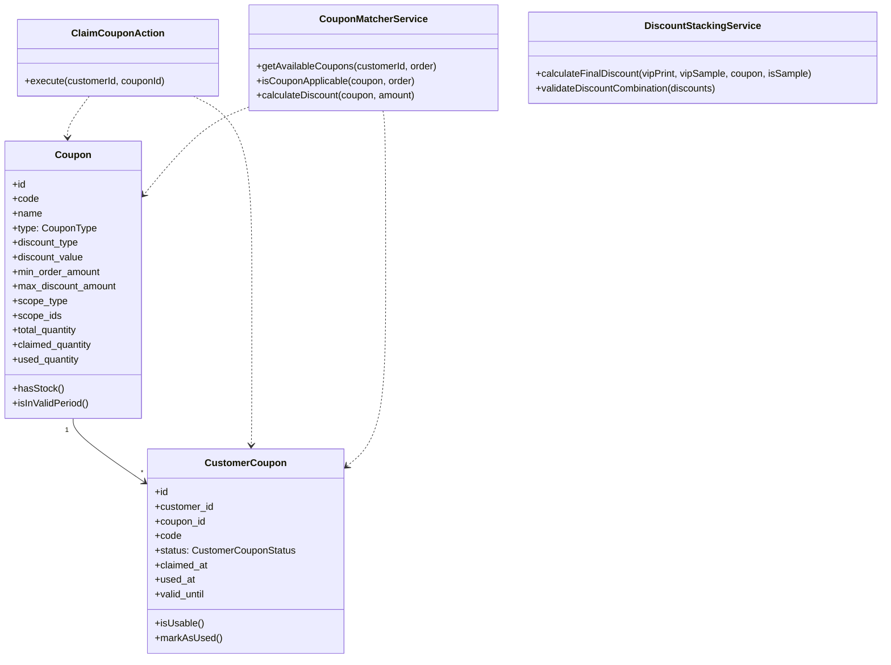
```mermaid
classDiagram
    class Coupon {
        +id
        +code
        +name
        +type: CouponType
        +discount_type
        +discount_value
        +min_order_amount
        +max_discount_amount
        +scope_type
        +scope_ids
        +total_quantity
        +claimed_quantity
        +used_quantity
        +hasStock()
        +isInValidPeriod()
    }
    class CustomerCoupon {
        +id
        +customer_id
        +coupon_id
        +code
        +status: CustomerCouponStatus
        +claimed_at
        +used_at
        +valid_until
        +isUsable()
        +markAsUsed()
    }
    class ClaimCouponAction {
        +execute(customerId, couponId)
    }
    class CouponMatcherService {
        +getAvailableCoupons(customerId, order)
        +isCouponApplicable(coupon, order)
        +calculateDiscount(coupon, amount)
    }
    class DiscountStackingService {
        +calculateFinalDiscount(vipPrint, vipSample, coupon, isSample)
        +validateDiscountCombination(discounts)
    }

    Coupon "1" --> "*" CustomerCoupon
    ClaimCouponAction ..> Coupon
    ClaimCouponAction ..> CustomerCoupon
    CouponMatcherService ..> CustomerCoupon
    CouponMatcherService ..> Coupon
```

---

## 6.44 用户标签与画像子系统设计 (CustomerTagService)

> **技术栈**：PHP 8.5 + Laravel 13.x + MySQL 8.0 + Redis 7.x
> **设计原则**：RFM量化驱动、标签规则可配置、画像数据物化加速、Action原子化、Schedule定时更新。
> **关联章节**：6.12 积分成长值系统（grow_value、vip_level联动）、6.32 管理后台（标签管理、客户筛选）。

---

### 6.44.1 设计概述

用户标签与画像子系统承担客户精细化运营的核心数据能力，覆盖 **RFM等级计算、标签生命周期管理、自动/手动打标、客户360°画像、采购偏好分析、消费趋势统计、价值预测** 七大能力域。

**核心设计原则**：

1. **RFM量化分级**：Recency（最近下单距今天数）、Frequency（月均订单频次）、Monetary（累计消费金额）三维评分，每日凌晨通过 Schedule 任务批量重算，输出 A/B/C/D 四级客户等级。
2. **标签规则可配置**：自动打标规则存储于 `tag_rules` 表，支持运营人员热更新阈值与条件，无需发版。
3. **画像数据物化加速**：`customer_profiles` 物化视图（或缓存加速表）聚合客户基本信息、订单统计、偏好品类、消费趋势，避免每次查询进行多表 JOIN 和聚合计算。
4. **打标幂等性**：自动打标任务基于 `customer_tag_bindings` 的联合唯一索引 `(customer_id, tag_id, source)` 保证同一来源标签不重复绑定。
5. **与成长值系统联动**：RFM等级变化时，通过 Laravel Event 触发 `CustomerGradeChanged` 事件，积分成长值系统监听并调整 `grow_value` 与 `vip_level`（6.12节）。

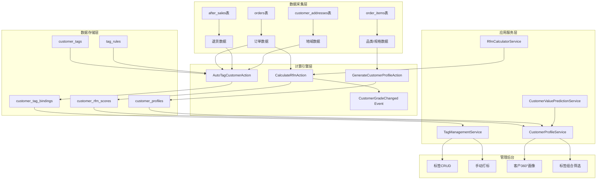
```mermaid
graph TB
    subgraph 数据采集层
        O1[orders表] --> D1[订单数据]
        O2[order_items表] --> D2[品类/规格数据]
        O3[after_sales表] --> D3[退货数据]
        O4[customer_addresses表] --> D4[地域数据]
    end

    subgraph 计算引擎层
        D1 --> S1[CalculateRfmAction]
        D1 --> S2[AutoTagCustomerAction]
        D2 --> S3[GenerateCustomerProfileAction]
        D3 --> S2
        D4 --> S2
        S1 --> E1[CustomerGradeChanged Event]
    end

    subgraph 数据存储层
        S1 --> T1[customer_rfm_scores]
        S2 --> T2[customer_tag_bindings]
        S3 --> T3[customer_profiles]
        T4[customer_tags] --> S2
        T5[tag_rules] --> S2
    end

    subgraph 应用服务层
        T1 --> S4[CustomerProfileService]
        T2 --> S5[TagManagementService]
        T3 --> S4
        S6[RfmCalculatorService] --> S1
        S7[CustomerValuePredictionService] --> S4
    end

    subgraph 管理后台
        S5 --> A1[标签CRUD]
        S5 --> A2[手动打标]
        S4 --> A3[客户360°画像]
        S4 --> A4[标签组合筛选]
    end
```

---

### 6.44.2 枚举定义

#### TagType（标签类型）

```php
<?php

declare(strict_types=1);

namespace App\Enums;

/**
 * 客户标签类型
 * 对应 customer_tags.tag_type 字段
 */
enum TagType: int
{
    case RFM       = 1;  // RFM等级标签
    case INDUSTRY  = 2;  // 行业标签
    case BEHAVIOR  = 3;  // 行为标签
    case VALUE     = 4;  // 价值标签
    case SERVICE   = 5;  // 服务标签
    case REGION    = 6;  // 地域标签

    public function label(): string
    {
        return match ($this) {
            self::RFM      => 'RFM等级',
            self::INDUSTRY => '行业标签',
            self::BEHAVIOR => '行为标签',
            self::VALUE    => '价值标签',
            self::SERVICE  => '服务标签',
            self::REGION   => '地域标签',
        };
    }

    /**
     * 是否为系统自动打标的类型
     */
    public function isAutoTaggable(): bool
    {
        return in_array($this, [
            self::RFM,
            self::BEHAVIOR,
            self::VALUE,
            self::SERVICE,
            self::REGION,
        ], true);
    }
}
```

#### RfmLevel（RFM评分等级）

```php
<?php

declare(strict_types=1);

namespace App\Enums;

/**
 * RFM模型综合评分等级
 * 对应 customer_rfm_scores.rfm_level 字段
 */
enum RfmLevel: string
{
    case A = 'A';  // 重要价值客户
    case B = 'B';  // 重要发展客户
    case C = 'C';  // 一般价值客户
    case D = 'D';  // 流失风险客户

    public function label(): string
    {
        return match ($this) {
            self::A => '重要价值客户',
            self::B => '重要发展客户',
            self::C => '一般价值客户',
            self::D => '流失风险客户',
        };
    }

    /**
     * 获取等级对应的服务响应时效（小时）
     */
    public function responseSlaHours(): int
    {
        return match ($this) {
            self::A => 2,
            self::B => 4,
            self::C => 8,
            self::D => 24,
        };
    }

    /**
     * 获取等级对应的账期额度（元）
     */
    public function creditLimit(): float
    {
        return match ($this) {
            self::A => 500000.00,
            self::B => 100000.00,
            self::C => 10000.00,
            self::D => 0.00,
        };
    }

    /**
     * 获取等级对应的默认折扣力度（折扣系数，1.0=无折扣）
     */
    public function defaultDiscountFactor(): float
    {
        return match ($this) {
            self::A => 0.88,
            self::B => 0.93,
            self::C => 0.97,
            self::D => 1.00,
        };
    }
}
```

#### CustomerGrade（客户等级）

```php
<?php

declare(strict_types=1);

namespace App\Enums;

/**
 * 客户综合等级（与 RFM 解耦，供业务展示使用）
 * 对应 customers.grade 字段（扩展字段）
 */
enum CustomerGrade: string
{
    case A = 'A';
    case B = 'B';
    case C = 'C';
    case D = 'D';

    public function label(): string
    {
        return match ($this) {
            self::A => 'A级客户',
            self::B => 'B级客户',
            self::C => 'C级客户',
            self::D => 'D级客户',
        };
    }

    /**
     * 从 RfmLevel 映射为客户展示等级
     */
    public static function fromRfmLevel(RfmLevel $level): self
    {
        return match ($level) {
            RfmLevel::A => self::A,
            RfmLevel::B => self::B,
            RfmLevel::C => self::C,
            RfmLevel::D => self::D,
        };
    }
}
```

---

### 6.44.3 Migration

#### customer_tags（客户标签定义表）

```php
<?php

use Illuminate\Database\Migrations\Migration;
use Illuminate\Database\Schema\Blueprint;
use Illuminate\Support\Facades\Schema;

return new class extends Migration
{
    public function up(): void
    {
        Schema::create('customer_tags', function (Blueprint $table) {
            $table->id()->comment('标签主键');
            $table->string('name', 64)->comment('标签名称');
            $table->tinyInteger('tag_type')->comment('标签类型：1=RFM 2=行业 3=行为 4=价值 5=服务 6=地域');
            $table->string('color', 16)->default('#1890ff')->comment('标签颜色，后台展示用');
            $table->boolean('is_auto')->default(false)->comment('是否系统自动打标');
            $table->boolean('is_enabled')->default(true)->comment('是否启用');
            $table->unsignedBigInteger('created_by')->nullable()->comment('创建人admin_id，NULL为系统创建');
            $table->text('description')->nullable()->comment('标签说明');
            $table->timestamps();
            $table->softDeletes();

            $table->index('tag_type', 'idx_tag_type');
            $table->index('is_auto', 'idx_is_auto');
            $table->index('is_enabled', 'idx_is_enabled');
        });
    }

    public function down(): void
    {
        Schema::dropIfExists('customer_tags');
    }
};
```

#### tag_rules（自动打标规则表）

```php
<?php

use Illuminate\Database\Migrations\Migration;
use Illuminate\Database\Schema\Blueprint;
use Illuminate\Support\Facades\Schema;

return new class extends Migration
{
    public function up(): void
    {
        Schema::create('tag_rules', function (Blueprint $table) {
            $table->id()->comment('规则主键');
            $table->foreignId('tag_id')->constrained('customer_tags')->comment('关联标签ID');
            $table->string('rule_name', 128)->comment('规则名称');
            $table->string('rule_key', 32)->unique()->comment('规则标识，如high_frequency');
            $table->tinyInteger('condition_type')->comment('条件类型：1=订单频次 2=订单金额 3=未下单天数 4=退货率 5=累计消费 6=地域 7=品类偏好');
            $table->string('operator', 16)->comment('比较运算符：>=, <=, >, <, =, between');
            $table->json('threshold')->comment('阈值参数JSON，如{"min":5,"days":30}');
            $table->unsignedTinyInteger('priority')->default(10)->comment('优先级，数值越小越优先');
            $table->boolean('is_enabled')->default(true)->comment('是否启用');
            $table->timestamps();

            $table->index('tag_id', 'idx_tag_id');
            $table->index('rule_key', 'idx_rule_key');
            $table->index('condition_type', 'idx_condition_type');
            $table->index('is_enabled', 'idx_is_enabled');
            $table->index('priority', 'idx_priority');
        });
    }

    public function down(): void
    {
        Schema::dropIfExists('tag_rules');
    }
};
```

#### customer_tag_bindings（客户标签绑定表）

```php
<?php

use Illuminate\Database\Migrations\Migration;
use Illuminate\Database\Schema\Blueprint;
use Illuminate\Support\Facades\Schema;

return new class extends Migration
{
    public function up(): void
    {
        Schema::create('customer_tag_bindings', function (Blueprint $table) {
            $table->id()->comment('绑定主键');
            $table->foreignId('customer_id')->constrained('customers')->comment('客户ID');
            $table->foreignId('tag_id')->constrained('customer_tags')->comment('标签ID');
            $table->tinyInteger('source')->default(1)->comment('来源：1=系统自动 2=手动打标 3=RFM计算');
            $table->unsignedBigInteger('created_by')->nullable()->comment('手动打标时的操作人admin_id');
            $table->timestamp('created_at')->comment('绑定时间');

            // 联合唯一：同一客户同一标签同一来源仅允许一条记录
            $table->unique(['customer_id', 'tag_id', 'source'], 'uniq_customer_tag_source');
            $table->index('customer_id', 'idx_customer_id');
            $table->index('tag_id', 'idx_tag_id');
            $table->index('source', 'idx_source');
        });
    }

    public function down(): void
    {
        Schema::dropIfExists('customer_tag_bindings');
    }
};
```

#### customer_profiles（客户360°画像物化表）

```php
<?php

use Illuminate\Database\Migrations\Migration;
use Illuminate\Database\Schema\Blueprint;
use Illuminate\Support\Facades\Schema;

return new class extends Migration
{
    public function up(): void
    {
        Schema::create('customer_profiles', function (Blueprint $table) {
            $table->id()->comment('画像主键');
            $table->foreignId('customer_id')->unique()->constrained('customers')->comment('客户ID');

            // 订单统计
            $table->unsignedInteger('total_orders')->default(0)->comment('累计订单数');
            $table->decimal('total_amount', 14, 2)->default(0)->comment('累计消费金额');
            $table->decimal('avg_order_amount', 14, 2)->default(0)->comment('平均客单价');
            $table->decimal('max_order_amount', 14, 2)->default(0)->comment('最大单笔订单金额');
            $table->unsignedInteger('total_items')->default(0)->comment('累计购买商品件数');

            // 时间维度
            $table->timestamp('first_order_at')->nullable()->comment('首单时间');
            $table->timestamp('last_order_at')->nullable()->comment('最近下单时间');
            $table->unsignedInteger('days_since_last_order')->default(0)->comment('距今天数（Recency）');

            // 偏好统计（JSON聚合）
            $table->json('favorite_categories')->nullable()->comment('偏好品类TOP5 [{category_id,count,amount}]');
            $table->json('favorite_specs')->nullable()->comment('偏好规格TOP5 [{spec_name,count}]');
            $table->json('favorite_processes')->nullable()->comment('偏好工艺TOP5 [{process_name,count}]');

            // 售后统计
            $table->unsignedInteger('total_after_sales')->default(0)->comment('累计售后次数');
            $table->decimal('return_rate', 5, 4)->default(0)->comment('退货率 0.0000~1.0000');

            // 服务标签聚合
            $table->json('service_tags')->nullable()->comment('服务标签聚合 [\"要求对账\",\"需要发票\"]');

            // 趋势数据（近12个月）
            $table->json('monthly_trends')->nullable()->comment('月度趋势 [{month,order_count,amount}]');

            // 预测数据
            $table->decimal('predict_prob_30d', 5, 4)->default(0)->comment('未来30天消费概率');
            $table->decimal('predict_amount_30d', 14, 2)->default(0)->comment('未来30天预测消费金额');

            // 缓存元数据
            $table->timestamp('calculated_at')->nullable()->comment('画像计算时间');
            $table->timestamps();

            $table->index('total_amount', 'idx_total_amount');
            $table->index('last_order_at', 'idx_last_order_at');
            $table->index('days_since_last_order', 'idx_recency');
            $table->index('calculated_at', 'idx_calculated_at');
        });
    }

    public function down(): void
    {
        Schema::dropIfExists('customer_profiles');
    }
};
```

#### customer_rfm_scores（客户RFM评分表）

```php
<?php

use Illuminate\Database\Migrations\Migration;
use Illuminate\Database\Schema\Blueprint;
use Illuminate\Support\Facades\Schema;

return new class extends Migration
{
    public function up(): void
    {
        Schema::create('customer_rfm_scores', function (Blueprint $table) {
            $table->id()->comment('评分主键');
            $table->foreignId('customer_id')->unique()->constrained('customers')->comment('客户ID');

            // R 最近消费
            $table->unsignedInteger('recency_days')->default(999)->comment('最近下单距今天数');
            $table->unsignedTinyInteger('r_score')->default(1)->comment('R评分 1~5');

            // F 消费频次
            $table->decimal('frequency_monthly', 8, 2)->default(0)->comment('月均订单频次');
            $table->unsignedTinyInteger('f_score')->default(1)->comment('F评分 1~5');

            // M 消费金额
            $table->decimal('monetary_total', 14, 2)->default(0)->comment('累计消费金额');
            $table->unsignedTinyInteger('m_score')->default(1)->comment('M评分 1~5');

            // 综合等级
            $table->string('rfm_level', 1)->default('D')->comment('综合等级 A/B/C/D');
            $table->unsignedTinyInteger('composite_score')->default(0)->comment('综合得分 R×100+F×10+M');

            $table->timestamp('calculated_at')->nullable()->comment('计算时间');
            $table->timestamps();

            $table->index('rfm_level', 'idx_rfm_level');
            $table->index('composite_score', 'idx_composite_score');
            $table->index('calculated_at', 'idx_calculated_at');
        });
    }

    public function down(): void
    {
        Schema::dropIfExists('customer_rfm_scores');
    }
};
```

---

### 6.44.4 Eloquent模型

#### CustomerTag（客户标签定义模型）

```php
<?php

declare(strict_types=1);

namespace App\Models;

use App\Enums\TagType;
use Illuminate\Database\Eloquent\Relations\HasMany;

class CustomerTag extends BaseModel
{
    protected $table = 'customer_tags';

    protected $fillable = [
        'name', 'tag_type', 'color', 'is_auto', 'is_enabled',
        'created_by', 'description',
    ];

    protected $casts = [
        'tag_type' => TagType::class,
        'is_auto' => 'boolean',
        'is_enabled' => 'boolean',
    ];

    public function bindings(): HasMany
    {
        return $this->hasMany(CustomerTagBinding::class, 'tag_id');
    }

    public function rules(): HasMany
    {
        return $this->hasMany(TagRule::class, 'tag_id');
    }

    /**
     * 作用域：启用的标签
     */
    public function scopeEnabled($query)
    {
        return $query->where('is_enabled', true);
    }
}
```

#### TagRule（自动打标规则模型）

```php
<?php

declare(strict_types=1);

namespace App\Models;

use Illuminate\Database\Eloquent\Relations\BelongsTo;

class TagRule extends BaseModel
{
    protected $table = 'tag_rules';

    protected $fillable = [
        'tag_id', 'rule_name', 'rule_key', 'condition_type',
        'operator', 'threshold', 'priority', 'is_enabled',
    ];

    protected $casts = [
        'threshold' => 'array',
        'priority' => 'integer',
        'is_enabled' => 'boolean',
    ];

    public function tag(): BelongsTo
    {
        return $this->belongsTo(CustomerTag::class, 'tag_id');
    }

    public function scopeEnabled($query)
    {
        return $query->where('is_enabled', true);
    }
}
```

#### CustomerProfile（客户画像物化模型）

```php
<?php

declare(strict_types=1);

namespace App\Models;

use Illuminate\Database\Eloquent\Relations\BelongsTo;

class CustomerProfile extends BaseModel
{
    protected $table = 'customer_profiles';

    protected $fillable = [
        'customer_id', 'total_orders', 'total_amount', 'avg_order_amount',
        'max_order_amount', 'total_items', 'first_order_at', 'last_order_at',
        'days_since_last_order', 'favorite_categories', 'favorite_specs',
        'favorite_processes', 'total_after_sales', 'return_rate',
        'service_tags', 'monthly_trends', 'predict_prob_30d',
        'predict_amount_30d', 'calculated_at',
    ];

    protected $casts = [
        'total_amount' => MoneyCast::class,
        'avg_order_amount' => MoneyCast::class,
        'max_order_amount' => MoneyCast::class,
        'return_rate' => 'decimal:4',
        'favorite_categories' => 'array',
        'favorite_specs' => 'array',
        'favorite_processes' => 'array',
        'service_tags' => 'array',
        'monthly_trends' => 'array',
        'predict_prob_30d' => 'decimal:4',
        'predict_amount_30d' => MoneyCast::class,
        'first_order_at' => 'datetime',
        'last_order_at' => 'datetime',
        'calculated_at' => 'datetime',
    ];

    public function customer(): BelongsTo
    {
        return $this->belongsTo(Customer::class, 'customer_id');
    }

    /**
     * 画像数据是否过期（超过24小时需重算）
     */
    public function isStale(): bool
    {
        if (! $this->calculated_at) {
            return true;
        }
        return $this->calculated_at->diffInHours(now()) >= 24;
    }
}
```

#### CustomerRfmScore（RFM评分模型）

```php
<?php

declare(strict_types=1);

namespace App\Models;

use App\Enums\RfmLevel;
use Illuminate\Database\Eloquent\Relations\BelongsTo;

class CustomerRfmScore extends BaseModel
{
    protected $table = 'customer_rfm_scores';

    protected $fillable = [
        'customer_id', 'recency_days', 'r_score',
        'frequency_monthly', 'f_score',
        'monetary_total', 'm_score',
        'rfm_level', 'composite_score', 'calculated_at',
    ];

    protected $casts = [
        'recency_days' => 'integer',
        'r_score' => 'integer',
        'frequency_monthly' => 'float',
        'f_score' => 'integer',
        'monetary_total' => MoneyCast::class,
        'm_score' => 'integer',
        'rfm_level' => RfmLevel::class,
        'composite_score' => 'integer',
        'calculated_at' => 'datetime',
    ];

    public function customer(): BelongsTo
    {
        return $this->belongsTo(Customer::class, 'customer_id');
    }

    /**
     * 获取当前等级对应的 CustomerGrade
     */
    public function toCustomerGrade(): \App\Enums\CustomerGrade
    {
        return \App\Enums\CustomerGrade::fromRfmLevel($this->rfm_level);
    }
}
```

#### CustomerTagBinding（客户标签绑定模型）

```php
<?php

declare(strict_types=1);

namespace App\Models;

use Illuminate\Database\Eloquent\Relations\BelongsTo;

class CustomerTagBinding extends BaseModel
{
    protected $table = 'customer_tag_bindings';

    public $timestamps = false;

    protected $fillable = [
        'customer_id', 'tag_id', 'source', 'created_by', 'created_at',
    ];

    protected $casts = [
        'source' => 'integer',
        'created_by' => 'integer',
        'created_at' => 'datetime',
    ];

    public function customer(): BelongsTo
    {
        return $this->belongsTo(Customer::class, 'customer_id');
    }

    public function tag(): BelongsTo
    {
        return $this->belongsTo(CustomerTag::class, 'tag_id');
    }
}
```

---

### 6.44.5 Action类

#### CreateTagAction（创建/更新标签）

```php
<?php

declare(strict_types=1);

namespace App\Actions\CustomerTag;

use App\Enums\TagType;
use App\Models\CustomerTag;
use Illuminate\Support\Facades\Validator;
use Illuminate\Validation\ValidationException;

final class CreateTagAction
{
    /**
     * 创建或更新标签
     *
     * @param array $data 标签数据
     * @param int|null $tagId 为NULL时创建，否则更新
     * @param int|null $adminId 操作人ID
     */
    public function execute(array $data, ?int $tagId = null, ?int $adminId = null): CustomerTag
    {
        $validator = Validator::make($data, [
            'name' => 'required|string|max:64',
            'tag_type' => 'required|integer|in:1,2,3,4,5,6',
            'color' => 'nullable|string|max:16',
            'is_auto' => 'boolean',
            'is_enabled' => 'boolean',
            'description' => 'nullable|string|max:500',
        ]);

        if ($validator->fails()) {
            throw new ValidationException($validator);
        }

        if ($tagId) {
            $tag = CustomerTag::findOrFail($tagId);
            $tag->update($validator->validated());
            return $tag;
        }

        return CustomerTag::create([
            ...$validator->validated(),
            'created_by' => $adminId,
        ]);
    }
}
```

#### CalculateRfmAction（RFM评分计算）

```php
<?php

declare(strict_types=1);

namespace App\Actions\CustomerTag;

use App\Enums\RfmLevel;
use App\Events\CustomerTag\CustomerGradeChanged;
use App\Models\Customer;
use App\Models\CustomerRfmScore;
use App\Models\Order;
use Illuminate\Support\Collection;
use Illuminate\Support\Facades\DB;
use Illuminate\Support\Facades\Log;

final class CalculateRfmAction
{
    /**
     * R 评分阈值（天数越小，评分越高）
     */
    private const R_THRESHOLDS = [
        7  => 5,   // ≤7天
        30 => 4,   // ≤30天
        90 => 3,   // ≤90天
        180 => 2,  // ≤180天
    ];

    /**
     * F 评分阈值（月均频次）
     */
    private const F_THRESHOLDS = [
        5.0  => 5,
        2.0  => 4,
        1.0  => 3,
        0.5  => 2,
    ];

    /**
     * M 评分阈值（累计消费金额）
     */
    private const M_THRESHOLDS = [
        500000 => 5,
        100000 => 4,
        10000  => 3,
        1000   => 2,
    ];

    /**
     * 批量计算所有活跃客户的RFM评分
     */
    public function executeAll(): int
    {
        $count = 0;
        $batchSize = 500;

        Customer::where('status', 1)->chunkById($batchSize, function (Collection $customers) use (&$count) {
            foreach ($customers as $customer) {
                $this->executeSingle($customer);
                $count++;
            }
        });

        Log::info("[RFM] 批量计算完成，共 {$count} 个客户");
        return $count;
    }

    /**
     * 单个客户RFM计算
     */
    public function executeSingle(Customer $customer): CustomerRfmScore
    {
        $stats = $this->fetchOrderStats($customer->id);

        $rScore = $this->scoreRecency($stats['recency_days']);
        $fScore = $this->scoreFrequency($stats['frequency_monthly']);
        $mScore = $this->scoreMonetary($stats['monetary_total']);

        $level = $this->resolveLevel($rScore, $fScore, $mScore);
        $composite = $rScore * 100 + $fScore * 10 + $mScore;

        $oldLevel = null;
        $rfm = CustomerRfmScore::where('customer_id', $customer->id)->first();

        if ($rfm) {
            $oldLevel = $rfm->rfm_level;
            $rfm->update([
                'recency_days' => $stats['recency_days'],
                'r_score' => $rScore,
                'frequency_monthly' => $stats['frequency_monthly'],
                'f_score' => $fScore,
                'monetary_total' => $stats['monetary_total'],
                'm_score' => $mScore,
                'rfm_level' => $level,
                'composite_score' => $composite,
                'calculated_at' => now(),
            ]);
        } else {
            $rfm = CustomerRfmScore::create([
                'customer_id' => $customer->id,
                'recency_days' => $stats['recency_days'],
                'r_score' => $rScore,
                'frequency_monthly' => $stats['frequency_monthly'],
                'f_score' => $fScore,
                'monetary_total' => $stats['monetary_total'],
                'm_score' => $mScore,
                'rfm_level' => $level,
                'composite_score' => $composite,
                'calculated_at' => now(),
            ]);
        }

        // 等级变化时触发事件（供积分成长值系统监听）
        if ($oldLevel && $oldLevel !== $level) {
            event(new CustomerGradeChanged($customer, $oldLevel, $level));
        }

        // RFM评分更新事件（供成长值计算监听）
        event(new \App\Events\RfmScoreUpdated($customer->id, $rfm));

        return $rfm;
    }

    private function fetchOrderStats(int $customerId): array
    {
        $result = DB::table('orders')
            ->selectRaw('
                COUNT(*) as total_orders,
                COALESCE(SUM(total_amount), 0) as monetary_total,
                MAX(created_at) as last_order_at,
                DATEDIFF(NOW(), MAX(created_at)) as recency_days
            ')
            ->where('customer_id', $customerId)
            ->where('status', '>=', 20) // 已支付及以上状态
            ->first();

        $totalOrders = (int) ($result->total_orders ?? 0);
        $monetaryTotal = (float) ($result->monetary_total ?? 0);
        $recencyDays = (int) ($result->recency_days ?? 999);
        $lastOrderAt = $result->last_order_at;

        // 计算月均频次（以首单至今的月数为分母）
        $frequencyMonthly = 0.0;
        if ($totalOrders > 0 && $lastOrderAt) {
            $firstOrderAt = DB::table('orders')
                ->where('customer_id', $customerId)
                ->where('status', '>=', 20)
                ->min('created_at');

            if ($firstOrderAt) {
                $months = max(1, (int) ceil(
                    now()->diffInDays(\Carbon\Carbon::parse($firstOrderAt)) / 30
                ));
                $frequencyMonthly = round($totalOrders / $months, 2);
            }
        }

        return [
            'recency_days' => max(0, $recencyDays),
            'frequency_monthly' => $frequencyMonthly,
            'monetary_total' => $monetaryTotal,
        ];
    }

    private function scoreRecency(int $days): int
    {
        foreach (self::R_THRESHOLDS as $threshold => $score) {
            if ($days <= $threshold) {
                return $score;
            }
        }
        return 1;
    }

    private function scoreFrequency(float $freq): int
    {
        foreach (self::F_THRESHOLDS as $threshold => $score) {
            if ($freq >= $threshold) {
                return $score;
            }
        }
        return 1;
    }

    private function scoreMonetary(float $amount): int
    {
        foreach (self::M_THRESHOLDS as $threshold => $score) {
            if ($amount >= $threshold) {
                return $score;
            }
        }
        return 1;
    }

    /**
     * 综合等级判定：优先看M，其次F，再次R
     */
    private function resolveLevel(int $r, int $f, int $m): RfmLevel
    {
        return match (true) {
            $m >= 4 && $f >= 4 => RfmLevel::A,
            $m >= 3 && $f >= 3 => RfmLevel::B,
            $m >= 2 && $r >= 2 => RfmLevel::C,
            default => RfmLevel::D,
        };
    }
}
```

#### AutoTagCustomerAction（自动打标）

```php
<?php

declare(strict_types=1);

namespace App\Actions\CustomerTag;

use App\Models\Customer;
use App\Models\CustomerTag;
use App\Models\CustomerTagBinding;
use App\Models\CustomerProfile;
use App\Models\TagRule;
use Illuminate\Support\Collection;
use Illuminate\Support\Facades\DB;
use Illuminate\Support\Facades\Log;

final class AutoTagCustomerAction
{
    /**
     * 全量自动打标（Schedule 调用）
     */
    public function executeAll(): int
    {
        $rules = TagRule::with('tag')
            ->where('is_enabled', true)
            ->orderBy('priority')
            ->get();

        $count = 0;
        $batchSize = 500;

        Customer::where('status', 1)->chunkById($batchSize, function (Collection $customers) use ($rules, &$count) {
            foreach ($customers as $customer) {
                $profile = CustomerProfile::where('customer_id', $customer->id)->first();
                $this->evaluateRulesForCustomer($customer, $rules, $profile);
                $count++;
            }
        });

        Log::info("[AutoTag] 自动打标完成，共 {$count} 个客户");
        return $count;
    }

    /**
     * 单个客户自动打标（订单完成后触发）
     */
    public function executeForCustomer(int $customerId): void
    {
        $customer = Customer::findOrFail($customerId);
        $rules = TagRule::with('tag')
            ->where('is_enabled', true)
            ->orderBy('priority')
            ->get();
        $profile = CustomerProfile::where('customer_id', $customerId)->first();

        $this->evaluateRulesForCustomer($customer, $rules, $profile);
    }

    private function evaluateRulesForCustomer(
        Customer $customer,
        Collection $rules,
        ?CustomerProfile $profile,
    ): void {
        foreach ($rules as $rule) {
            if (! $rule->tag || ! $rule->tag->is_enabled) {
                continue;
            }

            $matched = $this->evaluateRule($customer, $rule, $profile);

            if ($matched) {
                $this->attachTag($customer->id, $rule->tag_id, 1); // source=1 系统自动
            } else {
                // 规则不再命中时，移除系统自动来源的该标签
                $this->detachTagBySource($customer->id, $rule->tag_id, 1);
            }
        }
    }

    private function evaluateRule(Customer $customer, TagRule $rule, ?CustomerProfile $profile): bool
    {
        $threshold = $rule->threshold;

        return match ((int) $rule->condition_type) {
            1 => $this->evalOrderFrequency($customer->id, $threshold, $rule->operator),
            2 => $this->evalOrderAmount($customer->id, $threshold, $rule->operator),
            3 => $this->evalNoOrderDays($customer->id, $threshold, $rule->operator),
            4 => $this->evalReturnRate($customer->id, $threshold, $rule->operator),
            5 => $this->evalMonetaryTotal($customer->id, $threshold, $rule->operator),
            6 => $this->evalRegion($customer->id, $threshold, $rule->operator),
            7 => $this->evalCategoryPreference($customer->id, $threshold, $rule->operator),
            default => false,
        };
    }

    private function evalOrderFrequency(int $customerId, array $threshold, string $operator): bool
    {
        $days = $threshold['days'] ?? 30;
        $min = $threshold['min'] ?? 0;
        $count = DB::table('orders')
            ->where('customer_id', $customerId)
            ->where('created_at', '>=', now()->subDays($days))
            ->where('status', '>=', 20)
            ->count();

        return match ($operator) {
            '>=' => $count >= $min,
            '>' => $count > $min,
            default => false,
        };
    }

    private function evalOrderAmount(int $customerId, array $threshold, string $operator): bool
    {
        $min = $threshold['min'] ?? 0;
        $max = DB::table('orders')
            ->where('customer_id', $customerId)
            ->where('status', '>=', 20)
            ->max('total_amount');

        return match ($operator) {
            '>=' => (float) $max >= $min,
            '>' => (float) $max > $min,
            default => false,
        };
    }

    private function evalNoOrderDays(int $customerId, array $threshold, string $operator): bool
    {
        $days = $threshold['days'] ?? 90;
        $lastOrder = DB::table('orders')
            ->where('customer_id', $customerId)
            ->where('status', '>=', 20)
            ->max('created_at');

        if (! $lastOrder) {
            return true; // 从未下单视为满足"未下单"条件
        }

        $diff = now()->diffInDays(\Carbon\Carbon::parse($lastOrder));
        return match ($operator) {
            '>=' => $diff >= $days,
            '>' => $diff > $days,
            default => false,
        };
    }

    private function evalReturnRate(int $customerId, array $threshold, string $operator): bool
    {
        $minRate = ($threshold['min'] ?? 0) / 100;
        $totalOrders = DB::table('orders')
            ->where('customer_id', $customerId)
            ->where('status', '>=', 20)
            ->count();

        if ($totalOrders === 0) {
            return false;
        }

        $returnOrders = DB::table('after_sales')
            ->where('customer_id', $customerId)
            ->whereIn('type', [0, 2]) // 退货退款、优惠货款
            ->distinct('order_id')
            ->count('order_id');

        $rate = $returnOrders / $totalOrders;
        return match ($operator) {
            '>=' => $rate >= $minRate,
            '>' => $rate > $minRate,
            default => false,
        };
    }

    private function evalMonetaryTotal(int $customerId, array $threshold, string $operator): bool
    {
        $min = $threshold['min'] ?? 0;
        $total = DB::table('orders')
            ->where('customer_id', $customerId)
            ->where('status', '>=', 20)
            ->sum('total_amount');

        return match ($operator) {
            '>=' => (float) $total >= $min,
            '>' => (float) $total > $min,
            default => false,
        };
    }

    private function evalRegion(int $customerId, array $threshold, string $operator): bool
    {
        $regions = $threshold['regions'] ?? [];
        $province = DB::table('customer_addresses')
            ->where('customer_id', $customerId)
            ->where('is_default', true)
            ->value('province');

        return match ($operator) {
            'in' => in_array($province, $regions, true),
            default => false,
        };
    }

    private function evalCategoryPreference(int $customerId, array $threshold, string $operator): bool
    {
        $categoryId = $threshold['category_id'] ?? null;
        $minCount = $threshold['min_count'] ?? 3;

        if (! $categoryId) {
            return false;
        }

        $count = DB::table('order_items')
            ->join('orders', 'order_items.order_id', '=', 'orders.id')
            ->join('products', 'order_items.product_id', '=', 'products.id')
            ->where('orders.customer_id', $customerId)
            ->where('products.category_id', $categoryId)
            ->where('orders.status', '>=', 20)
            ->count();

        return match ($operator) {
            '>=' => $count >= $minCount,
            '>' => $count > $minCount,
            default => false,
        };
    }

    private function attachTag(int $customerId, int $tagId, int $source): void
    {
        CustomerTagBinding::firstOrCreate(
            ['customer_id' => $customerId, 'tag_id' => $tagId, 'source' => $source],
            ['created_at' => now()]
        );
    }

    private function detachTagBySource(int $customerId, int $tagId, int $source): void
    {
        CustomerTagBinding::where('customer_id', $customerId)
            ->where('tag_id', $tagId)
            ->where('source', $source)
            ->delete();
    }
}
```

#### ManualTagAction（手动打标）

```php
<?php

declare(strict_types=1);

namespace App\Actions\CustomerTag;

use App\Models\CustomerTag;
use App\Models\CustomerTagBinding;

final class ManualTagAction
{
    /**
     * 手动为客户添加标签
     */
    public function attach(int $customerId, int $tagId, int $adminId): CustomerTagBinding
    {
        $tag = CustomerTag::findOrFail($tagId);
        throw_unless($tag->is_enabled, \DomainException::class, '标签未启用');

        return CustomerTagBinding::firstOrCreate(
            ['customer_id' => $customerId, 'tag_id' => $tagId, 'source' => 2],
            ['created_by' => $adminId, 'created_at' => now()]
        );
    }

    /**
     * 手动移除客户标签
     */
    public function detach(int $customerId, int $tagId, int $adminId): void
    {
        $binding = CustomerTagBinding::where('customer_id', $customerId)
            ->where('tag_id', $tagId)
            ->where('source', 2) // 仅允许移除手动打标的标签
            ->first();

        if ($binding) {
            $binding->delete();
        }
    }

    /**
     * 批量为客户打标
     *
     * @param int[] $customerIds
     * @param int[] $tagIds
     */
    public function batchAttach(array $customerIds, array $tagIds, int $adminId): int
    {
        $count = 0;
        foreach ($customerIds as $customerId) {
            foreach ($tagIds as $tagId) {
                $this->attach($customerId, $tagId, $adminId);
                $count++;
            }
        }
        return $count;
    }
}
```

#### GenerateCustomerProfileAction（生成客户360°画像）

```php
<?php

declare(strict_types=1);

namespace App\Actions\CustomerTag;

use App\Models\Customer;
use App\Models\CustomerProfile;
use App\Services\CustomerTag\CustomerValuePredictionService;
use Illuminate\Support\Collection;
use Illuminate\Support\Facades\DB;
use Illuminate\Support\Facades\Log;

final class GenerateCustomerProfileAction
{
    public function __construct(
        private CustomerValuePredictionService $predictionService,
    ) {}

    /**
     * 批量生成画像（Schedule 调用）
     */
    public function executeAll(): int
    {
        $count = 0;
        Customer::where('status', 1)->chunkById(500, function (Collection $customers) use (&$count) {
            foreach ($customers as $customer) {
                $this->executeSingle($customer);
                $count++;
            }
        });

        Log::info("[Profile] 画像生成完成，共 {$count} 个客户");
        return $count;
    }

    /**
     * 单个客户画像生成
     */
    public function executeSingle(Customer $customer): CustomerProfile
    {
        $customerId = $customer->id;

        $orderStats = $this->fetchOrderStats($customerId);
        $favorites = $this->fetchFavorites($customerId);
        $afterSaleStats = $this->fetchAfterSaleStats($customerId);
        $trends = $this->fetchMonthlyTrends($customerId);
        $serviceTags = $this->fetchServiceTags($customerId);

        $recencyDays = $orderStats['last_order_at']
            ? now()->diffInDays($orderStats['last_order_at'])
            : 0;

        $returnRate = $orderStats['total_orders'] > 0
            ? round($afterSaleStats['return_orders'] / $orderStats['total_orders'], 4)
            : 0.0;

        $prediction = $this->predictionService->predict($customerId);

        $profile = CustomerProfile::updateOrCreate(
            ['customer_id' => $customerId],
            [
                'total_orders' => $orderStats['total_orders'],
                'total_amount' => $orderStats['total_amount'],
                'avg_order_amount' => $orderStats['avg_order_amount'],
                'max_order_amount' => $orderStats['max_order_amount'],
                'total_items' => $orderStats['total_items'],
                'first_order_at' => $orderStats['first_order_at'],
                'last_order_at' => $orderStats['last_order_at'],
                'days_since_last_order' => $recencyDays,
                'favorite_categories' => $favorites['categories'],
                'favorite_specs' => $favorites['specs'],
                'favorite_processes' => $favorites['processes'],
                'total_after_sales' => $afterSaleStats['total_after_sales'],
                'return_rate' => $returnRate,
                'service_tags' => $serviceTags,
                'monthly_trends' => $trends,
                'predict_prob_30d' => $prediction['probability'],
                'predict_amount_30d' => $prediction['amount'],
                'calculated_at' => now(),
            ]
        );

        return $profile;
    }

    private function fetchOrderStats(int $customerId): array
    {
        $result = DB::table('orders')
            ->selectRaw('
                COUNT(*) as total_orders,
                COALESCE(SUM(total_amount), 0) as total_amount,
                COALESCE(AVG(total_amount), 0) as avg_order_amount,
                COALESCE(MAX(total_amount), 0) as max_order_amount,
                MIN(created_at) as first_order_at,
                MAX(created_at) as last_order_at
            ')
            ->where('customer_id', $customerId)
            ->where('status', '>=', 20)
            ->first();

        $totalItems = DB::table('order_items')
            ->join('orders', 'order_items.order_id', '=', 'orders.id')
            ->where('orders.customer_id', $customerId)
            ->where('orders.status', '>=', 20)
            ->sum('order_items.quantity');

        return [
            'total_orders' => (int) ($result->total_orders ?? 0),
            'total_amount' => (float) ($result->total_amount ?? 0),
            'avg_order_amount' => (float) ($result->avg_order_amount ?? 0),
            'max_order_amount' => (float) ($result->max_order_amount ?? 0),
            'total_items' => (int) $totalItems,
            'first_order_at' => $result->first_order_at ? \Carbon\Carbon::parse($result->first_order_at) : null,
            'last_order_at' => $result->last_order_at ? \Carbon\Carbon::parse($result->last_order_at) : null,
        ];
    }

    private function fetchFavorites(int $customerId): array
    {
        // 偏好品类TOP5
        $categories = DB::table('order_items')
            ->selectRaw('products.category_id, COUNT(*) as count, SUM(order_items.amount) as amount')
            ->join('orders', 'order_items.order_id', '=', 'orders.id')
            ->join('products', 'order_items.product_id', '=', 'products.id')
            ->where('orders.customer_id', $customerId)
            ->where('orders.status', '>=', 20)
            ->groupBy('products.category_id')
            ->orderByDesc('count')
            ->limit(5)
            ->get()
            ->map(fn ($row) => [
                'category_id' => $row->category_id,
                'count' => (int) $row->count,
                'amount' => (float) $row->amount,
            ])
            ->toArray();

        // 偏好规格TOP5（从 product_params JSON 中提取）
        $specs = DB::table('order_items')
            ->selectRaw('JSON_UNQUOTE(JSON_EXTRACT(product_params, "$[0].value")) as spec_value, COUNT(*) as count')
            ->join('orders', 'order_items.order_id', '=', 'orders.id')
            ->where('orders.customer_id', $customerId)
            ->where('orders.status', '>=', 20)
            ->whereNotNull('product_params')
            ->groupBy('spec_value')
            ->orderByDesc('count')
            ->limit(5)
            ->get()
            ->map(fn ($row) => [
                'spec_name' => $row->spec_value ?? '未知',
                'count' => (int) $row->count,
            ])
            ->toArray();

        // 偏好工艺TOP5（从 product_params 中提取工艺相关字段）
        $processes = DB::table('order_items')
            ->selectRaw('JSON_UNQUOTE(JSON_EXTRACT(product_params, "$[1].value")) as process_value, COUNT(*) as count')
            ->join('orders', 'order_items.order_id', '=', 'orders.id')
            ->where('orders.customer_id', $customerId)
            ->where('orders.status', '>=', 20)
            ->whereNotNull('product_params')
            ->groupBy('process_value')
            ->orderByDesc('count')
            ->limit(5)
            ->get()
            ->map(fn ($row) => [
                'process_name' => $row->process_value ?? '未知',
                'count' => (int) $row->count,
            ])
            ->toArray();

        return compact('categories', 'specs', 'processes');
    }

    private function fetchAfterSaleStats(int $customerId): array
    {
        $totalAfterSales = DB::table('after_sales')
            ->where('customer_id', $customerId)
            ->count();

        $returnOrders = DB::table('after_sales')
            ->where('customer_id', $customerId)
            ->whereIn('type', [0, 2])
            ->distinct('order_id')
            ->count('order_id');

        return [
            'total_after_sales' => $totalAfterSales,
            'return_orders' => $returnOrders,
        ];
    }

    private function fetchMonthlyTrends(int $customerId): array
    {
        $rows = DB::table('orders')
            ->selectRaw('
                DATE_FORMAT(created_at, "%Y-%m") as month,
                COUNT(*) as order_count,
                COALESCE(SUM(total_amount), 0) as amount
            ')
            ->where('customer_id', $customerId)
            ->where('status', '>=', 20)
            ->where('created_at', '>=', now()->subMonths(12))
            ->groupBy('month')
            ->orderBy('month')
            ->get();

        return $rows->map(fn ($row) => [
            'month' => $row->month,
            'order_count' => (int) $row->order_count,
            'amount' => (float) $row->amount,
        ])->toArray();
    }

    private function fetchServiceTags(int $customerId): array
    {
        $tags = [];

        // 是否要求对账（存在发票申请记录）
        $invoiceCount = DB::table('invoices')
            ->where('customer_id', $customerId)
            ->count();
        if ($invoiceCount > 0) {
            $tags[] = '需要发票';
        }

        // 是否急单多（备注含"急"字且订单完成时间<48小时）
        $urgentCount = DB::table('orders')
            ->where('customer_id', $customerId)
            ->where('status', '>=', 20)
            ->where('remark', 'like', '%急%')
            ->whereRaw('TIMESTAMPDIFF(HOUR, created_at, completed_at) < 48')
            ->count();
        if ($urgentCount >= 2) {
            $tags[] = '急单多';
        }

        // 是否指定物流（存在物流备注）
        $logisticsCount = DB::table('orders')
            ->where('customer_id', $customerId)
            ->where('status', '>=', 20)
            ->whereNotNull('logistics_remark')
            ->count();
        if ($logisticsCount > 0) {
            $tags[] = '指定物流';
        }

        return $tags;
    }
}
```

---

### 6.44.6 Service类

#### TagManagementService（标签管理服务）

```php
<?php

declare(strict_types=1);

namespace App\Services\CustomerTag;

use App\Models\Customer;
use App\Models\CustomerTag;
use App\Models\CustomerTagBinding;
use Illuminate\Database\Eloquent\Collection;
use Illuminate\Pagination\LengthAwarePaginator;

final class TagManagementService
{
    /**
     * 标签组合筛选客户列表
     * FR-TAG-007
     */
    public function filterCustomersByTags(
        array $tagIds,
        ?string $rfmLevel = null,
        int $perPage = 20,
    ): LengthAwarePaginator {
        $query = Customer::query()
            ->where('status', 1)
            ->with(['tags', 'rfmScore', 'profile']);

        if (! empty($tagIds)) {
            $query->whereHas('tagBindings', function ($q) use ($tagIds) {
                $q->whereIn('tag_id', $tagIds);
            });

            // AND 逻辑：客户必须同时拥有所有指定标签
            foreach ($tagIds as $tagId) {
                $query->whereHas('tagBindings', function ($q) use ($tagId) {
                    $q->where('tag_id', $tagId);
                });
            }
        }

        if ($rfmLevel) {
            $query->whereHas('rfmScore', function ($q) use ($rfmLevel) {
                $q->where('rfm_level', $rfmLevel);
            });
        }

        return $query->paginate($perPage);
    }

    /**
     * 获取客户的全部标签（含来源信息）
     */
    public function getCustomerTags(int $customerId): Collection
    {
        return CustomerTagBinding::with('tag')
            ->where('customer_id', $customerId)
            ->get();
    }

    /**
     * 删除标签（级联删除绑定关系）
     */
    public function deleteTag(int $tagId): void
    {
        $tag = CustomerTag::findOrFail($tagId);

        DB::transaction(function () use ($tag) {
            CustomerTagBinding::where('tag_id', $tag->id)->delete();
            $tag->delete();
        });
    }
}
```

#### RfmCalculatorService（RFM计算服务）

```php
<?php

declare(strict_types=1);

namespace App\Services\CustomerTag;

use App\Actions\CustomerTag\CalculateRfmAction;
use App\Enums\RfmLevel;
use App\Models\CustomerRfmScore;
use Illuminate\Support\Collection;

final class RfmCalculatorService
{
    public function __construct(
        private CalculateRfmAction $calculateRfmAction,
    ) {}

    /**
     * 全量重算RFM
     */
    public function recalculateAll(): int
    {
        return $this->calculateRfmAction->executeAll();
    }

    /**
     * 单个客户重算
     */
    public function recalculateForCustomer(int $customerId): CustomerRfmScore
    {
        $customer = \App\Models\Customer::findOrFail($customerId);
        return $this->calculateRfmAction->executeSingle($customer);
    }

    /**
     * 获取等级分布统计
     */
    public function getDistributionStats(): array
    {
        return CustomerRfmScore::selectRaw('rfm_level, COUNT(*) as count')
            ->groupBy('rfm_level')
            ->pluck('count', 'rfm_level')
            ->toArray();
    }

    /**
     * 获取指定等级客户列表
     */
    public function getCustomersByLevel(RfmLevel $level, int $limit = 100): Collection
    {
        return CustomerRfmScore::with('customer')
            ->where('rfm_level', $level)
            ->orderByDesc('composite_score')
            ->limit($limit)
            ->get();
    }
}
```

#### CustomerProfileService（客户画像查询服务）

```php
<?php

declare(strict_types=1);

namespace App\Services\CustomerTag;

use App\Models\CustomerProfile;
use App\Models\CustomerRfmScore;
use App\Models\CustomerTagBinding;
use Illuminate\Support\Facades\Cache;

final class CustomerProfileService
{
    private const CACHE_TTL = 3600; // 1小时
    private const CACHE_PREFIX = 'customer_profile:';

    /**
     * 获取客户360°画像（优先缓存）
     * FR-TAG-008
     */
    public function getProfile(int $customerId): array
    {
        $cacheKey = self::CACHE_PREFIX . $customerId;

        return Cache::remember($cacheKey, self::CACHE_TTL, function () use ($customerId) {
            return $this->buildProfile($customerId);
        });
    }

    /**
     * 刷新客户画像缓存
     */
    public function refreshProfile(int $customerId): array
    {
        $cacheKey = self::CACHE_PREFIX . $customerId;
        Cache::forget($cacheKey);
        return $this->getProfile($customerId);
    }

    private function buildProfile(int $customerId): array
    {
        $profile = CustomerProfile::where('customer_id', $customerId)->first();
        $rfm = CustomerRfmScore::where('customer_id', $customerId)->first();
        $tags = CustomerTagBinding::with('tag')
            ->where('customer_id', $customerId)
            ->get()
            ->map(fn ($b) => [
                'id' => $b->tag_id,
                'name' => $b->tag->name,
                'type' => $b->tag->tag_type->label(),
                'color' => $b->tag->color,
                'source' => $b->source === 1 ? '系统自动' : ($b->source === 2 ? '手动' : 'RFM'),
            ])
            ->toArray();

        if (! $profile) {
            return [
                'customer_id' => $customerId,
                'tags' => $tags,
                'rfm' => $rfm?->toArray(),
                'stats' => null,
                'favorites' => null,
                'trends' => null,
                'prediction' => null,
            ];
        }

        return [
            'customer_id' => $customerId,
            'tags' => $tags,
            'rfm' => $rfm?->toArray(),
            'stats' => [
                'total_orders' => $profile->total_orders,
                'total_amount' => $profile->total_amount,
                'avg_order_amount' => $profile->avg_order_amount,
                'max_order_amount' => $profile->max_order_amount,
                'total_items' => $profile->total_items,
                'first_order_at' => $profile->first_order_at?->toDateTimeString(),
                'last_order_at' => $profile->last_order_at?->toDateTimeString(),
                'days_since_last_order' => $profile->days_since_last_order,
                'return_rate' => $profile->return_rate,
                'total_after_sales' => $profile->total_after_sales,
            ],
            'favorites' => [
                'categories' => $profile->favorite_categories ?? [],
                'specs' => $profile->favorite_specs ?? [],
                'processes' => $profile->favorite_processes ?? [],
            ],
            'trends' => $profile->monthly_trends ?? [],
            'prediction' => [
                'probability_30d' => $profile->predict_prob_30d,
                'amount_30d' => $profile->predict_amount_30d,
            ],
            'calculated_at' => $profile->calculated_at?->toDateTimeString(),
        ];
    }

    /**
     * 消费趋势图数据（FR-TAG-010）
     */
    public function getConsumptionTrend(int $customerId): array
    {
        $profile = CustomerProfile::where('customer_id', $customerId)->first();

        if (! $profile || empty($profile->monthly_trends)) {
            return [];
        }

        return [
            'months' => array_column($profile->monthly_trends, 'month'),
            'order_counts' => array_column($profile->monthly_trends, 'order_count'),
            'amounts' => array_column($profile->monthly_trends, 'amount'),
        ];
    }
}
```

#### CustomerValuePredictionService（客户价值预测服务）

```php
<?php

declare(strict_types=1);

namespace App\Services\CustomerTag;

use Illuminate\Support\Facades\DB;

final class CustomerValuePredictionService
{
    /**
     * 基于历史数据预测未来30天消费概率和金额
     * FR-TAG-011
     *
     * 采用简单加权滑动平均模型（SMA + 趋势系数）
     * 生产环境可替换为 ML 模型（如 Prophet / XGBoost）
     */
    public function predict(int $customerId): array
    {
        // 近6个月月度消费金额
        $monthlyData = DB::table('orders')
            ->selectRaw('
                DATE_FORMAT(created_at, "%Y-%m") as month,
                COALESCE(SUM(total_amount), 0) as amount,
                COUNT(*) as order_count
            ')
            ->where('customer_id', $customerId)
            ->where('status', '>=', 20)
            ->where('created_at', '>=', now()->subMonths(6))
            ->groupBy('month')
            ->orderBy('month')
            ->get()
            ->keyBy('month');

        // 无历史数据
        if ($monthlyData->isEmpty()) {
            return [
                'probability' => 0.0,
                'amount' => 0.0,
            ];
        }

        // 计算近3个月平均消费金额（加权：最近月权重最高）
        $recentMonths = $monthlyData->slice(-3)->values();
        $weights = [0.5, 0.3, 0.2]; // 最近3个月权重
        $weightedAmount = 0.0;
        $weightedOrders = 0.0;
        $weightSum = 0.0;

        foreach ($recentMonths as $index => $month) {
            $w = $weights[$index] ?? 0.0;
            $weightedAmount += (float) $month->amount * $w;
            $weightedOrders += (int) $month->order_count * $w;
            $weightSum += $w;
        }

        $avgMonthlyAmount = $weightSum > 0 ? $weightedAmount / $weightSum : 0;
        $avgMonthlyOrders = $weightSum > 0 ? $weightedOrders / $weightSum : 0;

        // 消费概率：基于月均订单数（>1笔/月 视为高概率）
        $probability = min(1.0, $avgMonthlyOrders * 0.8);

        // 预测金额：月均值按30天比例折算，并加入衰减/增长系数
        $trendFactor = $this->calculateTrendFactor($monthlyData);
        $predictAmount = $avgMonthlyAmount * $trendFactor;

        return [
            'probability' => round($probability, 4),
            'amount' => round(max(0, $predictAmount), 2),
        ];
    }

    /**
     * 计算趋势系数（基于近3个月vs前3个月）
     */
    private function calculateTrendFactor(\Illuminate\Support\Collection $monthlyData): float
    {
        if ($monthlyData->count() < 4) {
            return 1.0;
        }

        $firstHalf = $monthlyData->slice(0, (int) ceil($monthlyData->count() / 2))->sum('amount');
        $secondHalf = $monthlyData->slice((int) floor($monthlyData->count() / 2))->sum('amount');

        if ($firstHalf <= 0) {
            return 1.2; // 增长趋势
        }

        $ratio = $secondHalf / $firstHalf;
        // 限制趋势系数在 0.5 ~ 1.5 之间
        return max(0.5, min(1.5, $ratio));
    }
}
```

---

### 6.44.7 Schedule任务

#### DailyRfmRecalculation（每日RFM重算）

```php
<?php

declare(strict_types=1);

namespace App\Console\Commands;

use App\Services\CustomerTag\RfmCalculatorService;
use Illuminate\Console\Command;
use Illuminate\Support\Facades\Log;

class DailyRfmRecalculation extends Command
{
    protected $signature = 'customer:rfm-recalculate {--customer_id= : 指定客户ID重算}';
    protected $description = '每日RFM客户等级重算（FR-TAG-001）';

    public function handle(RfmCalculatorService $rfmService): int
    {
        $customerId = $this->option('customer_id');

        if ($customerId) {
            $this->info("开始重算客户 #{$customerId} 的RFM评分...");
            $score = $rfmService->recalculateForCustomer((int) $customerId);
            $this->info("客户 #{$customerId} RFM等级更新为：{$score->rfm_level->value}");
            return self::SUCCESS;
        }

        $this->info('开始执行全量RFM重算...');
        $count = $rfmService->recalculateAll();
        $this->info("RFM重算完成，共 {$count} 个客户");
        Log::info("[Schedule] 每日RFM重算完成，共{$count}个客户");

        return self::SUCCESS;
    }
}
```

#### WeeklyTagSync（每周标签同步与画像生成）

```php
<?php

declare(strict_types=1);

namespace App\Console\Commands;

use App\Actions\CustomerTag\AutoTagCustomerAction;
use App\Actions\CustomerTag\GenerateCustomerProfileAction;
use Illuminate\Console\Command;
use Illuminate\Support\Facades\Log;

class WeeklyTagSync extends Command
{
    protected $signature = 'customer:weekly-sync';
    protected $description = '每周标签同步与客户画像全量更新（FR-TAG-005 / FR-TAG-008）';

    public function handle(
        AutoTagCustomerAction $autoTagAction,
        GenerateCustomerProfileAction $profileAction,
    ): int {
        $this->info('开始执行每周客户标签同步...');

        // 步骤1：自动打标
        $tagCount = $autoTagAction->executeAll();
        $this->info("自动打标完成，共处理 {$tagCount} 个客户");

        // 步骤2：生成/更新客户画像
        $profileCount = $profileAction->executeAll();
        $this->info("画像生成完成，共处理 {$profileCount} 个客户");

        Log::info("[Schedule] 每周标签同步完成，打标{$tagCount}个，画像{$profileCount}个");

        return self::SUCCESS;
    }
}
```

#### Schedule注册（routes/console.php）

```php
<?php

use Illuminate\Support\Facades\Schedule;

// ─── 客户标签与画像子系统 ───
Schedule::command('customer:rfm-recalculate')->dailyAt('01:00');
Schedule::command('customer:weekly-sync')->weeklyOn(1, '02:00'); // 每周一凌晨2点
```

---

### 6.44.8 关键业务规则

| 规则编号 | 规则项 | 说明 |
|:--------:|--------|------|
| **TAG-R01** | RFM计算周期 | 每日凌晨01:00执行全量重算，单客户触发时实时计算 |
| **TAG-R02** | R评分阈值 | ≤7天=5分 / ≤30天=4分 / ≤90天=3分 / ≤180天=2分 / >180天=1分 |
| **TAG-R03** | F评分阈值 | 月均≥5单=5分 / ≥2单=4分 / ≥1单=3分 / ≥0.5单=2分 / <0.5单=1分 |
| **TAG-R04** | M评分阈值 | ≥50万=5分 / ≥10万=4分 / ≥1万=3分 / ≥1千=2分 / <1千=1分 |
| **TAG-R05** | 综合等级判定 | M≥4且F≥4→A / M≥3且F≥3→B / M≥2且R≥2→C / 其他→D |
| **TAG-R06** | 等级权益差异 | A级：2小时响应+50万账期+8.8折 / B级：4小时+10万+9.3折 / C级：8小时+1万+9.7折 / D级：24小时+无账期+无折扣 |
| **TAG-R07** | 自动打标幂等 | `(customer_id, tag_id, source)` 联合唯一，同一来源不重复绑定 |
| **TAG-R08** | 手动标签保护 | 手动打标的标签（source=2）不会被自动打标任务移除 |
| **TAG-R09** | 标签筛选逻辑 | 多标签筛选为 AND 关系，客户必须同时满足所有指定标签 |
| **TAG-R10** | 画像缓存策略 | `customer_profiles` 物化表每日更新，查询层加Redis缓存1小时 |
| **TAG-R11** | 价值预测模型 | 默认采用加权滑动平均（近3月权重5:3:2），可热替换为ML模型 |
| **TAG-R12** | 等级变化联动 | RFM等级变化触发 `CustomerGradeChanged` 事件，积分系统监听并调整成长值 |
| **TAG-R13** | 首单保护期 | 注册7天内未下单的新客户不参与RFM D级判定，避免误判 |
| **TAG-R14** | 退货率计算 | 退货率 = 有售后记录的订单数 / 已完成订单总数，≥20%触发高风险标签 |

---

### 6.44.9 类图与时序图(Mermaid)

#### 类图


```mermaid
classDiagram
    class CustomerTag {
        +id: int
        +name: string
        +tag_type: TagType
        +color: string
        +is_auto: bool
        +is_enabled: bool
        +bindings(): HasMany
        +rules(): HasMany
    }
    class TagRule {
        +id: int
        +tag_id: int
        +rule_key: string
        +condition_type: int
        +operator: string
        +threshold: array
        +priority: int
        +is_enabled: bool
        +tag(): BelongsTo
    }
    class CustomerTagBinding {
        +id: int
        +customer_id: int
        +tag_id: int
        +source: int
        +created_by: int
        +customer(): BelongsTo
        +tag(): BelongsTo
    }
    class CustomerRfmScore {
        +id: int
        +customer_id: int
        +recency_days: int
        +r_score: int
        +frequency_monthly: float
        +f_score: int
        +monetary_total: float
        +m_score: int
        +rfm_level: RfmLevel
        +composite_score: int
        +calculated_at: datetime
        +customer(): BelongsTo
        +toCustomerGrade(): CustomerGrade
    }
    class CustomerProfile {
        +id: int
        +customer_id: int
        +total_orders: int
        +total_amount: float
        +avg_order_amount: float
        +favorite_categories: array
        +favorite_specs: array
        +favorite_processes: array
        +monthly_trends: array
        +predict_prob_30d: float
        +predict_amount_30d: float
        +calculated_at: datetime
        +isStale(): bool
        +customer(): BelongsTo
    }
    class TagType {
        <<enumeration>>
        RFM=1
        INDUSTRY=2
        BEHAVIOR=3
        VALUE=4
        SERVICE=5
        REGION=6
        +label(): string
        +isAutoTaggable(): bool
    }
    class RfmLevel {
        <<enumeration>>
        A
        B
        C
        D
        +label(): string
        +responseSlaHours(): int
        +creditLimit(): float
        +defaultDiscountFactor(): float
    }
    class CustomerGrade {
        <<enumeration>>
        A
        B
        C
        D
        +label(): string
        +fromRfmLevel(RfmLevel): CustomerGrade
    }
    class CreateTagAction {
        +execute(array, ?int, ?int): CustomerTag
    }
    class CalculateRfmAction {
        +executeAll(): int
        +executeSingle(Customer): CustomerRfmScore
        -fetchOrderStats(int): array
        -scoreRecency(int): int
        -scoreFrequency(float): int
        -scoreMonetary(float): int
        -resolveLevel(int, int, int): RfmLevel
    }
    class AutoTagCustomerAction {
        +executeAll(): int
        +executeForCustomer(int): void
        -evaluateRulesForCustomer(Customer, Collection, ?CustomerProfile): void
        -evalOrderFrequency(int, array, string): bool
        -evalOrderAmount(int, array, string): bool
        -evalNoOrderDays(int, array, string): bool
        -evalReturnRate(int, array, string): bool
    }
    class ManualTagAction {
        +attach(int, int, int): CustomerTagBinding
        +detach(int, int, int): void
        +batchAttach(array, array, int): int
    }
    class GenerateCustomerProfileAction {
        +executeAll(): int
        +executeSingle(Customer): CustomerProfile
        -fetchOrderStats(int): array
        -fetchFavorites(int): array
        -fetchAfterSaleStats(int): array
        -fetchMonthlyTrends(int): array
        -fetchServiceTags(int): array
    }
    class TagManagementService {
        +filterCustomersByTags(array, ?string, int): LengthAwarePaginator
        +getCustomerTags(int): Collection
        +deleteTag(int): void
    }
    class RfmCalculatorService {
        +recalculateAll(): int
        +recalculateForCustomer(int): CustomerRfmScore
        +getDistributionStats(): array
        +getCustomersByLevel(RfmLevel, int): Collection
    }
    class CustomerProfileService {
        +getProfile(int): array
        +refreshProfile(int): array
        +getConsumptionTrend(int): array
    }
    class CustomerValuePredictionService {
        +predict(int): array
        -calculateTrendFactor(Collection): float
    }
    class DailyRfmRecalculation {
        +handle(RfmCalculatorService): int
    }
    class WeeklyTagSync {
        +handle(AutoTagCustomerAction, GenerateCustomerProfileAction): int
    }
    class CustomerGradeChanged {
        +customer: Customer
        +oldLevel: RfmLevel
        +newLevel: RfmLevel
    }

    CustomerTag "1" --> "*" TagRule
    CustomerTag "1" --> "*" CustomerTagBinding
    Customer "1" --> "*" CustomerTagBinding
    Customer "1" --> "0..1" CustomerRfmScore
    Customer "1" --> "0..1" CustomerProfile
    CreateTagAction ..> CustomerTag
    CalculateRfmAction ..> CustomerRfmScore
    CalculateRfmAction ..> CustomerGradeChanged
    AutoTagCustomerAction ..> CustomerTagBinding
    ManualTagAction ..> CustomerTagBinding
    GenerateCustomerProfileAction ..> CustomerProfile
    TagManagementService ..> CustomerTag
    TagManagementService ..> CustomerTagBinding
    RfmCalculatorService ..> CalculateRfmAction
    RfmCalculatorService ..> CustomerRfmScore
    CustomerProfileService ..> CustomerProfile
    CustomerValuePredictionService ..> GenerateCustomerProfileAction
    DailyRfmRecalculation ..> RfmCalculatorService
    WeeklyTagSync ..> AutoTagCustomerAction
    WeeklyTagSync ..> GenerateCustomerProfileAction
    CustomerTag ..> TagType
    CustomerRfmScore ..> RfmLevel
    CustomerRfmScore ..> CustomerGrade
```

#### 时序图：每日RFM计算与自动打标流程

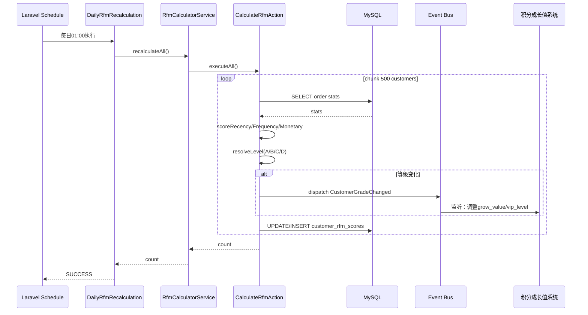
```mermaid
sequenceDiagram
    participant Schedule as Laravel Schedule
    participant DailyCmd as DailyRfmRecalculation
    participant RfmSvc as RfmCalculatorService
    participant CalcAct as CalculateRfmAction
    participant DB as MySQL
    participant Event as Event Bus
    participant PointSys as 积分成长值系统

    Schedule->>DailyCmd: 每日01:00执行
    DailyCmd->>RfmSvc: recalculateAll()
    RfmSvc->>CalcAct: executeAll()
    loop chunk 500 customers
        CalcAct->>DB: SELECT order stats
        DB-->>CalcAct: stats
        CalcAct->>CalcAct: scoreRecency/Frequency/Monetary
        CalcAct->>CalcAct: resolveLevel(A/B/C/D)
        alt 等级变化
            CalcAct->>Event: dispatch CustomerGradeChanged
            Event->>PointSys: 监听：调整grow_value/vip_level
        end
        CalcAct->>DB: UPDATE/INSERT customer_rfm_scores
    end
    CalcAct-->>RfmSvc: count
    RfmSvc-->>DailyCmd: count
    DailyCmd-->>Schedule: SUCCESS
```

#### 时序图：客户360°画像查询

```mermaid
sequenceDiagram
    participant Admin as 管理后台
    participant ProfileSvc as CustomerProfileService
    participant Cache as Redis
    participant Profile as CustomerProfile
    participant TagBind as CustomerTagBinding
    participant Rfm as CustomerRfmScore

    Admin->>ProfileSvc: getProfile(customerId)
    ProfileSvc->>Cache: get("customer_profile:{id}")
    alt 缓存命中
        Cache-->>ProfileSvc: cached profile
    else 缓存未命中
        ProfileSvc->>Profile: SELECT * WHERE customer_id=?
        ProfileSvc->>TagBind: SELECT with tags WHERE customer_id=?
        ProfileSvc->>Rfm: SELECT WHERE customer_id=?
        Profile-->>ProfileSvc: profile data
        TagBind-->>ProfileSvc: tags data
        Rfm-->>ProfileSvc: rfm data
        ProfileSvc->>ProfileSvc: buildProfile()
        ProfileSvc->>Cache: setex 3600s
    end
    ProfileSvc-->>Admin: 360°画像JSON
```

#### 时序图：手动打标与标签筛选

```mermaid
sequenceDiagram
    participant Admin as 管理员
    participant ManualAct as ManualTagAction
    participant TagSvc as TagManagementService
    participant Tag as CustomerTag
    participant Bind as CustomerTagBinding
    participant DB as MySQL

    Admin->>ManualAct: attach(customerId, tagId, adminId)
    ManualAct->>Tag: findOrFail(tagId)
    ManualAct->>Bind: firstOrCreate (customer_id, tag_id, source=2)
    Bind->>DB: INSERT/IGNORE
    DB-->>Bind: binding record
    Bind-->>ManualAct: CustomerTagBinding
    ManualAct-->>Admin: success

    Admin->>TagSvc: filterCustomersByTags([tagIds], rfmLevel)
    TagSvc->>DB: SELECT customers JOIN tag_bindings
    DB-->>TagSvc: paginated results
    TagSvc-->>Admin: customer list with tags
```

---

<!-- 第8轮深度Review API补充 - 2026-05-28 -->

## 6.45 Customer模块API设计 (CustomerApi)

> **设计依据**：PRD 模块二（用户系统，FR-USER-002~015）、模块七（物流/地址，FR-LOG-011~017）、模块十（企业认证/品牌，FR-AUTH-014~017、FR-BRAND-001~004）、模块十二（子账号体系，FR-SUB-001~009）、模块六（支付，FR-PAY-028~030）
> **所属领域**：`App\Http\Controllers\Api\Customer`、`App\Http\Resources\Customer`、`App\Http\Requests\Customer`
> **前置章节**：6.16 企业认证系统、6.24 用户认证子系统、6.26 子账号管理服务、6.27 客户地址与品牌管理、6.3 支付系统核心服务

### 6.45.1 设计概述

Customer模块API面向前台客户（含主账号与子账号），提供客户信息管理、地址簿、品牌资质、子账号、支付密码、账户流水、VIP服务、企业认证等 38 个REST端点。所有端点均通过 `auth:sanctum` 中间件保护（存在性检查等个别开放端点除外）。子账号操作通过 `sub_permission:` 中间件进行位掩码权限校验。

控制器严格遵循 **薄控制器** 原则：接收请求 → 委托 Service/Action → 返回 Resource。单方法不超过 15 行。

---

### 6.45.2 路由定义

```php
<?php

// routes/api.php —— 前台 API 路由（v1）Customer 模块补充

use App\Http\Controllers\Api\CustomerController;
use App\Http\Controllers\Api\CustomerAddressController;
use App\Http\Controllers\Api\CustomerBrandController;
use App\Http\Controllers\Api\SubAccountController;
use App\Http\Controllers\Api\CustomerAuthController;
use App\Http\Controllers\Api\CustomerWalletController;
use App\Http\Controllers\Api\CustomerVipController;
use Illuminate\Support\Facades\Route;

Route::prefix('api/Customer')->middleware(['api', 'throttle:api'])->group(function () {

    // ── 公开端点（无需登录）──
    Route::withoutMiddleware(['auth:sanctum'])->group(function () {
        Route::get('IsExistsCustomerByMobilePhone', [CustomerController::class, 'isExistsByMobilePhone']);
        Route::get('IsExistsCustomerByName', [CustomerController::class, 'isExistsByName']);
        Route::get('IsExistsCustomerByQQ', [CustomerController::class, 'isExistsByQQ']);
    });

    // ── 需登录端点 ──
    Route::middleware('auth:sanctum')->group(function () {

        // 客户信息
        Route::get('BasicInfo', [CustomerController::class, 'basicInfo']);
        Route::get('GetById', [CustomerController::class, 'show']);
        Route::get('GetSimpleById', [CustomerController::class, 'simpleShow']);
        Route::put('UpdateCustomerBasicInfo', [CustomerController::class, 'updateBasicInfo']);

        // 企业认证
        Route::get('GetCustomerAuthInfo', [CustomerAuthController::class, 'authInfo']);
        Route::post('SetCustomerAuthWaiting', [CustomerAuthController::class, 'setAuthWaiting']);
        Route::post('SetCustomerSigned', [CustomerAuthController::class, 'setSigned']);

        // 新客户礼包
        Route::post('NewCustomerReceive', [CustomerController::class, 'newCustomerReceive']);

        // 客户经理
        Route::get('GetCustomerManager', [CustomerController::class, 'getManager']);

        // 客户地址
        Route::get('GetByCustomerAddressCustomerId', [CustomerAddressController::class, 'list']);
        Route::post('CreateCustomerAddress', [CustomerAddressController::class, 'create']);
        Route::put('UpdateCustomerAddress', [CustomerAddressController::class, 'update']);
        Route::delete('DeleteCustomerAddress', [CustomerAddressController::class, 'delete']);
        Route::post('SetCustomerDefaultAddress', [CustomerAddressController::class, 'setDefault']);

        // 客户品牌
        Route::get('GetCustomerBrands', [CustomerBrandController::class, 'list']);
        Route::post('CreateCustomerBrand', [CustomerBrandController::class, 'create']);
        Route::put('UpdateCustomerBrand', [CustomerBrandController::class, 'update']);
        Route::delete('DeleteCustomerBrand', [CustomerBrandController::class, 'delete']);

        // 子账号（主账号专属，子账号无权限）
        Route::middleware('sub_permission:master')->group(function () {
            Route::get('GetSubAccountList', [SubAccountController::class, 'list']);
            Route::post('CreateSubAccount', [SubAccountController::class, 'create']);
            Route::put('UpdateSubAccount', [SubAccountController::class, 'update']);
            Route::put('UpdateSubAccountStatus', [SubAccountController::class, 'updateStatus']);
            Route::post('ResetSubAccountPassword', [SubAccountController::class, 'resetPassword']);
            Route::delete('DeleteSubAccount', [SubAccountController::class, 'delete']);
            Route::post('GrantedSubPermissions', [SubAccountController::class, 'grantPermissions']);
        });

        // 子账号权限查询（登录即可）
        Route::get('GetCustomerSubPermissions', [SubAccountController::class, 'myPermissions']);
        Route::get('GetSubPermissions', [SubAccountController::class, 'allPermissions']);

        // 支付密码
        Route::post('SetPayPassword', [CustomerWalletController::class, 'setPayPassword']);
        Route::put('UpdatePayPassword', [CustomerWalletController::class, 'updatePayPassword']);
        Route::post('VerifyPayPassword', [CustomerWalletController::class, 'verifyPayPassword']);

        // 账户与流水
        Route::get('GetCustomerAccountStatistics', [CustomerWalletController::class, 'accountStatistics']);
        Route::get('GetCustomerAccountTransactions', [CustomerWalletController::class, 'accountTransactions']);

        // VIP 服务
        Route::get('GetVIPServices', [CustomerVipController::class, 'vipServices']);
        Route::get('GetCustomerVipPurchaseRecord', [CustomerVipController::class, 'vipPurchaseRecord']);
        Route::get('IsCanRenew', [CustomerVipController::class, 'isCanRenew']);
    });
});
```

---

### 6.45.3 Controller类

#### 6.45.3.1 CustomerController —— 客户基本信息

```php
<?php

namespace App\Http\Controllers\Api;

use App\Actions\Marketing\GrantNewCustomerGiftAction;
use App\Http\Controllers\Controller;
use App\Http\Requests\Customer\UpdateCustomerBasicInfoRequest;
use App\Http\Resources\CustomerResource;
use App\Http\Resources\CustomerSimpleResource;
use App\Models\Customer;
use App\Services\User\CustomerManagerService;
use Illuminate\Http\JsonResponse;
use Illuminate\Http\Request;
use Illuminate\Http\Resources\Json\JsonResource;

class CustomerController extends Controller
{
    public function __construct(
        private CustomerManagerService $managerService,
        private GrantNewCustomerGiftAction $grantNewCustomerGift,
    ) {}

    /**
     * 获取当前登录客户基本信息
     * GET api/Customer/BasicInfo
     */
    public function basicInfo(Request $request): CustomerResource
    {
        $customer = auth('customer')->user();
        return new CustomerResource($customer->load(['account', 'wallet']));
    }

    /**
     * 根据ID获取客户详情
     * GET api/Customer/GetById
     */
    public function show(Request $request): CustomerResource
    {
        $customerId = $request->input('customer_id', auth('customer')->id());
        $customer = Customer::findOrFail($customerId);
        $this->authorize('view', $customer);
        return new CustomerResource($customer->load(['account', 'wallet', 'brands', 'addresses']));
    }

    /**
     * 获取简化版客户信息
     * GET api/Customer/GetSimpleById
     */
    public function simpleShow(Request $request): CustomerSimpleResource
    {
        $customerId = $request->input('customer_id', auth('customer')->id());
        $customer = Customer::findOrFail($customerId);
        return new CustomerSimpleResource($customer);
    }

    /**
     * 更新客户基本信息
     * PUT api/Customer/UpdateCustomerBasicInfo
     */
    public function updateBasicInfo(UpdateCustomerBasicInfoRequest $request): CustomerResource
    {
        $customer = auth('customer')->user();
        $customer->update($request->validated());
        return new CustomerResource($customer->fresh());
    }

    /**
     * 检查手机号是否已注册
     * GET api/Customer/IsExistsCustomerByMobilePhone
     */
    public function isExistsByMobilePhone(Request $request): JsonResponse
    {
        $request->validate(['mobile_phone' => ['required', 'string']]);
        $exists = Customer::where('mobile_phone', $request->input('mobile_phone'))->exists();
        return response()->json(['exists' => $exists]);
    }

    /**
     * 检查客户名是否已存在
     * GET api/Customer/IsExistsCustomerByName
     */
    public function isExistsByName(Request $request): JsonResponse
    {
        $request->validate(['customer_name' => ['required', 'string', 'max:100']]);
        $exists = Customer::where('customer_name', $request->input('customer_name'))->exists();
        return response()->json(['exists' => $exists]);
    }

    /**
     * 检查QQ号是否已存在
     * GET api/Customer/IsExistsCustomerByQQ
     */
    public function isExistsByQQ(Request $request): JsonResponse
    {
        $request->validate(['qq' => ['required', 'string']]);
        $exists = Customer::whereRaw("JSON_CONTAINS(qq_accounts, ?)", ['"' . $request->input('qq') . '"'])->exists();
        return response()->json(['exists' => $exists]);
    }

    /**
     * 新客户领取礼包
     * POST api/Customer/NewCustomerReceive
     */
    public function newCustomerReceive(Request $request): JsonResponse
    {
        $customer = auth('customer')->user();
        $this->grantNewCustomerGift->execute($customer->id);
        return response()->json(['message' => '领取成功']);
    }

    /**
     * 获取专属客户经理
     * GET api/Customer/GetCustomerManager
     */
    public function getManager(Request $request): JsonResponse
    {
        $customer = auth('customer')->user();
        $manager = $this->managerService->getCustomerManager($customer->id);
        return response()->json(['data' => $manager]);
    }
}
```

#### 6.45.3.2 CustomerAuthController —— 企业认证与签约

```php
<?php

namespace App\Http\Controllers\Api;

use App\Domains\Auth\Actions\CustomerSignAction;
use App\Domains\Auth\Actions\SubmitCustomerAuthAction;
use App\Http\Controllers\Controller;
use App\Http\Requests\Customer\SubmitCustomerAuthRequest;
use App\Http\Resources\CustomerAuthResource;
use App\Models\Customer;
use Illuminate\Http\JsonResponse;
use Illuminate\Http\Request;

class CustomerAuthController extends Controller
{
    public function __construct(
        private SubmitCustomerAuthAction $submitAuth,
        private CustomerSignAction $signAction,
    ) {}

    /**
     * 获取客户认证信息
     * GET api/Customer/GetCustomerAuthInfo
     */
    public function authInfo(Request $request): CustomerAuthResource
    {
        $customer = auth('customer')->user();
        return new CustomerAuthResource($customer);
    }

    /**
     * 提交认证资料，设置待审核
     * POST api/Customer/SetCustomerAuthWaiting
     */
    public function setAuthWaiting(SubmitCustomerAuthRequest $request): JsonResponse
    {
        $customer = auth('customer')->user();
        $this->submitAuth->execute($customer->id, $request->validated());
        return response()->json(['message' => '认证资料已提交，等待审核']);
    }

    /**
     * 客户电子签约
     * POST api/Customer/SetCustomerSigned
     */
    public function setSigned(Request $request): JsonResponse
    {
        $request->validate(['agreement_version' => ['required', 'string', 'max:32]]);
        $customer = auth('customer')->user();
        $this->signAction->execute($customer->id, $request->input('agreement_version'));
        return response()->json(['message' => '签约成功']);
    }
}
```

#### 6.45.3.3 CustomerAddressController —— 客户地址簿

```php
<?php

namespace App\Http\Controllers\Api;

use App\Http\Controllers\Controller;
use App\Http\Requests\Customer\CreateCustomerAddressRequest;
use App\Http\Requests\Customer\UpdateCustomerAddressRequest;
use App\Http\Resources\CustomerAddressResource;
use App\Models\User\CustomerAddress;
use App\Services\User\CustomerAddressService;
use Illuminate\Http\JsonResponse;
use Illuminate\Http\Request;
use Illuminate\Http\Resources\Json\AnonymousResourceCollection;

class CustomerAddressController extends Controller
{
    public function __construct(
        private CustomerAddressService $addressService,
    ) {}

    /**
     * 获取客户地址列表
     * GET api/Customer/GetByCustomerAddressCustomerId
     */
    public function list(Request $request): AnonymousResourceCollection
    {
        $customer = auth('customer')->user();
        $type = $request->input('type');
        $page = $request->input('page', 1);
        $perPage = $request->input('per_page', 20);

        $paginator = $this->addressService->listAddresses($customer->id, $type, $page, $perPage);
        return CustomerAddressResource::collection($paginator);
    }

    /**
     * 创建客户地址
     * POST api/Customer/CreateCustomerAddress
     */
    public function create(CreateCustomerAddressRequest $request): CustomerAddressResource
    {
        $customer = auth('customer')->user();
        $address = $this->addressService->createAddress($customer->id, $request->validated());
        return new CustomerAddressResource($address);
    }

    /**
     * 更新客户地址
     * PUT api/Customer/UpdateCustomerAddress
     */
    public function update(UpdateCustomerAddressRequest $request): CustomerAddressResource
    {
        $customer = auth('customer')->user();
        $address = CustomerAddress::where('customer_id', $customer->id)
            ->findOrFail($request->input('address_id'));
        $address->update($request->validated());
        return new CustomerAddressResource($address->fresh());
    }

    /**
     * 删除客户地址
     * DELETE api/Customer/DeleteCustomerAddress
     */
    public function delete(Request $request): JsonResponse
    {
        $request->validate(['address_id' => ['required', 'integer']]);
        $customer = auth('customer')->user();
        $address = CustomerAddress::where('customer_id', $customer->id)
            ->findOrFail($request->input('address_id'));
        $address->delete();
        return response()->json(['message' => '地址已删除']);
    }

    /**
     * 设置默认地址
     * POST api/Customer/SetCustomerDefaultAddress
     */
    public function setDefault(Request $request): JsonResponse
    {
        $request->validate(['address_id' => ['required', 'integer']]);
        $customer = auth('customer')->user();
        $address = CustomerAddress::where('customer_id', $customer->id)
            ->findOrFail($request->input('address_id'));
        $address->setAsDefault();
        return response()->json(['message' => '默认地址已设置']);
    }
}
```

#### 6.45.3.4 CustomerBrandController —— 客户品牌资质

```php
<?php

namespace App\Http\Controllers\Api;

use App\Http\Controllers\Controller;
use App\Http\Requests\Customer\CreateCustomerBrandRequest;
use App\Http\Requests\Customer\UpdateCustomerBrandRequest;
use App\Http\Resources\CustomerBrandResource;
use App\Models\User\CustomerBrand;
use App\Services\User\CustomerBrandService;
use Illuminate\Http\JsonResponse;
use Illuminate\Http\Request;
use Illuminate\Http\Resources\Json\AnonymousResourceCollection;

class CustomerBrandController extends Controller
{
    public function __construct(
        private CustomerBrandService $brandService,
    ) {}

    /**
     * 获取客户品牌列表
     * GET api/Customer/GetCustomerBrands
     */
    public function list(Request $request): AnonymousResourceCollection
    {
        $customer = auth('customer')->user();
        $status = $request->input('status');
        $page = $request->input('page', 1);
        $perPage = $request->input('per_page', 20);

        $paginator = $this->brandService->listBrands(
            $customer->id,
            $status ? \App\Enums\BrandAuditStatus::tryFrom($status) : null,
            $page,
            $perPage
        );
        return CustomerBrandResource::collection($paginator);
    }

    /**
     * 创建客户品牌
     * POST api/Customer/CreateCustomerBrand
     */
    public function create(CreateCustomerBrandRequest $request): CustomerBrandResource
    {
        $customer = auth('customer')->user();
        $brand = $this->brandService->createBrand($customer->id, $request->validated());
        return new CustomerBrandResource($brand);
    }

    /**
     * 更新客户品牌
     * PUT api/Customer/UpdateCustomerBrand
     */
    public function update(UpdateCustomerBrandRequest $request): CustomerBrandResource
    {
        $customer = auth('customer')->user();
        $brand = $this->brandService->updateBrand(
            $customer->id,
            $request->input('brand_id'),
            $request->validated()
        );
        return new CustomerBrandResource($brand);
    }

    /**
     * 删除客户品牌
     * DELETE api/Customer/DeleteCustomerBrand
     */
    public function delete(Request $request): JsonResponse
    {
        $request->validate(['brand_id' => ['required', 'integer']]);
        $customer = auth('customer')->user();
        $this->brandService->deleteBrand($customer->id, $request->input('brand_id'));
        return response()->json(['message' => '品牌已删除']);
    }
}
```

#### 6.45.3.5 SubAccountController —— 子账号管理

```php
<?php

namespace App\Http\Controllers\Api;

use App\Actions\User\SubAccount\CreateSubAccountAction;
use App\Enums\SubPermission;
use App\Http\Controllers\Controller;
use App\Http\Requests\Customer\CreateSubAccountRequest;
use App\Http\Requests\Customer\GrantSubPermissionsRequest;
use App\Http\Requests\Customer\ResetSubAccountPasswordRequest;
use App\Http\Requests\Customer\UpdateSubAccountRequest;
use App\Http\Resources\SubAccountResource;
use App\Models\User\SubAccount;
use Illuminate\Http\JsonResponse;
use Illuminate\Http\Request;
use Illuminate\Http\Resources\Json\AnonymousResourceCollection;
use Illuminate\Support\Facades\Hash;

class SubAccountController extends Controller
{
    public function __construct(
        private CreateSubAccountAction $createSubAccount,
    ) {}

    /**
     * 获取子账号列表
     * GET api/Customer/GetSubAccountList
     */
    public function list(Request $request): AnonymousResourceCollection
    {
        $customer = auth('customer')->user();
        $perPage = $request->input('per_page', 20);
        $list = SubAccount::where('customer_id', $customer->id)
            ->orderByDesc('created_at')
            ->paginate($perPage);
        return SubAccountResource::collection($list);
    }

    /**
     * 创建子账号
     * POST api/Customer/CreateSubAccount
     */
    public function create(CreateSubAccountRequest $request): SubAccountResource
    {
        $customer = auth('customer')->user();
        $subAccount = $this->createSubAccount->execute(
            $customer,
            $request->input('sub_name'),
            $request->input('mobile_phone'),
            $request->input('password'),
            $request->input('permission_mask'),
            $request->input('sms_code')
        );
        return new SubAccountResource($subAccount);
    }

    /**
     * 更新子账号
     * PUT api/Customer/UpdateSubAccount
     */
    public function update(UpdateSubAccountRequest $request): SubAccountResource
    {
        $customer = auth('customer')->user();
        $subAccount = SubAccount::where('customer_id', $customer->id)
            ->findOrFail($request->input('sub_account_id'));
        $subAccount->update($request->validated());
        return new SubAccountResource($subAccount->fresh());
    }

    /**
     * 更新子账号状态（启用/禁用）
     * PUT api/Customer/UpdateSubAccountStatus
     */
    public function updateStatus(Request $request): SubAccountResource
    {
        $request->validate([
            'sub_account_id' => ['required', 'integer'],
            'active' => ['required', 'boolean'],
        ]);
        $customer = auth('customer')->user();
        $subAccount = SubAccount::where('customer_id', $customer->id)
            ->findOrFail($request->input('sub_account_id'));
        $subAccount->update(['active' => $request->boolean('active')]);
        return new SubAccountResource($subAccount->fresh());
    }

    /**
     * 重置子账号密码
     * POST api/Customer/ResetSubAccountPassword
     */
    public function resetPassword(ResetSubAccountPasswordRequest $request): JsonResponse
    {
        $customer = auth('customer')->user();
        $subAccount = SubAccount::where('customer_id', $customer->id)
            ->findOrFail($request->input('sub_account_id'));
        $subAccount->update([
            'password' => Hash::make($request->input('new_password')),
        ]);
        return response()->json(['message' => '密码重置成功']);
    }

    /**
     * 删除子账号
     * DELETE api/Customer/DeleteSubAccount
     */
    public function delete(Request $request): JsonResponse
    {
        $request->validate(['sub_account_id' => ['required', 'integer']]);
        $customer = auth('customer')->user();
        $subAccount = SubAccount::where('customer_id', $customer->id)
            ->findOrFail($request->input('sub_account_id'));
        $subAccount->delete();
        return response()->json(['message' => '子账号已删除']);
    }

    /**
     * 授予子账号权限
     * POST api/Customer/GrantedSubPermissions
     */
    public function grantPermissions(GrantSubPermissionsRequest $request): SubAccountResource
    {
        $customer = auth('customer')->user();
        $subAccount = SubAccount::where('customer_id', $customer->id)
            ->findOrFail($request->input('sub_account_id'));
        $subAccount->update(['sub_permission' => $request->input('permission_mask')]);
        return new SubAccountResource($subAccount->fresh());
    }

    /**
     * 获取当前子账号权限
     * GET api/Customer/GetCustomerSubPermissions
     */
    public function myPermissions(Request $request): JsonResponse
    {
        $user = auth('customer')->user();
        if ($user instanceof SubAccount) {
            return response()->json([
                'permission_mask' => $user->sub_permission,
                'permissions' => SubPermission::namesFromMask($user->sub_permission),
            ]);
        }
        return response()->json([
            'permission_mask' => 0,
            'permissions' => ['总账号'],
        ]);
    }

    /**
     * 获取所有可选子权限列表
     * GET api/Customer/GetSubPermissions
     */
    public function allPermissions(Request $request): JsonResponse
    {
        $permissions = array_map(fn (SubPermission $p) => [
            'value' => $p->value,
            'label' => $p->label(),
        ], SubPermission::cases());
        return response()->json(['data' => $permissions]);
    }
}
```

#### 6.45.3.6 CustomerWalletController —— 支付密码与账户

```php
<?php

namespace App\Http\Controllers\Api;

use App\Domains\Auth\Actions\SetPayPasswordAction;
use App\Domains\Payment\Services\PayPasswordSecurityService;
use App\Domains\Payment\Services\WalletService;
use App\Http\Controllers\Controller;
use App\Http\Requests\Customer\SetPayPasswordRequest;
use App\Http\Requests\Customer\UpdatePayPasswordRequest;
use App\Http\Requests\Customer\VerifyPayPasswordRequest;
use App\Http\Resources\AccountTransactionResource;
use App\Models\AccountTransaction;
use Illuminate\Http\JsonResponse;
use Illuminate\Http\Request;
use Illuminate\Http\Resources\Json\AnonymousResourceCollection;

class CustomerWalletController extends Controller
{
    public function __construct(
        private WalletService $walletService,
        private PayPasswordSecurityService $payPasswordSecurity,
        private SetPayPasswordAction $setPayPassword,
    ) {}

    /**
     * 设置支付密码
     * POST api/Customer/SetPayPassword
     */
    public function setPayPassword(SetPayPasswordRequest $request): JsonResponse
    {
        $customer = auth('customer')->user();
        $this->setPayPassword->execute($customer->id, $request->input('password'));
        return response()->json(['message' => '支付密码设置成功']);
    }

    /**
     * 修改支付密码
     * PUT api/Customer/UpdatePayPassword
     */
    public function updatePayPassword(UpdatePayPasswordRequest $request): JsonResponse
    {
        $customer = auth('customer')->user();
        $this->setPayPassword->execute(
            $customer->id,
            $request->input('new_password'),
            $request->input('old_password')
        );
        return response()->json(['message' => '支付密码修改成功']);
    }

    /**
     * 验证支付密码
     * POST api/Customer/VerifyPayPassword
     */
    public function verifyPayPassword(VerifyPayPasswordRequest $request): JsonResponse
    {
        $customer = auth('customer')->user();
        $this->payPasswordSecurity->verifyPayPassword($customer->id, $request->input('password'));
        return response()->json(['valid' => true]);
    }

    /**
     * 获取客户账户统计
     * GET api/Customer/GetCustomerAccountStatistics
     */
    public function accountStatistics(Request $request): JsonResponse
    {
        $customer = auth('customer')->user();
        $balance = $this->walletService->getBalance($customer->id);
        return response()->json([
            'data' => [
                'balance' => $balance['balance'],
                'frozen_amount' => $balance['frozenAmount'],
                'available_balance' => $balance['availableBalance'],
                'alert_amount' => $balance['alertAmount'],
                'total_recharge' => $balance['total_recharge'] ?? 0,
                'total_consume' => $balance['total_consume'] ?? 0,
            ],
        ]);
    }

    /**
     * 获取客户账户交易流水
     * GET api/Customer/GetCustomerAccountTransactions
     */
    public function accountTransactions(Request $request): AnonymousResourceCollection
    {
        $customer = auth('customer')->user();
        $type = $request->input('type');
        $page = $request->input('page', 1);
        $perPage = $request->input('per_page', 20);

        $query = AccountTransaction::where('customer_id', $customer->id)
            ->orderByDesc('created_at');

        if ($type !== null) {
            $query->where('type', $type);
        }

        return AccountTransactionResource::collection($query->paginate($perPage));
    }
}
```

#### 6.45.3.7 CustomerVipController —— VIP服务

```php
<?php

namespace App\Http\Controllers\Api;

use App\Domains\Vip\Models\VipService;
use App\Enums\VipLevel;
use App\Http\Controllers\Controller;
use App\Http\Resources\VipPurchaseRecordResource;
use App\Http\Resources\VipServiceResource;
use Illuminate\Http\JsonResponse;
use Illuminate\Http\Request;
use Illuminate\Http\Resources\Json\AnonymousResourceCollection;

class CustomerVipController extends Controller
{
    /**
     * 获取VIP服务信息
     * GET api/Customer/GetVIPServices
     */
    public function vipServices(Request $request): JsonResponse
    {
        $customer = auth('customer')->user();
        $vip = VipService::where('customer_id', $customer->id)
            ->where('status', 1)
            ->first();

        $currentLevel = VipLevel::tryFrom($customer->vip_level);

        return response()->json([
            'data' => [
                'vip_level' => $customer->vip_level,
                'vip_level_name' => $currentLevel?->label() ?? '普通用户',
                'pay_vip_end_time' => $customer->pay_vip_end_time?->toIso8601String(),
                'grow_value' => $customer->grow_value,
                'current_vip_service' => $vip ? new VipServiceResource($vip) : null,
                'next_level' => $this->nextLevelInfo($currentLevel, $customer->grow_value),
            ],
        ]);
    }

    /**
     * 获取VIP购买记录
     * GET api/Customer/GetCustomerVipPurchaseRecord
     */
    public function vipPurchaseRecord(Request $request): AnonymousResourceCollection
    {
        $customer = auth('customer')->user();
        $page = $request->input('page', 1);
        $perPage = $request->input('per_page', 20);

        $records = VipService::where('customer_id', $customer->id)
            ->where('type', 5) // VIP购买
            ->orderByDesc('created_at')
            ->paginate($perPage);

        return VipPurchaseRecordResource::collection($records);
    }

    /**
     * 检查VIP是否可续费
     * GET api/Customer/IsCanRenew
     */
    public function isCanRenew(Request $request): JsonResponse
    {
        $customer = auth('customer')->user();
        $service = app(\App\Domains\Vip\Services\VipRenewalService::class);

        return response()->json([
            'can_renew' => $service->canRenew($customer),
            'grace_period_days' => config('vip.renewal.grace_period_days', 30),
        ]);
    }

    private function nextLevelInfo(?VipLevel $current, int $growValue): ?array
    {
        if (!$current || $current->value >= VipLevel::max()->value) {
            return null;
        }
        $next = VipLevel::from($current->value + 1);
        return [
            'level' => $next->value,
            'level_name' => $next->label(),
            'required_grow_value' => $next->requiredGrowthValue(),
            'current_grow_value' => $growValue,
            'remaining' => max(0, $next->requiredGrowthValue() - $growValue),
        ];
    }
}
```

---

### 6.45.4 FormRequest验证类

```php
<?php

namespace App\Http\Requests\Customer;

use Illuminate\Foundation\Http\FormRequest;

/**
 * 更新客户基本信息
 */
class UpdateCustomerBasicInfoRequest extends FormRequest
{
    public function authorize(): bool
    {
        return auth('sanctum')->check();
    }

    public function rules(): array
    {
        return [
            'contact_name' => ['nullable', 'string', 'max:50'],
            'email' => ['nullable', 'email', 'max:100'],
            'avatar_url' => ['nullable', 'url', 'max:500'],
            'customer_type' => ['nullable', 'integer', 'in:0,1,2,3'],
        ];
    }
}
```

```php
<?php

namespace App\Http\Requests\Customer;

use Illuminate\Foundation\Http\FormRequest;

/**
 * 提交企业认证资料
 */
class SubmitCustomerAuthRequest extends FormRequest
{
    public function authorize(): bool
    {
        return auth('sanctum')->check();
    }

    public function rules(): array
    {
        return [
            'company_name' => ['required', 'string', 'max:200'],
            'credit_code' => ['required', 'string', 'regex:/^[A-Z0-9]{18}$/'],
            'legal_person' => ['required', 'string', 'max:50'],
            'legal_person_id_card' => ['nullable', 'string', 'max:18'],
            'business_license_img' => ['required', 'image', 'max:5120'],
            'auth_picture_type' => ['nullable', 'integer', 'in:1,2'],
            'contact_name' => ['required', 'string', 'max:50'],
            'contact_phone' => ['required', 'regex:/^1[3-9]\d{9}$/'],
            'register_address' => ['nullable', 'string', 'max:300'],
            'office_address' => ['nullable', 'string', 'max:300'],
            'valid_date' => ['nullable', 'date'],
        ];
    }
}
```

```php
<?php

namespace App\Http\Requests\Customer;

use Illuminate\Foundation\Http\FormRequest;

/**
 * 创建客户地址
 */
class CreateCustomerAddressRequest extends FormRequest
{
    public function authorize(): bool
    {
        return auth('sanctum')->check();
    }

    public function rules(): array
    {
        return [
            'receiver_name' => ['required', 'string', 'max:50'],
            'phone' => ['required', 'regex:/^1[3-9]\d{9}$/'],
            'province' => ['required', 'string', 'max:50'],
            'city' => ['required', 'string', 'max:50'],
            'district' => ['required', 'string', 'max:50'],
            'detail_address' => ['required', 'string', 'max:300'],
            'type' => ['nullable', 'integer', 'in:0,1,2'],
            'is_default' => ['nullable', 'boolean'],
        ];
    }
}
```

```php
<?php

namespace App\Http\Requests\Customer;

use Illuminate\Foundation\Http\FormRequest;

/**
 * 更新客户地址
 */
class UpdateCustomerAddressRequest extends FormRequest
{
    public function authorize(): bool
    {
        return auth('sanctum')->check();
    }

    public function rules(): array
    {
        return [
            'address_id' => ['required', 'integer'],
            'receiver_name' => ['nullable', 'string', 'max:50'],
            'phone' => ['nullable', 'regex:/^1[3-9]\d{9}$/'],
            'province' => ['nullable', 'string', 'max:50'],
            'city' => ['nullable', 'string', 'max:50'],
            'district' => ['nullable', 'string', 'max:50'],
            'detail_address' => ['nullable', 'string', 'max:300'],
            'type' => ['nullable', 'integer', 'in:0,1,2'],
            'is_default' => ['nullable', 'boolean'],
        ];
    }
}
```

```php
<?php

namespace App\Http\Requests\Customer;

use Illuminate\Foundation\Http\FormRequest;

/**
 * 创建客户品牌
 */
class CreateCustomerBrandRequest extends FormRequest
{
    public function authorize(): bool
    {
        return auth('sanctum')->check();
    }

    public function rules(): array
    {
        return [
            'brand_name' => ['required', 'string', 'max:100'],
            'logo_url' => ['nullable', 'url', 'max:500'],
            'trademark_reg_no' => ['nullable', 'string', 'max:50'],
            'trademark_type' => ['nullable', 'integer', 'in:0,1,2'],
            'type' => ['nullable', 'integer', 'in:0,1,2,3'],
        ];
    }
}
```

```php
<?php

namespace App\Http\Requests\Customer;

use Illuminate\Foundation\Http\FormRequest;

/**
 * 更新客户品牌
 */
class UpdateCustomerBrandRequest extends FormRequest
{
    public function authorize(): bool
    {
        return auth('sanctum')->check();
    }

    public function rules(): array
    {
        return [
            'brand_id' => ['required', 'integer'],
            'brand_name' => ['nullable', 'string', 'max:100'],
            'logo_url' => ['nullable', 'url', 'max:500'],
            'trademark_reg_no' => ['nullable', 'string', 'max:50'],
        ];
    }
}
```

```php
<?php

namespace App\Http\Requests\Customer;

use App\Enums\SubPermission;
use Illuminate\Foundation\Http\FormRequest;

/**
 * 创建子账号
 */
class CreateSubAccountRequest extends FormRequest
{
    public function authorize(): bool
    {
        return auth('sanctum')->check();
    }

    public function rules(): array
    {
        return [
            'sub_name' => ['required', 'string', 'max:50'],
            'mobile_phone' => ['required', 'regex:/^1[3-9]\d{9}$/'],
            'password' => ['required', 'string', 'min:6', 'max:32'],
            'permission_mask' => ['required', 'integer', 'min:0'],
            'sms_code' => ['nullable', 'digits:6'],
        ];
    }
}
```

```php
<?php

namespace App\Http\Requests\Customer;

use Illuminate\Foundation\Http\FormRequest;

/**
 * 更新子账号
 */
class UpdateSubAccountRequest extends FormRequest
{
    public function authorize(): bool
    {
        return auth('sanctum')->check();
    }

    public function rules(): array
    {
        return [
            'sub_account_id' => ['required', 'integer'],
            'sub_name' => ['nullable', 'string', 'max:50'],
            'mobile_phone' => ['nullable', 'regex:/^1[3-9]\d{9}$/'],
            'permission_mask' => ['nullable', 'integer', 'min:0'],
        ];
    }
}
```

```php
<?php

namespace App\Http\Requests\Customer;

use Illuminate\Foundation\Http\FormRequest;

/**
 * 重置子账号密码
 */
class ResetSubAccountPasswordRequest extends FormRequest
{
    public function authorize(): bool
    {
        return auth('sanctum')->check();
    }

    public function rules(): array
    {
        return [
            'sub_account_id' => ['required', 'integer'],
            'new_password' => ['required', 'string', 'min:6', 'max:32'],
        ];
    }
}
```

```php
<?php

namespace App\Http\Requests\Customer;

use Illuminate\Foundation\Http\FormRequest;

/**
 * 授予子账号权限
 */
class GrantSubPermissionsRequest extends FormRequest
{
    public function authorize(): bool
    {
        return auth('sanctum')->check();
    }

    public function rules(): array
    {
        return [
            'sub_account_id' => ['required', 'integer'],
            'permission_mask' => ['required', 'integer', 'min:0'],
        ];
    }
}
```

```php
<?php

namespace App\Http\Requests\Customer;

use Illuminate\Foundation\Http\FormRequest;

/**
 * 设置支付密码
 */
class SetPayPasswordRequest extends FormRequest
{
    public function authorize(): bool
    {
        return auth('sanctum')->check();
    }

    public function rules(): array
    {
        return [
            'password' => ['required', 'string', 'digits:6'],
        ];
    }
}
```

```php
<?php

namespace App\Http\Requests\Customer;

use Illuminate\Foundation\Http\FormRequest;

/**
 * 修改支付密码
 */
class UpdatePayPasswordRequest extends FormRequest
{
    public function authorize(): bool
    {
        return auth('sanctum')->check();
    }

    public function rules(): array
    {
        return [
            'old_password' => ['required', 'string', 'digits:6'],
            'new_password' => ['required', 'string', 'digits:6', 'different:old_password'],
        ];
    }
}
```

```php
<?php

namespace App\Http\Requests\Customer;

use Illuminate\Foundation\Http\FormRequest;

/**
 * 验证支付密码
 */
class VerifyPayPasswordRequest extends FormRequest
{
    public function authorize(): bool
    {
        return auth('sanctum')->check();
    }

    public function rules(): array
    {
        return [
            'password' => ['required', 'string', 'digits:6'],
        ];
    }
}
```

---

### 6.45.5 Resource响应类

```php
<?php

namespace App\Http\Resources;

use Illuminate\Http\Request;
use Illuminate\Http\Resources\Json\JsonResource;

/**
 * 客户基本信息 Resource（扩展原 8.1.2 节 CustomerResource）
 */
class CustomerResource extends JsonResource
{
    public function toArray(Request $request): array
    {
        return [
            'id' => $this->id,
            'customer_name' => $this->customer_name,
            'contact_name' => $this->contact_name,
            'mobile_phone' => $this->when(
                $request->user()?->can('viewSensitive', $this->resource),
                \Str::mask($this->mobile_phone, '*', 3, 4)
            ),
            'email' => $this->email,
            'avatar' => $this->avatar_url,
            'customer_type' => $this->customer_type,
            'vip_level' => $this->vip_level,
            'vip_level_name' => $this->when($this->vip_level > 0, fn() => match ($this->vip_level) {
                1 => '普通会员', 2 => '银卡会员', 3 => '金卡会员',
                4 => '铂金会员', 5 => '钻石会员', 6 => '至尊会员',
                7 => '黑金会员', 8 => '荣耀会员',
                default => '未知',
            }),
            'auth_status' => $this->auth_status,
            'auth_status_name' => match ((int) $this->auth_status) {
                0 => '未认证', 1 => '认证中', 2 => '已认证',
                3 => '认证失败', 4 => '已冻结', 20 => '代认证通过',
                default => '未知',
            },
            'signed_time' => $this->signed_time?->toIso8601String(),
            'grow_value' => $this->grow_value,
            'pay_vip_end_time' => $this->pay_vip_end_time?->toIso8601String(),
            'balance' => $this->whenLoaded('account', fn() => $this->account->balance),
            'frozen_amount' => $this->whenLoaded('account', fn() => $this->account->frozen_amount),
            'created_at' => $this->created_at?->toIso8601String(),
        ];
    }
}
```

```php
<?php

namespace App\Http\Resources;

use Illuminate\Http\Request;
use Illuminate\Http\Resources\Json\JsonResource;

/**
 * 客户简化信息 Resource
 */
class CustomerSimpleResource extends JsonResource
{
    public function toArray(Request $request): array
    {
        return [
            'id' => $this->id,
            'customer_name' => $this->customer_name,
            'contact_name' => $this->contact_name,
            'avatar' => $this->avatar_url,
            'vip_level' => $this->vip_level,
            'auth_status' => $this->auth_status,
        ];
    }
}
```

```php
<?php

namespace App\Http\Resources;

use Illuminate\Http\Request;
use Illuminate\Http\Resources\Json\JsonResource;

/**
 * 客户认证信息 Resource
 */
class CustomerAuthResource extends JsonResource
{
    public function toArray(Request $request): array
    {
        return [
            'customer_id' => $this->id,
            'company_name' => $this->company_name,
            'credit_code' => $this->credit_code,
            'legal_person' => $this->legal_person,
            'business_license_img' => $this->business_license_img,
            'auth_status' => (int) $this->auth_status,
            'auth_status_name' => match ((int) $this->auth_status) {
                0 => '未认证', 1 => '认证中', 2 => '已认证',
                3 => '认证失败', 4 => '已冻结', 20 => '代认证通过',
                default => '未知',
            },
            'auth_picture_type' => $this->auth_picture_type,
            'contact_name' => $this->contact_name,
            'contact_phone' => $this->contact_phone,
            'register_address' => $this->register_address,
            'office_address' => $this->office_address,
            'valid_date' => $this->valid_date,
            'verify_reason' => $this->when($this->auth_status == 3 || $this->auth_status == 4, $this->verify_reason),
            'signed_time' => $this->signed_time?->toIso8601String(),
            'is_signed' => $this->signed_time !== null,
        ];
    }
}
```

```php
<?php

namespace App\Http\Resources;

use Illuminate\Http\Request;
use Illuminate\Http\Resources\Json\JsonResource;

/**
 * 客户地址 Resource
 */
class CustomerAddressResource extends JsonResource
{
    public function toArray(Request $request): array
    {
        return [
            'id' => $this->id,
            'receiver_name' => $this->link_person,
            'phone' => $this->mobile_phone,
            'phone_masked' => $this->mobile_phone_masked,
            'province' => $this->province_name,
            'city' => $this->city_name,
            'district' => $this->county_name,
            'detail_address' => $this->detail_address,
            'type' => $this->type,
            'type_name' => match ((int) $this->type) {
                0 => '收货地址',
                1 => '发票地址',
                2 => '退货地址',
                default => '未知',
            },
            'is_default' => (bool) $this->is_default,
            'created_at' => $this->created_at?->toIso8601String(),
        ];
    }
}
```

```php
<?php

namespace App\Http\Resources;

use Illuminate\Http\Request;
use Illuminate\Http\Resources\Json\JsonResource;

/**
 * 客户品牌 Resource
 */
class CustomerBrandResource extends JsonResource
{
    public function toArray(Request $request): array
    {
        return [
            'id' => $this->id,
            'brand_name' => $this->name,
            'logo_url' => $this->picture,
            'trademark_reg_no' => $this->trademark_reg_no,
            'trademark_type' => $this->trademark_type,
            'type' => $this->type?->value ?? $this->type,
            'type_name' => $this->type?->label() ?? '未知',
            'status' => $this->status?->value ?? $this->status,
            'status_name' => $this->status?->label() ?? '未知',
            'verify_reason' => $this->when($this->status?->value === 3, $this->verify_reason),
            'start_valid_date' => $this->start_valid_date?->toIso8601String(),
            'end_valid_date' => $this->end_valid_date?->toIso8601String(),
            'created_at' => $this->created_at?->toIso8601String(),
        ];
    }
}
```

```php
<?php

namespace App\Http\Resources;

use Illuminate\Http\Request;
use Illuminate\Http\Resources\Json\JsonResource;

/**
 * 子账号 Resource
 */
class SubAccountResource extends JsonResource
{
    public function toArray(Request $request): array
    {
        return [
            'id' => $this->id,
            'sub_name' => $this->sub_name,
            'mobile_phone' => \Str::mask($this->mobile_phone, '*', 3, 4),
            'permission_mask' => $this->sub_permission,
            'permissions' => \App\Enums\SubPermission::namesFromMask($this->sub_permission),
            'active' => (bool) $this->active,
            'created_at' => $this->created_at?->toIso8601String(),
        ];
    }
}
```

```php
<?php

namespace App\Http\Resources;

use Illuminate\Http\Request;
use Illuminate\Http\Resources\Json\JsonResource;

/**
 * 账户交易流水 Resource
 * 金额统一使用 MoneyCast，Resource 中以「元」为单位输出
 */
class AccountTransactionResource extends JsonResource
{
    public function toArray(Request $request): array
    {
        return [
            'id' => $this->id,
            'type' => $this->type,
            'type_name' => match ((int) $this->type) {
                1 => '充值',
                2 => '消费',
                3 => '退款入账',
                4 => '提现',
                5 => '冻结',
                6 => '解冻',
                default => '未知',
            },
            'amount' => $this->amount,
            'balance_before' => $this->balance_before,
            'balance_after' => $this->balance_after,
            'business_type' => $this->business_type,
            'related_order_sn' => $this->related_order_sn,
            'remark' => $this->remark,
            'created_at' => $this->created_at?->toIso8601String(),
        ];
    }
}
```

```php
<?php

namespace App\Http\Resources;

use Illuminate\Http\Request;
use Illuminate\Http\Resources\Json\JsonResource;

/**
 * VIP服务 Resource
 */
class VipServiceResource extends JsonResource
{
    public function toArray(Request $request): array
    {
        return [
            'id' => $this->id,
            'service_name' => $this->service_name,
            'level' => $this->level,
            'status' => $this->status,
            'discount_rate' => $this->when(method_exists($this, 'getDiscountRate'), fn() => $this->getDiscountRate()),
            'start_date' => $this->start_date?->toIso8601String(),
            'end_date' => $this->end_date?->toIso8601String(),
            'created_at' => $this->created_at?->toIso8601String(),
        ];
    }
}
```

```php
<?php

namespace App\Http\Resources;

use Illuminate\Http\Request;
use Illuminate\Http\Resources\Json\JsonResource;

/**
 * VIP购买记录 Resource
 */
class VipPurchaseRecordResource extends JsonResource
{
    public function toArray(Request $request): array
    {
        return [
            'id' => $this->id,
            'service_name' => $this->service_name,
            'level' => $this->level,
            'amount' => $this->amount,
            'status' => $this->status,
            'status_name' => (int) $this->status === 1 ? '生效中' : '已过期',
            'start_date' => $this->start_date?->toIso8601String(),
            'end_date' => $this->end_date?->toIso8601String(),
            'created_at' => $this->created_at?->toIso8601String(),
        ];
    }
}
```

---

### 6.45.6 API端点清单

| 序号 | API端点 | HTTP方法 | Controller方法 | 中间件 | 关联Service/Action |
|:---:|---------|:-------:|----------------|--------|-------------------|
| 1 | `api/Customer/BasicInfo` | GET | `CustomerController::basicInfo` | `auth:sanctum` | — |
| 2 | `api/Customer/GetById` | GET | `CustomerController::show` | `auth:sanctum` | CustomerPolicy::view |
| 3 | `api/Customer/GetSimpleById` | GET | `CustomerController::simpleShow` | `auth:sanctum` | — |
| 4 | `api/Customer/UpdateCustomerBasicInfo` | PUT | `CustomerController::updateBasicInfo` | `auth:sanctum` | — |
| 5 | `api/Customer/IsExistsCustomerByMobilePhone` | GET | `CustomerController::isExistsByMobilePhone` | — | — |
| 6 | `api/Customer/IsExistsCustomerByName` | GET | `CustomerController::isExistsByName` | — | — |
| 7 | `api/Customer/IsExistsCustomerByQQ` | GET | `CustomerController::isExistsByQQ` | — | — |
| 8 | `api/Customer/GetCustomerAuthInfo` | GET | `CustomerAuthController::authInfo` | `auth:sanctum` | — |
| 9 | `api/Customer/SetCustomerAuthWaiting` | POST | `CustomerAuthController::setAuthWaiting` | `auth:sanctum` | `SubmitCustomerAuthAction` |
| 10 | `api/Customer/SetCustomerSigned` | POST | `CustomerAuthController::setSigned` | `auth:sanctum` | `CustomerSignAction` |
| 11 | `api/Customer/NewCustomerReceive` | POST | `CustomerController::newCustomerReceive` | `auth:sanctum` | `GrantNewCustomerGiftAction` |
| 12 | `api/Customer/GetCustomerManager` | GET | `CustomerController::getManager` | `auth:sanctum` | `CustomerManagerService` |
| 13 | `api/Customer/GetByCustomerAddressCustomerId` | GET | `CustomerAddressController::list` | `auth:sanctum` | `CustomerAddressService::listAddresses` |
| 14 | `api/Customer/CreateCustomerAddress` | POST | `CustomerAddressController::create` | `auth:sanctum` | `CustomerAddressService::createAddress` |
| 15 | `api/Customer/UpdateCustomerAddress` | PUT | `CustomerAddressController::update` | `auth:sanctum` | — |
| 16 | `api/Customer/DeleteCustomerAddress` | DELETE | `CustomerAddressController::delete` | `auth:sanctum` | — |
| 17 | `api/Customer/SetCustomerDefaultAddress` | POST | `CustomerAddressController::setDefault` | `auth:sanctum` | `CustomerAddress::setAsDefault()` |
| 18 | `api/Customer/GetCustomerBrands` | GET | `CustomerBrandController::list` | `auth:sanctum` | `CustomerBrandService::listBrands` |
| 19 | `api/Customer/CreateCustomerBrand` | POST | `CustomerBrandController::create` | `auth:sanctum` | `CustomerBrandService::createBrand` |
| 20 | `api/Customer/UpdateCustomerBrand` | PUT | `CustomerBrandController::update` | `auth:sanctum` | `CustomerBrandService::updateBrand` |
| 21 | `api/Customer/DeleteCustomerBrand` | DELETE | `CustomerBrandController::delete` | `auth:sanctum` | `CustomerBrandService::deleteBrand` |
| 22 | `api/Customer/GetSubAccountList` | GET | `SubAccountController::list` | `auth:sanctum` + `sub_permission:master` | — |
| 23 | `api/Customer/CreateSubAccount` | POST | `SubAccountController::create` | `auth:sanctum` + `sub_permission:master` | `CreateSubAccountAction` |
| 24 | `api/Customer/UpdateSubAccount` | PUT | `SubAccountController::update` | `auth:sanctum` + `sub_permission:master` | — |
| 25 | `api/Customer/UpdateSubAccountStatus` | PUT | `SubAccountController::updateStatus` | `auth:sanctum` + `sub_permission:master` | — |
| 26 | `api/Customer/ResetSubAccountPassword` | POST | `SubAccountController::resetPassword` | `auth:sanctum` + `sub_permission:master` | — |
| 27 | `api/Customer/DeleteSubAccount` | DELETE | `SubAccountController::delete` | `auth:sanctum` + `sub_permission:master` | — |
| 28 | `api/Customer/GrantedSubPermissions` | POST | `SubAccountController::grantPermissions` | `auth:sanctum` + `sub_permission:master` | — |
| 29 | `api/Customer/GetCustomerSubPermissions` | GET | `SubAccountController::myPermissions` | `auth:sanctum` | — |
| 30 | `api/Customer/GetSubPermissions` | GET | `SubAccountController::allPermissions` | `auth:sanctum` | — |
| 31 | `api/Customer/SetPayPassword` | POST | `CustomerWalletController::setPayPassword` | `auth:sanctum` | `SetPayPasswordAction` |
| 32 | `api/Customer/UpdatePayPassword` | PUT | `CustomerWalletController::updatePayPassword` | `auth:sanctum` | `SetPayPasswordAction` |
| 33 | `api/Customer/VerifyPayPassword` | POST | `CustomerWalletController::verifyPayPassword` | `auth:sanctum` | `PayPasswordSecurityService::verifyPayPassword` |
| 34 | `api/Customer/GetCustomerAccountStatistics` | GET | `CustomerWalletController::accountStatistics` | `auth:sanctum` | `WalletService::getBalance` |
| 35 | `api/Customer/GetCustomerAccountTransactions` | GET | `CustomerWalletController::accountTransactions` | `auth:sanctum` | — |
| 36 | `api/Customer/GetVIPServices` | GET | `CustomerVipController::vipServices` | `auth:sanctum` | — |
| 37 | `api/Customer/GetCustomerVipPurchaseRecord` | GET | `CustomerVipController::vipPurchaseRecord` | `auth:sanctum` | — |
| 38 | `api/Customer/IsCanRenew` | GET | `CustomerVipController::isCanRenew` | `auth:sanctum` | — |

---

### 6.45.7 关键业务规则

| 规则 | 实现位置 | 说明 |
|------|---------|------|
| 子账号操作仅限主账号 | `sub_permission:master` 中间件 | 子账号无法创建/管理其他子账号 |
| 地址上限 20 | `CustomerAddressService::MAX_ADDRESSES` | 超限返回 409 |
| 品牌上限 50 | `CustomerBrandService::MAX_BRANDS` | 超限返回 409 |
| 已审核品牌名不可改 | `CustomerBrandService::updateBrand()` | 状态为 APPROVED 时拦截名称变更 |
| 品牌删除前校验订单引用 | `CustomerBrandService::deleteBrand()` | 存在未完成订单则返回 409 |
| 同类型仅 1 个默认地址 | `CustomerAddress::setAsDefault()` | 事务内取消旧默认 |
| 支付密码独立 bcrypt | `SetPayPasswordAction` | 与登录密码隔离 |
| 支付密码连续错误 5 次锁定 24h | `PayPasswordSecurityService` | Redis 计数器 + 锁定键 |
| 金额统一 MoneyCast | `CustomerAccount`、`AccountTransaction` Model | 数据库分存储，Resource 元输出 |
| 敏感字段加密 | `CustomerAddress` Accessors | Crypt::encryptString / decryptString |

---

### 6.45.8 类图

```mermaid
classDiagram
    class CustomerController {
        +basicInfo(Request): CustomerResource
        +show(Request): CustomerResource
        +simpleShow(Request): CustomerSimpleResource
        +updateBasicInfo(UpdateCustomerBasicInfoRequest): CustomerResource
        +isExistsByMobilePhone(Request): JsonResponse
        +isExistsByName(Request): JsonResponse
        +isExistsByQQ(Request): JsonResponse
        +newCustomerReceive(Request): JsonResponse
        +getManager(Request): JsonResponse
    }
    class CustomerAuthController {
        +authInfo(Request): CustomerAuthResource
        +setAuthWaiting(SubmitCustomerAuthRequest): JsonResponse
        +setSigned(Request): JsonResponse
    }
    class CustomerAddressController {
        +list(Request): AnonymousResourceCollection
        +create(CreateCustomerAddressRequest): CustomerAddressResource
        +update(UpdateCustomerAddressRequest): CustomerAddressResource
        +delete(Request): JsonResponse
        +setDefault(Request): JsonResponse
    }
    class CustomerBrandController {
        +list(Request): AnonymousResourceCollection
        +create(CreateCustomerBrandRequest): CustomerBrandResource
        +update(UpdateCustomerBrandRequest): CustomerBrandResource
        +delete(Request): JsonResponse
    }
    class SubAccountController {
        +list(Request): AnonymousResourceCollection
        +create(CreateSubAccountRequest): SubAccountResource
        +update(UpdateSubAccountRequest): SubAccountResource
        +updateStatus(Request): SubAccountResource
        +resetPassword(ResetSubAccountPasswordRequest): JsonResponse
        +delete(Request): JsonResponse
        +grantPermissions(GrantSubPermissionsRequest): SubAccountResource
        +myPermissions(Request): JsonResponse
        +allPermissions(Request): JsonResponse
    }
    class CustomerWalletController {
        +setPayPassword(SetPayPasswordRequest): JsonResponse
        +updatePayPassword(UpdatePayPasswordRequest): JsonResponse
        +verifyPayPassword(VerifyPayPasswordRequest): JsonResponse
        +accountStatistics(Request): JsonResponse
        +accountTransactions(Request): AnonymousResourceCollection
    }
    class CustomerVipController {
        +vipServices(Request): JsonResponse
        +vipPurchaseRecord(Request): AnonymousResourceCollection
        +isCanRenew(Request): JsonResponse
    }

    CustomerController --> CustomerResource : returns
    CustomerController --> CustomerSimpleResource : returns
    CustomerAuthController --> CustomerAuthResource : returns
    CustomerAddressController --> CustomerAddressResource : returns
    CustomerBrandController --> CustomerBrandResource : returns
    SubAccountController --> SubAccountResource : returns
    CustomerWalletController --> AccountTransactionResource : returns
    CustomerVipController --> VipServiceResource : returns
    CustomerVipController --> VipPurchaseRecordResource : returns
```

---

## 6.46 Order模块API设计 (OrderApi)

> **技术栈**：PHP 8.5 + Laravel 13.x
> **设计原则**：薄控制器（Thin Controller）、Action原子化、FormRequest校验解耦、Resource响应标准化。

---

### 6.46.1 路由定义

所有Order模块路由统一挂载于 `routes/api.php` 的 `Route::prefix('api')->middleware([JwtAuthMiddleware::class, RateLimitMiddleware::class])` 分组下（公共查询接口除外）。

**PRD原始路径与RESTful映射对照表**：

| 序号 | PRD API路径 | HTTP方法 | RESTful路径 | Controller方法 | 中间件 | 关联Action类 |
|------|------------|----------|-------------|----------------|--------|-------------|
| 1 | `api/Order/CreateOrder` | POST | `/api/Order/CreateOrder` | `store` | `auth:sanctum`, `throttle:60,1` | `CreateOrderAction` |
| 2 | `api/Order/BatchCreateOrder` | POST | `/api/Order/BatchCreateOrder` | `batchStore` | `auth:sanctum`, `throttle:30,1` | `BatchCreateOrderAction` |
| 3 | `api/Order/ConfirmOrder` | POST | `/api/Order/ConfirmOrder` | `confirm` | `auth:sanctum` | `ConfirmOrderAction` |
| 4 | `api/Order/Cancel` | POST | `/api/Order/Cancel` | `cancel` | `auth:sanctum` | `CancelOrderAction` |
| 5 | `api/Order/BatchCancelSameDayShippingService` | POST | `/api/Order/BatchCancelSameDayShippingService` | `batchCancelSameDay` | `auth:sanctum` | `BatchCancelSameDayShippingAction` |
| 6 | `api/Order/Reorder` | POST | `/api/Order/Reorder` | `reorder` | `auth:sanctum` | `ReorderAction` |
| 7 | `api/Order/GetOrders` | GET | `/api/Order/GetOrders` | `index` | `auth:sanctum` | `GetOrdersAction` |
| 8 | `api/Order/GetById` | GET | `/api/Order/GetById/{id}` | `show` | `auth:sanctum` | `GetOrderByIdAction` |
| 9 | `api/Order/GetByOrderSN` | GET | `/api/Order/GetByOrderSN` | `showBySn` | `auth:sanctum` | `GetOrderBySnAction` |
| 10 | `api/Order/GetByOrderStatus` | GET | `/api/Order/GetByOrderStatus` | `indexByStatus` | `auth:sanctum` | `GetOrdersByStatusAction` |
| 11 | `api/Order/GetByOrderType` | GET | `/api/Order/GetByOrderType` | `indexByType` | `auth:sanctum` | `GetOrdersByTypeAction` |
| 12 | `api/Order/GetByCustomerOrder` | GET | `/api/Order/GetByCustomerOrder` | `indexByCustomer` | `auth:sanctum` | `GetCustomerOrdersAction` |
| 13 | `api/Order/GetOrderStatusNum` | GET | `/api/Order/GetOrderStatusNum` | `statusNum` | `auth:sanctum` | `GetOrderStatusNumAction` |
| 14 | `api/Order/GetOrderCountByOrderStatus` | GET | `/api/Order/GetOrderCountByOrderStatus` | `countByStatus` | `auth:sanctum` | `GetOrderCountByStatusAction` |
| 15 | `api/Order/GetOrderSNByOrderId` | GET | `/api/Order/GetOrderSNByOrderId` | `getSnById` | `auth:sanctum` | `GetOrderSnByIdAction` |
| 16 | `api/Order/CreateCloudhouseOrder` | POST | `/api/Order/CreateCloudhouseOrder` | `createCloudhouse` | `auth:sanctum` | `CreateCloudhouseOrderAction` |
| 17 | `api/Order/BatchCreateCloudhouseOrder` | POST | `/api/Order/BatchCreateCloudhouseOrder` | `batchCreateCloudhouse` | `auth:sanctum` | `BatchCreateCloudhouseOrderAction` |
| 18 | `api/Order/ImportCloudhouseOrder` | POST | `/api/Order/ImportCloudhouseOrder` | `importCloudhouse` | `auth:sanctum` | `ImportCloudhouseOrderAction` |
| 19 | `api/Order/GetCloudhouseOrderDetail` | GET | `/api/Order/GetCloudhouseOrderDetail` | `cloudhouseDetail` | `auth:sanctum` | `GetCloudhouseOrderDetailAction` |
| 20 | `api/Order/GetOrderCloudhouseInfos` | GET | `/api/Order/GetOrderCloudhouseInfos` | `cloudhouseInfos` | `auth:sanctum` | `GetOrderCloudhouseInfosAction` |
| 21 | `api/Order/SetCloudhouseOrderDeliveryAddress` | POST | `/api/Order/SetCloudhouseOrderDeliveryAddress` | `setCloudhouseAddress` | `auth:sanctum` | `SetCloudhouseOrderDeliveryAddressAction` |
| 22 | `api/Order/UpdateOrderCloudhouseDeliveryAddress` | POST | `/api/Order/UpdateOrderCloudhouseDeliveryAddress` | `updateCloudhouseAddress` | `auth:sanctum` | `UpdateOrderCloudhouseDeliveryAddressAction` |
| 23 | `api/Order/UpdateOrderDeliveryAddress` | POST | `/api/Order/UpdateOrderDeliveryAddress` | `updateDeliveryAddress` | `auth:sanctum` | `UpdateOrderDeliveryAddressAction` |
| 24 | `api/Order/SetDeliverySenderInfo` | POST | `/api/Order/SetDeliverySenderInfo` | `setSenderInfo` | `auth:sanctum` | `SetDeliverySenderInfoAction` |
| 25 | `api/Order/SetMultipleDelivery` | POST | `/api/Order/SetMultipleDelivery` | `setMultipleDelivery` | `auth:sanctum` | `SetMultipleDeliveryAction` |
| 26 | `api/Order/ComputePackagingFee` | POST | `/api/Order/ComputePackagingFee` | `computePackagingFee` | `auth:sanctum` | `ComputePackagingFeeAction` |
| 27 | `api/Order/GetAllProductCategories` | GET | `/api/Order/GetAllProductCategories` | `allCategories` | — | `GetAllProductCategoriesAction` |
| 28 | `api/Order/ClickCategory` | POST | `/api/Order/ClickCategory` | `clickCategory` | `auth:sanctum` | `ClickCategoryAction` |
| 29 | `api/Order/GetProductUIOrderConfigByCategoryId` | GET | `/api/Order/GetProductUIOrderConfigByCategoryId` | `uiConfigByCategory` | — | `GetProductUIOrderConfigAction` |
| 30 | `api/Order/GetOrderProductCommentByOrderSN` | GET | `/api/Order/GetOrderProductCommentByOrderSN` | `getCommentBySn` | `auth:sanctum` | `GetOrderCommentBySnAction` |
| 31 | `api/Order/UpdateOrderProductComment` | POST | `/api/Order/UpdateOrderProductComment` | `updateComment` | `auth:sanctum` | `UpdateOrderCommentAction` |
| 32 | `api/Order/ValidateOrderFile` | POST | `/api/Order/ValidateOrderFile` | `validateFile` | `auth:sanctum` | `ValidateOrderFileAction` |
| 33 | `api/Order/ConfirmUpload` | POST | `/api/Order/ConfirmUpload` | `confirmUpload` | `auth:sanctum` | `ConfirmUploadAction` |
| 34 | `api/Order/DownloadRemoteFiles` | POST | `/api/Order/DownloadRemoteFiles` | `downloadRemoteFiles` | `auth:sanctum` | `DownloadRemoteFilesAction` |
| 35 | `api/Order/CopyAIRetouchingFiles` | POST | `/api/Order/CopyAIRetouchingFiles` | `copyAiRetouchingFiles` | `auth:sanctum` | `CopyAiRetouchingFilesAction` |
| 36 | `api/Order/BatchCreateOrderFileMerge` | POST | `/api/Order/BatchCreateOrderFileMerge` | `batchCreateWithFileMerge` | `auth:sanctum` | `BatchCreateOrderFileMergeAction` |

**路由文件完整代码 (`routes/api.php`)**：

```php
<?php

use App\Http\Controllers\Api\OrderController;
use Illuminate\Support\Facades\Route;

// Order 模块路由分组
Route::prefix('Order')->middleware(['auth:sanctum', 'throttle:api'])->group(function () {
    // ── 订单创建 ──
    Route::post('CreateOrder', [OrderController::class, 'store']);
    Route::post('BatchCreateOrder', [OrderController::class, 'batchStore']);
    Route::post('ConfirmOrder', [OrderController::class, 'confirm']);
    Route::post('Cancel', [OrderController::class, 'cancel']);
    Route::post('BatchCancelSameDayShippingService', [OrderController::class, 'batchCancelSameDay']);
    Route::post('Reorder', [OrderController::class, 'reorder']);

    // ── 订单查询 ──
    Route::get('GetOrders', [OrderController::class, 'index']);
    Route::get('GetById/{id}', [OrderController::class, 'show']);
    Route::get('GetByOrderSN', [OrderController::class, 'showBySn']);
    Route::get('GetByOrderStatus', [OrderController::class, 'indexByStatus']);
    Route::get('GetByOrderType', [OrderController::class, 'indexByType']);
    Route::get('GetByCustomerOrder', [OrderController::class, 'indexByCustomer']);
    Route::get('GetOrderStatusNum', [OrderController::class, 'statusNum']);
    Route::get('GetOrderCountByOrderStatus', [OrderController::class, 'countByStatus']);
    Route::get('GetOrderSNByOrderId', [OrderController::class, 'getSnById']);

    // ── 云仓订单 ──
    Route::post('CreateCloudhouseOrder', [OrderController::class, 'createCloudhouse']);
    Route::post('BatchCreateCloudhouseOrder', [OrderController::class, 'batchCreateCloudhouse']);
    Route::post('ImportCloudhouseOrder', [OrderController::class, 'importCloudhouse']);
    Route::get('GetCloudhouseOrderDetail', [OrderController::class, 'cloudhouseDetail']);
    Route::get('GetOrderCloudhouseInfos', [OrderController::class, 'cloudhouseInfos']);
    Route::post('SetCloudhouseOrderDeliveryAddress', [OrderController::class, 'setCloudhouseAddress']);
    Route::post('UpdateOrderCloudhouseDeliveryAddress', [OrderController::class, 'updateCloudhouseAddress']);

    // ── 配送与地址 ──
    Route::post('UpdateOrderDeliveryAddress', [OrderController::class, 'updateDeliveryAddress']);
    Route::post('SetDeliverySenderInfo', [OrderController::class, 'setSenderInfo']);
    Route::post('SetMultipleDelivery', [OrderController::class, 'setMultipleDelivery']);

    // ── 费用计算 ──
    Route::post('ComputePackagingFee', [OrderController::class, 'computePackagingFee']);

    // ── 评价 ──
    Route::get('GetOrderProductCommentByOrderSN', [OrderController::class, 'getCommentBySn']);
    Route::post('UpdateOrderProductComment', [OrderController::class, 'updateComment']);

    // ── 分类与UI（公开接口免登录） ──
    Route::get('GetAllProductCategories', [OrderController::class, 'allCategories'])
        ->withoutMiddleware(['auth:sanctum']);
    Route::post('ClickCategory', [OrderController::class, 'clickCategory']);
    Route::get('GetProductUIOrderConfigByCategoryId', [OrderController::class, 'uiConfigByCategory'])
        ->withoutMiddleware(['auth:sanctum']);

    // ── 文件服务 ──
    Route::post('ValidateOrderFile', [OrderController::class, 'validateFile']);
    Route::post('ConfirmUpload', [OrderController::class, 'confirmUpload']);
    Route::post('DownloadRemoteFiles', [OrderController::class, 'downloadRemoteFiles']);
    Route::post('CopyAIRetouchingFiles', [OrderController::class, 'copyAiRetouchingFiles']);
    Route::post('BatchCreateOrderFileMerge', [OrderController::class, 'batchCreateWithFileMerge']);
});
```

---

### 6.46.2 Controller类

```php
<?php

declare(strict_types=1);

namespace App\Http\Controllers\Api;

use App\Actions\Order\BatchCancelSameDayShippingAction;
use App\Actions\Order\BatchCreateCloudhouseOrderAction;
use App\Actions\Order\BatchCreateOrderAction;
use App\Actions\Order\BatchCreateOrderFileMergeAction;
use App\Actions\Order\CancelOrderAction;
use App\Actions\Order\ClickCategoryAction;
use App\Actions\Order\ComputePackagingFeeAction;
use App\Actions\Order\ConfirmOrderAction;
use App\Actions\Order\ConfirmUploadAction;
use App\Actions\Order\CopyAiRetouchingFilesAction;
use App\Actions\Order\CreateCloudhouseOrderAction;
use App\Actions\Order\CreateOrderAction;
use App\Actions\Order\DownloadRemoteFilesAction;
use App\Actions\Order\GetAllProductCategoriesAction;
use App\Actions\Order\GetCloudhouseOrderDetailAction;
use App\Actions\Order\GetCustomerOrdersAction;
use App\Actions\Order\GetOrderCloudhouseInfosAction;
use App\Actions\Order\GetOrderCommentBySnAction;
use App\Actions\Order\GetOrderCountByStatusAction;
use App\Actions\Order\GetOrderByIdAction;
use App\Actions\Order\GetOrderBySnAction;
use App\Actions\Order\GetOrderSnByIdAction;
use App\Actions\Order\GetOrderStatusNumAction;
use App\Actions\Order\GetOrdersAction;
use App\Actions\Order\GetOrdersByStatusAction;
use App\Actions\Order\GetOrdersByTypeAction;
use App\Actions\Order\GetProductUIOrderConfigAction;
use App\Actions\Order\ImportCloudhouseOrderAction;
use App\Actions\Order\ReorderAction;
use App\Actions\Order\SetCloudhouseOrderDeliveryAddressAction;
use App\Actions\Order\SetDeliverySenderInfoAction;
use App\Actions\Order\SetMultipleDeliveryAction;
use App\Actions\Order\UpdateOrderCloudhouseDeliveryAddressAction;
use App\Actions\Order\UpdateOrderCommentAction;
use App\Actions\Order\UpdateOrderDeliveryAddressAction;
use App\Actions\Order\ValidateOrderFileAction;
use App\Http\Controllers\Controller;
use App\Http\Requests\Order\BatchCancelSameDayRequest;
use App\Http\Requests\Order\BatchCreateCloudhouseOrderRequest;
use App\Http\Requests\Order\BatchCreateOrderFileMergeRequest;
use App\Http\Requests\Order\BatchCreateOrderRequest;
use App\Http\Requests\Order\CancelOrderRequest;
use App\Http\Requests\Order\ClickCategoryRequest;
use App\Http\Requests\Order\ComputePackagingFeeRequest;
use App\Http\Requests\Order\ConfirmOrderRequest;
use App\Http\Requests\Order\ConfirmUploadRequest;
use App\Http\Requests\Order\CopyAiRetouchingFilesRequest;
use App\Http\Requests\Order\CreateCloudhouseOrderRequest;
use App\Http\Requests\Order\CreateOrderRequest;
use App\Http\Requests\Order\DownloadRemoteFilesRequest;
use App\Http\Requests\Order\GetByOrderSnRequest;
use App\Http\Requests\Order\GetByStatusRequest;
use App\Http\Requests\Order\GetByTypeRequest;
use App\Http\Requests\Order\GetCloudhouseOrderDetailRequest;
use App\Http\Requests\Order\GetCommentBySnRequest;
use App\Http\Requests\Order\GetOrderCloudhouseInfosRequest;
use App\Http\Requests\Order\GetOrdersRequest;
use App\Http\Requests\Order\ImportCloudhouseOrderRequest;
use App\Http\Requests\Order\ReorderRequest;
use App\Http\Requests\Order\SetCloudhouseAddressRequest;
use App\Http\Requests\Order\SetDeliverySenderInfoRequest;
use App\Http\Requests\Order\SetMultipleDeliveryRequest;
use App\Http\Requests\Order\UpdateCloudhouseAddressRequest;
use App\Http\Requests\Order\UpdateCommentRequest;
use App\Http\Requests\Order\UpdateDeliveryAddressRequest;
use App\Http\Requests\Order\ValidateOrderFileRequest;
use App\Http\Resources\CloudhouseOrderDetailResource;
use App\Http\Resources\CloudhouseOrderResource;
use App\Http\Resources\OrderCollection;
use App\Http\Resources\OrderCommentResource;
use App\Http\Resources\OrderResource;
use App\Http\Resources\OrderStatusNumResource;
use App\Http\Resources\PackagingFeeResource;
use App\Http\Resources\ProductCategoryResource;
use App\Http\Resources\ProductUIConfigResource;
use App\Http\Resources\UploadConfirmResource;
use App\Http\Resources\ValidateFileResource;
use Illuminate\Http\JsonResponse;
use Illuminate\Http\Request;
use Illuminate\Http\Resources\Json\AnonymousResourceCollection;

/**
 * Order模块API控制器
 *
 * 设计约束：
 * - 单方法 ≤ 15 行
 * - 仅负责 IO 转换（Request → Action → Resource）
 * - 禁止在Controller中编写业务规则、事务管理、异常捕获
 */
class OrderController extends Controller
{
    public function __construct(
        private CreateOrderAction $createOrder,
        private BatchCreateOrderAction $batchCreateOrder,
        private ConfirmOrderAction $confirmOrder,
        private CancelOrderAction $cancelOrder,
        private BatchCancelSameDayShippingAction $batchCancelSameDay,
        private ReorderAction $reorder,
        private GetOrdersAction $getOrders,
        private GetOrderByIdAction $getOrderById,
        private GetOrderBySnAction $getOrderBySn,
        private GetOrdersByStatusAction $getOrdersByStatus,
        private GetOrdersByTypeAction $getOrdersByType,
        private GetCustomerOrdersAction $getCustomerOrders,
        private GetOrderStatusNumAction $getOrderStatusNum,
        private GetOrderCountByStatusAction $getOrderCountByStatus,
        private GetOrderSnByIdAction $getOrderSnById,
        private CreateCloudhouseOrderAction $createCloudhouseOrder,
        private BatchCreateCloudhouseOrderAction $batchCreateCloudhouseOrder,
        private ImportCloudhouseOrderAction $importCloudhouseOrder,
        private GetCloudhouseOrderDetailAction $getCloudhouseDetail,
        private GetOrderCloudhouseInfosAction $getCloudhouseInfos,
        private SetCloudhouseOrderDeliveryAddressAction $setCloudhouseAddress,
        private UpdateOrderCloudhouseDeliveryAddressAction $updateCloudhouseAddress,
        private UpdateOrderDeliveryAddressAction $updateDeliveryAddress,
        private SetDeliverySenderInfoAction $setSenderInfo,
        private SetMultipleDeliveryAction $setMultipleDelivery,
        private ComputePackagingFeeAction $computePackagingFee,
        private GetAllProductCategoriesAction $getAllCategories,
        private ClickCategoryAction $clickCategory,
        private GetProductUIOrderConfigAction $getUiConfig,
        private GetOrderCommentBySnAction $getCommentBySn,
        private UpdateOrderCommentAction $updateComment,
        private ValidateOrderFileAction $validateFile,
        private ConfirmUploadAction $confirmUpload,
        private DownloadRemoteFilesAction $downloadRemoteFiles,
        private CopyAiRetouchingFilesAction $copyAiRetouchingFiles,
        private BatchCreateOrderFileMergeAction $batchCreateFileMerge,
    ) {}

    // ═══════════════════════════════════════════════════════════════
    //  订单创建类 (Create)
    // ═══════════════════════════════════════════════════════════════

    /**
     * 1. 创建订单
     */
    public function store(CreateOrderRequest $request): OrderResource
    {
        $order = $this->createOrder->execute($request->validated());
        return new OrderResource($order);
    }

    /**
     * 2. 批量创建订单
     */
    public function batchStore(BatchCreateOrderRequest $request): OrderCollection
    {
        $orders = $this->batchCreateOrder->execute($request->validated());
        return new OrderCollection($orders);
    }

    /**
     * 3. 确认订单
     */
    public function confirm(ConfirmOrderRequest $request): OrderResource
    {
        $order = $this->confirmOrder->execute($request->validated());
        return new OrderResource($order);
    }

    /**
     * 4. 取消订单
     */
    public function cancel(CancelOrderRequest $request): JsonResponse
    {
        $this->cancelOrder->execute($request->validated());
        return response()->json(['message' => '订单已取消']);
    }

    /**
     * 5. 批量取消当日出货服务
     */
    public function batchCancelSameDay(BatchCancelSameDayRequest $request): JsonResponse
    {
        $result = $this->batchCancelSameDay->execute($request->validated());
        return response()->json(['message' => '批量取消完成', 'data' => $result]);
    }

    /**
     * 6. 一键翻单/再下单
     */
    public function reorder(ReorderRequest $request): OrderResource
    {
        $order = $this->reorder->execute($request->validated());
        return new OrderResource($order);
    }

    // ═══════════════════════════════════════════════════════════════
    //  订单查询类 (Query)
    // ═══════════════════════════════════════════════════════════════

    /**
     * 7. 获取订单列表
     */
    public function index(GetOrdersRequest $request): OrderCollection
    {
        $orders = $this->getOrders->execute($request->filters(), $request->perPage());
        return new OrderCollection($orders);
    }

    /**
     * 8. 根据ID获取订单详情
     */
    public function show(int $id): OrderResource
    {
        $order = $this->getOrderById->execute($id);
        return new OrderResource($order);
    }

    /**
     * 9. 根据订单编号获取订单详情
     */
    public function showBySn(GetByOrderSnRequest $request): OrderResource
    {
        $order = $this->getOrderBySn->execute($request->validated('order_sn'));
        return new OrderResource($order);
    }

    /**
     * 10. 按状态查询订单
     */
    public function indexByStatus(GetByStatusRequest $request): OrderCollection
    {
        $orders = $this->getOrdersByStatus->execute($request->validated('status'), $request->perPage());
        return new OrderCollection($orders);
    }

    /**
     * 11. 按类型查询订单
     */
    public function indexByType(GetByTypeRequest $request): OrderCollection
    {
        $orders = $this->getOrdersByType->execute($request->validated('order_type'), $request->perPage());
        return new OrderCollection($orders);
    }

    /**
     * 12. 查询客户相关订单
     */
    public function indexByCustomer(GetOrdersRequest $request): OrderCollection
    {
        $orders = $this->getCustomerOrders->execute($request->filters(), $request->perPage());
        return new OrderCollection($orders);
    }

    /**
     * 13. 获取订单各状态数量
     */
    public function statusNum(Request $request): OrderStatusNumResource
    {
        $data = $this->getOrderStatusNum->execute(auth('sanctum')->id());
        return new OrderStatusNumResource($data);
    }

    /**
     * 14. 按状态统计订单数量
     */
    public function countByStatus(GetByStatusRequest $request): JsonResponse
    {
        $count = $this->getOrderCountByStatus->execute($request->validated('status'));
        return response()->json(['count' => $count]);
    }

    /**
     * 15. 根据订单ID获取订单编号
     */
    public function getSnById(Request $request): JsonResponse
    {
        $sn = $this->getOrderSnById->execute($request->input('order_id'));
        return response()->json(['order_sn' => $sn]);
    }

    // ═══════════════════════════════════════════════════════════════
    //  云仓订单类 (Cloudhouse)
    // ═══════════════════════════════════════════════════════════════

    /**
     * 16. 创建云仓订单
     */
    public function createCloudhouse(CreateCloudhouseOrderRequest $request): OrderResource
    {
        $order = $this->createCloudhouseOrder->execute($request->validated());
        return new OrderResource($order);
    }

    /**
     * 17. 批量创建云仓订单
     */
    public function batchCreateCloudhouse(BatchCreateCloudhouseOrderRequest $request): OrderCollection
    {
        $orders = $this->batchCreateCloudhouseOrder->execute($request->validated());
        return new OrderCollection($orders);
    }

    /**
     * 18. 导入云仓订单
     */
    public function importCloudhouse(ImportCloudhouseOrderRequest $request): JsonResponse
    {
        $result = $this->importCloudhouseOrder->execute($request->validated());
        return response()->json(['message' => '导入完成', 'data' => $result]);
    }

    /**
     * 19. 获取云仓订单详情
     */
    public function cloudhouseDetail(GetCloudhouseOrderDetailRequest $request): CloudhouseOrderDetailResource
    {
        $detail = $this->getCloudhouseDetail->execute($request->validated('order_sn'));
        return new CloudhouseOrderDetailResource($detail);
    }

    /**
     * 20. 获取订单云仓信息列表
     */
    public function cloudhouseInfos(GetOrderCloudhouseInfosRequest $request): AnonymousResourceCollection
    {
        $infos = $this->getCloudhouseInfos->execute($request->filters(), $request->perPage());
        return CloudhouseOrderResource::collection($infos);
    }

    /**
     * 21. 设置云仓订单配送地址
     */
    public function setCloudhouseAddress(SetCloudhouseAddressRequest $request): JsonResponse
    {
        $this->setCloudhouseAddress->execute($request->validated());
        return response()->json(['message' => '云仓配送地址已设置']);
    }

    /**
     * 22. 更新云仓订单配送地址
     */
    public function updateCloudhouseAddress(UpdateCloudhouseAddressRequest $request): JsonResponse
    {
        $this->updateCloudhouseAddress->execute($request->validated());
        return response()->json(['message' => '云仓配送地址已更新']);
    }

    // ═══════════════════════════════════════════════════════════════
    //  配送与地址类 (Delivery)
    // ═══════════════════════════════════════════════════════════════

    /**
     * 23. 更新订单配送地址
     */
    public function updateDeliveryAddress(UpdateDeliveryAddressRequest $request): JsonResponse
    {
        $this->updateDeliveryAddress->execute($request->validated());
        return response()->json(['message' => '配送地址已更新']);
    }

    /**
     * 24. 设置发货人信息
     */
    public function setSenderInfo(SetDeliverySenderInfoRequest $request): JsonResponse
    {
        $this->setSenderInfo->execute($request->validated());
        return response()->json(['message' => '发货人信息已设置']);
    }

    /**
     * 25. 设置多地址配送
     */
    public function setMultipleDelivery(SetMultipleDeliveryRequest $request): JsonResponse
    {
        $this->setMultipleDelivery->execute($request->validated());
        return response()->json(['message' => '多地址配送已设置']);
    }

    // ═══════════════════════════════════════════════════════════════
    //  费用计算类 (Pricing)
    // ═══════════════════════════════════════════════════════════════

    /**
     * 26. 计算包装费
     */
    public function computePackagingFee(ComputePackagingFeeRequest $request): PackagingFeeResource
    {
        $fee = $this->computePackagingFee->execute($request->validated());
        return new PackagingFeeResource($fee);
    }

    // ═══════════════════════════════════════════════════════════════
    //  分类与UI类 (Category & UI)
    // ═══════════════════════════════════════════════════════════════

    /**
     * 27. 获取全部产品分类（公开接口）
     */
    public function allCategories(Request $request): AnonymousResourceCollection
    {
        $categories = $this->getAllCategories->execute();
        return ProductCategoryResource::collection($categories);
    }

    /**
     * 28. 分类点击埋点
     */
    public function clickCategory(ClickCategoryRequest $request): JsonResponse
    {
        $this->clickCategory->execute($request->validated());
        return response()->json(['message' => '埋点已记录']);
    }

    /**
     * 29. 根据分类ID获取产品UI下单配置（公开接口）
     */
    public function uiConfigByCategory(Request $request): ProductUIConfigResource
    {
        $config = $this->getUiConfig->execute($request->input('category_id'));
        return new ProductUIConfigResource($config);
    }

    // ═══════════════════════════════════════════════════════════════
    //  评价类 (Comment)
    // ═══════════════════════════════════════════════════════════════

    /**
     * 30. 根据订单编号获取订单商品评价
     */
    public function getCommentBySn(GetCommentBySnRequest $request): OrderCommentResource
    {
        $comment = $this->getCommentBySn->execute($request->validated('order_sn'));
        return new OrderCommentResource($comment);
    }

    /**
     * 31. 更新订单商品评价
     */
    public function updateComment(UpdateCommentRequest $request): JsonResponse
    {
        $this->updateComment->execute($request->validated());
        return response()->json(['message' => '评价已更新']);
    }

    // ═══════════════════════════════════════════════════════════════
    //  文件服务类 (File)
    // ═══════════════════════════════════════════════════════════════

    /**
     * 32. 校验订单文件
     */
    public function validateFile(ValidateOrderFileRequest $request): ValidateFileResource
    {
        $result = $this->validateFile->execute($request->validated());
        return new ValidateFileResource($result);
    }

    /**
     * 33. 确认文件上传
     */
    public function confirmUpload(ConfirmUploadRequest $request): UploadConfirmResource
    {
        $result = $this->confirmUpload->execute($request->validated());
        return new UploadConfirmResource($result);
    }

    /**
     * 34. 下载远程文件
     */
    public function downloadRemoteFiles(DownloadRemoteFilesRequest $request): JsonResponse
    {
        $urls = $this->downloadRemoteFiles->execute($request->validated());
        return response()->json(['data' => $urls]);
    }

    /**
     * 35. 复制AI修图文件
     */
    public function copyAiRetouchingFiles(CopyAiRetouchingFilesRequest $request): JsonResponse
    {
        $result = $this->copyAiRetouchingFiles->execute($request->validated());
        return response()->json(['message' => 'AI修图文件已复制', 'data' => $result]);
    }

    /**
     * 36. 批量创建订单并合并文件
     */
    public function batchCreateWithFileMerge(BatchCreateOrderFileMergeRequest $request): OrderCollection
    {
        $orders = $this->batchCreateFileMerge->execute($request->validated());
        return new OrderCollection($orders);
    }
}
```

**控制器设计约束**：

| 约束项 | 规则 |
|--------|------|
| 方法长度 | ≤ 15 行，禁止嵌套 if/for |
| 职责范围 | 仅 IO 转换（Request → Action → Resource） |
| 事务管理 | 禁止在 Controller 中使用 `DB::transaction`，由 Action 负责 |
| 业务逻辑 | 禁止在 Controller 中编写业务规则 |
| 异常处理 | 不捕获异常，统一由 `Handler.php` 转换 |

---

### 6.46.3 FormRequest验证类

```php
<?php

declare(strict_types=1);

namespace App\Http\Requests\Order;

use Illuminate\Foundation\Http\FormRequest;

// ── 1. 创建订单 ──
class CreateOrderRequest extends FormRequest
{
    public function authorize(): bool { return auth('sanctum')->check(); }

    public function rules(): array
    {
        return [
            'items' => ['required', 'array', 'min:1'],
            'items.*.product_id' => ['required', 'integer', 'exists:products,id'],
            'items.*.quantity' => ['required', 'integer', 'min:1', 'max:99999'],
            'items.*.cp_summary' => ['required', 'string', 'max:512'],
            'address_id' => ['required', 'integer', 'exists:customer_addresses,id'],
            'delivery_type' => ['required', 'integer', 'in:0,1,2,3'],
            'customer_coupon_id' => ['nullable', 'integer', 'exists:customer_coupons,id'],
            'remark' => ['nullable', 'string', 'max:500'],
            'invoice_title_id' => ['nullable', 'integer', 'exists:invoice_titles,id'],
        ];
    }

    protected function passedValidation(): void
    {
        $this->merge(['customer_id' => auth('sanctum')->id()]);
    }
}

// ── 2. 批量创建订单 ──
class BatchCreateOrderRequest extends FormRequest
{
    public function authorize(): bool { return auth('sanctum')->check(); }

    public function rules(): array
    {
        return [
            'orders' => ['required', 'array', 'min:1', 'max:50'],
            'orders.*.items' => ['required', 'array', 'min:1'],
            'orders.*.address_id' => ['required', 'integer', 'exists:customer_addresses,id'],
        ];
    }
}

// ── 3. 确认订单 ──
class ConfirmOrderRequest extends FormRequest
{
    public function authorize(): bool { return auth('sanctum')->check(); }

    public function rules(): array
    {
        return [
            'order_sn' => ['required', 'string', 'exists:orders,order_sn'],
            'confirm_items' => ['required', 'array'],
            'pay_channel' => ['required', 'string', 'in:wechat,alipay,pre_deposit,transfer'],
        ];
    }
}

// ── 4. 取消订单 ──
class CancelOrderRequest extends FormRequest
{
    public function authorize(): bool { return auth('sanctum')->check(); }

    public function rules(): array
    {
        return [
            'order_sn' => ['required', 'string', 'exists:orders,order_sn'],
            'reason_code' => ['required', 'integer', 'between:0,9'],
            'reason_desc' => ['nullable', 'string', 'max:200'],
        ];
    }
}

// ── 5. 批量取消当日出货 ──
class BatchCancelSameDayRequest extends FormRequest
{
    public function authorize(): bool { return auth('sanctum')->check(); }

    public function rules(): array
    {
        return [
            'order_sns' => ['required', 'array', 'min:1', 'max:100'],
            'order_sns.*' => ['required', 'string', 'exists:orders,order_sn'],
            'reason_code' => ['required', 'integer', 'between:0,9'],
        ];
    }
}

// ── 6. 一键翻单 ──
class ReorderRequest extends FormRequest
{
    public function authorize(): bool { return auth('sanctum')->check(); }

    public function rules(): array
    {
        return [
            'source_type' => ['required', 'in:order,favorite_order,favorite'],
            'source_id' => ['required', 'integer'],
            'address_id' => ['nullable', 'integer', 'exists:customer_addresses,id'],
        ];
    }
}

// ── 7-15. 订单查询通用基类 ──
class GetOrdersRequest extends FormRequest
{
    public function authorize(): bool { return auth('sanctum')->check(); }

    public function rules(): array
    {
        return [
            'page' => ['nullable', 'integer', 'min:1'],
            'per_page' => ['nullable', 'integer', 'min:1', 'max:100'],
            'keyword' => ['nullable', 'string', 'max:100'],
            'start_date' => ['nullable', 'date'],
            'end_date' => ['nullable', 'date', 'after_or_equal:start_date'],
        ];
    }

    public function filters(): array
    {
        return $this->only(['keyword', 'start_date', 'end_date']);
    }

    public function perPage(): int
    {
        return $this->integer('per_page', 15);
    }
}

class GetByOrderSnRequest extends FormRequest
{
    public function authorize(): bool { return auth('sanctum')->check(); }
    public function rules(): array { return ['order_sn' => ['required', 'string', 'exists:orders,order_sn']]; }
}

class GetByStatusRequest extends FormRequest
{
    public function authorize(): bool { return auth('sanctum')->check(); }
    public function rules(): array { return ['status' => ['required', 'integer']]; }
}

class GetByTypeRequest extends FormRequest
{
    public function authorize(): bool { return auth('sanctum')->check(); }
    public function rules(): array { return ['order_type' => ['required', 'integer', 'in:1,2,3,4']]; }
}

// ── 16. 创建云仓订单 ──
class CreateCloudhouseOrderRequest extends FormRequest
{
    public function authorize(): bool { return auth('sanctum')->check(); }

    public function rules(): array
    {
        return [
            'items' => ['required', 'array', 'min:1'],
            'items.*.sku_id' => ['required', 'integer', 'exists:product_skus,id'],
            'items.*.quantity' => ['required', 'integer', 'min:1'],
            'warehouse_id' => ['required', 'integer', 'exists:warehouses,id'],
            'delivery_address_id' => ['required', 'integer', 'exists:customer_addresses,id'],
        ];
    }
}

// ── 17. 批量创建云仓订单 ──
class BatchCreateCloudhouseOrderRequest extends FormRequest
{
    public function authorize(): bool { return auth('sanctum')->check(); }

    public function rules(): array
    {
        return [
            'orders' => ['required', 'array', 'min:1', 'max:200'],
            'orders.*.sku_id' => ['required', 'integer', 'exists:product_skus,id'],
            'orders.*.quantity' => ['required', 'integer', 'min:1'],
        ];
    }
}

// ── 18. 导入云仓订单 ──
class ImportCloudhouseOrderRequest extends FormRequest
{
    public function authorize(): bool { return auth('sanctum')->check(); }

    public function rules(): array
    {
        return [
            'file' => ['required', 'file', 'mimes:xlsx,xls,csv', 'max:10240'],
            'warehouse_id' => ['required', 'integer', 'exists:warehouses,id'],
        ];
    }
}

// ── 19. 云仓订单详情 ──
class GetCloudhouseOrderDetailRequest extends FormRequest
{
    public function authorize(): bool { return auth('sanctum')->check(); }
    public function rules(): array { return ['order_sn' => ['required', 'string', 'exists:orders,order_sn']]; }
}

// ── 20. 订单云仓信息列表 ──
class GetOrderCloudhouseInfosRequest extends FormRequest
{
    public function authorize(): bool { return auth('sanctum')->check(); }

    public function rules(): array
    {
        return [
            'page' => ['nullable', 'integer', 'min:1'],
            'per_page' => ['nullable', 'integer', 'min:1', 'max:100'],
            'warehouse_id' => ['nullable', 'integer', 'exists:warehouses,id'],
        ];
    }
}

// ── 21-22. 云仓地址设置 ──
class SetCloudhouseAddressRequest extends FormRequest
{
    public function authorize(): bool { return auth('sanctum')->check(); }
    public function rules(): array
    {
        return [
            'order_sn' => ['required', 'string', 'exists:orders,order_sn'],
            'address_id' => ['required', 'integer', 'exists:customer_addresses,id'],
        ];
    }
}

class UpdateCloudhouseAddressRequest extends FormRequest
{
    public function authorize(): bool { return auth('sanctum')->check(); }
    public function rules(): array
    {
        return [
            'order_sn' => ['required', 'string', 'exists:orders,order_sn'],
            'address_id' => ['required', 'integer', 'exists:customer_addresses,id'],
        ];
    }
}

// ── 23. 更新订单配送地址 ──
class UpdateDeliveryAddressRequest extends FormRequest
{
    public function authorize(): bool { return auth('sanctum')->check(); }
    public function rules(): array
    {
        return [
            'order_sn' => ['required', 'string', 'exists:orders,order_sn'],
            'address_id' => ['required', 'integer', 'exists:customer_addresses,id'],
        ];
    }
}

// ── 24. 设置发货人信息 ──
class SetDeliverySenderInfoRequest extends FormRequest
{
    public function authorize(): bool { return auth('sanctum')->check(); }
    public function rules(): array
    {
        return [
            'order_sn' => ['required', 'string', 'exists:orders,order_sn'],
            'sender_name' => ['required', 'string', 'max:64'],
            'sender_phone' => ['required', 'string', 'max:20'],
            'sender_address' => ['required', 'string', 'max:256'],
        ];
    }
}

// ── 25. 多地址配送 ──
class SetMultipleDeliveryRequest extends FormRequest
{
    public function authorize(): bool { return auth('sanctum')->check(); }
    public function rules(): array
    {
        return [
            'order_sn' => ['required', 'string', 'exists:orders,order_sn'],
            'addresses' => ['required', 'array', 'min:1', 'max:10'],
            'addresses.*.address_id' => ['required', 'integer', 'exists:customer_addresses,id'],
            'addresses.*.quantity' => ['required', 'integer', 'min:1'],
        ];
    }
}

// ── 26. 计算包装费 ──
class ComputePackagingFeeRequest extends FormRequest
{
    public function authorize(): bool { return auth('sanctum')->check(); }
    public function rules(): array
    {
        return [
            'product_id' => ['required', 'integer', 'exists:products,id'],
            'quantity' => ['required', 'integer', 'min:1'],
            'packaging_type' => ['nullable', 'string', 'in:standard,custom,none'],
        ];
    }
}

// ── 28. 分类点击埋点 ──
class ClickCategoryRequest extends FormRequest
{
    public function authorize(): bool { return auth('sanctum')->check(); }
    public function rules(): array
    {
        return [
            'category_id' => ['required', 'integer', 'exists:product_categories,id'],
            'source_page' => ['nullable', 'string', 'max:64'],
        ];
    }
}

// ── 30-31. 评价 ──
class GetCommentBySnRequest extends FormRequest
{
    public function authorize(): bool { return auth('sanctum')->check(); }
    public function rules(): array { return ['order_sn' => ['required', 'string', 'exists:orders,order_sn']]; }
}

class UpdateCommentRequest extends FormRequest
{
    public function authorize(): bool { return auth('sanctum')->check(); }
    public function rules(): array
    {
        return [
            'order_sn' => ['required', 'string', 'exists:orders,order_sn'],
            'product_id' => ['required', 'integer', 'exists:products,id'],
            'comment' => ['required', 'string', 'max:1000'],
            'images' => ['nullable', 'array', 'max:9'],
            'images.*' => ['string', 'max:512'],
        ];
    }
}

// ── 32. 校验订单文件 ──
class ValidateOrderFileRequest extends FormRequest
{
    public function authorize(): bool { return auth('sanctum')->check(); }
    public function rules(): array
    {
        return [
            'product_id' => ['required', 'integer', 'exists:products,id'],
            'file_url' => ['required', 'string', 'max:512'],
            'file_type' => ['required', 'string', 'in:pdf,ai,psd,cdr,zip'],
        ];
    }
}

// ── 33. 确认上传 ──
class ConfirmUploadRequest extends FormRequest
{
    public function authorize(): bool { return auth('sanctum')->check(); }
    public function rules(): array
    {
        return [
            'order_sn' => ['required', 'string', 'exists:orders,order_sn'],
            'file_keys' => ['required', 'array', 'min:1'],
            'file_keys.*' => ['required', 'string', 'max:512'],
            'file_version' => ['nullable', 'integer', 'min:1'],
        ];
    }
}

// ── 34. 下载远程文件 ──
class DownloadRemoteFilesRequest extends FormRequest
{
    public function authorize(): bool { return auth('sanctum')->check(); }
    public function rules(): array
    {
        return [
            'order_sn' => ['required', 'string', 'exists:orders,order_sn'],
            'file_urls' => ['required', 'array', 'min:1'],
            'file_urls.*' => ['required', 'url', 'max:512'],
        ];
    }
}

// ── 35. 复制AI修图文件 ──
class CopyAiRetouchingFilesRequest extends FormRequest
{
    public function authorize(): bool { return auth('sanctum')->check(); }
    public function rules(): array
    {
        return [
            'source_order_sn' => ['required', 'string', 'exists:orders,order_sn'],
            'target_order_sn' => ['required', 'string', 'exists:orders,order_sn'],
            'file_names' => ['required', 'array', 'min:1'],
            'file_names.*' => ['required', 'string', 'max:256'],
        ];
    }
}

// ── 36. 批量创建订单并合并文件 ──
class BatchCreateOrderFileMergeRequest extends FormRequest
{
    public function authorize(): bool { return auth('sanctum')->check(); }
    public function rules(): array
    {
        return [
            'orders' => ['required', 'array', 'min:1', 'max:20'],
            'merge_file_key' => ['required', 'string', 'max:512'],
            'merge_strategy' => ['required', 'in:merge_per_item,merge_all'],
        ];
    }
}
```

---

### 6.46.4 Resource响应类

```php
<?php

declare(strict_types=1);

namespace App\Http\Resources;

use Illuminate\Http\Request;
use Illuminate\Http\Resources\Json\JsonResource;
use Illuminate\Http\Resources\Json\ResourceCollection;

// ── 订单明细项Resource ──
class OrderItemResource extends JsonResource
{
    public function toArray(Request $request): array
    {
        return [
            'id' => $this->id,
            'product_id' => $this->product_id,
            'product_name' => $this->product_name,
            'cp_summary' => $this->cp_summary,
            'quantity' => $this->quantity,
            'unit_price' => $this->unit_price_yuan,
            'total_price' => $this->total_price_yuan,
            'thumbnail' => $this->thumbnail_url,
        ];
    }
}

// ── 订单配送Resource ──
class OrderDeliveryResource extends JsonResource
{
    public function toArray(Request $request): array
    {
        return [
            'id' => $this->id,
            'address' => $this->address,
            'receiver_name' => $this->receiver_name,
            'receiver_phone' => $this->receiver_phone,
            'express_company' => $this->express_company,
            'tracking_no' => $this->tracking_no,
            'status' => $this->status?->label(),
            'shipped_at' => $this->shipped_at?->toIso8601String(),
        ];
    }
}

// ── 订单状态数量Resource ──
class OrderStatusNumResource extends JsonResource
{
    public function toArray(Request $request): array
    {
        return [
            'pending_payment' => $this['pending_payment'] ?? 0,
            'in_production' => $this['in_production'] ?? 0,
            'shipped' => $this['shipped'] ?? 0,
            'completed' => $this['completed'] ?? 0,
            'cancelled' => $this['cancelled'] ?? 0,
            'pending_audit' => $this['pending_audit'] ?? 0,
            'pending_modify' => $this['pending_modify'] ?? 0,
            'total' => $this['total'] ?? 0,
        ];
    }
}

// ── 云仓订单详情Resource ──
class CloudhouseOrderDetailResource extends JsonResource
{
    public function toArray(Request $request): array
    {
        return [
            'order_sn' => $this->order_sn,
            'warehouse' => new WarehouseResource($this->whenLoaded('warehouse')),
            'sku_items' => CloudhouseSkuItemResource::collection($this->whenLoaded('skuItems')),
            'stock_status' => $this->stock_status,
            'available_quantity' => $this->available_quantity,
            'delivery_eta' => $this->delivery_eta,
        ];
    }
}

// ── 云仓订单列表Resource ──
class CloudhouseOrderResource extends JsonResource
{
    public function toArray(Request $request): array
    {
        return [
            'order_sn' => $this->order_sn,
            'warehouse_name' => $this->warehouse_name,
            'sku_count' => $this->sku_count,
            'total_quantity' => $this->total_quantity,
            'status' => $this->status->label(),
            'created_at' => $this->created_at?->toIso8601String(),
        ];
    }
}

// ── 包装费Resource ──
class PackagingFeeResource extends JsonResource
{
    public function toArray(Request $request): array
    {
        return [
            'product_id' => $this->product_id,
            'quantity' => $this->quantity,
            'packaging_type' => $this->packaging_type,
            'fee_yuan' => $this->fee_yuan,
            'fee_fen' => $this->fee_fen,
            'details' => $this->details,
        ];
    }
}

// ── 产品分类Resource ──
class ProductCategoryResource extends JsonResource
{
    public function toArray(Request $request): array
    {
        return [
            'id' => $this->id,
            'name' => $this->name,
            'parent_id' => $this->parent_id,
            'level' => $this->level,
            'icon' => $this->icon_url,
            'sort' => $this->sort_order,
            'children' => ProductCategoryResource::collection($this->whenLoaded('children')),
        ];
    }
}

// ── 产品UI配置Resource ──
class ProductUIConfigResource extends JsonResource
{
    public function toArray(Request $request): array
    {
        return [
            'category_id' => $this->category_id,
            'layout_type' => $this->layout_type,
            'param_groups' => $this->param_groups,
            'design_spec' => $this->design_spec,
            'price_calculator_config' => $this->price_calculator_config,
            'file_upload_config' => $this->file_upload_config,
        ];
    }
}

// ── 订单评价Resource ──
class OrderCommentResource extends JsonResource
{
    public function toArray(Request $request): array
    {
        return [
            'order_sn' => $this->order_sn,
            'product_id' => $this->product_id,
            'product_name' => $this->product_name,
            'comment' => $this->comment,
            'images' => $this->images,
            'level' => $this->level?->label(),
            'created_at' => $this->created_at?->toIso8601String(),
        ];
    }
}

// ── 文件校验结果Resource ──
class ValidateFileResource extends JsonResource
{
    public function toArray(Request $request): array
    {
        return [
            'is_valid' => $this['is_valid'],
            'violations' => $this['violations'] ?? [],
            'suggestions' => $this['suggestions'] ?? [],
            'parsed_meta' => $this['parsed_meta'] ?? null,
        ];
    }
}

// ── 上传确认Resource ──
class UploadConfirmResource extends JsonResource
{
    public function toArray(Request $request): array
    {
        return [
            'order_sn' => $this['order_sn'],
            'confirmed_files' => $this['confirmed_files'] ?? [],
            'file_version' => $this['file_version'] ?? 1,
            'upload_status' => $this['upload_status'],
        ];
    }
}

// ── 支付记录Resource ──
class PaymentResource extends JsonResource
{
    public function toArray(Request $request): array
    {
        return [
            'id' => $this->id,
            'pay_no' => $this->pay_no,
            'channel' => $this->channel?->label(),
            'amount' => $this->amount_yuan,
            'status' => $this->status?->label(),
            'paid_at' => $this->paid_at?->toIso8601String(),
        ];
    }
}
```

---

### 6.46.5 Action类映射汇总

| 序号 | Controller方法 | Action类 | 说明 |
|------|---------------|----------|------|
| 1 | `store` | `CreateOrderAction` | 创建订单，含计价、库存锁定、支付流水 |
| 2 | `batchStore` | `BatchCreateOrderAction` | 批量创建，事务包裹，失败回滚 |
| 3 | `confirm` | `ConfirmOrderAction` | 确认订单参数，生成待支付状态 |
| 4 | `cancel` | `CancelOrderAction` | 取消订单，释放库存，触发事件 |
| 5 | `batchCancelSameDay` | `BatchCancelSameDayShippingAction` | 批量取消当日出货，校验状态 |
| 6 | `reorder` | `ReorderAction` | 一键翻单，复制规格/文件 |
| 7 | `index` | `GetOrdersAction` | 分页查询当前客户订单 |
| 8 | `show` | `GetOrderByIdAction` | 按ID查询，含关联预加载 |
| 9 | `showBySn` | `GetOrderBySnAction` | 按订单编号查询 |
| 10 | `indexByStatus` | `GetOrdersByStatusAction` | 按内部状态FM过滤 |
| 11 | `indexByType` | `GetOrdersByTypeAction` | 按订单类型（普通/样品/云仓/账期）过滤 |
| 12 | `indexByCustomer` | `GetCustomerOrdersAction` | 查询指定客户订单（主账号视角） |
| 13 | `statusNum` | `GetOrderStatusNumAction` | 聚合各状态数量 |
| 14 | `countByStatus` | `GetOrderCountByStatusAction` | 单一状态计数 |
| 15 | `getSnById` | `GetOrderSnByIdAction` | ID→SN映射查询 |
| 16 | `createCloudhouse` | `CreateCloudhouseOrderAction` | 云仓单条下单，校验库存 |
| 17 | `batchCreateCloudhouse` | `BatchCreateCloudhouseOrderAction` | 云仓批量下单，Excel/JSON导入 |
| 18 | `importCloudhouse` | `ImportCloudhouseOrderAction` | 解析Excel导入云仓订单 |
| 19 | `cloudhouseDetail` | `GetCloudhouseOrderDetailAction` | 云仓订单详情，含SKU明细 |
| 20 | `cloudhouseInfos` | `GetOrderCloudhouseInfosAction` | 云仓订单列表查询 |
| 21 | `setCloudhouseAddress` | `SetCloudhouseOrderDeliveryAddressAction` | 设置云仓配送地址 |
| 22 | `updateCloudhouseAddress` | `UpdateOrderCloudhouseDeliveryAddressAction` | 更新云仓配送地址 |
| 23 | `updateDeliveryAddress` | `UpdateOrderDeliveryAddressAction` | 修改普通订单地址 |
| 24 | `setSenderInfo` | `SetDeliverySenderInfoAction` | 设置发货人信息 |
| 25 | `setMultipleDelivery` | `SetMultipleDeliveryAction` | 多地址拆分，运费折扣计算 |
| 26 | `computePackagingFee` | `ComputePackagingFeeAction` | 包装费计算引擎 |
| 27 | `allCategories` | `GetAllProductCategoriesAction` | 分类树查询（缓存） |
| 28 | `clickCategory` | `ClickCategoryAction` | 写入分类点击埋点 |
| 29 | `uiConfigByCategory` | `GetProductUIOrderConfigAction` | 品类参数模板/UI渲染配置 |
| 30 | `getCommentBySn` | `GetOrderCommentBySnAction` | 按SN查询评价 |
| 31 | `updateComment` | `UpdateOrderCommentAction` | 更新/追加评价 |
| 32 | `validateFile` | `ValidateOrderFileAction` | 设计规范校验（分辨率/色彩/格式） |
| 33 | `confirmUpload` | `ConfirmUploadAction` | 文件分片合并确认，写入file_versions |
| 34 | `downloadRemoteFiles` | `DownloadRemoteFilesAction` | 远程文件转存至MinIO |
| 35 | `copyAiRetouchingFiles` | `CopyAiRetouchingFilesAction` | 美图云修文件跨订单复用 |
| 36 | `batchCreateWithFileMerge` | `BatchCreateOrderFileMergeAction` | 批量下单+文件合并策略 |

---

### 6.46.6 设计约束与边界说明

1. **幂等性**：`CreateOrder`、`BatchCreateOrder`、`BatchCreateOrderFileMerge` 等写操作接口必须携带 `Idempotency-Key` 请求头，由 `IdempotencyMiddleware` 保障 24 小时内同一 Key 不重复执行。

2. **限流策略**：
   - 创建类接口：`throttle:30,1`（30次/分钟）
   - 查询类接口：`throttle:120,1`（120次/分钟）
   - 批量操作接口：`throttle:10,1`（10次/分钟）

3. **数据权限**：所有订单查询 Action 内部必须注入 `OrderPolicy`，自动附加 `customer_id = auth()->id()` 或子账号权限范围过滤，禁止在 Controller 中手动拼接 `where` 条件。

4. **金额统一**：Resource 中对外暴露的金额字段统一为 `*_yuan`（元，保留两位小数），内部存储为分（Integer），通过 `MoneyCast` 自动转换。

5. **文件服务边界**：`ValidateOrderFile`、`ConfirmUpload`、`DownloadRemoteFiles`、`CopyAIRetouchingFiles` 在 Controller 层统一收口于 Order 模块，实际由 `FileService` / `DesignSpecValidationService` 承载具体逻辑，保持 Order 模块的完整性。

6. **分类/UI接口边界**：`GetAllProductCategories`、`ClickCategory`、`GetProductUIOrderConfigByCategoryId` 在 PRD 中归属于 Order 模块（下单前链路），实现上可复用 `ProductCategoryService` 与 `ParamTemplateService`，Controller 仅做代理转发。

---

## 6.47 Pay模块API设计

> **文档定位**：补充SDD 6.2-A支付系统的API Controller与路由层设计，覆盖PRD支付相关功能需求（FR-PAY-001 ~ FR-PAY-030）。
> **技术栈**：PHP 8.5 + Laravel 13.x
> **设计原则**：支付网关抽象、回调幂等、状态机驱动、敏感操作密码校验。

---

### 6.47.1 PayController 设计

```php
<?php

declare(strict_types=1);

namespace App\Http\Controllers\Api;

use App\Domains\Payment\Actions\ApplyPayUrlAction;
use App\Domains\Payment\Actions\CreatePayOrderAction;
use App\Domains\Payment\Actions\PreDepositPayAction;
use App\Domains\Payment\Actions\QueryPayOrderAction;
use App\Domains\Payment\Actions\TransferAccountAction;
use App\Domains\Payment\Services\PayNotificationService;
use App\Domains\Payment\Services\PayQueryService;
use App\Http\Requests\Pay\ApplyPayUrlRequest;
use App\Http\Requests\Pay\ConfirmTransferReceiptRequest;
use App\Http\Requests\Pay\CreatePayOrderRequest;
use App\Http\Requests\Pay\PreDepositPayRequest;
use App\Http\Requests\Pay\QueryPayOrderRequest;
use App\Http\Requests\Pay\TransferAccountRequest;
use App\Traits\ApiResponse;
use Illuminate\Http\JsonResponse;
use Illuminate\Http\Request;

/**
 * Pay模块API控制器
 * 覆盖PRD: FR-PAY-001 ~ FR-PAY-030
 */
class PayController extends Controller
{
    use ApiResponse;

    public function __construct(
        private ApplyPayUrlAction $applyPayUrlAction,
        private CreatePayOrderAction $createPayOrderAction,
        private QueryPayOrderAction $queryPayOrderAction,
        private PreDepositPayAction $preDepositPayAction,
        private TransferAccountAction $transferAccountAction,
        private PayQueryService $payQueryService,
        private PayNotificationService $notificationService,
    ) {}

    /**
     * 申请支付链接
     * FR-PAY-001
     * POST /api/Pay/ApplyPayUrl
     */
    public function applyPayUrl(ApplyPayUrlRequest $request): JsonResponse
    {
        $result = $this->applyPayUrlAction->execute(
            orderNo: $request->input('order_no'),
            payChannel: $request->input('pay_channel'),
            returnUrl: $request->input('return_url'),
            clientIp: $request->ip(),
        );

        return $this->success([
            'pay_url' => $result->payUrl,
            'pay_params' => $result->payParams,
            'expire_at' => $result->expireAt,
            'order_no' => $result->orderNo,
        ]);
    }

    /**
     * 查询可用收银台
     * FR-PAY-002
     * GET /api/Pay/AvailableCashier
     */
    public function availableCashier(Request $request): JsonResponse
    {
        $cashiers = $this->payQueryService->getAvailableCashiers(
            amount: $request->input('amount'),
            orderType: $request->input('order_type'),
        );

        return $this->success([
            'cashiers' => $cashiers,
            'default_channel' => $cashiers[0]['channel'] ?? null,
        ]);
    }

    /**
     * 创建支付订单（统一下单）
     * FR-PAY-001-A / FR-PAY-023
     * POST /api/Pay/CreatePayOrder
     */
    public function createPayOrder(CreatePayOrderRequest $request): JsonResponse
    {
        $payOrder = $this->createPayOrderAction->execute(
            orderNo: $request->input('order_no'),
            payChannel: $request->input('pay_channel'),
            amount: $request->input('amount'),
            subject: $request->input('subject'),
            body: $request->input('body'),
            metadata: $request->input('metadata', []),
        );

        return $this->success([
            'pay_order_no' => $payOrder->pay_order_no,
            'pay_channel' => $payOrder->pay_channel,
            'amount' => $payOrder->amount,
            'status' => $payOrder->status,
            'created_at' => $payOrder->created_at,
        ]);
    }

    /**
     * 查询支付订单状态
     * FR-PAY-003
     * GET /api/Pay/QueryPayOrder
     */
    public function queryPayOrder(QueryPayOrderRequest $request): JsonResponse
    {
        $payOrder = $this->queryPayOrderAction->execute(
            payOrderNo: $request->input('pay_order_no'),
            orderNo: $request->input('order_no'),
        );

        return $this->success([
            'pay_order_no' => $payOrder->pay_order_no,
            'order_no' => $payOrder->order_no,
            'status' => $payOrder->status->value,
            'status_name' => $payOrder->status->label(),
            'pay_channel' => $payOrder->pay_channel,
            'amount' => $payOrder->amount,
            'paid_at' => $payOrder->paid_at,
            'expire_at' => $payOrder->expire_at,
        ]);
    }

    /**
     * 查询支付是否成功（轮询接口）
     * FR-PAY-003
     * GET /api/Pay/IsPaySucceed
     */
    public function isPaySucceed(Request $request): JsonResponse
    {
        $result = $this->payQueryService->isPaySucceed(
            orderNo: $request->input('order_no'),
            payOrderNo: $request->input('pay_order_no'),
        );

        return $this->success([
            'is_succeed' => $result->isSucceed,
            'status' => $result->status->value,
            'paid_at' => $result->paidAt,
            'pay_channel' => $result->payChannel,
        ]);
    }

    /**
     * 预存款支付（余额支付）
     * FR-PAY-008-D
     * POST /api/Pay/PreDepositPay
     */
    public function preDepositPay(PreDepositPayRequest $request): JsonResponse
    {
        $result = $this->preDepositPayAction->execute(
            orderNo: $request->input('order_no'),
            payPassword: $request->input('pay_password'),
            customerId: auth('api')->id(),
        );

        return $this->success([
            'order_no' => $result->orderNo,
            'is_paid' => $result->isPaid,
            'paid_amount' => $result->paidAmount,
            'balance_after' => $result->balanceAfter,
            'paid_at' => $result->paidAt,
        ]);
    }

    /**
     * 转账支付（对公转账）
     * FR-PAY-023
     * POST /api/Pay/TransferAccount
     */
    public function transferAccount(TransferAccountRequest $request): JsonResponse
    {
        $result = $this->transferAccountAction->execute(
            orderNo: $request->input('order_no'),
            voucherImage: $request->input('voucher_image'),
            transferAmount: $request->input('transfer_amount'),
            transferBank: $request->input('transfer_bank'),
            transferTime: $request->input('transfer_time'),
            remark: $request->input('remark'),
            customerId: auth('api')->id(),
        );

        return $this->success([
            'order_no' => $result->orderNo,
            'transfer_id' => $result->transferId,
            'status' => $result->status->value,
            'audit_status' => 'pending',
            'submitted_at' => $result->submittedAt,
        ]);
    }

    /**
     * 确认转账到账（财务后台审核后调用）
     * FR-PAY-024
     * POST /api/Pay/ConfirmTransferReceipt
     */
    public function confirmTransferReceipt(ConfirmTransferReceiptRequest $request): JsonResponse
    {
        $result = $this->transferAccountAction->confirmReceipt(
            transferId: $request->input('transfer_id'),
            orderNo: $request->input('order_no'),
            confirmedBy: auth('api')->id(),
            remark: $request->input('remark'),
        );

        return $this->success([
            'order_no' => $result->orderNo,
            'transfer_id' => $result->transferId,
            'status' => $result->status->value,
            'confirmed_at' => $result->confirmedAt,
            'confirmed_by' => $result->confirmedBy,
        ]);
    }

    /**
     * 查询收款账户信息
     * FR-PAY-005
     * GET /api/Pay/ReceiveAccount
     */
    public function receiveAccount(Request $request): JsonResponse
    {
        $account = $this->payQueryService->getReceiveAccount(
            channel: $request->input('channel', 'all'),
        );

        return $this->success($account);
    }

    /**
     * 批量查询收款账户信息
     * FR-PAY-005
     * GET /api/Pay/BatchReceiveAccount
     */
    public function batchReceiveAccount(Request $request): JsonResponse
    {
        $accounts = $this->payQueryService->getBatchReceiveAccounts(
            channels: $request->input('channels', []),
        );

        return $this->success([
            'accounts' => $accounts,
            'total' => count($accounts),
        ]);
    }

    /**
     * 查询提现记录
     * FR-PAY-021
     * GET /api/Pay/GetWithdrawRecords
     */
    public function getWithdrawRecords(Request $request): JsonResponse
    {
        $records = $this->payQueryService->getWithdrawRecords(
            customerId: auth('api')->id(),
            status: $request->input('status'),
            page: $request->input('page', 1),
            perPage: $request->input('per_page', 20),
        );

        return $this->success([
            'list' => $records->items(),
            'pagination' => [
                'total' => $records->total(),
                'per_page' => $records->perPage(),
                'current_page' => $records->currentPage(),
                'last_page' => $records->lastPage(),
            ],
        ]);
    }

    /**
     * 微信支付异步通知
     * FR-PAY-008-B
     * POST /api/Pay/Notify/Wechat
     * 注意：无需JWT认证中间件，由微信支付平台直接调用
     */
    public function wechatNotify(Request $request): JsonResponse
    {
        $result = $this->notificationService->handleWechatNotify(
            payload: $request->getContent(),
            headers: $request->headers->all(),
        );

        // 返回微信要求的成功响应
        return response()->json([
            'code' => 'SUCCESS',
            'message' => 'OK',
        ]);
    }

    /**
     * 支付宝异步通知
     * FR-PAY-008-B
     * POST /api/Pay/Notify/Alipay
     * 注意：无需JWT认证中间件，由支付宝平台直接调用
     */
    public function alipayNotify(Request $request): JsonResponse
    {
        $result = $this->notificationService->handleAlipayNotify(
            params: $request->all(),
        );

        // 返回支付宝要求的成功响应（纯文本"success"）
        return response('success');
    }
}
```

---

### 6.47.1-A GroupPayController 设计

> **文档定位**：补充PRD FR-PAY-009/010 分享群组支付功能的 Controller 设计。

```php
<?php

declare(strict_types=1);

namespace App\Http\Controllers\Api;

use App\Domains\Payment\Services\GroupPayService;
use App\Http\Requests\Pay\CreateGroupPayRequest;
use App\Http\Requests\Pay\JoinGroupPayRequest;
use App\Traits\ApiResponse;
use Illuminate\Http\JsonResponse;
use Illuminate\Http\Request;

class GroupPayController extends Controller
{
    use ApiResponse;

    public function __construct(
        private GroupPayService $groupPayService,
    ) {}

    /**
     * 发起群组支付
     * FR-PAY-010
     * POST /api/Pay/GroupPay/Create
     */
    public function create(CreateGroupPayRequest $request): JsonResponse
    {
        $order = Order::where('order_sn', $request->input('order_sn'))->firstOrFail();

        $groupPayment = $this->groupPayService->createGroupPayment(
            order: $order,
            membersConfig: $request->input('members', []),
        );

        return $this->success([
            'group_payment_id' => $groupPayment->id,
            'share_link' => $this->groupPayService->generateShareLink($groupPayment),
            'total_amount' => $groupPayment->total_amount,
            'status' => $groupPayment->status,
            'expired_at' => $groupPayment->share_link_expired_at,
        ]);
    }

    /**
     * 通过分享链接查询群组支付状态（无需登录）
     * FR-PAY-009
     * GET /api/Pay/GroupPay/Info/{token}
     */
    public function info(string $token): JsonResponse
    {
        $groupPayment = $this->groupPayService->validateShareLink($token);

        return $this->success([
            'group_payment_id' => $groupPayment->id,
            'order_sn' => $groupPayment->order->order_sn,
            'total_amount' => $groupPayment->total_amount,
            'status' => $groupPayment->status,
            'members' => $groupPayment->members->map(fn ($m) => [
                'share_amount' => $m->share_amount,
                'paid_amount' => $m->paid_amount,
                'status' => $m->status,
            ]),
            'expired_at' => $groupPayment->share_link_expired_at,
        ]);
    }

    /**
     * 参与群组支付
     * FR-PAY-010
     * POST /api/Pay/GroupPay/Join
     */
    public function join(JoinGroupPayRequest $request): JsonResponse
    {
        $paymentResult = $this->groupPayService->joinAndPay(
            token: $request->input('token'),
            user: auth('api')->user(),
            payType: $request->input('pay_type'),
            payParams: $request->input('pay_params', []),
        );

        return $this->success([
            'transaction_no' => $paymentResult['transactionNo'] ?? null,
            'pay_params' => $paymentResult['payParams'] ?? null,
            'expired_at' => $paymentResult['expiredAt'] ?? null,
        ]);
    }

    /**
     * 查询我参与的群组支付列表
     * FR-PAY-009
     * GET /api/Pay/GroupPay/List
     */
    public function list(Request $request): JsonResponse
    {
        $result = $this->groupPayService->listByUser(
            userId: auth('api')->id(),
            page: $request->input('page', 1),
            perPage: $request->input('per_page', 20),
        );

        return $this->success([
            'list' => $result->items(),
            'pagination' => [
                'total' => $result->total(),
                'per_page' => $result->perPage(),
                'current_page' => $result->currentPage(),
                'last_page' => $result->lastPage(),
            ],
        ]);
    }
}
```

---

### 6.47.2 Pay模块路由设计

```php
<?php

use App\Http\Controllers\Api\PayController;
use App\Http\Middleware\JwtAuthMiddleware;
use App\Http\Middleware\RateLimitMiddleware;
use Illuminate\Support\Facades\Route;

// ═══════════════════════════════════════════════════════════════
// 公共路由（无需认证）—— 支付回调接口
// ═══════════════════════════════════════════════════════════════
Route::prefix('api')->group(function () {

    // 微信支付异步通知（无需JWT认证，由微信服务器调用）
    Route::post('/Pay/Notify/Wechat', [PayController::class, 'wechatNotify'])
        ->name('pay.notify.wechat')
        ->middleware([RateLimitMiddleware::class]);

    // 支付宝异步通知（无需JWT认证，由支付宝服务器调用）
    Route::post('/Pay/Notify/Alipay', [PayController::class, 'alipayNotify'])
        ->name('pay.notify.alipay')
        ->middleware([RateLimitMiddleware::class]);
});

// ═══════════════════════════════════════════════════════════════
// 认证路由（需要JWT认证 + 限流）—— 支付业务接口
// ═══════════════════════════════════════════════════════════════
Route::prefix('api')->middleware([JwtAuthMiddleware::class, RateLimitMiddleware::class])->group(function () {

    // ── 支付订单管理 ──
    Route::post('/Pay/CreatePayOrder', [PayController::class, 'createPayOrder'])
        ->name('pay.create_order');

    Route::get('/Pay/QueryPayOrder', [PayController::class, 'queryPayOrder'])
        ->name('pay.query_order');

    Route::post('/Pay/ApplyPayUrl', [PayController::class, 'applyPayUrl'])
        ->name('pay.apply_url');

    Route::get('/Pay/AvailableCashier', [PayController::class, 'availableCashier'])
        ->name('pay.available_cashier');

    Route::get('/Pay/IsPaySucceed', [PayController::class, 'isPaySucceed'])
        ->name('pay.is_succeed');

    // ── 支付方式 ──
    Route::post('/Pay/PreDepositPay', [PayController::class, 'preDepositPay'])
        ->name('pay.pre_deposit');

    Route::post('/Pay/TransferAccount', [PayController::class, 'transferAccount'])
        ->name('pay.transfer_account');

    Route::post('/Pay/ConfirmTransferReceipt', [PayController::class, 'confirmTransferReceipt'])
        ->name('pay.confirm_transfer')
        ->middleware(['role:finance']); // 仅限财务角色

    // ── 账户信息查询 ──
    Route::get('/Pay/ReceiveAccount', [PayController::class, 'receiveAccount'])
        ->name('pay.receive_account');

    Route::get('/Pay/BatchReceiveAccount', [PayController::class, 'batchReceiveAccount'])
        ->name('pay.batch_receive_account');

    Route::get('/Pay/GetWithdrawRecords', [PayController::class, 'getWithdrawRecords'])
        ->name('pay.withdraw_records');

    // ── 群组支付 ──
    Route::post('/Pay/GroupPay/Create', [GroupPayController::class, 'create'])
        ->name('pay.group_pay.create');

    Route::get('/Pay/GroupPay/Info/{token}', [GroupPayController::class, 'info'])
        ->name('pay.group_pay.info')
        ->withoutMiddleware([JwtAuthMiddleware::class]); // 匿名可访问

    Route::post('/Pay/GroupPay/Join', [GroupPayController::class, 'join'])
        ->name('pay.group_pay.join');

    Route::get('/Pay/GroupPay/List', [GroupPayController::class, 'list'])
        ->name('pay.group_pay.list');
});
```

---

### 6.47.3 Pay模块API清单

| 接口路径 | HTTP方法 | 中间件 | PRD需求 | 说明 |
|----------|----------|--------|---------|------|
| `/api/Pay/CreatePayOrder` | POST | `JwtAuthMiddleware`, `RateLimitMiddleware` | FR-PAY-001-A | 创建支付订单（统一下单） |
| `/api/Pay/QueryPayOrder` | GET | `JwtAuthMiddleware`, `RateLimitMiddleware` | FR-PAY-003 | 查询支付订单状态 |
| `/api/Pay/ApplyPayUrl` | POST | `JwtAuthMiddleware`, `RateLimitMiddleware` | FR-PAY-001 | 申请支付链接 |
| `/api/Pay/AvailableCashier` | GET | `JwtAuthMiddleware`, `RateLimitMiddleware` | FR-PAY-002 | 可用收银台列表 |
| `/api/Pay/IsPaySucceed` | GET | `JwtAuthMiddleware`, `RateLimitMiddleware` | FR-PAY-003 | 支付是否成功（轮询） |
| `/api/Pay/PreDepositPay` | POST | `JwtAuthMiddleware`, `RateLimitMiddleware` | FR-PAY-008-D | 预存款/余额支付 |
| `/api/Pay/TransferAccount` | POST | `JwtAuthMiddleware`, `RateLimitMiddleware` | FR-PAY-023 | 对公转账支付 |
| `/api/Pay/ConfirmTransferReceipt` | POST | `JwtAuthMiddleware`, `RateLimitMiddleware`, `role:finance` | FR-PAY-024 | 确认转账到账（财务审核） |
| `/api/Pay/ReceiveAccount` | GET | `JwtAuthMiddleware`, `RateLimitMiddleware` | FR-PAY-005 | 收款账户信息 |
| `/api/Pay/BatchReceiveAccount` | GET | `JwtAuthMiddleware`, `RateLimitMiddleware` | FR-PAY-005 | 批量收款账户 |
| `/api/Pay/GetWithdrawRecords` | GET | `JwtAuthMiddleware`, `RateLimitMiddleware` | FR-PAY-021 | 提现记录查询 |
| `/api/Pay/Notify/Wechat` | POST | `RateLimitMiddleware`（无JWT） | FR-PAY-008-B | 微信支付异步通知 |
| `/api/Pay/Notify/Alipay` | POST | `RateLimitMiddleware`（无JWT） | FR-PAY-008-B | 支付宝异步通知 |
| `/api/Pay/GroupPay/Create` | POST | `JwtAuthMiddleware`, `RateLimitMiddleware` | FR-PAY-010 | 发起群组支付 |
| `/api/Pay/GroupPay/Info/{token}` | GET | `RateLimitMiddleware`（无JWT） | FR-PAY-009 | 分享链接查询群组支付状态 |
| `/api/Pay/GroupPay/Join` | POST | `JwtAuthMiddleware`, `RateLimitMiddleware` | FR-PAY-010 | 参与群组支付 |
| `/api/Pay/GroupPay/List` | GET | `JwtAuthMiddleware`, `RateLimitMiddleware` | FR-PAY-009 | 查询我参与的群组支付 |

> **回调安全设计**：`Notify/Wechat` 与 `Notify/Alipay` 虽然不经过 `JwtAuthMiddleware`，但内部通过支付平台签名验证（`PayNotificationService`）确保请求来源可信。同时配置IP白名单与防重放攻击校验（nonce + timestamp）。

---

