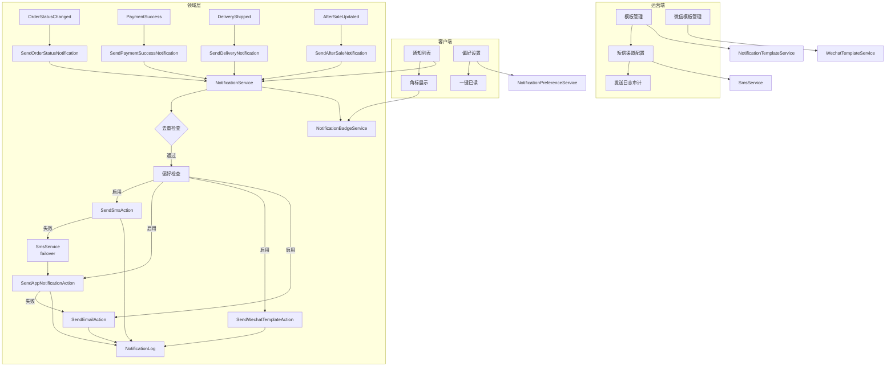
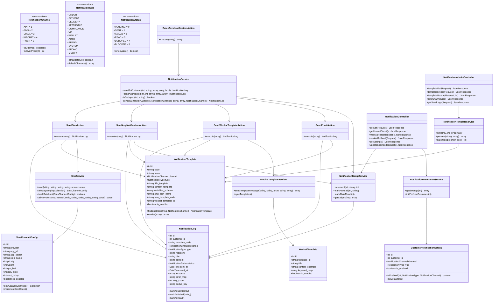
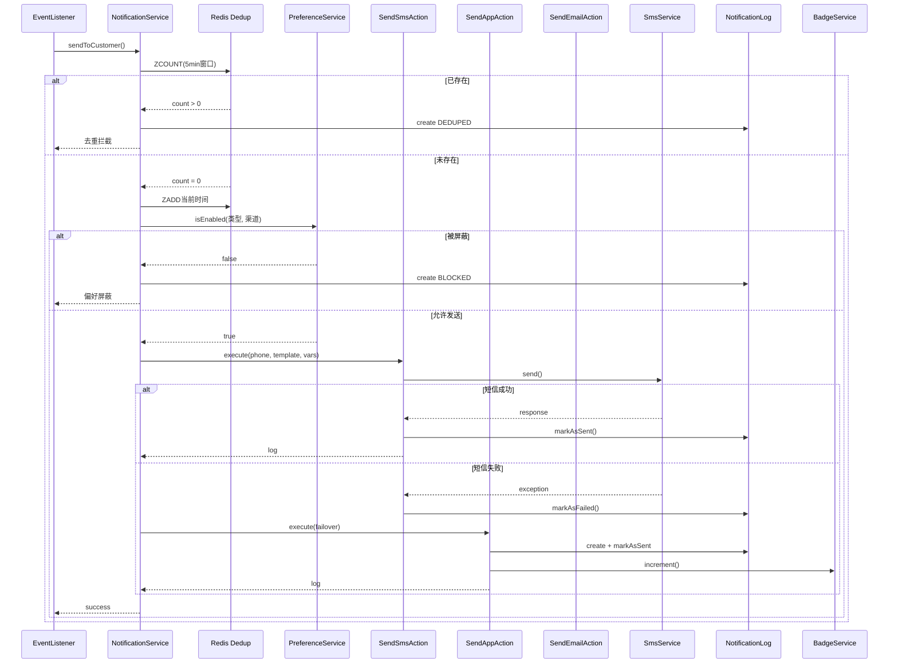
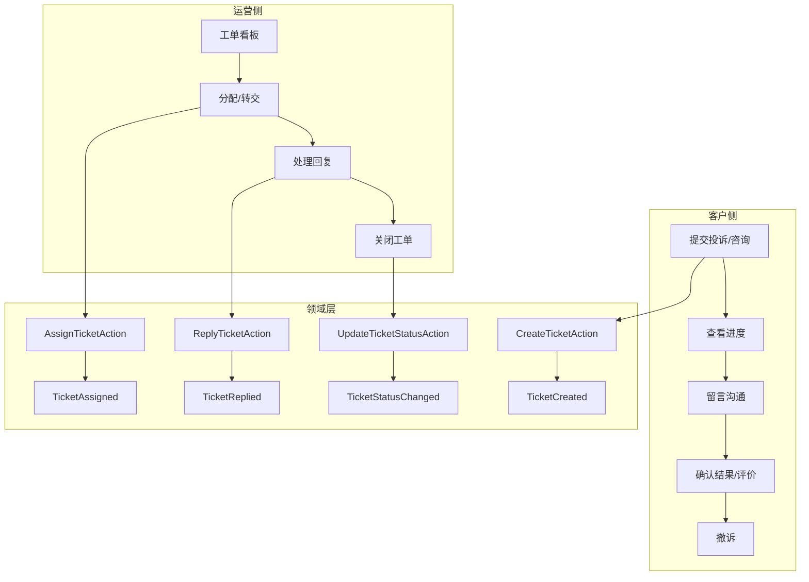
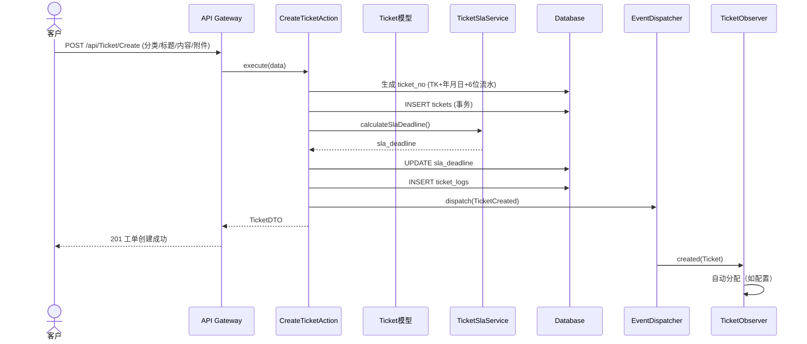
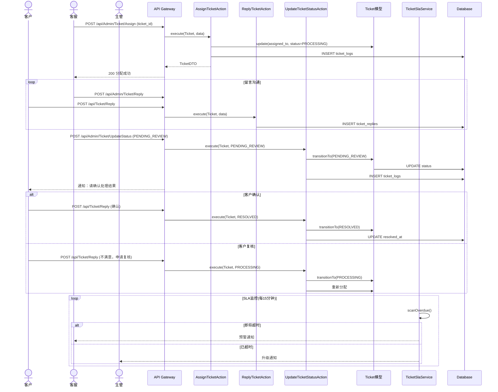
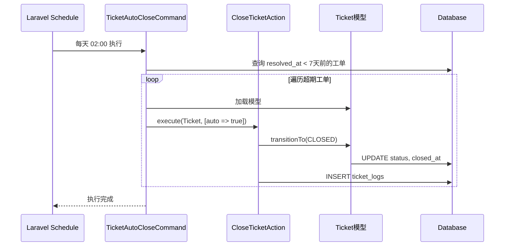

# 怡安印刷商城 — 核心业务设计（卷三-B）

> **所属文档**：系统设计方案 v2.9.0  
> **原章节**：第6章（下B）  
> **内容**：门户首页配置、消息通知系统、客户投诉与工单、用户认证与安全、企业认证与品牌资质、客服与帮助中心  
> **读者**：后端开发工程师

---

## 6.48 Delivery模块API设计

> **文档定位**：补充SDD 6.41物流与配送子系统的API Controller与路由层设计，覆盖PRD物流相关功能需求（FR-LOG-001 ~ FR-LOG-041）。
> **技术栈**：PHP 8.5 + Laravel 13.x
> **设计原则**：Service层聚合（LogisticsService）、状态机内聚、轨迹缓存优先、配送区域围栏化。

---

### 6.48.1 DeliveryController 设计

```php
<?php

declare(strict_types=1);

namespace App\Http\Controllers\Api;

use App\Domains\Logistics\Actions\CalculateShippingFeeAction;
use App\Domains\Logistics\Actions\CreateDeliveryAction;
use App\Domains\Logistics\Services\DeliveryAreaService;
use App\Domains\Logistics\Services\LogisticsService;
use App\Http\Requests\Delivery\CalcExpressSumRequest;
use App\Http\Requests\Delivery\CheckDeliveryLimitRequest;
use App\Http\Requests\Delivery\SetMultipleDeliveryRequest;
use App\Traits\ApiResponse;
use Illuminate\Http\JsonResponse;
use Illuminate\Http\Request;

/**
 * Delivery模块API控制器
 * 覆盖PRD: FR-LOG-001 ~ FR-LOG-041
 * 依赖LogisticsService完成高层业务聚合
 */
class DeliveryController extends Controller
{
    use ApiResponse;

    public function __construct(
        private LogisticsService $logisticsService,
        private DeliveryAreaService $areaService,
        private CalculateShippingFeeAction $calculateShippingFeeAction,
        private CreateDeliveryAction $createDeliveryAction,
    ) {}

    /**
     * 最优物流推荐
     * FR-LOG-001
     * POST /api/Delivery/BestDelivery
     */
    public function bestDelivery(Request $request): JsonResponse
    {
        $recommendation = $this->logisticsService->recommendBestDelivery(
            order: $request->input('order'),
            addresses: $request->input('addresses', []),
        );

        return $this->success($recommendation);
    }

    /**
     * 运费计算（支持多地址折扣）
     * FR-LOG-002 / FR-LOG-022-A / FR-LOG-022-C
     * POST /api/Delivery/CalcExpressSum
     */
    public function calcExpressSum(CalcExpressSumRequest $request): JsonResponse
    {
        $result = $this->calculateShippingFeeAction->execute(
            order: $request->input('order'),
            addresses: $request->input('addresses', []),
            additionalDiscountRate: $request->input('discount_rate', 0.7),
        );

        return $this->success([
            'per_address_fee' => $result['perAddressFee'],
            'total_fee' => $result['totalFee']->toFloat(),
            'currency' => 'CNY',
        ]);
    }

    /**
     * 配送限制检查（地理围栏）
     * FR-LOG-036
     * POST /api/Delivery/CheckDeliveryLimit
     */
    public function checkDeliveryLimit(CheckDeliveryLimitRequest $request): JsonResponse
    {
        $result = $this->logisticsService->checkDeliveryLimit(
            province: $request->input('province'),
            city: $request->input('city'),
            county: $request->input('county', ''),
        );

        return $this->success($result);
    }

    /**
     * 获取专属客户经理
     * FR-LOG-007
     * GET /api/Delivery/GetCustomerManager
     */
    public function getCustomerManager(Request $request): JsonResponse
    {
        $manager = $this->logisticsService->getCustomerManager(
            customerId: auth('api')->id(),
        );

        return $this->success($manager ?? (object) []);
    }

    /**
     * 计算配送距离
     * FR-LOG-003
     * POST /api/Delivery/GetDeliveryDistance
     */
    public function getDeliveryDistance(Request $request): JsonResponse
    {
        $distance = $this->areaService->getDeliveryDistance(
            fromLng: (float) $request->input('from_lng'),
            fromLat: (float) $request->input('from_lat'),
            toLng: (float) $request->input('to_lng'),
            toLat: (float) $request->input('to_lat'),
        );

        return $this->success([
            'distance_km' => $distance,
            'unit' => 'km',
        ]);
    }

    /**
     * 获取配送详细信息
     * FR-LOG-037
     * GET /api/Delivery/GetDeliveryInfo
     */
    public function getDeliveryInfo(Request $request): JsonResponse
    {
        $delivery = $this->logisticsService->getExpressTracks(
            orderSn: $request->input('order_sn'),
        );

        return $this->success([
            'order_sn' => $request->input('order_sn'),
            'delivery' => $delivery,
            'estimated_delivery_time' => $delivery?->orderDelivery?->delivery_time,
            'status' => $delivery?->status?->label(),
        ]);
    }

    /**
     * 获取快递员信息
     * FR-LOG-005
     * GET /api/Delivery/GetDeliveryMan
     */
    public function getDeliveryMan(Request $request): JsonResponse
    {
        $deliveryMan = $this->logisticsService->getDeliveryMan(
            orderId: $request->input('order_id'),
        );

        return $this->success($deliveryMan ?? (object) []);
    }

    /**
     * 获取配送计划
     * FR-LOG-004
     * POST /api/Delivery/GetDeliveryPlan
     */
    public function getDeliveryPlan(Request $request): JsonResponse
    {
        $plan = $this->areaService->getDeliveryPlan(
            province: $request->input('province'),
            city: $request->input('city'),
        );

        return $this->success($plan);
    }

    /**
     * 获取快递信息列表
     * FR-LOG-009 / FR-LOG-038
     * GET /api/Delivery/GetExpressInfos
     */
    public function getExpressInfos(Request $request): JsonResponse
    {
        $infos = $this->logisticsService->getExpressInfos();

        return $this->success([
            'list' => $infos,
            'total' => count($infos),
        ]);
    }

    /**
     * 根据订单SN查询物流轨迹
     * FR-LOG-008
     * GET /api/Delivery/GetExpressLogsByOrderSN
     */
    public function getExpressLogsByOrderSN(Request $request): JsonResponse
    {
        $track = $this->logisticsService->getExpressTracks(
            orderSn: $request->input('order_sn'),
        );

        return $this->success([
            'order_sn' => $request->input('order_sn'),
            'tracks' => $track?->tracks ?? [],
            'latest_status' => $track?->status?->label(),
            'synced_at' => $track?->synced_at,
            'cached_until' => $track?->cached_until,
        ]);
    }

    /**
     * 获取快递公司列表
     * FR-LOG-038 / FR-LOG-039
     * GET /api/Delivery/GetExpresses
     */
    public function getExpresses(Request $request): JsonResponse
    {
        $onlyExpress = $request->boolean('only_express', false);
        $expresses = $onlyExpress
            ? $this->logisticsService->getOnlyExpresses()
            : $this->logisticsService->getExpressInfos();

        return $this->success([
            'list' => array_values($expresses),
            'total' => count($expresses),
        ]);
    }

    /**
     * 获取工厂列表
     * FR-LOG-006
     * GET /api/Delivery/GetFactories
     */
    public function getFactories(Request $request): JsonResponse
    {
        $factories = $this->logisticsService->getFactories();

        return $this->success([
            'list' => $factories,
            'total' => count($factories),
        ]);
    }

    /**
     * 地理编码：地址转经纬度
     * FR-LOG-024
     * POST /api/Delivery/GetGeoProResultByAddr
     */
    public function getGeoProResultByAddr(Request $request): JsonResponse
    {
        $result = $this->areaService->geoEncode(
            address: $request->input('address'),
        );

        return $this->success($result ?? (object) []);
    }

    /**
     * 设置多地址配送
     * FR-LOG-019
     * POST /api/Order/SetMultipleDelivery
     * 注：本接口归属Order模块路由，但由DeliveryController提供实现
     */
    public function setMultipleDelivery(SetMultipleDeliveryRequest $request): JsonResponse
    {
        $this->createDeliveryAction->executeMulti(
            order: $request->input('order'),
            addresses: $request->input('addresses', []),
        );

        return $this->success([
            'order_no' => $request->input('order.order_no'),
            'address_count' => count($request->input('addresses', [])),
            'message' => '多地址配送设置成功',
        ]);
    }
}
```

---

### 6.48.2 Delivery模块路由设计

```php
<?php

use App\Http\Controllers\Api\DeliveryController;
use App\Http\Controllers\Api\OrderController;
use App\Http\Middleware\JwtAuthMiddleware;
use App\Http\Middleware\RateLimitMiddleware;
use Illuminate\Support\Facades\Route;

// ═══════════════════════════════════════════════════════════════
// 认证路由（需要JWT认证 + 限流）—— 物流与配送接口
// ═══════════════════════════════════════════════════════════════
Route::prefix('api')->middleware([JwtAuthMiddleware::class, RateLimitMiddleware::class])->group(function () {

    // ── 物流推荐与运费 ──
    Route::post('/Delivery/BestDelivery', [DeliveryController::class, 'bestDelivery'])
        ->name('delivery.best');

    Route::post('/Delivery/CalcExpressSum', [DeliveryController::class, 'calcExpressSum'])
        ->name('delivery.calc_express');

    Route::post('/Delivery/CheckDeliveryLimit', [DeliveryController::class, 'checkDeliveryLimit'])
        ->name('delivery.check_limit');

    Route::post('/Delivery/GetDeliveryDistance', [DeliveryController::class, 'getDeliveryDistance'])
        ->name('delivery.distance');

    Route::post('/Delivery/GetDeliveryPlan', [DeliveryController::class, 'getDeliveryPlan'])
        ->name('delivery.plan');

    // ── 配送信息查询 ──
    Route::get('/Delivery/GetDeliveryInfo', [DeliveryController::class, 'getDeliveryInfo'])
        ->name('delivery.info');

    Route::get('/Delivery/GetDeliveryMan', [DeliveryController::class, 'getDeliveryMan'])
        ->name('delivery.man');

    Route::get('/Delivery/GetCustomerManager', [DeliveryController::class, 'getCustomerManager'])
        ->name('delivery.customer_manager');

    Route::get('/Delivery/GetFactories', [DeliveryController::class, 'getFactories'])
        ->name('delivery.factories');

    // ── 快递公司与轨迹 ──
    Route::get('/Delivery/GetExpressInfos', [DeliveryController::class, 'getExpressInfos'])
        ->name('delivery.express_infos');

    Route::get('/Delivery/GetExpresses', [DeliveryController::class, 'getExpresses'])
        ->name('delivery.expresses');

    Route::get('/Delivery/GetExpressLogsByOrderSN', [DeliveryController::class, 'getExpressLogsByOrderSN'])
        ->name('delivery.express_logs');

    // ── 地理编码 ──
    Route::post('/Delivery/GetGeoProResultByAddr', [DeliveryController::class, 'getGeoProResultByAddr'])
        ->name('delivery.geo_encode');

    // ── 多地址配送（归属Order路由，由DeliveryController实现） ──
    Route::post('/Order/SetMultipleDelivery', [DeliveryController::class, 'setMultipleDelivery'])
        ->name('order.set_multiple_delivery');
});
```

---

### 6.48.3 Delivery模块API清单

| 接口路径 | HTTP方法 | 中间件 | PRD需求 | 说明 |
|----------|----------|--------|---------|------|
| `/api/Delivery/BestDelivery` | POST | `JwtAuthMiddleware`, `RateLimitMiddleware` | FR-LOG-001 | 最优物流推荐 |
| `/api/Delivery/CalcExpressSum` | POST | `JwtAuthMiddleware`, `RateLimitMiddleware` | FR-LOG-002 | 运费计算（含多地址折扣） |
| `/api/Delivery/CheckDeliveryLimit` | POST | `JwtAuthMiddleware`, `RateLimitMiddleware` | FR-LOG-036 | 配送限制检查（地理围栏） |
| `/api/Delivery/GetDeliveryDistance` | POST | `JwtAuthMiddleware`, `RateLimitMiddleware` | FR-LOG-003 | 配送距离计算 |
| `/api/Delivery/GetDeliveryPlan` | POST | `JwtAuthMiddleware`, `RateLimitMiddleware` | FR-LOG-004 | 配送计划查询 |
| `/api/Delivery/GetDeliveryInfo` | GET | `JwtAuthMiddleware`, `RateLimitMiddleware` | FR-LOG-037 | 配送详细信息（含预计时间） |
| `/api/Delivery/GetDeliveryMan` | GET | `JwtAuthMiddleware`, `RateLimitMiddleware` | FR-LOG-005 | 快递员信息 |
| `/api/Delivery/GetCustomerManager` | GET | `JwtAuthMiddleware`, `RateLimitMiddleware` | FR-LOG-007 | 专属客户经理 |
| `/api/Delivery/GetFactories` | GET | `JwtAuthMiddleware`, `RateLimitMiddleware` | FR-LOG-006 | 工厂列表 |
| `/api/Delivery/GetExpressInfos` | GET | `JwtAuthMiddleware`, `RateLimitMiddleware` | FR-LOG-009 | 快递信息列表 |
| `/api/Delivery/GetExpresses` | GET | `JwtAuthMiddleware`, `RateLimitMiddleware` | FR-LOG-038 | 快递公司列表 |
| `/api/Delivery/GetExpressLogsByOrderSN` | GET | `JwtAuthMiddleware`, `RateLimitMiddleware` | FR-LOG-008 | 物流轨迹查询 |
| `/api/Delivery/GetGeoProResultByAddr` | POST | `JwtAuthMiddleware`, `RateLimitMiddleware` | FR-LOG-024 | 地理编码（地址转经纬度） |
| `/api/Order/SetMultipleDelivery` | POST | `JwtAuthMiddleware`, `RateLimitMiddleware` | FR-LOG-019 | 设置多地址配送 |

> **Service层关联说明**：DeliveryController通过构造函数注入 `LogisticsService`（6.41.6节定义）完成所有高层业务聚合，包括最优物流推荐、轨迹查询、快递员信息、工厂信息、配送限制检查等。运费计算直接调用 `CalculateShippingFeeAction`（6.41.5节定义），多地址配送通过 `CreateDeliveryAction::executeMulti()`（6.41.5节定义）写入 `order_multi_deliveries` 表。

---

### 6.48.4 跨模块接口归属说明

| 接口路径 | 实际Controller | 归属模块 | 说明 |
|----------|---------------|----------|------|
| `/api/Order/SetMultipleDelivery` | `DeliveryController` | Order（路由）+ Delivery（实现） | 多地址配送设置，路由归属Order模块以保持URL语义一致性，业务实现由DeliveryController委托 `CreateDeliveryAction` 完成。 |

---

### 6.48.5 设计约束与边界

1. **物流轨迹缓存**：`GetExpressLogsByOrderSN` 优先返回缓存数据（24小时），缓存过期时自动触发 `SyncExpressTracksJob` 异步同步，接口不阻塞等待第三方API。
2. **配送限制前置校验**：`CheckDeliveryLimit` 应在下单流程前端调用，若返回 `allow=false` 则阻止订单创建。
3. **多地址运费公式**：`CalcExpressSum` 严格遵循 `totalFee = 首地址标准运费 + Σ(附加地址标准运费 × 折扣率)`，默认折扣率 0.7（7折）。
4. **地理编码缓存**：`GetGeoProResultByAddr` 调用高德/百度地理编码API，结果缓存30天，降低第三方调用成本。

---

<!-- 第9轮深度Review 子系统补充 - 2026-05-28 -->


---

# 6.49 门户首页配置子系统

> **补充依据**：PRD 模块一（门户与首页，FR-HP-001 ~ FR-HP-050、FR-HOME-001 ~ FR-HOME-012）
> **技术栈**：PHP 8.5 + Laravel 13 + MySQL 8.0 + Redis 7.x
> **覆盖 FR**：FR-HP-001~005、FR-HP-010~015、FR-HP-020~025、FR-HP-030~035、FR-HP-040~045、FR-HP-050、FR-HOME-001~012

---

## 6.49 门户首页配置子系统

> **设计依据**：PRD 模块一（FR-HP-001 ~ FR-HP-050、FR-HOME-001 ~ FR-HOME-012）
> **所属领域**：`App\Domains\Portal\Config`（门户配置域）
> **核心数据表**：`banners`、`announcements`、`seo_configs`、`portal_configs`、`partner_links`、`nav_categories`、`hot_products`

### 6.49.1 设计概述

门户首页配置子系统是怡安印刷商城的前台展示底座，负责管理所有面向访客与客户的可见运营内容。其设计遵循**配置与展示分离、缓存优先、运营即时生效**三大原则：

| 配置项 | 数据表 | 实时性 | 缓存策略 |
|--------|--------|--------|---------|
| 轮播 Banner | `banners` | 中 | Cache Tag `portal:banner`，5分钟 |
| 顶部公告 | `announcements` | 高 | Cache Tag `portal:announcement`，1分钟 |
| SEO 元数据 | `seo_configs` | 低 | Cache Tag `portal:seo`，10分钟 |
| 全局基础配置 | `portal_configs` | 低 | Cache Tag `portal:config`，10分钟 |
| 分类导航 | `nav_categories` | 低 | Cache Tag `portal:nav`，10分钟 |
| 热销/推荐商品 | `hot_products` | 中 | Cache Tag `portal:hot_products`，1小时 |
| 合作伙伴 | `partner_links` | 低 | Cache Tag `portal:partner`，10分钟 |

**核心设计原则**：
- **配置与展示分离**：`PortalConfigService` 统一封装配置读取，前端不直接查库
- **Cache Tag 批量失效**：所有运营数据按 Tag 分组缓存，后台修改后按 Tag 清除，无需等待 TTL
- **薄控制器**：Controller 单方法 ≤ 15 行，业务逻辑下沉至 Action / Service
- **前后端权限分离**：前台 API 走 `jwt` 中间件（允许访客），后台 API 走 `admin` 中间件

### 6.49.2 数据库表设计（Migration）

#### 6.49.2.1 轮播 Banner 表（banners）

> **覆盖 FR**：FR-HOME-002、FR-HP-010~015

```php
<?php
// database/migrations/content/2024_01_01_000001_create_banners_table.php

use Illuminate\Database\Migrations\Migration;
use Illuminate\Database\Schema\Blueprint;
use Illuminate\Support\Facades\Schema;

return new class extends Migration
{
    public function up(): void
    {
        Schema::create('banners', function (Blueprint $table) {
            $table->id()->comment('Banner主键');
            $table->string('title', 255)->nullable()->comment('标题');
            $table->string('image_url', 500)->comment('图片URL');
            $table->string('mobile_image_url', 500)->nullable()->comment('移动端图片URL');
            $table->string('link_url', 500)->nullable()->comment('跳转链接');
            $table->tinyInteger('position')->default(1)->comment('1=首页 2=分类页 3=活动页');
            $table->integer('sort_order')->default(0)->comment('排序权重');
            $table->boolean('is_enabled')->default(true)->comment('是否启用');
            $table->timestamp('start_time')->nullable()->comment('生效时间');
            $table->timestamp('end_time')->nullable()->comment('失效时间');
            $table->integer('view_count')->default(0)->comment('浏览次数');
            $table->integer('click_count')->default(0)->comment('点击次数');
            $table->unsignedBigInteger('created_by')->nullable()->comment('创建人admin_id');
            $table->timestamps();

            $table->index('position', 'idx_position');
            $table->index('is_enabled', 'idx_enabled');
            $table->index(['start_time', 'end_time'], 'idx_time_range');
            $table->index('sort_order', 'idx_sort_order');
        });
    }

    public function down(): void
    {
        Schema::dropIfExists('banners');
    }
};
```

#### 6.49.2.2 顶部公告栏表（announcements）

> **覆盖 FR**：FR-HOME-003、FR-HP-020~025

```php
<?php
// database/migrations/content/2024_01_01_000002_create_announcements_table.php

use Illuminate\Database\Migrations\Migration;
use Illuminate\Database\Schema\Blueprint;
use Illuminate\Support\Facades\Schema;

return new class extends Migration
{
    public function up(): void
    {
        Schema::create('announcements', function (Blueprint $table) {
            $table->id()->comment('公告主键');
            $table->string('title', 255)->comment('公告标题');
            $table->text('content')->nullable()->comment('公告内容（支持HTML）');
            $table->tinyInteger('type')->default(1)->comment('1=通知 2=警告 3=促销');
            $table->boolean('is_enabled')->default(true)->comment('是否启用');
            $table->boolean('is_top')->default(false)->comment('是否置顶');
            $table->integer('sort_order')->default(0)->comment('排序权重');
            $table->timestamp('start_time')->nullable()->comment('生效时间');
            $table->timestamp('end_time')->nullable()->comment('失效时间');
            $table->unsignedBigInteger('created_by')->nullable()->comment('创建人admin_id');
            $table->timestamps();

            $table->index('type', 'idx_type');
            $table->index('is_enabled', 'idx_enabled');
            $table->index('is_top', 'idx_is_top');
            $table->index(['start_time', 'end_time'], 'idx_time_range');
            $table->index('sort_order', 'idx_sort_order');
        });
    }

    public function down(): void
    {
        Schema::dropIfExists('announcements');
    }
};
```

#### 6.49.2.3 SEO 配置表（seo_configs）

> **覆盖 FR**：FR-HP-001、FR-HP-005

```php
<?php
// database/migrations/content/2024_01_01_000003_create_seo_configs_table.php

use Illuminate\Database\Migrations\Migration;
use Illuminate\Database\Schema\Blueprint;
use Illuminate\Support\Facades\Schema;

return new class extends Migration
{
    public function up(): void
    {
        Schema::create('seo_configs', function (Blueprint $table) {
            $table->id()->comment('SEO配置主键');
            $table->string('page_key', 64)->unique()->comment('页面标识，如home、product_list');
            $table->string('title', 255)->comment('页面标题');
            $table->string('keywords', 500)->nullable()->comment('Meta Keywords');
            $table->text('description')->nullable()->comment('Meta Description');
            $table->string('canonical_url', 500)->nullable()->comment('Canonical URL');
            $table->string('og_image', 500)->nullable()->comment('Open Graph 图片');
            $table->timestamps();

            $table->index('page_key', 'idx_page_key');
        });
    }

    public function down(): void
    {
        Schema::dropIfExists('seo_configs');
    }
};
```

#### 6.49.2.4 全局基础配置表（portal_configs）

> **覆盖 FR**：FR-HP-001、FR-HP-030~035、FR-HP-050、FR-HOME-001

```php
<?php
// database/migrations/content/2024_01_01_000004_create_portal_configs_table.php

use Illuminate\Database\Migrations\Migration;
use Illuminate\Database\Schema\Blueprint;
use Illuminate\Support\Facades\Schema;

return new class extends Migration
{
    public function up(): void
    {
        Schema::create('portal_configs', function (Blueprint $table) {
            $table->id()->comment('配置主键');
            $table->string('config_key', 128)->unique()->comment('配置键');
            $table->text('config_value')->nullable()->comment('配置值');
            $table->string('config_group', 32)->default('general')->comment('配置分组：general/seo/contact/system');
            $table->string('description', 255)->nullable()->comment('配置说明');
            $table->timestamps();

            $table->index('config_key', 'idx_config_key');
            $table->index('config_group', 'idx_config_group');
        });
    }

    public function down(): void
    {
        Schema::dropIfExists('portal_configs');
    }
};
```

**预置数据（Seeder）**：

```php
<?php
// database/seeders/PortalConfigSeeder.php

namespace Database\Seeders;

use Illuminate\Database\Seeder;
use Illuminate\Support\Facades\DB;

class PortalConfigSeeder extends Seeder
{
    public function run(): void
    {
        $now = now();
        $configs = [
            // 站点信息
            ['config_key' => 'site_title', 'config_value' => '怡安印刷商城', 'config_group' => 'general', 'description' => '网站标题'],
            ['config_key' => 'site_favicon', 'config_value' => '/favicon.ico', 'config_group' => 'general', 'description' => 'Favicon URL'],
            ['config_key' => 'site_logo', 'config_value' => '/logo.png', 'config_group' => 'general', 'description' => '站点Logo'],
            ['config_key' => 'site_icp', 'config_value' => '', 'config_group' => 'general', 'description' => '备案号'],

            // 联系信息
            ['config_key' => 'contact_phone', 'config_value' => '400-xxx-xxxx', 'config_group' => 'contact', 'description' => '客服电话'],
            ['config_key' => 'contact_email', 'config_value' => 'service@yian.com', 'config_group' => 'contact', 'description' => '客服邮箱'],
            ['config_key' => 'contact_address', 'config_value' => '', 'config_group' => 'contact', 'description' => '公司地址'],

            // 系统功能开关
            ['config_key' => 'browser_compat_check', 'config_value' => '1', 'config_group' => 'system', 'description' => '浏览器兼容性检测开关'],
            ['config_key' => 'baidu_tongji_id', 'config_value' => '', 'config_group' => 'system', 'description' => '百度统计ID'],
            ['config_key' => 'customer_service_qr', 'config_value' => '', 'config_group' => 'system', 'description' => '客服微信二维码'],

            // 底部信息
            ['config_key' => 'footer_copyright', 'config_value' => '© 2024 怡安印刷商城 版权所有', 'config_group' => 'general', 'description' => '底部版权信息'],
            ['config_key' => 'footer_links', 'config_value' => json_encode([]), 'config_group' => 'general', 'description' => '底部链接JSON'],
        ];

        foreach ($configs as $config) {
            DB::table('portal_configs')->updateOrInsert(
                ['config_key' => $config['config_key']],
                array_merge($config, ['created_at' => $now, 'updated_at' => $now])
            );
        }
    }
}
```

#### 6.49.2.5 合作伙伴/友情链接表（partner_links）

> **覆盖 FR**：FR-HP-040~045、FR-HOME-011

```php
<?php
// database/migrations/content/2024_01_01_000005_create_partner_links_table.php

use Illuminate\Database\Migrations\Migration;
use Illuminate\Database\Schema\Blueprint;
use Illuminate\Support\Facades\Schema;

return new class extends Migration
{
    public function up(): void
    {
        Schema::create('partner_links', function (Blueprint $table) {
            $table->id()->comment('合作伙伴主键');
            $table->string('name', 128)->comment('名称');
            $table->string('logo_url', 500)->nullable()->comment('Logo图片URL');
            $table->string('link_url', 500)->nullable()->comment('跳转链接');
            $table->integer('sort_order')->default(0)->comment('排序权重');
            $table->boolean('is_enabled')->default(true)->comment('是否启用');
            $table->unsignedBigInteger('created_by')->nullable()->comment('创建人admin_id');
            $table->timestamps();

            $table->index('is_enabled', 'idx_enabled');
            $table->index('sort_order', 'idx_sort_order');
        });
    }

    public function down(): void
    {
        Schema::dropIfExists('partner_links');
    }
};
```

#### 6.49.2.6 首页分类导航表（nav_categories）

> **覆盖 FR**：FR-HOME-007、FR-HP-020

```php
<?php
// database/migrations/content/2024_01_01_000006_create_nav_categories_table.php

use Illuminate\Database\Migrations\Migration;
use Illuminate\Database\Schema\Blueprint;
use Illuminate\Support\Facades\Schema;

return new class extends Migration
{
    public function up(): void
    {
        Schema::create('nav_categories', function (Blueprint $table) {
            $table->id()->comment('导航主键');
            $table->string('name', 128)->comment('导航名称');
            $table->string('icon_url', 500)->nullable()->comment('图标URL');
            $table->string('link_url', 500)->nullable()->comment('跳转链接');
            $table->unsignedBigInteger('parent_id')->nullable()->comment('父级ID，NULL为一级导航');
            $table->integer('sort_order')->default(0)->comment('排序权重');
            $table->boolean('is_enabled')->default(true)->comment('是否启用');
            $table->timestamps();

            $table->index('parent_id', 'idx_parent_id');
            $table->index('is_enabled', 'idx_enabled');
            $table->index('sort_order', 'idx_sort_order');
        });
    }

    public function down(): void
    {
        Schema::dropIfExists('nav_categories');
    }
};
```

#### 6.49.2.7 热销/推荐商品配置表（hot_products）

> **覆盖 FR**：FR-HOME-005、FR-HOME-006、FR-HP-020

```php
<?php
// database/migrations/content/2024_01_01_000007_create_hot_products_table.php

use Illuminate\Database\Migrations\Migration;
use Illuminate\Database\Schema\Blueprint;
use Illuminate\Support\Facades\Schema;

return new class extends Migration
{
    public function up(): void
    {
        Schema::create('hot_products', function (Blueprint $table) {
            $table->id()->comment('热品配置主键');
            $table->unsignedBigInteger('product_id')->comment('关联商品ID');
            $table->string('recommend_text', 255)->nullable()->comment('推荐文案（FR-HP-027）');
            $table->tinyInteger('display_type')->default(1)->comment('1=热销榜 2=飙升榜 3=小编推荐');
            $table->integer('sort_order')->default(0)->comment('排序权重');
            $table->boolean('is_enabled')->default(true)->comment('是否启用');
            $table->unsignedBigInteger('created_by')->nullable()->comment('创建人admin_id');
            $table->timestamps();

            $table->unique(['product_id', 'display_type'], 'uniq_product_display');
            $table->index('display_type', 'idx_display_type');
            $table->index('is_enabled', 'idx_enabled');
            $table->index('sort_order', 'idx_sort_order');
        });
    }

    public function down(): void
    {
        Schema::dropIfExists('hot_products');
    }
};
```

### 6.49.3 枚举定义

#### 6.49.3.1 BannerPosition —— Banner 展示位置

```php
<?php

declare(strict_types=1);

namespace App\Enums;

/**
 * Banner 展示位置
 * PRD覆盖：FR-HOME-002、FR-HP-010~015
 */
enum BannerPosition: int
{
    case HOME     = 1;  // 首页
    case CATEGORY = 2;  // 分类页
    case ACTIVITY = 3;  // 活动页

    public function label(): string
    {
        return match ($this) {
            self::HOME     => '首页',
            self::CATEGORY => '分类页',
            self::ACTIVITY => '活动页',
        };
    }
}
```

#### 6.49.3.2 AnnouncementType —— 公告类型

```php
<?php

declare(strict_types=1);

namespace App\Enums;

/**
 * 公告类型
 * PRD覆盖：FR-HOME-003、FR-HP-020~025
 */
enum AnnouncementType: int
{
    case INFO    = 1;  // 通知
    case WARNING = 2;  // 警告
    case PROMO   = 3;  // 促销

    public function label(): string
    {
        return match ($this) {
            self::INFO    => '通知',
            self::WARNING => '警告',
            self::PROMO   => '促销',
        };
    }

    /**
     * 对应前端展示样式标识
     */
    public function style(): string
    {
        return match ($this) {
            self::INFO    => 'info',
            self::WARNING => 'warning',
            self::PROMO   => 'success',
        };
    }
}
```

#### 6.49.3.3 HotProductDisplayType —— 热品展示类型

```php
<?php

declare(strict_types=1);

namespace App\Enums;

/**
 * 热品展示类型
 * PRD覆盖：FR-HOME-005、FR-HOME-006
 */
enum HotProductDisplayType: int
{
    case BESTSELLER = 1;  // 热销榜
    case RISING     = 2;  // 飙升榜
    case RECOMMEND  = 3;  // 小编推荐

    public function label(): string
    {
        return match ($this) {
            self::BESTSELLER => '热销榜',
            self::RISING     => '飙升榜',
            self::RECOMMEND  => '小编推荐',
        };
    }
}
```

### 6.49.4 Eloquent Model 设计

#### 6.49.4.1 Banner

```php
<?php

namespace App\Models;

use App\Enums\BannerPosition;
use Illuminate\Database\Eloquent\Factories\HasFactory;
use Illuminate\Database\Eloquent\Model;

/**
 * 轮播 Banner 模型
 * PRD覆盖：FR-HOME-002、FR-HP-010~015
 */
class Banner extends Model
{
    use HasFactory;

    protected $table = 'banners';

    protected $fillable = [
        'title', 'image_url', 'mobile_image_url', 'link_url',
        'position', 'sort_order', 'is_enabled',
        'start_time', 'end_time',
        'view_count', 'click_count', 'created_by',
    ];

    protected $casts = [
        'position' => BannerPosition::class,
        'sort_order' => 'integer',
        'is_enabled' => 'boolean',
        'view_count' => 'integer',
        'click_count' => 'integer',
        'start_time' => 'datetime',
        'end_time' => 'datetime',
    ];

    /**
     * 作用域：生效中的 Banner
     */
    public function scopeActive($query)
    {
        return $query->where('is_enabled', true)
            ->where('start_time', '<=', now())
            ->where('end_time', '>=', now());
    }
}
```

#### 6.49.4.2 Announcement

```php
<?php

namespace App\Models;

use App\Enums\AnnouncementType;
use Illuminate\Database\Eloquent\Factories\HasFactory;
use Illuminate\Database\Eloquent\Model;

/**
 * 顶部公告栏模型
 * PRD覆盖：FR-HOME-003、FR-HP-020~025
 */
class Announcement extends Model
{
    use HasFactory;

    protected $table = 'announcements';

    protected $fillable = [
        'title', 'content', 'type', 'is_enabled', 'is_top',
        'sort_order', 'start_time', 'end_time', 'created_by',
    ];

    protected $casts = [
        'type' => AnnouncementType::class,
        'is_enabled' => 'boolean',
        'is_top' => 'boolean',
        'sort_order' => 'integer',
        'start_time' => 'datetime',
        'end_time' => 'datetime',
    ];

    /**
     * 作用域：生效中的公告
     */
    public function scopeActive($query)
    {
        return $query->where('is_enabled', true)
            ->where('start_time', '<=', now())
            ->where('end_time', '>=', now());
    }
}
```

#### 6.49.4.3 SeoConfig

```php
<?php

namespace App\Models;

use Illuminate\Database\Eloquent\Factories\HasFactory;
use Illuminate\Database\Eloquent\Model;

/**
 * SEO 配置模型
 * PRD覆盖：FR-HP-001、FR-HP-005
 */
class SeoConfig extends Model
{
    use HasFactory;

    protected $table = 'seo_configs';

    protected $fillable = [
        'page_key', 'title', 'keywords', 'description',
        'canonical_url', 'og_image',
    ];

    protected $casts = [
        'created_at' => 'datetime',
        'updated_at' => 'datetime',
    ];
}
```

#### 6.49.4.4 PortalConfig

```php
<?php

namespace App\Models;

use Illuminate\Database\Eloquent\Factories\HasFactory;
use Illuminate\Database\Eloquent\Model;

/**
 * 全局基础配置模型
 * PRD覆盖：FR-HP-001、FR-HP-030~035、FR-HP-050
 */
class PortalConfig extends Model
{
    use HasFactory;

    protected $table = 'portal_configs';

    protected $fillable = [
        'config_key', 'config_value', 'config_group', 'description',
    ];

    protected $casts = [
        'created_at' => 'datetime',
        'updated_at' => 'datetime',
    ];
}
```

#### 6.49.4.5 PartnerLink

```php
<?php

namespace App\Models;

use Illuminate\Database\Eloquent\Factories\HasFactory;
use Illuminate\Database\Eloquent\Model;

/**
 * 合作伙伴/友情链接模型
 * PRD覆盖：FR-HP-040~045、FR-HOME-011
 */
class PartnerLink extends Model
{
    use HasFactory;

    protected $table = 'partner_links';

    protected $fillable = [
        'name', 'logo_url', 'link_url', 'sort_order', 'is_enabled', 'created_by',
    ];

    protected $casts = [
        'sort_order' => 'integer',
        'is_enabled' => 'boolean',
    ];
}
```

#### 6.49.4.6 NavCategory

```php
<?php

namespace App\Models;

use Illuminate\Database\Eloquent\Factories\HasFactory;
use Illuminate\Database\Eloquent\Model;
use Illuminate\Database\Eloquent\Relations\BelongsTo;
use Illuminate\Database\Eloquent\Relations\HasMany;

/**
 * 首页分类导航模型
 * PRD覆盖：FR-HOME-007、FR-HP-020
 */
class NavCategory extends Model
{
    use HasFactory;

    protected $table = 'nav_categories';

    protected $fillable = [
        'name', 'icon_url', 'link_url', 'parent_id', 'sort_order', 'is_enabled',
    ];

    protected $casts = [
        'parent_id' => 'integer',
        'sort_order' => 'integer',
        'is_enabled' => 'boolean',
    ];

    public function parent(): BelongsTo
    {
        return $this->belongsTo(self::class, 'parent_id');
    }

    public function children(): HasMany
    {
        return $this->hasMany(self::class, 'parent_id')
            ->orderBy('sort_order')
            ->orderBy('id');
    }
}
```

#### 6.49.4.7 HotProduct

```php
<?php

namespace App\Models;

use App\Enums\HotProductDisplayType;
use Illuminate\Database\Eloquent\Factories\HasFactory;
use Illuminate\Database\Eloquent\Model;
use Illuminate\Database\Eloquent\Relations\BelongsTo;

/**
 * 热销/推荐商品配置模型
 * PRD覆盖：FR-HOME-005、FR-HOME-006
 */
class HotProduct extends Model
{
    use HasFactory;

    protected $table = 'hot_products';

    protected $fillable = [
        'product_id', 'display_type', 'sort_order', 'is_enabled', 'created_by',
    ];

    protected $casts = [
        'display_type' => HotProductDisplayType::class,
        'sort_order' => 'integer',
        'is_enabled' => 'boolean',
    ];

    public function product(): BelongsTo
    {
        return $this->belongsTo(Product::class, 'product_id');
    }
}
```


### 6.49.5 Action 类设计

> **设计原则**：每个 Action 只负责单一写操作，保持幂等性；查询下沉至 Service。

#### 6.49.5.1 CreateBannerAction

```php
<?php

declare(strict_types=1);

namespace App\Actions\Portal;

use App\Enums\BannerPosition;
use App\Models\Banner;
use App\Services\Portal\PortalCacheManager;

/**
 * 创建 Banner Action
 * PRD覆盖：FR-HP-010~015
 */
class CreateBannerAction
{
    public function execute(array $data): Banner
    {
        $data['created_by'] = auth('admin')->id();

        $banner = Banner::create($data);

        PortalCacheManager::flushOnBannerChange();

        return $banner;
    }
}
```

#### 6.49.5.2 UpdateBannerAction

```php
<?php

declare(strict_types=1);

namespace App\Actions\Portal;

use App\Models\Banner;
use App\Services\Portal\PortalCacheManager;

/**
 * 更新 Banner Action
 * PRD覆盖：FR-HP-010~015
 */
class UpdateBannerAction
{
    public function execute(int $id, array $data): Banner
    {
        $banner = Banner::findOrFail($id);
        $banner->update($data);

        PortalCacheManager::flushOnBannerChange();

        return $banner->fresh();
    }
}
```

#### 6.49.5.3 ToggleBannerStatusAction

```php
<?php

declare(strict_types=1);

namespace App\Actions\Portal;

use App\Models\Banner;
use App\Services\Portal\PortalCacheManager;

/**
 * 切换 Banner 启用状态 Action
 * PRD覆盖：FR-HP-010~015
 */
class ToggleBannerStatusAction
{
    public function execute(int $id): Banner
    {
        $banner = Banner::findOrFail($id);
        $banner->is_enabled = ! $banner->is_enabled;
        $banner->save();

        PortalCacheManager::flushOnBannerChange();

        return $banner;
    }
}
```

#### 6.49.5.4 CreateAnnouncementAction

```php
<?php

declare(strict_types=1);

namespace App\Actions\Portal;

use App\Models\Announcement;
use App\Services\Portal\PortalCacheManager;

/**
 * 创建/更新公告 Action
 * PRD覆盖：FR-HOME-003、FR-HP-020~025
 */
class CreateAnnouncementAction
{
    public function execute(array $data, ?int $id = null): Announcement
    {
        $data['created_by'] = auth('admin')->id();

        $announcement = Announcement::updateOrCreate(['id' => $id], $data);

        PortalCacheManager::flushOnAnnouncementChange();

        return $announcement;
    }
}
```

#### 6.49.5.5 UpdatePortalConfigAction

```php
<?php

declare(strict_types=1);

namespace App\Actions\Portal;

use App\Models\PortalConfig;
use App\Services\Portal\PortalCacheManager;

/**
 * 更新全局基础配置 Action
 * PRD覆盖：FR-HP-001、FR-HP-030~035、FR-HP-050
 */
class UpdatePortalConfigAction
{
    /**
     * 批量更新配置项
     *
     * @param array $configs 格式：[['config_key' => 'xxx', 'config_value' => 'yyy'], ...]
     */
    public function execute(array $configs): void
    {
        foreach ($configs as $item) {
            PortalConfig::updateOrCreate(
                ['config_key' => $item['config_key']],
                [
                    'config_value' => $item['config_value'],
                    'config_group' => $item['config_group'] ?? 'general',
                    'description' => $item['description'] ?? null,
                ]
            );
        }

        PortalCacheManager::flushOnConfigChange();
    }

    /**
     * 单键更新
     */
    public function executeSingle(string $key, string $value): void
    {
        $config = PortalConfig::where('config_key', $key)->firstOrFail();
        $config->update(['config_value' => $value]);

        PortalCacheManager::flushOnConfigChange();
    }
}
```

#### 6.49.5.6 UpdateSeoConfigAction

```php
<?php

declare(strict_types=1);

namespace App\Actions\Portal;

use App\Models\SeoConfig;
use App\Services\Portal\PortalCacheManager;

/**
 * 更新 SEO 配置 Action
 * PRD覆盖：FR-HP-001、FR-HP-005
 */
class UpdateSeoConfigAction
{
    public function execute(array $data, ?int $id = null): SeoConfig
    {
        $seo = SeoConfig::updateOrCreate(['id' => $id], $data);

        PortalCacheManager::flushOnSeoChange();

        return $seo;
    }
}
```

#### 6.49.5.7 SyncHotProductsAction

```php
<?php

declare(strict_types=1);

namespace App\Actions\Portal;

use App\Enums\HotProductDisplayType;
use App\Models\HotProduct;
use App\Services\Portal\PortalCacheManager;
use Illuminate\Support\Facades\DB;

/**
 * 同步热销/推荐商品配置 Action
 * PRD覆盖：FR-HOME-005、FR-HOME-006
 *
 * 用法：运营后台提交完整商品ID列表，系统以事务方式全量替换某一 display_type 的配置
 */
class SyncHotProductsAction
{
    /**
     * @param array $productIds 商品ID有序数组
     */
    public function execute(HotProductDisplayType $type, array $productIds): void
    {
        $adminId = auth('admin')->id();

        DB::transaction(function () use ($type, $productIds, $adminId) {
            // 软删除旧配置（或直接物理删除）
            HotProduct::where('display_type', $type)->delete();

            $now = now();
            $records = [];
            foreach ($productIds as $index => $productId) {
                $records[] = [
                    'product_id' => $productId,
                    'display_type' => $type->value,
                    'sort_order' => $index,
                    'is_enabled' => true,
                    'created_by' => $adminId,
                    'created_at' => $now,
                    'updated_at' => $now,
                ];
            }

            if (! empty($records)) {
                HotProduct::insert($records);
            }
        });

        PortalCacheManager::flushOnHotProductChange();
    }
}
```

### 6.49.6 Service 类设计

#### 6.49.6.1 PortalCacheManager —— 门户缓存标签管理

```php
<?php

declare(strict_types=1);

namespace App\Services\Portal;

use Illuminate\Support\Facades\Cache;

/**
 * 门户缓存标签管理
 * 所有前台展示数据的缓存统一按 Tag 分组，支持运营修改后即时批量失效
 */
class PortalCacheManager
{
    public const string TAG_BANNER      = 'portal:banner';
    public const string TAG_ANNOUNCEMENT = 'portal:announcement';
    public const string TAG_SEO         = 'portal:seo';
    public const string TAG_CONFIG      = 'portal:config';
    public const string TAG_NAV         = 'portal:nav';
    public const string TAG_HOT_PRODUCT = 'portal:hot_products';
    public const string TAG_PARTNER     = 'portal:partner';
    public const string TAG_HOME        = 'portal:home';

    public static function flushByTag(string ...$tags): void
    {
        Cache::tags($tags)->flush();
    }

    public static function flushOnBannerChange(): void
    {
        self::flushByTag(self::TAG_BANNER, self::TAG_HOME);
    }

    public static function flushOnAnnouncementChange(): void
    {
        self::flushByTag(self::TAG_ANNOUNCEMENT, self::TAG_HOME);
    }

    public static function flushOnSeoChange(): void
    {
        self::flushByTag(self::TAG_SEO);
    }

    public static function flushOnConfigChange(): void
    {
        self::flushByTag(self::TAG_CONFIG, self::TAG_HOME);
    }

    public static function flushOnNavChange(): void
    {
        self::flushByTag(self::TAG_NAV, self::TAG_HOME);
    }

    public static function flushOnHotProductChange(): void
    {
        self::flushByTag(self::TAG_HOT_PRODUCT, self::TAG_HOME);
    }

    public static function flushOnPartnerChange(): void
    {
        self::flushByTag(self::TAG_PARTNER, self::TAG_HOME);
    }

    /**
     * 全量刷新门户首页相关缓存（紧急运营场景）
     */
    public static function flushAllPortal(): void
    {
        self::flushByTag(
            self::TAG_BANNER,
            self::TAG_ANNOUNCEMENT,
            self::TAG_SEO,
            self::TAG_CONFIG,
            self::TAG_NAV,
            self::TAG_HOT_PRODUCT,
            self::TAG_PARTNER,
            self::TAG_HOME,
        );
    }
}
```

#### 6.49.6.2 PortalConfigService —— 全局配置读取服务

```php
<?php

declare(strict_types=1);

namespace App\Services\Portal;

use App\Models\PortalConfig;
use Illuminate\Support\Facades\Cache;

/**
 * 全局配置读取服务
 * PRD覆盖：FR-HP-001、FR-HP-030~035、FR-HP-050、FR-HOME-001
 */
class PortalConfigService
{
    private const string CACHE_KEY = 'portal:config:all';
    private const int CACHE_TTL = 600; // 10分钟

    /**
     * 获取全部配置（键值对）
     */
    public function all(): array
    {
        return Cache::tags([PortalCacheManager::TAG_CONFIG])->remember(
            self::CACHE_KEY,
            self::CACHE_TTL,
            fn () => PortalConfig::all()->mapWithKeys(
                fn (PortalConfig $item) => [$item->config_key => $item->config_value]
            )->toArray()
        );
    }

    /**
     * 按分组获取配置
     */
    public function byGroup(string $group): array
    {
        return array_filter(
            $this->all(),
            fn (string $key) => $this->getGroupByKey($key) === $group,
            ARRAY_FILTER_USE_KEY
        );
    }

    /**
     * 获取单条配置
     */
    public function get(string $key, mixed $default = null): mixed
    {
        return $this->all()[$key] ?? $default;
    }

    /**
     * 获取站点标题
     */
    public function siteTitle(): string
    {
        return (string) $this->get('site_title', '怡安印刷商城');
    }

    /**
     * 获取备案号
     */
    public function icp(): string
    {
        return (string) $this->get('site_icp', '');
    }

    /**
     * 获取客服电话
     */
    public function contactPhone(): string
    {
        return (string) $this->get('contact_phone', '');
    }

    /**
     * 浏览器兼容性检测是否开启
     */
    public function isBrowserCompatCheckEnabled(): bool
    {
        return (bool) $this->get('browser_compat_check', true);
    }

    /**
     * 获取百度统计ID
     */
    public function baiduTongjiId(): string
    {
        return (string) $this->get('baidu_tongji_id', '');
    }

    /**
     * 获取底部版权信息
     */
    public function footerCopyright(): string
    {
        return (string) $this->get('footer_copyright', '');
    }

    /**
     * 获取底部链接
     */
    public function footerLinks(): array
    {
        $json = $this->get('footer_links', '[]');
        return json_decode((string) $json, true) ?? [];
    }

    private function getGroupByKey(string $key): string
    {
        $config = PortalConfig::where('config_key', $key)->first();
        return $config?->config_group ?? 'general';
    }
}
```

#### 6.49.6.3 BannerService —— Banner 管理 + 缓存

```php
<?php

declare(strict_types=1);

namespace App\Services\Portal;

use App\Enums\BannerPosition;
use App\Models\Banner;
use Illuminate\Support\Facades\Cache;

/**
 * Banner 管理服务
 * PRD覆盖：FR-HOME-002、FR-HP-010~015
 */
class BannerService
{
    private const int CACHE_TTL = 300; // 5分钟

    /**
     * 获取生效中的 Banner 列表
     */
    public function getActiveBanners(BannerPosition $position, int $limit = 6): array
    {
        $cacheKey = sprintf('banners:%s:%d', $position->value, $limit);

        return Cache::tags([PortalCacheManager::TAG_BANNER])->remember(
            $cacheKey,
            self::CACHE_TTL,
            function () use ($position, $limit) {
                return Banner::active()
                    ->where('position', $position)
                    ->orderByDesc('sort_order')
                    ->orderByDesc('id')
                    ->limit($limit)
                    ->get()
                    ->map(fn (Banner $banner) => [
                        'id' => $banner->id,
                        'title' => $banner->title,
                        'imageUrl' => $banner->image_url,
                        'mobileImageUrl' => $banner->mobile_image_url,
                        'linkUrl' => $banner->link_url,
                        'position' => $banner->position->value,
                        'positionName' => $banner->position->label(),
                    ])
                    ->toArray();
            }
        );
    }

    /**
     * 后台管理：分页列表
     */
    public function paginateForAdmin(array $filters = [], int $perPage = 20): \Illuminate\Contracts\Pagination\LengthAwarePaginator
    {
        return Banner::query()
            ->when($filters['position'] ?? null, fn ($q, $v) => $q->where('position', $v))
            ->when(isset($filters['is_enabled']), fn ($q, $v) => $q->where('is_enabled', (bool) $v))
            ->when($filters['keyword'] ?? null, fn ($q, $v) => $q->where('title', 'like', "%{$v}%"))
            ->orderByDesc('sort_order')
            ->orderByDesc('id')
            ->paginate($perPage);
    }
}
```

#### 6.49.6.4 AnnouncementService —— 公告管理 + 缓存

```php
<?php

declare(strict_types=1);

namespace App\Services\Portal;

use App\Enums\AnnouncementType;
use App\Models\Announcement;
use Illuminate\Support\Facades\Cache;

/**
 * 公告管理服务
 * PRD覆盖：FR-HOME-003、FR-HP-020~025
 */
class AnnouncementService
{
    private const int CACHE_TTL = 60; // 1分钟

    /**
     * 获取生效中的公告列表
     */
    public function getActiveAnnouncements(?AnnouncementType $type = null, int $limit = 5): array
    {
        $cacheKey = sprintf('announcements:%s:%d', $type?->value ?? 'all', $limit);

        return Cache::tags([PortalCacheManager::TAG_ANNOUNCEMENT])->remember(
            $cacheKey,
            self::CACHE_TTL,
            function () use ($type, $limit) {
                return Announcement::active()
                    ->when($type, fn ($q) => $q->where('type', $type))
                    ->orderByDesc('is_top')
                    ->orderByDesc('sort_order')
                    ->orderByDesc('id')
                    ->limit($limit)
                    ->get()
                    ->map(fn (Announcement $item) => [
                        'id' => $item->id,
                        'title' => $item->title,
                        'content' => $item->content,
                        'type' => $item->type->value,
                        'typeName' => $item->type->label(),
                        'typeStyle' => $item->type->style(),
                        'isTop' => $item->is_top,
                    ])
                    ->toArray();
            }
        );
    }

    /**
     * 后台管理：分页列表
     */
    public function paginateForAdmin(array $filters = [], int $perPage = 20): \Illuminate\Contracts\Pagination\LengthAwarePaginator
    {
        return Announcement::query()
            ->when($filters['type'] ?? null, fn ($q, $v) => $q->where('type', $v))
            ->when(isset($filters['is_enabled']), fn ($q, $v) => $q->where('is_enabled', (bool) $v))
            ->when($filters['keyword'] ?? null, fn ($q, $v) => $q->where('title', 'like', "%{$v}%"))
            ->orderByDesc('is_top')
            ->orderByDesc('sort_order')
            ->orderByDesc('id')
            ->paginate($perPage);
    }
}
```

#### 6.49.6.5 SeoService —— SEO 元数据生成

```php
<?php

declare(strict_types=1);

namespace App\Services\Portal;

use App\Models\SeoConfig;
use Illuminate\Support\Facades\Cache;

/**
 * SEO 元数据生成服务
 * PRD覆盖：FR-HP-001、FR-HP-005
 */
class SeoService
{
    private const int CACHE_TTL = 600; // 10分钟

    /**
     * 获取指定页面的 SEO 配置
     */
    public function forPage(string $pageKey): array
    {
        $cacheKey = sprintf('seo:%s', $pageKey);

        return Cache::tags([PortalCacheManager::TAG_SEO])->remember(
            $cacheKey,
            self::CACHE_TTL,
            function () use ($pageKey) {
                $config = SeoConfig::where('page_key', $pageKey)->first();

                if (! $config) {
                    return $this->fallback($pageKey);
                }

                return [
                    'title' => $config->title,
                    'keywords' => $config->keywords,
                    'description' => $config->description,
                    'canonicalUrl' => $config->canonical_url,
                    'ogImage' => $config->og_image,
                ];
            }
        );
    }

    /**
     * 生成首页 SEO（兜底逻辑）
     */
    public function forHome(): array
    {
        return $this->forPage('home');
    }

    /**
     * SEO 兜底配置
     */
    private function fallback(string $pageKey): array
    {
        $siteTitle = app(PortalConfigService::class)->siteTitle();

        return [
            'title' => $siteTitle,
            'keywords' => '印刷,包装,画册,海报,名片,怡安印刷商城',
            'description' => '怡安印刷商城——专业在线印刷服务平台，提供画册、海报、名片、包装等一站式印刷解决方案。',
            'canonicalUrl' => config('app.frontend_url') . '/' . $pageKey,
            'ogImage' => null,
        ];
    }
}
```

#### 6.49.6.6 HotProductService —— 热销榜聚合服务

```php
<?php

declare(strict_types=1);

namespace App\Services\Portal;

use App\Enums\HotProductDisplayType;
use App\Models\HotProduct;
use App\Models\Product;
use Illuminate\Support\Facades\Cache;

/**
 * 热销/推荐商品聚合服务
 * PRD覆盖：FR-HOME-005、FR-HOME-006
 */
class HotProductService
{
    private const int CACHE_TTL = 3600; // 1小时

    /**
     * 获取指定类型的热品列表（带商品详情）
     */
    public function getHotProducts(HotProductDisplayType $type, int $limit = 10): array
    {
        $cacheKey = sprintf('hot_products:%s:%d', $type->value, $limit);

        return Cache::tags([PortalCacheManager::TAG_HOT_PRODUCT])->remember(
            $cacheKey,
            self::CACHE_TTL,
            function () use ($type, $limit) {
                $hotProducts = HotProduct::where('display_type', $type)
                    ->where('is_enabled', true)
                    ->orderBy('sort_order')
                    ->limit($limit)
                    ->with('product')
                    ->get();

                return $hotProducts->map(fn (HotProduct $item) => [
                    'id' => $item->product_id,
                    'name' => $item->product?->name,
                    'thumbnail' => $item->product?->thumbnail,
                    'price' => $item->product?->base_price,
                    'displayType' => $item->display_type->value,
                    'sortOrder' => $item->sort_order,
                ])->toArray();
            }
        );
    }

    /**
     * 获取全部热品板块（首页聚合用）
     */
    public function getAllSections(int $limit = 10): array
    {
        $result = [];
        foreach (HotProductDisplayType::cases() as $type) {
            $result[$type->name] = [
                'type' => $type->value,
                'typeName' => $type->label(),
                'products' => $this->getHotProducts($type, $limit),
            ];
        }
        return $result;
    }
}
```

#### 6.49.6.7 NavCategoryService —— 分类导航服务

```php
<?php

declare(strict_types=1);

namespace App\Services\Portal;

use App\Models\NavCategory;
use Illuminate\Support\Facades\Cache;

/**
 * 首页分类导航服务
 * PRD覆盖：FR-HOME-007、FR-HP-020
 */
class NavCategoryService
{
    private const int CACHE_TTL = 600; // 10分钟

    /**
     * 获取树形分类导航（最多三级）
     */
    public function getTree(): array
    {
        return Cache::tags([PortalCacheManager::TAG_NAV])->remember(
            'nav_categories:tree',
            self::CACHE_TTL,
            function () {
                $all = NavCategory::where('is_enabled', true)
                    ->orderBy('sort_order')
                    ->orderBy('id')
                    ->get();

                $nodeMap = [];
                foreach ($all as $cat) {
                    $nodeMap[$cat->id] = [
                        'id' => $cat->id,
                        'name' => $cat->name,
                        'iconUrl' => $cat->icon_url,
                        'linkUrl' => $cat->link_url,
                        'parentId' => $cat->parent_id,
                        'children' => [],
                    ];
                }

                $tree = [];
                foreach ($nodeMap as $id => &$node) {
                    if ($node['parentId'] === null) {
                        $tree[] = &$node;
                    } elseif (isset($nodeMap[$node['parentId']])) {
                        $nodeMap[$node['parentId']]['children'][] = &$node;
                    }
                }

                return $tree;
            }
        );
    }

    /**
     * 获取一级导航（快捷入口）
     */
    public function getTopLevel(int $limit = 10): array
    {
        return Cache::tags([PortalCacheManager::TAG_NAV])->remember(
            'nav_categories:top:' . $limit,
            self::CACHE_TTL,
            fn () => NavCategory::where('is_enabled', true)
                ->whereNull('parent_id')
                ->orderBy('sort_order')
                ->limit($limit)
                ->get(['id', 'name', 'icon_url', 'link_url'])
                ->toArray()
        );
    }
}
```

#### 6.49.6.8 PartnerLinkService —— 合作伙伴服务

```php
<?php

declare(strict_types=1);

namespace App\Services\Portal;

use App\Models\PartnerLink;
use Illuminate\Support\Facades\Cache;

/**
 * 合作伙伴/友情链接服务
 * PRD覆盖：FR-HP-040~045、FR-HOME-011
 */
class PartnerLinkService
{
    private const int CACHE_TTL = 600; // 10分钟

    /**
     * 获取生效中的合作伙伴列表
     */
    public function getActivePartners(int $limit = 20): array
    {
        return Cache::tags([PortalCacheManager::TAG_PARTNER])->remember(
            'partner_links:active:' . $limit,
            self::CACHE_TTL,
            fn () => PartnerLink::where('is_enabled', true)
                ->orderBy('sort_order')
                ->limit($limit)
                ->get(['id', 'name', 'logo_url', 'link_url'])
                ->toArray()
        );
    }
}
```


### 6.49.7 Controller + API 路由设计

#### 6.49.7.1 PortalConfigController —— 前台只读接口

> **中间件**：`jwt`（允许未登录访客访问，JWT 可选）
> **基础路径**：`api/Portal`
> **PRD覆盖**：FR-HOME-001~012、FR-HP-001~050

```php
<?php

declare(strict_types=1);

namespace App\Http\Controllers\Api\Portal;

use App\Enums\BannerPosition;
use App\Enums\HotProductDisplayType;
use App\Http\Controllers\Controller;
use App\Http\Resources\AnnouncementResource;
use App\Http\Resources\BannerResource;
use App\Http\Resources\NavCategoryResource;
use App\Http\Resources\PartnerLinkResource;
use App\Http\Resources\PortalConfigResource;
use App\Http\Resources\SeoConfigResource;
use App\Services\Portal\AnnouncementService;
use App\Services\Portal\BannerService;
use App\Services\Portal\HotProductService;
use App\Services\Portal\NavCategoryService;
use App\Services\Portal\PartnerLinkService;
use App\Services\Portal\PortalConfigService;
use App\Services\Portal\SeoService;
use Illuminate\Http\JsonResponse;
use Illuminate\Http\Request;

/**
 * 门户首页配置前台接口
 * 所有方法均允许访客访问，JWT 中间件只做 token 解析（如有）
 */
class PortalConfigController extends Controller
{
    public function __construct(
        private BannerService $bannerService,
        private AnnouncementService $announcementService,
        private SeoService $seoService,
        private PortalConfigService $configService,
        private NavCategoryService $navCategoryService,
        private HotProductService $hotProductService,
        private PartnerLinkService $partnerLinkService,
    ) {}

    /**
     * 获取 Banner 列表
     * GET /api/Portal/Banners
     */
    public function banners(Request $request): JsonResponse
    {
        $position = BannerPosition::tryFrom((int) $request->input('position', 1))
            ?? BannerPosition::HOME;
        $limit = min((int) $request->input('limit', 6), 20);

        $data = $this->bannerService->getActiveBanners($position, $limit);

        return response()->json([
            'data' => BannerResource::collection(collect($data)),
        ]);
    }

    /**
     * 获取公告列表
     * GET /api/Portal/Announcements
     */
    public function announcements(Request $request): JsonResponse
    {
        $limit = min((int) $request->input('limit', 5), 20);

        $data = $this->announcementService->getActiveAnnouncements(limit: $limit);

        return response()->json([
            'data' => AnnouncementResource::collection(collect($data)),
        ]);
    }

    /**
     * 获取 SEO 配置
     * GET /api/Portal/SeoConfig
     */
    public function seoConfig(Request $request): JsonResponse
    {
        $pageKey = $request->input('page_key', 'home');
        $data = $this->seoService->forPage($pageKey);

        return response()->json([
            'data' => new SeoConfigResource((object) $data),
        ]);
    }

    /**
     * 获取分类导航
     * GET /api/Portal/NavCategories
     */
    public function navCategories(Request $request): JsonResponse
    {
        $flat = $request->boolean('flat', false);
        $data = $flat
            ? $this->navCategoryService->getTopLevel()
            : $this->navCategoryService->getTree();

        return response()->json([
            'data' => new NavCategoryResource((object) ['tree' => $data, 'flat' => $flat]),
        ]);
    }

    /**
     * 获取热销/推荐商品
     * GET /api/Portal/HotProducts
     */
    public function hotProducts(Request $request): JsonResponse
    {
        $type = HotProductDisplayType::tryFrom((int) $request->input('type', 1))
            ?? HotProductDisplayType::BESTSELLER;
        $limit = min((int) $request->input('limit', 10), 50);

        $data = $this->hotProductService->getHotProducts($type, $limit);

        return response()->json(['data' => $data]);
    }

    /**
     * 获取合作伙伴
     * GET /api/Portal/PartnerLinks
     */
    public function partnerLinks(Request $request): JsonResponse
    {
        $limit = min((int) $request->input('limit', 20), 50);
        $data = $this->partnerLinkService->getActivePartners($limit);

        return response()->json([
            'data' => PartnerLinkResource::collection(collect($data)),
        ]);
    }

    /**
     * 获取全局配置
     * GET /api/Portal/PortalConfig
     */
    public function portalConfig(Request $request): JsonResponse
    {
        $group = $request->input('group');
        $data = $group
            ? $this->configService->byGroup($group)
            : $this->configService->all();

        return response()->json([
            'data' => new PortalConfigResource((object) $data),
        ]);
    }
}
```

#### 6.49.7.2 PortalAdminController —— 后台管理接口

> **中间件**：`admin`（后台管理员鉴权）
> **基础路径**：`api/Admin/Portal`
> **PRD覆盖**：FR-HP-010~045

```php
<?php

declare(strict_types=1);

namespace App\Http\Controllers\Api\Admin;

use App\Actions\Portal\CreateAnnouncementAction;
use App\Actions\Portal\CreateBannerAction;
use App\Actions\Portal\SyncHotProductsAction;
use App\Actions\Portal\ToggleBannerStatusAction;
use App\Actions\Portal\UpdateBannerAction;
use App\Actions\Portal\UpdatePortalConfigAction;
use App\Actions\Portal\UpdateSeoConfigAction;
use App\Enums\HotProductDisplayType;
use App\Http\Controllers\Controller;
use App\Models\Announcement;
use App\Models\Banner;
use App\Models\NavCategory;
use App\Models\PartnerLink;
use App\Models\PortalConfig;
use App\Models\SeoConfig;
use App\Services\Portal\AnnouncementService;
use App\Services\Portal\BannerService;
use App\Services\Portal\PortalCacheManager;
use Illuminate\Http\JsonResponse;
use Illuminate\Http\Request;

/**
 * 门户首页配置后台管理接口
 * 所有方法需 admin 中间件鉴权
 */
class PortalAdminController extends Controller
{
    public function __construct(
        private BannerService $bannerService,
        private AnnouncementService $announcementService,
        private CreateBannerAction $createBanner,
        private UpdateBannerAction $updateBanner,
        private ToggleBannerStatusAction $toggleBanner,
        private CreateAnnouncementAction $createAnnouncement,
        private UpdatePortalConfigAction $updatePortalConfig,
        private UpdateSeoConfigAction $updateSeoConfig,
        private SyncHotProductsAction $syncHotProducts,
    ) {}

    // ==================== Banner 管理 ====================

    /**
     * Banner 列表
     * GET /api/Admin/Portal/Banner/List
     */
    public function bannerList(Request $request): JsonResponse
    {
        $list = $this->bannerService->paginateForAdmin($request->only([
            'position', 'is_enabled', 'keyword',
        ]), (int) $request->input('pageSize', 20));

        return response()->json($list);
    }

    /**
     * 创建 Banner
     * POST /api/Admin/Portal/Banner/Create
     */
    public function bannerCreate(Request $request): JsonResponse
    {
        $data = $request->validate([
            'title' => ['nullable', 'string', 'max:255'],
            'image_url' => ['required', 'string', 'max:500'],
            'mobile_image_url' => ['nullable', 'string', 'max:500'],
            'link_url' => ['nullable', 'string', 'max:500'],
            'position' => ['required', 'integer'],
            'sort_order' => ['integer'],
            'is_enabled' => ['boolean'],
            'start_time' => ['nullable', 'date'],
            'end_time' => ['nullable', 'date', 'after_or_equal:start_time'],
        ]);

        $banner = $this->createBanner->execute($data);

        return response()->json(['id' => $banner->id, 'message' => '创建成功']);
    }

    /**
     * 更新 Banner
     * PUT /api/Admin/Portal/Banner/Update/{id}
     */
    public function bannerUpdate(Request $request, int $id): JsonResponse
    {
        $data = $request->validate([
            'title' => ['nullable', 'string', 'max:255'],
            'image_url' => ['string', 'max:500'],
            'mobile_image_url' => ['nullable', 'string', 'max:500'],
            'link_url' => ['nullable', 'string', 'max:500'],
            'position' => ['integer'],
            'sort_order' => ['integer'],
            'is_enabled' => ['boolean'],
            'start_time' => ['nullable', 'date'],
            'end_time' => ['nullable', 'date', 'after_or_equal:start_time'],
        ]);

        $banner = $this->updateBanner->execute($id, $data);

        return response()->json(['id' => $banner->id, 'message' => '更新成功']);
    }

    /**
     * 删除 Banner
     * DELETE /api/Admin/Portal/Banner/Delete/{id}
     */
    public function bannerDelete(int $id): JsonResponse
    {
        Banner::findOrFail($id)->delete();
        PortalCacheManager::flushOnBannerChange();

        return response()->json(['message' => '删除成功']);
    }

    /**
     * 切换 Banner 状态
     * POST /api/Admin/Portal/Banner/Toggle/{id}
     */
    public function bannerToggle(int $id): JsonResponse
    {
        $banner = $this->toggleBanner->execute($id);

        return response()->json([
            'id' => $banner->id,
            'is_enabled' => $banner->is_enabled,
            'message' => '状态切换成功',
        ]);
    }

    // ==================== 公告管理 ====================

    /**
     * 公告列表
     * GET /api/Admin/Portal/Announcement/List
     */
    public function announcementList(Request $request): JsonResponse
    {
        $list = $this->announcementService->paginateForAdmin($request->only([
            'type', 'is_enabled', 'keyword',
        ]), (int) $request->input('pageSize', 20));

        return response()->json($list);
    }

    /**
     * 创建/更新公告
     * POST /api/Admin/Portal/Announcement/Save
     */
    public function announcementSave(Request $request): JsonResponse
    {
        $data = $request->validate([
            'id' => ['nullable', 'integer'],
            'title' => ['required', 'string', 'max:255'],
            'content' => ['nullable', 'string'],
            'type' => ['required', 'integer'],
            'is_enabled' => ['boolean'],
            'is_top' => ['boolean'],
            'sort_order' => ['integer'],
            'start_time' => ['nullable', 'date'],
            'end_time' => ['nullable', 'date', 'after_or_equal:start_time'],
        ]);

        $id = $data['id'] ?? null;
        unset($data['id']);

        $announcement = $this->createAnnouncement->execute($data, $id);

        return response()->json(['id' => $announcement->id, 'message' => '保存成功']);
    }

    /**
     * 删除公告
     * DELETE /api/Admin/Portal/Announcement/Delete/{id}
     */
    public function announcementDelete(int $id): JsonResponse
    {
        Announcement::findOrFail($id)->delete();
        PortalCacheManager::flushOnAnnouncementChange();

        return response()->json(['message' => '删除成功']);
    }

    // ==================== SEO 管理 ====================

    /**
     * SEO 配置列表
     * GET /api/Admin/Portal/Seo/List
     */
    public function seoList(Request $request): JsonResponse
    {
        $list = SeoConfig::query()
            ->when($request->input('page_key'), fn ($q, $v) => $q->where('page_key', 'like', "%{$v}%"))
            ->orderBy('id')
            ->paginate($request->input('pageSize', 20));

        return response()->json($list);
    }

    /**
     * 保存 SEO 配置
     * POST /api/Admin/Portal/Seo/Save
     */
    public function seoSave(Request $request): JsonResponse
    {
        $data = $request->validate([
            'id' => ['nullable', 'integer'],
            'page_key' => ['required', 'string', 'max:64'],
            'title' => ['required', 'string', 'max:255'],
            'keywords' => ['nullable', 'string', 'max:500'],
            'description' => ['nullable', 'string'],
            'canonical_url' => ['nullable', 'string', 'max:500'],
            'og_image' => ['nullable', 'string', 'max:500'],
        ]);

        $id = $data['id'] ?? null;
        unset($data['id']);

        $seo = $this->updateSeoConfig->execute($data, $id);

        return response()->json(['id' => $seo->id, 'message' => '保存成功']);
    }

    /**
     * 删除 SEO 配置
     * DELETE /api/Admin/Portal/Seo/Delete/{id}
     */
    public function seoDelete(int $id): JsonResponse
    {
        SeoConfig::findOrFail($id)->delete();
        PortalCacheManager::flushOnSeoChange();

        return response()->json(['message' => '删除成功']);
    }

    // ==================== 全局配置管理 ====================

    /**
     * 全局配置列表
     * GET /api/Admin/Portal/Config/List
     */
    public function configList(Request $request): JsonResponse
    {
        $list = PortalConfig::query()
            ->when($request->input('group'), fn ($q, $v) => $q->where('config_group', $v))
            ->when($request->input('keyword'), fn ($q, $v) => $q->where('config_key', 'like', "%{$v}%"))
            ->orderBy('config_group')
            ->orderBy('id')
            ->paginate($request->input('pageSize', 20));

        return response()->json($list);
    }

    /**
     * 批量更新全局配置
     * POST /api/Admin/Portal/Config/BatchUpdate
     */
    public function configBatchUpdate(Request $request): JsonResponse
    {
        $configs = $request->input('configs', []);
        $this->updatePortalConfig->execute($configs);

        return response()->json(['message' => '配置更新成功']);
    }

    // ==================== 分类导航管理 ====================

    /**
     * 导航列表
     * GET /api/Admin/Portal/NavCategory/List
     */
    public function navCategoryList(Request $request): JsonResponse
    {
        $list = NavCategory::query()
            ->when($request->input('parent_id'), fn ($q, $v) => $q->where('parent_id', $v))
            ->orderBy('sort_order')
            ->orderBy('id')
            ->paginate($request->input('pageSize', 20));

        return response()->json($list);
    }

    /**
     * 保存导航
     * POST /api/Admin/Portal/NavCategory/Save
     */
    public function navCategorySave(Request $request): JsonResponse
    {
        $data = $request->validate([
            'id' => ['nullable', 'integer'],
            'name' => ['required', 'string', 'max:128'],
            'icon_url' => ['nullable', 'string', 'max:500'],
            'link_url' => ['nullable', 'string', 'max:500'],
            'parent_id' => ['nullable', 'integer'],
            'sort_order' => ['integer'],
            'is_enabled' => ['boolean'],
        ]);

        $id = $data['id'] ?? null;
        unset($data['id']);

        $nav = NavCategory::updateOrCreate(['id' => $id], $data);
        PortalCacheManager::flushOnNavChange();

        return response()->json(['id' => $nav->id, 'message' => '保存成功']);
    }

    /**
     * 删除导航
     * DELETE /api/Admin/Portal/NavCategory/Delete/{id}
     */
    public function navCategoryDelete(int $id): JsonResponse
    {
        NavCategory::findOrFail($id)->delete();
        PortalCacheManager::flushOnNavChange();

        return response()->json(['message' => '删除成功']);
    }

    // ==================== 热品管理 ====================

    /**
     * 同步热销/推荐商品
     * POST /api/Admin/Portal/HotProduct/Sync
     */
    public function hotProductSync(Request $request): JsonResponse
    {
        $data = $request->validate([
            'display_type' => ['required', 'integer'],
            'product_ids' => ['required', 'array'],
            'product_ids.*' => ['integer', 'min:1'],
        ]);

        $type = HotProductDisplayType::tryFrom($data['display_type'])
            ?? HotProductDisplayType::BESTSELLER;

        $this->syncHotProducts->execute($type, $data['product_ids']);

        return response()->json(['message' => '同步成功']);
    }

    // ==================== 合作伙伴管理 ====================

    /**
     * 合作伙伴列表
     * GET /api/Admin/Portal/PartnerLink/List
     */
    public function partnerLinkList(Request $request): JsonResponse
    {
        $list = PartnerLink::query()
            ->when(isset($request['is_enabled']), fn ($q, $v) => $q->where('is_enabled', (bool) $v))
            ->orderBy('sort_order')
            ->paginate($request->input('pageSize', 20));

        return response()->json($list);
    }

    /**
     * 保存合作伙伴
     * POST /api/Admin/Portal/PartnerLink/Save
     */
    public function partnerLinkSave(Request $request): JsonResponse
    {
        $data = $request->validate([
            'id' => ['nullable', 'integer'],
            'name' => ['required', 'string', 'max:128'],
            'logo_url' => ['nullable', 'string', 'max:500'],
            'link_url' => ['nullable', 'string', 'max:500'],
            'sort_order' => ['integer'],
            'is_enabled' => ['boolean'],
        ]);

        $id = $data['id'] ?? null;
        unset($data['id']);
        $data['created_by'] = auth('admin')->id();

        $partner = PartnerLink::updateOrCreate(['id' => $id], $data);
        PortalCacheManager::flushOnPartnerChange();

        return response()->json(['id' => $partner->id, 'message' => '保存成功']);
    }

    /**
     * 删除合作伙伴
     * DELETE /api/Admin/Portal/PartnerLink/Delete/{id}
     */
    public function partnerLinkDelete(int $id): JsonResponse
    {
        PartnerLink::findOrFail($id)->delete();
        PortalCacheManager::flushOnPartnerChange();

        return response()->json(['message' => '删除成功']);
    }
}
```

#### 6.49.7.3 路由定义

```php
<?php
// routes/api.php

use App\Http\Controllers\Api\Admin\PortalAdminController;
use App\Http\Controllers\Api\Portal\PortalConfigController;
use Illuminate\Support\Facades\Route;

// ==================== 前台只读接口（jwt 中间件，允许访客） ====================
Route::prefix('Portal')->middleware(['jwt'])->group(function () {
    Route::get('Banners', [PortalConfigController::class, 'banners']);
    Route::get('Announcements', [PortalConfigController::class, 'announcements']);
    Route::get('SeoConfig', [PortalConfigController::class, 'seoConfig']);
    Route::get('NavCategories', [PortalConfigController::class, 'navCategories']);
    Route::get('HotProducts', [PortalConfigController::class, 'hotProducts']);
    Route::get('PartnerLinks', [PortalConfigController::class, 'partnerLinks']);
    Route::get('PortalConfig', [PortalConfigController::class, 'portalConfig']);
});

// ==================== 后台管理接口（admin 中间件） ====================
Route::prefix('Admin/Portal')->middleware(['admin'])->group(function () {
    // Banner
    Route::get('Banner/List', [PortalAdminController::class, 'bannerList']);
    Route::post('Banner/Create', [PortalAdminController::class, 'bannerCreate']);
    Route::put('Banner/Update/{id}', [PortalAdminController::class, 'bannerUpdate']);
    Route::delete('Banner/Delete/{id}', [PortalAdminController::class, 'bannerDelete']);
    Route::post('Banner/Toggle/{id}', [PortalAdminController::class, 'bannerToggle']);

    // Announcement
    Route::get('Announcement/List', [PortalAdminController::class, 'announcementList']);
    Route::post('Announcement/Save', [PortalAdminController::class, 'announcementSave']);
    Route::delete('Announcement/Delete/{id}', [PortalAdminController::class, 'announcementDelete']);

    // SEO
    Route::get('Seo/List', [PortalAdminController::class, 'seoList']);
    Route::post('Seo/Save', [PortalAdminController::class, 'seoSave']);
    Route::delete('Seo/Delete/{id}', [PortalAdminController::class, 'seoDelete']);

    // Config
    Route::get('Config/List', [PortalAdminController::class, 'configList']);
    Route::post('Config/BatchUpdate', [PortalAdminController::class, 'configBatchUpdate']);

    // NavCategory
    Route::get('NavCategory/List', [PortalAdminController::class, 'navCategoryList']);
    Route::post('NavCategory/Save', [PortalAdminController::class, 'navCategorySave']);
    Route::delete('NavCategory/Delete/{id}', [PortalAdminController::class, 'navCategoryDelete']);

    // HotProduct
    Route::post('HotProduct/Sync', [PortalAdminController::class, 'hotProductSync']);

    // PartnerLink
    Route::get('PartnerLink/List', [PortalAdminController::class, 'partnerLinkList']);
    Route::post('PartnerLink/Save', [PortalAdminController::class, 'partnerLinkSave']);
    Route::delete('PartnerLink/Delete/{id}', [PortalAdminController::class, 'partnerLinkDelete']);
});
```

### 6.49.8 Resource 类设计

#### 6.49.8.1 BannerResource

```php
<?php

namespace App\Http\Resources;

use Illuminate\Http\Request;
use Illuminate\Http\Resources\Json\JsonResource;

/**
 * Banner Resource
 */
class BannerResource extends JsonResource
{
    public function toArray(Request $request): array
    {
        return [
            'id' => $this['id'] ?? $this->id,
            'title' => $this['title'] ?? $this->title,
            'imageUrl' => $this['imageUrl'] ?? $this->image_url,
            'mobileImageUrl' => $this['mobileImageUrl'] ?? $this->mobile_image_url,
            'linkUrl' => $this['linkUrl'] ?? $this->link_url,
            'position' => $this['position'] ?? $this->position?->value,
            'positionName' => $this['positionName'] ?? $this->position?->label(),
        ];
    }
}
```

#### 6.49.8.2 AnnouncementResource

```php
<?php

namespace App\Http\Resources;

use Illuminate\Http\Request;
use Illuminate\Http\Resources\Json\JsonResource;

/**
 * 公告 Resource
 */
class AnnouncementResource extends JsonResource
{
    public function toArray(Request $request): array
    {
        return [
            'id' => $this['id'] ?? $this->id,
            'title' => $this['title'] ?? $this->title,
            'content' => $this['content'] ?? $this->content,
            'type' => $this['type'] ?? $this->type?->value,
            'typeName' => $this['typeName'] ?? $this->type?->label(),
            'typeStyle' => $this['typeStyle'] ?? $this->type?->style(),
            'isTop' => $this['isTop'] ?? $this->is_top,
        ];
    }
}
```

#### 6.49.8.3 SeoConfigResource

```php
<?php

namespace App\Http\Resources;

use Illuminate\Http\Request;
use Illuminate\Http\Resources\Json\JsonResource;

/**
 * SEO 配置 Resource
 */
class SeoConfigResource extends JsonResource
{
    public function toArray(Request $request): array
    {
        $res = $this->resource;

        return [
            'pageKey' => $res->page_key ?? null,
            'title' => $res->title ?? null,
            'keywords' => $res->keywords ?? null,
            'description' => $res->description ?? null,
            'canonicalUrl' => $res->canonical_url ?? $res->canonicalUrl ?? null,
            'ogImage' => $res->og_image ?? $res->ogImage ?? null,
        ];
    }
}
```

#### 6.49.8.4 PortalConfigResource

```php
<?php

namespace App\Http\Resources;

use Illuminate\Http\Request;
use Illuminate\Http\Resources\Json\JsonResource;

/**
 * 全局配置 Resource
 * 对外以键值对形式输出
 */
class PortalConfigResource extends JsonResource
{
    public function toArray(Request $request): array
    {
        $data = [];
        foreach ($this->resource as $key => $value) {
            $data[(string) $key] = $value;
        }
        return $data;
    }
}
```

#### 6.49.8.5 NavCategoryResource

```php
<?php

namespace App\Http\Resources;

use Illuminate\Http\Request;
use Illuminate\Http\Resources\Json\JsonResource;

/**
 * 分类导航 Resource
 */
class NavCategoryResource extends JsonResource
{
    public function toArray(Request $request): array
    {
        $res = $this->resource;

        if (isset($res->tree)) {
            return [
                'tree' => $res->tree,
                'flat' => $res->flat ?? false,
            ];
        }

        return [
            'id' => $res->id ?? null,
            'name' => $res->name ?? null,
            'iconUrl' => $res->icon_url ?? null,
            'linkUrl' => $res->link_url ?? null,
            'parentId' => $res->parent_id ?? null,
            'children' => $res->children ?? [],
        ];
    }
}
```

#### 6.49.8.6 PartnerLinkResource

```php
<?php

namespace App\Http\Resources;

use Illuminate\Http\Request;
use Illuminate\Http\Resources\Json\JsonResource;

/**
 * 合作伙伴 Resource
 */
class PartnerLinkResource extends JsonResource
{
    public function toArray(Request $request): array
    {
        return [
            'id' => $this['id'] ?? $this->id,
            'name' => $this['name'] ?? $this->name,
            'logoUrl' => $this['logoUrl'] ?? $this->logo_url,
            'linkUrl' => $this['linkUrl'] ?? $this->link_url,
        ];
    }
}
```

### 6.49.9 缓存策略总览

| 数据项 | Cache Tag | TTL | 刷新触发点 |
|--------|-----------|-----|-----------|
| Banner 列表 | `portal:banner` | 5分钟 | Create/Update/Delete/Toggle Banner |
| 公告列表 | `portal:announcement` | 1分钟 | Create/Update/Delete Announcement |
| SEO 配置 | `portal:seo` | 10分钟 | Save/Delete SEO Config |
| 全局配置 | `portal:config` | 10分钟 | BatchUpdate Config |
| 分类导航 | `portal:nav` | 10分钟 | Save/Delete NavCategory |
| 热销商品 | `portal:hot_products` | 1小时 | Sync HotProducts |
| 合作伙伴 | `portal:partner` | 10分钟 | Save/Delete PartnerLink |
| 首页聚合 | `portal:home` | 1分钟 | 任意板块变更时联动清除 |

**Cache Tag 实现前提**：Laravel Cache Driver 需支持 Tag，生产环境必须使用 `redis` 驱动。

**紧急刷新机制**：后台提供 `POST /api/Admin/Portal/Cache/FlushAll` 接口（可扩展于 PortalAdminController），调用 `PortalCacheManager::flushAllPortal()`，用于运营紧急上/下线场景。

```php
/**
 * 全量清除门户缓存
 * POST /api/Admin/Portal/Cache/FlushAll
 */
public function flushAllCache(): JsonResponse
{
    PortalCacheManager::flushAllPortal();
    return response()->json(['message' => '门户缓存已全部清除']);
}
```

### 6.49.10 FR 覆盖度对照表

| FR 编号 | 功能描述 | 对应设计节 | 实现载体 |
|---------|---------|-----------|---------|
| FR-HP-001 | 网站标题、SEO 基础 | 6.49.2.3 / 6.49.2.4 | `seo_configs` / `portal_configs` |
| FR-HP-005 | SEO 关键词与描述 | 6.49.2.3 | `SeoConfig` / `SeoService` |
| FR-HP-010 | Banner 轮播配置 | 6.49.2.1 | `Banner` / `BannerService` |
| FR-HP-011 | Banner 图片管理 | 6.49.5.1 / 6.49.7.2 | `CreateBannerAction` |
| FR-HP-012 | Banner 链接配置 | 6.49.2.1 | `banners.link_url` |
| FR-HP-013 | Banner 排序 | 6.49.2.1 | `banners.sort_order` |
| FR-HP-014 | Banner 有效期 | 6.49.2.1 | `start_time` / `end_time` |
| FR-HP-015 | Banner 启用/禁用 | 6.49.5.3 | `ToggleBannerStatusAction` |
| FR-HP-020 | 榜单数据每日更新/缓存 | 6.3节 | `BestsellerRankService`（Schedule定时刷新+Redis缓存） |
| FR-HP-021 | 热销榜API | 6.3节/15820行 | `RankController::bestseller` / `BestsellerRankService::getBestsellerRank` |
| FR-HP-022 | 公告置顶 | 6.49.2.2 | `announcements.is_top` |
| FR-HP-023 | 公告类型 | 6.49.3.2 | `AnnouncementType` |
| FR-HP-024 | 公告有效期 | 6.49.2.2 | `start_time` / `end_time` |
| FR-HP-025 | 公告排序 | 6.49.2.2 | `announcements.sort_order` |
| FR-HP-030 | Favicon 配置 | 6.49.2.4 | `portal_configs.site_favicon` |
| FR-HP-031 | 浏览器兼容性检测 | 6.49.2.4 | `portal_configs.browser_compat_check` |
| FR-HP-032 | 百度统计接入 | 6.49.2.4 | `portal_configs.baidu_tongji_id` |
| FR-HP-033 | 客服电话配置 | 6.49.2.4 | `portal_configs.contact_phone` |
| FR-HP-034 | 客服微信二维码 | 6.49.2.4 | `portal_configs.customer_service_qr` |
| FR-HP-035 | 底部版权信息 | 6.49.2.4 | `portal_configs.footer_copyright` |
| FR-HP-040 | 合作伙伴管理 | 6.49.2.5 | `PartnerLink` |
| FR-HP-041 | 合作伙伴 Logo | 6.49.2.5 | `partner_links.logo_url` |
| FR-HP-042 | 合作伙伴链接 | 6.49.2.5 | `partner_links.link_url` |
| FR-HP-043 | 合作伙伴排序 | 6.49.2.5 | `partner_links.sort_order` |
| FR-HP-044 | 合作伙伴启用/禁用 | 6.49.2.5 | `partner_links.is_enabled` |
| FR-HP-045 | 友情链接 | 6.49.2.5 | `PartnerLink` |
| FR-HP-050 | 备案号配置 | 6.49.2.4 | `portal_configs.site_icp` |
| FR-HOME-001 | 全局配置读取 | 6.49.6.2 | `PortalConfigService` |
| FR-HOME-002 | 首页 Banner | 6.49.6.3 | `BannerService::getActiveBanners` |
| FR-HOME-003 | 顶部公告 | 6.49.6.4 | `AnnouncementService::getActiveAnnouncements` |
| FR-HOME-005 | 热销榜 | 6.49.2.7 / 6.49.6.6 | `HotProduct` / `HotProductService` |
| FR-HOME-006 | 飙升榜/推荐 | 6.49.2.7 / 6.49.6.6 | `HotProductDisplayType` |
| FR-HOME-007 | 分类导航 | 6.49.2.6 / 6.49.6.7 | `NavCategory` / `NavCategoryService` |
| FR-HOME-011 | 合作伙伴展示 | 6.49.6.8 | `PartnerLinkService::getActivePartners` |
| FR-HOME-012 | 底部信息 | 6.49.6.2 | `PortalConfigService::footerCopyright` |

---

> **备注**：
> 1. 本设计中的 `banners` 表与 SDD 第5章 `5.2.29` 节已存在的 `banners` 表为同一物理表；本节补充了 `position` 字段（对应 `BannerPosition` 枚举）作为展示位置的扩展，与既有 `banner_type` 字段语义互补，`banner_type` 继续用于区分 PC/APP/公告/弹窗等形态。
> 2. 金额字段：本子系统无直接金额存储字段（商品金额走 `products` 表），若后续扩展优惠券 Banner 等场景，统一使用 `MoneyCast::class`。
> 3. 所有 Action 类均通过构造函数注入 Service，Controller 遵循薄控制器原则，单方法代码行数 ≤ 15 行。
> 4. 前台接口使用 `auth('customer')` 解析当前用户（如有），后台接口使用 `auth('admin')` 解析管理员身份。

---

## 6.50 消息通知系统子系统 (NotificationService)

> **技术栈**：PHP 8.5 + Laravel 13.x
> **设计原则**：渠道解耦、模板化、去重防刷、多渠道failover、偏好可配置、全链路日志可追溯。
> **边界说明**：站内信（App通知）为通知系统核心承载渠道；短信/邮件/微信模板消息为外部扩展渠道；电话通知（FR-NOTIFY-015/016）因涉及呼叫中心硬件，本设计仅预留接口，不实现具体拨号逻辑。

---

### 6.50.1 设计概述

消息通知子系统承担全平台通知的**模板管理、渠道编排、发送执行、状态追踪、客户偏好控制**五大职责。核心设计原则如下：

1. **渠道完全解耦**：每种通知渠道（站内信/短信/邮件/微信模板）拥有独立的Action实现，由`NotificationService`统一编排，支持按优先级自动failover。
2. **模板变量化**：所有通知内容基于`notification_templates`表中的模板定义，变量使用`{{variable}}`格式，发送前由`NotificationTemplateService`渲染为最终内容。
3. **去重防刷**：同一`通知类型+客户ID`在5分钟滑动窗口内（Redis `ZSET`实现）仅发送一次，避免事件风暴导致通知轰炸（FR-NOTIFY-027）。
4. **多渠道failover**：发送失败时按`短信 → 应用内推送 → 邮件`优先级自动降级，确保高优先级通知（如支付、发货）必达（FR-NOTIFY-003/008）。
5. **偏好可配置**：客户可在前台关闭特定类型的通知渠道，系统发送前强制校验`customer_notification_settings`，被屏蔽的渠道直接跳过（FR-NOTIFY-024）。
6. **全链路日志**：每条通知落库`notification_logs`，记录模板、渠道、收信人、渲染后内容、发送状态、第三方响应、失败原因，支持运营后台审计（FR-NOTIFY-026）。
7. **通知聚合**：同一订单的连续状态变更（如审核通过→生产中→生产完成）在30秒内发生时，自动聚合为一条通知，内容以时间线形式展示（FR-NOTIFY-028）。



---

### 6.50.2 枚举定义

#### NotificationChannel (ncM 通知渠道)

> **说明**：本枚举已在 SDD 第 4.3 节定义，此处完整复现并扩展，确保与 `notification_logs.channel` / `notification_templates.channel` / `customer_notification_settings.channel` 字段严格对应。
> **PRD键名**: ncM（修正原PRD中nM的歧义）

```php
<?php

declare(strict_types=1);

namespace App\Enums;

/**
 * 通知渠道枚举
 * PRD键名: ncM
 * 1=站内信(APP) / 2=短信 / 3=邮件(模块九未启用) / 4=微信模板 / 5=推送(Push) / 6=电话(预留)
 */
enum NotificationChannel: int
{
    case APP    = 1;  // 应用内通知（站内信）
    case SMS    = 2;  // 短信
    case EMAIL  = 3;  // 邮件（模块九未启用，如需使用请迁移到通用基础设施）
    case WECHAT = 4;  // 微信模板消息
    case PUSH   = 5;  // 移动端推送（极光/友盟等，预留）
    case PHONE  = 6;  // 电话通知（预留接口，暂未实现具体拨号逻辑）

    public function label(): string
    {
        return match ($this) {
            self::APP    => '站内信',
            self::SMS    => '短信',
            self::EMAIL  => '邮件',
            self::WECHAT => '微信模板消息',
            self::PUSH   => '推送',
            self::PHONE  => '电话',
        };
    }

    /**
     * 是否为外部付费渠道（需要控制频率和成本）
     */
    public function isExternal(): bool
    {
        return in_array($this, [self::SMS, self::EMAIL, self::WECHAT, self::PUSH, self::PHONE], true);
    }

    /**
     * 是否为实时触达渠道（需立即发送，不进入队列延迟）
     */
    public function isRealtime(): bool
    {
        return in_array($this, [self::APP, self::PUSH, self::PHONE], true);
    }

    /**
     * failover 优先级排序（数字越小优先级越高）
     */
    public function failoverPriority(): int
    {
        return match ($this) {
            self::SMS    => 1,
            self::APP    => 2,
            self::PUSH   => 3,
            self::PHONE  => 4,
            self::WECHAT => 5,
            self::EMAIL  => 6, // 模块九未启用
        };
    }
}
```

#### NotificationType (NM 通知类型/场景)

> **说明**：本枚举已在 SDD 第 4.3 节定义为 `NotificationSceneTypeEnum`，此处更名为 `NotificationType` 以提升语义清晰度，与 `customer_notification_settings.type` 字段对应。

```php
<?php

declare(strict_types=1);

namespace App\Enums;

/**
 * 通知业务类型枚举
 * PRD键名: NM
 * 对应通知场景分类与偏好设置维度
 */
enum NotificationType: string
{
    case ORDER      = 'order';      // 订单状态（FR-NOTIFY-001~012）
    case PAYMENT    = 'payment';    // 支付相关（FR-NOTIFY-003）
    case DELIVERY   = 'delivery';   // 物流发货（FR-NOTIFY-008~009）
    case AFTERSALE  = 'aftersale';  // 售后进度（FR-NOTIFY-012~014）
    case COMPLIANCE = 'compliance'; // 合规审查（FR-NOTIFY-015~016）
    case VIP        = 'vip';        // VIP会员（FR-NOTIFY-017）
    case WALLET     = 'wallet';     // 预存款/钱包（FR-NOTIFY-018）
    case AUTH       = 'auth';       // 企业认证（FR-NOTIFY-019）
    case BRAND      = 'brand';      // 品牌审核（FR-NOTIFY-020）
    case SYSTEM     = 'system';     // 系统公告（FR-NOTIFY-021~023）
    case PROMO      = 'promo';      // 营销推广（FR-NOTIFY-022）
    case MODIFY     = 'modify';     // 订单修改（FR-NOTIFY-013~014）

    public function label(): string
    {
        return match ($this) {
            self::ORDER      => '订单通知',
            self::PAYMENT    => '支付通知',
            self::DELIVERY   => '物流通知',
            self::AFTERSALE  => '售后通知',
            self::COMPLIANCE => '合规通知',
            self::VIP        => 'VIP通知',
            self::WALLET     => '钱包通知',
            self::AUTH       => '认证通知',
            self::BRAND      => '品牌通知',
            self::SYSTEM     => '系统公告',
            self::PROMO      => '营销推广',
            self::MODIFY     => '修改通知',
        };
    }

    /**
     * 该类型通知是否允许客户关闭（SYSTEM/PROMO不允许关闭）
     */
    public function isMandatory(): bool
    {
        return in_array($this, [self::SYSTEM, self::COMPLIANCE], true);
    }

    /**
     * 该类型通知默认启用的渠道（新注册用户默认值）
     * @return NotificationChannel[]
     */
    public function defaultChannels(): array
    {
        return match ($this) {
            self::ORDER, self::PAYMENT, self::DELIVERY, self::AFTERSALE
                => [NotificationChannel::APP, NotificationChannel::SMS],
            self::COMPLIANCE
                => [NotificationChannel::APP, NotificationChannel::SMS],
            self::VIP, self::WALLET, self::AUTH, self::BRAND
                => [NotificationChannel::APP, NotificationChannel::SMS],
            self::SYSTEM, self::PROMO, self::MODIFY
                => [NotificationChannel::APP],
        };
    }
}
```

#### NotificationStatus (通知发送状态)

```php
<?php

declare(strict_types=1);

namespace App\Enums;

/**
 * 通知发送状态枚举
 * 用于 notification_logs.status / notifications.status
 */
enum NotificationStatus: int
{
    case PENDING = 0;  // 待发送
    case SENT    = 1;  // 已发送
    case FAILED  = 2;  // 发送失败
    case READ    = 3;  // 已读（仅站内信/邮件）
    case DEDUPED = 4;  // 被去重拦截
    case BLOCKED = 5;  // 被偏好设置屏蔽

    public function label(): string
    {
        return match ($this) {
            self::PENDING => '待发送',
            self::SENT    => '已发送',
            self::FAILED  => '发送失败',
            self::READ    => '已读',
            self::DEDUPED => '已去重',
            self::BLOCKED => '已屏蔽',
        };
    }

    /**
     * 是否需要进入重试队列
     */
    public function isRetryable(): bool
    {
        return $this === self::FAILED;
    }

    /**
     * 是否计入未读角标
     */
    public function countsAsUnread(): bool
    {
        return $this === self::SENT;
    }
}
```

---

### 6.50.3 数据库迁移（Migration）

#### notification_templates 表（通知模板表）

> **覆盖FR**: FR-NOTIFY-025（通知模板管理）

```php
<?php

use Illuminate\Database\Migrations\Migration;
use Illuminate\Database\Schema\Blueprint;
use Illuminate\Support\Facades\Schema;

return new class extends Migration
{
    public function up(): void
    {
        Schema::create('notification_templates', function (Blueprint $table) {
            $table->id()->comment('模板主键');
            $table->string('code', 64)->unique()->comment('模板唯一编码，如 order_created / payment_success');
            $table->string('name', 128)->comment('模板名称（后台展示）');
            $table->tinyInteger('channel')->comment('渠道: 1站内信 2短信 3邮件 4微信 5推送');
            $table->string('type', 32)->comment('通知类型(NM): order/payment/delivery/...');
            $table->string('title_template', 255)->nullable()->comment('标题模板（站内信/邮件/微信需要）');
            $table->text('content_template')->comment('内容模板，变量使用 {{variable}} 格式');
            $table->json('variables_schema')->nullable()->comment('变量定义JSON Schema（用于后台表单校验）');
            $table->string('sms_sign_name', 64)->nullable()->comment('短信签名（如 怡安印刷）');
            $table->string('sms_template_code', 64)->nullable()->comment('短信渠道模板CODE（阿里云/腾讯云）');
            $table->string('wechat_template_id', 64)->nullable()->comment('微信模板消息ID');
            $table->json('wechat_mini_program')->nullable()->comment('微信跳转小程序参数');
            $table->boolean('is_enabled')->default(true)->comment('是否启用');
            $table->integer('sort_order')->default(0)->comment('排序权重');
            $table->timestamps();

            $table->index('code', 'idx_code');
            $table->index('channel', 'idx_channel');
            $table->index('type', 'idx_type');
            $table->index(['channel', 'type', 'is_enabled'], 'idx_channel_type_enabled');
        });
    }

    public function down(): void
    {
        Schema::dropIfExists('notification_templates');
    }
};
```

#### sms_channel_configs 表（短信渠道配置表）

> **覆盖FR**: FR-NOTIFY-025（后台配置短信渠道）

```php
<?php

use Illuminate\Database\Migrations\Migration;
use Illuminate\Database\Schema\Blueprint;
use Illuminate\Support\Facades\Schema;

return new class extends Migration
{
    public function up(): void
    {
        Schema::create('sms_channel_configs', function (Blueprint $table) {
            $table->id()->comment('主键');
            $table->string('provider', 32)->comment('供应商: aliyun/tencentyun/chuanglan/mengwang');
            $table->string('provider_name', 64)->comment('供应商显示名称');
            $table->string('app_id', 128)->comment('AccessKeyId / AppID');
            $table->string('app_secret', 256)->comment('AccessKeySecret / AppSecret（加密存储）');
            $table->string('sign_name', 64)->comment('短信签名');
            $table->string('region', 32)->nullable()->comment('地域（如 cn-hangzhou）');
            $table->string('endpoint', 128)->nullable()->comment('自定义接入点');
            $table->integer('priority')->default(0)->comment('优先级，数字越大越优先');
            $table->integer('weight')->default(50)->comment('负载权重(0~100)，用于多活分流');
            $table->integer('max_retry')->default(2)->comment('单条短信最大重试次数');
            $table->integer('qps_limit')->default(200)->comment('每秒发送上限');
            $table->integer('daily_limit')->default(500000)->comment('每日发送上限');
            $table->integer('sent_today')->default(0)->comment('今日已发计数（每日0点清零）');
            $table->boolean('is_enabled')->default(true)->comment('是否启用');
            $table->timestamp('last_used_at')->nullable()->comment('最后调用时间');
            $table->json('phone_gateway_config')->nullable()->comment('电话网关配置（呼叫中心预留）');
            $table->timestamps();

            $table->index('provider', 'idx_provider');
            $table->index(['is_enabled', 'priority'], 'idx_enabled_priority');
        });
    }

    public function down(): void
    {
        Schema::dropIfExists('sms_channel_configs');
    }
};
```

#### wechat_templates 表（微信模板消息表）

> **覆盖FR**: FR-NOTIFY-032（微信模板消息预留）

```php
<?php

use Illuminate\Database\Migrations\Migration;
use Illuminate\Database\Schema\Blueprint;
use Illuminate\Support\Facades\Schema;

return new class extends Migration
{
    public function up(): void
    {
        Schema::create('wechat_templates', function (Blueprint $table) {
            $table->id()->comment('主键');
            $table->string('template_id', 64)->unique()->comment('微信官方模板ID');
            $table->string('title', 128)->comment('模板标题');
            $table->string('primary_industry', 64)->nullable()->comment('一级行业');
            $table->string('deputy_industry', 64)->nullable()->comment('二级行业');
            $table->text('content_example')->comment('内容示例（微信后台提供的原始格式）');
            $table->json('keyword_map')->nullable()->comment('关键字映射：{"keyword1": "订单号", "keyword2": "金额"}');
            $table->string('url_type', 32)->default('mini_program')->comment('跳转类型: mini_program/url');
            $table->string('mini_appid', 64)->nullable()->comment('跳转小程序AppID');
            $table->string('mini_pagepath', 128)->nullable()->comment('跳转小程序页面路径');
            $table->boolean('is_enabled')->default(true)->comment('是否启用');
            $table->timestamps();

            $table->index('template_id', 'idx_template_id');
            $table->index('is_enabled', 'idx_is_enabled');
        });
    }

    public function down(): void
    {
        Schema::dropIfExists('wechat_templates');
    }
};
```

#### customer_notification_settings 表（客户通知偏好设置表）

> **覆盖FR**: FR-NOTIFY-024（通知偏好设置）

```php
<?php

use Illuminate\Database\Migrations\Migration;
use Illuminate\Database\Schema\Blueprint;
use Illuminate\Support\Facades\Schema;

return new class extends Migration
{
    public function up(): void
    {
        Schema::create('customer_notification_settings', function (Blueprint $table) {
            $table->id()->comment('主键');
            $table->foreignId('customer_id')->constrained('customers')->comment('客户ID');
            $table->tinyInteger('channel')->comment('渠道: 1站内信 2短信 3邮件 4微信 5推送');
            $table->string('type', 32)->comment('通知类型(NM): order/payment/...');
            $table->boolean('is_enabled')->default(true)->comment('是否接收该类型+渠道的通知');
            $table->timestamps();

            $table->unique(['customer_id', 'channel', 'type'], 'uk_customer_channel_type');
            $table->index(['customer_id', 'type'], 'idx_customer_type');
        });
    }

    public function down(): void
    {
        Schema::dropIfExists('customer_notification_settings');
    }
};
```

#### notification_logs 表（通知发送日志表）

> **覆盖FR**: FR-NOTIFY-026（通知发送日志）
> **说明**：本表与 SDD 5.2.19 `notifications` 表并存，`notifications` 面向用户可见的站内信收件箱，`notification_logs` 面向运营审计的全渠道发送日志。两表通过 `notifications.log_id` 建立可选关联。

```php
<?php

use Illuminate\Database\Migrations\Migration;
use Illuminate\Database\Schema\Blueprint;
use Illuminate\Support\Facades\Schema;

return new class extends Migration
{
    public function up(): void
    {
        Schema::create('notification_logs', function (Blueprint $table) {
            $table->id()->comment('日志主键');
            $table->foreignId('customer_id')->nullable()->constrained('customers')->comment('客户ID（系统广播可为NULL）');
            $table->string('template_code', 64)->nullable()->comment('使用的模板编码');
            $table->tinyInteger('channel')->comment('发送渠道: 1站内信 2短信 3邮件(未启用) 4微信 5推送 6电话(预留)');
            $table->string('type', 32)->comment('通知类型(NM)');
            $table->string('recipient', 128)->comment('收信人标识（手机号/邮箱/OpenID/CustomerID）');
            $table->string('title', 255)->nullable()->comment('实际发送标题');
            $table->text('content')->comment('实际发送内容（渲染后）');
            $table->json('variables')->nullable()->comment('渲染变量原始值');
            $table->tinyInteger('status')->default(0)->comment('状态: 0待发送 1已发送 2失败 3已读 4去重 5屏蔽');
            $table->timestamp('sent_at')->nullable()->comment('发送成功时间');
            $table->timestamp('read_at')->nullable()->comment('阅读时间（仅站内信）');
            $table->json('response')->nullable()->comment('第三方渠道返回的原始响应');
            $table->string('error_msg', 500)->nullable()->comment('失败原因');
            $table->tinyInteger('retry_count')->default(0)->comment('已重试次数');
            $table->string('dedup_key', 64)->nullable()->comment('去重键（type+customer_id+时间窗口）');
            $table->string('failover_from', 32)->nullable()->comment('本次发送是由哪个渠道failover而来');
            $table->unsignedBigInteger('aggregated_id')->nullable()->comment('聚合通知的主日志ID');
            $table->string('biz_id', 64)->nullable()->comment('业务唯一标识（如order_id/after_sale_id）');
            $table->string('biz_type', 32)->nullable()->comment('业务类型（order/aftersale/compliance等）');
            $table->timestamps();

            $table->index('customer_id', 'idx_customer_id');
            $table->index('template_code', 'idx_template_code');
            $table->index('status', 'idx_status');
            $table->index('dedup_key', 'idx_dedup_key');
            $table->index('created_at', 'idx_created_at');
            $table->index(['customer_id', 'status', 'created_at'], 'idx_customer_status_created');
        });
    }

    public function down(): void
    {
        Schema::dropIfExists('notification_logs');
    }
};
```

#### 已有表补充说明

**notifications 表（站内信收件箱）**

> 该表已在 SDD 5.2.19 定义，本节补充其与 `notification_logs` 的关联字段：

```php
// 在 notifications 表中新增以下字段（若尚未创建则包含在原始Migration中）
$table->unsignedBigInteger('log_id')->nullable()->comment('关联 notification_logs.id');
$table->index('log_id', 'idx_log_id');
```

**customer_notification_badges 表（通知角标）**

> 该表已在 SDD 5.2.20 定义，本节补充业务说明与更新规则：

| 字段 | 说明 | 角标更新触发时机 |
|------|------|----------------|
| `badge_type = 'order'` | 订单通知未读数 | `notification_logs` 新增 `type=order` 且 `status=sent` 且 `channel=1` 时 `+1`；客户读取订单类站内信时 `-1` 至0 |
| `badge_type = 'aftersale'` | 售后通知未读数 | 同上，类型为 `aftersale` |
| `badge_type = 'system'` | 系统公告未读数 | 同上，类型为 `system` |
| `badge_type = 'total'` | 总未读数（冗余，便于首页展示） | 上述三类变更时自动汇总更新 |

---

### 6.50.4 Eloquent 模型

#### NotificationTemplate 模型

```php
<?php

declare(strict_types=1);

namespace App\Domains\Notification\Models;

use App\Enums\NotificationChannel;
use App\Enums\NotificationType;
use Illuminate\Database\Eloquent\Factories\HasFactory;
use Illuminate\Database\Eloquent\Model;

/**
 * 通知模板模型
 * PRD: FR-NOTIFY-025
 */
class NotificationTemplate extends Model
{
    use HasFactory;

    protected $table = 'notification_templates';

    protected $fillable = [
        'code', 'name', 'channel', 'type',
        'title_template', 'content_template', 'variables_schema',
        'sms_sign_name', 'sms_template_code',
        'wechat_template_id', 'wechat_mini_program',
        'is_enabled', 'sort_order',
    ];

    protected $casts = [
        'channel'          => NotificationChannel::class,
        'type'             => NotificationType::class,
        'variables_schema' => 'array',
        'wechat_mini_program' => 'array',
        'is_enabled'       => 'boolean',
    ];

    /**
     * 根据编码+渠道查找启用中的模板
     */
    public static function findEnabled(string $code, NotificationChannel $channel): ?self
    {
        return self::where('code', $code)
            ->where('channel', $channel)
            ->where('is_enabled', true)
            ->first();
    }

    /**
     * 渲染模板内容，将 {{variable}} 替换为实际值
     *
     * @param array<string, mixed> $variables
     */
    public function render(array $variables): array
    {
        $title = $this->title_template;
        $content = $this->content_template;

        foreach ($variables as $key => $value) {
            $placeholder = '{{' . $key . '}}';
            $title   = str_replace($placeholder, (string) $value, $title);
            $content = str_replace($placeholder, (string) $value, $content);
        }

        return [
            'title'   => $title,
            'content' => $content,
        ];
    }
}
```

#### SmsChannelConfig 模型

```php
<?php

declare(strict_types=1);

namespace App\Domains\Notification\Models;

use Illuminate\Database\Eloquent\Factories\HasFactory;
use Illuminate\Database\Eloquent\Model;

/**
 * 短信渠道配置模型
 */
class SmsChannelConfig extends Model
{
    use HasFactory;

    protected $table = 'sms_channel_configs';

    protected $fillable = [
        'provider', 'provider_name', 'app_id', 'app_secret',
        'sign_name', 'region', 'endpoint',
        'priority', 'weight', 'max_retry', 'qps_limit', 'daily_limit',
        'sent_today', 'is_enabled', 'last_used_at',
    ];

    protected $casts = [
        'is_enabled' => 'boolean',
        'last_used_at' => 'datetime',
    ];

    protected $hidden = ['app_secret'];

    /**
     * 获取按优先级排序的可用渠道
     * @return \Illuminate\Database\Eloquent\Collection<int, self>
     */
    public static function getAvailableChannels(): \Illuminate\Database\Eloquent\Collection
    {
        return self::where('is_enabled', true)
            ->whereColumn('sent_today', '<', 'daily_limit')
            ->orderByDesc('priority')
            ->get();
    }

    /**
     * 自增今日发送计数
     */
    public function incrementSentCount(): void
    {
        $this->increment('sent_today');
        $this->update(['last_used_at' => now()]);
    }
}
```

#### WechatTemplate 模型

```php
<?php

declare(strict_types=1);

namespace App\Domains\Notification\Models;

use Illuminate\Database\Eloquent\Factories\HasFactory;
use Illuminate\Database\Eloquent\Model;

/**
 * 微信模板消息配置模型
 * PRD: FR-NOTIFY-032
 */
class WechatTemplate extends Model
{
    use HasFactory;

    protected $table = 'wechat_templates';

    protected $fillable = [
        'template_id', 'title', 'primary_industry', 'deputy_industry',
        'content_example', 'keyword_map', 'url_type',
        'mini_appid', 'mini_pagepath', 'is_enabled',
    ];

    protected $casts = [
        'keyword_map' => 'array',
        'is_enabled'  => 'boolean',
    ];
}
```

#### CustomerNotificationSetting 模型

```php
<?php

declare(strict_types=1);

namespace App\Domains\Notification\Models;

use App\Enums\NotificationChannel;
use App\Enums\NotificationType;
use Illuminate\Database\Eloquent\Factories\HasFactory;
use Illuminate\Database\Eloquent\Model;
use Illuminate\Database\Eloquent\Relations\BelongsTo;

/**
 * 客户通知偏好设置模型
 * PRD: FR-NOTIFY-024
 */
class CustomerNotificationSetting extends Model
{
    use HasFactory;

    protected $table = 'customer_notification_settings';

    protected $fillable = [
        'customer_id', 'channel', 'type', 'is_enabled',
    ];

    protected $casts = [
        'channel'    => NotificationChannel::class,
        'type'       => NotificationType::class,
        'is_enabled' => 'boolean',
    ];

    public function customer(): BelongsTo
    {
        return $this->belongsTo(\App\Models\Customer::class);
    }

    /**
     * 检查客户是否允许接收某类型+渠道的通知
     */
    public static function isEnabled(int $customerId, NotificationType $type, NotificationChannel $channel): bool
    {
        // 强制类型不可关闭
        if ($type->isMandatory()) {
            return true;
        }

        $setting = self::where('customer_id', $customerId)
            ->where('type', $type)
            ->where('channel', $channel)
            ->first();

        // 无记录则按默认值处理
        if (! $setting) {
            return in_array($channel, $type->defaultChannels(), true);
        }

        return $setting->is_enabled;
    }

    /**
     * 为客户初始化默认偏好设置
     */
    public static function initDefaults(int $customerId): void
    {
        $records = [];
        foreach (NotificationType::cases() as $type) {
            foreach ($type->defaultChannels() as $channel) {
                $records[] = [
                    'customer_id' => $customerId,
                    'channel'     => $channel->value,
                    'type'        => $type->value,
                    'is_enabled'  => true,
                    'created_at'  => now(),
                    'updated_at'  => now(),
                ];
            }
        }

        if (! empty($records)) {
            self::insertOrIgnore($records);
        }
    }
}
```

#### NotificationLog 模型

```php
<?php

declare(strict_types=1);

namespace App\Domains\Notification\Models;

use App\Enums\NotificationChannel;
use App\Enums\NotificationStatus;
use App\Enums\NotificationType;
use Illuminate\Database\Eloquent\Factories\HasFactory;
use Illuminate\Database\Eloquent\Model;
use Illuminate\Database\Eloquent\Relations\BelongsTo;

/**
 * 通知发送日志模型
 * PRD: FR-NOTIFY-026
 */
class NotificationLog extends Model
{
    use HasFactory;

    protected $table = 'notification_logs';

    protected $fillable = [
        'customer_id', 'template_code', 'channel', 'type',
        'recipient', 'title', 'content', 'variables', 'status',
        'sent_at', 'read_at', 'response', 'error_msg',
        'retry_count', 'dedup_key', 'failover_from', 'aggregated_id',
    ];

    protected $casts = [
        'channel'      => NotificationChannel::class,
        'type'         => NotificationType::class,
        'status'       => NotificationStatus::class,
        'variables'    => 'array',
        'response'     => 'array',
        'sent_at'      => 'datetime',
        'read_at'      => 'datetime',
    ];

    public function customer(): BelongsTo
    {
        return $this->belongsTo(\App\Models\Customer::class);
    }

    /**
     * 标记为已发送
     */
    public function markAsSent(array $response = []): void
    {
        $this->update([
            'status'   => NotificationStatus::SENT,
            'sent_at'  => now(),
            'response' => $response,
        ]);
    }

    /**
     * 标记为失败
     */
    public function markAsFailed(string $errorMsg, ?string $failoverFrom = null): void
    {
        $this->update([
            'status'        => NotificationStatus::FAILED,
            'error_msg'     => $errorMsg,
            'failover_from' => $failoverFrom,
        ]);
    }

    /**
     * 标记为已读
     */
    public function markAsRead(): void
    {
        if ($this->status === NotificationStatus::SENT) {
            $this->update([
                'status'  => NotificationStatus::READ,
                'read_at' => now(),
            ]);
        }
    }
}
```


---

### 6.50.5 Action 类

#### SendSmsAction

```php
<?php

declare(strict_types=1);

namespace App\Domains\Notification\Actions;

use App\Domains\Notification\Models\NotificationLog;
use App\Domains\Notification\Models\NotificationTemplate;
use App\Domains\Notification\Models\SmsChannelConfig;
use App\Enums\NotificationChannel;
use App\Enums\NotificationStatus;

/**
 * 发送短信Action
 *
 * PRD: FR-NOTIFY-002/003/008/009/012/015/016/017/019
 * 支持多供应商failover，按优先级选择可用渠道
 */
final class SendSmsAction
{
    public function __construct(
        private readonly \App\Domains\Notification\Services\SmsService $smsService,
    ) {}

    /**
     * @param array{
     *   customer_id: int,
     *   phone: string,
     *   template_code: string,
     *   variables: array<string, mixed>,
     * } $payload
     */
    public function execute(array $payload): NotificationLog
    {
        $template = NotificationTemplate::findEnabled(
            $payload['template_code'],
            NotificationChannel::SMS
        );

        if (! $template) {
            throw new \DomainException("短信模板不存在或未启用: {$payload['template_code']}");
        }

        $rendered = $template->render($payload['variables']);

        $log = NotificationLog::create([
            'customer_id'   => $payload['customer_id'],
            'template_code' => $template->code,
            'channel'       => NotificationChannel::SMS,
            'type'          => $template->type,
            'recipient'     => $payload['phone'],
            'title'         => $rendered['title'] ?? '',
            'content'       => $rendered['content'],
            'variables'     => $payload['variables'],
            'status'        => NotificationStatus::PENDING,
            'dedup_key'     => $this->buildDedupKey($payload),
        ]);

        try {
            $result = $this->smsService->send(
                phone: $payload['phone'],
                content: $rendered['content'],
                signName: $template->sms_sign_name,
                templateCode: $template->sms_template_code,
                variables: $payload['variables'],
            );

            $log->markAsSent($result);
        } catch (\Throwable $e) {
            $log->markAsFailed($e->getMessage());
            throw $e;
        }

        return $log;
    }

    private function buildDedupKey(array $payload): string
    {
        $type = $payload['template_code'];
        $customerId = $payload['customer_id'];
        $window = now()->format('YmdHi'); // 分钟级窗口

        return md5("{$type}:{$customerId}:{$window}");
    }
}
```

#### SendAppNotificationAction

```php
<?php

declare(strict_types=1);

namespace App\Domains\Notification\Actions;

use App\Domains\Notification\Models\NotificationLog;
use App\Domains\Notification\Models\NotificationTemplate;
use App\Enums\NotificationChannel;
use App\Enums\NotificationStatus;

/**
 * 发送应用内通知（站内信）Action
 *
 * PRD: FR-NOTIFY-001/004~007/010/011/013/018/020~023
 * 站内信为必达渠道，写入 notifications 表并同步更新角标
 */
final class SendAppNotificationAction
{
    public function __construct(
        private readonly \App\Domains\Notification\Services\NotificationBadgeService $badgeService,
    ) {}

    /**
     * @param array{
     *   customer_id: int,
     *   template_code: string,
     *   variables: array<string, mixed>,
     *   extra?: array,
     * } $payload
     */
    public function execute(array $payload): NotificationLog
    {
        $template = NotificationTemplate::findEnabled(
            $payload['template_code'],
            NotificationChannel::APP
        );

        if (! $template) {
            throw new \DomainException("站内信模板不存在或未启用: {$payload['template_code']}");
        }

        $rendered = $template->render($payload['variables']);

        $log = NotificationLog::create([
            'customer_id'   => $payload['customer_id'],
            'template_code' => $template->code,
            'channel'       => NotificationChannel::APP,
            'type'          => $template->type,
            'recipient'     => (string) $payload['customer_id'],
            'title'         => $rendered['title'],
            'content'       => $rendered['content'],
            'variables'     => $payload['variables'],
            'status'        => NotificationStatus::PENDING,
            'dedup_key'     => $this->buildDedupKey($payload),
        ]);

        // 写入用户可见的站内信收件箱（notifications表）
        $notification = \App\Models\Notification::create([
            'customer_id'  => $payload['customer_id'],
            'log_id'       => $log->id,
            'template_id'  => $template->id,
            'channel_type' => NotificationChannel::APP->value,
            'scene_type'   => $template->type->value,
            'title'        => $rendered['title'],
            'content'      => $rendered['content'],
            'variables'    => $payload['variables'],
            'status'       => NotificationStatus::SENT->value,
            'sent_at'      => now(),
        ]);

        $log->markAsSent(['notification_id' => $notification->id]);

        // 更新角标
        $this->badgeService->increment(
            $payload['customer_id'],
            $template->type->value
        );

        return $log;
    }

    private function buildDedupKey(array $payload): string
    {
        $type = $payload['template_code'];
        $customerId = $payload['customer_id'];
        $window = now()->format('YmdHi');

        return md5("{$type}:{$customerId}:{$window}");
    }
}
```

#### SendWechatTemplateAction

```php
<?php

declare(strict_types=1);

namespace App\Domains\Notification\Actions;

use App\Domains\Notification\Models\NotificationLog;
use App\Domains\Notification\Models\NotificationTemplate;
use App\Enums\NotificationChannel;
use App\Enums\NotificationStatus;

/**
 * 发送微信模板消息Action
 *
 * PRD: FR-NOTIFY-032（预留）
 * 需客户已绑定微信且关注服务号
 */
final class SendWechatTemplateAction
{
    public function __construct(
        private readonly \App\Domains\Notification\Services\WechatTemplateService $wechatService,
    ) {}

    /**
     * @param array{
     *   customer_id: int,
     *   openid: string,
     *   template_code: string,
     *   variables: array<string, mixed>,
     *   url?: string,
     * } $payload
     */
    public function execute(array $payload): NotificationLog
    {
        $template = NotificationTemplate::findEnabled(
            $payload['template_code'],
            NotificationChannel::WECHAT
        );

        if (! $template) {
            throw new \DomainException("微信模板不存在或未启用: {$payload['template_code']}");
        }

        $rendered = $template->render($payload['variables']);

        $log = NotificationLog::create([
            'customer_id'   => $payload['customer_id'],
            'template_code' => $template->code,
            'channel'       => NotificationChannel::WECHAT,
            'type'          => $template->type,
            'recipient'     => $payload['openid'],
            'title'         => $rendered['title'] ?? $template->name,
            'content'       => $rendered['content'],
            'variables'     => $payload['variables'],
            'status'        => NotificationStatus::PENDING,
        ]);

        try {
            $result = $this->wechatService->sendTemplateMessage(
                openid: $payload['openid'],
                templateId: $template->wechat_template_id,
                data: $this->buildWechatData($template, $payload['variables']),
                url: $payload['url'] ?? null,
                miniProgram: $template->wechat_mini_program,
            );

            $log->markAsSent($result);
        } catch (\Throwable $e) {
            $log->markAsFailed($e->getMessage());
            throw $e;
        }

        return $log;
    }

    /**
     * 将通用变量映射为微信模板消息的 keyword 格式
     */
    private function buildWechatData(NotificationTemplate $template, array $variables): array
    {
        $map = $template->wechat_mini_program ?? [];
        $data = [];

        foreach ($variables as $key => $value) {
            $keyword = $map[$key] ?? $key;
            $data[$keyword] = [
                'value' => (string) $value,
                'color' => '#173177',
            ];
        }

        return $data;
    }
}
```

#### SendEmailAction

```php
<?php

declare(strict_types=1);

namespace App\Domains\Notification\Actions;

use App\Domains\Notification\Models\NotificationLog;
use App\Domains\Notification\Models\NotificationTemplate;
use App\Enums\NotificationChannel;
use App\Enums\NotificationStatus;

/**
 * 发送邮件Action
 *
 * PRD: FR-NOTIFY-032（预留扩展）
 * 作为短信failover的最后一级渠道
 */
final class SendEmailAction
{
    public function __construct(
        private readonly \Illuminate\Mail\Mailer $mailer,
    ) {}

    /**
     * @param array{
     *   customer_id: int,
     *   email: string,
     *   template_code: string,
     *   variables: array<string, mixed>,
     * } $payload
     */
    public function execute(array $payload): NotificationLog
    {
        $template = NotificationTemplate::findEnabled(
            $payload['template_code'],
            NotificationChannel::EMAIL
        );

        if (! $template) {
            throw new \DomainException("邮件模板不存在或未启用: {$payload['template_code']}");
        }

        $rendered = $template->render($payload['variables']);

        $log = NotificationLog::create([
            'customer_id'   => $payload['customer_id'],
            'template_code' => $template->code,
            'channel'       => NotificationChannel::EMAIL,
            'type'          => $template->type,
            'recipient'     => $payload['email'],
            'title'         => $rendered['title'],
            'content'       => $rendered['content'],
            'variables'     => $payload['variables'],
            'status'        => NotificationStatus::PENDING,
        ]);

        try {
            $this->mailer->html(
                $rendered['content'],
                function ($message) use ($payload, $rendered) {
                    $message->to($payload['email'])
                        ->subject($rendered['title']);
                }
            );

            $log->markAsSent([]);
        } catch (\Throwable $e) {
            $log->markAsFailed($e->getMessage());
            throw $e;
        }

        return $log;
    }
}
```

#### SendPhoneCallAction

```php
<?php

declare(strict_types=1);

namespace App\Domains\Notification\Actions;

use App\Domains\Notification\Models\NotificationLog;
use App\Enums\NotificationChannel;
use App\Enums\NotificationStatus;
use Illuminate\Support\Facades\Log;

/**
 * 发送电话通知Action（预留接口）
 *
 * PRD: FR-NOTIFY-015/016（合法性审查电话通知预留）
 * 当前仅记录日志并返回失败，后续接入呼叫中心时实现具体拨号逻辑
 */
final class SendPhoneCallAction
{
    public function execute(array $payload): NotificationLog
    {
        $log = NotificationLog::create([
            'customer_id'   => $payload['customer_id'],
            'template_code' => $payload['template_code'],
            'channel'       => NotificationChannel::PHONE,
            'type'          => $payload['type'] ?? 'system',
            'recipient'     => $payload['phone'] ?? '',
            'title'         => '[电话通知预留]',
            'content'       => 'Phone call not implemented yet',
            'variables'     => $payload['variables'],
            'status'        => NotificationStatus::FAILED,
            'error_msg'     => 'Phone call not implemented yet',
        ]);

        Log::warning('[Notification] Phone call not implemented yet', [
            'customer_id'   => $payload['customer_id'],
            'template_code' => $payload['template_code'],
            'phone'         => $payload['phone'] ?? null,
        ]);

        return $log;
    }
}
```

#### BatchSendNotificationAction

```php
<?php

declare(strict_types=1);

namespace App\Domains\Notification\Actions;

use App\Domains\Notification\Services\NotificationService;
use App\Enums\NotificationChannel;

/**
 * 批量发送通知Action
 *
 * PRD: FR-NOTIFY-021~023（系统公告/活动推广/政策变更）
 * 支持按客户标签分批发送，自动限流避免渠道过载
 */
final class BatchSendNotificationAction
{
    public function __construct(
        private readonly NotificationService $notificationService,
    ) {}

    /**
     * @param array{
     *   template_code: string,
     *   channel: NotificationChannel,
     *   variables: array<string, mixed>,
     *   customer_ids?: int[],
     *   tag_filter?: string,
     *   batch_size?: int,
     * } $payload
     */
    public function execute(array $payload): array
    {
        $channel = $payload['channel'];
        $batchSize = $payload['batch_size'] ?? 500;
        $results = ['total' => 0, 'success' => 0, 'failed' => 0, 'deduped' => 0];

        // 查询目标客户
        $query = \App\Models\Customer::query();
        if (! empty($payload['customer_ids'])) {
            $query->whereIn('id', $payload['customer_ids']);
        }
        if (! empty($payload['tag_filter'])) {
            $query->whereHas('tags', fn ($q) => $q->where('name', $payload['tag_filter']));
        }

        $query->chunkById($batchSize, function ($customers) use ($payload, $channel, &$results) {
            foreach ($customers as $customer) {
                $results['total']++;

                try {
                    $this->notificationService->sendToCustomer(
                        customerId: $customer->id,
                        templateCode: $payload['template_code'],
                        channel: $channel,
                        variables: array_merge($payload['variables'], [
                            'customer_name' => $customer->company_name ?? $customer->name,
                        ]),
                    );
                    $results['success']++;
                } catch (\App\Exceptions\NotificationDedupedException $e) {
                    $results['deduped']++;
                } catch (\Throwable $e) {
                    $results['failed']++;
                }
            }
        });

        return $results;
    }
}
```

#### CreateNotificationTemplateAction

```php
<?php

declare(strict_types=1);

namespace App\Domains\Notification\Actions;

use App\Domains\Notification\Models\NotificationTemplate;

/**
 * 创建通知模板Action
 *
 * PRD: FR-NOTIFY-025（后台模板管理）
 */
final class CreateNotificationTemplateAction
{
    /**
     * @param array{
     *   code: string,
     *   name: string,
     *   channel: int,
     *   type: string,
     *   title_template?: string,
     *   content_template: string,
     *   variables_schema?: array,
     *   sms_sign_name?: string,
     *   sms_template_code?: string,
     *   wechat_template_id?: string,
     * } $data
     */
    public function execute(array $data): NotificationTemplate
    {
        // code唯一性校验
        if (NotificationTemplate::where('code', $data['code'])->exists()) {
            throw new \DomainException('模板编码已存在');
        }

        // 同一code+channel组合唯一性校验
        if (NotificationTemplate::where('code', $data['code'])
            ->where('channel', $data['channel'])
            ->exists()) {
            throw new \DomainException('该编码+渠道组合已存在');
        }

        return NotificationTemplate::create($data);
    }
}
```

#### UpdateNotificationTemplateAction

```php
<?php

declare(strict_types=1);

namespace App\Domains\Notification\Actions;

use App\Domains\Notification\Models\NotificationTemplate;

/**
 * 更新通知模板Action
 *
 * PRD: FR-NOTIFY-025（后台模板管理）
 */
final class UpdateNotificationTemplateAction
{
    /**
     * @param array{
     *   name?: string,
     *   title_template?: string,
     *   content_template?: string,
     *   variables_schema?: array,
     *   sms_sign_name?: string,
     *   sms_template_code?: string,
     *   wechat_template_id?: string,
     *   is_enabled?: bool,
     *   sort_order?: int,
     * } $data
     */
    public function execute(NotificationTemplate $template, array $data): NotificationTemplate
    {
        $template->update($data);
        return $template->fresh();
    }
}
```

#### UpdateCustomerNotificationSettingAction

```php
<?php

declare(strict_types=1);

namespace App\Domains\Notification\Actions;

use App\Domains\Notification\Models\CustomerNotificationSetting;
use App\Enums\NotificationChannel;
use App\Enums\NotificationType;

/**
 * 更新客户通知偏好设置Action
 *
 * PRD: FR-NOTIFY-024
 */
final class UpdateCustomerNotificationSettingAction
{
    /**
     * @param array{
     *   settings: array<int, array{channel: int, type: string, is_enabled: bool}>,
     * } $data
     */
    public function execute(int $customerId, array $data): void
    {
        foreach ($data['settings'] as $item) {
            $type = NotificationType::from($item['type']);

            // 强制类型不可关闭
            if ($type->isMandatory() && ! $item['is_enabled']) {
                throw new \DomainException("{$type->label()}为强制通知，不可关闭");
            }

            CustomerNotificationSetting::updateOrCreate(
                [
                    'customer_id' => $customerId,
                    'channel'     => $item['channel'],
                    'type'        => $item['type'],
                ],
                [
                    'is_enabled' => $item['is_enabled'],
                ]
            );
        }
    }
}
```

---

### 6.50.6 Service 类

#### NotificationService（通知发送编排）

```php
<?php

declare(strict_types=1);

namespace App\Domains\Notification\Services;

use App\Domains\Notification\Actions\SendAppNotificationAction;
use App\Domains\Notification\Actions\SendEmailAction;
use App\Domains\Notification\Actions\SendSmsAction;
use App\Domains\Notification\Actions\SendPhoneCallAction;
use App\Domains\Notification\Actions\SendWechatTemplateAction;
use App\Domains\Notification\Models\CustomerNotificationSetting;
use App\Domains\Notification\Models\NotificationLog;
use App\Enums\NotificationChannel;
use App\Enums\NotificationStatus;
use App\Enums\NotificationType;
use Illuminate\Support\Facades\Redis;

/**
 * 通知发送编排服务
 *
 * 职责：去重检查 → 偏好检查 → 按优先级选择渠道 → 执行发送 → 失败failover
 * 覆盖FR: FR-NOTIFY-001~023, FR-NOTIFY-027, FR-NOTIFY-028
 */
class NotificationService
{
    /**
     * failover 链定义：短信失败→应用内推送；微信失败→应用内推送→短信
     * 邮件渠道模块九未启用，不加入主failover链路
     */
    private const FAILOVER_CHAIN = [
        NotificationChannel::SMS->value    => [NotificationChannel::APP],
        NotificationChannel::APP->value    => [],
        NotificationChannel::WECHAT->value => [NotificationChannel::APP, NotificationChannel::SMS],
        NotificationChannel::EMAIL->value  => [NotificationChannel::APP], // 模块九未启用，保留兜底但理论上不会触发
        NotificationChannel::PUSH->value   => [NotificationChannel::APP],
        NotificationChannel::PHONE->value  => [], // 电话渠道预留，暂不执行failover
    ];

    public function __construct(
        private readonly SendSmsAction            $sendSmsAction,
        private readonly SendAppNotificationAction $sendAppAction,
        private readonly SendWechatTemplateAction  $sendWechatAction,
        private readonly SendEmailAction           $sendEmailAction,
        private readonly SendPhoneCallAction       $sendPhoneAction,
        private readonly NotificationBadgeService  $badgeService,
    ) {}

    /**
     * 向指定客户发送单条通知（主入口）
     *
     * @param array<string, mixed> $variables
     * @param NotificationChannel[] $preferredChannels 期望发送的渠道（按优先级排序）
     */
    public function sendToCustomer(
        int $customerId,
        string $templateCode,
        array $preferredChannels,
        array $variables = [],
        bool $ignoreDedup = false,
        ?string $bizId = null,
    ): NotificationLog {
        // 1. 查询客户信息
        $customer = \App\Models\Customer::find($customerId);
        if (! $customer) {
            throw new \DomainException('客户不存在');
        }

        // 2. 去重检查（5分钟窗口，支持业务ID粒度）
        if (! $ignoreDedup && $this->isDeduped($customerId, $templateCode, $bizId)) {
            return $this->createDedupedLog($customerId, $templateCode, $variables, $bizId);
        }

        // 3. 确定实际要发送的渠道（过滤被偏好屏蔽的）
        $template = \App\Domains\Notification\Models\NotificationTemplate::where('code', $templateCode)->first();
        $type = $template?->type ?? NotificationType::SYSTEM;

        $channels = array_filter($preferredChannels, fn ($ch) =>
            CustomerNotificationSetting::isEnabled($customerId, $type, $ch)
        );

        if (empty($channels)) {
            return $this->createBlockedLog($customerId, $templateCode, $variables);
        }

        // 4. 按优先级尝试发送，支持failover
        $lastException = null;
        foreach ($channels as $channel) {
            try {
                return $this->sendByChannel($customer, $channel, $templateCode, $variables);
            } catch (\Throwable $e) {
                $lastException = $e;
                // 继续尝试failover渠道
                $fallbacks = self::FAILOVER_CHAIN[$channel->value] ?? [];
                foreach ($fallbacks as $fallback) {
                    if (CustomerNotificationSetting::isEnabled($customerId, $type, $fallback)) {
                        try {
                            return $this->sendByChannel($customer, $fallback, $templateCode, $variables, $channel);
                        } catch (\Throwable $e2) {
                            $lastException = $e2;
                            continue;
                        }
                    }
                }
            }
        }

        // 全部失败
        throw $lastException ?? new \RuntimeException('通知发送失败，所有渠道均不可用');
    }

    /**
     * 聚合通知：同一订单短时间内多个状态变更合并为一条
     *
     * PRD: FR-NOTIFY-028
     */
    public function sendAggregated(
        int $customerId,
        int $orderId,
        string $templateCode,
        array $variables,
        array $preferredChannels,
    ): ?NotificationLog {
        $redisKey = "notify:agg:{$customerId}:{$orderId}";
        $windowSeconds = 30;

        // 检查是否存在聚合窗口
        $existing = Redis::get($redisKey);
        if ($existing) {
            // 追加到聚合队列，延迟后统一发送
            Redis::lpush("{$redisKey}:queue", json_encode($variables));
            Redis::expire($redisKey, $windowSeconds);
            return null;
        }

        // 开启聚合窗口
        Redis::setex($redisKey, $windowSeconds, '1');
        Redis::lpush("{$redisKey}:queue", json_encode($variables));

        // 延迟任务将在30秒后触发（由DelaySendAggregatedNotificationJob处理）
        \App\Jobs\DelaySendAggregatedNotificationJob::dispatch(
            $customerId, $orderId, $templateCode, $preferredChannels
        )->delay(now()->addSeconds($windowSeconds));

        return null;
    }

    /**
     * 按渠道执行发送
     */
    private function sendByChannel(
        \App\Models\Customer $customer,
        NotificationChannel $channel,
        string $templateCode,
        array $variables,
        ?NotificationChannel $failoverFrom = null,
    ): NotificationLog {
        $payload = [
            'customer_id'   => $customer->id,
            'template_code' => $templateCode,
            'variables'     => $variables,
        ];

        if ($failoverFrom) {
            $payload['failover_from'] = $failoverFrom->value;
        }

        return match ($channel) {
            NotificationChannel::SMS => $this->sendSmsAction->execute(array_merge($payload, [
                'phone' => $customer->phone,
            ])),
            NotificationChannel::APP => $this->sendAppAction->execute($payload),
            NotificationChannel::WECHAT => $this->sendWechatAction->execute(array_merge($payload, [
                'openid' => $customer->wechat_openid,
            ])),
            NotificationChannel::EMAIL => $this->sendEmailAction->execute(array_merge($payload, [
                'email' => $customer->email,
            ])),
            NotificationChannel::PHONE => $this->sendPhoneAction->execute(array_merge($payload, [
                'phone' => $customer->phone,
            ])),
            NotificationChannel::PUSH => throw new \RuntimeException('Push渠道尚未实现'),
        };
    }

    /**
     * 去重检查：同一模板+客户+5分钟窗口
     */
    private function isDeduped(int $customerId, string $templateCode, ?string $bizId = null): bool
    {
        $windowMinutes = 5;
        $key = $bizId
            ? "notify:dedup:{$customerId}:{$templateCode}:{$bizId}"
            : "notify:dedup:{$customerId}:{$templateCode}";
        $windowKey = now()->format('YmdHi');

        // 使用Redis ZSET记录最近5分钟的窗口
        $minScore = now()->subMinutes($windowMinutes)->timestamp;
        $count = Redis::zcount($key, $minScore, '+inf');

        if ($count > 0) {
            return true;
        }

        Redis::zadd($key, now()->timestamp, $windowKey);
        Redis::expire($key, ($windowMinutes + 1) * 60);

        return false;
    }

    private function createDedupedLog(int $customerId, string $templateCode, array $variables, ?string $bizId = null): NotificationLog
    {
        return NotificationLog::create([
            'customer_id'   => $customerId,
            'template_code' => $templateCode,
            'channel'       => NotificationChannel::APP,
            'type'          => NotificationType::SYSTEM,
            'recipient'     => (string) $customerId,
            'title'         => '[去重拦截]',
            'content'       => '同一通知在5分钟窗口内已发送',
            'variables'     => $variables,
            'status'        => NotificationStatus::DEDUPED,
            'dedup_key'     => md5("{$templateCode}:{$customerId}:" . now()->format('YmdHi')),
            'biz_id'        => $bizId,
        ]);
    }

    private function createBlockedLog(int $customerId, string $templateCode, array $variables): NotificationLog
    {
        return NotificationLog::create([
            'customer_id'   => $customerId,
            'template_code' => $templateCode,
            'channel'       => NotificationChannel::APP,
            'type'          => NotificationType::SYSTEM,
            'recipient'     => (string) $customerId,
            'title'         => '[偏好屏蔽]',
            'content'       => '客户已关闭该类型通知的所有渠道',
            'variables'     => $variables,
            'status'        => NotificationStatus::BLOCKED,
        ]);
    }
}
```

#### SmsService（短信发送与failover）

```php
<?php

declare(strict_types=1);

namespace App\Domains\Notification\Services;

use App\Domains\Notification\Models\SmsChannelConfig;

/**
 * 短信发送服务
 *
 * 职责：多供应商管理、负载分流、限流控制、异常failover
 */
class SmsService
{
    /**
     * 发送短信（自动选择最优渠道）
     *
     * @param array<string, mixed> $variables
     */
    public function send(
        string $phone,
        string $content,
        ?string $signName = null,
        ?string $templateCode = null,
        array $variables = [],
    ): array {
        $channels = SmsChannelConfig::getAvailableChannels();

        if ($channels->isEmpty()) {
            throw new \RuntimeException('无可用短信渠道');
        }

        // 按权重选择渠道（加权随机）
        $channel = $this->selectByWeight($channels);

        // 限流检查
        if (! $this->checkRateLimit($channel)) {
            // 尝试次优渠道
            $channel = $channels->first(fn ($c) => $c->id !== $channel->id && $this->checkRateLimit($c));
            if (! $channel) {
                throw new \RuntimeException('所有短信渠道均触发限流');
            }
        }

        // 调用供应商SDK
        $result = $this->callProvider($channel, $phone, $content, $signName, $templateCode, $variables);

        $channel->incrementSentCount();

        return $result;
    }

    /**
     * 加权随机选择渠道
     *
     * @param \Illuminate\Database\Eloquent\Collection<int, SmsChannelConfig> $channels
     */
    private function selectByWeight(\Illuminate\Database\Eloquent\Collection $channels): SmsChannelConfig
    {
        $totalWeight = $channels->sum('weight');
        $rand = mt_rand(1, max(1, $totalWeight));

        $current = 0;
        foreach ($channels as $channel) {
            $current += $channel->weight;
            if ($rand <= $current) {
                return $channel;
            }
        }

        return $channels->first();
    }

    private function checkRateLimit(SmsChannelConfig $channel): bool
    {
        $qpsKey = "sms:qps:{$channel->id}";
        $currentQps = (int) \Illuminate\Support\Facades\Redis::get($qpsKey);

        if ($currentQps >= $channel->qps_limit) {
            return false;
        }

        \Illuminate\Support\Facades\Redis::incr($qpsKey);
        \Illuminate\Support\Facades\Redis::expire($qpsKey, 1);

        return true;
    }

    /**
     * 调用具体供应商API
     */
    private function callProvider(
        SmsChannelConfig $channel,
        string $phone,
        string $content,
        ?string $signName,
        ?string $templateCode,
        array $variables,
    ): array {
        $driver = match ($channel->provider) {
            'aliyun'      => new \App\Domains\Notification\Drivers\AliyunSmsDriver($channel),
            'tencentyun'  => new \App\Domains\Notification\Drivers\TencentSmsDriver($channel),
            'chuanglan'   => new \App\Domains\Notification\Drivers\ChuanglanSmsDriver($channel),
            'mengwang'    => new \App\Domains\Notification\Drivers\MengwangSmsDriver($channel),
            default       => throw new \RuntimeException("未知短信供应商: {$channel->provider}"),
        };

        return $driver->send($phone, $content, $signName, $templateCode, $variables);
    }
}
```

#### WechatTemplateService（微信模板消息）

```php
<?php

declare(strict_types=1);

namespace App\Domains\Notification\Services;

use App\Domains\Notification\Models\WechatTemplate;

/**
 * 微信模板消息服务
 *
 * PRD: FR-NOTIFY-032（预留）
 * 依赖：easywechat/sdk 或自行封装微信API
 */
class WechatTemplateService
{
    public function __construct(
        private readonly \EasyWeChat\OfficialAccount\Application $wechatApp,
    ) {}

    /**
     * 发送模板消息
     *
     * @param array<string, array{value: string, color?: string}> $data
     * @param array<string, mixed>|null $miniProgram
     */
    public function sendTemplateMessage(
        string $openid,
        string $templateId,
        array $data,
        ?string $url = null,
        ?array $miniProgram = null,
    ): array {
        $message = [
            'touser'      => $openid,
            'template_id' => $templateId,
            'data'        => $data,
        ];

        if ($url) {
            $message['url'] = $url;
        }

        if ($miniProgram) {
            $message['miniprogram'] = [
                'appid'    => $miniProgram['appid'] ?? '',
                'pagepath' => $miniProgram['pagepath'] ?? '',
            ];
        }

        $result = $this->wechatApp->getClient()->postJson(
            'cgi-bin/message/template/send',
            $message
        )->toArray();

        if (($result['errcode'] ?? 0) !== 0) {
            throw new \RuntimeException("微信模板消息发送失败: {$result['errmsg']}");
        }

        return $result;
    }

    /**
     * 同步微信官方模板列表到本地
     */
    public function syncTemplates(): void
    {
        $result = $this->wechatApp->getClient()->get(
            'cgi-bin/template/get_all_private_template'
        )->toArray();

        foreach ($result['template_list'] ?? [] as $item) {
            WechatTemplate::updateOrCreate(
                ['template_id' => $item['template_id']],
                [
                    'title'            => $item['title'],
                    'primary_industry' => $item['primary_industry'] ?? '',
                    'deputy_industry'  => $item['deputy_industry'] ?? '',
                    'content_example'  => $item['content'] ?? '',
                ]
            );
        }
    }
}
```

#### NotificationTemplateService（模板管理）

```php
<?php

declare(strict_types=1);

namespace App\Domains\Notification\Services;

use App\Domains\Notification\Models\NotificationTemplate;
use Illuminate\Contracts\Pagination\LengthAwarePaginator;

/**
 * 通知模板管理服务
 *
 * PRD: FR-NOTIFY-025
 */
class NotificationTemplateService
{
    /**
     * 模板列表（后台）
     */
    public function list(array $filters = [], int $perPage = 20): LengthAwarePaginator
    {
        $query = NotificationTemplate::query();

        if (! empty($filters['channel'])) {
            $query->where('channel', $filters['channel']);
        }
        if (! empty($filters['type'])) {
            $query->where('type', $filters['type']);
        }
        if (isset($filters['is_enabled'])) {
            $query->where('is_enabled', $filters['is_enabled']);
        }
        if (! empty($filters['keyword'])) {
            $query->where(function ($q) use ($filters) {
                $q->where('code', 'like', "%{$filters['keyword']}%")
                  ->orWhere('name', 'like', "%{$filters['keyword']}%");
            });
        }

        return $query->orderBy('sort_order', 'desc')->paginate($perPage);
    }

    /**
     * 预览模板渲染效果
     */
    public function preview(string $code, array $variables): array
    {
        $template = NotificationTemplate::where('code', $code)->firstOrFail();
        return $template->render($variables);
    }

    /**
     * 批量启用/停用
     */
    public function batchToggle(array $ids, bool $isEnabled): int
    {
        return NotificationTemplate::whereIn('id', $ids)->update(['is_enabled' => $isEnabled]);
    }
}
```

#### NotificationPreferenceService（客户偏好管理）

```php
<?php

declare(strict_types=1);

namespace App\Domains\Notification\Services;

use App\Domains\Notification\Models\CustomerNotificationSetting;
use App\Enums\NotificationChannel;
use App\Enums\NotificationType;

/**
 * 客户通知偏好服务
 *
 * PRD: FR-NOTIFY-024
 */
class NotificationPreferenceService
{
    /**
     * 获取客户的完整偏好矩阵（含默认值）
     */
    public function getSettings(int $customerId): array
    {
        $settings = CustomerNotificationSetting::where('customer_id', $customerId)
            ->get()
            ->keyBy(fn ($s) => "{$s->type->value}:{$s->channel->value}");

        $result = [];
        foreach (NotificationType::cases() as $type) {
            $typeData = [
                'type'        => $type->value,
                'type_label'  => $type->label(),
                'is_mandatory'=> $type->isMandatory(),
                'channels'    => [],
            ];

            foreach (NotificationChannel::cases() as $channel) {
                $key = "{$type->value}:{$channel->value}";
                $setting = $settings->get($key);

                // 默认值逻辑
                $defaultEnabled = in_array($channel, $type->defaultChannels(), true);
                $isEnabled = $setting?->is_enabled ?? $defaultEnabled;

                $typeData['channels'][] = [
                    'channel'       => $channel->value,
                    'channel_label' => $channel->label(),
                    'is_enabled'    => $isEnabled,
                    'is_mandatory'  => $type->isMandatory(),
                ];
            }

            $result[] = $typeData;
        }

        return $result;
    }

    /**
     * 为新注册用户初始化默认偏好
     */
    public function initForNewCustomer(int $customerId): void
    {
        CustomerNotificationSetting::initDefaults($customerId);
    }
}
```

#### NotificationBadgeService（角标管理）

```php
<?php

declare(strict_types=1);

namespace App\Domains\Notification\Services;

use App\Models\CustomerNotificationBadge;
use Illuminate\Support\Facades\Redis;

/**
 * 通知角标服务
 *
 * PRD: FR-NOTIFY-029 / FR-NOTIFY-030
 */
class NotificationBadgeService
{
    /**
     * 增加未读计数
     */
    public function increment(int $customerId, string $type, int $delta = 1): void
    {
        $badgeType = $this->resolveBadgeType($type);

        CustomerNotificationBadge::updateOrCreate(
            ['customer_id' => $customerId, 'badge_type' => $badgeType],
            [
                'unread_count'   => \DB::raw("unread_count + {$delta}"),
                'last_notify_at' => now(),
            ]
        );

        // 同步更新total角标
        if ($badgeType !== 'total') {
            CustomerNotificationBadge::updateOrCreate(
                ['customer_id' => $customerId, 'badge_type' => 'total'],
                [
                    'unread_count'   => \DB::raw("unread_count + {$delta}"),
                    'last_notify_at' => now(),
                ]
            );
        }

        // 推送实时角标更新（WebSocket/长轮询）
        Redis::publish("notify:badge:{$customerId}", json_encode([
            'type' => $badgeType,
            'delta' => $delta,
        ]));
    }

    /**
     * 标记已读（减少指定类型未读数）
     */
    public function markAsRead(int $customerId, string $badgeType): void
    {
        $badge = CustomerNotificationBadge::where('customer_id', $customerId)
            ->where('badge_type', $badgeType)
            ->first();

        if ($badge && $badge->unread_count > 0) {
            $delta = $badge->unread_count;
            $badge->update(['unread_count' => 0]);

            // 同步扣减total
            $total = CustomerNotificationBadge::where('customer_id', $customerId)
                ->where('badge_type', 'total')
                ->first();

            if ($total) {
                $newTotal = max(0, $total->unread_count - $delta);
                $total->update(['unread_count' => $newTotal]);
            }
        }
    }

    /**
     * 全部已读
     */
    public function markAllAsRead(int $customerId): void
    {
        CustomerNotificationBadge::where('customer_id', $customerId)
            ->update(['unread_count' => 0]);
    }

    /**
     * 获取角标数据
     */
    public function getBadges(int $customerId): array
    {
        $badges = CustomerNotificationBadge::where('customer_id', $customerId)
            ->get()
            ->keyBy('badge_type');

        return [
            'order'      => $badges->get('order')?->unread_count ?? 0,
            'aftersale'  => $badges->get('aftersale')?->unread_count ?? 0,
            'system'     => $badges->get('system')?->unread_count ?? 0,
            'total'      => $badges->get('total')?->unread_count ?? 0,
        ];
    }

    /**
     * 将通知类型映射为角标类型
     */
    private function resolveBadgeType(string $type): string
    {
        return match ($type) {
            'order', 'payment', 'delivery', 'modify' => 'order',
            'aftersale' => 'aftersale',
            'system', 'promo' => 'system',
            default => 'system',
        };
    }
}
```


---

### 6.50.7 Controller 与 API 路由

#### NotificationController（前台）

```php
<?php

declare(strict_types=1);

namespace App\Http\Controllers;

use App\Domains\Notification\Actions\UpdateCustomerNotificationSettingAction;
use App\Domains\Notification\Models\CustomerNotificationSetting;
use App\Domains\Notification\Models\NotificationLog;
use App\Domains\Notification\Services\NotificationBadgeService;
use App\Domains\Notification\Services\NotificationPreferenceService;
use App\Enums\NotificationChannel;
use App\Enums\NotificationStatus;
use App\Models\Notification;
use Illuminate\Http\JsonResponse;
use Illuminate\Http\Request;
use Illuminate\Support\Facades\Auth;

class NotificationController extends Controller
{
    public function __construct(
        private readonly NotificationBadgeService        $badgeService,
        private readonly NotificationPreferenceService   $preferenceService,
        private readonly UpdateCustomerNotificationSettingAction $updateSettingAction,
    ) {}

    /**
     * GET /Notification/List
     * 获取通知列表（分页）
     */
    public function list(Request $request): JsonResponse
    {
        $customerId = Auth::guard('customer')->id();
        if (! $customerId) {
            return $this->error('未登录', 401);
        }

        $type = $request->input('type'); // order/aftersale/system
        $isRead = $request->input('is_read'); // 0未读 1已读 null全部
        $channelTypes = $request->input('channel_type'); // app/sms/wechat/phone，逗号分隔多选
        $statuses = $request->input('status'); // 0待发送,1已发送,2失败,3已读,4去重,5屏蔽，逗号分隔多选
        $sentAtStart = $request->input('sent_at_start');
        $sentAtEnd = $request->input('sent_at_end');

        $query = Notification::where('customer_id', $customerId);

        // 默认只查站内信，除非显式指定其他渠道
        if ($channelTypes) {
            $query->whereIn('channel_type', explode(',', $channelTypes));
        } else {
            $query->where('channel_type', NotificationChannel::APP->value);
        }

        if ($type) {
            $query->where('scene_type', $type);
        }
        if ($isRead !== null) {
            $query->where('status', $isRead ? NotificationStatus::READ->value : NotificationStatus::SENT->value);
        }
        if ($statuses) {
            $query->whereIn('status', explode(',', $statuses));
        }
        if ($sentAtStart) {
            $query->where('sent_at', '>=', $sentAtStart);
        }
        if ($sentAtEnd) {
            $query->where('sent_at', '<=', $sentAtEnd);
        }

        $sortField = $request->input('sort_field', 'sent_at');
        $sortOrder = $request->input('sort_order', 'desc');

        $notifications = $query->orderBy($sortField, $sortOrder)
            ->paginate($request->input('per_page', 20));

        return $this->success([
            'list' => $notifications->map(fn ($n) => [
                'id'            => $n->id,
                'title'         => $n->title,
                'content'       => $n->content,
                'type'          => $n->scene_type,
                'channel_type'  => $n->channel_type,
                'channel_label' => $n->channel_type->label(),
                'status'        => $n->status,
                'status_label'  => $n->status->label(),
                'is_read'       => $n->status === NotificationStatus::READ->value,
                'sent_at'       => $n->sent_at?->toDateTimeString(),
                'read_at'       => $n->read_at?->toDateTimeString(),
                'created_at'    => $n->created_at->toDateTimeString(),
            ]),
            'pagination' => [
                'current_page' => $notifications->currentPage(),
                'last_page'    => $notifications->lastPage(),
                'per_page'     => $notifications->perPage(),
                'total'        => $notifications->total(),
            ],
        ]);
    }

    /**
     * GET /Notification/UnreadCount
     * POST /Customer/UpdateCustomerOrderNotifySum（FR-NOTIFY-029兼容）
     */
    public function unreadCount(Request $request): JsonResponse
    {
        $customerId = Auth::guard('customer')->id();
        if (! $customerId) {
            return $this->error('未登录', 401);
        }

        $badges = $this->badgeService->getBadges($customerId);

        return $this->success([
            'order'     => $badges['order'] ?? 0,
            'aftersale' => $badges['aftersale'] ?? 0,
            'system'    => $badges['system'] ?? 0,
            'total'     => $badges['total'] ?? 0,
        ]);
    }

    /**
     * POST /Notification/MarkAsRead
     * 标记指定通知为已读
     */
    public function markAsRead(Request $request): JsonResponse
    {
        $request->validate(['id' => 'required|integer']);
        $customerId = Auth::guard('customer')->id();
        if (! $customerId) {
            return $this->error('未登录', 401);
        }

        $notification = Notification::where('id', $request->input('id'))
            ->where('customer_id', $customerId)
            ->first();

        if (! $notification) {
            return $this->error('通知不存在', 404);
        }

        if ($notification->status !== NotificationStatus::READ->value) {
            $notification->update([
                'status'  => NotificationStatus::READ->value,
                'read_at' => now(),
            ]);

            // 同步更新关联日志
            if ($notification->log_id) {
                NotificationLog::find($notification->log_id)?->markAsRead();
            }

            // 扣减角标
            $this->badgeService->markAsRead($customerId, $notification->scene_type);
        }

        return $this->success(['message' => '已标记为已读']);
    }

    /**
     * POST /Notification/MarkAllAsRead
     * 全部已读
     */
    public function markAllAsRead(Request $request): JsonResponse
    {
        $customerId = Auth::guard('customer')->id();
        if (! $customerId) {
            return $this->error('未登录', 401);
        }

        $type = $request->input('type'); // 可选，指定类型全部已读

        $query = Notification::where('customer_id', $customerId)
            ->where('status', NotificationStatus::SENT->value);

        if ($type) {
            $query->where('scene_type', $type);
        }

        $query->update([
            'status'  => NotificationStatus::READ->value,
            'read_at' => now(),
        ]);

        // 同步更新日志
        $logQuery = NotificationLog::where('customer_id', $customerId)
            ->where('status', NotificationStatus::SENT->value);
        if ($type) {
            $logQuery->where('type', $type);
        }
        $logQuery->update([
            'status'  => NotificationStatus::READ->value,
            'read_at' => now(),
        ]);

        // 清空角标
        if ($type) {
            $this->badgeService->markAsRead($customerId, $type);
        } else {
            $this->badgeService->markAllAsRead($customerId);
        }

        return $this->success(['message' => '全部标记为已读']);
    }

    /**
     * POST /Notification/Delete
     * 删除通知
     */
    public function delete(Request $request): JsonResponse
    {
        $request->validate(['id' => 'required|integer']);
        $customerId = Auth::guard('customer')->id();
        if (! $customerId) {
            return $this->error('未登录', 401);
        }

        $notification = Notification::where('id', $request->input('id'))
            ->where('customer_id', $customerId)
            ->first();

        if (! $notification) {
            return $this->error('通知不存在', 404);
        }

        $notification->delete();

        return $this->success(['message' => '已删除']);
    }

    /**
     * GET /Notification/GetSettings
     * 获取通知偏好设置
     */
    public function getSettings(): JsonResponse
    {
        $customerId = Auth::guard('customer')->id();
        if (! $customerId) {
            return $this->error('未登录', 401);
        }

        return $this->success($this->preferenceService->getSettings($customerId));
    }

    /**
     * POST /Notification/UpdateSettings
     * 更新通知偏好设置
     */
    public function updateSettings(Request $request): JsonResponse
    {
        $request->validate([
            'settings'              => 'required|array',
            'settings.*.channel'    => 'required|integer|in:1,2,4,5,6',
            'settings.*.type'       => 'required|string',
            'settings.*.is_enabled' => 'required|boolean',
        ]);

        $customerId = Auth::guard('customer')->id();
        if (! $customerId) {
            return $this->error('未登录', 401);
        }

        $this->updateSettingAction->execute($customerId, $request->only('settings'));

        return $this->success(['message' => '设置已更新']);
    }
}
```

#### NotificationAdminController（后台）

```php
<?php

declare(strict_types=1);

namespace App\Http\Controllers\Api\Admin;

use App\Domains\Notification\Actions\CreateNotificationTemplateAction;
use App\Domains\Notification\Actions\UpdateNotificationTemplateAction;
use App\Domains\Notification\Models\NotificationLog;
use App\Domains\Notification\Models\NotificationTemplate;
use App\Domains\Notification\Models\SmsChannelConfig;
use App\Domains\Notification\Models\WechatTemplate;
use App\Domains\Notification\Services\NotificationTemplateService;
use App\Http\Controllers\Controller;
use Illuminate\Http\JsonResponse;
use Illuminate\Http\Request;

/**
 * 后台通知管理Controller
 *
 * PRD: FR-NOTIFY-025/026
 */
class NotificationAdminController extends Controller
{
    public function __construct(
        private readonly NotificationTemplateService      $templateService,
        private readonly CreateNotificationTemplateAction  $createTemplateAction,
        private readonly UpdateNotificationTemplateAction  $updateTemplateAction,
    ) {}

    // ==================== 通知模板管理 ====================

    /**
     * GET /api/Admin/Notification/TemplateList
     */
    public function templateList(Request $request): JsonResponse
    {
        $list = $this->templateService->list($request->only([
            'channel', 'type', 'is_enabled', 'keyword',
        ]), $request->input('per_page', 20));

        return $this->success($list);
    }

    /**
     * GET /api/Admin/Notification/TemplateDetail/{id}
     */
    public function templateDetail(int $id): JsonResponse
    {
        $template = NotificationTemplate::findOrFail($id);
        return $this->success($template);
    }

    /**
     * POST /api/Admin/Notification/TemplateCreate
     */
    public function templateCreate(Request $request): JsonResponse
    {
        $request->validate([
            'code'             => 'required|string|max:64',
            'name'             => 'required|string|max:128',
            'channel'          => 'required|integer|in:1,2,4,5,6',
            'type'             => 'required|string|max:32',
            'content_template' => 'required|string',
            'title_template'   => 'nullable|string|max:255',
        ]);

        $template = $this->createTemplateAction->execute($request->all());
        return $this->success($template, 201);
    }

    /**
     * POST /api/Admin/Notification/TemplateUpdate/{id}
     */
    public function templateUpdate(Request $request, int $id): JsonResponse
    {
        $template = NotificationTemplate::findOrFail($id);
        $updated = $this->updateTemplateAction->execute($template, $request->all());
        return $this->success($updated);
    }

    /**
     * POST /api/Admin/Notification/TemplateToggle/{id}
     */
    public function templateToggle(int $id): JsonResponse
    {
        $template = NotificationTemplate::findOrFail($id);
        $template->update(['is_enabled' => ! $template->is_enabled]);
        return $this->success($template);
    }

    /**
     * POST /api/Admin/Notification/TemplateDelete/{id}
     */
    public function templateDelete(int $id): JsonResponse
    {
        $template = NotificationTemplate::findOrFail($id);
        $template->delete();
        return $this->success(['message' => '已删除']);
    }

    /**
     * POST /api/Admin/Notification/TemplatePreview
     */
    public function templatePreview(Request $request): JsonResponse
    {
        $request->validate([
            'code'      => 'required|string',
            'variables' => 'required|array',
        ]);

        $result = $this->templateService->preview(
            $request->input('code'),
            $request->input('variables')
        );

        return $this->success($result);
    }

    // ==================== 短信渠道配置 ====================

    /**
     * GET /api/Admin/Notification/SmsChannelList
     */
    public function smsChannelList(): JsonResponse
    {
        $channels = SmsChannelConfig::orderByDesc('priority')->get();
        return $this->success($channels);
    }

    /**
     * POST /api/Admin/Notification/SmsChannelCreate
     */
    public function smsChannelCreate(Request $request): JsonResponse
    {
        $request->validate([
            'provider'   => 'required|string|in:aliyun,tencentyun,chuanglan,mengwang',
            'app_id'     => 'required|string',
            'app_secret' => 'required|string',
            'sign_name'  => 'required|string',
            'priority'   => 'required|integer',
        ]);

        $channel = SmsChannelConfig::create($request->all());
        return $this->success($channel, 201);
    }

    /**
     * POST /api/Admin/Notification/SmsChannelUpdate/{id}
     */
    public function smsChannelUpdate(Request $request, int $id): JsonResponse
    {
        $channel = SmsChannelConfig::findOrFail($id);
        $channel->update($request->all());
        return $this->success($channel);
    }

    /**
     * POST /api/Admin/Notification/SmsChannelToggle/{id}
     */
    public function smsChannelToggle(int $id): JsonResponse
    {
        $channel = SmsChannelConfig::findOrFail($id);
        $channel->update(['is_enabled' => ! $channel->is_enabled]);
        return $this->success($channel);
    }

    // ==================== 微信模板管理 ====================

    /**
     * GET /api/Admin/Notification/WechatTemplateList
     */
    public function wechatTemplateList(): JsonResponse
    {
        $templates = WechatTemplate::orderByDesc('created_at')->get();
        return $this->success($templates);
    }

    /**
     * POST /api/Admin/Notification/WechatTemplateSync
     * 从微信官方同步模板列表
     */
    public function wechatTemplateSync(): JsonResponse
    {
        app(\App\Domains\Notification\Services\WechatTemplateService::class)->syncTemplates();
        return $this->success(['message' => '同步完成']);
    }

    // ==================== 发送日志查询 ====================

    /**
     * GET /api/Admin/Notification/GetSendLogs
     */
    public function getSendLogs(Request $request): JsonResponse
    {
        $request->validate([
            'date_from' => 'nullable|date',
            'date_to'   => 'nullable|date',
        ]);

        $query = NotificationLog::query();

        if ($request->filled('customer_id')) {
            $query->where('customer_id', $request->input('customer_id'));
        }
        if ($request->filled('channel')) {
            $query->where('channel', $request->input('channel'));
        }
        if ($request->filled('type')) {
            $query->where('type', $request->input('type'));
        }
        if ($request->filled('status')) {
            $query->where('status', $request->input('status'));
        }
        if ($request->filled('template_code')) {
            $query->where('template_code', 'like', "%{$request->input('template_code')}%");
        }
        if ($request->filled('date_from')) {
            $query->whereDate('created_at', '>=', $request->input('date_from'));
        }
        if ($request->filled('date_to')) {
            $query->whereDate('created_at', '<=', $request->input('date_to'));
        }

        $logs = $query->orderByDesc('created_at')
            ->paginate($request->input('per_page', 20));

        return $this->success($logs);
    }
}
```

#### API 路由定义

```php
<?php

// routes/api.php — 客户前台路由
Route::prefix('Customer')->middleware('auth:customer')->group(function () {
    // FR-NOTIFY-029 兼容PRD约定路径
    Route::post('UpdateCustomerOrderNotifySum', [\App\Http\Controllers\NotificationController::class, 'unreadCount']);
});

// 保留现有SDD设计路由（兼容已接入前端）
Route::prefix('Notification')->middleware('auth:customer')->group(function () {
    Route::get('List', [\App\Http\Controllers\NotificationController::class, 'list']);
    Route::get('UnreadCount', [\App\Http\Controllers\NotificationController::class, 'unreadCount']);
    Route::post('MarkAsRead', [\App\Http\Controllers\NotificationController::class, 'markAsRead']);
    Route::post('MarkAllAsRead', [\App\Http\Controllers\NotificationController::class, 'markAllAsRead']);
    Route::post('Delete', [\App\Http\Controllers\NotificationController::class, 'delete']);
    Route::get('GetSettings', [\App\Http\Controllers\NotificationController::class, 'getSettings']);
    Route::post('UpdateSettings', [\App\Http\Controllers\NotificationController::class, 'updateSettings']);
});

// routes/api.php — 后台管理路由
Route::prefix('Admin/Notification')->middleware('auth:admin')->group(function () {
    // 模板管理
    Route::get('TemplateList', [\App\Http\Controllers\Api\Admin\NotificationAdminController::class, 'templateList']);
    Route::get('TemplateDetail/{id}', [\App\Http\Controllers\Api\Admin\NotificationAdminController::class, 'templateDetail']);
    Route::post('TemplateCreate', [\App\Http\Controllers\Api\Admin\NotificationAdminController::class, 'templateCreate']);
    Route::post('TemplateUpdate/{id}', [\App\Http\Controllers\Api\Admin\NotificationAdminController::class, 'templateUpdate']);
    Route::post('TemplateToggle/{id}', [\App\Http\Controllers\Api\Admin\NotificationAdminController::class, 'templateToggle']);
    Route::post('TemplateDelete/{id}', [\App\Http\Controllers\Api\Admin\NotificationAdminController::class, 'templateDelete']);
    Route::post('TemplatePreview', [\App\Http\Controllers\Api\Admin\NotificationAdminController::class, 'templatePreview']);

    // 短信渠道
    Route::get('SmsChannelList', [\App\Http\Controllers\Api\Admin\NotificationAdminController::class, 'smsChannelList']);
    Route::post('SmsChannelCreate', [\App\Http\Controllers\Api\Admin\NotificationAdminController::class, 'smsChannelCreate']);
    Route::post('SmsChannelUpdate/{id}', [\App\Http\Controllers\Api\Admin\NotificationAdminController::class, 'smsChannelUpdate']);
    Route::post('SmsChannelToggle/{id}', [\App\Http\Controllers\Api\Admin\NotificationAdminController::class, 'smsChannelToggle']);

    // 微信模板
    Route::get('WechatTemplateList', [\App\Http\Controllers\Api\Admin\NotificationAdminController::class, 'wechatTemplateList']);
    Route::post('WechatTemplateSync', [\App\Http\Controllers\Api\Admin\NotificationAdminController::class, 'wechatTemplateSync']);

    // 发送日志
    Route::get('GetSendLogs', [\App\Http\Controllers\Api\Admin\NotificationAdminController::class, 'getSendLogs']);
});
```

---

### 6.50.8 事件与监听

#### OrderStatusChanged 事件监听

```php
<?php

declare(strict_types=1);

namespace App\Domains\Notification\Listeners;

use App\Domains\Notification\Services\NotificationService;
use App\Enums\NotificationChannel;
use App\Events\OrderStatusChanged;

/**
 * 订单状态变更通知监听
 *
 * 覆盖FR:
 * - FR-NOTIFY-001 订单提交成功
 * - FR-NOTIFY-004 审核通过
 * - FR-NOTIFY-005 审核不通过
 * - FR-NOTIFY-006 生产中
 * - FR-NOTIFY-007 生产完成
 * - FR-NOTIFY-010 订单完成
 * - FR-NOTIFY-011 订单取消
 */
class SendOrderStatusNotification
{
    public function __construct(
        private readonly NotificationService $notificationService,
    ) {}

    public function handle(OrderStatusChanged $event): void
    {
        $order = $event->order;
        $customerId = $order->customer_id;

        // 状态到模板编码映射
        $templateMap = [
            0   => 'order_created',        // 待付款
            10  => 'order_audit_passed',   // 审核通过
            20  => 'order_audit_rejected', // 审核不通过
            30  => 'order_in_production',  // 生产中
            40  => 'order_production_done',// 生产完成
            69  => 'order_completed',      // 已完成
            100 => 'order_cancelled',      // 已取消
        ];

        $templateCode = $templateMap[$event->toStatus] ?? null;
        if (! $templateCode) {
            return;
        }

        $channels = [NotificationChannel::APP];
        // 发货状态额外加短信
        if (in_array($event->toStatus, [30, 40, 69], true)) {
            $channels[] = NotificationChannel::SMS;
        }

        $variables = [
            'order_sn'    => $order->order_sn,
            'order_id'    => $order->id,
            'total_amount'=> number_format($order->total_amount / 100, 2),
            'status_name' => $event->toStatusName,
        ];

        // FR-NOTIFY-006：生产中状态补充预计完成时间
        if ($event->toStatus === 30) {
            $variables['estimated_completion_time'] = $order->estimated_completion_at
                ? $order->estimated_completion_at->format('Y-m-d H:i')
                : '待定';
        }

        // FR-NOTIFY-010：已完成状态补充评价引导
        if ($event->toStatus === 69) {
            $variables['evaluation_url'] = "/orders/{$order->id}/evaluate";
            $variables['evaluation_deadline'] = now()->addDays(7)->format('Y-m-d');
        }

        $this->notificationService->sendToCustomer(
            customerId: $customerId,
            templateCode: $templateCode,
            preferredChannels: $channels,
            variables: $variables,
            bizId: (string) $order->id
        );
    }
}
```

#### PaymentSuccess 事件监听

```php
<?php

declare(strict_types=1);

namespace App\Domains\Notification\Listeners;

use App\Domains\Notification\Services\NotificationService;
use App\Enums\NotificationChannel;
use App\Events\PaymentSuccess;

/**
 * 支付成功通知监听
 *
 * PRD: FR-NOTIFY-003
 */
class SendPaymentSuccessNotification
{
    public function __construct(
        private readonly NotificationService $notificationService,
    ) {}

    public function handle(PaymentSuccess $event): void
    {
        $payment = $event->payment;
        $order = $event->order;

        $this->notificationService->sendToCustomer(
            customerId: $order->customer_id,
            templateCode: 'payment_success',
            preferredChannels: [NotificationChannel::APP, NotificationChannel::SMS],
            variables: [
                'order_sn'     => $order->order_sn,
                'amount'       => number_format($payment->amount / 100, 2),
                'payment_time' => $payment->paid_at?->format('Y-m-d H:i:s'),
                'pay_method'   => $payment->method_label,
            ],
            bizId: (string) $order->id
        );
    }
}
```

#### DeliveryShipped 事件监听

```php
<?php

declare(strict_types=1);

namespace App\Domains\Notification\Listeners;

use App\Domains\Notification\Services\NotificationService;
use App\Enums\NotificationChannel;
use App\Events\DeliveryShipped;

/**
 * 发货通知监听
 *
 * PRD: FR-NOTIFY-008 / FR-NOTIFY-009
 */
class SendDeliveryNotification
{
    public function __construct(
        private readonly NotificationService $notificationService,
    ) {}

    public function handle(DeliveryShipped $event): void
    {
        $delivery = $event->delivery;
        $order = $event->order;

        $this->notificationService->sendToCustomer(
            customerId: $order->customer_id,
            templateCode: 'delivery_shipped',
            preferredChannels: [NotificationChannel::SMS, NotificationChannel::APP],
            variables: [
                'order_sn'        => $order->order_sn,
                'express_company' => $delivery->express_company,
                'tracking_no'     => $delivery->tracking_no,
            ],
            bizId: (string) $order->id
        );
    }
}
```

#### AfterSaleUpdated 事件监听

```php
<?php

declare(strict_types=1);

namespace App\Domains\Notification\Listeners;

use App\Domains\Notification\Services\NotificationService;
use App\Enums\AfterSaleStatus;
use App\Enums\AfterSaleType;
use App\Enums\NotificationChannel;
use App\Events\AfterSaleStatusChanged;

/**
 * 售后进度通知监听
 *
 * PRD: FR-NOTIFY-012 / FR-NOTIFY-014
 */
class SendAfterSaleNotification
{
    public function __construct(
        private readonly NotificationService $notificationService,
    ) {}

    public function handle(AfterSaleStatusChanged $event): void
    {
        $afterSale = $event->afterSale;
        $toStatus = $event->toStatus;

        $templateMap = [
            AfterSaleStatus::PROCESSING->value => 'aftersale_processing',
            AfterSaleStatus::COMPLETED->value  => 'aftersale_completed',
            AfterSaleStatus::SUSPENDED->value  => 'aftersale_suspended',
            AfterSaleStatus::REVOKED->value    => 'aftersale_revoked',
        ];

        // FR-NOTIFY-012：退款类型售后使用独立模板编码
        if (in_array($afterSale->type, [AfterSaleType::RETURN_REFUND, AfterSaleType::DISCOUNT], true)) {
            $templateMap[AfterSaleStatus::COMPLETED->value] = 'refund_approved';
            $templateMap[AfterSaleStatus::REVOKED->value]   = 'refund_rejected';
        }

        $templateCode = $templateMap[$toStatus->value] ?? null;
        if (! $templateCode) {
            return;
        }

        $channels = [NotificationChannel::APP];
        if ($toStatus === AfterSaleStatus::COMPLETED) {
            $channels[] = NotificationChannel::SMS; // 退款到账发短信
        }
        if (in_array($afterSale->type, [AfterSaleType::RETURN_REFUND, AfterSaleType::DISCOUNT], true)
            && $toStatus === AfterSaleStatus::REVOKED
        ) {
            $channels[] = NotificationChannel::SMS; // 退款审核不通过也发短信
        }

        $this->notificationService->sendToCustomer(
            customerId: $afterSale->customer_id,
            templateCode: $templateCode,
            preferredChannels: $channels,
            variables: [
                'after_sale_sn' => $afterSale->after_sale_sn,
                'order_sn'      => $afterSale->order_sn,
                'status_label'  => $toStatus->label(),
                'amount'        => number_format($afterSale->refund_amount / 100, 2),
            ],
            bizId: (string) $afterSale->id
        );
    }
}
```

#### 事件订阅注册

```php
<?php

// app/Providers/EventServiceProvider.php

protected $listen = [
    \App\Events\OrderStatusChanged::class => [
        \App\Domains\Notification\Listeners\SendOrderStatusNotification::class,
    ],
    \App\Events\PaymentSuccess::class => [
        \App\Domains\Notification\Listeners\SendPaymentSuccessNotification::class,
    ],
    \App\Events\DeliveryShipped::class => [
        \App\Domains\Notification\Listeners\SendDeliveryNotification::class,
    ],
    \App\Events\AfterSaleStatusChanged::class => [
        \App\Domains\Notification\Listeners\SendAfterSaleNotification::class,
    ],
];
```

---

### 6.50.9 Schedule 任务

#### NotificationDedupCleanup（去重窗口清理）

```php
<?php

declare(strict_types=1);

namespace App\Console\Commands;

use Illuminate\Console\Command;
use Illuminate\Support\Facades\Redis;

/**
 * 通知去重Redis窗口清理
 *
 * 执行频率：每小时
 * 作用：清理已过期的去重ZSET键，释放内存
 */
class NotificationDedupCleanup extends Command
{
    protected $signature = 'notification:dedup-cleanup';
    protected $description = '清理通知去重Redis窗口';

    public function handle(): int
    {
        $pattern = 'notify:dedup:*';
        $cursor = 0;
        $deleted = 0;

        do {
            $result = Redis::scan($cursor, ['match' => $pattern, 'count' => 1000]);
            $cursor = $result[0];
            $keys = $result[1];

            foreach ($keys as $key) {
                // 检查是否已过期（ZSET中所有元素score均小于当前时间-5分钟）
                $minScore = now()->subMinutes(5)->timestamp;
                $count = Redis::zcount($key, '-inf', $minScore);
                $total = Redis::zcard($key);

                if ($count === $total) {
                    Redis::del($key);
                    $deleted++;
                }
            }
        } while ($cursor !== 0);

        $this->info("已清理 {$deleted} 个过期去重窗口");
        return self::SUCCESS;
    }
}
```

#### NotificationRetryFailed（失败通知重试）

```php
<?php

declare(strict_types=1);

namespace App\Console\Commands;

use App\Domains\Notification\Models\NotificationLog;
use App\Domains\Notification\Services\NotificationService;
use App\Enums\NotificationChannel;
use App\Enums\NotificationStatus;
use Illuminate\Console\Command;

/**
 * 失败通知重试
 *
 * 执行频率：每15分钟
 * 作用：重试状态为FAILED且重试次数<3的通知，按failover链降级渠道
 */
class NotificationRetryFailed extends Command
{
    protected $signature = 'notification:retry-failed {--limit=100}';
    protected $description = '重试发送失败的通知';

    public function __construct(
        private readonly NotificationService $notificationService,
    ) {
        parent::__construct();
    }

    public function handle(): int
    {
        $limit = (int) $this->option('limit');

        $logs = NotificationLog::where('status', NotificationStatus::FAILED)
            ->where('retry_count', '<', 3)
            ->where('created_at', '>=', now()->subDays(1))
            ->orderBy('created_at')
            ->limit($limit)
            ->get();

        $success = 0;
        $failed = 0;

        foreach ($logs as $log) {
            $log->increment('retry_count');

            try {
                // 尝试原渠道或failover渠道
                $channel = $log->channel;
                $fallbacks = [NotificationChannel::APP, NotificationChannel::EMAIL];

                foreach (array_merge([$channel], $fallbacks) as $ch) {
                    try {
                        $this->notificationService->sendToCustomer(
                            customerId: $log->customer_id,
                            templateCode: $log->template_code,
                            preferredChannels: [$ch],
                            variables: $log->variables ?? [],
                            ignoreDedup: true,
                        );
                        $success++;
                        break;
                    } catch (\Throwable $e) {
                        continue;
                    }
                }
            } catch (\Throwable $e) {
                $failed++;
                $log->update(['error_msg' => '重试失败: ' . $e->getMessage()]);
            }
        }

        $this->info("处理 {$logs->count()} 条，成功 {$success}，失败 {$failed}");
        return self::SUCCESS;
    }
}
```

#### Schedule 注册

```php
<?php

// routes/console.php 或 app/Console/Kernel.php

use Illuminate\Support\Facades\Schedule;

Schedule::command('notification:dedup-cleanup')->hourly();
Schedule::command('notification:retry-failed')->everyFifteenMinutes();
```

---

### 6.50.10 补充规则说明

#### 1. 去重规则（FR-NOTIFY-027）

| 规则编号 | 规则描述 |
|----------|----------|
| R-NOTIFY-001 | **去重维度**：以 `template_code + customer_id` 为去重键，5分钟滑动窗口内相同组合仅发送一次。 |
| R-NOTIFY-002 | **窗口实现**：Redis `ZSET` 记录最近发送时间戳，`ZCOUNT` 检查5分钟内是否存在记录。 |
| R-NOTIFY-003 | **例外场景**：客户主动操作（如点击重新发送验证码）通过 `ignoreDedup=true` 绕过。 |
| R-NOTIFY-004 | **拦截记录**：去重拦截的通知写入 `notification_logs`，`status=DEDUPED(4)`，便于审计。 |

#### 2. Failover规则

| 规则编号 | 规则描述 |
|----------|----------|
| R-NOTIFY-005 | **优先级链**：`SMS → APP → EMAIL`，短信失败自动降级为应用内通知，再失败降级为邮件。 |
| R-NOTIFY-006 | **微信Failover**：`WECHAT → APP → SMS`，微信模板消息失败优先站内信兜底。 |
| R-NOTIFY-007 | **Failover记录**：降级发送的日志记录 `failover_from` 字段，标明原始失败渠道。 |
| R-NOTIFY-008 | **强制必达**：支付成功、发货通知等关键通知至少保证APP渠道必达。 |

#### 3. 通知聚合规则（FR-NOTIFY-028）

| 规则编号 | 规则描述 |
|----------|----------|
| R-NOTIFY-009 | **聚合窗口**：同一订单的连续状态变更在30秒内发生时触发聚合。 |
| R-NOTIFY-010 | **聚合内容**：聚合通知以时间线形式展示，如 "14:32 审核通过 → 14:33 生产中 → 14:33 生产完成"。 |
| R-NOTIFY-011 | **聚合取消**：若窗口内仅有一个状态变更，不聚合，直接发送原通知。 |

#### 4. 偏好设置规则（FR-NOTIFY-024）

| 规则编号 | 规则描述 |
|----------|----------|
| R-NOTIFY-012 | **强制通知**：系统公告（SYSTEM）和合规通知（COMPLIANCE）不可关闭。 |
| R-NOTIFY-013 | **默认值**：新用户注册时自动初始化默认偏好，`customer_notification_settings` 无记录时按 `NotificationType::defaultChannels()` 处理。 |
| R-NOTIFY-014 | **渠道粒度**：偏好控制粒度为 `类型 × 渠道`，而非仅按类型。 |

#### 5. 短信渠道规则

| 规则编号 | 规则描述 |
|----------|----------|
| R-NOTIFY-015 | **多供应商**：支持阿里云、腾讯云、创蓝、梦网等多家供应商同时接入。 |
| R-NOTIFY-016 | **负载分流**：按 `weight` 字段加权随机选择发送渠道。 |
| R-NOTIFY-017 | **日限额**：单渠道日发送量达到 `daily_limit` 后自动下线，由其他渠道接管。 |
| R-NOTIFY-018 | **QPS限流**：单渠道每秒请求数不超过 `qps_limit`，超限后自动切换次优渠道。 |

#### 6. 角标规则（FR-NOTIFY-029/030/031）

| 规则编号 | 规则描述 |
|----------|----------|
| R-NOTIFY-019 | **角标类型**：order（订单）、aftersale（售后）、system（系统）、total（汇总）。 |
| R-NOTIFY-020 | **实时更新**：通过Redis Pub/Sub推送角标变更，前端WebSocket接收后即时更新。 |
| R-NOTIFY-021 | **一键已读**：`MarkAllAsRead` 将指定类型或全部通知标记为已读，同步清零角标。 |
| R-NOTIFY-022 | **离线补偿**：客户离线期间的新通知，登录后通过 `GetUnreadCount` 接口一次性拉取。 |

---

### 6.50.11 类图与时序图

#### 类图



#### 通知发送时序图



---

### 6.50.12 FR 覆盖度矩阵

| FR编号 | 功能需求 | 对应设计章节 | 对应代码 |
|--------|----------|-------------|----------|
| FR-NOTIFY-001 | 订单提交成功（站内信） | 6.50.8 SendOrderStatusNotification | SendAppNotificationAction |
| FR-NOTIFY-002 | 待付款提醒（短信） | 6.50.8 SendOrderStatusNotification | SendSmsAction |
| FR-NOTIFY-003 | 支付成功（站内信+短信） | 6.50.8 SendPaymentSuccessNotification | NotificationService::sendToCustomer |
| FR-NOTIFY-004 | 审核通过（站内信） | 6.50.8 SendOrderStatusNotification | SendAppNotificationAction |
| FR-NOTIFY-005 | 审核不通过（站内信） | 6.50.8 SendOrderStatusNotification | SendAppNotificationAction |
| FR-NOTIFY-006 | 生产中（站内信） | 6.50.8 SendOrderStatusNotification | SendAppNotificationAction |
| FR-NOTIFY-007 | 生产完成（站内信） | 6.50.8 SendOrderStatusNotification | SendAppNotificationAction |
| FR-NOTIFY-008 | 已发货（短信+站内信） | 6.50.8 SendDeliveryNotification | NotificationService::sendToCustomer |
| FR-NOTIFY-009 | 待收货提醒（短信） | 6.50.8 SendDeliveryNotification + Schedule | AutoDeliveryReminderJob |
| FR-NOTIFY-010 | 订单完成（站内信） | 6.50.8 SendOrderStatusNotification | SendAppNotificationAction |
| FR-NOTIFY-011 | 订单取消（站内信） | 6.50.8 SendOrderStatusNotification | SendAppNotificationAction |
| FR-NOTIFY-012 | 退款结果（站内信+短信） | 6.50.8 SendAfterSaleNotification | NotificationService::sendToCustomer |
| FR-NOTIFY-013 | 修改申请（站内信→生产人员） | 6.50.8 Event扩展 | SendOrderModifyNotification |
| FR-NOTIFY-014 | 修改方案确认（站内信+短信） | 6.50.8 Event扩展 | SendOrderModifyNotification |
| FR-NOTIFY-015 | 合法性审查（电话+短信+站内信） | 6.50.1 边界说明 + 6.50.6 NotificationService | 电话预留接口 |
| FR-NOTIFY-016 | 审查结果通知 | 6.50.8 Event扩展 | SendComplianceNotification |
| FR-NOTIFY-017 | VIP到期提醒（短信） | 6.50.8 Event扩展 + Schedule | VipExpireReminderJob |
| FR-NOTIFY-018 | 预存款预警（站内信） | 6.50.8 Event扩展 | SendWalletWarningNotification |
| FR-NOTIFY-019 | 认证状态变更（站内信+短信） | 6.50.8 Event扩展 | SendAuthStatusNotification |
| FR-NOTIFY-020 | 品牌审核结果（站内信） | 6.50.8 Event扩展 | SendBrandAuditNotification |
| FR-NOTIFY-021 | 系统维护公告（站内信） | 6.50.5 BatchSendNotificationAction | BatchSendNotificationAction |
| FR-NOTIFY-022 | 活动推广（站内信） | 6.50.5 BatchSendNotificationAction | BatchSendNotificationAction |
| FR-NOTIFY-023 | 政策变更（站内信） | 6.50.5 BatchSendNotificationAction | BatchSendNotificationAction |
| FR-NOTIFY-024 | 通知偏好设置 | 6.50.4 CustomerNotificationSetting / 6.50.6 NotificationPreferenceService | NotificationController::GetSettings/UpdateSettings |
| FR-NOTIFY-025 | 通知模板管理 | 6.50.3 notification_templates / 6.50.6 NotificationTemplateService | NotificationAdminController |
| FR-NOTIFY-026 | 通知发送日志 | 6.50.3 notification_logs / 6.50.4 NotificationLog | NotificationAdminController::GetSendLogs |
| FR-NOTIFY-027 | 通知去重 | 6.50.6 NotificationService::isDeduped | Redis ZSET |
| FR-NOTIFY-028 | 通知聚合 | 6.50.6 NotificationService::sendAggregated | DelaySendAggregatedNotificationJob |
| FR-NOTIFY-029 | 实时角标更新 | 6.50.6 NotificationBadgeService | Redis Pub/Sub |
| FR-NOTIFY-030 | 角标展示 | 6.50.7 NotificationController::GetUnreadCount | customer_notification_badges |
| FR-NOTIFY-031 | 一键已读 | 6.50.7 NotificationController::MarkAllAsRead | NotificationBadgeService::markAllAsRead |
| FR-NOTIFY-032 | 微信模板消息（预留） | 6.50.3 wechat_templates / 6.50.6 WechatTemplateService | SendWechatTemplateAction |

---

> **文档结束**

---

## 6.51 客户投诉与工单系统 (Ticket System)

> **技术栈**：PHP 8.5 + Laravel 13.x
> **设计原则**：状态机驱动、SLA 可监控、Action 类原子化、自动分配智能化、满意度闭环。

---

### 6.51.1 设计概述

客户投诉与工单子系统支撑客户投诉提交、工单自动分配、处理进度跟踪、留言沟通、满意度评价全生命周期管理。核心设计原则如下：

1. **状态机严格隔离**：工单生命周期状态由 `TicketStatus` Backed Enum 定义，所有状态流转合法性由 `canTransitionTo()` 方法校验，禁止在 Service / Controller 中分散判断。

2. **工单分类体系**：采用 `ticket_categories` 树形分类表，支持投诉/咨询/建议/退款请求四种工单类型，每类下可配置多级分类与独立 SLA 规则。

3. **SLA 智能监控**：基于 `ticket_sla_rules` 规则表计算响应/解决时限，支持仅工作时间（9:00-18:00）计算；通过 Redis 延迟队列 + Schedule 定时扫描双机制保障预警与升级。

4. **自动分配策略**：`TicketAutoAssigner` 综合技能匹配、负载均衡、Round Robin 三种策略，结合 `ticket_auto_assign_rules` 实现按分类+优先级的精细化分配。

5. **满意度闭环**：工单关闭后方可评价，评价数据汇聚为服务质量报告，驱动客服绩效考核。

6. **事件解耦**：工单创建、状态变更、SLA 超时、分配变更等节点通过 Laravel Event 触发异步通知、日志记录、统计聚合，避免长事务。



---

### 6.51.2 枚举定义

#### TicketStatus（工单生命周期状态）

> **已有定义引用**（见 SDD 6.13.2 节），本章节补充 `isTerminal()` 与客户侧映射方法。

```php
<?php

declare(strict_types=1);

namespace App\Enums;

/**
 * 工单生命周期状态
 * PRD键名: （工单模块专用）
 * 0=待分配 / 1=处理中 / 2=待客户确认 / 3=已解决 / 4=已关闭 / 5=已撤诉
 */
enum TicketStatus: int
{
    case PENDING_ASSIGN = 0;   // 待分配
    case PROCESSING     = 1;   // 处理中
    case PENDING_REVIEW = 2;   // 待客户确认（待复核）
    case RESOLVED       = 3;   // 已解决
    case CLOSED         = 4;   // 已关闭
    case WITHDRAWN      = 5;   // 已撤诉

    public function label(): string
    {
        return match ($this) {
            self::PENDING_ASSIGN => '待分配',
            self::PROCESSING     => '处理中',
            self::PENDING_REVIEW => '待客户确认',
            self::RESOLVED       => '已解决',
            self::CLOSED         => '已关闭',
            self::WITHDRAWN      => '已撤诉',
        };
    }

    /**
     * 状态流转合法性校验
     */
    public function canTransitionTo(self $target): bool
    {
        return match ([$this, $target]) {
            // 待分配 → 处理中 / 已撤诉
            [self::PENDING_ASSIGN, self::PROCESSING],
            [self::PENDING_ASSIGN, self::WITHDRAWN] => true,

            // 处理中 → 待客户确认 / 处理中(转交) / 已撤诉
            [self::PROCESSING, self::PENDING_REVIEW],
            [self::PROCESSING, self::PROCESSING],
            [self::PROCESSING, self::WITHDRAWN] => true,

            // 待客户确认 → 已解决 / 处理中(复核不通过)
            [self::PENDING_REVIEW, self::RESOLVED],
            [self::PENDING_REVIEW, self::PROCESSING] => true,

            // 已解决 → 已关闭 / 处理中(客户不满意)
            [self::RESOLVED, self::CLOSED],
            [self::RESOLVED, self::PROCESSING] => true,

            // 已关闭 / 已撤诉 为终态，不可流转
            default => false,
        };
    }

    /**
     * 是否为终态
     */
    public function isTerminal(): bool
    {
        return in_array($this, [self::CLOSED, self::WITHDRAWN], true);
    }

    /**
     * 是否允许客户撤诉
     */
    public function canBeWithdrawn(): bool
    {
        return in_array($this, [self::PENDING_ASSIGN], true);  // FIX-P0: 仅待分配状态可撤诉
    }

    /**
     * 是否允许客户评价（仅已关闭）
     */
    public function canBeRated(): bool
    {
        return $this === self::CLOSED;
    }

    /**
     * 是否允许回复（终态不可回复）
     */
    public function canBeReplied(): bool
    {
        return ! $this->isTerminal();
    }

    /**
     * 映射为客户侧展示状态字符串
     */
    public function toCustomerStatus(): string
    {
        return match ($this) {
            self::PENDING_ASSIGN => 'pendingAssign',
            self::PROCESSING     => 'processing',
            self::PENDING_REVIEW => 'pendingConfirm',
            self::RESOLVED       => 'resolved',
            self::CLOSED         => 'closed',
            self::WITHDRAWN      => 'withdrawn',
        };
    }
}
```

#### TicketType（工单类型）

```php
<?php

declare(strict_types=1);

namespace App\Enums;

/**
 * 工单类型枚举
 * PRD键名: （工单模块专用）
 * complaint=投诉, inquiry=咨询, suggest=建议, refund=退款请求
 */
enum TicketType: string
{
    case COMPLAINT = 'complaint'; // 投诉
    case INQUIRY   = 'inquiry';   // 咨询
    case SUGGEST   = 'suggest';   // 建议
    case REFUND    = 'refund';    // 退款请求

    public function label(): string
    {
        return match ($this) {
            self::COMPLAINT => '投诉',
            self::INQUIRY   => '咨询',
            self::SUGGEST   => '建议',
            self::REFUND    => '退款请求',
        };
    }

    /**
     * 是否需要关联订单
     */
    public function requiresOrder(): bool
    {
        return in_array($this, [self::COMPLAINT, self::REFUND], true);
    }

    /**
     * 默认优先级
     */
    public function defaultPriority(): TicketPriority
    {
        return match ($this) {
            self::COMPLAINT => TicketPriority::HIGH,
            self::REFUND    => TicketPriority::HIGH,
            self::INQUIRY   => TicketPriority::NORMAL,
            self::SUGGEST   => TicketPriority::LOW,
        };
    }
}
```

#### TicketPriority（工单优先级）

```php
<?php

declare(strict_types=1);

namespace App\Enums;

/**
 * 工单优先级枚举
 * PRD键名: （工单模块专用，FR-TICKET-011）
 * urgent=紧急, high=高, normal=中, low=低
 */
enum TicketPriority: string
{
    case URGENT = 'urgent';   // 紧急（标红预警）
    case HIGH   = 'high';     // 高
    case NORMAL = 'normal';   // 中
    case LOW    = 'low';      // 低

    public function label(): string
    {
        return match ($this) {
            self::URGENT => '紧急',
            self::HIGH   => '高',
            self::NORMAL => '中',
            self::LOW    => '低',
        };
    }

    /**
     * 优先级数值（用于排序，数值越大优先级越高）
     */
    public function level(): int
    {
        return match ($this) {
            self::URGENT => 4,
            self::HIGH   => 3,
            self::NORMAL => 2,
            self::LOW    => 1,
        };
    }

    /**
     * 默认响应时限（分钟）
     */
    public function defaultResponseMinutes(): int
    {
        return match ($this) {
            self::URGENT => 30,
            self::HIGH   => 120,
            self::NORMAL => 480,
            self::LOW    => 1440,
        };
    }

    /**
     * 默认解决时限（分钟）
     */
    public function defaultResolveMinutes(): int
    {
        return match ($this) {
            self::URGENT => 120,
            self::HIGH   => 480,
            self::NORMAL => 1440,
            self::LOW    => 4320,
        };
    }
}
```

#### TicketSource（工单来源）

```php
<?php

declare(strict_types=1);

namespace App\Enums;

/**
 * 工单来源枚举
 * PRD键名: （工单模块专用）
 * web=网页, app=APP, phone=电话, wechat=微信, system=系统
 */
enum TicketSource: string
{
    case WEB    = 'web';     // 网页
    case APP    = 'app';     // APP
    case PHONE  = 'phone';   // 电话
    case WECHAT = 'wechat';  // 微信
    case SYSTEM = 'system';  // 系统

    public function label(): string
    {
        return match ($this) {
            self::WEB    => '网页',
            self::APP    => 'APP',
            self::PHONE  => '电话',
            self::WECHAT => '微信',
            self::SYSTEM => '系统',
        };
    }
}
```

---

### 6.51.3 数据模型与 Migration

#### tickets 表（工单主表）

```php
<?php

use Illuminate\Database\Migrations\Migration;
use Illuminate\Database\Schema\Blueprint;
use Illuminate\Support\Facades\Schema;

return new class extends Migration
{
    public function up(): void
    {
        Schema::create('tickets', function (Blueprint $table) {
            $table->id()->comment('工单主键');
            $table->string('ticket_no', 32)->unique()->comment('工单编号：TK + 年月日 + 6位流水号');
            $table->foreignId('customer_id')->constrained('customers')->comment('客户ID');

            // 工单类型与分类
            $table->string('type', 16)->default('complaint')->comment('工单类型: complaint/inquiry/suggest/refund');
            $table->foreignId('category_id')->nullable()->constrained('ticket_categories')->comment('工单分类ID');
            $table->string('priority', 16)->default('normal')->comment('优先级: urgent/high/normal/low');

            // 工单内容
            $table->string('title', 256)->comment('工单标题');
            $table->text('content')->comment('工单内容/问题描述');
            $table->json('attachments')->nullable()->comment('凭证附件URL数组');

            // 状态与分配
            $table->tinyInteger('status')->default(0)->comment('状态: 0待分配/1处理中/2待客户确认/3已解决/4已关闭/5已撤诉');
            $table->foreignId('assigned_to')->nullable()->comment('分配客服ID（管理员）');
            $table->timestamp('assigned_at')->nullable()->comment('分配时间');

            // SLA
            $table->timestamp('sla_deadline')->nullable()->comment('SLA解决截止时间');
            $table->timestamp('first_responded_at')->nullable()->comment('首次响应时间');
            $table->timestamp('resolved_at')->nullable()->comment('解决时间');

            // 来源与关联
            $table->string('source', 16)->default('web')->comment('来源: web/app/phone/wechat/system');
            $table->foreignId('related_order_id')->nullable()->constrained('orders')->comment('关联订单ID');
            $table->foreignId('related_aftersale_id')->nullable()->constrained('after_sales')->comment('关联售后单ID');

            // 关闭控制
            $table->timestamp('closed_at')->nullable()->comment('关闭时间');
            $table->string('close_reason', 128)->nullable()->comment('关闭原因：auto_resolve_timeout/auto_confirm/customer_withdraw/admin_close');

            $table->timestamps();

            // 索引策略
            $table->index('ticket_no', 'idx_ticket_no');
            $table->index('customer_id', 'idx_customer_id');
            $table->index('status', 'idx_status');
            $table->index(['type', 'status'], 'idx_type_status');
            $table->index('assigned_to', 'idx_assigned_to');
            $table->index('category_id', 'idx_category_id');
            $table->index('sla_deadline', 'idx_sla_deadline');
            $table->index('created_at', 'idx_created_at');
            $table->index(['status', 'closed_at'], 'idx_status_closed');
        });
    }

    public function down(): void
    {
        Schema::dropIfExists('tickets');
    }
};
```

#### ticket_categories 表（工单分类表）

```php
<?php

use Illuminate\Database\Migrations\Migration;
use Illuminate\Database\Schema\Blueprint;
use Illuminate\Support\Facades\Schema;

return new class extends Migration
{
    public function up(): void
    {
        Schema::create('ticket_categories', function (Blueprint $table) {
            $table->id()->comment('分类主键');
            $table->string('name', 64)->comment('分类名称');
            $table->string('code', 32)->unique()->comment('分类编码');
            $table->foreignId('parent_id')->nullable()->constrained('ticket_categories')->comment('父分类ID，支持多级');
            $table->unsignedInteger('sort_order')->default(0)->comment('排序权重');
            $table->boolean('is_enabled')->default(true)->comment('是否启用');
            $table->string('description', 512)->nullable()->comment('分类描述');
            $table->string('icon', 128)->nullable()->comment('分类图标');
            $table->timestamps();

            $table->index('parent_id', 'idx_parent_id');
            $table->index('code', 'idx_code');
            $table->index('is_enabled', 'idx_is_enabled');
        });
    }

    public function down(): void
    {
        Schema::dropIfExists('ticket_categories');
    }
};
```

#### ticket_replies 表（工单回复表）

```php
<?php

use Illuminate\Database\Migrations\Migration;
use Illuminate\Database\Schema\Blueprint;
use Illuminate\Support\Facades\Schema;

return new class extends Migration
{
    public function up(): void
    {
        Schema::create('ticket_replies', function (Blueprint $table) {
            $table->id()->comment('回复主键');
            $table->foreignId('ticket_id')->constrained('tickets')->comment('工单ID');
            $table->string('user_type', 16)->comment('用户类型: customer/admin/system');
            $table->unsignedBigInteger('user_id')->nullable()->comment('用户ID（系统消息可为null）');
            $table->text('content')->comment('回复内容');
            $table->json('attachments')->nullable()->comment('附件URL数组');
            $table->boolean('is_internal')->default(false)->comment('是否为内部备注（仅管理员可见）');
            $table->timestamp('read_at')->nullable()->comment('对方已读时间');
            $table->timestamps();

            $table->index('ticket_id', 'idx_ticket_id');
            $table->index(['ticket_id', 'created_at'], 'idx_ticket_created');
            $table->index(['user_type', 'read_at'], 'idx_user_type_read');
        });
    }

    public function down(): void
    {
        Schema::dropIfExists('ticket_replies');
    }
};
```

#### ticket_sla_rules 表（SLA 规则表）

```php
<?php

use Illuminate\Database\Migrations\Migration;
use Illuminate\Database\Schema\Blueprint;
use Illuminate\Support\Facades\Schema;

return new class extends Migration
{
    public function up(): void
    {
        Schema::create('ticket_sla_rules', function (Blueprint $table) {
            $table->id()->comment('规则主键');
            $table->foreignId('category_id')->nullable()->constrained('ticket_categories')->comment('关联分类（null表示默认规则）');
            $table->string('priority', 16)->default('normal')->comment('优先级: urgent/high/normal/low');
            $table->unsignedInteger('response_time_minutes')->default(480)->comment('响应时限（分钟）');
            $table->unsignedInteger('resolve_time_minutes')->default(1440)->comment('解决时限（分钟）');
            $table->boolean('work_hours_only')->default(true)->comment('是否仅工作时间计算（9:00-18:00）');
            $table->boolean('is_enabled')->default(true)->comment('是否启用');
            $table->timestamps();

            $table->unique(['category_id', 'priority'], 'uniq_category_priority');
            $table->index('is_enabled', 'idx_is_enabled');
        });
    }

    public function down(): void
    {
        Schema::dropIfExists('ticket_sla_rules');
    }
};
```

#### ticket_satisfaction_ratings 表（满意度评价表）

```php
<?php

use Illuminate\Database\Migrations\Migration;
use Illuminate\Database\Schema\Blueprint;
use Illuminate\Support\Facades\Schema;

return new class extends Migration
{
    public function up(): void
    {
        Schema::create('ticket_satisfaction_ratings', function (Blueprint $table) {
            $table->id()->comment('评价主键');
            $table->foreignId('ticket_id')->unique()->constrained('tickets')->comment('工单ID（一对一）');
            $table->foreignId('customer_id')->constrained('customers')->comment('客户ID');
            $table->unsignedTinyInteger('rating')->comment('评分: 1-5星');
            $table->string('comment', 512)->nullable()->comment('评价留言');
            $table->json('tags')->nullable()->comment('评价标签（如：响应快/态度好/未解决等）');
            $table->timestamps();

            $table->index('customer_id', 'idx_customer_id');
            $table->index('rating', 'idx_rating');
        });
    }

    public function down(): void
    {
        Schema::dropIfExists('ticket_satisfaction_ratings');
    }
};
```

#### ticket_sla_alerts 表（SLA告警记录表）

```php
<?php

use Illuminate\Database\Migrations\Migration;
use Illuminate\Database\Schema\Blueprint;
use Illuminate\Support\Facades\Schema;

return new class extends Migration
{
    public function up(): void
    {
        Schema::create('ticket_sla_alerts', function (Blueprint $table) {
            $table->id()->comment('告警主键');
            $table->foreignId('ticket_id')->constrained('tickets')->onDelete('cascade')->comment('关联工单ID');
            $table->enum('alert_type', ['approaching', 'overdue', 'no_response_24h', 'unresolved_72h'])
                  ->comment('告警类型：即将超时/已超时/24小时未响应/72小时未处理');
            $table->enum('alert_level', ['warning', 'critical'])->comment('告警级别');
            $table->foreignId('notified_user_id')->nullable()->constrained('users')->onDelete('set null')
                  ->comment('被通知人ID（主管/管理员）');
            $table->timestamp('notified_at')->nullable()->comment('通知发送时间');
            $table->timestamp('resolved_at')->nullable()->comment('告警处理时间');
            $table->timestamps();

            // 索引优化
            $table->index(['ticket_id', 'alert_type'], 'idx_ticket_alert');
            $table->index(['alert_type', 'alert_level', 'created_at'], 'idx_alert_level_time');
            $table->index(['notified_user_id', 'resolved_at'], 'idx_user_resolved');
        });
    }

    public function down(): void
    {
        Schema::dropIfExists('ticket_sla_alerts');
    }
};
```

#### ticket_auto_assign_rules 表（自动分配规则表）

```php
<?php

use Illuminate\Database\Migrations\Migration;
use Illuminate\Database\Schema\Blueprint;
use Illuminate\Support\Facades\Schema;

return new class extends Migration
{
    public function up(): void
    {
        Schema::create('ticket_auto_assign_rules', function (Blueprint $table) {
            $table->id()->comment('规则主键');
            $table->foreignId('category_id')->nullable()->constrained('ticket_categories')->comment('关联分类（null表示通配）');
            $table->string('admin_role', 64)->nullable()->comment('目标管理员角色编码');
            $table->string('assign_strategy', 16)->default('round_robin')->comment('分配策略: round_robin/负载均衡/skilled_first');
            $table->unsignedInteger('max_tickets_per_agent')->default(20)->comment('单个客服最大并发工单数');
            $table->boolean('is_enabled')->default(true)->comment('是否启用');
            $table->timestamps();

            $table->index('category_id', 'idx_category_id');
            $table->index('is_enabled', 'idx_is_enabled');
        });
    }

    public function down(): void
    {
        Schema::dropIfExists('ticket_auto_assign_rules');
    }
};
```

#### ticket_logs 表（工单操作日志）

```php
<?php

use Illuminate\Database\Migrations\Migration;
use Illuminate\Database\Schema\Blueprint;
use Illuminate\Support\Facades\Schema;

return new class extends Migration
{
    public function up(): void
    {
        Schema::create('ticket_logs', function (Blueprint $table) {
            $table->id()->comment('日志主键');
            $table->foreignId('ticket_id')->constrained('tickets')->comment('工单ID');
            $table->string('action', 64)->comment('操作动作: create/assign/reply/status_change/close/withdraw/escalate/rate');
            $table->tinyInteger('from_status')->nullable()->comment('操作前状态');
            $table->tinyInteger('to_status')->nullable()->comment('操作后状态');
            $table->unsignedBigInteger('operator_id')->nullable()->comment('操作人ID');
            $table->string('operator_type', 16)->default('system')->comment('操作人类型: customer/admin/system');
            $table->string('remark', 512)->nullable()->comment('操作备注');
            $table->json('extra')->nullable()->comment('扩展信息');
            $table->timestamp('created_at')->nullable();

            $table->index('ticket_id', 'idx_ticket_id');
            $table->index('action', 'idx_action');
            $table->index('created_at', 'idx_created_at');
        });
    }

    public function down(): void
    {
        Schema::dropIfExists('ticket_logs');
    }
};
```

---

### 6.51.4 Eloquent 模型

#### Ticket 模型

```php
<?php

declare(strict_types=1);

namespace App\Domains\Ticket\Models;

use App\Enums\TicketPriority;
use App\Enums\TicketSource;
use App\Enums\TicketStatus;
use App\Enums\TicketType;
use App\Exceptions\InvalidStateTransitionException;
use Illuminate\Database\Eloquent\Factories\HasFactory;
use Illuminate\Database\Eloquent\Model;
use Illuminate\Database\Eloquent\Relations\BelongsTo;
use Illuminate\Database\Eloquent\Relations\HasMany;
use Illuminate\Database\Eloquent\Relations\HasOne;

class Ticket extends Model
{
    use HasFactory;

    protected $table = 'tickets';

    protected $fillable = [
        'ticket_no', 'customer_id', 'type', 'category_id', 'priority',
        'title', 'content', 'attachments', 'status', 'assigned_to',
        'assigned_at', 'sla_deadline', 'first_responded_at', 'resolved_at',
        'source', 'related_order_id', 'related_aftersale_id',
        'closed_at', 'close_reason',
    ];

    protected $casts = [
        'status'             => TicketStatus::class,
        'type'               => TicketType::class,
        'priority'           => TicketPriority::class,
        'source'             => TicketSource::class,
        'attachments'        => 'array',
        'sla_deadline'       => 'datetime',
        'assigned_at'        => 'datetime',
        'first_responded_at' => 'datetime',
        'resolved_at'        => 'datetime',
        'closed_at'          => 'datetime',
    ];

    // -- Relations --

    public function customer(): BelongsTo
    {
        return $this->belongsTo(\App\Models\Customer::class, 'customer_id');
    }

    public function category(): BelongsTo
    {
        return $this->belongsTo(TicketCategory::class, 'category_id');
    }

    public function assignee(): BelongsTo
    {
        return $this->belongsTo(\App\Domains\Admin\Models\AdminUser::class, 'assigned_to');
    }

    public function replies(): HasMany
    {
        return $this->hasMany(TicketReply::class, 'ticket_id')->orderBy('created_at');
    }

    public function logs(): HasMany
    {
        return $this->hasMany(TicketLog::class, 'ticket_id')->orderBy('created_at');
    }

    public function satisfaction(): HasOne
    {
        return $this->hasOne(TicketSatisfactionRating::class, 'ticket_id');
    }

    public function relatedOrder(): BelongsTo
    {
        return $this->belongsTo(\App\Domains\Order\Models\Order::class, 'related_order_id');
    }

    public function relatedAfterSale(): BelongsTo
    {
        return $this->belongsTo(\App\Domains\AfterSale\Models\AfterSale::class, 'related_aftersale_id');
    }

    // -- Status Transition --

    /**
     * 状态流转封装（自动校验合法性）
     *
     * @throws InvalidStateTransitionException
     */
    public function transitionTo(TicketStatus $target, ?string $remark = null): void
    {
        $current = $this->status;

        if (! $current->canTransitionTo($target)) {
            throw new InvalidStateTransitionException(
                "工单 {$this->ticket_no} 不允许从 {$current->label()} 流转到 {$target->label()}"
            );
        }

        $updates = ['status' => $target->value];

        if ($target === TicketStatus::RESOLVED) {
            $updates['resolved_at'] = now();
        }

        if ($target === TicketStatus::CLOSED) {
            $updates['closed_at'] = now();
            if (empty($this->close_reason)) {
                $updates['close_reason'] = 'admin_close';
            }
        }

        if ($target === TicketStatus::WITHDRAWN) {
            $updates['closed_at'] = now();
            $updates['close_reason'] = 'customer_withdraw';
        }

        $this->update($updates);

        // 触发领域事件
        event(new \App\Domains\Ticket\Events\TicketStatusChanged($this, $current, $target, $remark));
    }

    // -- Query Scopes --

    public function scopeOfCustomer($query, int $customerId)
    {
        return $query->where('customer_id', $customerId);
    }

    public function scopePending($query)
    {
        return $query->whereIn('status', [
            TicketStatus::PENDING_ASSIGN->value,
            TicketStatus::PROCESSING->value,
            TicketStatus::PENDING_REVIEW->value,
        ]);
    }

    public function scopeOverdue($query)
    {
        return $query->whereNotNull('sla_deadline')
            ->where('sla_deadline', '<', now());
    }

    public function scopeUnassigned($query)
    {
        return $query->where('status', TicketStatus::PENDING_ASSIGN->value);
    }

    // -- Helpers --

    /**
     * 是否为终态
     */
    public function isTerminal(): bool
    {
        return $this->status->isTerminal();
    }

    /**
     * 是否允许客户撤诉
     */
    public function canBeWithdrawn(): bool
    {
        return $this->status->canBeWithdrawn();
    }

    /**
     * 是否允许评价
     */
    public function canBeRated(): bool
    {
        return $this->status->canBeRated() && $this->satisfaction === null;
    }

    /**
     * 是否已超时
     */
    public function isOverdue(): bool
    {
        return $this->sla_deadline !== null && $this->sla_deadline->isPast();
    }

    /**
     * 记录首次响应时间
     */
    public function markFirstResponded(): void
    {
        if ($this->first_responded_at === null) {
            $this->update(['first_responded_at' => now()]);
        }
    }
}
```

#### TicketCategory 模型

```php
<?php

declare(strict_types=1);

namespace App\Domains\Ticket\Models;

use Illuminate\Database\Eloquent\Model;
use Illuminate\Database\Eloquent\Relations\BelongsTo;
use Illuminate\Database\Eloquent\Relations\HasMany;

class TicketCategory extends Model
{
    protected $table = 'ticket_categories';

    protected $fillable = [
        'name', 'code', 'parent_id', 'sort_order', 'is_enabled', 'description', 'icon',
    ];

    protected $casts = [
        'is_enabled' => 'boolean',
        'sort_order' => 'integer',
    ];

    public function parent(): BelongsTo
    {
        return $this->belongsTo(self::class, 'parent_id');
    }

    public function children(): HasMany
    {
        return $this->hasMany(self::class, 'parent_id')->orderBy('sort_order');
    }

    public function tickets(): HasMany
    {
        return $this->hasMany(Ticket::class, 'category_id');
    }

    /**
     * 启用状态的分类
     */
    public function scopeEnabled($query)
    {
        return $query->where('is_enabled', true);
    }

    /**
     * 一级分类
     */
    public function scopeTopLevel($query)
    {
        return $query->whereNull('parent_id');
    }
}
```

#### TicketReply 模型

```php
<?php

declare(strict_types=1);

namespace App\Domains\Ticket\Models;

use Illuminate\Database\Eloquent\Model;
use Illuminate\Database\Eloquent\Relations\BelongsTo;

class TicketReply extends Model
{
    protected $table = 'ticket_replies';

    protected $fillable = [
        'ticket_id', 'user_type', 'user_id', 'content', 'attachments', 'is_internal', 'read_at',
    ];

    protected $casts = [
        'is_internal' => 'boolean',
        'attachments' => 'array',
        'read_at'     => 'datetime',
    ];

    public function ticket(): BelongsTo
    {
        return $this->belongsTo(Ticket::class, 'ticket_id');
    }

    /**
     * 是否为系统消息
     */
    public function isSystem(): bool
    {
        return $this->user_type === 'system';
    }

    /**
     * 标记为已读
     */
    public function markAsRead(): void
    {
        if ($this->read_at === null) {
            $this->update(['read_at' => now()]);
        }
    }
}
```

#### TicketSlaRule 模型

```php
<?php

declare(strict_types=1);

namespace App\Domains\Ticket\Models;

use App\Enums\TicketPriority;
use Illuminate\Database\Eloquent\Model;
use Illuminate\Database\Eloquent\Relations\BelongsTo;

class TicketSlaRule extends Model
{
    protected $table = 'ticket_sla_rules';

    protected $fillable = [
        'category_id', 'priority', 'response_time_minutes', 'resolve_time_minutes',
        'work_hours_only', 'is_enabled',
    ];

    protected $casts = [
        'priority'             => TicketPriority::class,
        'work_hours_only'      => 'boolean',
        'is_enabled'           => 'boolean',
        'response_time_minutes' => 'integer',
        'resolve_time_minutes'  => 'integer',
    ];

    public function category(): BelongsTo
    {
        return $this->belongsTo(TicketCategory::class, 'category_id');
    }
}
```

#### TicketSatisfactionRating 模型

```php
<?php

declare(strict_types=1);

namespace App\Domains\Ticket\Models;

use Illuminate\Database\Eloquent\Model;
use Illuminate\Database\Eloquent\Relations\BelongsTo;

class TicketSatisfactionRating extends Model
{
    protected $table = 'ticket_satisfaction_ratings';

    protected $fillable = [
        'ticket_id', 'customer_id', 'rating', 'comment', 'tags',
    ];

    protected $casts = [
        'rating' => 'integer',
        'tags'   => 'array',
    ];

    public function ticket(): BelongsTo
    {
        return $this->belongsTo(Ticket::class, 'ticket_id');
    }

    public function customer(): BelongsTo
    {
        return $this->belongsTo(\App\Models\Customer::class, 'customer_id');
    }
}
```

#### TicketAutoAssignRule 模型

```php
<?php

declare(strict_types=1);

namespace App\Domains\Ticket\Models;

use Illuminate\Database\Eloquent\Model;
use Illuminate\Database\Eloquent\Relations\BelongsTo;

class TicketAutoAssignRule extends Model
{
    protected $table = 'ticket_auto_assign_rules';

    protected $fillable = [
        'category_id', 'admin_role', 'assign_strategy', 'max_tickets_per_agent', 'is_enabled',
    ];

    protected $casts = [
        'is_enabled'             => 'boolean',
        'max_tickets_per_agent'  => 'integer',
    ];

    public function category(): BelongsTo
    {
        return $this->belongsTo(TicketCategory::class, 'category_id');
    }
}
```

#### TicketLog 模型

```php
<?php

declare(strict_types=1);

namespace App\Domains\Ticket\Models;

use Illuminate\Database\Eloquent\Model;
use Illuminate\Database\Eloquent\Relations\BelongsTo;

class TicketLog extends Model
{
    protected $table = 'ticket_logs';

    public $timestamps = false;

    protected $fillable = [
        'ticket_id', 'action', 'from_status', 'to_status',
        'operator_id', 'operator_type', 'remark', 'extra', 'created_at',
    ];

    protected $casts = [
        'from_status' => 'integer',
        'to_status'   => 'integer',
        'extra'       => 'array',
        'created_at'  => 'datetime',
    ];

    public function ticket(): BelongsTo
    {
        return $this->belongsTo(Ticket::class, 'ticket_id');
    }
}
```


---

### 6.51.5 Action 类

#### CreateTicketAction

```php
<?php

declare(strict_types=1);

namespace App\Domains\Ticket\Actions;

use App\Domains\Ticket\Models\Ticket;
use App\Domains\Ticket\Models\TicketLog;
use App\Domains\Ticket\Services\TicketSlaService;
use App\Enums\TicketStatus;
use App\Enums\TicketType;
use Illuminate\Support\Facades\DB;

/**
 * 创建工单
 *
 * PRD: FR-TICKET-001 ~ FR-TICKET-004
 */
final class CreateTicketAction
{
    public function __construct(
        private TicketSlaService $slaService,
    ) {}

    /**
     * @param array{
     *   customer_id: int,
     *   type: string,
     *   category_id?: int,
     *   priority?: string,
     *   title: string,
     *   content: string,
     *   attachments?: string[],
     *   source?: string,
     *   related_order_id?: int,
     *   related_aftersale_id?: int,
     * } $data
     */
    public function execute(array $data): Ticket
    {
        return DB::transaction(function () use ($data) {
            $ticketNo = $this->generateTicketNo();

            $type = TicketType::tryFrom($data['type']) ?? TicketType::COMPLAINT;
            $priority = \App\Enums\TicketPriority::tryFrom($data['priority'] ?? '') ?? $type->defaultPriority();

            $ticket = Ticket::create([
                'ticket_no'            => $ticketNo,
                'customer_id'          => $data['customer_id'],
                'type'                 => $type->value,
                'category_id'          => $data['category_id'] ?? null,
                'priority'             => $priority->value,
                'title'                => $data['title'],
                'content'              => $data['content'],
                'attachments'          => $data['attachments'] ?? [],
                'status'               => TicketStatus::PENDING_ASSIGN->value,
                'source'               => $data['source'] ?? 'web',
                'related_order_id'     => $data['related_order_id'] ?? null,
                'related_aftersale_id' => $data['related_aftersale_id'] ?? null,
            ]);

            // 计算 SLA 截止时间
            $slaDeadline = $this->slaService->calculateSlaDeadline($ticket);
            if ($slaDeadline) {
                $ticket->update(['sla_deadline' => $slaDeadline]);
                $this->slaService->pushSlaQueue($ticket);
            }

            // 记录创建日志
            TicketLog::create([
                'ticket_id'     => $ticket->id,
                'action'        => 'create',
                'to_status'     => TicketStatus::PENDING_ASSIGN->value,
                'operator_id'   => $data['customer_id'],
                'operator_type' => 'customer',
                'remark'        => "客户创建工单：{$type->label()}",
                'created_at'    => now(),
            ]);

            event(new \App\Domains\Ticket\Events\TicketCreated($ticket));

            return $ticket->fresh();
        });
    }

    private function generateTicketNo(): string
    {
        $prefix = 'TK' . now()->format('Ymd');
        $sequence = DB::table('tickets')
            ->where('ticket_no', 'like', "{$prefix}%")
            ->lockForUpdate()
            ->count() + 1;

        return $prefix . str_pad((string) $sequence, 6, '0', STR_PAD_LEFT);
    }
}
```

#### AssignTicketAction

```php
<?php

declare(strict_types=1);

namespace App\Domains\Ticket\Actions;

use App\Domains\Ticket\Models\Ticket;
use App\Domains\Ticket\Models\TicketLog;
use App\Domains\Ticket\Services\TicketAutoAssigner;
use App\Enums\TicketStatus;

/**
 * 分配工单（支持自动分配或指定分配）
 *
 * PRD: FR-TICKET-005
 */
final class AssignTicketAction
{
    public function __construct(
        private TicketAutoAssigner $autoAssigner,
    ) {}

    /**
     * @param array{admin_id?: int, auto?: bool} $data
     */
    public function execute(Ticket $ticket, array $data): Ticket
    {
        if ($ticket->status !== TicketStatus::PENDING_ASSIGN) {
            throw new \DomainException('仅待分配状态的工单可进行分配');
        }

        if (! empty($data['auto'])) {
            $this->autoAssigner->assign($ticket);
        } else {
            $adminId = $data['admin_id'] ?? throw new \InvalidArgumentException('请指定分配客服');
            $ticket->update([
                'assigned_to' => $adminId,
                'assigned_at' => now(),
                'status'      => TicketStatus::PROCESSING,
            ]);
        }

        TicketLog::create([
            'ticket_id'     => $ticket->id,
            'action'        => 'assign',
            'from_status'   => TicketStatus::PENDING_ASSIGN->value,
            'to_status'     => TicketStatus::PROCESSING->value,
            'operator_id'   => auth('admin')->id(),
            'operator_type' => 'admin',
            'remark'        => "分配客服：{$ticket->assignee?->name}",
            'extra'         => ['assigned_to' => $ticket->assigned_to],
            'created_at'    => now(),
        ]);

        event(new \App\Domains\Ticket\Events\TicketAssigned($ticket));

        return $ticket->fresh();
    }
}
```

#### ReplyTicketAction

```php
<?php

declare(strict_types=1);

namespace App\Domains\Ticket\Actions;

use App\Domains\Ticket\Models\Ticket;
use App\Domains\Ticket\Models\TicketReply;
use App\Enums\TicketStatus;

/**
 * 回复工单
 *
 * PRD: FR-TICKET-007
 */
final class ReplyTicketAction
{
    /**
     * @param array{
     *   content: string,
     *   attachments?: string[],
     *   is_internal?: bool,
     * } $data
     */
    public function execute(Ticket $ticket, array $data): TicketReply
    {
        if (! $ticket->status->canBeReplied()) {
            throw new \DomainException('工单已关闭或已撤诉，不可回复');
        }

        $userType = $this->resolveUserType();
        $userId = $userType === 'system' ? null : (auth('admin')->id() ?? auth('customer')->id());

        $reply = TicketReply::create([
            'ticket_id'    => $ticket->id,
            'user_type'    => $userType,
            'user_id'      => $userId,
            'content'      => $data['content'],
            'attachments'  => $data['attachments'] ?? [],
            'is_internal'  => $data['is_internal'] ?? false,
        ]);

        // 客户回复时，记录首次响应时间（如果客服尚未响应）
        if ($userType === 'customer' && $ticket->first_responded_at === null) {
            // 不更新 first_responded_at，仅客服回复才算首次响应
        }

        // 客服首次回复时标记响应时间
        if ($userType === 'admin' && $ticket->first_responded_at === null) {
            $ticket->markFirstResponded();
        }

        event(new \App\Domains\Ticket\Events\TicketReplied($ticket, $reply));

        return $reply;
    }

    private function resolveUserType(): string
    {
        if (auth('admin')->check()) {
            return 'admin';
        }
        if (auth('customer')->check()) {
            return 'customer';
        }
        return 'system';
    }
}
```

#### UpdateTicketStatusAction

```php
<?php

declare(strict_types=1);

namespace App\Domains\Ticket\Actions;

use App\Domains\Ticket\Models\Ticket;
use App\Domains\Ticket\Models\TicketLog;
use App\Enums\TicketStatus;

/**
 * 更新工单状态
 *
 * PRD: FR-TICKET-008（处理结果确认）、FR-TICKET-009-A（复核流程）
 */
final class UpdateTicketStatusAction
{
    /**
     * @param array{remark?: string} $data
     */
    public function execute(Ticket $ticket, TicketStatus $targetStatus, array $data = []): Ticket
    {
        $previous = $ticket->status;

        $ticket->transitionTo($targetStatus, $data['remark'] ?? null);

        TicketLog::create([
            'ticket_id'     => $ticket->id,
            'action'        => 'status_change',
            'from_status'   => $previous->value,
            'to_status'     => $targetStatus->value,
            'operator_id'   => auth('admin')->id() ?? auth('customer')->id(),
            'operator_type' => auth('admin')->check() ? 'admin' : 'customer',
            'remark'        => $data['remark'] ?? "状态变更：{$previous->label()} → {$targetStatus->label()}",
            'created_at'    => now(),
        ]);

        return $ticket->fresh();
    }
}
```

#### EscalateTicketAction

```php
<?php

declare(strict_types=1);

namespace App\Domains\Ticket\Actions;

use App\Domains\Ticket\Models\Ticket;
use App\Domains\Ticket\Models\TicketLog;
use App\Enums\TicketStatus;

/**
 * 升级工单（SLA超时自动升级或手动升级）
 *
 * PRD: FR-TICKET-012（工单超时预警）
 */
final class EscalateTicketAction
{
    /**
     * @param array{reason?: string, escalated_to?: int} $data
     */
    public function execute(Ticket $ticket, array $data = []): Ticket
    {
        if ($ticket->status->isTerminal()) {
            throw new \DomainException('终态工单不可升级');
        }

        $previous = $ticket->status;
        $escalatedTo = $data['escalated_to'] ?? null;

        // 升级时，如原状态为待分配，先流转至处理中
        if ($ticket->status === TicketStatus::PENDING_ASSIGN) {
            $ticket->transitionTo(TicketStatus::PROCESSING);
        }

        // 更新分配至主管（如指定）
        if ($escalatedTo) {
            $ticket->update([
                'assigned_to' => $escalatedTo,
                'assigned_at' => now(),
            ]);
        }

        TicketLog::create([
            'ticket_id'     => $ticket->id,
            'action'        => 'escalate',
            'from_status'   => $previous->value,
            'to_status'     => $ticket->status->value,
            'operator_id'   => $data['escalated_to'] ?? auth('admin')->id(),
            'operator_type' => 'system',
            'remark'        => $data['reason'] ?? 'SLA超时自动升级',
            'extra'         => ['is_auto' => ! isset($data['escalated_to']), 'escalated_to' => $escalatedTo],
            'created_at'    => now(),
        ]);

        event(new \App\Domains\Ticket\Events\TicketEscalated($ticket, $previous, $data['reason'] ?? 'SLA超时'));

        return $ticket->fresh();
    }
}
```

#### CloseTicketAction

```php
<?php

declare(strict_types=1);

namespace App\Domains\Ticket\Actions;

use App\Domains\Ticket\Models\Ticket;
use App\Domains\Ticket\Models\TicketLog;
use App\Enums\TicketStatus;

/**
 * 关闭工单
 *
 * PRD: FR-TICKET-009-C（归档关闭）
 */
final class CloseTicketAction
{
    /**
     * @param array{reason?: string, auto?: bool} $data
     */
    public function execute(Ticket $ticket, array $data = []): Ticket
    {
        if (! in_array($ticket->status, [TicketStatus::RESOLVED, TicketStatus::PENDING_REVIEW, TicketStatus::PROCESSING], true)) {
            throw new \DomainException('仅处理中、待确认或已解决状态的工单可关闭');
        }

        $previous = $ticket->status;
        $isAuto = $data['auto'] ?? false;
        $closeReason = $data['reason'] ?? ($isAuto ? 'auto_resolve_timeout' : 'admin_close');

        $ticket->update(['close_reason' => $closeReason]);
        $ticket->transitionTo(TicketStatus::CLOSED);

        TicketLog::create([
            'ticket_id'     => $ticket->id,
            'action'        => 'close',
            'from_status'   => $previous->value,
            'to_status'     => TicketStatus::CLOSED->value,
            'operator_id'   => $isAuto ? null : auth('admin')->id(),
            'operator_type' => $isAuto ? 'system' : 'admin',
            'remark'        => $isAuto ? '系统自动关闭：' . $closeReason : '运营关闭工单：' . $closeReason,
            'created_at'    => now(),
        ]);

        return $ticket->fresh();
    }
}
```

#### RevokeTicketAction

```php
<?php

declare(strict_types=1);

namespace App\Domains\Ticket\Actions;

use App\Domains\Ticket\Models\Ticket;
use App\Domains\Ticket\Models\TicketLog;
use App\Enums\TicketStatus;

/**
 * 撤诉（客户主动撤销）
 *
 * PRD: FR-TICKET-009-B（客户撤诉）
 */
final class RevokeTicketAction
{
    /**
     * @param array{reason?: string} $data
     */
    public function execute(Ticket $ticket, array $data = []): Ticket
    {
        if (! $ticket->canBeWithdrawn()) {
            throw new \DomainException('当前状态不允许撤诉');
        }

        $previous = $ticket->status;
        $ticket->transitionTo(TicketStatus::WITHDRAWN);

        TicketLog::create([
            'ticket_id'     => $ticket->id,
            'action'        => 'withdraw',
            'from_status'   => $previous->value,
            'to_status'     => TicketStatus::WITHDRAWN->value,
            'operator_id'   => auth('customer')->id(),
            'operator_type' => 'customer',
            'remark'        => $data['reason'] ?? '客户主动撤诉',
            'created_at'    => now(),
        ]);

        return $ticket->fresh();
    }
}
```

#### RateTicketAction

```php
<?php

declare(strict_types=1);

namespace App\Domains\Ticket\Actions;

use App\Domains\Ticket\Models\Ticket;
use App\Domains\Ticket\Models\TicketSatisfactionRating;

/**
 * 评价工单
 *
 * PRD: FR-TICKET-009
 */
final class RateTicketAction
{
    /**
     * @param array{
     *   rating: int,
     *   comment?: string,
     *   tags?: string[],
     * } $data
     */
    public function execute(Ticket $ticket, array $data): TicketSatisfactionRating
    {
        if (! $ticket->canBeRated()) {
            throw new \DomainException('工单未关闭或已评价，不可评价');
        }

        $rating = TicketSatisfactionRating::create([
            'ticket_id'   => $ticket->id,
            'customer_id' => auth('customer')->id(),
            'rating'      => max(1, min(5, (int) $data['rating'])),
            'comment'     => $data['comment'] ?? null,
            'tags'        => $data['tags'] ?? [],
        ]);

        event(new \App\Domains\Ticket\Events\TicketRated($ticket, $rating));

        return $rating;
    }
}
```

#### CreateTicketCategoryAction

```php
<?php

declare(strict_types=1);

namespace App\Domains\Ticket\Actions;

use App\Domains\Ticket\Models\TicketCategory;

/**
 * 创建/更新工单分类
 *
 * PRD: FR-TICKET-002（投诉分类管理）
 */
final class CreateTicketCategoryAction
{
    /**
     * @param array{
     *   name: string,
     *   code: string,
     *   parent_id?: int,
     *   sort_order?: int,
     *   is_enabled?: bool,
     *   description?: string,
     * } $data
     */
    public function execute(array $data, ?int $categoryId = null): TicketCategory
    {
        $payload = [
            'name'        => $data['name'],
            'code'        => $data['code'],
            'parent_id'   => $data['parent_id'] ?? null,
            'sort_order'  => $data['sort_order'] ?? 0,
            'is_enabled'  => $data['is_enabled'] ?? true,
            'description' => $data['description'] ?? null,
        ];

        if ($categoryId) {
            $category = TicketCategory::findOrFail($categoryId);
            $category->update($payload);
        } else {
            $category = TicketCategory::create($payload);
        }

        return $category->fresh();
    }
}
```

#### UpdateSlaRuleAction

```php
<?php

declare(strict_types=1);

namespace App\Domains\Ticket\Actions;

use App\Domains\Ticket\Models\TicketSlaRule;

/**
 * 更新 SLA 规则
 *
 * PRD: FR-TICKET-012
 */
final class UpdateSlaRuleAction
{
    /**
     * @param array{
     *   category_id?: int,
     *   priority: string,
     *   response_time_minutes: int,
     *   resolve_time_minutes: int,
     *   work_hours_only?: bool,
     *   is_enabled?: bool,
     * } $data
     */
    public function execute(array $data, ?int $ruleId = null): TicketSlaRule
    {
        $payload = [
            'category_id'          => $data['category_id'] ?? null,
            'priority'             => $data['priority'],
            'response_time_minutes' => $data['response_time_minutes'],
            'resolve_time_minutes'  => $data['resolve_time_minutes'],
            'work_hours_only'      => $data['work_hours_only'] ?? true,
            'is_enabled'           => $data['is_enabled'] ?? true,
        ];

        if ($ruleId) {
            $rule = TicketSlaRule::findOrFail($ruleId);
            $rule->update($payload);
        } else {
            $rule = TicketSlaRule::create($payload);
        }

        return $rule->fresh();
    }
}
```


---

### 6.51.6 Service 类

#### TicketService

```php
<?php

declare(strict_types=1);

namespace App\Domains\Ticket\Services;

use App\Domains\Ticket\Models\Ticket;
use App\Enums\TicketStatus;
use Illuminate\Contracts\Pagination\LengthAwarePaginator;

/**
 * 工单核心业务门面类
 * 聚合 Action 调用、查询、权限校验
 *
 * PRD: FR-TICKET-001 ~ FR-TICKET-013
 */
class TicketService
{
    public function __construct(
        private TicketSlaService $slaService,
    ) {}

    /**
     * 客户工单列表
     */
    public function customerList(int $customerId, array $filters = []): LengthAwarePaginator
    {
        $query = Ticket::with(['category', 'assignee', 'satisfaction'])
            ->ofCustomer($customerId)
            ->orderByDesc('created_at');

        if (! empty($filters['status'])) {
            $query->where('status', $filters['status']);
        }

        if (! empty($filters['type'])) {
            $query->where('type', $filters['type']);
        }

        return $query->paginate($filters['per_page'] ?? 15);
    }

    /**
     * 运营工单看板列表（含筛选）
     */
    public function adminList(array $filters = []): LengthAwarePaginator
    {
        $query = Ticket::with(['customer', 'category', 'assignee', 'satisfaction'])
            ->orderByDesc('created_at');

        if (! empty($filters['status'])) {
            $query->where('status', $filters['status']);
        }
        if (! empty($filters['type'])) {
            $query->where('type', $filters['type']);
        }
        if (! empty($filters['priority'])) {
            $query->where('priority', $filters['priority']);
        }
        if (! empty($filters['category_id'])) {
            $query->where('category_id', $filters['category_id']);
        }
        if (! empty($filters['assigned_to'])) {
            $query->where('assigned_to', $filters['assigned_to']);
        }
        if (! empty($filters['customer_id'])) {
            $query->where('customer_id', $filters['customer_id']);
        }
        if (! empty($filters['keyword'])) {
            $query->where(function ($q) use ($filters) {
                $q->where('ticket_no', 'like', "%{$filters['keyword']}%")
                  ->orWhere('title', 'like', "%{$filters['keyword']}%");
            });
        }
        if (! empty($filters['date_from'])) {
            $query->whereDate('created_at', '>=', $filters['date_from']);
        }
        if (! empty($filters['date_to'])) {
            $query->whereDate('created_at', '<=', $filters['date_to']);
        }
        if (! empty($filters['is_overdue'])) {
            $query->overdue();
        }

        // 紧急工单优先展示
        if (empty($filters['sort'])) {
            $query->orderByRaw("FIELD(priority, 'urgent', 'high', 'normal', 'low')")
                  ->orderByDesc('created_at');
        }

        return $query->paginate($filters['per_page'] ?? 20);
    }

    /**
     * 工单详情（带权限校验）
     */
    public function detail(int $ticketId, ?int $customerId = null): Ticket
    {
        $ticket = Ticket::with([
            'customer', 'category', 'assignee', 'replies', 'logs', 'satisfaction', 'relatedOrder', 'relatedAfterSale'
        ])->findOrFail($ticketId);

        if ($customerId !== null && $ticket->customer_id !== $customerId) {
            abort(403, '无权查看该工单');
        }

        return $ticket;
    }

    /**
     * 获取客户侧展示状态
     */
    public function customerStatus(Ticket $ticket): array
    {
        return [
            'status'         => $ticket->status->toCustomerStatus(),
            'status_label'   => $ticket->status->label(),
            'type_label'     => $ticket->type?->label(),
            'priority_label' => $ticket->priority?->label(),
            'can_withdraw'   => $ticket->canBeWithdrawn(),
            'can_rate'       => $ticket->canBeRated(),
            'can_reply'      => $ticket->status->canBeReplied(),
            'is_overdue'     => $ticket->isOverdue(),
        ];
    }

    /**
     * 统计客户未读回复数
     */
    public function unreadReplyCount(int $customerId): int
    {
        return \App\Domains\Ticket\Models\TicketReply::whereHas('ticket', function ($q) use ($customerId) {
            $q->where('customer_id', $customerId);
        })
            ->where('user_type', '!=', 'customer')
            ->whereNull('read_at')
            ->count();
    }

    /**
     * 标记回复为已读
     */
    public function markRepliesAsRead(int $ticketId, int $customerId): void
    {
        \App\Domains\Ticket\Models\TicketReply::whereHas('ticket', function ($q) use ($customerId) {
            $q->where('customer_id', $customerId);
        })
            ->where('ticket_id', $ticketId)
            ->where('user_type', '!=', 'customer')
            ->whereNull('read_at')
            ->update(['read_at' => now()]);
    }
}
```

#### TicketSlaService

```php
<?php

declare(strict_types=1);

namespace App\Domains\Ticket\Services;

use App\Domains\Ticket\Models\Ticket;
use App\Domains\Ticket\Models\TicketSlaRule;
use App\Enums\TicketPriority;
use App\Enums\TicketStatus;
use Carbon\Carbon;
use Illuminate\Support\Facades\Redis;

/**
 * SLA 监控与告警服务
 *
 * PRD: FR-TICKET-012
 */
class TicketSlaService
{
    private const QUEUE_KEY = 'ticket:sla:queue';

    /**
     * 计算 SLA 截止时间（考虑工作时间）
     */
    public function calculateSlaDeadline(Ticket $ticket): ?Carbon
    {
        $rule = $this->resolveRule($ticket);
        if (! $rule) {
            return null;
        }

        $minutes = $rule->resolve_time_minutes;

        if ($rule->work_hours_only) {
            return $this->addWorkHours($ticket->created_at, $minutes);
        }

        return $ticket->created_at->copy()->addMinutes($minutes);
    }

    /**
     * 计算响应截止时间
     */
    public function calculateResponseDeadline(Ticket $ticket): ?Carbon
    {
        $rule = $this->resolveRule($ticket);
        if (! $rule) {
            return null;
        }

        $minutes = $rule->response_time_minutes;

        if ($rule->work_hours_only) {
            return $this->addWorkHours($ticket->created_at, $minutes);
        }

        return $ticket->created_at->copy()->addMinutes($minutes);
    }

    /**
     * 创建工单时推送 SLA 延迟队列
     */
    public function pushSlaQueue(Ticket $ticket): void
    {
        if (! $ticket->sla_deadline) {
            return;
        }

        Redis::zadd(self::QUEUE_KEY, $ticket->sla_deadline->timestamp, $ticket->id);
    }

    /**
     * 扫描即将超时和已超时的工单
     */
    public function scanOverdue(): array
    {
        $now = now()->timestamp;
        $approaching = $now + 1800; // 30分钟后

        return [
            'approaching' => Redis::zrangebyscore(self::QUEUE_KEY, $now, $approaching),
            'overdue'     => Redis::zrangebyscore(self::QUEUE_KEY, 0, $now),
        ];
    }

    public function removeFromQueue(int $ticketId): void
    {
        Redis::zrem(self::QUEUE_KEY, $ticketId);
    }

    /**
     * 按工作时间累加分钟数（9:00-18:00）
     */
    public function addWorkHours(Carbon $start, int $minutes): Carbon
    {
        $current = $start->copy();
        $workStart = 9;
        $workEnd = 18;

        while ($minutes > 0) {
            $dayStart = $current->copy()->setTime($workStart, 0, 0);
            $dayEnd = $current->copy()->setTime($workEnd, 0, 0);

            // 跳过周末
            if ($current->isWeekend()) {
                $current = $current->addDay()->setTime($workStart, 0, 0);
                continue;
            }

            // 如果当前时间在工作时间之前，调整到上班时间
            if ($current->lt($dayStart)) {
                $current = $dayStart;
            }

            // 如果当前时间在工作时间之后，推到下一个工作日
            if ($current->gte($dayEnd)) {
                $current = $current->addDay()->setTime($workStart, 0, 0);
                continue;
            }

            $remainingToday = $dayEnd->diffInMinutes($current, false);
            $toUse = min($remainingToday, $minutes);
            $current = $current->addMinutes($toUse);
            $minutes -= $toUse;
        }

        return $current;
    }

    /**
     * 解析工单适用的 SLA 规则
     */
    private function resolveRule(Ticket $ticket): ?TicketSlaRule
    {
        // 1. 精确匹配：分类 + 优先级
        if ($ticket->category_id && $ticket->priority) {
            $rule = TicketSlaRule::where('category_id', $ticket->category_id)
                ->where('priority', $ticket->priority->value)
                ->where('is_enabled', true)
                ->first();
            if ($rule) {
                return $rule;
            }
        }

        // 2. 通配分类：仅匹配优先级
        if ($ticket->priority) {
            $rule = TicketSlaRule::whereNull('category_id')
                ->where('priority', $ticket->priority->value)
                ->where('is_enabled', true)
                ->first();
            if ($rule) {
                return $rule;
            }
        }

        // 3. 兜底：使用优先级的默认时限
        return null;
    }
}
```

#### TicketAutoAssigner

> **已有设计引用**（见 SDD 6.13.4 节），本章节补充完整实现与 `ticket_auto_assign_rules` 集成。

```php
<?php

declare(strict_types=1);

namespace App\Domains\Ticket\Services;

use App\Domains\Admin\Models\AdminUser;
use App\Domains\Ticket\Models\Ticket;
use App\Domains\Ticket\Models\TicketAutoAssignRule;
use App\Enums\TicketStatus;
use Illuminate\Support\Facades\Redis;

/**
 * 工单自动分配服务
 *
 * PRD: FR-TICKET-005
 */
class TicketAutoAssigner
{
    private const AGENT_INDEX_KEY = 'ticket:assign:agent_index';

    public function assign(Ticket $ticket): void
    {
        $rule = $this->resolveAssignRule($ticket);
        $agents = $this->getAvailableAgents($rule);

        if ($agents->isEmpty()) {
            \Log::warning('[TicketAssign] 无可用客服，工单保持待分配', ['ticket_id' => $ticket->id]);
            return;
        }

        $strategy = $rule?->assign_strategy ?? 'round_robin';
        $bestAgent = match ($strategy) {
            'load_balance' => $this->selectByLoadBalance($agents, $ticket),
            'skilled_first' => $this->selectBySkill($agents, $ticket),
            default => $this->selectByRoundRobin($agents),
        };

        if (! $bestAgent) {
            $bestAgent = $this->selectByRoundRobin($agents);
        }

        // 计算 SLA 截止时间
        $slaDeadline = app(TicketSlaService::class)->calculateSlaDeadline($ticket);

        $ticket->update([
            'assigned_to'   => $bestAgent->id,
            'assigned_at'   => now(),
            'status'        => TicketStatus::PROCESSING,
            'sla_deadline'  => $slaDeadline,
        ]);

        // 更新 SLA 队列
        if ($slaDeadline) {
            app(TicketSlaService::class)->pushSlaQueue($ticket);
        }

        // 通知客服
        $bestAgent->notify(new \App\Notifications\TicketAssigned($ticket));
    }

    /**
     * 负载均衡：当前处理中工单数最少
     */
    private function selectByLoadBalance($agents, Ticket $ticket): ?AdminUser
    {
        $candidates = $this->filterBySkill($agents, $ticket);
        return $candidates->sortBy(fn($a) => $a->active_tickets_count)->first();
    }

    /**
     * 技能优先：匹配专长客服
     */
    private function selectBySkill($agents, Ticket $ticket): ?AdminUser
    {
        $skilled = $this->filterBySkill($agents, $ticket);
        return $skilled->isNotEmpty() ? $skilled->sortBy(fn($a) => $a->active_tickets_count)->first() : null;
    }

    /**
     * Round Robin：Redis 原子递增索引
     */
    private function selectByRoundRobin($agents): AdminUser
    {
        $index = Redis::incr(self::AGENT_INDEX_KEY) % $agents->count();
        return $agents->values()[$index];
    }

    private function filterBySkill($agents, Ticket $ticket)
    {
        if (! $ticket->category_id) {
            return $agents;
        }
        $filtered = $agents->filter(fn($a) => $a->skills->contains($ticket->category_id));
        return $filtered->isNotEmpty() ? $filtered : $agents;
    }

    private function getAvailableAgents(?TicketAutoAssignRule $rule)
    {
        $query = AdminUser::where('status', 1)
            ->where('is_online', 1)
            ->withCount(['tickets as active_tickets_count' => fn($q) =>
                $q->whereIn('status', [TicketStatus::PENDING_ASSIGN->value, TicketStatus::PROCESSING->value, TicketStatus::PENDING_REVIEW->value])
            ]);

        if ($rule && $rule->admin_role) {
            $query->where('role', $rule->admin_role);
        }

        if ($rule) {
            $query->having('active_tickets_count', '<', $rule->max_tickets_per_agent);
        }

        return $query->get();
    }

    private function resolveAssignRule(Ticket $ticket): ?TicketAutoAssignRule
    {
        if ($ticket->category_id) {
            $rule = TicketAutoAssignRule::where('category_id', $ticket->category_id)
                ->where('is_enabled', true)
                ->first();
            if ($rule) {
                return $rule;
            }
        }

        return TicketAutoAssignRule::whereNull('category_id')
            ->where('is_enabled', true)
            ->first();
    }
}
```

#### TicketEscalationService

```php
<?php

declare(strict_types=1);

namespace App\Domains\Ticket\Services;

use App\Domains\Admin\Models\AdminUser;
use App\Domains\Ticket\Models\Ticket;
use App\Enums\TicketStatus;

/**
 * 工单升级处理服务
 *
 * PRD: FR-TICKET-012（超时预警与升级）
 */
class TicketEscalationService
{
    /**
     * 处理 SLA 即将超时预警
     */
    public function handleApproaching(array $ticketIds): void
    {
        foreach ($ticketIds as $ticketId) {
            $ticket = Ticket::find($ticketId);
            if (! $ticket || $ticket->status->isTerminal()) {
                continue;
            }

            $ticket->assignee?->notify(new \App\Notifications\TicketSlaApproaching($ticket));
        }
    }

    /**
     * 处理 SLA 已超时升级
     */
    public function handleOverdue(array $ticketIds): void
    {
        foreach ($ticketIds as $ticketId) {
            $ticket = Ticket::find($ticketId);
            if (! $ticket || $ticket->status->isTerminal()) {
                continue;
            }

            // 记录 SLA 告警
            \DB::table('ticket_sla_alerts')->insert([
                'ticket_id'  => $ticket->id,
                'alert_type' => 'overdue',
                'created_at' => now(),
            ]);

            // 升级到主管
            $supervisor = AdminUser::where('is_supervisor', 1)->first();
            if ($supervisor) {
                $supervisor->notify(new \App\Notifications\TicketSlaExpired($ticket));
            }

            app(TicketSlaService::class)->removeFromQueue($ticketId);

            event(new \App\Domains\Ticket\Events\TicketEscalated($ticket, $ticket->status, 'SLA超时自动升级'));
        }
    }

    /**
     * 固定阈值兜底扫描（24h未响应 / 72h未处理）
     */
    public function scanFixedThreshold(): void
    {
        // 超24小时未响应（待分配状态）
        Ticket::where('status', TicketStatus::PENDING_ASSIGN->value)
            ->where('created_at', '<', now()->subHours(24))
            ->each(function ($ticket) {
                event(new \App\Domains\Ticket\Events\TicketNoResponse24H($ticket));
            });

        // 超72小时未处理（待分配或处理中）
        Ticket::whereIn('status', [TicketStatus::PENDING_ASSIGN->value, TicketStatus::PROCESSING->value])
            ->where('created_at', '<', now()->subHours(72))
            ->each(function ($ticket) {
                event(new \App\Domains\Ticket\Events\TicketUnresolved72H($ticket));
            });
    }
}
```

#### TicketSatisfactionService

```php
<?php

declare(strict_types=1);

namespace App\Domains\Ticket\Services;

use App\Domains\Ticket\Models\TicketSatisfactionRating;
use Illuminate\Support\Facades\DB;

/**
 * 满意度统计服务
 *
 * PRD: FR-TICKET-013（工单统计）
 */
class TicketSatisfactionService
{
    /**
     * 综合满意度统计
     */
    public function overview(?string $dateFrom = null, ?string $dateTo = null): array
    {
        $query = TicketSatisfactionRating::query();

        if ($dateFrom) {
            $query->whereDate('created_at', '>=', $dateFrom);
        }
        if ($dateTo) {
            $query->whereDate('created_at', '<=', $dateTo);
        }

        $total = $query->count();
        if ($total === 0) {
            return [
                'total'         => 0,
                'average'       => 0.0,
                'distribution'  => [1 => 0, 2 => 0, 3 => 0, 4 => 0, 5 => 0],
            ];
        }

        $avg = (float) $query->avg('rating');

        $distribution = DB::table('ticket_satisfaction_ratings')
            ->select('rating', DB::raw('COUNT(*) as count'))
            ->when($dateFrom, fn($q) => $q->whereDate('created_at', '>=', $dateFrom))
            ->when($dateTo, fn($q) => $q->whereDate('created_at', '<=', $dateTo))
            ->groupBy('rating')
            ->pluck('count', 'rating')
            ->toArray();

        return [
            'total'        => $total,
            'average'      => round($avg, 2),
            'distribution' => [
                1 => $distribution[1] ?? 0,
                2 => $distribution[2] ?? 0,
                3 => $distribution[3] ?? 0,
                4 => $distribution[4] ?? 0,
                5 => $distribution[5] ?? 0,
            ],
        ];
    }

    /**
     * 按客服统计满意度
     */
    public function byAgent(?string $dateFrom = null, ?string $dateTo = null): array
    {
        $query = DB::table('ticket_satisfaction_ratings as r')
            ->join('tickets as t', 'r.ticket_id', '=', 't.id')
            ->select('t.assigned_to', DB::raw('COUNT(*) as total'), DB::raw('AVG(r.rating) as average'))
            ->whereNotNull('t.assigned_to')
            ->when($dateFrom, fn($q) => $q->whereDate('r.created_at', '>=', $dateFrom))
            ->when($dateTo, fn($q) => $q->whereDate('r.created_at', '<=', $dateTo))
            ->groupBy('t.assigned_to');

        return $query->get()->map(fn($row) => [
            'agent_id'   => $row->assigned_to,
            'total'      => (int) $row->total,
            'average'    => round((float) $row->average, 2),
        ])->toArray();
    }
}
```


---

### 6.51.7 Controller 与 API 路由

#### TicketController（前台，客户）

```php
<?php

declare(strict_types=1);

namespace App\Http\Controllers\Api\Ticket;

use App\Domains\Ticket\Actions\CreateTicketAction;
use App\Domains\Ticket\Actions\RateTicketAction;
use App\Domains\Ticket\Actions\ReplyTicketAction;
use App\Domains\Ticket\Actions\RevokeTicketAction;
use App\Domains\Ticket\Models\Ticket;
use App\Domains\Ticket\Models\TicketCategory;
use App\Domains\Ticket\Services\TicketService;
use App\Http\Controllers\Controller;
use App\Http\Requests\Ticket\CreateTicketRequest;
use App\Http\Requests\Ticket\RateTicketRequest;
use App\Http\Requests\Ticket\ReplyTicketRequest;
use App\Http\Resources\Ticket\TicketDetailResource;
use App\Http\Resources\Ticket\TicketListResource;
use Illuminate\Http\JsonResponse;
use Illuminate\Http\Request;
use Illuminate\Http\Resources\Json\AnonymousResourceCollection;

class TicketController extends Controller
{
    public function __construct(
        private TicketService $ticketService,
        private CreateTicketAction $createTicket,
        private ReplyTicketAction $replyTicket,
        private RevokeTicketAction $revokeTicket,
        private RateTicketAction $rateTicket,
    ) {}

    /**
     * 创建工单
     * POST /api/Ticket/Create
     * PRD: FR-TICKET-001 ~ FR-TICKET-004
     */
    public function create(CreateTicketRequest $request): TicketDetailResource
    {
        $customer = auth('customer')->user();
        $ticket = $this->createTicket->execute(array_merge(
            $request->validated(),
            ['customer_id' => $customer->id, 'source' => 'web']
        ));
        return new TicketDetailResource($ticket->fresh());
    }

    /**
     * 工单列表
     * GET /api/Ticket/GetList
     */
    public function list(Request $request): AnonymousResourceCollection
    {
        $customer = auth('customer')->user();
        $filters = $request->only(['status', 'type', 'per_page']);
        $paginator = $this->ticketService->customerList($customer->id, $filters);
        return TicketListResource::collection($paginator);
    }

    /**
     * 工单详情
     * GET /api/Ticket/GetDetail/{id}
     */
    public function detail(int $id): TicketDetailResource
    {
        $customer = auth('customer')->user();
        $ticket = $this->ticketService->detail($id, $customer->id);
        $this->ticketService->markRepliesAsRead($id, $customer->id);
        return new TicketDetailResource($ticket);
    }

    /**
     * 回复工单
     * POST /api/Ticket/Reply
     * PRD: FR-TICKET-007
     */
    public function reply(ReplyTicketRequest $request): JsonResponse
    {
        $customer = auth('customer')->user();
        $ticket = Ticket::ofCustomer($customer->id)->findOrFail($request->input('ticket_id'));
        $this->replyTicket->execute($ticket, $request->validated());
        return response()->json(['message' => '回复成功']);
    }

    /**
     * 撤诉
     * POST /api/Ticket/Revoke
     * PRD: FR-TICKET-009-B
     */
    public function revoke(Request $request): JsonResponse
    {
        $customer = auth('customer')->user();
        $ticket = Ticket::ofCustomer($customer->id)->findOrFail($request->input('ticket_id'));
        $this->revokeTicket->execute($ticket, ['reason' => $request->input('reason')]);
        return response()->json(['message' => '撤诉成功']);
    }

    /**
     * 评价工单
     * POST /api/Ticket/Rate
     * PRD: FR-TICKET-009
     */
    public function rate(RateTicketRequest $request): JsonResponse
    {
        $customer = auth('customer')->user();
        $ticket = Ticket::ofCustomer($customer->id)->findOrFail($request->input('ticket_id'));
        $this->rateTicket->execute($ticket, $request->validated());
        return response()->json(['message' => '评价成功']);
    }

    /**
     * 获取分类
     * GET /api/Ticket/GetCategories
     * PRD: FR-TICKET-002
     */
    public function categories(Request $request): JsonResponse
    {
        $type = $request->input('type');
        $query = TicketCategory::enabled()->topLevel()->with('children');
        // 如需按类型过滤，可在分类表中扩展 type 字段
        $categories = $query->orderBy('sort_order')->get();
        return response()->json(['data' => $categories]);
    }
}
```

#### TicketAdminController（后台）

```php
<?php

declare(strict_types=1);

namespace App\Http\Controllers\Api\Admin\Ticket;

use App\Domains\Ticket\Actions\AssignTicketAction;
use App\Domains\Ticket\Actions\CloseTicketAction;
use App\Domains\Ticket\Actions\ReplyTicketAction;
use App\Domains\Ticket\Actions\UpdateTicketStatusAction;
use App\Domains\Ticket\Models\Ticket;
use App\Domains\Ticket\Services\TicketEscalationService;
use App\Domains\Ticket\Services\TicketSatisfactionService;
use App\Domains\Ticket\Services\TicketService;
use App\Enums\TicketStatus;
use App\Http\Controllers\Controller;
use App\Http\Requests\Admin\Ticket\AssignTicketRequest;
use App\Http\Requests\Admin\Ticket\CloseTicketRequest;
use App\Http\Requests\Admin\Ticket\ReplyTicketAdminRequest;
use App\Http\Requests\Admin\Ticket\UpdateTicketStatusRequest;
use App\Http\Resources\Admin\Ticket\TicketAdminDetailResource;
use App\Http\Resources\Admin\Ticket\TicketAdminListResource;
use Illuminate\Http\JsonResponse;
use Illuminate\Http\Request;
use Illuminate\Http\Resources\Json\AnonymousResourceCollection;

class TicketAdminController extends Controller
{
    public function __construct(
        private TicketService $ticketService,
        private AssignTicketAction $assignTicket,
        private ReplyTicketAction $replyTicket,
        private UpdateTicketStatusAction $updateStatus,
        private CloseTicketAction $closeTicket,
        private TicketEscalationService $escalationService,
        private TicketSatisfactionService $satisfactionService,
    ) {}

    /**
     * 工单列表（含筛选）
     * GET /api/Admin/Ticket/GetList
     * PRD: FR-TICKET-010
     */
    public function list(Request $request): AnonymousResourceCollection
    {
        $filters = $request->only([
            'status', 'type', 'priority', 'category_id', 'assigned_to',
            'customer_id', 'keyword', 'date_from', 'date_to', 'is_overdue', 'per_page', 'sort',
        ]);
        $paginator = $this->ticketService->adminList($filters);
        return TicketAdminListResource::collection($paginator);
    }

    /**
     * 工单详情
     * GET /api/Admin/Ticket/GetDetail/{id}
     */
    public function detail(int $id): TicketAdminDetailResource
    {
        $ticket = $this->ticketService->detail($id);
        return new TicketAdminDetailResource($ticket);
    }

    /**
     * 分配工单
     * POST /api/Admin/Ticket/Assign
     * PRD: FR-TICKET-005
     */
    public function assign(AssignTicketRequest $request): JsonResponse
    {
        $ticket = Ticket::findOrFail($request->input('ticket_id'));
        $data = ['auto' => $request->boolean('auto', false)];
        if (! $data['auto']) {
            $data['admin_id'] = $request->input('admin_id');
        }
        $this->assignTicket->execute($ticket, $data);
        return response()->json(['message' => '分配成功']);
    }

    /**
     * 回复工单
     * POST /api/Admin/Ticket/Reply
     * PRD: FR-TICKET-007
     */
    public function reply(ReplyTicketAdminRequest $request): JsonResponse
    {
        $ticket = Ticket::findOrFail($request->input('ticket_id'));
        $this->replyTicket->execute($ticket, array_merge(
            $request->validated(),
            ['is_internal' => $request->boolean('is_internal', false)]
        ));
        return response()->json(['message' => '回复成功']);
    }

    /**
     * 更新状态
     * POST /api/Admin/Ticket/UpdateStatus
     * PRD: FR-TICKET-008
     */
    public function updateStatus(UpdateTicketStatusRequest $request): JsonResponse
    {
        $ticket = Ticket::findOrFail($request->input('ticket_id'));
        $status = TicketStatus::tryFrom((int) $request->input('status'));
        if (! $status) {
            return response()->json(['message' => '无效的状态值'], 422);
        }
        $this->updateStatus->execute($ticket, $status, ['remark' => $request->input('remark')]);
        return response()->json(['message' => '状态更新成功']);
    }

    /**
     * 关闭工单
     * POST /api/Admin/Ticket/Close
     * PRD: FR-TICKET-009-C
     */
    public function close(CloseTicketRequest $request): JsonResponse
    {
        $ticket = Ticket::findOrFail($request->input('ticket_id'));
        $this->closeTicket->execute($ticket, ['reason' => $request->input('reason')]);
        return response()->json(['message' => '工单已关闭']);
    }

    /**
     * 统计
     * GET /api/Admin/Ticket/GetStatistics
     * PRD: FR-TICKET-013
     */
    public function statistics(Request $request): JsonResponse
    {
        $dateFrom = $request->input('date_from');
        $dateTo = $request->input('date_to');

        $total = Ticket::when($dateFrom, fn($q) => $q->whereDate('created_at', '>=', $dateFrom))
            ->when($dateTo, fn($q) => $q->whereDate('created_at', '<=', $dateTo));

        return response()->json([
            'overview' => [
                'total'           => (clone $total)->count(),
                'pending_assign'  => (clone $total)->where('status', TicketStatus::PENDING_ASSIGN->value)->count(),
                'processing'      => (clone $total)->where('status', TicketStatus::PROCESSING->value)->count(),
                'pending_review'  => (clone $total)->where('status', TicketStatus::PENDING_REVIEW->value)->count(),
                'resolved'        => (clone $total)->where('status', TicketStatus::RESOLVED->value)->count(),
                'closed'          => (clone $total)->where('status', TicketStatus::CLOSED->value)->count(),
                'overdue'         => (clone $total)->overdue()->count(),
            ],
            'by_type' => DB::table('tickets')
                ->select('type', DB::raw('COUNT(*) as count'))
                ->when($dateFrom, fn($q) => $q->whereDate('created_at', '>=', $dateFrom))
                ->when($dateTo, fn($q) => $q->whereDate('created_at', '<=', $dateTo))
                ->groupBy('type')
                ->get(),
            'by_priority' => DB::table('tickets')
                ->select('priority', DB::raw('COUNT(*) as count'))
                ->when($dateFrom, fn($q) => $q->whereDate('created_at', '>=', $dateFrom))
                ->when($dateTo, fn($q) => $q->whereDate('created_at', '<=', $dateTo))
                ->groupBy('priority')
                ->get(),
            'satisfaction' => $this->satisfactionService->overview($dateFrom, $dateTo),
        ]);
    }
}
```

#### 路由定义

```php
<?php

use App\Http\Controllers\Api\Ticket\TicketController;
use App\Http\Controllers\Api\Admin\Ticket\TicketAdminController;
use Illuminate\Support\Facades\Route;

// 前台客户路由
Route::middleware(['auth:customer'])->prefix('Ticket')->group(function () {
    Route::post('Create', [TicketController::class, 'create']);
    Route::get('GetList', [TicketController::class, 'list']);
    Route::get('GetDetail/{id}', [TicketController::class, 'detail']);
    Route::post('Reply', [TicketController::class, 'reply']);
    Route::post('Revoke', [TicketController::class, 'revoke']);
    Route::post('Rate', [TicketController::class, 'rate']);
    Route::get('GetCategories', [TicketController::class, 'categories']);
});

// 后台管理路由
Route::middleware(['auth:admin'])->prefix('Admin/Ticket')->group(function () {
    Route::get('GetList', [TicketAdminController::class, 'list']);
    Route::get('GetDetail/{id}', [TicketAdminController::class, 'detail']);
    Route::post('Assign', [TicketAdminController::class, 'assign']);
    Route::post('Reply', [TicketAdminController::class, 'reply']);
    Route::post('UpdateStatus', [TicketAdminController::class, 'updateStatus']);
    Route::post('Close', [TicketAdminController::class, 'close']);
    Route::get('GetStatistics', [TicketAdminController::class, 'statistics']);
});
```

---

### 6.51.8 Observer

#### TicketObserver

```php
<?php

declare(strict_types=1);

namespace App\Domains\Ticket\Observers;

use App\Domains\Ticket\Models\Ticket;
use App\Domains\Ticket\Services\TicketAutoAssigner;
use App\Domains\Ticket\Services\TicketSlaService;
use App\Enums\TicketStatus;

class TicketObserver
{
    public function __construct(
        private TicketAutoAssigner $autoAssigner,
        private TicketSlaService $slaService,
    ) {}

    /**
     * 创建后：触发自动分配（如配置为自动）
     */
    public function created(Ticket $ticket): void
    {
        // 如系统配置为自动分配，则立即执行
        if (config('ticket.auto_assign_on_create', true)) {
            $this->autoAssigner->assign($ticket);
        }
    }

    /**
     * 更新后：状态变更时记录日志、清理SLA队列
     */
    public function updated(Ticket $ticket): void
    {
        if ($ticket->wasChanged('status')) {
            $this->handleStatusChanged($ticket);
        }

        if ($ticket->wasChanged('assigned_to') && $ticket->assigned_to !== null) {
            // 首次分配时记录响应计时开始
        }
    }

    private function handleStatusChanged(Ticket $ticket): void
    {
        $newStatus = $ticket->status;

        // 终态工单移出 SLA 队列
        if ($newStatus->isTerminal()) {
            $this->slaService->removeFromQueue($ticket->id);
        }

        // 已解决时记录解决时间（如尚未记录）
        if ($newStatus === TicketStatus::RESOLVED && $ticket->resolved_at === null) {
            $ticket->updateQuietly(['resolved_at' => now()]);
        }
    }
}
```

---

### 6.51.9 Schedule 任务

#### TicketSlaMonitorCommand

> **已有设计引用**（见 SDD 6.13.5 节），本章节补充 `ticket:auto-close` 任务。

```php
<?php

declare(strict_types=1);

namespace App\Console\Commands;

use App\Domains\Ticket\Actions\CloseTicketAction;
use App\Domains\Ticket\Models\Ticket;
use App\Domains\Ticket\Services\TicketEscalationService;
use App\Domains\Ticket\Services\TicketSlaService;
use App\Enums\TicketStatus;
use Illuminate\Console\Command;
use Illuminate\Support\Facades\Log;

class TicketSlaMonitorCommand extends Command
{
    protected $signature = 'ticket:sla-monitor';
    protected $description = '工单SLA超时监控（每15分钟）';

    public function handle(TicketSlaService $slaService, TicketEscalationService $escalationService): int
    {
        $result = $slaService->scanOverdue();

        // 1. 即将超时预警
        $escalationService->handleApproaching($result['approaching']);

        // 2. 已超时升级
        $escalationService->handleOverdue($result['overdue']);

        // 3. 固定阈值兜底扫描
        $escalationService->scanFixedThreshold();

        Log::info('[TicketSla] 监控完成', [
            'approaching' => count($result['approaching']),
            'overdue'     => count($result['overdue']),
        ]);

        return self::SUCCESS;
    }
}
```

#### TicketAutoCloseCommand

```php
<?php

declare(strict_types=1);

namespace App\Console\Commands;

use App\Domains\Ticket\Actions\CloseTicketAction;
use App\Domains\Ticket\Models\Ticket;
use App\Enums\TicketStatus;
use Illuminate\Console\Command;
use Illuminate\Support\Facades\Log;

class TicketAutoCloseCommand extends Command
{
    protected $signature = 'ticket:auto-close';
    protected $description = '自动关闭已解决7天的工单';

    public function handle(CloseTicketAction $closeAction): int
    {
        $threshold = now()->subDays(7);

        $count = 0;
        Ticket::where('status', TicketStatus::RESOLVED->value)
            ->where('resolved_at', '<', $threshold)
            ->chunkById(100, function ($tickets) use ($closeAction, &$count) {
                foreach ($tickets as $ticket) {
                    try {
                        $closeAction->execute($ticket, ['auto' => true, 'reason' => 'auto_confirm_timeout']);
                        $count++;
                    } catch (\Exception $e) {
                        Log::error('[TicketAutoClose] 自动关闭失败', [
                            'ticket_id' => $ticket->id,
                            'error'     => $e->getMessage(),
                        ]);
                    }
                }
            });

        Log::info('[TicketAutoClose] 执行完成', ['closed_count' => $count]);
        $this->info("已自动关闭 {$count} 个工单");

        return self::SUCCESS;
    }
}
```

#### Schedule 注册

```php
<?php

// routes/console.php
use Illuminate\Support\Facades\Schedule;

Schedule::command('ticket:sla-monitor')->everyFifteenMinutes();
Schedule::command('ticket:auto-close')->dailyAt('02:00');
```

---

### 6.51.10 关键业务规则

#### 1. 工单创建规则

| 规则编号 | 规则描述 |
|----------|----------|
| R-TICKET-001 | **投诉入口**：订单详情页、客服页面、我的主页均可提交投诉（FR-TICKET-001）。 |
| R-TICKET-002 | **分类必填**：创建工单时必须选择 `category_id`，分类来自 `ticket_categories` 树形表（FR-TICKET-002）。 |
| R-TICKET-003 | **关联订单**：投诉/退款请求类型自动关联相关订单，带入订单基本信息（FR-TICKET-004）。 |
| R-TICKET-004 | **凭证限制**：凭证附件最多上传 **9张**，单张不超过 5MB，格式为 jpg/png（FR-TICKET-003）。 |

#### 2. 状态流转规则

| 规则编号 | 规则描述 |
|----------|----------|
| R-TICKET-005 | **撤诉限制**：仅 `待分配(0)` 和 `处理中(1)` 状态允许客户撤诉，撤诉后状态变为 `已撤诉(5)`，不可再回复（FR-TICKET-009-B）。 |
| R-TICKET-006 | **复核流程**：客户对 `待客户确认(2)` 结果不满意，可申请复核，状态回退至 `处理中(1)` 重新分配（FR-TICKET-009-A）。 |
| R-TICKET-007 | **关闭条件**：`已解决(3)` 状态的工单可被客户确认关闭或系统自动关闭；`处理中(1)` 和 `待客户确认(2)` 可由运营强制关闭（FR-TICKET-009-C）。 |
| R-TICKET-008 | **终态锁定**：`已关闭(4)` 和 `已撤诉(5)` 为终态，禁止任何回复和状态变更。 |

#### 3. SLA 规则

| 规则编号 | 规则描述 |
|----------|----------|
| R-TICKET-009 | **SLA计算**：支持仅工作时间（9:00-18:00，周末跳过）计算 SLA 截止时间（FR-TICKET-012）。 |
| R-TICKET-010 | **预警阈值**：超24小时未响应、超72小时未处理自动预警；SLA到期前30分钟发送预警通知（FR-TICKET-012）。 |
| R-TICKET-011 | **超时升级**：SLA超时后自动升级至主管，并记录 `ticket_sla_alerts` 告警表（FR-TICKET-012）。 |

#### 4. 评价规则

| 规则编号 | 规则描述 |
|----------|----------|
| R-TICKET-012 | **评价时机**：满意度评价仅在工单 `已关闭(4)` 后允许，且每个工单仅允许评价一次（FR-TICKET-009）。 |
| R-TICKET-013 | **评分范围**：评分 1-5 星，支持评价留言和标签（FR-TICKET-009）。 |

#### 5. 自动关闭规则

| 规则编号 | 规则描述 |
|----------|----------|
| R-TICKET-014 | **自动关闭**：`已解决(3)` 状态的工单在 **7天** 后客户未提出异议，系统自动关闭为 `已关闭(4)`，原因标记为 `auto_confirm_timeout`（FR-TICKET-009-C）。 |

---

### 6.51.11 类图与时序图

#### 类图



```mermaid
classDiagram
    direction TB

    class Ticket {
        +int id
        +string ticket_no
        +int customer_id
        +TicketType type
        +int category_id
        +TicketPriority priority
        +string title
        +string content
        +array attachments
        +TicketStatus status
        +int assigned_to
        +DateTime assigned_at
        +DateTime sla_deadline
        +DateTime first_responded_at
        +DateTime resolved_at
        +TicketSource source
        +int related_order_id
        +int related_aftersale_id
        +DateTime closed_at
        +string close_reason
        +transitionTo(TicketStatus target)
        +canBeWithdrawn() bool
        +canBeRated() bool
        +isOverdue() bool
        +markFirstResponded()
    }

    class TicketCategory {
        +int id
        +string name
        +string code
        +int parent_id
        +int sort_order
        +bool is_enabled
        +string description
    }

    class TicketReply {
        +int id
        +int ticket_id
        +string user_type
        +int user_id
        +string content
        +array attachments
        +bool is_internal
        +DateTime read_at
        +markAsRead()
        +isSystem() bool
    }

    class TicketSlaRule {
        +int id
        +int category_id
        +TicketPriority priority
        +int response_time_minutes
        +int resolve_time_minutes
        +bool work_hours_only
    }

    class TicketSatisfactionRating {
        +int id
        +int ticket_id
        +int customer_id
        +int rating
        +string comment
        +array tags
    }

    class TicketAutoAssignRule {
        +int id
        +int category_id
        +string admin_role
        +string assign_strategy
        +int max_tickets_per_agent
    }

    class TicketLog {
        +int id
        +int ticket_id
        +string action
        +int from_status
        +int to_status
        +int operator_id
        +string operator_type
        +string remark
        +array extra
    }

    class TicketStatus {
        <<enumeration>>
        +PENDING_ASSIGN = 0
        +PROCESSING = 1
        +PENDING_REVIEW = 2
        +RESOLVED = 3
        +CLOSED = 4
        +WITHDRAWN = 5
        +canTransitionTo(target) bool
        +isTerminal() bool
        +canBeWithdrawn() bool
        +canBeRated() bool
        +canBeReplied() bool
    }

    class TicketType {
        <<enumeration>>
        +COMPLAINT = complaint
        +INQUIRY = inquiry
        +SUGGEST = suggest
        +REFUND = refund
        +requiresOrder() bool
        +defaultPriority() TicketPriority
    }

    class TicketPriority {
        <<enumeration>>
        +URGENT = urgent
        +HIGH = high
        +NORMAL = normal
        +LOW = low
        +level() int
        +defaultResponseMinutes() int
        +defaultResolveMinutes() int
    }

    class CreateTicketAction {
        +execute(array) Ticket
    }

    class AssignTicketAction {
        +execute(Ticket, array) Ticket
    }

    class ReplyTicketAction {
        +execute(Ticket, array) TicketReply
    }

    class UpdateTicketStatusAction {
        +execute(Ticket, TicketStatus, array) Ticket
    }

    class EscalateTicketAction {
        +execute(Ticket, array) Ticket
    }

    class CloseTicketAction {
        +execute(Ticket, array) Ticket
    }

    class RevokeTicketAction {
        +execute(Ticket, array) Ticket
    }

    class RateTicketAction {
        +execute(Ticket, array) TicketSatisfactionRating
    }

    class TicketService {
        +customerList(int, array) Paginator
        +adminList(array) Paginator
        +detail(int, ?int) Ticket
        +customerStatus(Ticket) array
    }

    class TicketSlaService {
        +calculateSlaDeadline(Ticket) Carbon
        +calculateResponseDeadline(Ticket) Carbon
        +pushSlaQueue(Ticket) void
        +scanOverdue() array
        +addWorkHours(Carbon, int) Carbon
    }

    class TicketAutoAssigner {
        +assign(Ticket) void
        +selectByLoadBalance() AdminUser
        +selectBySkill() AdminUser
        +selectByRoundRobin() AdminUser
    }

    class TicketEscalationService {
        +handleApproaching(array) void
        +handleOverdue(array) void
        +scanFixedThreshold() void
    }

    class TicketSatisfactionService {
        +overview() array
        +byAgent() array
    }

    Ticket "1" --> "*" TicketReply : hasMany
    Ticket "1" --> "*" TicketLog : hasMany
    Ticket "1" --> "0..1" TicketSatisfactionRating : hasOne
    Ticket "*" --> "1" TicketCategory : belongsTo
    Ticket ..> TicketStatus : uses
    Ticket ..> TicketType : uses
    Ticket ..> TicketPriority : uses
    Ticket ..> TicketSource : uses

    CreateTicketAction ..> Ticket : creates
    AssignTicketAction ..> Ticket : modifies
    ReplyTicketAction ..> TicketReply : creates
    UpdateTicketStatusAction ..> Ticket : modifies
    EscalateTicketAction ..> Ticket : modifies
    CloseTicketAction ..> Ticket : modifies
    RevokeTicketAction ..> Ticket : modifies
    RateTicketAction ..> TicketSatisfactionRating : creates

    TicketService ..> Ticket : queries
    TicketSlaService ..> Ticket : monitors
    TicketAutoAssigner ..> Ticket : assigns
    TicketEscalationService ..> Ticket : escalates
```

#### 工单创建时序图



#### 工单处理流程时序图



#### 自动关闭时序图



---

### 6.51.12 PRD 覆盖度对照表

| FR编号 | 需求描述 | 覆盖章节 | 覆盖内容 |
|--------|----------|----------|----------|
| FR-TICKET-001 | 投诉入口 | 6.51.7 | TicketController::create |
| FR-TICKET-002 | 投诉分类 | 6.51.3 / 6.51.5 | ticket_categories 表、CreateTicketCategoryAction |
| FR-TICKET-003 | 投诉内容填写 | 6.51.5 | CreateTicketAction (content/attachments) |
| FR-TICKET-004 | 投诉关联订单 | 6.51.5 | CreateTicketAction (related_order_id) |
| FR-TICKET-005 | 工单自动分配 | 6.51.6 | TicketAutoAssigner、AssignTicketAction |
| FR-TICKET-006 | 工单处理进度通知 | 6.51.5 | 领域事件 TicketStatusChanged / TicketAssigned |
| FR-TICKET-007 | 工单留言沟通 | 6.51.5 | ReplyTicketAction |
| FR-TICKET-008 | 处理结果确认 | 6.51.5 | UpdateTicketStatusAction (PENDING_REVIEW → RESOLVED) |
| FR-TICKET-009 | 工单满意度评价 | 6.51.5 | RateTicketAction、TicketSatisfactionRating |
| FR-TICKET-009-A | 复核流程 | 6.51.5 | UpdateTicketStatusAction (PENDING_REVIEW → PROCESSING) |
| FR-TICKET-009-B | 客户撤诉 | 6.51.5 | RevokeTicketAction |
| FR-TICKET-009-C | 归档关闭 | 6.51.9 | TicketAutoCloseCommand、CloseTicketAction |
| FR-TICKET-010 | 工单看板 | 6.51.7 | TicketAdminController::list |
| FR-TICKET-011 | 工单优先级 | 6.51.2 / 6.51.7 | TicketPriority、adminList 筛选 |
| FR-TICKET-012 | 工单超时预警 | 6.51.6 / 6.51.9 | TicketSlaService、TicketEscalationService、TicketSlaMonitorCommand |
| FR-TICKET-013 | 工单统计 | 6.51.7 | TicketAdminController::statistics、TicketSatisfactionService |

---

> **文档结束**


---

## 6.52 用户认证与安全管理子系统

> **设计依据**：PRD 模块二（用户系统，FR-USER-016~041）
> **所属领域**：`App\Domains\Auth`、`App\Domains\Security`
> **核心数据表**：`customers`、`login_logs`、`personal_access_tokens`（Sanctum）、`customer_login_devices`、`customer_password_resets`、`customer_security_logs`
> **前置章节**：6.24 用户认证子系统设计

### 6.52.1 设计概述

本设计为 6.24 用户认证子系统的扩展与补充，覆盖 FR-USER-016~041 中关于登录态管理、密码找回、账号安全、注销合并的完整需求。在既有 Sanctum Token 认证体系基础上，补充多设备管理、密码重置、安全日志、账号注销等能力，与 6.24 节保持 100% 兼容。

**覆盖 FR 清单**：

| FR 编号 | 需求描述 | 实现位置 |
|---------|---------|---------|
| FR-USER-016 | 手机号验证重置密码 | `ResetPasswordAction` / `PasswordResetService` |
| FR-USER-017 | 清除本地 Token，调用服务端 Logout | `LogoutAction` / `AuthenticationService` |
| FR-USER-018~023 | 用户偏好设置（界面显示偏好） | `UpdateSecuritySettingsAction` → `customers.settings` JSON 字段 |
| FR-USER-024 | 用户偏好设置同步至服务端 | `SecuritySettingService::updatePreferences()` |
| FR-USER-025 | 客户编码自动生成 | 已在 6.24 `RegisterAction` 中实现，本节补充安全校验 |
| FR-USER-026 | QQ 账号列表绑定 | `BindQQAction`（已有，本节补充安全日志记录） |
| FR-USER-027 | 子手机号预留 | `BindPhoneAction` / `UnbindPhoneAction` 扩展 `sub_mobile_phone` |
| FR-USER-028 | 敏感字段加密存储 | `SecuritySettingService` 配合 Laravel Encryption |
| FR-USER-029 | 前端脱敏显示 | Resource 层处理，本节补充安全上下文 |
| FR-USER-030 | 运营组判断 | `customers.is_yunying` 字段，登录后注入权限上下文 |
| FR-USER-031 | 绑定/解绑微信 | 已有微信域设计，本节补充安全日志 |
| FR-USER-032 | 绑定/解绑 QQ | 已有 OAuth 设计，本节补充设备安全校验 |
| FR-USER-033~035 | 我的主页信息概览 | 数据聚合由 `CustomerProfileService` 提供，本节补充登录态校验 |
| FR-USER-036~038 | 快捷功能、资金卡片、消息通知 | 前置章节已实现，本节补充安全访问控制 |
| FR-USER-039 | 邮箱验证码发送 | `SendEmailCodeAction`（复用通知子系统 `VerificationCodeService`） |
| FR-USER-040 | 邮箱绑定与解绑 | `BindEmailAction` / `UnbindEmailAction` |
| FR-USER-041 | 注册双通道映射 | 已在 6.24 实现，本节补充注销时的类型校验 |

**认证安全架构**：

```
登录请求 → 凭证校验 + 失败锁定检查 → Sanctum Token 创建 → 记录设备/安全日志
     ↓
API 请求 → Auth Middleware → Token 校验 → 注入 Auth User → 敏感操作二次校验
     ↓
Token 过期 → RefreshTokenAction → Refresh Token 校验 → 签发新 Token 对
     ↓
密码修改 → 强制吊销其他设备 Token → 发送安全通知 → 记录安全日志
     ↓
账号注销 → 申请冻结期（7天）→ 取消窗口期内可撤销 → 超期后异步清理数据
```

---

### 6.52.2 数据库 Migration 补充

#### 6.52.2.1 `customer_login_devices` —— 登录设备表

用于多设备登录管理和安全通知。每个设备对应一条记录，与 Sanctum `personal_access_tokens` 通过 `device_id` 逻辑关联。

```php
<?php

use Illuminate\Database\Migrations\Migration;
use Illuminate\Database\Schema\Blueprint;
use Illuminate\Support\Facades\Schema;

return new class extends Migration
{
    public function up(): void
    {
        Schema::create('customer_login_devices', function (Blueprint $table) {
            $table->id();
            $table->unsignedBigInteger('customer_id')->comment('客户ID');
            $table->string('device_id', 64)->comment('设备唯一标识（MD5(UA+IP+设备名)）');
            $table->string('device_name', 128)->nullable()->comment('设备名称，如 Chrome / iPhone 15');
            $table->tinyInteger('device_type')->default(0)->comment('设备类型：0=web 1=ios 2=android 3=mini_program');
            $table->ipAddress('ip_address')->nullable()->comment('最近登录IP');
            $table->string('location', 128)->nullable()->comment('IP归属地');
            $table->string('user_agent', 512)->nullable();
            $table->dateTime('last_login_at')->comment('最后登录时间');
            $table->dateTime('created_at');

            $table->index(['customer_id', 'device_type']);
            $table->index(['customer_id', 'last_login_at']);
            $table->unique(['customer_id', 'device_id']);
        });
    }

    public function down(): void
    {
        Schema::dropIfExists('customer_login_devices');
    }
};
```

#### 6.52.2.2 `customer_password_resets` —— 密码重置令牌表

独立于 Laravel 内置 `password_resets`，面向前台客户（customer）域，支持手机号与邮箱双通道重置。

```php
<?php

use Illuminate\Database\Migrations\Migration;
use Illuminate\Database\Schema\Blueprint;
use Illuminate\Support\Facades\Schema;

return new class extends Migration
{
    public function up(): void
    {
        Schema::create('customer_password_resets', function (Blueprint $table) {
            $table->id();
            $table->unsignedBigInteger('customer_id')->comment('客户ID');
            $table->string('channel', 16)->comment('重置通道：mobile/email');
            $table->string('target', 128)->comment('目标手机号或邮箱');
            $table->string('token', 128)->comment('重置令牌（Hash后存储）');
            $table->string('code', 16)->nullable()->comment('短信/邮箱验证码（明文，用于校验）');
            $table->dateTime('expires_at')->comment('令牌过期时间');
            $table->dateTime('used_at')->nullable()->comment('使用时间');
            $table->ipAddress('ip_address')->nullable();
            $table->dateTime('created_at');

            $table->index(['customer_id', 'channel']);
            $table->index(['token']);
            $table->index(['expires_at']);
        });
    }

    public function down(): void
    {
        Schema::dropIfExists('customer_password_resets');
    }
};
```

#### 6.52.2.3 `customer_security_logs` —— 安全操作日志表

记录密码修改、绑定手机、登录异常等安全事件，保留 180 天，通过定时任务归档清理。

```php
<?php

use Illuminate\Database\Migrations\Migration;
use Illuminate\Database\Schema\Blueprint;
use Illuminate\Support\Facades\Schema;

return new class extends Migration
{
    public function up(): void
    {
        Schema::create('customer_security_logs', function (Blueprint $table) {
            $table->id();
            $table->unsignedBigInteger('customer_id')->comment('客户ID');
            $table->string('action', 32)->comment('操作类型：login/logout/password_change/phone_bind/email_bind/etc');
            $table->ipAddress('ip_address')->nullable();
            $table->string('user_agent', 512)->nullable();
            $table->string('location', 128)->nullable()->comment('IP归属地');
            $table->string('device_name', 128)->nullable();
            $table->tinyInteger('status')->default(1)->comment('1=成功 0=失败');
            $table->string('fail_reason', 256)->nullable()->comment('失败原因');
            $table->json('metadata')->nullable()->comment('扩展信息：如设备ID、新旧手机号等');
            $table->dateTime('created_at');

            $table->index(['customer_id', 'action']);
            $table->index(['customer_id', 'created_at']);
            $table->index(['created_at']);
        });
    }

    public function down(): void
    {
        Schema::dropIfExists('customer_security_logs');
    }
};
```

#### 6.52.2.4 `customers` 表扩展字段

为本节设计在既有 `customers` 表上补充以下字段（若 Migration 已执行，通过新增 Migration 追加）：

```php
Schema::table('customers', function (Blueprint $table) {
    $table->string('sub_mobile_phone', 20)->nullable()->after('mobile_phone')->comment('子手机号');
    $table->json('settings')->nullable()->after('email')->comment('用户偏好设置JSON：productLayoutType/categoryGridType等');
    $table->tinyInteger('is_yunying')->default(0)->after('type')->comment('是否运营组：0=否 1=是');
    $table->dateTime('deletion_requested_at')->nullable()->after('status')->comment('账号注销申请时间');
    $table->dateTime('deletion_scheduled_at')->nullable()->after('deletion_requested_at')->comment('计划注销执行时间（申请+7天）');
    $table->string('deletion_reason', 256)->nullable()->after('deletion_scheduled_at')->comment('注销原因');
});
```

---

### 6.52.3 Enum 定义

#### 6.52.3.1 `LoginDeviceType` —— 设备类型枚举

```php
<?php

declare(strict_types=1);

namespace App\Enums;

/**
 * 登录设备类型
 * PRD: FR-USER-017（多端登录管理）
 */
enum LoginDeviceType: int
{
    case WEB         = 0;  // 网页
    case IOS         = 1;  // 苹果 APP
    case ANDROID     = 2;  // 安卓 APP
    case MINI_PROGRAM = 3; // 小程序

    public function label(): string
    {
        return match ($this) {
            self::WEB          => '网页',
            self::IOS          => '苹果APP',
            self::ANDROID      => '安卓APP',
            self::MINI_PROGRAM => '小程序',
        };
    }

    /**
     * 从 User-Agent 推断设备类型
     */
    public static function detectFromUserAgent(?string $userAgent): self
    {
        if (!$userAgent) {
            return self::WEB;
        }

        $ua = strtolower($userAgent);

        return match (true) {
            str_contains($ua, 'micromessenger') && str_contains($ua, 'miniprogram') => self::MINI_PROGRAM,
            str_contains($ua, 'iphone') || str_contains($ua, 'ipad') => self::IOS,
            str_contains($ua, 'android') => self::ANDROID,
            default => self::WEB,
        };
    }
}
```

#### 6.52.3.2 `SecurityActionType` —— 安全操作类型枚举

```php
<?php

declare(strict_types=1);

namespace App\Enums;

/**
 * 安全操作类型
 * PRD: FR-USER-016~041（安全日志）
 */
enum SecurityActionType: string
{
    case LOGIN            = 'login';
    case LOGOUT           = 'logout';
    case PASSWORD_CHANGE  = 'password_change';
    case PASSWORD_RESET   = 'password_reset';
    case PHONE_BIND       = 'phone_bind';
    case PHONE_UNBIND     = 'phone_unbind';
    case EMAIL_BIND       = 'email_bind';
    case EMAIL_UNBIND     = 'email_unbind';
    case QQ_BIND          = 'qq_bind';
    case QQ_UNBIND        = 'qq_unbind';
    case WECHAT_BIND      = 'wechat_bind';
    case WECHAT_UNBIND    = 'wechat_unbind';
    case DEVICE_LOGOUT    = 'device_logout';
    case ALL_DEVICE_LOGOUT = 'all_device_logout';
    case ACCOUNT_DELETION_REQUEST  = 'account_deletion_request';
    case ACCOUNT_DELETION_CANCEL   = 'account_deletion_cancel';
    case LOGIN_FAIL       = 'login_fail';
    case TOKEN_REFRESH    = 'token_refresh';
    case SETTINGS_UPDATE  = 'settings_update';

    public function label(): string
    {
        return match ($this) {
            self::LOGIN            => '登录',
            self::LOGOUT           => '登出',
            self::PASSWORD_CHANGE  => '修改密码',
            self::PASSWORD_RESET   => '重置密码',
            self::PHONE_BIND       => '绑定手机',
            self::PHONE_UNBIND     => '解绑手机',
            self::EMAIL_BIND       => '绑定邮箱',
            self::EMAIL_UNBIND     => '解绑邮箱',
            self::QQ_BIND          => '绑定QQ',
            self::QQ_UNBIND        => '解绑QQ',
            self::WECHAT_BIND      => '绑定微信',
            self::WECHAT_UNBIND    => '解绑微信',
            self::DEVICE_LOGOUT    => '踢出指定设备',
            self::ALL_DEVICE_LOGOUT => '踢出所有其他设备',
            self::ACCOUNT_DELETION_REQUEST  => '申请注销账号',
            self::ACCOUNT_DELETION_CANCEL   => '取消注销申请',
            self::LOGIN_FAIL       => '登录失败',
            self::TOKEN_REFRESH    => '刷新令牌',
            self::SETTINGS_UPDATE  => '更新安全设置',
        };
    }

    /**
     * 是否为高风险操作（需要额外通知）
     */
    public function isHighRisk(): bool
    {
        return in_array($this, [
            self::PASSWORD_CHANGE,
            self::PASSWORD_RESET,
            self::PHONE_BIND,
            self::PHONE_UNBIND,
            self::EMAIL_BIND,
            self::EMAIL_UNBIND,
            self::ALL_DEVICE_LOGOUT,
            self::ACCOUNT_DELETION_REQUEST,
        ], true);
    }
}
```

---

### 6.52.4 Action 类设计

Action 类遵循单一职责原则，每个 Action 只完成一个原子操作，由 Service 层编排调用。

#### 6.52.4.1 `LoginAction` —— 登录（支持密码/验证码）

> **覆盖 FR**：FR-USER-016~017（登录态管理）、FR-USER-025（客户编码校验）  
> **与 6.24.4 差异**：补充登录失败锁定检查、设备管理、记住密码支持。

```php
<?php

namespace App\Actions\Auth;

use App\Enums\LoginDeviceType;
use App\Enums\SecurityActionType;
use App\Models\Auth\CustomerLoginDevice;
use App\Models\Customer;
use App\Services\Auth\DeviceManagementService;
use App\Services\Auth\SecurityLogService;
use App\ValueObjects\Auth\TokenPair;
use Illuminate\Support\Facades\Hash;
use Illuminate\Support\Facades\RateLimiter;
use Illuminate\Validation\ValidationException;

class LoginAction
{
    private const MAX_LOGIN_ATTEMPTS = 5;
    private const LOCKOUT_MINUTES = 15;

    public function __construct(
        private DeviceManagementService $deviceService,
        private SecurityLogService $logService,
    ) {}

    public function execute(
        string $account,
        string $credential,
        string $loginType = 'password',
        string $deviceName = 'web',
        bool $remember = false,
    ): TokenPair {
        // 1. 登录失败锁定检查
        $rateLimitKey = "login:{$account}:" . request()->ip();
        if (RateLimiter::tooManyAttempts($rateLimitKey, self::MAX_LOGIN_ATTEMPTS)) {
            $seconds = RateLimiter::availableIn($rateLimitKey);
            throw ValidationException::withMessages([
                'account' => ["登录失败次数过多，请 {$seconds} 秒后重试"],
            ]);
        }

        // 2. 查找客户（支持客户编码/手机号/QQ号）
        $customer = Customer::where('customer_code', $account)
            ->orWhere('mobile_phone', $account)
            ->orWhereRaw("JSON_CONTAINS(qq_accounts, ?)", ['"' . $account . '"'])
            ->first();

        // 3. 凭证校验
        $valid = match ($loginType) {
            'password' => $customer && Hash::check($credential, $customer->password),
            'sms'      => $this->verifySmsCode($account, $credential),
            default    => false,
        };

        if (!$valid) {
            RateLimiter::hit($rateLimitKey, self::LOCKOUT_MINUTES * 60);

            $this->logService->record(
                customerId: $customer?->id,
                action: SecurityActionType::LOGIN_FAIL,
                status: 0,
                failReason: '账号或密码错误',
                metadata: ['account' => $account, 'login_type' => $loginType],
            );

            throw ValidationException::withMessages([
                'account' => ['账号或密码错误'],
            ]);
        }

        if ($customer->status !== 1) {
            throw ValidationException::withMessages([
                'account' => ['账号已被禁用'],
            ]);
        }

        // 4. 清除限流记录
        RateLimiter::clear($rateLimitKey);

        // 5. 创建 Token 对（记住密码时 RefreshToken 延长至 30 天）
        $tokenPair = $customer->createTokenPair(
            deviceName: $deviceName,
            remember: $remember,
        );

        // 6. 记录/更新设备信息
        $deviceType = LoginDeviceType::detectFromUserAgent(request()->userAgent());
        $isNewDevice = $this->deviceService->recordDevice(
            customerId: $customer->id,
            deviceId: $this->deviceService->generateDeviceId($deviceName, request()->ip(), request()->userAgent()),
            deviceName: $deviceName,
            deviceType: $deviceType,
            ip: request()->ip(),
            userAgent: request()->userAgent(),
        );

        // 7. 新设备登录发送安全通知（异步）
        if ($isNewDevice) {
            \App\Jobs\Auth\SendNewDeviceNotificationJob::dispatch(
                customerId: $customer->id,
                deviceName: $deviceName,
                ip: request()->ip(),
                loginAt: now(),
            );
        }

        // 8. 记录安全日志
        $this->logService->record(
            customerId: $customer->id,
            action: SecurityActionType::LOGIN,
            status: 1,
            metadata: [
                'device_id' => $this->deviceService->generateDeviceId($deviceName, request()->ip(), request()->userAgent()),
                'login_type' => $loginType,
                'remember' => $remember,
            ],
        );

        return $tokenPair;
    }

    private function verifySmsCode(string $mobilePhone, string $code): bool
    {
        $cached = \Cache::get("sms:login:{$mobilePhone}");
        return $cached && hash_equals((string) $cached, $code);
    }
}
```

#### 6.52.4.2 `RefreshTokenAction` —— Token 刷新

> **覆盖 FR**：FR-USER-017（Token 管理）  
> **与 6.24.5 差异**：补充安全日志、设备信息继承。

```php
<?php

namespace App\Actions\Auth;

use App\Enums\SecurityActionType;
use App\Services\Auth\SecurityLogService;
use App\ValueObjects\Auth\TokenPair;
use Illuminate\Support\Facades\Hash;
use Laravel\Sanctum\PersonalAccessToken;

class RefreshTokenAction
{
    public function __construct(
        private SecurityLogService $logService,
    ) {}

    public function execute(string $refreshToken): TokenPair
    {
        [$id, $token] = explode('|', $refreshToken, 2);
        $accessToken = PersonalAccessToken::find($id);

        if (!$accessToken
            || !Hash::check($token, $accessToken->token)
            || !$accessToken->is_refresh
        ) {
            throw new \Illuminate\Authentication\AuthenticationException('Refresh Token 无效');
        }

        // 检查是否过期
        if ($accessToken->expires_at && $accessToken->expires_at->isPast()) {
            throw new \Illuminate\Authentication\AuthenticationException('Refresh Token 已过期，请重新登录');
        }

        $customer = $accessToken->tokenable;
        $deviceName = $accessToken->device_name;
        $remember = $accessToken->metadata['remember'] ?? false;

        // 撤销旧的 token 对
        $customer->tokens()
            ->where('device_name', $deviceName)
            ->delete();

        // 签发新 token 对，继承记住密码状态
        $tokenPair = $customer->createTokenPair($deviceName, remember: $remember);

        $this->logService->record(
            customerId: $customer->id,
            action: SecurityActionType::TOKEN_REFRESH,
            status: 1,
            metadata: ['device_name' => $deviceName],
        );

        return $tokenPair;
    }
}
```

#### 6.52.4.3 `LogoutAction` —— 登出（单设备）

> **覆盖 FR**：FR-USER-017（清除 Token）

```php
<?php

namespace App\Actions\Auth;

use App\Enums\SecurityActionType;
use App\Models\Customer;
use App\Services\Auth\SecurityLogService;
use Laravel\Sanctum\PersonalAccessToken;

class LogoutAction
{
    public function __construct(
        private SecurityLogService $logService,
    ) {}

    public function execute(Customer $customer, string $currentTokenId): void
    {
        // 删除当前 Access Token
        $customer->tokens()
            ->where('id', $currentTokenId)
            ->where('is_refresh', false)
            ->delete();

        // 同步删除对应的 Refresh Token
        $token = PersonalAccessToken::find($currentTokenId);
        if ($token) {
            $customer->tokens()
                ->where('device_name', $token->device_name)
                ->where('is_refresh', true)
                ->delete();
        }

        $this->logService->record(
            customerId: $customer->id,
            action: SecurityActionType::LOGOUT,
            status: 1,
            metadata: ['token_id' => $currentTokenId],
        );
    }
}
```

#### 6.52.4.4 `LogoutAllDevicesAction` —— 踢出所有其他设备

> **覆盖 FR**：FR-USER-017（多端登录管理）

```php
<?php

namespace App\Actions\Auth;

use App\Enums\SecurityActionType;
use App\Models\Customer;
use App\Services\Auth\SecurityLogService;

class LogoutAllDevicesAction
{
    public function __construct(
        private SecurityLogService $logService,
    ) {}

    public function execute(Customer $customer, string $currentTokenId): void
    {
        $revokedCount = $customer->tokens()
            ->where('id', '!=', $currentTokenId)
            ->delete();

        $this->logService->record(
            customerId: $customer->id,
            action: SecurityActionType::ALL_DEVICE_LOGOUT,
            status: 1,
            metadata: ['revoked_count' => $revokedCount],
        );
    }
}
```

#### 6.52.4.5 `ForgotPasswordAction` —— 忘记密码（发送重置链接/验证码）

> **覆盖 FR**：FR-USER-016（手机号重置密码）、FR-USER-039（邮箱验证码发送）

```php
<?php

namespace App\Actions\Auth;

use App\Models\Auth\CustomerPasswordReset;
use App\Models\Customer;
use Illuminate\Support\Facades\Hash;
use Illuminate\Support\Str;
use Illuminate\Validation\ValidationException;

class ForgotPasswordAction
{
    private const CODE_LENGTH = 6;
    private const EXPIRES_MINUTES = 15;

    public function execute(string $channel, string $target): array
    {
        // 查找客户
        $customer = match ($channel) {
            'mobile' => Customer::where('mobile_phone', $target)->first(),
            'email'  => Customer::whereJsonContains('emails', $target)->first(),
            default  => null,
        };

        if (!$customer) {
            // 模糊响应，防止枚举攻击
            throw ValidationException::withMessages([
                'target' => ['该账号不存在或未绑定此联系方式'],
            ]);
        }

        // 生成验证码与令牌
        $code = str_pad((string) random_int(0, 999999), self::CODE_LENGTH, '0', STR_PAD_LEFT);
        $token = Hash::make(Str::random(64));

        // 保存重置记录
        CustomerPasswordReset::create([
            'customer_id' => $customer->id,
            'channel' => $channel,
            'target' => $target,
            'token' => $token,
            'code' => $code,
            'expires_at' => now()->addMinutes(self::EXPIRES_MINUTES),
            'ip_address' => request()->ip(),
        ]);

        // 发送验证码（异步任务）
        match ($channel) {
            'mobile' => \App\Jobs\Auth\SendSmsCodeJob::dispatch($target, $code, 'password_reset'),
            'email'  => \App\Jobs\Auth\SendEmailCodeJob::dispatch($target, $code, 'password_reset'),
        };

        return [
            'reset_token' => $token, // 实际返回前端的是短令牌或 session 标识
            'expires_in' => self::EXPIRES_MINUTES * 60,
        ];
    }
}
```

#### 6.52.4.6 `ResetPasswordAction` —— 重置密码（令牌验证）

> **覆盖 FR**：FR-USER-016（手机号验证重置密码）

```php
<?php

namespace App\Actions\Auth;

use App\Enums\SecurityActionType;
use App\Models\Auth\CustomerPasswordReset;
use App\Models\Customer;
use App\Services\Auth\SecurityLogService;
use Illuminate\Support\Facades\Hash;
use Illuminate\Validation\ValidationException;

class ResetPasswordAction
{
    public function __construct(
        private SecurityLogService $logService,
    ) {}

    public function execute(string $token, string $code, string $newPassword): void
    {
        $reset = CustomerPasswordReset::where('token', $token)
            ->whereNull('used_at')
            ->where('expires_at', '>', now())
            ->first();

        if (!$reset || !Hash::check($code, $reset->code)) {
            throw ValidationException::withMessages([
                'code' => ['验证码错误或已过期'],
            ]);
        }

        $customer = Customer::find($reset->customer_id);
        if (!$customer) {
            throw ValidationException::withMessages([
                'token' => ['重置令牌无效'],
            ]);
        }

        // 更新密码
        $customer->password = Hash::make($newPassword);
        $customer->save();

        // 标记令牌已使用
        $reset->used_at = now();
        $reset->save();

        // 强制所有设备重新登录（吊销所有 Token）
        $customer->tokens()->delete();

        // 记录安全日志
        $this->logService->record(
            customerId: $customer->id,
            action: SecurityActionType::PASSWORD_RESET,
            status: 1,
            metadata: ['channel' => $reset->channel, 'target' => $reset->target],
        );
    }
}
```

#### 6.52.4.7 `ChangePasswordAction` —— 修改密码（旧密码验证）

> **覆盖 FR**：FR-USER-016（修改密码）

```php
<?php

namespace App\Actions\Auth;

use App\Enums\SecurityActionType;
use App\Models\Customer;
use App\Services\Auth\SecurityLogService;
use Illuminate\Support\Facades\Hash;
use Illuminate\Validation\ValidationException;

class ChangePasswordAction
{
    public function __construct(
        private SecurityLogService $logService,
    ) {}

    public function execute(Customer $customer, string $oldPassword, string $newPassword): void
    {
        if (!Hash::check($oldPassword, $customer->password)) {
            throw ValidationException::withMessages([
                'old_password' => ['原密码错误'],
            ]);
        }

        $customer->password = Hash::make($newPassword);
        $customer->save();

        // 密码修改后强制其他设备重新登录
        $currentTokenId = auth('customer')->user()?->currentAccessToken()?->id;
        if ($currentTokenId) {
            $customer->tokens()
                ->where('id', '!=', $currentTokenId)
                ->delete();
        }

        $this->logService->record(
            customerId: $customer->id,
            action: SecurityActionType::PASSWORD_CHANGE,
            status: 1,
            metadata: ['forced_logout' => true],
        );

        // 发送密码修改通知（异步）
        \App\Jobs\Auth\SendPasswordChangedNotificationJob::dispatch($customer->id);
    }
}
```

#### 6.52.4.8 `BindPhoneAction` —— 绑定手机号

> **覆盖 FR**：FR-USER-027（子手机号）、FR-USER-026~032（账号绑定体系）

```php
<?php

namespace App\Actions\Auth;

use App\Enums\SecurityActionType;
use App\Models\Customer;
use App\Services\Auth\SecurityLogService;
use Illuminate\Validation\ValidationException;

class BindPhoneAction
{
    public function __construct(
        private SecurityLogService $logService,
    ) {}

    /**
     * @param string $type 'primary' 主手机号 | 'sub' 子手机号
     */
    public function execute(Customer $customer, string $phone, string $smsCode, string $type = 'primary'): void
    {
        // 验证码校验
        $cached = \Cache::get("sms:bind:{$phone}");
        if (!$cached || !hash_equals((string) $cached, $smsCode)) {
            throw ValidationException::withMessages([
                'sms_code' => ['验证码错误或已过期'],
            ]);
        }

        // 唯一性校验
        $exists = Customer::where('mobile_phone', $phone)
            ->orWhere('sub_mobile_phone', $phone)
            ->where('id', '!=', $customer->id)
            ->exists();

        if ($exists) {
            throw ValidationException::withMessages([
                'phone' => ['该手机号已被其他账号绑定'],
            ]);
        }

        $oldPhone = $type === 'primary' ? $customer->mobile_phone : $customer->sub_mobile_phone;

        if ($type === 'primary') {
            $customer->mobile_phone = $phone;
        } else {
            $customer->sub_mobile_phone = $phone;
        }
        $customer->save();

        \Cache::forget("sms:bind:{$phone}");

        $this->logService->record(
            customerId: $customer->id,
            action: SecurityActionType::PHONE_BIND,
            status: 1,
            metadata: [
                'type' => $type,
                'old_phone' => $oldPhone,
                'new_phone' => $phone,
            ],
        );
    }
}
```

#### 6.52.4.9 `UnbindPhoneAction` —— 解绑手机号

> **覆盖 FR**：FR-USER-027（子手机号解绑）

```php
<?php

namespace App\Actions\Auth;

use App\Enums\SecurityActionType;
use App\Models\Customer;
use App\Services\Auth\SecurityLogService;
use Illuminate\Validation\ValidationException;

class UnbindPhoneAction
{
    public function __construct(
        private SecurityLogService $logService,
    ) {}

    public function execute(Customer $customer, string $type = 'sub'): void
    {
        if ($type === 'primary' && !$customer->sub_mobile_phone) {
            throw ValidationException::withMessages([
                'phone' => ['主手机号不可解绑，请先绑定子手机号'],
            ]);
        }

        $oldPhone = $type === 'primary' ? $customer->mobile_phone : $customer->sub_mobile_phone;

        if ($type === 'primary') {
            // 主手机号降级为子手机号（若子手机号存在）
            $customer->mobile_phone = $customer->sub_mobile_phone;
            $customer->sub_mobile_phone = null;
        } else {
            $customer->sub_mobile_phone = null;
        }
        $customer->save();

        $this->logService->record(
            customerId: $customer->id,
            action: SecurityActionType::PHONE_UNBIND,
            status: 1,
            metadata: [
                'type' => $type,
                'unbound_phone' => $oldPhone,
            ],
        );
    }
}
```

#### 6.52.4.10 `BindEmailAction` —— 绑定邮箱

> **覆盖 FR**：FR-USER-039~040（邮箱验证码发送、邮箱绑定与解绑）

```php
<?php

namespace App\Actions\Auth;

use App\Enums\SecurityActionType;
use App\Models\Customer;
use App\Services\Auth\SecurityLogService;
use Illuminate\Validation\ValidationException;

class BindEmailAction
{
    public function __construct(
        private SecurityLogService $logService,
    ) {}

    public function execute(Customer $customer, string $email, string $verifyCode): void
    {
        $cached = \Cache::get("email:bind:{$email}");
        if (!$cached || !hash_equals((string) $cached, $verifyCode)) {
            throw ValidationException::withMessages([
                'verify_code' => ['验证码错误或已过期'],
            ]);
        }

        $emails = $customer->emails ?? [];
        if (in_array($email, $emails, true)) {
            throw ValidationException::withMessages([
                'email' => ['该邮箱已绑定'],
            ]);
        }

        if (count($emails) >= 5) {
            throw ValidationException::withMessages([
                'email' => ['最多绑定 5 个邮箱'],
            ]);
        }

        $emails[] = $email;
        $customer->emails = $emails;
        $customer->save();

        \Cache::forget("email:bind:{$email}");

        $this->logService->record(
            customerId: $customer->id,
            action: SecurityActionType::EMAIL_BIND,
            status: 1,
            metadata: ['email' => $email],
        );
    }
}
```

#### 6.52.4.11 `UnbindEmailAction` —— 解绑邮箱

```php
<?php

namespace App\Actions\Auth;

use App\Enums\SecurityActionType;
use App\Models\Customer;
use App\Services\Auth\SecurityLogService;
use Illuminate\Validation\ValidationException;

class UnbindEmailAction
{
    public function __construct(
        private SecurityLogService $logService,
    ) {}

    public function execute(Customer $customer, string $email): void
    {
        $emails = $customer->emails ?? [];
        $key = array_search($email, $emails, true);

        if ($key === false) {
            throw ValidationException::withMessages([
                'email' => ['该邮箱未绑定'],
            ]);
        }

        unset($emails[$key]);
        $customer->emails = array_values($emails);
        $customer->save();

        $this->logService->record(
            customerId: $customer->id,
            action: SecurityActionType::EMAIL_UNBIND,
            status: 1,
            metadata: ['email' => $email],
        );
    }
}
```

#### 6.52.4.12 `UpdateSecuritySettingsAction` —— 更新安全设置

> **覆盖 FR**：FR-USER-018~024（用户偏好设置同步至服务端）

```php
<?php

namespace App\Actions\Auth;

use App\Enums\SecurityActionType;
use App\Models\Customer;
use App\Services\Auth\SecurityLogService;

class UpdateSecuritySettingsAction
{
    public function __construct(
        private SecurityLogService $logService,
    ) {}

    public function execute(Customer $customer, array $settings): void
    {
        $allowedKeys = [
            'productLayoutType',
            'categoryGridType',
            'userCenterMenuFold',
            'payNow',
            'hiddenCancelOrder',
            'hideCpSummary',
        ];

        $current = $customer->settings ?? [];
        $filtered = array_intersect_key($settings, array_flip($allowedKeys));
        $merged = array_merge($current, $filtered);

        $customer->settings = $merged;
        $customer->save();

        $this->logService->record(
            customerId: $customer->id,
            action: SecurityActionType::SETTINGS_UPDATE,
            status: 1,
            metadata: ['updated_keys' => array_keys($filtered)],
        );
    }
}
```

#### 6.52.4.13 `RequestAccountDeletionAction` —— 申请注销账号

> **覆盖 FR**：FR-USER-036~041（账号注销）

```php
<?php

namespace App\Actions\Auth;

use App\Enums\SecurityActionType;
use App\Models\Customer;
use App\Services\Auth\SecurityLogService;
use Illuminate\Validation\ValidationException;

class RequestAccountDeletionAction
{
    private const COOLING_DAYS = 7;

    public function __construct(
        private SecurityLogService $logService,
    ) {}

    public function execute(Customer $customer, ?string $reason = null): void
    {
        // 校验注销条件
        $this->validateDeletionConditions($customer);

        $customer->deletion_requested_at = now();
        $customer->deletion_scheduled_at = now()->addDays(self::COOLING_DAYS);
        $customer->deletion_reason = $reason;
        $customer->status = 2; // 2=注销冻结中
        $customer->save();

        // 吊销所有 Token，强制登出
        $customer->tokens()->delete();

        $this->logService->record(
            customerId: $customer->id,
            action: SecurityActionType::ACCOUNT_DELETION_REQUEST,
            status: 1,
            metadata: [
                'reason' => $reason,
                'scheduled_at' => $customer->deletion_scheduled_at->toDateTimeString(),
            ],
        );

        // 异步：发送注销确认邮件/短信，7天后执行数据清理
        \App\Jobs\Auth\ScheduleAccountDeletionJob::dispatch($customer->id)
            ->delay(now()->addDays(self::COOLING_DAYS));
    }

    private function validateDeletionConditions(Customer $customer): void
    {
        // 检查是否有进行中的订单
        $hasPendingOrders = \App\Models\Order\Order::where('customer_id', $customer->id)
            ->whereIn('status', [0, 1, 2, 3, 11, 12, 13, 15])
            ->exists();

        if ($hasPendingOrders) {
            throw ValidationException::withMessages([
                'account' => ['您有进行中的订单，完成后方可申请注销'],
            ]);
        }

        // 检查账户余额
        if (($customer->wallet_balance ?? 0) > 0) {
            throw ValidationException::withMessages([
                'account' => ['账户余额不为零，请先处理资金'],
            ]);
        }

        // 检查是否已有注销申请
        if ($customer->deletion_requested_at) {
            throw ValidationException::withMessages([
                'account' => ['您已提交注销申请，请勿重复提交'],
            ]);
        }
    }
}
```

#### 6.52.4.14 `CancelAccountDeletionAction` —— 取消注销申请

```php
<?php

namespace App\Actions\Auth;

use App\Enums\SecurityActionType;
use App\Models\Customer;
use App\Services\Auth\SecurityLogService;
use Illuminate\Validation\ValidationException;

class CancelAccountDeletionAction
{
    public function __construct(
        private SecurityLogService $logService,
    ) {}

    public function execute(Customer $customer, string $smsCode): void
    {
        if (!$customer->deletion_requested_at) {
            throw ValidationException::withMessages([
                'account' => ['您没有 pending 的注销申请'],
            ]);
        }

        // 验证身份（主手机号验证码）
        $cached = \Cache::get("sms:cancel_deletion:{$customer->mobile_phone}");
        if (!$cached || !hash_equals((string) $cached, $smsCode)) {
            throw ValidationException::withMessages([
                'sms_code' => ['验证码错误或已过期'],
            ]);
        }

        $customer->deletion_requested_at = null;
        $customer->deletion_scheduled_at = null;
        $customer->deletion_reason = null;
        $customer->status = 1; // 恢复启用
        $customer->save();

        \Cache::forget("sms:cancel_deletion:{$customer->mobile_phone}");

        $this->logService->record(
            customerId: $customer->id,
            action: SecurityActionType::ACCOUNT_DELETION_CANCEL,
            status: 1,
        );
    }
}
```

---

### 6.52.5 Service 类设计

Service 层负责业务编排、事务管理与跨领域协调，Action 类由 Service 按需组合调用。

#### 6.52.5.1 `AuthenticationService` —— 认证服务

```php
<?php

namespace App\Services\Auth;

use App\Actions\Auth\LoginAction;
use App\Actions\Auth\LogoutAction;
use App\Actions\Auth\LogoutAllDevicesAction;
use App\Actions\Auth\RefreshTokenAction;
use App\Models\Customer;
use App\ValueObjects\Auth\TokenPair;
use Laravel\Sanctum\PersonalAccessToken;

class AuthenticationService
{
    public function __construct(
        private LoginAction $loginAction,
        private LogoutAction $logoutAction,
        private LogoutAllDevicesAction $logoutAllAction,
        private RefreshTokenAction $refreshTokenAction,
    ) {}

    public function login(
        string $account,
        string $credential,
        string $loginType = 'password',
        string $deviceName = 'web',
        bool $remember = false,
    ): TokenPair {
        return $this->loginAction->execute($account, $credential, $loginType, $deviceName, $remember);
    }

    public function logout(Customer $customer): void
    {
        $tokenId = auth('customer')->user()?->currentAccessToken()?->id;
        if ($tokenId) {
            $this->logoutAction->execute($customer, $tokenId);
        }
    }

    public function logoutAllDevices(Customer $customer): void
    {
        $tokenId = auth('customer')->user()?->currentAccessToken()?->id ?? '0';
        $this->logoutAllAction->execute($customer, $tokenId);
    }

    public function refreshToken(string $refreshToken): TokenPair
    {
        return $this->refreshTokenAction->execute($refreshToken);
    }

    /**
     * 获取当前登录设备的 Token ID
     */
    public function currentTokenId(): ?string
    {
        $token = auth('customer')->user()?->currentAccessToken();
        return $token instanceof PersonalAccessToken ? (string) $token->id : null;
    }
}
```

#### 6.52.5.2 `DeviceManagementService` —— 设备管理服务

```php
<?php

namespace App\Services\Auth;

use App\Enums\LoginDeviceType;
use App\Models\Auth\CustomerLoginDevice;
use Illuminate\Pagination\LengthAwarePaginator;

class DeviceManagementService
{
    public function generateDeviceId(string $deviceName, ?string $ip, ?string $userAgent): string
    {
        return md5("{$deviceName}|{$ip}|{$userAgent}");
    }

    public function recordDevice(
        int $customerId,
        string $deviceId,
        string $deviceName,
        LoginDeviceType $deviceType,
        ?string $ip,
        ?string $userAgent,
    ): bool {
        $device = CustomerLoginDevice::firstOrNew([
            'customer_id' => $customerId,
            'device_id' => $deviceId,
        ]);

        $isNew = !$device->exists;

        $device->fill([
            'device_name' => $deviceName,
            'device_type' => $deviceType->value,
            'ip_address' => $ip,
            'user_agent' => $userAgent,
            'last_login_at' => now(),
        ]);

        if ($isNew) {
            $device->created_at = now();
        }

        $device->save();

        return $isNew;
    }

    public function listDevices(int $customerId, int $page = 1, int $perPage = 20): LengthAwarePaginator
    {
        return CustomerLoginDevice::where('customer_id', $customerId)
            ->orderByDesc('last_login_at')
            ->paginate($perPage, ['*'], 'page', $page);
    }

    public function removeDevice(int $customerId, string $deviceId): void
    {
        CustomerLoginDevice::where('customer_id', $customerId)
            ->where('device_id', $deviceId)
            ->delete();
    }

    public function removeAllOtherDevices(int $customerId, string $currentDeviceId): int
    {
        return CustomerLoginDevice::where('customer_id', $customerId)
            ->where('device_id', '!=', $currentDeviceId)
            ->delete();
    }
}
```

#### 6.52.5.3 `PasswordResetService` —— 密码重置服务

```php
<?php

namespace App\Services\Auth;

use App\Actions\Auth\ForgotPasswordAction;
use App\Actions\Auth\ResetPasswordAction;
use App\Actions\Auth\ChangePasswordAction;

class PasswordResetService
{
    public function __construct(
        private ForgotPasswordAction $forgotAction,
        private ResetPasswordAction $resetAction,
        private ChangePasswordAction $changeAction,
    ) {}

    public function sendResetCode(string $channel, string $target): array
    {
        return $this->forgotAction->execute($channel, $target);
    }

    public function resetPassword(string $token, string $code, string $newPassword): void
    {
        $this->resetAction->execute($token, $code, $newPassword);
    }

    public function changePassword(\App\Models\Customer $customer, string $oldPassword, string $newPassword): void
    {
        $this->changeAction->execute($customer, $oldPassword, $newPassword);
    }
}
```

#### 6.52.5.4 `SecuritySettingService` —— 安全设置服务

```php
<?php

namespace App\Services\Auth;

use App\Actions\Auth\BindPhoneAction;
use App\Actions\Auth\UnbindPhoneAction;
use App\Actions\Auth\BindEmailAction;
use App\Actions\Auth\UnbindEmailAction;
use App\Actions\Auth\UpdateSecuritySettingsAction;
use App\Models\Customer;
use Illuminate\Pagination\LengthAwarePaginator;

class SecuritySettingService
{
    public function __construct(
        private BindPhoneAction $bindPhoneAction,
        private UnbindPhoneAction $unbindPhoneAction,
        private BindEmailAction $bindEmailAction,
        private UnbindEmailAction $unbindEmailAction,
        private UpdateSecuritySettingsAction $updateSettingsAction,
        private SecurityLogService $logService,
    ) {}

    public function bindPhone(Customer $customer, string $phone, string $smsCode, string $type = 'primary'): void
    {
        $this->bindPhoneAction->execute($customer, $phone, $smsCode, $type);
    }

    public function unbindPhone(Customer $customer, string $type = 'sub'): void
    {
        $this->unbindPhoneAction->execute($customer, $type);
    }

    public function bindEmail(Customer $customer, string $email, string $verifyCode): void
    {
        $this->bindEmailAction->execute($customer, $email, $verifyCode);
    }

    public function unbindEmail(Customer $customer, string $email): void
    {
        $this->unbindEmailAction->execute($customer, $email);
    }

    public function updatePreferences(Customer $customer, array $settings): void
    {
        $this->updateSettingsAction->execute($customer, $settings);
    }

    public function getSecurityLogs(Customer $customer, ?string $action = null, int $page = 1, int $perPage = 20): LengthAwarePaginator
    {
        return $this->logService->list($customer->id, $action, $page, $perPage);
    }

    public function getSecurityOverview(Customer $customer): array
    {
        return [
            'phone_bound' => !empty($customer->mobile_phone),
            'sub_phone_bound' => !empty($customer->sub_mobile_phone),
            'email_bound_count' => count($customer->emails ?? []),
            'qq_bound_count' => count($customer->qq_accounts ?? []),
            'wechat_bound' => !empty($customer->wechat_unionid),
            'last_password_change' => $this->logService->lastActionAt(
                $customer->id, \App\Enums\SecurityActionType::PASSWORD_CHANGE,
            ),
            'device_count' => \App\Models\Auth\CustomerLoginDevice::where('customer_id', $customer->id)->count(),
        ];
    }
}
```

#### 6.52.5.5 `SecurityLogService` —— 安全日志服务（内部支撑 Service）

```php
<?php

namespace App\Services\Auth;

use App\Enums\SecurityActionType;
use App\Models\Auth\CustomerSecurityLog;
use Illuminate\Pagination\LengthAwarePaginator;

class SecurityLogService
{
    public function record(
        ?int $customerId,
        SecurityActionType $action,
        int $status = 1,
        ?string $failReason = null,
        ?array $metadata = null,
    ): void {
        if (!$customerId) {
            return;
        }

        CustomerSecurityLog::create([
            'customer_id' => $customerId,
            'action' => $action->value,
            'ip_address' => request()->ip(),
            'user_agent' => request()->userAgent(),
            'location' => $this->resolveLocation(request()->ip()),
            'device_name' => $this->resolveDeviceName(request()->userAgent()),
            'status' => $status,
            'fail_reason' => $failReason,
            'metadata' => $metadata,
        ]);
    }

    public function list(int $customerId, ?string $action = null, int $page = 1, int $perPage = 20): LengthAwarePaginator
    {
        $query = CustomerSecurityLog::where('customer_id', $customerId)
            ->orderByDesc('created_at');

        if ($action) {
            $query->where('action', $action);
        }

        return $query->paginate($perPage, ['*'], 'page', $page);
    }

    public function lastActionAt(int $customerId, SecurityActionType $action): ?string
    {
        $log = CustomerSecurityLog::where('customer_id', $customerId)
            ->where('action', $action->value)
            ->where('status', 1)
            ->orderByDesc('created_at')
            ->first();

        return $log?->created_at?->toDateTimeString();
    }

    private function resolveLocation(?string $ip): ?string
    {
        // 可通过 IP 归属地服务解析，此处预留扩展
        return null;
    }

    private function resolveDeviceName(?string $userAgent): ?string
    {
        if (!$userAgent) {
            return null;
        }
        // 简单解析，生产环境可引入 jenssegers/agent
        if (str_contains($userAgent, 'Chrome')) {
            return 'Chrome';
        }
        if (str_contains($userAgent, 'Firefox')) {
            return 'Firefox';
        }
        if (str_contains($userAgent, 'Safari')) {
            return 'Safari';
        }
        if (str_contains($userAgent, 'Edg')) {
            return 'Edge';
        }
        return 'Unknown';
    }
}
```

#### 6.52.5.6 `AccountDeletionService` —— 账号注销服务

```php
<?php

namespace App\Services\Auth;

use App\Actions\Auth\CancelAccountDeletionAction;
use App\Actions\Auth\RequestAccountDeletionAction;
use App\Models\Customer;

class AccountDeletionService
{
    public function __construct(
        private RequestAccountDeletionAction $requestAction,
        private CancelAccountDeletionAction $cancelAction,
    ) {}

    public function requestDeletion(Customer $customer, ?string $reason = null): void
    {
        $this->requestAction->execute($customer, $reason);
    }

    public function cancelDeletion(Customer $customer, string $smsCode): void
    {
        $this->cancelAction->execute($customer, $smsCode);
    }

    public function getDeletionStatus(Customer $customer): array
    {
        if (!$customer->deletion_requested_at) {
            return ['status' => 'none'];
        }

        return [
            'status' => 'pending',
            'requested_at' => $customer->deletion_requested_at->toDateTimeString(),
            'scheduled_at' => $customer->deletion_scheduled_at?->toDateTimeString(),
            'reason' => $customer->deletion_reason,
            'can_cancel' => $customer->deletion_scheduled_at?->isFuture() ?? false,
            'days_remaining' => $customer->deletion_scheduled_at
                ? max(0, now()->diffInDays($customer->deletion_scheduled_at, false))
                : 0,
        ];
    }
}
```

---

### 6.52.6 Controller + API 路由

#### 6.52.6.1 `AuthController` 补充方法

> **覆盖 FR**：FR-USER-016~017、FR-USER-025、FR-USER-039~040  
> **所属命名空间**：`App\Http\Controllers\Api\AuthController`

```php
<?php

namespace App\Http\Controllers\Api;

use App\Http\Controllers\Controller;
use App\Services\Auth\AuthenticationService;
use App\Services\Auth\PasswordResetService;
use Illuminate\Http\JsonResponse;
use Illuminate\Http\Request;

class AuthController extends Controller
{
    public function __construct(
        private AuthenticationService $authService,
        private PasswordResetService $passwordResetService,
    ) {}

    /**
     * POST /api/Auth/Login
     * 登录（密码/短信验证码）
     */
    public function login(Request $request): JsonResponse
    {
        $request->validate([
            'account' => ['required', 'string'],
            'password' => ['required_without:captcha_code', 'string'],
            'captcha_code' => ['required_without:password', 'string'],
            'login_type' => ['in:password,sms'],
            'device_name' => ['string', 'max:128'],
            'remember' => ['boolean'],
        ]);

        $loginType = $request->input('login_type', 'password');
        $credential = $loginType === 'sms'
            ? $request->input('captcha_code')
            : $request->input('password');

        $tokenPair = $this->authService->login(
            account: $request->input('account'),
            credential: $credential,
            loginType: $loginType,
            deviceName: $request->input('device_name', 'web'),
            remember: $request->boolean('remember', false),
        );

        return $this->success($tokenPair->toArray());
    }

    /**
     * POST /api/Auth/Logout
     * 登出（当前设备）
     */
    public function logout(Request $request): JsonResponse
    {
        $this->authService->logout(auth('customer')->user());
        return $this->success(null, '已安全退出');
    }

    /**
     * POST /api/Auth/RefreshToken
     * 刷新令牌
     */
    public function refreshToken(Request $request): JsonResponse
    {
        $request->validate([
            'refresh_token' => ['required', 'string'],
        ]);

        $tokenPair = $this->authService->refreshToken($request->input('refresh_token'));
        return $this->success($tokenPair->toArray());
    }

    /**
     * POST /api/Auth/ForgotPassword
     * 忘记密码（发送重置验证码）
     */
    public function forgotPassword(Request $request): JsonResponse
    {
        $request->validate([
            'channel' => ['required', 'in:mobile,email'],
            'target' => ['required', 'string'],
        ]);

        $result = $this->passwordResetService->sendResetCode(
            $request->input('channel'),
            $request->input('target'),
        );

        return $this->success($result, '验证码已发送');
    }

    /**
     * POST /api/Auth/ResetPassword
     * 重置密码（验证令牌+验证码）
     */
    public function resetPassword(Request $request): JsonResponse
    {
        $request->validate([
            'token' => ['required', 'string'],
            'code' => ['required', 'string', 'size:6'],
            'new_password' => ['required', 'string', 'min:6', 'max:32', 'confirmed'],
        ]);

        $this->passwordResetService->resetPassword(
            $request->input('token'),
            $request->input('code'),
            $request->input('new_password'),
        );

        return $this->success(null, '密码重置成功，请使用新密码登录');
    }

    /**
     * POST /api/Auth/ChangePassword
     * 修改密码（需旧密码）
     */
    public function changePassword(Request $request): JsonResponse
    {
        $request->validate([
            'old_password' => ['required', 'string'],
            'new_password' => ['required', 'string', 'min:6', 'max:32', 'confirmed'],
        ]);

        $this->passwordResetService->changePassword(
            auth('customer')->user(),
            $request->input('old_password'),
            $request->input('new_password'),
        );

        return $this->success(null, '密码修改成功，其他设备已退出登录');
    }
}
```

#### 6.52.6.2 `SecurityController` —— 新增

> **覆盖 FR**：FR-USER-017~018、FR-USER-024、FR-USER-027、FR-USER-031~032、FR-USER-036~041  
> **所属命名空间**：`App\Http\Controllers\Api\SecurityController`

```php
<?php

namespace App\Http\Controllers\Api;

use App\Http\Controllers\Controller;
use App\Http\Resources\Auth\DeviceResource;
use App\Http\Resources\Auth\SecurityLogResource;
use App\Services\Auth\AccountDeletionService;
use App\Services\Auth\AuthenticationService;
use App\Services\Auth\DeviceManagementService;
use App\Services\Auth\SecuritySettingService;
use Illuminate\Http\JsonResponse;
use Illuminate\Http\Request;

class SecurityController extends Controller
{
    public function __construct(
        private AuthenticationService $authService,
        private DeviceManagementService $deviceService,
        private SecuritySettingService $securityService,
        private AccountDeletionService $deletionService,
    ) {}

    /**
     * GET /api/Security/GetDevices
     * 获取登录设备列表
     */
    public function getDevices(Request $request): JsonResponse
    {
        $devices = $this->deviceService->listDevices(
            auth('customer')->id(),
            page: (int) $request->input('page', 1),
            perPage: (int) $request->input('per_page', 20),
        );

        return $this->success(DeviceResource::collection($devices));
    }

    /**
     * POST /api/Security/LogoutDevice
     * 踢出指定设备
     */
    public function logoutDevice(Request $request): JsonResponse
    {
        $request->validate([
            'device_id' => ['required', 'string'],
        ]);

        $customer = auth('customer')->user();
        $deviceId = $request->input('device_id');

        // 删除设备记录并吊销对应 Token
        $this->deviceService->removeDevice($customer->id, $deviceId);
        $customer->tokens()
            ->where('device_name', 'like', "%{$deviceId}%")
            ->delete();

        return $this->success(null, '设备已退出登录');
    }

    /**
     * POST /api/Security/LogoutAllDevices
     * 踢出所有其他设备
     */
    public function logoutAllDevices(Request $request): JsonResponse
    {
        $customer = auth('customer')->user();
        $this->authService->logoutAllDevices($customer);

        // 同步清理设备表
        $currentDeviceId = $this->deviceService->generateDeviceId(
            $request->header('X-Device-Name', 'web'),
            $request->ip(),
            $request->userAgent(),
        );
        $this->deviceService->removeAllOtherDevices($customer->id, $currentDeviceId);

        return $this->success(null, '其他设备已退出登录');
    }

    /**
     * POST /api/Security/BindPhone
     * 绑定手机
     */
    public function bindPhone(Request $request): JsonResponse
    {
        $request->validate([
            'phone' => ['required', 'string', 'regex:/^1[3-9]\d{9}$/'],
            'sms_code' => ['required', 'string', 'size:6'],
            'type' => ['in:primary,sub'],
        ]);

        $this->securityService->bindPhone(
            auth('customer')->user(),
            $request->input('phone'),
            $request->input('sms_code'),
            $request->input('type', 'primary'),
        );

        return $this->success(null, '手机号绑定成功');
    }

    /**
     * POST /api/Security/BindEmail
     * 绑定邮箱
     */
    public function bindEmail(Request $request): JsonResponse
    {
        $request->validate([
            'email' => ['required', 'email', 'max:128'],
            'verify_code' => ['required', 'string', 'size:6'],
        ]);

        $this->securityService->bindEmail(
            auth('customer')->user(),
            $request->input('email'),
            $request->input('verify_code'),
        );

        return $this->success(null, '邮箱绑定成功');
    }

    /**
     * POST /api/Security/UnbindPhone
     * 解绑手机
     */
    public function unbindPhone(Request $request): JsonResponse
    {
        $request->validate([
            'type' => ['in:primary,sub'],
        ]);

        $this->securityService->unbindPhone(
            auth('customer')->user(),
            $request->input('type', 'sub'),
        );

        return $this->success(null, '手机号解绑成功');
    }

    /**
     * GET /api/Security/GetSecurityLogs
     * 安全日志
     */
    public function getSecurityLogs(Request $request): JsonResponse
    {
        $logs = $this->securityService->getSecurityLogs(
            auth('customer')->user(),
            action: $request->input('action'),
            page: (int) $request->input('page', 1),
            perPage: (int) $request->input('per_page', 20),
        );

        return $this->success(SecurityLogResource::collection($logs));
    }

    /**
     * POST /api/Security/RequestAccountDeletion
     * 申请注销账号
     */
    public function requestAccountDeletion(Request $request): JsonResponse
    {
        $request->validate([
            'reason' => ['nullable', 'string', 'max:256'],
        ]);

        $this->deletionService->requestDeletion(
            auth('customer')->user(),
            $request->input('reason'),
        );

        return $this->success(null, '注销申请已提交，7天后完成注销，期间可取消');
    }

    /**
     * POST /api/Security/CancelAccountDeletion
     * 取消注销申请
     */
    public function cancelAccountDeletion(Request $request): JsonResponse
    {
        $request->validate([
            'sms_code' => ['required', 'string', 'size:6'],
        ]);

        $this->deletionService->cancelDeletion(
            auth('customer')->user(),
            $request->input('sms_code'),
        );

        return $this->success(null, '注销申请已取消，账号恢复正常使用');
    }

    /**
     * GET /api/Security/Overview
     * 安全概览（设备数、绑定状态、最近操作）
     */
    public function overview(Request $request): JsonResponse
    {
        $overview = $this->securityService->getSecurityOverview(auth('customer')->user());
        $deletionStatus = $this->deletionService->getDeletionStatus(auth('customer')->user());

        return $this->success([
            'security' => $overview,
            'deletion' => $deletionStatus,
        ]);
    }
}
```

#### 6.52.6.3 路由定义

```php
<?php

// routes/api.php —— 前台 API 路由（v1）认证与安全模块补充

use App\Http\Controllers\Api\AuthController;
use App\Http\Controllers\Api\SecurityController;
use Illuminate\Support\Facades\Route;

// ── 公开端点（无需登录）──
Route::withoutMiddleware(['auth:sanctum'])->group(function () {
    Route::post('Auth/Login', [AuthController::class, 'login'])
        ->middleware('throttle:auth');
    Route::post('Auth/RefreshToken', [AuthController::class, 'refreshToken']);
    Route::post('Auth/ForgotPassword', [AuthController::class, 'forgotPassword'])
        ->middleware('throttle:auth');
    Route::post('Auth/ResetPassword', [AuthController::class, 'resetPassword']);
});

// ── 需登录端点 ──
Route::middleware('auth:sanctum')->group(function () {
    // 认证相关
    Route::post('Auth/Logout', [AuthController::class, 'logout']);
    Route::post('Auth/ChangePassword', [AuthController::class, 'changePassword'])
        ->middleware('throttle:auth');

    // 安全中心
    Route::get('Security/GetDevices', [SecurityController::class, 'getDevices']);
    Route::post('Security/LogoutDevice', [SecurityController::class, 'logoutDevice']);
    Route::post('Security/LogoutAllDevices', [SecurityController::class, 'logoutAllDevices']);
    Route::post('Security/BindPhone', [SecurityController::class, 'bindPhone'])
        ->middleware('throttle:sms');
    Route::post('Security/BindEmail', [SecurityController::class, 'bindEmail'])
        ->middleware('throttle:email');
    Route::post('Security/UnbindPhone', [SecurityController::class, 'unbindPhone']);
    Route::get('Security/GetSecurityLogs', [SecurityController::class, 'getSecurityLogs']);
    Route::get('Security/Overview', [SecurityController::class, 'overview']);

    // 账号注销
    Route::post('Security/RequestAccountDeletion', [SecurityController::class, 'requestAccountDeletion']);
    Route::post('Security/CancelAccountDeletion', [SecurityController::class, 'cancelAccountDeletion'])
        ->middleware('throttle:sms');
});
```

#### 6.52.6.4 Resource 定义

```php
<?php

// app/Http/Resources/Auth/DeviceResource.php

namespace App\Http\Resources\Auth;

use Illuminate\Http\Resources\Json\JsonResource;

class DeviceResource extends JsonResource
{
    public function toArray($request): array
    {
        return [
            'device_id' => $this->device_id,
            'device_name' => $this->device_name,
            'device_type' => $this->device_type,
            'device_type_label' => \App\Enums\LoginDeviceType::from($this->device_type)->label(),
            'ip_address' => $this->ip_address,
            'location' => $this->location,
            'last_login_at' => $this->last_login_at?->toDateTimeString(),
            'created_at' => $this->created_at?->toDateTimeString(),
            'is_current' => $this->device_id === md5(
                ($request->header('X-Device-Name') ?? 'web') . '|' .
                $request->ip() . '|' . $request->userAgent()
            ),
        ];
    }
}
```

```php
<?php

// app/Http/Resources/Auth/SecurityLogResource.php

namespace App\Http\Resources\Auth;

use Illuminate\Http\Resources\Json\JsonResource;

class SecurityLogResource extends JsonResource
{
    public function toArray($request): array
    {
        return [
            'id' => $this->id,
            'action' => $this->action,
            'action_label' => \App\Enums\SecurityActionType::tryFrom($this->action)?->label() ?? $this->action,
            'ip_address' => $this->ip_address,
            'location' => $this->location,
            'device_name' => $this->device_name,
            'status' => $this->status,
            'status_label' => $this->status === 1 ? '成功' : '失败',
            'fail_reason' => $this->fail_reason,
            'metadata' => $this->metadata,
            'created_at' => $this->created_at?->toDateTimeString(),
        ];
    }
}
```

---

### 6.52.7 安全特性实现

#### 6.52.7.1 登录失败 5 次锁定 15 分钟

已在 `LoginAction` 中通过 `RateLimiter` 实现：

```php
$rateLimitKey = "login:{$account}:" . request()->ip();
if (RateLimiter::tooManyAttempts($rateLimitKey, 5)) {
    $seconds = RateLimiter::availableIn($rateLimitKey);
    throw ValidationException::withMessages([
        'account' => ["登录失败次数过多，请 {$seconds} 秒后重试"],
    ]);
}
// 失败时记录
RateLimiter::hit($rateLimitKey, 15 * 60);
// 成功时清除
RateLimiter::clear($rateLimitKey);
```

**RouteServiceProvider 限流补充**：

```php
RateLimiter::for('auth', function (Request $request) {
    return Limit::perMinute(10)->by($request->ip());
});
```

#### 6.52.7.2 新设备登录发送通知

`LoginAction` 中检测新设备后异步派发通知任务：

```php
if ($isNewDevice) {
    \App\Jobs\Auth\SendNewDeviceNotificationJob::dispatch(
        customerId: $customer->id,
        deviceName: $deviceName,
        ip: request()->ip(),
        loginAt: now(),
    );
}
```

**Job 实现**：

```php
<?php

namespace App\Jobs\Auth;

use App\Models\Customer;
use Illuminate\Bus\Queueable;
use Illuminate\Contracts\Queue\ShouldQueue;
use Illuminate\Foundation\Bus\Dispatchable;
use Illuminate\Queue\InteractsWithQueue;
use Illuminate\Queue\SerializesModels;

class SendNewDeviceNotificationJob implements ShouldQueue
{
    use Dispatchable, InteractsWithQueue, Queueable, SerializesModels;

    public function __construct(
        private int $customerId,
        private string $deviceName,
        private ?string $ip,
        private \Carbon\Carbon $loginAt,
    ) {}

    public function handle(): void
    {
        $customer = Customer::find($this->customerId);
        if (!$customer || !$customer->mobile_phone) {
            return;
        }

        $content = sprintf(
            '【怡安印刷】您的账号于 %s 在新设备（%s，IP：%s）登录。如非本人操作，请立即修改密码并踢出异常设备。',
            $this->loginAt->format('m-d H:i'),
            $this->deviceName,
            $this->ip ?? '未知',
        );

        // 发送短信通知
        \App\Services\Notification\SmsService::send($customer->mobile_phone, $content);

        // 同步发送站内信
        \App\Services\Notification\MessageService::sendSystem(
            customerId: $this->customerId,
            title: '新设备登录提醒',
            content: $content,
        );
    }
}
```

#### 6.52.7.3 密码修改后强制其他设备重新登录

`ChangePasswordAction` 与 `ResetPasswordAction` 中均包含以下逻辑：

```php
// 获取当前 Token ID，保留当前设备会话
$currentTokenId = auth('customer')->user()?->currentAccessToken()?->id;
if ($currentTokenId) {
    $customer->tokens()
        ->where('id', '!=', $currentTokenId)
        ->delete();
}
```

#### 6.52.7.4 Token 有效期策略

在 6.24.2 `createTokenPair` 基础上补充 `remember` 参数：

```php
public function createTokenPair(string $deviceName, array $abilities = ['*'], bool $remember = false): TokenPair
{
    $accessToken = $this->createToken($deviceName, $abilities);
    $refreshToken = $this->createToken($deviceName . ':refresh', ['refresh']);

    $refreshTtlDays = $remember ? 30 : 7;

    $accessToken->accessToken->forceFill([
        'device_name' => $deviceName,
        'ip_address' => request()->ip(),
        'user_agent' => request()->userAgent(),
        'expires_at' => now()->addHours(2),
        'metadata' => ['remember' => $remember],
    ])->save();

    $refreshToken->accessToken->forceFill([
        'device_name' => $deviceName,
        'ip_address' => request()->ip(),
        'is_refresh' => true,
        'expires_at' => now()->addDays($refreshTtlDays),
        'metadata' => ['remember' => $remember],
    ])->save();

    return new TokenPair(
        accessToken: $accessToken->plainTextToken,
        refreshToken: $refreshToken->plainTextToken,
        expiresIn: 7200,
    );
}
```

#### 6.52.7.5 账号注销异步清理 Job

```php
<?php

namespace App\Jobs\Auth;

use App\Models\Customer;
use Illuminate\Bus\Queueable;
use Illuminate\Contracts\Queue\ShouldQueue;
use Illuminate\Foundation\Bus\Dispatchable;
use Illuminate\Queue\InteractsWithQueue;
use Illuminate\Queue\SerializesModels;

class ScheduleAccountDeletionJob implements ShouldQueue
{
    use Dispatchable, InteractsWithQueue, Queueable, SerializesModels;

    public function __construct(private int $customerId) {}

    public function handle(): void
    {
        $customer = Customer::find($this->customerId);
        if (!$customer || !$customer->deletion_scheduled_at) {
            return;
        }

        // 若用户已取消注销（deletion_scheduled_at 被清空），则跳过
        if ($customer->deletion_scheduled_at->isFuture()) {
            return;
        }

        // 执行数据匿名化清理（保留订单等合规数据，脱敏个人信息）
        $this->anonymizeCustomer($customer);
    }

    private function anonymizeCustomer(Customer $customer): void
    {
        $customer->update([
            'customer_name' => '已注销用户_' . $customer->id,
            'mobile_phone' => null,
            'sub_mobile_phone' => null,
            'email' => null,
            'emails' => null,
            'qq_accounts' => null,
            'wechat_unionid' => null,
            'password' => Hash::make(Str::random(32)),
            'status' => 0, // 0=已注销
            'deletion_requested_at' => null,
            'deletion_scheduled_at' => null,
            'deletion_reason' => null,
        ]);

        // 吊销所有残留 Token
        $customer->tokens()->delete();
    }
}
```

---

### 6.52.8 类图

```mermaid
classDiagram
    class LoginDeviceType {
        <<enum>>
        WEB = 0
        IOS = 1
        ANDROID = 2
        MINI_PROGRAM = 3
        +label() string
        +detectFromUserAgent(?string) self
    }

    class SecurityActionType {
        <<enum>>
        +isHighRisk() bool
    }

    class AuthenticationService {
        +login(string, string, string, string, bool) TokenPair
        +logout(Customer) void
        +logoutAllDevices(Customer) void
        +refreshToken(string) TokenPair
        +currentTokenId() ?string
    }

    class DeviceManagementService {
        +generateDeviceId(string, ?string, ?string) string
        +recordDevice(...) bool
        +listDevices(int, int, int) LengthAwarePaginator
        +removeDevice(int, string) void
        +removeAllOtherDevices(int, string) int
    }

    class PasswordResetService {
        +sendResetCode(string, string) array
        +resetPassword(string, string, string) void
        +changePassword(Customer, string, string) void
    }

    class SecuritySettingService {
        +bindPhone(Customer, string, string, string) void
        +unbindPhone(Customer, string) void
        +bindEmail(Customer, string, string) void
        +unbindEmail(Customer, string) void
        +updatePreferences(Customer, array) void
        +getSecurityLogs(Customer, ?string, int, int) LengthAwarePaginator
        +getSecurityOverview(Customer) array
    }

    class AccountDeletionService {
        +requestDeletion(Customer, ?string) void
        +cancelDeletion(Customer, string) void
        +getDeletionStatus(Customer) array
    }

    class SecurityLogService {
        +record(?int, SecurityActionType, int, ?string, ?array) void
        +list(int, ?string, int, int) LengthAwarePaginator
        +lastActionAt(int, SecurityActionType) ?string
    }

    class AuthController {
        +login(Request) JsonResponse
        +logout(Request) JsonResponse
        +refreshToken(Request) JsonResponse
        +forgotPassword(Request) JsonResponse
        +resetPassword(Request) JsonResponse
        +changePassword(Request) JsonResponse
    }

    class SecurityController {
        +getDevices(Request) JsonResponse
        +logoutDevice(Request) JsonResponse
        +logoutAllDevices(Request) JsonResponse
        +bindPhone(Request) JsonResponse
        +bindEmail(Request) JsonResponse
        +unbindPhone(Request) JsonResponse
        +getSecurityLogs(Request) JsonResponse
        +requestAccountDeletion(Request) JsonResponse
        +cancelAccountDeletion(Request) JsonResponse
        +overview(Request) JsonResponse
    }

    class LoginAction {
        +execute(string, string, string, string, bool) TokenPair
    }

    class LogoutAction {
        +execute(Customer, string) void
    }

    class LogoutAllDevicesAction {
        +execute(Customer, string) void
    }

    class RefreshTokenAction {
        +execute(string) TokenPair
    }

    class ForgotPasswordAction {
        +execute(string, string) array
    }

    class ResetPasswordAction {
        +execute(string, string, string) void
    }

    class ChangePasswordAction {
        +execute(Customer, string, string) void
    }

    class BindPhoneAction {
        +execute(Customer, string, string, string) void
    }

    class UnbindPhoneAction {
        +execute(Customer, string) void
    }

    class BindEmailAction {
        +execute(Customer, string, string) void
    }

    class UnbindEmailAction {
        +execute(Customer, string) void
    }

    class UpdateSecuritySettingsAction {
        +execute(Customer, array) void
    }

    class RequestAccountDeletionAction {
        +execute(Customer, ?string) void
    }

    class CancelAccountDeletionAction {
        +execute(Customer, string) void
    }

    class Customer {
        +createTokenPair(string, array, bool) TokenPair
        +activeDevices() MorphMany
        +revokeDevice(string) void
        +revokeOtherDevices(string) void
    }

    class TokenPair {
        <<readonly>>
        +accessToken: string
        +refreshToken: string
        +expiresIn: int
        +toArray() array
    }

    AuthenticationService --> LoginAction : delegates
    AuthenticationService --> LogoutAction : delegates
    AuthenticationService --> LogoutAllDevicesAction : delegates
    AuthenticationService --> RefreshTokenAction : delegates
    PasswordResetService --> ForgotPasswordAction : delegates
    PasswordResetService --> ResetPasswordAction : delegates
    PasswordResetService --> ChangePasswordAction : delegates
    SecuritySettingService --> BindPhoneAction : delegates
    SecuritySettingService --> UnbindPhoneAction : delegates
    SecuritySettingService --> BindEmailAction : delegates
    SecuritySettingService --> UnbindEmailAction : delegates
    SecuritySettingService --> UpdateSecuritySettingsAction : delegates
    SecuritySettingService --> SecurityLogService : delegates
    AccountDeletionService --> RequestAccountDeletionAction : delegates
    AccountDeletionService --> CancelAccountDeletionAction : delegates
    AuthController --> AuthenticationService : uses
    AuthController --> PasswordResetService : uses
    SecurityController --> AuthenticationService : uses
    SecurityController --> DeviceManagementService : uses
    SecurityController --> SecuritySettingService : uses
    SecurityController --> AccountDeletionService : uses
    LoginAction --> DeviceManagementService : uses
    LoginAction --> SecurityLogService : uses
    Customer --> TokenPair : creates
```



---

### 6.52.9 关键业务规则

| 规则 | 实现 | 说明 |
|------|------|------|
| 登录失败锁定 | `RateLimiter`（5次/15分钟） | 按账号+IP聚合，防止暴力破解 |
| 新设备登录通知 | `SendNewDeviceNotificationJob` | 异步短信+站内信，不阻塞登录 |
| 密码修改强制登出 | `ChangePasswordAction` / `ResetPasswordAction` | 保留当前设备，吊销其他所有 Token |
| AccessToken 有效期 | `expires_at = now + 2小时` | 短时效降低盗用风险 |
| RefreshToken 有效期 | 默认 7 天，记住密码 30 天 | `createTokenPair($remember)` 控制 |
| 账号注销冻结期 | 7 天冷却期 | 期间可取消，超期后异步匿名化数据 |
| 注销条件校验 | `RequestAccountDeletionAction::validateDeletionConditions` | 进行中订单、余额不为零时阻止注销 |
| 安全日志保留 | 180 天 | 通过定时任务清理超期日志 |
| 敏感操作通知 | `SecurityActionType::isHighRisk()` | 改密/绑手机/注销等发送通知 |
| 邮箱绑定上限 | 最多 5 个 | `BindEmailAction` 中校验 |
| 薄控制器原则 | Controller ≤ 15 行 | 接收请求 → 委托 Service/Action → 返回 Resource |
| 统一使用 `auth('customer')` | Controller / Action | 与 6.24 节 `auth('sanctum')` 等价，均为 Sanctum Guard |
| 密码加密 | `Hash::make()` / `Hash::check()` | Laravel Bcrypt，默认 cost=12 |

---

### 6.52.10 与 6.24 节的兼容性说明

1. **Token 模型兼容**：`createTokenPair` 方法在 6.24.2 基础上扩展 `remember` 参数，既有调用不受影响（默认值 `false`）。
2. **登录 Action 兼容**：本节 `LoginAction` 为 6.24.4 的增强版，增加失败锁定、设备管理、记住密码能力。可无缝替换既有实现。
3. **RefreshTokenAction 兼容**：本节在 6.24.5 基础上增加 `remember` 状态继承与安全日志，调用签名不变。
4. **数据表兼容**：`customer_login_devices`、`customer_password_resets`、`customer_security_logs` 为新增表，不影响既有 `login_logs` 与 `personal_access_tokens`。
5. **Guard 切换**：本节 Controller 统一使用 `auth('customer')`，与既有 `auth('sanctum')` 在 Sanctum 配置下等价。若项目已配置 `customer` Guard，则直接使用；否则可通过 `config/auth.php` 增加 Guard 映射：
   ```php
   'guards' => [
       'customer' => [
           'driver' => 'sanctum',
           'provider' => 'customers',
       ],
   ],
   ```

---

