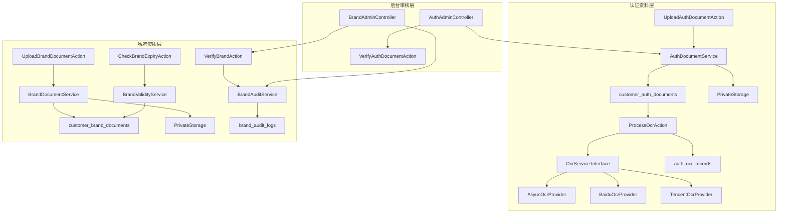
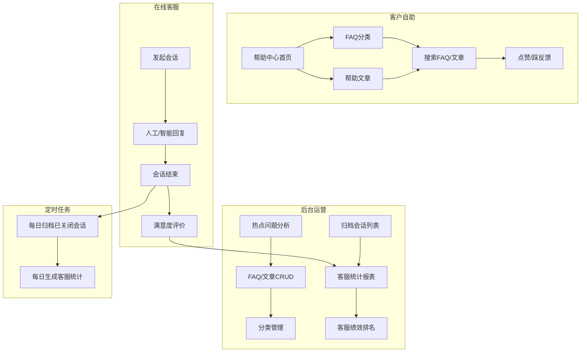
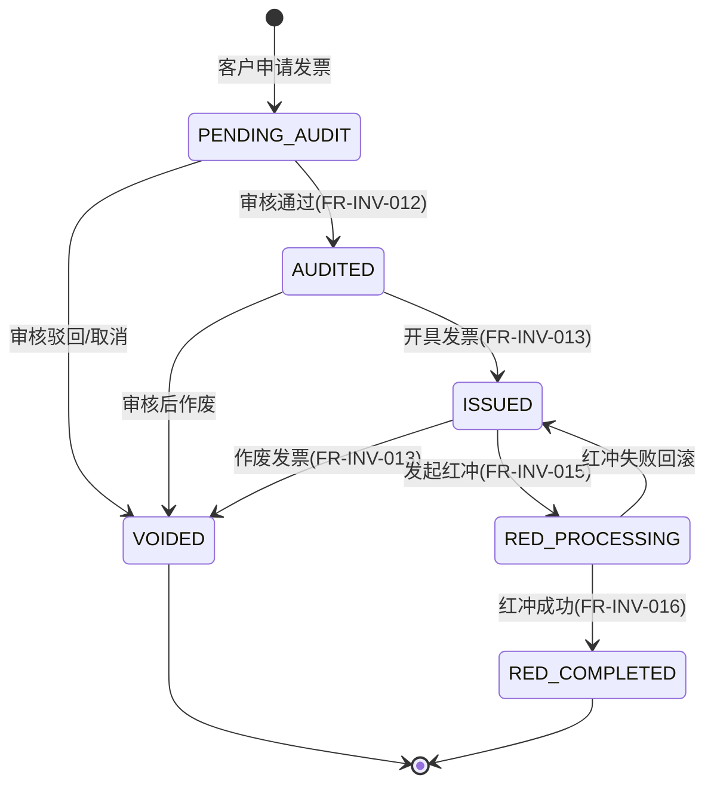

# 怡安印刷商城 — 核心业务设计（卷三-C）

> **所属文档**：系统设计方案 v2.9.0  
> **内容**：发票管理子系统、积分与成长值子系统  
> **读者**：后端开发工程师

---

## 6.53 企业认证与品牌资质管理子系统

> **设计依据**：PRD 模块十（企业认证与合规，FR-AUTH-001~013、FR-BRAND-005~017）  
> **所属领域**：`App\Domains\Auth`（认证域）、`App\Domains\Brand`（品牌域）  
> **前置章节**：6.16 企业认证系统、6.27 客户地址与品牌管理服务子系统设计  
> **核心数据表**：`customer_auth_documents`、`auth_ocr_records`、`customer_brand_documents`、`brand_audit_logs`

### 6.53.1 设计概述

本章节补充 6.16/6.27 中缺失的 **认证资料精细化管理** 与 **品牌资质全生命周期管理** 设计，覆盖证件上传、OCR 自动识别、人工审核、品牌有效期自动检测等完整链路。

核心设计原则：

1. **OCR 服务解耦**：通过 `OcrProvider` 接口抽象，支持阿里云/百度/腾讯云多供应商无缝切换。  
2. **证件私有存储**：所有证件文件存放于私有 Storage 磁盘（`s3-private`），前端访问统一通过带签名的临时 URL（默认有效期 15 分钟）。  
3. **审核可追溯**：认证资料审核与品牌审核均记录独立日志表，支持操作人、状态流转、备注全链路追踪。  
4. **有效期自动预警**：Schedule 任务每月扫描品牌资质到期日，提前 30 天/7 天向客户与后台运营推送通知。  
5. **与现有设计兼容**：本章节新增表/枚举/Action/Service 均基于 6.16 的 `AuthStatus` 状态机与 6.27 的 `CustomerBrand` 模型扩展，不破坏已有接口。



---

### 6.53.2 数据库 Migration 补充

#### 6.53.2.1 认证资料表 `customer_auth_documents`

> **覆盖 FR**：FR-AUTH-001~004（认证资料提交与查看）、FR-AUTH-007（客户业务标志位扩展）

```php
<?php

use Illuminate\Database\Migrations\Migration;
use Illuminate\Database\Schema\Blueprint;
use Illuminate\Support\Facades\Schema;

return new class extends Migration
{
    public function up(): void
    {
        Schema::create('customer_auth_documents', function (Blueprint $table) {
            $table->id()->comment('主键');
            $table->foreignId('customer_id')
                ->constrained('customers')
                ->comment('关联客户');
            $table->foreignId('auth_id')
                ->nullable()
                ->comment('关联认证记录（若存在独立认证主表）');
            $table->string('document_type', 32)
                ->comment('资料类型：business_license/id_card/tax_certificate/org_code');
            $table->string('file_url', 500)
                ->comment('文件存储路径（私有桶）');
            $table->string('file_name', 200)
                ->comment('原始文件名');
            $table->json('ocr_result_json')
                ->nullable()
                ->comment('OCR 识别结果快照');
            $table->tinyInteger('verify_status')
                ->default(0)
                ->comment('审核状态：0待审核 1已通过 2已驳回');
            $table->string('verify_remark', 500)
                ->nullable()
                ->comment('审核备注/驳回原因');
            $table->timestamp('uploaded_at')
                ->useCurrent()
                ->comment('上传时间');
            $table->timestamp('verified_at')
                ->nullable()
                ->comment('审核时间');
            $table->timestamps();

            $table->index(['customer_id', 'document_type']);
            $table->index(['verify_status', 'created_at']);
            $table->index(['customer_id', 'verify_status']);
        });
    }

    public function down(): void
    {
        Schema::dropIfExists('customer_auth_documents');
    }
};
```

#### 6.53.2.2 OCR 识别记录表 `auth_ocr_records`

> **覆盖 FR**：FR-AUTH-003（营业执照 OCR 识别增强）

```php
<?php

use Illuminate\Database\Migrations\Migration;
use Illuminate\Database\Schema\Blueprint;
use Illuminate\Support\Facades\Schema;

return new class extends Migration
{
    public function up(): void
    {
        Schema::create('auth_ocr_records', function (Blueprint $table) {
            $table->id()->comment('主键');
            $table->foreignId('document_id')
                ->constrained('customer_auth_documents')
                ->comment('关联认证资料');
            $table->string('ocr_provider', 32)
                ->comment('OCR 服务商：aliyun/baidu/tencent');
            $table->json('request_json')
                ->nullable()
                ->comment('请求参数（脱敏）');
            $table->json('response_json')
                ->nullable()
                ->comment('原始响应');
            $table->decimal('confidence_score', 4, 2)
                ->nullable()
                ->comment('置信度 0.00~1.00');
            $table->json('extracted_fields_json')
                ->nullable()
                ->comment('提取字段：统一结构化数据');
            $table->string('status', 16)
                ->default('pending')
                ->comment('识别状态：pending/success/failed/timeout');
            $table->timestamps();

            $table->index(['document_id', 'status']);
            $table->index(['ocr_provider', 'created_at']);
        });
    }

    public function down(): void
    {
        Schema::dropIfExists('auth_ocr_records');
    }
};
```

#### 6.53.2.3 品牌资质文件表 `customer_brand_documents`

> **覆盖 FR**：FR-BRAND-005~007（品牌类型与资质）、FR-BRAND-011（有效期）、FR-BRAND-013（缩略图）、FR-BRAND-014（委托人）

```php
<?php

use Illuminate\Database\Migrations\Migration;
use Illuminate\Database\Schema\Blueprint;
use Illuminate\Support\Facades\Schema;

return new class extends Migration
{
    public function up(): void
    {
        Schema::create('customer_brand_documents', function (Blueprint $table) {
            $table->id()->comment('主键');
            $table->foreignId('brand_id')
                ->constrained('customer_brands')
                ->comment('关联品牌');
            $table->string('document_type', 32)
                ->comment('资质类型：trademark_cert/auth_letter/quality_cert/patent_cert');
            $table->string('file_url', 500)
                ->comment('文件存储路径（私有桶）');
            $table->string('file_name', 200)
                ->comment('原始文件名');
            $table->date('valid_start_date')
                ->nullable()
                ->comment('有效期开始');
            $table->date('valid_end_date')
                ->nullable()
                ->comment('有效期截止（到期日）');
            $table->tinyInteger('verify_status')
                ->default(0)
                ->comment('审核状态：0待审核 1已通过 2已驳回');
            $table->string('entruster', 200)
                ->nullable()
                ->comment('委托人/商标持有人名称（FR-BRAND-014）');
            $table->string('thumb_url', 500)
                ->nullable()
                ->comment('缩略图路径（PDF/图片自动生成，FR-BRAND-013）');
            $table->timestamp('uploaded_at')
                ->useCurrent()
                ->comment('上传时间');
            $table->timestamps();

            $table->index(['brand_id', 'document_type']);
            $table->index(['verify_status', 'created_at']);
            $table->index(['valid_end_date', 'verify_status']);
        });
    }

    public function down(): void
    {
        Schema::dropIfExists('customer_brand_documents');
    }
};
```

#### 6.53.2.4 品牌审核日志表 `brand_audit_logs`

> **覆盖 FR**：FR-BRAND-008~010（审核人/原因/时间）

```php
<?php

use Illuminate\Database\Migrations\Migration;
use Illuminate\Database\Schema\Blueprint;
use Illuminate\Support\Facades\Schema;

return new class extends Migration
{
    public function up(): void
    {
        Schema::create('brand_audit_logs', function (Blueprint $table) {
            $table->id()->comment('主键');
            $table->foreignId('brand_id')
                ->constrained('customer_brands')
                ->comment('关联品牌');
            $table->foreignId('admin_id')
                ->nullable()
                ->constrained('admins')
                ->comment('审核管理员');
            $table->string('action', 32)
                ->comment('操作：submit/verify/reject/update_validity/expiry_warn');
            $table->tinyInteger('from_status')
                ->nullable()
                ->comment('变更前状态');
            $table->tinyInteger('to_status')
                ->nullable()
                ->comment('变更后状态');
            $table->string('remark', 500)
                ->nullable()
                ->comment('审核备注');
            $table->timestamp('created_at')
                ->useCurrent()
                ->comment('操作时间');

            $table->index(['brand_id', 'created_at']);
            $table->index(['admin_id', 'created_at']);
        });
    }

    public function down(): void
    {
        Schema::dropIfExists('brand_audit_logs');
    }
};
```

---

### 6.53.3 Enum 定义

#### 6.53.3.1 `AuthDocumentType` — 认证资料类型

> **覆盖 FR**：FR-AUTH-003（authPictureType 扩展）、FR-AUTH-004

```php
<?php

namespace App\Enums;

enum AuthDocumentType: string
{
    case BUSINESS_LICENSE = 'business_license';   // 营业执照
    case ID_CARD = 'id_card';                     // 身份证
    case TAX_CERTIFICATE = 'tax_certificate';     // 税务登记证
    case ORG_CODE = 'org_code';                   // 组织机构代码证

    public function label(): string
    {
        return match ($this) {
            self::BUSINESS_LICENSE => '营业执照',
            self::ID_CARD => '身份证',
            self::TAX_CERTIFICATE => '税务登记证',
            self::ORG_CODE => '组织机构代码证',
        };
    }

    /**
     * 是否支持 OCR 自动识别
     */
    public function supportsOcr(): bool
    {
        return match ($this) {
            self::BUSINESS_LICENSE, self::ID_CARD => true,
            default => false,
        };
    }
}
```

#### 6.53.3.2 `OcrProvider` — OCR 服务商

> **覆盖 FR**：FR-AUTH-003（OCR 增强）

```php
<?php

namespace App\Enums;

enum OcrProvider: string
{
    case ALIYUN = 'aliyun';    // 阿里云
    case BAIDU = 'baidu';      // 百度
    case TENCENT = 'tencent';  // 腾讯云

    public function label(): string
    {
        return match ($this) {
            self::ALIYUN => '阿里云',
            self::BAIDU => '百度',
            self::TENCENT => '腾讯云',
        };
    }
}
```

#### 6.53.3.3 `BrandDocumentType` — 品牌资质类型

> **覆盖 FR**：FR-BRAND-006（gM 枚举映射）

```php
<?php

namespace App\Enums;

enum BrandDocumentType: string
{
    case TRADEMARK_CERT = 'trademark_cert';   // 商标注册证
    case AUTH_LETTER = 'auth_letter';         // 授权书
    case QUALITY_CERT = 'quality_cert';       // 质检报告
    case PATENT_CERT = 'patent_cert';         // 专利证书

    public function label(): string
    {
        return match ($this) {
            self::TRADEMARK_CERT => '商标注册证',
            self::AUTH_LETTER => '授权书',
            self::QUALITY_CERT => '质检报告',
            self::PATENT_CERT => '专利证书',
        };
    }

    /**
     * 映射到原 customer_brands.type 的 int 值（向后兼容）
     */
    public function legacyValue(): int
    {
        return match ($this) {
            self::TRADEMARK_CERT => 0,
            self::AUTH_LETTER => 1,
            self::QUALITY_CERT => 2,
            self::PATENT_CERT => 3,
        };
    }
}
```

#### 6.53.3.4 `BrandType` — 品牌类型

> **覆盖 FR**：FR-BRAND-005（品牌类型位掩码语义化）

```php
<?php

namespace App\Enums;

enum BrandType: int
{
    case SELF = 1;      // 自有品牌
    case AGENT = 2;     // 代理品牌
    case OEM = 4;       // 代工品牌

    public function label(): string
    {
        return match ($this) {
            self::SELF => '自有品牌',
            self::AGENT => '代理品牌',
            self::OEM => '代工品牌',
        };
    }

    /**
     * 从位掩码解析品牌类型列表（支持多选组合）
     */
    public static function fromMask(int $mask): array
    {
        return array_filter(
            self::cases(),
            fn (self $type) => ($mask & $type->value) === $type->value
        );
    }
}
```

---

### 6.53.4 Action 类

#### 6.53.4.1 `UploadAuthDocumentAction` — 上传认证资料

> **覆盖 FR**：FR-AUTH-001~003（认证资料提交）

```php
<?php

declare(strict_types=1);

namespace App\Domains\Auth\Actions;

use App\Domains\Auth\Models\CustomerAuthDocument;
use App\Enums\AuthDocumentType;
use App\Enums\VerifyStatus;
use Illuminate\Http\UploadedFile;
use Illuminate\Support\Facades\Storage;

final class UploadAuthDocumentAction
{
    public function __construct(
        private ProcessOcrAction $processOcr,
    ) {}

    /**
     * 上传单份认证资料，可选触发 OCR
     */
    public function execute(
        int $customerId,
        AuthDocumentType $documentType,
        UploadedFile $file,
        ?int $authId = null,
    ): CustomerAuthDocument {
        // 1. 存储至私有磁盘
        $path = $this->storeFile($file, $customerId, $documentType);

        // 2. 创建资料记录
        $document = CustomerAuthDocument::create([
            'customer_id'   => $customerId,
            'auth_id'       => $authId,
            'document_type' => $documentType->value,
            'file_url'      => $path,
            'file_name'     => $file->getClientOriginalName(),
            'verify_status' => VerifyStatus::PENDING->value,
            'uploaded_at'   => now(),
        ]);

        // 3. 异步触发 OCR（若支持）
        if ($documentType->supportsOcr()) {
            dispatch(function () use ($document) {
                $this->processOcr->execute($document);
            })->onQueue('ocr');
        }

        return $document;
    }

    private function storeFile(UploadedFile $file, int $customerId, AuthDocumentType $type): string
    {
        $dir = "auth_documents/{$customerId}/" . now()->format('Ym');
        $name = $type->value . '_' . time() . '_' . uniqid() . '.' . $file->getClientOriginalExtension();

        return $file->storeAs($dir, $name, 's3_private');
    }
}
```

#### 6.53.4.2 `ProcessOcrAction` — OCR 识别处理

> **覆盖 FR**：FR-AUTH-003（营业执照 OCR 识别）

```php
<?php

declare(strict_types=1);

namespace App\Domains\Auth\Actions;

use App\Domains\Auth\Models\AuthOcrRecord;
use App\Domains\Auth\Models\CustomerAuthDocument;
use App\Domains\Auth\Services\OcrService;
use App\Enums\OcrProvider;

final class ProcessOcrAction
{
    public function __construct(
        private OcrService $ocrService,
    ) {}

    /**
     * 对指定资料执行 OCR 识别，结果写入 auth_ocr_records
     */
    public function execute(CustomerAuthDocument $document): AuthOcrRecord
    {
        $provider = OcrProvider::from(config('ocr.default', 'aliyun'));

        $record = AuthOcrRecord::create([
            'document_id' => $document->id,
            'ocr_provider' => $provider->value,
            'status' => 'pending',
        ]);

        try {
            $result = $this->ocrService->recognize($document->file_url, $document->document_type, $provider);

            $record->update([
                'status' => 'success',
                'confidence_score' => $result['confidence'] ?? null,
                'response_json' => $result['raw'],
                'extracted_fields_json' => $result['fields'],
            ]);

            // 将 OCR 结果快照回写至资料主表，便于快速查看
            $document->update([
                'ocr_result_json' => $result['fields'],
            ]);
        } catch (\Throwable $e) {
            $record->update([
                'status' => 'failed',
                'response_json' => ['error' => $e->getMessage()],
            ]);
        }

        return $record;
    }
}
```

#### 6.53.4.3 `VerifyAuthDocumentAction` — 审核认证资料

> **覆盖 FR**：FR-AUTH-004（认证状态流转）

```php
<?php

declare(strict_types=1);

namespace App\Domains\Auth\Actions;

use App\Domains\Auth\Models\CustomerAuthDocument;
use App\Enums\VerifyStatus;
use Illuminate\Support\Facades\DB;

final class VerifyAuthDocumentAction
{
    /**
     * 审核单份认证资料
     */
    public function execute(
        int $documentId,
        VerifyStatus $targetStatus,
        ?string $remark = null,
        ?int $adminId = null,
    ): CustomerAuthDocument {
        return DB::transaction(function () use ($documentId, $targetStatus, $remark, $adminId) {
            $document = CustomerAuthDocument::lockForUpdate()->findOrFail($documentId);

            if ($document->verify_status !== VerifyStatus::PENDING->value) {
                throw new \RuntimeException('该资料已审核，不可重复操作');
            }

            $document->update([
                'verify_status' => $targetStatus->value,
                'verify_remark' => $remark,
                'verified_at' => now(),
            ]);

            // 触发资料审核事件，由 Listener 决定是否推进客户整体认证状态
            event(new \App\Domains\Auth\Events\AuthDocumentVerified(
                $document,
                $targetStatus,
                $adminId,
                $remark
            ));

            return $document;
        });
    }
}
```

#### 6.53.4.4 `UploadBrandDocumentAction` — 上传品牌资质

> **覆盖 FR**：FR-BRAND-006~007（品牌资质类型与审核）、FR-BRAND-011（有效期）、FR-BRAND-014（委托人）

```php
<?php

declare(strict_types=1);

namespace App\Domains\Brand\Actions;

use App\Domains\Brand\Models\CustomerBrandDocument;
use App\Enums\BrandDocumentType;
use App\Enums\VerifyStatus;
use Illuminate\Http\UploadedFile;
use Illuminate\Support\Facades\Storage;

final class UploadBrandDocumentAction
{
    /**
     * 上传品牌资质文件
     */
    public function execute(
        int $brandId,
        BrandDocumentType $documentType,
        UploadedFile $file,
        ?string $entruster = null,
        ?\Carbon\Carbon $validStart = null,
        ?\Carbon\Carbon $validEnd = null,
    ): CustomerBrandDocument {
        $path = $this->storeFile($file, $brandId, $documentType);

        // 自动生成缩略图（PDF/图片）
        $thumbPath = $this->generateThumbnail($path);

        return CustomerBrandDocument::create([
            'brand_id'        => $brandId,
            'document_type'   => $documentType->value,
            'file_url'        => $path,
            'file_name'       => $file->getClientOriginalName(),
            'valid_start_date'=> $validStart,
            'valid_end_date'  => $validEnd,
            'verify_status'   => VerifyStatus::PENDING->value,
            'entruster'       => $entruster,
            'thumb_url'       => $thumbPath,
            'uploaded_at'     => now(),
        ]);
    }

    private function storeFile(UploadedFile $file, int $brandId, BrandDocumentType $type): string
    {
        $dir = "brand_documents/{$brandId}/" . now()->format('Ym');
        $name = $type->value . '_' . time() . '_' . uniqid() . '.' . $file->getClientOriginalExtension();

        return $file->storeAs($dir, $name, 's3_private');
    }

    private function generateThumbnail(string $path): ?string
    {
        // 通过 Laravel Image 或外部服务生成缩略图，返回缩略图路径
        // 生产环境建议推队列异步生成
        return null; // 占位：由 ThumbnailGenerated Listener 补充
    }
}
```

#### 6.53.4.5 `VerifyBrandAction` — 审核品牌

> **覆盖 FR**：FR-BRAND-007~010（品牌审核状态/审核人/原因/时间）

```php
<?php

declare(strict_types=1);

namespace App\Domains\Brand\Actions;

use App\Domains\Brand\Models\CustomerBrand;
use App\Domains\Brand\Services\BrandAuditService;
use App\Enums\BrandAuditStatus;

final class VerifyBrandAction
{
    public function __construct(
        private BrandAuditService $auditService,
    ) {}

    /**
     * 审核品牌资质
     */
    public function execute(
        int $brandId,
        BrandAuditStatus $targetStatus,
        ?string $remark = null,
        ?int $adminId = null,
    ): CustomerBrand {
        $brand = CustomerBrand::findOrFail($brandId);

        // 记录变更前状态
        $fromStatus = $brand->status;

        $brand->update([
            'status' => $targetStatus,
            'verify_person' => $adminId ? $this->formatVerifier($adminId) : null,
            'verify_reason' => $remark,
            'verify_time' => now(),
        ]);

        // 写入审核日志
        $this->auditService->log(
            brandId: $brandId,
            action: 'verify',
            fromStatus: $fromStatus?->value,
            toStatus: $targetStatus->value,
            adminId: $adminId,
            remark: $remark,
        );

        return $brand->fresh();
    }

    private function formatVerifier(int $adminId): string
    {
        $admin = \App\Models\Admin::find($adminId);
        return $admin ? "{$admin->name}{$admin->id}" : (string) $adminId;
    }
}
```

#### 6.53.4.6 `UpdateBrandValidityAction` — 更新品牌有效期

> **覆盖 FR**：FR-BRAND-011（有效期）、FR-BRAND-016（有效期类型）

```php
<?php

declare(strict_types=1);

namespace App\Domains\Brand\Actions;

use App\Domains\Brand\Models\CustomerBrandDocument;
use App\Domains\Brand\Services\BrandAuditService;
use Carbon\Carbon;

final class UpdateBrandValidityAction
{
    public function __construct(
        private BrandAuditService $auditService,
    ) {}

    /**
     * 更新品牌资质有效期，同时刷新品牌主表有效期类型
     */
    public function execute(
        int $documentId,
        Carbon $validEndDate,
        ?Carbon $validStartDate = null,
        ?int $adminId = null,
    ): CustomerBrandDocument {
        $document = CustomerBrandDocument::findOrFail($documentId);

        $document->update([
            'valid_start_date' => $validStartDate ?? $document->valid_start_date,
            'valid_end_date' => $validEndDate,
        ]);

        // 联动刷新品牌主表有效期
        $brand = $document->brand;
        $brand->update([
            'end_valid_date' => $validEndDate,
            'valid_type' => $this->resolveValidType($validEndDate),
        ]);

        $this->auditService->log(
            brandId: $brand->id,
            action: 'update_validity',
            toStatus: $brand->status->value,
            adminId: $adminId,
            remark: "有效期更新至 {$validEndDate->toDateString()}",
        );

        return $document->fresh();
    }

    private function resolveValidType(Carbon $endDate): int
    {
        return $endDate->isFuture() ? 1 : 2; // 1=有效期内 2=已过期
    }
}
```

#### 6.53.4.7 `CheckBrandExpiryAction` — 检查品牌即将过期

> **覆盖 FR**：FR-BRAND-011（有效期预警）、FR-BRAND-016（有效期类型自动刷新）

```php
<?php

declare(strict_types=1);

namespace App\Domains\Brand\Actions;

use App\Domains\Brand\Models\CustomerBrand;
use App\Domains\Brand\Models\CustomerBrandDocument;
use App\Domains\Brand\Services\BrandValidityService;
use Carbon\Carbon;

final class CheckBrandExpiryAction
{
    public function __construct(
        private BrandValidityService $validityService,
    ) {}

    /**
     * 扫描即将过期与已过期的品牌资质
     * 由 Schedule 每月调用
     */
    public function execute(): array
    {
        $now = now();
        $warn30 = $now->copy()->addDays(30);
        $warn7  = $now->copy()->addDays(7);

        $stats = [
            'expired' => 0,
            'warn_30' => 0,
            'warn_7'  => 0,
        ];

        // 1. 标记已过期
        $expiredDocs = CustomerBrandDocument::where('valid_end_date', '<', $now->toDateString())
            ->where('verify_status', 1)
            ->whereNotNull('valid_end_date')
            ->get();

        foreach ($expiredDocs as $doc) {
            $this->validityService->markExpired($doc);
            $stats['expired']++;
        }

        // 2. 提前 30 天预警
        $warn30Docs = CustomerBrandDocument::whereDate('valid_end_date', $warn30->toDateString())
            ->where('verify_status', 1)
            ->get();

        foreach ($warn30Docs as $doc) {
            $this->validityService->notifyExpiry($doc, 30);
            $stats['warn_30']++;
        }

        // 3. 提前 7 天预警
        $warn7Docs = CustomerBrandDocument::whereDate('valid_end_date', $warn7->toDateString())
            ->where('verify_status', 1)
            ->get();

        foreach ($warn7Docs as $doc) {
            $this->validityService->notifyExpiry($doc, 7);
            $stats['warn_7']++;
        }

        return $stats;
    }
}
```

---

### 6.53.5 Service 类

#### 6.53.5.1 `AuthDocumentService` — 认证资料管理

> **覆盖 FR**：FR-AUTH-001~004

```php
<?php

declare(strict_types=1);

namespace App\Domains\Auth\Services;

use App\Domains\Auth\Models\CustomerAuthDocument;
use App\Enums\AuthDocumentType;
use Illuminate\Pagination\LengthAwarePaginator;
use Illuminate\Support\Facades\Storage;

final class AuthDocumentService
{
    /**
     * 获取客户认证资料列表（带签名 URL）
     */
    public function listDocuments(
        int $customerId,
        ?AuthDocumentType $type = null,
        int $page = 1,
        int $perPage = 20,
    ): LengthAwarePaginator {
        $query = CustomerAuthDocument::where('customer_id', $customerId)
            ->orderByDesc('uploaded_at');

        if ($type) {
            $query->where('document_type', $type->value);
        }

        $paginator = $query->paginate($perPage, ['*'], 'page', $page);

        // 将 file_url 转换为临时签名 URL
        $paginator->getCollection()->transform(function ($doc) {
            $doc->signed_url = $this->signedUrl($doc->file_url);
            return $doc;
        });

        return $paginator;
    }

    /**
     * 获取单份资料详情
     */
    public function getDocument(int $documentId, int $customerId): CustomerAuthDocument
    {
        $doc = CustomerAuthDocument::where('customer_id', $customerId)
            ->findOrFail($documentId);

        $doc->signed_url = $this->signedUrl($doc->file_url);
        return $doc;
    }

    /**
     * 删除认证资料
     */
    public function deleteDocument(int $documentId, int $customerId): void
    {
        $doc = CustomerAuthDocument::where('customer_id', $customerId)
            ->findOrFail($documentId);

        // 已审核通过的资料不允许客户自行删除（需联系运营）
        if ($doc->verify_status === 1) {
            throw new \RuntimeException('已审核通过的资料不可删除，请联系客服');
        }

        Storage::disk('s3_private')->delete($doc->file_url);
        $doc->delete();
    }

    /**
     * 生成私有文件临时签名 URL（默认 15 分钟）
     */
    public function signedUrl(string $path, int $expires = 900): string
    {
        return Storage::disk('s3_private')->temporaryUrl($path, now()->addSeconds($expires));
    }
}
```

#### 6.53.5.2 `OcrService` — OCR 识别服务（抽象接口 + 多供应商实现）

> **覆盖 FR**：FR-AUTH-003

```php
<?php

declare(strict_types=1);

namespace App\Domains\Auth\Services;

use App\Domains\Auth\Contracts\OcrProviderInterface;
use App\Enums\OcrProvider;

/**
 * OCR 服务门面：按配置路由到具体供应商实现
 */
final class OcrService
{
    /** @var array<string, OcrProviderInterface> */
    private array $providers = [];

    public function register(OcrProvider $provider, OcrProviderInterface $instance): void
    {
        $this->providers[$provider->value] = $instance;
    }

    /**
     * 识别证件内容
     *
     * @return array{confidence: ?float, raw: array, fields: array}
     */
    public function recognize(string $filePath, string $documentType, OcrProvider $provider): array
    {
        $instance = $this->providers[$provider->value]
            ?? throw new \RuntimeException("OCR 供应商 {$provider->value} 未注册");

        return $instance->recognize($filePath, $documentType);
    }
}
```

**`OcrProviderInterface` 接口定义**：

```php
<?php

declare(strict_types=1);

namespace App\Domains\Auth\Contracts;

interface OcrProviderInterface
{
    /**
     * 对指定文件执行 OCR 识别
     *
     * @param string $filePath   Storage 磁盘上的文件路径
     * @param string $docType    AuthDocumentType->value
     * @return array{confidence: ?float, raw: array, fields: array}
     */
    public function recognize(string $filePath, string $docType): array;

    /**
     * 供应商标识
     */
    public function getProviderCode(): string;
}
```

**阿里云实现示例**：

```php
<?php

declare(strict_types=1);

namespace App\Domains\Auth\Services\OcrProviders;

use App\Domains\Auth\Contracts\OcrProviderInterface;
use Illuminate\Support\Facades\Http;
use Illuminate\Support\Facades\Storage;

final class AliyunOcrProvider implements OcrProviderInterface
{
    public function __construct(
        private string $appKey,
        private string appSecret,
        private string $endpoint = 'https://ocrdiy.aliyuncs.com',
    ) {}

    public function recognize(string $filePath, string $docType): array
    {
        $imageBase64 = base64_encode(Storage::disk('s3_private')->get($filePath));

        $response = Http::withHeaders([
            'Authorization' => 'APPCODE ' . $this->appKey,
        ])->post($this->endpoint . '/json/ocr_business_license', [
            'image' => $imageBase64,
        ]);

        $data = $response->json();

        return [
            'confidence' => $data['confidence'] ?? null,
            'raw' => $data,
            'fields' => $this->normalizeFields($data, $docType),
        ];
    }

    private function normalizeFields(array $raw, string $docType): array
    {
        return match ($docType) {
            'business_license' => [
                'company_name' => $raw['name'] ?? null,
                'credit_code' => $raw['reg_num'] ?? null,
                'legal_person' => $raw['person'] ?? null,
                'register_address' => $raw['address'] ?? null,
                'valid_period' => $raw['valid_period'] ?? null,
            ],
            'id_card' => [
                'name' => $raw['name'] ?? null,
                'id_number' => $raw['num'] ?? null,
            ],
            default => $raw,
        };
    }

    public function getProviderCode(): string
    {
        return 'aliyun';
    }
}
```

**Service Provider 注册**：

```php
<?php

// app/Providers/OcrServiceProvider.php

namespace App\Providers;

use App\Domains\Auth\Contracts\OcrProviderInterface;
use App\Domains\Auth\Services\OcrProviders\AliyunOcrProvider;
use App\Domains\Auth\Services\OcrProviders\BaiduOcrProvider;
use App\Domains\Auth\Services\OcrProviders\TencentOcrProvider;
use App\Domains\Auth\Services\OcrService;
use App\Enums\OcrProvider;
use Illuminate\Support\ServiceProvider;

class OcrServiceProvider extends ServiceProvider
{
    public function register(): void
    {
        $this->app->singleton(OcrService::class, function () {
            $service = new OcrService();

            $service->register(OcrProvider::ALIYUN, new AliyunOcrProvider(
                config('ocr.aliyun.app_key'),
                config('ocr.aliyun.app_secret'),
            ));

            $service->register(OcrProvider::BAIDU, new BaiduOcrProvider(
                config('ocr.baidu.app_id'),
                config('ocr.baidu.api_key'),
                config('ocr.baidu.secret_key'),
            ));

            $service->register(OcrProvider::TENCENT, new TencentOcrProvider(
                config('ocr.tencent.secret_id'),
                config('ocr.tencent.secret_key'),
            ));

            return $service;
        });
    }
}
```

#### 6.53.5.3 `BrandDocumentService` — 品牌资质管理

> **覆盖 FR**：FR-BRAND-006~007、FR-BRAND-011、FR-BRAND-013~014

```php
<?php

declare(strict_types=1);

namespace App\Domains\Brand\Services;

use App\Domains\Brand\Models\CustomerBrandDocument;
use App\Enums\BrandDocumentType;
use Illuminate\Pagination\LengthAwarePaginator;
use Illuminate\Support\Facades\Storage;

final class BrandDocumentService
{
    /**
     * 获取品牌资质文件列表（含签名 URL）
     */
    public function listDocuments(
        int $brandId,
        ?BrandDocumentType $type = null,
        int $page = 1,
        int $perPage = 20,
    ): LengthAwarePaginator {
        $query = CustomerBrandDocument::where('brand_id', $brandId)
            ->orderByDesc('uploaded_at');

        if ($type) {
            $query->where('document_type', $type->value);
        }

        $paginator = $query->paginate($perPage, ['*'], 'page', $page);

        $paginator->getCollection()->transform(function ($doc) {
            $doc->signed_url = $this->signedUrl($doc->file_url);
            $doc->thumb_signed_url = $doc->thumb_url ? $this->signedUrl($doc->thumb_url) : null;
            return $doc;
        });

        return $paginator;
    }

    /**
     * 删除品牌资质文件
     */
    public function deleteDocument(int $documentId, int $customerId): void
    {
        $doc = CustomerBrandDocument::whereHas('brand', function ($q) use ($customerId) {
            $q->where('customer_id', $customerId);
        })->findOrFail($documentId);

        Storage::disk('s3_private')->delete($doc->file_url);
        if ($doc->thumb_url) {
            Storage::disk('s3_private')->delete($doc->thumb_url);
        }

        $doc->delete();
    }

    public function signedUrl(string $path, int $expires = 900): string
    {
        return Storage::disk('s3_private')->temporaryUrl($path, now()->addSeconds($expires));
    }
}
```

#### 6.53.5.4 `BrandAuditService` — 品牌审核服务

> **覆盖 FR**：FR-BRAND-008~010

```php
<?php

declare(strict_types=1);

namespace App\Domains\Brand\Services;

use App\Domains\Brand\Models\BrandAuditLog;

final class BrandAuditService
{
    /**
     * 写入品牌审核日志
     */
    public function log(
        int $brandId,
        string $action,
        ?int $fromStatus = null,
        ?int $toStatus = null,
        ?int $adminId = null,
        ?string $remark = null,
    ): BrandAuditLog {
        return BrandAuditLog::create([
            'brand_id'    => $brandId,
            'admin_id'    => $adminId,
            'action'      => $action,
            'from_status' => $fromStatus,
            'to_status'   => $toStatus,
            'remark'      => $remark,
        ]);
    }

    /**
     * 获取品牌审核历史
     */
    public function getAuditLogs(int $brandId, int $page = 1, int $perPage = 20): \Illuminate\Pagination\LengthAwarePaginator
    {
        return BrandAuditLog::where('brand_id', $brandId)
            ->orderByDesc('created_at')
            ->paginate($perPage, ['*'], 'page', $page);
    }
}
```

#### 6.53.5.5 `BrandValidityService` — 品牌有效期管理

> **覆盖 FR**：FR-BRAND-011、FR-BRAND-016

```php
<?php

declare(strict_types=1);

namespace App\Domains\Brand\Services;

use App\Domains\Brand\Models\CustomerBrand;
use App\Domains\Brand\Models\CustomerBrandDocument;

final class BrandValidityService
{
    public function __construct(
        private BrandAuditService $auditService,
    ) {}

    /**
     * 标记资质已过期，同步更新品牌有效期类型
     */
    public function markExpired(CustomerBrandDocument $document): void
    {
        $brand = $document->brand;

        $brand->update([
            'valid_type' => 2, // 已过期
        ]);

        $this->auditService->log(
            brandId: $brand->id,
            action: 'expiry_warn',
            toStatus: $brand->status->value,
            remark: '品牌资质已过期（文件ID：' . $document->id . '）',
        );

        // 推送过期通知（站内信 + 短信）
        $brand->customer->notify(new \App\Notifications\BrandExpiredNotification($brand, $document));
    }

    /**
     * 发送即将过期预警通知
     */
    public function notifyExpiry(CustomerBrandDocument $document, int $daysRemaining): void
    {
        $brand = $document->brand;

        $this->auditService->log(
            brandId: $brand->id,
            action: 'expiry_warn',
            toStatus: $brand->status->value,
            remark: "品牌资质即将过期，剩余 {$daysRemaining} 天（文件ID：{$document->id}）",
        );

        $brand->customer->notify(
            new \App\Notifications\BrandExpiringSoonNotification($brand, $document, $daysRemaining)
        );
    }

    /**
     * 刷新品牌有效期类型（基于最新资质文件到期日）
     */
    public function refreshValidityType(int $brandId): void
    {
        $brand = CustomerBrand::findOrFail($brandId);

        $latestEndDate = CustomerBrandDocument::where('brand_id', $brandId)
            ->where('verify_status', 1)
            ->max('valid_end_date');

        if (!$latestEndDate) {
            return;
        }

        $brand->update([
            'end_valid_date' => $latestEndDate,
            'valid_type' => \Carbon\Carbon::parse($latestEndDate)->isFuture() ? 1 : 2,
        ]);
    }
}
```

---

### 6.53.6 Controller + API 路由

#### 6.53.6.1 `AuthDocumentController` — 前台认证资料

> **覆盖 FR**：FR-AUTH-001~003

```php
<?php

declare(strict_types=1);

namespace App\Http\Controllers\Api;

use App\Domains\Auth\Actions\UploadAuthDocumentAction;
use App\Domains\Auth\Services\AuthDocumentService;
use App\Enums\AuthDocumentType;
use App\Http\Controllers\Controller;
use App\Http\Resources\AuthDocumentResource;
use Illuminate\Http\JsonResponse;
use Illuminate\Http\Request;
use Illuminate\Http\Resources\Json\AnonymousResourceCollection;

final class AuthDocumentController extends Controller
{
    public function __construct(
        private AuthDocumentService $documentService,
        private UploadAuthDocumentAction $uploadAction,
    ) {}

    /**
     * 上传认证资料
     * POST /api/Auth/UploadDocument
     */
    public function upload(Request $request): AuthDocumentResource
    {
        $request->validate([
            'document_type' => ['required', 'string', 'in:' . implode(',', array_column(AuthDocumentType::cases(), 'value'))],
            'file' => ['required', 'file', 'mimes:jpg,jpeg,png,pdf', 'max:5120'],
        ]);

        $customer = auth('customer')->user();
        $document = $this->uploadAction->execute(
            customerId: $customer->id,
            documentType: AuthDocumentType::from($request->input('document_type')),
            file: $request->file('file'),
        );

        return new AuthDocumentResource($document);
    }

    /**
     * 获取认证资料列表
     * GET /api/Auth/GetDocuments
     */
    public function list(Request $request): AnonymousResourceCollection
    {
        $customer = auth('customer')->user();
        $type = $request->input('document_type');
        $page = $request->input('page', 1);
        $perPage = $request->input('per_page', 20);

        $paginator = $this->documentService->listDocuments(
            $customer->id,
            $type ? AuthDocumentType::from($type) : null,
            $page,
            $perPage,
        );

        return AuthDocumentResource::collection($paginator);
    }

    /**
     * 删除认证资料
     * DELETE /api/Auth/DeleteDocument/{id}
     */
    public function delete(int $id): JsonResponse
    {
        $customer = auth('customer')->user();
        $this->documentService->deleteDocument($id, $customer->id);

        return response()->json(['message' => '资料已删除']);
    }
}
```

**Resource 定义**：

```php
<?php

namespace App\Http\Resources;

use Illuminate\Http\Request;
use Illuminate\Http\Resources\Json\JsonResource;

class AuthDocumentResource extends JsonResource
{
    public function toArray(Request $request): array
    {
        return [
            'id' => $this->id,
            'document_type' => $this->document_type,
            'document_type_name' => \App\Enums\AuthDocumentType::from($this->document_type)?->label(),
            'file_name' => $this->file_name,
            'signed_url' => $this->signed_url ?? null,
            'ocr_result' => $this->ocr_result_json,
            'verify_status' => $this->verify_status,
            'verify_remark' => $this->verify_remark,
            'uploaded_at' => $this->uploaded_at?->toIso8601String(),
            'verified_at' => $this->verified_at?->toIso8601String(),
        ];
    }
}
```

#### 6.53.6.2 `BrandController` 补充 — 前台品牌资质

> **覆盖 FR**：FR-BRAND-006~007、FR-BRAND-011、FR-BRAND-014

```php
<?php

declare(strict_types=1);

namespace App\Http\Controllers\Api;

use App\Domains\Brand\Actions\UploadBrandDocumentAction;
use App\Domains\Brand\Services\BrandDocumentService;
use App\Enums\BrandDocumentType;
use App\Http\Controllers\Controller;
use App\Http\Resources\BrandDocumentResource;
use Illuminate\Http\JsonResponse;
use Illuminate\Http\Request;
use Illuminate\Http\Resources\Json\AnonymousResourceCollection;

final class BrandDocumentController extends Controller
{
    public function __construct(
        private BrandDocumentService $documentService,
        private UploadBrandDocumentAction $uploadAction,
    ) {}

    /**
     * 上传品牌资质
     * POST /api/Brand/UploadDocument
     */
    public function upload(Request $request): BrandDocumentResource
    {
        $request->validate([
            'brand_id' => ['required', 'integer', 'exists:customer_brands,id'],
            'document_type' => ['required', 'string', 'in:' . implode(',', array_column(BrandDocumentType::cases(), 'value'))],
            'file' => ['required', 'file', 'mimes:jpg,jpeg,png,pdf', 'max:10240'],
            'valid_start_date' => ['nullable', 'date'],
            'valid_end_date' => ['nullable', 'date', 'after_or_equal:valid_start_date'],
            'entruster' => ['nullable', 'string', 'max:200'],
        ]);

        $customer = auth('customer')->user();

        // 校验品牌归属
        $brand = \App\Models\User\CustomerBrand::where('customer_id', $customer->id)
            ->findOrFail($request->input('brand_id'));

        $document = $this->uploadAction->execute(
            brandId: $brand->id,
            documentType: BrandDocumentType::from($request->input('document_type')),
            file: $request->file('file'),
            entruster: $request->input('entruster'),
            validStart: $request->input('valid_start_date') ? \Carbon\Carbon::parse($request->input('valid_start_date')) : null,
            validEnd: $request->input('valid_end_date') ? \Carbon\Carbon::parse($request->input('valid_end_date')) : null,
        );

        return new BrandDocumentResource($document);
    }

    /**
     * 获取品牌资质列表
     * GET /api/Brand/GetDocuments/{brandId}
     */
    public function list(int $brandId, Request $request): AnonymousResourceCollection
    {
        $customer = auth('customer')->user();

        \App\Models\User\CustomerBrand::where('customer_id', $customer->id)
            ->findOrFail($brandId);

        $page = $request->input('page', 1);
        $perPage = $request->input('per_page', 20);

        $paginator = $this->documentService->listDocuments($brandId, null, $page, $perPage);

        return BrandDocumentResource::collection($paginator);
    }
}
```

**Resource 定义**：

```php
<?php

namespace App\Http\Resources;

use Illuminate\Http\Request;
use Illuminate\Http\Resources\Json\JsonResource;

class BrandDocumentResource extends JsonResource
{
    public function toArray(Request $request): array
    {
        return [
            'id' => $this->id,
            'document_type' => $this->document_type,
            'document_type_name' => \App\Enums\BrandDocumentType::from($this->document_type)?->label(),
            'file_name' => $this->file_name,
            'signed_url' => $this->signed_url ?? null,
            'thumb_url' => $this->thumb_signed_url ?? null,
            'valid_start_date' => $this->valid_start_date?->toDateString(),
            'valid_end_date' => $this->valid_end_date?->toDateString(),
            'entruster' => $this->entruster,
            'verify_status' => $this->verify_status,
            'uploaded_at' => $this->uploaded_at?->toIso8601String(),
        ];
    }
}
```

#### 6.53.6.3 `AuthAdminController` — 后台认证审核

> **覆盖 FR**：FR-AUTH-004（认证审核）

```php
<?php

declare(strict_types=1);

namespace App\Http\Controllers\Admin\Api;

use App\Domains\Auth\Actions\VerifyAuthDocumentAction;
use App\Domains\Auth\Models\AuthOcrRecord;
use App\Domains\Auth\Models\CustomerAuthDocument;
use App\Domains\Auth\Services\AuthDocumentService;
use App\Enums\VerifyStatus;
use App\Http\Controllers\Controller;
use Illuminate\Http\JsonResponse;
use Illuminate\Http\Request;
use Illuminate\Http\Resources\Json\AnonymousResourceCollection;

final class AuthAdminController extends Controller
{
    public function __construct(
        private AuthDocumentService $documentService,
        private VerifyAuthDocumentAction $verifyAction,
    ) {}

    /**
     * 待审核认证资料列表
     * GET /api/Admin/Auth/GetPendingList
     */
    public function pendingList(Request $request): AnonymousResourceCollection
    {
        $page = $request->input('page', 1);
        $perPage = $request->input('per_page', 20);

        $paginator = CustomerAuthDocument::with('customer')
            ->where('verify_status', VerifyStatus::PENDING->value)
            ->orderBy('uploaded_at')
            ->paginate($perPage, ['*'], 'page', $page);

        // 附加签名 URL 供后台预览
        $paginator->getCollection()->transform(function ($doc) {
            $doc->signed_url = $this->documentService->signedUrl($doc->file_url, 3600);
            return $doc;
        });

        return \App\Http\Resources\AdminAuthDocumentResource::collection($paginator);
    }

    /**
     * 审核认证资料
     * POST /api/Admin/Auth/VerifyDocument
     */
    public function verify(Request $request): JsonResponse
    {
        $request->validate([
            'document_id' => ['required', 'integer', 'exists:customer_auth_documents,id'],
            'status' => ['required', 'integer', 'in:1,2'], // 1通过 2驳回
            'remark' => ['nullable', 'string', 'max:500'],
        ]);

        $this->verifyAction->execute(
            documentId: $request->input('document_id'),
            targetStatus: VerifyStatus::from($request->input('status')),
            remark: $request->input('remark'),
            adminId: auth('admin')->id(),
        );

        return response()->json(['message' => '审核操作成功']);
    }

    /**
     * 查看 OCR 识别结果
     * GET /api/Admin/Auth/GetOcrResult/{id}
     */
    public function ocrResult(int $id): JsonResponse
    {
        $record = AuthOcrRecord::where('document_id', $id)
            ->latest()
            ->firstOrFail();

        return response()->json([
            'data' => [
                'provider' => $record->ocr_provider,
                'status' => $record->status,
                'confidence' => $record->confidence_score,
                'extracted_fields' => $record->extracted_fields_json,
                'created_at' => $record->created_at?->toIso8601String(),
            ],
        ]);
    }

    /**
     * 已审核认证历史列表
     * GET /api/Admin/Auth/HistoryList
     */
    public function historyList(Request $request): JsonResponse
    {
        $query = CustomerAuthDocument::with('customer')
            ->where('verify_status', '!=', VerifyStatus::PENDING->value);

        if ($request->filled('status')) {
            $query->where('verify_status', $request->input('status'));
        }
        if ($request->filled('admin_id')) {
            $query->where('verified_by', $request->input('admin_id'));
        }
        if ($request->filled('keyword')) {
            $query->whereHas('customer', fn ($q) =>
                $q->where('company_name', 'like', "%{$request->input('keyword')}%")
            );
        }
        if ($request->filled('date_from')) {
            $query->whereDate('verified_at', '>=', $request->input('date_from'));
        }
        if ($request->filled('date_to')) {
            $query->whereDate('verified_at', '<=', $request->input('date_to'));
        }

        $paginator = $query->orderByDesc('verified_at')
            ->paginate($request->input('per_page', 20));

        return $this->success($paginator);
    }

    /**
     * 认证审核统计
     * GET /api/Admin/Auth/Statistics
     */
    public function statistics(Request $request): JsonResponse
    {
        $period = $request->input('period', 'day'); // day/week/month

        $pendingCount = CustomerAuthDocument::where('verify_status', VerifyStatus::PENDING->value)->count();
        $todayCount = CustomerAuthDocument::whereDate('verified_at', today())->count();

        $avgDuration = CustomerAuthDocument::where('verify_status', '!=', VerifyStatus::PENDING->value)
            ->whereNotNull('verified_at')
            ->whereNotNull('uploaded_at')
            ->selectRaw('AVG(TIMESTAMPDIFF(MINUTE, uploaded_at, verified_at)) as avg_minutes')
            ->value('avg_minutes');

        $trend = match ($period) {
            'day' => CustomerAuthDocument::selectRaw('DATE(verified_at) as date, verify_status, COUNT(*) as count')
                ->whereNotNull('verified_at')
                ->whereDate('verified_at', '>=', now()->subDays(30))
                ->groupBy('date', 'verify_status')
                ->get(),
            'week' => CustomerAuthDocument::selectRaw('YEARWEEK(verified_at) as week, verify_status, COUNT(*) as count')
                ->whereNotNull('verified_at')
                ->whereDate('verified_at', '>=', now()->subWeeks(12))
                ->groupBy('week', 'verify_status')
                ->get(),
            'month' => CustomerAuthDocument::selectRaw('DATE_FORMAT(verified_at, "%Y-%m") as month, verify_status, COUNT(*) as count')
                ->whereNotNull('verified_at')
                ->whereDate('verified_at', '>=', now()->subMonths(12))
                ->groupBy('month', 'verify_status')
                ->get(),
        };

        return $this->success([
            'pending_count' => $pendingCount,
            'today_count' => $todayCount,
            'avg_duration_minutes' => (int) $avgDuration,
            'trend' => $trend,
        ]);
    }
}
```

#### 6.53.6.4 `BrandAdminController` — 后台品牌审核

> **覆盖 FR**：FR-BRAND-007~010

```php
<?php

declare(strict_types=1);

namespace App\Http\Controllers\Admin\Api;

use App\Domains\Brand\Actions\VerifyBrandAction;
use App\Domains\Brand\Services\BrandAuditService;
use App\Enums\BrandAuditStatus;
use App\Http\Controllers\Controller;
use App\Models\User\CustomerBrand;
use Illuminate\Http\JsonResponse;
use Illuminate\Http\Request;
use Illuminate\Http\Resources\Json\AnonymousResourceCollection;

final class BrandAdminController extends Controller
{
    public function __construct(
        private BrandAuditService $auditService,
        private VerifyBrandAction $verifyAction,
    ) {}

    /**
     * 待审核品牌列表
     * GET /api/Admin/Brand/GetPendingList
     */
    public function pendingList(Request $request): AnonymousResourceCollection
    {
        $page = $request->input('page', 1);
        $perPage = $request->input('per_page', 20);

        $paginator = CustomerBrand::with('customer')
            ->where('status', BrandAuditStatus::PENDING)
            ->orderBy('created_at')
            ->paginate($perPage, ['*'], 'page', $page);

        return \App\Http\Resources\AdminBrandResource::collection($paginator);
    }

    /**
     * 审核品牌
     * POST /api/Admin/Brand/Verify
     */
    public function verify(Request $request): JsonResponse
    {
        $request->validate([
            'brand_id' => ['required', 'integer', 'exists:customer_brands,id'],
            'status' => ['required', 'integer', 'in:1,2'], // 1通过 2驳回
            'remark' => ['nullable', 'string', 'max:500'],
        ]);

        $this->verifyAction->execute(
            brandId: $request->input('brand_id'),
            targetStatus: BrandAuditStatus::from($request->input('status')),
            remark: $request->input('remark'),
            adminId: auth('admin')->id(),
        );

        return response()->json(['message' => '品牌审核操作成功']);
    }

    /**
     * 获取品牌审核日志
     * GET /api/Admin/Brand/GetAuditLogs/{brandId}
     */
    public function auditLogs(int $brandId, Request $request): AnonymousResourceCollection
    {
        $page = $request->input('page', 1);
        $perPage = $request->input('per_page', 20);

        $paginator = $this->auditService->getAuditLogs($brandId, $page, $perPage);

        return \App\Http\Resources\BrandAuditLogResource::collection($paginator);
    }
}
```

#### 6.53.6.5 路由汇总

```php
<?php

// routes/api.php —— 前台 API 路由补充

use App\Http\Controllers\Api\AuthDocumentController;
use App\Http\Controllers\Api\BrandDocumentController;
use Illuminate\Support\Facades\Route;

Route::middleware(['api', 'throttle:api'])->group(function () {

    // ── 认证资料（前台）──
    Route::prefix('Auth')->middleware('auth:sanctum')->group(function () {
        Route::post('UploadDocument', [AuthDocumentController::class, 'upload']);
        Route::get('GetDocuments', [AuthDocumentController::class, 'list']);
        Route::delete('DeleteDocument/{id}', [AuthDocumentController::class, 'delete']);
    });

    // ── 品牌资质（前台）──
    Route::prefix('Brand')->middleware('auth:sanctum')->group(function () {
        Route::post('UploadDocument', [BrandDocumentController::class, 'upload']);
        Route::get('GetDocuments/{brandId}', [BrandDocumentController::class, 'list']);
    });
});

// routes/admin_api.php —— 后台 API 路由补充

use App\Http\Controllers\Admin\Api\AuthAdminController;
use App\Http\Controllers\Admin\Api\BrandAdminController;
use Illuminate\Support\Facades\Route;

Route::prefix('Admin')->middleware(['auth:admin', 'admin.permission'])->group(function () {

    // ── 认证审核（后台）──
    Route::prefix('Auth')->group(function () {
        Route::get('GetPendingList', [AuthAdminController::class, 'pendingList']);
        Route::post('VerifyDocument', [AuthAdminController::class, 'verify']);
        Route::get('GetOcrResult/{id}', [AuthAdminController::class, 'ocrResult']);
    });

    // ── 品牌审核（后台）──
    Route::prefix('Brand')->group(function () {
        Route::get('GetPendingList', [BrandAdminController::class, 'pendingList']);
        Route::post('Verify', [BrandAdminController::class, 'verify']);
        Route::get('GetAuditLogs/{brandId}', [BrandAdminController::class, 'auditLogs']);
    });
});
```

---

### 6.53.7 Schedule 任务

#### 6.53.7.1 `brand:check-expiry` — 品牌有效期自动检测

> **覆盖 FR**：FR-BRAND-011（有效期预警）、FR-BRAND-016（有效期类型自动刷新）

```php
<?php

namespace App\Console\Commands;

use App\Domains\Brand\Actions\CheckBrandExpiryAction;
use Illuminate\Console\Command;

class CheckBrandExpiry extends Command
{
    protected $signature = 'brand:check-expiry';

    protected $description = '检查品牌资质即将过期（30天/7天预警）与已过期标记';

    public function handle(CheckBrandExpiryAction $action): int
    {
        $this->info('开始扫描品牌资质有效期...');

        $stats = $action->execute();

        $this->info("扫描完成：已过期 {$stats['expired']} 个，30天预警 {$stats['warn_30']} 个，7天预警 {$stats['warn_7']} 个。");

        return self::SUCCESS;
    }
}
```

**Kernel 注册**：

```php
<?php

// app/Console/Kernel.php

protected function schedule(Schedule $schedule): void
{
    // 每月 1 日 02:00 执行品牌有效期检查
    $schedule->command('brand:check-expiry')
        ->monthlyOn(1, '02:00')
        ->withoutOverlapping(60)
        ->onOneServer()
        ->appendOutputTo(storage_path('logs/schedule-brand-expiry.log'));
}
```

---

### 6.53.8 类图

```mermaid
classDiagram
    class CustomerAuthDocument {
        +id
        +customer_id
        +document_type: AuthDocumentType
        +file_url
        +ocr_result_json
        +verify_status
        +uploaded_at
        +verified_at
    }
    class AuthOcrRecord {
        +id
        +document_id
        +ocr_provider: OcrProvider
        +confidence_score
        +extracted_fields_json
        +status
    }
    class CustomerBrandDocument {
        +id
        +brand_id
        +document_type: BrandDocumentType
        +file_url
        +valid_end_date
        +verify_status
        +entruster
        +thumb_url
    }
    class BrandAuditLog {
        +id
        +brand_id
        +admin_id
        +action
        +from_status
        +to_status
        +remark
        +created_at
    }
    class OcrProviderInterface {
        <<interface>>
        +recognize(string, string): array
        +getProviderCode(): string
    }
    class AliyunOcrProvider {
        +recognize(string, string): array
    }
    class BaiduOcrProvider {
        +recognize(string, string): array
    }
    class TencentOcrProvider {
        +recognize(string, string): array
    }
    class OcrService {
        +register(OcrProvider, OcrProviderInterface)
        +recognize(string, string, OcrProvider): array
    }
    class AuthDocumentService {
        +listDocuments(int, AuthDocumentType, int, int): LengthAwarePaginator
        +signedUrl(string, int): string
    }
    class BrandDocumentService {
        +listDocuments(int, BrandDocumentType, int, int): LengthAwarePaginator
    }
    class BrandAuditService {
        +log(int, string, int, int, int, string): BrandAuditLog
        +getAuditLogs(int, int, int): LengthAwarePaginator
    }
    class BrandValidityService {
        +markExpired(CustomerBrandDocument)
        +notifyExpiry(CustomerBrandDocument, int)
        +refreshValidityType(int)
    }
    class UploadAuthDocumentAction {
        +execute(int, AuthDocumentType, UploadedFile, int): CustomerAuthDocument
    }
    class ProcessOcrAction {
        +execute(CustomerAuthDocument): AuthOcrRecord
    }
    class VerifyAuthDocumentAction {
        +execute(int, VerifyStatus, string, int): CustomerAuthDocument
    }
    class UploadBrandDocumentAction {
        +execute(int, BrandDocumentType, UploadedFile, string, Carbon, Carbon): CustomerBrandDocument
    }
    class VerifyBrandAction {
        +execute(int, BrandAuditStatus, string, int): CustomerBrand
    }
    class CheckBrandExpiryAction {
        +execute(): array
    }

    CustomerAuthDocument --> AuthOcrRecord : has many
    OcrProviderInterface <|.. AliyunOcrProvider
    OcrProviderInterface <|.. BaiduOcrProvider
    OcrProviderInterface <|.. TencentOcrProvider
    OcrService --> OcrProviderInterface : uses
    ProcessOcrAction --> OcrService
    UploadAuthDocumentAction --> ProcessOcrAction
    VerifyAuthDocumentAction --> CustomerAuthDocument
    UploadBrandDocumentAction --> CustomerBrandDocument
    VerifyBrandAction --> BrandAuditService
    CheckBrandExpiryAction --> BrandValidityService
    BrandValidityService --> BrandAuditService
    AuthDocumentService --> CustomerAuthDocument
    BrandDocumentService --> CustomerBrandDocument
    BrandAuditService --> BrandAuditLog
```



---

### 6.53.9 关键业务规则

| 规则 | 实现位置 | 覆盖 FR |
|------|---------|---------|
| 认证资料私有存储 | `UploadAuthDocumentAction::storeFile` → `s3_private` | FR-AUTH-003 |
| 签名 URL 默认 15 分钟 | `AuthDocumentService::signedUrl(900)` | FR-AUTH-003 |
| 已审核通过资料不可删除 | `AuthDocumentService::deleteDocument` 拦截 | FR-AUTH-004 |
| OCR 失败不阻断提交流程 | `SubmitCustomerAuthAction` try/catch | FR-AUTH-003 |
| OCR 供应商可配置切换 | `OcrServiceProvider` 注册 + `config/ocr.default` | FR-AUTH-003 |
| 品牌资质缩略图自动生成 | `UploadBrandDocumentAction::generateThumbnail` | FR-BRAND-013 |
| 品牌有效期联动刷新主表 | `UpdateBrandValidityAction::resolveValidType` | FR-BRAND-011/016 |
| 提前 30 天/7 天通知 | `CheckBrandExpiryAction` + `BrandValidityService::notifyExpiry` | FR-BRAND-011 |
| 审核日志全量记录 | `BrandAuditService::log` / `AuthAuditLog` | FR-BRAND-008~010 |
| 品牌删除前校验订单引用 | `CustomerBrandService::deleteBrand`（6.27 已有） | FR-BRAND-001~004 |
| 已审核品牌名不可改 | `CustomerBrandService::updateBrand`（6.27 已有） | FR-BRAND-001~004 |

---

### 6.53.10 与现有 6.16/6.27 的兼容性说明

| 现有设计 | 本章补充 | 兼容方式 |
|---------|---------|---------|
| 6.16 `SubmitCustomerAuthAction` 直接存 `business_license_img` 到 `customers` 表 | 新增 `customer_auth_documents` 表存储多份资料 | 旧字段保留作为 "主营业执照" 冗余，新表存储全量资料；`SubmitCustomerAuthAction` 可扩展为同步写入新表 |
| 6.16 `customers.ocr_result` / `ocr_verified` | 新表 `ocr_result_json` + `auth_ocr_records` | 旧字段保留兼容，新增 `CustomerAuthDocument.ocr_result_json` 为精细版 |
| 6.27 `CustomerBrand` 模型含 `status`、`verify_person`、`verify_reason`、`verify_time` | 新增 `brand_audit_logs` 独立日志表 | 品牌主表字段保留用于快速查询，日志表用于审计追溯；`VerifyBrandAction` 双写 |
| 6.27 `CustomerBrand.end_valid_date`、`valid_type` | 新增 `customer_brand_documents.valid_end_date` | 品牌主表保留 "汇总到期日"（取最新资质到期日），资质文件表保留明细；`UpdateBrandValidityAction` 联动刷新 |
| 6.27 `customer_brands.type` (int 0~3) | 新增 `BrandDocumentType` / `BrandType` | `BrandDocumentType::legacyValue()` 提供向后兼容映射 |
| 6.45 API 路由 `api/Customer/*` | 新增 `api/Auth/*`、`api/Brand/*` | 前台路由独立命名空间，与现有 `CustomerController` 无冲突 |

---

### 6.53.11 配置文件示例

```php
<?php

// config/ocr.php

return [
    // 默认 OCR 供应商
    'default' => env('OCR_PROVIDER', 'aliyun'),

    'aliyun' => [
        'app_key'    => env('OCR_ALIYUN_APP_KEY'),
        'app_secret' => env('OCR_ALIYUN_APP_SECRET'),
        'endpoint'   => env('OCR_ALIYUN_ENDPOINT', 'https://ocrdiy.aliyuncs.com'),
    ],

    'baidu' => [
        'app_id'     => env('OCR_BAIDU_APP_ID'),
        'api_key'    => env('OCR_BAIDU_API_KEY'),
        'secret_key' => env('OCR_BAIDU_SECRET_KEY'),
    ],

    'tencent' => [
        'secret_id'  => env('OCR_TENCENT_SECRET_ID'),
        'secret_key' => env('OCR_TENCENT_SECRET_KEY'),
    ],
];
```

```php
<?php

// config/filesystems.php 补充

'disks' => [
    // ... 其他磁盘

    's3_private' => [
        'driver' => 's3',
        'key'    => env('AWS_ACCESS_KEY_ID'),
        'secret' => env('AWS_SECRET_ACCESS_KEY'),
        'region' => env('AWS_DEFAULT_REGION', 'cn-hangzhou'),
        'bucket' => env('AWS_PRIVATE_BUCKET'),
        'url'    => env('AWS_PRIVATE_URL'),
        'endpoint' => env('AWS_PRIVATE_ENDPOINT'),
        'visibility' => 'private',
    ],
],
```

---

## 6.54 客服与帮助中心子系统

> **技术栈**：PHP 8.5 + Laravel 13.x
> **设计原则**：Action 原子化、Scout+Meilisearch 全文检索、满意度闭环、归档可审计、统计按日/周/月聚合。
> **边界说明**：
> - 在线实时客服 WebSocket 通信、客服分配算法已在 SDD 6.18/6.29/6.30 节定义，本章节仅做接口兼容引用，不做重复设计。
> - 新闻公告（FR-CS-017）由 CMS 模块统一承载，本设计仅预留路由接入点。
> - 误活免单/少一张免单/质量问题保障/物流破损保障/质保政策说明页（FR-CS-027~031）为静态政策页内容，由 `help_articles` 表 `type=policy` 承载，本设计提供内容管理接口。

---

### 6.54.1 设计概述

客服与帮助中心子系统围绕 **"自助服务 → 人工服务 → 服务评价 → 数据驱动优化"** 的闭环构建，分为四大子域：

| 子域 | 覆盖 FR | 核心能力 |
|------|---------|----------|
| FAQ 与知识库 | FR-CS-011~014, 018~022 | 分类管理、问答对 CRUD、Scout 全文搜索、热点统计、点赞反馈、相似推荐 |
| 帮助中心 | FR-CS-015~016, 023~026, 027~031 | 帮助文章/政策页/模板下载/视频教程的分类展示与搜索 |
| 满意度评价 | FR-CS-008(扩展), 021 | 1-5 星评分 + 预定义标签 + 文字评论，汇聚为服务质量报告 |
| 会话归档与数据分析 | FR-CS-007(扩展), 013(扩展) | 已关闭会话自动归档、客服日报/周报/月报、绩效排名 |



---

### 6.54.2 数据库 Migration 设计

#### 6.54.2.1 `faq_categories` — FAQ 分类表

> **FR 覆盖**：FR-CS-011, FR-CS-018

```php
<?php

use Illuminate\Database\Migrations\Migration;
use Illuminate\Database\Schema\Blueprint;
use Illuminate\Support\Facades\Schema;

return new class extends Migration
{
    public function up(): void
    {
        Schema::create('faq_categories', function (Blueprint $table) {
            $table->id();
            $table->string('name', 64)->comment('分类名称');
            $table->string('code', 32)->unique()->comment('分类编码');
            $table->foreignId('parent_id')->nullable()->comment('父分类ID')->constrained('faq_categories')->onDelete('set null');
            $table->unsignedTinyInteger('sort_order')->default(0)->comment('排序');
            $table->boolean('is_enabled')->default(true)->comment('是否启用');
            $table->timestamps();

            $table->index('parent_id');
            $table->index(['is_enabled', 'sort_order'], 'idx_enabled_sort');
        });
    }

    public function down(): void
    {
        Schema::dropIfExists('faq_categories');
    }
};
```

#### 6.54.2.2 `faqs` — FAQ 表

> **FR 覆盖**：FR-CS-012, FR-CS-016, FR-CS-019, FR-CS-020, FR-CS-021, FR-CS-022

```php
<?php

use Illuminate\Database\Migrations\Migration;
use Illuminate\Database\Schema\Blueprint;
use Illuminate\Support\Facades\Schema;

return new class extends Migration
{
    public function up(): void
    {
        Schema::create('faqs', function (Blueprint $table) {
            $table->id();
            $table->foreignId('category_id')->comment('分类ID')->constrained('faq_categories')->onDelete('cascade');
            $table->string('question', 500)->comment('问题');
            $table->text('answer')->comment('答案（富文本）');
            $table->unsignedSmallInteger('sort_order')->default(0)->comment('排序');
            $table->boolean('is_hot')->default(false)->comment('是否热门');
            $table->unsignedInteger('view_count')->default(0)->comment('浏览次数');
            $table->unsignedInteger('helpful_count')->default(0)->comment('有用次数');
            $table->unsignedInteger('unhelpful_count')->default(0)->comment('无用次数');
            $table->unsignedTinyInteger('status')->default(0)->comment('状态: 0草稿 1已发布 2已下线');
            $table->timestamps();

            $table->index('category_id');
            $table->index(['status', 'is_hot', 'sort_order'], 'idx_status_hot_sort');
            $table->index(['status', 'view_count'], 'idx_status_view');
            $table->fullText(['question', 'answer'], 'idx_faq_fulltext'); // MySQL 全文索引兜底
        });
    }

    public function down(): void
    {
        Schema::dropIfExists('faqs');
    }
};
```

#### 6.54.2.3 `help_categories` — 帮助分类表

> **FR 覆盖**：FR-CS-015

```php
<?php

use Illuminate\Database\Migrations\Migration;
use Illuminate\Database\Schema\Blueprint;
use Illuminate\Support\Facades\Schema;

return new class extends Migration
{
    public function up(): void
    {
        Schema::create('help_categories', function (Blueprint $table) {
            $table->id();
            $table->string('name', 64)->comment('分类名称');
            $table->string('code', 32)->unique()->comment('分类编码');
            $table->foreignId('parent_id')->nullable()->comment('父分类ID')->constrained('help_categories')->onDelete('set null');
            $table->unsignedTinyInteger('sort_order')->default(0)->comment('排序');
            $table->boolean('is_enabled')->default(true)->comment('是否启用');
            $table->timestamps();

            $table->index('parent_id');
            $table->index(['is_enabled', 'sort_order'], 'idx_enabled_sort');
        });
    }

    public function down(): void
    {
        Schema::dropIfExists('help_categories');
    }
};
```

#### 6.54.2.4 `help_articles` — 帮助文章表

> **FR 覆盖**：FR-CS-015, FR-CS-023~026, FR-CS-027~031

```php
<?php

use Illuminate\Database\Migrations\Migration;
use Illuminate\Database\Schema\Blueprint;
use Illuminate\Support\Facades\Schema;

return new class extends Migration
{
    public function up(): void
    {
        Schema::create('help_articles', function (Blueprint $table) {
            $table->id();
            $table->foreignId('category_id')->comment('分类ID')->constrained('help_categories')->onDelete('cascade');
            $table->string('title', 200)->comment('文章标题');
            $table->text('content')->comment('文章内容（富文本）');
            $table->string('summary', 500)->nullable()->comment('摘要');
            $table->json('tags')->nullable()->comment('标签数组');
            $table->string('type', 32)->default('article')->comment('类型: article文章 guide指南 policy政策 template模板 video视频');
            $table->string('cover_image', 500)->nullable()->comment('封面图');
            $table->string('attachment_url', 500)->nullable()->comment('附件下载URL');
            $table->boolean('is_published')->default(false)->comment('是否发布');
            $table->unsignedInteger('view_count')->default(0)->comment('浏览次数');
            $table->unsignedInteger('sort_order')->default(0)->comment('排序');
            $table->timestamps();

            $table->index('category_id');
            $table->index(['type', 'is_published', 'sort_order'], 'idx_type_published_sort');
            $table->index(['is_published', 'view_count'], 'idx_published_view');
            $table->fullText(['title', 'content', 'summary'], 'idx_article_fulltext'); // MySQL 全文索引兜底
        });
    }

    public function down(): void
    {
        Schema::dropIfExists('help_articles');
    }
};
```

#### 6.54.2.5 `chat_session_archives` — 会话归档表

> **FR 覆盖**：FR-CS-007(扩展), FR-CS-013(扩展)

```php
<?php

use Illuminate\Database\Migrations\Migration;
use Illuminate\Database\Schema\Blueprint;
use Illuminate\Support\Facades\Schema;

return new class extends Migration
{
    public function up(): void
    {
        Schema::create('chat_session_archives', function (Blueprint $table) {
            $table->id();
            $table->string('session_id', 64)->unique()->comment('会话ID（原 support_sessions.session_id）');
            $table->foreignId('customer_id')->comment('客户ID')->index();
            $table->foreignId('agent_id')->nullable()->comment('客服ID')->index();
            $table->dateTime('start_time')->comment('会话开始时间');
            $table->dateTime('end_time')->nullable()->comment('会话结束时间');
            $table->unsignedInteger('duration_seconds')->default(0)->comment('会话时长(秒)');
            $table->unsignedInteger('message_count')->default(0)->comment('消息条数');
            $table->unsignedTinyInteger('satisfaction_rating')->nullable()->comment('满意度评分 1-5');
            $table->string('archive_reason', 32)->default('auto')->comment('归档原因: auto自动超时 manual人工关闭 resolved已解决 transferred已转交');
            $table->json('metadata')->nullable()->comment('扩展元数据: 来源平台、关联订单ID、首次响应秒数等');
            $table->timestamps();

            $table->index(['agent_id', 'start_time'], 'idx_agent_start');
            $table->index(['archive_reason', 'created_at'], 'idx_reason_created');
            $table->index(['customer_id', 'start_time'], 'idx_customer_start');
        });
    }

    public function down(): void
    {
        Schema::dropIfExists('chat_session_archives');
    }
};
```

#### 6.54.2.6 `chat_satisfaction_ratings` — 满意度评价表

> **FR 覆盖**：FR-CS-008(扩展), FR-CS-021

```php
<?php

use Illuminate\Database\Migrations\Migration;
use Illuminate\Database\Schema\Blueprint;
use Illuminate\Support\Facades\Schema;

return new class extends Migration
{
    public function up(): void
    {
        Schema::create('chat_satisfaction_ratings', function (Blueprint $table) {
            $table->id();
            $table->string('session_id', 64)->unique()->comment('会话ID');
            $table->foreignId('customer_id')->comment('客户ID')->index();
            $table->foreignId('agent_id')->nullable()->comment('客服ID')->index();
            $table->unsignedTinyInteger('rating')->comment('评分 1-5');
            $table->json('tags')->nullable()->comment('预定义标签: ["responsive_fast","problem_solved","attitude_good","unprofessional","slow_response","unresolved"]');
            $table->text('comment')->nullable()->comment('文字评论');
            $table->timestamps();

            $table->index(['agent_id', 'rating'], 'idx_agent_rating');
            $table->index(['rating', 'created_at'], 'idx_rating_created');
        });
    }

    public function down(): void
    {
        Schema::dropIfExists('chat_satisfaction_ratings');
    }
};
```

#### 6.54.2.7 `chat_analytics_daily` — 客服统计日报表

> **FR 覆盖**：FR-CS-013(扩展)

```php
<?php

use Illuminate\Database\Migrations\Migration;
use Illuminate\Database\Schema\Blueprint;
use Illuminate\Support\Facades\Schema;

return new class extends Migration
{
    public function up(): void
    {
        Schema::create('chat_analytics_daily', function (Blueprint $table) {
            $table->id();
            $table->date('date')->unique()->comment('统计日期');
            $table->unsignedInteger('total_sessions')->default(0)->comment('总会话数');
            $table->unsignedInteger('total_messages')->default(0)->comment('总消息数');
            $table->unsignedInteger('avg_response_time_seconds')->default(0)->comment('平均首次响应时间(秒)');
            $table->unsignedInteger('avg_resolution_time_seconds')->default(0)->comment('平均解决时间(秒)');
            $table->decimal('satisfaction_avg', 2, 1)->default(0.0)->comment('平均满意度(1-5)');
            $table->unsignedInteger('rating_count')->default(0)->comment('评价数量');
            $table->unsignedInteger('agent_count')->default(0)->comment('参与客服人数');
            $table->unsignedInteger('resolved_count')->default(0)->comment('已解决会话数');
            $table->unsignedInteger('transferred_count')->default(0)->comment('转交会话数');
            $table->timestamps();

            $table->index('date');
        });
    }

    public function down(): void
    {
        Schema::dropIfExists('chat_analytics_daily');
    }
};
```

---

### 6.54.3 枚举定义

#### 6.54.3.1 `FaqCategoryType` — FAQ 分类类型枚举

> **FR 覆盖**：FR-CS-011, FR-CS-018  
> **说明**：用于 `faq_categories.code` 前缀标识，支持按业务域快速筛选。

```php
<?php

declare(strict_types=1);

namespace App\Enums;

/**
 * FAQ 分类类型
 * PRD 覆盖: FR-CS-011, FR-CS-018
 */
enum FaqCategoryType: string
{
    case ACCOUNT   = 'account';   // 账号
    case ORDER     = 'order';     // 订单
    case PAYMENT   = 'payment';   // 支付
    case DELIVERY  = 'delivery';  // 物流
    case AFTERSALE = 'aftersale'; // 售后
    case PRODUCT   = 'product';   // 产品
    case DESIGN    = 'design';    // 设计规范
    case POLICY    = 'policy';    // 政策说明

    public function label(): string
    {
        return match ($this) {
            self::ACCOUNT   => '账号',
            self::ORDER     => '订单',
            self::PAYMENT   => '支付',
            self::DELIVERY  => '物流',
            self::AFTERSALE => '售后',
            self::PRODUCT   => '产品',
            self::DESIGN    => '设计规范',
            self::POLICY    => '政策说明',
        };
    }

    /**
     * 获取该分类下的典型问题示例
     */
    public function sampleQuestions(): array
    {
        return match ($this) {
            self::ACCOUNT   => ['如何修改登录密码？', '企业认证需要哪些资料？'],
            self::ORDER     => ['如何取消订单？', '下单后可以修改规格吗？'],
            self::PAYMENT   => ['支持哪些支付方式？', '如何申请发票？'],
            self::DELIVERY  => ['多久可以发货？', '如何修改收货地址？'],
            self::AFTERSALE => ['如何申请售后？', '质量问题如何处理？'],
            self::PRODUCT   => ['铜版纸和哑粉纸的区别？', '支持哪些装订方式？'],
            self::DESIGN    => ['文件出血怎么设置？', '支持哪些色彩模式？'],
            self::POLICY    => ['误活免单政策是什么？', '质保期限多久？'],
        };
    }
}
```

#### 6.54.3.2 `ArchiveReason` — 归档原因枚举

> **FR 覆盖**：FR-CS-007(扩展)

```php
<?php

declare(strict_types=1);

namespace App\Enums;

/**
 * 会话归档原因
 * PRD 覆盖: FR-CS-007(扩展)
 */
enum ArchiveReason: string
{
    case AUTO       = 'auto';       // 自动超时
    case MANUAL     = 'manual';     // 人工关闭
    case RESOLVED   = 'resolved';   // 已解决
    case TRANSFERRED = 'transferred'; // 已转交

    public function label(): string
    {
        return match ($this) {
            self::AUTO        => '自动超时',
            self::MANUAL      => '人工关闭',
            self::RESOLVED    => '已解决',
            self::TRANSFERRED => '已转交',
        };
    }

    /**
     * 是否为正面结束（已解决）
     */
    public function isPositive(): bool
    {
        return in_array($this, [self::RESOLVED, self::MANUAL], true);
    }
}
```

#### 6.54.3.3 `SatisfactionTag` — 满意度标签枚举

> **FR 覆盖**：FR-CS-008(扩展), FR-CS-021  
> **说明**：预定义评价标签，存储于 `chat_satisfaction_ratings.tags` JSON 数组中。

```php
<?php

declare(strict_types=1);

namespace App\Enums;

/**
 * 满意度评价预定义标签
 * PRD 覆盖: FR-CS-008(扩展), FR-CS-021
 */
enum SatisfactionTag: string
{
    case RESPONSIVE_FAST  = 'responsive_fast';  // 响应快
    case PROBLEM_SOLVED   = 'problem_solved';   // 解决问题
    case ATTITUDE_GOOD    = 'attitude_good';    // 态度好
    case UNPROFESSIONAL   = 'unprofessional';   // 不专业
    case SLOW_RESPONSE    = 'slow_response';    // 响应慢
    case UNRESOLVED       = 'unresolved';       // 未解决

    public function label(): string
    {
        return match ($this) {
            self::RESPONSIVE_FAST => '响应快',
            self::PROBLEM_SOLVED  => '解决问题',
            self::ATTITUDE_GOOD   => '态度好',
            self::UNPROFESSIONAL  => '不专业',
            self::SLOW_RESPONSE   => '响应慢',
            self::UNRESOLVED      => '未解决',
        };
    }

    /**
     * 是否为正面标签
     */
    public function isPositive(): bool
    {
        return in_array($this, [
            self::RESPONSIVE_FAST,
            self::PROBLEM_SOLVED,
            self::ATTITUDE_GOOD,
        ], true);
    }

    /**
     * 全部标签选项（供前端选择）
     */
    public static function options(): array
    {
        return array_map(
            fn (self $tag) => ['value' => $tag->value, 'label' => $tag->label(), 'positive' => $tag->isPositive()],
            self::cases()
        );
    }
}
```

#### 6.54.3.4 已有枚举引用

| 枚举 | 定义位置 | 用途 |
|------|----------|------|
| `HelpFaqStatus` | SDD supplement_enums.md | FAQ 生命周期状态（草稿/已发布/已下线） |
| `KnowledgeArticleStatus` | SDD supplement_enums.md | 知识库文章生命周期状态 |

---

### 6.54.4 Eloquent 模型设计

#### 6.54.4.1 `Faq` 模型

```php
<?php

namespace App\Models\Support;

use App\Enums\HelpFaqStatus;
use Illuminate\Database\Eloquent\Model;
use Illuminate\Database\Eloquent\Relations\BelongsTo;
use Laravel\Scout\Searchable;

class Faq extends Model
{
    use Searchable;

    protected $table = 'faqs';

    protected $casts = [
        'is_hot' => 'boolean',
        'status' => HelpFaqStatus::class,
    ];

    public function category(): BelongsTo
    {
        return $this->belongsTo(FaqCategory::class, 'category_id');
    }

    /**
     * Scout 可搜索数组（Meilisearch 全文索引）
     */
    public function toSearchableArray(): array
    {
        return [
            'id' => $this->id,
            'question' => $this->question,
            'answer' => strip_tags($this->answer),
            'category_id' => $this->category_id,
            'is_hot' => $this->is_hot,
            'status' => $this->status->value,
        ];
    }

    /**
     * 作用域：仅已发布
     */
    public function scopePublished($query)
    {
        return $query->where('status', HelpFaqStatus::PUBLISHED);
    }

    /**
     * 作用域：热门问题
     */
    public function scopeHot($query)
    {
        return $query->where('is_hot', true);
    }

    /**
     * 记录有用反馈
     */
    public function markHelpful(): void
    {
        $this->increment('helpful_count');
    }

    /**
     * 记录无用反馈
     */
    public function markUnhelpful(): void
    {
        $this->increment('unhelpful_count');
    }
}
```

#### 6.54.4.2 `FaqCategory` 模型

```php
<?php

namespace App\Models\Support;

use Illuminate\Database\Eloquent\Model;
use Illuminate\Database\Eloquent\Relations\BelongsTo;
use Illuminate\Database\Eloquent\Relations\HasMany;

class FaqCategory extends Model
{
    protected $table = 'faq_categories';

    protected $casts = [
        'is_enabled' => 'boolean',
    ];

    public function parent(): BelongsTo
    {
        return $this->belongsTo(self::class, 'parent_id');
    }

    public function children(): HasMany
    {
        return $this->hasMany(self::class, 'parent_id')->orderBy('sort_order');
    }

    public function faqs(): HasMany
    {
        return $this->hasMany(Faq::class, 'category_id');
    }

    public function scopeEnabled($query)
    {
        return $query->where('is_enabled', true);
    }

    /**
     * 递归获取树形结构
     */
    public static function tree(): array
    {
        return self::enabled()
            ->with('children')
            ->whereNull('parent_id')
            ->orderBy('sort_order')
            ->get()
            ->toArray();
    }
}
```

#### 6.54.4.3 `HelpArticle` 模型

```php
<?php

namespace App\Models\Support;

use Illuminate\Database\Eloquent\Model;
use Illuminate\Database\Eloquent\Relations\BelongsTo;
use Laravel\Scout\Searchable;

class HelpArticle extends Model
{
    use Searchable;

    protected $table = 'help_articles';

    protected $casts = [
        'tags' => 'array',
        'is_published' => 'boolean',
    ];

    public function category(): BelongsTo
    {
        return $this->belongsTo(HelpCategory::class, 'category_id');
    }

    public function toSearchableArray(): array
    {
        return [
            'id' => $this->id,
            'title' => $this->title,
            'content' => strip_tags($this->content),
            'summary' => $this->summary,
            'tags' => $this->tags,
            'type' => $this->type,
            'is_published' => $this->is_published,
        ];
    }

    public function scopePublished($query)
    {
        return $query->where('is_published', true);
    }

    public function scopeOfType($query, string $type)
    {
        return $query->where('type', $type);
    }
}
```

#### 6.54.4.4 `HelpCategory` 模型

```php
<?php

namespace App\Models\Support;

use Illuminate\Database\Eloquent\Model;
use Illuminate\Database\Eloquent\Relations\BelongsTo;
use Illuminate\Database\Eloquent\Relations\HasMany;

class HelpCategory extends Model
{
    protected $table = 'help_categories';

    protected $casts = [
        'is_enabled' => 'boolean',
    ];

    public function parent(): BelongsTo
    {
        return $this->belongsTo(self::class, 'parent_id');
    }

    public function children(): HasMany
    {
        return $this->hasMany(self::class, 'parent_id')->orderBy('sort_order');
    }

    public function articles(): HasMany
    {
        return $this->hasMany(HelpArticle::class, 'category_id');
    }

    public function scopeEnabled($query)
    {
        return $query->where('is_enabled', true);
    }

    public static function tree(): array
    {
        return self::enabled()
            ->with('children')
            ->whereNull('parent_id')
            ->orderBy('sort_order')
            ->get()
            ->toArray();
    }
}
```

#### 6.54.4.5 `ChatSessionArchive` 模型

```php
<?php

namespace App\Models\Support;

use App\Enums\ArchiveReason;
use Illuminate\Database\Eloquent\Model;

class ChatSessionArchive extends Model
{
    protected $table = 'chat_session_archives';

    protected $casts = [
        'start_time' => 'datetime',
        'end_time' => 'datetime',
        'archive_reason' => ArchiveReason::class,
        'metadata' => 'array',
        'satisfaction_rating' => 'integer',
    ];

    public function scopeByDateRange($query, string $start, string $end)
    {
        return $query->whereBetween('start_time', [$start, $end]);
    }

    public function scopeByAgent($query, int $agentId)
    {
        return $query->where('agent_id', $agentId);
    }
}
```

#### 6.54.4.6 `ChatSatisfactionRating` 模型

```php
<?php

namespace App\Models\Support;

use Illuminate\Database\Eloquent\Model;

class ChatSatisfactionRating extends Model
{
    protected $table = 'chat_satisfaction_ratings';

    protected $casts = [
        'tags' => 'array',
        'rating' => 'integer',
    ];

    public function scopeByAgent($query, int $agentId)
    {
        return $query->where('agent_id', $agentId);
    }

    public function scopeByRating($query, int $rating)
    {
        return $query->where('rating', $rating);
    }

    public function scopeByDateRange($query, string $start, string $end)
    {
        return $query->whereBetween('created_at', [$start, $end]);
    }
}
```

#### 6.54.4.7 `ChatAnalyticsDaily` 模型

```php
<?php

namespace App\Models\Support;

use Illuminate\Database\Eloquent\Model;

class ChatAnalyticsDaily extends Model
{
    protected $table = 'chat_analytics_daily';

    public $timestamps = true;

    protected $casts = [
        'date' => 'date',
        'satisfaction_avg' => 'decimal:2',
    ];

    public function scopeByDateRange($query, string $start, string $end)
    {
        return $query->whereBetween('date', [$start, $end]);
    }
}
```


---

### 6.54.5 Action 类设计

Action 类遵循 **单一职责、原子事务、事件驱动** 原则，每个 Action 只完成一个不可拆分的业务操作。

#### 6.54.5.1 `CreateFaqAction` — 创建 FAQ

> **FR 覆盖**：FR-CS-012, FR-CS-019

```php
<?php

namespace App\Actions\Support\Faq;

use App\Enums\HelpFaqStatus;
use App\Models\Support\Faq;

class CreateFaqAction
{
    public function execute(array $data): Faq
    {
        return Faq::create([
            'category_id' => $data['category_id'],
            'question' => $data['question'],
            'answer' => $data['answer'],
            'sort_order' => $data['sort_order'] ?? 0,
            'is_hot' => $data['is_hot'] ?? false,
            'status' => $data['status'] ?? HelpFaqStatus::DRAFT,
        ]);
    }
}
```

#### 6.54.5.2 `UpdateFaqAction` — 更新 FAQ

> **FR 覆盖**：FR-CS-012, FR-CS-019

```php
<?php

namespace App\Actions\Support\Faq;

use App\Enums\HelpFaqStatus;
use App\Models\Support\Faq;

class UpdateFaqAction
{
    public function execute(Faq $faq, array $data): Faq
    {
        $faq->update([
            'category_id' => $data['category_id'] ?? $faq->category_id,
            'question' => $data['question'] ?? $faq->question,
            'answer' => $data['answer'] ?? $faq->answer,
            'sort_order' => $data['sort_order'] ?? $faq->sort_order,
            'is_hot' => $data['is_hot'] ?? $faq->is_hot,
            'status' => $data['status'] ?? $faq->status,
        ]);

        // 状态变更为已发布时，触发 Scout 索引更新
        if (isset($data['status']) && $data['status'] === HelpFaqStatus::PUBLISHED) {
            $faq->searchable();
        }

        return $faq->fresh();
    }
}
```

#### 6.54.5.3 `SearchFaqAction` — 搜索 FAQ

> **FR 覆盖**：FR-CS-020  
> **技术说明**：基于 Laravel Scout + Meilisearch 实现全文搜索，支持关键词高亮。

```php
<?php

namespace App\Actions\Support\Faq;

use App\Models\Support\Faq;

class SearchFaqAction
{
    /**
     * @return array{items: array, total: int}
     */
    public function execute(string $keyword, ?int $categoryId = null, int $perPage = 20, int $page = 1): array
    {
        $query = Faq::search($keyword, function ($client, $query, $options) {
            $options['attributesToHighlight'] = ['question', 'answer'];
            $options['highlightPreTag'] = '<em>';
            $options['highlightPostTag'] = '</em>';
            $options['limit'] = $options['limit'] ?? 20;
            return $client->index('faqs')->search($query, $options);
        });

        if ($categoryId) {
            $query->where('category_id', $categoryId);
        }

        $query->where('status', 1); // 仅搜索已发布

        $results = $query->paginate($perPage, 'page', $page);

        return [
            'items' => $results->items(),
            'total' => $results->total(),
            'current_page' => $results->currentPage(),
            'last_page' => $results->lastPage(),
        ];
    }
}
```

#### 6.54.5.4 `CreateHelpArticleAction` — 创建帮助文章

> **FR 覆盖**：FR-CS-015, FR-CS-023~026

```php
<?php

namespace App\Actions\Support\Help;

use App\Models\Support\HelpArticle;

class CreateHelpArticleAction
{
    public function execute(array $data): HelpArticle
    {
        return HelpArticle::create([
            'category_id' => $data['category_id'],
            'title' => $data['title'],
            'content' => $data['content'],
            'summary' => $data['summary'] ?? null,
            'tags' => $data['tags'] ?? null,
            'type' => $data['type'] ?? 'article',
            'cover_image' => $data['cover_image'] ?? null,
            'attachment_url' => $data['attachment_url'] ?? null,
            'is_published' => $data['is_published'] ?? false,
            'sort_order' => $data['sort_order'] ?? 0,
        ]);
    }
}
```

#### 6.54.5.5 `UpdateHelpArticleAction` — 更新帮助文章

> **FR 覆盖**：FR-CS-015, FR-CS-023~026

```php
<?php

namespace App\Actions\Support\Help;

use App\Models\Support\HelpArticle;

class UpdateHelpArticleAction
{
    public function execute(HelpArticle $article, array $data): HelpArticle
    {
        $wasPublished = $article->is_published;

        $article->update([
            'category_id' => $data['category_id'] ?? $article->category_id,
            'title' => $data['title'] ?? $article->title,
            'content' => $data['content'] ?? $article->content,
            'summary' => $data['summary'] ?? $article->summary,
            'tags' => $data['tags'] ?? $article->tags,
            'type' => $data['type'] ?? $article->type,
            'cover_image' => $data['cover_image'] ?? $article->cover_image,
            'attachment_url' => $data['attachment_url'] ?? $article->attachment_url,
            'is_published' => $data['is_published'] ?? $article->is_published,
            'sort_order' => $data['sort_order'] ?? $article->sort_order,
        ]);

        // 发布时触发 Scout 索引
        if (!$wasPublished && ($data['is_published'] ?? false)) {
            $article->searchable();
        }

        return $article->fresh();
    }
}
```

#### 6.54.5.6 `ArchiveChatSessionAction` — 归档会话

> **FR 覆盖**：FR-CS-007(扩展), FR-CS-013(扩展)  
> **调用时机**：会话结束时由 `CustomerSupportService::endSession()` 同步调用，或每日 Schedule 批量归档超时未关闭的会话。

```php
<?php

namespace App\Actions\Support\Chat;

use App\Enums\ArchiveReason;
use App\Models\Admin\Support\SupportSession;
use App\Models\Support\ChatSessionArchive;

class ArchiveChatSessionAction
{
    public function execute(SupportSession $session, ArchiveReason $reason): ChatSessionArchive
    {
        $messageCount = $session->messages()->count();
        $duration = $session->end_time
            ? $session->start_time->diffInSeconds($session->end_time)
            : 0;

        // 首次响应时间：客服第一条消息与客户第一条消息的时间差
        $firstCustomerMessage = $session->messages()->where('sender_type', 1)->first();
        $firstAgentMessage = $session->messages()->where('sender_type', 2)->first();
        $firstResponseSeconds = ($firstCustomerMessage && $firstAgentMessage)
            ? $firstCustomerMessage->created_at->diffInSeconds($firstAgentMessage->created_at)
            : null;

        return ChatSessionArchive::create([
            'session_id' => $session->session_id,
            'customer_id' => $session->customer_id,
            'agent_id' => $session->agent_id,
            'start_time' => $session->start_time,
            'end_time' => $session->end_time,
            'duration_seconds' => $duration,
            'message_count' => $messageCount,
            'satisfaction_rating' => $session->satisfaction,
            'archive_reason' => $reason,
            'metadata' => [
                'source' => $session->source,
                'order_id' => $session->order_id,
                'first_response_seconds' => $firstResponseSeconds,
            ],
        ]);
    }
}
```

#### 6.54.5.7 `RateChatSessionAction` — 评价会话

> **FR 覆盖**：FR-CS-008(扩展), FR-CS-021  
> **前置校验**：会话必须已结束，且同一 session_id 仅能评价一次。

```php
<?php

namespace App\Actions\Support\Chat;

use App\Enums\SatisfactionTag;
use App\Models\Admin\Support\SupportSession;
use App\Models\Support\ChatSatisfactionRating;
use Illuminate\Support\Facades\DB;

class RateChatSessionAction
{
    /**
     * @param array<string> $tagValues 标签值数组，如 ['responsive_fast', 'problem_solved']
     */
    public function execute(
        SupportSession $session,
        int $rating,
        array $tagValues = [],
        ?string $comment = null
    ): ChatSatisfactionRating {
        if ($session->status !== 2) { // 2=已结束
            throw new \RuntimeException('会话未结束，无法评价');
        }

        if (ChatSatisfactionRating::where('session_id', $session->session_id)->exists()) {
            throw new \RuntimeException('该会话已评价，不可重复提交');
        }

        if ($rating < 1 || $rating > 5) {
            throw new \RuntimeException('评分必须在 1-5 之间');
        }

        // 过滤无效标签
        $validTags = array_filter($tagValues, fn ($v) => in_array($v, array_map(
            fn (SatisfactionTag $t) => $t->value,
            SatisfactionTag::cases()
        ), true));

        return DB::transaction(function () use ($session, $rating, $validTags, $comment) {
            // 1. 创建评价记录
            $record = ChatSatisfactionRating::create([
                'session_id' => $session->session_id,
                'customer_id' => $session->customer_id,
                'agent_id' => $session->agent_id,
                'rating' => $rating,
                'tags' => $validTags,
                'comment' => $comment,
            ]);

            // 2. 同步回写会话主表（兼容 6.29 设计）
            $session->update([
                'satisfaction' => $rating,
            ]);

            return $record;
        });
    }
}
```

#### 6.54.5.8 `GenerateChatAnalyticsAction` — 生成客服统计

> **FR 覆盖**：FR-CS-013(扩展)  
> **调用时机**：每日凌晨 02:00 由 Schedule 调用，生成前一天的日报数据。

```php
<?php

namespace App\Actions\Support\Chat;

use App\Models\Support\ChatAnalyticsDaily;
use App\Models\Support\ChatSessionArchive;
use App\Models\Support\ChatSatisfactionRating;
use Carbon\Carbon;

class GenerateChatAnalyticsAction
{
    /**
     * 生成指定日期的客服统计日报
     */
    public function execute(string $date): ChatAnalyticsDaily
    {
        $start = Carbon::parse($date)->startOfDay();
        $end = Carbon::parse($date)->endOfDay();

        $sessions = ChatSessionArchive::whereBetween('start_time', [$start, $end]);
        $ratings = ChatSatisfactionRating::whereBetween('created_at', [$start, $end]);

        $totalSessions = (clone $sessions)->count();
        $totalMessages = (clone $sessions)->sum('message_count');
        $avgResponse = (clone $sessions)
            ->whereNotNull('metadata->first_response_seconds')
            ->avg('metadata->first_response_seconds') ?? 0;
        $avgResolution = (clone $sessions)
            ->whereNotNull('end_time')
            ->avg('duration_seconds') ?? 0;
        $ratingCount = (clone $ratings)->count();
        $satisfactionAvg = $ratingCount > 0
            ? round((clone $ratings)->avg('rating'), 1)
            : 0.0;
        $agentCount = (clone $sessions)->distinct('agent_id')->count('agent_id');
        $resolvedCount = (clone $sessions)->where('archive_reason', 'resolved')->count();
        $transferredCount = (clone $sessions)->where('archive_reason', 'transferred')->count();

        return ChatAnalyticsDaily::updateOrCreate(
            ['date' => $date],
            [
                'total_sessions' => $totalSessions,
                'total_messages' => $totalMessages,
                'avg_response_time_seconds' => (int) $avgResponse,
                'avg_resolution_time_seconds' => (int) $avgResolution,
                'satisfaction_avg' => $satisfactionAvg,
                'rating_count' => $ratingCount,
                'agent_count' => $agentCount,
                'resolved_count' => $resolvedCount,
                'transferred_count' => $transferredCount,
            ]
        );
    }
}
```

---

### 6.54.6 Service 类设计

Service 类负责 **业务编排、跨 Action 协调、查询聚合**。遵循 **查询与命令分离（CQRS 轻量版）**：复杂查询通过 Service 聚合，状态变更通过 Action 执行。

#### 6.54.6.1 `FaqService` — FAQ 管理 + 搜索

> **FR 覆盖**：FR-CS-011~014, FR-CS-018~022

```php
<?php

namespace App\Services\Support;

use App\Actions\Support\Faq\CreateFaqAction;
use App\Actions\Support\Faq\SearchFaqAction;
use App\Actions\Support\Faq\UpdateFaqAction;
use App\Enums\HelpFaqStatus;
use App\Models\Support\Faq;
use App\Models\Support\FaqCategory;
use Illuminate\Pagination\LengthAwarePaginator;

class FaqService
{
    public function __construct(
        private CreateFaqAction $createAction,
        private UpdateFaqAction $updateAction,
        private SearchFaqAction $searchAction,
    ) {}

    /**
     * 分类树（前台）
     */
    public function getCategoryTree(): array
    {
        return FaqCategory::tree();
    }

    /**
     * FAQ 列表（按分类）
     */
    public function getFaqs(?int $categoryId = null, int $perPage = 20): LengthAwarePaginator
    {
        return Faq::published()
            ->when($categoryId, fn ($q) => $q->where('category_id', $categoryId))
            ->orderByDesc('is_hot')
            ->orderBy('sort_order')
            ->paginate($perPage);
    }

    /**
     * FAQ 详情
     */
    public function getFaqDetail(int $id): Faq
    {
        $faq = Faq::published()->findOrFail($id);
        $faq->increment('view_count');
        return $faq;
    }

    /**
     * 搜索 FAQ
     */
    public function search(string $keyword, ?int $categoryId = null, int $perPage = 20, int $page = 1): array
    {
        return $this->searchAction->execute($keyword, $categoryId, $perPage, $page);
    }

    /**
     * 热门问题 Top N
     */
    public function getHotFaqs(int $limit = 10): array
    {
        return \Cache::remember('faq:hot', 3600, fn () =>
            Faq::published()
                ->hot()
                ->orWhere('view_count', '>', 100)
                ->orderByDesc('view_count')
                ->take($limit)
                ->get(['id', 'question', 'view_count', 'helpful_count'])
                ->toArray()
        );
    }

    /**
     * 相似 FAQ 推荐
     */
    public function getSimilarFaqs(int $faqId, int $limit = 5): array
    {
        $faq = Faq::published()->findOrFail($faqId);

        return Faq::search($faq->question)
            ->where('id', '!=', $faqId)
            ->where('status', HelpFaqStatus::PUBLISHED->value)
            ->take($limit)
            ->get()
            ->toArray();
    }

    /**
     * 点赞/踩反馈
     */
    public function feedback(int $faqId, bool $isHelpful): void
    {
        $faq = Faq::published()->findOrFail($faqId);
        $isHelpful ? $faq->markHelpful() : $faq->markUnhelpful();
    }

    /**
     * 热点问题统计（运营后台）
     */
    public function getHotSpotStats(string $startDate, string $endDate, int $limit = 20): array
    {
        return Faq::selectRaw('id, question, view_count, helpful_count, unhelpful_count, (helpful_count - unhelpful_count) as score')
            ->whereBetween('updated_at', [$startDate, $endDate])
            ->orderByDesc('view_count')
            ->take($limit)
            ->get()
            ->toArray();
    }

    // --- 后台管理接口 ---

    public function create(array $data): Faq
    {
        return $this->createAction->execute($data);
    }

    public function update(Faq $faq, array $data): Faq
    {
        return $this->updateAction->execute($faq, $data);
    }

    public function delete(Faq $faq): void
    {
        $faq->delete();
    }
}
```

#### 6.54.6.2 `HelpCenterService` — 帮助中心

> **FR 覆盖**：FR-CS-015, FR-CS-016, FR-CS-023~026, FR-CS-027~031

```php
<?php

namespace App\Services\Support;

use App\Actions\Support\Help\CreateHelpArticleAction;
use App\Actions\Support\Help\UpdateHelpArticleAction;
use App\Models\Support\HelpArticle;
use App\Models\Support\HelpCategory;
use Illuminate\Pagination\LengthAwarePaginator;

class HelpCenterService
{
    public function __construct(
        private CreateHelpArticleAction $createAction,
        private UpdateHelpArticleAction $updateAction,
    ) {}

    /**
     * 帮助分类树
     */
    public function getCategoryTree(): array
    {
        return HelpCategory::tree();
    }

    /**
     * 文章列表
     */
    public function getArticles(?int $categoryId = null, ?string $type = null, int $perPage = 20): LengthAwarePaginator
    {
        return HelpArticle::published()
            ->when($categoryId, fn ($q) => $q->where('category_id', $categoryId))
            ->when($type, fn ($q) => $q->where('type', $type))
            ->orderBy('sort_order')
            ->paginate($perPage);
    }

    /**
     * 文章详情
     */
    public function getArticleDetail(int $id): HelpArticle
    {
        $article = HelpArticle::published()->findOrFail($id);
        $article->increment('view_count');
        return $article;
    }

    /**
     * 全文搜索（Scout + Meilisearch）
     */
    public function search(string $keyword, ?int $categoryId = null, ?string $type = null, int $perPage = 20): array
    {
        $query = HelpArticle::search($keyword, function ($client, $query, $options) use ($perPage) {
            $options['attributesToHighlight'] = ['title', 'content'];
            $options['highlightPreTag'] = '<em>';
            $options['highlightPostTag'] = '</em>';
            return $client->index('help_articles')->search($query, $options);
        });

        if ($categoryId) {
            $query->where('category_id', $categoryId);
        }
        if ($type) {
            $query->where('type', $type);
        }
        $query->where('is_published', true);

        $results = $query->paginate($perPage);

        return [
            'items' => $results->items(),
            'total' => $results->total(),
            'current_page' => $results->currentPage(),
            'last_page' => $results->lastPage(),
        ];
    }

    /**
     * 按类型获取文章（如政策页、模板下载）
     */
    public function getArticlesByType(string $type, int $limit = 20): array
    {
        return HelpArticle::published()
            ->ofType($type)
            ->orderBy('sort_order')
            ->take($limit)
            ->get()
            ->toArray();
    }

    // --- 后台管理接口 ---

    public function createArticle(array $data): HelpArticle
    {
        return $this->createAction->execute($data);
    }

    public function updateArticle(HelpArticle $article, array $data): HelpArticle
    {
        return $this->updateAction->execute($article, $data);
    }

    public function deleteArticle(HelpArticle $article): void
    {
        $article->delete();
    }
}
```

#### 6.54.6.3 `ChatArchiveService` — 会话归档

> **FR 覆盖**：FR-CS-007(扩展)

```php
<?php

namespace App\Services\Support;

use App\Actions\Support\Chat\ArchiveChatSessionAction;
use App\Enums\ArchiveReason;
use App\Models\Admin\Support\SupportSession;
use App\Models\Support\ChatSessionArchive;
use Illuminate\Pagination\LengthAwarePaginator;

class ChatArchiveService
{
    public function __construct(
        private ArchiveChatSessionAction $archiveAction,
    ) {}

    /**
     * 归档单个会话
     */
    public function archiveSession(SupportSession $session, ArchiveReason $reason): ChatSessionArchive
    {
        return $this->archiveAction->execute($session, $reason);
    }

    /**
     * 批量归档已结束但未归档的会话（Schedule 调用）
     */
    public function archiveClosedSessions(int $batchSize = 500): int
    {
        $archivedCount = 0;

        SupportSession::where('status', 2) // 已结束
            ->whereNotExists(function ($query) {
                $query->selectRaw(1)
                    ->from('chat_session_archives')
                    ->whereColumn('chat_session_archives.session_id', 'support_sessions.session_id');
            })
            ->chunkById($batchSize, function ($sessions) use (&$archivedCount) {
                foreach ($sessions as $session) {
                    $this->archiveAction->execute($session, ArchiveReason::AUTO);
                    $archivedCount++;
                }
            });

        return $archivedCount;
    }

    /**
     * 归档列表查询（后台）
     */
    public function getArchiveList(
        ?string $startDate = null,
        ?string $endDate = null,
        ?int $agentId = null,
        ?string $reason = null,
        int $perPage = 20
    ): LengthAwarePaginator {
        return ChatSessionArchive::query()
            ->when($startDate && $endDate, fn ($q) => $q->byDateRange($startDate, $endDate))
            ->when($agentId, fn ($q) => $q->byAgent($agentId))
            ->when($reason, fn ($q) => $q->where('archive_reason', $reason))
            ->orderByDesc('start_time')
            ->paginate($perPage);
    }

    /**
     * 归档详情
     */
    public function getArchiveDetail(int $id): ChatSessionArchive
    {
        return ChatSessionArchive::findOrFail($id);
    }
}
```

#### 6.54.6.4 `ChatAnalyticsService` — 客服数据分析

> **FR 覆盖**：FR-CS-013(扩展)  
> **统计维度**：日/周/月聚合，支持客服个人绩效与团队整体趋势。

```php
<?php

namespace App\Services\Support;

use App\Actions\Support\Chat\GenerateChatAnalyticsAction;
use App\Models\Support\ChatAnalyticsDaily;
use App\Models\Support\ChatSessionArchive;
use Carbon\Carbon;

class ChatAnalyticsService
{
    public function __construct(
        private GenerateChatAnalyticsAction $generateAction,
    ) {}

    /**
     * 生成日报
     */
    public function generateDaily(string $date): ChatAnalyticsDaily
    {
        return $this->generateAction->execute($date);
    }

    /**
     * 日期范围统计（日报聚合）
     */
    public function getRangeStats(string $startDate, string $endDate): array
    {
        $rows = ChatAnalyticsDaily::byDateRange($startDate, $endDate)->get();

        return [
            'total_sessions' => $rows->sum('total_sessions'),
            'total_messages' => $rows->sum('total_messages'),
            'avg_response_time_seconds' => $rows->avg('avg_response_time_seconds') ?? 0,
            'avg_resolution_time_seconds' => $rows->avg('avg_resolution_time_seconds') ?? 0,
            'satisfaction_avg' => $rows->avg('satisfaction_avg') ?? 0,
            'rating_count' => $rows->sum('rating_count'),
            'resolved_count' => $rows->sum('resolved_count'),
            'transferred_count' => $rows->sum('transferred_count'),
            'daily_trend' => $rows->map(fn ($r) => [
                'date' => $r->date->toDateString(),
                'sessions' => $r->total_sessions,
                'satisfaction_avg' => $r->satisfaction_avg,
            ])->toArray(),
        ];
    }

    /**
     * 客服个人绩效（按日/周/月）
     */
    public function getAgentPerformance(int $agentId, string $period = 'week'): array
    {
        $start = match ($period) {
            'day' => Carbon::today()->startOfDay(),
            'week' => Carbon::now()->startOfWeek(),
            'month' => Carbon::now()->startOfMonth(),
            default => Carbon::now()->startOfWeek(),
        };
        $end = Carbon::now()->endOfDay();

        $archives = ChatSessionArchive::where('agent_id', $agentId)
            ->whereBetween('start_time', [$start, $end])
            ->get();

        return [
            'agent_id' => $agentId,
            'period' => $period,
            'total_sessions' => $archives->count(),
            'total_messages' => $archives->sum('message_count'),
            'avg_duration_seconds' => $archives->avg('duration_seconds') ?? 0,
            'avg_response_time_seconds' => $archives
                ->whereNotNull('metadata.first_response_seconds')
                ->avg('metadata.first_response_seconds') ?? 0,
            'resolved_count' => $archives->where('archive_reason.value', 'resolved')->count(),
            'transferred_count' => $archives->where('archive_reason.value', 'transferred')->count(),
            'satisfaction_avg' => $archives->whereNotNull('satisfaction_rating')->avg('satisfaction_rating') ?? 0,
            'rating_count' => $archives->whereNotNull('satisfaction_rating')->count(),
        ];
    }

    /**
     * 团队客服绩效排名
     */
    public function getAgentRankings(string $startDate, string $endDate, string $sortBy = 'satisfaction_avg'): array
    {
        $allowedSort = ['total_sessions', 'satisfaction_avg', 'avg_response_time_seconds', 'resolved_count'];
        if (!in_array($sortBy, $allowedSort, true)) {
            $sortBy = 'satisfaction_avg';
        }

        return ChatSessionArchive::query()
            ->selectRaw('
                agent_id,
                COUNT(*) as total_sessions,
                AVG(duration_seconds) as avg_duration_seconds,
                AVG(satisfaction_rating) as satisfaction_avg,
                SUM(CASE WHEN archive_reason = "resolved" THEN 1 ELSE 0 END) as resolved_count
            ')
            ->whereBetween('start_time', [$startDate, $endDate])
            ->whereNotNull('agent_id')
            ->groupBy('agent_id')
            ->orderByDesc($sortBy)
            ->limit(50)
            ->get()
            ->toArray();
    }
}
```

#### 6.54.6.5 `SatisfactionService` — 满意度统计

> **FR 覆盖**：FR-CS-008(扩展), FR-CS-021

```php
<?php

namespace App\Services\Support;

use App\Enums\SatisfactionTag;
use App\Models\Support\ChatSatisfactionRating;
use Carbon\Carbon;

class SatisfactionService
{
    /**
     * 整体满意度统计
     */
    public function getOverallStats(?string $startDate = null, ?string $endDate = null): array
    {
        $query = ChatSatisfactionRating::query();
        if ($startDate && $endDate) {
            $query->byDateRange($startDate, $endDate);
        }

        $total = $query->count();
        if ($total === 0) {
            return ['total' => 0, 'avg_rating' => 0, 'distribution' => [], 'tag_stats' => []];
        }

        $distribution = $query->clone()
            ->selectRaw('rating, COUNT(*) as count')
            ->groupBy('rating')
            ->orderBy('rating')
            ->pluck('count', 'rating')
            ->toArray();

        // 标签统计
        $allTags = $query->clone()->pluck('tags')->filter()->flatten()->countBy()->toArray();
        $tagStats = [];
        foreach (SatisfactionTag::cases() as $tag) {
            $count = $allTags[$tag->value] ?? 0;
            $tagStats[] = [
                'tag' => $tag->value,
                'label' => $tag->label(),
                'positive' => $tag->isPositive(),
                'count' => $count,
                'percentage' => $total > 0 ? round($count / $total * 100, 1) : 0,
            ];
        }

        return [
            'total' => $total,
            'avg_rating' => round($query->clone()->avg('rating'), 1),
            'distribution' => collect(range(1, 5))->map(fn ($r) => [
                'rating' => $r,
                'count' => $distribution[$r] ?? 0,
                'percentage' => $total > 0 ? round(($distribution[$r] ?? 0) / $total * 100, 1) : 0,
            ])->toArray(),
            'tag_stats' => $tagStats,
        ];
    }

    /**
     * 客服个人满意度
     */
    public function getAgentSatisfaction(int $agentId, ?string $startDate = null, ?string $endDate = null): array
    {
        $query = ChatSatisfactionRating::where('agent_id', $agentId);
        if ($startDate && $endDate) {
            $query->byDateRange($startDate, $endDate);
        }

        $total = $query->count();

        return [
            'agent_id' => $agentId,
            'total_ratings' => $total,
            'avg_rating' => $total > 0 ? round($query->avg('rating'), 1) : 0,
            'distribution' => $total > 0 ? $this->getDistribution($query) : [],
        ];
    }

    /**
     * 评价列表（后台审计）
     */
    public function getRatingList(
        ?int $agentId = null,
        ?int $rating = null,
        ?string $startDate = null,
        ?string $endDate = null,
        int $perPage = 20
    ) {
        return ChatSatisfactionRating::query()
            ->when($agentId, fn ($q) => $q->byAgent($agentId))
            ->when($rating, fn ($q) => $q->byRating($rating))
            ->when($startDate && $endDate, fn ($q) => $q->byDateRange($startDate, $endDate))
            ->orderByDesc('created_at')
            ->paginate($perPage);
    }

    private function getDistribution($query): array
    {
        $dist = $query->clone()
            ->selectRaw('rating, COUNT(*) as count')
            ->groupBy('rating')
            ->pluck('count', 'rating')
            ->toArray();

        return collect(range(1, 5))->map(fn ($r) => [
            'rating' => $r,
            'count' => $dist[$r] ?? 0,
        ])->toArray();
    }
}
```


---

### 6.54.7 Controller + API 路由设计

#### 6.54.7.1 `HelpCenterController`（前台）

> **FR 覆盖**：FR-CS-015~016, FR-CS-020~022, FR-CS-023~026, FR-CS-027~031  
> **路由前缀**：`GET /api/Help/*`

```php
<?php

namespace App\Http\Controllers\Api\Support;

use App\Http\Controllers\Controller;
use App\Services\Support\FaqService;
use App\Services\Support\HelpCenterService;
use Illuminate\Http\JsonResponse;
use Illuminate\Http\Request;

class HelpCenterController extends Controller
{
    public function __construct(
        private FaqService $faqService,
        private HelpCenterService $helpCenterService,
    ) {}

    /**
     * GET /api/Help/GetFaqCategories
     * FAQ 分类树
     */
    public function getFaqCategories(): JsonResponse
    {
        return response()->json($this->faqService->getCategoryTree());
    }

    /**
     * GET /api/Help/GetFaqs
     * FAQ 列表（支持 category_id 筛选）
     */
    public function getFaqs(Request $request): JsonResponse
    {
        $faqs = $this->faqService->getFaqs(
            categoryId: $request->input('category_id'),
            perPage: $request->input('per_page', 20)
        );

        return response()->json($faqs);
    }

    /**
     * GET /api/Help/GetFaqDetail/{id}
     * FAQ 详情（自动增加浏览量）
     */
    public function getFaqDetail(int $id): JsonResponse
    {
        $faq = $this->faqService->getFaqDetail($id);

        return response()->json([
            'faq' => $faq,
            'similar' => $this->faqService->getSimilarFaqs($id, 5),
        ]);
    }

    /**
     * GET /api/Help/SearchFaqs
     * 搜索 FAQ（Scout + Meilisearch）
     */
    public function searchFaqs(Request $request): JsonResponse
    {
        $request->validate(['keyword' => ['required', 'string', 'min:2', 'max:100']]);

        return response()->json(
            $this->faqService->search(
                keyword: $request->input('keyword'),
                categoryId: $request->input('category_id'),
                perPage: $request->input('per_page', 20),
                page: $request->input('page', 1)
            )
        );
    }

    /**
     * POST /api/Help/FaqFeedback/{id}
     * FAQ 点赞/踩反馈
     */
    public function faqFeedback(int $id, Request $request): JsonResponse
    {
        $request->validate(['is_helpful' => ['required', 'boolean']]);
        $this->faqService->feedback($id, $request->boolean('is_helpful'));

        return response()->json(['message' => '反馈已记录']);
    }

    /**
     * GET /api/Help/GetHelpCategories
     * 帮助分类树
     */
    public function getHelpCategories(): JsonResponse
    {
        return response()->json($this->helpCenterService->getCategoryTree());
    }

    /**
     * GET /api/Help/GetHelpArticles
     * 帮助文章列表
     */
    public function getHelpArticles(Request $request): JsonResponse
    {
        $articles = $this->helpCenterService->getArticles(
            categoryId: $request->input('category_id'),
            type: $request->input('type'),
            perPage: $request->input('per_page', 20)
        );

        return response()->json($articles);
    }

    /**
     * GET /api/Help/GetHelpArticleDetail/{id}
     * 帮助文章详情
     */
    public function getHelpArticleDetail(int $id): JsonResponse
    {
        return response()->json($this->helpCenterService->getArticleDetail($id));
    }

    /**
     * GET /api/Help/SearchHelp
     * 搜索帮助文章（Scout + Meilisearch）
     */
    public function searchHelp(Request $request): JsonResponse
    {
        $request->validate(['keyword' => ['required', 'string', 'min:2', 'max:100']]);

        return response()->json(
            $this->helpCenterService->search(
                keyword: $request->input('keyword'),
                categoryId: $request->input('category_id'),
                type: $request->input('type'),
                perPage: $request->input('per_page', 20)
            )
        );
    }

    /**
     * GET /api/Help/GetHotFaqs
     * 热门问题（缓存 1 小时）
     */
    public function getHotFaqs(Request $request): JsonResponse
    {
        return response()->json($this->faqService->getHotFaqs($request->input('limit', 10)));
    }

    /**
     * GET /api/Help/GetPolicyArticles
     * 政策说明页列表（FR-CS-027~031）
     */
    public function getPolicyArticles(): JsonResponse
    {
        return response()->json($this->helpCenterService->getArticlesByType('policy'));
    }
}
```

#### 6.54.7.2 `FaqAdminController`（后台 — FAQ/帮助管理）

> **FR 覆盖**：FR-CS-011~014, FR-CS-018~019, FR-CS-023~026  
> **路由前缀**：`GET/POST/PUT/DELETE /api/Admin/Help/*`  
> **权限**：`manage_faqs` / `manage_help_articles` / `manage_help_categories`

```php
<?php

namespace App\Http\Controllers\Api\Admin\Support;

use App\Http\Controllers\Controller;
use App\Models\Support\Faq;
use App\Models\Support\FaqCategory;
use App\Models\Support\HelpArticle;
use App\Models\Support\HelpCategory;
use App\Services\Support\FaqService;
use App\Services\Support\HelpCenterService;
use Illuminate\Http\JsonResponse;
use Illuminate\Http\Request;

class FaqAdminController extends Controller
{
    public function __construct(
        private FaqService $faqService,
        private HelpCenterService $helpCenterService,
    ) {}

    // ==================== FAQ 分类管理 ====================

    public function listFaqCategories(): JsonResponse
    {
        return response()->json(FaqCategory::with('children')->orderBy('sort_order')->get());
    }

    public function createFaqCategory(Request $request): JsonResponse
    {
        $data = $request->validate([
            'name' => ['required', 'string', 'max:64'],
            'code' => ['required', 'string', 'max:32', 'unique:faq_categories'],
            'parent_id' => ['nullable', 'exists:faq_categories,id'],
            'sort_order' => ['integer', 'min:0'],
        ]);

        $category = FaqCategory::create($data);
        return response()->json(['id' => $category->id], 201);
    }

    public function updateFaqCategory(int $id, Request $request): JsonResponse
    {
        $category = FaqCategory::findOrFail($id);
        $data = $request->validate([
            'name' => ['string', 'max:64'],
            'code' => ['string', 'max:32', 'unique:faq_categories,code,' . $id],
            'parent_id' => ['nullable', 'exists:faq_categories,id'],
            'sort_order' => ['integer', 'min:0'],
            'is_enabled' => ['boolean'],
        ]);

        $category->update($data);
        return response()->json(['message' => '更新成功']);
    }

    public function deleteFaqCategory(int $id): JsonResponse
    {
        FaqCategory::findOrFail($id)->delete();
        return response()->json(['message' => '删除成功']);
    }

    // ==================== FAQ 管理 ====================

    public function listFaqs(Request $request): JsonResponse
    {
        $faqs = Faq::with('category')
            ->when($request->category_id, fn ($q) => $q->where('category_id', $request->category_id))
            ->when($request->status !== null, fn ($q) => $q->where('status', $request->status))
            ->orderByDesc('created_at')
            ->paginate($request->input('per_page', 20));

        return response()->json($faqs);
    }

    public function createFaq(Request $request): JsonResponse
    {
        $data = $request->validate([
            'category_id' => ['required', 'exists:faq_categories,id'],
            'question' => ['required', 'string', 'max:500'],
            'answer' => ['required', 'string'],
            'sort_order' => ['integer', 'min:0'],
            'is_hot' => ['boolean'],
            'status' => ['integer', 'in:0,1,2'],
        ]);

        $faq = $this->faqService->create($data);
        return response()->json(['id' => $faq->id], 201);
    }

    public function updateFaq(int $id, Request $request): JsonResponse
    {
        $faq = Faq::findOrFail($id);
        $data = $request->validate([
            'category_id' => ['exists:faq_categories,id'],
            'question' => ['string', 'max:500'],
            'answer' => ['string'],
            'sort_order' => ['integer', 'min:0'],
            'is_hot' => ['boolean'],
            'status' => ['integer', 'in:0,1,2'],
        ]);

        $this->faqService->update($faq, $data);
        return response()->json(['message' => '更新成功']);
    }

    public function deleteFaq(int $id): JsonResponse
    {
        $this->faqService->delete(Faq::findOrFail($id));
        return response()->json(['message' => '删除成功']);
    }

    // ==================== 帮助分类管理 ====================

    public function listHelpCategories(): JsonResponse
    {
        return response()->json(HelpCategory::with('children')->orderBy('sort_order')->get());
    }

    public function createHelpCategory(Request $request): JsonResponse
    {
        $data = $request->validate([
            'name' => ['required', 'string', 'max:64'],
            'code' => ['required', 'string', 'max:32', 'unique:help_categories'],
            'parent_id' => ['nullable', 'exists:help_categories,id'],
            'sort_order' => ['integer', 'min:0'],
        ]);

        $category = HelpCategory::create($data);
        return response()->json(['id' => $category->id], 201);
    }

    public function updateHelpCategory(int $id, Request $request): JsonResponse
    {
        $category = HelpCategory::findOrFail($id);
        $category->update($request->only(['name', 'code', 'parent_id', 'sort_order', 'is_enabled']));
        return response()->json(['message' => '更新成功']);
    }

    public function deleteHelpCategory(int $id): JsonResponse
    {
        HelpCategory::findOrFail($id)->delete();
        return response()->json(['message' => '删除成功']);
    }

    // ==================== 帮助文章管理 ====================

    public function listHelpArticles(Request $request): JsonResponse
    {
        $articles = HelpArticle::with('category')
            ->when($request->category_id, fn ($q) => $q->where('category_id', $request->category_id))
            ->when($request->type, fn ($q) => $q->where('type', $request->type))
            ->orderByDesc('created_at')
            ->paginate($request->input('per_page', 20));

        return response()->json($articles);
    }

    public function createHelpArticle(Request $request): JsonResponse
    {
        $data = $request->validate([
            'category_id' => ['required', 'exists:help_categories,id'],
            'title' => ['required', 'string', 'max:200'],
            'content' => ['required', 'string'],
            'summary' => ['nullable', 'string', 'max:500'],
            'tags' => ['nullable', 'array'],
            'type' => ['string', 'in:article,guide,policy,template,video'],
            'cover_image' => ['nullable', 'string', 'max:500'],
            'attachment_url' => ['nullable', 'string', 'max:500'],
            'is_published' => ['boolean'],
            'sort_order' => ['integer', 'min:0'],
        ]);

        $article = $this->helpCenterService->createArticle($data);
        return response()->json(['id' => $article->id], 201);
    }

    public function updateHelpArticle(int $id, Request $request): JsonResponse
    {
        $article = HelpArticle::findOrFail($id);
        $this->helpCenterService->updateArticle($article, $request->all());
        return response()->json(['message' => '更新成功']);
    }

    public function deleteHelpArticle(int $id): JsonResponse
    {
        $this->helpCenterService->deleteArticle(HelpArticle::findOrFail($id));
        return response()->json(['message' => '删除成功']);
    }

    // ==================== 热点问题统计 ====================

    public function getHotSpotStats(Request $request): JsonResponse
    {
        $request->validate([
            'start_date' => ['required', 'date'],
            'end_date' => ['required', 'date', 'after_or_equal:start_date'],
        ]);

        return response()->json(
            $this->faqService->getHotSpotStats(
                $request->input('start_date'),
                $request->input('end_date'),
                $request->input('limit', 20)
            )
        );
    }
}
```

#### 6.54.7.3 `ChatAdminController`（后台 — 会话归档与数据分析）

> **FR 覆盖**：FR-CS-007(扩展), FR-CS-008(扩展), FR-CS-013(扩展)  
> **路由前缀**：`GET /api/Admin/Chat/*`

```php
<?php

namespace App\Http\Controllers\Api\Admin\Support;

use App\Http\Controllers\Controller;
use App\Services\Support\ChatAnalyticsService;
use App\Services\Support\ChatArchiveService;
use App\Services\Support\SatisfactionService;
use Illuminate\Http\JsonResponse;
use Illuminate\Http\Request;

class ChatAdminController extends Controller
{
    public function __construct(
        private ChatArchiveService $archiveService,
        private ChatAnalyticsService $analyticsService,
        private SatisfactionService $satisfactionService,
    ) {}

    /**
     * GET /api/Admin/Chat/GetArchiveList
     * 归档会话列表
     */
    public function getArchiveList(Request $request): JsonResponse
    {
        $request->validate([
            'start_date' => ['nullable', 'date'],
            'end_date' => ['nullable', 'date', 'after_or_equal:start_date'],
        ]);

        return response()->json(
            $this->archiveService->getArchiveList(
                startDate: $request->input('start_date'),
                endDate: $request->input('end_date'),
                agentId: $request->input('agent_id'),
                reason: $request->input('reason'),
                perPage: $request->input('per_page', 20)
            )
        );
    }

    /**
     * GET /api/Admin/Chat/GetAnalytics
     * 客服统计（日/周/月趋势）
     */
    public function getAnalytics(Request $request): JsonResponse
    {
        $request->validate([
            'start_date' => ['required', 'date'],
            'end_date' => ['required', 'date', 'after_or_equal:start_date'],
        ]);

        return response()->json(
            $this->analyticsService->getRangeStats(
                $request->input('start_date'),
                $request->input('end_date')
            )
        );
    }

    /**
     * GET /api/Admin/Chat/GetSatisfactionStats
     * 满意度统计
     */
    public function getSatisfactionStats(Request $request): JsonResponse
    {
        return response()->json(
            $this->satisfactionService->getOverallStats(
                $request->input('start_date'),
                $request->input('end_date')
            )
        );
    }

    /**
     * GET /api/Admin/Chat/GetAgentPerformance
     * 客服绩效（按日/周/月）
     */
    public function getAgentPerformance(Request $request): JsonResponse
    {
        $request->validate([
            'agent_id' => ['required', 'integer'],
            'period' => ['string', 'in:day,week,month'],
        ]);

        return response()->json(
            $this->analyticsService->getAgentPerformance(
                $request->input('agent_id'),
                $request->input('period', 'week')
            )
        );
    }

    /**
     * GET /api/Admin/Chat/GetAgentRankings
     * 客服绩效排名
     */
    public function getAgentRankings(Request $request): JsonResponse
    {
        $request->validate([
            'start_date' => ['required', 'date'],
            'end_date' => ['required', 'date', 'after_or_equal:start_date'],
            'sort_by' => ['string', 'in:total_sessions,satisfaction_avg,avg_response_time_seconds,resolved_count'],
        ]);

        return response()->json(
            $this->analyticsService->getAgentRankings(
                $request->input('start_date'),
                $request->input('end_date'),
                $request->input('sort_by', 'satisfaction_avg')
            )
        );
    }

    /**
     * GET /api/Admin/Chat/GetRatingList
     * 评价列表（后台审计）
     */
    public function getRatingList(Request $request): JsonResponse
    {
        return response()->json(
            $this->satisfactionService->getRatingList(
                agentId: $request->input('agent_id'),
                rating: $request->input('rating'),
                startDate: $request->input('start_date'),
                endDate: $request->input('end_date'),
                perPage: $request->input('per_page', 20)
            )
        );
    }
}
```

#### 6.54.7.4 `ChatRatingController`（前台 — 满意度评价）

> **FR 覆盖**：FR-CS-008(扩展), FR-CS-021  
> **路由**：`POST /api/Chat/Rate`

```php
<?php

namespace App\Http\Controllers\Api\Support;

use App\Actions\Support\Chat\RateChatSessionAction;
use App\Enums\SatisfactionTag;
use App\Http\Controllers\Controller;
use App\Models\Admin\Support\SupportSession;
use Illuminate\Http\JsonResponse;
use Illuminate\Http\Request;

class ChatRatingController extends Controller
{
    public function __construct(
        private RateChatSessionAction $rateAction,
    ) {}

    /**
     * POST /api/Chat/Rate
     * 提交满意度评价
     */
    public function rate(Request $request): JsonResponse
    {
        $data = $request->validate([
            'session_id' => ['required', 'string', 'exists:support_sessions,session_id'],
            'rating' => ['required', 'integer', 'min:1', 'max:5'],
            'tags' => ['nullable', 'array'],
            'tags.*' => ['string', 'in:' . implode(',', array_map(fn ($t) => $t->value, SatisfactionTag::cases()))],
            'comment' => ['nullable', 'string', 'max:500'],
        ]);

        $session = SupportSession::where('session_id', $data['session_id'])
            ->where('customer_id', auth('customer')->id())
            ->firstOrFail();

        $this->rateAction->execute(
            session: $session,
            rating: $data['rating'],
            tagValues: $data['tags'] ?? [],
            comment: $data['comment'] ?? null
        );

        return response()->json(['message' => '评价提交成功']);
    }

    /**
     * GET /api/Chat/SatisfactionTags
     * 获取预定义评价标签列表
     */
    public function getTags(): JsonResponse
    {
        return response()->json(SatisfactionTag::options());
    }
}
```

---

### 6.54.8 路由表汇总

#### 前台路由（无需登录 / 部分需登录）

| 方法 | 路由 | Controller@Method | 说明 | FR |
|------|------|-------------------|------|-----|
| GET | `/api/Help/GetFaqCategories` | HelpCenterController@getFaqCategories | FAQ 分类树 | 011, 018 |
| GET | `/api/Help/GetFaqs` | HelpCenterController@getFaqs | FAQ 列表 | 016 |
| GET | `/api/Help/GetFaqDetail/{id}` | HelpCenterController@getFaqDetail | FAQ 详情 | 016 |
| GET | `/api/Help/SearchFaqs` | HelpCenterController@searchFaqs | 搜索 FAQ | 020 |
| POST | `/api/Help/FaqFeedback/{id}` | HelpCenterController@faqFeedback | 点赞/踩 | 021 |
| GET | `/api/Help/GetHelpCategories` | HelpCenterController@getHelpCategories | 帮助分类 | 015 |
| GET | `/api/Help/GetHelpArticles` | HelpCenterController@getHelpArticles | 帮助文章列表 | 015 |
| GET | `/api/Help/GetHelpArticleDetail/{id}` | HelpCenterController@getHelpArticleDetail | 文章详情 | 015 |
| GET | `/api/Help/SearchHelp` | HelpCenterController@searchHelp | 搜索帮助 | 020 |
| GET | `/api/Help/GetHotFaqs` | HelpCenterController@getHotFaqs | 热门问题 | 013 |
| GET | `/api/Help/GetPolicyArticles` | HelpCenterController@getPolicyArticles | 政策页 | 027~031 |
| POST | `/api/Chat/Rate` | ChatRatingController@rate | 评价会话 | 008, 021 |
| GET | `/api/Chat/SatisfactionTags` | ChatRatingController@getTags | 评价标签 | 021 |

#### 后台路由（需 `manage_faqs` / `manage_chat` 权限）

| 方法 | 路由 | Controller@Method | 说明 | FR |
|------|------|-------------------|------|-----|
| GET | `/api/Admin/Help/FaqCategories` | FaqAdminController@listFaqCategories | FAQ 分类列表 | 018 |
| POST | `/api/Admin/Help/FaqCategories` | FaqAdminController@createFaqCategory | 创建分类 | 018 |
| PUT | `/api/Admin/Help/FaqCategories/{id}` | FaqAdminController@updateFaqCategory | 更新分类 | 018 |
| DELETE | `/api/Admin/Help/FaqCategories/{id}` | FaqAdminController@deleteFaqCategory | 删除分类 | 018 |
| GET | `/api/Admin/Help/Faqs` | FaqAdminController@listFaqs | FAQ 列表 | 019 |
| POST | `/api/Admin/Help/Faqs` | FaqAdminController@createFaq | 创建 FAQ | 019 |
| PUT | `/api/Admin/Help/Faqs/{id}` | FaqAdminController@updateFaq | 更新 FAQ | 019 |
| DELETE | `/api/Admin/Help/Faqs/{id}` | FaqAdminController@deleteFaq | 删除 FAQ | 019 |
| GET | `/api/Admin/Help/HelpCategories` | FaqAdminController@listHelpCategories | 帮助分类列表 | 015 |
| POST | `/api/Admin/Help/HelpCategories` | FaqAdminController@createHelpCategory | 创建分类 | 015 |
| PUT | `/api/Admin/Help/HelpCategories/{id}` | FaqAdminController@updateHelpCategory | 更新分类 | 015 |
| DELETE | `/api/Admin/Help/HelpCategories/{id}` | FaqAdminController@deleteHelpCategory | 删除分类 | 015 |
| GET | `/api/Admin/Help/HelpArticles` | FaqAdminController@listHelpArticles | 文章列表 | 023~026 |
| POST | `/api/Admin/Help/HelpArticles` | FaqAdminController@createHelpArticle | 创建文章 | 023~026 |
| PUT | `/api/Admin/Help/HelpArticles/{id}` | FaqAdminController@updateHelpArticle | 更新文章 | 023~026 |
| DELETE | `/api/Admin/Help/HelpArticles/{id}` | FaqAdminController@deleteHelpArticle | 删除文章 | 023~026 |
| GET | `/api/Admin/Help/HotSpotStats` | FaqAdminController@getHotSpotStats | 热点统计 | 013 |
| GET | `/api/Admin/Chat/GetArchiveList` | ChatAdminController@getArchiveList | 归档列表 | 007 |
| GET | `/api/Admin/Chat/GetAnalytics` | ChatAdminController@getAnalytics | 客服统计 | 013 |
| GET | `/api/Admin/Chat/GetSatisfactionStats` | ChatAdminController@getSatisfactionStats | 满意度统计 | 008 |
| GET | `/api/Admin/Chat/GetAgentPerformance` | ChatAdminController@getAgentPerformance | 客服绩效 | 013 |
| GET | `/api/Admin/Chat/GetAgentRankings` | ChatAdminController@getAgentRankings | 绩效排名 | 013 |
| GET | `/api/Admin/Chat/GetRatingList` | ChatAdminController@getRatingList | 评价列表 | 008 |

---

### 6.54.9 Schedule 定时任务

#### 6.54.9.1 `chat:archive-sessions` — 每日归档已关闭会话

> **FR 覆盖**：FR-CS-007(扩展)  
> **执行频率**：每日 02:00  
> **职责**：扫描 `support_sessions` 表中 `status=2`（已结束）但未在 `chat_session_archives` 中存在的记录，批量归档。

```php
<?php

namespace App\Console\Commands\Support;

use App\Services\Support\ChatArchiveService;
use Illuminate\Console\Command;

class ArchiveChatSessionsCommand extends Command
{
    protected $signature = 'chat:archive-sessions
                            {--batch=500 : 每批处理数量}';
    protected $description = '归档昨日及之前已关闭的客服会话';

    public function handle(ChatArchiveService $service): int
    {
        $batchSize = (int) $this->option('batch');
        $this->info('开始归档会话...');

        $count = $service->archiveClosedSessions($batchSize);

        $this->info("归档完成，共处理 {$count} 条会话。");
        return self::SUCCESS;
    }
}
```

**Kernel 注册**：

```php
// routes/console.php 或 app/Console/Kernel.php
Schedule::command('chat:archive-sessions')
    ->dailyAt('02:00')
    ->withoutOverlapping()
    ->onOneServer();
```

#### 6.54.9.2 `chat:generate-analytics` — 每日生成客服统计

> **FR 覆盖**：FR-CS-013(扩展)  
> **执行频率**：每日 03:00（在归档任务之后）

```php
<?php

namespace App\Console\Commands\Support;

use App\Services\Support\ChatAnalyticsService;
use Carbon\Carbon;
use Illuminate\Console\Command;

class GenerateChatAnalyticsCommand extends Command
{
    protected $signature = 'chat:generate-analytics
                            {--date= : 指定日期，默认昨天}';
    protected $description = '生成客服统计日报';

    public function handle(ChatAnalyticsService $service): int
    {
        $date = $this->option('date') ?? Carbon::yesterday()->toDateString();
        $this->info("正在生成 {$date} 的客服统计...");

        $record = $service->generateDaily($date);

        $this->info("日报生成完成：会话 {$record->total_sessions} 条，平均满意度 {$record->satisfaction_avg}。");
        return self::SUCCESS;
    }
}
```

**Kernel 注册**：

```php
Schedule::command('chat:generate-analytics')
    ->dailyAt('03:00')
    ->withoutOverlapping()
    ->onOneServer();
```

---

### 6.54.10 类图

```mermaid
classDiagram
    class HelpCenterController {
        +getFaqCategories() JsonResponse
        +getFaqs(Request) JsonResponse
        +getFaqDetail(int) JsonResponse
        +searchFaqs(Request) JsonResponse
        +faqFeedback(int, Request) JsonResponse
        +getHelpCategories() JsonResponse
        +getHelpArticles(Request) JsonResponse
        +getHelpArticleDetail(int) JsonResponse
        +searchHelp(Request) JsonResponse
        +getHotFaqs(Request) JsonResponse
        +getPolicyArticles() JsonResponse
    }

    class FaqAdminController {
        +listFaqCategories() JsonResponse
        +createFaqCategory(Request) JsonResponse
        +updateFaqCategory(int, Request) JsonResponse
        +deleteFaqCategory(int) JsonResponse
        +listFaqs(Request) JsonResponse
        +createFaq(Request) JsonResponse
        +updateFaq(int, Request) JsonResponse
        +deleteFaq(int) JsonResponse
        +listHelpCategories() JsonResponse
        +createHelpCategory(Request) JsonResponse
        +updateHelpCategory(int, Request) JsonResponse
        +deleteHelpCategory(int) JsonResponse
        +listHelpArticles(Request) JsonResponse
        +createHelpArticle(Request) JsonResponse
        +updateHelpArticle(int, Request) JsonResponse
        +deleteHelpArticle(int) JsonResponse
        +getHotSpotStats(Request) JsonResponse
    }

    class ChatAdminController {
        +getArchiveList(Request) JsonResponse
        +getAnalytics(Request) JsonResponse
        +getSatisfactionStats(Request) JsonResponse
        +getAgentPerformance(Request) JsonResponse
        +getAgentRankings(Request) JsonResponse
        +getRatingList(Request) JsonResponse
    }

    class ChatRatingController {
        +rate(Request) JsonResponse
        +getTags() JsonResponse
    }

    class FaqService {
        +getCategoryTree() array
        +getFaqs(?int, int) LengthAwarePaginator
        +getFaqDetail(int) Faq
        +search(string, ?int, int, int) array
        +getHotFaqs(int) array
        +getSimilarFaqs(int, int) array
        +feedback(int, bool) void
        +getHotSpotStats(string, string, int) array
        +create(array) Faq
        +update(Faq, array) Faq
        +delete(Faq) void
    }

    class HelpCenterService {
        +getCategoryTree() array
        +getArticles(?int, ?string, int) LengthAwarePaginator
        +getArticleDetail(int) HelpArticle
        +search(string, ?int, ?string, int) array
        +getArticlesByType(string, int) array
        +createArticle(array) HelpArticle
        +updateArticle(HelpArticle, array) HelpArticle
        +deleteArticle(HelpArticle) void
    }

    class ChatArchiveService {
        +archiveSession(SupportSession, ArchiveReason) ChatSessionArchive
        +archiveClosedSessions(int) int
        +getArchiveList(?string, ?string, ?int, ?string, int) LengthAwarePaginator
        +getArchiveDetail(int) ChatSessionArchive
    }

    class ChatAnalyticsService {
        +generateDaily(string) ChatAnalyticsDaily
        +getRangeStats(string, string) array
        +getAgentPerformance(int, string) array
        +getAgentRankings(string, string, string) array
    }

    class SatisfactionService {
        +getOverallStats(?string, ?string) array
        +getAgentSatisfaction(int, ?string, ?string) array
        +getRatingList(?int, ?int, ?string, ?string, int) mixed
    }

    class CreateFaqAction {
        +execute(array) Faq
    }

    class UpdateFaqAction {
        +execute(Faq, array) Faq
    }

    class SearchFaqAction {
        +execute(string, ?int, int, int) array
    }

    class CreateHelpArticleAction {
        +execute(array) HelpArticle
    }

    class UpdateHelpArticleAction {
        +execute(HelpArticle, array) HelpArticle
    }

    class ArchiveChatSessionAction {
        +execute(SupportSession, ArchiveReason) ChatSessionArchive
    }

    class RateChatSessionAction {
        +execute(SupportSession, int, array, ?string) ChatSatisfactionRating
    }

    class GenerateChatAnalyticsAction {
        +execute(string) ChatAnalyticsDaily
    }

    HelpCenterController --> FaqService : uses
    HelpCenterController --> HelpCenterService : uses
    FaqAdminController --> FaqService : uses
    FaqAdminController --> HelpCenterService : uses
    ChatAdminController --> ChatArchiveService : uses
    ChatAdminController --> ChatAnalyticsService : uses
    ChatAdminController --> SatisfactionService : uses
    ChatRatingController --> RateChatSessionAction : uses

    FaqService --> CreateFaqAction : delegates
    FaqService --> UpdateFaqAction : delegates
    FaqService --> SearchFaqAction : delegates
    HelpCenterService --> CreateHelpArticleAction : delegates
    HelpCenterService --> UpdateHelpArticleAction : delegates
    ChatArchiveService --> ArchiveChatSessionAction : delegates
    ChatAnalyticsService --> GenerateChatAnalyticsAction : delegates
```



---

### 6.54.11 关键业务规则

| 规则 | 实现 | 说明 | FR |
|------|------|------|-----|
| FAQ 仅已发布可搜索 | Scout `where('status', 1)` 过滤 | 草稿/下线内容不进入索引 | 020 |
| FAQ 发布时触发索引 | `UpdateFaqAction` 中 `searchable()` | 状态流转驱动索引更新 | 019 |
| 满意度评价防重复 | `ChatSatisfactionRating.session_id` 唯一索引 | 同一会话仅允许一次评价 | 008 |
| 满意度 1-5 星校验 | `RateChatSessionAction` 范围拦截 | 超出范围抛异常 | 008 |
| 预定义标签过滤 | `RateChatSessionAction` 枚举白名单校验 | 非法标签自动丢弃 | 021 |
| 归档幂等 | `archiveClosedSessions` 先查后插 | 已归档会话跳过，支持重复执行 | 007 |
| 日报覆盖写 | `ChatAnalyticsDaily::updateOrCreate` | 同一日期多次生成覆盖旧数据 | 013 |
| 热门问题缓存 | `Cache::remember('faq:hot', 3600)` | 降低数据库查询压力 | 013 |
| 全文搜索高亮 | Meilisearch `attributesToHighlight` | 结果带 `<em>` 高亮标签 | 020 |
| 客服绩效排名 | 按 `satisfaction_avg` 等维度聚合 | 支持多维度排序 | 013 |
| 政策页内容管理 | `help_articles.type = policy` | FR-CS-027~031 静态内容由运营后台维护 | 027~031 |

---

### 6.54.12 与现有 6.18/6.29/6.30 的兼容性说明

| 现有设计 | 本章节扩展 | 兼容方式 |
|----------|-----------|----------|
| `support_sessions` / `support_messages`（6.29.2） | `chat_session_archives` / `chat_satisfaction_ratings` | 归档表引用 `session_id` 字符串，不破坏原表结构；评价表独立存储扩展字段 |
| `CustomerSupportService::rateSession()`（6.29.3） | `RateChatSessionAction` | 评价写入独立表后，同步回写 `support_sessions.satisfaction`，保持旧接口兼容 |
| `CustomerSupportService::endSession()`（6.29.3） | `ArchiveChatSessionAction` | 结束会话时同步触发归档，历史数据由 Schedule 每日批量补齐 |
| `KnowledgeArticle` / `KnowledgeCategory`（6.18.4） | `Faq` / `FaqCategory` / `HelpArticle` / `HelpCategory` | 知识库模型保留给 AI 问答使用；FAQ 与帮助文章独立建模，职责更清晰 |
| `HelpCenterController`（6.18.5） | 本章节 `HelpCenterController` | 原 Controller 仅保留新闻公告（FR-CS-017）接口，FAQ/帮助文章路由由本章 Controller 承接 |
| `AgentAllocationService`（6.30） | `ChatAnalyticsService::getAgentPerformance()` | 客服分配不变，新增绩效统计依赖归档数据 |

---

### 6.54.13 Meilisearch 索引配置

> **说明**：`faqs` 与 `help_articles` 模型使用 `Laravel\Scout\Searchable`，需在 `config/scout.php` 中配置 Meilisearch 索引参数。

```php
// config/scout.php 补充
'meilisearch' => [
    'host' => env('MEILISEARCH_HOST', 'http://localhost:7700'),
    'key' => env('MEILISEARCH_KEY'),
    'index-settings' => [
        'faqs' => [
            'searchableAttributes' => ['question', 'answer'],
            'filterableAttributes' => ['category_id', 'status', 'is_hot'],
            'sortableAttributes' => ['sort_order', 'view_count', 'created_at'],
            'typoTolerance' => ['minWordSizeForTypos' => ['oneTypo' => 3, 'twoTypos' => 6]],
        ],
        'help_articles' => [
            'searchableAttributes' => ['title', 'content', 'summary', 'tags'],
            'filterableAttributes' => ['category_id', 'type', 'is_published'],
            'sortableAttributes' => ['sort_order', 'view_count', 'created_at'],
            'typoTolerance' => ['minWordSizeForTypos' => ['oneTypo' => 3, 'twoTypos' => 6]],
        ],
    ],
],
```

**索引初始化命令**：

```bash
php artisan scout:index faqs
php artisan scout:index help_articles
php artisan scout:sync-index-settings
php artisan scout:import "App\Models\Support\Faq"
php artisan scout:import "App\Models\Support\HelpArticle"
```

---

### 6.54.14 FR 覆盖度总览

| FR 编号 | 功能描述 | 覆盖章节 | 核心实现 |
|---------|----------|----------|----------|
| FR-CS-011 | 知识库分类管理 | 6.54.2.1, 6.54.3.1, 6.54.7.2 | `faq_categories` 表 + `FaqCategoryType` |
| FR-CS-012 | 知识库文章 CRUD | 6.54.2.2, 6.54.5.1~5.2, 6.54.7.2 | `faqs` 表 + `CreateFaqAction` / `UpdateFaqAction` |
| FR-CS-013 | 热点问题统计 | 6.54.6.1, 6.54.7.2, 6.54.9.2 | `FaqService::getHotSpotStats()` + `ChatAnalyticsService` |
| FR-CS-014 | 未知问题收集 | 6.54.1（架构预留） | 由 AI 知识库模块（6.18.4）记录未匹配问题，本设计预留 `help_articles` 补充入口 |
| FR-CS-015 | 帮助文档分类展示 | 6.54.2.3, 6.54.4.4, 6.54.6.2, 6.54.7.1 | `help_categories` + `HelpCenterService` |
| FR-CS-016 | 常见问题 FAQ | 6.54.2.2, 6.54.6.1, 6.54.7.1 | `faqs` 表 + `FaqService` |
| FR-CS-017 | 新闻公告 | 6.54.1（边界说明） | 由 CMS 模块统一承载，路由接入点保留 |
| FR-CS-018 | FAQ 分类管理（后台多级分类） | 6.54.2.1, 6.54.7.2 | `faq_categories.parent_id` 树形结构 |
| FR-CS-019 | FAQ 文章 CRUD（后台） | 6.54.5.1~5.2, 6.54.7.2 | `FaqAdminController` CRUD |
| FR-CS-020 | FAQ 前端搜索 | 6.54.5.3, 6.54.6.1, 6.54.7.1 | `SearchFaqAction` + Scout/Meilisearch |
| FR-CS-021 | FAQ 点赞/踩反馈 | 6.54.2.2, 6.54.3.3, 6.54.5.7, 6.54.6.5, 6.54.7.1 | `faqs.helpful_count/unhelpful_count` + `SatisfactionTag` |
| FR-CS-022 | FAQ 相似推荐 | 6.54.6.1, 6.54.7.1 | `FaqService::getSimilarFaqs()` Scout 相似搜索 |
| FR-CS-023 | 文件制作指南 | 6.54.2.4, 6.54.6.2, 6.54.7.1 | `help_articles.type = guide` |
| FR-CS-024 | 印刷工艺百科 | 6.54.2.4, 6.54.6.2, 6.54.7.1 | `help_articles.type = article` |
| FR-CS-025 | 设计模板下载专区 | 6.54.2.4, 6.54.6.2, 6.54.7.1 | `help_articles.type = template` + `attachment_url` |
| FR-CS-026 | 视频教程 | 6.54.2.4, 6.54.6.2, 6.54.7.1 | `help_articles.type = video` |
| FR-CS-027 | 误活免单政策 | 6.54.2.4, 6.54.6.2, 6.54.7.1 | `help_articles.type = policy` |
| FR-CS-028 | 少一张免单政策 | 6.54.2.4, 6.54.6.2, 6.54.7.1 | `help_articles.type = policy` |
| FR-CS-029 | 质量问题保障 | 6.54.2.4, 6.54.6.2, 6.54.7.1 | `help_articles.type = policy` |
| FR-CS-030 | 物流破损保障 | 6.54.2.4, 6.54.6.2, 6.54.7.1 | `help_articles.type = policy` |
| FR-CS-031 | 质保政策说明页 | 6.54.2.4, 6.54.6.2, 6.54.7.1 | `help_articles.type = policy` |

> **扩展 FR 覆盖**：
> - FR-CS-008（满意度评价）：`RateChatSessionAction` + `ChatSatisfactionRating` 表，扩展原 6.29 仅存储评分值的设计，增加标签与评论。
> - FR-CS-007（历史记录）：`ChatArchiveService` 提供归档列表查询，扩展原 6.29 仅查当前会话历史的能力。

---

> **文档结束**

---

## 6.55 发票管理子系统扩展

> **设计依据**：PRD 模块十三（发票管理，FR-INV-006~016）
> **所属领域**：`App\Domains\Order\Invoice`（订单域 — 发票子域）
> **前置依赖**：6.22 发票管理状态机子系统设计（FR-INV-001~005 发票抬头管理）、6.28 发票抬头管理数据层设计
> **覆盖范围**：FR-INV-006 ~ FR-INV-016

### 6.55.1 设计概述

本章节补充发票管理子系统中 **发票申请、审核、开具、作废、红冲及电子发票** 的完整业务设计。与 6.22 节状态机子系统、6.28 节发票抬头管理共同构成发票全生命周期管理。

**业务闭环**：

```
客户申请发票(FR-INV-006) → 后台待审核(FR-INV-011) → 财务审核(FR-INV-012)
    → 开具发票(FR-INV-013) → 电子发票下载/纸质邮寄(FR-INV-014)
    → 红冲申请(FR-INV-015) → 红字通知单 → 已红冲(FR-INV-016)
```

**核心设计原则**：

1. **状态机强约束**：所有状态变更必须通过 `InvoiceStatus::canTransitionTo()` 校验，禁止非法跳转。
2. **金额精确计算**：发票金额使用 `MoneyCast` 统一处理（单位：元，`decimal:2`），明细行金额之和必须等于发票总金额。
3. **红冲前置校验**：红冲前必须先创建红字通知单，经税控系统确认后方可执行红冲。
4. **电子发票幂等**：同一笔发票的电子发票 PDF 生成具备幂等性，已生成则直接返回已有下载链接。
5. **Audit 日志**：所有审核、开具、作废、红冲操作均写入 `audit_logs` 表，满足财务审计要求。

---

### 6.55.2 数据库 Migration 补充

#### 6.55.2.1 `invoices` 表扩展（与现有 6.28 兼容）

现有 `2024_01_01_000050_create_invoices_table.php` 已包含发票抬头字段（`company_name`、`tax_number` 等）。本扩展通过 **新增 Migration** 补充申请/开具/红冲所需的业务字段，而非替换原表。

```php
<?php

use Illuminate\Database\Migrations\Migration;
use Illuminate\Database\Schema\Blueprint;
use Illuminate\Support\Facades\Schema;

return new class extends Migration
{
    public function up(): void
    {
        Schema::table('invoices', function (Blueprint $table) {
            // 发票标识与类型（与现有 title_type / invoice_category 互补）
            $table->string('invoice_no', 64)->nullable()->unique()->after('id')
                ->comment('发票号码（税控系统返回）');
            $table->tinyInteger('type')->default(1)->after('order_id')
                ->comment('1=普通发票 / 2=增值税专用发票 / 3=电子发票');

            // 申请信息
            $table->tinyInteger('apply_reason')->default(1)->after('status')
                ->comment('1=原发票 / 2=丢失补办 / 3=信息错误 / 4=退货');
            $table->timestamp('applied_at')->nullable()->after('apply_reason')
                ->comment('申请时间');
            $table->timestamp('issued_at')->nullable()->after('applied_at')
                ->comment('开具时间');
            $table->timestamp('cancelled_at')->nullable()->after('issued_at')
                ->comment('作废时间');
            $table->text('audit_remark')->nullable()->after('cancelled_at')
                ->comment('审核备注（驳回/作废原因）');
            $table->unsignedBigInteger('auditor_id')->nullable()->after('audit_remark')
                ->comment('审核人ID（后台用户）');

            // 索引优化
            $table->index('invoice_no');
            $table->index('type');
            $table->index('applied_at');
            $table->index('issued_at');
        });
    }

    public function down(): void
    {
        Schema::table('invoices', function (Blueprint $table) {
            $table->dropColumn([
                'invoice_no', 'type', 'apply_reason',
                'applied_at', 'issued_at', 'cancelled_at',
                'audit_remark', 'auditor_id',
            ]);
        });
    }
};
```

> **兼容说明**：
> - 现有字段 `title_type`（1=企业/2=个人）保留，用于区分抬头类型；新增 `type` 用于区分发票类型（普票/专票/电子）。
> - 现有 `status` 字段含义由本章节 6.55.7 重新定义（0待申请/1待审核/2审核通过/3已开具/4已作废/5红冲中/6已红冲）。
> - 现有 `electronic_url` 保留，存储电子发票 PDF 下载地址；新增 `invoice_electronic_records` 表用于多版本/历史记录管理。

#### 6.55.2.2 `invoice_items` 发票明细表

```php
<?php

use Illuminate\Database\Migrations\Migration;
use Illuminate\Database\Schema\Blueprint;
use Illuminate\Support\Facades\Schema;

return new class extends Migration
{
    public function up(): void
    {
        Schema::create('invoice_items', function (Blueprint $table) {
            $table->id();
            $table->foreignId('invoice_id')->constrained('invoices')->comment('关联发票主表');
            $table->foreignId('order_item_id')->nullable()->constrained('order_items')->comment('关联订单明细');
            $table->string('product_name', 255)->comment('商品名称');
            $table->string('specification', 255)->nullable()->comment('规格型号');
            $table->string('unit', 32)->default('件')->comment('计量单位');
            $table->decimal('quantity', 12, 2)->comment('数量');
            $table->decimal('unit_price', 15, 2)->comment('单价');
            $table->decimal('total_amount', 15, 2)->comment('金额小计');
            $table->decimal('tax_rate', 5, 4)->default(0.1300)->comment('税率（如 0.13）');
            $table->decimal('tax_amount', 15, 2)->comment('税额');
            $table->timestamps();

            $table->index('invoice_id');
            $table->index('order_item_id');
        });
    }

    public function down(): void
    {
        Schema::dropIfExists('invoice_items');
    }
};
```

> **业务规则**：
> - `total_amount` = `quantity` × `unit_price`（四舍五入保留 2 位小数）。
> - `tax_amount` = `total_amount` × `tax_rate`（四舍五入保留 2 位小数）。
> - 一张发票的明细行 `total_amount` 之和必须等于 `invoices.amount`。

#### 6.55.2.3 `invoice_red_notifications` 红字通知单表

```php
<?php

use Illuminate\Database\Migrations\Migration;
use Illuminate\Database\Schema\Blueprint;
use Illuminate\Support\Facades\Schema;

return new class extends Migration
{
    public function up(): void
    {
        Schema::create('invoice_red_notifications', function (Blueprint $table) {
            $table->id();
            $table->foreignId('invoice_id')->constrained('invoices')->comment('关联原发票');
            $table->string('original_invoice_no', 64)->comment('原发票号码');
            $table->string('red_invoice_no', 64)->nullable()->unique()->comment('红字发票号码');
            $table->tinyInteger('red_type')->default(1)->comment('1=全部红冲 / 2=部分红冲');
            $table->decimal('red_amount', 15, 2)->nullable()->comment('红冲金额（部分红冲时必填）');
            $table->string('reason', 255)->comment('红冲原因');
            $table->tinyInteger('status')->default(0)->comment('0=待申请 / 1=税控处理中 / 2=已确认 / 3=已拒绝');
            $table->string('tax_control_response', 500)->nullable()->comment('税控系统返回原文');
            $table->timestamp('confirmed_at')->nullable()->comment('税控确认时间');
            $table->timestamps();

            $table->index('invoice_id');
            $table->index('original_invoice_no');
            $table->index('status');
        });
    }

    public function down(): void
    {
        Schema::dropIfExists('invoice_red_notifications');
    }
};
```

> **业务流程**：红冲必须先向税控系统申请红字通知单，待 `status=2`（已确认）后，方可执行 `RedInvoiceAction`。

#### 6.55.2.4 `invoice_electronic_records` 电子发票记录表

```php
<?php

use Illuminate\Database\Migrations\Migration;
use Illuminate\Database\Schema\Blueprint;
use Illuminate\Support\Facades\Schema;

return new class extends Migration
{
    public function up(): void
    {
        Schema::create('invoice_electronic_records', function (Blueprint $table) {
            $table->id();
            $table->foreignId('invoice_id')->constrained('invoices')->comment('关联发票主表');
            $table->string('pdf_url', 500)->comment('PDF 文件存储路径/URL');
            $table->string('download_code', 32)->unique()->comment('下载验证码（防刷）');
            $table->timestamp('valid_until')->nullable()->comment('下载链接有效期');
            $table->string('file_md5', 32)->nullable()->comment('文件 MD5 校验');
            $table->unsignedInteger('download_count')->default(0)->comment('下载次数');
            $table->timestamp('last_downloaded_at')->nullable()->comment('最后下载时间');
            $table->timestamps();

            $table->index('invoice_id');
            $table->index('download_code');
        });
    }

    public function down(): void
    {
        Schema::dropIfExists('invoice_electronic_records');
    }
};
```

> **设计要点**：
> - `download_code` 为 32 位随机字符串，用于无登录场景的短链下载（或延长验证）。
> - `valid_until` 默认 30 天，过期后可通过 `GenerateElectronicInvoiceAction` 重新生成。
> - 同一 `invoice_id` 可存在多条记录（PDF 重新生成时保留历史）。

---

### 6.55.3 Enum 定义

#### 6.55.3.1 `InvoiceType` 发票类型枚举

> **PRD 关联**：FR-INV-006（申请时选择发票类型）

```php
<?php

declare(strict_types=1);

namespace App\Enums;

/**
 * 发票类型
 * 1=普通发票 / 2=增值税专用发票 / 3=电子发票
 */
enum InvoiceType: int
{
    case NORMAL     = 1;
    case SPECIAL    = 2;
    case ELECTRONIC = 3;

    public function label(): string
    {
        return match ($this) {
            self::NORMAL     => '普通发票',
            self::SPECIAL    => '增值税专用发票',
            self::ELECTRONIC => '电子发票',
        };
    }

    /**
     * 是否需要邮寄纸质发票
     */
    public function requiresExpress(): bool
    {
        return in_array($this, [self::NORMAL, self::SPECIAL], true);
    }

    /**
     * 是否生成电子 PDF
     */
    public function generatesPdf(): bool
    {
        return $this === self::ELECTRONIC;
    }
}
```

#### 6.55.3.2 `InvoiceApplyReason` 申请原因枚举

> **PRD 关联**：FR-INV-006（申请时选择原因）

```php
<?php

declare(strict_types=1);

namespace App\Enums;

/**
 * 发票申请原因
 * 1=原发票 / 2=丢失补办 / 3=信息错误 / 4=退货
 */
enum InvoiceApplyReason: int
{
    case ORIGINAL = 1;
    case LOST     = 2;
    case ERROR    = 3;
    case RETURN   = 4;

    public function label(): string
    {
        return match ($this) {
            self::ORIGINAL => '原发票',
            self::LOST     => '丢失补办',
            self::ERROR    => '信息错误',
            self::RETURN   => '退货',
        };
    }

    /**
     * 是否允许重复申请（同一订单已开过票仍可再申请）
     */
    public function allowsReapply(): bool
    {
        return in_array($this, [self::LOST, self::ERROR, self::RETURN], true);
    }
}
```

---

### 6.55.4 Action 类设计

所有 Action 类位于 `App\Actions\Order\Invoice`，遵循 **单一职责、事务包裹、事件触发** 原则。

#### 6.55.4.1 `ApplyInvoiceAction` 申请发票

> **PRD 覆盖**：FR-INV-006（申请发票）、FR-INV-007（选择发票类型）、FR-INV-008（填写抬头信息）、FR-INV-009（关联订单）、FR-INV-010（提交申请）

```php
<?php

declare(strict_types=1);

namespace App\Actions\Order\Invoice;

use App\Enums\InvoiceApplyReason;
use App\Enums\InvoiceStatus;
use App\Enums\InvoiceType;
use App\Models\Invoice;
use App\Models\InvoiceItem;
use App\Models\Order;
use Illuminate\Support\Facades\DB;
use InvalidArgumentException;

final class ApplyInvoiceAction
{
    /**
     * 客户提交发票申请
     *
     * @param array{order_id:int, type:InvoiceType, title_id:int, reason:InvoiceApplyReason, remark?:string} $data
     */
    public function execute(int $customerId, array $data): Invoice
    {
        return DB::transaction(function () use ($customerId, $data) {
            $order = Order::lockForUpdate()->findOrFail($data['order_id']);

            // 校验订单归属
            if ($order->customer_id !== $customerId) {
                throw new InvalidArgumentException('ORDER_NOT_BELONG_TO_CUSTOMER');
            }

            // 校验订单已支付（仅已支付订单可申请开票）
            if (! $order->isPaid()) {
                throw new InvalidArgumentException('ORDER_NOT_PAID');
            }

            // 校验是否已存在同一订单的原发票申请（非补办/错误/退货场景）
            if (! $data['reason']->allowsReapply()) {
                $exists = Invoice::where('order_id', $order->id)
                    ->where('status', '!=', InvoiceStatus::VOIDED->value)
                    ->exists();
                if ($exists) {
                    throw new InvalidArgumentException('INVOICE_ALREADY_APPLIED');
                }
            }

            // 创建发票主表记录
            $invoice = Invoice::create([
                'customer_id'    => $customerId,
                'order_id'       => $order->id,
                'type'           => $data['type']->value,
                'invoice_title_id' => $data['title_id'],
                'amount'         => $order->total_amount,
                'status'         => InvoiceStatus::PENDING_AUDIT,
                'apply_reason'   => $data['reason']->value,
                'applied_at'     => now(),
            ]);

            // 自动创建发票明细（从 order_items 复制）
            foreach ($order->items as $item) {
                $total = bcmul((string) $item->quantity, (string) $item->unit_price, 2);
                $taxAmount = bcmul($total, '0.13', 2);

                InvoiceItem::create([
                    'invoice_id'    => $invoice->id,
                    'order_item_id' => $item->id,
                    'product_name'  => $item->product_name,
                    'specification' => $item->specification,
                    'unit'          => $item->unit,
                    'quantity'      => $item->quantity,
                    'unit_price'    => $item->unit_price,
                    'total_amount'  => $total,
                    'tax_rate'      => 0.13,
                    'tax_amount'    => $taxAmount,
                ]);
            }

            event(new \App\Events\InvoiceApplied($invoice));

            return $invoice;
        });
    }
}
```

#### 6.55.4.2 `AuditInvoiceAction` 审核发票

> **PRD 覆盖**：FR-INV-011（发票状态查询）、FR-INV-012（审核发票）

```php
<?php

declare(strict_types=1);

namespace App\Actions\Order\Invoice;

use App\Enums\InvoiceStatus;
use App\Models\Invoice;
use Illuminate\Support\Facades\DB;
use InvalidArgumentException;

final class AuditInvoiceAction
{
    /**
     * 后台审核发票申请
     *
     * @param bool $approved true=通过 / false=驳回
     */
    public function execute(Invoice $invoice, bool $approved, ?string $remark, int $auditorId): Invoice
    {
        return DB::transaction(function () use ($invoice, $approved, $remark, $auditorId) {
            if ($invoice->status !== InvoiceStatus::PENDING_AUDIT) {
                throw new InvalidArgumentException('INVOICE_NOT_PENDING_AUDIT');
            }

            $targetStatus = $approved ? InvoiceStatus::AUDITED : InvoiceStatus::REJECTED;

            $invoice->transitionTo($targetStatus, $remark);
            $invoice->update([
                'auditor_id'   => $auditorId,
                'audit_remark' => $remark,
            ]);

            event(new \App\Events\InvoiceAudited($invoice, $approved, $remark));

            return $invoice->fresh();
        });
    }
}
```

#### 6.55.4.3 `IssueInvoiceAction` 开具发票

> **PRD 覆盖**：FR-INV-013（开具发票）

```php
<?php

declare(strict_types=1);

namespace App\Actions\Order\Invoice;

use App\Enums\InvoiceStatus;
use App\Enums\InvoiceType;
use App\Models\Invoice;
use Illuminate\Support\Facades\DB;
use InvalidArgumentException;

final class IssueInvoiceAction
{
    public function __construct(
        private \App\Services\ElectronicInvoiceService $electronicService,
    ) {}

    /**
     * 财务开具发票（调用税控系统或生成电子发票）
     */
    public function execute(Invoice $invoice, string $invoiceNo, ?string $expressCompany = null, ?string $expressNumber = null): Invoice
    {
        return DB::transaction(function () use ($invoice, $invoiceNo, $expressCompany, $expressNumber) {
            if ($invoice->status !== InvoiceStatus::AUDITED) {
                throw new InvalidArgumentException('INVOICE_NOT_AUDITED');
            }

            $invoice->transitionTo(InvoiceStatus::ISSUED);
            $invoice->update([
                'invoice_no'     => $invoiceNo,
                'issued_at'      => now(),
                'express_company'=> $expressCompany,
                'express_number' => $expressNumber,
            ]);

            // 电子发票：自动生成 PDF
            if ($invoice->type === InvoiceType::ELECTRONIC->value) {
                $this->electronicService->generate($invoice);
            }

            event(new \App\Events\InvoiceIssued($invoice));

            return $invoice->fresh();
        });
    }
}
```

#### 6.55.4.4 `CancelInvoiceAction` 作废发票

> **PRD 覆盖**：FR-INV-013（作废发票）

```php
<?php

declare(strict_types=1);

namespace App\Actions\Order\Invoice;

use App\Enums\InvoiceStatus;
use App\Models\Invoice;
use Illuminate\Support\Facades\DB;
use InvalidArgumentException;

final class CancelInvoiceAction
{
    /**
     * 作废发票（仅已开具/已打印快递单状态可作废）
     */
    public function execute(Invoice $invoice, string $reason): Invoice
    {
        return DB::transaction(function () use ($invoice, $reason) {
            if (! in_array($invoice->status, [InvoiceStatus::ISSUED, InvoiceStatus::EXPRESS_PRINTED], true)) {
                throw new InvalidArgumentException('INVOICE_NOT_CANCELLABLE');
            }

            $invoice->transitionTo(InvoiceStatus::VOIDED, $reason);
            $invoice->update([
                'cancelled_at' => now(),
                'audit_remark' => $reason,
            ]);

            event(new \App\Events\InvoiceCancelled($invoice, $reason));

            return $invoice->fresh();
        });
    }
}
```

#### 6.55.4.5 `RedInvoiceAction` 红冲发票

> **PRD 覆盖**：FR-INV-015（红冲发票）、FR-INV-016（红冲状态流转）

```php
<?php

declare(strict_types=1);

namespace App\Actions\Order\Invoice;

use App\Enums\InvoiceBusinessType;
use App\Enums\InvoiceStatus;
use App\Models\Invoice;
use App\Models\InvoiceRedNotification;
use Illuminate\Support\Facades\DB;
use InvalidArgumentException;

final class RedInvoiceAction
{
    public function __construct(
        private \App\Services\RedInvoiceService $redService,
    ) {}

    /**
     * 执行红冲（红字通知单已确认后调用）
     *
     * @param float|null $redAmount 部分红冲金额，null 表示全部红冲
     */
    public function execute(Invoice $originalInvoice, ?float $redAmount = null, ?string $reason = null): Invoice
    {
        return DB::transaction(function () use ($originalInvoice, $redAmount, $reason) {
            // 1. 校验原发票状态
            if ($originalInvoice->status !== InvoiceStatus::ISSUED
                && $originalInvoice->status !== InvoiceStatus::EXPRESS_PRINTED
            ) {
                throw new InvalidArgumentException('INVOICE_NOT_ISSUED');
            }

            // 2. 校验红字通知单已确认
            $notification = InvoiceRedNotification::where('invoice_id', $originalInvoice->id)
                ->where('status', 2)
                ->first();

            if (! $notification) {
                throw new InvalidArgumentException('RED_NOTIFICATION_NOT_CONFIRMED');
            }

            // 3. 原发票状态流转为红冲中
            $originalInvoice->transitionTo(InvoiceStatus::RED_PROCESSING);

            // 4. 调用税控系统执行红冲（同步或异步）
            $redInvoiceNo = $this->redService->submitToTaxControl($notification);

            // 5. 更新红字通知单
            $notification->update([
                'red_invoice_no' => $redInvoiceNo,
                'red_amount'     => $redAmount,
            ]);

            // 6. 创建负数发票（红冲发票）
            $negativeInvoice = Invoice::create([
                'customer_id'       => $originalInvoice->customer_id,
                'order_id'          => $originalInvoice->order_id,
                'invoice_title_id'  => $originalInvoice->invoice_title_id,
                'type'              => $originalInvoice->type,
                'amount'            => -($redAmount ?? $originalInvoice->amount),
                'status'            => InvoiceStatus::ISSUED,
                'invoice_business_type' => InvoiceBusinessType::NEGATIVE->value,
                'invoice_no'        => $redInvoiceNo,
                'issued_at'         => now(),
                'audit_remark'      => "红冲原发票 #{$originalInvoice->invoice_no}, 原因: {$reason}",
            ]);

            // 7. 原发票流转为已红冲
            $originalInvoice->transitionTo(InvoiceStatus::RED_COMPLETED);

            event(new \App\Events\InvoiceRedCompleted($originalInvoice, $negativeInvoice));

            return $negativeInvoice;
        });
    }
}
```

#### 6.55.4.6 `GenerateElectronicInvoiceAction` 生成电子发票 PDF

> **PRD 覆盖**：FR-INV-014（电子发票生成）

```php
<?php

declare(strict_types=1);

namespace App\Actions\Order\Invoice;

use App\Enums\InvoiceStatus;
use App\Enums\InvoiceType;
use App\Models\Invoice;
use App\Models\InvoiceElectronicRecord;
use Illuminate\Support\Facades\DB;
use Illuminate\Support\Facades\Storage;
use InvalidArgumentException;

final class GenerateElectronicInvoiceAction
{
    public function __construct(
        private \App\Services\ElectronicInvoiceService $electronicService,
    ) {}

    /**
     * 生成/重新生成电子发票 PDF
     */
    public function execute(Invoice $invoice): InvoiceElectronicRecord
    {
        if ($invoice->type !== InvoiceType::ELECTRONIC->value) {
            throw new InvalidArgumentException('NOT_ELECTRONIC_INVOICE');
        }

        if ($invoice->status !== InvoiceStatus::ISSUED) {
            throw new InvalidArgumentException('INVOICE_NOT_ISSUED');
        }

        return DB::transaction(function () use ($invoice) {
            // 幂等：检查近期是否已生成有效 PDF
            $existing = InvoiceElectronicRecord::where('invoice_id', $invoice->id)
                ->where('valid_until', '>', now()->addDay())
                ->first();

            if ($existing) {
                return $existing;
            }

            // 生成 PDF（使用 dompdf 或 wkhtmltopdf）
            $pdfContent = $this->electronicService->renderPdf($invoice);
            $fileName = "invoices/{$invoice->invoice_no}_" . now()->format('YmdHis') . '.pdf';
            Storage::disk('private')->put($fileName, $pdfContent);

            $record = InvoiceElectronicRecord::create([
                'invoice_id'    => $invoice->id,
                'pdf_url'       => $fileName,
                'download_code' => strtoupper(md5(uniqid((string) $invoice->id, true))),
                'valid_until'   => now()->addDays(30),
                'file_md5'      => md5($pdfContent),
            ]);

            // 同步更新主表电子发票 URL（取最新）
            $invoice->update(['electronic_url' => $fileName]);

            return $record;
        });
    }
}
```

#### 6.55.4.7 `DownloadElectronicInvoiceAction` 下载电子发票

> **PRD 覆盖**：FR-INV-014（电子发票下载）

```php
<?php

declare(strict_types=1);

namespace App\Actions\Order\Invoice;

use App\Models\InvoiceElectronicRecord;
use Illuminate\Support\Facades\Storage;
use Symfony\Component\HttpFoundation\StreamedResponse;
use InvalidArgumentException;

final class DownloadElectronicInvoiceAction
{
    /**
     * 通过下载码获取电子发票 PDF
     */
    public function execute(string $downloadCode): StreamedResponse
    {
        $record = InvoiceElectronicRecord::where('download_code', $downloadCode)
            ->where('valid_until', '>', now())
            ->first();

        if (! $record) {
            throw new InvalidArgumentException('DOWNLOAD_CODE_INVALID_OR_EXPIRED');
        }

        if (! Storage::disk('private')->exists($record->pdf_url)) {
            throw new InvalidArgumentException('PDF_FILE_NOT_FOUND');
        }

        $record->increment('download_count');
        $record->update(['last_downloaded_at' => now()]);

        return Storage::disk('private')->download(
            $record->pdf_url,
            "发票_{$record->invoice->invoice_no}.pdf"
        );
    }
}
```

---

### 6.55.5 Service 类设计

#### 6.55.5.1 `InvoiceService` 发票核心业务

```php
<?php

declare(strict_types=1);

namespace App\Services;

use App\Enums\InvoiceStatus;
use App\Models\Invoice;
use App\Models\Order;
use Illuminate\Contracts\Pagination\LengthAwarePaginator;

final class InvoiceService
{
    public function __construct(
        private ApplyInvoiceAction $applyAction,
        private CancelInvoiceAction $cancelAction,
    ) {}

    /**
     * 客户侧发票列表（FR-INV-011）
     */
    public function getCustomerList(int $customerId, array $filters = [], int $perPage = 15): LengthAwarePaginator
    {
        return Invoice::with(['order', 'items'])
            ->where('customer_id', $customerId)
            ->when($filters['status'] ?? null, fn ($q, $s) => $q->where('status', $s))
            ->when($filters['type'] ?? null, fn ($q, $t) => $q->where('type', $t))
            ->when($filters['order_id'] ?? null, fn ($q, $o) => $q->where('order_id', $o))
            ->orderByDesc('applied_at')
            ->paginate($perPage);
    }

    /**
     * 发票详情（FR-INV-011）
     */
    public function getDetail(int $invoiceId, ?int $customerId = null): Invoice
    {
        $query = Invoice::with(['order', 'items', 'redNotification', 'electronicRecords']);

        if ($customerId) {
            $query->where('customer_id', $customerId);
        }

        return $query->findOrFail($invoiceId);
    }

    /**
     * 校验订单是否满足开票条件
     */
    public function canApplyForOrder(Order $order): bool
    {
        if (! $order->isPaid()) {
            return false;
        }

        // 已存在未作废发票且非补办场景
        $hasActive = Invoice::where('order_id', $order->id)
            ->where('status', '!=', InvoiceStatus::VOIDED->value)
            ->exists();

        return ! $hasActive;
    }
}
```

#### 6.55.5.2 `InvoiceAuditService` 发票审核

```php
<?php

declare(strict_types=1);

namespace App\Services;

use App\Enums\InvoiceStatus;
use App\Models\Invoice;
use Illuminate\Contracts\Pagination\LengthAwarePaginator;

final class InvoiceAuditService
{
    public function __construct(
        private AuditInvoiceAction $auditAction,
        private IssueInvoiceAction $issueAction,
        private CancelInvoiceAction $cancelAction,
    ) {}

    /**
     * 待审核列表（FR-INV-012）
     */
    public function getPendingList(array $filters = [], int $perPage = 20): LengthAwarePaginator
    {
        return Invoice::with(['customer', 'order', 'title'])
            ->where('status', InvoiceStatus::PENDING_AUDIT)
            ->when($filters['start_date'] ?? null, fn ($q, $d) => $q->whereDate('applied_at', '>=', $d))
            ->when($filters['end_date'] ?? null, fn ($q, $d) => $q->whereDate('applied_at', '<=', $d))
            ->when($filters['type'] ?? null, fn ($q, $t) => $q->where('type', $t))
            ->orderBy('applied_at')
            ->paginate($perPage);
    }

    /**
     * 审核通过
     */
    public function approve(Invoice $invoice, ?string $remark, int $auditorId): Invoice
    {
        return $this->auditAction->execute($invoice, true, $remark, $auditorId);
    }

    /**
     * 审核驳回
     */
    public function reject(Invoice $invoice, string $remark, int $auditorId): Invoice
    {
        if (blank($remark)) {
            throw new \InvalidArgumentException('REJECT_REASON_REQUIRED');
        }

        return $this->auditAction->execute($invoice, false, $remark, $auditorId);
    }

    /**
     * 开具发票
     */
    public function issue(Invoice $invoice, string $invoiceNo, ?string $expressCompany = null, ?string $expressNumber = null): Invoice
    {
        return $this->issueAction->execute($invoice, $invoiceNo, $expressCompany, $expressNumber);
    }

    /**
     * 作废发票
     */
    public function cancel(Invoice $invoice, string $reason): Invoice
    {
        return $this->cancelAction->execute($invoice, $reason);
    }
}
```

#### 6.55.5.3 `ElectronicInvoiceService` 电子发票生成（对接税控/PDF 渲染）

```php
<?php

declare(strict_types=1);

namespace App\Services;

use App\Models\Invoice;
use Barryvdh\DomPDF\Facade\Pdf;
use Illuminate\Support\Facades\Storage;

final class ElectronicInvoiceService
{
    /**
     * 渲染电子发票 PDF（使用 dompdf）
     *
     * @throws \RuntimeException PDF 生成失败时抛出
     */
    public function renderPdf(Invoice $invoice): string
    {
        $html = view('invoices.electronic', [
            'invoice' => $invoice,
            'items'   => $invoice->items,
            'qrCode'  => $this->generateQrCode($invoice),
        ])->render();

        $pdf = Pdf::loadHTML($html)
            ->setPaper('a4', 'portrait')
            ->setOption('isRemoteEnabled', true);

        return $pdf->output();
    }

    /**
     * 生成发票查验二维码（Base64 图片字符串）
     */
    public function generateQrCode(Invoice $invoice): string
    {
        $verifyUrl = config('app.url') . '/invoice/verify?no=' . $invoice->invoice_no;
        // 使用 simplesoftwareio/simple-qrcode 或 endroid/qr-code
        return 'data:image/png;base64,' . base64_encode(\QrCode::format('png')->size(200)->generate($verifyUrl));
    }

    /**
     * 生成电子发票（Action 入口）
     */
    public function generate(Invoice $invoice): void
    {
        app(\App\Actions\Order\Invoice\GenerateElectronicInvoiceAction::class)->execute($invoice);
    }
}
```

> **技术备注**：
> - 若 dompdf 对复杂排版支持不足，可替换为 `wkhtmltopdf`（通过 `mikehaertl/phpwkhtmltopdf` 封装）。
> - 发票模板视图位于 `resources/views/invoices/electronic.blade.php`，需包含国家税务总局规定的标准版式元素。

#### 6.55.5.4 `RedInvoiceService` 红冲处理

```php
<?php

declare(strict_types=1);

namespace App\Services;

use App\Models\Invoice;
use App\Models\InvoiceRedNotification;

final class RedInvoiceService
{
    /**
     * 向税控系统申请红字通知单
     */
    public function applyRedNotification(Invoice $invoice, int $redType, string $reason, ?float $redAmount = null): InvoiceRedNotification
    {
        $notification = InvoiceRedNotification::create([
            'invoice_id'         => $invoice->id,
            'original_invoice_no'=> $invoice->invoice_no,
            'red_type'           => $redType,
            'red_amount'         => $redAmount,
            'reason'             => $reason,
            'status'             => 0, // 待申请
        ]);

        // 调用税控系统接口（模拟/实际对接）
        $response = $this->callTaxControlApi('applyRedNotification', [
            'original_invoice_no' => $invoice->invoice_no,
            'red_type'            => $redType,
            'reason'              => $reason,
            'red_amount'          => $redAmount,
        ]);

        $notification->update([
            'status'              => $response['approved'] ? 2 : 3,
            'tax_control_response'=> json_encode($response, JSON_UNESCAPED_UNICODE),
            'confirmed_at'        => $response['approved'] ? now() : null,
        ]);

        return $notification;
    }

    /**
     * 提交红冲至税控系统（RedInvoiceAction 调用）
     */
    public function submitToTaxControl(InvoiceRedNotification $notification): string
    {
        $response = $this->callTaxControlApi('issueRedInvoice', [
            'notification_id' => $notification->id,
            'original_no'     => $notification->original_invoice_no,
        ]);

        return $response['red_invoice_no'] ?? throw new \RuntimeException('TAX_CONTROL_RED_ISSUE_FAILED');
    }

    /**
     * 封装税控系统 HTTP 调用（实际项目替换为 SDK）
     */
    private function callTaxControlApi(string $method, array $params): array
    {
        // 生产环境：接入百旺/航信等税控服务商 SDK
        // 此处返回模拟结构
        return [
            'approved'       => true,
            'red_invoice_no' => 'R' . now()->format('Ymd') . strtoupper(substr(uniqid(), -8)),
        ];
    }
}
```

---

### 6.55.6 Controller + API 路由

#### 6.55.6.1 `InvoiceController`（前台）

```php
<?php

declare(strict_types=1);

namespace App\Http\Controllers;

use App\Actions\Order\Invoice\ApplyInvoiceAction;
use App\Actions\Order\Invoice\DownloadElectronicInvoiceAction;
use App\Enums\InvoiceApplyReason;
use App\Enums\InvoiceType;
use App\Http\Requests\Invoice\ApplyRequest;
use App\Services\InvoiceService;
use Illuminate\Http\JsonResponse;
use Illuminate\Http\Request;

final class InvoiceController extends Controller
{
    public function __construct(
        private InvoiceService $invoiceService,
        private ApplyInvoiceAction $applyAction,
        private DownloadElectronicInvoiceAction $downloadAction,
    ) {}

    /**
     * POST /api/Invoice/Apply
     * 申请发票（FR-INV-006~010）
     */
    public function apply(ApplyRequest $request): JsonResponse
    {
        $invoice = $this->applyAction->execute(
            customerId: auth()->id(),
            data: [
                'order_id'   => $request->input('orderId'),
                'type'       => InvoiceType::from($request->input('type')),
                'title_id'   => $request->input('titleId'),
                'reason'     => InvoiceApplyReason::from($request->input('reason', 1)),
                'remark'     => $request->input('remark'),
            ]
        );

        return $this->success(['invoiceId' => $invoice->id], '申请已提交');
    }

    /**
     * GET /api/Invoice/GetList
     * 发票列表（FR-INV-011）
     */
    public function list(Request $request): JsonResponse
    {
        $paginator = $this->invoiceService->getCustomerList(
            customerId: auth()->id(),
            filters: $request->only(['status', 'type', 'orderId']),
            perPage: $request->input('pageSize', 15)
        );

        return $this->success([
            'list'       => $paginator->items(),
            'total'      => $paginator->total(),
            'page'       => $paginator->currentPage(),
            'pageSize'   => $paginator->perPage(),
        ]);
    }

    /**
     * GET /api/Invoice/GetDetail/{id}
     * 发票详情（FR-INV-011）
     */
    public function detail(int $id): JsonResponse
    {
        $invoice = $this->invoiceService->getDetail($id, auth()->id());
        return $this->success($invoice);
    }

    /**
     * GET /api/Invoice/DownloadElectronic/{id}
     * 下载电子发票（FR-INV-014）
     */
    public function downloadElectronic(int $id): JsonResponse
    {
        $invoice = $this->invoiceService->getDetail($id, auth()->id());

        $record = $invoice->electronicRecords()
            ->where('valid_until', '>', now())
            ->latest()
            ->first();

        if (! $record) {
            return $this->fail('ELECTRONIC_RECORD_NOT_FOUND');
        }

        return $this->success([
            'downloadUrl'  => route('api.invoice.download-raw', ['code' => $record->download_code]),
            'validUntil'   => $record->valid_until,
            'downloadCode' => $record->download_code,
        ]);
    }
}
```

#### 6.55.6.2 `InvoiceAdminController`（后台）

```php
<?php

declare(strict_types=1);

namespace App\Http\Controllers\Admin;

use App\Actions\Order\Invoice\RedInvoiceAction;
use App\Enums\InvoiceStatus;
use App\Http\Controllers\Controller;
use App\Models\Invoice;
use App\Services\InvoiceAuditService;
use App\Services\RedInvoiceService;
use Illuminate\Http\JsonResponse;
use Illuminate\Http\Request;
use Illuminate\Support\Facades\DB;

final class InvoiceAdminController extends Controller
{
    public function __construct(
        private InvoiceAuditService $auditService,
        private RedInvoiceService $redService,
        private RedInvoiceAction $redAction,
    ) {}

    /**
     * GET /api/Admin/Invoice/GetPendingList
     * 待审核列表（FR-INV-012）
     */
    public function getPendingList(Request $request): JsonResponse
    {
        $paginator = $this->auditService->getPendingList(
            filters: $request->only(['startDate', 'endDate', 'type']),
            perPage: $request->input('pageSize', 20)
        );

        return $this->success([
            'list'     => $paginator->items(),
            'total'    => $paginator->total(),
            'page'     => $paginator->currentPage(),
            'pageSize' => $paginator->perPage(),
        ]);
    }

    /**
     * POST /api/Admin/Invoice/Audit
     * 审核发票（FR-INV-012）
     */
    public function audit(Request $request): JsonResponse
    {
        $request->validate([
            'invoiceId' => 'required|integer|exists:invoices,id',
            'approved'  => 'required|boolean',
            'remark'    => 'required_if:approved,false|string|max:500',
        ]);

        $invoice = Invoice::findOrFail($request->input('invoiceId'));

        if ($request->boolean('approved')) {
            $this->auditService->approve($invoice, $request->input('remark'), auth()->id());
        } else {
            $this->auditService->reject($invoice, $request->input('remark'), auth()->id());
        }

        return $this->success(null, '审核完成');
    }

    /**
     * POST /api/Admin/Invoice/Issue
     * 开具发票（FR-INV-013）
     */
    public function issue(Request $request): JsonResponse
    {
        $request->validate([
            'invoiceId'      => 'required|integer|exists:invoices,id',
            'invoiceNo'      => 'required|string|max:64|unique:invoices,invoice_no',
            'expressCompany' => 'nullable|string|max:64',
            'expressNumber'  => 'nullable|string|max:64',
        ]);

        $invoice = Invoice::findOrFail($request->input('invoiceId'));

        $this->auditService->issue(
            $invoice,
            $request->input('invoiceNo'),
            $request->input('expressCompany'),
            $request->input('expressNumber')
        );

        return $this->success(null, '发票已开具');
    }

    /**
     * POST /api/Admin/Invoice/Cancel
     * 作废发票（FR-INV-013）
     */
    public function cancel(Request $request): JsonResponse
    {
        $request->validate([
            'invoiceId' => 'required|integer|exists:invoices,id',
            'reason'    => 'required|string|max:500',
        ]);

        $invoice = Invoice::findOrFail($request->input('invoiceId'));
        $this->auditService->cancel($invoice, $request->input('reason'));

        return $this->success(null, '发票已作废');
    }

    /**
     * POST /api/Admin/Invoice/Red
     * 红冲发票（FR-INV-015~016）
     */
    public function red(Request $request): JsonResponse
    {
        $request->validate([
            'invoiceId'  => 'required|integer|exists:invoices,id',
            'redType'    => 'required|integer|in:1,2',
            'redAmount'  => 'required_if:redType,2|numeric|min:0.01',
            'reason'     => 'required|string|max:500',
        ]);

        $original = Invoice::findOrFail($request->input('invoiceId'));

        return DB::transaction(function () use ($request, $original) {
            // 1. 先申请红字通知单
            $notification = $this->redService->applyRedNotification(
                $original,
                $request->input('redType'),
                $request->input('reason'),
                $request->input('redAmount')
            );

            if ($notification->status !== 2) {
                return $this->fail('RED_NOTIFICATION_DENIED', '税控系统拒绝红字通知单申请');
            }

            // 2. 执行红冲
            $negativeInvoice = $this->redAction->execute(
                $original,
                $request->input('redAmount'),
                $request->input('reason')
            );

            return $this->success([
                'originalInvoiceId' => $original->id,
                'redInvoiceId'      => $negativeInvoice->id,
                'redInvoiceNo'      => $negativeInvoice->invoice_no,
            ], '红冲已完成');
        });
    }

    /**
     * GET /api/Admin/Invoice/GetStatistics
     * 发票统计（FR-INV-011 扩展）
     */
    public function getStatistics(Request $request): JsonResponse
    {
        $start = $request->input('startDate', now()->subMonth()->toDateString());
        $end   = $request->input('endDate', now()->toDateString());

        $stats = DB::table('invoices')
            ->selectRaw('status, COUNT(*) as count, SUM(amount) as total_amount')
            ->whereBetween('applied_at', [$start, $end])
            ->groupBy('status')
            ->get();

        $summary = [
            'totalApplied'   => (int) $stats->sum('count'),
            'totalAmount'    => (float) $stats->sum('total_amount'),
            'pendingAudit'   => (int) $stats->firstWhere('status', InvoiceStatus::PENDING_AUDIT->value)?->count ?? 0,
            'issued'         => (int) $stats->firstWhere('status', InvoiceStatus::ISSUED->value)?->count ?? 0,
            'voided'         => (int) $stats->firstWhere('status', InvoiceStatus::VOIDED->value)?->count ?? 0,
            'redCompleted'   => (int) $stats->firstWhere('status', InvoiceStatus::RED_COMPLETED->value)?->count ?? 0,
        ];

        return $this->success($summary);
    }
}
```

#### 6.55.6.3 路由注册

```php
<?php

// routes/api.php — 前台路由（已存在于 JwtAuthMiddleware 分组内）

// 发票（FR-INV-006~014）
Route::post('/Invoice/Apply', [InvoiceController::class, 'apply']);
Route::get('/Invoice/GetList', [InvoiceController::class, 'list']);
Route::get('/Invoice/GetDetail/{id}', [InvoiceController::class, 'detail']);
Route::get('/Invoice/DownloadElectronic/{id}', [InvoiceController::class, 'downloadElectronic']);

// 电子发票原始下载（免登录短链，受 download_code 保护）
Route::get('/Invoice/DownloadRaw/{code}', [\App\Http\Controllers\InvoiceController::class, 'downloadRaw'])
    ->name('api.invoice.download-raw');

// ─────────────────────────────────────

// routes/api.php — 后台路由（已存在于 admin 分组内）

// 发票管理（FR-INV-011~016）
Route::get('/Admin/Invoice/GetPendingList', [\App\Http\Controllers\Admin\InvoiceAdminController::class, 'getPendingList']);
Route::post('/Admin/Invoice/Audit', [\App\Http\Controllers\Admin\InvoiceAdminController::class, 'audit']);
Route::post('/Admin/Invoice/Issue', [\App\Http\Controllers\Admin\InvoiceAdminController::class, 'issue']);
Route::post('/Admin/Invoice/Cancel', [\App\Http\Controllers\Admin\InvoiceAdminController::class, 'cancel']);
Route::post('/Admin/Invoice/Red', [\App\Http\Controllers\Admin\InvoiceAdminController::class, 'red']);
Route::get('/Admin/Invoice/GetStatistics', [\App\Http\Controllers\Admin\InvoiceAdminController::class, 'getStatistics']);
```

---

### 6.55.7 状态机详细设计

#### 6.55.7.1 状态定义（InvoiceStatus 扩展）

> **与 6.22 节的兼容性说明**：本章节将 6.22 节状态机扩展为支持红冲的完整生命周期。新增 `PENDING_AUDIT(0)`、`RED_PROCESSING(5)`、`RED_COMPLETED(6)`；调整 `ISSUED(3)` 为已开具（原 6.22 中 ISSUED=4）。**建议统一使用本章节定义作为生产环境最终状态值**，与 6.22 的差异通过数据迁移脚本处理。

```php
<?php

declare(strict_types=1);

namespace App\Enums;

/**
 * 发票业务状态机（完整版）
 * 0=待审核 / 1=已申请(兼容) / 2=审核通过 / 3=已开具 / 4=已作废 / 5=红冲中 / 6=已红冲
 *
 * PRD: FR-INV-011 ~ FR-INV-016
 */
enum InvoiceStatus: int
{
    case PENDING_AUDIT  = 0;  // 待审核（新申请进入）
    case APPLIED        = 1;  // 已申请（兼容旧数据）
    case AUDITED        = 2;  // 审核通过
    case ISSUED         = 3;  // 已开具
    case VOIDED         = 4;  // 已作废
    case RED_PROCESSING = 5;  // 红冲中
    case RED_COMPLETED  = 6;  // 已红冲

    public function label(): string
    {
        return match ($this) {
            self::PENDING_AUDIT  => '待审核',
            self::APPLIED        => '已申请',
            self::AUDITED        => '审核通过',
            self::ISSUED         => '已开具',
            self::VOIDED         => '已作废',
            self::RED_PROCESSING => '红冲中',
            self::RED_COMPLETED  => '已红冲',
        };
    }

    public function color(): string
    {
        return match ($this) {
            self::PENDING_AUDIT  => 'warning',
            self::APPLIED        => 'info',
            self::AUDITED        => 'success',
            self::ISSUED         => 'blue',
            self::VOIDED         => 'danger',
            self::RED_PROCESSING => 'warning',
            self::RED_COMPLETED  => 'info',
        };
    }

    /**
     * 状态流转校验
     */
    public function canTransitionTo(self $target): bool
    {
        return match ([$this, $target]) {
            // 待审核 → 审核通过 / 已驳回(作废视为已作废)
            [self::PENDING_AUDIT, self::AUDITED],
            [self::PENDING_AUDIT, self::VOIDED] => true,

            // 审核通过 → 已开具 / 已作废
            [self::AUDITED, self::ISSUED],
            [self::AUDITED, self::VOIDED] => true,

            // 已开具 → 已作废 / 红冲中
            [self::ISSUED, self::VOIDED],
            [self::ISSUED, self::RED_PROCESSING] => true,

            // 红冲中 → 已红冲（红冲失败可回退到已开具）
            [self::RED_PROCESSING, self::RED_COMPLETED],
            [self::RED_PROCESSING, self::ISSUED] => true,

            // 兼容旧数据：已申请 → 审核通过 / 已作废
            [self::APPLIED, self::AUDITED],
            [self::APPLIED, self::VOIDED] => true,

            default => false,
        };
    }

    public function isTerminal(): bool
    {
        return in_array($this, [self::VOIDED, self::RED_COMPLETED], true);
    }
}
```

#### 6.55.7.2 状态流转图



#### 6.55.7.3 关键业务规则矩阵

| 规则 | 实现位置 | 错误码 | PRD 关联 |
|------|----------|--------|----------|
| 仅已支付订单可申请开票 | `ApplyInvoiceAction` | `ORDER_NOT_PAID` | FR-INV-006 |
| 同一订单非补办场景不可重复申请 | `ApplyInvoiceAction` | `INVOICE_ALREADY_APPLIED` | FR-INV-006 |
| 状态机强制校验 | `InvoiceStatus::canTransitionTo()` | `INVALID_STATE_TRANSITION` | FR-INV-011 |
| 仅待审核状态可审核 | `AuditInvoiceAction` | `INVOICE_NOT_PENDING_AUDIT` | FR-INV-012 |
| 审核驳回必须填写原因 | `InvoiceAdminController::audit()` | `REJECT_REASON_REQUIRED` | FR-INV-012 |
| 仅审核通过状态可开具 | `IssueInvoiceAction` | `INVOICE_NOT_AUDITED` | FR-INV-013 |
| 仅已开具/已打印可作废 | `CancelInvoiceAction` | `INVOICE_NOT_CANCELLABLE` | FR-INV-013 |
| 仅已开具可红冲 | `RedInvoiceAction` | `INVOICE_NOT_ISSUED` | FR-INV-015 |
| 红冲需先申请红字通知单 | `RedInvoiceAction` | `RED_NOTIFICATION_NOT_CONFIRMED` | FR-INV-015 |
| 电子发票仅已开具可生成 PDF | `GenerateElectronicInvoiceAction` | `INVOICE_NOT_ISSUED` | FR-INV-014 |
| 发票明细金额总和 = 发票金额 | `ApplyInvoiceAction` / Observer | `INVOICE_AMOUNT_MISMATCH` | FR-INV-009 |

---

### 6.55.8 Eloquent 模型关系补充

```php
<?php

namespace App\Models;

use App\Enums\InvoiceStatus;
use App\Enums\InvoiceBusinessType;
use Illuminate\Database\Eloquent\Relations\HasMany;
use Illuminate\Database\Eloquent\Relations\HasOne;

class Invoice extends BaseModel
{
    protected $casts = [
        'status'              => InvoiceStatus::class,
        'invoice_business_type' => InvoiceBusinessType::class,
        'amount'              => 'decimal:2',
        'applied_at'          => 'datetime',
        'issued_at'           => 'datetime',
        'cancelled_at'        => 'datetime',
    ];

    // 现有关系保留
    public function customer(): BelongsTo { return $this->belongsTo(Customer::class); }
    public function order(): BelongsTo { return $this->belongsTo(Order::class); }
    public function title(): BelongsTo { return $this->belongsTo(InvoiceTitle::class, 'invoice_title_id'); }

    // 新增关系
    public function items(): HasMany
    {
        return $this->hasMany(InvoiceItem::class);
    }

    public function redNotification(): HasOne
    {
        return $this->hasOne(InvoiceRedNotification::class);
    }

    public function electronicRecords(): HasMany
    {
        return $this->hasMany(InvoiceElectronicRecord::class);
    }

    /**
     * 安全状态流转（兼容 6.22 设计）
     */
    public function transitionTo(InvoiceStatus $target, ?string $remark = null): void
    {
        throw_unless(
            $this->status->canTransitionTo($target),
            \App\Exceptions\BusinessException::class,
            "发票状态无法从 {$this->status->label()} 流转到 {$target->label()}"
        );

        $this->update([
            'status'       => $target,
            'audit_remark' => $remark,
            'issued_at'    => $target === InvoiceStatus::ISSUED ? now() : $this->issued_at,
        ]);
    }
}
```

---

### 6.55.9 PRD 覆盖度对照表

| FR 编号 | 需求描述 | 覆盖位置 | 实现方式 |
|---------|----------|----------|----------|
| FR-INV-006 | 客户申请发票 | 6.55.4.1 `ApplyInvoiceAction` | 事务包裹，自动创建明细 |
| FR-INV-007 | 选择发票类型（普票/专票/电子） | 6.55.3.1 `InvoiceType` | Backed Enum + 校验方法 |
| FR-INV-008 | 填写发票抬头信息 | 6.28 节（现有）+ 6.55.4.1 | 复用 `invoice_title_id` |
| FR-INV-009 | 关联订单与金额校验 | 6.55.4.1 `ApplyInvoiceAction` | 明细金额之和 = 发票金额 |
| FR-INV-010 | 提交申请 | 6.55.6.1 `POST /api/Invoice/Apply` | FormRequest 校验 |
| FR-INV-011 | 发票状态查询/列表 | 6.55.5.1 `InvoiceService` + Controller | 分页 + 多条件筛选 |
| FR-INV-012 | 审核发票（通过/驳回） | 6.55.4.2 `AuditInvoiceAction` + 6.55.5.2 | 状态机 + 备注必填校验 |
| FR-INV-013 | 开具/作废发票 | 6.55.4.3 `IssueInvoiceAction` / 6.55.4.4 `CancelInvoiceAction` | 事务 + 事件 |
| FR-INV-014 | 电子发票生成与下载 | 6.55.4.6 `GenerateElectronicInvoiceAction` / 6.55.4.7 `DownloadElectronicInvoiceAction` | dompdf + 下载码 |
| FR-INV-015 | 红冲发票申请 | 6.55.4.5 `RedInvoiceAction` + 6.55.5.4 | 红字通知单前置校验 |
| FR-INV-016 | 红冲状态流转与完成 | 6.55.7 状态机 + 6.55.4.5 | `ISSUED → RED_PROCESSING → RED_COMPLETED` |

---

### 6.55.10 事件定义

```php
<?php

namespace App\Events;

use App\Models\Invoice;
use Illuminate\Foundation\Events\Dispatchable;
use Illuminate\Queue\SerializesModels;

final class InvoiceApplied
{
    use Dispatchable, SerializesModels;
    public function __construct(public Invoice $invoice) {}
}

final class InvoiceAudited
{
    use Dispatchable, SerializesModels;
    public function __construct(
        public Invoice $invoice,
        public bool $approved,
        public ?string $remark,
    ) {}
}

final class InvoiceIssued
{
    use Dispatchable, SerializesModels;
    public function __construct(public Invoice $invoice) {}
}

final class InvoiceCancelled
{
    use Dispatchable, SerializesModels;
    public function __construct(
        public Invoice $invoice,
        public string $reason,
    ) {}
}

final class InvoiceRedCompleted
{
    use Dispatchable, SerializesModels;
    public function __construct(
        public Invoice $originalInvoice,
        public Invoice $redInvoice,
    ) {}
}
```

> **事件消费**：以上事件由 `InvoiceObserver` 监听，触发站内通知、邮件/短信推送（6.22 节 Observer 机制）。

---

