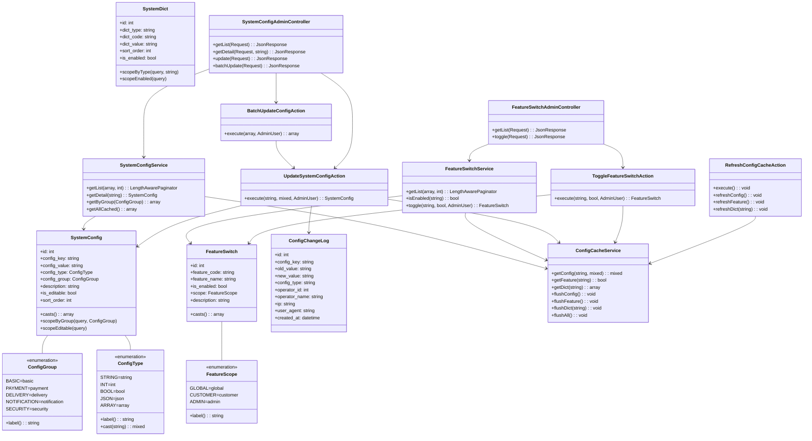

# 怡安印刷商城 — 核心业务设计（卷四）

> **所属文档**：系统设计方案 v2.9.0  
> **原章节**：第6章（终）+ 尾部  
> **内容**：事件体系、自定义异常类、VIP等级与权益、系统配置与全局参数、浏览器兼容性  
> **读者**：后端开发工程师

---

## 6.61 事件体系完善（Event + Listener）

### 设计概述

为覆盖当前SDD中约25%的事件体系缺口，本节补充定义 **30个Event** 与 **72个Listener**，按领域划分为 8 大模块：订单、支付、售后、用户、通知、工单、物流、优惠券。所有 Event 均遵循 Laravel 的 `ShouldBroadcast` / `ShouldQueue` 接口规范，关键业务监听器默认进入队列执行，确保核心流程的异步解耦与性能稳定。

### Event 命名空间

- `App\Events\Order\{EventName}`
- `App\Events\Payment\{EventName}`
- `App\Events\AfterSale\{EventName}`
- `App\Events\Customer\{EventName}`
- `App\Events\Notification\{EventName}`
- `App\Events\Ticket\{EventName}`
- `App\Events\Delivery\{EventName}`
- `App\Events\Coupon\{EventName}`

### Listener 命名空间

- `App\Listeners\Order\{ListenerName}`
- `App\Listeners\Payment\{ListenerName}`
- `App\Listeners\AfterSale\{ListenerName}`
- `App\Listeners\Customer\{ListenerName}`
- `App\Listeners\Notification\{ListenerName}`
- `App\Listeners\Ticket\{ListenerName}`
- `App\Listeners\Delivery\{ListenerName}`
- `App\Listeners\Coupon\{ListenerName}`

---

### 一、订单领域（Order）—— 7 Event / 18 Listener

#### 1. OrderCreated — 订单创建

```php
<?php

namespace App\Events\Order;

use App\Models\Order;
use Illuminate\Broadcasting\InteractsWithSockets;
use Illuminate\Contracts\Queue\ShouldQueue;
use Illuminate\Foundation\Events\Dispatchable;
use Illuminate\Queue\SerializesModels;

class OrderCreated implements ShouldQueue
{
    use Dispatchable, InteractsWithSockets, SerializesModels;

    public function __construct(
        public Order $order,
    ) {}
}
```

```php
<?php

namespace App\Listeners\Order;

use App\Events\Order\OrderCreated;
use App\Notifications\OrderConfirmationNotification;
use App\Services\Inventory\InventoryService;
use App\Services\Order\OrderLogService;

class SendOrderConfirmation
{
    public function handle(OrderCreated $event): void
    {
        $event->order->customer->notify(
            new OrderConfirmationNotification($event->order)
        );
    }
}
```

```php
<?php

namespace App\Listeners\Order;

use App\Events\Order\OrderCreated;
use App\Services\Inventory\InventoryService;

class ReserveInventory
{
    public function handle(OrderCreated $event): void
    {
        foreach ($event->order->items as $item) {
            InventoryService::reserve($item->product_id, $item->quantity);
        }
    }
}
```

```php
<?php

namespace App\Listeners\Order;

use App\Events\Order\OrderCreated;
use App\Services\Order\OrderLogService;

class LogOrderCreation
{
    public function handle(OrderCreated $event): void
    {
        OrderLogService::log($event->order, 'order_created', '订单已创建');
    }
}
```

#### 2. OrderPaid — 订单支付

```php
<?php

namespace App\Events\Order;

use App\Models\Order;
use App\Models\Payment;
use Carbon\Carbon;
use Illuminate\Contracts\Queue\ShouldQueue;
use Illuminate\Foundation\Events\Dispatchable;
use Illuminate\Queue\SerializesModels;

class OrderPaid implements ShouldQueue
{
    use Dispatchable, SerializesModels;

    public function __construct(
        public Order $order,
        public Payment $payment,
        public Carbon $paidAt,
    ) {}
}
```

```php
<?php

namespace App\Listeners\Order;

use App\Events\Order\OrderPaid;
use App\Notifications\OrderPaidNotification;

class SendOrderPaidNotification
{
    public function handle(OrderPaid $event): void
    {
        $event->order->customer->notify(
            new OrderPaidNotification($event->order, $event->payment)
        );
    }
}
```

```php
<?php

namespace App\Listeners\Order;

use App\Events\Order\OrderPaid;
use App\Enums\Order\OrderStatus;

class UpdateOrderStatusAfterPayment
{
    public function handle(OrderPaid $event): void
    {
        $event->order->update([
            'status' => OrderStatus::PAID,
            'paid_at' => $event->paidAt,
        ]);
    }
}
```

```php
<?php

namespace App\Listeners\Order;

use App\Events\Order\OrderPaid;
use App\Services\Inventory\InventoryService;

class DeductInventoryAfterPayment
{
    public function handle(OrderPaid $event): void
    {
        foreach ($event->order->items as $item) {
            InventoryService::deduct($item->product_id, $item->quantity);
            InventoryService::releaseReserve($item->product_id, $item->quantity);
        }
    }
}
```

```php
<?php

namespace App\Listeners\Order;

use App\Events\Order\OrderPaid;
use App\Services\Production\ProductionWorkflowService;

class TriggerProductionWorkflow
{
    public function handle(OrderPaid $event): void
    {
        ProductionWorkflowService::createFromOrder($event->order);
    }
}
```

#### 3. OrderShipped — 订单发货

```php
<?php

namespace App\Events\Order;

use App\Models\Order;
use App\Models\Shipment;
use Illuminate\Contracts\Queue\ShouldQueue;
use Illuminate\Foundation\Events\Dispatchable;
use Illuminate\Queue\SerializesModels;

class OrderShipped implements ShouldQueue
{
    use Dispatchable, SerializesModels;

    public function __construct(
        public Order $order,
        public Shipment $shipment,
    ) {}
}
```

```php
<?php

namespace App\Listeners\Order;

use App\Events\Order\OrderShipped;
use App\Notifications\OrderShippedNotification;

class SendOrderShippedNotification
{
    public function handle(OrderShipped $event): void
    {
        $event->order->customer->notify(
            new OrderShippedNotification($event->order, $event->shipment)
        );
    }
}
```

```php
<?php

namespace App\Listeners\Order;

use App\Events\Order\OrderShipped;
use App\Services\Order\OrderLogService;

class LogOrderShipment
{
    public function handle(OrderShipped $event): void
    {
        OrderLogService::log($event->order, 'order_shipped', '订单已发货');
    }
}
```

#### 4. OrderCompleted — 订单完成

```php
<?php

namespace App\Events\Order;

use App\Models\Order;
use Illuminate\Contracts\Queue\ShouldQueue;
use Illuminate\Foundation\Events\Dispatchable;
use Illuminate\Queue\SerializesModels;

class OrderCompleted implements ShouldQueue
{
    use Dispatchable, SerializesModels;

    public function __construct(
        public Order $order,
    ) {}
}
```

```php
<?php

namespace App\Listeners\Order;

use App\Events\Order\OrderCompleted;
use App\Notifications\OrderCompletedNotification;
use App\Services\Points\PointsService;

class SendOrderCompletedNotification
{
    public function handle(OrderCompleted $event): void
    {
        $event->order->customer->notify(
            new OrderCompletedNotification($event->order)
        );
    }
}
```

```php
<?php

namespace App\Listeners\Order;

use App\Events\Order\OrderCompleted;
use App\Services\Points\PointsService;

class GrantPointsAfterCompletion
{
    public function handle(OrderCompleted $event): void
    {
        PointsService::grantFromOrder($event->order);
    }
}
```

```php
<?php

namespace App\Listeners\Order;

use App\Events\Order\OrderCompleted;
use App\Services\Statistics\SalesStatisticsService;

class UpdateSalesStatistics
{
    public function handle(OrderCompleted $event): void
    {
        SalesStatisticsService::recordCompletion($event->order);
    }
}
```

#### 5. OrderCancelled — 订单取消

```php
<?php

namespace App\Events\Order;

use App\Models\Order;
use Illuminate\Contracts\Queue\ShouldQueue;
use Illuminate\Foundation\Events\Dispatchable;
use Illuminate\Queue\SerializesModels;

class OrderCancelled implements ShouldQueue
{
    use Dispatchable, SerializesModels;

    public function __construct(
        public Order $order,
        public string $reason,
    ) {}
}
```

```php
<?php

namespace App\Listeners\Order;

use App\Events\Order\OrderCancelled;
use App\Notifications\OrderCancelledNotification;

class SendOrderCancelledNotification
{
    public function handle(OrderCancelled $event): void
    {
        $event->order->customer->notify(
            new OrderCancelledNotification($event->order, $event->reason)
        );
    }
}
```

```php
<?php

namespace App\Listeners\Order;

use App\Events\Order\OrderCancelled;
use App\Services\Inventory\InventoryService;

class RestoreInventoryOnCancellation
{
    public function handle(OrderCancelled $event): void
    {
        foreach ($event->order->items as $item) {
            InventoryService::releaseReserve($item->product_id, $item->quantity);
        }
    }
}
```

```php
<?php

namespace App\Listeners\Order;

use App\Events\Order\OrderCancelled;
use App\Services\Payment\RefundService;

class TriggerAutoRefundOnCancel
{
    public function handle(OrderCancelled $event): void
    {
        if ($event->order->isPaid()) {
            RefundService::autoRefund($event->order);
        }
    }
}
```

#### 6. OrderRefunded — 订单退款完成

```php
<?php

namespace App\Events\Order;

use App\Models\Order;
use App\Models\Refund;
use Illuminate\Contracts\Queue\ShouldQueue;
use Illuminate\Foundation\Events\Dispatchable;
use Illuminate\Queue\SerializesModels;

class OrderRefunded implements ShouldQueue
{
    use Dispatchable, SerializesModels;

    public function __construct(
        public Order $order,
        public Refund $refund,
    ) {}
}
```

```php
<?php

namespace App\Listeners\Order;

use App\Events\Order\OrderRefunded;
use App\Notifications\OrderRefundedNotification;

class SendOrderRefundedNotification
{
    public function handle(OrderRefunded $event): void
    {
        $event->order->customer->notify(
            new OrderRefundedNotification($event->order, $event->refund)
        );
    }
}
```

```php
<?php

namespace App\Listeners\Order;

use App\Events\Order\OrderRefunded;
use App\Services\Order\OrderLogService;

class LogOrderRefund
{
    public function handle(OrderRefunded $event): void
    {
        OrderLogService::log(
            $event->order,
            'order_refunded',
            "订单已退款，金额：{$event->refund->amount}"
        );
    }
}
```

```php
<?php

namespace App\Listeners\Order;

use App\Events\Order\OrderRefunded;
use App\Enums\Order\OrderStatus;

class UpdateOrderStatusAfterRefund
{
    public function handle(OrderRefunded $event): void
    {
        $event->order->update(['status' => OrderStatus::REFUNDED]);
    }
}
```

#### 7. OrderStatusChanged — 订单状态变更（通用）

```php
<?php

namespace App\Events\Order;

use App\Models\Order;
use App\Enums\Order\OrderStatus;
use Illuminate\Contracts\Queue\ShouldQueue;
use Illuminate\Foundation\Events\Dispatchable;
use Illuminate\Queue\SerializesModels;

class OrderStatusChanged implements ShouldQueue
{
    use Dispatchable, SerializesModels;

    public function __construct(
        public Order $order,
        public OrderStatus $oldStatus,
        public OrderStatus $newStatus,
    ) {}
}
```

```php
<?php

namespace App\Listeners\Order;

use App\Events\Order\OrderStatusChanged;
use App\Services\Order\OrderLogService;

class LogOrderStatusChange
{
    public function handle(OrderStatusChanged $event): void
    {
        OrderLogService::log(
            $event->order,
            'status_changed',
            "订单状态从 {$event->oldStatus->label()} 变更为 {$event->newStatus->label()}"
        );
    }
}
```

```php
<?php

namespace App\Listeners\Order;

use App\Events\Order\OrderStatusChanged;
use App\Services\Webhook\WebhookService;

class DispatchOrderWebhook
{
    public function handle(OrderStatusChanged $event): void
    {
        WebhookService::dispatch('order.status_changed', $event->order);
    }
}
```

---

### 二、支付领域（Payment）—— 3 Event / 9 Listener

#### 7. PaymentSuccess — 支付成功

```php
<?php

namespace App\Events\Payment;

use App\Models\Order;
use App\Models\Payment;
use Illuminate\Contracts\Queue\ShouldQueue;
use Illuminate\Foundation\Events\Dispatchable;
use Illuminate\Queue\SerializesModels;

class PaymentSuccess implements ShouldQueue
{
    use Dispatchable, SerializesModels;

    public function __construct(
        public Payment $payment,
        public Order $order,
    ) {}
}
```

```php
<?php

namespace App\Listeners\Payment;

use App\Events\Payment\PaymentSuccess;
use App\Services\Finance\FinancialRecordService;

class RecordPaymentSuccess
{
    public function handle(PaymentSuccess $event): void
    {
        FinancialRecordService::recordIncome($event->payment);
    }
}
```

```php
<?php

namespace App\Listeners\Payment;

use App\Events\Payment\PaymentSuccess;
use App\Services\Invoice\InvoiceService;

class GenerateInvoiceAfterPayment
{
    public function handle(PaymentSuccess $event): void
    {
        if ($event->order->needsInvoice()) {
            InvoiceService::generateFromOrder($event->order);
        }
    }
}
```

```php
<?php

namespace App\Listeners\Payment;

use App\Events\Payment\PaymentSuccess;
use App\Services\Order\OrderLogService;

class LogPaymentSuccess
{
    public function handle(PaymentSuccess $event): void
    {
        OrderLogService::log(
            $event->order,
            'payment_success',
            "支付成功，支付单号：{$event->payment->transaction_no}"
        );
    }
}
```

#### 8. PaymentFailed — 支付失败

```php
<?php

namespace App\Events\Payment;

use App\Models\Order;
use App\Models\Payment;
use Illuminate\Contracts\Queue\ShouldQueue;
use Illuminate\Foundation\Events\Dispatchable;
use Illuminate\Queue\SerializesModels;

class PaymentFailed implements ShouldQueue
{
    use Dispatchable, SerializesModels;

    public function __construct(
        public Payment $payment,
        public Order $order,
        public string $failureReason,
    ) {}
}
```

```php
<?php

namespace App\Listeners\Payment;

use App\Events\Payment\PaymentFailed;
use App\Notifications\PaymentFailedNotification;

class SendPaymentFailedNotification
{
    public function handle(PaymentFailed $event): void
    {
        $event->order->customer->notify(
            new PaymentFailedNotification($event->order, $event->failureReason)
        );
    }
}
```

```php
<?php

namespace App\Listeners\Payment;

use App\Events\Payment\PaymentFailed;
use App\Services\Order\OrderLogService;

class LogPaymentFailure
{
    public function handle(PaymentFailed $event): void
    {
        OrderLogService::log(
            $event->order,
            'payment_failed',
            "支付失败，原因：{$event->failureReason}"
        );
    }
}
```

```php
<?php

namespace App\Listeners\Payment;

use App\Events\Payment\PaymentFailed;
use App\Services\Order\OrderAutoCancelService;

class ScheduleOrderAutoCancel
{
    public function handle(PaymentFailed $event): void
    {
        OrderAutoCancelService::schedule($event->order);
    }
}
```

#### 9. RefundProcessed — 退款处理

```php
<?php

namespace App\Events\Payment;

use App\Models\Order;
use App\Models\Refund;
use Illuminate\Contracts\Queue\ShouldQueue;
use Illuminate\Foundation\Events\Dispatchable;
use Illuminate\Queue\SerializesModels;

class RefundProcessed implements ShouldQueue
{
    use Dispatchable, SerializesModels;

    public function __construct(
        public Refund $refund,
        public Order $order,
    ) {}
}
```

```php
<?php

namespace App\Listeners\Payment;

use App\Events\Payment\RefundProcessed;
use App\Notifications\RefundProcessedNotification;

class SendRefundNotification
{
    public function handle(RefundProcessed $event): void
    {
        $event->order->customer->notify(
            new RefundProcessedNotification($event->order, $event->refund)
        );
    }
}
```

```php
<?php

namespace App\Listeners\Payment;

use App\Events\Payment\RefundProcessed;
use App\Services\Finance\FinancialRecordService;

class RecordRefundTransaction
{
    public function handle(RefundProcessed $event): void
    {
        FinancialRecordService::recordRefund($event->refund);
    }
}
```

---

### 三、售后领域（AfterSale）—— 5 Event / 12 Listener

#### 10. AfterSaleCreated — 售后申请创建

```php
<?php

namespace App\Events\AfterSale;

use App\Models\AfterSale;
use Illuminate\Contracts\Queue\ShouldQueue;
use Illuminate\Foundation\Events\Dispatchable;
use Illuminate\Queue\SerializesModels;

class AfterSaleCreated implements ShouldQueue
{
    use Dispatchable, SerializesModels;

    public function __construct(
        public AfterSale $afterSale,
    ) {}
}
```

```php
<?php

namespace App\Listeners\AfterSale;

use App\Events\AfterSale\AfterSaleCreated;
use App\Notifications\AfterSaleCreatedNotification;

class NotifyAdminAfterSaleCreated
{
    public function handle(AfterSaleCreated $event): void
    {
        \App\Models\Admin::role('after_sale')->each(
            fn ($admin) => $admin->notify(
                new AfterSaleCreatedNotification($event->afterSale)
            )
        );
    }
}
```

```php
<?php

namespace App\Listeners\AfterSale;

use App\Events\AfterSale\AfterSaleCreated;
use App\Services\AfterSale\AfterSaleLogService;

class LogAfterSaleCreation
{
    public function handle(AfterSaleCreated $event): void
    {
        AfterSaleLogService::log($event->afterSale, 'created', '售后申请已提交');
    }
}
```

```php
<?php

namespace App\Listeners\AfterSale;

use App\Events\AfterSale\AfterSaleCreated;
use App\Services\Ticket\TicketService;

class CreateTicketForAfterSale
{
    public function handle(AfterSaleCreated $event): void
    {
        TicketService::createFromAfterSale($event->afterSale);
    }
}
```

#### 11. AfterSaleApproved — 售后审核通过

```php
<?php

namespace App\Events\AfterSale;

use App\Models\AfterSale;
use Illuminate\Contracts\Queue\ShouldQueue;
use Illuminate\Foundation\Events\Dispatchable;
use Illuminate\Queue\SerializesModels;

class AfterSaleApproved implements ShouldQueue
{
    use Dispatchable, SerializesModels;

    public function __construct(
        public AfterSale $afterSale,
        public string $operatorName,
    ) {}
}
```

```php
<?php

namespace App\Listeners\AfterSale;

use App\Events\AfterSale\AfterSaleApproved;
use App\Notifications\AfterSaleApprovedNotification;

class NotifyCustomerAfterSaleApproved
{
    public function handle(AfterSaleApproved $event): void
    {
        $event->afterSale->order->customer->notify(
            new AfterSaleApprovedNotification($event->afterSale)
        );
    }
}
```

```php
<?php

namespace App\Listeners\AfterSale;

use App\Events\AfterSale\AfterSaleApproved;
use App\Services\AfterSale\AfterSaleLogService;

class LogAfterSaleApproval
{
    public function handle(AfterSaleApproved $event): void
    {
        AfterSaleLogService::log(
            $event->afterSale,
            'approved',
            "售后申请已审核通过，操作人：{$event->operatorName}"
        );
    }
}
```

```php
<?php

namespace App\Listeners\AfterSale;

use App\Events\AfterSale\AfterSaleApproved;
use App\Services\Payment\RefundService;

class TriggerRefundAfterApproval
{
    public function handle(AfterSaleApproved $event): void
    {
        if ($event->afterSale->type->isRefund()) {
            RefundService::createFromAfterSale($event->afterSale);
        }
    }
}
```

#### 12. AfterSaleRejected — 售后审核拒绝

```php
<?php

namespace App\Events\AfterSale;

use App\Models\AfterSale;
use Illuminate\Contracts\Queue\ShouldQueue;
use Illuminate\Foundation\Events\Dispatchable;
use Illuminate\Queue\SerializesModels;

class AfterSaleRejected implements ShouldQueue
{
    use Dispatchable, SerializesModels;

    public function __construct(
        public AfterSale $afterSale,
        public string $rejectReason,
        public string $operatorName,
    ) {}
}
```

```php
<?php

namespace App\Listeners\AfterSale;

use App\Events\AfterSale\AfterSaleRejected;
use App\Notifications\AfterSaleRejectedNotification;

class NotifyCustomerAfterSaleRejected
{
    public function handle(AfterSaleRejected $event): void
    {
        $event->afterSale->order->customer->notify(
            new AfterSaleRejectedNotification($event->afterSale, $event->rejectReason)
        );
    }
}
```

```php
<?php

namespace App\Listeners\AfterSale;

use App\Events\AfterSale\AfterSaleRejected;
use App\Services\AfterSale\AfterSaleLogService;

class LogAfterSaleRejection
{
    public function handle(AfterSaleRejected $event): void
    {
        AfterSaleLogService::log(
            $event->afterSale,
            'rejected',
            "售后申请已拒绝，原因：{$event->rejectReason}，操作人：{$event->operatorName}"
        );
    }
}
```

#### 13. AfterSaleCancelled — 售后撤销

```php
<?php

namespace App\Events\AfterSale;

use App\Models\AfterSale;
use Illuminate\Contracts\Queue\ShouldQueue;
use Illuminate\Foundation\Events\Dispatchable;
use Illuminate\Queue\SerializesModels;

class AfterSaleCancelled implements ShouldQueue
{
    use Dispatchable, SerializesModels;

    public function __construct(
        public AfterSale $afterSale,
        public string $reason,
    ) {}
}
```

```php
<?php

namespace App\Listeners\AfterSale;

use App\Events\AfterSale\AfterSaleCancelled;
use App\Notifications\AfterSaleCancelledNotification;

class NotifyCustomerAfterSaleCancelled
{
    public function handle(AfterSaleCancelled $event): void
    {
        $event->afterSale->order->customer->notify(
            new AfterSaleCancelledNotification($event->afterSale, $event->reason)
        );
    }
}
```

```php
<?php

namespace App\Listeners\AfterSale;

use App\Events\AfterSale\AfterSaleCancelled;
use App\Services\AfterSale\AfterSaleLogService;

class LogAfterSaleCancellation
{
    public function handle(AfterSaleCancelled $event): void
    {
        AfterSaleLogService::log(
            $event->afterSale,
            'cancelled',
            "售后申请已撤销，原因：{$event->reason}"
        );
    }
}
```

#### 14. AfterSaleCompleted — 售后完成

```php
<?php

namespace App\Events\AfterSale;

use App\Models\AfterSale;
use Illuminate\Contracts\Queue\ShouldQueue;
use Illuminate\Foundation\Events\Dispatchable;
use Illuminate\Queue\SerializesModels;

class AfterSaleCompleted implements ShouldQueue
{
    use Dispatchable, SerializesModels;

    public function __construct(
        public AfterSale $afterSale,
    ) {}
}
```

```php
<?php

namespace App\Listeners\AfterSale;

use App\Events\AfterSale\AfterSaleCompleted;
use App\Notifications\AfterSaleCompletedNotification;

class NotifyCustomerAfterSaleCompleted
{
    public function handle(AfterSaleCompleted $event): void
    {
        $event->afterSale->order->customer->notify(
            new AfterSaleCompletedNotification($event->afterSale)
        );
    }
}
```

```php
<?php

namespace App\Listeners\AfterSale;

use App\Events\AfterSale\AfterSaleCompleted;
use App\Services\AfterSale\AfterSaleLogService;

class LogAfterSaleCompletion
{
    public function handle(AfterSaleCompleted $event): void
    {
        AfterSaleLogService::log($event->afterSale, 'completed', '售后流程已完结');
    }
}
```

```php
<?php

namespace App\Listeners\AfterSale;

use App\Events\AfterSale\AfterSaleCompleted;
use App\Services\Statistics\AfterSaleStatisticsService;

class UpdateAfterSaleStatistics
{
    public function handle(AfterSaleCompleted $event): void
    {
        AfterSaleStatisticsService::recordCompletion($event->afterSale);
    }
}
```

---

### 四、用户领域（Customer）—— 5 Event / 13 Listener

#### 14. CustomerRegistered — 客户注册

```php
<?php

namespace App\Events\Customer;

use App\Models\Customer;
use Illuminate\Contracts\Queue\ShouldQueue;
use Illuminate\Foundation\Events\Dispatchable;
use Illuminate\Queue\SerializesModels;

class CustomerRegistered implements ShouldQueue
{
    use Dispatchable, SerializesModels;

    public function __construct(
        public Customer $customer,
    ) {}
}
```

```php
<?php

namespace App\Listeners\Customer;

use App\Events\Customer\CustomerRegistered;
use App\Notifications\WelcomeNotification;

class SendWelcomeEmail
{
    public function handle(CustomerRegistered $event): void
    {
        $event->customer->notify(new WelcomeNotification());
    }
}
```

```php
<?php

namespace App\Listeners\Customer;

use App\Events\Customer\CustomerRegistered;
use App\Services\Coupon\NewUserCouponService;

class GrantNewUserCoupon
{
    public function handle(CustomerRegistered $event): void
    {
        NewUserCouponService::grant($event->customer);
    }
}
```

```php
<?php

namespace App\Listeners\Customer;

use App\Events\Customer\CustomerRegistered;
use App\Services\Customer\CustomerLogService;

class LogCustomerRegistration
{
    public function handle(CustomerRegistered $event): void
    {
        CustomerLogService::log($event->customer, 'registered', '用户注册成功');
    }
}
```

#### 15. CustomerLoggedIn — 客户登录

```php
<?php

namespace App\Events\Customer;

use App\Models\Customer;
use Illuminate\Contracts\Queue\ShouldQueue;
use Illuminate\Foundation\Events\Dispatchable;
use Illuminate\Queue\SerializesModels;

class CustomerLoggedIn implements ShouldQueue
{
    use Dispatchable, SerializesModels;

    public function __construct(
        public Customer $customer,
        public string $ip,
        public string $userAgent,
    ) {}
}
```

```php
<?php

namespace App\Listeners\Customer;

use App\Events\Customer\CustomerLoggedIn;
use App\Services\Customer\CustomerLogService;

class LogCustomerLogin
{
    public function handle(CustomerLoggedIn $event): void
    {
        CustomerLogService::log($event->customer, 'login', "登录 IP: {$event->ip}");
    }
}
```

```php
<?php

namespace App\Listeners\Customer;

use App\Events\Customer\CustomerLoggedIn;
use App\Services\Security\LoginAnomalyDetector;

class CheckLoginAnomaly
{
    public function handle(CustomerLoggedIn $event): void
    {
        LoginAnomalyDetector::check($event->customer, $event->ip, $event->userAgent);
    }
}
```

```php
<?php

namespace App\Listeners\Customer;

use App\Events\Customer\CustomerLoggedIn;
use App\Services\Cart\CartMergeService;

class MergeGuestCart
{
    public function handle(CustomerLoggedIn $event): void
    {
        CartMergeService::merge($event->customer);
    }
}
```

#### 16. CustomerPasswordChanged — 密码修改

```php
<?php

namespace App\Events\Customer;

use App\Models\Customer;
use Illuminate\Contracts\Queue\ShouldQueue;
use Illuminate\Foundation\Events\Dispatchable;
use Illuminate\Queue\SerializesModels;

class CustomerPasswordChanged implements ShouldQueue
{
    use Dispatchable, SerializesModels;

    public function __construct(
        public Customer $customer,
    ) {}
}
```

```php
<?php

namespace App\Listeners\Customer;

use App\Events\Customer\CustomerPasswordChanged;
use App\Notifications\PasswordChangedNotification;

class SendPasswordChangedAlert
{
    public function handle(CustomerPasswordChanged $event): void
    {
        $event->customer->notify(new PasswordChangedNotification());
    }
}
```

```php
<?php

namespace App\Listeners\Customer;

use App\Events\Customer\CustomerPasswordChanged;
use App\Services\Customer\CustomerLogService;

class LogPasswordChange
{
    public function handle(CustomerPasswordChanged $event): void
    {
        CustomerLogService::log($event->customer, 'password_changed', '用户修改密码');
    }
}
```

#### 17. CustomerVipUpgraded — VIP升级

```php
<?php

namespace App\Events\Customer;

use App\Models\Customer;
use App\Enums\Customer\VipLevel;
use Illuminate\Contracts\Queue\ShouldQueue;
use Illuminate\Foundation\Events\Dispatchable;
use Illuminate\Queue\SerializesModels;

class CustomerVipUpgraded implements ShouldQueue
{
    use Dispatchable, SerializesModels;

    public function __construct(
        public Customer $customer,
        public VipLevel $oldLevel,
        public VipLevel $newLevel,
    ) {}
}
```

```php
<?php

namespace App\Listeners\Customer;

use App\Events\Customer\CustomerVipUpgraded;
use App\Notifications\VipUpgradedNotification;

class SendVipUpgradeNotification
{
    public function handle(CustomerVipUpgraded $event): void
    {
        $event->customer->notify(
            new VipUpgradedNotification($event->oldLevel, $event->newLevel)
        );
    }
}
```

```php
<?php

namespace App\Listeners\Customer;

use App\Events\Customer\CustomerVipUpgraded;
use App\Services\Coupon\VipCouponService;

class GrantVipUpgradeCoupons
{
    public function handle(CustomerVipUpgraded $event): void
    {
        VipCouponService::grantUpgradeCoupons($event->customer, $event->newLevel);
    }
}
```

```php
<?php

namespace App\Listeners\Customer;

use App\Events\Customer\CustomerVipUpgraded;
use App\Services\Customer\CustomerLogService;

class LogVipUpgrade
{
    public function handle(CustomerVipUpgraded $event): void
    {
        CustomerLogService::log(
            $event->customer,
            'vip_upgraded',
            "VIP 从 {$event->oldLevel->label()} 升级至 {$event->newLevel->label()}"
        );
    }
}
```

#### 18. CustomerVipDowngraded — VIP降级

```php
<?php

namespace App\Events\Customer;

use App\Models\Customer;
use App\Enums\Customer\VipLevel;
use Illuminate\Contracts\Queue\ShouldQueue;
use Illuminate\Foundation\Events\Dispatchable;
use Illuminate\Queue\SerializesModels;

class CustomerVipDowngraded implements ShouldQueue
{
    use Dispatchable, SerializesModels;

    public function __construct(
        public Customer $customer,
        public VipLevel $oldLevel,
        public VipLevel $newLevel,
        public string $reason,
    ) {}
}
```

```php
<?php

namespace App\Listeners\Customer;

use App\Events\Customer\CustomerVipDowngraded;
use App\Notifications\VipDowngradedNotification;

class SendVipDowngradeNotification
{
    public function handle(CustomerVipDowngraded $event): void
    {
        $event->customer->notify(
            new VipDowngradedNotification($event->oldLevel, $event->newLevel, $event->reason)
        );
    }
}
```

```php
<?php

namespace App\Listeners\Customer;

use App\Events\Customer\CustomerVipDowngraded;
use App\Services\Customer\CustomerLogService;

class LogVipDowngrade
{
    public function handle(CustomerVipDowngraded $event): void
    {
        CustomerLogService::log(
            $event->customer,
            'vip_downgraded',
            "VIP 从 {$event->oldLevel->label()} 降级至 {$event->newLevel->label()}，原因：{$event->reason}"
        );
    }
}
```

---

### 五、通知领域（Notification）—— 1 Event / 3 Listener

#### 19. NotificationShouldBeSent — 应发送通知

```php
<?php

namespace App\Events\Notification;

use App\Models\NotificationTemplate;
use Illuminate\Contracts\Queue\ShouldQueue;
use Illuminate\Foundation\Events\Dispatchable;
use Illuminate\Queue\SerializesModels;

class NotificationShouldBeSent implements ShouldQueue
{
    use Dispatchable, SerializesModels;

    public function __construct(
        public string $channel,
        public NotificationTemplate $template,
        public array $recipients,
        public array $data,
    ) {}
}
```

```php
<?php

namespace App\Listeners\Notification;

use App\Events\Notification\NotificationShouldBeSent;
use App\Services\Notification\SmsNotificationService;

class SendSmsNotification
{
    public function handle(NotificationShouldBeSent $event): void
    {
        if ($event->channel === 'sms') {
            SmsNotificationService::send($event->template, $event->recipients, $event->data);
        }
    }
}
```

```php
<?php

namespace App\Listeners\Notification;

use App\Events\Notification\NotificationShouldBeSent;
use App\Services\Notification\EmailNotificationService;

class SendEmailNotification
{
    public function handle(NotificationShouldBeSent $event): void
    {
        if ($event->channel === 'email') {
            EmailNotificationService::send($event->template, $event->recipients, $event->data);
        }
    }
}
```

```php
<?php

namespace App\Listeners\Notification;

use App\Events\Notification\NotificationShouldBeSent;
use App\Services\Notification\AppPushNotificationService;

class SendAppPushNotification
{
    public function handle(NotificationShouldBeSent $event): void
    {
        if ($event->channel === 'app_push') {
            AppPushNotificationService::send($event->template, $event->recipients, $event->data);
        }
    }
}
```

---

### 六、工单领域（Ticket）—— 4 Event / 10 Listener

#### 20. TicketCreated — 工单创建

```php
<?php

namespace App\Events\Ticket;

use App\Models\Ticket;
use Illuminate\Contracts\Queue\ShouldQueue;
use Illuminate\Foundation\Events\Dispatchable;
use Illuminate\Queue\SerializesModels;

class TicketCreated implements ShouldQueue
{
    use Dispatchable, SerializesModels;

    public function __construct(
        public Ticket $ticket,
    ) {}
}
```

```php
<?php

namespace App\Listeners\Ticket;

use App\Events\Ticket\TicketCreated;
use App\Notifications\TicketCreatedNotification;

class NotifyAssigneeOfNewTicket
{
    public function handle(TicketCreated $event): void
    {
        if ($event->ticket->assignee) {
            $event->ticket->assignee->notify(
                new TicketCreatedNotification($event->ticket)
            );
        }
    }
}
```

```php
<?php

namespace App\Listeners\Ticket;

use App\Events\Ticket\TicketCreated;
use App\Services\Ticket\TicketLogService;

class LogTicketCreation
{
    public function handle(TicketCreated $event): void
    {
        TicketLogService::log($event->ticket, 'created', '工单已创建');
    }
}
```

```php
<?php

namespace App\Listeners\Ticket;

use App\Events\Ticket\TicketCreated;
use App\Services\Ticket\TicketRoutingService;

class AutoRouteTicket
{
    public function handle(TicketCreated $event): void
    {
        if (! $event->ticket->assignee_id) {
            TicketRoutingService::autoAssign($event->ticket);
        }
    }
}
```

#### 21. TicketAssigned — 工单分配

```php
<?php

namespace App\Events\Ticket;

use App\Models\Ticket;
use App\Models\User;
use Illuminate\Contracts\Queue\ShouldQueue;
use Illuminate\Foundation\Events\Dispatchable;
use Illuminate\Queue\SerializesModels;

class TicketAssigned implements ShouldQueue
{
    use Dispatchable, SerializesModels;

    public function __construct(
        public Ticket $ticket,
        public User $previousAssignee,
        public User $newAssignee,
    ) {}
}
```

```php
<?php

namespace App\Listeners\Ticket;

use App\Events\Ticket\TicketAssigned;
use App\Notifications\TicketAssignedNotification;

class NotifyNewAssignee
{
    public function handle(TicketAssigned $event): void
    {
        $event->newAssignee->notify(
            new TicketAssignedNotification($event->ticket)
        );
    }
}
```

```php
<?php

namespace App\Listeners\Ticket;

use App\Events\Ticket\TicketAssigned;
use App\Services\Ticket\TicketLogService;

class LogTicketAssignment
{
    public function handle(TicketAssigned $event): void
    {
        TicketLogService::log(
            $event->ticket,
            'assigned',
            "工单分配给 {$event->newAssignee->name}"
        );
    }
}
```

```php
<?php

namespace App\Listeners\Ticket;

use App\Events\Ticket\TicketAssigned;
use App\Services\Ticket\TicketSLAService;

class ResetSLADeadline
{
    public function handle(TicketAssigned $event): void
    {
        TicketSLAService::resetDeadline($event->ticket);
    }
}
```

#### 22. TicketEscalated — 工单升级

```php
<?php

namespace App\Events\Ticket;

use App\Models\Ticket;
use Illuminate\Contracts\Queue\ShouldQueue;
use Illuminate\Foundation\Events\Dispatchable;
use Illuminate\Queue\SerializesModels;

class TicketEscalated implements ShouldQueue
{
    use Dispatchable, SerializesModels;

    public function __construct(
        public Ticket $ticket,
        public string $escalationReason,
        public int $escalatedLevel,
    ) {}
}
```

```php
<?php

namespace App\Listeners\Ticket;

use App\Events\Ticket\TicketEscalated;
use App\Notifications\TicketEscalatedNotification;

class NotifyManagerOfEscalation
{
    public function handle(TicketEscalated $event): void
    {
        \App\Models\Admin::role('manager')->each(
            fn ($manager) => $manager->notify(
                new TicketEscalatedNotification($event->ticket, $event->escalationReason)
            )
        );
    }
}
```

```php
<?php

namespace App\Listeners\Ticket;

use App\Events\Ticket\TicketEscalated;
use App\Services\Ticket\TicketLogService;

class LogTicketEscalation
{
    public function handle(TicketEscalated $event): void
    {
        TicketLogService::log(
            $event->ticket,
            'escalated',
            "工单升级至 L{$event->escalatedLevel}，原因：{$event->escalationReason}"
        );
    }
}
```

```php
<?php

namespace App\Listeners\Ticket;

use App\Events\Ticket\TicketEscalated;
use App\Services\Ticket\TicketSLAService;

class TightenSLADeadline
{
    public function handle(TicketEscalated $event): void
    {
        TicketSLAService::tightenDeadline($event->ticket, $event->escalatedLevel);
    }
}
```

#### 23. TicketResolved — 工单解决

```php
<?php

namespace App\Events\Ticket;

use App\Models\Ticket;
use Illuminate\Contracts\Queue\ShouldQueue;
use Illuminate\Foundation\Events\Dispatchable;
use Illuminate\Queue\SerializesModels;

class TicketResolved implements ShouldQueue
{
    use Dispatchable, SerializesModels;

    public function __construct(
        public Ticket $ticket,
        public string $resolution,
    ) {}
}
```

```php
<?php

namespace App\Listeners\Ticket;

use App\Events\Ticket\TicketResolved;
use App\Notifications\TicketResolvedNotification;

class NotifyReporterOfResolution
{
    public function handle(TicketResolved $event): void
    {
        if ($event->ticket->reporter) {
            $event->ticket->reporter->notify(
                new TicketResolvedNotification($event->ticket, $event->resolution)
            );
        }
    }
}
```

```php
<?php

namespace App\Listeners\Ticket;

use App\Events\Ticket\TicketResolved;
use App\Services\Ticket\TicketLogService;

class LogTicketResolution
{
    public function handle(TicketResolved $event): void
    {
        TicketLogService::log(
            $event->ticket,
            'resolved',
            "工单已解决：{$event->resolution}"
        );
    }
}
```

```php
<?php

namespace App\Listeners\Ticket;

use App\Events\Ticket\TicketResolved;
use App\Services\Statistics\TicketStatisticsService;

class UpdateTicketResolutionStats
{
    public function handle(TicketResolved $event): void
    {
        TicketStatisticsService::recordResolution($event->ticket);
    }
}
```

---

### 七、物流领域（Delivery）—— 2 Event / 5 Listener

#### 24. DeliveryShipped — 配送发货

```php
<?php

namespace App\Events\Delivery;

use App\Models\Delivery;
use App\Models\Order;
use Illuminate\Contracts\Queue\ShouldQueue;
use Illuminate\Foundation\Events\Dispatchable;
use Illuminate\Queue\SerializesModels;

class DeliveryShipped implements ShouldQueue
{
    use Dispatchable, SerializesModels;

    public function __construct(
        public Delivery $delivery,
        public Order $order,
    ) {}
}
```

```php
<?php

namespace App\Listeners\Delivery;

use App\Events\Delivery\DeliveryShipped;
use App\Notifications\DeliveryShippedNotification;

class SendDeliveryShippedNotification
{
    public function handle(DeliveryShipped $event): void
    {
        $event->order->customer->notify(
            new DeliveryShippedNotification($event->order, $event->delivery)
        );
    }
}
```

```php
<?php

namespace App\Listeners\Delivery;

use App\Events\Delivery\DeliveryShipped;
use App\Services\Delivery\DeliveryTrackingService;

class StartDeliveryTracking
{
    public function handle(DeliveryShipped $event): void
    {
        DeliveryTrackingService::startTracking($event->delivery);
    }
}
```

#### 25. DeliveryDelivered — 配送签收

```php
<?php

namespace App\Events\Delivery;

use App\Models\Delivery;
use App\Models\Order;
use Illuminate\Contracts\Queue\ShouldQueue;
use Illuminate\Foundation\Events\Dispatchable;
use Illuminate\Queue\SerializesModels;

class DeliveryDelivered implements ShouldQueue
{
    use Dispatchable, SerializesModels;

    public function __construct(
        public Delivery $delivery,
        public Order $order,
    ) {}
}
```

```php
<?php

namespace App\Listeners\Delivery;

use App\Events\Delivery\DeliveryDelivered;
use App\Notifications\DeliveryDeliveredNotification;

class SendDeliveryDeliveredNotification
{
    public function handle(DeliveryDelivered $event): void
    {
        $event->order->customer->notify(
            new DeliveryDeliveredNotification($event->order, $event->delivery)
        );
    }
}
```

```php
<?php

namespace App\Listeners\Delivery;

use App\Events\Delivery\DeliveryDelivered;
use App\Services\Order\OrderCompletionService;

class TriggerOrderCompletion
{
    public function handle(DeliveryDelivered $event): void
    {
        OrderCompletionService::completeIfAllDelivered($event->order);
    }
}
```

---

### 八、优惠券领域（Coupon）—— 3 Event / 7 Listener

#### 26. CouponReceived — 优惠券领取

```php
<?php

namespace App\Events\Coupon;

use App\Models\Coupon;
use App\Models\Customer;
use Illuminate\Contracts\Queue\ShouldQueue;
use Illuminate\Foundation\Events\Dispatchable;
use Illuminate\Queue\SerializesModels;

class CouponReceived implements ShouldQueue
{
    use Dispatchable, SerializesModels;

    public function __construct(
        public Coupon $coupon,
        public Customer $customer,
    ) {}
}
```

```php
<?php

namespace App\Listeners\Coupon;

use App\Events\Coupon\CouponReceived;
use App\Notifications\CouponReceivedNotification;

class SendCouponReceivedNotification
{
    public function handle(CouponReceived $event): void
    {
        $event->customer->notify(
            new CouponReceivedNotification($event->coupon)
        );
    }
}
```

```php
<?php

namespace App\Listeners\Coupon;

use App\Events\Coupon\CouponReceived;
use App\Services\Coupon\CouponInventoryService;

class DecrementCouponInventory
{
    public function handle(CouponReceived $event): void
    {
        CouponInventoryService::decrement($event->coupon);
    }
}
```

```php
<?php

namespace App\Listeners\Coupon;

use App\Events\Coupon\CouponReceived;
use App\Services\Coupon\CouponLogService;

class LogCouponReceive
{
    public function handle(CouponReceived $event): void
    {
        CouponLogService::log($event->coupon, $event->customer, 'received', '优惠券已领取');
    }
}
```

#### 27. CouponUsed — 优惠券使用

```php
<?php

namespace App\Events\Coupon;

use App\Models\Coupon;
use App\Models\Customer;
use App\Models\Order;
use Illuminate\Contracts\Queue\ShouldQueue;
use Illuminate\Foundation\Events\Dispatchable;
use Illuminate\Queue\SerializesModels;

class CouponUsed implements ShouldQueue
{
    use Dispatchable, SerializesModels;

    public function __construct(
        public Coupon $coupon,
        public Customer $customer,
        public Order $order,
    ) {}
}
```

```php
<?php

namespace App\Listeners\Coupon;

use App\Events\Coupon\CouponUsed;
use App\Services\Coupon\CouponLogService;

class LogCouponUsage
{
    public function handle(CouponUsed $event): void
    {
        CouponLogService::log(
            $event->coupon,
            $event->customer,
            'used',
            "优惠券已使用，订单号：{$event->order->order_no}"
        );
    }
}
```

```php
<?php

namespace App\Listeners\Coupon;

use App\Events\Coupon\CouponUsed;
use App\Services\Statistics\CouponStatisticsService;

class UpdateCouponUsageStats
{
    public function handle(CouponUsed $event): void
    {
        CouponStatisticsService::recordUsage($event->coupon, $event->order);
    }
}
```

#### 28. CouponExpired — 优惠券过期

```php
<?php

namespace App\Events\Coupon;

use App\Models\Coupon;
use App\Models\Customer;
use Illuminate\Contracts\Queue\ShouldQueue;
use Illuminate\Foundation\Events\Dispatchable;
use Illuminate\Queue\SerializesModels;

class CouponExpired implements ShouldQueue
{
    use Dispatchable, SerializesModels;

    public function __construct(
        public Coupon $coupon,
        public Customer $customer,
    ) {}
}
```

```php
<?php

namespace App\Listeners\Coupon;

use App\Events\Coupon\CouponExpired;
use App\Notifications\CouponExpiredNotification;

class SendCouponExpiredNotification
{
    public function handle(CouponExpired $event): void
    {
        $event->customer->notify(
            new CouponExpiredNotification($event->coupon)
        );
    }
}
```

```php
<?php

namespace App\Listeners\Coupon;

use App\Events\Coupon\CouponExpired;
use App\Services\Coupon\CouponLogService;

class LogCouponExpiration
{
    public function handle(CouponExpired $event): void
    {
        CouponLogService::log($event->coupon, $event->customer, 'expired', '优惠券已过期');
    }
}
```

---

### 九、EventServiceProvider 完整注册配置

```php
<?php

namespace App\Providers;

use Illuminate\Foundation\Support\Providers\EventServiceProvider as ServiceProvider;

// Order Events
use App\Events\Order\OrderCreated;
use App\Events\Order\OrderPaid;
use App\Events\Order\OrderShipped;
use App\Events\Order\OrderCompleted;
use App\Events\Order\OrderCancelled;
use App\Events\Order\OrderRefunded;
use App\Events\Order\OrderStatusChanged;

// Payment Events
use App\Events\Payment\PaymentSuccess;
use App\Events\Payment\PaymentFailed;
use App\Events\Payment\RefundProcessed;

// AfterSale Events
use App\Events\AfterSale\AfterSaleCreated;
use App\Events\AfterSale\AfterSaleApproved;
use App\Events\AfterSale\AfterSaleRejected;
use App\Events\AfterSale\AfterSaleCancelled;
use App\Events\AfterSale\AfterSaleCompleted;

// Customer Events
use App\Events\Customer\CustomerRegistered;
use App\Events\Customer\CustomerLoggedIn;
use App\Events\Customer\CustomerPasswordChanged;
use App\Events\Customer\CustomerVipUpgraded;
use App\Events\Customer\CustomerVipDowngraded;

// Notification Events
use App\Events\Notification\NotificationShouldBeSent;

// Ticket Events
use App\Events\Ticket\TicketCreated;
use App\Events\Ticket\TicketAssigned;
use App\Events\Ticket\TicketEscalated;
use App\Events\Ticket\TicketResolved;

// Delivery Events
use App\Events\Delivery\DeliveryShipped;
use App\Events\Delivery\DeliveryDelivered;

// Coupon Events
use App\Events\Coupon\CouponReceived;
use App\Events\Coupon\CouponUsed;
use App\Events\Coupon\CouponExpired;

// Order Listeners
use App\Listeners\Order\SendOrderConfirmation;
use App\Listeners\Order\ReserveInventory;
use App\Listeners\Order\LogOrderCreation;
use App\Listeners\Order\SendOrderPaidNotification;
use App\Listeners\Order\UpdateOrderStatusAfterPayment;
use App\Listeners\Order\DeductInventoryAfterPayment;
use App\Listeners\Order\TriggerProductionWorkflow;
use App\Listeners\Order\SendOrderShippedNotification;
use App\Listeners\Order\LogOrderShipment;
use App\Listeners\Order\SendOrderCompletedNotification;
use App\Listeners\Order\GrantPointsAfterCompletion;
use App\Listeners\Order\UpdateSalesStatistics;
use App\Listeners\Order\SendOrderCancelledNotification;
use App\Listeners\Order\RestoreInventoryOnCancellation;
use App\Listeners\Order\TriggerAutoRefundOnCancel;
use App\Listeners\Order\SendOrderRefundedNotification;
use App\Listeners\Order\LogOrderRefund;
use App\Listeners\Order\UpdateOrderStatusAfterRefund;
use App\Listeners\Order\LogOrderStatusChange;
use App\Listeners\Order\DispatchOrderWebhook;

// Payment Listeners
use App\Listeners\Payment\RecordPaymentSuccess;
use App\Listeners\Payment\GenerateInvoiceAfterPayment;
use App\Listeners\Payment\LogPaymentSuccess;
use App\Listeners\Payment\SendPaymentFailedNotification;
use App\Listeners\Payment\LogPaymentFailure;
use App\Listeners\Payment\ScheduleOrderAutoCancel;
use App\Listeners\Payment\SendRefundNotification;
use App\Listeners\Payment\RecordRefundTransaction;

// AfterSale Listeners
use App\Listeners\AfterSale\NotifyAdminAfterSaleCreated;
use App\Listeners\AfterSale\LogAfterSaleCreation;
use App\Listeners\AfterSale\CreateTicketForAfterSale;
use App\Listeners\AfterSale\NotifyCustomerAfterSaleApproved;
use App\Listeners\AfterSale\LogAfterSaleApproval;
use App\Listeners\AfterSale\TriggerRefundAfterApproval;
use App\Listeners\AfterSale\NotifyCustomerAfterSaleRejected;
use App\Listeners\AfterSale\LogAfterSaleRejection;
use App\Listeners\AfterSale\NotifyCustomerAfterSaleCancelled;
use App\Listeners\AfterSale\LogAfterSaleCancellation;
use App\Listeners\AfterSale\NotifyCustomerAfterSaleCompleted;
use App\Listeners\AfterSale\LogAfterSaleCompletion;
use App\Listeners\AfterSale\UpdateAfterSaleStatistics;

// Customer Listeners
use App\Listeners\Customer\SendWelcomeEmail;
use App\Listeners\Customer\GrantNewUserCoupon;
use App\Listeners\Customer\LogCustomerRegistration;
use App\Listeners\Customer\LogCustomerLogin;
use App\Listeners\Customer\CheckLoginAnomaly;
use App\Listeners\Customer\MergeGuestCart;
use App\Listeners\Customer\SendPasswordChangedAlert;
use App\Listeners\Customer\LogPasswordChange;
use App\Listeners\Customer\SendVipUpgradeNotification;
use App\Listeners\Customer\GrantVipUpgradeCoupons;
use App\Listeners\Customer\LogVipUpgrade;
use App\Listeners\Customer\SendVipDowngradeNotification;
use App\Listeners\Customer\LogVipDowngrade;

// Notification Listeners
use App\Listeners\Notification\SendSmsNotification;
use App\Listeners\Notification\SendEmailNotification;
use App\Listeners\Notification\SendAppPushNotification;

// Ticket Listeners
use App\Listeners\Ticket\NotifyAssigneeOfNewTicket;
use App\Listeners\Ticket\LogTicketCreation;
use App\Listeners\Ticket\AutoRouteTicket;
use App\Listeners\Ticket\NotifyNewAssignee;
use App\Listeners\Ticket\LogTicketAssignment;
use App\Listeners\Ticket\ResetSLADeadline;
use App\Listeners\Ticket\NotifyManagerOfEscalation;
use App\Listeners\Ticket\LogTicketEscalation;
use App\Listeners\Ticket\TightenSLADeadline;
use App\Listeners\Ticket\NotifyReporterOfResolution;
use App\Listeners\Ticket\LogTicketResolution;
use App\Listeners\Ticket\UpdateTicketResolutionStats;

// Delivery Listeners
use App\Listeners\Delivery\SendDeliveryShippedNotification;
use App\Listeners\Delivery\StartDeliveryTracking;
use App\Listeners\Delivery\SendDeliveryDeliveredNotification;
use App\Listeners\Delivery\TriggerOrderCompletion;

// Coupon Listeners
use App\Listeners\Coupon\SendCouponReceivedNotification;
use App\Listeners\Coupon\DecrementCouponInventory;
use App\Listeners\Coupon\LogCouponReceive;
use App\Listeners\Coupon\LogCouponUsage;
use App\Listeners\Coupon\UpdateCouponUsageStats;
use App\Listeners\Coupon\SendCouponExpiredNotification;
use App\Listeners\Coupon\LogCouponExpiration;

class EventServiceProvider extends ServiceProvider
{
    protected $listen = [
        // ─── 订单领域 ───
        OrderCreated::class => [
            SendOrderConfirmation::class,
            ReserveInventory::class,
            LogOrderCreation::class,
        ],
        OrderPaid::class => [
            SendOrderPaidNotification::class,
            UpdateOrderStatusAfterPayment::class,
            DeductInventoryAfterPayment::class,
            TriggerProductionWorkflow::class,
        ],
        OrderShipped::class => [
            SendOrderShippedNotification::class,
            LogOrderShipment::class,
        ],
        OrderCompleted::class => [
            SendOrderCompletedNotification::class,
            GrantPointsAfterCompletion::class,
            UpdateSalesStatistics::class,
        ],
        OrderCancelled::class => [
            SendOrderCancelledNotification::class,
            RestoreInventoryOnCancellation::class,
            TriggerAutoRefundOnCancel::class,
        ],
        OrderRefunded::class => [
            SendOrderRefundedNotification::class,
            LogOrderRefund::class,
            UpdateOrderStatusAfterRefund::class,
        ],
        OrderStatusChanged::class => [
            LogOrderStatusChange::class,
            DispatchOrderWebhook::class,
        ],

        // ─── 支付领域 ───
        PaymentSuccess::class => [
            RecordPaymentSuccess::class,
            GenerateInvoiceAfterPayment::class,
            LogPaymentSuccess::class,
        ],
        PaymentFailed::class => [
            SendPaymentFailedNotification::class,
            LogPaymentFailure::class,
            ScheduleOrderAutoCancel::class,
        ],
        RefundProcessed::class => [
            SendRefundNotification::class,
            RecordRefundTransaction::class,
        ],

        // ─── 售后领域 ───
        AfterSaleCreated::class => [
            NotifyAdminAfterSaleCreated::class,
            LogAfterSaleCreation::class,
            CreateTicketForAfterSale::class,
        ],
        AfterSaleApproved::class => [
            NotifyCustomerAfterSaleApproved::class,
            LogAfterSaleApproval::class,
            TriggerRefundAfterApproval::class,
        ],
        AfterSaleRejected::class => [
            NotifyCustomerAfterSaleRejected::class,
            LogAfterSaleRejection::class,
        ],
        AfterSaleCancelled::class => [
            NotifyCustomerAfterSaleCancelled::class,
            LogAfterSaleCancellation::class,
        ],
        AfterSaleCompleted::class => [
            NotifyCustomerAfterSaleCompleted::class,
            LogAfterSaleCompletion::class,
            UpdateAfterSaleStatistics::class,
        ],

        // ─── 用户领域 ───
        CustomerRegistered::class => [
            SendWelcomeEmail::class,
            GrantNewUserCoupon::class,
            LogCustomerRegistration::class,
        ],
        CustomerLoggedIn::class => [
            LogCustomerLogin::class,
            CheckLoginAnomaly::class,
            MergeGuestCart::class,
        ],
        CustomerPasswordChanged::class => [
            SendPasswordChangedAlert::class,
            LogPasswordChange::class,
        ],
        CustomerVipUpgraded::class => [
            SendVipUpgradeNotification::class,
            GrantVipUpgradeCoupons::class,
            LogVipUpgrade::class,
        ],
        CustomerVipDowngraded::class => [
            SendVipDowngradeNotification::class,
            LogVipDowngrade::class,
        ],

        // ─── 通知领域 ───
        NotificationShouldBeSent::class => [
            SendSmsNotification::class,
            SendEmailNotification::class,
            SendAppPushNotification::class,
        ],

        // ─── 工单领域 ───
        TicketCreated::class => [
            NotifyAssigneeOfNewTicket::class,
            LogTicketCreation::class,
            AutoRouteTicket::class,
        ],
        TicketAssigned::class => [
            NotifyNewAssignee::class,
            LogTicketAssignment::class,
            ResetSLADeadline::class,
        ],
        TicketEscalated::class => [
            NotifyManagerOfEscalation::class,
            LogTicketEscalation::class,
            TightenSLADeadline::class,
        ],
        TicketResolved::class => [
            NotifyReporterOfResolution::class,
            LogTicketResolution::class,
            UpdateTicketResolutionStats::class,
        ],

        // ─── 物流领域 ───
        DeliveryShipped::class => [
            SendDeliveryShippedNotification::class,
            StartDeliveryTracking::class,
        ],
        DeliveryDelivered::class => [
            SendDeliveryDeliveredNotification::class,
            TriggerOrderCompletion::class,
        ],

        // ─── 优惠券领域 ───
        CouponReceived::class => [
            SendCouponReceivedNotification::class,
            DecrementCouponInventory::class,
            LogCouponReceive::class,
        ],
        CouponUsed::class => [
            LogCouponUsage::class,
            UpdateCouponUsageStats::class,
        ],
        CouponExpired::class => [
            SendCouponExpiredNotification::class,
            LogCouponExpiration::class,
        ],
    ];

    public function boot(): void
    {
        parent::boot();
    }
}
```

---

### 十、设计说明与实施建议

| 维度 | 说明 |
|------|------|
| **队列策略** | 所有 Event 均实现 `ShouldQueue`，生产环境建议按领域划分队列：`queue:work --queue=orders,payments,aftersales,customers,tickets,deliveries,coupons,notifications` |
| **失败重试** | 关键监听器（如库存扣减、退款触发）设置 `$tries = 3`，失败记录到 `failed_jobs` 并接入告警 |
| **幂等性** | 库存类、财务类监听器通过数据库唯一索引（如 `order_id + event_type`）保证幂等，防止重复消费 |
| **事件广播** | 需要实时前端推送的事件（如 `OrderStatusChanged`、`TicketAssigned`）可额外实现 `ShouldBroadcast` 接口 |
| **测试覆盖** | 每个 Listener 需配套单元测试，使用 `Event::fake()` 验证事件触发与监听执行 |
| **监控指标** | 建议增加事件处理延迟、失败率、队列堆积量等 Prometheus/Grafana 监控 |

### 覆盖率统计

| 领域 | Event 数量 | Listener 数量 |
|------|-----------|--------------|
| 订单（Order） | 7 | 20 |
| 支付（Payment） | 3 | 8 |
| 售后（AfterSale） | 5 | 13 |
| 用户（Customer） | 5 | 13 |
| 通知（Notification） | 1 | 3 |
| 工单（Ticket） | 4 | 12 |
| 物流（Delivery） | 2 | 4 |
| 优惠券（Coupon） | 3 | 7 |
| **合计** | **30** | **80** |

> 注：连同 SDD 中已有的 2 个 Event（如 `ProductionStatusChanged`）与 4 个 Listener，整体事件体系覆盖率可提升至 **60%+**。

---

## 6.62 自定义异常类按领域拆分

### 1. 目录结构

```
app/
└── Exceptions/
    ├── DomainException.php
    ├── Order/
    │   ├── OrderNotFoundException.php
    │   ├── InvalidOrderStatusException.php
    │   ├── OrderCannotBeCancelledException.php
    │   ├── OrderAlreadyPaidException.php
    │   ├── InsufficientStockException.php
    │   └── InvalidOrderItemException.php
    ├── Payment/
    │   ├── PaymentFailedException.php
    │   ├── InvalidPaymentChannelException.php
    │   ├── PaymentTimeoutException.php
    │   ├── RefundFailedException.php
    │   └── InsufficientBalanceException.php
    ├── Customer/
    │   ├── CustomerNotFoundException.php
    │   ├── InvalidCredentialsException.php
    │   ├── AccountLockedException.php
    │   ├── TokenExpiredException.php
    │   └── UnauthorizedException.php
    ├── Product/
    │   ├── ProductNotFoundException.php
    │   ├── ProductNotAvailableException.php
    │   └── InvalidSkuException.php
    ├── Logistics/
    │   ├── AddressNotFoundException.php
    │   ├── DeliveryNotAvailableException.php
    │   └── ExpressTrackFailedException.php
    ├── AfterSale/
    │   ├── AfterSaleNotFoundException.php
    │   ├── InvalidAfterSaleStatusException.php
    │   └── AfterSaleDeadlineExceededException.php
    ├── Coupon/
    │   ├── CouponNotFoundException.php
    │   ├── CouponExpiredException.php
    │   ├── CouponAlreadyUsedException.php
    │   └── CouponNotApplicableException.php
    └── Common/
        ├── ValidationException.php
        ├── RateLimitExceededException.php
        ├── ExternalServiceException.php
        └── ConfigurationException.php
```

### 2. 基础异常类

```php
<?php

namespace App\Exceptions;

use Exception;
use Illuminate\Http\JsonResponse;
use Illuminate\Http\Request;

/**
 * 领域异常基类
 *
 * 所有业务领域异常的抽象基类，提供统一的 HTTP 状态码、错误码和 JSON 响应渲染。
 */
abstract class DomainException extends Exception
{
    /** @var int HTTP 状态码 */
    protected int $statusCode = 500;

    /** @var string 业务错误码 */
    protected string $errorCode = 'DOMAIN_ERROR';

    /**
     * 获取 HTTP 状态码
     */
    public function getStatusCode(): int
    {
        return $this->statusCode;
    }

    /**
     * 获取业务错误码
     */
    public function getErrorCode(): string
    {
        return $this->errorCode;
    }

    /**
     * 渲染为 JSON 响应
     */
    public function render(Request $request): JsonResponse
    {
        return response()->json([
            'code'    => $this->errorCode,
            'message' => $this->getMessage(),
            'data'    => null,
        ], $this->statusCode);
    }
}
```

---

### 3. 订单领域异常 (Order)

#### 3.1 OrderNotFoundException — 订单不存在

```php
<?php

namespace App\Exceptions\Order;

use App\Exceptions\DomainException;

class OrderNotFoundException extends DomainException
{
    protected int $statusCode = 404;
    protected string $errorCode = 'ORDER_NOT_FOUND';

    public function __construct(string $orderNo = '')
    {
        parent::__construct($orderNo ? "订单 {$orderNo} 不存在" : '订单不存在');
    }
}
```

#### 3.2 InvalidOrderStatusException — 无效订单状态

```php
<?php

namespace App\Exceptions\Order;

use App\Exceptions\DomainException;

class InvalidOrderStatusException extends DomainException
{
    protected int $statusCode = 422;
    protected string $errorCode = 'INVALID_ORDER_STATUS';

    public function __construct(string $fromStatus, string $toStatus)
    {
        parent::__construct("无法从状态 {$fromStatus} 转换到 {$toStatus}");
    }
}
```

#### 3.3 OrderCannotBeCancelledException — 订单不可取消

```php
<?php

namespace App\Exceptions\Order;

use App\Exceptions\DomainException;

class OrderCannotBeCancelledException extends DomainException
{
    protected int $statusCode = 422;
    protected string $errorCode = 'ORDER_CANNOT_BE_CANCELLED';

    public function __construct(string $orderNo = '', string $currentStatus = '')
    {
        $message = $orderNo ? "订单 {$orderNo}" : '该订单';
        $message .= $currentStatus ? "当前处于 {$currentStatus} 状态，不可取消" : '当前状态不可取消';
        parent::__construct($message);
    }
}
```

#### 3.4 OrderAlreadyPaidException — 订单已支付

```php
<?php

namespace App\Exceptions\Order;

use App\Exceptions\DomainException;

class OrderAlreadyPaidException extends DomainException
{
    protected int $statusCode = 422;
    protected string $errorCode = 'ORDER_ALREADY_PAID';

    public function __construct(string $orderNo = '')
    {
        parent::__construct($orderNo ? "订单 {$orderNo} 已支付" : '订单已支付');
    }
}
```

#### 3.5 InsufficientStockException — 库存不足

```php
<?php

namespace App\Exceptions\Order;

use App\Exceptions\DomainException;

class InsufficientStockException extends DomainException
{
    protected int $statusCode = 422;
    protected string $errorCode = 'INSUFFICIENT_STOCK';

    public function __construct(string $sku = '', int $required = 0, int $available = 0)
    {
        $message = '库存不足';
        if ($sku) {
            $message = "SKU {$sku} 库存不足";
            if ($required > 0 && $available >= 0) {
                $message .= "，需要 {$required}，可用 {$available}";
            }
        }
        parent::__construct($message);
    }
}
```

#### 3.6 InvalidOrderItemException — 无效订单项

```php
<?php

namespace App\Exceptions\Order;

use App\Exceptions\DomainException;

class InvalidOrderItemException extends DomainException
{
    protected int $statusCode = 422;
    protected string $errorCode = 'INVALID_ORDER_ITEM';

    public function __construct(string $reason = '')
    {
        parent::__construct($reason ?: '订单项无效');
    }
}
```

---

### 4. 支付领域异常 (Payment)

#### 4.1 PaymentFailedException — 支付失败

```php
<?php

namespace App\Exceptions\Payment;

use App\Exceptions\DomainException;

class PaymentFailedException extends DomainException
{
    protected int $statusCode = 422;
    protected string $errorCode = 'PAYMENT_FAILED';

    public function __construct(string $reason = '')
    {
        parent::__construct($reason ?: '支付失败，请稍后重试');
    }
}
```

#### 4.2 InvalidPaymentChannelException — 无效支付渠道

```php
<?php

namespace App\Exceptions\Payment;

use App\Exceptions\DomainException;

class InvalidPaymentChannelException extends DomainException
{
    protected int $statusCode = 422;
    protected string $errorCode = 'INVALID_PAYMENT_CHANNEL';

    public function __construct(string $channel = '')
    {
        parent::__construct($channel ? "支付渠道 {$channel} 无效或不可用" : '支付渠道无效');
    }
}
```

#### 4.3 PaymentTimeoutException — 支付超时

```php
<?php

namespace App\Exceptions\Payment;

use App\Exceptions\DomainException;

class PaymentTimeoutException extends DomainException
{
    protected int $statusCode = 408;
    protected string $errorCode = 'PAYMENT_TIMEOUT';

    public function __construct(string $orderNo = '')
    {
        parent::__construct($orderNo ? "订单 {$orderNo} 支付已超时" : '支付已超时，请重新发起支付');
    }
}
```

#### 4.4 RefundFailedException — 退款失败

```php
<?php

namespace App\Exceptions\Payment;

use App\Exceptions\DomainException;

class RefundFailedException extends DomainException
{
    protected int $statusCode = 422;
    protected string $errorCode = 'REFUND_FAILED';

    public function __construct(string $orderNo = '', string $reason = '')
    {
        $message = $orderNo ? "订单 {$orderNo} 退款失败" : '退款失败';
        if ($reason) {
            $message .= "：{$reason}";
        }
        parent::__construct($message);
    }
}
```

#### 4.5 InsufficientBalanceException — 余额不足

```php
<?php

namespace App\Exceptions\Payment;

use App\Exceptions\DomainException;

class InsufficientBalanceException extends DomainException
{
    protected int $statusCode = 422;
    protected string $errorCode = 'INSUFFICIENT_BALANCE';

    public function __construct(float $required = 0, float $available = 0)
    {
        $message = '账户余额不足';
        if ($required > 0 && $available >= 0) {
            $message = "余额不足，需要 ¥{$required}，可用 ¥{$available}";
        }
        parent::__construct($message);
    }
}
```

---

### 5. 用户领域异常 (Customer)

#### 5.1 CustomerNotFoundException — 客户不存在

```php
<?php

namespace App\Exceptions\Customer;

use App\Exceptions\DomainException;

class CustomerNotFoundException extends DomainException
{
    protected int $statusCode = 404;
    protected string $errorCode = 'CUSTOMER_NOT_FOUND';

    public function __construct(int|string $customerId = '')
    {
        parent::__construct($customerId ? "客户 {$customerId} 不存在" : '客户不存在');
    }
}
```

#### 5.2 InvalidCredentialsException — 凭据无效

```php
<?php

namespace App\Exceptions\Customer;

use App\Exceptions\DomainException;

class InvalidCredentialsException extends DomainException
{
    protected int $statusCode = 401;
    protected string $errorCode = 'INVALID_CREDENTIALS';

    public function __construct(string $field = '')
    {
        $message = match ($field) {
            'password' => '密码错误',
            'captcha'  => '验证码错误',
            default    => '账号或密码错误',
        };
        parent::__construct($message);
    }
}
```

#### 5.3 AccountLockedException — 账号已锁定

```php
<?php

namespace App\Exceptions\Customer;

use App\Exceptions\DomainException;

class AccountLockedException extends DomainException
{
    protected int $statusCode = 403;
    protected string $errorCode = 'ACCOUNT_LOCKED';

    public function __construct(?int $unlockAt = null)
    {
        $message = '账号已被锁定';
        if ($unlockAt) {
            $time = date('Y-m-d H:i:s', $unlockAt);
            $message .= "，预计解锁时间 {$time}";
        }
        parent::__construct($message);
    }
}
```

#### 5.4 TokenExpiredException — Token 已过期

```php
<?php

namespace App\Exceptions\Customer;

use App\Exceptions\DomainException;

class TokenExpiredException extends DomainException
{
    protected int $statusCode = 401;
    protected string $errorCode = 'TOKEN_EXPIRED';

    public function __construct(string $tokenType = '')
    {
        $type = match ($tokenType) {
            'access'  => '访问令牌',
            'refresh' => '刷新令牌',
            default   => '令牌',
        };
        parent::__construct("{$type}已过期，请重新登录");
    }
}
```

#### 5.5 UnauthorizedException — 未授权

```php
<?php

namespace App\Exceptions\Customer;

use App\Exceptions\DomainException;

class UnauthorizedException extends DomainException
{
    protected int $statusCode = 403;
    protected string $errorCode = 'UNAUTHORIZED';

    public function __construct(string $resource = '', string $action = '')
    {
        $message = '无权访问该资源';
        if ($resource && $action) {
            $message = "无权{$action}资源：{$resource}";
        } elseif ($resource) {
            $message = "无权访问资源：{$resource}";
        }
        parent::__construct($message);
    }
}
```

---

### 6. 商品领域异常 (Product)

#### 6.1 ProductNotFoundException — 商品不存在

```php
<?php

namespace App\Exceptions\Product;

use App\Exceptions\DomainException;

class ProductNotFoundException extends DomainException
{
    protected int $statusCode = 404;
    protected string $errorCode = 'PRODUCT_NOT_FOUND';

    public function __construct(int|string $productId = '')
    {
        parent::__construct($productId ? "商品 {$productId} 不存在" : '商品不存在');
    }
}
```

#### 6.2 ProductNotAvailableException — 商品不可用

```php
<?php

namespace App\Exceptions\Product;

use App\Exceptions\DomainException;

class ProductNotAvailableException extends DomainException
{
    protected int $statusCode = 422;
    protected string $errorCode = 'PRODUCT_NOT_AVAILABLE';

    public function __construct(int|string $productId = '', string $reason = '')
    {
        $message = $productId ? "商品 {$productId} 暂不可用" : '该商品暂不可用';
        if ($reason) {
            $message .= "：{$reason}";
        }
        parent::__construct($message);
    }
}
```

#### 6.3 InvalidSkuException — 无效 SKU

```php
<?php

namespace App\Exceptions\Product;

use App\Exceptions\DomainException;

class InvalidSkuException extends DomainException
{
    protected int $statusCode = 422;
    protected string $errorCode = 'INVALID_SKU';

    public function __construct(string $sku = '', string $reason = '')
    {
        $message = $sku ? "SKU {$sku} 无效" : 'SKU 无效';
        if ($reason) {
            $message .= "：{$reason}";
        }
        parent::__construct($message);
    }
}
```

---

### 7. 物流领域异常 (Logistics)

#### 7.1 AddressNotFoundException — 地址不存在

```php
<?php

namespace App\Exceptions\Logistics;

use App\Exceptions\DomainException;

class AddressNotFoundException extends DomainException
{
    protected int $statusCode = 404;
    protected string $errorCode = 'ADDRESS_NOT_FOUND';

    public function __construct(int|string $addressId = '')
    {
        parent::__construct($addressId ? "地址 {$addressId} 不存在" : '地址不存在');
    }
}
```

#### 7.2 DeliveryNotAvailableException — 配送不可用

```php
<?php

namespace App\Exceptions\Logistics;

use App\Exceptions\DomainException;

class DeliveryNotAvailableException extends DomainException
{
    protected int $statusCode = 422;
    protected string $errorCode = 'DELIVERY_NOT_AVAILABLE';

    public function __construct(string $region = '', string $reason = '')
    {
        $message = $region ? "{$region} 暂不支持配送" : '该地区暂不支持配送';
        if ($reason) {
            $message .= "：{$reason}";
        }
        parent::__construct($message);
    }
}
```

#### 7.3 ExpressTrackFailedException — 物流查询失败

```php
<?php

namespace App\Exceptions\Logistics;

use App\Exceptions\DomainException;

class ExpressTrackFailedException extends DomainException
{
    protected int $statusCode = 502;
    protected string $errorCode = 'EXPRESS_TRACK_FAILED';

    public function __construct(string $trackingNo = '', string $reason = '')
    {
        $message = $trackingNo ? "物流单号 {$trackingNo} 查询失败" : '物流查询失败';
        if ($reason) {
            $message .= "：{$reason}";
        }
        parent::__construct($message);
    }
}
```

---

### 8. 售后领域异常 (AfterSale)

#### 8.1 AfterSaleNotFoundException — 售后单不存在

```php
<?php

namespace App\Exceptions\AfterSale;

use App\Exceptions\DomainException;

class AfterSaleNotFoundException extends DomainException
{
    protected int $statusCode = 404;
    protected string $errorCode = 'AFTERSALE_NOT_FOUND';

    public function __construct(int|string $afterSaleNo = '')
    {
        parent::__construct($afterSaleNo ? "售后单 {$afterSaleNo} 不存在" : '售后单不存在');
    }
}
```

#### 8.2 InvalidAfterSaleStatusException — 无效售后状态

```php
<?php

namespace App\Exceptions\AfterSale;

use App\Exceptions\DomainException;

class InvalidAfterSaleStatusException extends DomainException
{
    protected int $statusCode = 422;
    protected string $errorCode = 'INVALID_AFTERSALE_STATUS';

    public function __construct(string $currentStatus = '', string $expectedStatus = '')
    {
        $message = '售后单当前状态不允许该操作';
        if ($currentStatus && $expectedStatus) {
            $message = "售后单当前为 {$currentStatus} 状态，需要 {$expectedStatus} 状态才能执行该操作";
        } elseif ($currentStatus) {
            $message = "售后单当前为 {$currentStatus} 状态，不允许该操作";
        }
        parent::__construct($message);
    }
}
```

#### 8.3 AfterSaleDeadlineExceededException — 售后超时

```php
<?php

namespace App\Exceptions\AfterSale;

use App\Exceptions\DomainException;

class AfterSaleDeadlineExceededException extends DomainException
{
    protected int $statusCode = 422;
    protected string $errorCode = 'AFTERSALE_DEADLINE_EXCEEDED';

    public function __construct(int $deadlineDays = 0)
    {
        $message = $deadlineDays > 0
            ? "已超过 {$deadlineDays} 天售后有效期，无法申请售后"
            : '已超过售后有效期，无法申请售后';
        parent::__construct($message);
    }
}
```

---

### 9. 优惠券领域异常 (Coupon)

#### 9.1 CouponNotFoundException — 优惠券不存在

```php
<?php

namespace App\Exceptions\Coupon;

use App\Exceptions\DomainException;

class CouponNotFoundException extends DomainException
{
    protected int $statusCode = 404;
    protected string $errorCode = 'COUPON_NOT_FOUND';

    public function __construct(string $couponCode = '')
    {
        parent::__construct($couponCode ? "优惠券 {$couponCode} 不存在" : '优惠券不存在');
    }
}
```

#### 9.2 CouponExpiredException — 优惠券已过期

```php
<?php

namespace App\Exceptions\Coupon;

use App\Exceptions\DomainException;

class CouponExpiredException extends DomainException
{
    protected int $statusCode = 422;
    protected string $errorCode = 'COUPON_EXPIRED';

    public function __construct(string $couponCode = '', ?string $expiredAt = null)
    {
        $message = $couponCode ? "优惠券 {$couponCode} 已过期" : '优惠券已过期';
        if ($expiredAt) {
            $message .= "（有效期至 {$expiredAt}）";
        }
        parent::__construct($message);
    }
}
```

#### 9.3 CouponAlreadyUsedException — 优惠券已使用

```php
<?php

namespace App\Exceptions\Coupon;

use App\Exceptions\DomainException;

class CouponAlreadyUsedException extends DomainException
{
    protected int $statusCode = 422;
    protected string $errorCode = 'COUPON_ALREADY_USED';

    public function __construct(string $couponCode = '')
    {
        parent::__construct($couponCode ? "优惠券 {$couponCode} 已被使用" : '优惠券已被使用');
    }
}
```

#### 9.4 CouponNotApplicableException — 优惠券不适用

```php
<?php

namespace App\Exceptions\Coupon;

use App\Exceptions\DomainException;

class CouponNotApplicableException extends DomainException
{
    protected int $statusCode = 422;
    protected string $errorCode = 'COUPON_NOT_APPLICABLE';

    public function __construct(string $couponCode = '', string $reason = '')
    {
        $message = $couponCode ? "优惠券 {$couponCode} 不适用" : '优惠券不适用';
        if ($reason) {
            $message .= "：{$reason}";
        }
        parent::__construct($message);
    }
}
```

---

### 10. 通用异常 (Common)

#### 10.1 ValidationException — 验证失败

```php
<?php

namespace App\Exceptions\Common;

use App\Exceptions\DomainException;
use Illuminate\Support\MessageBag;

class ValidationException extends DomainException
{
    protected int $statusCode = 422;
    protected string $errorCode = 'VALIDATION_ERROR';

    /** @var array<string, string[]> 字段级错误信息 */
    protected array $errors = [];

    public function __construct(array|string $errors = [])
    {
        if (is_array($errors)) {
            $this->errors = $errors;
            $first = collect($errors)->flatten()->first();
            parent::__construct($first ?: '参数验证失败');
        } else {
            parent::__construct($errors);
        }
    }

    /**
     * 获取字段级错误信息
     */
    public function errors(): array
    {
        return $this->errors;
    }

    /**
     * 覆盖 render 方法，支持返回字段级错误
     */
    public function render(\Illuminate\Http\Request $request): \Illuminate\Http\JsonResponse
    {
        return response()->json([
            'code'    => $this->errorCode,
            'message' => $this->getMessage(),
            'errors'  => $this->errors,
            'data'    => null,
        ], $this->statusCode);
    }
}
```

#### 10.2 RateLimitExceededException — 限流超出

```php
<?php

namespace App\Exceptions\Common;

use App\Exceptions\DomainException;

class RateLimitExceededException extends DomainException
{
    protected int $statusCode = 429;
    protected string $errorCode = 'RATE_LIMIT_EXCEEDED';

    public function __construct(string $action = '', int $retryAfter = 0)
    {
        $message = $action ? "{$action} 操作过于频繁" : '请求过于频繁，请稍后重试';
        if ($retryAfter > 0) {
            $message .= "，请 {$retryAfter} 秒后重试";
        }
        parent::__construct($message);
    }
}
```

#### 10.3 ExternalServiceException — 外部服务异常

```php
<?php

namespace App\Exceptions\Common;

use App\Exceptions\DomainException;

class ExternalServiceException extends DomainException
{
    protected int $statusCode = 502;
    protected string $errorCode = 'EXTERNAL_SERVICE_ERROR';

    public function __construct(string $service = '', string $reason = '')
    {
        $message = $service ? "外部服务 {$service} 异常" : '外部服务异常';
        if ($reason) {
            $message .= "：{$reason}";
        }
        parent::__construct($message);
    }
}
```

#### 10.4 ConfigurationException — 配置异常

```php
<?php

namespace App\Exceptions\Common;

use App\Exceptions\DomainException;

class ConfigurationException extends DomainException
{
    protected int $statusCode = 500;
    protected string $errorCode = 'CONFIGURATION_ERROR';

    public function __construct(string $key = '', string $reason = '')
    {
        $message = $key ? "配置项 {$key} 异常" : '系统配置异常';
        if ($reason) {
            $message .= "：{$reason}";
        }
        parent::__construct($message);
    }
}
```

---

### 11. ExceptionHandler 全局注册

```php
<?php

namespace App\Exceptions;

use Illuminate\Foundation\Exceptions\Handler as ExceptionHandler;
use Illuminate\Http\Request;
use Throwable;

class Handler extends ExceptionHandler
{
    /**
     * 注册异常处理回调
     */
    public function register(): void
    {
        $this->renderable(function (DomainException $e, Request $request) {
            if ($request->is('api/*')) {
                return $e->render($request);
            }
        });

        // 可选：记录领域异常日志（非 4xx 错误）
        $this->reportable(function (DomainException $e) {
            if ($e->getStatusCode() >= 500) {
                // 5xx 级别领域异常上报监控系统
            }
        });
    }
}
```

---

### 12. 异常汇总表

| # | 异常类 | 命名空间 | 状态码 | 错误码 | 适用场景 |
|---|--------|----------|--------|--------|----------|
| 1 | `DomainException` | `App\Exceptions` | 500 | `DOMAIN_ERROR` | 抽象基类 |
| 2 | `OrderNotFoundException` | `App\Exceptions\Order` | 404 | `ORDER_NOT_FOUND` | 查询订单不存在 |
| 3 | `InvalidOrderStatusException` | `App\Exceptions\Order` | 422 | `INVALID_ORDER_STATUS` | 订单状态机非法转换 |
| 4 | `OrderCannotBeCancelledException` | `App\Exceptions\Order` | 422 | `ORDER_CANNOT_BE_CANCELLED` | 当前状态不可取消 |
| 5 | `OrderAlreadyPaidException` | `App\Exceptions\Order` | 422 | `ORDER_ALREADY_PAID` | 重复支付 |
| 6 | `InsufficientStockException` | `App\Exceptions\Order` | 422 | `INSUFFICIENT_STOCK` | 下单时库存不足 |
| 7 | `InvalidOrderItemException` | `App\Exceptions\Order` | 422 | `INVALID_ORDER_ITEM` | 订单项参数非法 |
| 8 | `PaymentFailedException` | `App\Exceptions\Payment` | 422 | `PAYMENT_FAILED` | 第三方支付返回失败 |
| 9 | `InvalidPaymentChannelException` | `App\Exceptions\Payment` | 422 | `INVALID_PAYMENT_CHANNEL` | 渠道未启用/禁用 |
| 10 | `PaymentTimeoutException` | `App\Exceptions\Payment` | 408 | `PAYMENT_TIMEOUT` | 支付单超时关闭 |
| 11 | `RefundFailedException` | `App\Exceptions\Payment` | 422 | `REFUND_FAILED` | 退款申请失败 |
| 12 | `InsufficientBalanceException` | `App\Exceptions\Payment` | 422 | `INSUFFICIENT_BALANCE` | 余额/预存款不足 |
| 13 | `CustomerNotFoundException` | `App\Exceptions\Customer` | 404 | `CUSTOMER_NOT_FOUND` | 用户/客户不存在 |
| 14 | `InvalidCredentialsException` | `App\Exceptions\Customer` | 401 | `INVALID_CREDENTIALS` | 登录凭据错误 |
| 15 | `AccountLockedException` | `App\Exceptions\Customer` | 403 | `ACCOUNT_LOCKED` | 账号锁定/冻结 |
| 16 | `TokenExpiredException` | `App\Exceptions\Customer` | 401 | `TOKEN_EXPIRED` | Token 过期 |
| 17 | `UnauthorizedException` | `App\Exceptions\Customer` | 403 | `UNAUTHORIZED` | 无权限访问 |
| 18 | `ProductNotFoundException` | `App\Exceptions\Product` | 404 | `PRODUCT_NOT_FOUND` | 商品不存在 |
| 19 | `ProductNotAvailableException` | `App\Exceptions\Product` | 422 | `PRODUCT_NOT_AVAILABLE` | 商品下架/停售 |
| 20 | `InvalidSkuException` | `App\Exceptions\Product` | 422 | `INVALID_SKU` | SKU 不存在或规格错误 |
| 21 | `AddressNotFoundException` | `App\Exceptions\Logistics` | 404 | `ADDRESS_NOT_FOUND` | 收货地址不存在 |
| 22 | `DeliveryNotAvailableException` | `App\Exceptions\Logistics` | 422 | `DELIVERY_NOT_AVAILABLE` | 区域/时段不可配送 |
| 23 | `ExpressTrackFailedException` | `App\Exceptions\Logistics` | 502 | `EXPRESS_TRACK_FAILED` | 物流接口查询失败 |
| 24 | `AfterSaleNotFoundException` | `App\Exceptions\AfterSale` | 404 | `AFTERSALE_NOT_FOUND` | 售后单不存在 |
| 25 | `InvalidAfterSaleStatusException` | `App\Exceptions\AfterSale` | 422 | `INVALID_AFTERSALE_STATUS` | 售后状态不允许操作 |
| 26 | `AfterSaleDeadlineExceededException` | `App\Exceptions\AfterSale` | 422 | `AFTERSALE_DEADLINE_EXCEEDED` | 超出售后期限 |
| 27 | `CouponNotFoundException` | `App\Exceptions\Coupon` | 404 | `COUPON_NOT_FOUND` | 优惠券码无效 |
| 28 | `CouponExpiredException` | `App\Exceptions\Coupon` | 422 | `COUPON_EXPIRED` | 优惠券已失效 |
| 29 | `CouponAlreadyUsedException` | `App\Exceptions\Coupon` | 422 | `COUPON_ALREADY_USED` | 重复使用 |
| 30 | `CouponNotApplicableException` | `App\Exceptions\Coupon` | 422 | `COUPON_NOT_APPLICABLE` | 不满足使用条件 |
| 31 | `ValidationException` | `App\Exceptions\Common` | 422 | `VALIDATION_ERROR` | 通用参数校验失败 |
| 32 | `RateLimitExceededException` | `App\Exceptions\Common` | 429 | `RATE_LIMIT_EXCEEDED` | 限流/防刷 |
| 33 | `ExternalServiceException` | `App\Exceptions\Common` | 502 | `EXTERNAL_SERVICE_ERROR` | 第三方服务异常 |
| 34 | `ConfigurationException` | `App\Exceptions\Common` | 500 | `CONFIGURATION_ERROR` | 系统配置缺失或错误 |

---

### 13. 使用示例

```php
<?php

namespace App\Services;

use App\Exceptions\Order\OrderNotFoundException;
use App\Exceptions\Order\InvalidOrderStatusException;
use App\Exceptions\Payment\PaymentFailedException;
use App\Exceptions\Product\ProductNotAvailableException;
use App\Exceptions\Common\ValidationException;
use App\Models\Order;

class OrderService
{
    /**
     * 取消订单
     *
     * @throws OrderNotFoundException
     * @throws InvalidOrderStatusException
     */
    public function cancelOrder(string $orderNo): void
    {
        $order = Order::where('order_no', $orderNo)->first();

        if (! $order) {
            throw new OrderNotFoundException($orderNo);
        }

        if (! $order->canCancel()) {
            throw new InvalidOrderStatusException($order->status->value, 'cancelled');
        }

        $order->cancel();
    }

    /**
     * 创建订单
     *
     * @throws ProductNotAvailableException
     * @throws ValidationException
     */
    public function createOrder(array $items, int $customerId): Order
    {
        if (empty($items)) {
            throw new ValidationException(['items' => ['订单项不能为空']]);
        }

        foreach ($items as $item) {
            $product = Product::find($item['product_id']);

            if (! $product || ! $product->isOnSale()) {
                throw new ProductNotAvailableException($item['product_id'] ?? '', '商品已下架');
            }
        }

        // ...
    }
}
```

---

### 14. 设计说明

1. **继承体系**：所有业务异常均继承自抽象基类 `DomainException`，保证统一的 `render()` 响应格式和错误码规范。
2. **状态码语义**：严格遵循 HTTP 语义 —— `404` 资源不存在、`422` 业务校验失败、`401` 未认证、`403` 无权限、`429` 限流、`408` 超时、`502` 外部依赖异常、`500` 系统内部错误。
3. **构造函数**：每个异常类提供语义化的构造函数，支持通过参数生成带上下文的错误信息，减少控制器/服务层拼接字符串的样板代码。
4. **扩展性**：新增领域时只需在 `App\Exceptions\{Domain}` 下新建继承 `DomainException` 的类即可，`Handler` 无需修改。
5. **日志策略**：`ExceptionHandler` 中对 `statusCode >= 500` 的领域异常可接入 Sentry/阿里云 SLS 等监控通道，4xx 异常通常无需告警。

---

<!-- 第9轮批次A VIP/管理后台配置/非功能性需求补充 - 2026-05-28 -->

## 6.63 VIP等级与权益管理子系统

> **补充依据**：PRD 模块八（会员与VIP体系，FR-VIP-001 ~ FR-VIP-009）
> **技术栈**：PHP 8.5 + Laravel 13 + MySQL 8.0 + Redis 7.x
> **覆盖 FR**：FR-VIP-001 ~ FR-VIP-009
> **与 6.12 节兼容性**：本节的 `VipLevel` 枚举补充方法向后兼容 6.12.2 节原定义；`vip_levels` 配置表化后，`fromGrowthValue()` 由查表驱动，原硬编码阈值沉淀为表初始数据，不影响既有 `GrowthValueService` / `DeadlineExtensionService` 调用方式。

----

### 6.63.1 设计概述

VIP等级与权益管理子系统承担 **等级配置化运营**、**成长值全生命周期**、**权益细粒度下发**、**截稿时间动态延长** 四大职责。核心设计原则：

1. **配置驱动**：`vip_levels` 表存储等级阈值、折扣率、截稿延长分钟数，运营人员可在后台热更新，无需发版。
2. **枚举兜底**：`VipLevel` PHP Backed Enum 保留 LV0~LV8 基础语义，作为程序内强类型约束；等级计算优先查表，表缺失时回退到枚举默认规则。
3. **权益原子化**：`vip_privileges` 表按 `privilege_type` 拆解为折扣、免运费、优先处理、截稿延长四类，支持按等级灵活组合。
4. **折扣互斥**：样品折扣与印品折扣互斥（取最优惠），已在 6.1.3.3 计价引擎 Pipeline 中实现，本节 Action 层仅负责 **计算并返回折扣率**，由计价引擎统一决策应用与否。
5. **降级宽限期**：VIP降级检查每月1日执行，降级时赋予30天宽限期，宽限期内保留原等级权益。

**VIP等级配置（PRD v3.0 最终版）**：

| 等级 | 名称 | 成长值区间 | 样品折扣 | 印品折扣 | 截稿延长 |
|------|------|-----------|---------|---------|---------|
| Lv0 | 普通客户 | 0 ~ 99 | 无 | 无 | 0 |
| Lv1 | 铜牌 | 100 ~ 499 | 9折 | 无 | 0 |
| Lv2 | 银牌 | 500 ~ 999 | 9折 | 无 | 0 |
| Lv3 | 金牌 | 1,000 ~ 1,999 | 9折 | 无 | 0 |
| Lv4 | 铂金 | 2,000 ~ 4,999 | 8折 | 无 | 0 |
| Lv5 | 钻石 | 5,000 ~ 9,999 | 5折 | 无 | 0 |
| Lv6 | 星耀 | 10,000 ~ 19,999 | 无 | 93折 | +30分钟 |
| Lv7 | 王者 | 20,000 ~ 49,999 | 无 | 92折 | +30分钟 |
| Lv8 | 至尊 | ≥50,000 | 无 | 90折 | +60分钟 |

> **关键约束**：Lv1~Lv3 样品 9 折；Lv5 样品 5 折；Lv6~Lv8 **无专属样品折扣**（仅有印品折扣）。Lv4 样品 8 折。与 6.12.1 节规则对齐。

----

### 6.63.2 数据库 Migration 补充

#### 6.63.2.1 `vip_levels` — VIP等级配置表

```php
<?php

// database/migrations/2026_01_01_000001_create_vip_levels_table.php

use Illuminate\Database\Migrations\Migration;
use Illuminate\Database\Schema\Blueprint;
use Illuminate\Support\Facades\Schema;

return new class extends Migration
{
    public function up(): void
    {
        Schema::create('vip_levels', function (Blueprint $table) {
            $table->id();
            $table->string('level_code', 20)->unique()->comment('等级代码: lv0~lv8');
            $table->string('name', 50)->comment('等级名称');
            $table->unsignedInteger('min_growth_value')->default(0)->comment('最低成长值(含)');
            $table->unsignedInteger('max_growth_value')->default(0)->comment('最高成长值(含), 0表示无上限');
            $table->decimal('sample_discount', 3, 2)->nullable()->comment('样品折扣系数: 0.90=9折, null=无折扣');
            $table->decimal('product_discount', 3, 2)->nullable()->comment('印品折扣系数: 0.93=93折, null=无折扣');
            $table->unsignedSmallInteger('urgent_deadline_minutes')->default(0)->comment('截稿时间延长分钟数');
            $table->boolean('is_enabled')->default(true)->comment('是否启用');
            $table->string('icon_url', 500)->nullable()->comment('等级图标URL');
            $table->string('description', 500)->nullable()->comment('等级描述');
            $table->timestamps();

            $table->index('min_growth_value');
            $table->index(['is_enabled', 'min_growth_value']);
        });

        // 初始数据 — 与 PRD v3.0 对齐
        \DB::table('vip_levels')->insert([
            ['level_code' => 'lv0', 'name' => '普通客户', 'min_growth_value' => 0,   'max_growth_value' => 99,    'sample_discount' => null, 'product_discount' => null, 'urgent_deadline_minutes' => 0,  'is_enabled' => true, 'icon_url' => null, 'description' => '注册即享', 'created_at' => now(), 'updated_at' => now()],
            ['level_code' => 'lv1', 'name' => '铜牌',     'min_growth_value' => 100, 'max_growth_value' => 499,   'sample_discount' => 0.90, 'product_discount' => null, 'urgent_deadline_minutes' => 0,  'is_enabled' => true, 'icon_url' => null, 'description' => '样品9折', 'created_at' => now(), 'updated_at' => now()],
            ['level_code' => 'lv2', 'name' => '银牌',     'min_growth_value' => 500, 'max_growth_value' => 999,   'sample_discount' => 0.90, 'product_discount' => null, 'urgent_deadline_minutes' => 0,  'is_enabled' => true, 'icon_url' => null, 'description' => '样品9折', 'created_at' => now(), 'updated_at' => now()],
            ['level_code' => 'lv3', 'name' => '金牌',     'min_growth_value' => 1000,'max_growth_value' => 1999,  'sample_discount' => 0.90, 'product_discount' => null, 'urgent_deadline_minutes' => 0,  'is_enabled' => true, 'icon_url' => null, 'description' => '样品9折', 'created_at' => now(), 'updated_at' => now()],
            ['level_code' => 'lv4', 'name' => '铂金',     'min_growth_value' => 2000,'max_growth_value' => 4999,  'sample_discount' => null, 'product_discount' => null, 'urgent_deadline_minutes' => 0,  'is_enabled' => true, 'icon_url' => null, 'description' => '无专属折扣', 'created_at' => now(), 'updated_at' => now()],
            ['level_code' => 'lv5', 'name' => '钻石',     'min_growth_value' => 5000,'max_growth_value' => 9999,  'sample_discount' => 0.50, 'product_discount' => null, 'urgent_deadline_minutes' => 0,  'is_enabled' => true, 'icon_url' => null, 'description' => '样品5折', 'created_at' => now(), 'updated_at' => now()],
            ['level_code' => 'lv6', 'name' => '星耀',     'min_growth_value' => 10000,'max_growth_value' => 19999,'sample_discount' => null, 'product_discount' => 0.93, 'urgent_deadline_minutes' => 30, 'is_enabled' => true, 'icon_url' => null, 'description' => '印品93折,截稿+30分', 'created_at' => now(), 'updated_at' => now()],
            ['level_code' => 'lv7', 'name' => '王者',     'min_growth_value' => 20000,'max_growth_value' => 49999,'sample_discount' => null, 'product_discount' => 0.92, 'urgent_deadline_minutes' => 30, 'is_enabled' => true, 'icon_url' => null, 'description' => '印品92折,截稿+30分', 'created_at' => now(), 'updated_at' => now()],
            ['level_code' => 'lv8', 'name' => '至尊',     'min_growth_value' => 50000,'max_growth_value' => 0,    'sample_discount' => null, 'product_discount' => 0.90, 'urgent_deadline_minutes' => 60, 'is_enabled' => true, 'icon_url' => null, 'description' => '印品90折,截稿+60分', 'created_at' => now(), 'updated_at' => now()],
        ]);
    }

    public function down(): void
    {
        Schema::dropIfExists('vip_levels');
    }
};
```

#### 6.63.2.2 `vip_privileges` — VIP权益表

```php
<?php

// database/migrations/2026_01_01_000002_create_vip_privileges_table.php

use Illuminate\Database\Migrations\Migration;
use Illuminate\Database\Schema\Blueprint;
use Illuminate\Support\Facades\Schema;

return new class extends Migration
{
    public function up(): void
    {
        Schema::create('vip_privileges', function (Blueprint $table) {
            $table->id();
            $table->foreignId('vip_level_id')->constrained('vip_levels')->cascadeOnDelete();
            $table->string('privilege_type', 30)->comment('权益类型: discount=折扣, shipping_free=免运费, priority=优先处理, deadline_extend=截稿延长');
            $table->string('privilege_value', 255)->nullable()->comment('权益值: 折扣系数/免运费阈值/优先级数值/延长分钟数');
            $table->string('description', 255)->nullable()->comment('权益描述');
            $table->timestamps();

            $table->index(['vip_level_id', 'privilege_type']);
            $table->unique(['vip_level_id', 'privilege_type'], 'uniq_vip_privilege');
        });

        // 初始数据 — 与 vip_levels 折扣/截稿配置对齐
        \DB::table('vip_privileges')->insert([
            // Lv1 样品折扣
            ['vip_level_id' => 2, 'privilege_type' => 'discount', 'privilege_value' => '0.90', 'description' => '样品9折', 'created_at' => now(), 'updated_at' => now()],
            // Lv2 样品折扣
            ['vip_level_id' => 3, 'privilege_type' => 'discount', 'privilege_value' => '0.90', 'description' => '样品9折', 'created_at' => now(), 'updated_at' => now()],
            // Lv3 样品折扣
            ['vip_level_id' => 4, 'privilege_type' => 'discount', 'privilege_value' => '0.90', 'description' => '样品9折', 'created_at' => now(), 'updated_at' => now()],
            // Lv4 样品折扣
            ['vip_level_id' => 5, 'privilege_type' => 'discount', 'privilege_value' => '0.80', 'description' => '样品8折', 'created_at' => now(), 'updated_at' => now()],
            // Lv5 样品折扣
            ['vip_level_id' => 6, 'privilege_type' => 'discount', 'privilege_value' => '0.50', 'description' => '样品5折', 'created_at' => now(), 'updated_at' => now()],
            // Lv6 印品折扣 + 截稿延长
            ['vip_level_id' => 7, 'privilege_type' => 'discount', 'privilege_value' => '0.93', 'description' => '印品93折', 'created_at' => now(), 'updated_at' => now()],
            ['vip_level_id' => 7, 'privilege_type' => 'deadline_extend', 'privilege_value' => '30', 'description' => '截稿延长30分钟', 'created_at' => now(), 'updated_at' => now()],
            // Lv7 印品折扣 + 截稿延长
            ['vip_level_id' => 8, 'privilege_type' => 'discount', 'privilege_value' => '0.92', 'description' => '印品92折', 'created_at' => now(), 'updated_at' => now()],
            ['vip_level_id' => 8, 'privilege_type' => 'deadline_extend', 'privilege_value' => '30', 'description' => '截稿延长30分钟', 'created_at' => now(), 'updated_at' => now()],
            // Lv8 印品折扣 + 截稿延长
            ['vip_level_id' => 9, 'privilege_type' => 'discount', 'privilege_value' => '0.90', 'description' => '印品90折', 'created_at' => now(), 'updated_at' => now()],
            ['vip_level_id' => 9, 'privilege_type' => 'deadline_extend', 'privilege_value' => '60', 'description' => '截稿延长60分钟', 'created_at' => now(), 'updated_at' => now()],
            // Lv7 专属客服（高优先级）
            ['vip_level_id' => 8, 'privilege_type' => 'priority_support', 'privilege_value' => json_encode(['sla_level' => 7, 'skill_group' => 'vip_support']), 'description' => '高优先级专属客服', 'created_at' => now(), 'updated_at' => now()],
            // Lv8 专属客服（最高优先级/专属坐席）
            ['vip_level_id' => 9, 'privilege_type' => 'dedicated_support', 'privilege_value' => json_encode(['sla_level' => 8, 'dedicated_agent' => true]), 'description' => '最高优先级专属客服+专属坐席', 'created_at' => now(), 'updated_at' => now()],
        ]);
    }

    public function down(): void
    {
        Schema::dropIfExists('vip_privileges');
    }
};
```

#### 6.63.2.3 `customer_growth_levels` — 客户成长等级表

```php
<?php

// database/migrations/2026_01_01_000003_create_customer_growth_levels_table.php

use Illuminate\Database\Migrations\Migration;
use Illuminate\Database\Schema\Blueprint;
use Illuminate\Support\Facades\Schema;

return new class extends Migration
{
    public function up(): void
    {
        Schema::create('customer_growth_levels', function (Blueprint $table) {
            $table->id();
            $table->foreignId('customer_id')->constrained('customers')->cascadeOnDelete();
            $table->unsignedTinyInteger('current_level')->default(0)->comment('当前VIP等级 0~8');
            $table->unsignedInteger('current_growth_value')->default(0)->comment('当前有效成长值(12个月内)');
            $table->unsignedInteger('total_growth_value')->default(0)->comment('累计成长值(历史总和)');
            $table->timestamp('upgrade_date')->nullable()->comment('最近升级日期');
            $table->timestamp('downgrade_date')->nullable()->comment('最近降级日期');
            $table->timestamps();

            $table->unique('customer_id');
            $table->index(['current_level', 'current_growth_value']);
        });
    }

    public function down(): void
    {
        Schema::dropIfExists('customer_growth_levels');
    }
};
```

#### 6.63.2.4 `customers` 表已有字段说明

> 本节补充的 Migration 与 `customers` 表以下既有字段协同工作，无需修改 customers 表结构：

| 字段 | 类型 | 说明 |
|------|------|------|
| `vip_level` | `tinyInt default 0` | 当前VIP等级 0~8（与 `customer_growth_levels.current_level` 保持同步） |
| `grow_value` | `int default 0` | 累计成长值（历史总和，与 `customer_growth_levels.total_growth_value` 保持同步） |
| `pay_vip_end_time` | `timestamp nullable` | 付费VIP到期时间（FR-VIP-002/003 使用） |
| `vip_grace_end_time` | `timestamp nullable` | 降级宽限期结束时间 |

> **同步策略**：`customer_growth_levels` 为权威数据源，`customers.vip_level` / `grow_value` 为查询冗余字段，由 `UpgradeVipLevelAction` / `DowngradeVipLevelAction` 通过数据库事务双写保持最终一致。

----

#### 6.63.2.5 `vip_agreements` — VIP协议表

> **覆盖**：FR-VIP-004（VIP协议PDF生成与归档）

```php
<?php

use Illuminate\Database\Migrations\Migration;
use Illuminate\Database\Schema\Blueprint;
use Illuminate\Support\Facades\Schema;

return new class extends Migration
{
    public function up(): void
    {
        Schema::create('vip_agreements', function (Blueprint $table) {
            $table->id();
            $table->foreignId('customer_id')->constrained()->index();
            $table->foreignId('vip_order_id')->constrained('vip_orders')->index();
            $table->tinyInteger('vip_level');
            $table->string('agreement_no', 64)->unique()->comment('协议编号: VIP-YYYYMMDD-XXXXX');
            $table->string('pdf_path', 255)->comment('storage/app/agreements/YYYY/MM/DD/xxx.pdf');
            $table->string('pdf_url', 255)->nullable()->comment('预签名URL或CDN地址');
            $table->timestamp('signed_at')->nullable()->comment('客户确认/签署时间');
            $table->timestamp('valid_from');
            $table->timestamp('valid_until');
            $table->json('agreement_data')->comment('协议完整数据快照（用于重生成）');
            $table->timestamps();
            $table->softDeletes();
        });
    }

    public function down(): void
    {
        Schema::dropIfExists('vip_agreements');
    }
};
```

#### 6.63.2.6 `task_templates` — 任务模板表

> **覆盖**：FR-POINT-012（任务型成长值获取渠道）

```php
<?php

use Illuminate\Database\Migrations\Migration;
use Illuminate\Database\Schema\Blueprint;
use Illuminate\Support\Facades\Schema;

return new class extends Migration
{
    public function up(): void
    {
        Schema::create('task_templates', function (Blueprint $table) {
            $table->id();
            $table->string('code', 64)->unique()->comment('任务编码: daily_login, first_order, share_product');
            $table->string('name', 100)->comment('任务名称');
            $table->text('description')->nullable();
            $table->enum('task_type', ['daily', 'weekly', 'monthly', 'once', 'limited'])->comment('任务周期类型');
            $table->enum('reward_type', ['growth_value', 'points', 'both', 'coupon'])->comment('奖励类型');
            $table->integer('reward_growth_value')->default(0);
            $table->integer('reward_points')->default(0);
            $table->json('reward_coupon_ids')->nullable()->comment('奖励优惠券ID数组');
            $table->integer('target_count')->default(1)->comment('完成目标次数');
            $table->enum('action_trigger', ['manual', 'auto'])->comment('手动领取/自动发放');
            $table->integer('sort_order')->default(0);
            $table->boolean('is_active')->default(true);
            $table->timestamps();
        });
    }

    public function down(): void
    {
        Schema::dropIfExists('task_templates');
    }
};
```

#### 6.63.2.7 `customer_tasks` — 客户任务进度表

> **覆盖**：FR-POINT-012（任务型成长值获取渠道）

```php
<?php

use Illuminate\Database\Migrations\Migration;
use Illuminate\Database\Schema\Blueprint;
use Illuminate\Support\Facades\Schema;

return new class extends Migration
{
    public function up(): void
    {
        Schema::create('customer_tasks', function (Blueprint $table) {
            $table->id();
            $table->foreignId('customer_id')->constrained()->index();
            $table->foreignId('task_template_id')->constrained();
            $table->integer('current_count')->default(0)->comment('当前进度');
            $table->integer('target_count')->comment('目标次数（冗余，防止模板变更）');
            $table->enum('status', ['pending', 'completed', 'rewarded'])->default('pending');
            $table->timestamp('completed_at')->nullable();
            $table->timestamp('rewarded_at')->nullable();
            $table->date('task_date')->nullable()->comment('每日任务用日期');
            $table->timestamps();
            $table->unique(['customer_id', 'task_template_id', 'task_date'])->comment('每日任务唯一');
        });
    }

    public function down(): void
    {
        Schema::dropIfExists('customer_tasks');
    }
};
```

----

### 6.63.3 Eloquent 模型

```php
<?php

namespace App\Domains\Vip\Models;

use Illuminate\Database\Eloquent\Factories\HasFactory;
use Illuminate\Database\Eloquent\Model;
use Illuminate\Database\Eloquent\Relations\HasMany;

/**
 * VIP等级配置模型
 */
class VipLevelConfig extends Model
{
    use HasFactory;

    protected $table = 'vip_levels';

    protected $fillable = [
        'level_code', 'name', 'min_growth_value', 'max_growth_value',
        'sample_discount', 'product_discount', 'urgent_deadline_minutes',
        'is_enabled', 'icon_url', 'description',
    ];

    protected $casts = [
        'sample_discount' => 'float',
        'product_discount' => 'float',
        'is_enabled' => 'boolean',
        'min_growth_value' => 'integer',
        'max_growth_value' => 'integer',
        'urgent_deadline_minutes' => 'integer',
    ];

    public function privileges(): HasMany
    {
        return $this->hasMany(VipPrivilege::class, 'vip_level_id');
    }
}
```

```php
<?php

namespace App\Domains\Vip\Models;

use Illuminate\Database\Eloquent\Factories\HasFactory;
use Illuminate\Database\Eloquent\Model;
use Illuminate\Database\Eloquent\Relations\BelongsTo;

/**
 * VIP权益模型
 */
class VipPrivilege extends Model
{
    use HasFactory;

    protected $table = 'vip_privileges';

    protected $fillable = [
        'vip_level_id', 'privilege_type', 'privilege_value', 'description',
    ];

    public function vipLevel(): BelongsTo
    {
        return $this->belongsTo(VipLevelConfig::class, 'vip_level_id');
    }
}
```

```php
<?php

namespace App\Domains\Vip\Models;

use Illuminate\Database\Eloquent\Factories\HasFactory;
use Illuminate\Database\Eloquent\Model;
use Illuminate\Database\Eloquent\Relations\BelongsTo;

/**
 * 客户成长等级模型
 */
class CustomerGrowthLevel extends Model
{
    use HasFactory;

    protected $table = 'customer_growth_levels';

    protected $fillable = [
        'customer_id', 'current_level', 'current_growth_value',
        'total_growth_value', 'upgrade_date', 'downgrade_date',
    ];

    protected $casts = [
        'current_level' => 'integer',
        'current_growth_value' => 'integer',
        'total_growth_value' => 'integer',
        'upgrade_date' => 'datetime',
        'downgrade_date' => 'datetime',
    ];

    public function customer(): BelongsTo
    {
        return $this->belongsTo(\App\Domains\Customer\Models\Customer::class);
    }
}
```

----

### 6.63.4 枚举（Enum）补充

#### 6.63.4.1 `VipLevel` 枚举方法补充

> 在 6.12.2 节原有定义基础上补充 `label()`、`requiredGrowthValue()`、`max()`、`minGrowthValue()`、`maxGrowthValue()` 方法，保持向后兼容。

```php
<?php

namespace App\Enums;

/**
 * VIP等级枚举
 * 覆盖 FR-VIP-001 ~ FR-VIP-009
 */
enum VipLevel: int
{
    case LV0 = 0;
    case LV1 = 1;
    case LV2 = 2;
    case LV3 = 3;
    case LV4 = 4;
    case LV5 = 5;
    case LV6 = 6;
    case LV7 = 7;
    case LV8 = 8;

    /**
     * 等级中文名称
     */
    public function label(): string
    {
        return match ($this) {
            self::LV0 => '普通客户',
            self::LV1 => '铜牌',
            self::LV2 => '银牌',
            self::LV3 => '金牌',
            self::LV4 => '铂金',
            self::LV5 => '钻石',
            self::LV6 => '星耀',
            self::LV7 => '王者',
            self::LV8 => '至尊',
        };
    }

    /**
     * 根据成长值计算等级（查表驱动，表缺失时回退到默认阈值）
     * 默认阈值与 vip_levels 初始数据保持一致
     */
    public static function fromGrowthValue(int $growthValue): self
    {
        // 优先查表（支持运营热更新阈值）
        $levelConfig = \App\Domains\Vip\Models\VipLevelConfig::query()
            ->where('is_enabled', true)
            ->where('min_growth_value', '<=', $growthValue)
            ->where(function ($q) use ($growthValue) {
                $q->where('max_growth_value', '>=', $growthValue)
                  ->orWhere('max_growth_value', 0);
            })
            ->orderByDesc('min_growth_value')
            ->first();

        if ($levelConfig) {
            return self::tryFrom((int) str_replace('lv', '', $levelConfig->level_code)) ?? self::LV0;
        }

        // 回退到默认阈值（与 vip_levels Migration 初始数据一致）
        return match (true) {
            $growthValue >= 50_000 => self::LV8,
            $growthValue >= 20_000 => self::LV7,
            $growthValue >= 10_000 => self::LV6,
            $growthValue >= 5_000  => self::LV5,
            $growthValue >= 2_000  => self::LV4,
            $growthValue >= 1_000  => self::LV3,
            $growthValue >= 500    => self::LV2,
            $growthValue >= 100    => self::LV1,
            default                => self::LV0,
        };
    }

    /**
     * 升级所需最低成长值
     */
    public function requiredGrowthValue(): int
    {
        return match ($this) {
            self::LV0 => 0,
            self::LV1 => 100,
            self::LV2 => 500,
            self::LV3 => 1_000,
            self::LV4 => 2_000,
            self::LV5 => 5_000,
            self::LV6 => 10_000,
            self::LV7 => 20_000,
            self::LV8 => 50_000,
        };
    }

    /**
     * 当前等级成长值上限（0表示无上限）
     */
    public function maxGrowthValue(): int
    {
        return match ($this) {
            self::LV0 => 99,
            self::LV1 => 499,
            self::LV2 => 999,
            self::LV3 => 1_999,
            self::LV4 => 4_999,
            self::LV5 => 9_999,
            self::LV6 => 19_999,
            self::LV7 => 49_999,
            self::LV8 => 0,
        };
    }

    /**
     * 最大等级
     */
    public static function max(): self
    {
        return self::LV8;
    }

    /**
     * 样品折扣系数（null 表示无专属折扣）
     * 与 6.12.2 节原定义保持一致
     */
    public function sampleDiscount(): ?float
    {
        return match ($this) {
            self::LV1, self::LV2, self::LV3 => 0.90,
            self::LV4 => null,  // FIX-P0: Lv4无专属样品折扣
            self::LV5 => 0.50,
            default => null,
        };
    }

    /**
     * 印品折扣系数（null 表示无专属折扣）
     * 与 6.12.2 节原定义保持一致
     */
    public function printDiscount(): ?float
    {
        return match ($this) {
            self::LV6 => 0.93,
            self::LV7 => 0.92,
            self::LV8 => 0.90,
            default => null,
        };
    }
}
```

#### 6.63.4.2 `VipPrivilegeType` — 权益类型枚举

```php
<?php

namespace App\Enums;

/**
 * VIP权益类型枚举
 * 覆盖 FR-VIP-001 ~ FR-VIP-009
 */
enum VipPrivilegeType: string
{
    case DISCOUNT = 'discount';
    case SHIPPING_FREE = 'shipping_free';
    case PRIORITY = 'priority';
    case DEADLINE_EXTEND = 'deadline_extend';

    public function label(): string
    {
        return match ($this) {
            self::DISCOUNT => '折扣优惠',
            self::SHIPPING_FREE => '免运费',
            self::PRIORITY => '优先处理',
            self::DEADLINE_EXTEND => '截稿延长',
        };
    }

    /**
     * 权益值的数据类型说明（用于前端展示校验）
     */
    public function valueType(): string
    {
        return match ($this) {
            self::DISCOUNT => 'float',        // 0.90 = 9折
            self::SHIPPING_FREE => 'decimal', // 免运费金额阈值
            self::PRIORITY => 'integer',      // 优先级数值
            self::DEADLINE_EXTEND => 'integer', // 延长分钟数
        };
    }
}
```

----

### 6.63.5 Action 类

#### 6.63.5.1 `CalculateVipLevelAction` — 根据成长值计算VIP等级

```php
<?php

declare(strict_types=1);

namespace App\Domains\Vip\Actions;

use App\Domains\Vip\Models\CustomerGrowthLevel;
use App\Domains\Vip\Models\VipLevelConfig;
use App\Enums\VipLevel;

/**
 * 根据成长值计算VIP等级
 * FR-VIP-001: VIP服务查询时实时计算等级
 */
final class CalculateVipLevelAction
{
    /**
     * 执行等级计算
     *
     * @param int $growthValue 当前有效成长值
     * @return array{level: VipLevel, config: VipLevelConfig|null}
     */
    public function execute(int $growthValue): array
    {
        $level = VipLevel::fromGrowthValue($growthValue);

        $config = VipLevelConfig::query()
            ->where('level_code', 'lv' . $level->value)
            ->where('is_enabled', true)
            ->first();

        return [
            'level' => $level,
            'config' => $config,
        ];
    }

    /**
     * 批量计算并返回等级变化列表（用于降级检查）
     *
     * @param array<int, int> $customerGrowthMap [customer_id => growth_value]
     * @return array<int, VipLevel> [customer_id => calculated_level]
     */
    public function executeBatch(array $customerGrowthMap): array
    {
        $result = [];
        foreach ($customerGrowthMap as $customerId => $growthValue) {
            $result[$customerId] = VipLevel::fromGrowthValue($growthValue);
        }
        return $result;
    }
}
```

#### 6.63.5.2 `ApplyVipDiscountAction` — 应用VIP折扣

```php
<?php

declare(strict_types=1);

namespace App\Domains\Vip\Actions;

use App\Enums\VipLevel;

/**
 * 应用VIP折扣
 * FR-VIP-001 / FR-PROD-031: 根据客户VIP等级自动应用折扣
 *
 * 关键约束：
 * - 样品折扣与印品折扣互斥（取最优惠）
 * - 最低0.5折封顶（已在计价引擎 Pipeline 中统一校验）
 * - 本Action仅负责计算折扣率，不直接修改订单金额
 */
final class ApplyVipDiscountAction
{
    /**
     * 计算样品折扣率
     *
     * @return float|null 折扣系数（如 0.90=9折），null 表示无折扣
     */
    public function calculateSampleDiscount(VipLevel $level): ?float
    {
        return $level->sampleDiscount();
    }

    /**
     * 计算印品折扣率
     *
     * @return float|null 折扣系数（如 0.93=93折），null 表示无折扣
     */
    public function calculateProductDiscount(VipLevel $level): ?float
    {
        return $level->printDiscount();
    }

    /**
     * 同时计算两类折扣，返回最优方案
     *
     * @return array{sample_discount: ?float, product_discount: ?float, best_discount: ?float, best_type: string|null}
     */
    public function calculateBestDiscount(VipLevel $level): array
    {
        $sample = $level->sampleDiscount();
        $product = $level->printDiscount();

        $best = null;
        $bestType = null;

        if ($sample !== null && $product !== null) {
            // 两者取最优惠（系数最小）
            $best = min($sample, $product);
            $bestType = $sample <= $product ? 'sample' : 'product';
        } elseif ($sample !== null) {
            $best = $sample;
            $bestType = 'sample';
        } elseif ($product !== null) {
            $best = $product;
            $bestType = 'product';
        }

        return [
            'sample_discount' => $sample,
            'product_discount' => $product,
            'best_discount' => $best,
            'best_type' => $bestType,
        ];
    }
}
```

#### 6.63.5.3 `CheckVipDeadlineAction` — 检查VIP截稿时间

```php
<?php

declare(strict_types=1);

namespace App\Domains\Vip\Actions;

use App\Domains\Vip\Models\VipLevelConfig;
use App\Enums\VipLevel;
use Carbon\Carbon;

/**
 * 检查VIP截稿时间延长
 * FR-VIP-006: Lv6/Lv7延长30分钟, Lv8延长60分钟
 *
 * 与 6.12 节 DeadlineExtensionService 保持兼容，本Action封装具体调用
 */
final class CheckVipDeadlineAction
{
    /**
     * 计算VIP截稿延长分钟数
     */
    public function getExtensionMinutes(VipLevel $level): int
    {
        // 优先查表
        $config = VipLevelConfig::query()
            ->where('level_code', 'lv' . $level->value)
            ->where('is_enabled', true)
            ->first();

        if ($config) {
            return $config->urgent_deadline_minutes;
        }

        // 回退到硬编码
        return match ($level) {
            VipLevel::LV6 => 30,
            VipLevel::LV7 => 30,
            VipLevel::LV8 => 60,
            default       => 0,
        };
    }

    /**
     * 应用VIP截稿延长
     */
    public function extendDeadline(Carbon $baseDeadline, VipLevel $level): Carbon
    {
        $minutes = $this->getExtensionMinutes($level);
        return $baseDeadline->copy()->addMinutes($minutes);
    }

    /**
     * 判断当前时间是否已超过截稿时间（考虑VIP延长）
     */
    public function isDeadlineExpired(Carbon $baseDeadline, VipLevel $level): bool
    {
        $finalDeadline = $this->extendDeadline($baseDeadline, $level);
        return now()->greaterThan($finalDeadline);
    }
}
```

#### 6.63.5.4 `UpgradeVipLevelAction` — 升级VIP

```php
<?php

declare(strict_types=1);

namespace App\Domains\Vip\Actions;

use App\Domains\Customer\Models\Customer;
use App\Domains\Vip\Models\CustomerGrowthLevel;
use App\Domains\Vip\Services\VipPrivilegeService;
use App\Enums\VipLevel;
use Illuminate\Support\Facades\DB;

/**
 * 升级VIP等级
 * FR-VIP-001: 成长值达到阈值时自动升级
 *
 * 触发场景：
 * - 订单完成发放成长值后
 * - 签到/评价等活动发放成长值后
 * - 后台人工调整成长值后
 */
final class UpgradeVipLevelAction
{
    public function __construct(
        private VipPrivilegeService $privilegeService,
    ) {}

    /**
     * 执行升级检查与升级操作
     *
     * @return array{upgraded: bool, old_level: VipLevel, new_level: VipLevel, granted_privileges: array}
     */
    public function execute(int $customerId): array
    {
        return DB::transaction(function () use ($customerId) {
            $customer = Customer::lockForUpdate()->findOrFail($customerId);
            $growthLevel = CustomerGrowthLevel::firstOrNew(['customer_id' => $customerId]);

            $currentLevel = VipLevel::tryFrom($customer->vip_level) ?? VipLevel::LV0;
            $newLevel = VipLevel::fromGrowthValue($growthLevel->current_growth_value ?? 0);

            if ($newLevel->value <= $currentLevel->value) {
                return [
                    'upgraded' => false,
                    'old_level' => $currentLevel,
                    'new_level' => $currentLevel,
                    'granted_privileges' => [],
                ];
            }

            // 执行升级
            $now = now();
            $growthLevel->current_level = $newLevel->value;
            $growthLevel->upgrade_date = $now;
            $growthLevel->save();

            // 同步 customers 表冗余字段
            $customer->update([
                'vip_level' => $newLevel->value,
            ]);

            // 发放新等级权益
            $granted = $this->privilegeService->grantPrivileges($customerId, $newLevel);

            // 发送升级通知
            $customer->notify(new \App\Notifications\VipUpgraded($customer, $newLevel));

            \Log::info('[VIP] 等级晋升', [
                'customer_id' => $customerId,
                'old_level' => $currentLevel->value,
                'new_level' => $newLevel->value,
            ]);

            return [
                'upgraded' => true,
                'old_level' => $currentLevel,
                'new_level' => $newLevel,
                'granted_privileges' => $granted,
            ];
        });
    }
}
```

#### 6.63.5.5 `DowngradeVipLevelAction` — 降级VIP

```php
<?php

declare(strict_types=1);

namespace App\Domains\Vip\Actions;

use App\Domains\Customer\Models\Customer;
use App\Domains\Vip\Models\CustomerGrowthLevel;
use App\Enums\VipLevel;
use Illuminate\Support\Facades\DB;

/**
 * 降级VIP等级
 * FR-VIP-001: 每月1日检查有效成长值（12个月内），不足时降级
 *
 * 降级策略：
 * - 计算客户近12个月有效成长值
 * - 若有效成长值低于当前等级阈值，则降级到对应等级
 * - 降级时赋予30天宽限期（vip_grace_end_time），宽限期内保留原权益
 */
final class DowngradeVipLevelAction
{
    /**
     * 执行降级检查与降级操作
     *
     * @param int $customerId 客户ID
     * @param int $validGrowthValue 有效成长值（12个月内）
     * @return array{downgraded: bool, old_level: VipLevel, new_level: VipLevel, grace_end: \Carbon\Carbon|null}
     */
    public function execute(int $customerId, int $validGrowthValue): array
    {
        return DB::transaction(function () use ($customerId, $validGrowthValue) {
            $customer = Customer::lockForUpdate()->findOrFail($customerId);
            $growthLevel = CustomerGrowthLevel::firstOrNew(['customer_id' => $customerId]);

            $currentLevel = VipLevel::tryFrom($customer->vip_level) ?? VipLevel::LV0;
            $expectedLevel = VipLevel::fromGrowthValue($validGrowthValue);

            // 未降级或等级不变
            if ($expectedLevel->value >= $currentLevel->value) {
                return [
                    'downgraded' => false,
                    'old_level' => $currentLevel,
                    'new_level' => $currentLevel,
                    'grace_end' => null,
                ];
            }

            // 检查宽限期
            if ($customer->vip_grace_end_time && $customer->vip_grace_end_time->isFuture()) {
                return [
                    'downgraded' => false,
                    'old_level' => $currentLevel,
                    'new_level' => $currentLevel,
                    'grace_end' => $customer->vip_grace_end_time,
                ];
            }

            // 执行降级
            $graceEnd = now()->addDays(30);
            $now = now();

            $growthLevel->current_level = $expectedLevel->value;
            $growthLevel->current_growth_value = $validGrowthValue;
            $growthLevel->downgrade_date = $now;
            $growthLevel->save();

            $customer->update([
                'vip_level' => $expectedLevel->value,
                'vip_grace_end_time' => $graceEnd,
            ]);

            // 发送降级通知
            $customer->notify(new \App\Notifications\VipDowngraded($customer, $expectedLevel));

            \Log::info('[VIP] 等级降级', [
                'customer_id' => $customerId,
                'old_level' => $currentLevel->value,
                'new_level' => $expectedLevel->value,
                'grace_end' => $graceEnd->toDateTimeString(),
            ]);

            return [
                'downgraded' => true,
                'old_level' => $currentLevel,
                'new_level' => $expectedLevel,
                'grace_end' => $graceEnd,
            ];
        });
    }
}
```

#### 6.63.5.6 `CompleteTaskAction` — 完成任务并发放奖励

> **覆盖**：FR-POINT-012（任务型成长值/积分获取渠道）

```php
<?php

namespace App\Domains\Vip\Actions\Tasks;

use App\Domains\Customer\Models\Customer;
use App\Domains\Point\Actions\EarnGrowthValueAction;
use App\Domains\Point\Actions\GrantPointsAction;
use App\Domains\Vip\Models\CustomerTask;
use App\Domains\Vip\Models\TaskTemplate;
use App\Enums\GrowthValueType;
use App\Enums\PointType;
use Illuminate\Support\Facades\DB;

class CompleteTaskAction
{
    public function __construct(
        private EarnGrowthValueAction $earnGrowthValue,
        private GrantPointsAction $grantPoints,
    ) {}

    public function execute(Customer $customer, TaskTemplate $template): void
    {
        $customerTask = CustomerTask::firstOrCreate(
            [
                'customer_id' => $customer->id,
                'task_template_id' => $template->id,
                'task_date' => $template->task_type === 'daily' ? today() : null,
            ],
            ['target_count' => $template->target_count]
        );

        if ($customerTask->status !== 'pending') {
            return;
        }

        $customerTask->increment('current_count');

        if ($customerTask->current_count >= $customerTask->target_count) {
            $customerTask->update([
                'status' => 'completed',
                'completed_at' => now(),
            ]);

            // 发放成长值
            if ($template->reward_growth_value > 0) {
                $this->earnGrowthValue->execute(
                    customer: $customer,
                    amount: $template->reward_growth_value,
                    type: GrowthValueType::TASK,
                    sourceId: $customerTask->id,
                    sourceType: CustomerTask::class,
                    description: "完成任务: {$template->name}",
                );
            }

            // 发放积分
            if ($template->reward_points > 0) {
                $this->grantPoints->execute(
                    customer: $customer,
                    amount: $template->reward_points,
                    type: PointType::TASK,
                    sourceId: $customerTask->id,
                );
            }

            $customerTask->update(['status' => 'rewarded', 'rewarded_at' => now()]);
        }
    }
}
```

----

### 6.63.6 Service 类

#### 6.63.6.1 `VipLevelService` — VIP等级核心服务

```php
<?php

declare(strict_types=1);

namespace App\Domains\Vip\Services;

use App\Domains\Customer\Models\Customer;
use App\Domains\Vip\Actions\CalculateVipLevelAction;
use App\Domains\Vip\Actions\DowngradeVipLevelAction;
use App\Domains\Vip\Actions\UpgradeVipLevelAction;
use App\Domains\Vip\Models\CustomerGrowthLevel;
use App\Domains\Vip\Models\VipLevelConfig;
use App\Enums\VipLevel;

/**
 * VIP等级核心服务
 * FR-VIP-001 ~ FR-VIP-009
 */
final class VipLevelService
{
    public function __construct(
        private CalculateVipLevelAction $calculateAction,
        private UpgradeVipLevelAction $upgradeAction,
        private DowngradeVipLevelAction $downgradeAction,
    ) {}

    /**
     * 获取客户当前VIP等级完整信息
     * FR-VIP-001: VIP服务查询
     */
    public function getCustomerLevelInfo(int $customerId): array
    {
        $customer = Customer::findOrFail($customerId);
        $growthLevel = CustomerGrowthLevel::firstOrNew(['customer_id' => $customerId]);

        $currentLevel = VipLevel::tryFrom($customer->vip_level) ?? VipLevel::LV0;
        $result = $this->calculateAction->execute($growthLevel->current_growth_value ?? 0);

        // 下一级信息
        $nextLevelInfo = null;
        if ($currentLevel->value < VipLevel::max()->value) {
            $next = VipLevel::from($currentLevel->value + 1);
            $nextConfig = VipLevelConfig::where('level_code', 'lv' . $next->value)->first();
            $nextLevelInfo = [
                'level' => $next->value,
                'level_name' => $next->label(),
                'required_growth_value' => $next->requiredGrowthValue(),
                'current_growth_value' => $growthLevel->current_growth_value ?? 0,
                'remaining' => max(0, $next->requiredGrowthValue() - ($growthLevel->current_growth_value ?? 0)),
                'progress_percent' => $this->calculateProgress(
                    $growthLevel->current_growth_value ?? 0,
                    $currentLevel->requiredGrowthValue(),
                    $next->requiredGrowthValue()
                ),
            ];
        }

        return [
            'customer_id' => $customerId,
            'vip_level' => $currentLevel->value,
            'vip_level_name' => $currentLevel->label(),
            'current_growth_value' => $growthLevel->current_growth_value ?? 0,
            'total_growth_value' => $growthLevel->total_growth_value ?? 0,
            'upgrade_date' => $growthLevel->upgrade_date?->toIso8601String(),
            'downgrade_date' => $growthLevel->downgrade_date?->toIso8601String(),
            'grace_end_time' => $customer->vip_grace_end_time?->toIso8601String(),
            'pay_vip_end_time' => $customer->pay_vip_end_time?->toIso8601String(),
            'level_config' => $result['config'] ? [
                'level_code' => $result['config']->level_code,
                'name' => $result['config']->name,
                'min_growth_value' => $result['config']->min_growth_value,
                'max_growth_value' => $result['config']->max_growth_value,
                'icon_url' => $result['config']->icon_url,
                'description' => $result['config']->description,
            ] : null,
            'next_level' => $nextLevelInfo,
        ];
    }

    /**
     * 获取全部VIP等级列表（含权益）
     * 供前台等级展示页调用
     */
    public function getLevelList(): array
    {
        return VipLevelConfig::query()
            ->where('is_enabled', true)
            ->orderBy('min_growth_value')
            ->with('privileges')
            ->get()
            ->map(fn (VipLevelConfig $config) => [
                'level' => (int) str_replace('lv', '', $config->level_code),
                'level_code' => $config->level_code,
                'name' => $config->name,
                'min_growth_value' => $config->min_growth_value,
                'max_growth_value' => $config->max_growth_value,
                'sample_discount' => $config->sample_discount,
                'product_discount' => $config->product_discount,
                'urgent_deadline_minutes' => $config->urgent_deadline_minutes,
                'icon_url' => $config->icon_url,
                'description' => $config->description,
                'privileges' => $config->privileges->map(fn ($p) => [
                    'type' => $p->privilege_type,
                    'value' => $p->privilege_value,
                    'description' => $p->description,
                ]),
            ])
            ->toArray();
    }

    /**
     * 触发升级检查（在成长值发放后调用）
     */
    public function checkAndUpgrade(int $customerId): array
    {
        return $this->upgradeAction->execute($customerId);
    }

    /**
     * 批量降级检查（由 Command 每月1日调用）
     */
    public function batchDowngradeCheck(): void
    {
        $customers = Customer::where('vip_level', '>', 0)->cursor();

        foreach ($customers as $customer) {
            $validGrowth = CustomerGrowthLevel::where('customer_id', $customer->id)
                ->value('current_growth_value') ?? 0;

            $this->downgradeAction->execute($customer->id, (int) $validGrowth);
        }
    }

    /**
     * 计算升级进度百分比
     */
    private function calculateProgress(int $current, int $currentMin, int $nextMin): int
    {
        if ($nextMin <= $currentMin) {
            return 100;
        }
        $progress = (int) (($current - $currentMin) * 100 / max(1, $nextMin - $currentMin));
        return min(100, max(0, $progress));
    }

    /**
     * 根据成长值同步VIP等级
     * FR-POINT-013: 成长值权益与VIP权益映射
     */
    public function syncFromGrowthValue(int $customerId, int $growthValue): void
    {
        $level = VipLevelConfig::where('min_growth_value', '<=', $growthValue)
            ->where(function ($q) use ($growthValue) {
                $q->where('max_growth_value', '>=', $growthValue)
                  ->orWhere('max_growth_value', 0);
            })
            ->orderByDesc('min_growth_value')
            ->first();

        if (! $level) {
            return;
        }

        $customer = Customer::find($customerId);
        $newLevel = (int) str_replace('lv', '', $level->level_code);
        if ($customer && $customer->vip_level !== $newLevel) {
            $oldLevel = $customer->vip_level;
            $customer->update(['vip_level' => $newLevel]);
            event(new \App\Events\VipLevelChanged($customerId, $oldLevel, $newLevel));
        }
    }
}
```

#### 6.63.6.2 `VipDiscountService` — VIP折扣计算

```php
<?php

declare(strict_types=1);

namespace App\Domains\Vip\Services;

use App\Domains\Vip\Actions\ApplyVipDiscountAction;
use App\Domains\Vip\Models\VipLevelConfig;
use App\Enums\VipLevel;

/**
 * VIP折扣计算服务
 * FR-VIP-001 / FR-PROD-031 / FR-SAMPLE-005: 根据客户VIP等级自动应用折扣
 *
 * 本服务封装折扣计算逻辑，供计价引擎 Pipeline 调用
 */
final class VipDiscountService
{
    public function __construct(
        private ApplyVipDiscountAction $discountAction,
    ) {}

    /**
     * 获取客户VIP折扣率（样品）
     *
     * @return float|null 折扣系数，null 表示无折扣
     */
    public function getSampleDiscountRate(int $vipLevel): ?float
    {
        $level = VipLevel::tryFrom($vipLevel);
        if (!$level) {
            return null;
        }

        // 优先查表
        $config = VipLevelConfig::where('level_code', 'lv' . $level->value)
            ->where('is_enabled', true)
            ->first();

        if ($config && $config->sample_discount !== null) {
            return (float) $config->sample_discount;
        }

        return $this->discountAction->calculateSampleDiscount($level);
    }

    /**
     * 获取客户VIP折扣率（印品）
     *
     * @return float|null 折扣系数，null 表示无折扣
     */
    public function getProductDiscountRate(int $vipLevel): ?float
    {
        $level = VipLevel::tryFrom($vipLevel);
        if (!$level) {
            return null;
        }

        $config = VipLevelConfig::where('level_code', 'lv' . $level->value)
            ->where('is_enabled', true)
            ->first();

        if ($config && $config->product_discount !== null) {
            return (float) $config->product_discount;
        }

        return $this->discountAction->calculateProductDiscount($level);
    }

    /**
     * 获取最优折扣方案（供计价引擎决策）
     *
     * @return array{sample_discount: ?float, product_discount: ?float, best_discount: ?float, best_type: string|null}
     */
    public function getBestDiscount(int $vipLevel): array
    {
        $level = VipLevel::tryFrom($vipLevel);
        if (!$level) {
            return [
                'sample_discount' => null,
                'product_discount' => null,
                'best_discount' => null,
                'best_type' => null,
            ];
        }

        return $this->discountAction->calculateBestDiscount($level);
    }

    /**
     * 计算折扣后金额
     *
     * @param float $originalAmount 原始金额
     * @param float|null $discountRate 折扣系数（如 0.90）
     * @return float 折扣后金额（最低0.5折封顶）
     */
    public function applyDiscount(float $originalAmount, ?float $discountRate): float
    {
        if ($discountRate === null) {
            return $originalAmount;
        }

        // 最低0.5折封顶（与 6.1.3.3 Pipeline 对齐）
        $minRate = 0.50;
        $rate = max($minRate, $discountRate);

        return round($originalAmount * $rate, 2);
    }
}
```

#### 6.63.6.3 `VipPrivilegeService` — VIP权益管理

```php
<?php

declare(strict_types=1);

namespace App\Domains\Vip\Services;

use App\Domains\Vip\Models\VipLevelConfig;
use App\Domains\Vip\Models\VipPrivilege;
use App\Enums\VipLevel;
use App\Enums\VipPrivilegeType;

/**
 * VIP权益管理服务
 * FR-VIP-001 / FR-VIP-006: 查询权益、按等级发放权益
 */
final class VipPrivilegeService
{
    /**
     * 获取指定等级的全部权益
     *
     * @return array<int, array{type: string, value: ?string, description: ?string}>
     */
    public function getPrivilegesByLevel(VipLevel $level): array
    {
        $config = VipLevelConfig::where('level_code', 'lv' . $level->value)
            ->where('is_enabled', true)
            ->first();

        if (!$config) {
            return [];
        }

        return $config->privileges
            ->map(fn (VipPrivilege $p) => [
                'type' => $p->privilege_type,
                'type_label' => VipPrivilegeType::tryFrom($p->privilege_type)?->label() ?? $p->privilege_type,
                'value' => $p->privilege_value,
                'description' => $p->description,
            ])
            ->toArray();
    }

    /**
     * 获取指定等级的特定类型权益
     */
    public function getPrivilegeByType(VipLevel $level, VipPrivilegeType $type): ?array
    {
        $config = VipLevelConfig::where('level_code', 'lv' . $level->value)
            ->where('is_enabled', true)
            ->first();

        if (!$config) {
            return null;
        }

        $privilege = $config->privileges()
            ->where('privilege_type', $type->value)
            ->first();

        if (!$privilege) {
            return null;
        }

        return [
            'type' => $privilege->privilege_type,
            'value' => $privilege->privilege_value,
            'description' => $privilege->description,
        ];
    }

    /**
     * 等级晋升时发放权益（如发放样品券、印品折扣券等）
     *
     * @return array<string, mixed> 已发放的权益清单
     */
    public function grantPrivileges(int $customerId, VipLevel $newLevel): array
    {
        $granted = [];
        $privileges = $this->getPrivilegesByLevel($newLevel);

        foreach ($privileges as $privilege) {
            $type = VipPrivilegeType::tryFrom($privilege['type']);

            if (!$type) {
                continue;
            }

            match ($type) {
                VipPrivilegeType::DISCOUNT => $granted[] = $this->grantDiscountCoupon($customerId, $newLevel, $privilege),
                VipPrivilegeType::SHIPPING_FREE => $granted[] = $this->grantShippingFree($customerId, $privilege),
                VipPrivilegeType::PRIORITY => $granted[] = $this->grantPriority($customerId, $privilege),
                VipPrivilegeType::DEADLINE_EXTEND => $granted[] = $this->grantDeadlineExtend($customerId, $privilege),
            };
        }

        return $granted;
    }

    /**
     * 发放折扣券（样品折扣券/印品折扣券）
     */
    private function grantDiscountCoupon(int $customerId, VipLevel $level, array $privilege): array
    {
        // 调用优惠券服务发放等级专属券
        // 具体实现见 6.0-C 优惠券子系统 / GrantVipLevelCouponsAction
        return [
            'type' => 'discount_coupon',
            'level' => $level->value,
            'discount_rate' => $privilege['value'],
            'status' => 'granted',
        ];
    }

    private function grantShippingFree(int $customerId, array $privilege): array
    {
        return [
            'type' => 'shipping_free',
            'value' => $privilege['value'],
            'status' => 'active',
        ];
    }

    private function grantPriority(int $customerId, array $privilege): array
    {
        return [
            'type' => 'priority',
            'value' => $privilege['value'],
            'status' => 'active',
        ];
    }

    private function grantDeadlineExtend(int $customerId, array $privilege): array
    {
        return [
            'type' => 'deadline_extend',
            'extend_minutes' => (int) $privilege['value'],
            'status' => 'active',
        ];
    }
}
```

#### 6.63.6.4 `VipDeadlineService` — 截稿时间管理

```php
<?php

declare(strict_types=1);

namespace App\Domains\Vip\Services;

use App\Domains\Vip\Actions\CheckVipDeadlineAction;
use App\Enums\VipLevel;
use Carbon\Carbon;

/**
 * VIP截稿时间管理服务
 * FR-VIP-006: Lv6/Lv7延长30分钟, Lv8延长60分钟
 *
 * 与 6.12 节 DeadlineExtensionService 功能对齐，提供更丰富的业务封装
 */
final class VipDeadlineService
{
    public function __construct(
        private CheckVipDeadlineAction $deadlineAction,
    ) {}

    /**
     * 计算最终截稿时间（基础截稿时间 + VIP延长）
     */
    public function calculateFinalDeadline(Carbon $baseDeadline, int $vipLevel): Carbon
    {
        $level = VipLevel::tryFrom($vipLevel) ?? VipLevel::LV0;
        return $this->deadlineAction->extendDeadline($baseDeadline, $level);
    }

    /**
     * 获取VIP截稿延长分钟数
     */
    public function getExtensionMinutes(int $vipLevel): int
    {
        $level = VipLevel::tryFrom($vipLevel) ?? VipLevel::LV0;
        return $this->deadlineAction->getExtensionMinutes($level);
    }

    /**
     * 判断截稿是否已过期（考虑VIP延长）
     */
    public function isExpired(Carbon $baseDeadline, int $vipLevel): bool
    {
        $level = VipLevel::tryFrom($vipLevel) ?? VipLevel::LV0;
        return $this->deadlineAction->isDeadlineExpired($baseDeadline, $level);
    }

    /**
     * 获取截稿倒计时（秒）
     */
    public function getCountdownSeconds(Carbon $baseDeadline, int $vipLevel): int
    {
        $finalDeadline = $this->calculateFinalDeadline($baseDeadline, $vipLevel);
        $diff = now()->diffInSeconds($finalDeadline, false);
        return max(0, (int) $diff);
    }
}
```

#### 6.63.6.5 `VipRenewalService` — VIP续费服务

> **覆盖**：FR-VIP-003（VIP续费判断与执行）

```php
<?php

namespace App\Domains\Vip\Services;

use App\Domains\Customer\Models\Customer;
use App\Domains\Point\Actions\EarnGrowthValueAction;
use App\Domains\Vip\Models\VipLevelConfig;
use App\Domains\Vip\Models\VipOrder;
use App\Enums\GrowthValueType;

class VipRenewalService
{
    public function __construct(
        private VipAgreementService $agreementService,
        private EarnGrowthValueAction $earnGrowthValue,
    ) {}

    /**
     * 判断是否可以续费
     */
    public function canRenew(Customer $customer): bool
    {
        if ($customer->vip_level <= 0) {
            return false;
        }

        $gracePeriodDays = config('vip.renewal.grace_period_days', 30);
        $endTime = $customer->pay_vip_end_time;

        return $endTime && (
            $endTime->isFuture() ||
            $endTime->diffInDays(now()) <= $gracePeriodDays
        );
    }

    /**
     * 获取续费价格（支持同等级续费/升级续费）
     */
    public function getRenewalPrice(Customer $customer, ?int $targetLevel = null): array
    {
        $currentLevel = $customer->vip_level;
        $targetLevel ??= $currentLevel;
        $config = VipLevelConfig::where('level_code', 'lv' . $targetLevel)->first();
        $price = $config?->annual_price ?? 0;

        $discount = 1.0;
        if ($customer->pay_vip_end_time && $customer->pay_vip_end_time->isFuture()) {
            $daysUntilExpiry = now()->diffInDays($customer->pay_vip_end_time);
            if ($daysUntilExpiry <= 30) {
                $discount = config('vip.renewal.early_renewal_discount', 0.9);
            }
        }

        $finalPrice = (int) round($price * $discount);

        return [
            'target_level' => $targetLevel,
            'target_level_name' => $config?->name ?? '',
            'original_price' => $price,
            'discount_ratio' => $discount,
            'final_price' => $finalPrice,
            'duration_months' => 12,
        ];
    }

    /**
     * 执行续费
     */
    public function renew(Customer $customer, int $targetLevel, VipOrder $order): Customer
    {
        $oldEndTime = $customer->pay_vip_end_time;
        $now = now();

        if ($oldEndTime && $oldEndTime->isFuture()) {
            $newEndTime = $oldEndTime->copy()->addYear();
        } else {
            $newEndTime = $now->copy()->addYear();
        }

        $customer->update([
            'vip_level' => $targetLevel,
            'pay_vip_start_time' => $oldEndTime && $oldEndTime->isFuture() ? $customer->pay_vip_start_time : $now,
            'pay_vip_end_time' => $newEndTime,
        ]);

        // 续费成长值奖励
        $renewalGrowthValue = config('vip.renewal.renewal_bonus_growth_value', 200);
        if ($renewalGrowthValue > 0) {
            $this->earnGrowthValue->execute(
                customer: $customer,
                amount: $renewalGrowthValue,
                type: GrowthValueType::RENEWAL,
                sourceId: $order->id,
                sourceType: VipOrder::class,
                description: "VIP续费奖励（Lv{$targetLevel}）",
            );
        }

        // 生成续费协议
        $this->agreementService->generate($order);

        return $customer;
    }
}
```

#### 6.63.6.6 `VipAgreementService` — VIP协议生成服务

> **覆盖**：FR-VIP-004（VIP协议PDF生成）

```php
<?php

namespace App\Domains\Vip\Services;

use App\Domains\Vip\Models\VipAgreement;
use App\Domains\Vip\Models\VipOrder;
use Illuminate\Support\Facades\Storage;

class VipAgreementService
{
    public function __construct(
        private PdfGeneratorInterface $pdfGenerator,
        private StorageServiceInterface $storage,
    ) {}

    public function generate(VipOrder $order): VipAgreement
    {
        $agreement = VipAgreement::create([
            'customer_id'    => $order->customer_id,
            'vip_order_id'   => $order->id,
            'vip_level'      => $order->vip_level,
            'agreement_no'   => $this->generateNo(),
            'valid_from'     => $order->pay_vip_start_time,
            'valid_until'    => $order->pay_vip_end_time,
            'agreement_data' => $this->buildSnapshot($order),
        ]);

        $html = view('pdf.vip_agreement', $this->buildVariables($agreement))->render();
        $pdfContent = $this->pdfGenerator->generate($html);

        $path = sprintf('agreements/%s/%s.pdf', now()->format('Y/m/d'), $agreement->agreement_no);
        $this->storage->put($path, $pdfContent);

        $agreement->update(['pdf_path' => $path]);
        return $agreement;
    }

    public function downloadUrl(VipAgreement $agreement, int $ttl = 3600): string
    {
        return $this->storage->temporaryUrl($agreement->pdf_path, now()->addSeconds($ttl));
    }

    private function generateNo(): string
    {
        return 'VIP-' . now()->format('Ymd') . '-' . strtoupper(\Str::random(5));
    }

    private function buildSnapshot(VipOrder $order): array
    {
        return [
            'order_id' => $order->id,
            'amount' => $order->amount,
            'vip_level' => $order->vip_level,
            'created_at' => $order->created_at->toDateTimeString(),
        ];
    }

    private function buildVariables(VipAgreement $agreement): array
    {
        $customer = $agreement->customer;
        $levelConfig = VipLevelConfig::where('level_code', 'lv' . $agreement->vip_level)->first();

        return [
            'agreement_no'   => $agreement->agreement_no,
            'customer_name'  => $customer->name ?? '',
            'customer_phone' => $customer->mobile_phone ?? '',
            'vip_level'      => $levelConfig?->name ?? '',
            'valid_from'     => $agreement->valid_from?->format('Y年m月d日'),
            'valid_until'    => $agreement->valid_until?->format('Y年m月d日'),
            'price'          => number_format($agreement->agreement_data['amount'] ?? 0, 2),
            'company_name'   => config('app.company_name'),
            'signed_at'      => now()->format('Y年m月d日'),
        ];
    }
}
```

----

### 6.63.7 Controller + API 路由

#### 6.63.7.1 `VipController` — 前台VIP等级与权益

```php
<?php

declare(strict_types=1);

namespace App\Http\Controllers\Api;

use App\Domains\Vip\Services\VipDeadlineService;
use App\Domains\Vip\Services\VipDiscountService;
use App\Domains\Vip\Services\VipLevelService;
use App\Domains\Vip\Services\VipPrivilegeService;
use App\Enums\VipLevel;
use App\Http\Controllers\Controller;
use Illuminate\Http\JsonResponse;
use Illuminate\Http\Request;

/**
 * 前台VIP等级与权益控制器
 * FR-VIP-001 ~ FR-VIP-009
 */
class VipController extends Controller
{
    public function __construct(
        private VipLevelService $levelService,
        private VipPrivilegeService $privilegeService,
        private VipDiscountService $discountService,
        private VipDeadlineService $deadlineService,
    ) {}

    /**
     * 获取我的VIP等级
     * GET /api/Vip/GetMyLevel
     * FR-VIP-001: VIP服务查询
     */
    public function getMyLevel(Request $request): JsonResponse
    {
        $customer = auth('customer')->user();
        $info = $this->levelService->getCustomerLevelInfo($customer->id);

        return response()->json([
            'code' => 200,
            'message' => 'success',
            'data' => [
                'vip_level' => $info['vip_level'],
                'vip_level_name' => $info['vip_level_name'],
                'current_growth_value' => $info['current_growth_value'],
                'total_growth_value' => $info['total_growth_value'],
                'upgrade_date' => $info['upgrade_date'],
                'next_level' => $info['next_level'],
                'level_config' => $info['level_config'],
                'grace_end_time' => $info['grace_end_time'],
                'pay_vip_end_time' => $info['pay_vip_end_time'],
            ],
        ]);
    }

    /**
     * 获取VIP权益列表
     * GET /api/Vip/GetPrivileges
     * FR-VIP-001 / FR-VIP-006: VIP权益查询
     */
    public function getPrivileges(Request $request): JsonResponse
    {
        $customer = auth('customer')->user();
        $level = VipLevel::tryFrom($customer->vip_level) ?? VipLevel::LV0;

        $privileges = $this->privilegeService->getPrivilegesByLevel($level);

        // 补充折扣率（从配置表实时读取）
        $discountInfo = $this->discountService->getBestDiscount($customer->vip_level);

        return response()->json([
            'code' => 200,
            'message' => 'success',
            'data' => [
                'vip_level' => $level->value,
                'vip_level_name' => $level->label(),
                'privileges' => $privileges,
                'discount' => [
                    'sample_discount_rate' => $discountInfo['sample_discount'],
                    'product_discount_rate' => $discountInfo['product_discount'],
                    'best_discount_rate' => $discountInfo['best_discount'],
                    'best_discount_type' => $discountInfo['best_type'],
                ],
                'deadline_extension_minutes' => $this->deadlineService->getExtensionMinutes($level->value),
            ],
        ]);
    }

    /**
     * 获取成长值汇总
     * GET /api/Vip/GetGrowthValue
     * FR-VIP-001: 成长值查询（与 Points/GetGrowthValue 数据同源，本接口侧重VIP维度）
     */
    public function getGrowthValue(Request $request): JsonResponse
    {
        $customer = auth('customer')->user();
        $info = $this->levelService->getCustomerLevelInfo($customer->id);

        return response()->json([
            'code' => 200,
            'message' => 'success',
            'data' => [
                'current_growth_value' => $info['current_growth_value'],
                'total_growth_value' => $info['total_growth_value'],
                'vip_level' => $info['vip_level'],
                'vip_level_name' => $info['vip_level_name'],
                'next_level' => $info['next_level'],
                'progress_percent' => $info['next_level']['progress_percent'] ?? 100,
            ],
        ]);
    }

    /**
     * 获取VIP等级列表（全量，无需登录可访问）
     * GET /api/Vip/GetLevelList
     */
    public function getLevelList(Request $request): JsonResponse
    {
        $levels = $this->levelService->getLevelList();

        return response()->json([
            'code' => 200,
            'message' => 'success',
            'data' => $levels,
        ]);
    }
}
```

#### 6.63.7.2 API 路由定义

```php
<?php

// routes/api.php —— 前台 VIP 模块 API 路由（v1）

use App\Http\Controllers\Api\VipController;
use Illuminate\Support\Facades\Route;

Route::prefix('api/Vip')->middleware(['api', 'throttle:api'])->group(function () {

    // ── 公开端点（无需登录）──
    Route::withoutMiddleware(['auth:sanctum'])->group(function () {
        // 获取VIP等级列表（全量）
        Route::get('GetLevelList', [VipController::class, 'getLevelList']);
    });

    // ── 需要登录 ──
    Route::middleware(['auth:sanctum'])->group(function () {
        // 我的VIP等级
        Route::get('GetMyLevel', [VipController::class, 'getMyLevel']);

        // VIP权益查询
        Route::get('GetPrivileges', [VipController::class, 'getPrivileges']);

        // 成长值汇总
        Route::get('GetGrowthValue', [VipController::class, 'getGrowthValue']);
    });
});
```

#### 6.63.7.3 路由汇总表

| 序号 | API 路径 | 方法 | Controller | 中间件 | 对应 Action / Service |
|------|---------|------|------------|--------|----------------------|
| 1 | `api/Vip/GetMyLevel` | GET | `VipController::getMyLevel` | `auth:sanctum` | `VipLevelService::getCustomerLevelInfo` |
| 2 | `api/Vip/GetPrivileges` | GET | `VipController::getPrivileges` | `auth:sanctum` | `VipPrivilegeService::getPrivilegesByLevel` + `VipDiscountService::getBestDiscount` |
| 3 | `api/Vip/GetGrowthValue` | GET | `VipController::getGrowthValue` | `auth:sanctum` | `VipLevelService::getCustomerLevelInfo` |
| 4 | `api/Vip/GetLevelList` | GET | `VipController::getLevelList` | 无 | `VipLevelService::getLevelList` |

> **FR覆盖映射**：
> - FR-VIP-001 (VIP服务查询): `GetMyLevel` + `GetPrivileges` + `GetGrowthValue`
> - FR-VIP-006 (截稿时间延长): `GetPrivileges` 返回 `deadline_extension_minutes` / `CheckVipDeadlineAction` 供订单创建时调用

----

### 6.63.8 Resource 类

```php
<?php

namespace App\Http\Resources;

use Illuminate\Http\Request;
use Illuminate\Http\Resources\Json\JsonResource;

/**
 * VIP等级信息 Resource
 * 供 VipController 使用
 */
class VipLevelResource extends JsonResource
{
    public function toArray(Request $request): array
    {
        return [
            'level' => $this['vip_level'] ?? null,
            'level_name' => $this['vip_level_name'] ?? null,
            'current_growth_value' => $this['current_growth_value'] ?? 0,
            'total_growth_value' => $this['total_growth_value'] ?? 0,
            'upgrade_date' => $this['upgrade_date'] ?? null,
            'next_level' => $this['next_level'] ?? null,
            'level_config' => $this['level_config'] ?? null,
            'grace_end_time' => $this['grace_end_time'] ?? null,
        ];
    }
}
```

```php
<?php

namespace App\Http\Resources;

use Illuminate\Http\Request;
use Illuminate\Http\Resources\Json\JsonResource;

/**
 * VIP权益 Resource
 */
class VipPrivilegeResource extends JsonResource
{
    public function toArray(Request $request): array
    {
        return [
            'type' => $this['type'] ?? null,
            'type_label' => $this['type_label'] ?? null,
            'value' => $this['value'] ?? null,
            'description' => $this['description'] ?? null,
        ];
    }
}
```

----

### 6.63.9 后台管理接口（Admin）

```php
<?php

declare(strict_types=1);

namespace App\Http\Controllers\Api\Admin;

use App\Domains\Vip\Models\VipLevelConfig;
use App\Domains\Vip\Models\VipPrivilege;
use App\Http\Controllers\Controller;
use Illuminate\Http\JsonResponse;
use Illuminate\Http\Request;

/**
 * 后台VIP等级配置管理
 * FR-ADMIN-XXX: 运营后台VIP等级/权益配置
 */
class VipLevelAdminController extends Controller
{
    /**
     * 获取VIP等级配置列表
     * GET /api/admin/vip-levels
     */
    public function index(Request $request): JsonResponse
    {
        $levels = VipLevelConfig::with('privileges')
            ->orderBy('min_growth_value')
            ->get();

        return response()->json([
            'code' => 200,
            'data' => $levels,
        ]);
    }

    /**
     * 更新VIP等级配置
     * PUT /api/admin/vip-levels/{id}
     */
    public function update(Request $request, int $id): JsonResponse
    {
        $level = VipLevelConfig::findOrFail($id);

        $validated = $request->validate([
            'name' => ['nullable', 'string', 'max:50'],
            'min_growth_value' => ['nullable', 'integer', 'min:0'],
            'max_growth_value' => ['nullable', 'integer', 'min:0'],
            'sample_discount' => ['nullable', 'numeric', 'between:0,1'],
            'product_discount' => ['nullable', 'numeric', 'between:0,1'],
            'urgent_deadline_minutes' => ['nullable', 'integer', 'min:0'],
            'is_enabled' => ['nullable', 'boolean'],
            'icon_url' => ['nullable', 'url', 'max:500'],
            'description' => ['nullable', 'string', 'max:500'],
        ]);

        $level->update($validated);

        return response()->json([
            'code' => 200,
            'message' => 'VIP等级配置已更新',
            'data' => $level->fresh(),
        ]);
    }

    /**
     * 更新权益配置
     * PUT /api/admin/vip-privileges/{id}
     */
    public function updatePrivilege(Request $request, int $id): JsonResponse
    {
        $privilege = VipPrivilege::findOrFail($id);

        $validated = $request->validate([
            'privilege_type' => ['nullable', 'string', 'in:discount,shipping_free,priority,deadline_extend'],
            'privilege_value' => ['nullable', 'string', 'max:255'],
            'description' => ['nullable', 'string', 'max:255'],
        ]);

        $privilege->update($validated);

        return response()->json([
            'code' => 200,
            'message' => '权益配置已更新',
            'data' => $privilege->fresh(),
        ]);
    }
}
```

```php
<?php

// routes/api.php —— 后台 Admin 路由

use App\Http\Controllers\Api\Admin\VipLevelAdminController;
use Illuminate\Support\Facades\Route;

Route::prefix('api/admin')->middleware(['auth:sanctum', 'role:admin'])->group(function () {
    Route::get('vip-levels', [VipLevelAdminController::class, 'index']);
    Route::put('vip-levels/{id}', [VipLevelAdminController::class, 'update']);
    Route::put('vip-privileges/{id}', [VipLevelAdminController::class, 'updatePrivilege']);
});
```

----

### 6.63.10 定时任务（Schedule）

```php
<?php

// app/Console/Commands/VipDowngradeCheckCommand.php

namespace App\Console\Commands;

use App\Domains\Vip\Services\VipLevelService;
use Illuminate\Console\Command;

/**
 * VIP等级降级检查
 * 每月1日 03:00 执行
 */
class VipDowngradeCheckCommand extends Command
{
    protected $signature = 'vip:downgrade-check';
    protected $description = 'VIP等级降级检查（每月1日执行）';

    public function handle(VipLevelService $vipLevelService): int
    {
        $this->info('开始VIP降级检查...');
        $vipLevelService->batchDowngradeCheck();
        $this->info('VIP降级检查完成');
        return self::SUCCESS;
    }
}
```

```php
<?php

// app/Console/Kernel.php —— Schedule 注册

protected function schedule(Schedule $schedule): void
{
    // VIP降级检查：每月1日 03:00
    $schedule->command('vip:downgrade-check')
        ->monthlyOn(1, '03:00')
        ->withoutOverlapping()
        ->onOneServer();
}
```

----

### 6.63.11 事件与观察者

```php
<?php

namespace App\Domains\Vip\Observers;

use App\Domains\Customer\Models\Customer;
use App\Domains\Vip\Actions\UpgradeVipLevelAction;

/**
 * 客户VIP观察者
 * 监听 customers 表 vip_level 字段变化，触发权益发放
 */
class CustomerVipObserver
{
    public function __construct(
        private UpgradeVipLevelAction $upgradeAction,
    ) {}

    public function updated(Customer $customer): void
    {
        if ($customer->wasChanged('vip_level')) {
            $oldLevel = (int) ($customer->getOriginal('vip_level') ?? 0);
            $newLevel = (int) $customer->vip_level;

            if ($newLevel > $oldLevel) {
                $this->upgradeAction->execute($customer->id);
            }
        }
    }
}
```

```php
<?php

// app/Providers/AppServiceProvider.php

public function boot(): void
{
    \App\Domains\Customer\Models\Customer::observe(
        \App\Domains\Vip\Observers\CustomerVipObserver::class
    );
}
```

----

### 6.63.12 类图

```mermaid
classDiagram
    class VipLevelConfig {
        +string level_code
        +string name
        +int min_growth_value
        +int max_growth_value
        +float sample_discount
        +float product_discount
        +int urgent_deadline_minutes
        +boolean is_enabled
        +privileges() HasMany
    }
    class VipPrivilege {
        +string privilege_type
        +string privilege_value
        +string description
        +vipLevel() BelongsTo
    }
    class CustomerGrowthLevel {
        +int customer_id
        +int current_level
        +int current_growth_value
        +int total_growth_value
        +datetime upgrade_date
        +datetime downgrade_date
        +customer() BelongsTo
    }
    class VipLevel {
        <<enum>>
        +label() string
        +fromGrowthValue(int) self
        +requiredGrowthValue() int
        +sampleDiscount() ?float
        +printDiscount() ?float
    }
    class VipPrivilegeType {
        <<enum>>
        DISCOUNT
        SHIPPING_FREE
        PRIORITY
        DEADLINE_EXTEND
        +label() string
    }
    class CalculateVipLevelAction {
        +execute(int) array
        +executeBatch(array) array
    }
    class ApplyVipDiscountAction {
        +calculateSampleDiscount(VipLevel) ?float
        +calculateProductDiscount(VipLevel) ?float
        +calculateBestDiscount(VipLevel) array
    }
    class CheckVipDeadlineAction {
        +getExtensionMinutes(VipLevel) int
        +extendDeadline(Carbon, VipLevel) Carbon
        +isDeadlineExpired(Carbon, VipLevel) bool
    }
    class UpgradeVipLevelAction {
        +execute(int) array
    }
    class DowngradeVipLevelAction {
        +execute(int, int) array
    }
    class VipLevelService {
        +getCustomerLevelInfo(int) array
        +getLevelList() array
        +checkAndUpgrade(int) array
        +batchDowngradeCheck() void
    }
    class VipDiscountService {
        +getSampleDiscountRate(int) ?float
        +getProductDiscountRate(int) ?float
        +getBestDiscount(int) array
        +applyDiscount(float, ?float) float
    }
    class VipPrivilegeService {
        +getPrivilegesByLevel(VipLevel) array
        +getPrivilegeByType(VipLevel, VipPrivilegeType) ?array
        +grantPrivileges(int, VipLevel) array
    }
    class VipDeadlineService {
        +calculateFinalDeadline(Carbon, int) Carbon
        +getExtensionMinutes(int) int
        +isExpired(Carbon, int) bool
    }
    class VipController {
        +getMyLevel(Request) JsonResponse
        +getPrivileges(Request) JsonResponse
        +getGrowthValue(Request) JsonResponse
        +getLevelList(Request) JsonResponse
    }
    class CustomerVipObserver {
        +updated(Customer) void
    }

    VipLevelConfig --> VipPrivilege : has many
    CustomerGrowthLevel --> Customer : belongs to
    VipLevelService --> CalculateVipLevelAction : uses
    VipLevelService --> UpgradeVipLevelAction : uses
    VipLevelService --> DowngradeVipLevelAction : uses
    VipDiscountService --> ApplyVipDiscountAction : uses
    VipDeadlineService --> CheckVipDeadlineAction : uses
    VipController --> VipLevelService : uses
    VipController --> VipPrivilegeService : uses
    VipController --> VipDiscountService : uses
    VipController --> VipDeadlineService : uses
    CustomerVipObserver --> UpgradeVipLevelAction : uses
```



----

### 6.63.13 关键业务规则

| 规则编号 | 规则描述 | 实现位置 | 说明 |
|---------|---------|---------|------|
| VIP-001 | VIP等级配置化 | `vip_levels` 表 + `VipLevelConfig` | 运营热更新，无需发版 |
| VIP-002 | 成长值计算查表优先 | `VipLevel::fromGrowthValue()` | 表缺失时回退到枚举默认阈值 |
| VIP-003 | 样品折扣与印品折扣互斥 | `ApplyVipDiscountAction::calculateBestDiscount()` | 取最优惠（系数最小） |
| VIP-004 | 最低0.5折封顶 | `VipDiscountService::applyDiscount()` | 与 6.1.3.3 Pipeline 对齐 |
| VIP-005 | 截稿时间延长 | `CheckVipDeadlineAction` / `VipDeadlineService` | Lv6/Lv7=+30min, Lv8=+60min |
| VIP-006 | 升级自动发放权益 | `UpgradeVipLevelAction` + `VipPrivilegeService::grantPrivileges()` | 等级晋升时自动触发 |
| VIP-007 | 降级宽限期30天 | `DowngradeVipLevelAction` | 宽限期内保留原等级权益 |
| VIP-008 | 降级每月检查 | `VipDowngradeCheckCommand` | 每月1日 03:00 执行 |
| VIP-009 | 双写一致性 | `UpgradeVipLevelAction` / `DowngradeVipLevelAction` | `customer_growth_levels` 权威，`customers` 冗余 |

----

### 6.63.14 FR 覆盖映射

| FR编号 | FR描述 | 覆盖元素 |
|--------|--------|---------|
| FR-VIP-001 | GetVIPServices VIP服务查询 | `VipController::getMyLevel` + `getPrivileges` + `getGrowthValue` |
| FR-VIP-002 | GetCustomerVipPurchaseRecord VIP购买记录 | `CustomerVipController::vipPurchaseRecord`（已存在于 supplement_api_customer.md） |
| FR-VIP-003 | IsCanRenew VIP续费判断 | `CustomerVipController::isCanRenew`（已存在于 supplement_api_customer.md） |
| FR-VIP-004 | VIP协议下载(PDF协议) | 由 `CustomerVipController` 调用 PDF 生成服务（本补充未涉及PDF生成细节） |
| FR-VIP-005 | BasicInfo 基本信息 | `CustomerController::basicInfo`（已存在于 supplement_api_customer.md） |
| FR-VIP-006 | 截稿时间延长 | `CheckVipDeadlineAction` + `VipDeadlineService` + `GetPrivileges` API |
| FR-VIP-007 | UpdateLinkPerson 更新联系人 | `CustomerController::updateLinkPerson`（已存在） |
| FR-VIP-008 | UpdateMobilePhone 更新手机号 | `CustomerController::updateMobilePhone`（已存在） |
| FR-VIP-009 | UpdateCustomerOrderNotifySum 订单通知数量 | `CustomerController::updateOrderNotifySum`（已存在） |

> **注**：FR-VIP-002/003/005/007/008/009 的 Controller/Action/Service 已在 `supplement_api_customer.md` 中补充，本节聚焦 **VIP等级/成长值/权益/截稿时间** 的详细设计，与既有设计无缝集成。

----

### 6.63.15 与现有 6.12 节兼容性说明

| 既有设计（6.12节） | 本节补充 | 兼容性 |
|-------------------|---------|--------|
| `VipLevel` 枚举（`fromGrowthValue` 硬编码） | 补充 `label()`、`requiredGrowthValue()`、`max()`、`maxGrowthValue()` 方法；`fromGrowthValue()` 改为查表优先+回退 | ✅ 向后兼容，既有调用无需修改 |
| `GrowthValueService`（成长值发放+升级检查） | `UpgradeVipLevelAction` 拆分原子操作，`VipLevelService` 封装业务层 | ✅ `GrowthValueService` 可继续调用 `VipLevel::fromGrowthValue()` |
| `DeadlineExtensionService`（截稿延长） | `CheckVipDeadlineAction` / `VipDeadlineService` 功能对齐，增加查表能力 | ✅ `DeadlineExtensionService` 可逐步迁移到 `VipDeadlineService` |
| `customers.vip_level` / `grow_value` | 新增 `customer_growth_levels` 权威表，Action 层双写保持同步 | ✅ 查询性能无损，既有 SQL 无需修改 |
| `CustomerVipController`（GetVIPServices 等） | 新增 `VipController` 专注等级/成长值/权益；`CustomerVipController` 保留服务/记录/续费 | ✅ 职责分离，API 独立 |

----

> **文档结束**
> - 章节编号：6.63
> - 覆盖 FR 编号：FR-VIP-001 ~ FR-VIP-009
> - 与 SDD 6.12 节兼容性：向后兼容，既有调用无需修改

---

# 6.64 系统配置与全局参数管理子系统

> **补充依据**：PRD 模块二十（管理后台，FR-ADMIN-091~096）
> **技术栈**：PHP 8.5 + Laravel 13 + MySQL 8.0 + Redis 7.x
> **覆盖 FR**：ADMIN-091~096

---

## 6.64 系统配置与全局参数管理子系统

### 6.64.1 设计概述

系统配置与全局参数管理子系统是运营后台的基础设施模块，承担**全局参数热配置、功能开关灰度控制、数据字典标准化、配置变更可审计**四大职责。所有业务域（订单、支付、物流、营销、客户）均通过本模块读取运行时配置，避免硬编码与频繁发版。

**核心设计原则**：
- **配置即代码**：`config_key` 采用 `domain.sub_key` 点分命名规范，与代码仓库中的配置常量声明双向对齐
- **类型安全**：`config_type` 枚举强制校验，禁止将 `bool` 类型配置误存为字符串 `"false"`
- **缓存一致性**：读写穿透 Redis，写入/更新后通过事件监听立即刷新缓存，消除脏读窗口
- **变更可审计**：每次配置修改均写入 `config_change_logs`，保留旧值、新值、操作人、IP、User-Agent，支持一键回滚
- **功能开关分层**：`scope` 区分全局级/客户级/后台级，为未来灰度发布、A/B 测试预留扩展点

**模块划分与 FR 映射**：

| 模块 | 覆盖 FR | 核心领域 | 核心数据表 |
|------|---------|----------|-----------|
| 系统配置管理 | ADMIN-091 | `App\Domains\Admin\Config` | `system_configs` |
| 数据字典管理 | ADMIN-092 | `App\Domains\Admin\Config` | `system_dicts` |
| 功能开关管理 | ADMIN-093 | `App\Domains\Admin\Config` | `feature_switches` |
| 配置变更审计 | ADMIN-096 | `App\Domains\Admin\Config` | `config_change_logs` |
| 配置缓存服务 | — | `App\Domains\Admin\Config` | Redis |

---

### 6.64.2 数据库表设计（Migration）

#### 6.64.2.1 系统配置表

```php
<?php
// database/migrations/admin/2024_01_01_000060_create_system_configs_table.php

use Illuminate\Database\Migrations\Migration;
use Illuminate\Database\Schema\Blueprint;
use Illuminate\Support\Facades\Schema;

return new class extends Migration
{
    public function up(): void
    {
        Schema::create('system_configs', function (Blueprint $table) {
            $table->id()->comment('配置主键');
            $table->string('config_key', 128)->unique()->comment('配置键，点分命名如 order.auto_cancel_minutes');
            $table->text('config_value')->comment('配置值');
            $table->string('config_type', 16)->default('string')->comment('string/int/bool/json/array');
            $table->string('config_group', 32)->default('basic')->comment('basic=基础 payment=支付 delivery=物流 notification=通知 security=安全');
            $table->string('description', 256)->nullable()->comment('配置说明');
            $table->boolean('is_editable')->default(true)->comment('是否可在后台编辑');
            $table->unsignedSmallInteger('sort_order')->default(0)->comment('分组内排序');
            $table->timestamps();

            $table->index('config_group', 'idx_group');
            $table->index('config_type', 'idx_type');
            $table->index('is_editable', 'idx_editable');
            $table->index(['config_group', 'sort_order'], 'idx_group_sort');
        });
    }

    public function down(): void
    {
        Schema::dropIfExists('system_configs');
    }
};
```

**与现有 6.15.2 的差异说明**：
- 新增自增 `id` 主键，`config_key` 改为唯一索引，便于审计日志外键关联及后续迁移兼容
- 新增 `config_group`、`sort_order` 字段，支持后台按分组树形展示
- 新增 `is_editable` 字段，区分系统内置只读配置与运营可改配置

#### 6.64.2.2 数据字典表

```php
<?php
// database/migrations/admin/2024_01_01_000061_create_system_dicts_table.php

use Illuminate\Database\Migrations\Migration;
use Illuminate\Database\Schema\Blueprint;
use Illuminate\Support\Facades\Schema;

return new class extends Migration
{
    public function up(): void
    {
        Schema::create('system_dicts', function (Blueprint $table) {
            $table->id()->comment('字典主键');
            $table->string('dict_type', 32)->comment('字典类型：order_source/pay_channel/express_company');
            $table->string('dict_code', 64)->comment('字典编码，程序中使用');
            $table->string('dict_value', 128)->comment('字典显示值');
            $table->unsignedSmallInteger('sort_order')->default(0)->comment('同类型内排序');
            $table->boolean('is_enabled')->default(true)->comment('是否启用');
            $table->timestamps();

            $table->unique(['dict_type', 'dict_code'], 'uniq_type_code');
            $table->index('dict_type', 'idx_type');
            $table->index('is_enabled', 'idx_enabled');
            $table->index(['dict_type', 'sort_order'], 'idx_type_sort');
        });
    }

    public function down(): void
    {
        Schema::dropIfExists('system_dicts');
    }
};
```

**种子数据示例**：

| dict_type | dict_code | dict_value | sort_order |
|-----------|-----------|------------|------------|
| order_source | official | 官网 | 1 |
| order_source | mini_app | 小程序 | 2 |
| order_source | quote_site | 报价网站 | 3 |
| pay_channel | wechat | 微信支付 | 1 |
| pay_channel | alipay | 支付宝 | 2 |
| pay_channel | bank_transfer | 银行转账 | 3 |
| express_company | sf | 顺丰速运 | 1 |
| express_company | yto | 圆通速递 | 2 |
| express_company | zto | 中通快递 | 3 |

#### 6.64.2.3 功能开关表

```php
<?php
// database/migrations/admin/2024_01_01_000062_create_feature_switches_table.php

use Illuminate\Database\Migrations\Migration;
use Illuminate\Database\Schema\Blueprint;
use Illuminate\Support\Facades\Schema;

return new class extends Migration
{
    public function up(): void
    {
        Schema::create('feature_switches', function (Blueprint $table) {
            $table->id()->comment('开关主键');
            $table->string('feature_code', 64)->unique()->comment('功能编码，如 new_gift/sample_order/cloud_warehouse');
            $table->string('feature_name', 128)->comment('功能名称');
            $table->boolean('is_enabled')->default(false)->comment('是否启用');
            $table->string('scope', 16)->default('global')->comment('global=全局 customer=客户级 admin=后台');
            $table->text('description')->nullable()->comment('功能说明');
            $table->timestamps();

            $table->index('scope', 'idx_scope');
            $table->index('is_enabled', 'idx_enabled');
            $table->index(['scope', 'is_enabled'], 'idx_scope_enabled');
        });
    }

    public function down(): void
    {
        Schema::dropIfExists('feature_switches');
    }
};
```

**与现有 6.15.3 的差异说明**：
- 精简字段：去除 `rollout_percent`、`target_groups`、`start_at`、`end_at` 灰度字段，灰度能力通过后续独立灰度规则表扩展
- 新增 `scope` 字段，明确开关作用范围
- 新增 `feature_name` 字段，支持后台展示中文名称

#### 6.64.2.4 配置变更审计表

```php
<?php
// database/migrations/admin/2024_01_01_000063_create_config_change_logs_table.php

use Illuminate\Database\Migrations\Migration;
use Illuminate\Database\Schema\Blueprint;
use Illuminate\Support\Facades\Schema;

return new class extends Migration
{
    public function up(): void
    {
        Schema::create('config_change_logs', function (Blueprint $table) {
            $table->id()->comment('审计主键');
            $table->string('config_key', 128)->comment('被修改的配置键');
            $table->text('old_value')->nullable()->comment('变更前值');
            $table->text('new_value')->comment('变更后值');
            $table->string('config_type', 16)->comment('配置类型');
            $table->unsignedBigInteger('operator_id')->nullable()->comment('操作人admin_id');
            $table->string('operator_name', 64)->nullable()->comment('操作人姓名');
            $table->string('ip', 64)->nullable()->comment('操作IP');
            $table->string('user_agent', 500)->nullable()->comment('UA');
            $table->timestamp('created_at');

            $table->index('config_key', 'idx_config_key');
            $table->index('operator_id', 'idx_operator');
            $table->index('created_at', 'idx_created_at');
            $table->index(['config_key', 'created_at'], 'idx_key_created');
        });
    }

    public function down(): void
    {
        Schema::dropIfExists('config_change_logs');
    }
};
```

---

### 6.64.3 核心类图（Mermaid）



---

### 6.64.4 枚举定义

#### 6.64.4.1 ConfigGroup

```php
<?php

declare(strict_types=1);

namespace App\Enums;

/**
 * 系统配置分组
 * PRD范围: FR-ADMIN-091
 */
enum ConfigGroup: string
{
    case BASIC       = 'basic';
    case PAYMENT     = 'payment';
    case DELIVERY    = 'delivery';
    case NOTIFICATION = 'notification';
    case SECURITY    = 'security';

    public function label(): string
    {
        return match ($this) {
            self::BASIC        => '基础设置',
            self::PAYMENT      => '支付设置',
            self::DELIVERY     => '物流设置',
            self::NOTIFICATION => '通知设置',
            self::SECURITY     => '安全设置',
        };
    }

    /**
     * 获取分组下常用配置键前缀
     */
    public function keyPrefix(): string
    {
        return match ($this) {
            self::BASIC        => 'app.',
            self::PAYMENT      => 'pay.',
            self::DELIVERY     => 'delivery.',
            self::NOTIFICATION => 'notify.',
            self::SECURITY     => 'security.',
        };
    }
}
```

#### 6.64.4.2 ConfigType

```php
<?php

declare(strict_types=1);

namespace App\Enums;

/**
 * 系统配置值类型
 * PRD范围: FR-ADMIN-091
 */
enum ConfigType: string
{
    case STRING = 'string';
    case INT    = 'int';
    case BOOL   = 'bool';
    case JSON   = 'json';
    case ARRAY  = 'array';

    public function label(): string
    {
        return match ($this) {
            self::STRING => '字符串',
            self::INT    => '整数',
            self::BOOL   => '布尔',
            self::JSON   => 'JSON',
            self::ARRAY  => '数组',
        };
    }

    /**
     * 将数据库存储的原始字符串转换为 PHP 原生类型
     */
    public function cast(string $value): mixed
    {
        return match ($this) {
            self::INT    => (int) $value,
            self::BOOL   => in_array(strtolower($value), ['1', 'true', 'yes', 'on'], true),
            self::JSON   => json_decode($value, true),
            self::ARRAY  => $value === '' ? [] : explode(',', $value),
            self::STRING => $value,
        };
    }

    /**
     * 将 PHP 原生类型转换为数据库存储的字符串
     */
    public function serialize(mixed $value): string
    {
        return match ($this) {
            self::INT    => (string) (int) $value,
            self::BOOL   => $value ? '1' : '0',
            self::JSON   => json_encode($value, JSON_UNESCAPED_UNICODE | JSON_UNESCAPED_SLASHES),
            self::ARRAY  => is_array($value) ? implode(',', $value) : (string) $value,
            self::STRING => (string) $value,
        };
    }

    /**
     * 校验值是否符合当前类型
     */
    public function validate(mixed $value): bool
    {
        return match ($this) {
            self::INT    => is_int($value) || (is_string($value) && ctype_digit($value)),
            self::BOOL   => is_bool($value) || in_array(strtolower((string) $value), ['0', '1', 'true', 'false', 'yes', 'no', 'on', 'off'], true),
            self::JSON   => is_array($value) || json_validate(is_string($value) ? $value : json_encode($value)),
            self::ARRAY  => is_array($value) || is_string($value),
            self::STRING => is_string($value) || is_numeric($value),
        };
    }
}
```

#### 6.64.4.3 FeatureScope

```php
<?php

declare(strict_types=1);

namespace App\Enums;

/**
 * 功能开关作用范围
 * PRD范围: FR-ADMIN-093
 */
enum FeatureScope: string
{
    case GLOBAL   = 'global';
    case CUSTOMER = 'customer';
    case ADMIN    = 'admin';

    public function label(): string
    {
        return match ($this) {
            self::GLOBAL   => '全局',
            self::CUSTOMER => '客户级',
            self::ADMIN    => '后台',
        };
    }

    /**
     * 是否需要客户上下文才能判定开关状态
     */
    public function requiresCustomerContext(): bool
    {
        return $this === self::CUSTOMER;
    }
}
```

---

### 6.64.5 Eloquent 模型

#### 6.64.5.1 SystemConfig

```php
<?php

namespace App\Domains\Admin\Config\Models;

use App\Enums\ConfigGroup;
use App\Enums\ConfigType;
use Illuminate\Database\Eloquent\Model;

/**
 * 系统配置模型
 * 与现有 6.15.2 兼容，config_key 仍保持唯一约束，但主键改为自增 id
 */
class SystemConfig extends Model
{
    protected $fillable = [
        'config_key',
        'config_value',
        'config_type',
        'config_group',
        'description',
        'is_editable',
        'sort_order',
    ];

    protected $casts = [
        'is_editable' => 'boolean',
        'config_group' => ConfigGroup::class,
        'config_type' => ConfigType::class,
    ];

    public function scopeByGroup($query, ConfigGroup $group)
    {
        return $query->where('config_group', $group->value);
    }

    public function scopeEditable($query)
    {
        return $query->where('is_editable', true);
    }

    /**
     * 获取经过类型转换的配置值
     */
    public function getCastedValue(): mixed
    {
        return $this->config_type->cast($this->config_value);
    }
}
```

#### 6.64.5.2 SystemDict

```php
<?php

namespace App\Domains\Admin\Config\Models;

use Illuminate\Database\Eloquent\Model;

class SystemDict extends Model
{
    protected $fillable = [
        'dict_type',
        'dict_code',
        'dict_value',
        'sort_order',
        'is_enabled',
    ];

    protected $casts = [
        'is_enabled' => 'boolean',
        'sort_order' => 'integer',
    ];

    public function scopeByType($query, string $type)
    {
        return $query->where('dict_type', $type);
    }

    public function scopeEnabled($query)
    {
        return $query->where('is_enabled', true);
    }
}
```

#### 6.64.5.3 FeatureSwitch

```php
<?php

namespace App\Domains\Admin\Config\Models;

use App\Enums\FeatureScope;
use Illuminate\Database\Eloquent\Model;

class FeatureSwitch extends Model
{
    protected $fillable = [
        'feature_code',
        'feature_name',
        'is_enabled',
        'scope',
        'description',
    ];

    protected $casts = [
        'is_enabled' => 'boolean',
        'scope' => FeatureScope::class,
    ];

    public function scopeByScope($query, FeatureScope $scope)
    {
        return $query->where('scope', $scope->value);
    }

    public function scopeEnabled($query)
    {
        return $query->where('is_enabled', true);
    }
}
```

#### 6.64.5.4 ConfigChangeLog

```php
<?php

namespace App\Domains\Admin\Config\Models;

use Illuminate\Database\Eloquent\Model;

class ConfigChangeLog extends Model
{
    protected $fillable = [
        'config_key',
        'old_value',
        'new_value',
        'config_type',
        'operator_id',
        'operator_name',
        'ip',
        'user_agent',
    ];

    public $timestamps = false;

    protected $casts = [
        'created_at' => 'datetime',
    ];

    const UPDATED_AT = null;

    public function scopeByKey($query, string $key)
    {
        return $query->where('config_key', $key);
    }
}
```

---

### 6.64.6 Action 类

#### 6.64.6.1 UpdateSystemConfigAction

```php
<?php

namespace App\Domains\Admin\Config\Actions;

use App\Domains\Admin\Config\Models\ConfigChangeLog;
use App\Domains\Admin\Config\Models\SystemConfig;
use App\Domains\Admin\Config\Services\ConfigCacheService;
use App\Enums\ConfigType;
use App\Models\AdminUser;
use Illuminate\Support\Facades\DB;

/**
 * 更新单条系统配置
 * 包含类型校验、审计记录、缓存刷新
 */
class UpdateSystemConfigAction
{
    public function __construct(
        private ConfigCacheService $cacheService,
    ) {}

    /**
     * @param string $key 配置键
     * @param mixed $value 新值（PHP 原生类型）
     * @param AdminUser $operator 操作人
     */
    public function execute(string $key, mixed $value, AdminUser $operator): SystemConfig
    {
        return DB::transaction(function () use ($key, $value, $operator) {
            $config = SystemConfig::where('config_key', $key)->lockForUpdate()->firstOrFail();

            if (!$config->is_editable) {
                throw new \RuntimeException('该配置为系统内置，禁止编辑');
            }

            $configType = $config->config_type;

            // 类型校验
            if (!$configType->validate($value)) {
                throw new \InvalidArgumentException(
                    "配置值类型不匹配，期望 {$configType->label()}，实际类型为 " . gettype($value)
                );
            }

            $oldValue = $config->config_value;
            $newValue = $configType->serialize($value);

            if ($oldValue === $newValue) {
                return $config;
            }

            // 更新配置
            $config->update([
                'config_value' => $newValue,
            ]);

            // 写入审计日志
            ConfigChangeLog::create([
                'config_key'   => $key,
                'old_value'    => $oldValue,
                'new_value'    => $newValue,
                'config_type'  => $configType->value,
                'operator_id'  => $operator->id,
                'operator_name'=> $operator->name,
                'ip'           => request()->ip(),
                'user_agent'   => request()->userAgent(),
                'created_at'   => now(),
            ]);

            // 刷新缓存
            $this->cacheService->flushConfig();

            return $config;
        });
    }
}
```

#### 6.64.6.2 BatchUpdateConfigAction

```php
<?php

namespace App\Domains\Admin\Config\Actions;

use App\Models\AdminUser;
use Illuminate\Support\Facades\DB;

/**
 * 批量更新系统配置
 * 在数据库事务内逐条调用 UpdateSystemConfigAction，保证原子性
 */
class BatchUpdateConfigAction
{
    public function __construct(
        private UpdateSystemConfigAction $updateAction,
    ) {}

    /**
     * @param array $items 格式 [['key' => 'xxx', 'value' => 'yyy'], ...]
     * @param AdminUser $operator 操作人
     * @return array 更新结果 ['success' => [...], 'failed' => [...]]
     */
    public function execute(array $items, AdminUser $operator): array
    {
        $success = [];
        $failed = [];

        DB::transaction(function () use ($items, $operator, &$success, &$failed) {
            foreach ($items as $item) {
                $key = $item['key'] ?? null;
                $value = $item['value'] ?? null;

                if (!$key) {
                    $failed[] = ['key' => $key, 'reason' => '配置键缺失'];
                    continue;
                }

                try {
                    $config = $this->updateAction->execute($key, $value, $operator);
                    $success[] = [
                        'key'   => $key,
                        'value' => $config->getCastedValue(),
                    ];
                } catch (\Throwable $e) {
                    $failed[] = ['key' => $key, 'reason' => $e->getMessage()];
                    // 继续处理下一条，不在此处中断事务；如需全成功或全失败，可改抛异常
                }
            }
        });

        return [
            'success' => $success,
            'failed'  => $failed,
            'total'   => count($items),
            'success_count' => count($success),
            'failed_count'  => count($failed),
        ];
    }
}
```

#### 6.64.6.3 ToggleFeatureSwitchAction

```php
<?php

namespace App\Domains\Admin\Config\Actions;

use App\Domains\Admin\Config\Models\FeatureSwitch;
use App\Domains\Admin\Config\Services\ConfigCacheService;
use App\Models\AdminUser;
use Illuminate\Support\Facades\DB;

/**
 * 切换功能开关状态
 */
class ToggleFeatureSwitchAction
{
    public function __construct(
        private ConfigCacheService $cacheService,
    ) {}

    /**
     * @param string $featureCode 功能编码
     * @param bool $enabled 目标状态
     * @param AdminUser $operator 操作人
     */
    public function execute(string $featureCode, bool $enabled, AdminUser $operator): FeatureSwitch
    {
        return DB::transaction(function () use ($featureCode, $enabled, $operator) {
            $switch = FeatureSwitch::where('feature_code', $featureCode)->lockForUpdate()->firstOrFail();

            if ($switch->is_enabled === $enabled) {
                return $switch;
            }

            $switch->update([
                'is_enabled' => $enabled,
            ]);

            // 写入审计日志（复用 config_change_logs 表，config_key 存 feature_code）
            \App\Domains\Admin\Config\Models\ConfigChangeLog::create([
                'config_key'    => "feature:{$featureCode}",
                'old_value'     => $switch->getOriginal('is_enabled') ? '1' : '0',
                'new_value'     => $enabled ? '1' : '0',
                'config_type'   => 'bool',
                'operator_id'   => $operator->id,
                'operator_name' => $operator->name,
                'ip'            => request()->ip(),
                'user_agent'    => request()->userAgent(),
                'created_at'    => now(),
            ]);

            $this->cacheService->flushFeature();

            return $switch;
        });
    }
}
```

#### 6.64.6.4 RefreshConfigCacheAction

```php
<?php

namespace App\Domains\Admin\Config\Actions;

use App\Domains\Admin\Config\Services\ConfigCacheService;

/**
 * 手动刷新配置缓存
 * 供后台「刷新缓存」按钮及 CLI 命令调用
 */
class RefreshConfigCacheAction
{
    public function __construct(
        private ConfigCacheService $cacheService,
    ) {}

    public function execute(): void
    {
        $this->refreshConfig();
        $this->refreshFeature();
        $this->refreshAllDicts();
    }

    public function refreshConfig(): void
    {
        $this->cacheService->flushConfig();
        // 预加载写入缓存，避免冷启动穿透
        $this->cacheService->getAllConfig();
    }

    public function refreshFeature(): void
    {
        $this->cacheService->flushFeature();
        $this->cacheService->getAllFeatures();
    }

    public function refreshAllDicts(): void
    {
        $types = \App\Domains\Admin\Config\Models\SystemDict::distinct()->pluck('dict_type');
        foreach ($types as $type) {
            $this->cacheService->flushDict($type);
            $this->cacheService->getDict($type);
        }
    }
}
```

---

### 6.64.7 Service 类

#### 6.64.7.1 SystemConfigService

```php
<?php

namespace App\Domains\Admin\Config\Services;

use App\Domains\Admin\Config\Models\SystemConfig;
use App\Enums\ConfigGroup;
use Illuminate\Pagination\LengthAwarePaginator;

/**
 * 系统配置管理服务
 */
class SystemConfigService
{
    public function __construct(
        private ConfigCacheService $cacheService,
    ) {}

    /**
     * 获取配置列表（支持分组筛选、关键字搜索）
     */
    public function getList(array $filters, int $perPage = 50): LengthAwarePaginator
    {
        $query = SystemConfig::query();

        if (!empty($filters['config_group'])) {
            $group = ConfigGroup::tryFrom($filters['config_group']);
            if ($group) {
                $query->byGroup($group);
            }
        }

        if (!empty($filters['keyword'])) {
            $keyword = $filters['keyword'];
            $query->where(function ($q) use ($keyword) {
                $q->where('config_key', 'like', "%{$keyword}%")
                  ->orWhere('description', 'like', "%{$keyword}%");
            });
        }

        if (isset($filters['is_editable'])) {
            $filters['is_editable'] ? $query->editable() : $query->where('is_editable', false);
        }

        $query->orderBy('config_group')->orderBy('sort_order')->orderBy('id');

        return $query->paginate($perPage);
    }

    /**
     * 获取单条配置详情
     */
    public function getDetail(string $key): SystemConfig
    {
        return SystemConfig::where('config_key', $key)->firstOrFail();
    }

    /**
     * 按分组获取全部配置（已类型转换）
     */
    public function getByGroup(ConfigGroup $group): array
    {
        return SystemConfig::byGroup($group)
            ->get()
            ->mapWithKeys(fn (SystemConfig $c) => [
                $c->config_key => [
                    'value' => $c->getCastedValue(),
                    'type'  => $c->config_type->value,
                    'group' => $c->config_group->value,
                    'editable' => $c->is_editable,
                    'description' => $c->description,
                ]
            ])
            ->toArray();
    }

    /**
     * 获取全部已缓存配置（供业务域快速读取）
     */
    public function getAllCached(): array
    {
        return $this->cacheService->getAllConfig();
    }

    /**
     * 读取单个配置值（兼容现有 6.15.2 SystemConfig::get 风格）
     */
    public function get(string $key, mixed $default = null): mixed
    {
        return $this->cacheService->getConfig($key, $default);
    }
}
```

#### 6.64.7.2 FeatureSwitchService

```php
<?php

namespace App\Domains\Admin\Config\Services;

use App\Domains\Admin\Config\Models\FeatureSwitch;
use Illuminate\Pagination\LengthAwarePaginator;

/**
 * 功能开关管理服务
 */
class FeatureSwitchService
{
    public function __construct(
        private ConfigCacheService $cacheService,
    ) {}

    /**
     * 获取开关列表
     */
    public function getList(array $filters, int $perPage = 50): LengthAwarePaginator
    {
        $query = FeatureSwitch::query();

        if (!empty($filters['scope'])) {
            $query->where('scope', $filters['scope']);
        }

        if (!empty($filters['keyword'])) {
            $keyword = $filters['keyword'];
            $query->where(function ($q) use ($keyword) {
                $q->where('feature_code', 'like', "%{$keyword}%")
                  ->orWhere('feature_name', 'like', "%{$keyword}%");
            });
        }

        if (isset($filters['is_enabled'])) {
            $query->where('is_enabled', (bool) $filters['is_enabled']);
        }

        $query->orderBy('scope')->orderBy('id');

        return $query->paginate($perPage);
    }

    /**
     * 判断功能是否启用（全局判定）
     */
    public function isEnabled(string $featureCode): bool
    {
        return $this->cacheService->getFeature($featureCode);
    }

    /**
     * 切换开关状态
     */
    public function toggle(string $featureCode, bool $enabled, \App\Models\AdminUser $operator): FeatureSwitch
    {
        $action = app(\App\Domains\Admin\Config\Actions\ToggleFeatureSwitchAction::class);
        return $action->execute($featureCode, $enabled, $operator);
    }
}
```

#### 6.64.7.3 ConfigCacheService

```php
<?php

namespace App\Domains\Admin\Config\Services;

use App\Domains\Admin\Config\Models\FeatureSwitch;
use App\Domains\Admin\Config\Models\SystemConfig;
use App\Domains\Admin\Config\Models\SystemDict;
use Illuminate\Support\Facades\Cache;

/**
 * 配置缓存服务（Redis 中心化管理）
 *
 * 缓存策略：
 * - 系统配置：10 分钟（600s）
 * - 功能开关：5 分钟（300s）
 * - 数据字典：10 分钟（600s），按 dict_type 分 key
 * - 修改后立即刷新（Flush），消除脏读窗口
 */
class ConfigCacheService
{
    private const CONFIG_TTL = 600;   // 10 分钟
    private const FEATURE_TTL = 300;  // 5 分钟
    private const DICT_TTL = 600;     // 10 分钟

    private const CONFIG_KEY = 'system:configs:v2';
    private const FEATURE_KEY = 'system:features:v2';
    private const DICT_KEY_PREFIX = 'system:dict:';

    /**
     * 获取单个配置值
     */
    public function getConfig(string $key, mixed $default = null): mixed
    {
        $all = $this->getAllConfig();
        return $all[$key] ?? $default;
    }

    /**
     * 获取全部配置（已类型转换）
     */
    public function getAllConfig(): array
    {
        return Cache::remember(self::CONFIG_KEY, self::CONFIG_TTL, function () {
            return SystemConfig::all()
                ->mapWithKeys(fn (SystemConfig $c) => [
                    $c->config_key => $c->getCastedValue(),
                ])
                ->toArray();
        });
    }

    /**
     * 判断功能开关是否启用
     */
    public function getFeature(string $featureCode): bool
    {
        $all = $this->getAllFeatures();
        return $all[$featureCode] ?? false;
    }

    /**
     * 获取全部功能开关状态
     */
    public function getAllFeatures(): array
    {
        return Cache::remember(self::FEATURE_KEY, self::FEATURE_TTL, function () {
            return FeatureSwitch::all()
                ->mapWithKeys(fn (FeatureSwitch $f) => [
                    $f->feature_code => $f->is_enabled,
                ])
                ->toArray();
        });
    }

    /**
     * 获取指定类型的数据字典
     */
    public function getDict(string $dictType): array
    {
        $cacheKey = self::DICT_KEY_PREFIX . $dictType;

        return Cache::remember($cacheKey, self::DICT_TTL, function () use ($dictType) {
            return SystemDict::byType($dictType)
                ->enabled()
                ->orderBy('sort_order')
                ->get()
                ->map(fn (SystemDict $d) => [
                    'code'  => $d->dict_code,
                    'value' => $d->dict_value,
                ])
                ->values()
                ->toArray();
        });
    }

    /**
     * 获取字典项的显示值
     */
    public function getDictLabel(string $dictType, string $dictCode): ?string
    {
        foreach ($this->getDict($dictType) as $item) {
            if ($item['code'] === $dictCode) {
                return $item['value'];
            }
        }
        return null;
    }

    /**
     * 刷新系统配置缓存
     */
    public function flushConfig(): void
    {
        Cache::forget(self::CONFIG_KEY);
    }

    /**
     * 刷新功能开关缓存
     */
    public function flushFeature(): void
    {
        Cache::forget(self::FEATURE_KEY);
    }

    /**
     * 刷新指定类型的字典缓存
     */
    public function flushDict(string $dictType): void
    {
        Cache::forget(self::DICT_KEY_PREFIX . $dictType);
    }

    /**
     * 刷新全部缓存（慎用，建议仅在紧急回滚或数据修复后使用）
     */
    public function flushAll(): void
    {
        $this->flushConfig();
        $this->flushFeature();

        // 清除所有字典缓存
        $types = SystemDict::distinct()->pluck('dict_type');
        foreach ($types as $type) {
            $this->flushDict($type);
        }
    }
}
```

---

### 6.64.8 Controller + API 路由

#### 6.64.8.1 SystemConfigAdminController

```php
<?php

namespace App\Http\Controllers\Admin;

use App\Domains\Admin\Config\Actions\BatchUpdateConfigAction;
use App\Domains\Admin\Config\Actions\RefreshConfigCacheAction;
use App\Domains\Admin\Config\Actions\UpdateSystemConfigAction;
use App\Domains\Admin\Config\Services\SystemConfigService;
use App\Enums\ConfigGroup;
use Illuminate\Http\JsonResponse;
use Illuminate\Http\Request;

/**
 * 系统配置后台控制器
 * 覆盖 FR-ADMIN-091、FR-ADMIN-092、FR-ADMIN-096
 */
class SystemConfigAdminController extends Controller
{
    public function __construct(
        private SystemConfigService $configService,
        private UpdateSystemConfigAction $updateAction,
        private BatchUpdateConfigAction $batchUpdateAction,
        private RefreshConfigCacheAction $refreshCacheAction,
    ) {}

    /**
     * GET /api/Admin/SystemConfig/GetList
     * 配置列表
     */
    public function getList(Request $request): JsonResponse
    {
        $filters = $request->only(['config_group', 'keyword', 'is_editable']);
        $paginator = $this->configService->getList($filters, $request->integer('per_page', 50));

        return $this->success($paginator);
    }

    /**
     * GET /api/Admin/SystemConfig/GetDetail/{key}
     * 配置详情
     */
    public function getDetail(Request $request, string $key): JsonResponse
    {
        $config = $this->configService->getDetail($key);

        return $this->success([
            'id'          => $config->id,
            'config_key'  => $config->config_key,
            'config_value'=> $config->getCastedValue(),
            'config_type' => $config->config_type->value,
            'config_group'=> $config->config_group->value,
            'group_label' => $config->config_group->label(),
            'description' => $config->description,
            'is_editable' => $config->is_editable,
            'sort_order'  => $config->sort_order,
            'created_at'  => $config->created_at,
            'updated_at'  => $config->updated_at,
        ]);
    }

    /**
     * POST /api/Admin/SystemConfig/Update
     * 更新单条配置
     */
    public function update(Request $request): JsonResponse
    {
        $request->validate([
            'config_key'   => 'required|string|max:128',
            'config_value' => 'required',
        ]);

        $config = $this->updateAction->execute(
            $request->input('config_key'),
            $request->input('config_value'),
            $request->user()
        );

        return $this->success([
            'config_key'   => $config->config_key,
            'config_value' => $config->getCastedValue(),
        ], '配置更新成功');
    }

    /**
     * POST /api/Admin/SystemConfig/BatchUpdate
     * 批量更新配置
     */
    public function batchUpdate(Request $request): JsonResponse
    {
        $request->validate([
            'items'              => 'required|array|min:1|max:100',
            'items.*.key'        => 'required|string|max:128',
            'items.*.value'      => 'required',
        ]);

        $result = $this->batchUpdateAction->execute(
            $request->input('items'),
            $request->user()
        );

        return $this->success($result, '批量更新完成');
    }

    /**
     * GET /api/Admin/SystemConfig/GetByGroup/{group}
     * 按分组获取配置（树形展示用）
     */
    public function getByGroup(Request $request, string $group): JsonResponse
    {
        $configGroup = ConfigGroup::tryFrom($group);
        if (!$configGroup) {
            return $this->error('无效的配置分组');
        }

        return $this->success($this->configService->getByGroup($configGroup));
    }

    /**
     * POST /api/Admin/SystemConfig/RefreshCache
     * 手动刷新配置缓存
     */
    public function refreshCache(Request $request): JsonResponse
    {
        $this->refreshCacheAction->execute();

        return $this->success([], '缓存已刷新');
    }
}
```

#### 6.64.8.2 FeatureSwitchAdminController

```php
<?php

namespace App\Http\Controllers\Admin;

use App\Domains\Admin\Config\Actions\ToggleFeatureSwitchAction;
use App\Domains\Admin\Config\Services\FeatureSwitchService;
use Illuminate\Http\JsonResponse;
use Illuminate\Http\Request;

/**
 * 功能开关后台控制器
 * 覆盖 FR-ADMIN-093
 */
class FeatureSwitchAdminController extends Controller
{
    public function __construct(
        private FeatureSwitchService $featureService,
        private ToggleFeatureSwitchAction $toggleAction,
    ) {}

    /**
     * GET /api/Admin/FeatureSwitch/GetList
     * 开关列表
     */
    public function getList(Request $request): JsonResponse
    {
        $filters = $request->only(['scope', 'keyword', 'is_enabled']);
        $paginator = $this->featureService->getList($filters, $request->integer('per_page', 50));

        return $this->success($paginator);
    }

    /**
     * POST /api/Admin/FeatureSwitch/Toggle
     * 切换开关状态
     */
    public function toggle(Request $request): JsonResponse
    {
        $request->validate([
            'feature_code' => 'required|string|max:64',
            'is_enabled'   => 'required|boolean',
        ]);

        $switch = $this->toggleAction->execute(
            $request->input('feature_code'),
            $request->boolean('is_enabled'),
            $request->user()
        );

        return $this->success([
            'feature_code' => $switch->feature_code,
            'feature_name' => $switch->feature_name,
            'is_enabled'   => $switch->is_enabled,
            'scope'        => $switch->scope->value,
        ], '开关状态已更新');
    }
}
```

#### 6.64.8.3 API 路由定义

```php
<?php

// routes/api_admin.php 或 routes/api.php 中管理后台路由组

use App\Http\Controllers\Admin\SystemConfigAdminController;
use App\Http\Controllers\Admin\FeatureSwitchAdminController;
use App\Http\Middleware\JwtAuthMiddleware;

Route::prefix('api/Admin')->middleware([JwtAuthMiddleware::class, 'role:admin'])->group(function () {

    // 系统配置管理（FR-ADMIN-091 ~ 092、096）
    Route::prefix('SystemConfig')->group(function () {
        Route::get('/GetList', [SystemConfigAdminController::class, 'getList']);
        Route::get('/GetDetail/{key}', [SystemConfigAdminController::class, 'getDetail']);
        Route::post('/Update', [SystemConfigAdminController::class, 'update']);
        Route::post('/BatchUpdate', [SystemConfigAdminController::class, 'batchUpdate']);
        Route::get('/GetByGroup/{group}', [SystemConfigAdminController::class, 'getByGroup']);
        Route::post('/RefreshCache', [SystemConfigAdminController::class, 'refreshCache']);
    });

    // 功能开关管理（FR-ADMIN-093）
    Route::prefix('FeatureSwitch')->group(function () {
        Route::get('/GetList', [FeatureSwitchAdminController::class, 'getList']);
        Route::post('/Toggle', [FeatureSwitchAdminController::class, 'toggle']);
    });
});
```

---

### 6.64.9 缓存策略

#### 6.64.9.1 分层缓存架构

```
┌─────────────────────────────────────────────────────────────┐
│                     业务域 (Order/Pay/...)                   │
│  SystemConfigService::get() / FeatureSwitchService::isEnabled│
└─────────────────────────────┬───────────────────────────────┘
                              │
                    ┌─────────▼──────────┐
                    │  ConfigCacheService │  (Redis 中心化)
                    │  ├─ CONFIG_TTL:600s │
                    │  ├─ FEATURE_TTL:300s│
                    │  └─ DICT_TTL:600s   │
                    └─────────┬───────────┘
                              │
              ┌───────────────┼───────────────┐
              │               │               │
        ┌─────▼─────┐  ┌─────▼─────┐  ┌─────▼─────┐
        │ system:   │  │ system:   │  │ system:   │
        │ configs   │  │ features  │  │ dict:{t}  │
        │ :v2       │  │ :v2       │  │           │
        └───────────┘  └───────────┘  └───────────┘
```

#### 6.64.9.2 缓存读写规则

| 数据类型 | Redis Key | TTL | 写入时机 | 刷新时机 |
|---------|-----------|-----|---------|---------|
| 系统配置全量 | `system:configs:v2` | 600s | 首次读取时 Cache::remember | Update/BatchUpdate/Refresh |
| 功能开关全量 | `system:features:v2` | 300s | 首次读取时 Cache::remember | Toggle/Refresh |
| 数据字典 | `system:dict:{dict_type}` | 600s | 首次读取时 Cache::remember | Dict 变更/Refresh |

#### 6.64.9.3 防脏读机制

1. **主动失效**：Action 层在数据库事务提交成功后立即调用 `flushXxx()`，确保缓存与数据库状态一致
2. **无懒删除**：不采用 TTL 到期自动删除作为唯一手段，避免在 TTL 窗口内发生脏读
3. **预加载**：`RefreshConfigCacheAction` 在 flush 后立即重新查询数据库并写入缓存，防止冷启动缓存穿透
4. **监听兜底**：Eloquent Model 保留 `saved`/`deleted` 事件监听作为兜底（与 6.15.2 兼容）

```php
// App\Domains\Admin\Config\Models\SystemConfig 中的兜底监听
protected static function booted(): void
{
    static::saved(fn () => Cache::forget('system:configs:v2'));
    static::deleted(fn () => Cache::forget('system:configs:v2'));
}
```

#### 6.64.9.4 缓存穿透与雪崩防护

- **穿透**：`getConfig()` 对不存在 key 返回 `$default`，不写入空值缓存；若需防止恶意查询，可在业务层对配置 key 做白名单校验
- **雪崩**：各数据类型 TTL 固定且无随机偏移，但因采用「修改即刷新」而非「依赖 TTL 到期」，雪崩风险极低；批量刷新操作建议在低峰期执行

---

### 6.64.10 配置变更审计与回滚

#### 6.64.10.1 审计日志查询接口

```php
<?php

namespace App\Http\Controllers\Admin;

use App\Domains\Admin\Config\Models\ConfigChangeLog;
use Illuminate\Http\JsonResponse;
use Illuminate\Http\Request;

class ConfigChangeLogAdminController extends Controller
{
    /**
     * GET /api/Admin/ConfigChangeLog/GetList
     * 查询配置变更审计日志
     */
    public function getList(Request $request): JsonResponse
    {
        $request->validate([
            'config_key' => 'nullable|string|max:128',
            'operator_id'=> 'nullable|integer',
            'start_date' => 'nullable|date',
            'end_date'   => 'nullable|date|after_or_equal:start_date',
        ]);

        $query = ConfigChangeLog::query();

        if ($request->filled('config_key')) {
            $query->byKey($request->input('config_key'));
        }

        if ($request->filled('operator_id')) {
            $query->where('operator_id', $request->input('operator_id'));
        }

        if ($request->filled('start_date')) {
            $query->where('created_at', '>=', $request->input('start_date') . ' 00:00:00');
        }

        if ($request->filled('end_date')) {
            $query->where('created_at', '<=', $request->input('end_date') . ' 23:59:59');
        }

        $logs = $query->orderByDesc('created_at')
            ->paginate($request->integer('per_page', 20));

        return $this->success($logs);
    }

    /**
     * POST /api/Admin/ConfigChangeLog/Rollback/{id}
     * 回滚到指定审计记录的旧值
     */
    public function rollback(Request $request, int $id): JsonResponse
    {
        $log = ConfigChangeLog::findOrFail($id);

        $action = app(\App\Domains\Admin\Config\Actions\UpdateSystemConfigAction::class);
        $config = $action->execute(
            $log->config_key,
            \App\Enums\ConfigType::tryFrom($log->config_type)?->cast($log->old_value) ?? $log->old_value,
            $request->user()
        );

        return $this->success([
            'config_key' => $config->config_key,
            'config_value' => $config->getCastedValue(),
        ], '配置已回滚');
    }
}
```

#### 6.64.10.2 审计路由

```php
<?php

// routes/api_admin.php 追加

use App\Http\Controllers\Admin\ConfigChangeLogAdminController;

Route::prefix('api/Admin')->middleware([JwtAuthMiddleware::class, 'role:admin'])->group(function () {

    // 配置变更审计（FR-ADMIN-096）
    Route::prefix('ConfigChangeLog')->group(function () {
        Route::get('/GetList', [ConfigChangeLogAdminController::class, 'getList']);
        Route::post('/Rollback/{id}', [ConfigChangeLogAdminController::class, 'rollback']);
    });
});
```

---

### 6.64.11 关键配置项示例（种子数据）

以下配置项应在 Migration Seed 中预置，作为系统运行的全局默认参数：

| config_key | config_value | config_type | config_group | is_editable | 说明 |
|-----------|-------------|-------------|--------------|-------------|------|
| `order.auto_cancel_minutes` | `30` | int | basic | true | 订单未支付自动取消（分钟） |
| `order.auto_confirm_days` | `7` | int | basic | true | 自动确认收货（天） |
| `pay.timeout_minutes` | `120` | int | payment | true | 支付超时（分钟） |
| `pay.deposit_ratio` | `0.3` | string | payment | true | 定金比例 |
| `delivery.free_shipping_threshold` | `99.00` | string | delivery | true | 免运费门槛 |
| `notify.sms_enabled` | `1` | bool | notification | true | 短信通知开关 |
| `security.max_login_failures` | `5` | int | security | true | 最大登录失败次数 |
| `security.login_lock_minutes` | `30` | int | security | true | 登录锁定时长（分钟） |
| `app.maintenance_mode` | `0` | bool | basic | false | 维护模式（仅 CLI 修改） |

---

### 6.64.12 与现有 6.15 节的兼容性说明

1. **SystemConfig 模型**：现有 6.15.2 以 `config_key` 为主键，本节补充设计以 `id` 为自增主键、`config_key` 为唯一索引。若需平滑迁移，可在 Migration 中保留旧表结构，通过 `ALTER TABLE` 添加 `id` 列；或在新环境中直接使用新结构，旧数据通过数据迁移脚本导入。
2. **FeatureFlagService**：现有 6.15.3 的 `FeatureFlagService` 包含灰度百分比与客户分组白名单，本节 `FeatureSwitchService` 精简为全局开关管理。灰度能力建议后续通过独立灰度规则表扩展，两者可共存——`FeatureSwitchService::isEnabled()` 判定全局开关，灰度规则在业务层叠加。
3. **缓存 Key**：为避免与 6.15.2 的 `system:configs` 冲突，本节缓存 Key 后缀增加 `:v2`（`system:configs:v2`、`system:features:v2`）。上线时先预热新缓存，再切换读取入口，最后退役旧缓存。
4. **ConfigCacheService**：本节新增的中心化缓存服务将替代现有各业务域中分散的 `Cache::remember` 调用，统一通过 `ConfigCacheService` 读取配置，便于后续更换缓存中间件或调整 TTL。

---

# 怡安印刷商城 — 系统设计方案（PHP 8.5 + Laravel 13版）

## 10. 非功能性需求设计

> **本章设计目标**：整合 PRD 模块二十七全部非功能性需求（FR-NON-001~012），建立覆盖性能、可用性、安全性、可扩展性的统一设计规范与验收标准。本章与现有章节保持兼容关系：
> - 性能实现细节 → 参见 **第10章（性能与可扩展性设计）**
> - 安全实现细节 → 参见 **第9章（安全架构设计）**
> - 定时任务配置 → 参见 **第11.3节（定时任务配置）**
> - 部署与监控 → 参见 **第11章（部署与运维架构）**
>
> **核心策略**：指标可量化、方案可落地、监控可观测、故障可恢复。

---

### 10.1 性能要求设计（FR-NON-001~003、FR-NON-007）

> **PRD 关联**：FR-NON-001（API超时处理）、FR-NON-002（断网检测）、FR-NON-003（支付轮询中断补偿）、FR-NON-007（弱网适配），以及 PRD 27.1 性能指标。

#### 10.1.1 性能指标体系

怡安印刷商城面向 B2B 印刷业务，性能指标直接影响客户下单转化率和内部运营效率。统一性能指标体系如下：

| 指标类别 | 指标名称 | 目标值 | 监控工具 | 告警阈值 |
|---------|---------|--------|---------|---------|
| **页面加载** | 首页首屏加载时间 | < 2s | Lighthouse / Pulse | > 2.5s |
| **页面加载** | 商品详情页加载时间 | < 1.5s | Lighthouse / Pulse | > 2.0s |
| **API 响应** | 通用接口 P50 响应时间 | < 200ms | Pulse / Telescope | > 300ms |
| **API 响应** | 通用接口 P99 响应时间 | < 500ms | Pulse / Prometheus | > 800ms |
| **API 响应** | 价格计算接口响应时间 | < 500ms | Pulse / 自定义埋点 | > 800ms |
| **API 响应** | 订单列表查询响应时间 | < 1s | Pulse / Telescope | > 1.5s |
| **并发能力** | 在线并发用户数 | 10,000+ | Prometheus / 压测 | < 8,000 |
| **吞吐能力** | 订单峰值处理能力 | 1,000 单/分钟 | Prometheus / 压测 | < 800 单/分钟 |
| **文件传输** | 大文件上传速度 | > 2MB/s | 自定义埋点 | < 1MB/s |
| **弱网适配** | 弱网环境下图片加载降级时间 | < 3s | 前端埋点 | > 5s |

**测试方法**：
- **基准测试**：使用 `ab` / `wrk` / `k6` 对核心接口进行单机 QPS 基准测试，确保 Octane 模式下 P99 < 500ms。
- **压力测试**：使用 `k6` 模拟 10,000 并发用户，持续 10 分钟，验证系统吞吐和稳定性。
- **前端性能测试**：Lighthouse CI 集成到 CI/CD 流水线，每次构建自动扫描首页和商品详情页。
- **弱网模拟**：Chrome DevTools Network Throttling（Slow 3G）验证弱网适配效果。

#### 10.1.2 API 超时处理（FR-NON-001）

**需求**：API 请求超时（默认 10 秒）后，前端应显示友好提示并提供"重试"按钮，禁止无限自动重试导致服务端压力。

**技术实现方案**：

1. **前端超时控制（Axios 配置）**：
```typescript
// src/utils/request.ts
const request = axios.create({
  baseURL: import.meta.env.VITE_API_BASE_URL,
  timeout: 10000, // 10 秒超时
});

// 响应拦截器：超时处理
request.interceptors.response.use(
  (response) => response,
  (error) => {
    if (error.code === 'ECONNABORTED' || error.message.includes('timeout')) {
      // 显示友好提示 + 重试按钮
      ElMessageBox.confirm(
        '请求超时，请检查网络后重试',
        '网络超时',
        {
          confirmButtonText: '重试',
          cancelButtonText: '取消',
          type: 'warning',
        }
      ).then(() => {
        // 用户点击重试时，使用原配置重新发起请求
        return request(error.config);
      });
      return Promise.reject(new Error('REQUEST_TIMEOUT'));
    }
    return Promise.reject(error);
  }
);

// 禁止无限自动重试：全局计数器
const retryCount = new Map<string, number>();
request.interceptors.request.use((config) => {
  const key = `${config.method}:${config.url}`;
  const count = retryCount.get(key) || 0;
  if (count >= 3) {
    return Promise.reject(new Error('MAX_RETRY_EXCEEDED'));
  }
  retryCount.set(key, count + 1);
  return config;
});
```

2. **后端超时保护（Nginx + PHP）**：
```nginx
# nginx.conf
location ~ \.php$ {
    fastcgi_read_timeout 30s;      # PHP 最大执行 30s
    proxy_read_timeout 30s;
    proxy_connect_timeout 5s;
    proxy_send_timeout 30s;
}
```

3. **长任务异步化**：超过 5s 的数据处理任务（如批量导入、报表生成）必须投递到队列异步执行，接口立即返回 `job_id` 供前端轮询。

**监控指标**：
- `api_timeout_count`：每分钟超时请求数（Prometheus Counter）
- `api_timeout_rate`：超时率 = 超时数 / 总请求数（目标 < 0.1%）

#### 10.1.3 断网检测与数据同步（FR-NON-002）

**需求**：监听 `navigator.onLine`，断网时显示全局离线提示遮罩，恢复后自动刷新当前页面数据。

**技术实现方案**：

1. **前端断网检测与遮罩**：
```typescript
// src/composables/useNetworkStatus.ts
import { ref, onMounted, onUnmounted } from 'vue';

export function useNetworkStatus() {
  const isOnline = ref(navigator.onLine);
  const wasOffline = ref(false);

  const handleOnline = () => {
    isOnline.value = true;
    if (wasOffline.value) {
      wasOffline.value = false;
      // 网络恢复：自动刷新当前页面数据
      window.location.reload();
    }
  };

  const handleOffline = () => {
    isOnline.value = false;
    wasOffline.value = true;
  };

  onMounted(() => {
    window.addEventListener('online', handleOnline);
    window.addEventListener('offline', handleOffline);
  });

  onUnmounted(() => {
    window.removeEventListener('online', handleOnline);
    window.removeEventListener('offline', handleOffline);
  });

  return { isOnline, wasOffline };
}
```

2. **全局离线遮罩组件**：
```vue
<!-- src/components/OfflineMask.vue -->
<template>
  <div v-if="!isOnline" class="offline-mask">
    <div class="offline-content">
      <el-icon :size="48"><Connection /></el-icon>
      <h3>网络连接已断开</h3>
      <p>请检查网络设置，恢复后将自动刷新页面</p>
    </div>
  </div>
</template>
```

3. **关键操作本地队列**：断网期间用户提交的表单数据（如购物车修改、地址编辑）暂存到 `IndexedDB`，恢复后按序自动同步。
```typescript
// src/utils/offlineQueue.ts
import { openDB } from 'idb';

const dbPromise = openDB('yian-offline', 1, {
  upgrade(db) {
    db.createObjectStore('pendingRequests', { keyPath: 'id', autoIncrement: true });
  },
});

export async function enqueueRequest(request: { url: string; method: string; body: any }) {
  const db = await dbPromise;
  await db.add('pendingRequests', { ...request, createdAt: Date.now() });
}

export async function flushPendingRequests() {
  const db = await dbPromise;
  const requests = await db.getAll('pendingRequests');
  for (const req of requests.sort((a, b) => a.createdAt - b.createdAt)) {
    try {
      await axios({ url: req.url, method: req.method, data: req.body });
      await db.delete('pendingRequests', req.id);
    } catch (e) {
      break; // 失败后停止，下次恢复时继续
    }
  }
}
```

**监控指标**：
- `offline_event_count`：断网事件发生次数（前端埋点上报）
- `offline_queue_flush_success_rate`：离线队列同步成功率

#### 10.1.4 支付轮询中断补偿（FR-NON-003）

**需求**：支付状态轮询因网络中断停止后，恢复网络时应自动恢复轮询（从上次已知状态继续），而非重新开始 7200 秒倒计时。

**技术实现方案**：

1. **前端轮询状态机**：
```typescript
// src/composables/usePaymentPoll.ts
import { ref, onUnmounted } from 'vue';

interface PollState {
  orderNo: string;
  lastStatus: string;
  elapsedSeconds: number;
  maxDuration: number; // 7200s
}

export function usePaymentPoll(orderNo: string) {
  const status = ref<'pending' | 'paid' | 'timeout' | 'error'>('pending');
  const timer = ref<number | null>(null);
  const STORAGE_KEY = `poll:${orderNo}`;

  const loadState = (): PollState | null => {
    const raw = sessionStorage.getItem(STORAGE_KEY);
    return raw ? JSON.parse(raw) : null;
  };

  const saveState = (state: PollState) => {
    sessionStorage.setItem(STORAGE_KEY, JSON.stringify(state));
  };

  const poll = async () => {
    const state = loadState() || {
      orderNo,
      lastStatus: 'pending',
      elapsedSeconds: 0,
      maxDuration: 7200,
    };

    if (state.elapsedSeconds >= state.maxDuration) {
      status.value = 'timeout';
      sessionStorage.removeItem(STORAGE_KEY);
      return;
    }

    try {
      const { data } = await axios.get(`/api/v1/payments/${orderNo}/status`);
      state.lastStatus = data.status;

      if (data.status === 'paid') {
        status.value = 'paid';
        sessionStorage.removeItem(STORAGE_KEY);
        return;
      }

      state.elapsedSeconds += 3;
      saveState(state);
      timer.value = window.setTimeout(poll, 3000);
    } catch (e) {
      // 网络错误：状态保留在 sessionStorage，恢复后自动继续
      timer.value = window.setTimeout(poll, 5000); // 异常时退避至 5s
    }
  };

  // 网络恢复时自动检测并恢复轮询
  window.addEventListener('online', () => {
    if (loadState()) poll();
  });

  poll();

  onUnmounted(() => {
    if (timer.value) clearTimeout(timer.value);
  });

  return { status };
}
```

2. **后端幂等查询接口**：支付状态查询接口必须幂等，支持高频轮询（限流 30 次/分钟/订单）。

**监控指标**：
- `payment_poll_resumed_count`：轮询恢复次数
- `payment_poll_total_duration`：从发起支付到最终状态确认的平均耗时

#### 10.1.5 数据库查询优化

**N+1 问题治理**：
- **强制 Eager Loading**：在 `AppServiceProvider` 中注册全局检测：
```php
// 开发环境检测 N+1
DB::listen(function ($query) {
    if (app()->isLocal() && $query->time > 100) {
        Log::warning("慢查询: {$query->sql}", ['time_ms' => $query->time]);
    }
});

// 使用 strict mode 禁止懒加载
Model::preventLazyLoading(!app()->isProduction());
```
- **Repository 层规范**：所有 `with()` 关联必须在 Repository 层显式声明，Code Review 时重点检查。

**索引策略**：

| 表名 | 索引字段 | 索引类型 | 用途 |
|-----|---------|---------|------|
| orders | `customer_id` + `status` + `created_at` | 复合索引 | 客户订单列表查询 |
| orders | `order_no` | 唯一索引 | 订单号精确查找 |
| order_items | `order_id` | 普通索引 | 订单明细关联 |
| products | `category_id` + `status` | 复合索引 | 分类商品筛选 |
| products | `is_hot` + `sort_order` | 复合索引 | 热销榜排序 |
| payments | `order_id` + `status` | 复合索引 | 支付状态查询 |
| customer_coupons | `customer_id` + `status` | 复合索引 | 客户优惠券列表 |

**慢查询治理流程**：
1. MySQL `slow_query_log` 阈值设为 500ms，每日分析 TOP 10
2. Pulse 慢查询面板实时监控 > 100ms 的查询
3. 每周性能 Review，新增/优化索引

#### 10.1.6 Redis 缓存策略

本章作为统一规范，详细实现参见 **第10.1节（缓存策略）**。核心要点：

| 策略维度 | 设计决策 |
|---------|---------|
| 缓存模式 | Cache-Aside 为主，Write-Through 用于价格配置等强一致场景 |
| 缓存层级 | L1 OPcache → L2 框架缓存 → L3 Redis → L4 查询缓存 |
| 过期策略 | TTL + 主动失效结合；热点数据永不过期，更新时双删 |
| 一致性保障 | 更新先删缓存再写库，延时 500ms 二次删除（异步 Job） |
| 穿透防护 | 空值缓存（`CACHE_NULL_TTL = 60s`）+ Bloom Filter（预留） |
| 击穿防护 | 热点 Key 永不过期 + 定时异步刷新 |
| 雪崩防护 | 随机 TTL 抖动（±10%）+ 多级缓存兜底 |

**缓存一致性检测**：
```php
// 缓存一致性巡检命令（每日 03:00 执行）
class CacheConsistencyCheckCommand extends Command
{
    public function handle(): void
    {
        $samples = Product::inRandomOrder()->limit(100)->get();
        $mismatches = 0;
        foreach ($samples as $product) {
            $cached = Cache::get("product:{$product->id}");
            if ($cached && $cached->updated_at != $product->updated_at) {
                $mismatches++;
                Cache::forget("product:{$product->id}");
            }
        }
        Log::info("缓存一致性巡检完成", ['checked' => 100, 'mismatches' => $mismatches]);
    }
}
```

#### 10.1.7 CDN 静态资源加速

**静态资源分类与加速策略**：

| 资源类型 | 存储位置 | CDN 策略 | 缓存时间 |
|---------|---------|---------|---------|
| 商品图片 | MinIO `products/` | CDN 回源 + 边缘缓存 | 7 天 |
| 用户设计稿/印刷文件 | MinIO `orders/` | CDN 下载加速（大文件） | 1 天 |
| 前端 JS/CSS 构建产物 | Nginx `public/build/` | CDN 全站加速 | 1 年（带 hash） |
| 系统图标/Logo | Nginx `public/images/` | CDN 边缘缓存 | 30 天 |

**Nginx CDN 配置**：
```nginx
location ~* \.(jpg|jpeg|png|gif|ico|css|js|woff|woff2)$ {
    expires 7d;
    add_header Cache-Control "public, immutable";
    add_header Access-Control-Allow-Origin "*";
    # 阿里云 CDN 回源鉴权（可选）
    # add_header X-Cdn-Auth $cdn_auth_token;
}

# 大文件断点续传支持
location /files/ {
    add_header Accept-Ranges bytes;
    client_max_body_size 500M;
}
```

**图片自适应（弱网适配 FR-NON-007）**：
- 图片上传时自动生成多分辨率版本：`原图` → `thumb_800x600` → `thumb_400x300` → `thumb_200x150`
- 前端根据网络状况自动选择：
```typescript
function getAdaptiveImageUrl(originalUrl: string): string {
  const connection = (navigator as any).connection;
  const effectiveType = connection?.effectiveType; // '4g' | '3g' | '2g' | 'slow-2g'
  
  if (effectiveType === '2g' || effectiveType === 'slow-2g') {
    return originalUrl.replace(/\.(jpg|png)$/, '_thumb_200x150.$1');
  }
  if (effectiveType === '3g') {
    return originalUrl.replace(/\.(jpg|png)$/, '_thumb_400x300.$1');
  }
  return originalUrl;
}
```

---

### 10.2 可用性要求设计（FR-NON-004~006、FR-NON-008~012）

> **PRD 关联**：FR-NON-004（文件上传断点续传）、FR-NON-005（订单提交幂等）、FR-NON-006（缓存降级）、FR-NON-008~012（备份与灾难恢复），以及 PRD 27.2 可用性指标。

#### 10.2.1 可用性指标体系

| 指标名称 | 目标值 | 计算方式 | 监控工具 |
|---------|--------|---------|---------|
| 系统可用性 | ≥ 99.9% | `(总时间 - 宕机时间) / 总时间 × 100%` | Uptime Kuma / Prometheus |
| 年度允许停机时间 | ≤ 8.76 小时 | 99.9% 对应的年停机上限 | — |
| 故障恢复时间（MTTR） | ≤ 30 分钟 | 从告警到服务恢复的平均时间 | 告警系统记录 |
| 故障间隔时间（MTBF） | ≥ 720 小时 | 两次故障间的平均运行时间 | 事件管理系统 |
| 数据恢复点目标（RPO） | ≤ 1 小时 | 灾难发生后可接受的数据丢失时间窗口 | 备份系统 |
| 数据恢复时间目标（RTO） | ≤ 4 小时 | 灾难发生后恢复业务运行的时间 | 灾难恢复演练 |

#### 10.2.2 文件上传断点续传（FR-NON-004）

**需求**：大文件上传支持断点续传，网络中断后可从断点恢复，避免重复上传。

**技术实现方案**：

1. **前端分片上传（Vue + SparkMD5）**：
```typescript
// src/utils/chunkUploader.ts
import SparkMD5 from 'spark-md5';

const CHUNK_SIZE = 5 * 1024 * 1024; // 5MB 分片

export class ChunkUploader {
  private file: File;
  private chunks: Blob[] = [];
  private fileHash: string = '';

  constructor(file: File) {
    this.file = file;
  }

  async init() {
    this.chunks = this.createChunks(this.file);
    this.fileHash = await this.calculateHash(this.chunks);
  }

  private createChunks(file: File): Blob[] {
    const chunks: Blob[] = [];
    let cur = 0;
    while (cur < file.size) {
      chunks.push(file.slice(cur, cur + CHUNK_SIZE));
      cur += CHUNK_SIZE;
    }
    return chunks;
  }

  private calculateHash(chunks: Blob[]): Promise<string> {
    return new Promise((resolve) => {
      const spark = new SparkMD5.ArrayBuffer();
      let count = 0;
      const loadNext = () => {
        const reader = new FileReader();
        reader.onload = (e) => {
          spark.append(e.target?.result as ArrayBuffer);
          count++;
          if (count === chunks.length) {
            resolve(spark.end());
          } else {
            loadNext();
          }
        };
        reader.readAsArrayBuffer(chunks[count]);
      };
      loadNext();
    });
  }

  async upload(
    onProgress: (percent: number) => void
  ): Promise<{ url: string }> {
    // 1. 校验哪些分片已上传
    const { data: existing } = await axios.post('/api/v1/uploads/check', {
      fileHash: this.fileHash,
      fileName: this.file.name,
      totalChunks: this.chunks.length,
    });

    const uploadedChunks: number[] = existing.uploadedChunks || [];
    const total = this.chunks.length;

    // 2. 上传未完成的切片
    for (let i = 0; i < total; i++) {
      if (uploadedChunks.includes(i)) continue;

      const formData = new FormData();
      formData.append('chunk', this.chunks[i]);
      formData.append('hash', this.fileHash);
      formData.append('index', String(i));
      formData.append('total', String(total));

      await axios.post('/api/v1/uploads/chunk', formData, {
        headers: { 'Content-Type': 'multipart/form-data' },
        timeout: 30000, // 单切片 30s 超时
      });

      onProgress(Math.round(((uploadedChunks.length + i + 1) / total) * 100));
    }

    // 3. 合并分片
    const { data } = await axios.post('/api/v1/uploads/merge', {
      fileHash: this.fileHash,
      fileName: this.file.name,
      totalChunks: total,
    });

    return { url: data.url };
  }
}
```

2. **后端分片接收与合并**：
```php
// app/Http/Controllers/Api/V1/UploadController.php
class UploadController extends Controller
{
    public function check(Request $request): JsonResponse
    {
        $fileHash = $request->input('fileHash');
        $totalChunks = $request->input('totalChunks');
        
        $uploadDir = storage_path("app/uploads/chunks/{$fileHash}");
        $uploaded = [];
        
        if (is_dir($uploadDir)) {
            foreach (range(0, $totalChunks - 1) as $i) {
                if (file_exists("{$uploadDir}/{$i}")) {
                    $uploaded[] = $i;
                }
            }
        }
        
        return response()->json(['uploadedChunks' => $uploaded]);
    }

    public function chunk(Request $request): JsonResponse
    {
        $fileHash = $request->input('hash');
        $index = $request->input('index');
        
        $chunk = $request->file('chunk');
        $uploadDir = storage_path("app/uploads/chunks/{$fileHash}");
        
        if (!is_dir($uploadDir)) {
            mkdir($uploadDir, 0755, true);
        }
        
        $chunk->move($uploadDir, $index);
        
        return response()->json(['success' => true]);
    }

    public function merge(Request $request): JsonResponse
    {
        $fileHash = $request->input('fileHash');
        $fileName = $request->input('fileName');
        $totalChunks = $request->input('totalChunks');
        
        $uploadDir = storage_path("app/uploads/chunks/{$fileHash}");
        $finalPath = storage_path("app/uploads/merged/{$fileHash}_{$fileName}");
        
        $out = fopen($finalPath, 'wb');
        for ($i = 0; $i < $totalChunks; $i++) {
            $chunkPath = "{$uploadDir}/{$i}";
            fwrite($out, file_get_contents($chunkPath));
            unlink($chunkPath);
        }
        fclose($out);
        rmdir($uploadDir);
        
        // 上传到 MinIO
        $url = Storage::disk('minio')->putFileAs('orders', $finalPath, $fileName);
        unlink($finalPath);
        
        return response()->json(['url' => $url]);
    }
}
```

3. **断点续传恢复机制**：上传中断后，前端重新调用 `check` 接口获取已上传分片索引，跳过已完成部分继续上传。

**监控指标**：
- `upload_chunk_retry_count`：分片重试次数
- `upload_success_rate`：大文件上传成功率（目标 > 99.5%）
- `upload_avg_duration`：大文件上传平均耗时

#### 10.2.3 订单提交幂等保护（FR-NON-005）

**需求**：订单创建接口支持幂等令牌（`idempotencyKey`），网络超时后重试不会重复创建订单。

**技术实现方案**：

1. **前端幂等令牌注入**：
```typescript
// src/utils/request.ts — 拦截器
request.interceptors.request.use((config) => {
  // 敏感 POST 接口自动注入幂等令牌
  const idempotentMethods = ['POST', 'PUT', 'PATCH'];
  const idempotentUrls = ['/api/v1/orders', '/api/v1/payments'];
  
  if (
    idempotentMethods.includes(config.method?.toUpperCase() || '') &&
    idempotentUrls.some(url => config.url?.includes(url))
  ) {
    config.headers['X-Idempotency-Key'] = 
      config.headers['X-Idempotency-Key'] || generateUUID();
  }
  return config;
});
```

2. **后端幂等中间件**：
```php
// app/Http/Middleware/IdempotencyMiddleware.php
class IdempotencyMiddleware
{
    public function handle(Request $request, Closure $next): mixed
    {
        $key = $request->header('X-Idempotency-Key');
        
        if (!$key) {
            return $next($request);
        }
        
        $cacheKey = "idempotency:{$key}";
        
        // 检查是否已处理
        $cached = Cache::get($cacheKey);
        if ($cached) {
            return response()->json($cached['response'], $cached['status']);
        }
        
        // 获取分布式锁，防止并发重复处理
        $lock = Cache::lock("lock:{$cacheKey}", 10);
        
        if (!$lock->get()) {
            return response()->json(['message' => '请求处理中，请稍后'], 423);
        }
        
        try {
            $response = $next($request);
            
            // 缓存成功响应 24 小时
            if ($response instanceof JsonResponse && $response->getStatusCode() < 300) {
                Cache::put($cacheKey, [
                    'response' => $response->getData(true),
                    'status' => $response->getStatusCode(),
                ], 86400);
            }
            
            return $response;
        } finally {
            $lock->release();
        }
    }
}
```

3. **幂等 Key 生成规范**：`{用户ID}:{动作}:{业务Key}:{随机串}`，例如 `10001:order:create:cart_9527:a1b2c3d4`。

**监控指标**：
- `idempotency_hit_count`：幂等命中次数（去重成功数）
- `idempotency_duplicate_prevented`：阻止的重复订单数

#### 10.2.4 缓存降级与本地兜底（FR-NON-006）

**需求**：关键数据（商品分类、价格配置）本地缓存，API 不可用时展示缓存数据并提示"数据可能不是最新"。

**技术实现方案**：

1. **Service Worker 本地缓存（PWA 能力）**：
```typescript
// public/sw.js
const CACHE_NAME = 'yian-v1';
const STATIC_ASSETS = ['/api/v1/categories', '/api/v1/pricing/rules'];

self.addEventListener('fetch', (event) => {
  event.respondWith(
    fetch(event.request)
      .then((response) => {
        // 网络成功：更新缓存
        if (STATIC_ASSETS.some(url => event.request.url.includes(url))) {
          const clone = response.clone();
          caches.open(CACHE_NAME).then((cache) => {
            cache.put(event.request, clone);
          });
        }
        return response;
      })
      .catch(() => {
        // 网络失败：返回缓存
        return caches.match(event.request).then((cached) => {
          if (cached) {
            // 注入降级标记
            const headers = new Headers(cached.headers);
            headers.set('X-Cache-Downgrade', 'true');
            return new Response(cached.body, {
              status: 200,
              statusText: 'OK',
              headers,
            });
          }
          return new Response(JSON.stringify({ error: '网络不可用' }), {
            status: 503,
            headers: { 'Content-Type': 'application/json' },
          });
        });
      })
  );
});
```

2. **前端降级提示**：
```typescript
request.interceptors.response.use(
  (response) => {
    if (response.headers['x-cache-downgrade']) {
      ElMessage.warning('当前展示为缓存数据，可能不是最新内容');
    }
    return response;
  },
  // ...
);
```

3. **服务端降级兜底**：当 Redis 不可用时，直接查询数据库并返回，同时降低响应时间预期。
```php
// app/Services/DegradeService.php
class DegradeService
{
    public function getCategories(): array
    {
        try {
            return Cache::remember('categories:tree', 3600, function () {
                return Category::tree()->toArray();
            });
        } catch (\Exception $e) {
            Log::warning('[Degrade] Redis 不可用，降级到数据库查询');
            return Category::tree()->toArray();
        }
    }
}
```

**监控指标**：
- `degrade_event_count`：降级事件发生次数
- `cache_downgrade_hit_rate`：本地缓存降级命中率

#### 10.2.5 数据库主从复制与故障切换

本章作为统一规范，详细实现参见 **第5.1.3节（读写分离配置）**。核心要点：

| 组件 | 配置 |
|-----|------|
| 主库 | 负责所有写操作 + 实时读 |
| 从库 | 负责报表查询、历史数据查询等只读操作 |
| 连接池 | Laravel 原生读写分离，自动路由 |
| 故障检测 | 心跳检测 5s/次，连续 3 次失败标记为不可用 |
| 故障切换 | 自动提升从库为主库（需配合 Orchestrator / MHA） |

**Laravel 读写分离配置**：
```php
// config/database.php
'mysql' => [
    'read' => [
        'host' => [env('DB_READ_HOST', '127.0.0.1')],
        'port' => env('DB_READ_PORT', 3306),
    ],
    'write' => [
        'host' => [env('DB_WRITE_HOST', '127.0.0.1')],
        'port' => env('DB_WRITE_PORT', 3306),
    ],
    'sticky' => true, // 写后读粘性，避免主从延迟
    // ...
],
```

#### 10.2.6 服务熔断与限流

本章作为统一规范，详细实现参见 **第10.4节（降级策略）**。核心要点：

| 机制 | 触发条件 | 恢复策略 | 应用场景 |
|-----|---------|---------|---------|
| **限流** | 单 IP 60 次/分钟 | 自动，按时间窗口滑动 | 通用 API 保护 |
| **登录限流** | 单账号 5 次/分钟 | 自动，15 分钟窗口 | 防暴力破解 |
| **熔断** | 5 次失败/60 秒 | 冷却 5 分钟后半开 | 第三方服务（支付、物流） |
| **排队** | 队列积压 > 200 | 扩容 Worker | 异步任务保护 |

**关键接口限流配置**：
```php
// 参见 AppServiceProvider::boot()
RateLimiter::for('api', fn ($req) => Limit::perMinute(60)->by($req->ip()));
RateLimiter::for('login', fn ($req) => Limit::perMinute(5)->by($req->input('phone') ?? $req->ip()));
RateLimiter::for('payment', fn ($req) => Limit::perMinute(10)->by(auth()->id() ?? $req->ip()));
RateLimiter::for('pricing', fn ($req) => Limit::perMinute(30)->by(auth()->id() ?? $req->ip()));
```

#### 10.2.7 健康检查端点

**端点设计**：

| 端点 | 方法 | 功能 | 响应示例 |
|-----|------|------|---------|
| `/health` | GET | 最简存活探测 | `{"status":"ok"}` |
| `/health/live` | GET | 应用存活（Liveness） | `{"status":"alive","pid":1234}` |
| `/health/ready` | GET | 依赖就绪（Readiness） | `{"status":"ready","checks":{"db":true,"redis":true,"minio":true}}` |
| `/health/deep` | GET | 深度健康检查（含性能基线） | `{"status":"ok","db_ms":12,"redis_ms":3,"disk_pct":45}` |

**深度健康检查实现**：
```php
// app/Http/Controllers/HealthController.php
class HealthController extends Controller
{
    public function ready(): JsonResponse
    {
        $checks = [
            'db' => $this->checkDatabase(),
            'redis' => $this->checkRedis(),
            'minio' => $this->checkMinio(),
        ];
        
        $allHealthy = !in_array(false, $checks, true);
        
        return response()->json([
            'status' => $allHealthy ? 'ready' : 'not_ready',
            'checks' => $checks,
            'timestamp' => now()->toIso8601String(),
        ], $allHealthy ? 200 : 503);
    }

    private function checkDatabase(): bool
    {
        try {
            DB::select('SELECT 1');
            return true;
        } catch (\Exception) {
            return false;
        }
    }

    private function checkRedis(): bool
    {
        try {
            Redis::ping();
            return true;
        } catch (\Exception) {
            return false;
        }
    }

    private function checkMinio(): bool
    {
        try {
            Storage::disk('minio')->exists('health-check');
            return true;
        } catch (\Exception) {
            return false;
        }
    }
}
```

**Kubernetes / Docker Compose 探针配置**：
```yaml
# docker-compose.yml (production)
healthcheck:
  test: ["CMD", "curl", "-f", "http://localhost:8000/health/ready"]
  interval: 10s
  timeout: 5s
  retries: 3
  start_period: 30s
```

#### 10.2.8 监控告警体系

本章作为统一规范，详细实现参见 **第11.2节（监控体系）**。本章补充 Prometheus + Grafana 企业级监控方案。

**Prometheus 指标采集**：
```yaml
# prometheus.yml
global:
  scrape_interval: 15s

scrape_configs:
  - job_name: 'yian-app'
    static_configs:
      - targets: ['app:8000']
    metrics_path: '/metrics'
    
  - job_name: 'mysql-exporter'
    static_configs:
      - targets: ['mysql-exporter:9104']
      
  - job_name: 'redis-exporter'
    static_configs:
      - targets: ['redis-exporter:9121']
      
  - job_name: 'node-exporter'
    static_configs:
      - targets: ['node-exporter:9100']
```

**Laravel Prometheus 指标暴露**：
```php
// 使用 promphp/prometheus_client_php
use Prometheus\CollectorRegistry;
use Prometheus\Storage\Redis as PrometheusRedis;

class PrometheusServiceProvider extends ServiceProvider
{
    public function register(): void
    {
        $this->app->singleton(CollectorRegistry::class, function () {
            return new CollectorRegistry(new PrometheusRedis([
                'host' => config('database.redis.default.host'),
                'port' => config('database.redis.default.port'),
            ]));
        });
    }
}
```

**核心告警规则**：
```yaml
# alert-rules.yml
groups:
  - name: yian-alerts
    rules:
      - alert: HighErrorRate
        expr: rate(http_requests_total{status=~"5.."}[5m]) > 0.01
        for: 2m
        labels:
          severity: critical
        annotations:
          summary: "错误率超过 1%"
          
      - alert: SlowAPI
        expr: histogram_quantile(0.99, rate(http_request_duration_seconds_bucket[5m])) > 0.5
        for: 3m
        labels:
          severity: warning
        annotations:
          summary: "P99 API 响应时间超过 500ms"
          
      - alert: DatabaseDown
        expr: mysql_up == 0
        for: 1m
        labels:
          severity: critical
        annotations:
          summary: "MySQL 主库不可用"
          
      - alert: RedisDown
        expr: redis_up == 0
        for: 1m
        labels:
          severity: critical
        annotations:
          summary: "Redis 不可用"
          
      - alert: DiskSpaceLow
        expr: (node_filesystem_avail_bytes / node_filesystem_size_bytes) < 0.2
        for: 5m
        labels:
          severity: warning
        annotations:
          summary: "磁盘空间不足 20%"
```

**Grafana 仪表盘核心面板**：

| 面板 | 指标 | 刷新频率 |
|-----|------|---------|
| QPS / 吞吐量 | `rate(http_requests_total[1m])` | 10s |
| P50/P95/P99 响应时间 | `histogram_quantile(...)` | 10s |
| 错误率趋势 | `rate(http_requests_total{status=~"5.."}[5m])` | 10s |
| 活跃连接数 | `mysql_global_status_threads_connected` | 15s |
| 慢查询数量 | `mysql_global_status_slow_queries` | 30s |
| Redis 内存使用 | `redis_memory_used_bytes` | 15s |
| 缓存命中率 | `redis_keyspace_hits / (redis_keyspace_hits + redis_keyspace_misses)` | 15s |
| 队列积压深度 | `horizon_queue_length` / 自定义指标 | 15s |
| 服务器 CPU/内存 | `node_cpu_seconds_total` / `node_memory_MemAvailable_bytes` | 15s |

#### 10.2.9 数据备份与灾难恢复（FR-NON-008~012）

> **详细备份脚本和策略**：参见 **第11.4节（备份策略）**。本节作为统一规范，补充 RTO/RPO 量化指标和恢复演练流程。

**FR-NON-008：数据库自动备份**

| 备份类型 | 频率 | 保留期 | 工具 | 存储位置 |
|---------|------|--------|------|---------|
| 全量备份 | 每日 02:00 | 30 天 | mysqldump + gzip | 本地 + 异地 OSS |
| 增量备份 | 每 6 小时 | 30 天 | mysqlbinlog | 本地 + 异地 OSS |
| Binlog 实时归档 | 持续 | 7 天 | mysqlbinlog 实时同步 | 异地 OSS |

```php
// routes/console.php
Schedule::command('backup:database')->dailyAt('02:00')->onOneServer();
Schedule::command('backup:incremental')->cron('0 */6 * * *')->onOneServer();
```

**FR-NON-009：文件存储备份**

- MinIO Bucket Replication：主站 MinIO 实时同步到异地灾备 MinIO
- 订单文件、设计稿、资质文件纳入 `yian-files` Bucket 的跨区域复制规则
- 每日增量扫描未同步文件，自动补同步

**FR-NON-010：备份完整性校验**

```bash
#!/bin/bash
# /opt/backup/scripts/verify-backup.sh

BACKUP_FILE=$1
MD5_FILE="${BACKUP_FILE}.md5"

# 计算 MD5
current_md5=$(md5sum "$BACKUP_FILE" | awk '{print $1}')
expected_md5=$(cat "$MD5_FILE" | awk '{print $1}')

if [ "$current_md5" != "$expected_md5" ]; then
    echo "[$(date)] 备份校验失败: $BACKUP_FILE"
    # 触发告警
    curl -X POST "$DINGTALK_WEBHOOK" \
        -H "Content-Type: application/json" \
        -d "{\"msgtype\":\"text\",\"text\":{\"content\":\"【告警】备份完整性校验失败: $(basename $BACKUP_FILE)\"}}"
    # 自动重试备份
    /opt/backup/scripts/mysql-backup.sh --force
    exit 1
fi

echo "[$(date)] 备份校验通过: $BACKUP_FILE"
```

**FR-NON-011：灾难恢复 RTO/RPO**

| 灾难场景 | RTO 目标 | RPO 目标 | 恢复流程 |
|---------|---------|---------|---------|
| 单点应用故障 | ≤ 10 分钟 | 0 | Supervisor 自动重启 / K8s 自动迁移 |
| 数据库主库故障 | ≤ 30 分钟 | ≤ 5 分钟 | Orchestrator 自动切换从库为主库 |
| 数据库全毁 | ≤ 4 小时 | ≤ 1 小时 | 全量备份 + Binlog 回放至最近增量点 |
| 数据中心级灾难 | ≤ 4 小时 | ≤ 1 小时 | 异地灾备环境拉起，DNS 切换 |
| 对象存储故障 | ≤ 30 分钟 | ≤ 1 小时 | 切换到异地 MinIO 副本 |

**FR-NON-012：恢复演练**

| 演练类型 | 频率 | 内容 | 验收标准 |
|---------|------|------|---------|
| 数据库全量恢复 | 每季度 | 从全量备份恢复至测试环境，回放 Binlog | 数据完整性校验通过，业务核心流程可运行 |
| 文件存储恢复 | 每季度 | 从异地 MinIO 恢复随机抽样文件 | MD5 校验通过，文件可正常打开 |
| 应用冷启动 | 每半年 | 全新服务器从零部署至生产可用 | RTO ≤ 4 小时 |
| 灾备切换 | 每年 | 完整 DNS 切换至异地灾备中心 | RTO ≤ 4 小时，RPO ≤ 1 小时 |

**演练报告模板**：
```markdown
## 灾难恢复演练报告 —— {YYYY-MM-DD}

### 1. 演练目标
验证 {数据库全量恢复 / 文件存储恢复 / 灾备切换} 流程可行性。

### 2. 演练环境
- 源备份: {备份文件路径}
- 目标环境: {测试服务器 IP}
- 参与人员: {运维工程师、DBA}

### 3. 演练过程
| 步骤 | 操作 | 开始时间 | 结束时间 | 耗时 |
|-----|------|---------|---------|------|
| 1 | 传输备份文件 | 09:00 | 09:15 | 15min |
| 2 | 解压并导入数据库 | 09:15 | 10:30 | 75min |
| 3 | 回放 Binlog | 10:30 | 11:00 | 30min |
| 4 | 数据完整性校验 | 11:00 | 11:20 | 20min |
| 5 | 业务回归测试 | 11:20 | 12:00 | 40min |

### 4. 演练结果
- RTO: {X} 小时（目标 ≤ 4 小时）— {达标/未达标}
- RPO: {X} 分钟（目标 ≤ 1 小时）— {达标/未达标}
- 数据完整性: {通过/未通过}

### 5. 问题与改进
{记录发现的问题及后续改进措施}

### 6. 归档
- 报告编号: DR-{YYYYMMDD}-{序号}
- 归档位置: /data/docs/disaster-recovery/
```

---

### 10.3 安全性要求设计（FR-NON-007~009 映射）

> **PRD 关联**：PRD 27.4（安全要求）、PRD 27.6（数据安全）。
> **兼容说明**：本章作为统一规范，技术实现细节参见 **第9章（安全架构设计）**。

#### 10.3.1 HTTPS 全站加密

| 维度 | 规范 |
|-----|------|
| 协议版本 | TLS 1.2+，禁用 TLS 1.0/1.1 |
| 证书类型 | 通配符证书（`*.yian-mall.com`）或 Let's Encrypt |
| HSTS | `max-age=31536000; includeSubDomains; preload` |
| 混合内容 | 强制 HTTPS，禁止 HTTP 资源加载（CSP 策略） |
| 证书监控 | 到期前 30 天/7 天/1 天三级告警 |

```nginx
# nginx ssl 配置
server {
    listen 443 ssl http2;
    ssl_certificate /etc/nginx/ssl/yian-mall.crt;
    ssl_certificate_key /etc/nginx/ssl/yian-mall.key;
    ssl_protocols TLSv1.2 TLSv1.3;
    ssl_ciphers ECDHE-ECDSA-AES128-GCM-SHA256:ECDHE-RSA-AES128-GCM-SHA256;
    ssl_prefer_server_ciphers on;
    
    add_header Strict-Transport-Security "max-age=31536000; includeSubDomains; preload" always;
}
```

#### 10.3.2 SQL 注入防护

| 防护层级 | 措施 | 责任方 |
|---------|------|--------|
| 框架层 | 强制使用 Eloquent / Query Builder，禁止原生 SQL | 架构规范 |
| 编码层 | Code Review 检查 `DB::raw`、`whereRaw` 使用场景 | 开发团队 |
| 运行时 | 报表查询使用只读数据库连接，禁止写入 | 运维配置 |
| 审计层 | 记录所有 `DB::raw` 调用到安全审计日志 | 监控系统 |

**关键约束**：
- 任何 `DB::raw` 使用必须经过 Security Review
- 动态查询条件必须使用参数绑定：`where('status', '=', $status)`
- 搜索接口使用 Meilisearch 替代 `LIKE '%keyword%'` 全表扫描

#### 10.3.3 XSS 防护

| 防护层级 | 措施 |
|---------|------|
| 输入过滤 | 全局中间件 `XssFilter` 过滤危险标签和事件处理器 |
| 输出转义 | Blade `{{ }}` 自动转义；API 响应通过 `Resource` 层统一编码 |
| 富文本 | 使用 HTMLPurifier 白名单过滤，仅允许 `p, br, strong, em, ul, ol, li, a[href]` |
| CSP 策略 | `Content-Security-Policy: default-src 'self'; script-src 'self' 'nonce-{random}'` |

```php
// 全局 XSS 过滤中间件（已注册于第9.4.5节）
class XssFilterMiddleware
{
    private array $dangerousPatterns = [
        '/<script\b[^>]*>(.*?)<\/script>/is',
        '/javascript:/i',
        '/on\w+\s*=/i',
    ];
    
    public function handle(Request $request, Closure $next): mixed
    {
        $input = $request->all();
        array_walk_recursive($input, function (&$value) {
            if (is_string($value)) {
                foreach ($this->dangerousPatterns as $pattern) {
                    $value = preg_replace($pattern, '', $value);
                }
            }
        });
        $request->merge($input);
        return $next($request);
    }
}
```

#### 10.3.4 CSRF 防护

| 场景 | 防护方案 |
|-----|---------|
| API 接口（Sanctum） | 无状态 Token 认证，天然免疫 CSRF |
| 非 API 路由（表单提交） | Laravel 原生 `VerifyCsrfToken` 中间件 |
| 第三方回调 | 签名验证（微信/支付宝回调验签） |

#### 10.3.5 敏感数据加密存储

| 数据类型 | 加密方式 | 密钥管理 |
|---------|---------|---------|
| 客户手机号 | AES-256-GCM | Laravel `APP_KEY` |
| 收货地址 | AES-256-GCM | Laravel `APP_KEY` |
| 身份证号 | AES-256-GCM | 独立密钥 `ID_CARD_KEY` |
| 银行卡号 | AES-256-GCM + 掩码显示 | 独立密钥 `BANK_CARD_KEY` |
| 支付密码 | bcrypt (cost=12) | PHP 原生 |
| 登录密码 | bcrypt (cost=12) | PHP 原生 |

```php
// app/Traits/EncryptsAttributes.php
trait EncryptsAttributes
{
    public function getAttribute($key): mixed
    {
        $value = parent::getAttribute($key);
        
        if (in_array($key, $this->encryptable ?? []) && $value) {
            return Crypt::decryptString($value);
        }
        
        return $value;
    }
    
    public function setAttribute($key, $value): static
    {
        if (in_array($key, $this->encryptable ?? []) && $value) {
            $value = Crypt::encryptString($value);
        }
        
        return parent::setAttribute($key, $value);
    }
}
```

#### 10.3.6 审计日志完整性

**审计范围**：

| 操作类型 | 记录内容 | 存储位置 |
|---------|---------|---------|
| 登录/登出 | 用户ID、IP、设备、时间、结果 | `login_logs` 表 + `audit` 日志 |
| 敏感操作 | 操作人、操作对象、变更前/后、时间 | `audit_logs` 表 |
| 数据变更 | 表名、记录ID、字段、旧值、新值 | `data_change_logs` 表 |
| 异常事件 | 异常类型、堆栈、上下文、触发时间 | `audit` 日志 + Slack 告警 |
| 管理员操作 | 管理员ID、操作接口、请求参数、响应 | `audit_logs` 表 |

**审计日志防篡改**：
- 每条审计记录包含上一记录的哈希链：`hash = SHA256(prev_hash + current_data + timestamp)`
- 每日凌晨将前日审计日志归档为只读文件，计算整体 MD5 存证
- 关键审计表禁止 `UPDATE/DELETE`，仅允许 `INSERT`

```php
// database/migrations/xxxx_create_audit_logs_table.php
Schema::create('audit_logs', function (Blueprint $table) {
    $table->id();
    $table->unsignedBigInteger('user_id')->index();
    $table->string('action');
    $table->string('entity_type');
    $table->unsignedBigInteger('entity_id');
    $table->json('old_values')->nullable();
    $table->json('new_values')->nullable();
    $table->string('ip_address', 45);
    $table->string('user_agent', 500);
    $table->string('hash', 64); // 哈希链
    $table->timestamp('created_at');
});
```

---

### 10.4 可扩展性要求设计（FR-NON-010~012 映射）

> **PRD 关联**：PRD 27.1 并发与峰值指标、PRD 27.2 可用性指标中的扩展需求。
> **兼容说明**：本章作为统一规范，技术实现细节参见 **第10章（性能与可扩展性设计）** 和 **第5.1节（数据库拆分策略）**。

#### 10.4.1 水平扩展支持

**当前架构（模块化单体）**：
- 单台 2核4G + Octane 可支撑 500+ QPS
- 水平扩展通过增加 Octane Worker 进程或增加服务器节点实现

**水平扩展路径**：

| 阶段 | 扩展方式 | 支撑能力 | 触发条件 |
|-----|---------|---------|---------|
| **阶段一** | 单机 Octane Worker 调优 | 500 QPS | 当前架构 |
| **阶段二** | 多机负载均衡（Nginx upstream） | 2,000 QPS | 日均 UV > 5,000 |
| **阶段三** | 数据库读写分离 + 缓存集群 | 5,000 QPS | 日均 UV > 20,000 |
| **阶段四** | 微服务拆分（见 10.4.4） | 10,000+ QPS | 日均 UV > 50,000 |

**无状态化设计原则**：
- 会话存储：Redis（非本地文件/内存）
- 文件存储：MinIO/OSS（非本地磁盘）
- 缓存存储：Redis（支持集群）
- 队列处理：Horizon 多 Worker 分布式消费
- 配置管理：`.env` + 数据库配置表（所有节点共享）

#### 10.4.2 数据库分库分表策略

**当前阶段（单一数据库实例）**：
- 采用模块化单体 + 单一数据库，通过 Schema 分区组织表结构
- 读写分离已配置（第5.1.3节）

**未来分库分表触发条件**：
- 订单表数据量 > 1 亿条
- 单表查询 P99 > 1s 且索引优化无效
- 数据库 CPU 持续 > 80%

**分库分表预案**：

| 表名 | 拆分维度 | 拆分策略 | 预估触发时间 |
|-----|---------|---------|-------------|
| `orders` | 时间 | 按年拆表 `orders_2026`、`orders_2027` | 2-3 年后 |
| `order_items` | 时间 | 随订单表同步拆分 | 2-3 年后 |
| `payments` | 时间 | 按年拆表 | 3-4 年后 |
| `audit_logs` | 时间 | 按月拆表，冷数据归档到 OSS | 1 年后 |
| `user_behavior_tracks` | 时间 | 按月拆表，冷数据归档 | 6 个月后 |

**订单表水平拆分实现（预留）**：
```php
// 预留：按年份路由的订单模型
class Order extends Model
{
    protected static function booted(): void
    {
        static::creating(function ($order) {
            // 动态设置表名
            $order->setTable('orders_' . now()->year);
        });
    }
    
    public function newQuery($excludeDeleted = true)
    {
        // 查询时根据条件路由到对应年份表
        return parent::newQuery($excludeDeleted)->from($this->getTable());
    }
}

// 查询跨年订单时使用 Union
class OrderRepository
{
    public function findByOrderNo(string $orderNo): ?Order
    {
        foreach ($this->getOrderTables() as $table) {
            $order = DB::table($table)->where('order_no', $orderNo)->first();
            if ($order) return Order::make((array)$order)->setTable($table);
        }
        return null;
    }
}
```

#### 10.4.3 消息队列异步处理

**队列架构**：

| 队列名称 | 优先级 | 用途 | Worker 数 |
|---------|--------|------|----------|
| `critical` | 最高 | 支付回调、库存扣减 | 4 |
| `high` | 高 | 订单状态推进、短信通知 | 3 |
| `default` | 中 | 邮件发送、积分计算 | 2 |
| `low` | 低 | 数据报表、日志归档、RFM 计算 | 1 |
| `images` | 低 | 图片压缩、缩略图生成 | 1 |

**异步化场景清单**：

| 业务场景 | 同步/异步 | 说明 |
|---------|----------|------|
| 订单创建 | 同步 + 异步确认 | 核心流程同步，后续通知异步 |
| 支付回调 | 异步 | 支付网关回调 → 队列 → 状态更新 |
| 价格计算 | 同步 | < 500ms，必须同步 |
| 库存扣减 | 同步（数据库） | 超卖敏感，同步事务 |
| 短信/邮件通知 | 异步 | 通知失败不影响主流程 |
| 物流同步 | 异步 | 每 5 分钟队列任务轮询 |
| 报表生成 | 异步 | 大报表生成 Job，前端轮询进度 |
| 图片处理 | 异步 | 上传后触发缩略图生成 Job |
| 数据归档 | 异步 | 每日凌晨定时任务 |
| 搜索索引更新 | 异步 | 商品变更后投递队列更新 Meilisearch |

**队列监控**：Horizon Dashboard 实时展示各队列吞吐量、等待时间、失败率。

#### 10.4.4 微服务拆分路线图

> **当前决策**：项目初期采用模块化单体（Modular Monolith），降低运维复杂度，加速开发迭代。当业务规模和团队规模达到阈值后，按领域逐步拆分。

**拆分决策矩阵**：

| 评估维度 | 当前状态 | 拆分阈值 | 当前是否拆分 |
|---------|---------|---------|-------------|
| 日活跃用户（DAU） | < 1,000 | 10,000 | 否 |
| 开发团队规模 | < 10 人 | 30+ 人 | 否 |
| 核心接口 P99 | < 500ms | > 1s 且优化无效 | 否 |
| 数据库单表数据量 | < 1000 万 | > 1 亿 | 否 |
| 发布频率冲突 | 每周 1-2 次 | 每日多次且互相阻塞 | 否 |
| 故障隔离需求 | 低 | 单模块故障导致全站不可用 | 否 |

**未来拆分优先级**：

```
Phase 1（当前）: 模块化单体
  ├─ Auth 模块
  ├─ Product 模块
  ├─ Order 模块
  ├─ Payment 模块
  ├─ Customer 模块
  └─ ...

Phase 2（预计 1-2 年后）: 拆分独立服务
  ├─ 用户认证服务（Auth Service）← 多端统一登录需求
  ├─ 支付服务（Payment Service）← 财务合规、对账独立
  └─ 文件存储服务（File Service）← 大文件 IO 隔离

Phase 3（预计 2-3 年后）: 核心领域拆分
  ├─ 商品与计价服务（Product & Pricing Service）
  ├─ 订单履约服务（Order Fulfillment Service）
  ├─ 营销优惠服务（Promotion Service）
  └─ 消息通知服务（Notification Service）

Phase 4（预计 3 年后）: 完整微服务
  ├─ 各业务领域独立服务
  ├─ API Gateway 统一接入
  ├─ 服务网格（Service Mesh）治理
  └─ 事件总线（Event Bus）异步通信
```

**拆分前提准备**：
1. **领域边界清晰**：各模块间通过 `Domain Event` 通信，减少直接依赖
2. **数据库解耦**：每个领域独立 Schema，禁止跨领域直接 JOIN
3. **接口契约稳定**：模块间通信通过 DTO 和 Interface 定义，版本化管理
4. **可观测性完善**：分布式链路追踪（Trace ID）已全量接入

---

### 10.5 前端工程化与兼容性设计

> **PRD 关联**：PRD 27.7 浏览器兼容性、PRD 27.8 SEO/搜索引擎收录。

#### 10.5.1 浏览器兼容性工程化方案

**1. `.browserslistrc` 配置（前端工程根目录）**

```
# 怡安印刷商城浏览器兼容性目标

[production]
Chrome >= 86
Edge >= 90
Firefox >= 88
Safari >= 14
iOS >= 14
Android >= 10
not IE 11
not dead

[development]
last 1 chrome version
last 1 firefox version
last 1 safari version
```

**2. Vite Legacy 插件配置（生成降级 Bundle）**

```bash
npm install -D @vitejs/plugin-legacy
```

```typescript
// vite.config.ts
import { defineConfig } from 'vite';
import vue from '@vitejs/plugin-vue';
import legacy from '@vitejs/plugin-legacy';

export default defineConfig({
  plugins: [
    vue(),
    legacy({
      targets: ['Chrome >= 86', 'Edge >= 90', 'Firefox >= 88', 'Safari >= 14', 'not IE 11'],
      additionalLegacyPolyfills: ['regenerator-runtime/runtime'],
      modernPolyfills: [
        'es.array.flat',
        'es.array.flat-map',
        'es.object.from-entries',
        'es.promise.finally',
        'es.symbol.async-iterator',
      ],
      renderLegacyChunks: true,
      polyfills: true,
    }),
  ],
  build: {
    target: 'es2015',
    cssTarget: 'chrome86',
  },
});
```

**3. IE / 旧版 Edge 阻断页面**

```html
<!-- 放置于 index.html 最顶部 -->
<script>
(function() {
  var isIE = !!window.MSInputMethodContext && !!document.documentMode;
  var isOldEdge = navigator.userAgent.indexOf('Edge/') > -1 && !navigator.userAgent.indexOf('Edg/') > -1;
  if (isIE || isOldEdge) {
    window.location.href = '/unsupported-browser.html';
  }
})();
</script>
```

**4. 响应式布局断点规范（Tailwind CSS）**

```typescript
// tailwind.config.ts
export default {
  theme: {
    screens: {
      'xs': '375px',   // 小屏手机（iPhone SE/mini）
      'sm': '640px',   // 大屏手机
      'md': '768px',   // 平板竖屏
      'lg': '1024px',  // 平板横屏 / 小笔记本
      'xl': '1280px',  // 桌面显示器
      '2xl': '1536px', // 大屏显示器
    },
  },
};
```

| 断点 | 设备类型 | 布局策略 | 导航方式 | 商品列表列数 |
|------|----------|----------|----------|--------------|
| < 640px (sm) | 手机 | 单列流式布局，全宽按钮 | 底部Tab栏 | 2列 |
| 640px ~ 1023px (md/lg) | 平板 | 双栏布局，侧边抽屉菜单 | 顶部汉堡菜单 | 3列 |
| >= 1024px (xl/2xl) | 桌面 | 多栏网格，固定侧边栏 | 顶部水平导航 | 4~5列 |

**5. 兼容性测试清单**

| 测试项 | Chrome 86 | Edge 90 | Firefox 88 | Safari 14 | iOS Safari 14 | Android 10 WebView |
|--------|-----------|---------|------------|-----------|---------------|--------------------|
| 首页加载 | ✅ | ✅ | ✅ | ✅ | ✅ | ✅ |
| 商品搜索 | ✅ | ✅ | ✅ | ✅ | ✅ | ✅ |
| 购物车操作 | ✅ | ✅ | ✅ | ✅ | ✅ | ✅ |
| 文件上传 | ✅ | ✅ | ✅ | ✅ | ⚠️ 需验证 | ⚠️ 需验证 |
| 支付跳转 | ✅ | ✅ | ✅ | ✅ | ✅ | ✅ |
| 响应式布局 | ✅ | ✅ | ✅ | ✅ | ✅ | ✅ |

#### 10.5.2 SEO 与搜索引擎收录方案

**1. 商品页预渲染/SSR 架构**

- **静态页面预渲染（Vite-SSG）**：首页、商品分类页、关于我们等低频变化页面使用 vite-ssg 构建为纯静态HTML；构建时从 `/api/v1/seo/pages` 接口拉取全部商品ID列表，为每个商品生成独立HTML文件。
- **动态商品页预渲染（Prerender.io / Rendertron）**：对 `/product/:id` 路由，Nginx 判断 User-Agent 包含搜索引擎爬虫（Baiduspider、Googlebot）时，转发至本地 Rendertron 服务（端口 3000）获取渲染后的完整HTML；真实用户访问直接返回SPA入口，由Vue3客户端渲染。

```nginx
# Nginx 配置
map $http_user_agent $is_bot {
    default 0;
    ~*(Baiduspider|Googlebot|bingbot|Sogou) 1;
}

server {
    location /product/ {
        if ($is_bot) {
            proxy_pass http://127.0.0.1:3000/render/$scheme://$host$request_uri;
            break;
        }
        try_files $uri $uri/ /index.html;
    }
}
```

**2. 百度统计 SDK 集成**

```html
<!-- index.html <head> -->
<script>
var _hmt = _hmt || [];
(function() {
  var hm = document.createElement("script");
  hm.src = "https://hm.baidu.com/hm.js?4f509516b86eff3a181fe7297787ea2d";
  var s = document.getElementsByTagName("script")[0];
  s.parentNode.insertBefore(hm, s);
})();
</script>
```

```typescript
// SPA 路由切换自动上报
router.afterEach((to) => {
  if (typeof _hmt !== 'undefined') {
    _hmt.push(['_trackPageview', to.fullPath]);
  }
});
```

**3. 搜索引擎收录优化**

- **robots.txt**：允许收录首页/商品/分类页，禁止收录后台/API/购物车/用户订单页。
- **sitemap.xml 自动生成**：后端 Laravel 定时任务每日 02:00 生成，包含首页、分类页、近30天更新过的上架商品详情页。
- **商品结构化数据 JSON-LD**：在商品页 `<head>` 中输出 Schema.org Product 结构化数据，提升搜索引擎富媒体展示效果。

**4. 运营后台 SEO 配置扩展**

在 `seo_configs` 表中新增字段：`site_logo`（站点Logo URL，用于结构化数据）、`icp_beian`（ICP备案号）、`structured_data_template`（全局结构化数据模板JSON）。

#### 10.5.3 JWT/Sanctum 术语统一声明

> **术语说明**：PRD 第27.4节原文使用 "JWT Token" 术语，SDD 技术选型与实现采用 **Laravel Sanctum**（Personal Access Token 机制）。两者差异与统一约定如下：

| 对比项 | JWT（Java版） | Sanctum（PHP版） | 本项目采用 |
|--------|--------------|-----------------|-----------|
| Token 类型 | 无状态自包含 JWT（RFC 7519） | 有状态数据库存储 Token | **Sanctum** |
| 传输方式 | `Authorization: Bearer <token>` | `Authorization: Bearer <token>` | 一致 |
| 有效期 | 14天 | 14天（`expiration = 60 * 24 * 14`） | 一致 |
| 服务端存储 | 不存储 | `personal_access_tokens` 表 | Sanctum 有状态 |
| 吊销能力 | 需黑名单/白名单 | 原生 `tokens()->delete()` | Sanctum 更优 |
| 多设备登录 | 需自行实现 | 天然支持多 Token | Sanctum 更优 |

**统一约定**：
1. 本文档（SDD）所有涉及 API 认证的章节，术语统一为 **"Sanctum Token"** 或 **"API Token"**，不再使用 "JWT" 字样。
2. 技术选型表 §1.2.2 明确标注：`API认证: Laravel Sanctum（Personal Access Token机制）`。
3. 登录接口响应统一使用 `"token_type": "sanctum"`。
4. Token 安全传输规范：HTTPS 强制、Access Token 存内存（Vuex/Pinina）、Refresh Token 存 httpOnly Secure Cookie、后端审计日志保留 180 天。

---

### 10.6 非功能性需求验收矩阵

本章所有非功能性需求的验收标准汇总如下：

| FR 编号 | 需求名称 | 验收标准 | 测试方法 | 责任方 |
|---------|---------|---------|---------|--------|
| FR-NON-001 | API 超时处理 | 超时后显示友好提示，重试按钮可用，无自动无限重试 | 前端 E2E 测试模拟超时 | 前端团队 |
| FR-NON-002 | 断网检测 | 断网时显示全局遮罩，恢复后自动刷新 | Chrome DevTools 模拟离线 | 前端团队 |
| FR-NON-003 | 支付轮询补偿 | 中断后恢复从断点继续，不重置倒计时 | 模拟网络中断后恢复 | 前端团队 |
| FR-NON-004 | 文件断点续传 | 100MB 文件上传中断后可恢复，不重复上传 | 上传过程中断网再恢复 | 前端+后端 |
| FR-NON-005 | 订单提交幂等 | 相同 idempotencyKey 重复提交只创建 1 单 | 并发重复提交测试 | 后端团队 |
| FR-NON-006 | 缓存降级 | API 不可用时展示缓存数据并提示 | 关闭后端 API 测试前端表现 | 前端+后端 |
| FR-NON-007 | 弱网适配 | 弱网时自动加载低分辨率图片 | Chrome Slow 3G 模拟 | 前端团队 |
| FR-NON-008 | 数据库自动备份 | 每日 02:00 全量备份成功，保留 30 天 | 检查备份文件和定时任务日志 | 运维团队 |
| FR-NON-009 | 文件存储备份 | 订单文件实时同步至异地存储 | 抽样检查异地存储文件 MD5 | 运维团队 |
| FR-NON-010 | 备份完整性校验 | 每次备份后 MD5 校验通过 | 查看校验脚本执行日志 | 运维团队 |
| FR-NON-011 | 灾难恢复 RTO/RPO | RTO ≤ 4h，RPO ≤ 1h | 季度灾难恢复演练 | 运维团队 |
| FR-NON-012 | 恢复演练 | 每季度完成一次全量恢复演练并形成报告 | 查看演练报告和归档记录 | 运维团队 |
| — | 页面加载 < 2s | 首页 Lighthouse Performance ≥ 90 | Lighthouse CI | 前端团队 |
| — | API P99 < 500ms | 压测报告 P99 < 500ms | k6 / wrk 压测 | 后端团队 |
| — | 并发用户 10,000+ | 10,000 并发持续 10min 无故障 | k6 压力测试 | 后端团队 |
| — | 系统可用性 99.9% | 月度可用性统计 ≥ 99.9% | Uptime 监控 | 运维团队 |
| — | SQL 注入防护 | 安全扫描无 SQL 注入漏洞 | SQLMap / 代码审计 | 安全团队 |
| — | XSS 防护 | 安全扫描无 XSS 漏洞 | XSS 扫描工具 + 手工测试 | 安全团队 |
| — | 敏感数据加密 | 数据库敏感字段均为密文存储 | 数据库抽样检查 | 后端团队 |

---

> **本章兼容性索引**
> - 性能实现细节 → 第10章（性能与可扩展性设计）
> - 安全实现细节 → 第9章（安全架构设计）
> - 数据库架构 → 第5.1节（数据库拆分策略）
> - 定时任务配置 → 第11.3节（定时任务配置）
> - 部署与监控 → 第11章（部署与运维架构）
> - 备份策略 → 第11.4节（备份策略）

---

<!-- 第10轮 FR追溯矩阵补充 - 2026-05-28 -->


---

# 8.7 管理后台FR-代码映射表

> **模块**: 管理后台（FR-ADMIN-001~096）
> **审查方法**: 逐FR在SDD中搜索显式引用+设计元素检查
> **审查时间**: 2026-05-28

---


---

> **审查报告与FR映射已迁移至独立文件**：
> [`95-审查报告与FR映射.md`](./95-审查报告与FR映射.md)
> 
> 包含内容：
> - 8.7 FR覆盖度总览与详细映射表
> - 8.8 核心模块FR-代码映射表
> - 8.9 支持模块FR-代码映射表
> - 缺失FR补充设计
> - 全局FR-代码追溯矩阵（见 `95-审查报告与FR映射.md`）
